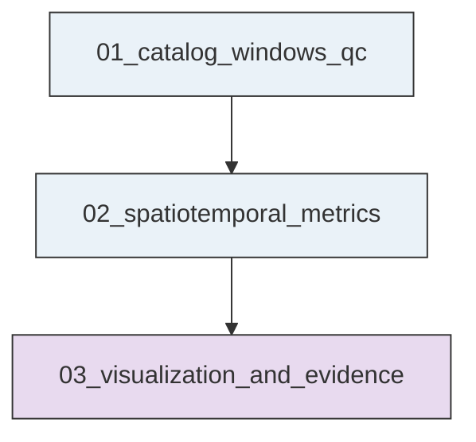
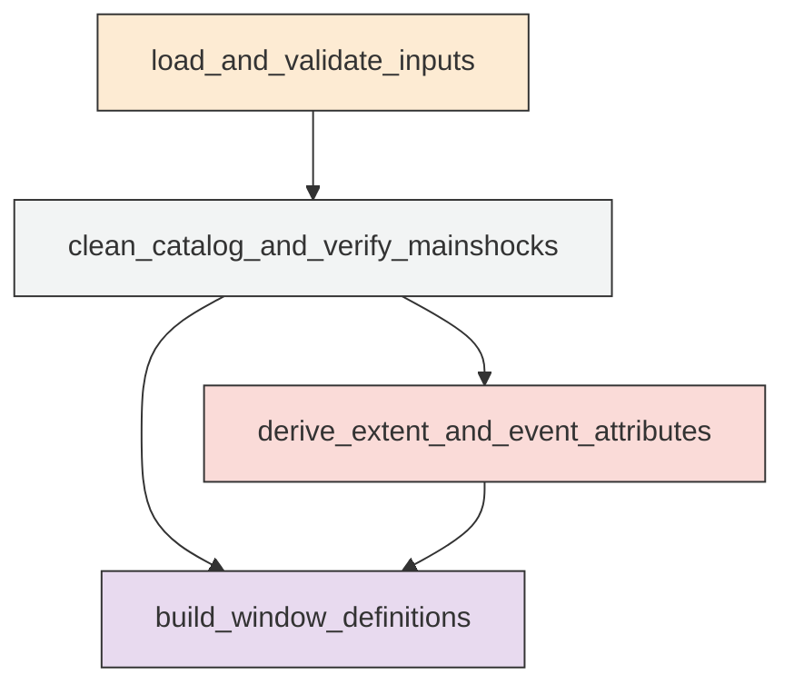
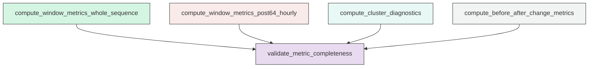
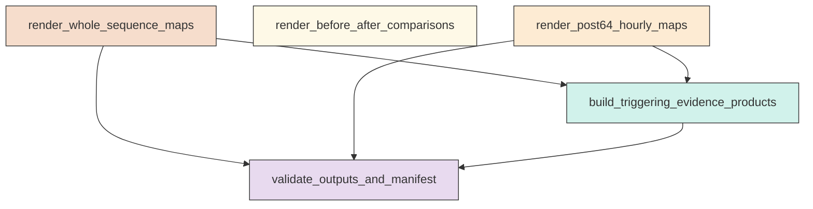

# Research Codings

## Task Overview


**Description:**
- `01_catalog_windows_qc`: Build the validated Ridgecrest catalog, verified mainshock references, common map extent, and reusable time-window tables.
- `02_spatiotemporal_metrics`: Compute window-based migration, orientation, spread, and clustering diagnostics for the Ridgecrest sequence.
- `03_visualization_and_evidence`: Generate all requested map figures, comparison plots, machine-readable evidence summaries, and final validation products.


## Task Details


#### 01_catalog_windows_qc
**Usage**: Build the validated Ridgecrest catalog, verified mainshock references, common map extent, and reusable time-window tables.

**Description:**
- `load_and_validate_inputs`: Read the catalog and mainshock CSV files, verify schema, and parse event times as UTC.
- `clean_catalog_and_verify_mainshocks`: Remove invalid rows, sort events chronologically, identify Mw 6.4 and Mw 7.1 mainshocks, and verify their order.
- `derive_extent_and_event_attributes`: Compute one padded map extent and reusable projected and elapsed-time attributes for all events.
- `build_window_definitions`: Construct complete time-window tables for whole-sequence, comparison, and post-Mw 6.4 analyses.

#### Coding Script

```python

from __future__ import annotations

import json
import math
import os
import sys
import traceback
from dataclasses import dataclass
from pathlib import Path
from typing import Iterable, List

import numpy as np
import pandas as pd


CATALOG_PATH = Path(
    "<REPO_ROOT>/examples/ridgecrest/data/catalog_TRACE/TRACE_ridgecrest_relocated.csv"
)
MAINSHOCK_PATH = Path(
    "<REPO_ROOT>/examples/ridgecrest/data/catalog_TRACE/main_shock_events.csv"
)
OUTPUT_DIR = Path(
    "../exp_run/outputs/01_catalog_windows_qc"
)

EXPECTED_COLUMNS = ["event_time", "latitude", "longitude", "depth_km", "magnitude"]
DERIVED_CATALOG_COLUMNS = [
    "event_time",
    "latitude",
    "longitude",
    "depth_km",
    "magnitude",
    "x_km_local",
    "y_km_local",
    "elapsed_hours_since_mainshock64",
    "elapsed_hours_since_mainshock71",
    "sequence_segment_label",
]
PAD_DEGREES = 0.05
MAX_CORES = min(64, os.cpu_count() or 1)
STALE_OUTPUT_FILENAMES = [
    "ridgecrest_catalog_clean.csv",
    "mainshock_reference_verified.csv",
    "analysis_extent.json",
    "time_windows_whole_sequence.csv",
    "time_windows_post64_hourly.csv",
    "time_windows_comparison_intervals.csv",
    "catalog_qc_summary.json",
]


@dataclass(frozen=True)
class TimeIntervalDef:
    comparison_label: str
    interval_role: str
    start_time: pd.Timestamp
    end_time: pd.Timestamp


def log(message: str) -> None:
    print(message, flush=True)


def ensure_output_dir() -> None:
    OUTPUT_DIR.mkdir(parents=True, exist_ok=True)


def clear_stale_outputs() -> None:
    for name in STALE_OUTPUT_FILENAMES:
        path = OUTPUT_DIR / name
        if path.exists():
            path.unlink()
            log(f"[INFO] Removed stale output: {path}")


def validate_columns(df: pd.DataFrame, path: Path) -> None:
    missing = [c for c in EXPECTED_COLUMNS if c not in df.columns]
    extra = [c for c in df.columns if c not in EXPECTED_COLUMNS]
    if missing:
        raise ValueError(f"Missing required columns in {path}: {missing}")
    if extra:
        log(f"[WARN] Extra columns found in {path.name} and retained only if useful downstream: {extra}")


def read_catalog_csv(path: Path) -> pd.DataFrame:
    log(f"[INFO] Reading CSV: {path}")
    df = pd.read_csv(path)
    validate_columns(df, path)
    return df


def clean_catalog(df: pd.DataFrame, label: str) -> tuple[pd.DataFrame, dict]:
    original_count = len(df)
    qc = {
        "dataset_label": label,
        "rows_original": int(original_count),
        "rows_dropped_missing_required": 0,
        "rows_dropped_invalid_time": 0,
        "rows_dropped_invalid_numeric": 0,
        "rows_dropped_nonfinite_coordinates": 0,
        "rows_final": None,
        "time_min": None,
        "time_max": None,
    }

    working = df.copy()
    working = working[EXPECTED_COLUMNS].copy()

    missing_mask = working[["event_time", "latitude", "longitude"]].isna().any(axis=1)
    qc["rows_dropped_missing_required"] = int(missing_mask.sum())
    working = working.loc[~missing_mask].copy()

    working["event_time"] = pd.to_datetime(working["event_time"], utc=True, errors="coerce")
    invalid_time_mask = working["event_time"].isna()
    qc["rows_dropped_invalid_time"] = int(invalid_time_mask.sum())
    working = working.loc[~invalid_time_mask].copy()

    for col in ["latitude", "longitude", "depth_km", "magnitude"]:
        working[col] = pd.to_numeric(working[col], errors="coerce")

    invalid_numeric_mask = working[["latitude", "longitude", "depth_km", "magnitude"]].isna().any(axis=1)
    qc["rows_dropped_invalid_numeric"] = int(invalid_numeric_mask.sum())
    working = working.loc[~invalid_numeric_mask].copy()

    finite_mask = np.isfinite(working["latitude"]) & np.isfinite(working["longitude"])
    qc["rows_dropped_nonfinite_coordinates"] = int((~finite_mask).sum())
    working = working.loc[finite_mask].copy()

    working = working.sort_values("event_time", kind="mergesort").reset_index(drop=True)

    qc["rows_final"] = int(len(working))
    if len(working) > 0:
        qc["time_min"] = working["event_time"].min().isoformat()
        qc["time_max"] = working["event_time"].max().isoformat()

    log(
        f"[INFO] Cleaned {label}: original={original_count}, final={len(working)}, "
        f"dropped_missing={qc['rows_dropped_missing_required']}, "
        f"dropped_invalid_time={qc['rows_dropped_invalid_time']}, "
        f"dropped_invalid_numeric={qc['rows_dropped_invalid_numeric']}, "
        f"dropped_nonfinite_coords={qc['rows_dropped_nonfinite_coordinates']}"
    )

    return working, qc


def verify_mainshocks(main_df: pd.DataFrame) -> pd.DataFrame:
    log("[INFO] Verifying mainshock reference rows")
    mags = sorted(main_df["magnitude"].round(1).tolist())
    if mags != [6.4, 7.1]:
        raise ValueError(f"Expected mainshock magnitudes [6.4, 7.1], found {mags}")

    ms64 = main_df.loc[np.isclose(main_df["magnitude"], 6.4)].copy()
    ms71 = main_df.loc[np.isclose(main_df["magnitude"], 7.1)].copy()
    if len(ms64) != 1 or len(ms71) != 1:
        raise ValueError("Mainshock reference file must contain exactly one Mw 6.4 row and one Mw 7.1 row")

    ms64 = ms64.iloc[0]
    ms71 = ms71.iloc[0]
    if not ms64["event_time"] < ms71["event_time"]:
        raise ValueError("Mainshock64 time must be earlier than Mainshock71 time")

    verified = pd.DataFrame(
        [
            {
                "mainshock_label": "mainshock64",
                "event_time": ms64["event_time"],
                "latitude": float(ms64["latitude"]),
                "longitude": float(ms64["longitude"]),
                "depth_km": float(ms64["depth_km"]),
                "magnitude": float(ms64["magnitude"]),
            },
            {
                "mainshock_label": "mainshock71",
                "event_time": ms71["event_time"],
                "latitude": float(ms71["latitude"]),
                "longitude": float(ms71["longitude"]),
                "depth_km": float(ms71["depth_km"]),
                "magnitude": float(ms71["magnitude"]),
            },
        ]
    )
    return verified


def build_common_extent(df: pd.DataFrame) -> dict:
    lon_min = float(df["longitude"].min())
    lon_max = float(df["longitude"].max())
    lat_min = float(df["latitude"].min())
    lat_max = float(df["latitude"].max())

    extent = {
        "longitude_min": lon_min - PAD_DEGREES,
        "longitude_max": lon_max + PAD_DEGREES,
        "latitude_min": lat_min - PAD_DEGREES,
        "latitude_max": lat_max + PAD_DEGREES,
        "padding_degrees": PAD_DEGREES,
        "derived_from": "full_clean_catalog",
    }
    return extent


def add_projected_coordinates(df: pd.DataFrame, origin_lon: float, origin_lat: float) -> pd.DataFrame:
    out = df.copy()
    lat_rad = np.deg2rad(out["latitude"].to_numpy())
    lon_rad = np.deg2rad(out["longitude"].to_numpy())
    origin_lat_rad = math.radians(origin_lat)
    origin_lon_rad = math.radians(origin_lon)
    earth_radius_km = 6371.0
    out["x_km_local"] = earth_radius_km * (lon_rad - origin_lon_rad) * math.cos(origin_lat_rad)
    out["y_km_local"] = earth_radius_km * (lat_rad - origin_lat_rad)
    return out


def add_elapsed_times(df: pd.DataFrame, ms64_time: pd.Timestamp, ms71_time: pd.Timestamp) -> pd.DataFrame:
    out = df.copy()
    out["elapsed_hours_since_mainshock64"] = (
        (out["event_time"] - ms64_time).dt.total_seconds() / 3600.0
    )
    out["elapsed_hours_since_mainshock71"] = (
        (out["event_time"] - ms71_time).dt.total_seconds() / 3600.0
    )
    conditions = [
        out["event_time"] < ms64_time,
        (out["event_time"] >= ms64_time) & (out["event_time"] < ms71_time),
        out["event_time"] >= ms71_time,
    ]
    labels = ["pre_mainshock64", "between_mainshock64_mainshock71", "post_mainshock71"]
    out["sequence_segment_label"] = np.select(conditions, labels, default="unclassified")
    return out


def assert_expected_columns(df: pd.DataFrame, expected: list[str], df_name: str) -> None:
    missing = [col for col in expected if col not in df.columns]
    if missing:
        raise ValueError(f"{df_name} is missing required downstream columns: {missing}")


def build_regular_windows(
    family_name: str,
    stage_label: str,
    start_time: pd.Timestamp,
    end_time: pd.Timestamp,
    step: pd.Timedelta,
) -> pd.DataFrame:
    if not start_time < end_time:
        raise ValueError(f"Invalid window bounds for {family_name}/{stage_label}: start >= end")
    starts = list(pd.date_range(start=start_time, end=end_time, freq=step, inclusive="left"))
    records: List[dict] = []
    total_hours = step.total_seconds() / 3600.0
    for idx, win_start in enumerate(starts):
        win_end = min(win_start + step, end_time)
        records.append(
            {
                "window_family": family_name,
                "stage_label": stage_label,
                "window_index": idx,
                "window_label": f"{family_name}_{stage_label}_{idx:04d}",
                "start_time": win_start,
                "end_time": win_end,
                "duration_hours": total_hours,
                "is_terminal_partial_window": bool((win_end - win_start) < step),
            }
        )
    if not records:
        raise ValueError(f"No windows generated for {family_name}/{stage_label}")
    return pd.DataFrame.from_records(records)


def build_comparison_intervals(
    catalog_start: pd.Timestamp,
    ms64_time: pd.Timestamp,
    ms71_time: pd.Timestamp,
) -> pd.DataFrame:
    defs = [
        TimeIntervalDef("mw64", "before", catalog_start, ms64_time),
        TimeIntervalDef("mw64", "after", ms64_time, ms71_time),
        TimeIntervalDef("mw71", "before", ms64_time, ms71_time),
        TimeIntervalDef("mw71", "after", ms71_time, ms71_time + pd.Timedelta(days=2)),
    ]
    records = []
    for item in defs:
        if not item.start_time < item.end_time:
            raise ValueError(
                f"Invalid comparison interval for {item.comparison_label}/{item.interval_role}: start >= end"
            )
        records.append(
            {
                "comparison_label": item.comparison_label,
                "interval_role": item.interval_role,
                "start_time": item.start_time,
                "end_time": item.end_time,
                "duration_hours": (item.end_time - item.start_time).total_seconds() / 3600.0,
            }
        )
    return pd.DataFrame.from_records(records)


def write_csv(df: pd.DataFrame, path: Path) -> None:
    out = df.copy()
    for col in out.columns:
        if pd.api.types.is_datetime64_any_dtype(out[col]):
            out[col] = out[col].dt.strftime("%Y-%m-%dT%H:%M:%S.%fZ")
    out.to_csv(path, index=False)
    log(f"[INFO] Wrote CSV: {path}")


def write_json(obj: dict, path: Path) -> None:
    with open(path, "w", encoding="utf-8") as f:
        json.dump(obj, f, indent=2, sort_keys=True)
    log(f"[INFO] Wrote JSON: {path}")


def summarize_windows(windows: Iterable[pd.DataFrame]) -> dict:
    summary = {}
    for df in windows:
        family = str(df["window_family"].iloc[0])
        stage = str(df["stage_label"].iloc[0])
        summary[f"{family}__{stage}"] = {
            "n_windows": int(len(df)),
            "start_time": df["start_time"].min().isoformat(),
            "end_time": df["end_time"].max().isoformat(),
        }
    return summary


def main() -> None:
    ensure_output_dir()
    clear_stale_outputs()
    log(f"[INFO] Output directory: {OUTPUT_DIR}")
    log(f"[INFO] MAX_CORES setting available for downstream tasks: {MAX_CORES}")

    catalog_raw = read_catalog_csv(CATALOG_PATH)
    mainshock_raw = read_catalog_csv(MAINSHOCK_PATH)

    catalog_clean, catalog_qc = clean_catalog(catalog_raw, "ridgecrest_catalog")
    mainshock_clean, mainshock_qc = clean_catalog(mainshock_raw, "mainshock_reference")

    mainshock_verified = verify_mainshocks(mainshock_clean)
    ms64 = mainshock_verified.loc[mainshock_verified["mainshock_label"] == "mainshock64"].iloc[0]
    ms71 = mainshock_verified.loc[mainshock_verified["mainshock_label"] == "mainshock71"].iloc[0]
    ms64_time = pd.Timestamp(ms64["event_time"])
    ms71_time = pd.Timestamp(ms71["event_time"])

    extent = build_common_extent(catalog_clean)
    origin_lon = 0.5 * (extent["longitude_min"] + extent["longitude_max"])
    origin_lat = 0.5 * (extent["latitude_min"] + extent["latitude_max"])
    extent["projection_origin_longitude"] = origin_lon
    extent["projection_origin_latitude"] = origin_lat

    catalog_enriched = add_projected_coordinates(catalog_clean, origin_lon=origin_lon, origin_lat=origin_lat)
    catalog_enriched = add_elapsed_times(catalog_enriched, ms64_time=ms64_time, ms71_time=ms71_time)
    assert_expected_columns(catalog_enriched, DERIVED_CATALOG_COLUMNS, "catalog_enriched")

    whole_stage_a = build_regular_windows(
        family_name="whole_sequence",
        stage_label="2h_mainshock64_to_mainshock71_plus_1day",
        start_time=ms64_time,
        end_time=ms71_time + pd.Timedelta(days=1),
        step=pd.Timedelta(hours=2),
    )
    whole_stage_b = build_regular_windows(
        family_name="whole_sequence",
        stage_label="6h_mainshock71_plus_1day_to_plus_5days",
        start_time=ms71_time + pd.Timedelta(days=1),
        end_time=ms71_time + pd.Timedelta(days=5),
        step=pd.Timedelta(hours=6),
    )
    time_windows_whole = pd.concat([whole_stage_a, whole_stage_b], ignore_index=True)
    time_windows_whole.insert(0, "global_window_id", np.arange(len(time_windows_whole), dtype=int))

    hourly_post64 = build_regular_windows(
        family_name="post64_hourly",
        stage_label="1h_mainshock64_to_mainshock71",
        start_time=ms64_time,
        end_time=ms71_time,
        step=pd.Timedelta(hours=1),
    )
    hourly_post64.insert(0, "global_window_id", np.arange(len(hourly_post64), dtype=int))

    comparison_intervals = build_comparison_intervals(
        catalog_start=catalog_enriched["event_time"].min(),
        ms64_time=ms64_time,
        ms71_time=ms71_time,
    )
    assert_expected_columns(mainshock_verified, ["mainshock_label", *EXPECTED_COLUMNS], "mainshock_verified")
    assert_expected_columns(
        time_windows_whole,
        [
            "global_window_id",
            "window_family",
            "stage_label",
            "window_index",
            "window_label",
            "start_time",
            "end_time",
            "duration_hours",
            "is_terminal_partial_window",
        ],
        "time_windows_whole",
    )
    assert_expected_columns(
        hourly_post64,
        [
            "global_window_id",
            "window_family",
            "stage_label",
            "window_index",
            "window_label",
            "start_time",
            "end_time",
            "duration_hours",
            "is_terminal_partial_window",
        ],
        "hourly_post64",
    )
    assert_expected_columns(
        comparison_intervals,
        ["comparison_label", "interval_role", "start_time", "end_time", "duration_hours"],
        "comparison_intervals",
    )

    catalog_qc_summary = {
        "catalog_qc": catalog_qc,
        "mainshock_qc": mainshock_qc,
        "verified_mainshocks": {
            row["mainshock_label"]: {
                "event_time": pd.Timestamp(row["event_time"]).isoformat(),
                "latitude": float(row["latitude"]),
                "longitude": float(row["longitude"]),
                "depth_km": float(row["depth_km"]),
                "magnitude": float(row["magnitude"]),
            }
            for _, row in mainshock_verified.iterrows()
        },
        "common_extent": extent,
        "window_summary": {
            **summarize_windows([whole_stage_a, whole_stage_b]),
            "post64_hourly": {
                "n_windows": int(len(hourly_post64)),
                "start_time": hourly_post64["start_time"].min().isoformat(),
                "end_time": hourly_post64["end_time"].max().isoformat(),
            },
            "comparison_intervals": int(len(comparison_intervals)),
        },
        "notes": {
            "interval_convention": "half_open_start_inclusive_end_exclusive",
            "spatial_projection": "local_equirectangular_km",
            "max_cores_available_for_downstream_tasks": MAX_CORES,
        },
    }

    write_csv(catalog_enriched, OUTPUT_DIR / "ridgecrest_catalog_clean.csv")
    write_csv(mainshock_verified, OUTPUT_DIR / "mainshock_reference_verified.csv")
    write_json(extent, OUTPUT_DIR / "analysis_extent.json")
    write_csv(time_windows_whole, OUTPUT_DIR / "time_windows_whole_sequence.csv")
    write_csv(hourly_post64, OUTPUT_DIR / "time_windows_post64_hourly.csv")
    write_csv(comparison_intervals, OUTPUT_DIR / "time_windows_comparison_intervals.csv")
    write_json(catalog_qc_summary, OUTPUT_DIR / "catalog_qc_summary.json")

    log("[INFO] Task 01_catalog_windows_qc completed successfully")


if __name__ == "__main__":
    try:
        main()
    except Exception:
        print(traceback.format_exc(), flush=True)
        sys.exit(1)


```

#### 02_spatiotemporal_metrics
**Usage**: Compute window-based migration, orientation, spread, and clustering diagnostics for the Ridgecrest sequence.

**Description:**
- `compute_window_metrics_whole_sequence`: Calculate per-window counts, centroid, spread, orientation, and distance metrics for whole-sequence windows.
- `compute_window_metrics_post64_hourly`: Calculate hourly centroid, spread, orientation, and migration metrics for the post-Mw 6.4 sequence.
- `compute_cluster_diagnostics`: Estimate per-window cluster structure and simultaneous activation diagnostics using fixed projected-space settings.
- `compute_before_after_change_metrics`: Quantify centroid shifts, orientation changes, area changes, and density-center shifts around the two mainshocks.
- `validate_metric_completeness`: Check that all expected windows and comparison intervals have metrics or explicit insufficient-data flags.

#### Coding Script

```python

from __future__ import annotations

import json
import math
import os
import sys
import traceback
from dataclasses import dataclass
from pathlib import Path
from typing import Any

import numpy as np
import pandas as pd
from joblib import Parallel, delayed
from scipy.spatial import ConvexHull, QhullError
from sklearn.cluster import DBSCAN

INPUT_DIR = Path(
    "../exp_run/outputs/01_catalog_windows_qc"
)
OUTPUT_DIR = Path(
    "../exp_run/outputs/02_spatiotemporal_metrics"
)
SCRIPT_PATH = Path(
    "../exp_run/scripts/02_spatiotemporal_metrics.py"
)

CATALOG_CLEAN_PATH = INPUT_DIR / "ridgecrest_catalog_clean.csv"
MAINSHOCK_PATH = INPUT_DIR / "mainshock_reference_verified.csv"
WHOLE_WINDOWS_PATH = INPUT_DIR / "time_windows_whole_sequence.csv"
POST64_WINDOWS_PATH = INPUT_DIR / "time_windows_post64_hourly.csv"
COMPARISON_PATH = INPUT_DIR / "time_windows_comparison_intervals.csv"
EXTENT_PATH = INPUT_DIR / "analysis_extent.json"

MAX_CORES = min(64, os.cpu_count() or 1)
N_JOBS = max(1, min(MAX_CORES, 16))
ORIENTATION_MIN_EVENTS = 3
AREA_MIN_EVENTS = 3
CLUSTER_MIN_EVENTS = 5
DBSCAN_EPS_KM = 2.5
DBSCAN_MIN_SAMPLES = 12
GRID_STEP_KM = 2.0
HOTSPOT_BANDWIDTH_KM = 3.0
COMPARISON_INTERVAL_METRIC_COLUMNS = [
    "comparison_label",
    "interval_role",
    "start_time",
    "end_time",
    "duration_hours",
    "n_events",
    "magnitude_min",
    "magnitude_max",
    "magnitude_mean",
    "magnitude_median",
    "depth_mean_km",
    "depth_median_km",
    "centroid_x_km_local",
    "centroid_y_km_local",
    "centroid_longitude",
    "centroid_latitude",
    "principal_axis_azimuth_deg",
    "major_spread_km",
    "minor_spread_km",
    "anisotropy_ratio",
    "spatial_footprint_area_km2",
    "along_strike_centroid_km",
    "cross_strike_centroid_km",
    "along_strike_spread_km",
    "cross_strike_spread_km",
    "centroid_distance_to_mainshock64_km",
    "centroid_azimuth_from_mainshock64_deg",
    "centroid_distance_to_mainshock71_km",
    "centroid_azimuth_from_mainshock71_deg",
    "hotspot_x_km_local",
    "hotspot_y_km_local",
    "hotspot_density_value",
]
COMPARISON_CHANGE_COLUMNS = [
    "comparison_label",
    "before_interval_role",
    "after_interval_role",
    "before_event_count",
    "after_event_count",
    "event_count_change",
    "centroid_shift_dx_km",
    "centroid_shift_dy_km",
    "centroid_shift_distance_km",
    "centroid_shift_azimuth_deg",
    "principal_axis_orientation_change_deg",
    "occupied_area_change_km2",
    "along_strike_centroid_change_km",
    "cross_strike_centroid_change_km",
    "hotspot_shift_dx_km",
    "hotspot_shift_dy_km",
    "hotspot_shift_distance_km",
    "hotspot_shift_azimuth_deg",
]
STALE_OUTPUT_FILENAMES = [
    "window_metrics_whole_sequence.csv",
    "window_metrics_post64_hourly.csv",
    "window_cluster_metrics_whole_sequence.csv",
    "window_cluster_metrics_post64_hourly.csv",
    "comparison_metrics_64.csv",
    "comparison_metrics_71.csv",
    "migration_summary_64_to_71.json",
    "migration_summary_post71.json",
    "metrics_runtime_config.json",
]

REQUIRED_CATALOG_COLUMNS = [
    "event_time",
    "latitude",
    "longitude",
    "depth_km",
    "magnitude",
    "x_km_local",
    "y_km_local",
    "elapsed_hours_since_mainshock64",
    "elapsed_hours_since_mainshock71",
    "sequence_segment_label",
]
REQUIRED_WINDOW_COLUMNS = [
    "global_window_id",
    "window_family",
    "stage_label",
    "window_index",
    "window_label",
    "start_time",
    "end_time",
    "duration_hours",
    "is_terminal_partial_window",
]
REQUIRED_COMPARISON_COLUMNS = [
    "comparison_label",
    "interval_role",
    "start_time",
    "end_time",
    "duration_hours",
]


@dataclass(frozen=True)
class MainshockRef:
    label: str
    time: pd.Timestamp
    longitude: float
    latitude: float
    x_km_local: float
    y_km_local: float


@dataclass(frozen=True)
class AxisReference:
    ux: float
    uy: float
    vx: float
    vy: float
    azimuth_deg: float
    length_km: float


def log(message: str) -> None:
    print(message, flush=True)


def ensure_output_dir() -> None:
    OUTPUT_DIR.mkdir(parents=True, exist_ok=True)


def clear_stale_outputs() -> None:
    for name in STALE_OUTPUT_FILENAMES:
        path = OUTPUT_DIR / name
        if path.exists():
            path.unlink()
            log(f"[INFO] Removed stale output: {path}")


def read_json(path: Path) -> dict[str, Any]:
    with open(path, "r", encoding="utf-8") as f:
        return json.load(f)


def parse_time_columns(df: pd.DataFrame, columns: list[str]) -> pd.DataFrame:
    out = df.copy()
    for col in columns:
        out[col] = pd.to_datetime(out[col], utc=True, errors="raise")
    return out


def assert_columns(df: pd.DataFrame, expected: list[str], df_name: str) -> None:
    missing = [col for col in expected if col not in df.columns]
    if missing:
        raise ValueError(f"{df_name} missing required columns: {missing}")


def read_catalog() -> pd.DataFrame:
    log(f"[INFO] Reading catalog: {CATALOG_CLEAN_PATH}")
    df = pd.read_csv(CATALOG_CLEAN_PATH)
    assert_columns(df, REQUIRED_CATALOG_COLUMNS, "catalog")
    df = parse_time_columns(df, ["event_time"])
    for col in [
        "latitude",
        "longitude",
        "depth_km",
        "magnitude",
        "x_km_local",
        "y_km_local",
        "elapsed_hours_since_mainshock64",
        "elapsed_hours_since_mainshock71",
    ]:
        df[col] = pd.to_numeric(df[col], errors="raise")
    df = df.sort_values("event_time", kind="mergesort").reset_index(drop=True)
    return df


def read_mainshocks(catalog: pd.DataFrame) -> dict[str, MainshockRef]:
    log(f"[INFO] Reading mainshock reference: {MAINSHOCK_PATH}")
    df = pd.read_csv(MAINSHOCK_PATH)
    assert_columns(df, ["mainshock_label", "event_time", "latitude", "longitude", "depth_km", "magnitude"], "mainshocks")
    df = parse_time_columns(df, ["event_time"])
    refs: dict[str, MainshockRef] = {}
    for _, row in df.iterrows():
        lon = float(row["longitude"])
        lat = float(row["latitude"])
        x, y = project_to_local_xy(
            longitude=np.array([lon]),
            latitude=np.array([lat]),
            origin_lon=float(catalog.attrs["projection_origin_longitude"]),
            origin_lat=float(catalog.attrs["projection_origin_latitude"]),
        )
        refs[str(row["mainshock_label"])] = MainshockRef(
            label=str(row["mainshock_label"]),
            time=pd.Timestamp(row["event_time"]),
            longitude=lon,
            latitude=lat,
            x_km_local=float(x[0]),
            y_km_local=float(y[0]),
        )
    if set(refs) != {"mainshock64", "mainshock71"}:
        raise ValueError(f"Unexpected mainshock labels: {sorted(refs)}")
    return refs


def read_windows(path: Path, expected: list[str], label: str) -> pd.DataFrame:
    log(f"[INFO] Reading {label}: {path}")
    df = pd.read_csv(path)
    assert_columns(df, expected, label)
    time_cols = [col for col in ["start_time", "end_time"] if col in df.columns]
    df = parse_time_columns(df, time_cols)
    return df


def project_to_local_xy(longitude: np.ndarray, latitude: np.ndarray, origin_lon: float, origin_lat: float) -> tuple[np.ndarray, np.ndarray]:
    earth_radius_km = 6371.0
    lon_rad = np.deg2rad(longitude)
    lat_rad = np.deg2rad(latitude)
    origin_lon_rad = math.radians(origin_lon)
    origin_lat_rad = math.radians(origin_lat)
    x = earth_radius_km * (lon_rad - origin_lon_rad) * math.cos(origin_lat_rad)
    y = earth_radius_km * (lat_rad - origin_lat_rad)
    return x, y


def attach_projection_origin(catalog: pd.DataFrame, extent: dict[str, Any]) -> pd.DataFrame:
    required_keys = ["projection_origin_longitude", "projection_origin_latitude"]
    missing = [key for key in required_keys if key not in extent]
    if missing:
        raise ValueError(f"analysis_extent.json missing required keys: {missing}")
    out = catalog.copy()
    out.attrs["projection_origin_longitude"] = float(extent["projection_origin_longitude"])
    out.attrs["projection_origin_latitude"] = float(extent["projection_origin_latitude"])
    return out


def compute_axis_reference(ms64: MainshockRef, ms71: MainshockRef) -> AxisReference:
    dx = ms71.x_km_local - ms64.x_km_local
    dy = ms71.y_km_local - ms64.y_km_local
    length = float(math.hypot(dx, dy))
    if length <= 0.0:
        raise ValueError("Mainshock64 and Mainshock71 epicenters are colocated in projected coordinates")
    ux = dx / length
    uy = dy / length
    vx = -uy
    vy = ux
    azimuth = azimuth_from_components(dx, dy)
    return AxisReference(ux=ux, uy=uy, vx=vx, vy=vy, azimuth_deg=azimuth, length_km=length)


def azimuth_from_components(dx: float, dy: float) -> float:
    return float((math.degrees(math.atan2(dx, dy)) + 360.0) % 360.0)


def circular_difference_deg(a: float | None, b: float | None) -> float | None:
    if a is None or b is None or pd.isna(a) or pd.isna(b):
        return None
    diff = (float(a) - float(b) + 180.0) % 360.0 - 180.0
    return float(abs(diff))


def robust_area_km2(x: np.ndarray, y: np.ndarray) -> float | None:
    if len(x) < AREA_MIN_EVENTS:
        return None
    points = np.column_stack([x, y])
    if np.allclose(points[:, 0], points[0, 0]) and np.allclose(points[:, 1], points[0, 1]):
        return 0.0
    try:
        hull = ConvexHull(points)
        return float(hull.volume)
    except QhullError:
        return None


def principal_axis_metrics(x: np.ndarray, y: np.ndarray) -> dict[str, float | None]:
    if len(x) < ORIENTATION_MIN_EVENTS:
        return {
            "principal_axis_azimuth_deg": None,
            "major_spread_km": None,
            "minor_spread_km": None,
            "anisotropy_ratio": None,
        }
    coords = np.column_stack([x, y])
    centered = coords - coords.mean(axis=0, keepdims=True)
    cov = np.cov(centered, rowvar=False)
    if cov.shape != (2, 2) or not np.all(np.isfinite(cov)):
        return {
            "principal_axis_azimuth_deg": None,
            "major_spread_km": None,
            "minor_spread_km": None,
            "anisotropy_ratio": None,
        }
    eigvals, eigvecs = np.linalg.eigh(cov)
    order = np.argsort(eigvals)[::-1]
    eigvals = eigvals[order]
    eigvecs = eigvecs[:, order]
    major = max(float(eigvals[0]), 0.0)
    minor = max(float(eigvals[1]), 0.0)
    major_vec = eigvecs[:, 0]
    azimuth = azimuth_from_components(float(major_vec[0]), float(major_vec[1]))
    major_spread = math.sqrt(major)
    minor_spread = math.sqrt(minor)
    ratio = None if minor_spread == 0.0 else float(major_spread / minor_spread)
    return {
        "principal_axis_azimuth_deg": float(azimuth),
        "major_spread_km": float(major_spread),
        "minor_spread_km": float(minor_spread),
        "anisotropy_ratio": ratio,
    }


def centroid_metrics(x: np.ndarray, y: np.ndarray, lon: np.ndarray, lat: np.ndarray) -> dict[str, float | None]:
    if len(x) == 0:
        return {
            "centroid_x_km_local": None,
            "centroid_y_km_local": None,
            "centroid_longitude": None,
            "centroid_latitude": None,
        }
    return {
        "centroid_x_km_local": float(np.mean(x)),
        "centroid_y_km_local": float(np.mean(y)),
        "centroid_longitude": float(np.mean(lon)),
        "centroid_latitude": float(np.mean(lat)),
    }


def distance_and_azimuth_from_point(cx: float | None, cy: float | None, px: float, py: float) -> tuple[float | None, float | None]:
    if cx is None or cy is None:
        return None, None
    dx = float(cx - px)
    dy = float(cy - py)
    return float(math.hypot(dx, dy)), azimuth_from_components(dx, dy)


def axis_projection_metrics(x: np.ndarray, y: np.ndarray, origin_x: float, origin_y: float, axis_ref: AxisReference) -> dict[str, float | None]:
    if len(x) == 0:
        return {
            "along_strike_centroid_km": None,
            "cross_strike_centroid_km": None,
            "along_strike_spread_km": None,
            "cross_strike_spread_km": None,
        }
    dx = x - origin_x
    dy = y - origin_y
    along = dx * axis_ref.ux + dy * axis_ref.uy
    cross = dx * axis_ref.vx + dy * axis_ref.vy
    return {
        "along_strike_centroid_km": float(np.mean(along)),
        "cross_strike_centroid_km": float(np.mean(cross)),
        "along_strike_spread_km": float(np.std(along, ddof=1)) if len(along) >= 2 else 0.0,
        "cross_strike_spread_km": float(np.std(cross, ddof=1)) if len(cross) >= 2 else 0.0,
    }


def summarize_magnitudes(mag: np.ndarray, depth: np.ndarray) -> dict[str, float | None]:
    if len(mag) == 0:
        return {
            "magnitude_min": None,
            "magnitude_max": None,
            "magnitude_mean": None,
            "magnitude_median": None,
            "depth_mean_km": None,
            "depth_median_km": None,
        }
    return {
        "magnitude_min": float(np.min(mag)),
        "magnitude_max": float(np.max(mag)),
        "magnitude_mean": float(np.mean(mag)),
        "magnitude_median": float(np.median(mag)),
        "depth_mean_km": float(np.mean(depth)),
        "depth_median_km": float(np.median(depth)),
    }


def density_center(x: np.ndarray, y: np.ndarray, step_km: float, bandwidth_km: float) -> tuple[float | None, float | None, float | None]:
    if len(x) == 0:
        return None, None, None
    if len(x) == 1:
        return float(x[0]), float(y[0]), 1.0
    xmin, xmax = float(np.min(x)), float(np.max(x))
    ymin, ymax = float(np.min(y)), float(np.max(y))
    x_grid = np.arange(xmin - step_km, xmax + step_km + step_km, step_km)
    y_grid = np.arange(ymin - step_km, ymax + step_km + step_km, step_km)
    xx, yy = np.meshgrid(x_grid, y_grid)
    dens = np.zeros_like(xx, dtype=float)
    inv_two_sigma2 = 1.0 / (2.0 * bandwidth_km * bandwidth_km)
    for xi, yi in zip(x, y):
        dens += np.exp(-(((xx - xi) ** 2 + (yy - yi) ** 2) * inv_two_sigma2))
    idx = np.unravel_index(np.argmax(dens), dens.shape)
    return float(xx[idx]), float(yy[idx]), float(dens[idx])


def compute_window_metrics_record(
    window_row: dict[str, Any],
    catalog: pd.DataFrame,
    ms64: MainshockRef,
    ms71: MainshockRef,
    axis_ref: AxisReference,
) -> dict[str, Any]:
    start = pd.Timestamp(window_row["start_time"])
    end = pd.Timestamp(window_row["end_time"])
    subset = catalog.loc[(catalog["event_time"] >= start) & (catalog["event_time"] < end)].copy()
    n_events = int(len(subset))

    x = subset["x_km_local"].to_numpy(dtype=float)
    y = subset["y_km_local"].to_numpy(dtype=float)
    lon = subset["longitude"].to_numpy(dtype=float)
    lat = subset["latitude"].to_numpy(dtype=float)
    mag = subset["magnitude"].to_numpy(dtype=float)
    depth = subset["depth_km"].to_numpy(dtype=float)

    centroid = centroid_metrics(x, y, lon, lat)
    axis_metrics = principal_axis_metrics(x, y)
    area = robust_area_km2(x, y)
    mag_metrics = summarize_magnitudes(mag, depth)
    proj_metrics = axis_projection_metrics(x, y, ms64.x_km_local, ms64.y_km_local, axis_ref)

    dist64, az64 = distance_and_azimuth_from_point(
        centroid["centroid_x_km_local"], centroid["centroid_y_km_local"], ms64.x_km_local, ms64.y_km_local
    )
    dist71, az71 = distance_and_azimuth_from_point(
        centroid["centroid_x_km_local"], centroid["centroid_y_km_local"], ms71.x_km_local, ms71.y_km_local
    )

    record = {
        **window_row,
        "n_events": n_events,
        **mag_metrics,
        **centroid,
        **axis_metrics,
        "spatial_footprint_area_km2": area,
        **proj_metrics,
        "centroid_distance_to_mainshock64_km": dist64,
        "centroid_azimuth_from_mainshock64_deg": az64,
        "centroid_distance_to_mainshock71_km": dist71,
        "centroid_azimuth_from_mainshock71_deg": az71,
        "window_mid_time": start + (end - start) / 2,
        "window_start_hours_since_mainshock64": (start - ms64.time).total_seconds() / 3600.0,
        "window_end_hours_since_mainshock64": (end - ms64.time).total_seconds() / 3600.0,
        "window_start_hours_since_mainshock71": (start - ms71.time).total_seconds() / 3600.0,
        "window_end_hours_since_mainshock71": (end - ms71.time).total_seconds() / 3600.0,
        "orientation_event_count_sufficient": bool(n_events >= ORIENTATION_MIN_EVENTS),
        "cluster_event_count_sufficient": bool(n_events >= CLUSTER_MIN_EVENTS),
    }
    return record


def compute_cluster_metrics_record(
    window_row: dict[str, Any],
    catalog: pd.DataFrame,
    ms64: MainshockRef,
    axis_ref: AxisReference,
) -> dict[str, Any]:
    start = pd.Timestamp(window_row["start_time"])
    end = pd.Timestamp(window_row["end_time"])
    subset = catalog.loc[(catalog["event_time"] >= start) & (catalog["event_time"] < end)].copy()
    n_events = int(len(subset))

    base_record = {
        "global_window_id": int(window_row["global_window_id"]),
        "window_family": window_row["window_family"],
        "stage_label": window_row["stage_label"],
        "window_index": int(window_row["window_index"]),
        "window_label": window_row["window_label"],
        "start_time": start,
        "end_time": end,
        "n_events": n_events,
        "dbscan_eps_km": DBSCAN_EPS_KM,
        "dbscan_min_samples": DBSCAN_MIN_SAMPLES,
        "n_clusters": 0,
        "n_noise_events": n_events,
        "clustered_event_fraction": 0.0 if n_events > 0 else None,
        "dominant_cluster_fraction": None,
        "dominant_cluster_event_count": None,
        "dominant_cluster_centroid_longitude": None,
        "dominant_cluster_centroid_latitude": None,
        "dominant_cluster_centroid_x_km_local": None,
        "dominant_cluster_centroid_y_km_local": None,
        "dominant_cluster_azimuth_from_mainshock64_deg": None,
        "dominant_cluster_distance_from_mainshock64_km": None,
        "dominant_cluster_along_strike_km": None,
        "dominant_cluster_cross_strike_km": None,
        "cluster_size_json": json.dumps([], sort_keys=True),
        "cluster_centroids_json": json.dumps([], sort_keys=True),
        "cluster_azimuths_from_mainshock64_json": json.dumps([], sort_keys=True),
    }
    if n_events < CLUSTER_MIN_EVENTS:
        return base_record

    coords = subset[["x_km_local", "y_km_local"]].to_numpy(dtype=float)
    labels = DBSCAN(eps=DBSCAN_EPS_KM, min_samples=DBSCAN_MIN_SAMPLES, n_jobs=1).fit_predict(coords)
    unique_clusters = sorted([int(v) for v in np.unique(labels) if v >= 0])
    n_noise = int(np.sum(labels < 0))
    cluster_sizes: list[dict[str, Any]] = []
    centroid_payload: list[dict[str, Any]] = []
    az_payload: list[dict[str, Any]] = []
    dominant_label = None
    dominant_size = -1
    dominant_info: dict[str, Any] | None = None

    for cluster_id in unique_clusters:
        mask = labels == cluster_id
        cluster = subset.loc[mask].copy()
        size = int(len(cluster))
        cx = float(cluster["x_km_local"].mean())
        cy = float(cluster["y_km_local"].mean())
        clon = float(cluster["longitude"].mean())
        clat = float(cluster["latitude"].mean())
        dist, az = distance_and_azimuth_from_point(cx, cy, ms64.x_km_local, ms64.y_km_local)
        along = (cx - ms64.x_km_local) * axis_ref.ux + (cy - ms64.y_km_local) * axis_ref.uy
        cross = (cx - ms64.x_km_local) * axis_ref.vx + (cy - ms64.y_km_local) * axis_ref.vy
        cluster_sizes.append({"cluster_id": cluster_id, "n_events": size})
        centroid_payload.append(
            {
                "cluster_id": cluster_id,
                "x_km_local": cx,
                "y_km_local": cy,
                "longitude": clon,
                "latitude": clat,
                "n_events": size,
                "along_strike_km": float(along),
                "cross_strike_km": float(cross),
            }
        )
        az_payload.append(
            {
                "cluster_id": cluster_id,
                "azimuth_from_mainshock64_deg": az,
                "distance_from_mainshock64_km": dist,
            }
        )
        if size > dominant_size:
            dominant_label = cluster_id
            dominant_size = size
            dominant_info = {
                "centroid_longitude": clon,
                "centroid_latitude": clat,
                "centroid_x_km_local": cx,
                "centroid_y_km_local": cy,
                "azimuth": az,
                "distance": dist,
                "along": float(along),
                "cross": float(cross),
            }

    clustered_events = int(np.sum(labels >= 0))
    base_record["n_clusters"] = int(len(unique_clusters))
    base_record["n_noise_events"] = n_noise
    base_record["clustered_event_fraction"] = float(clustered_events / n_events) if n_events > 0 else None
    if dominant_label is not None and dominant_info is not None:
        base_record["dominant_cluster_fraction"] = float(dominant_size / n_events)
        base_record["dominant_cluster_event_count"] = int(dominant_size)
        base_record["dominant_cluster_centroid_longitude"] = float(dominant_info["centroid_longitude"])
        base_record["dominant_cluster_centroid_latitude"] = float(dominant_info["centroid_latitude"])
        base_record["dominant_cluster_centroid_x_km_local"] = float(dominant_info["centroid_x_km_local"])
        base_record["dominant_cluster_centroid_y_km_local"] = float(dominant_info["centroid_y_km_local"])
        base_record["dominant_cluster_azimuth_from_mainshock64_deg"] = dominant_info["azimuth"]
        base_record["dominant_cluster_distance_from_mainshock64_km"] = dominant_info["distance"]
        base_record["dominant_cluster_along_strike_km"] = float(dominant_info["along"])
        base_record["dominant_cluster_cross_strike_km"] = float(dominant_info["cross"])
    base_record["cluster_size_json"] = json.dumps(cluster_sizes, sort_keys=True)
    base_record["cluster_centroids_json"] = json.dumps(centroid_payload, sort_keys=True)
    base_record["cluster_azimuths_from_mainshock64_json"] = json.dumps(az_payload, sort_keys=True)
    return base_record


def add_consecutive_migration_metrics(metrics_df: pd.DataFrame, stage_group_columns: list[str]) -> pd.DataFrame:
    assert_columns(
        metrics_df,
        [
            *stage_group_columns,
            "window_index",
            "centroid_x_km_local",
            "centroid_y_km_local",
            "principal_axis_azimuth_deg",
        ],
        "metrics_df_before_migration",
    )
    out = metrics_df.sort_values(stage_group_columns + ["window_index"], kind="mergesort").copy()
    out["prev_centroid_x_km_local"] = out.groupby(stage_group_columns)["centroid_x_km_local"].shift(1)
    out["prev_centroid_y_km_local"] = out.groupby(stage_group_columns)["centroid_y_km_local"].shift(1)
    out["prev_principal_axis_azimuth_deg"] = out.groupby(stage_group_columns)["principal_axis_azimuth_deg"].shift(1)
    dx = out["centroid_x_km_local"] - out["prev_centroid_x_km_local"]
    dy = out["centroid_y_km_local"] - out["prev_centroid_y_km_local"]
    valid = dx.notna() & dy.notna()
    out["centroid_step_dx_km"] = np.where(valid, dx, np.nan)
    out["centroid_step_dy_km"] = np.where(valid, dy, np.nan)
    out["centroid_step_distance_km"] = np.where(valid, np.hypot(dx, dy), np.nan)
    out["centroid_step_azimuth_deg"] = np.where(valid, np.degrees(np.arctan2(dx, dy)), np.nan)
    out["centroid_step_azimuth_deg"] = (out["centroid_step_azimuth_deg"] + 360.0) % 360.0
    out["principal_axis_azimuth_change_deg"] = [
        circular_difference_deg(a, b)
        for a, b in zip(out["principal_axis_azimuth_deg"], out["prev_principal_axis_azimuth_deg"])
    ]
    out["cumulative_centroid_distance_km"] = out.groupby(stage_group_columns)["centroid_step_distance_km"].transform(
        lambda s: s.fillna(0.0).cumsum()
    )
    return out


def compute_window_family_metrics(
    windows_df: pd.DataFrame,
    catalog: pd.DataFrame,
    ms64: MainshockRef,
    ms71: MainshockRef,
    axis_ref: AxisReference,
    family_label: str,
) -> tuple[pd.DataFrame, pd.DataFrame]:
    assert_columns(windows_df, REQUIRED_WINDOW_COLUMNS, f"{family_label}_windows_df")
    assert_columns(catalog, REQUIRED_CATALOG_COLUMNS, f"{family_label}_catalog")
    log(f"[INFO] Computing window metrics for {family_label}: n_windows={len(windows_df)}, n_jobs={N_JOBS}")
    rows = windows_df.to_dict(orient="records")
    metric_records = Parallel(n_jobs=N_JOBS, backend="loky", verbose=0)(
        delayed(compute_window_metrics_record)(row, catalog, ms64, ms71, axis_ref) for row in rows
    )
    cluster_records = Parallel(n_jobs=N_JOBS, backend="loky", verbose=0)(
        delayed(compute_cluster_metrics_record)(row, catalog, ms64, axis_ref) for row in rows
    )
    metrics_df = pd.DataFrame(metric_records)
    cluster_df = pd.DataFrame(cluster_records)
    assert_columns(
        metrics_df,
        [
            *REQUIRED_WINDOW_COLUMNS,
            "n_events",
            "centroid_x_km_local",
            "centroid_y_km_local",
            "principal_axis_azimuth_deg",
        ],
        f"{family_label}_metrics_df",
    )
    assert_columns(
        cluster_df,
        [
            "global_window_id",
            "window_family",
            "stage_label",
            "window_index",
            "window_label",
            "start_time",
            "end_time",
            "n_events",
            "n_clusters",
            "dominant_cluster_fraction",
            "clustered_event_fraction",
        ],
        f"{family_label}_cluster_df",
    )
    metrics_df = add_consecutive_migration_metrics(metrics_df, ["window_family", "stage_label"])
    log(f"[INFO] Completed {family_label}: metrics_rows={len(metrics_df)}, cluster_rows={len(cluster_df)}")
    return metrics_df, cluster_df


def compute_interval_summary(
    subset: pd.DataFrame,
    label: str,
    role: str,
    ms64: MainshockRef,
    ms71: MainshockRef,
    axis_ref: AxisReference,
) -> dict[str, Any]:
    n_events = int(len(subset))
    x = subset["x_km_local"].to_numpy(dtype=float)
    y = subset["y_km_local"].to_numpy(dtype=float)
    lon = subset["longitude"].to_numpy(dtype=float)
    lat = subset["latitude"].to_numpy(dtype=float)
    mag = subset["magnitude"].to_numpy(dtype=float)
    depth = subset["depth_km"].to_numpy(dtype=float)

    centroid = centroid_metrics(x, y, lon, lat)
    axis_metrics = principal_axis_metrics(x, y)
    proj_metrics = axis_projection_metrics(x, y, ms64.x_km_local, ms64.y_km_local, axis_ref)
    mag_metrics = summarize_magnitudes(mag, depth)
    area = robust_area_km2(x, y)
    d64, a64 = distance_and_azimuth_from_point(
        centroid["centroid_x_km_local"], centroid["centroid_y_km_local"], ms64.x_km_local, ms64.y_km_local
    )
    d71, a71 = distance_and_azimuth_from_point(
        centroid["centroid_x_km_local"], centroid["centroid_y_km_local"], ms71.x_km_local, ms71.y_km_local
    )
    hx, hy, hd = density_center(x, y, step_km=GRID_STEP_KM, bandwidth_km=HOTSPOT_BANDWIDTH_KM)
    return {
        "comparison_label": label,
        "interval_role": role,
        "n_events": n_events,
        **mag_metrics,
        **centroid,
        **axis_metrics,
        "spatial_footprint_area_km2": area,
        **proj_metrics,
        "centroid_distance_to_mainshock64_km": d64,
        "centroid_azimuth_from_mainshock64_deg": a64,
        "centroid_distance_to_mainshock71_km": d71,
        "centroid_azimuth_from_mainshock71_deg": a71,
        "hotspot_x_km_local": hx,
        "hotspot_y_km_local": hy,
        "hotspot_density_value": hd,
    }


def finalize_comparison_metrics(
    intervals_df: pd.DataFrame,
    catalog: pd.DataFrame,
    ms64: MainshockRef,
    ms71: MainshockRef,
    axis_ref: AxisReference,
) -> tuple[pd.DataFrame, pd.DataFrame]:
    records = []
    for _, row in intervals_df.iterrows():
        start = pd.Timestamp(row["start_time"])
        end = pd.Timestamp(row["end_time"])
        subset = catalog.loc[(catalog["event_time"] >= start) & (catalog["event_time"] < end)].copy()
        rec = compute_interval_summary(
            subset=subset,
            label=str(row["comparison_label"]),
            role=str(row["interval_role"]),
            ms64=ms64,
            ms71=ms71,
            axis_ref=axis_ref,
        )
        rec["start_time"] = start
        rec["end_time"] = end
        rec["duration_hours"] = float(row["duration_hours"])
        records.append(rec)
    df = pd.DataFrame(records).sort_values(["comparison_label", "interval_role"], kind="mergesort").reset_index(drop=True)
    assert_columns(df, COMPARISON_INTERVAL_METRIC_COLUMNS, "comparison_interval_metrics")

    change_rows = []
    for label, group in df.groupby("comparison_label", sort=False):
        before = group.loc[group["interval_role"] == "before"]
        after = group.loc[group["interval_role"] == "after"]
        if len(before) != 1 or len(after) != 1:
            raise ValueError(f"Expected one before and one after interval for comparison {label}")
        b = before.iloc[0]
        a = after.iloc[0]
        dx = None
        dy = None
        dist = None
        az = None
        if pd.notna(b["centroid_x_km_local"]) and pd.notna(a["centroid_x_km_local"]):
            dx = float(a["centroid_x_km_local"] - b["centroid_x_km_local"])
            dy = float(a["centroid_y_km_local"] - b["centroid_y_km_local"])
            dist = float(math.hypot(dx, dy))
            az = azimuth_from_components(dx, dy)
        hdx = None
        hdy = None
        hdist = None
        haz = None
        if pd.notna(b["hotspot_x_km_local"]) and pd.notna(a["hotspot_x_km_local"]):
            hdx = float(a["hotspot_x_km_local"] - b["hotspot_x_km_local"])
            hdy = float(a["hotspot_y_km_local"] - b["hotspot_y_km_local"])
            hdist = float(math.hypot(hdx, hdy))
            haz = azimuth_from_components(hdx, hdy)
        change_rows.append(
            {
                "comparison_label": label,
                "before_interval_role": "before",
                "after_interval_role": "after",
                "before_event_count": int(b["n_events"]),
                "after_event_count": int(a["n_events"]),
                "event_count_change": int(a["n_events"] - b["n_events"]),
                "centroid_shift_dx_km": dx,
                "centroid_shift_dy_km": dy,
                "centroid_shift_distance_km": dist,
                "centroid_shift_azimuth_deg": az,
                "principal_axis_orientation_change_deg": circular_difference_deg(
                    a["principal_axis_azimuth_deg"], b["principal_axis_azimuth_deg"]
                ),
                "occupied_area_change_km2": (
                    float(a["spatial_footprint_area_km2"] - b["spatial_footprint_area_km2"])
                    if pd.notna(a["spatial_footprint_area_km2"]) and pd.notna(b["spatial_footprint_area_km2"])
                    else None
                ),
                "along_strike_centroid_change_km": (
                    float(a["along_strike_centroid_km"] - b["along_strike_centroid_km"])
                    if pd.notna(a["along_strike_centroid_km"]) and pd.notna(b["along_strike_centroid_km"])
                    else None
                ),
                "cross_strike_centroid_change_km": (
                    float(a["cross_strike_centroid_km"] - b["cross_strike_centroid_km"])
                    if pd.notna(a["cross_strike_centroid_km"]) and pd.notna(b["cross_strike_centroid_km"])
                    else None
                ),
                "hotspot_shift_dx_km": hdx,
                "hotspot_shift_dy_km": hdy,
                "hotspot_shift_distance_km": hdist,
                "hotspot_shift_azimuth_deg": haz,
            }
        )
    changes_df = pd.DataFrame(change_rows)
    assert_columns(changes_df, COMPARISON_CHANGE_COLUMNS, "comparison_change_metrics")
    return df, changes_df


def classify_orientation_change(series: pd.Series) -> str:
    vals = series.dropna().to_numpy(dtype=float)
    if len(vals) < 2:
        return "insufficient"
    spread = float(np.nanmax(vals) - np.nanmin(vals))
    if spread < 20.0:
        return "stable"
    if spread < 45.0:
        return "moderate_change"
    return "strong_change"


def summarize_migration(metrics_df: pd.DataFrame, cluster_df: pd.DataFrame, label: str) -> dict[str, Any]:
    assert_columns(
        metrics_df,
        [
            "window_label",
            "n_events",
            "window_mid_time",
            "centroid_x_km_local",
            "centroid_y_km_local",
            "cumulative_centroid_distance_km",
            "centroid_step_distance_km",
            "principal_axis_azimuth_deg",
            "centroid_distance_to_mainshock64_km",
            "centroid_distance_to_mainshock71_km",
        ],
        f"migration_metrics_{label}",
    )
    assert_columns(
        cluster_df,
        ["window_label", "n_clusters", "dominant_cluster_fraction", "clustered_event_fraction"],
        f"migration_cluster_{label}",
    )
    merged = metrics_df.merge(
        cluster_df[["window_label", "n_clusters", "dominant_cluster_fraction", "clustered_event_fraction"]],
        on="window_label",
        how="left",
        validate="one_to_one",
    )
    valid = merged.loc[merged["n_events"] > 0].copy()
    if valid.empty:
        return {
            "summary_label": label,
            "n_windows_total": int(len(metrics_df)),
            "n_windows_with_events": 0,
            "dominant_orientation_deg": None,
            "orientation_change_class": "insufficient",
            "net_centroid_shift_distance_km": None,
            "net_centroid_shift_azimuth_deg": None,
            "cumulative_centroid_distance_km": 0.0,
            "mean_centroid_step_distance_km": None,
            "distance_to_target_trend_slope_km_per_hour": None,
            "median_cluster_count": None,
            "multi_cluster_window_fraction": None,
            "dominant_cluster_fraction_median": None,
        }

    first = valid.iloc[0]
    last = valid.iloc[-1]
    dx = float(last["centroid_x_km_local"] - first["centroid_x_km_local"])
    dy = float(last["centroid_y_km_local"] - first["centroid_y_km_local"])

    target_col = "centroid_distance_to_mainshock71_km" if label == "64_to_71" else "centroid_distance_to_mainshock64_km"
    slope = None
    target_valid = valid.loc[valid[target_col].notna()].copy()
    if len(target_valid) >= 2:
        x = target_valid["window_mid_time"].astype("int64") / 1e9 / 3600.0
        y = target_valid[target_col].to_numpy(dtype=float)
        coeffs = np.polyfit(x, y, 1)
        slope = float(coeffs[0])

    orientation_vals = valid["principal_axis_azimuth_deg"]
    dominant_orientation = float(np.nanmedian(orientation_vals.to_numpy(dtype=float))) if orientation_vals.notna().any() else None
    summary = {
        "summary_label": label,
        "n_windows_total": int(len(metrics_df)),
        "n_windows_with_events": int(len(valid)),
        "dominant_orientation_deg": dominant_orientation,
        "orientation_change_class": classify_orientation_change(orientation_vals),
        "net_centroid_shift_distance_km": float(math.hypot(dx, dy)),
        "net_centroid_shift_azimuth_deg": azimuth_from_components(dx, dy),
        "cumulative_centroid_distance_km": float(valid["cumulative_centroid_distance_km"].fillna(0.0).max()),
        "mean_centroid_step_distance_km": (
            float(valid["centroid_step_distance_km"].dropna().mean()) if valid["centroid_step_distance_km"].notna().any() else None
        ),
        "distance_to_target_trend_slope_km_per_hour": slope,
        "median_cluster_count": float(valid["n_clusters"].median()) if valid["n_clusters"].notna().any() else None,
        "multi_cluster_window_fraction": (
            float((valid["n_clusters"].fillna(0) >= 2).mean()) if len(valid) > 0 else None
        ),
        "dominant_cluster_fraction_median": (
            float(valid["dominant_cluster_fraction"].dropna().median())
            if valid["dominant_cluster_fraction"].notna().any()
            else None
        ),
    }
    return summary


def write_csv(df: pd.DataFrame, path: Path) -> None:
    out = df.copy()
    for col in out.columns:
        if pd.api.types.is_datetime64_any_dtype(out[col]):
            out[col] = out[col].dt.strftime("%Y-%m-%dT%H:%M:%S.%fZ")
    out.to_csv(path, index=False)
    log(f"[INFO] Wrote CSV: {path}")


def write_json(obj: dict[str, Any], path: Path) -> None:
    with open(path, "w", encoding="utf-8") as f:
        json.dump(obj, f, indent=2, sort_keys=True)
    log(f"[INFO] Wrote JSON: {path}")


def main() -> None:
    ensure_output_dir()
    clear_stale_outputs()
    log(f"[INFO] Script path: {SCRIPT_PATH}")
    log(f"[INFO] Output directory: {OUTPUT_DIR}")
    log(f"[INFO] Parallel configuration: max_cores={MAX_CORES}, n_jobs={N_JOBS}")
    log(f"[INFO] Clustering configuration: eps_km={DBSCAN_EPS_KM}, min_samples={DBSCAN_MIN_SAMPLES}")

    extent = read_json(EXTENT_PATH)
    catalog = read_catalog()
    catalog = attach_projection_origin(catalog, extent)
    mainshocks = read_mainshocks(catalog)
    ms64 = mainshocks["mainshock64"]
    ms71 = mainshocks["mainshock71"]
    axis_ref = compute_axis_reference(ms64, ms71)
    whole_windows = read_windows(WHOLE_WINDOWS_PATH, REQUIRED_WINDOW_COLUMNS, "whole_windows")
    post64_windows = read_windows(POST64_WINDOWS_PATH, REQUIRED_WINDOW_COLUMNS, "post64_windows")
    comparison_intervals = read_windows(COMPARISON_PATH, REQUIRED_COMPARISON_COLUMNS, "comparison_intervals")

    whole_metrics, whole_clusters = compute_window_family_metrics(
        windows_df=whole_windows,
        catalog=catalog,
        ms64=ms64,
        ms71=ms71,
        axis_ref=axis_ref,
        family_label="whole_sequence",
    )
    post64_metrics, post64_clusters = compute_window_family_metrics(
        windows_df=post64_windows,
        catalog=catalog,
        ms64=ms64,
        ms71=ms71,
        axis_ref=axis_ref,
        family_label="post64_hourly",
    )

    comparison_metrics, comparison_changes = finalize_comparison_metrics(
        intervals_df=comparison_intervals,
        catalog=catalog,
        ms64=ms64,
        ms71=ms71,
        axis_ref=axis_ref,
    )

    comparison_64 = comparison_metrics.loc[comparison_metrics["comparison_label"] == "mw64"].reset_index(drop=True)
    comparison_71 = comparison_metrics.loc[comparison_metrics["comparison_label"] == "mw71"].reset_index(drop=True)
    changes_64 = comparison_changes.loc[comparison_changes["comparison_label"] == "mw64"].reset_index(drop=True)
    changes_71 = comparison_changes.loc[comparison_changes["comparison_label"] == "mw71"].reset_index(drop=True)
    if len(changes_64) != 1 or len(changes_71) != 1:
        raise ValueError("Expected exactly one change-summary row for each comparison label")
    comparison_64_export = comparison_64.copy()
    comparison_71_export = comparison_71.copy()
    for col in COMPARISON_CHANGE_COLUMNS:
        if col not in comparison_64_export.columns:
            comparison_64_export[col] = np.nan
        if col not in comparison_71_export.columns:
            comparison_71_export[col] = np.nan
    for col, value in changes_64.iloc[0].items():
        comparison_64_export[col] = value
    for col, value in changes_71.iloc[0].items():
        comparison_71_export[col] = value
    assert_columns(comparison_64_export, COMPARISON_INTERVAL_METRIC_COLUMNS + COMPARISON_CHANGE_COLUMNS, "comparison_64_export")
    assert_columns(comparison_71_export, COMPARISON_INTERVAL_METRIC_COLUMNS + COMPARISON_CHANGE_COLUMNS, "comparison_71_export")

    write_csv(whole_metrics, OUTPUT_DIR / "window_metrics_whole_sequence.csv")
    write_csv(post64_metrics, OUTPUT_DIR / "window_metrics_post64_hourly.csv")
    write_csv(whole_clusters, OUTPUT_DIR / "window_cluster_metrics_whole_sequence.csv")
    write_csv(post64_clusters, OUTPUT_DIR / "window_cluster_metrics_post64_hourly.csv")
    write_csv(comparison_64_export, OUTPUT_DIR / "comparison_metrics_64.csv")
    write_csv(comparison_71_export, OUTPUT_DIR / "comparison_metrics_71.csv")

    migration_64_to_71 = summarize_migration(
        metrics_df=post64_metrics,
        cluster_df=post64_clusters,
        label="64_to_71",
    )
    post71_metrics = whole_metrics.loc[
        whole_metrics["stage_label"] == "6h_mainshock71_plus_1day_to_plus_5days"
    ].reset_index(drop=True)
    post71_clusters = whole_clusters.loc[
        whole_clusters["stage_label"] == "6h_mainshock71_plus_1day_to_plus_5days"
    ].reset_index(drop=True)
    migration_post71 = summarize_migration(
        metrics_df=post71_metrics,
        cluster_df=post71_clusters,
        label="post71",
    )

    write_json(migration_64_to_71, OUTPUT_DIR / "migration_summary_64_to_71.json")
    write_json(migration_post71, OUTPUT_DIR / "migration_summary_post71.json")
    write_json(
        {
            "script_path": str(SCRIPT_PATH),
            "input_dir": str(INPUT_DIR),
            "output_dir": str(OUTPUT_DIR),
            "max_cores": MAX_CORES,
            "n_jobs_used": N_JOBS,
            "orientation_min_events": ORIENTATION_MIN_EVENTS,
            "area_min_events": AREA_MIN_EVENTS,
            "cluster_min_events": CLUSTER_MIN_EVENTS,
            "dbscan_eps_km": DBSCAN_EPS_KM,
            "dbscan_min_samples": DBSCAN_MIN_SAMPLES,
            "grid_step_km": GRID_STEP_KM,
            "hotspot_bandwidth_km": HOTSPOT_BANDWIDTH_KM,
            "mainshock64_to_mainshock71_axis_azimuth_deg": axis_ref.azimuth_deg,
            "mainshock64_to_mainshock71_axis_length_km": axis_ref.length_km,
        },
        OUTPUT_DIR / "metrics_runtime_config.json",
    )

    log("[INFO] Task 02_spatiotemporal_metrics completed successfully")


if __name__ == "__main__":
    try:
        main()
    except Exception:
        print(traceback.format_exc(), flush=True)
        sys.exit(1)


```

#### 03_visualization_and_evidence
**Usage**: Generate all requested map figures, comparison plots, machine-readable evidence summaries, and final validation products.

**Description:**
- `render_whole_sequence_maps`: Create the chronological 2 by 4 page series for the whole-sequence 2-hour and 6-hour time slices.
- `render_before_after_comparisons`: Create the before and after spatial overlay figures for Mw 6.4 and Mw 7.1 with fixed symbol meanings.
- `render_post64_hourly_maps`: Create the hour-by-hour post-Mw 6.4 map pages with fixed styling and chronological continuity.
- `build_triggering_evidence_products`: Summarize observational evidence for migration, branching, directional change, and new activation zones in machine-readable form.
- `validate_outputs_and_manifest`: Verify page counts, chronological ordering, file completeness, and cross-product consistency, then write the final manifest and validation report.

#### Coding Script

```python

from __future__ import annotations

import json
import math
import os
import shutil
import sys
import traceback
from concurrent.futures import ProcessPoolExecutor, as_completed
from dataclasses import dataclass
from pathlib import Path
from typing import Any

import matplotlib
matplotlib.use("Agg")
import matplotlib.pyplot as plt
import numpy as np
import pandas as pd

BASE_DIR = Path(
    "../exp_run"
)
SCRIPT_PATH = BASE_DIR / "scripts" / "03_visualization_and_evidence.py"
OUTPUT_DIR = BASE_DIR / "outputs" / "03_visualization_and_evidence"
INPUT_QC_DIR = BASE_DIR / "outputs" / "01_catalog_windows_qc"
INPUT_METRICS_DIR = BASE_DIR / "outputs" / "02_spatiotemporal_metrics"

CATALOG_CLEAN_PATH = INPUT_QC_DIR / "ridgecrest_catalog_clean.csv"
MAINSHOCK_PATH = INPUT_QC_DIR / "mainshock_reference_verified.csv"
WHOLE_WINDOWS_PATH = INPUT_QC_DIR / "time_windows_whole_sequence.csv"
POST64_WINDOWS_PATH = INPUT_QC_DIR / "time_windows_post64_hourly.csv"
COMPARISON_INTERVALS_PATH = INPUT_QC_DIR / "time_windows_comparison_intervals.csv"
EXTENT_PATH = INPUT_QC_DIR / "analysis_extent.json"

WHOLE_METRICS_PATH = INPUT_METRICS_DIR / "window_metrics_whole_sequence.csv"
POST64_METRICS_PATH = INPUT_METRICS_DIR / "window_metrics_post64_hourly.csv"
WHOLE_CLUSTERS_PATH = INPUT_METRICS_DIR / "window_cluster_metrics_whole_sequence.csv"
POST64_CLUSTERS_PATH = INPUT_METRICS_DIR / "window_cluster_metrics_post64_hourly.csv"
COMPARISON_64_PATH = INPUT_METRICS_DIR / "comparison_metrics_64.csv"
COMPARISON_71_PATH = INPUT_METRICS_DIR / "comparison_metrics_71.csv"
MIGRATION_64_TO_71_PATH = INPUT_METRICS_DIR / "migration_summary_64_to_71.json"
MIGRATION_POST71_PATH = INPUT_METRICS_DIR / "migration_summary_post71.json"

MAX_CORES = min(64, os.cpu_count() or 1)
PAGE_RENDER_WORKERS = max(1, min(MAX_CORES, 8))
FIG_DPI = 180
PANELS_PER_PAGE = 8
GRID_ROWS = 2
GRID_COLS = 4
CATALOG_READ_COLUMNS = [
    "event_time",
    "latitude",
    "longitude",
    "depth_km",
    "magnitude",
    "x_km_local",
    "y_km_local",
    "sequence_segment_label",
]

STYLE = {
    "prior_color": "silver",
    "prior_alpha": 0.26,
    "prior_size": 4,
    "current_color": "#d81b60",
    "current_alpha": 0.88,
    "current_size": 8,
    "before_color": "#1f77b4",
    "before_alpha": 0.45,
    "before_size": 5,
    "after_color": "#d62728",
    "after_alpha": 0.45,
    "after_size": 5,
    "mainshock64_color": "#222222",
    "mainshock71_color": "#ffbf00",
    "mainshock_marker": "*",
    "mainshock_size": 140,
    "mainshock_edgecolor": "white",
    "mainshock_linewidth": 0.6,
}

STALE_PATHS = [
    OUTPUT_DIR / "figures_whole_sequence_2h",
    OUTPUT_DIR / "figures_whole_sequence_6h",
    OUTPUT_DIR / "figures_post64_hourly",
    OUTPUT_DIR / "compare_before_after_mw64.png",
    OUTPUT_DIR / "compare_before_after_mw71.png",
    OUTPUT_DIR / "whole_sequence_2h_page_index.csv",
    OUTPUT_DIR / "whole_sequence_6h_page_index.csv",
    OUTPUT_DIR / "post64_hourly_page_index.csv",
    OUTPUT_DIR / "whole_sequence_render_log.json",
    OUTPUT_DIR / "post64_hourly_render_log.json",
    OUTPUT_DIR / "post64_branching_flags.csv",
    OUTPUT_DIR / "ridgecrest_triggering_evidence_summary.json",
    OUTPUT_DIR / "ridgecrest_interval_interpretation_table.csv",
    OUTPUT_DIR / "figure_window_cross_reference.csv",
    OUTPUT_DIR / "before_after_change_metrics_64.json",
    OUTPUT_DIR / "before_after_change_metrics_71.json",
    OUTPUT_DIR / "output_manifest.csv",
    OUTPUT_DIR / "validation_report.json",
    OUTPUT_DIR / "run_log.txt",
]

RUN_LOG_MESSAGES: list[str] = []


@dataclass(frozen=True)
class MainshockRef:
    label: str
    time: pd.Timestamp
    longitude: float
    latitude: float


def log(message: str) -> None:
    line = str(message)
    RUN_LOG_MESSAGES.append(line)
    print(line, flush=True)


def ensure_output_dir() -> None:
    OUTPUT_DIR.mkdir(parents=True, exist_ok=True)


def clear_stale_outputs() -> None:
    for path in STALE_PATHS:
        if path.is_dir():
            shutil.rmtree(path)
            log(f"[INFO] Removed stale directory: {path}")
        elif path.exists():
            path.unlink()
            log(f"[INFO] Removed stale file: {path}")


def read_json(path: Path) -> dict[str, Any]:
    with open(path, "r", encoding="utf-8") as f:
        return json.load(f)


def _json_ready(value: Any) -> Any:
    if isinstance(value, pd.Timestamp):
        return value.isoformat()
    if isinstance(value, Path):
        return str(value)
    if isinstance(value, dict):
        return {str(k): _json_ready(v) for k, v in value.items()}
    if isinstance(value, (list, tuple)):
        return [_json_ready(v) for v in value]
    if isinstance(value, np.ndarray):
        return [_json_ready(v) for v in value.tolist()]
    if isinstance(value, (np.integer,)):
        return int(value)
    if isinstance(value, (np.floating,)):
        return None if np.isnan(value) else float(value)
    if isinstance(value, float):
        return None if math.isnan(value) else value
    if pd.isna(value):
        return None
    return value


def write_json(obj: dict[str, Any], path: Path) -> None:
    with open(path, "w", encoding="utf-8") as f:
        json.dump(_json_ready(obj), f, indent=2, sort_keys=True)
    log(f"[INFO] Wrote JSON: {path}")


def write_csv(df: pd.DataFrame, path: Path) -> None:
    out = df.copy()
    for col in out.columns:
        if pd.api.types.is_datetime64_any_dtype(out[col]):
            out[col] = out[col].dt.strftime("%Y-%m-%dT%H:%M:%S.%fZ")
    out.to_csv(path, index=False)
    log(f"[INFO] Wrote CSV: {path}")


def write_run_log() -> None:
    run_log_path = OUTPUT_DIR / "run_log.txt"
    with open(run_log_path, "w", encoding="utf-8") as f:
        for line in RUN_LOG_MESSAGES:
            f.write(line + "\n")


def parse_time_columns(df: pd.DataFrame, cols: list[str]) -> pd.DataFrame:
    out = df.copy()
    for col in cols:
        out[col] = pd.to_datetime(out[col], utc=True, errors="raise")
    return out


def assert_columns(df: pd.DataFrame, required: list[str], name: str) -> None:
    missing = [c for c in required if c not in df.columns]
    if missing:
        raise ValueError(f"{name} missing required columns: {missing}")


def read_catalog() -> pd.DataFrame:
    log(f"[INFO] Reading cleaned catalog: {CATALOG_CLEAN_PATH}")
    df = pd.read_csv(CATALOG_CLEAN_PATH, usecols=CATALOG_READ_COLUMNS)
    assert_columns(df, CATALOG_READ_COLUMNS, "catalog")
    df = parse_time_columns(df, ["event_time"])
    for col in ["latitude", "longitude", "depth_km", "magnitude", "x_km_local", "y_km_local"]:
        df[col] = pd.to_numeric(df[col], errors="raise")
    df = df.sort_values("event_time", kind="mergesort").reset_index(drop=True)
    df["event_id"] = np.arange(len(df), dtype=np.int64)
    return df


def read_mainshocks() -> dict[str, MainshockRef]:
    log(f"[INFO] Reading mainshock reference: {MAINSHOCK_PATH}")
    df = pd.read_csv(MAINSHOCK_PATH)
    assert_columns(df, ["mainshock_label", "event_time", "latitude", "longitude", "magnitude"], "mainshock_reference")
    df = parse_time_columns(df, ["event_time"])
    refs: dict[str, MainshockRef] = {}
    for _, row in df.iterrows():
        refs[str(row["mainshock_label"])] = MainshockRef(
            label=str(row["mainshock_label"]),
            time=pd.Timestamp(row["event_time"]),
            longitude=float(row["longitude"]),
            latitude=float(row["latitude"]),
        )
    if set(refs.keys()) != {"mainshock64", "mainshock71"}:
        raise ValueError(f"Unexpected mainshock labels: {sorted(refs.keys())}")
    return refs


def read_windows(path: Path, required: list[str], name: str) -> pd.DataFrame:
    log(f"[INFO] Reading windows: {path}")
    df = pd.read_csv(path)
    assert_columns(df, required, name)
    df = parse_time_columns(df, ["start_time", "end_time"])
    return df.sort_values([c for c in ["window_family", "stage_label", "window_index", "global_window_id"] if c in df.columns], kind="mergesort").reset_index(drop=True)


def read_metrics(path: Path, name: str) -> pd.DataFrame:
    log(f"[INFO] Reading metrics: {path}")
    df = pd.read_csv(path)
    time_cols = [c for c in ["start_time", "end_time", "window_mid_time"] if c in df.columns]
    if time_cols:
        df = parse_time_columns(df, time_cols)
    return df


def assert_page_merge_columns(page_table: pd.DataFrame, metrics_df: pd.DataFrame, family_name: str) -> None:
    assert_columns(page_table, ["window_label", "window_index", "start_time", "end_time"], f"{family_name}_page_table")
    assert_columns(metrics_df, ["window_label", "n_events"], f"{family_name}_metrics_df")


def prepare_page_table(windows_df: pd.DataFrame, family_name: str, stage_label: str, figure_dir_name: str, file_prefix: str) -> pd.DataFrame:
    subset = windows_df.loc[windows_df["stage_label"] == stage_label].copy().reset_index(drop=True)
    if subset.empty:
        raise ValueError(f"No windows found for stage_label={stage_label}")
    subset["family_name"] = family_name
    subset["figure_dir_name"] = figure_dir_name
    subset["file_prefix"] = file_prefix
    subset["page_number"] = (np.arange(len(subset)) // PANELS_PER_PAGE) + 1
    subset["panel_position"] = (np.arange(len(subset)) % PANELS_PER_PAGE) + 1
    subset["figure_filename"] = subset["page_number"].map(lambda n: f"{file_prefix}_page_{int(n):03d}.png")
    return subset


def build_cross_reference(page_tables: list[pd.DataFrame]) -> pd.DataFrame:
    frames = []
    for table in page_tables:
        out = table[[
            "family_name",
            "figure_dir_name",
            "file_prefix",
            "page_number",
            "panel_position",
            "figure_filename",
            "window_family",
            "stage_label",
            "global_window_id",
            "window_index",
            "window_label",
            "start_time",
            "end_time",
            "duration_hours",
        ]].copy()
        frames.append(out)
    merged = pd.concat(frames, ignore_index=True)
    merged = merged.sort_values(["figure_dir_name", "page_number", "panel_position"], kind="mergesort").reset_index(drop=True)
    return merged


def _render_page_task(task: dict[str, Any]) -> dict[str, Any]:
    matplotlib.use("Agg")
    import matplotlib.pyplot as plt
    import pandas as pd

    catalog = pd.read_csv(task["catalog_path"], usecols=["event_time", "latitude", "longitude"])
    catalog["event_time"] = pd.to_datetime(catalog["event_time"], utc=True, errors="raise")
    catalog = catalog.sort_values("event_time", kind="mergesort").reset_index(drop=True)
    page_df = pd.DataFrame(task["page_rows"])
    page_df["start_time"] = pd.to_datetime(page_df["start_time"], utc=True, errors="raise")
    page_df["end_time"] = pd.to_datetime(page_df["end_time"], utc=True, errors="raise")

    extent = task["extent"]
    style = task["style"]
    mainshocks = task["mainshocks"]
    xlim = (extent["longitude_min"], extent["longitude_max"])
    ylim = (extent["latitude_min"], extent["latitude_max"])

    fig, axes = plt.subplots(GRID_ROWS, GRID_COLS, figsize=(16, 9), sharex=True, sharey=True)
    axes = np.array(axes).reshape(-1)

    for ax in axes:
        ax.set_xlim(*xlim)
        ax.set_ylim(*ylim)
        ax.grid(True, color="#dddddd", linewidth=0.4, alpha=0.5)
        ax.tick_params(labelsize=8)

    for i, (_, row) in enumerate(page_df.iterrows()):
        ax = axes[i]
        start = pd.Timestamp(row["start_time"])
        end = pd.Timestamp(row["end_time"])
        prior = catalog.loc[catalog["event_time"] < start]
        current = catalog.loc[(catalog["event_time"] >= start) & (catalog["event_time"] < end)]

        if len(prior) > 0:
            ax.scatter(
                prior["longitude"],
                prior["latitude"],
                s=style["prior_size"],
                c=style["prior_color"],
                alpha=style["prior_alpha"],
                linewidths=0,
                rasterized=False,
            )
        if len(current) > 0:
            ax.scatter(
                current["longitude"],
                current["latitude"],
                s=style["current_size"],
                c=style["current_color"],
                alpha=style["current_alpha"],
                linewidths=0,
                rasterized=False,
            )

        if task["overlay_mainshock64_always"] or start >= pd.Timestamp(mainshocks["mainshock64"]["time"]):
            ms = mainshocks["mainshock64"]
            ax.scatter(
                [ms["longitude"]],
                [ms["latitude"]],
                marker=style["mainshock_marker"],
                s=style["mainshock_size"],
                c=style["mainshock64_color"],
                edgecolors=style["mainshock_edgecolor"],
                linewidths=style["mainshock_linewidth"],
                zorder=5,
            )
        if task["overlay_mainshock71_when_occurred"] and start >= pd.Timestamp(mainshocks["mainshock71"]["time"]):
            ms = mainshocks["mainshock71"]
            ax.scatter(
                [ms["longitude"]],
                [ms["latitude"]],
                marker=style["mainshock_marker"],
                s=style["mainshock_size"],
                c=style["mainshock71_color"],
                edgecolors=style["mainshock_edgecolor"],
                linewidths=style["mainshock_linewidth"],
                zorder=6,
            )

        title = (
            f"{pd.Timestamp(start).strftime('%m-%d %H:%M')} to\n"
            f"{pd.Timestamp(end).strftime('%m-%d %H:%M')} UTC\n"
            f"n={int(row.get('n_events', 0) if pd.notna(row.get('n_events', np.nan)) else 0)}"
        )
        if "window_index" in row:
            title += f" | idx={int(row['window_index'])}"
        ax.set_title(title, fontsize=9)

    for j in range(len(page_df), len(axes)):
        axes[j].axis("off")

    fig.suptitle(task["suptitle"], fontsize=14)
    fig.text(0.5, 0.03, "Longitude", ha="center", fontsize=11)
    fig.text(0.02, 0.5, "Latitude", va="center", rotation="vertical", fontsize=11)
    fig.tight_layout(rect=[0.03, 0.05, 0.995, 0.95])

    output_path = Path(task["output_path"])
    output_path.parent.mkdir(parents=True, exist_ok=True)
    fig.savefig(output_path, dpi=task["dpi"], bbox_inches="tight")
    plt.close(fig)
    return {
        "figure_path": str(output_path),
        "page_number": int(task["page_number"]),
        "n_windows": int(len(page_df)),
        "exists": output_path.exists(),
        "size_bytes": int(output_path.stat().st_size) if output_path.exists() else 0,
    }


def render_paged_family(
    family_table: pd.DataFrame,
    metrics_df: pd.DataFrame,
    extent: dict[str, Any],
    mainshocks: dict[str, MainshockRef],
    figure_dir_name: str,
    file_prefix: str,
    family_title: str,
    overlay_mainshock64_always: bool,
    overlay_mainshock71_when_occurred: bool,
) -> tuple[pd.DataFrame, dict[str, Any]]:
    figure_dir = OUTPUT_DIR / figure_dir_name
    figure_dir.mkdir(parents=True, exist_ok=True)

    assert_page_merge_columns(family_table, metrics_df, figure_dir_name)
    merged = family_table.merge(
        metrics_df[["window_label", "n_events"]],
        on="window_label",
        how="left",
        validate="one_to_one",
    )
    if merged["n_events"].isna().any():
        missing_labels = merged.loc[merged["n_events"].isna(), "window_label"].tolist()[:10]
        raise ValueError(f"Missing n_events after merge for {figure_dir_name}; sample window labels: {missing_labels}")
    tasks = []
    page_index_rows = []
    grouped = list(merged.groupby("page_number", sort=True))
    log(f"[INFO] Rendering family={figure_dir_name} pages={len(grouped)} workers={PAGE_RENDER_WORKERS}")

    mainshock_payload = {
        key: {
            "time": value.time.isoformat(),
            "longitude": value.longitude,
            "latitude": value.latitude,
        }
        for key, value in mainshocks.items()
    }

    for page_number, page_df in grouped:
        filename = str(page_df["figure_filename"].iloc[0])
        output_path = figure_dir / filename
        page_index_rows.append(
            {
                "family_name": str(page_df["family_name"].iloc[0]),
                "figure_dir": str(figure_dir),
                "page_number": int(page_number),
                "figure_filename": filename,
                "figure_path": str(output_path),
                "n_windows_on_page": int(len(page_df)),
                "window_index_min": int(page_df["window_index"].min()),
                "window_index_max": int(page_df["window_index"].max()),
                "start_time_min": page_df["start_time"].min(),
                "end_time_max": page_df["end_time"].max(),
            }
        )
        tasks.append(
            {
                "catalog_path": str(CATALOG_CLEAN_PATH),
                "page_rows": page_df[["window_index", "window_label", "start_time", "end_time", "n_events"]].to_dict(orient="records"),
                "extent": extent,
                "style": STYLE,
                "mainshocks": mainshock_payload,
                "overlay_mainshock64_always": overlay_mainshock64_always,
                "overlay_mainshock71_when_occurred": overlay_mainshock71_when_occurred,
                "suptitle": f"{family_title} | Page {int(page_number):03d}",
                "output_path": str(output_path),
                "dpi": FIG_DPI,
                "page_number": int(page_number),
            }
        )

    render_results: list[dict[str, Any]] = []
    with ProcessPoolExecutor(max_workers=PAGE_RENDER_WORKERS) as executor:
        future_map = {executor.submit(_render_page_task, task): task for task in tasks}
        for i, future in enumerate(as_completed(future_map), start=1):
            result = future.result()
            render_results.append(result)
            log(
                f"[INFO] Rendered {figure_dir_name} page {result['page_number']:03d}/"
                f"{len(tasks):03d}: {result['figure_path']} size={result['size_bytes']}"
            )

    page_index_df = pd.DataFrame(page_index_rows).sort_values("page_number", kind="mergesort").reset_index(drop=True)
    render_results = sorted(render_results, key=lambda x: x["page_number"])
    render_log = {
        "family_name": figure_dir_name,
        "figure_dir": str(figure_dir),
        "pages_expected": int(len(tasks)),
        "pages_rendered": int(len(render_results)),
        "workers_used": int(PAGE_RENDER_WORKERS),
        "results": render_results,
    }
    return page_index_df, render_log


def build_branching_flags(post64_metrics: pd.DataFrame, post64_clusters: pd.DataFrame) -> pd.DataFrame:
    merged = post64_metrics.merge(
        post64_clusters[["window_label", "n_clusters", "dominant_cluster_fraction", "clustered_event_fraction"]],
        on="window_label",
        how="left",
        validate="one_to_one",
    )
    merged["branching_class"] = np.select(
        [
            merged["n_events"].fillna(0) == 0,
            merged["n_clusters"].fillna(0) >= 2,
            (merged["n_clusters"].fillna(0) == 1) & (merged["dominant_cluster_fraction"].fillna(0) >= 0.6),
        ],
        ["no_events", "multi_cluster", "single_dominant_cluster"],
        default="diffuse_or_weak_cluster",
    )
    merged["orientation_class"] = np.select(
        [
            merged["principal_axis_azimuth_deg"].isna(),
            merged["principal_axis_azimuth_change_deg"].fillna(0) < 20,
            merged["principal_axis_azimuth_change_deg"].fillna(0) < 45,
        ],
        ["insufficient", "stable", "moderate_change"],
        default="strong_change",
    )
    cols = [
        "window_label",
        "window_index",
        "start_time",
        "end_time",
        "n_events",
        "n_clusters",
        "dominant_cluster_fraction",
        "clustered_event_fraction",
        "principal_axis_azimuth_deg",
        "principal_axis_azimuth_change_deg",
        "centroid_step_distance_km",
        "centroid_step_azimuth_deg",
        "branching_class",
        "orientation_class",
    ]
    return merged[cols].copy()


def _safe_float(value: Any) -> float | None:
    if value is None or (isinstance(value, float) and math.isnan(value)) or pd.isna(value):
        return None
    return float(value)


def orientation_state_from_class(label: Any) -> str:
    if label in [None, "insufficient"]:
        return "poorly_constrained"
    if label == "stable":
        return "stable"
    if label in ["moderate_change", "strong_change"]:
        return "rotating"
    return "poorly_constrained"


def motion_state_from_metrics(net_shift_km: Any, cumulative_km: Any) -> str:
    net_shift = _safe_float(net_shift_km)
    cumulative = _safe_float(cumulative_km)
    if net_shift is None:
        return "weak"
    if cumulative is not None and cumulative > max(10.0, 2.5 * net_shift):
        return "stepwise"
    if net_shift >= 5.0:
        return "systematic"
    return "weak"


def cluster_state_from_fraction(multi_cluster_fraction: Any) -> str:
    value = _safe_float(multi_cluster_fraction)
    if value is None:
        return "ambiguous"
    if value >= 0.4:
        return "multiple_simultaneous_clusters"
    if value >= 0.15:
        return "mixed_single_and_multiple_clusters"
    return "one_dominant_cluster_or_diffuse_single_zone"


def direction_label(azimuth_deg: Any) -> str:
    az = _safe_float(azimuth_deg)
    if az is None:
        return "ambiguous"
    directions = [
        (22.5, "N"),
        (67.5, "NE"),
        (112.5, "E"),
        (157.5, "SE"),
        (202.5, "S"),
        (247.5, "SW"),
        (292.5, "W"),
        (337.5, "NW"),
        (360.0, "N"),
    ]
    for threshold, label in directions:
        if az < threshold:
            return label
    return "N"


def classify_target_trend(slope_km_per_hour: Any) -> str:
    slope = _safe_float(slope_km_per_hour)
    if slope is None:
        return "ambiguous"
    if slope < -0.05:
        return "approaching_target_zone"
    if slope > 0.05:
        return "moving_away_from_target_zone"
    return "approximately_static_distance"


def new_zone_flag(change_distance_km: Any) -> str:
    dist = _safe_float(change_distance_km)
    if dist is None:
        return "ambiguous"
    if dist >= 5.0:
        return "new_zone_likely"
    return "no_clear_new_zone"


def make_interval_record(
    interval_name: str,
    orientation_change_class: Any,
    net_shift_azimuth_deg: Any,
    net_shift_distance_km: Any,
    cumulative_distance_km: Any,
    multi_cluster_fraction: Any,
    target_trend: str,
    new_zone: str,
    page_refs: list[str],
    window_start: Any,
    window_end: Any,
    note: str,
) -> dict[str, Any]:
    return {
        "interval_name": interval_name,
        "dominant_orientation_state": orientation_state_from_class(orientation_change_class),
        "net_migration_direction_azimuth_deg": _safe_float(net_shift_azimuth_deg),
        "net_migration_direction_cardinal": direction_label(net_shift_azimuth_deg),
        "net_centroid_shift_distance_km": _safe_float(net_shift_distance_km),
        "centroid_motion_state": motion_state_from_metrics(net_shift_distance_km, cumulative_distance_km),
        "cluster_organization_state": cluster_state_from_fraction(multi_cluster_fraction),
        "distance_to_target_behavior": target_trend,
        "new_activation_zone_flag": new_zone,
        "supporting_figure_pages": json.dumps(page_refs),
        "supporting_window_start": window_start,
        "supporting_window_end": window_end,
        "observational_note": note,
    }


def page_refs_for_range(page_index_df: pd.DataFrame, start: pd.Timestamp, end: pd.Timestamp) -> list[str]:
    mask = (page_index_df["end_time_max"] > start) & (page_index_df["start_time_min"] < end)
    subset = page_index_df.loc[mask].sort_values("page_number", kind="mergesort")
    return [f"{Path(row['figure_path']).name}" for _, row in subset.iterrows()]


def build_evidence_outputs(
    migration_64_to_71: dict[str, Any],
    migration_post71: dict[str, Any],
    comparison_64: pd.DataFrame,
    comparison_71: pd.DataFrame,
    comparison_change64: dict[str, Any],
    comparison_change71: dict[str, Any],
    whole_2h_index: pd.DataFrame,
    whole_6h_index: pd.DataFrame,
    post64_index: pd.DataFrame,
    ms64: MainshockRef,
    ms71: MainshockRef,
) -> tuple[dict[str, Any], pd.DataFrame, dict[str, Any], dict[str, Any]]:
    interval_rows = []

    immediate_post64_end = ms64.time + pd.Timedelta(hours=8)
    immediate_post71_end = ms71.time + pd.Timedelta(days=2)

    interval_rows.append(
        make_interval_record(
            interval_name="immediate_post_mainshock64",
            orientation_change_class=migration_64_to_71.get("orientation_change_class"),
            net_shift_azimuth_deg=migration_64_to_71.get("net_centroid_shift_azimuth_deg"),
            net_shift_distance_km=migration_64_to_71.get("net_centroid_shift_distance_km"),
            cumulative_distance_km=migration_64_to_71.get("cumulative_centroid_distance_km"),
            multi_cluster_fraction=migration_64_to_71.get("multi_cluster_window_fraction"),
            target_trend=classify_target_trend(migration_64_to_71.get("distance_to_target_trend_slope_km_per_hour")),
            new_zone=new_zone_flag(comparison_change64.get("hotspot_shift_distance_km")),
            page_refs=page_refs_for_range(post64_index, ms64.time, immediate_post64_end),
            window_start=ms64.time,
            window_end=immediate_post64_end,
            note="Hour-by-hour post-Mw 6.4 seismicity used to assess branching, local migration, and early organization.",
        )
    )
    interval_rows.append(
        make_interval_record(
            interval_name="inter_mainshock_64_to_71",
            orientation_change_class=migration_64_to_71.get("orientation_change_class"),
            net_shift_azimuth_deg=migration_64_to_71.get("net_centroid_shift_azimuth_deg"),
            net_shift_distance_km=migration_64_to_71.get("net_centroid_shift_distance_km"),
            cumulative_distance_km=migration_64_to_71.get("cumulative_centroid_distance_km"),
            multi_cluster_fraction=migration_64_to_71.get("multi_cluster_window_fraction"),
            target_trend=classify_target_trend(migration_64_to_71.get("distance_to_target_trend_slope_km_per_hour")),
            new_zone=new_zone_flag(comparison_change64.get("centroid_shift_distance_km")),
            page_refs=page_refs_for_range(post64_index, ms64.time, ms71.time),
            window_start=ms64.time,
            window_end=ms71.time,
            note="Inter-mainshock interval highlights whether activity migrates toward the later Mw 7.1 zone or activates multiple branches.",
        )
    )
    interval_rows.append(
        make_interval_record(
            interval_name="immediate_post_mainshock71",
            orientation_change_class=migration_post71.get("orientation_change_class"),
            net_shift_azimuth_deg=migration_post71.get("net_centroid_shift_azimuth_deg"),
            net_shift_distance_km=migration_post71.get("net_centroid_shift_distance_km"),
            cumulative_distance_km=migration_post71.get("cumulative_centroid_distance_km"),
            multi_cluster_fraction=migration_post71.get("multi_cluster_window_fraction"),
            target_trend=classify_target_trend(migration_post71.get("distance_to_target_trend_slope_km_per_hour")),
            new_zone=new_zone_flag(comparison_change71.get("hotspot_shift_distance_km")),
            page_refs=page_refs_for_range(whole_2h_index, ms71.time, ms71.time + pd.Timedelta(days=1)) + page_refs_for_range(whole_6h_index, ms71.time + pd.Timedelta(days=1), immediate_post71_end),
            window_start=ms71.time,
            window_end=immediate_post71_end,
            note="Post-Mw 7.1 interval combines late 2-hour pages and early 6-hour pages to assess directional reorganization and new activated zones.",
        )
    )
    interval_rows.append(
        make_interval_record(
            interval_name="before_after_mainshock64_comparison",
            orientation_change_class=(
                "insufficient" if comparison_change64.get("principal_axis_orientation_change_deg") is None else (
                    "stable" if comparison_change64["principal_axis_orientation_change_deg"] < 20 else (
                        "moderate_change" if comparison_change64["principal_axis_orientation_change_deg"] < 45 else "strong_change"
                    )
                )
            ),
            net_shift_azimuth_deg=comparison_change64.get("centroid_shift_azimuth_deg"),
            net_shift_distance_km=comparison_change64.get("centroid_shift_distance_km"),
            cumulative_distance_km=comparison_change64.get("centroid_shift_distance_km"),
            multi_cluster_fraction=None,
            target_trend="not_applicable_interval_overlay",
            new_zone=new_zone_flag(comparison_change64.get("hotspot_shift_distance_km")),
            page_refs=["compare_before_after_mw64.png"],
            window_start=ms64.time - pd.Timedelta(hours=16.619847),
            window_end=ms71.time,
            note="Overlay comparison isolates reorganization across Mw 6.4 using full before and after distributions.",
        )
    )
    interval_rows.append(
        make_interval_record(
            interval_name="before_after_mainshock71_comparison",
            orientation_change_class=(
                "insufficient" if comparison_change71.get("principal_axis_orientation_change_deg") is None else (
                    "stable" if comparison_change71["principal_axis_orientation_change_deg"] < 20 else (
                        "moderate_change" if comparison_change71["principal_axis_orientation_change_deg"] < 45 else "strong_change"
                    )
                )
            ),
            net_shift_azimuth_deg=comparison_change71.get("centroid_shift_azimuth_deg"),
            net_shift_distance_km=comparison_change71.get("centroid_shift_distance_km"),
            cumulative_distance_km=comparison_change71.get("centroid_shift_distance_km"),
            multi_cluster_fraction=None,
            target_trend="not_applicable_interval_overlay",
            new_zone=new_zone_flag(comparison_change71.get("hotspot_shift_distance_km")),
            page_refs=["compare_before_after_mw71.png"],
            window_start=ms64.time,
            window_end=ms71.time + pd.Timedelta(days=2),
            note="Overlay comparison isolates reorganization across Mw 7.1 using inter-mainshock and post-mainshock distributions.",
        )
    )

    interval_df = pd.DataFrame(interval_rows)

    evidence_summary = {
        "question_focus": "Ridgecrest spatiotemporal evolution with emphasis on transition from Mw 6.4 to Mw 7.1",
        "mainshock64_time": ms64.time.isoformat(),
        "mainshock71_time": ms71.time.isoformat(),
        "immediate_post64_summary": migration_64_to_71,
        "post71_summary": migration_post71,
        "comparison64_change": comparison_change64,
        "comparison71_change": comparison_change71,
        "key_observational_flags": {
            "post64_target_trend": classify_target_trend(migration_64_to_71.get("distance_to_target_trend_slope_km_per_hour")),
            "post64_cluster_mode": cluster_state_from_fraction(migration_64_to_71.get("multi_cluster_window_fraction")),
            "post71_cluster_mode": cluster_state_from_fraction(migration_post71.get("multi_cluster_window_fraction")),
            "post64_motion_state": motion_state_from_metrics(
                migration_64_to_71.get("net_centroid_shift_distance_km"),
                migration_64_to_71.get("cumulative_centroid_distance_km"),
            ),
            "post71_motion_state": motion_state_from_metrics(
                migration_post71.get("net_centroid_shift_distance_km"),
                migration_post71.get("cumulative_centroid_distance_km"),
            ),
            "direction_change_across_mw64": (
                "poorly_constrained"
                if comparison_change64.get("principal_axis_orientation_change_deg") is None or pd.isna(comparison_change64.get("principal_axis_orientation_change_deg"))
                else (
                    "stable"
                    if float(comparison_change64.get("principal_axis_orientation_change_deg")) < 20.0
                    else "rotating"
                )
            ),
            "direction_change_across_mw71": (
                "poorly_constrained"
                if comparison_change71.get("principal_axis_orientation_change_deg") is None or pd.isna(comparison_change71.get("principal_axis_orientation_change_deg"))
                else (
                    "stable"
                    if float(comparison_change71.get("principal_axis_orientation_change_deg")) < 20.0
                    else "rotating"
                )
            ),
            "new_zone_after_mw64": new_zone_flag(comparison_change64.get("hotspot_shift_distance_km")),
            "new_zone_after_mw71": new_zone_flag(comparison_change71.get("hotspot_shift_distance_km")),
        },
        "supporting_figures": {
            "whole_sequence_2h_pages": whole_2h_index["figure_filename"].tolist(),
            "whole_sequence_6h_pages": whole_6h_index["figure_filename"].tolist(),
            "post64_hourly_pages": post64_index["figure_filename"].tolist(),
            "comparison_figures": ["compare_before_after_mw64.png", "compare_before_after_mw71.png"],
        },
        "interpretation_table_rows": int(len(interval_df)),
        "caution": "All evidence products are descriptive observations from relocated catalog spatiotemporal patterns and do not by themselves prove a physical triggering mechanism.",
    }

    before_after64_json = {
        "comparison_label": "mw64",
        "before_after_metrics_rows": comparison_64.to_dict(orient="records"),
        "change_summary": comparison_change64,
        "comparison_figure": "compare_before_after_mw64.png",
    }
    before_after71_json = {
        "comparison_label": "mw71",
        "before_after_metrics_rows": comparison_71.to_dict(orient="records"),
        "change_summary": comparison_change71,
        "comparison_figure": "compare_before_after_mw71.png",
    }
    return evidence_summary, interval_df, before_after64_json, before_after71_json


def render_comparison_figure(
    catalog: pd.DataFrame,
    intervals_df: pd.DataFrame,
    mainshocks: dict[str, MainshockRef],
    extent: dict[str, Any],
    comparison_label: str,
    title: str,
    output_path: Path,
) -> dict[str, Any]:
    subset_intervals = intervals_df.loc[intervals_df["comparison_label"] == comparison_label].copy()
    if len(subset_intervals) != 2:
        raise ValueError(f"Expected 2 intervals for comparison {comparison_label}, found {len(subset_intervals)}")
    before_row = subset_intervals.loc[subset_intervals["interval_role"] == "before"].iloc[0]
    after_row = subset_intervals.loc[subset_intervals["interval_role"] == "after"].iloc[0]

    before = catalog.loc[(catalog["event_time"] >= before_row["start_time"]) & (catalog["event_time"] < before_row["end_time"])]
    after = catalog.loc[(catalog["event_time"] >= after_row["start_time"]) & (catalog["event_time"] < after_row["end_time"])]

    fig, ax = plt.subplots(figsize=(9, 8))
    ax.scatter(
        before["longitude"], before["latitude"], s=STYLE["before_size"], c=STYLE["before_color"], alpha=STYLE["before_alpha"], linewidths=0, label="Before"
    )
    ax.scatter(
        after["longitude"], after["latitude"], s=STYLE["after_size"], c=STYLE["after_color"], alpha=STYLE["after_alpha"], linewidths=0, label="After"
    )

    ms64 = mainshocks["mainshock64"]
    ms71 = mainshocks["mainshock71"]
    ax.scatter([ms64.longitude], [ms64.latitude], marker=STYLE["mainshock_marker"], s=STYLE["mainshock_size"], c=STYLE["mainshock64_color"], edgecolors=STYLE["mainshock_edgecolor"], linewidths=STYLE["mainshock_linewidth"], label="Mw 6.4")
    ax.scatter([ms71.longitude], [ms71.latitude], marker=STYLE["mainshock_marker"], s=STYLE["mainshock_size"], c=STYLE["mainshock71_color"], edgecolors=STYLE["mainshock_edgecolor"], linewidths=STYLE["mainshock_linewidth"], label="Mw 7.1")

    ax.set_xlim(extent["longitude_min"], extent["longitude_max"])
    ax.set_ylim(extent["latitude_min"], extent["latitude_max"])
    ax.set_xlabel("Longitude")
    ax.set_ylabel("Latitude")
    ax.grid(True, color="#dddddd", linewidth=0.4, alpha=0.5)
    ax.legend(loc="upper right", fontsize=9, frameon=True)
    ax.set_title(title, fontsize=13)

    before_text = f"Before: {pd.Timestamp(before_row['start_time']).strftime('%Y-%m-%d %H:%M')} to {pd.Timestamp(before_row['end_time']).strftime('%Y-%m-%d %H:%M')} UTC\nN={len(before)}"
    after_text = f"After: {pd.Timestamp(after_row['start_time']).strftime('%Y-%m-%d %H:%M')} to {pd.Timestamp(after_row['end_time']).strftime('%Y-%m-%d %H:%M')} UTC\nN={len(after)}"
    ax.text(0.02, 0.02, before_text + "\n" + after_text, transform=ax.transAxes, fontsize=9, va="bottom", ha="left", bbox=dict(facecolor="white", alpha=0.75, edgecolor="none"))

    fig.tight_layout()
    fig.savefig(output_path, dpi=FIG_DPI, bbox_inches="tight")
    plt.close(fig)
    log(f"[INFO] Wrote comparison figure: {output_path}")
    return {
        "figure_path": str(output_path),
        "comparison_label": comparison_label,
        "before_event_count": int(len(before)),
        "after_event_count": int(len(after)),
        "size_bytes": int(output_path.stat().st_size),
    }


def build_manifest() -> pd.DataFrame:
    rows = []
    for path in sorted(OUTPUT_DIR.rglob("*")):
        if path.is_file():
            rows.append(
                {
                    "relative_path": str(path.relative_to(OUTPUT_DIR)),
                    "absolute_path": str(path),
                    "size_bytes": int(path.stat().st_size),
                    "suffix": path.suffix.lower(),
                }
            )
    return pd.DataFrame(rows)


def validate_outputs(
    whole_2h_table: pd.DataFrame,
    whole_6h_table: pd.DataFrame,
    post64_table: pd.DataFrame,
    cross_ref: pd.DataFrame,
    page_index_2h: pd.DataFrame,
    page_index_6h: pd.DataFrame,
    page_index_post64: pd.DataFrame,
) -> dict[str, Any]:
    expected_2h_pages = int(math.ceil(len(whole_2h_table) / PANELS_PER_PAGE))
    expected_6h_pages = int(math.ceil(len(whole_6h_table) / PANELS_PER_PAGE))
    expected_post64_pages = int(math.ceil(len(post64_table) / PANELS_PER_PAGE))

    def _check_pages(page_index_df: pd.DataFrame, expected: int, label: str) -> dict[str, Any]:
        actual = int(len(page_index_df))
        all_exist = True
        nonempty = True
        for path in page_index_df["figure_path"].tolist():
            p = Path(path)
            if not p.exists():
                all_exist = False
                nonempty = False
            elif p.stat().st_size <= 0:
                nonempty = False
        return {
            "label": label,
            "pages_expected": expected,
            "pages_actual": actual,
            "all_pages_exist": all_exist,
            "all_pages_nonempty": nonempty,
            "page_count_match": actual == expected,
        }

    checks = [
        _check_pages(page_index_2h, expected_2h_pages, "whole_sequence_2h"),
        _check_pages(page_index_6h, expected_6h_pages, "whole_sequence_6h"),
        _check_pages(page_index_post64, expected_post64_pages, "post64_hourly"),
    ]

    comparison_files = [OUTPUT_DIR / "compare_before_after_mw64.png", OUTPUT_DIR / "compare_before_after_mw71.png"]
    comparison_ok = all(path.exists() and path.stat().st_size > 0 for path in comparison_files)
    cross_ref_ok = len(cross_ref) == (len(whole_2h_table) + len(whole_6h_table) + len(post64_table))

    summary_ok = all(item["page_count_match"] and item["all_pages_exist"] and item["all_pages_nonempty"] for item in checks) and comparison_ok and cross_ref_ok
    return {
        "panels_per_page": PANELS_PER_PAGE,
        "whole_sequence_2h_windows": int(len(whole_2h_table)),
        "whole_sequence_6h_windows": int(len(whole_6h_table)),
        "post64_hourly_windows": int(len(post64_table)),
        "cross_reference_rows": int(len(cross_ref)),
        "cross_reference_expected_rows": int(len(whole_2h_table) + len(whole_6h_table) + len(post64_table)),
        "cross_reference_complete": bool(cross_ref_ok),
        "comparison_figures_ok": bool(comparison_ok),
        "page_family_checks": checks,
        "overall_success": bool(summary_ok),
    }


def main() -> None:
    ensure_output_dir()
    clear_stale_outputs()
    log(f"[INFO] Script path: {SCRIPT_PATH}")
    log(f"[INFO] Output directory: {OUTPUT_DIR}")
    log(f"[INFO] Page rendering workers={PAGE_RENDER_WORKERS}, max_cores={MAX_CORES}")

    extent = read_json(EXTENT_PATH)
    catalog = read_catalog()
    mainshocks = read_mainshocks()
    ms64 = mainshocks["mainshock64"]
    ms71 = mainshocks["mainshock71"]

    whole_windows = read_windows(
        WHOLE_WINDOWS_PATH,
        ["global_window_id", "window_family", "stage_label", "window_index", "window_label", "start_time", "end_time", "duration_hours", "is_terminal_partial_window"],
        "whole_windows",
    )
    post64_windows = read_windows(
        POST64_WINDOWS_PATH,
        ["global_window_id", "window_family", "stage_label", "window_index", "window_label", "start_time", "end_time", "duration_hours", "is_terminal_partial_window"],
        "post64_windows",
    )
    comparison_intervals = read_windows(
        COMPARISON_INTERVALS_PATH,
        ["comparison_label", "interval_role", "start_time", "end_time", "duration_hours"],
        "comparison_intervals",
    )

    whole_metrics = read_metrics(WHOLE_METRICS_PATH, "whole_metrics")
    post64_metrics = read_metrics(POST64_METRICS_PATH, "post64_metrics")
    whole_clusters = read_metrics(WHOLE_CLUSTERS_PATH, "whole_clusters")
    post64_clusters = read_metrics(POST64_CLUSTERS_PATH, "post64_clusters")
    comparison_64 = read_metrics(COMPARISON_64_PATH, "comparison_64")
    comparison_71 = read_metrics(COMPARISON_71_PATH, "comparison_71")
    migration_64_to_71 = read_json(MIGRATION_64_TO_71_PATH)
    migration_post71 = read_json(MIGRATION_POST71_PATH)

    whole_2h_table = prepare_page_table(
        whole_windows,
        family_name="whole_sequence_2h",
        stage_label="2h_mainshock64_to_mainshock71_plus_1day",
        figure_dir_name="figures_whole_sequence_2h",
        file_prefix="whole_sequence_2h",
    )
    whole_6h_table = prepare_page_table(
        whole_windows,
        family_name="whole_sequence_6h",
        stage_label="6h_mainshock71_plus_1day_to_plus_5days",
        figure_dir_name="figures_whole_sequence_6h",
        file_prefix="whole_sequence_6h",
    )
    post64_table = prepare_page_table(
        post64_windows,
        family_name="post64_hourly",
        stage_label="1h_mainshock64_to_mainshock71",
        figure_dir_name="figures_post64_hourly",
        file_prefix="post64_hourly",
    )

    cross_ref = build_cross_reference([whole_2h_table, whole_6h_table, post64_table])
    write_csv(cross_ref, OUTPUT_DIR / "figure_window_cross_reference.csv")

    page_index_2h, render_log_2h = render_paged_family(
        family_table=whole_2h_table,
        metrics_df=whole_metrics,
        extent=extent,
        mainshocks=mainshocks,
        figure_dir_name="figures_whole_sequence_2h",
        file_prefix="whole_sequence_2h",
        family_title="Whole sequence evolution (2-hour windows)",
        overlay_mainshock64_always=False,
        overlay_mainshock71_when_occurred=True,
    )
    page_index_6h, render_log_6h = render_paged_family(
        family_table=whole_6h_table,
        metrics_df=whole_metrics,
        extent=extent,
        mainshocks=mainshocks,
        figure_dir_name="figures_whole_sequence_6h",
        file_prefix="whole_sequence_6h",
        family_title="Whole sequence evolution (6-hour windows after Mw 7.1 +1 day)",
        overlay_mainshock64_always=False,
        overlay_mainshock71_when_occurred=True,
    )
    page_index_post64, render_log_post64 = render_paged_family(
        family_table=post64_table,
        metrics_df=post64_metrics,
        extent=extent,
        mainshocks=mainshocks,
        figure_dir_name="figures_post64_hourly",
        file_prefix="post64_hourly",
        family_title="Post-Mw 6.4 evolution (hourly windows)",
        overlay_mainshock64_always=True,
        overlay_mainshock71_when_occurred=False,
    )

    write_csv(page_index_2h, OUTPUT_DIR / "whole_sequence_2h_page_index.csv")
    write_csv(page_index_6h, OUTPUT_DIR / "whole_sequence_6h_page_index.csv")
    write_csv(page_index_post64, OUTPUT_DIR / "post64_hourly_page_index.csv")
    write_json(render_log_2h, OUTPUT_DIR / "whole_sequence_render_log.json")
    write_json(render_log_post64, OUTPUT_DIR / "post64_hourly_render_log.json")

    branching_flags = build_branching_flags(post64_metrics, post64_clusters)
    write_csv(branching_flags, OUTPUT_DIR / "post64_branching_flags.csv")

    render_comparison_figure(
        catalog=catalog,
        intervals_df=comparison_intervals,
        mainshocks=mainshocks,
        extent=extent,
        comparison_label="mw64",
        title="Spatial distribution before and after Mw 6.4",
        output_path=OUTPUT_DIR / "compare_before_after_mw64.png",
    )
    render_comparison_figure(
        catalog=catalog,
        intervals_df=comparison_intervals,
        mainshocks=mainshocks,
        extent=extent,
        comparison_label="mw71",
        title="Spatial distribution before and after Mw 7.1",
        output_path=OUTPUT_DIR / "compare_before_after_mw71.png",
    )

    comparison_change64 = comparison_64.iloc[0][[
        "comparison_label",
        "before_event_count",
        "after_event_count",
        "event_count_change",
        "centroid_shift_dx_km",
        "centroid_shift_dy_km",
        "centroid_shift_distance_km",
        "centroid_shift_azimuth_deg",
        "principal_axis_orientation_change_deg",
        "occupied_area_change_km2",
        "along_strike_centroid_change_km",
        "cross_strike_centroid_change_km",
        "hotspot_shift_dx_km",
        "hotspot_shift_dy_km",
        "hotspot_shift_distance_km",
        "hotspot_shift_azimuth_deg",
    ]].to_dict()
    comparison_change71 = comparison_71.iloc[0][[
        "comparison_label",
        "before_event_count",
        "after_event_count",
        "event_count_change",
        "centroid_shift_dx_km",
        "centroid_shift_dy_km",
        "centroid_shift_distance_km",
        "centroid_shift_azimuth_deg",
        "principal_axis_orientation_change_deg",
        "occupied_area_change_km2",
        "along_strike_centroid_change_km",
        "cross_strike_centroid_change_km",
        "hotspot_shift_dx_km",
        "hotspot_shift_dy_km",
        "hotspot_shift_distance_km",
        "hotspot_shift_azimuth_deg",
    ]].to_dict()

    evidence_summary, interpretation_df, before_after64_json, before_after71_json = build_evidence_outputs(
        migration_64_to_71=migration_64_to_71,
        migration_post71=migration_post71,
        comparison_64=comparison_64,
        comparison_71=comparison_71,
        comparison_change64=comparison_change64,
        comparison_change71=comparison_change71,
        whole_2h_index=page_index_2h,
        whole_6h_index=page_index_6h,
        post64_index=page_index_post64,
        ms64=ms64,
        ms71=ms71,
    )
    write_json(evidence_summary, OUTPUT_DIR / "ridgecrest_triggering_evidence_summary.json")
    write_csv(interpretation_df, OUTPUT_DIR / "ridgecrest_interval_interpretation_table.csv")
    write_json(before_after64_json, OUTPUT_DIR / "before_after_change_metrics_64.json")
    write_json(before_after71_json, OUTPUT_DIR / "before_after_change_metrics_71.json")

    manifest_df = build_manifest()
    write_csv(manifest_df, OUTPUT_DIR / "output_manifest.csv")

    validation_report = validate_outputs(
        whole_2h_table=whole_2h_table,
        whole_6h_table=whole_6h_table,
        post64_table=post64_table,
        cross_ref=cross_ref,
        page_index_2h=page_index_2h,
        page_index_6h=page_index_6h,
        page_index_post64=page_index_post64,
    )
    write_json(validation_report, OUTPUT_DIR / "validation_report.json")

    if not validation_report.get("overall_success", False):
        raise RuntimeError(f"Validation failed: {validation_report}")

    log("[INFO] Task 03_visualization_and_evidence completed successfully")
    write_run_log()


if __name__ == "__main__":
    try:
        main()
    except Exception:
        print(traceback.format_exc(), flush=True)
        try:
            write_run_log()
        except Exception:
            pass
        sys.exit(1)


```