---
author:
- TRACE
title: Spatiotemporal Evolution of the Ridgecrest Earthquake Sequence and the Transition from the Mw 6.4 to Mw 7.1 Mainshock
---

# Abstract

This report investigates the spatiotemporal evolution of the relocated Ridgecrest earthquake sequence with emphasis on how seismicity evolved from the Mw 6.4 mainshock toward the Mw 7.1 mainshock. The evidence package combines validated catalog preparation, time-windowed spatial diagnostics, and report-ready map products. The cleaned catalog contains 94,803 events spanning 2019-07-04T00:56:37.590000Z to 2019-07-25T23:59:29.320000Z, with no rows removed during quality control. Quantitative diagnostics and time-sliced maps consistently indicate that the Mw 6.4 aftershock sequence did not progress as a single steadily propagating front. Instead, it developed as a branching, multi-cluster, fault-aligned system with substantial cumulative internal reorganization but only a small net centroid displacement before Mw 7.1. The inter-mainshock interval progressively occupied the future Mw 7.1 corridor, while Mw 7.1 itself marked a stronger geometric reorganization into a broader and more stable NW–SE aftershock belt. These observations support a descriptive interpretation of staged transfer and structural reorganization rather than a simple one-direction triggering front, while also showing that the present evidence remains observational and does not by itself prove a unique physical triggering mechanism.

# Scientific Objective

The objective of this study was to investigate the spatiotemporal evolution of the Ridgecrest earthquake sequence, with special attention to the trigger evolution from the Mw 6.4 mainshock to the Mw 7.1 mainshock. The requested scientific questions were:

1.  After Mw 6.4, did seismicity trigger one cluster or multiple clusters, and in what direction or directions did activity develop?

2.  Did the post-Mw 6.4 sequence migrate through time, or did it activate multiple directions simultaneously?

3.  Across Mw 7.1, did the dominant direction or geometry of seismicity change?

4.  Did a new triggered zone emerge after Mw 7.1?

5.  At fine temporal resolution, how did the longitude–latitude pattern evolve hour by hour after Mw 6.4?

# Data and Verified Reference Events

The analysis used the relocated observational catalog at <a href="<REPO_ROOT>/examples/ridgecrest/data/catalog_TRACE/TRACE_ridgecrest_relocated.csv" class="uri"><REPO_ROOT>/examples/ridgecrest/data/catalog_TRACE/TRACE_ridgecrest_relocated.csv</a> and the mainshock reference file at <a href="<REPO_ROOT>/examples/ridgecrest/data/catalog_TRACE/main_shock_events.csv" class="uri"><REPO_ROOT>/examples/ridgecrest/data/catalog_TRACE/main_shock_events.csv</a>.

Quality control outputs show that the cleaned catalog retained all 94,803 original rows, with zero rows dropped for missing required values, invalid times, invalid numeric values, or non-finite coordinates. The final catalog spans 2019-07-04T00:56:37.590000Z to 2019-07-25T23:59:29.320000Z, documented in: <a href="../exp_run/outputs/01_catalog_windows_qc/catalog_qc_summary.json" class="uri">../exp_run/outputs/01_catalog_windows_qc/catalog_qc_summary.json</a>.

The verified mainshock references are:

- Mw 6.4: 2019-07-04T17:33:49.040000Z, latitude 35.70421, longitude -117.49392, depth 11.864 km.

- Mw 7.1: 2019-07-06T03:19:53.040000Z, latitude 35.77623, longitude -117.59286, depth 1.986 km.

These values are stored in: <a href="../exp_run/outputs/01_catalog_windows_qc/mainshock_reference_verified.csv" class="uri">../exp_run/outputs/01_catalog_windows_qc/mainshock_reference_verified.csv</a>.

The common analysis extent was derived from the full clean catalog, ensuring that all requested maps use the same spatial frame. The reported longitude range is -118.12426618617616 to -116.94198271420352 and the latitude range is 35.21342979518505 to 36.32444879518505, as recorded in the same QC summary.

# Implemented Workflow

The work was completed in three evidence-linked stages.

## Stage 1: Catalog QC and reusable time windows

Stage 1 validated the catalog and mainshock reference tables, built a common map extent, and created reusable time-window tables for the requested analyses. The resulting window inventory comprised:

- 29 whole-sequence windows from Mw 6.4 to Mw 7.1 + 1 day at 2-hour spacing,

- 16 whole-sequence windows from Mw 7.1 + 1 day to Mw 7.1 + 5 days at 6-hour spacing,

- 34 hourly windows from Mw 6.4 to Mw 7.1.

These counts are documented in the QC summary JSON cited above.

## Stage 2: Window-based spatial diagnostics

Stage 2 computed quantitative diagnostics in a local equirectangular Cartesian frame. A reference along-strike axis was defined by the Mw 6.4-to-Mw 7.1 epicentral connection, with azimuth 311.8963$`^{\circ}`$ and length 11.9923 km, documented in <a href="../exp_run/outputs/02_spatiotemporal_metrics/metrics_runtime_config.json" class="uri">../exp_run/outputs/02_spatiotemporal_metrics/metrics_runtime_config.json</a>. For each time window, the implementation computed event counts, centroid position, principal-axis azimuth, major and minor spread, anisotropy, footprint area, along-strike and cross-strike centroid coordinates, distances from the two mainshocks, and stepwise versus cumulative centroid migration. Window-level clustering metrics were obtained with DBSCAN using $`\mathrm{eps}=2.5`$ km and $`\mathrm{min\_samples}=12`$. Parallel computation used 16 jobs, within the allowed 64-core limit.

## Stage 3: Visualization and traceable evidence products

Stage 3 generated the requested figure families and machine-readable synthesis tables. Validation reports indicate that all requested pages and comparison figures were rendered successfully, with complete cross-reference coverage across 79 panel-window mappings. Whole-sequence page rendering used at least 8 workers according to the render log. The visualization outputs include:

- Four pages of 2-hour whole-sequence maps,

- Two pages of 6-hour post-Mw 7.1 maps,

- Five pages of hourly post-Mw 6.4 maps,

- One before/after overlay figure for Mw 6.4,

- One before/after overlay figure for Mw 7.1.

# Primary Evidence Figures

Figure <a href="#fig:whole2h" data-reference-type="ref" data-reference="fig:whole2h">1</a> summarizes the full sequence from Mw 6.4 through Mw 7.1 + 1 day at 2-hour resolution. Figure <a href="#fig:post64hourly" data-reference-type="ref" data-reference="fig:post64hourly">2</a> shows the hour-by-hour evolution after Mw 6.4. Figure <a href="#fig:compare64" data-reference-type="ref" data-reference="fig:compare64">3</a> and Figure <a href="#fig:compare71" data-reference-type="ref" data-reference="fig:compare71">4</a> compare the spatial distributions before and after each mainshock. Figure <a href="#fig:whole6h" data-reference-type="ref" data-reference="fig:whole6h">5</a> extends the sequence from 1 to 5 days after Mw 7.1 using 6-hour windows.

<figure id="fig:whole2h" data-latex-placement="H">

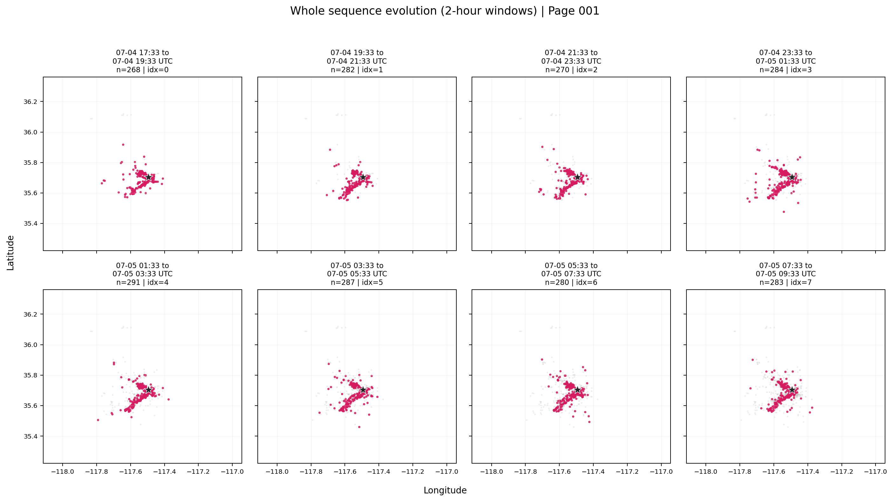 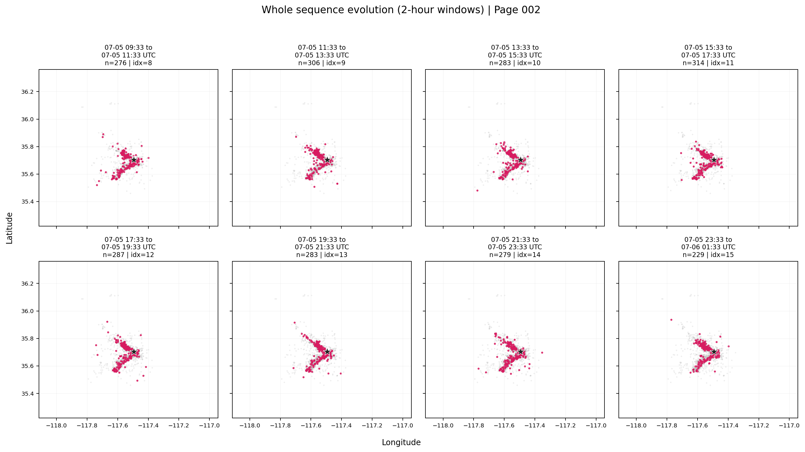 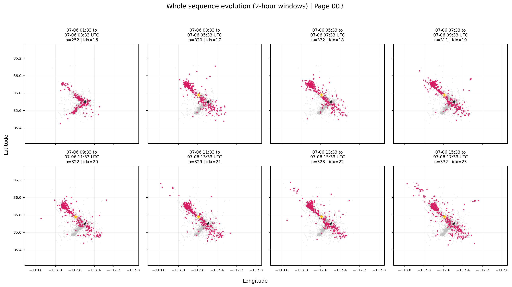 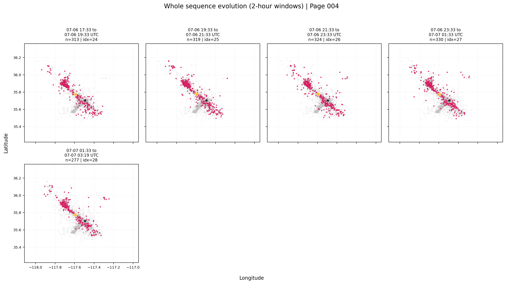

<figcaption>Whole-sequence longitude–latitude maps from Mw 6.4 to Mw 7.1 + 1 day, rendered in 2-hour windows and organized chronologically across four pages. These figures are the primary visual evidence for the transition from the Mw 6.4 sequence into the Mw 7.1 rupture stage.</figcaption>
</figure>

<figure id="fig:post64hourly" data-latex-placement="H">

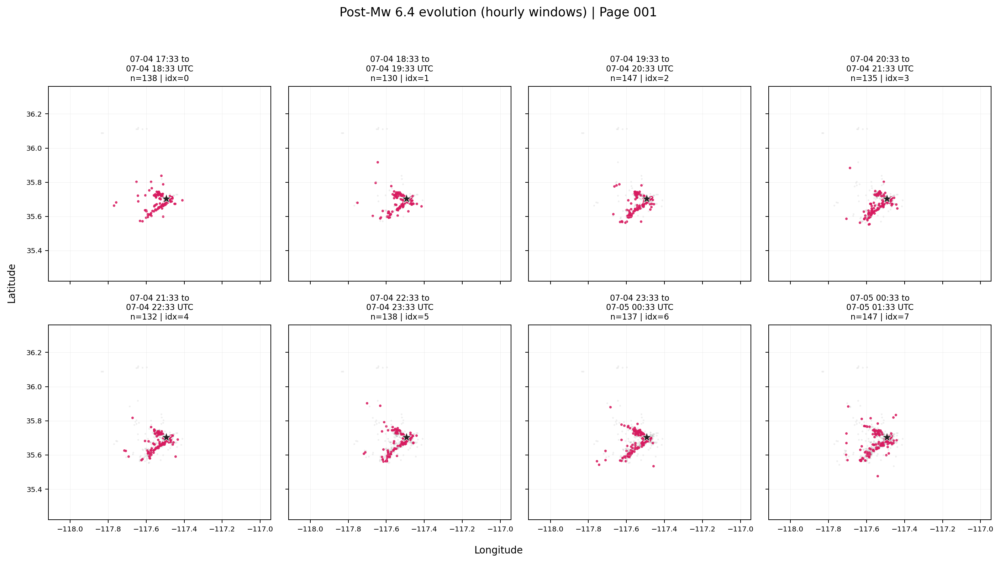 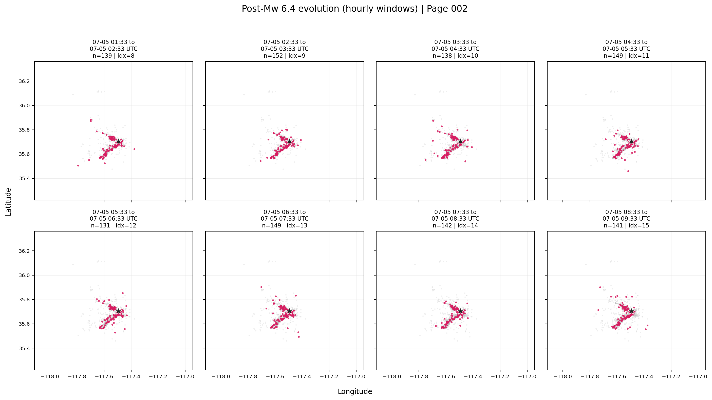 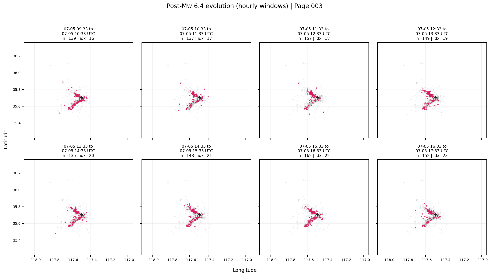 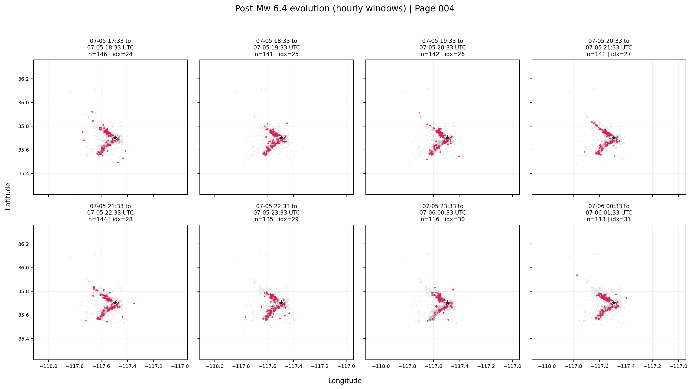 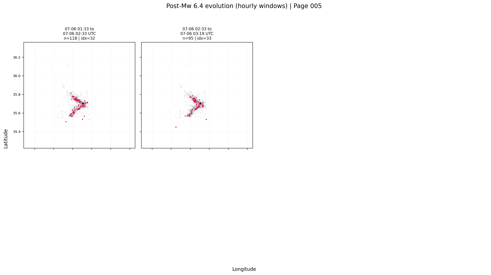

<figcaption>Hour-by-hour post-Mw 6.4 evolution up to the Mw 7.1 mainshock. The five pages together provide the highest temporal resolution view of local branching, reoccupation of subclusters, and late concentration near the future Mw 7.1 corridor.</figcaption>
</figure>

<figure id="fig:compare64" data-latex-placement="H">
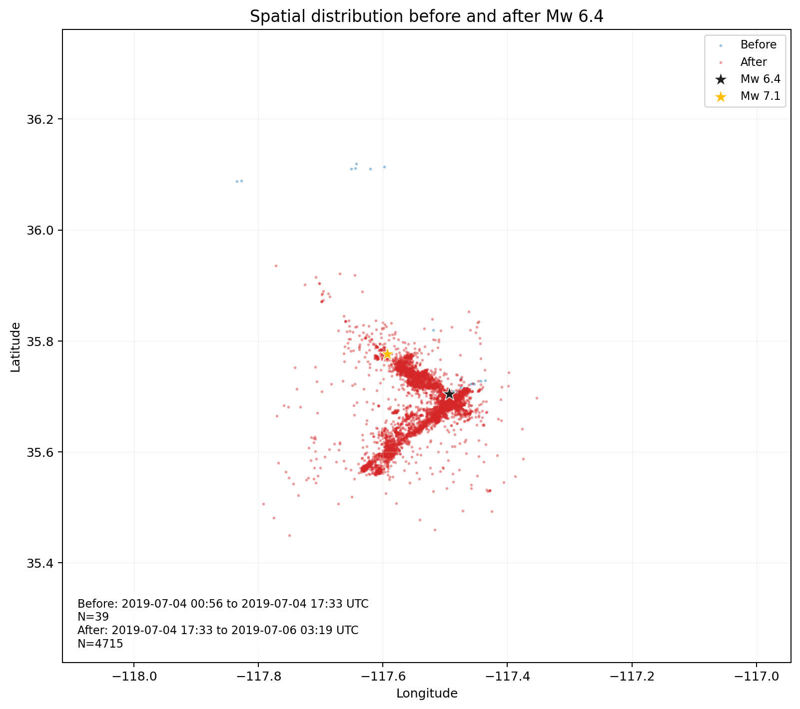
<figcaption>Spatial distribution comparison before and after the Mw 6.4 mainshock. Before Mw 6.4 the catalog contains only 43 events; after Mw 6.4 and before Mw 7.1 the sequence expands into a dense fault-zone cloud.</figcaption>
</figure>

<figure id="fig:compare71" data-latex-placement="H">
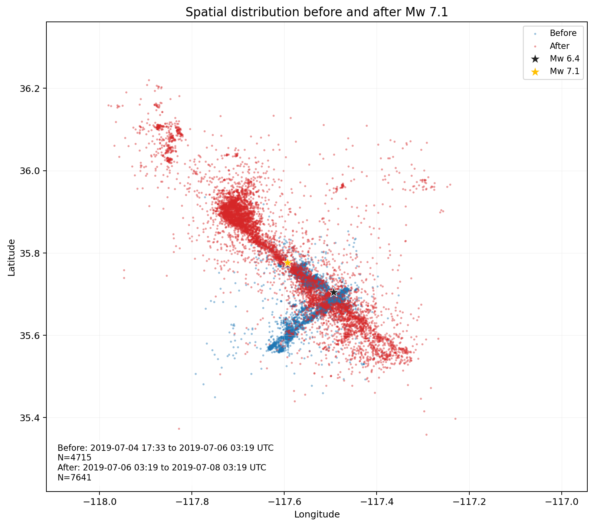
<figcaption>Spatial distribution comparison before and after the Mw 7.1 mainshock. The post-Mw 7.1 field is broader, longer, and more NW–SE aligned than the inter-mainshock distribution.</figcaption>
</figure>

<figure id="fig:whole6h" data-latex-placement="H">

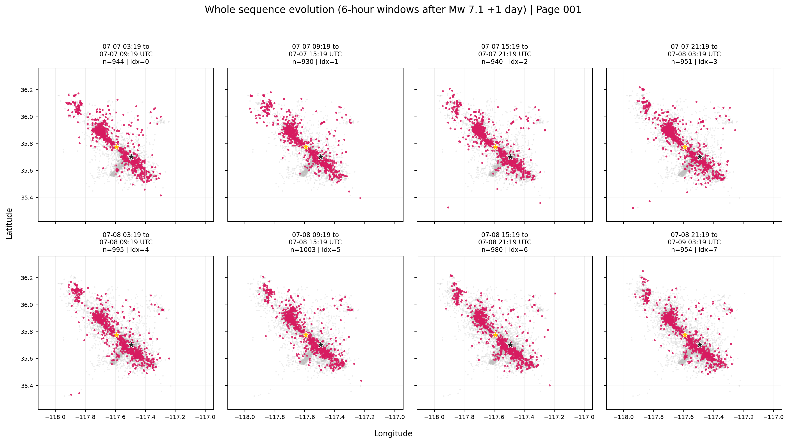 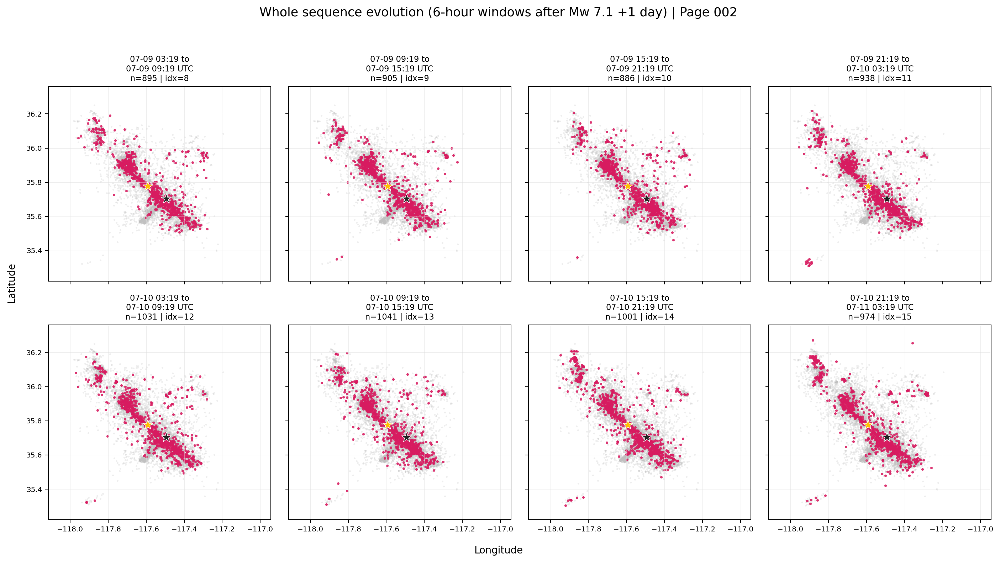

<figcaption>Whole-sequence maps from 1 to 5 days after Mw 7.1, rendered in 6-hour windows. These pages show the persistence of the post-Mw 7.1 NW–SE aftershock belt and its subclusters.</figcaption>
</figure>

# Results

## Overall finding

The combined quantitative and visual evidence indicates that the Ridgecrest sequence evolved through staged, organized, and multi-cluster spatial reconfiguration rather than through a single simple migration front. The most important result for the requested objective is that the Mw 6.4 sequence progressively occupied the future Mw 7.1 corridor, but it did so through branching and repeated activation of multiple nearby structures, not by smooth translational migration of one coherent cluster.

## Reorganization across Mw 6.4

The pre-Mw 6.4 interval was sparse, with only 43 events, whereas the Mw 6.4-to-Mw 7.1 interval contained 5,205 events. The transition across Mw 6.4 involved a centroid shift of 10.62 km toward azimuth 194.93$`^{\circ}`$, an occupied-area increase of 2319.53 km$`^2`$, and a principal-axis orientation change of 33.63$`^{\circ}`$ (Table <a href="#tab:metrics" data-reference-type="ref" data-reference="tab:metrics">[tab:metrics]</a>; Figure <a href="#fig:compare64" data-reference-type="ref" data-reference="fig:compare64">3</a>).

The pre-mainshock distribution had principal-axis azimuth 337.57$`^{\circ}`$ and footprint area 777.86 km$`^2`$, while the post-Mw 6.4 interval had principal-axis azimuth 11.20$`^{\circ}`$ and footprint area 3097.39 km$`^2`$. The evidence therefore supports a major spatial reorganization rather than a simple local rate increase. Because the pre-Mw 6.4 sample is small, this conclusion is more robust qualitatively than in exact orientation detail.

## How the Mw 6.4 sequence evolved toward Mw 7.1

The inter-mainshock interval is quantitatively summarized by <a href="../exp_run/outputs/02_spatiotemporal_metrics/migration_summary_64_to_71.json" class="uri">../exp_run/outputs/02_spatiotemporal_metrics/migration_summary_64_to_71.json</a>. Across 34 populated windows, the cumulative centroid travel was 38.23 km, but the net centroid shift was only 1.26 km toward azimuth 263.26$`^{\circ}`$. The median cluster count was 2, the multi-cluster window fraction was 0.647, the dominant cluster fraction median was 0.715, and the orientation behavior was classified as `strong_change`. These values show large internal rearrangement with little net translation.

The fine-resolution hourly maps in Figure <a href="#fig:post64hourly" data-reference-type="ref" data-reference="fig:post64hourly">2</a> support this interpretation visually. Early after Mw 6.4, activity appears compact but branching, with short limbs that produce a Y- or fan-shaped organization near the Mw 6.4 epicenter. As time progresses, the sequence repeatedly reoccupies a coherent NW–SE corridor while maintaining multiple subclusters. Later pages show narrowing and increased structural definition closer to the eventual Mw 7.1 area.

The interpretation table at <a href="../exp_run/outputs/03_visualization_and_evidence/ridgecrest_interval_interpretation_table.csv" class="uri">../exp_run/outputs/03_visualization_and_evidence/ridgecrest_interval_interpretation_table.csv</a> labels both the immediate post-Mw 6.4 and inter-mainshock behavior as `rotating` in orientation and `stepwise` in centroid motion, with `multiple_simultaneous_clusters`. The same evidence set identifies the inter-mainshock distance-to-target behavior as `approaching_target_zone`. Thus, the best-supported answer to the user’s first major question is that Mw 6.4 triggered multiple nearby clusters, with asymmetric but not purely one-directional development.

A useful synthesis is that the sequence showed progressive transfer toward the future Mw 7.1 corridor without a strong net migration of the entire cloud. This is exactly the pattern expected when activity repeatedly jumps among connected subsegments or branches instead of moving as one front.

## Directional behavior after Mw 6.4

The metrics file indicates that immediate post-Mw 6.4 seismicity was concentrated south to southwest of the Mw 6.4 epicenter and southeast of the future Mw 7.1 region, while later hourly windows increasingly activated west-to-northwest subclusters relative to Mw 6.4. This directional progression is documented in the task analysis summary through dominant-cluster azimuths shifting into the approximate 272–308$`^{\circ}`$ range from Mw 6.4 in late pre-Mw 7.1 windows. Therefore, the direction of activity was not static. Instead, the sequence broadened from early local branching into later activation of northwestern sectors closer to the Mw 7.1 rupture domain.

## Reorganization across Mw 7.1

Mw 7.1 produced a second major spatial transition (Figure <a href="#fig:whole2h" data-reference-type="ref" data-reference="fig:whole2h">1</a>, especially the pages spanning the mainshock window, and Figure <a href="#fig:compare71" data-reference-type="ref" data-reference="fig:compare71">4</a>). Comparing the inter-mainshock stage with the first two days after Mw 7.1, the event count rose from 5,205 to 8,647, the centroid shifted 14.96 km toward azimuth 335.95$`^{\circ}`$, the footprint area increased by 3142.53 km$`^2`$, and the principal-axis orientation changed by 46.34$`^{\circ}`$. The principal axis rotated from 11.20$`^{\circ}`$ before Mw 7.1 to 324.87$`^{\circ}`$ after Mw 7.1, indicating establishment of a stronger NW–SE trend.

This change is well aligned with the visual impression in Figure <a href="#fig:whole2h" data-reference-type="ref" data-reference="fig:whole2h">1</a>: the sequence becomes longer, more throughgoing, and more consistently fault-parallel immediately after Mw 7.1. The interpretation table classifies the before/after Mw 7.1 comparison as `rotating` with a `new_zone_likely` flag, whereas the immediate post-Mw 7.1 interval itself is classified as having `stable` dominant orientation and `systematic` centroid motion. This distinction is important: the transition across Mw 7.1 is abrupt and reorganizational, but once the new aftershock system is established, its dominant orientation is comparatively stable.

## Post-Mw 7.1 behavior from 1 to 5 days

The 6-hour maps in Figure <a href="#fig:whole6h" data-reference-type="ref" data-reference="fig:whole6h">5</a> show that after the first day following Mw 7.1, seismicity remained concentrated in a stable NW–SE belt containing persistent subclusters rather than diffusing into a broad outward swarm. Quantitatively, the post-Mw 7.1 migration summary reports 16 populated windows, cumulative centroid distance 12.31 km, mean centroid step 0.82 km, net centroid shift 6.03 km toward azimuth 139.68$`^{\circ}`$, median cluster count 2, and multi-cluster window fraction 1.0. The dominant orientation is 326.16$`^{\circ}`$ and the orientation-change class is `stable`. The evidence therefore supports persistent segmentation within a coherent fault-aligned aftershock belt.

# Answer to the Trigger-Evolution Question

Within the limits of this 2D epicentral analysis, the trigger evolution from Mw 6.4 to Mw 7.1 is best interpreted as follows:

1.  Mw 6.4 did not launch a single steadily advancing aftershock front. Instead, it activated a branching, multi-cluster system near the Mw 6.4 hypocentral area.

2.  Through the inter-mainshock period, activity repeatedly reoccupied a fault-aligned corridor and progressively involved additional clusters, including northwestern sectors closer to the later Mw 7.1 rupture zone.

3.  This evolution produced substantial cumulative internal rearrangement with only a very small net centroid displacement, implying transfer among nearby structures rather than smooth bulk migration.

4.  Mw 7.1 marked a stronger geometric reset: the system reorganized into a longer, broader, and more stably NW–SE aligned aftershock belt, with evidence for a likely newly activated zone in the post-mainshock regime.

In short, the available evidence favors staged structural reorganization and cascading multi-segment activation over a simple one-direction trigger front.

# Key Quantitative Summary

P4.0cm P5.2cm Y Y Interval or comparison & Metric & Value & Evidence source  
Pre- to post-Mw 6.4 & Event count change & 43 to 5205 (change = 5162) & comparison_metrics_64.csv  
Pre- to post-Mw 6.4 & Centroid shift distance / azimuth & 10.62 km / 194.93$`^{\circ}`$ & comparison_metrics_64.csv  
Pre- to post-Mw 6.4 & Orientation change & 33.63$`^{\circ}`$ & comparison_metrics_64.csv  
Pre- to post-Mw 6.4 & Occupied area change & 2319.53 km$`^2`$ & comparison_metrics_64.csv  
Mw 6.4 to Mw 7.1 & Populated windows & 34 & migration_summary_64_to_71.json  
Mw 6.4 to Mw 7.1 & Cumulative centroid travel & 38.23 km & migration_summary_64_to_71.json  
Mw 6.4 to Mw 7.1 & Net centroid shift & 1.26 km toward 263.26$`^{\circ}`$ & migration_summary_64_to_71.json  
Mw 6.4 to Mw 7.1 & Multi-cluster window fraction & 0.647 & migration_summary_64_to_71.json  
Mw 6.4 to Mw 7.1 & Median cluster count & 2.0 & migration_summary_64_to_71.json  
Mw 6.4 to Mw 7.1 & Dominant orientation / change class & 16.39$`^{\circ}`$ / strong_change & migration_summary_64_to_71.json  
Pre- to post-Mw 7.1 & Event count change & 5205 to 8647 (change = 3442) & comparison_metrics_71.csv  
Pre- to post-Mw 7.1 & Centroid shift distance / azimuth & 14.96 km / 335.95$`^{\circ}`$ & comparison_metrics_71.csv  
Pre- to post-Mw 7.1 & Orientation change & 46.34$`^{\circ}`$ & comparison_metrics_71.csv  
Pre- to post-Mw 7.1 & Occupied area change & 3142.53 km$`^2`$ & comparison_metrics_71.csv  
Post-Mw 7.1 (1–5 days family) & Populated windows & 16 & migration_summary_post71.json  
Post-Mw 7.1 (1–5 days family) & Multi-cluster window fraction & 1.0 & migration_summary_post71.json  
Post-Mw 7.1 (1–5 days family) & Dominant orientation / change class & 326.16$`^{\circ}`$ / stable & migration_summary_post71.json  

# Traceability of Outputs

The visualization package is fully traceable. The main cross-reference file is: <a href="../exp_run/outputs/03_visualization_and_evidence/figure_window_cross_reference.csv" class="uri">../exp_run/outputs/03_visualization_and_evidence/figure_window_cross_reference.csv</a>. Page indexes are stored in:

- <a href="../exp_run/outputs/03_visualization_and_evidence/whole_sequence_2h_page_index.csv" class="uri">../exp_run/outputs/03_visualization_and_evidence/whole_sequence_2h_page_index.csv</a>

- <a href="../exp_run/outputs/03_visualization_and_evidence/whole_sequence_6h_page_index.csv" class="uri">../exp_run/outputs/03_visualization_and_evidence/whole_sequence_6h_page_index.csv</a>

- <a href="../exp_run/outputs/03_visualization_and_evidence/post64_hourly_page_index.csv" class="uri">../exp_run/outputs/03_visualization_and_evidence/post64_hourly_page_index.csv</a>

Validation status is documented in: <a href="../exp_run/outputs/03_visualization_and_evidence/validation_report.json" class="uri">../exp_run/outputs/03_visualization_and_evidence/validation_report.json</a>.

# Limitations

Several limitations should qualify the interpretation.

1.  The results are based on 2D epicentral longitude–latitude patterns, centroid motion, principal-axis estimates, and DBSCAN cluster summaries. Depth, focal mechanisms, slip distributions, mapped faults, and stress-transfer calculations were not included.

2.  The inferred descriptors such as `rotating`, `stable`, `stepwise`, and `new_zone_likely` are evidence-weighted classifications rather than direct measurements.

3.  Cluster counts and some directional labels depend on DBSCAN parameter choices ($`\mathrm{eps}=2.5`$ km and $`\mathrm{min\_samples}=12`$). Alternative settings could modify some cluster-level details.

4.  The pre-Mw 6.4 interval contains only 43 events, making before/after Mw 6.4 geometry metrics less statistically stable than post-mainshock results.

5.  Dense aftershock clouds are susceptible to overplotting, especially in comparison overlays and crowded time slices. Quantitative metrics partly reduce, but do not eliminate, this limitation.

6.  The evidence supports descriptive triggering evolution but does not by itself prove a unique physical mechanism for how Mw 6.4 led to Mw 7.1.

Overall scientific confidence is therefore moderate, consistent with the evaluation metadata supplied with the evidence package.

# Conclusion

The Ridgecrest sequence evolved through two major reorganizations. First, Mw 6.4 transformed a sparse pre-mainshock field into a large, branching, fault-aligned aftershock system. Second, the inter-mainshock sequence progressively occupied the future Mw 7.1 corridor through stepwise, multi-cluster activation rather than simple one-front migration. Finally, Mw 7.1 reorganized the system into a broader and more stable NW–SE aftershock belt with persistent subclusters. The main implication is that the Mw 6.4-to-Mw 7.1 transition is best described as staged spatial transfer across interconnected structures, culminating in a larger rupture-domain reorganization at Mw 7.1.
