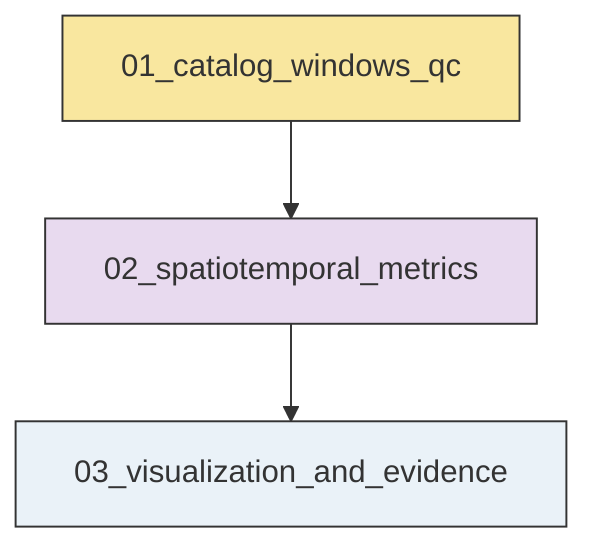
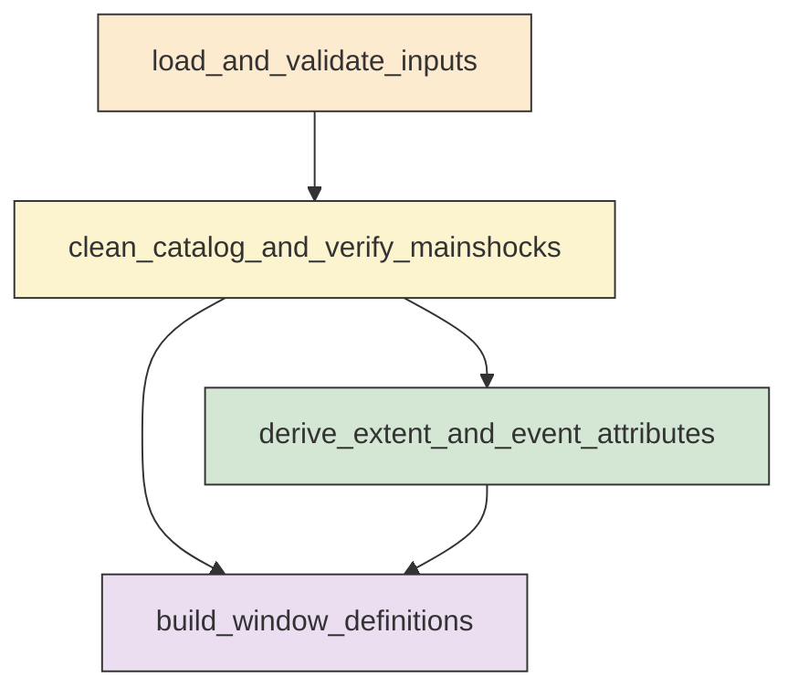
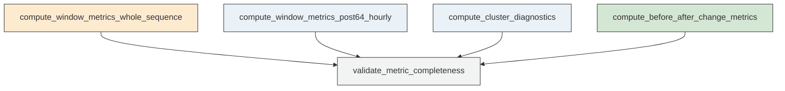
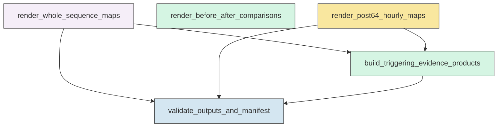

# Workflow Overview

## Top-Level Task Dependencies

**Description:**
- `01_catalog_windows_qc`: Build the validated Ridgecrest catalog, verified mainshock references, common map extent, and reusable time-window tables.
- `02_spatiotemporal_metrics`: Compute window-based migration, orientation, spread, and clustering diagnostics for the Ridgecrest sequence.
- `03_visualization_and_evidence`: Generate all requested map figures, comparison plots, machine-readable evidence summaries, and final validation products.

## Subtask Dependencies

#### 01_catalog_windows_qc
**Usage**: Build the validated Ridgecrest catalog, verified mainshock references, common map extent, and reusable time-window tables.

**Description:**
- `load_and_validate_inputs`: Read the catalog and mainshock CSV files, verify schema, and parse event times as UTC.
- `clean_catalog_and_verify_mainshocks`: Remove invalid rows, sort events chronologically, identify Mw 6.4 and Mw 7.1 mainshocks, and verify their order.
- `derive_extent_and_event_attributes`: Compute one padded map extent and reusable projected and elapsed-time attributes for all events.
- `build_window_definitions`: Construct complete time-window tables for whole-sequence, comparison, and post-Mw 6.4 analyses.

#### 02_spatiotemporal_metrics
**Usage**: Compute window-based migration, orientation, spread, and clustering diagnostics for the Ridgecrest sequence.

**Description:**
- `compute_window_metrics_whole_sequence`: Calculate per-window counts, centroid, spread, orientation, and distance metrics for whole-sequence windows.
- `compute_window_metrics_post64_hourly`: Calculate hourly centroid, spread, orientation, and migration metrics for the post-Mw 6.4 sequence.
- `compute_cluster_diagnostics`: Estimate per-window cluster structure and simultaneous activation diagnostics using fixed projected-space settings.
- `compute_before_after_change_metrics`: Quantify centroid shifts, orientation changes, area changes, and density-center shifts around the two mainshocks.
- `validate_metric_completeness`: Check that all expected windows and comparison intervals have metrics or explicit insufficient-data flags.

#### 03_visualization_and_evidence
**Usage**: Generate all requested map figures, comparison plots, machine-readable evidence summaries, and final validation products.

**Description:**
- `render_whole_sequence_maps`: Create the chronological 2 by 4 page series for the whole-sequence 2-hour and 6-hour time slices.
- `render_before_after_comparisons`: Create the before and after spatial overlay figures for Mw 6.4 and Mw 7.1 with fixed symbol meanings.
- `render_post64_hourly_maps`: Create the hour-by-hour post-Mw 6.4 map pages with fixed styling and chronological continuity.
- `build_triggering_evidence_products`: Summarize observational evidence for migration, branching, directional change, and new activation zones in machine-readable form.
- `validate_outputs_and_manifest`: Verify page counts, chronological ordering, file completeness, and cross-product consistency, then write the final manifest and validation report.