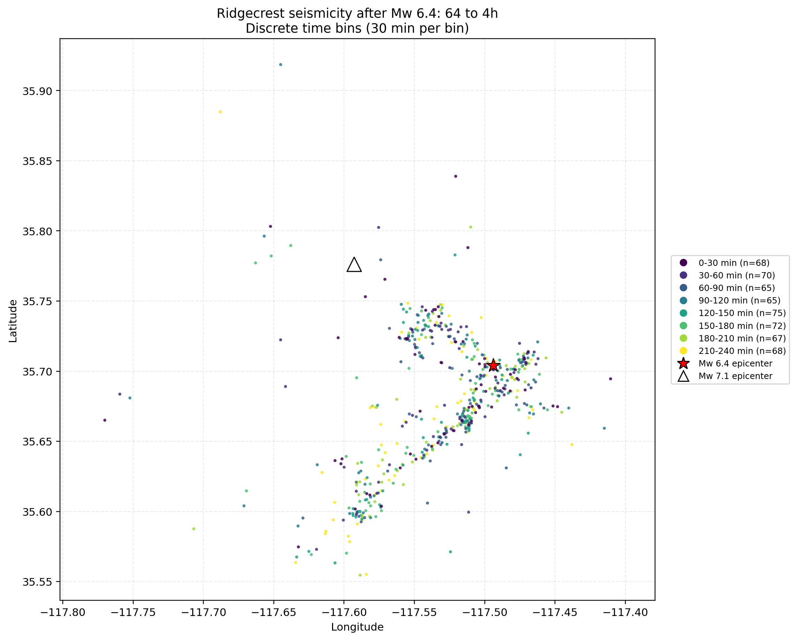
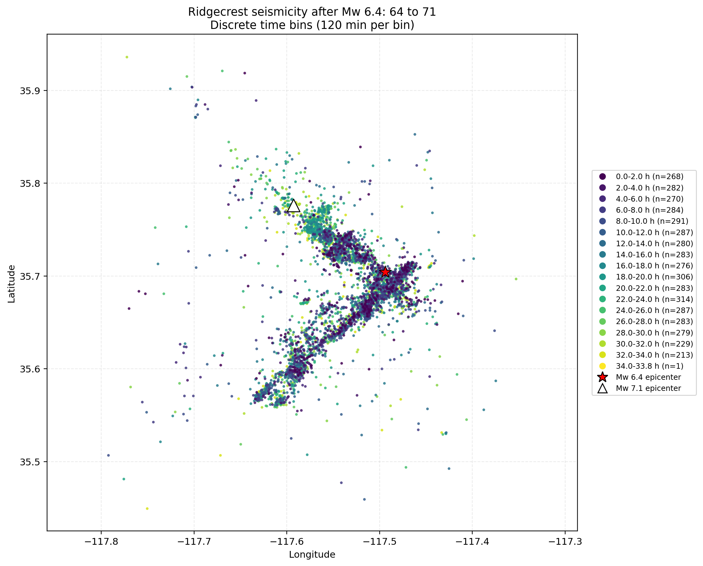
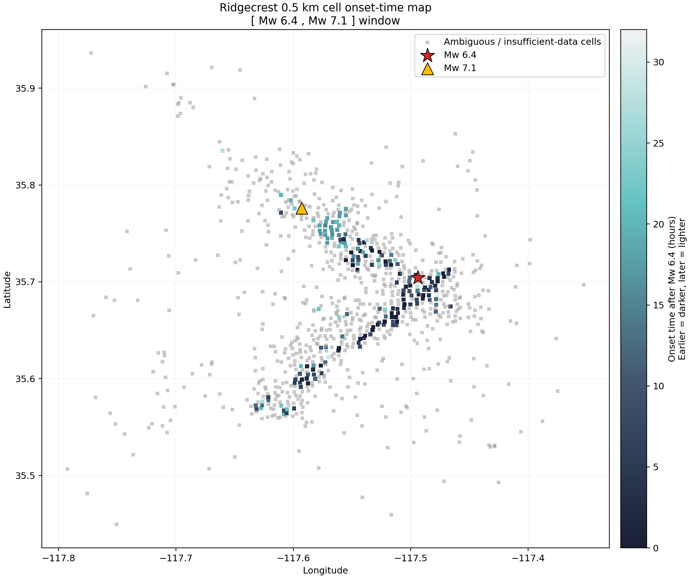
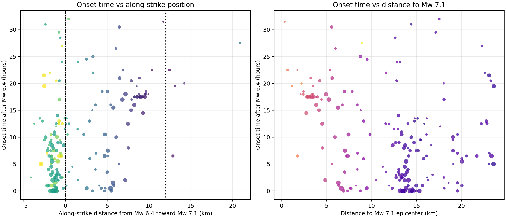

---
author:
- TRACE
title: Spatiotemporal Evolution of the Ridgecrest Earthquake Sequence and Triggering from the Mw 6.4 to Mw 7.1 Mainshock
---

# Abstract

This report investigates the spatiotemporal evolution of the Ridgecrest relocated earthquake catalog with emphasis on whether seismicity after the Mw 6.4 mainshock activated synchronously across the system or evolved in a staged manner toward the eventual Mw 7.1 mainshock region. Two complementary analyses were synthesized from completed task outputs. First, discrete time-colored epicenter maps were constructed for the first 4 h after Mw 6.4 and for the full Mw 6.4-to-Mw 7.1 interval using non-interpolated 30-minute and 2-hour bins, respectively. Second, the pre-Mw 7.1 study region was discretized into 0.5 km $`\times`$ 0.5 km cells and each cell was assigned a sustained-activation onset time from 30-minute local seismicity-rate series using an explicit threshold-and-persistence rule.

The evidence indicates that post-Mw 6.4 seismicity was not regionally synchronous. In map view, the first 4 h show strong spatial concentration on a narrow fault-aligned belt but substantial mixing of time colors rather than clean large-scale temporal layering. Over the longer Mw 6.4-to-Mw 7.1 window, activity remained concentrated on a coherent corridor spanning the two mainshock areas, again with temporal overlap rather than a simple monotonic migration. The grid-based onset analysis resolves a more structured pattern: the earliest sustained activation clusters near the Mw 6.4 source region, whereas the future Mw 7.1 vicinity activates substantially later. Median robust onset times are 5.5 h near Mw 6.4, 18.0 h near Mw 7.1, and 24.0 h in the intervening corridor. These results support a segmented, cascade-like, and spatially heterogeneous triggering process rather than a fully synchronous response or a simple uniformly propagating front. Confidence is moderate because the grid coverage is sparse and the onset rule is heuristic.

# Scientific Objective

The scientific objective was to investigate the spatiotemporal evolution of the Ridgecrest earthquake sequence using the provided relocated catalog, with special attention to the triggering relationship between the Mw 6.4 and Mw 7.1 mainshocks. The specific diagnostic question was whether seismicity after Mw 6.4 activated broadly and nearly synchronously across the system, or whether activation was staged in space and time in a way suggestive of cascade-like preparation toward the Mw 7.1 rupture region.

The required workflow had two major components:

1.  discrete time-colored spatial visualization of epicenters in two post-Mw 6.4 windows, and

2.  onset-time mapping on a 0.5 km $`\times`$ 0.5 km grid using local seismicity-rate time series.

This report follows the evidence chain from objective to implementation, then to results and limitations, using only the completed task outputs supplied in the analysis context.

# Data and Reference Events

The analysis used the relocated Ridgecrest catalog provided at <a href="<REPO_ROOT>/examples/ridgecrest/data/catalog_TRACE/TRACE_ridgecrest_relocated.csv" class="uri"><REPO_ROOT>/examples/ridgecrest/data/catalog_TRACE/TRACE_ridgecrest_relocated.csv</a> and the mainshock reference file at <a href="<REPO_ROOT>/examples/ridgecrest/data/catalog_TRACE/main_shock_events.csv" class="uri"><REPO_ROOT>/examples/ridgecrest/data/catalog_TRACE/main_shock_events.csv</a>.

Task 01 validated and enriched the catalog, yielding a total of 94,803 relocated events in the full catalog and two validated post-Mw 6.4 subsets: 607 events in the first 4 h after Mw 6.4 and 5,206 events between Mw 6.4 and Mw 7.1. The checked mainshock reference table preserved the following origin times:

- Mw 6.4: 2019-07-04T17:33:49.040000+00:00

- Mw 7.1: 2019-07-06T03:19:53.040000+00:00

These values are documented in the validated outputs cited throughout this report.

# Implemented Workflow

## Catalog validation, projection, and visualization products

The first workflow loaded the relocated catalog, checked the mainshock metadata, derived event times relative to Mw 6.4, and projected geographic coordinates into EPSG:32611 for later metric-scale spatial analysis. It then extracted two windows: Mw 6.4 to Mw 6.4 + 4 h, and Mw 6.4 to Mw 7.1. Epicenter maps were generated in longitude–latitude space with discrete, non-interpolated time bins as required by the user request: 30-minute bins for the short window and 2-hour bins for the long window. Bin-level event counts and spatial summaries were also saved.

The principal implementation outputs for this stage include the enriched catalog, validation summary, time-binned event tables, and the two time-colored epicenter figures:

- <a href="../outputs/01_catalog_windows_and_time_colored_maps/tables/ridgecrest_catalog_enriched.csv" class="uri">../outputs/01_catalog_windows_and_time_colored_maps/tables/ridgecrest_catalog_enriched.csv</a>

- <a href="../outputs/01_catalog_windows_and_time_colored_maps/tables/validation_summary.csv" class="uri">../outputs/01_catalog_windows_and_time_colored_maps/tables/validation_summary.csv</a>

- <a href="../outputs/01_catalog_windows_and_time_colored_maps/tables/time_bin_counts_64_to_4h.csv" class="uri">../outputs/01_catalog_windows_and_time_colored_maps/tables/time_bin_counts_64_to_4h.csv</a>

- <a href="../outputs/01_catalog_windows_and_time_colored_maps/tables/time_bin_counts_64_to_71.csv" class="uri">../outputs/01_catalog_windows_and_time_colored_maps/tables/time_bin_counts_64_to_71.csv</a>

- <a href="../outputs/01_catalog_windows_and_time_colored_maps/tables/time_bin_spatial_summary.csv" class="uri">../outputs/01_catalog_windows_and_time_colored_maps/tables/time_bin_spatial_summary.csv</a>

## Grid-based onset analysis

The second workflow discretized the study area occupied by catalog events between Mw 6.4 and Mw 7.1 into 0.5 km $`\times`$ 0.5 km cells. The resulting grid contained 19,758 cells spanning projected coordinates $`x=415.0`$–470.5 km and $`y=3904.0`$–3993.0 km. For each cell, events were counted in 30-minute bins over the Mw 6.4-to-Mw 7.1 interval to form local seismicity-rate time series.

A sustained-activation onset time was then defined with explicit and reproducible rule parameters:

- at least 1 event in the candidate 30-minute bin,

- at least 3 total events in the cell,

- persistence across the next 3 bins with at least 2 active future bins, and

- at least 3 events across the 4-bin cumulative window.

Cells were classified as robust, ambiguous, insufficient_data, or inactive, and onset times were related to geometry relative to the Mw 6.4–Mw 7.1 axis.

Key outputs for this stage include:

- <a href="../outputs/02_grid_onset_and_trigger_diagnostics/tables/grid_definition_0p5km.csv" class="uri">../outputs/02_grid_onset_and_trigger_diagnostics/tables/grid_definition_0p5km.csv</a>

- <a href="../outputs/02_grid_onset_and_trigger_diagnostics/tables/grid_metadata_0p5km.csv" class="uri">../outputs/02_grid_onset_and_trigger_diagnostics/tables/grid_metadata_0p5km.csv</a>

- <a href="../outputs/02_grid_onset_and_trigger_diagnostics/tables/cell_rate_timeseries_30min.csv" class="uri">../outputs/02_grid_onset_and_trigger_diagnostics/tables/cell_rate_timeseries_30min.csv</a>

- <a href="../outputs/02_grid_onset_and_trigger_diagnostics/tables/cell_onset_time_summary_with_geometry.csv" class="uri">../outputs/02_grid_onset_and_trigger_diagnostics/tables/cell_onset_time_summary_with_geometry.csv</a>

- <a href="../outputs/02_grid_onset_and_trigger_diagnostics/tables/region_comparison_summary.csv" class="uri">../outputs/02_grid_onset_and_trigger_diagnostics/tables/region_comparison_summary.csv</a>

- <a href="../outputs/02_grid_onset_and_trigger_diagnostics/tables/trigger_style_summary.csv" class="uri">../outputs/02_grid_onset_and_trigger_diagnostics/tables/trigger_style_summary.csv</a>

# Results

## Time-colored epicenter maps: strong structural localization, weak large-scale temporal layering

Task 01 provides the first level of evidence on whether post-Mw 6.4 seismicity exhibits organized temporal layering in map view.

In the first 4 h after Mw 6.4, the epicenters define a narrow southwest–northeast trending fault-aligned corridor (Figure <a href="#fig:shortmap" data-reference-type="ref" data-reference="fig:shortmap">1</a>). However, the 30-minute colors are strongly intermixed rather than forming clearly separated spatial bands. Event counts across the eight half-hour bins are nearly uniform, ranging from 69 to 81 events per bin, and successive centroid shifts are small, mostly about 0.7–1.9 km. The bin centroids remain within about 3.7–6.1 km of Mw 6.4. Together, these observations indicate rapid activation of an already connected fault network rather than a simple expanding aftershock front during the earliest period.

For the full Mw 6.4-to-Mw 7.1 interval, epicenters remain concentrated on an elongated corridor spanning the two mainshock regions (Figure <a href="#fig:longmap" data-reference-type="ref" data-reference="fig:longmap">2</a>). Early and late 2-hour colors again overlap strongly in space. Most ordinary 2-hour bins contain roughly 295–345 events, with no large quiescent break or single dominant pulse. The one exception is the final residual bin, which contains only 1 event because it covers the short remaining interval up to the Mw 7.1 origin time and is not comparable to the full 2-hour bins. Centroid positions stay broadly within 4.4–6.2 km of Mw 6.4 and 8.0–12.9 km of Mw 7.1, with mostly modest jumps between adjacent bins. A somewhat clearer northward to northwestward shift appears around 16–20 h, but the progression is not monotonic.

These map products therefore argue against region-wide synchronous activation in the sense of instantaneous homogeneous response, but they also do not show a clean simple migratory wavefront. Instead, they indicate persistent occupation of a connected fault system with only weakly resolved temporal layering at this map scale.

<figure id="fig:shortmap" data-latex-placement="H">

<figcaption>Discrete time-colored epicenters for the first 4 h after the Mw 6.4 mainshock. Colors represent non-interpolated 30-minute bins. The map shows a narrow fault-aligned seismicity belt with strong spatial mixing of time bins rather than clean large-scale temporal segregation.</figcaption>
</figure>

<figure id="fig:longmap" data-latex-placement="H">

<figcaption>Discrete time-colored epicenters from Mw 6.4 to Mw 7.1. Colors represent non-interpolated 2-hour bins. Activity remains concentrated on a coherent corridor spanning the two mainshock areas, with strong overlap of early and late bins and only modest centroid migration.</figcaption>
</figure>

## Grid occupancy and onset-time resolvability

The onset analysis adds a finer-scale and more reproducible diagnostic than visual map inspection alone. The 0.5 km grid contains 19,758 cells, but only 1,086 cells are occupied by at least one event. Of these occupied cells, 202 have robust onset estimates, 210 are ambiguous, and 674 have insufficient data; the remaining 18,672 cells are inactive. Robust onset times span 0 to 32 h after Mw 6.4, with a median of 8.0 h and a mean of 10.68 h.

This coverage pattern matters scientifically. The onset map is not a dense continuous field; it is a sparse but structured sampling of where sustained activation can be resolved from the catalog. Consequently, strong statements about a continuous propagating front are not supported, but spatial contrasts among resolved cells remain meaningful.

## Onset-time map: activation was segmented and not spatially synchronous

The onset-time map (Figure <a href="#fig:onsetmap" data-reference-type="ref" data-reference="fig:onsetmap">3</a>) shows that robust activation times form a narrow, segmented, fault-aligned belt rather than a spatially mixed region-wide cloud. The earliest robust onset cells cluster near and just southwest of the Mw 6.4 source area and along part of the central trend. Later activation appears on additional segments, including the branch leading toward the Mw 7.1 epicentral area. Gray cells denote ambiguous or insufficiently constrained areas, so the pattern is incomplete, but the resolved parts are not consistent with synchronous activation across the domain.

This result directly addresses the onset-time objective posed by the user. If activation had been broadly synchronous, colors representing onset time would be spatially mixed without large-scale segregation. Instead, the mapped onset times show coherent local grouping of earlier and later activation zones. That pattern is more compatible with staged or cascade-like activation on a segmented fault network.

<figure id="fig:onsetmap" data-latex-placement="H">

<figcaption>Spatial map of sustained-activation onset times on the 0.5 km grid for the Mw 6.4-to-Mw 7.1 interval. Earlier activation is darker and later activation lighter; non-robust cells are separately flagged. The resolved pattern is segmented and fault-aligned, with earliest activation concentrated near the Mw 6.4 region.</figcaption>
</figure>

## Regional timing contrast between Mw 6.4 and Mw 7.1 neighborhoods

The clearest quantitative evidence for delayed activation toward the future Mw 7.1 source comes from the regional comparison summary. In the Mw 6.4 vicinity, the earliest robust onset is 0.0 h and the median robust onset is 5.5 h. In the Mw 7.1 vicinity, the earliest robust onset is 6.0 h and the median robust onset is 18.0 h. The intervening corridor is even more weakly and belatedly resolved, with only one robust cell and a median onset of 24.0 h.

Activated-cell fractions reinforce this asymmetry. By 6 h after Mw 6.4, 8.6% of cells in the Mw 6.4 vicinity had activated, compared with only 0.16% near Mw 7.1 and 0% in the corridor. By 18 h, the Mw 6.4 vicinity reached 13.7% activated while the Mw 7.1 vicinity remained at 3.3%. The corridor did not register any activated cells until 24 h.

These results are inconsistent with an immediate, spatially continuous advance from the Mw 6.4 hypocentral area straight through the corridor into the Mw 7.1 region. Instead, they indicate strong early activation near Mw 6.4 and delayed activation closer to Mw 7.1.

| Region | Earliest robust onset (h) | Median robust onset (h) | Notes |
|:---|:--:|:--:|:---|
| Mw 6.4 vicinity | 0.0 | 5.5 | Earliest and densest sustained activation |
| Intervening corridor | 24.0 | 24.0 | Only one robust onset cell |
| Mw 7.1 vicinity | 6.0 | 18.0 | Delayed activation relative to Mw 6.4 side |

Key regional onset statistics derived from the grid-based analysis. Values are taken from the region-comparison synthesis described in the task analysis.

## Trigger style and geometry diagnostics

The formal trigger-style summary classifies the sequence as `mixed`. This classification is based on a 7.5 km half-width partition about the Mw 6.4–Mw 7.1 axis of length 11.99 km. The reason it is not classified as a simple migrating front is that the onset pattern is nonmonotonic. If a single front had advanced steadily from Mw 6.4 toward Mw 7.1, the corridor should activate earlier or at least comparably to the Mw 7.1 vicinity. Instead, the corridor is sparsely active and extremely late, whereas the Mw 7.1 vicinity shows clearer but still delayed activation.

Segment-scale statistics further support this conclusion. Along-strike bins of roughly 2 km show irregular median onset times: 13.5 h in the nearest segment, then 5.0 h and 6.0 h in the next two, 12.5 h farther along, about 17.5 h near 8–10 km, and 31.5 h in the farthest sampled segment. This confirms that activation did not advance as a single linear wave.

The geometry figure (Figure <a href="#fig:geometry" data-reference-type="ref" data-reference="fig:geometry">4</a>) provides the same message visually. Onset time tends overall to increase with along-strike distance from Mw 6.4, but with broad scatter and multiple clusters rather than a unique trend. The task analysis reports a moderate positive correlation between onset time and along-strike distance from Mw 6.4 ($`r \approx 0.46`$) and a moderate negative correlation with distance to Mw 7.1 ($`r \approx -0.33`$). Thus, later activation tends in aggregate to lie farther toward the Mw 7.1 side, yet the relationship is far from deterministic.

<figure id="fig:geometry" data-latex-placement="H">

<figcaption>Onset time versus trigger geometry metrics. The resolved cells show an overall tendency for later activation to occur farther along strike toward the Mw 7.1 side, but the relationship is scattered and clustered rather than a simple deterministic front.</figcaption>
</figure>

## Synthesis for the Mw 6.4 to Mw 7.1 triggering question

Taken together, the two analyses give a coherent scientific interpretation.

At coarse map scale, seismicity after Mw 6.4 rapidly occupied a persistent fault-aligned corridor and showed strong overlap among discrete time bins. This means the sequence cannot be described simply as a clean outwardly migrating cloud. However, the grid-based sustained-onset analysis reveals that this apparent overlap masks strong differences in when local sustained activity became established. Robust onset times start near Mw 6.4, remain sparse in the corridor, and occur substantially later near the future Mw 7.1 source region.

Therefore, the most defensible interpretation is that the Mw 6.4-to-Mw 7.1 evolution reflects a segmented and heterogeneous cascade on a connected fault system. The evidence supports delayed and structured activation toward Mw 7.1, but not a uniquely resolved physical mechanism such as a single continuously propagating stress front. The preferred trigger style is accordingly mixed: it has directional organization toward the Mw 7.1 side, yet it is interrupted, patchy, and nonmonotonic.

# Limitations and Confidence

Several limitations materially affect the strength of interpretation.

1.  **Sparse grid coverage.** Only 1,086 of 19,758 grid cells are occupied, and only 202 cells have robust onset estimates. The corridor between the two mainshock areas is especially poorly sampled, with only 8 occupied cells and 1 robust onset cell. This limits spatial continuity and weakens any claim of a fully resolved triggering pathway.

2.  **Heuristic onset rule.** Onset detection is based on a threshold-and-persistence rule rather than an inversion or physics-based rupture model. Although the rule is explicit and reproducible, parameter choices can influence which cells are labeled robust, ambiguous, or insufficient.

3.  **Map-view emphasis.** The interpretation is based on epicentral distributions and catalog-derived spatial summaries. It does not include depth-resolved migration, focal mechanisms, geodetic deformation, Coulomb stress transfer, or dynamic rupture modeling. The conclusions should therefore remain descriptive and trigger-oriented rather than mechanistically definitive.

4.  **Irregular final long-window bin.** In the long-window map, the final time bin is a short residual interval ending at the Mw 7.1 origin time and contains only 1 event. It should not be compared directly with the full 2-hour bins.

5.  **Uncertainty in simple trigger narratives.** The reported trigger interpretation is mixed, and the onset-distance relationships contain substantial scatter. The results support delayed and structured activation toward Mw 7.1, but not a unique one-dimensional progression law.

Overall scientific confidence is **moderate**. The evidence is sufficient to reject a simple spatially synchronous activation model and to support structured, delayed activation toward the Mw 7.1 region, but not sufficient to isolate a unique physical trigger mechanism.

# Conclusions

1.  The Ridgecrest relocated catalog and mainshock references were successfully validated and transformed into reproducible post-Mw 6.4 analysis products, including discrete time-colored epicenter maps and grid-based onset diagnostics.

2.  In the first 4 h after Mw 6.4, epicenters are concentrated on a narrow fault-aligned corridor, but 30-minute colors are spatially mixed rather than cleanly layered. This indicates rapid activation of a persistent fault network rather than a simple expanding front.

3.  Over the full Mw 6.4-to-Mw 7.1 interval, activity remains concentrated on a coherent corridor spanning both mainshock regions, with strong overlap among early and late 2-hour bins and only modest nonmonotonic centroid shifts.

4.  The 0.5 km onset analysis shows that sustained activation was not spatially synchronous. The earliest robust activation occurs near the Mw 6.4 source region, whereas the future Mw 7.1 vicinity activates substantially later.

5.  The strongest regional timing contrast is quantitative: median robust onset is 5.5 h near Mw 6.4, 18.0 h near Mw 7.1, and 24.0 h in the intervening corridor, although the corridor is very sparsely sampled.

6.  The preferred interpretation is a mixed, segmented, cascade-like triggering process on a connected fault system. The results are inconsistent with both fully synchronous activation and a single simple uniformly propagating front.

# Evidence File References

Primary figures used in this report:

- <a href="../outputs/01_catalog_windows_and_time_colored_maps/figures/time_colored_epicenters_64_to_4h.png" class="uri">../outputs/01_catalog_windows_and_time_colored_maps/figures/time_colored_epicenters_64_to_4h.png</a>

- <a href="../outputs/01_catalog_windows_and_time_colored_maps/figures/time_colored_epicenters_64_to_71.png" class="uri">../outputs/01_catalog_windows_and_time_colored_maps/figures/time_colored_epicenters_64_to_71.png</a>

- <a href="../outputs/02_grid_onset_and_trigger_diagnostics/figures/ridgecrest_onset_time_map.png" class="uri">../outputs/02_grid_onset_and_trigger_diagnostics/figures/ridgecrest_onset_time_map.png</a>

- <a href="../outputs/02_grid_onset_and_trigger_diagnostics/figures/onset_vs_trigger_geometry.png" class="uri">../outputs/02_grid_onset_and_trigger_diagnostics/figures/onset_vs_trigger_geometry.png</a>

Primary tables and machine-readable outputs used in synthesis:

- <a href="../outputs/01_catalog_windows_and_time_colored_maps/tables/validation_summary.csv" class="uri">../outputs/01_catalog_windows_and_time_colored_maps/tables/validation_summary.csv</a>

- <a href="../outputs/01_catalog_windows_and_time_colored_maps/tables/time_bin_counts_64_to_4h.csv" class="uri">../outputs/01_catalog_windows_and_time_colored_maps/tables/time_bin_counts_64_to_4h.csv</a>

- <a href="../outputs/01_catalog_windows_and_time_colored_maps/tables/time_bin_counts_64_to_71.csv" class="uri">../outputs/01_catalog_windows_and_time_colored_maps/tables/time_bin_counts_64_to_71.csv</a>

- <a href="../outputs/01_catalog_windows_and_time_colored_maps/tables/time_bin_spatial_summary.csv" class="uri">../outputs/01_catalog_windows_and_time_colored_maps/tables/time_bin_spatial_summary.csv</a>

- <a href="../outputs/02_grid_onset_and_trigger_diagnostics/tables/onset_qc_summary.csv" class="uri">../outputs/02_grid_onset_and_trigger_diagnostics/tables/onset_qc_summary.csv</a>

- <a href="../outputs/02_grid_onset_and_trigger_diagnostics/tables/onset_rule_parameters.csv" class="uri">../outputs/02_grid_onset_and_trigger_diagnostics/tables/onset_rule_parameters.csv</a>

- <a href="../outputs/02_grid_onset_and_trigger_diagnostics/tables/region_comparison_summary.csv" class="uri">../outputs/02_grid_onset_and_trigger_diagnostics/tables/region_comparison_summary.csv</a>

- <a href="../outputs/02_grid_onset_and_trigger_diagnostics/tables/regional_activated_cell_fraction.csv" class="uri">../outputs/02_grid_onset_and_trigger_diagnostics/tables/regional_activated_cell_fraction.csv</a>

- <a href="../outputs/02_grid_onset_and_trigger_diagnostics/tables/segment_level_onset_summary.csv" class="uri">../outputs/02_grid_onset_and_trigger_diagnostics/tables/segment_level_onset_summary.csv</a>

- <a href="../outputs/02_grid_onset_and_trigger_diagnostics/tables/trigger_style_summary.csv" class="uri">../outputs/02_grid_onset_and_trigger_diagnostics/tables/trigger_style_summary.csv</a>
