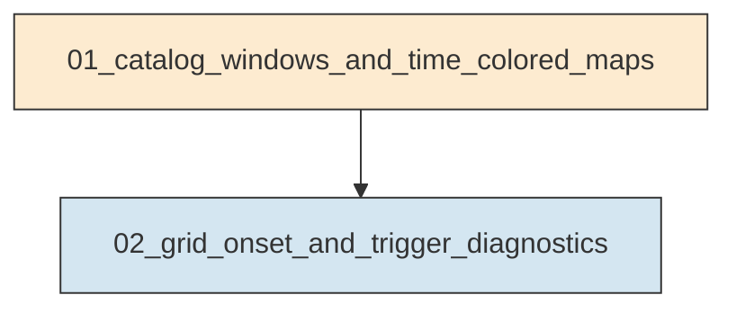
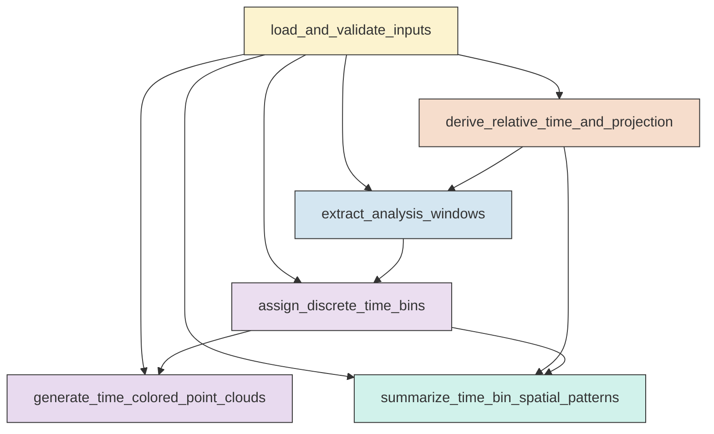
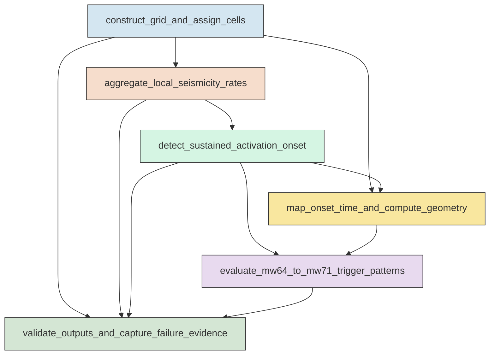

# Research Codings

## Task Overview


**Description:**
- `01_catalog_windows_and_time_colored_maps`: Load and validate the Ridgecrest catalog, derive relative-time and projected-coordinate fields, create analysis windows, and generate time-colored epicenter products with bin summaries.
- `02_grid_onset_and_trigger_diagnostics`: Build the 0.5 km grid, estimate sustained-activation onset times, map onset patterns, and compute Mw 6.4-to-Mw 7.1 trigger diagnostics.


## Task Details


#### 01_catalog_windows_and_time_colored_maps
**Usage**: Load and validate the Ridgecrest catalog, derive relative-time and projected-coordinate fields, create analysis windows, and generate time-colored epicenter products with bin summaries.

**Description:**
- `load_and_validate_inputs`: Read the catalog and mainshock tables, validate required columns, and verify unique Mw 6.4 and Mw 7.1 reference events.
- `derive_relative_time_and_projection`: Compute relative times from Mw 6.4 and project epicenters to local Cartesian coordinates for distance-based analyses.
- `extract_analysis_windows`: Build the short and long post-Mw 6.4 event subsets and summarize their temporal and spatial extents.
- `assign_discrete_time_bins`: Assign fixed categorical time bins for the short and long windows without within-bin interpolation.
- `generate_time_colored_point_clouds`: Create categorical longitude-latitude epicenter scatter plots for both time windows with mainshock overlays.
- `summarize_time_bin_spatial_patterns`: Compute descriptive spatial summaries for each time bin to support assessment of temporal layering and migration.

#### Coding Script

```python

from __future__ import annotations

import math
import os
import shutil
import sys
import traceback
from dataclasses import dataclass
from pathlib import Path
from typing import Dict, List, Tuple

import matplotlib.pyplot as plt
import numpy as np
import pandas as pd
from matplotlib.colors import ListedColormap
from pyproj import CRS, Transformer
from sklearn.decomposition import PCA


CATALOG_PATH = Path(
    "<REPO_ROOT>/examples/ridgecrest/data/catalog_TRACE/TRACE_ridgecrest_relocated.csv"
).resolve()
MAINSHOCK_PATH = Path(
    "<REPO_ROOT>/examples/ridgecrest/data/catalog_TRACE/main_shock_events.csv"
).resolve()
SCRIPT_PATH = Path(__file__).resolve()
OUTPUT_DIR = Path(
    "../exp_run/outputs/01_catalog_windows_and_time_colored_maps"
).resolve()

EXPECTED_COLUMNS = ["event_time", "latitude", "longitude", "depth_km", "magnitude"]
SHORT_WINDOW_HOURS = 4.0
SHORT_BIN_MINUTES = 30
LONG_BIN_HOURS = 2
FIG_DPI = 220
N_CORES = min(64, max(1, (os.cpu_count() or 1)))


@dataclass(frozen=True)
class MainshockReference:
    label: str
    event_time: pd.Timestamp
    latitude: float
    longitude: float
    depth_km: float
    magnitude: float


@dataclass(frozen=True)
class WindowDefinition:
    name: str
    start_time: pd.Timestamp
    end_time: pd.Timestamp
    bin_minutes: int
    rel_unit_label: str


def log(message: str) -> None:
    print(message, flush=True)


def ensure_clean_output_dir(output_dir: Path) -> None:
    output_dir.mkdir(parents=True, exist_ok=True)
    removable_patterns = ["*.csv", "*.png", "*.jpg", "*.jpeg", "*.json", "*.txt"]
    removed = 0
    for pattern in removable_patterns:
        for path in output_dir.glob(pattern):
            if path.is_file():
                path.unlink()
                removed += 1
    for subdir_name in ["figures", "tables", "logs"]:
        subdir = output_dir / subdir_name
        if subdir.exists():
            shutil.rmtree(subdir)
    (output_dir / "figures").mkdir(parents=True, exist_ok=True)
    (output_dir / "tables").mkdir(parents=True, exist_ok=True)
    (output_dir / "logs").mkdir(parents=True, exist_ok=True)
    log(f"Prepared clean output directory: {output_dir} (removed {removed} top-level files)")


def validate_schema(df: pd.DataFrame, source_name: str) -> None:
    missing = [col for col in EXPECTED_COLUMNS if col not in df.columns]
    extra = [col for col in df.columns if col not in EXPECTED_COLUMNS]
    if missing:
        raise ValueError(f"{source_name} missing required columns: {missing}")
    if extra:
        log(f"Warning: {source_name} has extra columns that will be ignored: {extra}")


def load_catalog() -> pd.DataFrame:
    log(f"Loading catalog: {CATALOG_PATH}")
    df = pd.read_csv(CATALOG_PATH)
    validate_schema(df, "catalog")
    df = df[EXPECTED_COLUMNS].copy()
    df["event_time"] = pd.to_datetime(df["event_time"], utc=True)
    for col in ["latitude", "longitude", "depth_km", "magnitude"]:
        df[col] = pd.to_numeric(df[col], errors="raise")
    if df[EXPECTED_COLUMNS].isna().any().any():
        raise ValueError("Catalog contains missing values in required columns.")
    df = df.sort_values("event_time").reset_index(drop=True)
    df["event_id"] = np.arange(len(df), dtype=np.int64)
    log(f"Loaded catalog rows: {len(df):,}")
    return df


def load_mainshocks() -> Tuple[MainshockReference, MainshockReference, pd.DataFrame]:
    log(f"Loading mainshock table: {MAINSHOCK_PATH}")
    df = pd.read_csv(MAINSHOCK_PATH)
    validate_schema(df, "main_shock_events")
    df = df[EXPECTED_COLUMNS].copy()
    df["event_time"] = pd.to_datetime(df["event_time"], utc=True)
    for col in ["latitude", "longitude", "depth_km", "magnitude"]:
        df[col] = pd.to_numeric(df[col], errors="raise")

    mw64_rows = df[np.isclose(df["magnitude"], 6.4)]
    mw71_rows = df[np.isclose(df["magnitude"], 7.1)]
    if len(mw64_rows) != 1 or len(mw71_rows) != 1:
        raise ValueError("Expected unique Mw 6.4 and Mw 7.1 rows in main_shock_events.csv")

    def row_to_ref(label: str, row: pd.Series) -> MainshockReference:
        return MainshockReference(
            label=label,
            event_time=row["event_time"],
            latitude=float(row["latitude"]),
            longitude=float(row["longitude"]),
            depth_km=float(row["depth_km"]),
            magnitude=float(row["magnitude"]),
        )

    ms64 = row_to_ref("Mainshock64", mw64_rows.iloc[0])
    ms71 = row_to_ref("Mainshock71", mw71_rows.iloc[0])
    if not ms71.event_time > ms64.event_time:
        raise ValueError("Mw 7.1 event time must be later than Mw 6.4 event time")

    checked = pd.DataFrame(
        [
            {
                "label": ms64.label,
                "event_time": ms64.event_time.isoformat(),
                "latitude": ms64.latitude,
                "longitude": ms64.longitude,
                "depth_km": ms64.depth_km,
                "magnitude": ms64.magnitude,
            },
            {
                "label": ms71.label,
                "event_time": ms71.event_time.isoformat(),
                "latitude": ms71.latitude,
                "longitude": ms71.longitude,
                "depth_km": ms71.depth_km,
                "magnitude": ms71.magnitude,
            },
        ]
    )
    return ms64, ms71, checked


def build_local_transformer(center_lon: float, center_lat: float) -> Tuple[Transformer, str]:
    zone = int(math.floor((center_lon + 180.0) / 6.0) + 1)
    epsg = 32600 + zone if center_lat >= 0 else 32700 + zone
    crs = CRS.from_epsg(epsg)
    transformer = Transformer.from_crs("EPSG:4326", crs, always_xy=True)
    return transformer, crs.to_string()


def add_relative_time_and_projection(
    catalog: pd.DataFrame,
    ms64: MainshockReference,
    ms71: MainshockReference,
) -> Tuple[pd.DataFrame, Dict[str, float]]:
    log("Deriving relative-time fields and projected coordinates")
    center_lon = (ms64.longitude + ms71.longitude) / 2.0
    center_lat = (ms64.latitude + ms71.latitude) / 2.0
    transformer, crs_name = build_local_transformer(center_lon, center_lat)

    x_m, y_m = transformer.transform(catalog["longitude"].to_numpy(), catalog["latitude"].to_numpy())
    ms64_x_m, ms64_y_m = transformer.transform(ms64.longitude, ms64.latitude)
    ms71_x_m, ms71_y_m = transformer.transform(ms71.longitude, ms71.latitude)

    enriched = catalog.copy()
    delta = enriched["event_time"] - ms64.event_time
    enriched["time_rel_sec_from_64"] = delta.dt.total_seconds()
    enriched["time_rel_min_from_64"] = enriched["time_rel_sec_from_64"] / 60.0
    enriched["time_rel_hr_from_64"] = enriched["time_rel_sec_from_64"] / 3600.0
    enriched["x_km"] = x_m / 1000.0
    enriched["y_km"] = y_m / 1000.0

    projection_meta = {
        "projection_crs": crs_name,
        "projection_center_lon": center_lon,
        "projection_center_lat": center_lat,
        "mainshock64_x_km": ms64_x_m / 1000.0,
        "mainshock64_y_km": ms64_y_m / 1000.0,
        "mainshock71_x_km": ms71_x_m / 1000.0,
        "mainshock71_y_km": ms71_y_m / 1000.0,
    }
    return enriched, projection_meta


def require_columns(df: pd.DataFrame, required: List[str], context: str) -> None:
    missing = [col for col in required if col not in df.columns]
    if missing:
        raise ValueError(f"{context} missing required columns: {missing}")


def subset_window(df: pd.DataFrame, window: WindowDefinition) -> pd.DataFrame:
    require_columns(df, ["event_time"], f"subset_window input for {window.name}")
    mask = (df["event_time"] >= window.start_time) & (df["event_time"] <= window.end_time)
    subset = df.loc[mask].copy().reset_index(drop=True)
    if subset.empty:
        raise ValueError(f"Window {window.name} is empty")
    return subset


def assign_time_bins(
    df: pd.DataFrame,
    window: WindowDefinition,
    reference_time: pd.Timestamp,
) -> Tuple[pd.DataFrame, pd.DataFrame, np.ndarray]:
    require_columns(df, ["event_time"], f"assign_time_bins input for {window.name}")
    subset = df.copy()
    rel_minutes = (subset["event_time"] - reference_time).dt.total_seconds() / 60.0
    subset["time_since_64_min"] = rel_minutes

    duration_minutes = (window.end_time - window.start_time).total_seconds() / 60.0
    if duration_minutes <= 0:
        raise ValueError(f"Window {window.name} has non-positive duration: {duration_minutes} minutes")

    edges = np.arange(0.0, duration_minutes + window.bin_minutes, window.bin_minutes, dtype=float)
    if edges[-1] < duration_minutes:
        edges = np.append(edges, duration_minutes)
    elif edges[-1] > duration_minutes:
        if not np.isclose(edges[-1], duration_minutes):
            edges = np.append(edges, duration_minutes)
        else:
            edges[-1] = duration_minutes
    if len(edges) < 2:
        edges = np.array([0.0, duration_minutes], dtype=float)

    rel_array = rel_minutes.to_numpy(dtype=float)
    if np.any(rel_array < -1e-9) or np.any(rel_array > duration_minutes + 1e-9):
        raise ValueError(f"Found event times outside window bounds for {window.name}")

    bin_indices = np.searchsorted(edges, rel_array, side="right") - 1
    bin_indices = np.where(np.isclose(rel_array, duration_minutes), len(edges) - 2, bin_indices)
    bin_indices = np.clip(bin_indices, 0, len(edges) - 2)

    labels = []
    starts = edges[:-1]
    ends = edges[1:]
    for start_min, end_min in zip(starts, ends):
        if window.bin_minutes < 60:
            label = f"{int(round(start_min))}-{int(round(end_min))} min"
        else:
            label = f"{start_min / 60.0:.1f}-{end_min / 60.0:.1f} h"
        labels.append(label)

    subset["time_bin_index"] = bin_indices.astype(int)
    subset["time_bin_label"] = [labels[idx] for idx in subset["time_bin_index"]]
    subset["time_bin_start_min"] = [starts[idx] for idx in subset["time_bin_index"]]
    subset["time_bin_end_min"] = [ends[idx] for idx in subset["time_bin_index"]]

    require_columns(
        subset,
        ["time_bin_index", "time_bin_label", "time_bin_start_min", "time_bin_end_min"],
        f"assign_time_bins output for {window.name}",
    )

    all_bins = pd.DataFrame(
        {
            "window_name": window.name,
            "time_bin_index": np.arange(len(starts), dtype=int),
            "time_bin_start_min": starts,
            "time_bin_end_min": ends,
            "time_bin_label": labels,
        }
    )
    counts = subset.groupby("time_bin_index", as_index=False).size().rename(columns={"size": "event_count"})
    summary = all_bins.merge(counts, on="time_bin_index", how="left", validate="one_to_one")
    summary["event_count"] = summary["event_count"].fillna(0).astype(int)
    require_columns(
        summary,
        ["window_name", "time_bin_index", "time_bin_start_min", "time_bin_end_min", "time_bin_label", "event_count"],
        f"time bin summary for {window.name}",
    )
    return subset, summary, edges


def make_discrete_cmap(n: int) -> ListedColormap:
    base = plt.get_cmap("viridis", n)
    colors = base(np.arange(n))
    return ListedColormap(colors)


def plot_time_colored_epicenters(
    df: pd.DataFrame,
    bin_summary: pd.DataFrame,
    ms64: MainshockReference,
    ms71: MainshockReference,
    window: WindowDefinition,
    figure_path: Path,
    metadata_rows: List[Dict[str, object]],
) -> None:
    require_columns(df, ["longitude", "latitude", "time_bin_index"], f"plot input for {window.name}")
    require_columns(
        bin_summary,
        ["time_bin_index", "time_bin_label", "time_bin_start_min", "time_bin_end_min", "event_count"],
        f"bin summary for plotting {window.name}",
    )
    log(f"Creating figure: {figure_path.name}")
    n_bins = len(bin_summary)
    cmap = make_discrete_cmap(max(n_bins, 1))

    fig, ax = plt.subplots(figsize=(10.5, 8.5))

    for idx in sorted(df["time_bin_index"].unique(), reverse=True):
        part = df[df["time_bin_index"] == idx]
        ax.scatter(
            part["longitude"],
            part["latitude"],
            s=8,
            c=[cmap(idx)],
            alpha=0.85,
            linewidths=0.0,
            rasterized=False,
        )

    ax.scatter(
        ms64.longitude,
        ms64.latitude,
        s=180,
        marker="*",
        c="red",
        edgecolors="black",
        linewidths=0.8,
        label="Mw 6.4",
        zorder=5,
    )
    ax.scatter(
        ms71.longitude,
        ms71.latitude,
        s=180,
        marker="^",
        c="white",
        edgecolors="black",
        linewidths=1.0,
        label="Mw 7.1",
        zorder=5,
    )

    handles = []
    labels = []
    for _, row in bin_summary.iterrows():
        idx = int(row["time_bin_index"])
        handle = plt.Line2D(
            [0],
            [0],
            marker="o",
            color="none",
            markerfacecolor=cmap(idx),
            markeredgecolor="none",
            markersize=7,
        )
        handles.append(handle)
        labels.append(f"{row['time_bin_label']} (n={int(row['event_count'])})")
        metadata_rows.append(
            {
                "window_name": window.name,
                "time_bin_index": idx,
                "time_bin_label": row["time_bin_label"],
                "time_bin_start_min": row["time_bin_start_min"],
                "time_bin_end_min": row["time_bin_end_min"],
                "rgba": ",".join(f"{v:.6f}" for v in cmap(idx)),
            }
        )

    ms_handle1 = plt.Line2D([0], [0], marker="*", color="none", markerfacecolor="red", markeredgecolor="black", markersize=12)
    ms_handle2 = plt.Line2D([0], [0], marker="^", color="none", markerfacecolor="white", markeredgecolor="black", markersize=10)
    handles.extend([ms_handle1, ms_handle2])
    labels.extend(["Mw 6.4 epicenter", "Mw 7.1 epicenter"])

    ax.legend(handles, labels, loc="center left", bbox_to_anchor=(1.02, 0.5), frameon=True, fontsize=8)
    ax.set_xlabel("Longitude")
    ax.set_ylabel("Latitude")
    ax.set_title(
        f"Ridgecrest seismicity after Mw 6.4: {window.name.replace('_', ' ')}\n"
        f"Discrete time bins ({window.bin_minutes} min per bin)"
    )
    ax.grid(True, alpha=0.25, linestyle="--")
    ax.set_aspect("equal", adjustable="datalim")
    fig.tight_layout()
    fig.savefig(figure_path, dpi=FIG_DPI, bbox_inches="tight")
    plt.close(fig)


def compute_pca_spatial_summary(df: pd.DataFrame, bin_summary: pd.DataFrame) -> pd.DataFrame:
    require_columns(df, ["time_bin_index", "x_km", "y_km", "longitude", "latitude"], "spatial summary input")
    require_columns(
        bin_summary,
        ["window_name", "time_bin_index", "time_bin_label", "time_bin_start_min", "time_bin_end_min", "event_count"],
        "spatial summary bin table",
    )
    log("Computing per-bin projected spatial summaries")
    rows: List[Dict[str, object]] = []
    prev_centroid = None
    for _, bin_row in bin_summary.iterrows():
        idx = int(bin_row["time_bin_index"])
        part = df[df["time_bin_index"] == idx].copy()
        record: Dict[str, object] = {
            "window_name": bin_row["window_name"],
            "time_bin_index": idx,
            "time_bin_label": bin_row["time_bin_label"],
            "time_bin_start_min": float(bin_row["time_bin_start_min"]),
            "time_bin_end_min": float(bin_row["time_bin_end_min"]),
            "event_count": int(bin_row["event_count"]),
        }
        if part.empty:
            record.update(
                {
                    "centroid_x_km": np.nan,
                    "centroid_y_km": np.nan,
                    "centroid_lon": np.nan,
                    "centroid_lat": np.nan,
                    "pca_axis1_std_km": np.nan,
                    "pca_axis2_std_km": np.nan,
                    "pca_axis1_azimuth_deg": np.nan,
                    "centroid_step_from_prev_km": np.nan,
                    "summary_quality": "empty_bin",
                }
            )
        else:
            xy = part[["x_km", "y_km"]].to_numpy()
            centroid = xy.mean(axis=0)
            record["centroid_x_km"] = centroid[0]
            record["centroid_y_km"] = centroid[1]
            record["centroid_lon"] = float(part["longitude"].mean())
            record["centroid_lat"] = float(part["latitude"].mean())
            if len(part) >= 2:
                pca = PCA(n_components=2)
                pca.fit(xy)
                stds = np.sqrt(np.maximum(pca.explained_variance_, 0.0))
                comp = pca.components_[0]
                azimuth = (90.0 - math.degrees(math.atan2(comp[1], comp[0]))) % 180.0
                record["pca_axis1_std_km"] = float(stds[0])
                record["pca_axis2_std_km"] = float(stds[1])
                record["pca_axis1_azimuth_deg"] = float(azimuth)
                record["summary_quality"] = "pca_ok" if len(part) >= 5 else "low_count_pca"
            else:
                record["pca_axis1_std_km"] = np.nan
                record["pca_axis2_std_km"] = np.nan
                record["pca_axis1_azimuth_deg"] = np.nan
                record["summary_quality"] = "single_event"
            if prev_centroid is None:
                record["centroid_step_from_prev_km"] = np.nan
            else:
                record["centroid_step_from_prev_km"] = float(np.linalg.norm(centroid - prev_centroid))
            prev_centroid = centroid
        rows.append(record)
    return pd.DataFrame(rows)


def add_mainshock_distance_metrics(
    spatial_summary: pd.DataFrame,
    projection_meta: Dict[str, float],
) -> pd.DataFrame:
    require_columns(spatial_summary, ["centroid_x_km", "centroid_y_km"], "distance metric input")
    ms64_xy = np.array([projection_meta["mainshock64_x_km"], projection_meta["mainshock64_y_km"]])
    ms71_xy = np.array([projection_meta["mainshock71_x_km"], projection_meta["mainshock71_y_km"]])
    df = spatial_summary.copy()
    centroids = df[["centroid_x_km", "centroid_y_km"]].to_numpy(dtype=float)
    dist64 = np.full(len(df), np.nan)
    dist71 = np.full(len(df), np.nan)
    good = np.isfinite(centroids).all(axis=1)
    dist64[good] = np.linalg.norm(centroids[good] - ms64_xy, axis=1)
    dist71[good] = np.linalg.norm(centroids[good] - ms71_xy, axis=1)
    df["centroid_dist_to_mw64_km"] = dist64
    df["centroid_dist_to_mw71_km"] = dist71
    return df


def write_validation_summary(
    catalog: pd.DataFrame,
    short_df: pd.DataFrame,
    long_df: pd.DataFrame,
    projection_meta: Dict[str, float],
    ms64: MainshockReference,
    ms71: MainshockReference,
    out_path: Path,
) -> None:
    rows = [
        {
            "dataset": "catalog_full",
            "event_count": len(catalog),
            "start_time": catalog["event_time"].min().isoformat(),
            "end_time": catalog["event_time"].max().isoformat(),
            "min_longitude": catalog["longitude"].min(),
            "max_longitude": catalog["longitude"].max(),
            "min_latitude": catalog["latitude"].min(),
            "max_latitude": catalog["latitude"].max(),
            "projection_crs": projection_meta["projection_crs"],
        },
        {
            "dataset": "window_short_64_to_4h",
            "event_count": len(short_df),
            "start_time": short_df["event_time"].min().isoformat(),
            "end_time": short_df["event_time"].max().isoformat(),
            "min_longitude": short_df["longitude"].min(),
            "max_longitude": short_df["longitude"].max(),
            "min_latitude": short_df["latitude"].min(),
            "max_latitude": short_df["latitude"].max(),
            "projection_crs": projection_meta["projection_crs"],
        },
        {
            "dataset": "window_long_64_to_71",
            "event_count": len(long_df),
            "start_time": long_df["event_time"].min().isoformat(),
            "end_time": long_df["event_time"].max().isoformat(),
            "min_longitude": long_df["longitude"].min(),
            "max_longitude": long_df["longitude"].max(),
            "min_latitude": long_df["latitude"].min(),
            "max_latitude": long_df["latitude"].max(),
            "projection_crs": projection_meta["projection_crs"],
        },
        {
            "dataset": "mainshock_reference",
            "event_count": 2,
            "start_time": ms64.event_time.isoformat(),
            "end_time": ms71.event_time.isoformat(),
            "min_longitude": min(ms64.longitude, ms71.longitude),
            "max_longitude": max(ms64.longitude, ms71.longitude),
            "min_latitude": min(ms64.latitude, ms71.latitude),
            "max_latitude": max(ms64.latitude, ms71.latitude),
            "projection_crs": projection_meta["projection_crs"],
        },
    ]
    pd.DataFrame(rows).to_csv(out_path, index=False)


def main() -> None:
    log(f"Using up to {N_CORES} CPU cores where applicable")
    ensure_clean_output_dir(OUTPUT_DIR)

    tables_dir = OUTPUT_DIR / "tables"
    figures_dir = OUTPUT_DIR / "figures"

    catalog = load_catalog()
    ms64, ms71, mainshock_checked = load_mainshocks()
    mainshock_checked.to_csv(tables_dir / "mainshock_reference_checked.csv", index=False)

    catalog_enriched, projection_meta = add_relative_time_and_projection(catalog, ms64, ms71)
    catalog_enriched.to_csv(tables_dir / "ridgecrest_catalog_enriched.csv", index=False)

    short_window = WindowDefinition(
        name="64_to_4h",
        start_time=ms64.event_time,
        end_time=ms64.event_time + pd.Timedelta(hours=SHORT_WINDOW_HOURS),
        bin_minutes=SHORT_BIN_MINUTES,
        rel_unit_label="minutes",
    )
    long_window = WindowDefinition(
        name="64_to_71",
        start_time=ms64.event_time,
        end_time=ms71.event_time,
        bin_minutes=LONG_BIN_HOURS * 60,
        rel_unit_label="hours",
    )

    require_columns(
        catalog_enriched,
        [
            "event_id",
            "event_time",
            "latitude",
            "longitude",
            "depth_km",
            "magnitude",
            "time_rel_sec_from_64",
            "time_rel_min_from_64",
            "time_rel_hr_from_64",
            "x_km",
            "y_km",
        ],
        "catalog_enriched",
    )

    log("Extracting analysis windows")
    short_df = subset_window(catalog_enriched, short_window)
    long_df = subset_window(catalog_enriched, long_window)
    short_df.to_csv(tables_dir / "ridgecrest_window_short_64_to_4h.csv", index=False)
    long_df.to_csv(tables_dir / "ridgecrest_window_long_64_to_71.csv", index=False)

    if long_df["event_time"].max() > ms71.event_time:
        raise ValueError("Long window contains events after Mw 7.1")

    log(f"Short-window events: {len(short_df):,}")
    log(f"Long-window events: {len(long_df):,}")

    color_metadata_rows: List[Dict[str, object]] = []

    short_binned, short_bin_summary, _ = assign_time_bins(short_df, short_window, ms64.event_time)
    short_binned.to_csv(tables_dir / "ridgecrest_window_short_64_to_4h_binned.csv", index=False)
    short_bin_summary.to_csv(tables_dir / "time_bin_counts_64_to_4h.csv", index=False)
    plot_time_colored_epicenters(
        short_binned,
        short_bin_summary,
        ms64,
        ms71,
        short_window,
        figures_dir / "time_colored_epicenters_64_to_4h.png",
        color_metadata_rows,
    )

    long_binned, long_bin_summary, _ = assign_time_bins(long_df, long_window, ms64.event_time)
    long_binned.to_csv(tables_dir / "ridgecrest_window_long_64_to_71_binned.csv", index=False)
    long_bin_summary.to_csv(tables_dir / "time_bin_counts_64_to_71.csv", index=False)
    plot_time_colored_epicenters(
        long_binned,
        long_bin_summary,
        ms64,
        ms71,
        long_window,
        figures_dir / "time_colored_epicenters_64_to_71.png",
        color_metadata_rows,
    )

    plot_meta_df = pd.DataFrame(color_metadata_rows)
    require_columns(
        plot_meta_df,
        ["window_name", "time_bin_index", "time_bin_label", "time_bin_start_min", "time_bin_end_min", "rgba"],
        "plotting metadata table",
    )
    plot_meta_df.to_csv(tables_dir / "plotting_metadata_time_bin_colors.csv", index=False)

    short_spatial_summary = add_mainshock_distance_metrics(
        compute_pca_spatial_summary(short_binned, short_bin_summary), projection_meta
    )
    long_spatial_summary = add_mainshock_distance_metrics(
        compute_pca_spatial_summary(long_binned, long_bin_summary), projection_meta
    )
    spatial_summary = pd.concat([short_spatial_summary, long_spatial_summary], ignore_index=True)
    require_columns(
        spatial_summary,
        [
            "window_name",
            "time_bin_index",
            "time_bin_label",
            "event_count",
            "centroid_x_km",
            "centroid_y_km",
            "centroid_dist_to_mw64_km",
            "centroid_dist_to_mw71_km",
        ],
        "combined time bin spatial summary",
    )
    spatial_summary.to_csv(tables_dir / "time_bin_spatial_summary.csv", index=False)

    write_validation_summary(
        catalog_enriched,
        short_df,
        long_df,
        projection_meta,
        ms64,
        ms71,
        tables_dir / "validation_summary.csv",
    )

    projection_df = pd.DataFrame([projection_meta])
    projection_df.to_csv(tables_dir / "projection_metadata.csv", index=False)

    log("All outputs written successfully")
    log(f"Tables directory: {tables_dir}")
    log(f"Figures directory: {figures_dir}")


if __name__ == "__main__":
    try:
        main()
    except Exception:
        print(traceback.format_exc(), flush=True)
        sys.exit(1)


```

#### 02_grid_onset_and_trigger_diagnostics
**Usage**: Build the 0.5 km grid, estimate sustained-activation onset times, map onset patterns, and compute Mw 6.4-to-Mw 7.1 trigger diagnostics.

**Description:**
- `construct_grid_and_assign_cells`: Define the 0.5 km study grid from the long-window catalog extent and assign events to spatial cells and 30-minute bins.
- `aggregate_local_seismicity_rates`: Build per-cell 30-minute count series and occupancy summaries while preserving zero-count bins.
- `detect_sustained_activation_onset`: Apply one uniform sustained-rate rule to estimate onset time and quality flags for each occupied cell.
- `map_onset_time_and_compute_geometry`: Create the onset-time spatial map and compute geometric metrics relative to the Mw 6.4-Mw 7.1 frame.
- `evaluate_mw64_to_mw71_trigger_patterns`: Compare Mw 6.4 vicinity, connecting corridor, and Mw 7.1 vicinity activation histories to classify the trigger style.
- `validate_outputs_and_capture_failure_evidence`: Verify merged scientific outputs, check onset coverage and ranges, and record any failures or dropped cells.

#### Coding Script

```python

from __future__ import annotations

import math
import os
import shutil
import sys
import traceback
from concurrent.futures import ProcessPoolExecutor
from dataclasses import dataclass
from pathlib import Path
from typing import Dict, List, Tuple

import matplotlib.pyplot as plt
import numpy as np
import pandas as pd
from matplotlib.colors import LinearSegmentedColormap


CATALOG_PATH = Path(
    "<REPO_ROOT>/examples/ridgecrest/data/catalog_TRACE/TRACE_ridgecrest_relocated.csv"
).resolve()
MAINSHOCK_PATH = Path(
    "<REPO_ROOT>/examples/ridgecrest/data/catalog_TRACE/main_shock_events.csv"
).resolve()
ANCESTOR_OUTPUT_DIR = Path(
    "../exp_run/outputs/01_catalog_windows_and_time_colored_maps"
).resolve()
SCRIPT_PATH = Path(__file__).resolve()
OUTPUT_DIR = Path(
    "../exp_run/outputs/02_grid_onset_and_trigger_diagnostics"
).resolve()

EXPECTED_COLUMNS = ["event_time", "latitude", "longitude", "depth_km", "magnitude"]
GRID_SIZE_KM = 0.5
TIME_BIN_MINUTES = 30
ONSET_PERSISTENCE_FUTURE_BINS = 3
ONSET_PERSISTENCE_MIN_ACTIVE_BINS = 2
ONSET_WINDOW_HOURS = 2.0
FIG_DPI = 220
MAX_CORES = min(64, max(1, (os.cpu_count() or 1)))
REGION_HALF_WIDTH_KM = 7.5
SEGMENT_COUNT = 6


@dataclass(frozen=True)
class MainshockReference:
    label: str
    event_time: pd.Timestamp
    latitude: float
    longitude: float
    depth_km: float
    magnitude: float
    x_km: float
    y_km: float


@dataclass(frozen=True)
class OnsetRule:
    threshold_count: int
    min_total_events: int
    persistence_future_bins: int
    persistence_min_active_bins: int
    cumulative_window_bins: int
    cumulative_min_count: int


_CELL_COUNTS_ARRAY: np.ndarray | None = None
_ONSET_RULE_GLOBAL: OnsetRule | None = None


def log(message: str) -> None:
    print(message, flush=True)


def ensure_clean_output_dir(output_dir: Path) -> None:
    output_dir.mkdir(parents=True, exist_ok=True)
    removable_patterns = ["*.csv", "*.png", "*.jpg", "*.jpeg", "*.json", "*.txt"]
    removed = 0
    for pattern in removable_patterns:
        for path in output_dir.glob(pattern):
            if path.is_file():
                path.unlink()
                removed += 1
    for subdir_name in ["figures", "tables", "logs"]:
        subdir = output_dir / subdir_name
        if subdir.exists():
            shutil.rmtree(subdir)
    (output_dir / "figures").mkdir(parents=True, exist_ok=True)
    (output_dir / "tables").mkdir(parents=True, exist_ok=True)
    (output_dir / "logs").mkdir(parents=True, exist_ok=True)
    log(f"Prepared clean output directory: {output_dir} (removed {removed} top-level files)")


def validate_schema(df: pd.DataFrame, source_name: str) -> None:
    missing = [col for col in EXPECTED_COLUMNS if col not in df.columns]
    if missing:
        raise ValueError(f"{source_name} missing required columns: {missing}")


def load_mainshocks() -> Tuple[MainshockReference, MainshockReference]:
    log(f"Loading mainshock table: {MAINSHOCK_PATH}")
    df = pd.read_csv(MAINSHOCK_PATH)
    validate_schema(df, "main_shock_events")
    df = df[EXPECTED_COLUMNS].copy()
    df["event_time"] = pd.to_datetime(df["event_time"], utc=True)
    for col in ["latitude", "longitude", "depth_km", "magnitude"]:
        df[col] = pd.to_numeric(df[col], errors="raise")

    proj_path = ANCESTOR_OUTPUT_DIR / "tables" / "projection_metadata.csv"
    proj = pd.read_csv(proj_path)
    required_proj = [
        "mainshock64_x_km",
        "mainshock64_y_km",
        "mainshock71_x_km",
        "mainshock71_y_km",
    ]
    missing_proj = [col for col in required_proj if col not in proj.columns]
    if missing_proj:
        raise ValueError(f"Projection metadata missing columns: {missing_proj}")
    proj_row = proj.iloc[0]

    mw64_rows = df[np.isclose(df["magnitude"], 6.4)]
    mw71_rows = df[np.isclose(df["magnitude"], 7.1)]
    if len(mw64_rows) != 1 or len(mw71_rows) != 1:
        raise ValueError("Expected unique Mw 6.4 and Mw 7.1 rows in main_shock_events.csv")

    def row_to_ref(label: str, row: pd.Series, x_col: str, y_col: str) -> MainshockReference:
        return MainshockReference(
            label=label,
            event_time=row["event_time"],
            latitude=float(row["latitude"]),
            longitude=float(row["longitude"]),
            depth_km=float(row["depth_km"]),
            magnitude=float(row["magnitude"]),
            x_km=float(proj_row[x_col]),
            y_km=float(proj_row[y_col]),
        )

    ms64 = row_to_ref("Mainshock64", mw64_rows.iloc[0], "mainshock64_x_km", "mainshock64_y_km")
    ms71 = row_to_ref("Mainshock71", mw71_rows.iloc[0], "mainshock71_x_km", "mainshock71_y_km")
    if not ms71.event_time > ms64.event_time:
        raise ValueError("Mw 7.1 event time must be later than Mw 6.4 event time")
    return ms64, ms71


def load_long_window_catalog() -> pd.DataFrame:
    long_path = ANCESTOR_OUTPUT_DIR / "tables" / "ridgecrest_window_long_64_to_71.csv"
    if long_path.exists():
        log(f"Loading long-window enriched catalog from ancestor output: {long_path}")
        df = pd.read_csv(long_path)
        required = [
            "event_time",
            "latitude",
            "longitude",
            "depth_km",
            "magnitude",
            "event_id",
            "time_rel_hr_from_64",
            "time_rel_min_from_64",
            "x_km",
            "y_km",
        ]
        missing = [col for col in required if col not in df.columns]
        if missing:
            raise ValueError(f"Ancestor long-window table missing required columns: {missing}")
        df["event_time"] = pd.to_datetime(df["event_time"], utc=True, format="mixed")
        numeric_cols = [c for c in required if c != "event_time"]
        for col in numeric_cols:
            df[col] = pd.to_numeric(df[col], errors="raise")
        return df.sort_values("event_time").reset_index(drop=True)

    log("Ancestor long-window table not found; rebuilding from raw catalog is not implemented in this task script.")
    raise FileNotFoundError(f"Required ancestor output not found: {long_path}")


def build_time_bins(ms64: MainshockReference, ms71: MainshockReference) -> np.ndarray:
    duration_minutes = (ms71.event_time - ms64.event_time).total_seconds() / 60.0
    if duration_minutes <= 0:
        raise ValueError("Mainshock time interval must be positive.")
    edges = np.arange(0.0, duration_minutes + TIME_BIN_MINUTES, TIME_BIN_MINUTES, dtype=float)
    if edges[-1] < duration_minutes:
        edges = np.append(edges, duration_minutes)
    elif edges[-1] > duration_minutes:
        edges[-1] = duration_minutes
    if len(edges) < 2:
        edges = np.array([0.0, duration_minutes], dtype=float)
    return edges


def build_grid(events: pd.DataFrame) -> Tuple[pd.DataFrame, Dict[str, float]]:
    required_cols = ["x_km", "y_km"]
    missing = [col for col in required_cols if col not in events.columns]
    if missing:
        raise ValueError(f"build_grid input missing required columns: {missing}")

    log("Constructing 0.5 km × 0.5 km study grid from [Mw 6.4, Mw 7.1] event extent")
    x_min = math.floor(events["x_km"].min() / GRID_SIZE_KM) * GRID_SIZE_KM
    x_max = math.ceil(events["x_km"].max() / GRID_SIZE_KM) * GRID_SIZE_KM
    y_min = math.floor(events["y_km"].min() / GRID_SIZE_KM) * GRID_SIZE_KM
    y_max = math.ceil(events["y_km"].max() / GRID_SIZE_KM) * GRID_SIZE_KM

    x_edges = np.arange(x_min, x_max + GRID_SIZE_KM, GRID_SIZE_KM)
    y_edges = np.arange(y_min, y_max + GRID_SIZE_KM, GRID_SIZE_KM)
    if len(x_edges) < 2 or len(y_edges) < 2:
        raise ValueError("Invalid grid extent: insufficient number of x/y edges")

    nx = len(x_edges) - 1
    ny = len(y_edges) - 1

    x_left = np.tile(x_edges[:-1], ny)
    x_right = np.tile(x_edges[1:], ny)
    y_bottom = np.repeat(y_edges[:-1], nx)
    y_top = np.repeat(y_edges[1:], nx)
    x_center = x_left + GRID_SIZE_KM / 2.0
    y_center = y_bottom + GRID_SIZE_KM / 2.0

    ix = np.tile(np.arange(nx, dtype=np.int32), ny)
    iy = np.repeat(np.arange(ny, dtype=np.int32), nx)
    cell_id = (iy.astype(np.int64) * nx + ix.astype(np.int64)).astype(np.int64)

    grid = pd.DataFrame(
        {
            "cell_id": cell_id,
            "ix": ix,
            "iy": iy,
            "x_left_km": x_left,
            "x_right_km": x_right,
            "y_bottom_km": y_bottom,
            "y_top_km": y_top,
            "x_center_km": x_center,
            "y_center_km": y_center,
        }
    )
    if grid["cell_id"].duplicated().any():
        raise ValueError("Grid construction produced duplicate cell_id values")

    meta = {
        "x_min_km": x_min,
        "x_max_km": x_max,
        "y_min_km": y_min,
        "y_max_km": y_max,
        "nx": nx,
        "ny": ny,
        "n_cells": len(grid),
    }
    return grid, meta


def assign_events_to_grid_and_time(events: pd.DataFrame, grid_meta: Dict[str, float], time_edges: np.ndarray) -> pd.DataFrame:
    required_cols = ["x_km", "y_km", "time_rel_min_from_64"]
    missing = [col for col in required_cols if col not in events.columns]
    if missing:
        raise ValueError(f"assign_events_to_grid_and_time input missing required columns: {missing}")

    log("Assigning events to grid cells and 30-minute time bins")
    nx = int(grid_meta["nx"])
    ny = int(grid_meta["ny"])
    x_min = float(grid_meta["x_min_km"])
    y_min = float(grid_meta["y_min_km"])

    x_index = np.floor((events["x_km"].to_numpy() - x_min) / GRID_SIZE_KM).astype(int)
    y_index = np.floor((events["y_km"].to_numpy() - y_min) / GRID_SIZE_KM).astype(int)
    x_index = np.clip(x_index, 0, nx - 1)
    y_index = np.clip(y_index, 0, ny - 1)
    cell_id = y_index * nx + x_index

    rel_min = events["time_rel_min_from_64"].to_numpy(dtype=float)
    duration_minutes = float(time_edges[-1])
    if np.any(rel_min < -1e-9) or np.any(rel_min > duration_minutes + 1e-9):
        raise ValueError("Found event times outside the [Mw 6.4, Mw 7.1] analysis interval")
    time_bin = np.searchsorted(time_edges, rel_min, side="right") - 1
    time_bin = np.where(np.isclose(rel_min, duration_minutes), len(time_edges) - 2, time_bin)
    time_bin = np.clip(time_bin, 0, len(time_edges) - 2)

    out = events.copy()
    out["grid_ix"] = x_index.astype(np.int32)
    out["grid_iy"] = y_index.astype(np.int32)
    out["cell_id"] = cell_id.astype(np.int64)
    out["time_bin_index_30min"] = time_bin.astype(np.int32)
    out["time_bin_start_min_30min"] = time_edges[time_bin]
    out["time_bin_end_min_30min"] = time_edges[time_bin + 1]
    return out


def build_cell_time_matrix(event_assignments: pd.DataFrame, grid: pd.DataFrame, time_edges: np.ndarray) -> Tuple[pd.DataFrame, np.ndarray]:
    n_cells = len(grid)
    n_time = len(time_edges) - 1
    log(f"Building cell-by-time count matrix: {n_cells:,} cells × {n_time:,} time bins")
    counts = np.zeros((n_cells, n_time), dtype=np.int32)

    grouped = (
        event_assignments.groupby(["cell_id", "time_bin_index_30min"]).size().reset_index(name="event_count")
    )
    counts[grouped["cell_id"].to_numpy(dtype=int), grouped["time_bin_index_30min"].to_numpy(dtype=int)] = grouped[
        "event_count"
    ].to_numpy(dtype=np.int32)

    records: List[pd.DataFrame] = []
    chunk_size = max(1, min(5000, n_cells // 8 if n_cells >= 8 else n_cells))
    for start in range(0, n_cells, chunk_size):
        stop = min(start + chunk_size, n_cells)
        chunk_counts = counts[start:stop, :]
        chunk_cell_ids = grid.iloc[start:stop]["cell_id"].to_numpy()
        chunk_df = pd.DataFrame(
            {
                "cell_id": np.repeat(chunk_cell_ids, n_time),
                "time_bin_index_30min": np.tile(np.arange(n_time, dtype=np.int32), len(chunk_cell_ids)),
                "time_bin_start_min": np.tile(time_edges[:-1], len(chunk_cell_ids)),
                "time_bin_end_min": np.tile(time_edges[1:], len(chunk_cell_ids)),
                "event_count": chunk_counts.reshape(-1),
            }
        )
        records.append(chunk_df)
        log(f"  Expanded matrix chunk {start:,}:{stop:,} to long-form rows")
    long_df = pd.concat(records, ignore_index=True)
    return long_df, counts


def choose_onset_rule(counts: np.ndarray, time_edges: np.ndarray) -> Tuple[OnsetRule, pd.DataFrame]:
    if counts.ndim != 2:
        raise ValueError(f"counts must be 2-D, got shape {counts.shape}")
    per_cell_total = counts.sum(axis=1)
    occupied_mask = per_cell_total > 0
    occupied_counts = counts[occupied_mask]
    positive_30min_counts = occupied_counts[occupied_counts > 0]
    if positive_30min_counts.size == 0:
        raise ValueError("No positive 30-minute counts found in occupied cells")

    threshold_count = int(max(1, min(2, np.percentile(positive_30min_counts, 75))))
    min_total_events = int(max(3, threshold_count + 2))
    cumulative_window_bins = max(2, int(round(ONSET_WINDOW_HOURS * 60.0 / TIME_BIN_MINUTES)))
    cumulative_sums = []
    for row in occupied_counts:
        if len(row) < cumulative_window_bins:
            cumulative_sums.append(row.sum())
        else:
            conv = np.convolve(row, np.ones(cumulative_window_bins, dtype=int), mode="valid")
            cumulative_sums.extend(conv.tolist())
    cumulative_sums = np.array(cumulative_sums, dtype=float)
    positive_cum = cumulative_sums[cumulative_sums > 0]
    if positive_cum.size == 0:
        raise ValueError("No positive cumulative counts available for onset-rule selection")
    cumulative_min_count = int(max(min_total_events, min(4, np.percentile(positive_cum, 60))))

    rule = OnsetRule(
        threshold_count=threshold_count,
        min_total_events=min_total_events,
        persistence_future_bins=ONSET_PERSISTENCE_FUTURE_BINS,
        persistence_min_active_bins=ONSET_PERSISTENCE_MIN_ACTIVE_BINS,
        cumulative_window_bins=cumulative_window_bins,
        cumulative_min_count=cumulative_min_count,
    )

    diagnostics = pd.DataFrame(
        [
            {"metric": "positive_30min_count_p50", "value": float(np.percentile(positive_30min_counts, 50))},
            {"metric": "positive_30min_count_p75", "value": float(np.percentile(positive_30min_counts, 75))},
            {"metric": "positive_30min_count_p90", "value": float(np.percentile(positive_30min_counts, 90))},
            {"metric": "occupied_cells", "value": int(occupied_mask.sum())},
            {"metric": "cells_with_total_ge_min_total_events", "value": int((per_cell_total >= min_total_events).sum())},
            {"metric": "cumulative_window_bins", "value": int(cumulative_window_bins)},
            {"metric": "cumulative_positive_p60", "value": float(np.percentile(positive_cum, 60))},
            {"metric": "selected_threshold_count", "value": int(threshold_count)},
            {"metric": "selected_min_total_events", "value": int(min_total_events)},
            {"metric": "selected_cumulative_min_count", "value": int(cumulative_min_count)},
        ]
    )
    return rule, diagnostics


def _init_onset_worker(counts_array: np.ndarray, onset_rule: OnsetRule) -> None:
    global _CELL_COUNTS_ARRAY, _ONSET_RULE_GLOBAL
    _CELL_COUNTS_ARRAY = counts_array
    _ONSET_RULE_GLOBAL = onset_rule


def _detect_onset_for_cell(cell_id: int) -> Dict[str, object]:
    counts = _CELL_COUNTS_ARRAY[cell_id]
    rule = _ONSET_RULE_GLOBAL
    total_events = int(counts.sum())
    first_positive_idx = int(np.argmax(counts > 0)) if np.any(counts > 0) else -1
    first_positive_count = int(counts[first_positive_idx]) if first_positive_idx >= 0 else 0

    if total_events == 0:
        return {
            "cell_id": int(cell_id),
            "total_events": 0,
            "first_event_bin_index": np.nan,
            "first_event_count": 0,
            "onset_bin_index": np.nan,
            "onset_count": np.nan,
            "future_active_bins": np.nan,
            "window_cumulative_count": np.nan,
            "quality_flag": "inactive",
        }

    if total_events < rule.min_total_events:
        return {
            "cell_id": int(cell_id),
            "total_events": total_events,
            "first_event_bin_index": first_positive_idx,
            "first_event_count": first_positive_count,
            "onset_bin_index": np.nan,
            "onset_count": np.nan,
            "future_active_bins": np.nan,
            "window_cumulative_count": np.nan,
            "quality_flag": "insufficient_data",
        }

    n_time = len(counts)
    for idx in range(n_time):
        current = int(counts[idx])
        if current < rule.threshold_count:
            continue
        future_end = min(n_time, idx + 1 + rule.persistence_future_bins)
        future_counts = counts[idx:future_end]
        future_active_bins = int(np.sum(future_counts >= rule.threshold_count))
        cum_end = min(n_time, idx + rule.cumulative_window_bins)
        window_cumulative = int(np.sum(counts[idx:cum_end]))
        if future_active_bins >= rule.persistence_min_active_bins and window_cumulative >= rule.cumulative_min_count:
            return {
                "cell_id": int(cell_id),
                "total_events": total_events,
                "first_event_bin_index": first_positive_idx,
                "first_event_count": first_positive_count,
                "onset_bin_index": idx,
                "onset_count": current,
                "future_active_bins": future_active_bins,
                "window_cumulative_count": window_cumulative,
                "quality_flag": "robust",
            }

    return {
        "cell_id": int(cell_id),
        "total_events": total_events,
        "first_event_bin_index": first_positive_idx,
        "first_event_count": first_positive_count,
        "onset_bin_index": np.nan,
        "onset_count": np.nan,
        "future_active_bins": np.nan,
        "window_cumulative_count": np.nan,
        "quality_flag": "ambiguous",
    }


def detect_onsets_parallel(counts: np.ndarray, rule: OnsetRule) -> pd.DataFrame:
    n_cells = counts.shape[0]
    workers = min(MAX_CORES, max(1, os.cpu_count() or 1))
    log(f"Running per-cell onset detection in parallel with {workers} workers across {n_cells:,} cells")
    chunksize = max(1, n_cells // (workers * 8))
    results: List[Dict[str, object]] = []
    processed = 0
    with ProcessPoolExecutor(max_workers=workers, initializer=_init_onset_worker, initargs=(counts, rule)) as executor:
        for result in executor.map(_detect_onset_for_cell, range(n_cells), chunksize=chunksize):
            results.append(result)
            processed += 1
            if processed % max(1, n_cells // 20) == 0 or processed == n_cells:
                log(f"  Onset detection progress: {processed:,}/{n_cells:,} cells")
    onset_df = pd.DataFrame(results).sort_values("cell_id").reset_index(drop=True)
    return onset_df


def add_onset_times(onset_df: pd.DataFrame, time_edges: np.ndarray) -> pd.DataFrame:
    required_cols = ["first_event_bin_index", "onset_bin_index"]
    missing = [col for col in required_cols if col not in onset_df.columns]
    if missing:
        raise ValueError(f"add_onset_times input missing required columns: {missing}")
    df = onset_df.copy()
    df["first_event_time_hr_from_64"] = np.where(
        df["first_event_bin_index"].notna(),
        time_edges[df["first_event_bin_index"].fillna(0).astype(int)] / 60.0,
        np.nan,
    )
    df["onset_time_hr_from_64"] = np.where(
        df["onset_bin_index"].notna(),
        time_edges[df["onset_bin_index"].fillna(0).astype(int)] / 60.0,
        np.nan,
    )
    df["onset_time_min_from_64"] = df["onset_time_hr_from_64"] * 60.0
    return df


def build_cell_summary_tables(
    grid: pd.DataFrame,
    counts: np.ndarray,
    onset_df: pd.DataFrame,
    ms64: MainshockReference,
    ms71: MainshockReference,
    time_edges: np.ndarray,
) -> Tuple[pd.DataFrame, pd.DataFrame, pd.DataFrame, pd.DataFrame]:
    if len(grid) != len(onset_df):
        raise ValueError(f"Grid/onset row mismatch: len(grid)={len(grid)}, len(onset_df)={len(onset_df)}")
    total_counts = counts.sum(axis=1)
    occupied = total_counts > 0
    robust = onset_df["quality_flag"].eq("robust").to_numpy()

    cell_total_counts = grid[["cell_id", "ix", "iy", "x_center_km", "y_center_km"]].copy()
    cell_total_counts["total_events"] = total_counts.astype(int)
    cell_total_counts["occupied_flag"] = occupied.astype(int)
    cell_total_counts["distance_to_mw64_km"] = np.hypot(
        cell_total_counts["x_center_km"] - ms64.x_km,
        cell_total_counts["y_center_km"] - ms64.y_km,
    )
    cell_total_counts["distance_to_mw71_km"] = np.hypot(
        cell_total_counts["x_center_km"] - ms71.x_km,
        cell_total_counts["y_center_km"] - ms71.y_km,
    )

    axis_vec = np.array([ms71.x_km - ms64.x_km, ms71.y_km - ms64.y_km], dtype=float)
    axis_len = float(np.hypot(axis_vec[0], axis_vec[1]))
    if axis_len <= 0:
        raise ValueError("Mw 6.4 and Mw 7.1 projected positions are identical; cannot define axis")
    axis_unit = axis_vec / axis_len
    perp_unit = np.array([-axis_unit[1], axis_unit[0]])

    dx = cell_total_counts["x_center_km"].to_numpy() - ms64.x_km
    dy = cell_total_counts["y_center_km"].to_numpy() - ms64.y_km
    along = dx * axis_unit[0] + dy * axis_unit[1]
    cross = dx * perp_unit[0] + dy * perp_unit[1]

    trigger_geometry = cell_total_counts[["cell_id", "x_center_km", "y_center_km"]].copy()
    trigger_geometry["distance_to_mw64_km"] = cell_total_counts["distance_to_mw64_km"]
    trigger_geometry["distance_to_mw71_km"] = cell_total_counts["distance_to_mw71_km"]
    trigger_geometry["alongstrike_km_from_mw64"] = along
    trigger_geometry["crossstrike_km_from_axis"] = cross
    trigger_geometry["axis_length_mw64_to_mw71_km"] = axis_len

    merged = grid.merge(onset_df, on="cell_id", how="left", validate="one_to_one").merge(
        trigger_geometry,
        on=["cell_id", "x_center_km", "y_center_km"],
        how="left",
        validate="one_to_one",
    )
    merged["onset_detected_flag"] = merged["quality_flag"].eq("robust").astype(int)
    merged["mw71_side_flag"] = (merged["alongstrike_km_from_mw64"] > axis_len / 2.0).astype(int)

    qc = pd.DataFrame(
        [
            {"metric": "n_grid_cells", "value": len(grid)},
            {"metric": "n_occupied_cells", "value": int(occupied.sum())},
            {"metric": "n_robust_onset_cells", "value": int(robust.sum())},
            {"metric": "n_ambiguous_cells", "value": int((onset_df['quality_flag'] == 'ambiguous').sum())},
            {"metric": "n_insufficient_data_cells", "value": int((onset_df['quality_flag'] == 'insufficient_data').sum())},
            {"metric": "n_inactive_cells", "value": int((onset_df['quality_flag'] == 'inactive').sum())},
            {"metric": "n_time_bins_30min", "value": len(time_edges) - 1},
            {"metric": "analysis_duration_hr", "value": float(time_edges[-1] / 60.0)},
        ]
    )
    return cell_total_counts, trigger_geometry, merged, qc


def save_onset_rule(rule: OnsetRule, diagnostics: pd.DataFrame, output_tables: Path) -> None:
    rule_df = pd.DataFrame(
        [
            {
                "threshold_count": rule.threshold_count,
                "min_total_events": rule.min_total_events,
                "persistence_future_bins": rule.persistence_future_bins,
                "persistence_min_active_bins": rule.persistence_min_active_bins,
                "cumulative_window_bins": rule.cumulative_window_bins,
                "cumulative_min_count": rule.cumulative_min_count,
                "time_bin_minutes": TIME_BIN_MINUTES,
                "grid_size_km": GRID_SIZE_KM,
            }
        ]
    )
    rule_df.to_csv(output_tables / "onset_rule_parameters.csv", index=False)
    diagnostics.to_csv(output_tables / "onset_rule_diagnostics.csv", index=False)


def plot_onset_map(cell_summary: pd.DataFrame, ms64: MainshockReference, ms71: MainshockReference, output_path: Path) -> None:
    log(f"Creating onset-time spatial map: {output_path}")
    fig, ax = plt.subplots(figsize=(10.5, 8.8), constrained_layout=True)

    active = cell_summary[cell_summary["quality_flag"] == "robust"].copy()
    undecided = cell_summary[cell_summary["quality_flag"].isin(["ambiguous", "insufficient_data"])].copy()

    cmap = LinearSegmentedColormap.from_list("onset_dark_to_light", ["#0b132b", "#3a506b", "#5bc0be", "#f2f2f2"])
    if not active.empty:
        sc = ax.scatter(
            active["longitude_center"],
            active["latitude_center"],
            c=active["onset_time_hr_from_64"],
            cmap=cmap,
            marker="s",
            s=20,
            linewidths=0.0,
            edgecolors="none",
            alpha=0.95,
        )
        cbar = fig.colorbar(sc, ax=ax, pad=0.02)
        cbar.set_label("Onset time after Mw 6.4 (hours)\nEarlier = darker, later = lighter")

    if not undecided.empty:
        ax.scatter(
            undecided["longitude_center"],
            undecided["latitude_center"],
            c="#9e9e9e",
            marker="s",
            s=14,
            linewidths=0.0,
            alpha=0.55,
            label="Ambiguous / insufficient-data cells",
        )

    ax.scatter(ms64.longitude, ms64.latitude, marker="*", s=260, c="#d62728", edgecolors="black", linewidths=0.8, label="Mw 6.4")
    ax.scatter(ms71.longitude, ms71.latitude, marker="^", s=170, c="#ffbf00", edgecolors="black", linewidths=0.8, label="Mw 7.1")
    ax.set_xlabel("Longitude")
    ax.set_ylabel("Latitude")
    ax.set_title("Ridgecrest 0.5 km cell onset-time map\n[ Mw 6.4 , Mw 7.1 ] window")
    ax.grid(True, alpha=0.2, linewidth=0.5)
    ax.legend(loc="best", frameon=True)
    fig.savefig(output_path, dpi=FIG_DPI)
    plt.close(fig)


def attach_lon_lat_to_cells(cell_summary: pd.DataFrame, event_assignments: pd.DataFrame) -> pd.DataFrame:
    required_summary = ["cell_id", "total_events"]
    missing_summary = [col for col in required_summary if col not in cell_summary.columns]
    if missing_summary:
        raise ValueError(f"attach_lon_lat_to_cells cell_summary missing required columns: {missing_summary}")
    required_events = ["cell_id", "longitude", "latitude"]
    missing_events = [col for col in required_events if col not in event_assignments.columns]
    if missing_events:
        raise ValueError(f"attach_lon_lat_to_cells event_assignments missing required columns: {missing_events}")

    occupied_centers = (
        event_assignments.groupby("cell_id")[["longitude", "latitude"]]
        .median()
        .rename(columns={"longitude": "longitude_center", "latitude": "latitude_center"})
    )
    merged = cell_summary.merge(occupied_centers, on="cell_id", how="left", validate="one_to_one")
    occupied_missing = (merged["total_events"] > 0) & (merged["longitude_center"].isna() | merged["latitude_center"].isna())
    if occupied_missing.any():
        raise ValueError("Occupied cells are missing longitude/latitude center assignments")
    return merged


def plot_trigger_diagnostics(cell_summary: pd.DataFrame, ms64: MainshockReference, ms71: MainshockReference, output_path: Path) -> None:
    robust = cell_summary[cell_summary["quality_flag"] == "robust"].copy()
    log(f"Creating trigger diagnostic figure: {output_path}")
    fig, axes = plt.subplots(1, 2, figsize=(12.5, 5.4), constrained_layout=True)

    if not robust.empty:
        axes[0].scatter(
            robust["alongstrike_km_from_mw64"],
            robust["onset_time_hr_from_64"],
            s=np.clip(robust["total_events"].to_numpy() * 2.0, 12.0, 110.0),
            c=robust["distance_to_mw71_km"],
            cmap="viridis",
            alpha=0.75,
            edgecolors="none",
        )
        axes[1].scatter(
            robust["distance_to_mw71_km"],
            robust["onset_time_hr_from_64"],
            s=np.clip(robust["total_events"].to_numpy() * 2.0, 12.0, 110.0),
            c=robust["alongstrike_km_from_mw64"],
            cmap="plasma",
            alpha=0.75,
            edgecolors="none",
        )

    axis_len = robust["axis_length_mw64_to_mw71_km"].iloc[0] if not robust.empty else math.hypot(ms71.x_km - ms64.x_km, ms71.y_km - ms64.y_km)
    axes[0].axvline(0.0, color="black", linestyle="--", linewidth=0.8)
    axes[0].axvline(axis_len, color="black", linestyle=":", linewidth=1.0)
    axes[0].set_xlabel("Along-strike distance from Mw 6.4 toward Mw 7.1 (km)")
    axes[0].set_ylabel("Onset time after Mw 6.4 (hours)")
    axes[0].set_title("Onset time vs along-strike position")
    axes[0].grid(True, alpha=0.25)

    axes[1].set_xlabel("Distance to Mw 7.1 epicenter (km)")
    axes[1].set_ylabel("Onset time after Mw 6.4 (hours)")
    axes[1].set_title("Onset time vs distance to Mw 7.1")
    axes[1].grid(True, alpha=0.25)

    fig.savefig(output_path, dpi=FIG_DPI)
    plt.close(fig)


def build_region_diagnostics(cell_summary: pd.DataFrame, event_assignments: pd.DataFrame, ms64: MainshockReference, ms71: MainshockReference) -> Tuple[pd.DataFrame, pd.DataFrame, pd.DataFrame, pd.DataFrame, pd.DataFrame]:
    axis_len = float(np.hypot(ms71.x_km - ms64.x_km, ms71.y_km - ms64.y_km))

    conditions = [
        cell_summary["distance_to_mw64_km"] <= REGION_HALF_WIDTH_KM,
        cell_summary["distance_to_mw71_km"] <= REGION_HALF_WIDTH_KM,
        (
            (cell_summary["alongstrike_km_from_mw64"] >= 0.0)
            & (cell_summary["alongstrike_km_from_mw64"] <= axis_len)
            & (np.abs(cell_summary["crossstrike_km_from_axis"]) <= REGION_HALF_WIDTH_KM)
        ),
    ]
    labels = ["Mw6.4_vicinity", "Mw7.1_vicinity", "Intervening_corridor"]
    cell_summary = cell_summary.copy()
    cell_summary["region_label"] = np.select(conditions, labels, default="Outside_defined_regions")

    event_region = event_assignments[["event_id", "cell_id", "time_rel_hr_from_64"]].merge(
        cell_summary[["cell_id", "region_label"]], on="cell_id", how="left"
    )
    event_region = event_region[event_region["region_label"].isin(labels)].copy()
    event_region["time_bin_2h_index"] = np.floor(event_region["time_rel_hr_from_64"] / 2.0).astype(int)
    event_region["time_bin_2h_start_hr"] = event_region["time_bin_2h_index"] * 2.0
    event_region["time_bin_2h_end_hr"] = event_region["time_bin_2h_start_hr"] + 2.0

    regional_cumulative = (
        event_region.groupby(["region_label", "time_bin_2h_index", "time_bin_2h_start_hr", "time_bin_2h_end_hr"])
        .size()
        .reset_index(name="event_count")
        .sort_values(["region_label", "time_bin_2h_index"])
    )
    regional_cumulative["cumulative_event_count"] = regional_cumulative.groupby("region_label")["event_count"].cumsum()

    region_cells = cell_summary[cell_summary["region_label"].isin(labels)].copy()
    activated_cells = region_cells[region_cells["quality_flag"] == "robust"].copy()
    if activated_cells.empty:
        activated_fraction = pd.DataFrame(columns=["region_label", "threshold_hr", "activated_cells", "total_region_cells", "activated_fraction"])
    else:
        thresholds = np.arange(0.0, max(2.0, math.ceil(activated_cells["onset_time_hr_from_64"].max() / 2.0) * 2.0) + 0.01, 2.0)
        frac_records = []
        total_region_cells = region_cells.groupby("region_label").size().to_dict()
        for region in labels:
            region_active = activated_cells[activated_cells["region_label"] == region]
            for threshold in thresholds:
                activated_n = int((region_active["onset_time_hr_from_64"] <= threshold).sum())
                total_n = int(total_region_cells.get(region, 0))
                frac_records.append(
                    {
                        "region_label": region,
                        "threshold_hr": float(threshold),
                        "activated_cells": activated_n,
                        "total_region_cells": total_n,
                        "activated_fraction": float(activated_n / total_n) if total_n > 0 else np.nan,
                    }
                )
        activated_fraction = pd.DataFrame(frac_records)

    comparison_records = []
    for region in labels:
        region_df = region_cells[region_cells["region_label"] == region]
        robust_df = region_df[region_df["quality_flag"] == "robust"]
        comparison_records.append(
            {
                "region_label": region,
                "n_cells": int(len(region_df)),
                "n_occupied_cells": int((region_df["total_events"] > 0).sum()),
                "n_robust_onset_cells": int(len(robust_df)),
                "earliest_onset_hr": float(robust_df["onset_time_hr_from_64"].min()) if not robust_df.empty else np.nan,
                "median_onset_hr": float(robust_df["onset_time_hr_from_64"].median()) if not robust_df.empty else np.nan,
                "mean_distance_to_mw71_km": float(region_df["distance_to_mw71_km"].mean()) if not region_df.empty else np.nan,
                "mean_alongstrike_km": float(region_df["alongstrike_km_from_mw64"].mean()) if not region_df.empty else np.nan,
            }
        )
    comparison = pd.DataFrame(comparison_records)

    summary_style = "inconclusive"
    mw64_med = comparison.loc[comparison["region_label"] == "Mw6.4_vicinity", "median_onset_hr"].iloc[0]
    mw71_med = comparison.loc[comparison["region_label"] == "Mw7.1_vicinity", "median_onset_hr"].iloc[0]
    cor_med = comparison.loc[comparison["region_label"] == "Intervening_corridor", "median_onset_hr"].iloc[0]
    if np.isfinite(mw64_med) and np.isfinite(mw71_med):
        if mw71_med - mw64_med >= 4.0 and (not np.isfinite(cor_med) or mw64_med <= cor_med <= mw71_med):
            summary_style = "staged_or_cascade_like"
        elif abs(mw71_med - mw64_med) <= 2.0:
            summary_style = "synchronous_or_spatially_mixed"
        else:
            summary_style = "mixed"

    summary = pd.DataFrame(
        [
            {
                "trigger_style_summary": summary_style,
                "region_half_width_km": REGION_HALF_WIDTH_KM,
                "mw64_to_mw71_axis_length_km": axis_len,
                "mw64_median_onset_hr": mw64_med,
                "corridor_median_onset_hr": cor_med,
                "mw71_median_onset_hr": mw71_med,
            }
        ]
    )
    return cell_summary, regional_cumulative, activated_fraction, comparison, summary


def build_segment_level_summary(cell_summary: pd.DataFrame) -> pd.DataFrame:
    robust = cell_summary[cell_summary["quality_flag"] == "robust"].copy()
    if robust.empty:
        return pd.DataFrame(columns=["segment_index", "segment_start_km", "segment_end_km", "n_cells", "median_onset_hr", "min_onset_hr", "max_onset_hr"])
    axis_len = float(robust["axis_length_mw64_to_mw71_km"].iloc[0])
    edges = np.linspace(0.0, axis_len, SEGMENT_COUNT + 1)
    robust["segment_index"] = np.clip(np.searchsorted(edges, robust["alongstrike_km_from_mw64"], side="right") - 1, 0, SEGMENT_COUNT - 1)
    robust = robust[(robust["alongstrike_km_from_mw64"] >= 0.0) & (robust["alongstrike_km_from_mw64"] <= axis_len)].copy()
    summary = (
        robust.groupby("segment_index")
        .agg(
            n_cells=("cell_id", "size"),
            median_onset_hr=("onset_time_hr_from_64", "median"),
            min_onset_hr=("onset_time_hr_from_64", "min"),
            max_onset_hr=("onset_time_hr_from_64", "max"),
        )
        .reset_index()
    )
    summary["segment_start_km"] = summary["segment_index"].map(lambda i: float(edges[int(i)]))
    summary["segment_end_km"] = summary["segment_index"].map(lambda i: float(edges[int(i) + 1]))
    return summary[["segment_index", "segment_start_km", "segment_end_km", "n_cells", "median_onset_hr", "min_onset_hr", "max_onset_hr"]]


def main() -> None:
    ensure_clean_output_dir(OUTPUT_DIR)
    output_tables = OUTPUT_DIR / "tables"
    output_figures = OUTPUT_DIR / "figures"

    log(f"Task script: {SCRIPT_PATH}")
    log(f"Raw catalog path (read-only reference): {CATALOG_PATH}")

    ms64, ms71 = load_mainshocks()
    long_events = load_long_window_catalog()
    if long_events.empty:
        raise ValueError("Long-window event catalog is empty")
    log(f"Loaded long-window events: {len(long_events):,}")

    time_edges = build_time_bins(ms64, ms71)
    grid, grid_meta = build_grid(long_events)
    grid.to_csv(output_tables / "grid_definition_0p5km.csv", index=False)
    pd.DataFrame([grid_meta]).to_csv(output_tables / "grid_metadata_0p5km.csv", index=False)
    log(f"Grid built with {grid_meta['n_cells']:,} cells ({grid_meta['nx']} × {grid_meta['ny']})")

    event_assignments = assign_events_to_grid_and_time(long_events, grid_meta, time_edges)
    event_assignments.to_csv(output_tables / "event_grid_time_assignments.csv", index=False)

    cell_rate_timeseries, counts = build_cell_time_matrix(event_assignments, grid, time_edges)
    cell_rate_timeseries.to_csv(output_tables / "cell_rate_timeseries_30min.csv", index=False)

    onset_rule, onset_diagnostics = choose_onset_rule(counts, time_edges)
    save_onset_rule(onset_rule, onset_diagnostics, output_tables)
    log(
        "Selected onset rule: "
        f"threshold_count={onset_rule.threshold_count}, "
        f"min_total_events={onset_rule.min_total_events}, "
        f"persistence_future_bins={onset_rule.persistence_future_bins}, "
        f"persistence_min_active_bins={onset_rule.persistence_min_active_bins}, "
        f"cumulative_window_bins={onset_rule.cumulative_window_bins}, "
        f"cumulative_min_count={onset_rule.cumulative_min_count}"
    )

    onset_df = detect_onsets_parallel(counts, onset_rule)
    onset_df = add_onset_times(onset_df, time_edges)
    if onset_df["cell_id"].duplicated().any():
        raise ValueError("Duplicate cell_id entries found in onset results")
    valid_onsets = onset_df["onset_time_hr_from_64"].dropna()
    duration_hr = time_edges[-1] / 60.0
    if not valid_onsets.empty and ((valid_onsets < 0).any() or (valid_onsets > duration_hr + 1e-9).any()):
        raise ValueError("Detected onset times outside [Mw 6.4, Mw 7.1] interval")
    onset_df.to_csv(output_tables / "cell_activity_quality_flags.csv", index=False)
    onset_df.to_csv(output_tables / "cell_onset_time_summary.csv", index=False)

    cell_total_counts, trigger_geometry, cell_summary, qc = build_cell_summary_tables(grid, counts, onset_df, ms64, ms71, time_edges)
    cell_total_counts.to_csv(output_tables / "cell_total_counts.csv", index=False)
    trigger_geometry.to_csv(output_tables / "cell_trigger_geometry_metrics.csv", index=False)
    qc.to_csv(output_tables / "onset_qc_summary.csv", index=False)

    cell_summary = attach_lon_lat_to_cells(cell_summary, event_assignments)
    cell_summary.to_csv(output_tables / "cell_onset_time_summary_with_geometry.csv", index=False)

    plot_onset_map(cell_summary, ms64, ms71, output_figures / "ridgecrest_onset_time_map.png")
    plot_trigger_diagnostics(cell_summary, ms64, ms71, output_figures / "onset_vs_trigger_geometry.png")

    cell_summary_region, regional_cumulative, activated_fraction, comparison, summary = build_region_diagnostics(cell_summary, event_assignments, ms64, ms71)
    regional_cumulative.to_csv(output_tables / "regional_cumulative_event_counts.csv", index=False)
    activated_fraction.to_csv(output_tables / "regional_activated_cell_fraction.csv", index=False)
    comparison.to_csv(output_tables / "region_comparison_summary.csv", index=False)
    summary.to_csv(output_tables / "trigger_style_summary.csv", index=False)

    segment_summary = build_segment_level_summary(cell_summary_region)
    segment_summary.to_csv(output_tables / "segment_level_onset_summary.csv", index=False)

    log("Completed grid, onset, and trigger diagnostics successfully.")
    log(f"Outputs written to: {OUTPUT_DIR}")


if __name__ == "__main__":
    try:
        main()
    except Exception:
        print(traceback.format_exc(), flush=True)
        sys.exit(1)


```