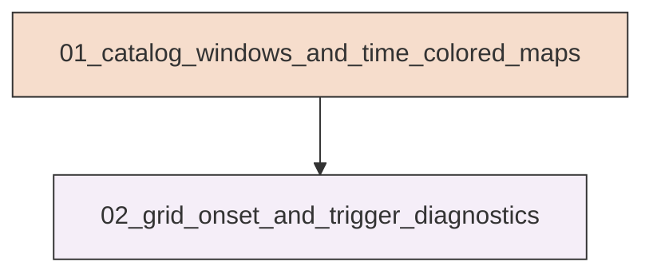
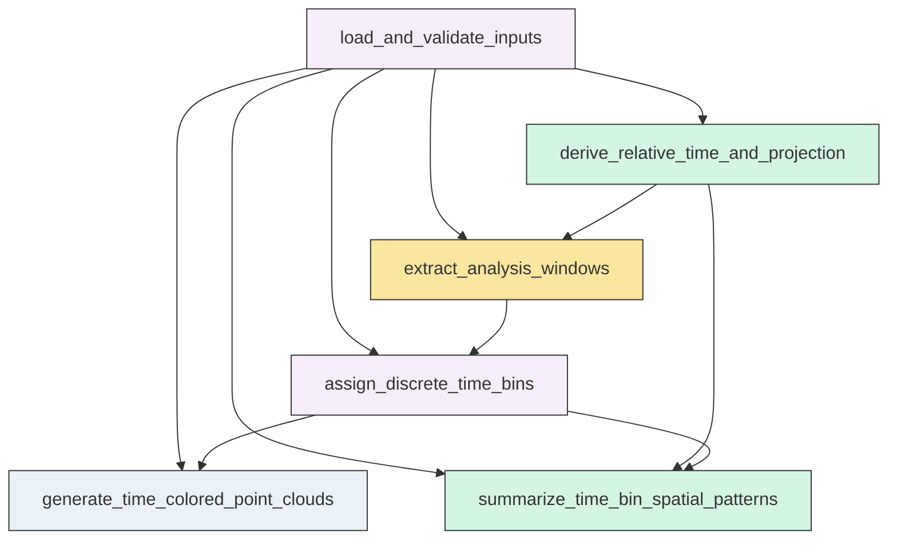
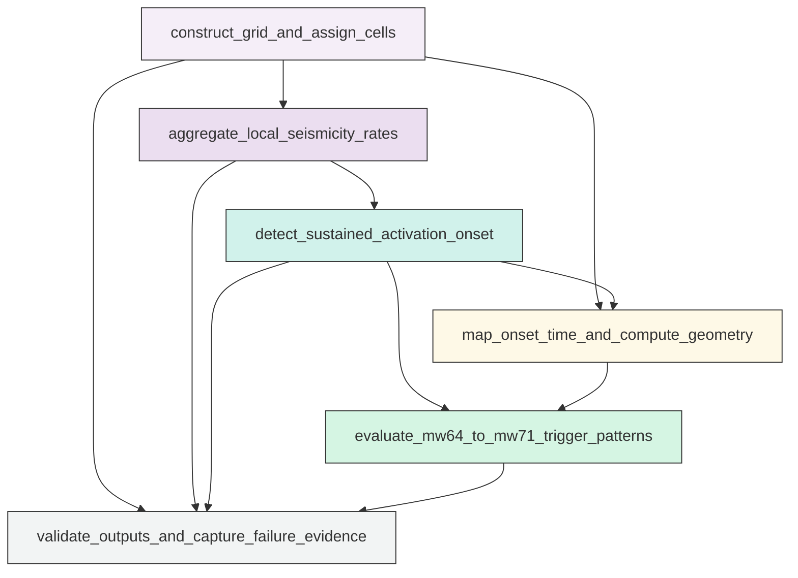

# Workflow Overview

## Top-Level Task Dependencies

**Description:**
- `01_catalog_windows_and_time_colored_maps`: Load and validate the Ridgecrest catalog, derive relative-time and projected-coordinate fields, create analysis windows, and generate time-colored epicenter products with bin summaries.
- `02_grid_onset_and_trigger_diagnostics`: Build the 0.5 km grid, estimate sustained-activation onset times, map onset patterns, and compute Mw 6.4-to-Mw 7.1 trigger diagnostics.

## Subtask Dependencies

#### 01_catalog_windows_and_time_colored_maps
**Usage**: Load and validate the Ridgecrest catalog, derive relative-time and projected-coordinate fields, create analysis windows, and generate time-colored epicenter products with bin summaries.

**Description:**
- `load_and_validate_inputs`: Read the catalog and mainshock tables, validate required columns, and verify unique Mw 6.4 and Mw 7.1 reference events.
- `derive_relative_time_and_projection`: Compute relative times from Mw 6.4 and project epicenters to local Cartesian coordinates for distance-based analyses.
- `extract_analysis_windows`: Build the short and long post-Mw 6.4 event subsets and summarize their temporal and spatial extents.
- `assign_discrete_time_bins`: Assign fixed categorical time bins for the short and long windows without within-bin interpolation.
- `generate_time_colored_point_clouds`: Create categorical longitude-latitude epicenter scatter plots for both time windows with mainshock overlays.
- `summarize_time_bin_spatial_patterns`: Compute descriptive spatial summaries for each time bin to support assessment of temporal layering and migration.

#### 02_grid_onset_and_trigger_diagnostics
**Usage**: Build the 0.5 km grid, estimate sustained-activation onset times, map onset patterns, and compute Mw 6.4-to-Mw 7.1 trigger diagnostics.

**Description:**
- `construct_grid_and_assign_cells`: Define the 0.5 km study grid from the long-window catalog extent and assign events to spatial cells and 30-minute bins.
- `aggregate_local_seismicity_rates`: Build per-cell 30-minute count series and occupancy summaries while preserving zero-count bins.
- `detect_sustained_activation_onset`: Apply one uniform sustained-rate rule to estimate onset time and quality flags for each occupied cell.
- `map_onset_time_and_compute_geometry`: Create the onset-time spatial map and compute geometric metrics relative to the Mw 6.4-Mw 7.1 frame.
- `evaluate_mw64_to_mw71_trigger_patterns`: Compare Mw 6.4 vicinity, connecting corridor, and Mw 7.1 vicinity activation histories to classify the trigger style.
- `validate_outputs_and_capture_failure_evidence`: Verify merged scientific outputs, check onset coverage and ranges, and record any failures or dropped cells.