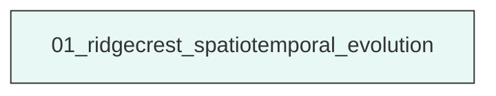
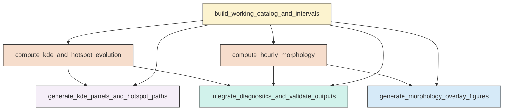

# Research Codings

## Task Overview


**Description:**
- `01_ridgecrest_spatiotemporal_evolution`: Build the inter-mainshock catalog, compute KDE and morphology diagnostics, generate figures, and validate merged outputs for the Ridgecrest sequence.


## Task Details


#### 01_ridgecrest_spatiotemporal_evolution
**Usage**: Build the inter-mainshock catalog, compute KDE and morphology diagnostics, generate figures, and validate merged outputs for the Ridgecrest sequence.

**Description:**
- `build_working_catalog_and_intervals`: Read the catalog and mainshock tables, clean records, subset the inter-mainshock window, and define shared interval schemes and spatial reference.
- `compute_kde_and_hotspot_evolution`: Compute fixed-bandwidth KDE on a common grid for all KDE intervals, extract hotspot maxima, and save interval summaries and manifests.
- `generate_kde_panels_and_hotspot_paths`: Create paginated 2x4 KDE panel figures for both stages and plot hotspot migration paths with mainshock overlays.
- `compute_hourly_morphology`: Compute hourly convex hull and alpha-shape geometries, extract morphology metrics, and serialize boundary coordinates.
- `generate_morphology_overlay_figures`: Plot all hourly convex hull and alpha-shape boundaries in a common frame using time-encoded boundary colors and mainshock overlays.
- `integrate_diagnostics_and_validate_outputs`: Merge KDE and morphology diagnostics, assign machine-readable interpretation labels, and record validation and run logs.

#### Coding Script

```python

import json
import math
import os
import shutil
import sys
import traceback
from dataclasses import dataclass
from pathlib import Path

import matplotlib
matplotlib.use('Agg')
import matplotlib.pyplot as plt
import numpy as np
import pandas as pd
from joblib import Parallel, delayed
from matplotlib.collections import LineCollection
from matplotlib.colors import Normalize
from pyproj import CRS, Transformer
from scipy.ndimage import label
from scipy.spatial import ConvexHull, Delaunay, QhullError
from scipy.stats import gaussian_kde
from shapely.geometry import LineString, MultiLineString, MultiPoint, MultiPolygon, Polygon
from shapely.ops import polygonize, unary_union

CATALOG_PATH = Path('<REPO_ROOT>/examples/ridgecrest/data/catalog_TRACE/TRACE_ridgecrest_relocated.csv')
MAINSHOCK_PATH = Path('<REPO_ROOT>/examples/ridgecrest/data/catalog_TRACE/main_shock_events.csv')
SCRIPT_PATH = Path('../exp_run/scripts/01_ridgecrest_spatiotemporal_evolution.py')
OUTPUT_DIR = Path('../exp_run/outputs/01_ridgecrest_spatiotemporal_evolution')
MAX_CORES = min(64, max(1, os.cpu_count() or 1))
GRID_NX = 220
GRID_NY = 220
MAP_MARGIN_DEG = 0.03
MIN_POINTS_KDE = 5
MIN_POINTS_GEOM = 3
FIXED_ALPHA_SCALE = 1.8
FIG_DPI = 200


@dataclass
class Interval:
    interval_id: str
    stage: str
    start: pd.Timestamp
    end: pd.Timestamp
    elapsed_start_hr: float
    elapsed_end_hr: float


def log(message: str) -> None:
    print(message, flush=True)


def reset_output_dir(output_dir: Path) -> None:
    output_dir.mkdir(parents=True, exist_ok=True)
    for child in output_dir.iterdir():
        if child.is_file() or child.is_symlink():
            child.unlink()
        elif child.is_dir():
            shutil.rmtree(child)


def ensure_dirs(base: Path) -> dict:
    paths = {
        'tables': base / 'tables',
        'figures': base / 'figures',
        'manifests': base / 'manifests',
        'logs': base / 'logs',
    }
    for p in paths.values():
        p.mkdir(parents=True, exist_ok=True)
    return paths


def load_catalog() -> tuple[pd.DataFrame, pd.DataFrame]:
    log(f'[1/8] Reading catalog: {CATALOG_PATH}')
    catalog = pd.read_csv(CATALOG_PATH)
    main = pd.read_csv(MAINSHOCK_PATH)
    required = ['event_time', 'latitude', 'longitude', 'depth_km', 'magnitude']
    for name, df in [('catalog', catalog), ('mainshock', main)]:
        missing = [c for c in required if c not in df.columns]
        if missing:
            raise ValueError(f'{name} file missing columns: {missing}')
    return catalog, main


def clean_catalog(df: pd.DataFrame, label_name: str) -> pd.DataFrame:
    before = len(df)
    out = df.copy()
    out['event_time'] = pd.to_datetime(out['event_time'], utc=True, errors='coerce')
    for col in ['latitude', 'longitude', 'depth_km', 'magnitude']:
        out[col] = pd.to_numeric(out[col], errors='coerce')
    out = out.dropna(subset=['event_time', 'latitude', 'longitude', 'depth_km', 'magnitude']).copy()
    out = out[np.isfinite(out['latitude']) & np.isfinite(out['longitude']) & np.isfinite(out['depth_km']) & np.isfinite(out['magnitude'])].copy()
    out = out.sort_values('event_time').reset_index(drop=True)
    log(f'  Cleaned {label_name}: {before} -> {len(out)} rows')
    return out


def identify_mainshocks(main: pd.DataFrame) -> pd.DataFrame:
    main = main.sort_values('event_time').reset_index(drop=True).copy()
    if len(main) < 2:
        raise ValueError('Expected at least two rows in main shock file.')
    idx64 = (main['magnitude'] - 6.4).abs().idxmin()
    idx71 = (main['magnitude'] - 7.1).abs().idxmin()
    ms64 = main.loc[idx64].copy()
    ms71 = main.loc[idx71].copy()
    if ms64['event_time'] >= ms71['event_time']:
        main_sorted = main.sort_values('event_time').reset_index(drop=True)
        ms64 = main_sorted.iloc[0].copy()
        ms71 = main_sorted.iloc[-1].copy()
    result = pd.DataFrame([ms64, ms71]).reset_index(drop=True)
    result['label'] = ['Mainshock64', 'Mainshock71']
    return result[['label', 'event_time', 'latitude', 'longitude', 'depth_km', 'magnitude']]


def build_intervals(start: pd.Timestamp, end: pd.Timestamp, step: pd.Timedelta, stage: str, prefix: str) -> list[Interval]:
    intervals = []
    current = start
    counter = 1
    while current < end:
        nxt = min(current + step, end)
        intervals.append(
            Interval(
                interval_id=f'{prefix}_{counter:02d}',
                stage=stage,
                start=current,
                end=nxt,
                elapsed_start_hr=(current - start).total_seconds() / 3600.0,
                elapsed_end_hr=(nxt - start).total_seconds() / 3600.0,
            )
        )
        current = nxt
        counter += 1
    return intervals


def assign_local_projection(mean_lon: float, mean_lat: float) -> tuple[CRS, Transformer, Transformer]:
    proj4 = f'+proj=aeqd +lat_0={mean_lat} +lon_0={mean_lon} +datum=WGS84 +units=km +no_defs'
    crs_geo = CRS.from_epsg(4326)
    crs_local = CRS.from_proj4(proj4)
    to_local = Transformer.from_crs(crs_geo, crs_local, always_xy=True)
    to_geo = Transformer.from_crs(crs_local, crs_geo, always_xy=True)
    return crs_local, to_local, to_geo


def silverman_bandwidth_km(xy: np.ndarray) -> float:
    if xy.shape[0] < 2:
        return 1.0
    std_xy = np.std(xy, axis=0, ddof=1)
    sigma = float(np.mean(std_xy[std_xy > 0])) if np.any(std_xy > 0) else 1.0
    n = xy.shape[0]
    bw = 1.06 * sigma * n ** (-1.0 / 6.0)
    return max(bw, 0.5)


def alpha_shape(points: np.ndarray, alpha: float):
    if len(points) < 4:
        return MultiPoint(points).convex_hull
    tri = Delaunay(points)
    edge_counter = {}
    for ia, ib, ic in tri.simplices:
        pa, pb, pc = points[ia], points[ib], points[ic]
        a = np.linalg.norm(pb - pc)
        b = np.linalg.norm(pa - pc)
        c = np.linalg.norm(pa - pb)
        s = (a + b + c) / 2.0
        area_sq = s * (s - a) * (s - b) * (s - c)
        if area_sq <= 0:
            continue
        area = math.sqrt(area_sq)
        circum_r = a * b * c / (4.0 * area)
        if circum_r < 1.0 / max(alpha, 1e-12):
            for i, j in [(ia, ib), (ib, ic), (ic, ia)]:
                edge = tuple(sorted((i, j)))
                edge_counter[edge] = edge_counter.get(edge, 0) + 1
    edge_points = [LineString([points[i], points[j]]) for (i, j), count in edge_counter.items() if count == 1]
    if not edge_points:
        return MultiPoint(points).convex_hull
    polygons = list(polygonize(MultiLineString(edge_points)))
    if not polygons:
        return MultiPoint(points).convex_hull
    return unary_union(polygons)


def geometry_to_boundaries(geom, to_geo: Transformer):
    lines = []
    if geom is None or geom.is_empty:
        return lines
    if isinstance(geom, Polygon):
        coords = np.asarray(geom.exterior.coords)
        lon, lat = to_geo.transform(coords[:, 0], coords[:, 1])
        lines.append(np.column_stack([lon, lat]))
    elif isinstance(geom, MultiPolygon):
        for poly in geom.geoms:
            coords = np.asarray(poly.exterior.coords)
            lon, lat = to_geo.transform(coords[:, 0], coords[:, 1])
            lines.append(np.column_stack([lon, lat]))
    elif isinstance(geom, GeometryCollection):
        for subgeom in geom.geoms:
            lines.extend(geometry_to_boundaries(subgeom, to_geo))
    return lines


def component_count(geom) -> int:
    if geom is None or geom.is_empty:
        return 0
    if isinstance(geom, Polygon):
        return 1
    if isinstance(geom, MultiPolygon):
        return len(geom.geoms)
    return 1


def process_kde_interval(interval: Interval, df: pd.DataFrame, x_grid: np.ndarray, y_grid: np.ndarray, main71_xy: np.ndarray, include_end: bool):
    if include_end:
        mask = (df['event_time'] >= interval.start) & (df['event_time'] <= interval.end)
    else:
        mask = (df['event_time'] >= interval.start) & (df['event_time'] < interval.end)
    sub = df.loc[mask].copy()
    result = {
        'interval_id': interval.interval_id,
        'stage': interval.stage,
        'start': interval.start,
        'end': interval.end,
        'elapsed_start_hr': interval.elapsed_start_hr,
        'elapsed_end_hr': interval.elapsed_end_hr,
        'event_count': int(len(sub)),
        'status': 'ok',
        'hotspot_x_km': np.nan,
        'hotspot_y_km': np.nan,
        'hotspot_lon': np.nan,
        'hotspot_lat': np.nan,
        'peak_density': np.nan,
        'distance_to_main71_km': np.nan,
        'distance_to_main64_km': np.nan,
        'high_density_area_km2': np.nan,
        'high_density_patch_count': np.nan,
        'kde_array_path': '',
    }
    if len(sub) < MIN_POINTS_KDE:
        result['status'] = 'insufficient_points'
        return result, None
    xy = sub[['x_km', 'y_km']].to_numpy().T
    try:
        if np.linalg.matrix_rank(np.cov(xy)) < 2:
            result['status'] = 'degenerate_points'
            return result, None
        kde = gaussian_kde(xy, bw_method=GLOBAL_KDE_BW_FACTOR)
        positions = np.vstack([x_grid.ravel(), y_grid.ravel()])
        z = kde(positions).reshape(x_grid.shape)
    except np.linalg.LinAlgError:
        result['status'] = 'degenerate_points'
        return result, None
    idx = np.unravel_index(np.nanargmax(z), z.shape)
    hx = float(x_grid[idx])
    hy = float(y_grid[idx])
    result['hotspot_x_km'] = hx
    result['hotspot_y_km'] = hy
    result['peak_density'] = float(z[idx])
    result['distance_to_main71_km'] = float(np.hypot(hx - main71_xy[0], hy - main71_xy[1]))
    return result, z


def process_geometry_interval(interval: Interval, df: pd.DataFrame, main71_xy: np.ndarray, alpha_value: float, include_end: bool):
    if include_end:
        mask = (df['event_time'] >= interval.start) & (df['event_time'] <= interval.end)
    else:
        mask = (df['event_time'] >= interval.start) & (df['event_time'] < interval.end)
    sub = df.loc[mask].copy()
    result = {
        'interval_id': interval.interval_id,
        'start': interval.start,
        'end': interval.end,
        'elapsed_start_hr': interval.elapsed_start_hr,
        'elapsed_end_hr': interval.elapsed_end_hr,
        'event_count': int(len(sub)),
        'convex_valid': False,
        'alpha_valid': False,
        'convex_area_km2': np.nan,
        'convex_perimeter_km': np.nan,
        'convex_centroid_x_km': np.nan,
        'convex_centroid_y_km': np.nan,
        'convex_centroid_distance_to_main71_km': np.nan,
        'alpha_area_km2': np.nan,
        'alpha_perimeter_km': np.nan,
        'alpha_centroid_x_km': np.nan,
        'alpha_centroid_y_km': np.nan,
        'alpha_centroid_distance_to_main71_km': np.nan,
        'alpha_component_count': 0,
        'status': 'ok',
    }
    boundaries = {'interval_id': interval.interval_id, 'convex': [], 'alpha': []}
    if len(sub) < MIN_POINTS_GEOM:
        result['status'] = 'insufficient_points'
        return result, boundaries
    points = sub[['x_km', 'y_km']].to_numpy()
    unique_points = np.unique(points, axis=0)
    if len(unique_points) < MIN_POINTS_GEOM:
        result['status'] = 'insufficient_unique_points'
        return result, boundaries
    try:
        hull = ConvexHull(unique_points)
        hull_coords = unique_points[hull.vertices]
        hull_polygon = Polygon(hull_coords)
        if hull_polygon.is_valid and not hull_polygon.is_empty and hull_polygon.area > 0:
            centroid = hull_polygon.centroid
            result['convex_valid'] = True
            result['convex_area_km2'] = float(hull_polygon.area)
            result['convex_perimeter_km'] = float(hull_polygon.length)
            result['convex_centroid_x_km'] = float(centroid.x)
            result['convex_centroid_y_km'] = float(centroid.y)
            result['convex_centroid_distance_to_main71_km'] = float(np.hypot(centroid.x - main71_xy[0], centroid.y - main71_xy[1]))
            boundaries['convex_geom'] = hull_polygon
    except (QhullError, ValueError):
        pass
    try:
        ashape = alpha_shape(unique_points, alpha_value)
        if ashape is not None and not ashape.is_empty and ashape.area > 0:
            centroid = ashape.centroid
            result['alpha_valid'] = True
            result['alpha_area_km2'] = float(ashape.area)
            result['alpha_perimeter_km'] = float(ashape.length)
            result['alpha_centroid_x_km'] = float(centroid.x)
            result['alpha_centroid_y_km'] = float(centroid.y)
            result['alpha_centroid_distance_to_main71_km'] = float(np.hypot(centroid.x - main71_xy[0], centroid.y - main71_xy[1]))
            result['alpha_component_count'] = component_count(ashape)
            boundaries['alpha_geom'] = ashape
    except (QhullError, ValueError, np.linalg.LinAlgError):
        result['alpha_error'] = 'alpha_shape_failed'
    if not result['convex_valid'] and not result['alpha_valid']:
        result['status'] = 'invalid_geometry'
    return result, boundaries


def save_paginated_kde(stage_name: str, intervals: list[Interval], summary_df: pd.DataFrame, kde_map: dict, lon_grid: np.ndarray, lat_grid: np.ndarray, extent: tuple, vmin: float, vmax: float, main_df: pd.DataFrame, fig_dir: Path):
    pages = [intervals[i:i + 8] for i in range(0, len(intervals), 8)]
    out_paths = []
    for page_num, page_intervals in enumerate(pages, start=1):
        fig, axes = plt.subplots(2, 4, figsize=(16, 8), constrained_layout=True)
        axes = axes.ravel()
        for ax in axes:
            ax.set_xlim(extent[0], extent[1])
            ax.set_ylim(extent[2], extent[3])
            ax.set_aspect('equal', adjustable='box')
        for ax, interval in zip(axes, page_intervals):
            row = summary_df.loc[summary_df['interval_id'] == interval.interval_id].iloc[0]
            if row['status'] == 'ok' and interval.interval_id in kde_map:
                ax.imshow(
                    kde_map[interval.interval_id],
                    origin='lower',
                    extent=extent,
                    cmap='viridis',
                    vmin=vmin,
                    vmax=vmax,
                    interpolation='nearest',
                    aspect='auto',
                )
            else:
                ax.text(0.5, 0.5, f"{row['status']}\nN={int(row['event_count'])}", transform=ax.transAxes, ha='center', va='center', fontsize=10)
            ax.scatter(main_df['longitude'], main_df['latitude'], c=['cyan', 'red'], s=30, marker='*', edgecolors='k', linewidths=0.5, zorder=5)
            ax.set_title(f"{interval.interval_id}\n{interval.start.strftime('%m-%d %H:%M')} to {interval.end.strftime('%H:%M')}\nN={int(row['event_count'])}", fontsize=9)
            ax.set_xlabel('Longitude')
            ax.set_ylabel('Latitude')
        for ax in axes[len(page_intervals):]:
            ax.axis('off')
        fig.suptitle(f'{stage_name} KDE evolution (page {page_num})', fontsize=14)
        out_path = fig_dir / f'{stage_name.lower()}_kde_page_{page_num:02d}.png'
        fig.savefig(out_path, dpi=FIG_DPI)
        plt.close(fig)
        out_paths.append(out_path)
    return out_paths


def plot_hotspot_paths(summary_df: pd.DataFrame, stage_name: str, extent: tuple, main_df: pd.DataFrame, out_path: Path):
    sub = summary_df[(summary_df['stage'] == stage_name) & (summary_df['status'] == 'ok')].copy()
    fig, ax = plt.subplots(figsize=(8, 7), constrained_layout=True)
    ax.set_xlim(extent[0], extent[1])
    ax.set_ylim(extent[2], extent[3])
    ax.set_aspect('equal', adjustable='box')
    if len(sub) > 0:
        points = sub[['hotspot_lon', 'hotspot_lat']].to_numpy()
        times = sub['elapsed_end_hr'].to_numpy()
        if len(points) >= 2:
            segs = np.stack([points[:-1], points[1:]], axis=1)
            lc = LineCollection(segs, cmap='plasma', norm=Normalize(vmin=times.min(), vmax=times.max()), linewidths=2)
            lc.set_array(times[1:])
            ax.add_collection(lc)
        sc = ax.scatter(points[:, 0], points[:, 1], c=times, cmap='plasma', edgecolors='k', s=50, zorder=4)
        for _, row in sub.iterrows():
            ax.text(row['hotspot_lon'], row['hotspot_lat'], row['interval_id'].split('_')[-1], fontsize=8)
    ax.scatter(main_df['longitude'], main_df['latitude'], c=['cyan', 'red'], s=80, marker='*', edgecolors='k', linewidths=0.7, zorder=5)
    ax.set_title(f'{stage_name} hotspot migration path')
    ax.set_xlabel('Longitude')
    ax.set_ylabel('Latitude')
    fig.savefig(out_path, dpi=FIG_DPI)
    plt.close(fig)


def plot_geometry_overlay(boundary_records: list[dict], geom_key: str, extent: tuple, main_df: pd.DataFrame, out_path: Path, title: str):
    fig, ax = plt.subplots(figsize=(9, 8), constrained_layout=True)
    ax.set_xlim(extent[0], extent[1])
    ax.set_ylim(extent[2], extent[3])
    ax.set_aspect('equal', adjustable='box')
    valid = [r for r in boundary_records if r.get('elapsed_mid_hr') is not None and len(r.get(geom_key, [])) > 0]
    if valid:
        times = np.array([r['elapsed_mid_hr'] for r in valid], dtype=float)
        norm = Normalize(vmin=float(np.min(times)), vmax=float(np.max(times)))
        cmap = plt.get_cmap('turbo')
        for rec in valid:
            color = cmap(norm(rec['elapsed_mid_hr']))
            for boundary in rec[geom_key]:
                ax.plot(boundary[:, 0], boundary[:, 1], color=color, linewidth=1.5, alpha=0.9)
    ax.scatter(main_df['longitude'], main_df['latitude'], c=['cyan', 'red'], s=80, marker='*', edgecolors='k', linewidths=0.7, zorder=5)
    ax.set_title(title)
    ax.set_xlabel('Longitude')
    ax.set_ylabel('Latitude')
    fig.savefig(out_path, dpi=FIG_DPI)
    plt.close(fig)


def classify_interval(row: pd.Series, median_high_density_area: float) -> str:
    kde_status = row.get('status_kde', row.get('status', ''))
    if kde_status != 'ok' and row.get('convex_valid', False) is False and row.get('alpha_valid', False) is False:
        return 'insufficient-data'
    patch_count = row.get('high_density_patch_count', np.nan)
    dist_step = row.get('hotspot_step_km', np.nan)
    dist71 = row.get('distance_to_main71_km', np.nan)
    delta71 = row.get('distance_to_main71_change_km', np.nan)
    alpha_components = row.get('alpha_component_count', 0)
    high_area = row.get('high_density_area_km2', np.nan)
    if pd.notna(alpha_components) and alpha_components >= 2:
        return 'fragmented'
    if pd.notna(patch_count) and patch_count >= 2:
        return 'fragmented'
    if pd.notna(delta71) and delta71 < 0 and pd.notna(high_area) and high_area <= median_high_density_area:
        return 'focusing'
    if pd.notna(delta71) and delta71 > 0:
        return 'defocusing'
    if pd.notna(high_area) and high_area > median_high_density_area and pd.notna(dist_step) and dist_step > 2.0:
        return 'defocusing'
    return 'mixed'


def main():
    global GLOBAL_KDE_BW_FACTOR
    try:
        log(f'Preparing output directory: {OUTPUT_DIR}')
        reset_output_dir(OUTPUT_DIR)
        dirs = ensure_dirs(OUTPUT_DIR)
        catalog_raw, main_raw = load_catalog()
        catalog = clean_catalog(catalog_raw, 'catalog')
        main_df = clean_catalog(main_raw, 'mainshock')
        main_meta = identify_mainshocks(main_df)
        ms64 = main_meta.loc[main_meta['label'] == 'Mainshock64'].iloc[0]
        ms71 = main_meta.loc[main_meta['label'] == 'Mainshock71'].iloc[0]
        t64 = ms64['event_time']
        t71 = ms71['event_time']
        if t64 >= t71:
            raise ValueError('Mainshock64 time must be earlier than Mainshock71 time.')
        log(f'[2/8] Building inter-mainshock catalog from {t64} to {t71}')
        inter = catalog[(catalog['event_time'] >= t64) & (catalog['event_time'] <= t71)].copy().reset_index(drop=True)
        if inter.empty:
            raise ValueError('Inter-mainshock catalog is empty.')
        inter['elapsed_hr_since_64'] = (inter['event_time'] - t64).dt.total_seconds() / 3600.0
        mean_lon = float(inter['longitude'].mean())
        mean_lat = float(inter['latitude'].mean())
        crs_local, to_local, to_geo = assign_local_projection(mean_lon, mean_lat)
        inter['x_km'], inter['y_km'] = to_local.transform(inter['longitude'].to_numpy(), inter['latitude'].to_numpy())
        inter['x_km'] = pd.to_numeric(inter['x_km'], errors='coerce')
        inter['y_km'] = pd.to_numeric(inter['y_km'], errors='coerce')
        inter = inter.dropna(subset=['x_km', 'y_km']).reset_index(drop=True)
        main_meta['x_km'], main_meta['y_km'] = to_local.transform(main_meta['longitude'].to_numpy(), main_meta['latitude'].to_numpy())
        main_meta['x_km'] = pd.to_numeric(main_meta['x_km'], errors='coerce')
        main_meta['y_km'] = pd.to_numeric(main_meta['y_km'], errors='coerce')
        if main_meta[['x_km', 'y_km']].isna().any().any():
            raise ValueError('Projection of mainshock coordinates failed.')
        main64_xy = main_meta.loc[main_meta['label'] == 'Mainshock64', ['x_km', 'y_km']].iloc[0].to_numpy(dtype=float)
        main71_xy = main_meta.loc[main_meta['label'] == 'Mainshock71', ['x_km', 'y_km']].iloc[0].to_numpy(dtype=float)
        extent = (
            float(inter['longitude'].min() - MAP_MARGIN_DEG),
            float(inter['longitude'].max() + MAP_MARGIN_DEG),
            float(inter['latitude'].min() - MAP_MARGIN_DEG),
            float(inter['latitude'].max() + MAP_MARGIN_DEG),
        )
        x_min, y_min = to_local.transform(extent[0], extent[2])
        x_max, y_max = to_local.transform(extent[1], extent[3])
        x_grid_vals = np.linspace(min(x_min, x_max), max(x_min, x_max), GRID_NX)
        y_grid_vals = np.linspace(min(y_min, y_max), max(y_min, y_max), GRID_NY)
        x_grid, y_grid = np.meshgrid(x_grid_vals, y_grid_vals)
        grid_lon, grid_lat = to_geo.transform(x_grid, y_grid)
        stage1_end = min(t64 + pd.Timedelta(hours=4), t71)
        stage1_intervals = build_intervals(t64, stage1_end, pd.Timedelta(minutes=30), 'Stage1', 'S1')
        stage2_intervals = build_intervals(stage1_end, t71, pd.Timedelta(hours=2), 'Stage2', 'S2') if stage1_end < t71 else []
        morph_intervals = build_intervals(t64, t71, pd.Timedelta(hours=1), 'Morphology', 'M')
        interval_rows = []
        for seq in [stage1_intervals, stage2_intervals, morph_intervals]:
            for iv in seq:
                interval_rows.append({
                    'interval_id': iv.interval_id,
                    'stage': iv.stage,
                    'start': iv.start,
                    'end': iv.end,
                    'elapsed_start_hr': iv.elapsed_start_hr,
                    'elapsed_end_hr': iv.elapsed_end_hr,
                })
        interval_df = pd.DataFrame(interval_rows)
        expected_interval_cols = ['interval_id', 'stage', 'start', 'end', 'elapsed_start_hr', 'elapsed_end_hr']
        if interval_df.empty or any(col not in interval_df.columns for col in expected_interval_cols):
            raise ValueError('Interval definition table is empty or malformed.')
        full_xy = inter[['x_km', 'y_km']].to_numpy()
        fixed_bw_km = silverman_bandwidth_km(full_xy)
        sigma0 = float(np.mean(np.std(full_xy, axis=0, ddof=1))) if len(full_xy) > 1 else 1.0
        GLOBAL_KDE_BW_FACTOR = max(fixed_bw_km / sigma0, 1e-3)
        nn_scale = np.sqrt(np.var(full_xy[:, 0]) + np.var(full_xy[:, 1])) if len(full_xy) > 1 else 1.0
        alpha_value = 1.0 / max(FIXED_ALPHA_SCALE * max(nn_scale / max(np.sqrt(len(full_xy)), 1.0), 0.5), 1e-6)
        log(f'  Fixed KDE bandwidth ~ {fixed_bw_km:.3f} km; gaussian_kde factor={GLOBAL_KDE_BW_FACTOR:.6f}')
        log(f'  Fixed alpha-shape parameter = {alpha_value:.6f}')
        log(f'[3/8] Running KDE intervals with up to {MAX_CORES} cores')
        kde_intervals = stage1_intervals + stage2_intervals
        kde_results = Parallel(n_jobs=MAX_CORES, backend='loky', verbose=10)(
            delayed(process_kde_interval)(iv, inter, x_grid, y_grid, main71_xy, iv.end == t71) for iv in kde_intervals
        )
        kde_summary_rows = []
        kde_arrays = {}
        for row, arr in kde_results:
            kde_summary_rows.append(row)
            if arr is not None:
                kde_arrays[row['interval_id']] = arr
        kde_summary = pd.DataFrame(kde_summary_rows).sort_values('start').reset_index(drop=True)
        expected_kde_cols = ['interval_id', 'stage', 'start', 'end', 'event_count', 'status', 'hotspot_x_km', 'hotspot_y_km', 'distance_to_main71_km']
        if kde_summary.empty or any(col not in kde_summary.columns for col in expected_kde_cols):
            raise ValueError('KDE summary table is empty or missing required columns.')
        if kde_arrays:
            global_max = max(float(np.nanmax(v)) for v in kde_arrays.values())
            threshold = 0.6 * global_max
            cell_area = abs((x_grid_vals[1] - x_grid_vals[0]) * (y_grid_vals[1] - y_grid_vals[0]))
            for i, row in kde_summary.iterrows():
                iid = row['interval_id']
                if iid not in kde_arrays:
                    continue
                arr = kde_arrays[iid]
                mask = arr >= threshold
                labeled, num = label(mask)
                kde_summary.loc[i, 'high_density_area_km2'] = float(mask.sum() * cell_area)
                kde_summary.loc[i, 'high_density_patch_count'] = int(num)
                lon, lat = to_geo.transform(row['hotspot_x_km'], row['hotspot_y_km'])
                kde_summary.loc[i, 'hotspot_lon'] = float(lon)
                kde_summary.loc[i, 'hotspot_lat'] = float(lat)
                kde_summary.loc[i, 'distance_to_main64_km'] = float(np.hypot(row['hotspot_x_km'] - main64_xy[0], row['hotspot_y_km'] - main64_xy[1]))
            kde_summary['hotspot_step_km'] = np.nan
            kde_summary['distance_to_main71_change_km'] = np.nan
            for stage_name in ['Stage1', 'Stage2']:
                idxs = kde_summary.index[kde_summary['stage'] == stage_name].tolist()
                prev = None
                prev_d71 = None
                for idx in idxs:
                    if kde_summary.loc[idx, 'status'] != 'ok':
                        continue
                    curr = kde_summary.loc[idx, ['hotspot_x_km', 'hotspot_y_km']].to_numpy(dtype=float)
                    curr_d71 = float(kde_summary.loc[idx, 'distance_to_main71_km'])
                    if prev is not None:
                        kde_summary.loc[idx, 'hotspot_step_km'] = float(np.hypot(curr[0] - prev[0], curr[1] - prev[1]))
                    if prev_d71 is not None:
                        kde_summary.loc[idx, 'distance_to_main71_change_km'] = curr_d71 - prev_d71
                    prev = curr
                    prev_d71 = curr_d71
        else:
            global_max = 0.0
            threshold = np.nan
        log(f'[4/8] Saving KDE outputs and hotspot figures')
        save_paginated_kde('Stage1', stage1_intervals, kde_summary, kde_arrays, grid_lon, grid_lat, extent, 0.0, global_max, main_meta, dirs['figures'])
        if stage2_intervals:
            save_paginated_kde('Stage2', stage2_intervals, kde_summary, kde_arrays, grid_lon, grid_lat, extent, 0.0, global_max, main_meta, dirs['figures'])
        plot_hotspot_paths(kde_summary, 'Stage1', extent, main_meta, dirs['figures'] / 'stage1_hotspot_migration.png')
        if stage2_intervals:
            plot_hotspot_paths(kde_summary, 'Stage2', extent, main_meta, dirs['figures'] / 'stage2_hotspot_migration.png')
        log(f'[5/8] Running morphology intervals with up to {MAX_CORES} cores')
        geom_results = Parallel(n_jobs=MAX_CORES, backend='loky', verbose=10)(
            delayed(process_geometry_interval)(iv, inter, main71_xy, alpha_value, iv.end == t71) for iv in morph_intervals
        )
        geom_rows = []
        boundary_records = []
        for iv, packed in zip(morph_intervals, geom_results):
            row, boundaries = packed
            geom_rows.append(row)
            rec = {'interval_id': iv.interval_id, 'elapsed_mid_hr': 0.5 * (iv.elapsed_start_hr + iv.elapsed_end_hr), 'convex': [], 'alpha': []}
            if 'convex_geom' in boundaries:
                rec['convex'] = geometry_to_boundaries(boundaries['convex_geom'], to_geo)
            if 'alpha_geom' in boundaries:
                rec['alpha'] = geometry_to_boundaries(boundaries['alpha_geom'], to_geo)
            boundary_records.append(rec)
        geom_summary = pd.DataFrame(geom_rows).sort_values('start').reset_index(drop=True)
        expected_geom_cols = ['interval_id', 'start', 'end', 'event_count', 'convex_valid', 'alpha_valid', 'status']
        if geom_summary.empty or any(col not in geom_summary.columns for col in expected_geom_cols):
            raise ValueError('Geometry summary table is empty or missing required columns.')
        boundary_rows = []
        for rec in boundary_records:
            for geom_name in ['convex', 'alpha']:
                for comp_idx, boundary in enumerate(rec[geom_name], start=1):
                    for pt_idx, (lon, lat) in enumerate(boundary):
                        boundary_rows.append({
                            'interval_id': rec['interval_id'],
                            'geometry_type': geom_name,
                            'component_id': comp_idx,
                            'vertex_id': pt_idx,
                            'longitude': float(lon),
                            'latitude': float(lat),
                            'elapsed_mid_hr': rec['elapsed_mid_hr'],
                        })
        boundary_df = pd.DataFrame(boundary_rows)
        log(f'[6/8] Saving geometry overlay figures')
        plot_geometry_overlay(boundary_records, 'convex', extent, main_meta, dirs['figures'] / 'convex_hull_evolution.png', 'Convex hull evolution (hourly)')
        plot_geometry_overlay(boundary_records, 'alpha', extent, main_meta, dirs['figures'] / 'alpha_shape_evolution.png', 'Alpha-shape evolution (hourly)')
        log(f'[7/8] Building merged diagnostics and validation tables')
        valid_areas = kde_summary['high_density_area_km2'].to_numpy(dtype=float)
        median_area = float(np.nanmedian(valid_areas)) if np.any(np.isfinite(valid_areas)) else np.nan
        merged = pd.merge(
            kde_summary,
            geom_summary,
            left_on=['start', 'end'],
            right_on=['start', 'end'],
            how='outer',
            suffixes=('_kde', '_geom')
        ).sort_values('start').reset_index(drop=True)
        required_merged_cols = ['status_kde', 'convex_valid', 'alpha_valid']
        if any(col not in merged.columns for col in required_merged_cols):
            raise ValueError(f'Merged summary missing required columns: {required_merged_cols}')
        if 'interval_id_kde' in merged.columns:
            merged['interval_id'] = merged['interval_id_kde'].fillna(merged.get('interval_id_geom'))
        elif 'interval_id' not in merged.columns:
            merged['interval_id'] = np.nan
        merged['interpretation_label'] = merged.apply(lambda r: classify_interval(r, median_area), axis=1)
        stage_comparison = []
        for stage_name in ['Stage1', 'Stage2']:
            sub = kde_summary[kde_summary['stage'] == stage_name].copy()
            if sub.empty:
                continue
            stage_comparison.append({
                'stage': stage_name,
                'n_intervals': int(len(sub)),
                'n_valid_kde': int((sub['status'] == 'ok').sum()),
                'mean_distance_to_main71_km': float(np.nanmean(sub['distance_to_main71_km'])),
                'mean_hotspot_step_km': float(np.nanmean(sub['hotspot_step_km'])),
                'mean_high_density_area_km2': float(np.nanmean(sub['high_density_area_km2'])),
                'mean_patch_count': float(np.nanmean(sub['high_density_patch_count'])),
            })
        stage_comparison_df = pd.DataFrame(stage_comparison)
        validation = pd.DataFrame([
            {'metric': 'catalog_rows_clean', 'expected': len(catalog), 'completed': len(catalog), 'status': 'ok'},
            {'metric': 'intermainshock_rows', 'expected': len(inter), 'completed': len(inter), 'status': 'ok'},
            {'metric': 'kde_intervals_total', 'expected': len(kde_intervals), 'completed': len(kde_summary), 'status': 'ok' if len(kde_summary) == len(kde_intervals) else 'mismatch'},
            {'metric': 'kde_intervals_valid', 'expected': len(kde_intervals), 'completed': int((kde_summary['status'] == 'ok').sum()), 'status': 'ok' if (kde_summary['status'] == 'ok').sum() > 0 else 'empty'},
            {'metric': 'morph_intervals_total', 'expected': len(morph_intervals), 'completed': len(geom_summary), 'status': 'ok' if len(geom_summary) == len(morph_intervals) else 'mismatch'},
            {'metric': 'convex_valid_count', 'expected': len(morph_intervals), 'completed': int(geom_summary['convex_valid'].sum()), 'status': 'ok' if geom_summary['convex_valid'].sum() > 0 else 'empty'},
            {'metric': 'alpha_valid_count', 'expected': len(morph_intervals), 'completed': int(geom_summary['alpha_valid'].sum()), 'status': 'ok' if geom_summary['alpha_valid'].sum() > 0 else 'empty'},
        ])
        metadata = {
            'catalog_path': str(CATALOG_PATH),
            'mainshock_path': str(MAINSHOCK_PATH),
            'script_path': str(SCRIPT_PATH),
            'output_dir': str(OUTPUT_DIR),
            'max_cores_used': MAX_CORES,
            'map_extent_lon_lat': extent,
            'grid_shape': [GRID_NY, GRID_NX],
            'fixed_kde_bandwidth_km': fixed_bw_km,
            'gaussian_kde_factor': GLOBAL_KDE_BW_FACTOR,
            'fixed_alpha_parameter': alpha_value,
            'projection_proj4': crs_local.to_proj4(),
            'mainshock64_time_utc': str(t64),
            'mainshock71_time_utc': str(t71),
            'kde_global_max_density': global_max,
            'kde_high_density_threshold': threshold,
        }
        log(f'[8/8] Writing outputs')
        inter.to_csv(dirs['tables'] / 'intermainshock_catalog.csv', index=False)
        main_meta.to_csv(dirs['tables'] / 'mainshock_metadata.csv', index=False)
        interval_df.to_csv(dirs['tables'] / 'interval_definitions.csv', index=False)
        kde_summary.to_csv(dirs['tables'] / 'kde_interval_summary.csv', index=False)
        geom_summary.to_csv(dirs['tables'] / 'morphology_interval_summary.csv', index=False)
        merged.to_csv(dirs['tables'] / 'merged_kde_morphology_summary.csv', index=False)
        stage_comparison_df.to_csv(dirs['tables'] / 'stage_comparison_summary.csv', index=False)
        validation.to_csv(dirs['tables'] / 'validation_summary.csv', index=False)
        boundary_df.to_csv(dirs['tables'] / 'geometry_boundaries.csv', index=False)
        with open(dirs['manifests'] / 'analysis_metadata.json', 'w', encoding='utf-8') as f:
            json.dump(metadata, f, indent=2)
        with open(dirs['logs'] / 'run_log.txt', 'w', encoding='utf-8') as f:
            f.write('Ridgecrest spatiotemporal evolution analysis completed successfully.\n')
            f.write(json.dumps(metadata, indent=2))
            f.write('\n')
        log('Done.')
    except Exception:
        print(traceback.format_exc(), file=sys.stderr, flush=True)
        sys.exit(1)


GLOBAL_KDE_BW_FACTOR = 0.1

if __name__ == '__main__':
    main()


```