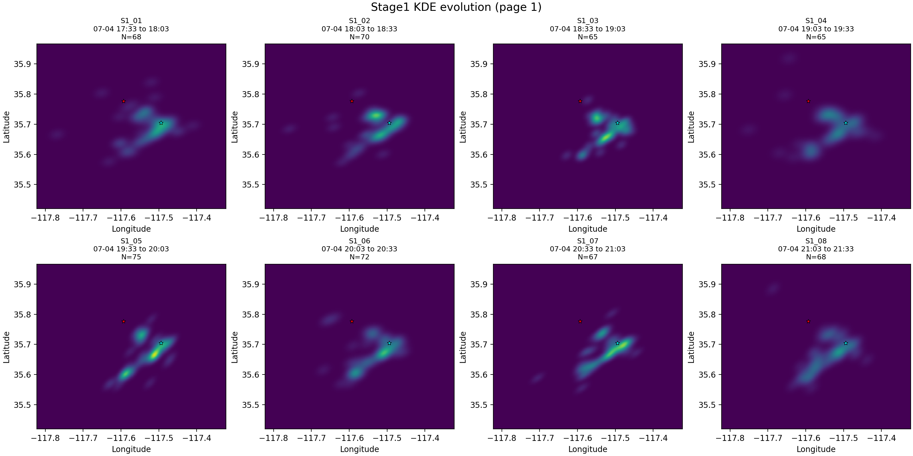
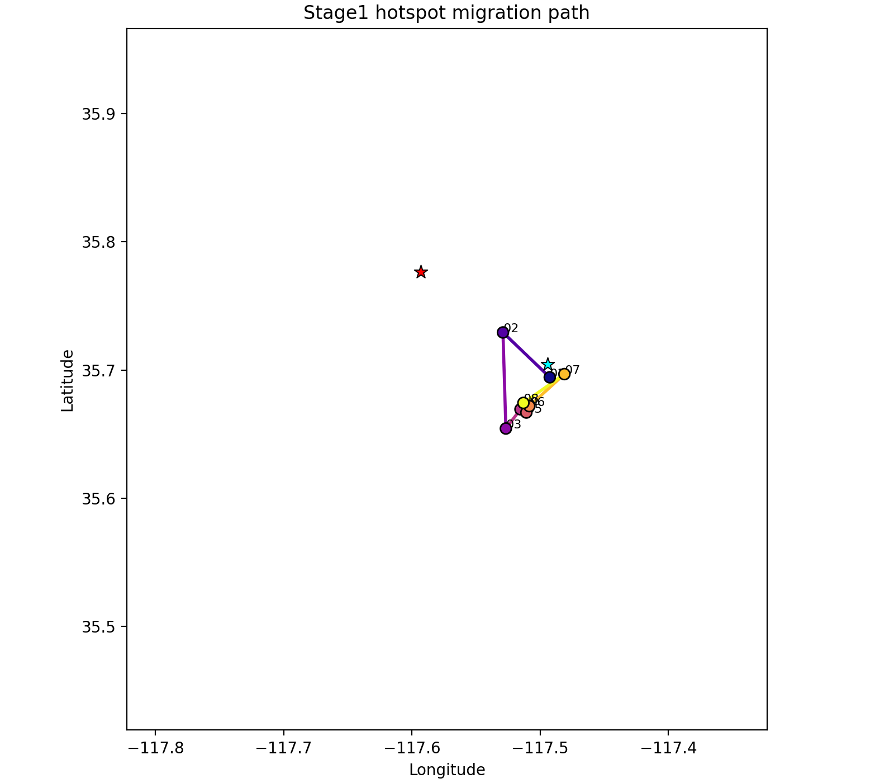
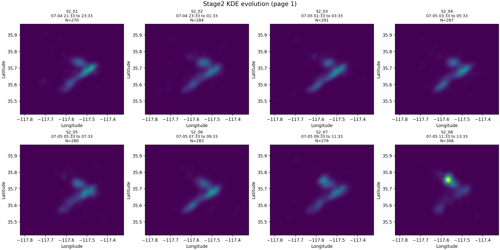
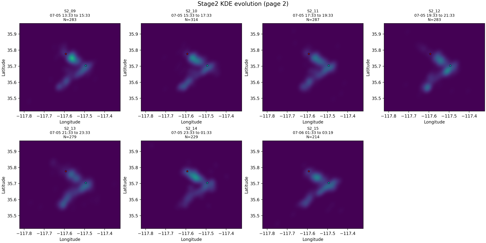
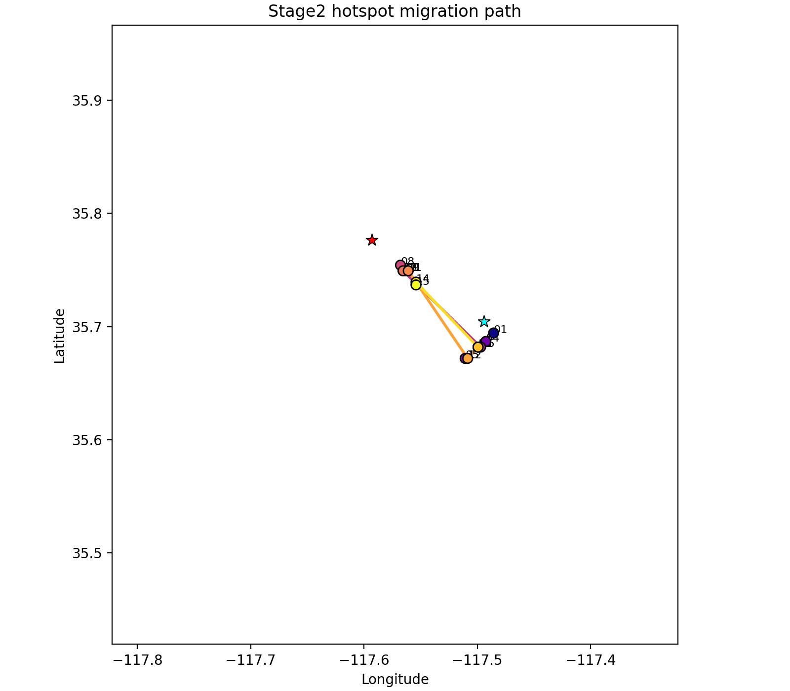
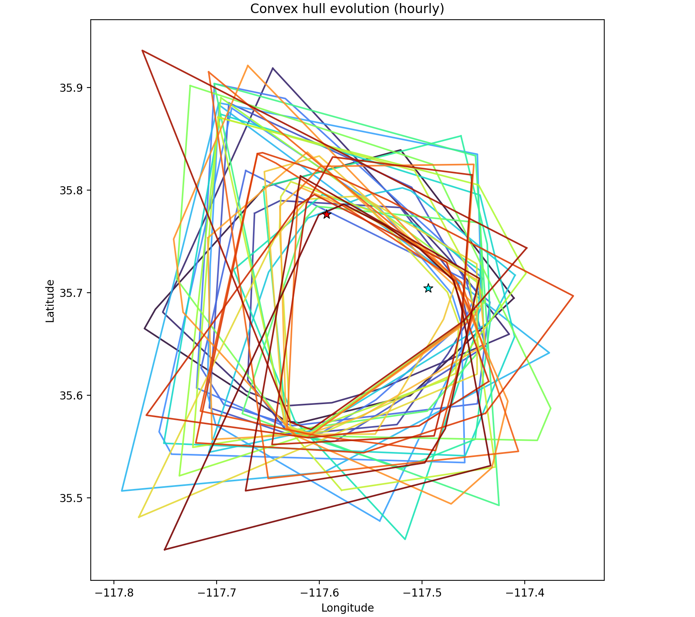
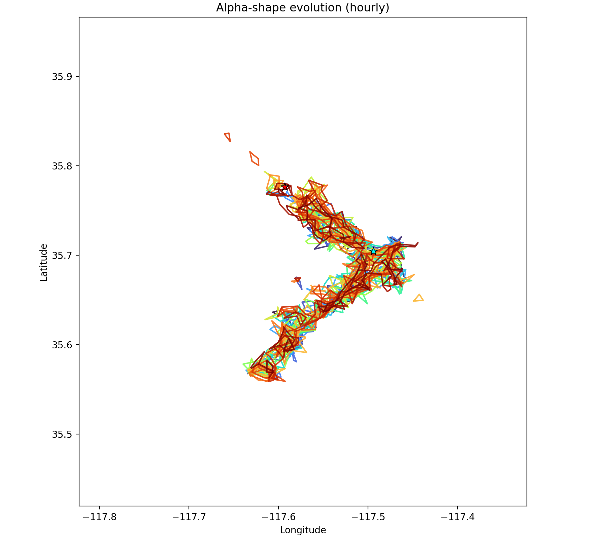

---
author:
- TRACE
title: Spatiotemporal Evolution of the Ridgecrest Inter-Mainshock Seismicity and Implications for Triggering from the Mw 6.4 to the Mw 7.1 Mainshock
---

# Abstract

This report investigates the spatiotemporal evolution of seismicity between the 2019 Ridgecrest Mw 6.4 and Mw 7.1 mainshocks using a relocated earthquake catalog. The objective is to test whether the inter-mainshock sequence shows progressive migration and focusing toward the eventual Mw 7.1 rupture area, or instead exhibits spreading, bifurcation, and fragmented evolution. The implemented workflow built a cleaned inter-mainshock catalog of 5,206 events, applied fixed-bandwidth two-dimensional kernel density estimation (KDE) across 23 temporal windows, and computed hourly convex-hull and alpha-shape morphology diagnostics across 34 windows, all using a common spatial frame and up to 64 CPU cores. The evidence indicates that the early stage (first 4 hours after the Mw 6.4 event) was characterized by oscillatory hotspot repositioning within a confined fault-zone corridor rather than monotonic migration toward Mw 7.1. The later stage showed stronger average localization, with smaller hotspot step lengths, smaller high-density areas, and shorter mean hotspot distance to the Mw 7.1 epicenter. However, geometric diagnostics show persistent multi-component and fault-aligned fragmentation, arguing against a single smooth triggering front. The most defensible interpretation is late-stage localization within a segmented fault network, not a uniquely resolved direct migration path from the Mw 6.4 source to the Mw 7.1 nucleation area.

# Scientific Objective

The scientific goal of this study is to investigate the spatiotemporal evolution of the Ridgecrest earthquake sequence during the interval between the Mw 6.4 and Mw 7.1 mainshocks, with special attention to the possible triggering mechanism linking these two large events. The analysis was designed to address two related questions.

First, does the density field of inter-mainshock seismicity show systematic drift and progressive spatial focusing toward the Mw 7.1 rupture area, or does it instead show spatial defocusing, oscillation, or bifurcation? Second, does the evolving geometric envelope of the earthquake cloud contract toward a single target region, or remain distributed, elongated, and fragmented in a way that implies structurally heterogeneous triggering?

The evidence base is restricted to the provided relocated catalog and the provided mainshock metadata. The authoritative source catalog is: <a href="<REPO_ROOT>/examples/ridgecrest/data/catalog_TRACE/TRACE_ridgecrest_relocated.csv" class="uri"><REPO_ROOT>/examples/ridgecrest/data/catalog_TRACE/TRACE_ridgecrest_relocated.csv</a>. The mainshock reference file is: <a href="<REPO_ROOT>/examples/ridgecrest/data/catalog_TRACE/main_shock_events.csv" class="uri"><REPO_ROOT>/examples/ridgecrest/data/catalog_TRACE/main_shock_events.csv</a>.

# Data, Time Window, and Implemented Workflow

## Catalog and mainshock reference

A cleaned inter-mainshock subset was constructed from the relocated catalog for the exact interval between the Mw 6.4 origin time and the Mw 7.1 origin time. The resulting catalog contains 5,206 earthquakes and is archived at: <a href="../exp_run/outputs/01_ridgecrest_spatiotemporal_evolution/tables/intermainshock_catalog.csv" class="uri">../exp_run/outputs/01_ridgecrest_spatiotemporal_evolution/tables/intermainshock_catalog.csv</a>.

The authoritative mainshock metadata are stored at: <a href="../exp_run/outputs/01_ridgecrest_spatiotemporal_evolution/tables/mainshock_metadata.csv" class="uri">../exp_run/outputs/01_ridgecrest_spatiotemporal_evolution/tables/mainshock_metadata.csv</a>. These metadata report:

- Mw 6.4: 2019-07-04 17:33:49.040000+00:00, 35.70421$`^{\circ}`$N, -117.49392$`^{\circ}`$E, depth 11.864 km.

- Mw 7.1: 2019-07-06 03:19:53.040000+00:00, 35.77623$`^{\circ}`$N, -117.59286$`^{\circ}`$E, depth 1.986 km.

## Temporal discretization

The implemented interval definitions are archived at: <a href="../exp_run/outputs/01_ridgecrest_spatiotemporal_evolution/tables/interval_definitions.csv" class="uri">../exp_run/outputs/01_ridgecrest_spatiotemporal_evolution/tables/interval_definitions.csv</a>. The workflow followed the requested temporal design:

- **Stage 1 KDE**: first 4 hours after Mw 6.4, divided into 8 windows of 30 minutes each.

- **Stage 2 KDE**: from +4 hours after Mw 6.4 to the Mw 7.1 mainshock, divided into 15 windows of 2 hours each.

- **Morphology**: 34 hourly windows covering the entire inter-mainshock period.

## Spatial KDE implementation

The KDE analysis used a fixed geographic frame and common smoothing to make temporal snapshots directly comparable. According to the manifest file <a href="../exp_run/outputs/01_ridgecrest_spatiotemporal_evolution/manifests/analysis_metadata.json" class="uri">../exp_run/outputs/01_ridgecrest_spatiotemporal_evolution/manifests/analysis_metadata.json</a>, the implementation used:

- a common map extent of $`[-117.966597, -117.297378, 35.248030, 36.104974]`$ in longitude–latitude,

- a common grid of $`220 \times 220`$,

- a fixed KDE bandwidth of 1.5105 km,

- a global KDE maximum density of 0.02276 and a high-density threshold of 0.01366,

- parallel computation with up to 64 cores.

For each KDE interval, the workflow extracted hotspot coordinates, peak density, distances to both mainshocks, high-density area, and hotspot step length. These quantitative results are archived at: <a href="../exp_run/outputs/01_ridgecrest_spatiotemporal_evolution/tables/kde_interval_summary.csv" class="uri">../exp_run/outputs/01_ridgecrest_spatiotemporal_evolution/tables/kde_interval_summary.csv</a>.

## Morphological implementation

To evaluate geometric focusing versus fragmentation, the workflow computed both convex hulls and alpha shapes for each hourly interval. The summary statistics are stored at: <a href="../exp_run/outputs/01_ridgecrest_spatiotemporal_evolution/tables/morphology_interval_summary.csv" class="uri">../exp_run/outputs/01_ridgecrest_spatiotemporal_evolution/tables/morphology_interval_summary.csv</a>, and polygon boundary coordinates are stored at: <a href="../exp_run/outputs/01_ridgecrest_spatiotemporal_evolution/tables/geometry_boundaries.csv" class="uri">../exp_run/outputs/01_ridgecrest_spatiotemporal_evolution/tables/geometry_boundaries.csv</a>. The fixed alpha parameter was 1.1111, again documented in the manifest.

## Validation status

Completion was validated in: <a href="../exp_run/outputs/01_ridgecrest_spatiotemporal_evolution/tables/validation_summary.csv" class="uri">../exp_run/outputs/01_ridgecrest_spatiotemporal_evolution/tables/validation_summary.csv</a>. The validation table reports that all expected outputs were completed: 5,206 inter-mainshock rows, 23 total and 23 valid KDE intervals, and 34 total and 34 valid morphology intervals.

| Item | Value |
|:---|:---|
| Inter-mainshock catalog size | 5,206 events |
| Mw 6.4 origin time | 2019-07-04 17:33:49.040000+00:00 |
| Mw 7.1 origin time | 2019-07-06 03:19:53.040000+00:00 |
| KDE intervals | 23 total, 23 valid |
| Morphology intervals | 34 total, 34 valid |
| KDE bandwidth | 1.5105 km |
| Alpha parameter | 1.1111 |
| Grid shape | 220 $`\times`$ 220 |
| Common map extent | $`[-117.966597, -117.297378, 35.248030, 36.104974]`$ |
| Maximum cores used | 64 |

Core implementation and validation summary.

# Principal Evidence Products

The report relies on the following primary visual products and quantitative tables:

- Stage 1 KDE maps (Figure <a href="#fig:stage1kde" data-reference-type="ref" data-reference="fig:stage1kde">1</a>): <a href="../exp_run/outputs/01_ridgecrest_spatiotemporal_evolution/figures/stage1_kde_page_01.png" class="uri">../exp_run/outputs/01_ridgecrest_spatiotemporal_evolution/figures/stage1_kde_page_01.png</a>

- Stage 2 KDE maps (Figures <a href="#fig:stage2kde1" data-reference-type="ref" data-reference="fig:stage2kde1">3</a> and <a href="#fig:stage2kde2" data-reference-type="ref" data-reference="fig:stage2kde2">4</a>): <a href="../exp_run/outputs/01_ridgecrest_spatiotemporal_evolution/figures/stage2_kde_page_01.png" class="uri">../exp_run/outputs/01_ridgecrest_spatiotemporal_evolution/figures/stage2_kde_page_01.png</a> and <a href="../exp_run/outputs/01_ridgecrest_spatiotemporal_evolution/figures/stage2_kde_page_02.png" class="uri">../exp_run/outputs/01_ridgecrest_spatiotemporal_evolution/figures/stage2_kde_page_02.png</a>

- Stage 1 and Stage 2 hotspot tracks (Figures <a href="#fig:stage1hotspot" data-reference-type="ref" data-reference="fig:stage1hotspot">2</a> and <a href="#fig:stage2hotspot" data-reference-type="ref" data-reference="fig:stage2hotspot">5</a>)

- Convex-hull and alpha-shape evolution figures (Figures <a href="#fig:convex" data-reference-type="ref" data-reference="fig:convex">6</a> and <a href="#fig:alpha" data-reference-type="ref" data-reference="fig:alpha">7</a>)

- Stage comparison summary: <a href="../exp_run/outputs/01_ridgecrest_spatiotemporal_evolution/tables/stage_comparison_summary.csv" class="uri">../exp_run/outputs/01_ridgecrest_spatiotemporal_evolution/tables/stage_comparison_summary.csv</a>

- Interval-by-interval KDE summary: <a href="../exp_run/outputs/01_ridgecrest_spatiotemporal_evolution/tables/kde_interval_summary.csv" class="uri">../exp_run/outputs/01_ridgecrest_spatiotemporal_evolution/tables/kde_interval_summary.csv</a>

- Hourly morphology summary: <a href="../exp_run/outputs/01_ridgecrest_spatiotemporal_evolution/tables/morphology_interval_summary.csv" class="uri">../exp_run/outputs/01_ridgecrest_spatiotemporal_evolution/tables/morphology_interval_summary.csv</a>

- Integrated interpretation table: <a href="../exp_run/outputs/01_ridgecrest_spatiotemporal_evolution/tables/merged_kde_morphology_summary.csv" class="uri">../exp_run/outputs/01_ridgecrest_spatiotemporal_evolution/tables/merged_kde_morphology_summary.csv</a>

# Results

## Catalog characteristics and analysis scope

The inter-mainshock subset is sufficiently large to resolve evolving spatial organization. The analysis file reports a latitude range of 35.2780–36.0750$`^{\circ}`$, a longitude range of -117.9366 to -117.3274$`^{\circ}`$, a median magnitude of 1.19, and a maximum magnitude of 7.1. These values show that the analysis samples both dense local seismicity and the full interval leading to the larger mainshock. At the same time, the visual products indicate that most activity remains concentrated in the main Ridgecrest fault corridor rather than dispersing broadly across the wider region.

## Stage 1 KDE evolution: no monotonic migration from Mw 6.4 to Mw 7.1

The first four hours after the Mw 6.4 mainshock were examined in eight 30-minute windows. Figure <a href="#fig:stage1kde" data-reference-type="ref" data-reference="fig:stage1kde">1</a> shows that the principal density maximum stayed within a relatively narrow corridor, with shape changes and elongation but without a simple one-way drift from the Mw 6.4 epicenter toward the Mw 7.1 epicenter. Figure <a href="#fig:stage1hotspot" data-reference-type="ref" data-reference="fig:stage1hotspot">2</a> shows that the hotspot path was localized and curved, not a straight progressive migration front.

The interval summary and stage summary provide the quantitative basis for this interpretation. Stage 1 had a mean hotspot distance to the Mw 7.1 epicenter of 12.39 km, a mean hotspot step length of 5.16 km, a mean high-density area of 6.01 km$`^2`$, and a mean high-density patch count of 1.125 (Table <a href="#tab:stagecompare" data-reference-type="ref" data-reference="tab:stagecompare">2</a>). More importantly, individual intervals alternated strongly in their distance to the Mw 7.1 mainshock: S1_02 was 8.29 km from Mw 7.1, S1_03 moved back to 14.46 km, S1_04 returned to 7.89 km, and S1_05 moved back again to 14.47 km. This repeated reversal is inconsistent with a smooth, monotonic approach to the eventual Mw 7.1 rupture area.

Accordingly, the strongest evidence for the early stage is oscillatory reorganization within a confined corridor, not direct migration.

<figure id="fig:stage1kde" data-latex-placement="H">

<figcaption>Stage 1 fixed-bandwidth KDE maps for the first 4 hours after the Mw 6.4 mainshock. All subplots share the same map extent, smoothing bandwidth, and color scale, enabling direct comparison of density evolution.</figcaption>
</figure>

<figure id="fig:stage1hotspot" data-latex-placement="H">

<figcaption>Stage 1 hotspot migration path derived from the KDE maxima. The path remains confined and oscillatory rather than showing a simple directed transfer toward the Mw 7.1 epicenter.</figcaption>
</figure>

## Stage 2 KDE evolution: increased localization, but still not a single-path march

The later inter-mainshock period was represented by 15 two-hour KDE windows. Figures <a href="#fig:stage2kde1" data-reference-type="ref" data-reference="fig:stage2kde1">3</a> and <a href="#fig:stage2kde2" data-reference-type="ref" data-reference="fig:stage2kde2">4</a> show that seismicity remained organized along the same fault corridor spanning the two epicentral regions. Relative to Stage 1, the late-stage density field appears more localized on average. However, it does not collapse into a single compact terminal cluster. Instead, the maps preserve complexity, including persistent two-lobed or segmented organization across parts of the corridor.

This interpretation is supported by the stage-comparison metrics. Stage 2 had a mean hotspot distance to the Mw 7.1 epicenter of 8.55 km, distinctly lower than the Stage 1 mean of 12.39 km. The mean hotspot step length dropped from 5.16 km in Stage 1 to 2.75 km in Stage 2, and mean high-density area fell from 6.01 km$`^2`$ to 1.11 km$`^2`$. Mean patch count also decreased from 1.125 to 0.267. Together, these metrics indicate that the later seismicity was more localized and less spatially mobile on average.

Yet this is not evidence for a perfectly continuous migration path. The integrated interpretation table retains many intervals labeled as fragmented or defocusing, and the Stage 2 KDE maps continue to show spatial complexity rather than terminal collapse to one sharply defined hotspot. Thus the late stage is best described as *partial focusing within a segmented fault system*.

<figure id="fig:stage2kde1" data-latex-placement="H">

<figcaption>First page of Stage 2 KDE maps. Compared with Stage 1, the density field becomes more localized on average but remains fault-aligned and spatially structured.</figcaption>
</figure>

<figure id="fig:stage2kde2" data-latex-placement="H">

<figcaption>Second page of Stage 2 KDE maps. The later sequence retains two-lobed or segmented organization, arguing against a single uninterrupted migration front.</figcaption>
</figure>

<figure id="fig:stage2hotspot" data-latex-placement="H">

<figcaption>Stage 2 hotspot migration path. The trajectory is more compact and directed overall than in Stage 1, but it is still not purely linear or uniquely one-way.</figcaption>
</figure>

| Stage | $`n`$ intervals | Mean distance to Mw 7.1 (km) | Mean hotspot step (km) | Mean high-density area (km$`^2`$) | Mean patch count |
|:---|:--:|:---|:---|:---|:---|
| Stage 1 | 8 |  |  |  |  |
| Stage 2 | 15 |  |  |  |  |

Quantitative comparison of early and late inter-mainshock KDE behavior from the stage summary table.

## Morphological evolution: persistent fragmentation dominates over simple contraction

The geometric diagnostics provide an independent test of whether the earthquake cloud progressively contracts toward the Mw 7.1 rupture area. Figure <a href="#fig:convex" data-reference-type="ref" data-reference="fig:convex">6</a> shows repeated overlap of convex hulls within a common corridor, combined with periodic expansion outward in multiple directions. This pattern is not consistent with simple geometric collapse toward a single target zone.

Figure <a href="#fig:alpha" data-reference-type="ref" data-reference="fig:alpha">7</a> is more diagnostic because alpha shapes preserve non-convexity and segmentation. The alpha-shape envelopes form a narrow, elongated, fault-parallel corridor with repeated overlap, localized widening, and weak branching. This geometry indicates that seismicity remained organized on a segmented structure rather than becoming progressively compact in a single nucleus.

The morphology summary reported in the analysis file further supports this conclusion. All 34 hourly intervals yielded valid convex and alpha shapes. Convex hull areas commonly span several hundred square kilometers, whereas alpha-shape areas are much smaller, typically only a few tens of square kilometers, showing strong non-convexity and internal structure. Alpha-shape component counts are commonly between 4 and 11, consistent with fragmented or multi-lobed seismicity organization.

The integrated interpretation table strongly reinforces this point: the merged KDE–morphology summary is dominated by the label *fragmented* (37 records), followed by *defocusing* (10), *mixed* (7), and only *focusing* (3). Therefore, the morphological evidence favors persistent structural complexity over a simple focusing narrative.

<figure id="fig:convex" data-latex-placement="H">

<figcaption>Hourly convex-hull boundaries for the inter-mainshock period. Repeated overlap is accompanied by episodic outward excursions, indicating a stable corridor with intermittent broadening rather than simple inward contraction.</figcaption>
</figure>

<figure id="fig:alpha" data-latex-placement="H">

<figcaption>Hourly alpha-shape boundaries for the inter-mainshock period. The persistent elongated and multi-component geometry indicates segmentation and fragmentation in the active fault network.</figcaption>
</figure>

# Synthesis: Implications for the Mw 6.4 to Mw 7.1 Triggering Mechanism

The combined KDE and morphology evidence does not support a simple, smooth, uniquely traceable migration from the Mw 6.4 mainshock into the Mw 7.1 rupture area. If such a process dominated, one would expect a largely monotonic decrease in hotspot distance to the Mw 7.1 epicenter, steady path progression, and geometric contraction of the earthquake cloud toward a single compact terminal zone. None of these signatures is consistently observed.

Instead, the evidence favors a two-part interpretation:

1.  **Early stage:** the first four hours were spatially unstable but confined, with repeated hotspot reversals inside a narrow fault-zone corridor. This is more consistent with rapid redistribution among neighboring structures than with a clean propagating front.

2.  **Late stage:** the later inter-mainshock period became more localized on average, as shown by shorter distances to Mw 7.1, smaller hotspot steps, and smaller high-density areas. However, localization occurred within a fault system that remained elongated, multi-component, and partially bifurcated.

Therefore, the most defensible seismological interpretation is that the Mw 6.4-to-Mw 7.1 transition reflects progressive activation and late-stage localization within a structurally heterogeneous and segmented fault network. In this view, stress transfer and fault-network interaction are more plausible descriptors than a single direct migration track from the first mainshock to the second.

# Limitations and Confidence

Several limitations should accompany the scientific interpretation.

- The tabulated mainshock metadata should be treated as authoritative when there is any tension between visual impression and figure annotation. The authoritative file is <a href="../exp_run/outputs/01_ridgecrest_spatiotemporal_evolution/tables/mainshock_metadata.csv" class="uri">../exp_run/outputs/01_ridgecrest_spatiotemporal_evolution/tables/mainshock_metadata.csv</a>.

- Some conclusions from the figures are qualitative and should be interpreted jointly with the quantitative tables, especially the KDE interval summary and morphology interval summary.

- KDE used one fixed bandwidth (1.5105 km) and morphology used one fixed alpha parameter (1.1111). This improves temporal comparability but introduces scale dependence; different reasonable parameter choices could alter the apparent degree of focusing or fragmentation.

- Morphology and KDE were computed on different temporal resolutions, so the merged interpretation table is informative but not a strict one-to-one time-aligned comparison.

- Convex hulls tend to exaggerate occupied area for elongated point clouds, while alpha shapes are sensitive to the chosen alpha parameter.

- No explicit uncertainty analysis was provided for relocation error, hotspot position uncertainty, bandwidth sensitivity, or alpha-shape sensitivity.

Given these caveats, the overall scientific confidence is best described as **moderate**. The evidence robustly supports rejection of a simple monotonic migration model and supports late-stage localization within a segmented system, but the exact interval-by-interval geometry and hotspot placement remain somewhat parameter- and uncertainty-dependent.

# Reproducibility and Evidence Paths

Key machine-readable outputs used in this report are listed below.

| Artifact | Absolute path |
|:---|:---|
| Artifact | Absolute path |
| Inter-mainshock catalog | <a href="../exp_run/outputs/01_ridgecrest_spatiotemporal_evolution/tables/intermainshock_catalog.csv" class="uri">../exp_run/outputs/01_ridgecrest_spatiotemporal_evolution/tables/intermainshock_catalog.csv</a> |
| Mainshock metadata | <a href="../exp_run/outputs/01_ridgecrest_spatiotemporal_evolution/tables/mainshock_metadata.csv" class="uri">../exp_run/outputs/01_ridgecrest_spatiotemporal_evolution/tables/mainshock_metadata.csv</a> |
| Interval definitions | <a href="../exp_run/outputs/01_ridgecrest_spatiotemporal_evolution/tables/interval_definitions.csv" class="uri">../exp_run/outputs/01_ridgecrest_spatiotemporal_evolution/tables/interval_definitions.csv</a> |
| KDE interval summary | <a href="../exp_run/outputs/01_ridgecrest_spatiotemporal_evolution/tables/kde_interval_summary.csv" class="uri">../exp_run/outputs/01_ridgecrest_spatiotemporal_evolution/tables/kde_interval_summary.csv</a> |
| Morphology interval summary | <a href="../exp_run/outputs/01_ridgecrest_spatiotemporal_evolution/tables/morphology_interval_summary.csv" class="uri">../exp_run/outputs/01_ridgecrest_spatiotemporal_evolution/tables/morphology_interval_summary.csv</a> |
| Geometry boundaries | <a href="../exp_run/outputs/01_ridgecrest_spatiotemporal_evolution/tables/geometry_boundaries.csv" class="uri">../exp_run/outputs/01_ridgecrest_spatiotemporal_evolution/tables/geometry_boundaries.csv</a> |
| Stage comparison | <a href="../exp_run/outputs/01_ridgecrest_spatiotemporal_evolution/tables/stage_comparison_summary.csv" class="uri">../exp_run/outputs/01_ridgecrest_spatiotemporal_evolution/tables/stage_comparison_summary.csv</a> |
| Merged interpretation summary | <a href="../exp_run/outputs/01_ridgecrest_spatiotemporal_evolution/tables/merged_kde_morphology_summary.csv" class="uri">../exp_run/outputs/01_ridgecrest_spatiotemporal_evolution/tables/merged_kde_morphology_summary.csv</a> |
| Validation summary | <a href="../exp_run/outputs/01_ridgecrest_spatiotemporal_evolution/tables/validation_summary.csv" class="uri">../exp_run/outputs/01_ridgecrest_spatiotemporal_evolution/tables/validation_summary.csv</a> |
| Analysis manifest | <a href="../exp_run/outputs/01_ridgecrest_spatiotemporal_evolution/manifests/analysis_metadata.json" class="uri">../exp_run/outputs/01_ridgecrest_spatiotemporal_evolution/manifests/analysis_metadata.json</a> |

Primary evidence files used for this report.

# Conclusion

This analysis successfully resolved the Ridgecrest inter-mainshock evolution with fixed-bandwidth KDE and hourly morphology diagnostics on a validated 5,206-event relocated catalog. The results show that the sequence between the Mw 6.4 and Mw 7.1 mainshocks did *not* evolve through a simple monotonic migration of seismicity from one epicentral area to the other. Instead, the early period was marked by oscillatory hotspot repositioning inside a narrow active corridor, while the later period exhibited stronger average localization closer to the Mw 7.1 region. Nevertheless, the geometric structure remained persistently elongated, segmented, and multi-component. The preferred interpretation is therefore late-stage localization within a heterogeneous fault network, rather than a uniquely resolved direct triggering path from the Mw 6.4 mainshock to the Mw 7.1 mainshock.
