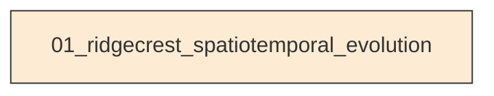
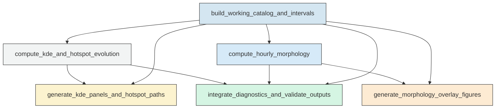

# Workflow Overview

## Top-Level Task Dependencies

**Description:**
- `01_ridgecrest_spatiotemporal_evolution`: Build the inter-mainshock catalog, compute KDE and morphology diagnostics, generate figures, and validate merged outputs for the Ridgecrest sequence.

## Subtask Dependencies

#### 01_ridgecrest_spatiotemporal_evolution
**Usage**: Build the inter-mainshock catalog, compute KDE and morphology diagnostics, generate figures, and validate merged outputs for the Ridgecrest sequence.

**Description:**
- `build_working_catalog_and_intervals`: Read the catalog and mainshock tables, clean records, subset the inter-mainshock window, and define shared interval schemes and spatial reference.
- `compute_kde_and_hotspot_evolution`: Compute fixed-bandwidth KDE on a common grid for all KDE intervals, extract hotspot maxima, and save interval summaries and manifests.
- `generate_kde_panels_and_hotspot_paths`: Create paginated 2x4 KDE panel figures for both stages and plot hotspot migration paths with mainshock overlays.
- `compute_hourly_morphology`: Compute hourly convex hull and alpha-shape geometries, extract morphology metrics, and serialize boundary coordinates.
- `generate_morphology_overlay_figures`: Plot all hourly convex hull and alpha-shape boundaries in a common frame using time-encoded boundary colors and mainshock overlays.
- `integrate_diagnostics_and_validate_outputs`: Merge KDE and morphology diagnostics, assign machine-readable interpretation labels, and record validation and run logs.