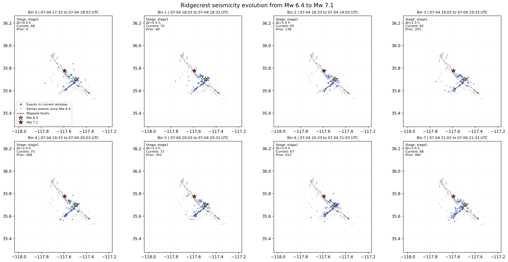
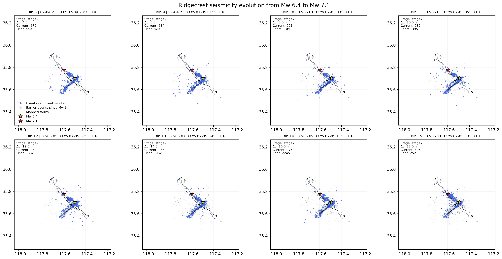
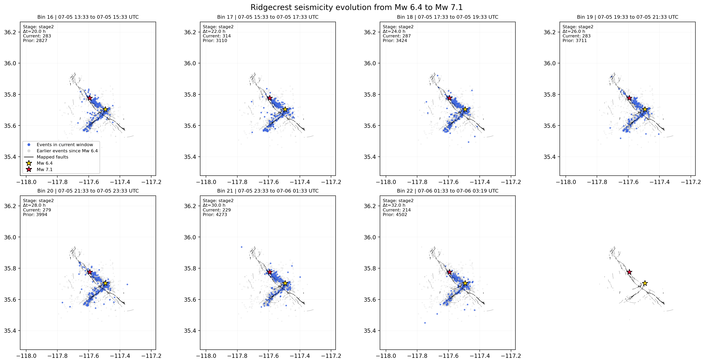
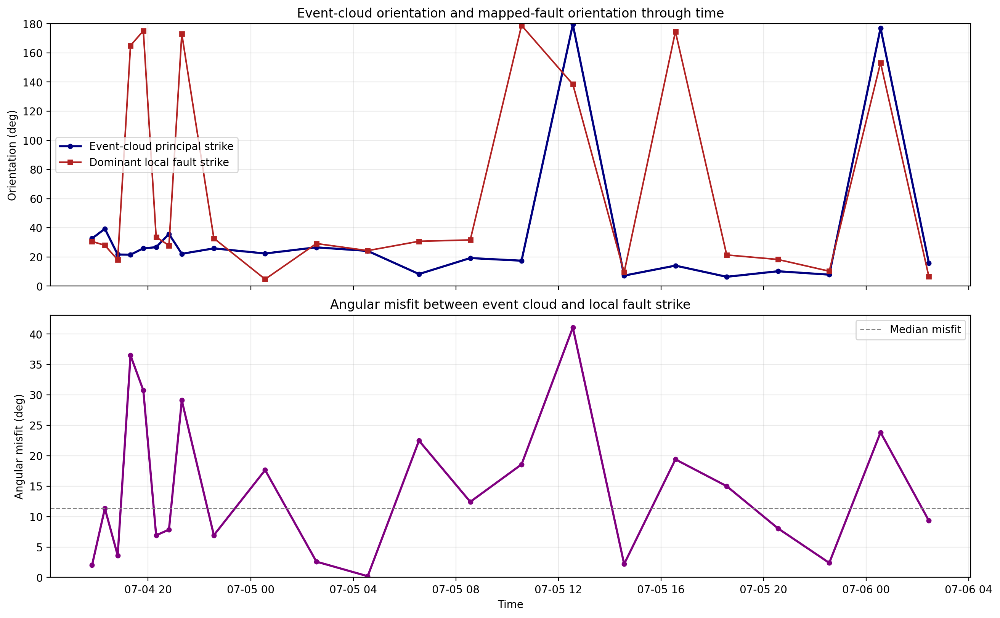
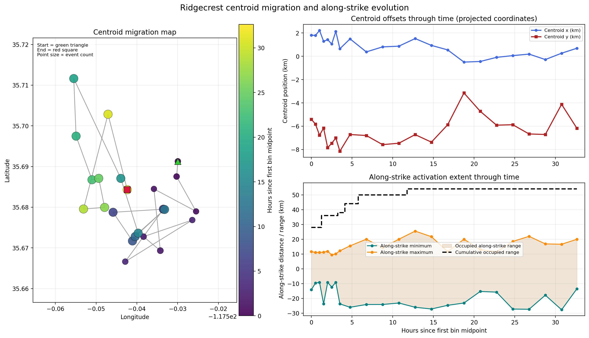
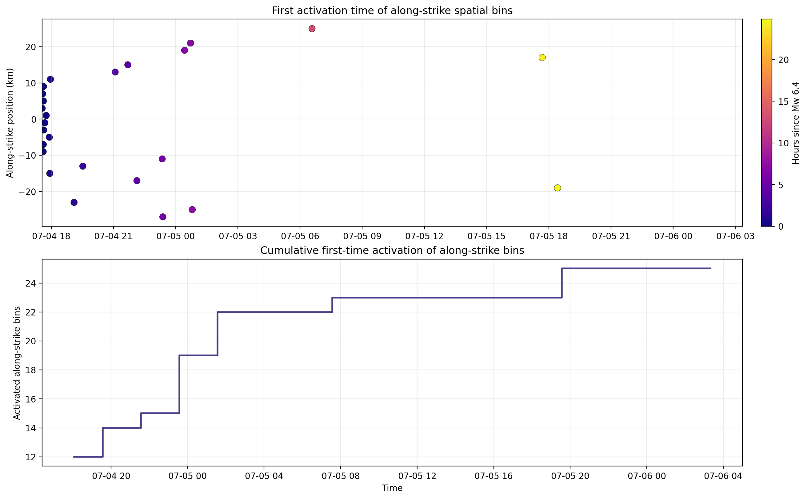
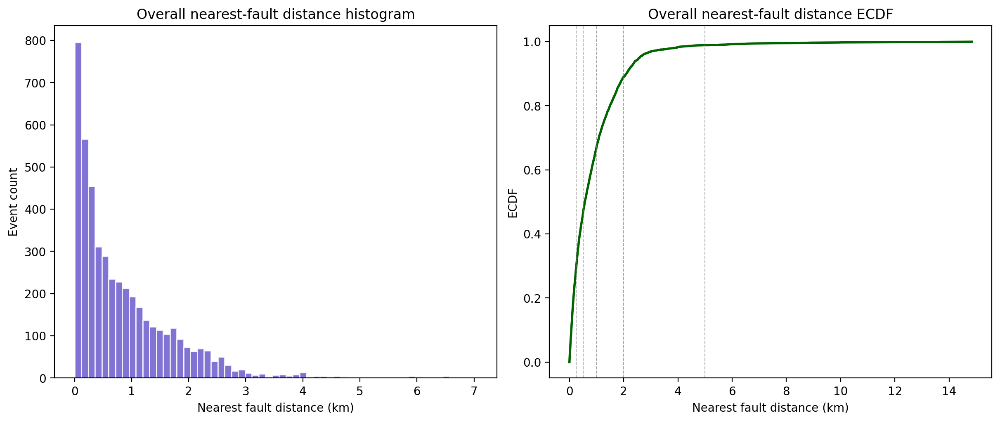
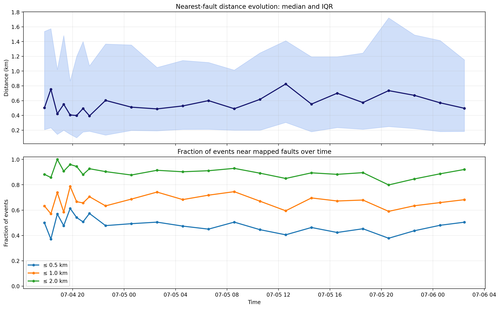
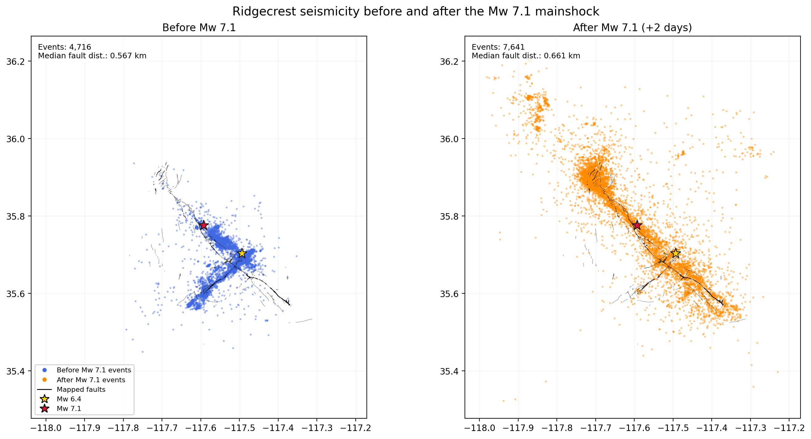

---
author:
- TRACE
title: Spatiotemporal Evolution of the Ridgecrest Earthquake Sequence Between the Mw 6.4 and Mw 7.1 Mainshocks
---

# Abstract

This report investigates the evolution of seismicity in the Ridgecrest sequence from the Mw 6.4 mainshock to the Mw 7.1 mainshock, with emphasis on whether triggered earthquakes were aligned with mapped fault directions, whether that alignment changed through time, and whether activation occurred across the full fault system simultaneously or expanded progressively. Using a relocated earthquake catalog, mapped Ridgecrest surface faults, and the two mainshock reference events, the workflow first computed event-level nearest-fault geometry and bin-level directional metrics in a local azimuthal equidistant coordinate system, then generated the requested map series and distribution figures. The analyzed dataset contains 84,474 catalog events in total, including 4,716 events between the two mainshocks and 7,641 events in the two days after Mw 7.1. Across the pre-Mw 7.1 interval, the event clouds were generally organized parallel to mapped fault structure, with a reported median angular misfit of 11.34$`^{\circ}`$ between event-cloud principal orientation and dominant local fault strike. However, orientation evolved strongly through time, with a reported orientation range of 173.17$`^{\circ}`$ across the 23 canonical time bins. Along-strike occupancy also expanded progressively rather than appearing everywhere at once, reaching a final cumulative occupied range of 54 km before the Mw 7.1 mainshock. Nearest-fault distances remained small throughout the sequence, with pre-Mw 7.1 median distance 0.567 km and post-Mw 7.1 median distance 0.661 km, indicating persistent concentration near mapped faults. These conclusions are descriptive and should be interpreted with moderate confidence because the directional summaries simplify a complex multi-fault system and no formal uncertainty analysis was reported.

# Scientific Objective

The purpose of this study is to evaluate the spatiotemporal evolution of triggered seismicity in the Ridgecrest earthquake sequence between the Mw 6.4 and Mw 7.1 mainshocks. The specific scientific questions were:

1.  Are the triggered earthquakes aligned with mapped fault directions?

2.  Does the preferred fault-parallel orientation of triggered seismicity change through time?

3.  Does triggered seismicity occupy the full fault system simultaneously, or does it expand progressively along strike over time?

The requested analysis also required time-sliced spatial maps between the two mainshocks, a pre- versus post-Mw 7.1 comparison figure, and statistics describing the distance of each earthquake to the nearest mapped fault.

# Data and Implemented Workflow

## Input data

The analysis used three supplied datasets:

- Relocated catalog: <a href="<REPO_ROOT>/examples/ridgecrest/data/catalog_TRACE/TRACE_ridgecrest_relocated.csv" class="uri"><REPO_ROOT>/examples/ridgecrest/data/catalog_TRACE/TRACE_ridgecrest_relocated.csv</a>

- Mainshock table: <a href="<REPO_ROOT>/examples/ridgecrest/data/catalog_TRACE/main_shock_events.csv" class="uri"><REPO_ROOT>/examples/ridgecrest/data/catalog_TRACE/main_shock_events.csv</a>

- Surface-fault polylines: <a href="<REPO_ROOT>/examples/ridgecrest/data/faults/ridgecrest_surface_faults.json" class="uri"><REPO_ROOT>/examples/ridgecrest/data/faults/ridgecrest_surface_faults.json</a>

Task 01 produced the analysis-ready metrics and Task 02 generated the requested figures and summary tables. The output validation summary confirms 84,474 catalog events, 4,716 pre-Mw 7.1 events, 7,641 post-Mw 7.1 events, 23 canonical pre-Mw 7.1 time bins, zero empty bins, and 64 workers used for parallel computation.

## Actual implementation

The implemented workflow followed the evidence package rather than a hypothetical plan. The key steps were:

1.  Parse the relocated catalog and mainshock reference events.

2.  Project the catalog and fault geometry into a local azimuthal equidistant coordinate system centered on the Ridgecrest area for kilometer-scale calculations. The documented CRS was `+proj=aeqd +lat_0=35.74 +lon_0=-117.55 +x_0=0 +y_0=0 +datum=WGS84 +units=km +no_defs +type=crs`.

3.  Compute event-level nearest-fault metrics relative to the mapped surface-fault network.

4.  Partition the interval between the Mw 6.4 and Mw 7.1 mainshocks into 23 canonical bins: 8 bins of 30 minutes in Stage 1 (first 4 hours) and 15 bins of 2 hours in Stage 2 (remainder of the pre-Mw 7.1 interval).

5.  For each bin, estimate cloud orientation, spread, elongation, local dominant fault strike, angular misfit, and along-strike occupancy metrics.

6.  Generate the requested map pages, pre/post comparison figure, nearest-fault distance distributions, and summary figures for orientation and along-strike expansion.

This structure directly supports the three target questions: fault-parallel organization, temporal directional change, and simultaneous versus progressive coverage.

# Evidence Base and Output Inventory

The principal evidence products used in this report are listed below.

| Artifact | Purpose |
|:---|:---|
| <a href="../outputs/01_ridgecrest_metrics_preparation/validation_summary.csv" class="uri">../outputs/01_ridgecrest_metrics_preparation/validation_summary.csv</a> | Counts and validation for the prepared dataset, including event totals, time bins, and worker count. |
| <a href="../outputs/01_ridgecrest_metrics_preparation/bin_directional_summary.csv" class="uri">../outputs/01_ridgecrest_metrics_preparation/bin_directional_summary.csv</a> | Bin-level orientation, angular misfit, nearest-fault distance, and along-strike occupancy statistics. |
| <a href="../outputs/01_ridgecrest_metrics_preparation/along_strike_first_activation.csv" class="uri">../outputs/01_ridgecrest_metrics_preparation/along_strike_first_activation.csv</a> | First activation times for along-strike bins used to assess progressive expansion. |
| <a href="../outputs/02_ridgecrest_figures_and_distribution_plots/figure_manifest.csv" class="uri">../outputs/02_ridgecrest_figures_and_distribution_plots/figure_manifest.csv</a> | Absolute paths for all generated figures. |
| <a href="../outputs/02_ridgecrest_figures_and_distribution_plots/question_metric_summary_copy.csv" class="uri">../outputs/02_ridgecrest_figures_and_distribution_plots/question_metric_summary_copy.csv</a> | Summary metrics mapped directly to the three scientific questions. |
| <a href="../outputs/02_ridgecrest_figures_and_distribution_plots/comparison_summary.csv" class="uri">../outputs/02_ridgecrest_figures_and_distribution_plots/comparison_summary.csv</a> | Pre/post Mw 7.1 event counts, median fault distance, and centroid locations. |
| <a href="../outputs/02_ridgecrest_figures_and_distribution_plots/nearest_fault_distance_bin_statistics.csv" class="uri">../outputs/02_ridgecrest_figures_and_distribution_plots/nearest_fault_distance_bin_statistics.csv</a> | Time-dependent nearest-fault distance summaries. |

Primary machine-readable outputs used for interpretation.

# Results

## Overview of event coverage and time slicing

The prepared dataset is internally consistent and complete for the target interval. Validation shows 4,716 events occurred between the Mw 6.4 and Mw 7.1 mainshocks and 7,641 occurred in the two days after the Mw 7.1 event. The pre-Mw 7.1 interval was fully represented by 23 non-empty bins. This is important because the temporal evolution claims below are not based on sparse or missing-bin behavior.

The requested time-sliced maps were generated as three pages of 2$`\times`$<!-- -->4 panels, with the first page covering the initial four hours at 30-minute resolution and later pages covering the remaining interval at 2-hour resolution. These maps are shown in Figures <a href="#fig:maps1" data-reference-type="ref" data-reference="fig:maps1">1</a>–<a href="#fig:maps3" data-reference-type="ref" data-reference="fig:maps3">3</a>.

<figure id="fig:maps1" data-latex-placement="p">

<figcaption>Time-sliced spatial maps, page 1. This page covers Stage 1, the first 4 hours after the Mw 6.4 mainshock, using 30-minute bins. Each panel shows events in the active bin highlighted relative to prior events in silver, with mapped faults and both mainshock epicenters overlaid.</figcaption>
</figure>

<figure id="fig:maps2" data-latex-placement="p">

<figcaption>Time-sliced spatial maps, page 2. This page shows the early Stage 2 evolution using 2-hour bins after the initial 4-hour burst.</figcaption>
</figure>

<figure id="fig:maps3" data-latex-placement="p">

<figcaption>Time-sliced spatial maps, page 3. This page covers the final pre-Mw 7.1 bins. The evidence notes that the last page includes one effectively unused/reference panel because 23 bins do not fill 24 slots.</figcaption>
</figure>

## Question 1: Were triggered earthquakes aligned with mapped fault directions?

The quantitative answer is yes, at broad scale. The summary metric for this question is a median angular misfit of 11.34$`^{\circ}`$ between the principal axis of each time-bin event cloud and the dominant local mapped fault strike. In this framework, smaller misfit indicates stronger alignment between triggered seismicity and mapped faults.

The bin-level results support this interpretation. Many bins show single-digit to low-teen angular misfit values, including 2.01$`^{\circ}`$ in bin 0, 3.62$`^{\circ}`$ in bin 2, 6.92$`^{\circ}`$ in bin 5, 6.94$`^{\circ}`$ in bin 8, 2.59$`^{\circ}`$ in bin 10, 0.20$`^{\circ}`$ in bin 11, 2.20$`^{\circ}`$ in bin 16, 8.06$`^{\circ}`$ in bin 19, and 2.39$`^{\circ}`$ in bin 20. These low-misfit intervals indicate that much of the triggered seismicity evolved in a fault-parallel manner.

At the same time, fault-parallel organization was not uniform. Several bins have much larger angular misfit, for example 36.48$`^{\circ}`$ in bin 3, 30.74$`^{\circ}`$ in bin 4, 29.10$`^{\circ}`$ in bin 7, 22.48$`^{\circ}`$ in bin 12, 18.57$`^{\circ}`$ in bin 14, 41.06$`^{\circ}`$ in bin 15, 19.40$`^{\circ}`$ in bin 17, and 23.83$`^{\circ}`$ in bin 21. Thus, the best-supported statement is that triggered earthquakes were generally guided by the mapped fault system, but with intermittent departures that likely reflect branching geometry, multi-strand activation, or simplification in the local strike metric.

Figure <a href="#fig:orientation" data-reference-type="ref" data-reference="fig:orientation">4</a> visualizes the bin-by-bin orientation and misfit history.

<figure id="fig:orientation" data-latex-placement="p">

<figcaption>Temporal evolution of event-cloud orientation and angular misfit relative to dominant local mapped fault strike. This figure provides the main evidence for both overall fault alignment and time-varying directional behavior.</figcaption>
</figure>

## Question 2: Did the fault-parallel direction change through time?

Yes. The evidence indicates substantial temporal evolution in the preferred orientation of the triggered seismicity. The question-level summary reports an orientation range of 173.17$`^{\circ}`$ across the 23 canonical bins. Because line orientations are axial rather than directional, this large range should be interpreted as strong variation in the principal trend estimated from successive earthquake clouds, not as literal rotation through the full circle of vector azimuth.

The bin-level values show that the estimated principal strike varied from approximately 7–8$`^{\circ}`$ in some bins (e.g., bins 16, 18, and 20), to about 22–40$`^{\circ}`$ in many early and middle bins, and to nearly 180$`^{\circ}`$ in bin 15. This pattern indicates that the sequence did not maintain a single stable preferred orientation from the Mw 6.4 to the Mw 7.1 mainshock. Instead, the active seismicity sampled different strands or differently weighted subsets of the fault network through time.

The time-sliced maps in Figures <a href="#fig:maps1" data-reference-type="ref" data-reference="fig:maps1">1</a>–<a href="#fig:maps3" data-reference-type="ref" data-reference="fig:maps3">3</a> provide the visual context for this evolution, while Figure <a href="#fig:orientation" data-reference-type="ref" data-reference="fig:orientation">4</a> condenses it into a quantitative timeline. Together, they support the conclusion that directional organization changed through time rather than remaining fixed.

## Question 3: Was the full fault extent activated simultaneously or progressively?

The evidence favors progressive expansion rather than instantaneous occupation of the full analyzed fault extent. The summary metric for this question is a final cumulative occupied range of 54.0 km prior to the Mw 7.1 mainshock. However, the key point is not only the final range, but how that range grew through time.

The earliest bin already occupied 28 km along the reference axis, showing that the Mw 6.4 sequence immediately activated a substantial but incomplete portion of the fault system. By bin 3, the cumulative occupied range had expanded to 36 km; by bin 7 it reached 38 km; by bin 8 it increased to 44 km; by bin 9 it reached 50 km; and by bin 12 it reached the full pre-Mw 7.1 cumulative range of 54 km. This stepwise growth demonstrates that coverage expanded with time instead of appearing everywhere at once.

The first-activation table provides additional evidence. Along-strike bins near the center activated almost immediately, within minutes of the Mw 6.4 mainshock. For example, the bins spanning 2–4 km, 6–8 km, and nearby intervals activated at 0.0 h, 0.020 h, and 0.047–0.193 h. In contrast, several farther bins activated only after multiple hours: 12–14 km at 3.52 h, 14–16 km at 4.13 h, -28 to -26 km at 5.82 h, 18–20 km at 6.87 h, 20–22 km at 7.16 h, and 24–26 km at 13.01 h. Some still more peripheral bins were first activated only after about 24 h. This sequence is inconsistent with simultaneous system-wide triggering at the scale represented by the mapped faults and analysis axis.

Figures <a href="#fig:migration" data-reference-type="ref" data-reference="fig:migration">5</a> and <a href="#fig:occupancy" data-reference-type="ref" data-reference="fig:occupancy">6</a> summarize the centroid migration and cumulative along-strike occupancy through time.

<figure id="fig:migration" data-latex-placement="p">

<figcaption>Centroid position and along-strike migration metrics through time. This figure supports interpretation of evolving spatial concentration prior to the Mw 7.1 mainshock.</figcaption>
</figure>

<figure id="fig:occupancy" data-latex-placement="p">

<figcaption>Along-strike occupancy through time. Progressive widening of the occupied range indicates that the triggered sequence expanded along the fault system rather than covering the full extent simultaneously.</figcaption>
</figure>

## Nearest-fault distance statistics

The nearest-fault distance calculations show that Ridgecrest seismicity remained strongly concentrated near mapped faults throughout the analyzed interval. For the full pre-Mw 7.1 window, the median nearest-fault distance was 0.5669 km; for the two days after the Mw 7.1 mainshock, the median was 0.6612 km. Thus, both before and after the larger mainshock, the sequence remained structurally localized.

The time-dependent statistics reinforce this interpretation. Across the 23 pre-Mw 7.1 bins, median nearest-fault distance ranged from about 0.394 km to 0.826 km, most commonly near 0.5–0.6 km. In many bins, roughly 45–61% of events fell within 0.5 km of the nearest mapped fault, and about 57–79% fell within 1 km. For example:

- Bin 4 had median distance 0.406 km, with 61.3% within 0.5 km and 78.7% within 1 km.

- Bin 10 had median distance 0.488 km, with 50.5% within 0.5 km and 74.2% within 1 km.

- Bin 15 showed one of the larger medians, 0.826 km, yet still had 59.5% within 1 km and 85.0% within 2 km.

These values indicate persistent near-fault clustering even during periods of stronger directional complexity.

Figures <a href="#fig:nfd_overall" data-reference-type="ref" data-reference="fig:nfd_overall">7</a> and <a href="#fig:nfd_time" data-reference-type="ref" data-reference="fig:nfd_time">8</a> provide the corresponding visual summaries.

<figure id="fig:nfd_overall" data-latex-placement="p">

<figcaption>Overall nearest-fault distance distribution for the analyzed earthquake sets. The strong concentration at small values indicates that earthquakes cluster close to mapped faults.</figcaption>
</figure>

<figure id="fig:nfd_time" data-latex-placement="p">

<figcaption>Nearest-fault distance distribution through time for the pre-Mw 7.1 interval. The lack of large systematic drift away from faults supports sustained structural control through the sequence.</figcaption>
</figure>

## Pre- versus post-Mw 7.1 comparison

The requested comparison between the interval before Mw 7.1 and the two days after Mw 7.1 shows both continuity and change. Event counts increased from 4,716 before Mw 7.1 to 7,641 in the following two days. Median nearest-fault distance increased slightly from 0.5669 km to 0.6612 km, but both values remain small. The centroid also shifted from longitude -117.5440, latitude 35.6840 before Mw 7.1 to longitude -117.6103, latitude 35.8046 afterward, indicating a clear spatial reorganization after the larger mainshock.

Figure <a href="#fig:prepost" data-reference-type="ref" data-reference="fig:prepost">9</a> shows the pre/post map comparison that underlies this summary.

<figure id="fig:prepost" data-latex-placement="p">

<figcaption>Comparison of seismicity before and after the Mw 7.1 mainshock. The event cloud shifts spatially after Mw 7.1 while remaining concentrated near the mapped fault network.</figcaption>
</figure>

# Integrated Interpretation

Taken together, the evidence supports the following scientific interpretation of the Ridgecrest sequence between the two mainshocks.

First, triggered seismicity was not spatially random. It remained concentrated close to mapped faults and, in aggregate, was broadly aligned with mapped fault directions. The median angular misfit of 11.34$`^{\circ}`$ and median nearest-fault distances near 0.5–0.7 km are both consistent with strong structural control.

Second, the active orientation of seismicity was not constant. Some bins were tightly aligned with a local mapped fault trend, whereas others showed much larger misfit or very different principal strikes. This indicates that the pre-Mw 7.1 sequence involved temporally changing participation of different strands or differently shaped subclusters rather than a single stable rupture-parallel trend.

Third, the triggered sequence expanded progressively across the fault system. Immediate activation occurred near a central portion of the analyzed along-strike axis, but additional bins were occupied only after hours, and some extremal bins not until much later. Therefore, the fault system was not activated everywhere simultaneously at the scale represented by this analysis.

In practical terms, the evidence is most consistent with a cascading, spatially organized preparation of the larger Mw 7.1 rupture: fault-guided activity started on a restricted subset of the system, changed orientation as different strands became involved, and widened along strike over time before the later mainshock.

# Limitations and Confidence

The conclusions above should be interpreted with the limitations explicitly documented in the evidence package.

1.  **Simplified directional metric.** “Along fault direction” was operationalized mainly through the principal-axis orientation of the event cloud and comparison with a dominant local mapped fault strike. In a complex multi-strand network, a single orientation may underrepresent simultaneous activation on multiple branches.

2.  **Fixed along-strike reference axis.** Progressive activation was measured using a fixed reference axis with strike 147.653931$`^{\circ}`$. This is useful for a consistent summary, but the exact timing and magnitude of expansion could vary with a branch-specific or adaptive axis.

3.  **No explicit uncertainty propagation.** The workflow did not report formal uncertainty intervals for earthquake relocation error, fault mapping uncertainty, nearest-fault assignment, or principal-orientation estimation. Quantitative values should therefore be treated as descriptive rather than tightly constrained inferential estimates.

4.  **Surface-fault reference only.** Nearest-fault distance was calculated relative to mapped surface faults. Events on unmapped, buried, subsidiary, or geometrically simplified structures may appear artificially far from the nearest mapped fault, even if they were physically fault-controlled.

5.  **Minor presentation issue.** The last page of time-sliced maps contains one effectively unused/reference panel because 23 bins do not fill 24 subplot slots. This does not affect the analysis but should be noted when visually counting bins.

Given these constraints, the overall scientific confidence is best described as **moderate**. The broad conclusions are well supported by internally consistent metrics and figures, but they do not resolve all branch-scale complexities of the Ridgecrest fault system.

# Conclusions

This study addressed three questions about the Ridgecrest sequence between the Mw 6.4 and Mw 7.1 mainshocks.

1.  **Were triggered earthquakes aligned with fault direction?** Yes, generally. The sequence showed broad fault-parallel organization, summarized by a median event-cloud versus local-fault angular misfit of 11.34$`^{\circ}`$ and consistently small nearest-fault distances.

2.  **Did that direction change through time?** Yes. The preferred orientation varied strongly across the 23 time bins, indicating evolving participation of different fault strands or subclusters rather than a fixed single trend.

3.  **Was the full fault system activated simultaneously?** No, not in this analysis. Along-strike occupancy expanded stepwise to a final cumulative pre-Mw 7.1 range of 54 km, with outer sectors activating hours later than the central early-active region.

The resulting picture is of a structurally controlled but dynamically evolving earthquake sequence: seismicity after the Mw 6.4 mainshock was largely fault-guided, changed orientation through time, and expanded progressively across the fault network before the Mw 7.1 mainshock.

# Reproducibility Notes

All key claims in this report are tied to outputs located under: <a href="../outputs" class="uri">../outputs</a>

The report source itself was written to: <a href="report.tex" class="uri">report.tex</a>
