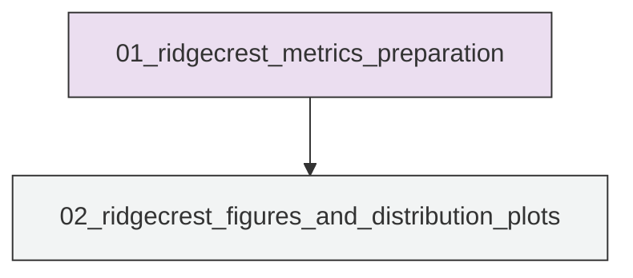
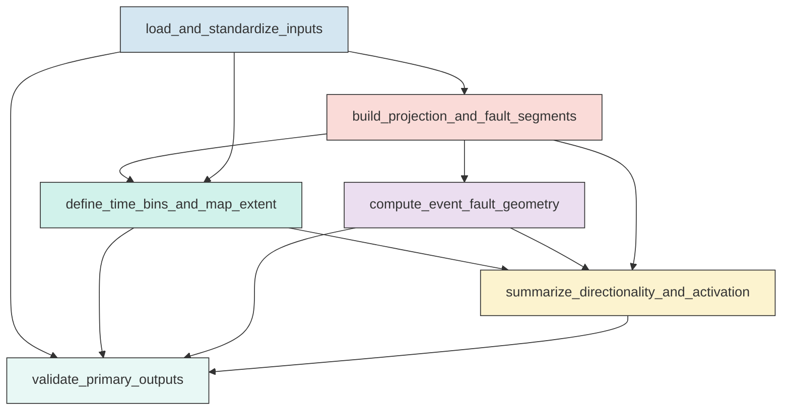
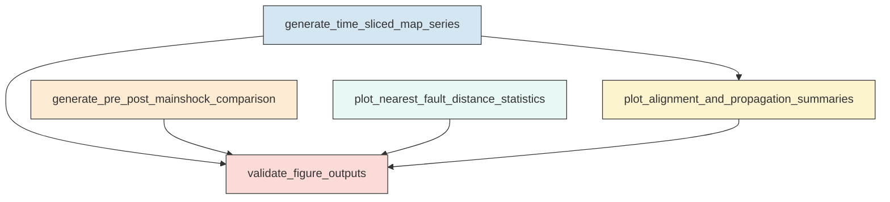

# Research Codings

## Task Overview


**Description:**
- `01_ridgecrest_metrics_preparation`: Build the analysis-ready Ridgecrest dataset, compute event-level nearest-fault geometry, and derive bin-level directional and along-strike metrics.
- `02_ridgecrest_figures_and_distribution_plots`: Generate the requested Ridgecrest map series, comparison figure, nearest-fault distance plots, and directional-evolution synthesis figures from saved metrics.


## Task Details


#### 01_ridgecrest_metrics_preparation
**Usage**: Build the analysis-ready Ridgecrest dataset, compute event-level nearest-fault geometry, and derive bin-level directional and along-strike metrics.

**Description:**
- `load_and_standardize_inputs`: Load the catalog, mainshock table, and fault polylines and standardize timestamps and coordinates.
- `build_projection_and_fault_segments`: Create a local projected spatial reference and convert fault polylines into segment-level geometry with strike attributes.
- `define_time_bins_and_map_extent`: Construct the canonical Stage 1 and Stage 2 time bins and a shared map extent for all figures.
- `compute_event_fault_geometry`: Calculate nearest fault distance and local nearest-segment attributes for events in the pre- and post-Mw7.1 windows.
- `summarize_directionality_and_activation`: Derive per-bin directional, nearest-fault, and along-strike occupancy metrics for the trigger-evolution analysis.
- `validate_primary_outputs`: Check that the event-level and bin-level outputs are complete, non-empty, and internally consistent.

#### Coding Script

```python

#!/usr/bin/env python
from __future__ import annotations

import json
import math
import os
import sys
import traceback
from concurrent.futures import ProcessPoolExecutor, as_completed
from dataclasses import dataclass
from pathlib import Path
from typing import Dict, List, Tuple

import numpy as np
import pandas as pd
from pyproj import CRS, Transformer
from scipy.spatial import cKDTree
from tqdm import tqdm


SCRIPT_PATH = Path(__file__).resolve()
OUTPUT_DIR = Path(
    "../exp_run/outputs/01_ridgecrest_metrics_preparation"
).resolve()
CATALOG_PATH = Path(
    "<REPO_ROOT>/examples/ridgecrest/data/catalog_TRACE/TRACE_ridgecrest_relocated.csv"
).resolve()
MAINSHOCK_PATH = Path(
    "<REPO_ROOT>/examples/ridgecrest/data/catalog_TRACE/main_shock_events.csv"
).resolve()
FAULT_PATH = Path(
    "<REPO_ROOT>/examples/ridgecrest/data/faults/ridgecrest_surface_faults.json"
).resolve()

MAX_WORKERS = min(64, max(1, (os.cpu_count() or 1)))
EVENT_CHUNK_SIZE = 5000
SPARSE_BIN_MIN_EVENTS = 10
ALONG_STRIKE_BIN_KM = 2.0
NEAR_FAULT_THRESHOLDS_KM = (0.25, 0.5, 1.0, 2.0, 5.0)
MAP_MARGIN_KM = 5.0
LOCAL_AEQD_CRS = CRS.from_proj4(
    "+proj=aeqd +lat_0=35.74 +lon_0=-117.55 +datum=WGS84 +units=km +no_defs"
)
WGS84_CRS = CRS.from_epsg(4326)


@dataclass
class TimeBin:
    bin_id: int
    stage: str
    start: pd.Timestamp
    end: pd.Timestamp
    end_inclusive: bool
    page: int
    subplot_index: int


def log(message: str) -> None:
    print(message, flush=True)


def ensure_output_dir() -> None:
    OUTPUT_DIR.mkdir(parents=True, exist_ok=True)
    stale_outputs = [
        "catalog_clean_projected.csv",
        "mainshock_reference.csv",
        "fault_polylines_summary.csv",
        "fault_segments_projected.csv",
        "canonical_map_extent.csv",
        "canonical_time_bins.csv",
        "event_fault_metrics_pre71.csv",
        "event_fault_metrics_post71.csv",
        "bin_directional_summary.csv",
        "along_strike_first_activation.csv",
        "question_metric_summary.csv",
        "validation_summary.csv",
        "run_metadata.csv",
    ]
    for name in stale_outputs:
        path = OUTPUT_DIR / name
        if path.exists():
            path.unlink()
            log(f"Removed stale output: {path}")


def parse_utc(series: pd.Series) -> pd.Series:
    return pd.to_datetime(series, utc=True)


def angular_misfit_deg(a_deg: float, b_deg: float) -> float:
    if np.isnan(a_deg) or np.isnan(b_deg):
        return np.nan
    diff = abs((a_deg - b_deg + 90.0) % 180.0 - 90.0)
    return float(diff)


def strike_from_dxdy(dx: float, dy: float) -> float:
    angle = math.degrees(math.atan2(dx, dy)) % 180.0
    return float(angle)


def weighted_orientation_deg(strikes_deg: np.ndarray, weights: np.ndarray) -> float:
    if len(strikes_deg) == 0:
        return np.nan
    theta = np.deg2rad(np.asarray(strikes_deg) * 2.0)
    weights = np.asarray(weights)
    c = np.sum(weights * np.cos(theta))
    s = np.sum(weights * np.sin(theta))
    if c == 0 and s == 0:
        return np.nan
    return float((np.rad2deg(np.arctan2(s, c)) / 2.0) % 180.0)


def principal_axis_metrics(x_km: np.ndarray, y_km: np.ndarray) -> Dict[str, float]:
    n = len(x_km)
    if n < 2:
        return {
            "centroid_x_km": float(np.mean(x_km)) if n else np.nan,
            "centroid_y_km": float(np.mean(y_km)) if n else np.nan,
            "principal_strike_deg": np.nan,
            "major_spread_km": np.nan,
            "minor_spread_km": np.nan,
            "elongation_ratio": np.nan,
        }
    x0 = x_km - np.mean(x_km)
    y0 = y_km - np.mean(y_km)
    cov = np.cov(np.vstack([x0, y0]))
    vals, vecs = np.linalg.eigh(cov)
    order = np.argsort(vals)[::-1]
    vals = vals[order]
    vecs = vecs[:, order]
    principal_vec = vecs[:, 0]
    strike_deg = strike_from_dxdy(principal_vec[0], principal_vec[1])
    major = float(np.sqrt(max(vals[0], 0.0)))
    minor = float(np.sqrt(max(vals[1], 0.0)))
    elong = float(major / minor) if minor > 0 else np.inf
    return {
        "centroid_x_km": float(np.mean(x_km)),
        "centroid_y_km": float(np.mean(y_km)),
        "principal_strike_deg": strike_deg,
        "major_spread_km": major,
        "minor_spread_km": minor,
        "elongation_ratio": elong,
    }


def build_time_bins(mainshock64: pd.Timestamp, mainshock71: pd.Timestamp) -> List[TimeBin]:
    bins: List[TimeBin] = []
    stage1_end = mainshock64 + pd.Timedelta(hours=4)
    stage1_starts = pd.date_range(mainshock64, stage1_end, freq="30min", inclusive="left")
    bin_id = 0
    for start in stage1_starts:
        end = start + pd.Timedelta(minutes=30)
        bins.append(TimeBin(bin_id, "stage1", start, end, False, bin_id // 8 + 1, bin_id % 8))
        bin_id += 1
    stage2_starts = pd.date_range(stage1_end, mainshock71, freq="2h", inclusive="left")
    for i, start in enumerate(stage2_starts):
        end = min(start + pd.Timedelta(hours=2), mainshock71)
        end_inclusive = i == len(stage2_starts) - 1
        bins.append(TimeBin(bin_id, "stage2", start, end, end_inclusive, bin_id // 8 + 1, bin_id % 8))
        bin_id += 1
    return bins


def select_time_window(df: pd.DataFrame, start: pd.Timestamp, end: pd.Timestamp, end_inclusive: bool = False) -> pd.DataFrame:
    if end_inclusive:
        mask = (df["event_time"] >= start) & (df["event_time"] <= end)
    else:
        mask = (df["event_time"] >= start) & (df["event_time"] < end)
    return df.loc[mask].copy()


def load_catalog() -> pd.DataFrame:
    log(f"Loading catalog: {CATALOG_PATH}")
    df = pd.read_csv(CATALOG_PATH)
    expected = ["event_time", "latitude", "longitude", "depth_km", "magnitude"]
    missing = [c for c in expected if c not in df.columns]
    if missing:
        raise ValueError(f"Catalog missing columns: {missing}")
    df = df[expected].copy()
    df["event_time"] = parse_utc(df["event_time"])
    df = df.dropna(subset=["event_time", "latitude", "longitude", "depth_km", "magnitude"]).copy()
    df = df.sort_values("event_time").reset_index(drop=True)
    df["event_id"] = np.arange(len(df), dtype=np.int64)
    log(f"Catalog loaded with {len(df):,} events")
    return df


def load_mainshocks() -> pd.DataFrame:
    log(f"Loading mainshocks: {MAINSHOCK_PATH}")
    df = pd.read_csv(MAINSHOCK_PATH)
    expected = ["event_time", "latitude", "longitude", "depth_km", "magnitude"]
    missing = [c for c in expected if c not in df.columns]
    if missing:
        raise ValueError(f"Mainshock file missing columns: {missing}")
    df["event_time"] = parse_utc(df["event_time"])
    df = df.sort_values("magnitude").reset_index(drop=True)
    if len(df) < 2:
        raise ValueError("Expected at least two mainshock rows")
    ms64 = df.loc[np.isclose(df["magnitude"], 6.4)]
    ms71 = df.loc[np.isclose(df["magnitude"], 7.1)]
    if ms64.empty or ms71.empty:
        raise ValueError("Could not identify Mw 6.4 and Mw 7.1 mainshocks by magnitude")
    out = pd.concat([ms64.iloc[[0]], ms71.iloc[[0]]], ignore_index=True)
    out["mainshock_label"] = ["Mainshock64", "Mainshock71"]
    if not out.loc[0, "event_time"] < out.loc[1, "event_time"]:
        raise ValueError("Mainshock64 time must be earlier than Mainshock71")
    log("Mainshocks loaded and validated")
    return out


def load_faults() -> List[List[List[float]]]:
    log(f"Loading fault polylines: {FAULT_PATH}")
    with open(FAULT_PATH, "r", encoding="utf-8") as f:
        faults = json.load(f)
    if not isinstance(faults, list):
        raise ValueError("Fault JSON must be a list of polylines")
    valid_faults = []
    for poly in faults:
        if isinstance(poly, list) and len(poly) >= 2:
            valid_faults.append(poly)
    log(f"Loaded {len(valid_faults):,} valid fault polylines")
    return valid_faults


def add_projected_coordinates(df: pd.DataFrame, lon_col: str, lat_col: str, x_col: str, y_col: str) -> pd.DataFrame:
    required = [lon_col, lat_col]
    missing = [col for col in required if col not in df.columns]
    if missing:
        raise ValueError(f"Missing coordinate columns for projection: {missing}")
    transformer = Transformer.from_crs(WGS84_CRS, LOCAL_AEQD_CRS, always_xy=True)
    x, y = transformer.transform(df[lon_col].to_numpy(), df[lat_col].to_numpy())
    df = df.copy()
    df[x_col] = x
    df[y_col] = y
    return df


def build_fault_tables(faults: List[List[List[float]]]) -> Tuple[pd.DataFrame, pd.DataFrame]:
    transformer = Transformer.from_crs(WGS84_CRS, LOCAL_AEQD_CRS, always_xy=True)
    poly_rows = []
    seg_rows = []
    segment_id = 0
    for polyline_id, poly in enumerate(tqdm(faults, desc="Building fault segment table")):
        coords = np.asarray(poly, dtype=float)
        lon = coords[:, 0]
        lat = coords[:, 1]
        x_km, y_km = transformer.transform(lon, lat)
        poly_rows.append(
            {
                "fault_id": polyline_id,
                "n_vertices": len(coords),
                "min_lon": float(np.min(lon)),
                "max_lon": float(np.max(lon)),
                "min_lat": float(np.min(lat)),
                "max_lat": float(np.max(lat)),
                "min_x_km": float(np.min(x_km)),
                "max_x_km": float(np.max(x_km)),
                "min_y_km": float(np.min(y_km)),
                "max_y_km": float(np.max(y_km)),
                "mean_strike_deg": float(
                    weighted_orientation_deg(
                        np.array([
                            strike_from_dxdy(x_km[i + 1] - x_km[i], y_km[i + 1] - y_km[i])
                            for i in range(len(x_km) - 1)
                            if (x_km[i + 1] - x_km[i]) != 0 or (y_km[i + 1] - y_km[i]) != 0
                        ]),
                        np.array([
                            math.hypot(x_km[i + 1] - x_km[i], y_km[i + 1] - y_km[i])
                            for i in range(len(x_km) - 1)
                            if (x_km[i + 1] - x_km[i]) != 0 or (y_km[i + 1] - y_km[i]) != 0
                        ]),
                    )
                ) if len(x_km) > 1 else np.nan,
            }
        )
        for i in range(len(coords) - 1):
            x1, y1 = float(x_km[i]), float(y_km[i])
            x2, y2 = float(x_km[i + 1]), float(y_km[i + 1])
            dx = x2 - x1
            dy = y2 - y1
            length_km = math.hypot(dx, dy)
            if length_km == 0:
                continue
            seg_rows.append(
                {
                    "segment_id": segment_id,
                    "fault_id": polyline_id,
                    "x1_km": x1,
                    "y1_km": y1,
                    "x2_km": x2,
                    "y2_km": y2,
                    "mid_x_km": 0.5 * (x1 + x2),
                    "mid_y_km": 0.5 * (y1 + y2),
                    "length_km": length_km,
                    "strike_deg": strike_from_dxdy(dx, dy),
                    "lon1": float(lon[i]),
                    "lat1": float(lat[i]),
                    "lon2": float(lon[i + 1]),
                    "lat2": float(lat[i + 1]),
                }
            )
            segment_id += 1
    poly_df = pd.DataFrame(poly_rows)
    seg_df = pd.DataFrame(seg_rows)
    if seg_df.empty:
        raise ValueError("No valid fault segments were generated")
    log(f"Built fault tables with {len(poly_df):,} polylines and {len(seg_df):,} segments")
    return poly_df, seg_df


def compute_extent(catalog: pd.DataFrame, mainshocks: pd.DataFrame, fault_polys: pd.DataFrame, mainshock71_time: pd.Timestamp) -> pd.DataFrame:
    relevant_events = select_time_window(catalog, mainshocks["event_time"].min(), mainshock71_time + pd.Timedelta(days=2), True)
    xmin = min(relevant_events["x_km"].min(), mainshocks["x_km"].min(), fault_polys["min_x_km"].min()) - MAP_MARGIN_KM
    xmax = max(relevant_events["x_km"].max(), mainshocks["x_km"].max(), fault_polys["max_x_km"].max()) + MAP_MARGIN_KM
    ymin = min(relevant_events["y_km"].min(), mainshocks["y_km"].min(), fault_polys["min_y_km"].min()) - MAP_MARGIN_KM
    ymax = max(relevant_events["y_km"].max(), mainshocks["y_km"].max(), fault_polys["max_y_km"].max()) + MAP_MARGIN_KM
    extent = pd.DataFrame(
        [{
            "xmin_km": float(xmin),
            "xmax_km": float(xmax),
            "ymin_km": float(ymin),
            "ymax_km": float(ymax),
        }]
    )
    return extent


def _process_event_chunk(
    event_chunk: pd.DataFrame,
    seg_arrays: Dict[str, np.ndarray],
    kdtree_data: Dict[str, np.ndarray],
    candidate_k: int,
) -> pd.DataFrame:
    tree = cKDTree(np.column_stack([kdtree_data["mid_x_km"], kdtree_data["mid_y_km"]]))
    x = event_chunk["x_km"].to_numpy()
    y = event_chunk["y_km"].to_numpy()
    k = min(candidate_k, len(kdtree_data["mid_x_km"]))
    dists, idxs = tree.query(np.column_stack([x, y]), k=k)
    if k == 1:
        idxs = idxs[:, None]
    rows = []
    for i in range(len(event_chunk)):
        px = x[i]
        py = y[i]
        best = None
        candidate_indices = np.unique(np.atleast_1d(idxs[i]).astype(int))
        for cand in candidate_indices:
            x1 = seg_arrays["x1_km"][cand]
            y1 = seg_arrays["y1_km"][cand]
            x2 = seg_arrays["x2_km"][cand]
            y2 = seg_arrays["y2_km"][cand]
            dx = x2 - x1
            dy = y2 - y1
            seg_len2 = dx * dx + dy * dy
            t = 0.0 if seg_len2 == 0 else ((px - x1) * dx + (py - y1) * dy) / seg_len2
            t_clip = min(1.0, max(0.0, t))
            qx = x1 + t_clip * dx
            qy = y1 + t_clip * dy
            dist = math.hypot(px - qx, py - qy)
            if best is None or dist < best["nearest_fault_distance_km"]:
                best = {
                    "event_id": int(event_chunk.iloc[i]["event_id"]),
                    "nearest_segment_id": int(seg_arrays["segment_id"][cand]),
                    "nearest_fault_id": int(seg_arrays["fault_id"][cand]),
                    "nearest_fault_distance_km": float(dist),
                    "nearest_point_x_km": float(qx),
                    "nearest_point_y_km": float(qy),
                    "segment_fraction": float(t_clip),
                    "segment_length_km": float(seg_arrays["length_km"][cand]),
                    "distance_along_segment_km": float(t_clip * seg_arrays["length_km"][cand]),
                    "nearest_segment_strike_deg": float(seg_arrays["strike_deg"][cand]),
                    "segment_midpoint_distance_km": float(np.atleast_1d(dists[i])[0]) if np.ndim(dists) > 1 else float(dists[i]),
                }
        rows.append(best)
    return pd.DataFrame(rows)


def compute_event_fault_metrics(events: pd.DataFrame, seg_df: pd.DataFrame, label: str) -> pd.DataFrame:
    if events.empty:
        raise ValueError(f"No events available for metric computation in window '{label}'")
    required_event_cols = ["event_id", "event_time", "x_km", "y_km", "latitude", "longitude", "depth_km", "magnitude"]
    required_seg_cols = ["segment_id", "fault_id", "x1_km", "y1_km", "x2_km", "y2_km", "mid_x_km", "mid_y_km", "length_km", "strike_deg"]
    missing_event_cols = [c for c in required_event_cols if c not in events.columns]
    missing_seg_cols = [c for c in required_seg_cols if c not in seg_df.columns]
    if missing_event_cols:
        raise ValueError(f"Event table missing required columns for nearest-fault computation: {missing_event_cols}")
    if missing_seg_cols:
        raise ValueError(f"Fault segment table missing required columns: {missing_seg_cols}")
    log(f"Computing nearest-fault metrics for {label}: {len(events):,} events")
    seg_arrays = {col: seg_df[col].to_numpy() for col in ["segment_id", "fault_id", "x1_km", "y1_km", "x2_km", "y2_km", "length_km", "strike_deg"]}
    kdtree_data = {"mid_x_km": seg_df["mid_x_km"].to_numpy(), "mid_y_km": seg_df["mid_y_km"].to_numpy()}
    chunks = [events.iloc[i : i + EVENT_CHUNK_SIZE].copy() for i in range(0, len(events), EVENT_CHUNK_SIZE)]
    results = []
    candidate_k = 24
    with ProcessPoolExecutor(max_workers=MAX_WORKERS) as ex:
        futures = [
            ex.submit(_process_event_chunk, chunk, seg_arrays, kdtree_data, candidate_k)
            for chunk in chunks
        ]
        for fut in tqdm(as_completed(futures), total=len(futures), desc=f"Nearest-fault {label}"):
            results.append(fut.result())
    metrics = pd.concat(results, ignore_index=True)
    expected_metric_cols = [
        "event_id",
        "nearest_segment_id",
        "nearest_fault_id",
        "nearest_fault_distance_km",
        "nearest_point_x_km",
        "nearest_point_y_km",
        "segment_fraction",
        "segment_length_km",
        "distance_along_segment_km",
        "nearest_segment_strike_deg",
        "segment_midpoint_distance_km",
    ]
    missing_metric_cols = [c for c in expected_metric_cols if c not in metrics.columns]
    if missing_metric_cols:
        raise ValueError(f"Nearest-fault metric result missing columns: {missing_metric_cols}")
    merged = events.merge(metrics, on="event_id", how="left", validate="one_to_one")
    missing = merged["nearest_fault_distance_km"].isna().sum()
    if missing:
        raise ValueError(f"Nearest-fault metric computation left {missing} events without distance values")
    log(f"Completed nearest-fault metrics for {label}")
    return merged


def build_bin_table(time_bins: List[TimeBin], events_pre71: pd.DataFrame) -> pd.DataFrame:
    rows = []
    for b in time_bins:
        if b.end_inclusive:
            in_bin = events_pre71[(events_pre71["event_time"] >= b.start) & (events_pre71["event_time"] <= b.end)]
        else:
            in_bin = events_pre71[(events_pre71["event_time"] >= b.start) & (events_pre71["event_time"] < b.end)]
        prior = events_pre71[(events_pre71["event_time"] >= time_bins[0].start) & (events_pre71["event_time"] < b.start)]
        rows.append(
            {
                "bin_id": b.bin_id,
                "stage": b.stage,
                "start_time": b.start,
                "end_time": b.end,
                "end_inclusive": b.end_inclusive,
                "page": b.page,
                "subplot_index": b.subplot_index,
                "bin_event_count": int(len(in_bin)),
                "prior_event_count": int(len(prior)),
                "elapsed_hours_since_mainshock64": float((b.start - time_bins[0].start).total_seconds() / 3600.0),
            }
        )
    return pd.DataFrame(rows)


def summarize_one_bin(bin_row: pd.Series, event_metrics: pd.DataFrame, along_origin: float, along_axis_strike_deg: float) -> Dict[str, object]:
    start = pd.Timestamp(bin_row["start_time"])
    end = pd.Timestamp(bin_row["end_time"])
    end_inclusive = bool(bin_row["end_inclusive"])
    if end_inclusive:
        in_bin = event_metrics[(event_metrics["event_time"] >= start) & (event_metrics["event_time"] <= end)].copy()
    else:
        in_bin = event_metrics[(event_metrics["event_time"] >= start) & (event_metrics["event_time"] < end)].copy()
    out: Dict[str, object] = {
        "bin_id": int(bin_row["bin_id"]),
        "stage": bin_row["stage"],
        "start_time": start,
        "end_time": end,
        "end_inclusive": end_inclusive,
        "page": int(bin_row["page"]),
        "subplot_index": int(bin_row["subplot_index"]),
        "event_count": int(len(in_bin)),
    }
    if len(in_bin) == 0:
        out.update(
            {
                "centroid_x_km": np.nan,
                "centroid_y_km": np.nan,
                "principal_strike_deg": np.nan,
                "major_spread_km": np.nan,
                "minor_spread_km": np.nan,
                "elongation_ratio": np.nan,
                "median_nearest_fault_distance_km": np.nan,
                "q25_nearest_fault_distance_km": np.nan,
                "q75_nearest_fault_distance_km": np.nan,
                "dominant_local_fault_strike_deg": np.nan,
                "angular_misfit_deg": np.nan,
                "fraction_within_0.25km": np.nan,
                "fraction_within_0.5km": np.nan,
                "fraction_within_1.0km": np.nan,
                "fraction_within_2.0km": np.nan,
                "fraction_within_5.0km": np.nan,
                "along_strike_min_km": np.nan,
                "along_strike_max_km": np.nan,
                "along_strike_range_km": np.nan,
                "newly_activated_range_km": np.nan,
                "is_sparse_for_orientation": True,
            }
        )
        return out
    required_cols = ["x_km", "y_km", "nearest_fault_distance_km", "nearest_segment_strike_deg", "nearest_point_x_km", "nearest_point_y_km"]
    missing_cols = [c for c in required_cols if c not in in_bin.columns]
    if missing_cols:
        raise ValueError(f"Bin event metrics missing required columns: {missing_cols}")
    pmetrics = principal_axis_metrics(in_bin["x_km"].to_numpy(), in_bin["y_km"].to_numpy())
    dist = in_bin["nearest_fault_distance_km"].to_numpy()
    dominant_fault_strike = weighted_orientation_deg(
        in_bin["nearest_segment_strike_deg"].to_numpy(),
        np.maximum(1.0 / np.maximum(dist, 0.05), 1e-6),
    )
    axis_rad = math.radians(along_axis_strike_deg)
    axis_dx = math.sin(axis_rad)
    axis_dy = math.cos(axis_rad)
    nearest_dx = in_bin["nearest_point_x_km"].to_numpy()
    nearest_dy = in_bin["nearest_point_y_km"].to_numpy() - along_origin
    along_strike = nearest_dx * axis_dx + nearest_dy * axis_dy
    out.update(pmetrics)
    out.update(
        {
            "median_nearest_fault_distance_km": float(np.median(dist)),
            "q25_nearest_fault_distance_km": float(np.quantile(dist, 0.25)),
            "q75_nearest_fault_distance_km": float(np.quantile(dist, 0.75)),
            "dominant_local_fault_strike_deg": dominant_fault_strike,
            "angular_misfit_deg": angular_misfit_deg(pmetrics["principal_strike_deg"], dominant_fault_strike),
            "fraction_within_0.25km": float(np.mean(dist <= 0.25)),
            "fraction_within_0.5km": float(np.mean(dist <= 0.5)),
            "fraction_within_1.0km": float(np.mean(dist <= 1.0)),
            "fraction_within_2.0km": float(np.mean(dist <= 2.0)),
            "fraction_within_5.0km": float(np.mean(dist <= 5.0)),
            "along_strike_min_km": float(np.min(along_strike)),
            "along_strike_max_km": float(np.max(along_strike)),
            "along_strike_range_km": float(np.max(along_strike) - np.min(along_strike)),
            "newly_activated_range_km": np.nan,
            "is_sparse_for_orientation": bool(len(in_bin) < SPARSE_BIN_MIN_EVENTS),
        }
    )
    return out


def compute_bin_metrics(
    bin_df: pd.DataFrame,
    event_metrics_pre71: pd.DataFrame,
    mainshock64_x: float,
    mainshock64_y: float,
) -> Tuple[pd.DataFrame, pd.DataFrame]:
    log("Computing bin-level directional and along-strike metrics")
    required_cols = ["event_id", "event_time", "nearest_point_x_km", "nearest_point_y_km", "nearest_segment_strike_deg"]
    missing_cols = [c for c in required_cols if c not in event_metrics_pre71.columns]
    if missing_cols:
        raise ValueError(f"Event metrics table missing required columns for bin summaries: {missing_cols}")
    along_axis_strike_deg = weighted_orientation_deg(
        event_metrics_pre71["nearest_segment_strike_deg"].to_numpy(),
        np.ones(len(event_metrics_pre71), dtype=float),
    )
    rows = []
    for _, bin_row in tqdm(bin_df.iterrows(), total=len(bin_df), desc="Bin summaries"):
        rows.append(summarize_one_bin(bin_row, event_metrics_pre71, mainshock64_y, along_axis_strike_deg))
    summary = pd.DataFrame(rows).sort_values("bin_id").reset_index(drop=True)

    analysis_start = pd.Timestamp(summary["start_time"].min())
    all_nearest = event_metrics_pre71[["event_id", "event_time", "nearest_point_x_km", "nearest_point_y_km"]].copy()
    axis_rad = math.radians(along_axis_strike_deg)
    axis_dx = math.sin(axis_rad)
    axis_dy = math.cos(axis_rad)
    all_nearest["along_strike_km"] = all_nearest["nearest_point_x_km"] * axis_dx + (all_nearest["nearest_point_y_km"] - mainshock64_y) * axis_dy
    min_along = float(np.floor(all_nearest["along_strike_km"].min() / ALONG_STRIKE_BIN_KM) * ALONG_STRIKE_BIN_KM)
    max_along = float(np.ceil(all_nearest["along_strike_km"].max() / ALONG_STRIKE_BIN_KM) * ALONG_STRIKE_BIN_KM)
    edges = np.arange(min_along, max_along + ALONG_STRIKE_BIN_KM, ALONG_STRIKE_BIN_KM)
    if len(edges) < 2:
        edges = np.array([min_along, min_along + ALONG_STRIKE_BIN_KM])
    all_nearest["along_strike_bin_index"] = np.clip(np.digitize(all_nearest["along_strike_km"], edges) - 1, 0, len(edges) - 2)

    first_activation = (
        all_nearest.groupby("along_strike_bin_index", as_index=False)["event_time"].min().rename(columns={"event_time": "first_activation_time"})
    )
    first_activation["along_strike_bin_start_km"] = edges[first_activation["along_strike_bin_index"]]
    first_activation["along_strike_bin_end_km"] = edges[first_activation["along_strike_bin_index"] + 1]
    first_activation["hours_since_mainshock64"] = (
        first_activation["first_activation_time"] - analysis_start
    ).dt.total_seconds() / 3600.0

    cumulative_seen: set[int] = set()
    newly_ranges = []
    cumulative_ranges = []
    cumulative_counts = []
    for _, row in summary.iterrows():
        start = pd.Timestamp(row["start_time"])
        end = pd.Timestamp(row["end_time"])
        if bool(row["end_inclusive"]):
            in_bin = all_nearest[(all_nearest["event_time"] >= start) & (all_nearest["event_time"] <= end)]
            cumulative = all_nearest[(all_nearest["event_time"] >= analysis_start) & (all_nearest["event_time"] <= end)]
        else:
            in_bin = all_nearest[(all_nearest["event_time"] >= start) & (all_nearest["event_time"] < end)]
            cumulative = all_nearest[(all_nearest["event_time"] >= analysis_start) & (all_nearest["event_time"] < end)]
        current_bins = set(in_bin["along_strike_bin_index"].astype(int).tolist())
        new_bins = current_bins - cumulative_seen
        cumulative_seen |= current_bins
        cumulative_bins = sorted(set(cumulative["along_strike_bin_index"].astype(int).tolist()))
        cumulative_counts.append(len(cumulative_bins))
        if cumulative_bins:
            cumulative_ranges.append(float(edges[max(cumulative_bins) + 1] - edges[min(cumulative_bins)]))
        else:
            cumulative_ranges.append(np.nan)
        if new_bins:
            new_bins_sorted = sorted(new_bins)
            newly_ranges.append(float(edges[max(new_bins_sorted) + 1] - edges[min(new_bins_sorted)]))
        else:
            newly_ranges.append(0.0)
    summary["newly_activated_range_km"] = newly_ranges
    summary["cumulative_occupied_range_km"] = cumulative_ranges
    summary["cumulative_occupied_bin_count"] = cumulative_counts
    summary["reference_along_axis_strike_deg"] = along_axis_strike_deg
    summary["reference_origin_x_km"] = float(mainshock64_x)
    summary["reference_origin_y_km"] = float(mainshock64_y)
    first_activation["reference_along_axis_strike_deg"] = along_axis_strike_deg
    first_activation["reference_origin_x_km"] = float(mainshock64_x)
    first_activation["reference_origin_y_km"] = float(mainshock64_y)
    return summary, first_activation.sort_values("along_strike_bin_start_km").reset_index(drop=True)


def save_dataframe(df: pd.DataFrame, name: str) -> Path:
    path = OUTPUT_DIR / name
    df.to_csv(path, index=False)
    log(f"Saved {name}: {path}")
    return path


def build_question_summary(bin_summary: pd.DataFrame) -> pd.DataFrame:
    valid = bin_summary[~bin_summary["is_sparse_for_orientation"] & bin_summary["principal_strike_deg"].notna()].copy()
    q1 = {
        "question": "Is the triggered earthquakes along the fault direction?",
        "metric_name": "median_angular_misfit_deg",
        "metric_value": float(valid["angular_misfit_deg"].median()) if not valid.empty else np.nan,
        "interpretation_hint": "Smaller values indicate stronger alignment between event-cloud orientation and local mapped fault strike.",
    }
    q2 = {
        "question": "Is the triggered earthquakes along the fault direction changing over time?",
        "metric_name": "orientation_range_deg",
        "metric_value": float(valid["principal_strike_deg"].max() - valid["principal_strike_deg"].min()) if len(valid) >= 2 else np.nan,
        "interpretation_hint": "Larger range suggests stronger temporal evolution in event-cloud orientation.",
    }
    q3 = {
        "question": "Is the triggered earthquakes cover all the fault direction simultaneously or evolving over time?",
        "metric_name": "final_cumulative_occupied_range_km",
        "metric_value": float(bin_summary["cumulative_occupied_range_km"].dropna().iloc[-1]) if bin_summary["cumulative_occupied_range_km"].notna().any() else np.nan,
        "interpretation_hint": "Compare cumulative occupied range growth through time to distinguish simultaneous broad activation from progressive expansion.",
    }
    return pd.DataFrame([q1, q2, q3])


def build_validation_summary(
    catalog: pd.DataFrame,
    events_pre71: pd.DataFrame,
    events_post71: pd.DataFrame,
    fault_polys: pd.DataFrame,
    fault_segments: pd.DataFrame,
    bins: pd.DataFrame,
    event_metrics_pre71: pd.DataFrame,
    event_metrics_post71: pd.DataFrame,
    bin_summary: pd.DataFrame,
) -> pd.DataFrame:
    rows = [
        {"check": "catalog_event_count", "value": int(len(catalog))},
        {"check": "pre71_event_count", "value": int(len(events_pre71))},
        {"check": "post71_event_count", "value": int(len(events_post71))},
        {"check": "fault_polyline_count", "value": int(len(fault_polys))},
        {"check": "fault_segment_count", "value": int(len(fault_segments))},
        {"check": "time_bin_count", "value": int(len(bins))},
        {"check": "event_metrics_pre71_count", "value": int(len(event_metrics_pre71))},
        {"check": "event_metrics_post71_count", "value": int(len(event_metrics_post71))},
        {"check": "bin_summary_count", "value": int(len(bin_summary))},
        {"check": "empty_bins", "value": int((bin_summary["event_count"] == 0).sum())},
        {"check": "sparse_orientation_bins", "value": int(bin_summary["is_sparse_for_orientation"].sum())},
        {"check": "max_workers_used", "value": int(MAX_WORKERS)},
    ]
    return pd.DataFrame(rows)


def main() -> None:
    ensure_output_dir()
    log(f"Script path: {SCRIPT_PATH}")
    log(f"Output directory: {OUTPUT_DIR}")
    catalog = load_catalog()
    mainshocks = load_mainshocks()
    mainshocks = add_projected_coordinates(mainshocks, "longitude", "latitude", "x_km", "y_km")
    catalog = add_projected_coordinates(catalog, "longitude", "latitude", "x_km", "y_km")
    faults = load_faults()
    fault_polys, fault_segments = build_fault_tables(faults)

    mainshock64 = pd.Timestamp(mainshocks.loc[mainshocks["mainshock_label"] == "Mainshock64", "event_time"].iloc[0])
    mainshock71 = pd.Timestamp(mainshocks.loc[mainshocks["mainshock_label"] == "Mainshock71", "event_time"].iloc[0])
    post71_end = mainshock71 + pd.Timedelta(days=2)
    extent_df = compute_extent(catalog, mainshocks, fault_polys, mainshock71)
    time_bins = build_time_bins(mainshock64, mainshock71)
    time_bin_df = build_bin_table(time_bins, select_time_window(catalog, mainshock64, mainshock71, True))

    events_pre71 = select_time_window(catalog, mainshock64, mainshock71, True)
    events_post71 = select_time_window(catalog, mainshock71, post71_end, True)
    if events_pre71.empty:
        raise ValueError("No catalog events found in [mainshock64, mainshock71]")
    if events_post71.empty:
        raise ValueError("No catalog events found in [mainshock71, mainshock71 + 2 days]")

    event_metrics_pre71 = compute_event_fault_metrics(events_pre71, fault_segments, "pre71")
    event_metrics_post71 = compute_event_fault_metrics(events_post71, fault_segments, "post71")
    ms64_row = mainshocks.loc[mainshocks["mainshock_label"] == "Mainshock64"].iloc[0]
    bin_summary, first_activation = compute_bin_metrics(
        time_bin_df,
        event_metrics_pre71,
        float(ms64_row["x_km"]),
        float(ms64_row["y_km"]),
    )
    question_summary = build_question_summary(bin_summary)
    validation_summary = build_validation_summary(
        catalog,
        events_pre71,
        events_post71,
        fault_polys,
        fault_segments,
        time_bin_df,
        event_metrics_pre71,
        event_metrics_post71,
        bin_summary,
    )

    save_dataframe(catalog, "catalog_clean_projected.csv")
    save_dataframe(mainshocks, "mainshock_reference.csv")
    save_dataframe(fault_polys, "fault_polylines_summary.csv")
    save_dataframe(fault_segments, "fault_segments_projected.csv")
    save_dataframe(extent_df, "canonical_map_extent.csv")
    save_dataframe(time_bin_df, "canonical_time_bins.csv")
    save_dataframe(event_metrics_pre71, "event_fault_metrics_pre71.csv")
    save_dataframe(event_metrics_post71, "event_fault_metrics_post71.csv")
    save_dataframe(bin_summary, "bin_directional_summary.csv")
    save_dataframe(first_activation, "along_strike_first_activation.csv")
    save_dataframe(question_summary, "question_metric_summary.csv")
    save_dataframe(validation_summary, "validation_summary.csv")
    metadata = pd.DataFrame(
        [
            {"key": "local_projected_crs", "value": LOCAL_AEQD_CRS.to_proj4()},
            {"key": "max_workers", "value": str(MAX_WORKERS)},
            {"key": "event_chunk_size", "value": str(EVENT_CHUNK_SIZE)},
            {"key": "along_strike_bin_km", "value": str(ALONG_STRIKE_BIN_KM)},
            {"key": "sparse_bin_min_events", "value": str(SPARSE_BIN_MIN_EVENTS)},
            {"key": "near_fault_thresholds_km", "value": ",".join(map(str, NEAR_FAULT_THRESHOLDS_KM))},
        ]
    )
    save_dataframe(metadata, "run_metadata.csv")
    log("01_ridgecrest_metrics_preparation completed successfully")


if __name__ == "__main__":
    try:
        main()
    except Exception:
        print(traceback.format_exc(), flush=True)
        sys.exit(1)


```

#### 02_ridgecrest_figures_and_distribution_plots
**Usage**: Generate the requested Ridgecrest map series, comparison figure, nearest-fault distance plots, and directional-evolution synthesis figures from saved metrics.

**Description:**
- `generate_time_sliced_map_series`: Create paginated 2 by 4 spatial map figures showing seismic evolution from the Mw 6.4 to the Mw 7.1 mainshock.
- `generate_pre_post_mainshock_comparison`: Plot the spatial comparison of events before and after the Mw 7.1 mainshock using shared overlays and extents.
- `plot_nearest_fault_distance_statistics`: Produce overall and time-evolving nearest-fault distance distribution figures and tables.
- `plot_alignment_and_propagation_summaries`: Create synthesis figures for directional alignment change, centroid migration, and along-strike activation through time.
- `validate_figure_outputs`: Verify that all requested figures and plot tables were generated and are non-empty.

#### Coding Script

```python

#!/usr/bin/env python
from __future__ import annotations

import os
import sys
import traceback
from concurrent.futures import ProcessPoolExecutor, as_completed
from pathlib import Path
from typing import Dict, List, Tuple

import matplotlib
matplotlib.use("Agg")
import matplotlib.pyplot as plt
from matplotlib.lines import Line2D
import numpy as np
import pandas as pd
from pyproj import CRS, Transformer
from tqdm import tqdm


SCRIPT_PATH = Path(__file__).resolve()
OUTPUT_DIR = Path(
    "../exp_run/outputs/02_ridgecrest_figures_and_distribution_plots"
).resolve()
METRICS_DIR = Path(
    "../exp_run/outputs/01_ridgecrest_metrics_preparation"
).resolve()

CATALOG_PATH = METRICS_DIR / "catalog_clean_projected.csv"
MAINSHOCK_PATH = METRICS_DIR / "mainshock_reference.csv"
TIME_BINS_PATH = METRICS_DIR / "canonical_time_bins.csv"
MAP_EXTENT_PATH = METRICS_DIR / "canonical_map_extent.csv"
FAULT_SEGMENTS_PATH = METRICS_DIR / "fault_segments_projected.csv"
PRE71_METRICS_PATH = METRICS_DIR / "event_fault_metrics_pre71.csv"
POST71_METRICS_PATH = METRICS_DIR / "event_fault_metrics_post71.csv"
BIN_SUMMARY_PATH = METRICS_DIR / "bin_directional_summary.csv"
ALONG_STRIKE_PATH = METRICS_DIR / "along_strike_first_activation.csv"
QUESTION_SUMMARY_PATH = METRICS_DIR / "question_metric_summary.csv"

MAX_WORKERS = min(64, max(1, (os.cpu_count() or 1)))
FIG_DPI = 200
WGS84_CRS = CRS.from_epsg(4326)
LOCAL_AEQD_CRS = CRS.from_proj4(
    "+proj=aeqd +lat_0=35.74 +lon_0=-117.55 +datum=WGS84 +units=km +no_defs"
)
NEAR_FAULT_THRESHOLDS_KM = (0.25, 0.5, 1.0, 2.0, 5.0)
SPARSE_BIN_MIN_EVENTS = 10


def log(message: str) -> None:
    print(message, flush=True)


def ensure_output_dir() -> None:
    OUTPUT_DIR.mkdir(parents=True, exist_ok=True)
    stale_patterns = [
        "ridgecrest_time_sliced_maps_page_*.png",
        "pre_post_mainshock71_comparison.png",
        "nearest_fault_distance_overall.png",
        "nearest_fault_distance_over_time.png",
        "orientation_and_misfit_vs_time.png",
        "centroid_and_along_strike_migration.png",
        "along_strike_occupancy_through_time.png",
        "comparison_summary.csv",
        "nearest_fault_distance_bin_statistics.csv",
        "question_metric_summary_copy.csv",
        "map_panel_manifest.csv",
        "figure_manifest.csv",
        "validation_summary.csv",
        "run_metadata.csv",
    ]
    for pattern in stale_patterns:
        for path in OUTPUT_DIR.glob(pattern):
            path.unlink()
            log(f"Removed stale output: {path}")


def read_csv_datetime(path: Path, datetime_cols: List[str]) -> pd.DataFrame:
    df = pd.read_csv(path)
    for col in datetime_cols:
        if col in df.columns:
            df[col] = pd.to_datetime(df[col], utc=True, format="mixed")
    return df


def require_columns(df: pd.DataFrame, required: List[str], df_name: str) -> None:
    missing = [col for col in required if col not in df.columns]
    if missing:
        raise ValueError(f"{df_name} missing required columns: {missing}")


def load_inputs() -> Dict[str, pd.DataFrame]:
    log(f"Loading metrics from {METRICS_DIR}")
    required_paths = [
        CATALOG_PATH,
        MAINSHOCK_PATH,
        TIME_BINS_PATH,
        MAP_EXTENT_PATH,
        FAULT_SEGMENTS_PATH,
        PRE71_METRICS_PATH,
        POST71_METRICS_PATH,
        BIN_SUMMARY_PATH,
        ALONG_STRIKE_PATH,
        QUESTION_SUMMARY_PATH,
    ]
    missing = [str(path) for path in required_paths if not path.exists()]
    if missing:
        raise FileNotFoundError(f"Missing required metrics files: {missing}")

    catalog = read_csv_datetime(CATALOG_PATH, ["event_time"])
    mainshocks = read_csv_datetime(MAINSHOCK_PATH, ["event_time"])
    time_bins = read_csv_datetime(TIME_BINS_PATH, ["start_time", "end_time"])
    map_extent = pd.read_csv(MAP_EXTENT_PATH)
    fault_segments = pd.read_csv(FAULT_SEGMENTS_PATH)
    pre71 = read_csv_datetime(PRE71_METRICS_PATH, ["event_time"])
    post71 = read_csv_datetime(POST71_METRICS_PATH, ["event_time"])
    bin_summary = read_csv_datetime(BIN_SUMMARY_PATH, ["start_time", "end_time"])
    along_strike = read_csv_datetime(ALONG_STRIKE_PATH, ["first_activation_time"])
    question_summary = pd.read_csv(QUESTION_SUMMARY_PATH)

    require_columns(catalog, ["event_time", "longitude", "latitude"], "catalog_clean_projected.csv")
    require_columns(mainshocks, ["event_time", "longitude", "latitude", "mainshock_label"], "mainshock_reference.csv")
    require_columns(time_bins, ["bin_id", "stage", "start_time", "end_time", "end_inclusive", "page", "subplot_index", "elapsed_hours_since_mainshock64"], "canonical_time_bins.csv")
    require_columns(map_extent, ["xmin_km", "xmax_km", "ymin_km", "ymax_km"], "canonical_map_extent.csv")
    require_columns(fault_segments, ["fault_id", "segment_id", "lon1", "lat1", "lon2", "lat2"], "fault_segments_projected.csv")
    require_columns(pre71, ["event_time", "longitude", "latitude", "nearest_fault_distance_km"], "event_fault_metrics_pre71.csv")
    require_columns(post71, ["event_time", "longitude", "latitude", "nearest_fault_distance_km"], "event_fault_metrics_post71.csv")
    require_columns(bin_summary, ["bin_id", "start_time", "end_time", "event_count", "principal_strike_deg", "dominant_local_fault_strike_deg", "angular_misfit_deg", "centroid_x_km", "centroid_y_km", "along_strike_min_km", "along_strike_max_km", "cumulative_occupied_range_km"], "bin_directional_summary.csv")
    require_columns(along_strike, ["along_strike_bin_index", "first_activation_time", "along_strike_bin_start_km", "along_strike_bin_end_km"], "along_strike_first_activation.csv")
    require_columns(question_summary, ["question", "metric_name", "metric_value", "interpretation_hint"], "question_metric_summary.csv")

    if len(mainshocks) != 2:
        raise ValueError("Expected exactly two mainshock rows")
    if map_extent.empty:
        raise ValueError("Map extent file is empty")
    if time_bins.empty or bin_summary.empty:
        raise ValueError("Time bins or bin summary is empty")

    return {
        "catalog": catalog,
        "mainshocks": mainshocks,
        "time_bins": time_bins,
        "map_extent": map_extent,
        "fault_segments": fault_segments,
        "pre71": pre71,
        "post71": post71,
        "bin_summary": bin_summary,
        "along_strike": along_strike,
        "question_summary": question_summary,
    }


def build_fault_polylines(fault_segments: pd.DataFrame) -> List[np.ndarray]:
    log("Reconstructing fault polylines from segment table")
    polylines: List[np.ndarray] = []
    grouped = fault_segments.sort_values(["fault_id", "segment_id"]).groupby("fault_id", sort=False)
    for fault_id, group in tqdm(grouped, desc="Fault polyline reconstruction"):
        xy = [[group.iloc[0]["lon1"], group.iloc[0]["lat1"]]]
        for _, row in group.iterrows():
            xy.append([row["lon2"], row["lat2"]])
        polylines.append(np.asarray(xy, dtype=float))
    log(f"Reconstructed {len(polylines):,} fault polylines")
    return polylines


def select_window(df: pd.DataFrame, start: pd.Timestamp, end: pd.Timestamp, end_inclusive: bool = False) -> pd.DataFrame:
    if end_inclusive:
        mask = (df["event_time"] >= start) & (df["event_time"] <= end)
    else:
        mask = (df["event_time"] >= start) & (df["event_time"] < end)
    return df.loc[mask].copy()


def format_window_label(start: pd.Timestamp, end: pd.Timestamp) -> str:
    return f"{start.strftime('%m-%d %H:%M')} to {end.strftime('%m-%d %H:%M')} UTC"


def build_page_payloads(time_bins: pd.DataFrame, catalog: pd.DataFrame) -> List[Tuple[int, List[Dict[str, object]]]]:
    payloads: List[Tuple[int, List[Dict[str, object]]]] = []
    for page, page_df in time_bins.sort_values(["page", "subplot_index"]).groupby("page", sort=True):
        page_bins: List[Dict[str, object]] = []
        for _, row in page_df.iterrows():
            start = row["start_time"]
            end = row["end_time"]
            end_inclusive = bool(row["end_inclusive"])
            if end_inclusive:
                current_mask = (catalog["event_time"] >= start) & (catalog["event_time"] <= end)
            else:
                current_mask = (catalog["event_time"] >= start) & (catalog["event_time"] < end)
            prior_mask = (catalog["event_time"] >= time_bins["start_time"].min()) & (catalog["event_time"] < start)
            current = catalog.loc[current_mask, ["longitude", "latitude"]].to_numpy(dtype=float)
            prior = catalog.loc[prior_mask, ["longitude", "latitude"]].to_numpy(dtype=float)
            page_bins.append(
                {
                    "bin_id": int(row["bin_id"]),
                    "subplot_index": int(row["subplot_index"]),
                    "stage": row["stage"],
                    "start": start,
                    "end": end,
                    "end_inclusive": end_inclusive,
                    "current": current,
                    "prior": prior,
                    "bin_event_count": int(len(current)),
                    "prior_event_count": int(len(prior)),
                    "elapsed_hours": float(row["elapsed_hours_since_mainshock64"]),
                }
            )
        payloads.append((int(page), page_bins))
    return payloads


def plot_time_sliced_map_page(
    page: int,
    page_bins: List[Dict[str, object]],
    fault_polylines: List[np.ndarray],
    mainshocks: pd.DataFrame,
    lon_limits: Tuple[float, float],
    lat_limits: Tuple[float, float],
    output_dir: str,
) -> Dict[str, object]:
    fig, axes = plt.subplots(2, 4, figsize=(18, 9), constrained_layout=True)
    axes = axes.ravel()

    ms64 = mainshocks.loc[mainshocks["mainshock_label"] == "Mainshock64"].iloc[0]
    ms71 = mainshocks.loc[mainshocks["mainshock_label"] == "Mainshock71"].iloc[0]

    for ax in axes:
        for poly in fault_polylines:
            ax.plot(poly[:, 0], poly[:, 1], color="black", linewidth=0.35, alpha=0.55, zorder=4)
        ax.scatter(ms64["longitude"], ms64["latitude"], marker="*", s=110, color="gold", edgecolor="black", linewidth=0.8, zorder=6)
        ax.scatter(ms71["longitude"], ms71["latitude"], marker="*", s=110, color="crimson", edgecolor="black", linewidth=0.8, zorder=6)
        ax.set_xlim(*lon_limits)
        ax.set_ylim(*lat_limits)
        ax.grid(True, alpha=0.2, linewidth=0.4)
        ax.set_aspect("equal", adjustable="box")

    used_indices = set()
    panel_rows: List[Dict[str, object]] = []
    for info in page_bins:
        idx = int(info["subplot_index"])
        used_indices.add(idx)
        ax = axes[idx]
        prior = info["prior"]
        current = info["current"]
        if len(prior):
            ax.scatter(prior[:, 0], prior[:, 1], s=5, color="silver", alpha=0.22, linewidths=0, zorder=1)
        if len(current):
            ax.scatter(current[:, 0], current[:, 1], s=8, color="royalblue", alpha=0.85, linewidths=0, zorder=3)
        ax.set_title(f"Bin {info['bin_id']} | {format_window_label(info['start'], info['end'])}", fontsize=9)
        ax.text(
            0.02,
            0.98,
            f"Stage: {info['stage']}\nΔt={info['elapsed_hours']:.1f} h\nCurrent: {info['bin_event_count']}\nPrior: {info['prior_event_count']}",
            transform=ax.transAxes,
            va="top",
            ha="left",
            fontsize=8,
            bbox=dict(facecolor="white", alpha=0.75, edgecolor="none", pad=2.5),
            zorder=7,
        )
        panel_rows.append(
            {
                "page": page,
                "bin_id": int(info["bin_id"]),
                "subplot_index": idx,
                "stage": info["stage"],
                "start_time": info["start"],
                "end_time": info["end"],
                "end_inclusive": info["end_inclusive"],
                "bin_event_count": int(info["bin_event_count"]),
                "prior_event_count": int(info["prior_event_count"]),
                "elapsed_hours_since_mainshock64": float(info["elapsed_hours"]),
                "figure_path": str(Path(output_dir) / f"ridgecrest_time_sliced_maps_page_{page:02d}.png"),
            }
        )

    for i, ax in enumerate(axes):
        if i not in used_indices:
            ax.axis("off")

    axes[0].legend(
        handles=[
            Line2D([0], [0], marker="o", color="w", markerfacecolor="royalblue", markersize=6, label="Events in current window"),
            Line2D([0], [0], marker="o", color="w", markerfacecolor="silver", alpha=0.6, markersize=6, label="Earlier events since Mw 6.4"),
            Line2D([0], [0], color="black", linewidth=1.0, label="Mapped faults"),
            Line2D([0], [0], marker="*", color="w", markerfacecolor="gold", markeredgecolor="black", markersize=11, label="Mw 6.4"),
            Line2D([0], [0], marker="*", color="w", markerfacecolor="crimson", markeredgecolor="black", markersize=11, label="Mw 7.1"),
        ],
        loc="lower left",
        fontsize=8,
        framealpha=0.9,
    )
    fig.suptitle("Ridgecrest seismicity evolution from Mw 6.4 to Mw 7.1", fontsize=14)
    out_path = Path(output_dir) / f"ridgecrest_time_sliced_maps_page_{page:02d}.png"
    fig.savefig(out_path, dpi=FIG_DPI, bbox_inches="tight")
    plt.close(fig)
    return {"page": page, "figure_path": str(out_path), "panel_rows": panel_rows}


def generate_time_sliced_maps(
    time_bins: pd.DataFrame,
    catalog: pd.DataFrame,
    fault_polylines: List[np.ndarray],
    mainshocks: pd.DataFrame,
    lon_limits: Tuple[float, float],
    lat_limits: Tuple[float, float],
) -> Tuple[pd.DataFrame, List[str]]:
    payloads = build_page_payloads(time_bins, catalog)
    log(f"Generating {len(payloads)} time-sliced map pages with up to {MAX_WORKERS} workers")
    panel_rows: List[Dict[str, object]] = []
    figure_paths: List[str] = []
    workers = min(MAX_WORKERS, max(1, len(payloads)))
    with ProcessPoolExecutor(max_workers=workers) as executor:
        futures = {
            executor.submit(
                plot_time_sliced_map_page,
                page,
                page_bins,
                fault_polylines,
                mainshocks,
                lon_limits,
                lat_limits,
                str(OUTPUT_DIR),
            ): page
            for page, page_bins in payloads
        }
        for future in tqdm(as_completed(futures), total=len(futures), desc="Map pages"):
            result = future.result()
            figure_paths.append(result["figure_path"])
            panel_rows.extend(result["panel_rows"])
    manifest = pd.DataFrame(panel_rows).sort_values(["page", "subplot_index"]).reset_index(drop=True)
    return manifest, sorted(figure_paths)


def plot_pre_post_comparison(
    pre71: pd.DataFrame,
    post71: pd.DataFrame,
    mainshocks: pd.DataFrame,
    fault_polylines: List[np.ndarray],
    lon_limits: Tuple[float, float],
    lat_limits: Tuple[float, float],
) -> Tuple[Path, pd.DataFrame]:
    log("Generating pre/post Mw 7.1 comparison figure")
    fig, axes = plt.subplots(1, 2, figsize=(14, 7), constrained_layout=True)
    windows = [
        ("Before Mw 7.1", pre71, "royalblue"),
        ("After Mw 7.1 (+2 days)", post71, "darkorange"),
    ]
    summary_rows: List[Dict[str, object]] = []
    for ax, (label, df, color) in zip(axes, windows):
        for poly in fault_polylines:
            ax.plot(poly[:, 0], poly[:, 1], color="black", linewidth=0.35, alpha=0.55, zorder=3)
        ax.scatter(df["longitude"], df["latitude"], s=5, color=color, alpha=0.45, linewidths=0, zorder=2)
        for _, ms in mainshocks.iterrows():
            marker_color = "gold" if ms["mainshock_label"] == "Mainshock64" else "crimson"
            ax.scatter(ms["longitude"], ms["latitude"], marker="*", s=150, color=marker_color, edgecolor="black", linewidth=0.8, zorder=5)
        ax.set_xlim(*lon_limits)
        ax.set_ylim(*lat_limits)
        ax.set_aspect("equal", adjustable="box")
        ax.grid(True, alpha=0.2, linewidth=0.4)
        median_distance = float(df["nearest_fault_distance_km"].median()) if len(df) else np.nan
        centroid_lon = float(df["longitude"].mean()) if len(df) else np.nan
        centroid_lat = float(df["latitude"].mean()) if len(df) else np.nan
        ax.set_title(label)
        ax.text(
            0.02,
            0.98,
            f"Events: {len(df):,}\nMedian fault dist.: {median_distance:.3f} km",
            transform=ax.transAxes,
            ha="left",
            va="top",
            fontsize=9,
            bbox=dict(facecolor="white", alpha=0.8, edgecolor="none", pad=2.5),
        )
        summary_rows.append(
            {
                "window_label": label,
                "event_count": int(len(df)),
                "median_nearest_fault_distance_km": median_distance,
                "centroid_longitude": centroid_lon,
                "centroid_latitude": centroid_lat,
            }
        )
    axes[0].legend(
        handles=[
            Line2D([0], [0], marker="o", color="w", markerfacecolor="royalblue", markersize=6, label="Before Mw 7.1 events"),
            Line2D([0], [0], marker="o", color="w", markerfacecolor="darkorange", markersize=6, label="After Mw 7.1 events"),
            Line2D([0], [0], color="black", linewidth=1.0, label="Mapped faults"),
            Line2D([0], [0], marker="*", color="w", markerfacecolor="gold", markeredgecolor="black", markersize=11, label="Mw 6.4"),
            Line2D([0], [0], marker="*", color="w", markerfacecolor="crimson", markeredgecolor="black", markersize=11, label="Mw 7.1"),
        ],
        loc="lower left",
        fontsize=8,
        framealpha=0.9,
    )
    fig.suptitle("Ridgecrest seismicity before and after the Mw 7.1 mainshock", fontsize=14)
    out_path = OUTPUT_DIR / "pre_post_mainshock71_comparison.png"
    fig.savefig(out_path, dpi=FIG_DPI, bbox_inches="tight")
    plt.close(fig)
    return out_path, pd.DataFrame(summary_rows)


def compute_distance_bin_statistics(pre71: pd.DataFrame, time_bins: pd.DataFrame) -> pd.DataFrame:
    log("Computing nearest-fault distance statistics by time bin")
    rows: List[Dict[str, object]] = []
    for _, row in tqdm(time_bins.sort_values("bin_id").iterrows(), total=len(time_bins), desc="Distance stats"):
        start = row["start_time"]
        end = row["end_time"]
        end_inclusive = bool(row["end_inclusive"])
        subset = select_window(pre71, start, end, end_inclusive)
        d = subset["nearest_fault_distance_km"].to_numpy(dtype=float)
        out = {
            "bin_id": int(row["bin_id"]),
            "stage": row["stage"],
            "start_time": start,
            "end_time": end,
            "end_inclusive": end_inclusive,
            "event_count": int(len(subset)),
            "median_km": float(np.nanmedian(d)) if len(d) else np.nan,
            "q25_km": float(np.nanquantile(d, 0.25)) if len(d) else np.nan,
            "q75_km": float(np.nanquantile(d, 0.75)) if len(d) else np.nan,
            "q90_km": float(np.nanquantile(d, 0.90)) if len(d) else np.nan,
        }
        for thr in NEAR_FAULT_THRESHOLDS_KM:
            out[f"fraction_within_{thr:.2f}km"] = float(np.mean(d <= thr)) if len(d) else np.nan
        rows.append(out)
    return pd.DataFrame(rows)


def plot_nearest_fault_distance_figures(pre71: pd.DataFrame, distance_stats: pd.DataFrame) -> Tuple[Path, Path]:
    log("Generating nearest-fault distance figures")
    distances = pre71["nearest_fault_distance_km"].dropna().to_numpy(dtype=float)
    if len(distances) == 0:
        raise ValueError("No valid nearest-fault distances available for pre-Mw7.1 events")
    fig1, axes = plt.subplots(1, 2, figsize=(12, 5), constrained_layout=True)
    upper = float(np.nanquantile(distances, 0.995))
    if not np.isfinite(upper) or upper <= 0:
        upper = float(np.nanmax(distances)) if np.isfinite(np.nanmax(distances)) else 1.0
    if upper <= 0:
        upper = 1.0
    bins = np.linspace(0.0, upper, 60)
    axes[0].hist(distances, bins=bins, color="slateblue", alpha=0.85, edgecolor="white")
    axes[0].set_xlabel("Nearest fault distance (km)")
    axes[0].set_ylabel("Event count")
    axes[0].set_title("Overall nearest-fault distance histogram")
    sorted_d = np.sort(distances)
    ecdf = np.arange(1, len(sorted_d) + 1) / len(sorted_d)
    axes[1].plot(sorted_d, ecdf, color="darkgreen", linewidth=2)
    for thr in NEAR_FAULT_THRESHOLDS_KM:
        axes[1].axvline(thr, color="gray", linestyle="--", linewidth=0.7, alpha=0.7)
    axes[1].set_xlabel("Nearest fault distance (km)")
    axes[1].set_ylabel("ECDF")
    axes[1].set_title("Overall nearest-fault distance ECDF")
    overall_path = OUTPUT_DIR / "nearest_fault_distance_overall.png"
    fig1.savefig(overall_path, dpi=FIG_DPI, bbox_inches="tight")
    plt.close(fig1)

    fig2, axes = plt.subplots(2, 1, figsize=(13, 8), sharex=True, constrained_layout=True)
    x = distance_stats["start_time"] + (distance_stats["end_time"] - distance_stats["start_time"]) / 2
    axes[0].plot(x, distance_stats["median_km"], color="midnightblue", linewidth=2, marker="o", markersize=4)
    axes[0].fill_between(x, distance_stats["q25_km"], distance_stats["q75_km"], color="cornflowerblue", alpha=0.3)
    axes[0].set_ylabel("Distance (km)")
    axes[0].set_title("Nearest-fault distance evolution: median and IQR")
    axes[0].grid(True, alpha=0.25)

    for thr in (0.5, 1.0, 2.0):
        col = f"fraction_within_{thr:.2f}km"
        axes[1].plot(x, distance_stats[col], linewidth=2, marker="o", markersize=4, label=f"≤ {thr:.1f} km")
    axes[1].set_ylabel("Fraction of events")
    axes[1].set_xlabel("Time")
    axes[1].set_ylim(-0.02, 1.02)
    axes[1].set_title("Fraction of events near mapped faults over time")
    axes[1].grid(True, alpha=0.25)
    axes[1].legend()
    time_path = OUTPUT_DIR / "nearest_fault_distance_over_time.png"
    fig2.savefig(time_path, dpi=FIG_DPI, bbox_inches="tight")
    plt.close(fig2)
    return overall_path, time_path


def plot_orientation_and_misfit(bin_summary: pd.DataFrame, question_summary: pd.DataFrame) -> Path:
    log("Generating orientation and misfit synthesis figure")
    data = bin_summary.sort_values("bin_id").copy()
    x = data["start_time"] + (data["end_time"] - data["start_time"]) / 2
    sparse_mask = data["event_count"] < SPARSE_BIN_MIN_EVENTS
    fig, axes = plt.subplots(2, 1, figsize=(13, 8), sharex=True, constrained_layout=True)

    axes[0].plot(x, data["principal_strike_deg"], color="navy", marker="o", linewidth=2, markersize=4, label="Event-cloud principal strike")
    axes[0].plot(x, data["dominant_local_fault_strike_deg"], color="firebrick", marker="s", linewidth=1.5, markersize=4, label="Dominant local fault strike")
    if sparse_mask.any():
        axes[0].scatter(x[sparse_mask], data.loc[sparse_mask, "principal_strike_deg"], color="orange", marker="x", s=35, label="Sparse bins")
    axes[0].set_ylabel("Orientation (deg)")
    axes[0].set_ylim(0, 180)
    axes[0].set_title("Event-cloud orientation and mapped-fault orientation through time")
    axes[0].grid(True, alpha=0.25)
    axes[0].legend()

    axes[1].plot(x, data["angular_misfit_deg"], color="purple", marker="o", linewidth=2, markersize=4)
    misfit_match = question_summary.loc[question_summary["metric_name"] == "median_angular_misfit_deg", "metric_value"]
    if not misfit_match.empty:
        axes[1].axhline(float(misfit_match.iloc[0]), color="gray", linestyle="--", linewidth=1, label="Median misfit")
    axes[1].set_ylabel("Angular misfit (deg)")
    axes[1].set_xlabel("Time")
    axes[1].set_ylim(bottom=0)
    axes[1].set_title("Angular misfit between event cloud and local fault strike")
    axes[1].grid(True, alpha=0.25)
    axes[1].legend()

    out_path = OUTPUT_DIR / "orientation_and_misfit_vs_time.png"
    fig.savefig(out_path, dpi=FIG_DPI, bbox_inches="tight")
    plt.close(fig)
    return out_path


def estimate_lonlat_from_xy(x_km: np.ndarray, y_km: np.ndarray) -> Tuple[np.ndarray, np.ndarray]:
    transformer = Transformer.from_crs(LOCAL_AEQD_CRS, WGS84_CRS, always_xy=True)
    lon, lat = transformer.transform(x_km, y_km)
    return np.asarray(lon, dtype=float), np.asarray(lat, dtype=float)


def plot_centroid_and_migration(bin_summary: pd.DataFrame) -> Path:
    log("Generating centroid and along-strike migration figure")
    data = bin_summary.sort_values("bin_id").copy()
    data["mid_time"] = data["start_time"] + (data["end_time"] - data["start_time"]) / 2
    data["hours_since_start"] = (data["mid_time"] - data["mid_time"].iloc[0]).dt.total_seconds() / 3600.0
    centroid_lon, centroid_lat = estimate_lonlat_from_xy(
        data["centroid_x_km"].to_numpy(dtype=float),
        data["centroid_y_km"].to_numpy(dtype=float),
    )

    fig = plt.figure(figsize=(14, 8), constrained_layout=True)
    gs = fig.add_gridspec(2, 2, width_ratios=[1.05, 1.45], height_ratios=[1, 1])
    ax_map = fig.add_subplot(gs[:, 0])
    ax_time = fig.add_subplot(gs[0, 1])
    ax_range = fig.add_subplot(gs[1, 1], sharex=ax_time)

    point_sizes = np.clip(data["event_count"].to_numpy(dtype=float) * 1.6, 28, 220)
    sc = ax_map.scatter(
        centroid_lon,
        centroid_lat,
        c=data["hours_since_start"],
        cmap="viridis",
        s=point_sizes,
        alpha=0.9,
        edgecolor="black",
        linewidth=0.35,
        zorder=3,
    )
    ax_map.plot(centroid_lon, centroid_lat, color="gray", linewidth=1.2, alpha=0.75, zorder=2)
    ax_map.scatter(centroid_lon[0], centroid_lat[0], marker="^", s=120, color="limegreen", edgecolor="black", linewidth=0.6, zorder=4)
    ax_map.scatter(centroid_lon[-1], centroid_lat[-1], marker="s", s=120, color="crimson", edgecolor="black", linewidth=0.6, zorder=4)
    lon_pad = max(0.01, 0.12 * (float(np.nanmax(centroid_lon)) - float(np.nanmin(centroid_lon))))
    lat_pad = max(0.01, 0.12 * (float(np.nanmax(centroid_lat)) - float(np.nanmin(centroid_lat))))
    ax_map.set_xlim(float(np.nanmin(centroid_lon)) - lon_pad, float(np.nanmax(centroid_lon)) + lon_pad)
    ax_map.set_ylim(float(np.nanmin(centroid_lat)) - lat_pad, float(np.nanmax(centroid_lat)) + lat_pad)
    ax_map.set_aspect("equal", adjustable="box")
    ax_map.set_xlabel("Longitude")
    ax_map.set_ylabel("Latitude")
    ax_map.set_title("Centroid migration map")
    ax_map.grid(True, alpha=0.25)
    ax_map.text(
        0.02,
        0.98,
        "Start = green triangle\nEnd = red square\nPoint size ∝ event count",
        transform=ax_map.transAxes,
        ha="left",
        va="top",
        fontsize=8,
        bbox=dict(facecolor="white", alpha=0.8, edgecolor="none", pad=2.5),
    )
    cbar = fig.colorbar(sc, ax=ax_map, pad=0.01)
    cbar.set_label("Hours since first bin midpoint")

    ax_time.plot(data["hours_since_start"], data["centroid_x_km"], color="royalblue", linewidth=1.8, marker="o", markersize=4, label="Centroid x (km)")
    ax_time.plot(data["hours_since_start"], data["centroid_y_km"], color="firebrick", linewidth=1.8, marker="s", markersize=4, label="Centroid y (km)")
    ax_time.set_ylabel("Centroid position (km)")
    ax_time.set_title("Centroid offsets through time (projected coordinates)")
    ax_time.grid(True, alpha=0.25)
    ax_time.legend(loc="best", fontsize=8)

    ax_range.plot(data["hours_since_start"], data["along_strike_min_km"], color="teal", linewidth=1.5, marker="o", markersize=4, label="Along-strike minimum")
    ax_range.plot(data["hours_since_start"], data["along_strike_max_km"], color="darkorange", linewidth=1.5, marker="o", markersize=4, label="Along-strike maximum")
    ax_range.fill_between(
        data["hours_since_start"],
        data["along_strike_min_km"],
        data["along_strike_max_km"],
        color="tan",
        alpha=0.35,
        label="Occupied along-strike range",
    )
    ax_range.step(
        data["hours_since_start"],
        data["cumulative_occupied_range_km"],
        where="mid",
        color="black",
        linewidth=2.0,
        linestyle="--",
        label="Cumulative occupied range",
    )
    x_pad = max(0.25, 0.03 * (float(data["hours_since_start"].max()) - float(data["hours_since_start"].min())))
    ax_time.set_xlim(float(data["hours_since_start"].min()) - x_pad, float(data["hours_since_start"].max()) + x_pad)
    ax_range.set_ylabel("Along-strike distance / range (km)")
    ax_range.set_xlabel("Hours since first bin midpoint")
    ax_range.set_title("Along-strike activation extent through time")
    ax_range.grid(True, alpha=0.25)
    ax_range.legend(ncol=2, fontsize=8, loc="best")

    fig.suptitle("Ridgecrest centroid migration and along-strike evolution", fontsize=14)
    out_path = OUTPUT_DIR / "centroid_and_along_strike_migration.png"
    fig.savefig(out_path, dpi=FIG_DPI, bbox_inches="tight")
    plt.close(fig)
    return out_path


def plot_along_strike_occupancy(along_strike: pd.DataFrame, time_bins: pd.DataFrame) -> Path:
    log("Generating along-strike occupancy figure")
    if along_strike.empty:
        raise ValueError("along_strike_first_activation.csv is empty")
    first_time = time_bins["start_time"].min()
    last_time = time_bins["end_time"].max()
    active = along_strike.copy()
    active["is_activated"] = active["first_activation_time"].notna()
    active["along_strike_bin_center_km"] = (active["along_strike_bin_start_km"] + active["along_strike_bin_end_km"]) / 2.0
    active = active.sort_values("along_strike_bin_center_km")

    merged = active.merge(
        time_bins[["bin_id", "start_time", "end_time"]],
        left_on="along_strike_bin_index",
        right_on="bin_id",
        how="left",
        suffixes=("", "_binref"),
    )
    if merged["start_time"].notna().any():
        active["first_activation_bin_id"] = merged["bin_id"]
    else:
        active["first_activation_bin_id"] = np.nan

    fig, axes = plt.subplots(2, 1, figsize=(13, 8), constrained_layout=True)
    activated = active.loc[active["is_activated"]].copy()
    if not activated.empty:
        color_values = activated["hours_since_mainshock64"] if "hours_since_mainshock64" in activated.columns else activated["first_activation_bin_id"]
        scatter = axes[0].scatter(
            activated["first_activation_time"],
            activated["along_strike_bin_center_km"],
            c=color_values,
            cmap="plasma",
            s=60,
            edgecolor="black",
            linewidth=0.3,
        )
        cbar = fig.colorbar(scatter, ax=axes[0], pad=0.01)
        cbar.set_label("Hours since Mw 6.4" if "hours_since_mainshock64" in activated.columns else "Along-strike bin index")
    axes[0].set_ylabel("Along-strike position (km)")
    axes[0].set_title("First activation time of along-strike spatial bins")
    axes[0].grid(True, alpha=0.25)
    axes[0].set_xlim(first_time, last_time)

    cumulative = []
    bin_times = []
    for _, row in time_bins.sort_values("bin_id").iterrows():
        t = row["end_time"]
        if bool(row["end_inclusive"]):
            n_active = int((active["first_activation_time"] <= t).sum())
        else:
            n_active = int((active["first_activation_time"] < t).sum())
        cumulative.append(n_active)
        bin_times.append(t)
    axes[1].step(bin_times, cumulative, where="post", color="darkslateblue", linewidth=2)
    axes[1].set_ylabel("Activated along-strike bins")
    axes[1].set_xlabel("Time")
    axes[1].set_title("Cumulative first-time activation of along-strike bins")
    axes[1].grid(True, alpha=0.25)

    out_path = OUTPUT_DIR / "along_strike_occupancy_through_time.png"
    fig.savefig(out_path, dpi=FIG_DPI, bbox_inches="tight")
    plt.close(fig)
    return out_path


def build_lonlat_limits(map_extent: pd.DataFrame) -> Tuple[Tuple[float, float], Tuple[float, float]]:
    row = map_extent.iloc[0]
    transformer = Transformer.from_crs(LOCAL_AEQD_CRS, WGS84_CRS, always_xy=True)
    xs = [row["xmin_km"], row["xmax_km"], row["xmax_km"], row["xmin_km"]]
    ys = [row["ymin_km"], row["ymin_km"], row["ymax_km"], row["ymax_km"]]
    lon, lat = transformer.transform(xs, ys)
    lon_limits = (float(np.min(lon)), float(np.max(lon)))
    lat_limits = (float(np.min(lat)), float(np.max(lat)))
    return lon_limits, lat_limits


def validate_outputs(figure_paths: List[Path | str], tables: List[Path]) -> pd.DataFrame:
    rows = []
    for path_like in figure_paths + tables:
        path = Path(path_like)
        exists = path.exists()
        size = path.stat().st_size if exists else 0
        rows.append({"path": str(path), "exists": exists, "size_bytes": int(size)})
        if not exists or size <= 0:
            raise FileNotFoundError(f"Expected non-empty output missing or empty: {path}")
    return pd.DataFrame(rows)


def main() -> None:
    ensure_output_dir()
    inputs = load_inputs()

    catalog = inputs["catalog"]
    mainshocks = inputs["mainshocks"]
    time_bins = inputs["time_bins"].sort_values("bin_id").reset_index(drop=True)
    map_extent = inputs["map_extent"]
    pre71 = inputs["pre71"]
    post71 = inputs["post71"]
    bin_summary = inputs["bin_summary"]
    along_strike = inputs["along_strike"]
    question_summary = inputs["question_summary"]
    fault_polylines = build_fault_polylines(inputs["fault_segments"])
    lon_limits, lat_limits = build_lonlat_limits(map_extent)

    map_manifest, map_figures = generate_time_sliced_maps(
        time_bins=time_bins,
        catalog=catalog,
        fault_polylines=fault_polylines,
        mainshocks=mainshocks,
        lon_limits=lon_limits,
        lat_limits=lat_limits,
    )
    map_manifest_path = OUTPUT_DIR / "map_panel_manifest.csv"
    map_manifest.to_csv(map_manifest_path, index=False)
    log(f"Saved map panel manifest: {map_manifest_path}")

    comparison_fig_path, comparison_summary = plot_pre_post_comparison(
        pre71=pre71,
        post71=post71,
        mainshocks=mainshocks,
        fault_polylines=fault_polylines,
        lon_limits=lon_limits,
        lat_limits=lat_limits,
    )
    comparison_summary_path = OUTPUT_DIR / "comparison_summary.csv"
    comparison_summary.to_csv(comparison_summary_path, index=False)

    distance_stats = compute_distance_bin_statistics(pre71, time_bins)
    distance_stats_path = OUTPUT_DIR / "nearest_fault_distance_bin_statistics.csv"
    distance_stats.to_csv(distance_stats_path, index=False)
    overall_dist_path, time_dist_path = plot_nearest_fault_distance_figures(pre71, distance_stats)

    orientation_path = plot_orientation_and_misfit(bin_summary, question_summary)
    centroid_path = plot_centroid_and_migration(bin_summary)
    occupancy_path = plot_along_strike_occupancy(along_strike, time_bins)

    question_copy_path = OUTPUT_DIR / "question_metric_summary_copy.csv"
    question_summary.to_csv(question_copy_path, index=False)

    figure_manifest = pd.DataFrame(
        [
            {"figure_type": "time_sliced_map", "path": str(path)} for path in map_figures
        ]
        + [
            {"figure_type": "pre_post_comparison", "path": str(comparison_fig_path)},
            {"figure_type": "nearest_fault_distance_overall", "path": str(overall_dist_path)},
            {"figure_type": "nearest_fault_distance_over_time", "path": str(time_dist_path)},
            {"figure_type": "orientation_and_misfit", "path": str(orientation_path)},
            {"figure_type": "centroid_and_migration", "path": str(centroid_path)},
            {"figure_type": "along_strike_occupancy", "path": str(occupancy_path)},
        ]
    )
    figure_manifest_path = OUTPUT_DIR / "figure_manifest.csv"
    figure_manifest.to_csv(figure_manifest_path, index=False)

    run_metadata = pd.DataFrame(
        [
            {"key": "script_path", "value": str(SCRIPT_PATH)},
            {"key": "metrics_dir", "value": str(METRICS_DIR)},
            {"key": "output_dir", "value": str(OUTPUT_DIR)},
            {"key": "max_workers", "value": str(MAX_WORKERS)},
            {"key": "n_time_bins", "value": str(len(time_bins))},
            {"key": "n_map_pages", "value": str(map_manifest["page"].nunique())},
            {"key": "n_pre71_events", "value": str(len(pre71))},
            {"key": "n_post71_events", "value": str(len(post71))},
        ]
    )
    run_metadata_path = OUTPUT_DIR / "run_metadata.csv"
    run_metadata.to_csv(run_metadata_path, index=False)

    validation = validate_outputs(
        figure_paths=figure_manifest["path"].tolist(),
        tables=[
            map_manifest_path,
            comparison_summary_path,
            distance_stats_path,
            question_copy_path,
            figure_manifest_path,
            run_metadata_path,
        ],
    )
    validation_path = OUTPUT_DIR / "validation_summary.csv"
    validation.to_csv(validation_path, index=False)
    log(f"Validation summary saved: {validation_path}")
    log("Task 02_ridgecrest_figures_and_distribution_plots completed successfully")


if __name__ == "__main__":
    try:
        main()
    except Exception:
        print(traceback.format_exc(), file=sys.stderr, flush=True)
        sys.exit(1)


```