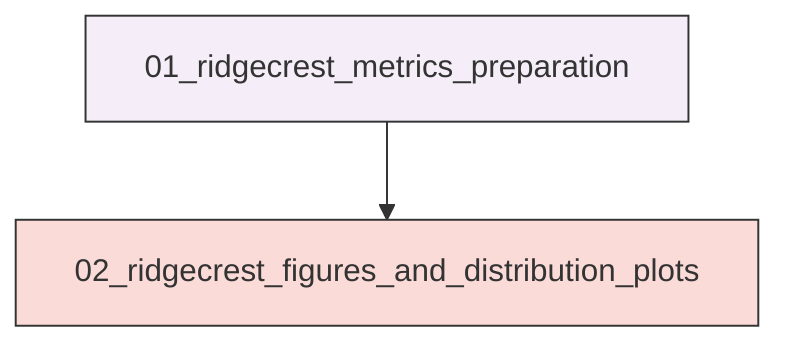
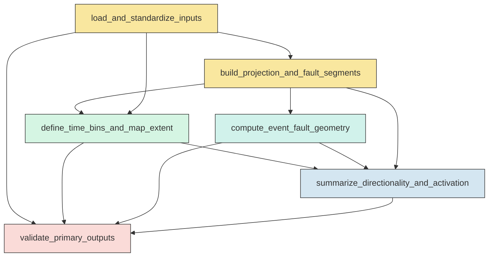
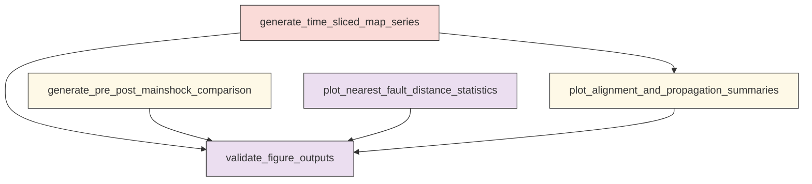

# Workflow Overview

## Top-Level Task Dependencies

**Description:**
- `01_ridgecrest_metrics_preparation`: Build the analysis-ready Ridgecrest dataset, compute event-level nearest-fault geometry, and derive bin-level directional and along-strike metrics.
- `02_ridgecrest_figures_and_distribution_plots`: Generate the requested Ridgecrest map series, comparison figure, nearest-fault distance plots, and directional-evolution synthesis figures from saved metrics.

## Subtask Dependencies

#### 01_ridgecrest_metrics_preparation
**Usage**: Build the analysis-ready Ridgecrest dataset, compute event-level nearest-fault geometry, and derive bin-level directional and along-strike metrics.

**Description:**
- `load_and_standardize_inputs`: Load the catalog, mainshock table, and fault polylines and standardize timestamps and coordinates.
- `build_projection_and_fault_segments`: Create a local projected spatial reference and convert fault polylines into segment-level geometry with strike attributes.
- `define_time_bins_and_map_extent`: Construct the canonical Stage 1 and Stage 2 time bins and a shared map extent for all figures.
- `compute_event_fault_geometry`: Calculate nearest fault distance and local nearest-segment attributes for events in the pre- and post-Mw7.1 windows.
- `summarize_directionality_and_activation`: Derive per-bin directional, nearest-fault, and along-strike occupancy metrics for the trigger-evolution analysis.
- `validate_primary_outputs`: Check that the event-level and bin-level outputs are complete, non-empty, and internally consistent.

#### 02_ridgecrest_figures_and_distribution_plots
**Usage**: Generate the requested Ridgecrest map series, comparison figure, nearest-fault distance plots, and directional-evolution synthesis figures from saved metrics.

**Description:**
- `generate_time_sliced_map_series`: Create paginated 2 by 4 spatial map figures showing seismic evolution from the Mw 6.4 to the Mw 7.1 mainshock.
- `generate_pre_post_mainshock_comparison`: Plot the spatial comparison of events before and after the Mw 7.1 mainshock using shared overlays and extents.
- `plot_nearest_fault_distance_statistics`: Produce overall and time-evolving nearest-fault distance distribution figures and tables.
- `plot_alignment_and_propagation_summaries`: Create synthesis figures for directional alignment change, centroid migration, and along-strike activation through time.
- `validate_figure_outputs`: Verify that all requested figures and plot tables were generated and are non-empty.