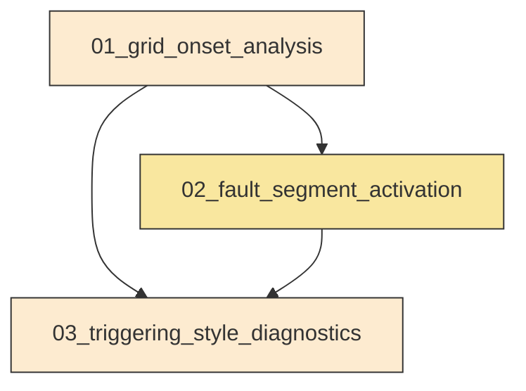
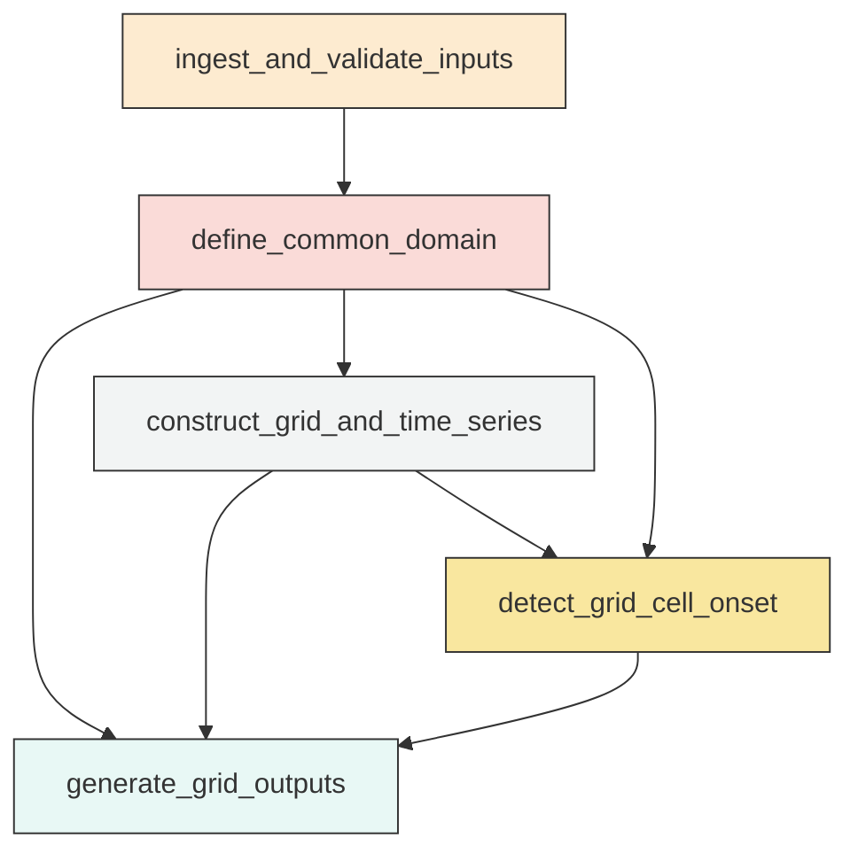
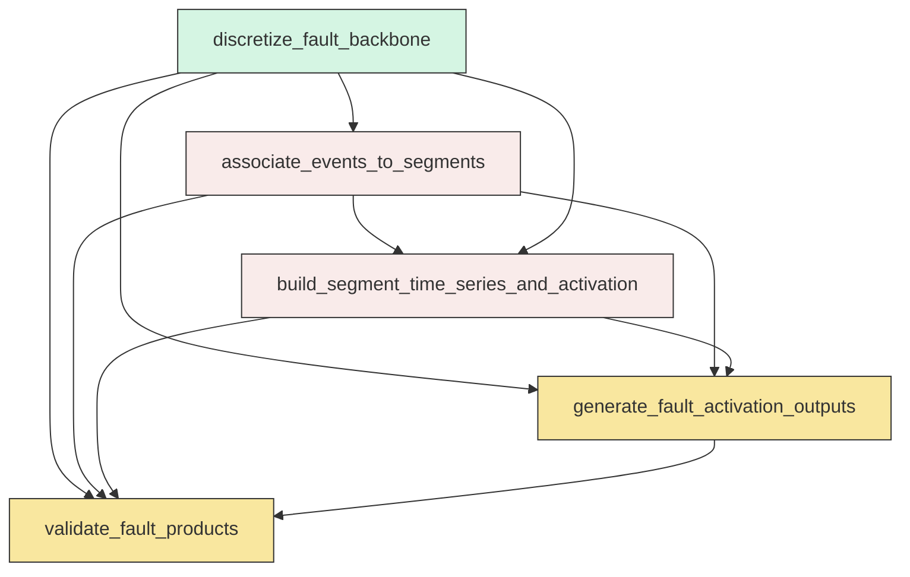
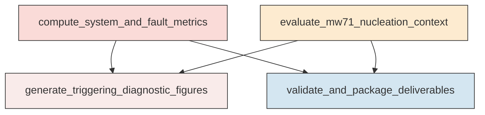

# Research Codings

## Task Overview


**Description:**
- `01_grid_onset_analysis`: Load and validate Ridgecrest inputs, define the common space-time domain, build the 1 km grid, and compute grid-cell activation onset products.
- `02_fault_segment_activation`: Build the fault-segment backbone, associate earthquakes to segments, compute segment activation time series, and generate fault-based activation figures.
- `03_triggering_style_diagnostics`: Quantify synchrony, along-fault cascading, cross-fault complexity, and the Mw 7.1 nucleation-area activation history and package validated deliverables.


## Task Details


#### 01_grid_onset_analysis
**Usage**: Load and validate Ridgecrest inputs, define the common space-time domain, build the 1 km grid, and compute grid-cell activation onset products.

**Description:**
- `ingest_and_validate_inputs`: Load the catalog, mainshock table, and fault polylines and validate required fields and malformed records.
- `define_common_domain`: Define the Mw 6.4 to Mw 7.1 time window, project coordinates to a local metric system, and build the buffered study region.
- `construct_grid_and_time_series`: Discretize the buffered region into 1 km cells, assign events to cells, and build 30-minute count-rate-cumulative series.
- `detect_grid_cell_onset`: Apply the fixed sustained-activation rule to assign onset times and confidence classes to occupied grid cells.
- `generate_grid_outputs`: Save reusable tables and figures for the study-domain overview and grid-based onset analysis.

#### Coding Script

```python

from __future__ import annotations

import json
import math
import os
import shutil
import sys
import time
import traceback
from dataclasses import dataclass
from pathlib import Path

import matplotlib
matplotlib.use('Agg')
import matplotlib.pyplot as plt
import numpy as np
import pandas as pd
from joblib import Parallel, delayed
from matplotlib.colors import Normalize
from pyproj import CRS, Transformer


CATALOG_PATH = Path('<REPO_ROOT>/examples/ridgecrest/data/catalog_TRACE/TRACE_ridgecrest_relocated.csv')
MAINSHOCK_PATH = Path('<REPO_ROOT>/examples/ridgecrest/data/catalog_TRACE/main_shock_events.csv')
FAULT_PATH = Path('<REPO_ROOT>/examples/ridgecrest/data/faults/ridgecrest_surface_faults.json')
SCRIPT_PATH = Path('../exp_run/scripts/01_grid_onset_analysis.py')
OUTPUT_DIR = Path('../exp_run/outputs/01_grid_onset_analysis')

GRID_SPACING_KM = 1.0
BUFFER_KM = 5.0
TIME_BIN_MINUTES = 30
MAX_CORES = 64
EXAMPLE_SERIES_COUNT = 4
RNG_SEED = 42


@dataclass
class OnsetResult:
    onset_bin: float
    onset_minutes: float
    support_candidate_next1: float
    support_candidate_next2: float
    total_events: int
    peak_count: int
    peak_rate_per_hour: float
    confidence_class: str


def log(message: str) -> None:
    print(f'[{time.strftime("%Y-%m-%d %H:%M:%S")}] {message}', flush=True)


def prepare_output_dir(output_dir: Path) -> None:
    output_dir.mkdir(parents=True, exist_ok=True)
    for child in output_dir.iterdir():
        if child.is_file() and child.suffix.lower() in {'.csv', '.json', '.png', '.txt'}:
            child.unlink()
        elif child.is_dir() and child.name in {'tables', 'figures'}:
            shutil.rmtree(child)
    (output_dir / 'tables').mkdir(parents=True, exist_ok=True)
    (output_dir / 'figures').mkdir(parents=True, exist_ok=True)


def load_inputs() -> tuple[pd.DataFrame, pd.DataFrame, list[list[list[float]]]]:
    log(f'Loading catalog: {CATALOG_PATH}')
    catalog = pd.read_csv(CATALOG_PATH)
    log(f'Loading mainshocks: {MAINSHOCK_PATH}')
    main = pd.read_csv(MAINSHOCK_PATH)
    log(f'Loading faults: {FAULT_PATH}')
    with FAULT_PATH.open('r', encoding='utf-8') as f:
        faults = json.load(f)
    return catalog, main, faults


def validate_catalog(df: pd.DataFrame, name: str) -> tuple[pd.DataFrame, dict]:
    required = ['event_time', 'latitude', 'longitude', 'depth_km', 'magnitude']
    missing = [c for c in required if c not in df.columns]
    if missing:
        raise ValueError(f'{name} missing required columns: {missing}')

    qc = {
        'input_rows': int(len(df)),
        'missing_required_rows': 0,
        'duplicate_rows_removed': 0,
        'invalid_numeric_rows': 0,
        'invalid_time_rows': 0,
        'retained_rows': 0,
    }

    work = df.copy()
    missing_mask = work[required].isna().any(axis=1)
    qc['missing_required_rows'] = int(missing_mask.sum())
    work = work.loc[~missing_mask].copy()

    dup_mask = work.duplicated(subset=required, keep='first')
    qc['duplicate_rows_removed'] = int(dup_mask.sum())
    work = work.loc[~dup_mask].copy()

    for c in ['latitude', 'longitude', 'depth_km', 'magnitude']:
        work[c] = pd.to_numeric(work[c], errors='coerce')
    invalid_numeric = ~np.isfinite(work[['latitude', 'longitude', 'depth_km', 'magnitude']]).all(axis=1)
    qc['invalid_numeric_rows'] = int(invalid_numeric.sum())
    work = work.loc[~invalid_numeric].copy()

    work['event_time'] = pd.to_datetime(work['event_time'], utc=True, errors='coerce')
    invalid_time = work['event_time'].isna()
    qc['invalid_time_rows'] = int(invalid_time.sum())
    work = work.loc[~invalid_time].copy()

    work = work.reset_index(drop=True)
    work['event_id'] = np.arange(len(work), dtype=np.int64)
    qc['retained_rows'] = int(len(work))
    return work, qc


def validate_faults(faults: list) -> tuple[list[np.ndarray], dict]:
    cleaned = []
    n_invalid = 0
    n_short = 0
    for poly in faults:
        if not isinstance(poly, list):
            n_invalid += 1
            continue
        arr = np.asarray(poly, dtype=float)
        if arr.ndim != 2 or arr.shape[1] != 2 or len(arr) < 2:
            n_invalid += 1
            continue
        finite = np.isfinite(arr).all(axis=1)
        arr = arr[finite]
        if len(arr) < 2:
            n_short += 1
            continue
        dedup = [arr[0]]
        for p in arr[1:]:
            if not np.allclose(p, dedup[-1]):
                dedup.append(p)
        arr = np.asarray(dedup, dtype=float)
        if len(arr) < 2:
            n_short += 1
            continue
        cleaned.append(arr)
    qc = {
        'input_fault_polylines': int(len(faults)),
        'invalid_fault_polylines': int(n_invalid),
        'too_short_fault_polylines': int(n_short),
        'retained_fault_polylines': int(len(cleaned)),
    }
    return cleaned, qc


def build_local_transformer(main_df: pd.DataFrame) -> tuple[Transformer, Transformer, CRS]:
    lon0 = float(main_df['longitude'].mean())
    lat0 = float(main_df['latitude'].mean())
    proj4 = f'+proj=aeqd +lat_0={lat0} +lon_0={lon0} +datum=WGS84 +units=km +no_defs'
    crs_local = CRS.from_proj4(proj4)
    to_local = Transformer.from_crs('EPSG:4326', crs_local, always_xy=True)
    to_geo = Transformer.from_crs(crs_local, 'EPSG:4326', always_xy=True)
    return to_local, to_geo, crs_local


def project_xy(lon: np.ndarray, lat: np.ndarray, transformer: Transformer) -> tuple[np.ndarray, np.ndarray]:
    x, y = transformer.transform(lon, lat)
    return np.asarray(x, dtype=float), np.asarray(y, dtype=float)


def build_study_region(faults: list[np.ndarray], transformer: Transformer) -> tuple[pd.DataFrame, tuple[float, float, float, float], np.ndarray, np.ndarray]:
    xs_all = []
    ys_all = []
    for arr in faults:
        x, y = project_xy(arr[:, 0], arr[:, 1], transformer)
        xs_all.append(x)
        ys_all.append(y)
    xs = np.concatenate(xs_all)
    ys = np.concatenate(ys_all)
    xmin = math.floor((float(xs.min()) - BUFFER_KM) / GRID_SPACING_KM) * GRID_SPACING_KM
    xmax = math.ceil((float(xs.max()) + BUFFER_KM) / GRID_SPACING_KM) * GRID_SPACING_KM
    ymin = math.floor((float(ys.min()) - BUFFER_KM) / GRID_SPACING_KM) * GRID_SPACING_KM
    ymax = math.ceil((float(ys.max()) + BUFFER_KM) / GRID_SPACING_KM) * GRID_SPACING_KM
    bounds = (xmin, xmax, ymin, ymax)
    region_df = pd.DataFrame([
        {
            'xmin_km': xmin,
            'xmax_km': xmax,
            'ymin_km': ymin,
            'ymax_km': ymax,
            'buffer_km': BUFFER_KM,
            'grid_spacing_km': GRID_SPACING_KM,
        }
    ])
    return region_df, bounds, xs, ys


def select_mainshocks(main_df: pd.DataFrame) -> pd.DataFrame:
    mags = main_df['magnitude'].round(1)
    ms64 = main_df.loc[np.isclose(mags, 6.4)]
    ms71 = main_df.loc[np.isclose(mags, 7.1)]
    if len(ms64) != 1 or len(ms71) != 1:
        raise ValueError('Failed to identify unique Mw 6.4 and Mw 7.1 mainshocks from main_shock_events.csv')
    out = pd.concat([ms64, ms71], ignore_index=True).copy()
    out = out.sort_values('event_time').reset_index(drop=True)
    if not np.isclose(out.iloc[0]['magnitude'], 6.4) or not np.isclose(out.iloc[1]['magnitude'], 7.1):
        raise ValueError('Mainshock chronology inconsistent with expected Mw 6.4 then Mw 7.1 ordering')
    out['mainshock_label'] = ['Mainshock64', 'Mainshock71']
    return out


def filter_events(catalog: pd.DataFrame, main_df: pd.DataFrame, bounds: tuple[float, float, float, float], transformer: Transformer) -> tuple[pd.DataFrame, dict]:
    t0 = main_df.loc[main_df['mainshock_label'] == 'Mainshock64', 'event_time'].iloc[0]
    t1 = main_df.loc[main_df['mainshock_label'] == 'Mainshock71', 'event_time'].iloc[0]
    xmin, xmax, ymin, ymax = bounds
    work = catalog.copy()
    work['x_km'], work['y_km'] = project_xy(work['longitude'].to_numpy(), work['latitude'].to_numpy(), transformer)

    time_mask = (work['event_time'] >= t0) & (work['event_time'] <= t1)
    spatial_mask = (work['x_km'] >= xmin) & (work['x_km'] < xmax) & (work['y_km'] >= ymin) & (work['y_km'] < ymax)
    final = work.loc[time_mask & spatial_mask].copy()
    final = final.sort_values('event_time').reset_index(drop=True)
    final['elapsed_minutes'] = (final['event_time'] - t0).dt.total_seconds() / 60.0
    final['elapsed_hours'] = final['elapsed_minutes'] / 60.0
    final['time_bin'] = np.floor(final['elapsed_minutes'] / TIME_BIN_MINUTES).astype(int)

    qc = {
        'catalog_total_events': int(len(catalog)),
        'time_window_events': int(time_mask.sum()),
        'spatial_window_events': int(spatial_mask.sum()),
        'final_spatiotemporal_events': int(len(final)),
        't0_utc': str(t0),
        't1_utc': str(t1),
        'window_duration_minutes': float((t1 - t0).total_seconds() / 60.0),
        'window_duration_hours': float((t1 - t0).total_seconds() / 3600.0),
    }
    return final, qc


def add_mainshock_projection(main_df: pd.DataFrame, transformer: Transformer, bounds: tuple[float, float, float, float]) -> pd.DataFrame:
    out = main_df.copy()
    out['x_km'], out['y_km'] = project_xy(out['longitude'].to_numpy(), out['latitude'].to_numpy(), transformer)
    t0 = out.loc[out['mainshock_label'] == 'Mainshock64', 'event_time'].iloc[0]
    out['elapsed_minutes_since_mw64'] = (out['event_time'] - t0).dt.total_seconds() / 60.0
    xmin, xmax, ymin, ymax = bounds
    inside = (out['x_km'] >= xmin) & (out['x_km'] < xmax) & (out['y_km'] >= ymin) & (out['y_km'] < ymax)
    if not bool(inside.all()):
        raise ValueError('One or both mainshocks fall outside the study region')
    return out


def build_grid(bounds: tuple[float, float, float, float], to_geo: Transformer) -> pd.DataFrame:
    xmin, xmax, ymin, ymax = bounds
    nx = int(round((xmax - xmin) / GRID_SPACING_KM))
    ny = int(round((ymax - ymin) / GRID_SPACING_KM))
    if nx <= 0 or ny <= 0:
        raise ValueError(f'Invalid grid dimensions derived from bounds={bounds}')
    log(f'Building grid with nx={nx}, ny={ny}, cells={nx * ny}')
    x_edges = xmin + np.arange(nx + 1) * GRID_SPACING_KM
    y_edges = ymin + np.arange(ny + 1) * GRID_SPACING_KM
    x0 = np.repeat(x_edges[:-1], ny)
    x1 = np.repeat(x_edges[1:], ny)
    y0 = np.tile(y_edges[:-1], nx)
    y1 = np.tile(y_edges[1:], nx)
    cx = 0.5 * (x0 + x1)
    cy = 0.5 * (y0 + y1)
    lonc, latc = to_geo.transform(cx, cy)
    cell_ids = np.arange(len(cx), dtype=np.int64)
    ix = np.repeat(np.arange(nx), ny)
    iy = np.tile(np.arange(ny), nx)
    grid = pd.DataFrame(
        {
            'cell_id': cell_ids,
            'ix': ix,
            'iy': iy,
            'xmin_km': x0,
            'xmax_km': x1,
            'ymin_km': y0,
            'ymax_km': y1,
            'x_center_km': cx,
            'y_center_km': cy,
            'centroid_longitude': lonc,
            'centroid_latitude': latc,
        }
    )
    required = {'cell_id', 'ix', 'iy', 'xmin_km', 'xmax_km', 'ymin_km', 'ymax_km', 'x_center_km', 'y_center_km', 'centroid_longitude', 'centroid_latitude'}
    if not required.issubset(grid.columns):
        raise ValueError('Grid definition missing required downstream columns')
    return grid


def assign_events_to_grid(events: pd.DataFrame, grid: pd.DataFrame, bounds: tuple[float, float, float, float]) -> pd.DataFrame:
    xmin, xmax, ymin, ymax = bounds
    nx = int(grid['ix'].max()) + 1
    ny = int(grid['iy'].max()) + 1
    work = events.copy()
    ix = np.floor((work['x_km'].to_numpy() - xmin) / GRID_SPACING_KM).astype(int)
    iy = np.floor((work['y_km'].to_numpy() - ymin) / GRID_SPACING_KM).astype(int)
    valid = (ix >= 0) & (ix < nx) & (iy >= 0) & (iy < ny)
    work = work.loc[valid].copy()
    ix = ix[valid]
    iy = iy[valid]
    work['ix'] = ix
    work['iy'] = iy
    work['cell_id'] = ix * ny + iy
    return work


def compute_time_bins(t0: pd.Timestamp, t1: pd.Timestamp) -> pd.DataFrame:
    duration_minutes = (t1 - t0).total_seconds() / 60.0
    n_bins = int(math.floor(duration_minutes / TIME_BIN_MINUTES)) + 1
    starts = [t0 + pd.Timedelta(minutes=TIME_BIN_MINUTES * i) for i in range(n_bins)]
    ends = [s + pd.Timedelta(minutes=TIME_BIN_MINUTES) for s in starts]
    return pd.DataFrame(
        {
            'time_bin': np.arange(n_bins, dtype=int),
            'bin_start_utc': starts,
            'bin_end_utc': ends,
            'bin_center_minutes': (np.arange(n_bins, dtype=float) + 0.5) * TIME_BIN_MINUTES,
            'bin_start_minutes': np.arange(n_bins, dtype=float) * TIME_BIN_MINUTES,
            'bin_end_minutes': (np.arange(n_bins, dtype=float) + 1.0) * TIME_BIN_MINUTES,
        }
    )


def build_cell_time_series(assignments: pd.DataFrame, time_bins: pd.DataFrame, n_jobs: int) -> pd.DataFrame:
    n_bins = len(time_bins)
    required = {'cell_id', 'time_bin'}
    if not required.issubset(assignments.columns):
        raise ValueError(f'Assignments missing required columns: {sorted(required - set(assignments.columns))}')
    if len(assignments) == 0:
        log('No assigned events available; returning empty cell time-series table')
        return pd.DataFrame(
            {
                'cell_id': pd.Series(dtype='int64'),
                'time_bin': pd.Series(dtype='int64'),
                'event_count': pd.Series(dtype='int64'),
                'rate_events_per_hour': pd.Series(dtype='float64'),
                'cumulative_count': pd.Series(dtype='int64'),
            }
        )

    grouped = assignments.groupby('cell_id', sort=True)
    cell_ids = list(grouped.groups.keys())
    log(f'Constructing per-cell time series for {len(cell_ids)} occupied cells using {n_jobs} workers')

    def _one(cell_id: int) -> pd.DataFrame:
        sub = grouped.get_group(cell_id)
        counts = np.bincount(sub['time_bin'].to_numpy(), minlength=n_bins)
        df = pd.DataFrame(
            {
                'cell_id': cell_id,
                'time_bin': np.arange(n_bins, dtype=int),
                'event_count': counts.astype(int),
            }
        )
        df['rate_events_per_hour'] = df['event_count'] * (60.0 / TIME_BIN_MINUTES)
        df['cumulative_count'] = df['event_count'].cumsum()
        return df

    pieces = Parallel(n_jobs=n_jobs, prefer='processes', verbose=10)(delayed(_one)(cid) for cid in cell_ids)
    out = pd.concat(pieces, ignore_index=True)
    expected_cols = {'cell_id', 'time_bin', 'event_count', 'rate_events_per_hour', 'cumulative_count'}
    if not expected_cols.issubset(out.columns):
        raise ValueError('Cell time-series table missing required downstream columns')
    return out


def detect_onset(counts: np.ndarray) -> OnsetResult:
    total = int(counts.sum())
    peak = int(counts.max()) if len(counts) else 0
    peak_rate = peak * (60.0 / TIME_BIN_MINUTES)
    for i, c in enumerate(counts):
        if c < 2:
            continue
        next1 = int(c + (counts[i + 1] if i + 1 < len(counts) else 0))
        next2 = int(c + counts[i + 1:i + 3].sum())
        nonzero_after = bool((counts[i + 1:i + 3] > 0).any())
        sustained = (next1 >= 3) or (next2 >= 3 and nonzero_after)
        if sustained:
            confidence = 'robust onset' if (total >= 4 and next1 >= 3) else 'weak onset'
            return OnsetResult(
                onset_bin=float(i),
                onset_minutes=float(i * TIME_BIN_MINUTES),
                support_candidate_next1=float(next1),
                support_candidate_next2=float(next2),
                total_events=total,
                peak_count=peak,
                peak_rate_per_hour=float(peak_rate),
                confidence_class=confidence,
            )
    return OnsetResult(
        onset_bin=np.nan,
        onset_minutes=np.nan,
        support_candidate_next1=np.nan,
        support_candidate_next2=np.nan,
        total_events=total,
        peak_count=peak,
        peak_rate_per_hour=float(peak_rate),
        confidence_class='no onset',
    )


def compute_onset_table(cell_time_series: pd.DataFrame, grid: pd.DataFrame, assignments: pd.DataFrame, n_jobs: int) -> pd.DataFrame:
    occupied_counts = assignments.groupby('cell_id').size().rename('total_cell_events') if len(assignments) else pd.Series(dtype='int64', name='total_cell_events')
    if len(cell_time_series) == 0:
        log('No occupied cell time series available; returning grid with empty onset attributes')
        onset = grid.copy()
        onset['onset_bin'] = np.nan
        onset['onset_minutes'] = np.nan
        onset['onset_hours'] = np.nan
        onset['support_candidate_next1'] = np.nan
        onset['support_candidate_next2'] = np.nan
        onset['total_cell_events'] = 0
        onset['peak_count'] = 0
        onset['peak_rate_per_hour'] = 0.0
        onset['confidence_class'] = 'no events'
        onset['occupied'] = False
        return onset

    grouped = cell_time_series.groupby('cell_id', sort=True)
    cell_ids = list(grouped.groups.keys())
    log(f'Computing onset table for {len(cell_ids)} occupied cells using {n_jobs} workers')

    def _one(cell_id: int) -> dict:
        sub = grouped.get_group(cell_id)
        result = detect_onset(sub['event_count'].to_numpy())
        return {
            'cell_id': int(cell_id),
            'onset_bin': result.onset_bin,
            'onset_minutes': result.onset_minutes,
            'onset_hours': result.onset_minutes / 60.0 if np.isfinite(result.onset_minutes) else np.nan,
            'support_candidate_next1': result.support_candidate_next1,
            'support_candidate_next2': result.support_candidate_next2,
            'total_cell_events': result.total_events,
            'peak_count': result.peak_count,
            'peak_rate_per_hour': result.peak_rate_per_hour,
            'confidence_class': result.confidence_class,
        }

    rows = Parallel(n_jobs=n_jobs, prefer='processes', verbose=10)(delayed(_one)(cid) for cid in cell_ids)
    onset = pd.DataFrame(rows)
    onset = grid.merge(onset, on='cell_id', how='left')
    onset['occupied'] = onset['cell_id'].isin(occupied_counts.index)
    onset['total_cell_events'] = onset['total_cell_events'].fillna(0).astype(int)
    onset['peak_count'] = onset['peak_count'].fillna(0).astype(int)
    onset['peak_rate_per_hour'] = onset['peak_rate_per_hour'].fillna(0.0)
    onset['confidence_class'] = onset['confidence_class'].fillna('no events')
    expected_cols = {'cell_id', 'occupied', 'onset_bin', 'onset_minutes', 'onset_hours', 'total_cell_events', 'peak_count', 'peak_rate_per_hour', 'confidence_class'}
    if not expected_cols.issubset(onset.columns):
        raise ValueError('Grid onset table missing required downstream columns')
    return onset


def save_table(df: pd.DataFrame, path: Path) -> None:
    df.to_csv(path, index=False)
    log(f'Saved table: {path}')


def fig_size_from_bounds(bounds: tuple[float, float, float, float], base: float = 10.0) -> tuple[float, float]:
    xmin, xmax, ymin, ymax = bounds
    width = xmax - xmin
    height = ymax - ymin
    if width <= 0 or height <= 0:
        return (10, 8)
    aspect = width / height
    if aspect >= 1:
        return (base, max(6.5, base / max(aspect, 1e-6)))
    return (max(6.5, base * aspect), base)


def plot_overview_map(events: pd.DataFrame, main_df: pd.DataFrame, fault_xs: np.ndarray, fault_ys: np.ndarray, bounds: tuple[float, float, float, float], outpath: Path) -> None:
    fig, ax = plt.subplots(figsize=fig_size_from_bounds(bounds, base=11))
    ax.scatter(fault_xs, fault_ys, s=0.05, c='0.5', alpha=0.5, label='Fault points', rasterized=True)
    if len(events) > 0:
        ax.scatter(events['x_km'], events['y_km'], s=1.0, c='tab:blue', alpha=0.2, label='Filtered events', rasterized=True)
    colors = {'Mainshock64': 'red', 'Mainshock71': 'gold'}
    for _, row in main_df.iterrows():
        ax.scatter(row['x_km'], row['y_km'], s=120, c=colors[row['mainshock_label']], edgecolor='black', marker='*', zorder=5, label=row['mainshock_label'])
    xmin, xmax, ymin, ymax = bounds
    ax.add_patch(plt.Rectangle((xmin, ymin), xmax - xmin, ymax - ymin, fill=False, lw=1.5, ec='black', ls='--', label='Study region'))
    ax.set_xlabel('Local x (km)')
    ax.set_ylabel('Local y (km)')
    ax.set_title('Ridgecrest study region overview')
    ax.set_aspect('equal', adjustable='box')
    handles, labels = ax.get_legend_handles_labels()
    uniq = dict(zip(labels, handles))
    ax.legend(uniq.values(), uniq.keys(), loc='best', fontsize=8)
    fig.tight_layout()
    fig.savefig(outpath, dpi=250)
    plt.close(fig)
    log(f'Saved figure: {outpath}')


def plot_occupied_cells(grid_onset: pd.DataFrame, bounds: tuple[float, float, float, float], outpath: Path) -> None:
    occ = grid_onset.loc[grid_onset['occupied']]
    fig, ax = plt.subplots(figsize=fig_size_from_bounds(bounds, base=11))
    ax.scatter(occ['x_center_km'], occ['y_center_km'], s=8, c=occ['total_cell_events'], cmap='viridis', alpha=0.8)
    ax.set_xlabel('Local x (km)')
    ax.set_ylabel('Local y (km)')
    ax.set_title('Occupied 1 km grid cells colored by event total')
    ax.set_aspect('equal', adjustable='box')
    sm = plt.cm.ScalarMappable(norm=Normalize(vmin=max(1, occ['total_cell_events'].min() if len(occ) else 1), vmax=max(1, occ['total_cell_events'].max() if len(occ) else 1)), cmap='viridis')
    fig.colorbar(sm, ax=ax, label='Events per occupied cell')
    fig.tight_layout()
    fig.savefig(outpath, dpi=250)
    plt.close(fig)
    log(f'Saved figure: {outpath}')


def plot_event_total_hist(grid_onset: pd.DataFrame, outpath: Path) -> None:
    occ = grid_onset.loc[grid_onset['occupied'], 'total_cell_events']
    fig, ax = plt.subplots(figsize=(8, 5))
    ax.hist(occ, bins=40, color='tab:blue', alpha=0.8)
    ax.set_xlabel('Events per occupied cell')
    ax.set_ylabel('Count of occupied cells')
    ax.set_title('Histogram of event totals per occupied cell')
    fig.tight_layout()
    fig.savefig(outpath, dpi=250)
    plt.close(fig)
    log(f'Saved figure: {outpath}')


def plot_total_rate(cell_time_series: pd.DataFrame, time_bins: pd.DataFrame, outpath: Path) -> None:
    total = cell_time_series.groupby('time_bin', as_index=False)['event_count'].sum()
    total = time_bins[['time_bin', 'bin_start_minutes']].merge(total, on='time_bin', how='left').fillna({'event_count': 0})
    total['rate_events_per_hour'] = total['event_count'] * (60.0 / TIME_BIN_MINUTES)
    fig, ax = plt.subplots(figsize=(9, 5))
    ax.plot(total['bin_start_minutes'] / 60.0, total['rate_events_per_hour'], color='tab:purple', lw=2)
    ax.set_xlabel('Hours since Mw 6.4')
    ax.set_ylabel('Study-area seismicity rate (events/hour)')
    ax.set_title('Total study-area seismicity rate vs time')
    ax.grid(True, alpha=0.3)
    fig.tight_layout()
    fig.savefig(outpath, dpi=250)
    plt.close(fig)
    log(f'Saved figure: {outpath}')


def plot_onset_map(grid_onset: pd.DataFrame, main_df: pd.DataFrame, fault_xs: np.ndarray, fault_ys: np.ndarray, bounds: tuple[float, float, float, float], outpath: Path) -> None:
    activated = grid_onset.loc[np.isfinite(grid_onset['onset_minutes'])]
    no_onset = grid_onset.loc[grid_onset['occupied'] & ~np.isfinite(grid_onset['onset_minutes'])]
    fig, ax = plt.subplots(figsize=fig_size_from_bounds(bounds, base=11))
    ax.scatter(fault_xs, fault_ys, s=0.05, c='0.7', alpha=0.35, rasterized=True)
    if len(no_onset):
        ax.scatter(no_onset['x_center_km'], no_onset['y_center_km'], s=8, c='lightgray', alpha=0.6, label='Occupied, no onset')
    sc = ax.scatter(
        activated['x_center_km'],
        activated['y_center_km'],
        s=10,
        c=activated['onset_hours'],
        cmap='Greys_r',
        alpha=0.9,
        label='Activated cells',
    )
    colors = {'Mainshock64': 'red', 'Mainshock71': 'gold'}
    for _, row in main_df.iterrows():
        ax.scatter(row['x_km'], row['y_km'], s=150, c=colors[row['mainshock_label']], edgecolor='black', marker='*', zorder=6, label=row['mainshock_label'])
    ax.set_xlabel('Local x (km)')
    ax.set_ylabel('Local y (km)')
    ax.set_title('Grid-cell activation onset time map')
    ax.set_aspect('equal', adjustable='box')
    cbar = fig.colorbar(sc, ax=ax, label='Onset time since Mw 6.4 (hours)') if len(activated) else None
    handles, labels = ax.get_legend_handles_labels()
    uniq = dict(zip(labels, handles))
    ax.legend(uniq.values(), uniq.keys(), loc='best', fontsize=8)
    fig.tight_layout()
    fig.savefig(outpath, dpi=250)
    plt.close(fig)
    log(f'Saved figure: {outpath}')


def plot_onset_histogram(grid_onset: pd.DataFrame, outpath: Path) -> None:
    vals = grid_onset.loc[np.isfinite(grid_onset['onset_hours']), 'onset_hours']
    fig, axes = plt.subplots(1, 2, figsize=(11, 4.5))
    axes[0].hist(vals, bins=40, color='0.2', alpha=0.85)
    axes[0].set_xlabel('Onset time since Mw 6.4 (hours)')
    axes[0].set_ylabel('Activated cells')
    axes[0].set_title('Onset-time histogram')
    if len(vals):
        xs = np.sort(vals.to_numpy())
        ys = np.arange(1, len(xs) + 1) / len(xs)
        axes[1].plot(xs, ys, color='tab:blue', lw=2)
    axes[1].set_xlabel('Onset time since Mw 6.4 (hours)')
    axes[1].set_ylabel('Cumulative fraction')
    axes[1].set_title('Onset-time cumulative distribution')
    axes[1].grid(True, alpha=0.3)
    fig.tight_layout()
    fig.savefig(outpath, dpi=250)
    plt.close(fig)
    log(f'Saved figure: {outpath}')


def plot_onset_quality_map(grid_onset: pd.DataFrame, bounds: tuple[float, float, float, float], outpath: Path) -> None:
    fig, ax = plt.subplots(figsize=fig_size_from_bounds(bounds, base=11))
    style = {
        'robust onset': ('black', 10),
        'weak onset': ('tab:orange', 9),
        'no onset': ('lightgray', 8),
        'no events': ('white', 0),
    }
    for cls, (color, size) in style.items():
        sub = grid_onset.loc[grid_onset['confidence_class'] == cls]
        if len(sub) == 0 or size == 0:
            continue
        ax.scatter(sub['x_center_km'], sub['y_center_km'], s=size, c=color, alpha=0.8, label=cls)
    ax.set_xlabel('Local x (km)')
    ax.set_ylabel('Local y (km)')
    ax.set_title('Grid-cell onset confidence classes')
    ax.set_aspect('equal', adjustable='box')
    ax.legend(loc='best', fontsize=8)
    fig.tight_layout()
    fig.savefig(outpath, dpi=250)
    plt.close(fig)
    log(f'Saved figure: {outpath}')


def plot_example_cell_series(cell_time_series: pd.DataFrame, grid_onset: pd.DataFrame, time_bins: pd.DataFrame, outpath: Path) -> None:
    candidates = []
    activated = grid_onset.loc[np.isfinite(grid_onset['onset_minutes'])].sort_values('onset_minutes')
    if len(activated) > 0:
        candidates.append(int(activated.iloc[0]['cell_id']))
        candidates.append(int(activated.iloc[len(activated) // 2]['cell_id']))
        candidates.append(int(activated.iloc[-1]['cell_id']))
    no_onset = grid_onset.loc[(grid_onset['occupied']) & (~np.isfinite(grid_onset['onset_minutes']))].sort_values('total_cell_events', ascending=False)
    if len(no_onset) > 0:
        candidates.append(int(no_onset.iloc[0]['cell_id']))
    candidates = list(dict.fromkeys(candidates))[:EXAMPLE_SERIES_COUNT]
    if not candidates:
        return
    fig, axes = plt.subplots(len(candidates), 1, figsize=(10, 2.7 * len(candidates)), sharex=True)
    if len(candidates) == 1:
        axes = [axes]
    for ax, cell_id in zip(axes, candidates):
        ts = cell_time_series.loc[cell_time_series['cell_id'] == cell_id].sort_values('time_bin')
        meta = grid_onset.loc[grid_onset['cell_id'] == cell_id].iloc[0]
        hours = time_bins['bin_start_minutes'] / 60.0
        ax.bar(hours, ts['event_count'], width=TIME_BIN_MINUTES / 60.0 * 0.9, color='tab:blue', alpha=0.75)
        if np.isfinite(meta['onset_hours']):
            ax.axvline(meta['onset_hours'], color='red', lw=1.5, ls='--')
        ax.set_ylabel('Count/bin')
        ax.set_title(f'Cell {cell_id} | {meta["confidence_class"]} | total={int(meta["total_cell_events"])} | onset_h={meta["onset_hours"] if np.isfinite(meta["onset_hours"]) else "NA"}')
        ax.grid(True, alpha=0.25)
    axes[-1].set_xlabel('Hours since Mw 6.4')
    fig.tight_layout()
    fig.savefig(outpath, dpi=250)
    plt.close(fig)
    log(f'Saved figure: {outpath}')


def plot_onset_vs_distance(grid_onset: pd.DataFrame, main_df: pd.DataFrame, outpath: Path) -> None:
    ms64 = main_df.loc[main_df['mainshock_label'] == 'Mainshock64'].iloc[0]
    activated = grid_onset.loc[np.isfinite(grid_onset['onset_hours'])].copy()
    activated['distance_to_mw64_km'] = np.hypot(activated['x_center_km'] - ms64['x_km'], activated['y_center_km'] - ms64['y_km'])
    fig, ax = plt.subplots(figsize=(7, 5))
    ax.scatter(activated['distance_to_mw64_km'], activated['onset_hours'], s=10, alpha=0.5, c='tab:blue')
    ax.set_xlabel('Distance from Mw 6.4 epicenter (km)')
    ax.set_ylabel('Onset time since Mw 6.4 (hours)')
    ax.set_title('Grid-cell onset time vs distance from Mw 6.4')
    ax.grid(True, alpha=0.3)
    fig.tight_layout()
    fig.savefig(outpath, dpi=250)
    plt.close(fig)
    log(f'Saved figure: {outpath}')


def build_summary_tables(grid_onset: pd.DataFrame, main_df: pd.DataFrame, filtered_events: pd.DataFrame) -> tuple[pd.DataFrame, pd.DataFrame]:
    activated = grid_onset.loc[np.isfinite(grid_onset['onset_minutes'])].copy()
    thresholds_min = [30, 60, 120, 240]
    rows = []
    n_occ = int(grid_onset['occupied'].sum())
    n_act = len(activated)
    for thr in thresholds_min:
        count = int((activated['onset_minutes'] <= thr).sum())
        rows.append(
            {
                'metric': f'fraction_activated_within_{thr}_minutes',
                'value': float(count / n_occ) if n_occ > 0 else np.nan,
                'denominator_occupied_cells': n_occ,
                'numerator_activated_cells': count,
            }
        )
    if n_act > 0:
        for q in [0.1, 0.25, 0.5, 0.75, 0.9]:
            rows.append(
                {
                    'metric': f'onset_time_quantile_q{str(q).replace(".", "")}_hours',
                    'value': float(activated['onset_hours'].quantile(q)),
                    'denominator_occupied_cells': n_occ,
                    'numerator_activated_cells': n_act,
                }
            )
    ms64 = main_df.loc[main_df['mainshock_label'] == 'Mainshock64'].iloc[0]
    if n_act > 1:
        activated['distance_to_mw64_km'] = np.hypot(activated['x_center_km'] - ms64['x_km'], activated['y_center_km'] - ms64['y_km'])
        corr = activated[['distance_to_mw64_km', 'onset_hours']].corr(method='spearman').iloc[0, 1]
        rows.append(
            {
                'metric': 'spearman_onset_vs_distance_to_mw64',
                'value': float(corr),
                'denominator_occupied_cells': n_occ,
                'numerator_activated_cells': n_act,
            }
        )
    metrics = pd.DataFrame(rows)

    validation = pd.DataFrame([
        {'metric': 'filtered_events', 'value': int(len(filtered_events))},
        {'metric': 'occupied_grid_cells', 'value': int(grid_onset['occupied'].sum())},
        {'metric': 'activated_grid_cells', 'value': int(np.isfinite(grid_onset['onset_minutes']).sum())},
        {'metric': 'robust_onset_cells', 'value': int((grid_onset['confidence_class'] == 'robust onset').sum())},
        {'metric': 'weak_onset_cells', 'value': int((grid_onset['confidence_class'] == 'weak onset').sum())},
        {'metric': 'no_onset_occupied_cells', 'value': int(((grid_onset['occupied']) & (~np.isfinite(grid_onset['onset_minutes']))).sum())},
    ])
    return metrics, validation


def save_run_parameters(main_df: pd.DataFrame, crs_local: CRS, n_jobs: int, outpath: Path) -> None:
    t0 = main_df.loc[main_df['mainshock_label'] == 'Mainshock64', 'event_time'].iloc[0]
    t1 = main_df.loc[main_df['mainshock_label'] == 'Mainshock71', 'event_time'].iloc[0]
    params = pd.DataFrame([
        {'parameter': 'catalog_path', 'value': str(CATALOG_PATH)},
        {'parameter': 'mainshock_path', 'value': str(MAINSHOCK_PATH)},
        {'parameter': 'fault_path', 'value': str(FAULT_PATH)},
        {'parameter': 'output_dir', 'value': str(OUTPUT_DIR)},
        {'parameter': 'time_window_start_utc', 'value': str(t0)},
        {'parameter': 'time_window_end_utc', 'value': str(t1)},
        {'parameter': 'grid_spacing_km', 'value': GRID_SPACING_KM},
        {'parameter': 'buffer_km', 'value': BUFFER_KM},
        {'parameter': 'time_bin_minutes', 'value': TIME_BIN_MINUTES},
        {'parameter': 'onset_rule', 'value': 'first 30-minute bin with count>=2 and sustained activation defined by either candidate+next>=3 or candidate+next_two>=3 with nonzero post-candidate activity'},
        {'parameter': 'parallel_workers', 'value': n_jobs},
        {'parameter': 'local_projection', 'value': crs_local.to_proj4()},
    ])
    save_table(params, outpath)


def main() -> None:
    t_start = time.time()
    np.random.seed(RNG_SEED)
    prepare_output_dir(OUTPUT_DIR)
    n_jobs = min(MAX_CORES, max(1, (os.cpu_count() or 1)))
    log(f'Starting 01_grid_onset_analysis with n_jobs={n_jobs}')

    catalog_raw, main_raw, faults_raw = load_inputs()
    catalog, catalog_qc = validate_catalog(catalog_raw, 'catalog')
    main_clean, main_qc = validate_catalog(main_raw, 'mainshock table')
    faults, fault_qc = validate_faults(faults_raw)
    main_df = select_mainshocks(main_clean)
    to_local, to_geo, crs_local = build_local_transformer(main_df)
    study_region_df, bounds, fault_xs, fault_ys = build_study_region(faults, to_local)
    main_proj = add_mainshock_projection(main_df, to_local, bounds)
    filtered_events, filter_qc = filter_events(catalog, main_proj, bounds, to_local)
    if 'time_bin' in filtered_events.columns and len(time_bins := compute_time_bins(
        main_proj.loc[main_proj['mainshock_label'] == 'Mainshock64', 'event_time'].iloc[0],
        main_proj.loc[main_proj['mainshock_label'] == 'Mainshock71', 'event_time'].iloc[0],
    )) > 0:
        max_valid_bin = int(time_bins['time_bin'].max())
        bad_bin_mask = (filtered_events['time_bin'] < 0) | (filtered_events['time_bin'] > max_valid_bin)
        if bool(bad_bin_mask.any()):
            raise ValueError(f'Filtered events contain out-of-range time_bin values: {int(bad_bin_mask.sum())} rows')
    t0 = main_proj.loc[main_proj['mainshock_label'] == 'Mainshock64', 'event_time'].iloc[0]
    t1 = main_proj.loc[main_proj['mainshock_label'] == 'Mainshock71', 'event_time'].iloc[0]
    grid = build_grid(bounds, to_geo)
    assignments = assign_events_to_grid(filtered_events, grid, bounds)
    cell_time_series = build_cell_time_series(assignments, time_bins, n_jobs=n_jobs)
    grid_onset = compute_onset_table(cell_time_series, grid, assignments, n_jobs=n_jobs)

    qc_summary = pd.DataFrame([
        {'category': 'catalog', 'metric': k, 'value': v} for k, v in catalog_qc.items()
    ] + [
        {'category': 'mainshock_table', 'metric': k, 'value': v} for k, v in main_qc.items()
    ] + [
        {'category': 'faults', 'metric': k, 'value': v} for k, v in fault_qc.items()
    ] + [
        {'category': 'filtering', 'metric': k, 'value': v} for k, v in filter_qc.items()
    ])

    metrics_df, validation_df = build_summary_tables(grid_onset, main_proj, filtered_events)

    save_table(main_proj, OUTPUT_DIR / 'tables' / 'mainshock_reference_table.csv')
    save_table(study_region_df, OUTPUT_DIR / 'tables' / 'study_region_bounds.csv')
    save_table(qc_summary, OUTPUT_DIR / 'tables' / 'qc_summary.csv')
    save_table(filtered_events, OUTPUT_DIR / 'tables' / 'filtered_events.csv')
    save_table(time_bins, OUTPUT_DIR / 'tables' / 'time_bins.csv')
    save_table(grid, OUTPUT_DIR / 'tables' / 'grid_definition.csv')
    save_table(assignments, OUTPUT_DIR / 'tables' / 'event_to_cell_assignment.csv')
    save_table(cell_time_series, OUTPUT_DIR / 'tables' / 'cell_time_series.csv')
    save_table(grid_onset, OUTPUT_DIR / 'tables' / 'grid_cell_onset.csv')
    save_table(metrics_df, OUTPUT_DIR / 'tables' / 'grid_onset_metrics.csv')
    save_table(validation_df, OUTPUT_DIR / 'tables' / 'validation_summary.csv')
    save_run_parameters(main_proj, crs_local, n_jobs, OUTPUT_DIR / 'tables' / 'run_parameters.csv')

    plot_overview_map(filtered_events, main_proj, fault_xs, fault_ys, bounds, OUTPUT_DIR / 'figures' / 'study_region_overview.png')
    plot_occupied_cells(grid_onset, bounds, OUTPUT_DIR / 'figures' / 'occupied_cells_map.png')
    plot_event_total_hist(grid_onset, OUTPUT_DIR / 'figures' / 'occupied_cell_event_histogram.png')
    plot_total_rate(cell_time_series, time_bins, OUTPUT_DIR / 'figures' / 'study_area_seismicity_rate.png')
    plot_onset_map(grid_onset, main_proj, fault_xs, fault_ys, bounds, OUTPUT_DIR / 'figures' / 'grid_onset_map.png')
    plot_onset_histogram(grid_onset, OUTPUT_DIR / 'figures' / 'grid_onset_histogram_cdf.png')
    plot_onset_quality_map(grid_onset, bounds, OUTPUT_DIR / 'figures' / 'grid_onset_confidence_map.png')
    plot_example_cell_series(cell_time_series, grid_onset, time_bins, OUTPUT_DIR / 'figures' / 'example_cell_time_series.png')
    plot_onset_vs_distance(grid_onset, main_proj, OUTPUT_DIR / 'figures' / 'grid_onset_vs_distance_mw64.png')

    if len(filtered_events) == 0 or int(grid_onset['occupied'].sum()) == 0:
        raise RuntimeError('Main scientific outputs are empty: filtered_events or occupied grid cells')

    elapsed = time.time() - t_start
    log(f'Completed 01_grid_onset_analysis in {elapsed:.2f} s')


if __name__ == '__main__':
    try:
        main()
    except Exception:
        print(traceback.format_exc(), flush=True)
        sys.exit(1)


```

#### 02_fault_segment_activation
**Usage**: Build the fault-segment backbone, associate earthquakes to segments, compute segment activation time series, and generate fault-based activation figures.

**Description:**
- `discretize_fault_backbone`: Convert mapped fault polylines into contiguous analyzable segments and compute segment geometry attributes.
- `associate_events_to_segments`: Compute nearest projected point-to-segment distances and assign events within 3 km to their nearest fault segments.
- `build_segment_time_series_and_activation`: Aggregate associated events into 30-minute segment time series and assign activation times using the fixed count threshold.
- `generate_fault_activation_outputs`: Produce fault-centered maps, activation-density products, and reusable summary tables from segment activation results.
- `validate_fault_products`: Validate non-empty fault-segment outputs, association coverage, and consistency of segment activation fields.

#### Coding Script

```python

from __future__ import annotations

import json
import math
import shutil
import sys
import time
import traceback
import os
from pathlib import Path

import matplotlib
matplotlib.use('Agg')
import matplotlib.pyplot as plt
from matplotlib.collections import LineCollection
from matplotlib.colors import Normalize
from matplotlib.lines import Line2D
import numpy as np
import pandas as pd
from joblib import Parallel, delayed
from pyproj import CRS, Transformer
from scipy.spatial import cKDTree


CATALOG_PATH = Path('<REPO_ROOT>/examples/ridgecrest/data/catalog_TRACE/TRACE_ridgecrest_relocated.csv')
MAINSHOCK_PATH = Path('<REPO_ROOT>/examples/ridgecrest/data/catalog_TRACE/main_shock_events.csv')
FAULT_PATH = Path('<REPO_ROOT>/examples/ridgecrest/data/faults/ridgecrest_surface_faults.json')
SCRIPT_PATH = Path('../exp_run/scripts/02_fault_segment_activation.py')
OUTPUT_DIR = Path('../exp_run/outputs/02_fault_segment_activation')
ANTECEDENT_TABLE_DIR = Path('../exp_run/outputs/01_grid_onset_analysis/tables')

TIME_BIN_MINUTES = 30
SEGMENT_TARGET_LENGTH_KM = 1.0
ASSOCIATION_THRESHOLD_KM = 3.0
ACTIVATION_COUNT_THRESHOLD = 5
MAX_CORES = 64
EVENT_MAP_ALPHA = 0.15
EVENT_MAP_SIZE = 4.0
MAJOR_FAULT_MIN_ACTIVATED_SEGMENTS = 8
RANDOM_SEED = 42
ASSOCIATION_CHUNK_SIZE = 250
FAULT_SEGMENT_CHUNK_SIZE = 500


def log(message: str) -> None:
    print(f'[{time.strftime("%Y-%m-%d %H:%M:%S")}] {message}', flush=True)


def prepare_output_dir(output_dir: Path) -> tuple[Path, Path]:
    output_dir.mkdir(parents=True, exist_ok=True)
    for child in output_dir.iterdir():
        if child.is_file() and child.suffix.lower() in {'.csv', '.json', '.png', '.txt'}:
            child.unlink()
        elif child.is_dir() and child.name in {'tables', 'figures'}:
            shutil.rmtree(child)
    table_dir = output_dir / 'tables'
    fig_dir = output_dir / 'figures'
    table_dir.mkdir(parents=True, exist_ok=True)
    fig_dir.mkdir(parents=True, exist_ok=True)
    return table_dir, fig_dir


def build_local_transformer(main_df: pd.DataFrame) -> tuple[Transformer, Transformer, CRS]:
    lon0 = float(main_df['longitude'].mean())
    lat0 = float(main_df['latitude'].mean())
    proj4 = f'+proj=aeqd +lat_0={lat0} +lon_0={lon0} +datum=WGS84 +units=km +no_defs'
    crs_local = CRS.from_proj4(proj4)
    to_local = Transformer.from_crs('EPSG:4326', crs_local, always_xy=True)
    to_geo = Transformer.from_crs(crs_local, 'EPSG:4326', always_xy=True)
    return to_local, to_geo, crs_local


def project_xy(lon: np.ndarray, lat: np.ndarray, transformer: Transformer) -> tuple[np.ndarray, np.ndarray]:
    x, y = transformer.transform(lon, lat)
    return np.asarray(x, dtype=float), np.asarray(y, dtype=float)


def validate_catalog(df: pd.DataFrame, name: str) -> tuple[pd.DataFrame, dict]:
    required = ['event_time', 'latitude', 'longitude', 'depth_km', 'magnitude']
    missing = [c for c in required if c not in df.columns]
    if missing:
        raise ValueError(f'{name} missing required columns: {missing}')
    qc = {
        'input_rows': int(len(df)),
        'missing_required_rows': 0,
        'duplicate_rows_removed': 0,
        'invalid_numeric_rows': 0,
        'invalid_time_rows': 0,
        'retained_rows': 0,
    }
    work = df.copy()
    missing_mask = work[required].isna().any(axis=1)
    qc['missing_required_rows'] = int(missing_mask.sum())
    work = work.loc[~missing_mask].copy()
    dup_mask = work.duplicated(subset=required, keep='first')
    qc['duplicate_rows_removed'] = int(dup_mask.sum())
    work = work.loc[~dup_mask].copy()
    for c in ['latitude', 'longitude', 'depth_km', 'magnitude']:
        work[c] = pd.to_numeric(work[c], errors='coerce')
    invalid_numeric = ~np.isfinite(work[['latitude', 'longitude', 'depth_km', 'magnitude']]).all(axis=1)
    qc['invalid_numeric_rows'] = int(invalid_numeric.sum())
    work = work.loc[~invalid_numeric].copy()
    work['event_time'] = pd.to_datetime(work['event_time'], utc=True, errors='coerce')
    invalid_time = work['event_time'].isna()
    qc['invalid_time_rows'] = int(invalid_time.sum())
    work = work.loc[~invalid_time].copy()
    work = work.reset_index(drop=True)
    if 'event_id' not in work.columns:
        work['event_id'] = np.arange(len(work), dtype=np.int64)
    qc['retained_rows'] = int(len(work))
    return work, qc


def require_columns(df: pd.DataFrame, required: list[str], df_name: str) -> None:
    missing = [c for c in required if c not in df.columns]
    if missing:
        raise ValueError(f'{df_name} missing required columns: {missing}')


def validate_faults(faults: list) -> tuple[list[np.ndarray], dict]:
    cleaned = []
    n_invalid = 0
    n_short = 0
    for poly in faults:
        if not isinstance(poly, list):
            n_invalid += 1
            continue
        arr = np.asarray(poly, dtype=float)
        if arr.ndim != 2 or arr.shape[1] != 2 or len(arr) < 2:
            n_invalid += 1
            continue
        arr = arr[np.isfinite(arr).all(axis=1)]
        if len(arr) < 2:
            n_short += 1
            continue
        dedup = [arr[0]]
        for p in arr[1:]:
            if not np.allclose(p, dedup[-1]):
                dedup.append(p)
        arr = np.asarray(dedup, dtype=float)
        if len(arr) < 2:
            n_short += 1
            continue
        cleaned.append(arr)
    qc = {
        'input_fault_polylines': int(len(faults)),
        'invalid_fault_polylines': int(n_invalid),
        'too_short_fault_polylines': int(n_short),
        'retained_fault_polylines': int(len(cleaned)),
    }
    return cleaned, qc


def load_mainshocks() -> pd.DataFrame:
    df = pd.read_csv(MAINSHOCK_PATH)
    df, _ = validate_catalog(df, 'mainshock_reference')
    mags = df['magnitude'].round(1)
    ms64 = df.loc[np.isclose(mags, 6.4)]
    ms71 = df.loc[np.isclose(mags, 7.1)]
    if len(ms64) != 1 or len(ms71) != 1:
        raise ValueError('Failed to identify unique Mw 6.4 and Mw 7.1 mainshocks from main_shock_events.csv')
    out = pd.concat([ms64, ms71], ignore_index=True).sort_values('event_time').reset_index(drop=True)
    out['mainshock_label'] = ['Mainshock64', 'Mainshock71']
    return out


def load_filtered_events() -> pd.DataFrame:
    path = ANTECEDENT_TABLE_DIR / 'filtered_events.csv'
    if not path.exists():
        raise FileNotFoundError(f'Missing antecedent filtered events table: {path}')
    events = pd.read_csv(path)
    events, _ = validate_catalog(events, 'filtered_events')
    for col in ['x_km', 'y_km', 'elapsed_minutes', 'elapsed_hours', 'time_bin']:
        if col not in events.columns:
            raise ValueError(f'filtered_events.csv missing required downstream column: {col}')
    events['x_km'] = pd.to_numeric(events['x_km'], errors='raise')
    events['y_km'] = pd.to_numeric(events['y_km'], errors='raise')
    events['elapsed_minutes'] = pd.to_numeric(events['elapsed_minutes'], errors='raise')
    events['elapsed_hours'] = pd.to_numeric(events['elapsed_hours'], errors='raise')
    events['time_bin'] = pd.to_numeric(events['time_bin'], errors='raise').astype(int)
    return events.sort_values('event_time').reset_index(drop=True)


def load_time_bins() -> pd.DataFrame:
    path = ANTECEDENT_TABLE_DIR / 'time_bins.csv'
    if not path.exists():
        raise FileNotFoundError(f'Missing antecedent time_bins table: {path}')
    df = pd.read_csv(path)
    required = ['time_bin', 'bin_start_utc', 'bin_end_utc', 'bin_center_minutes', 'bin_start_minutes', 'bin_end_minutes']
    missing = [c for c in required if c not in df.columns]
    if missing:
        raise ValueError(f'time_bins.csv missing required columns: {missing}')
    df['time_bin'] = pd.to_numeric(df['time_bin'], errors='raise').astype(int)
    df['bin_start_utc'] = pd.to_datetime(df['bin_start_utc'], utc=True)
    df['bin_end_utc'] = pd.to_datetime(df['bin_end_utc'], utc=True)
    return df.sort_values('time_bin').reset_index(drop=True)


def load_faults_projected(to_local: Transformer) -> list[np.ndarray]:
    with FAULT_PATH.open('r', encoding='utf-8') as f:
        faults_raw = json.load(f)
    faults_geo, _ = validate_faults(faults_raw)
    projected = []
    for arr in faults_geo:
        x, y = project_xy(arr[:, 0], arr[:, 1], to_local)
        projected.append(np.column_stack([x, y]))
    return projected


def compute_orientation_strike(x0: float, y0: float, x1: float, y1: float) -> float:
    dx = x1 - x0
    dy = y1 - y0
    angle = (90.0 - math.degrees(math.atan2(dy, dx))) % 360.0
    strike = angle % 180.0
    return strike


def segment_single_polyline(line_id: int, xy: np.ndarray, to_geo: Transformer) -> list[dict]:
    diffs = np.diff(xy, axis=0)
    seglens = np.sqrt((diffs ** 2).sum(axis=1))
    cum = np.concatenate([[0.0], np.cumsum(seglens)])
    total_length = float(cum[-1])
    if total_length <= 0.0:
        return []

    if total_length <= SEGMENT_TARGET_LENGTH_KM:
        positions = np.array([0.0, total_length], dtype=float)
    else:
        n_segments = max(1, int(math.ceil(total_length / SEGMENT_TARGET_LENGTH_KM)))
        positions = np.linspace(0.0, total_length, n_segments + 1)

    x_interp = np.interp(positions, cum, xy[:, 0])
    y_interp = np.interp(positions, cum, xy[:, 1])

    records = []
    for idx in range(len(positions) - 1):
        x0 = float(x_interp[idx])
        y0 = float(y_interp[idx])
        x1 = float(x_interp[idx + 1])
        y1 = float(y_interp[idx + 1])
        length_km = float(math.hypot(x1 - x0, y1 - y0))
        if length_km <= 0.0:
            continue
        xm = 0.5 * (x0 + x1)
        ym = 0.5 * (y0 + y1)
        lon0, lat0 = to_geo.transform(x0, y0)
        lon1, lat1 = to_geo.transform(x1, y1)
        lonm, latm = to_geo.transform(xm, ym)
        strike = compute_orientation_strike(x0, y0, x1, y1)
        records.append(
            {
                'line_id': int(line_id),
                'segment_id': int(idx),
                'global_segment_id': -1,
                'line_segment_count': int(len(positions) - 1),
                'line_total_length_km': total_length,
                'segment_length_km': length_km,
                'start_x_km': x0,
                'start_y_km': y0,
                'end_x_km': x1,
                'end_y_km': y1,
                'mid_x_km': xm,
                'mid_y_km': ym,
                'start_lon': lon0,
                'start_lat': lat0,
                'end_lon': lon1,
                'end_lat': lat1,
                'mid_lon': lonm,
                'mid_lat': latm,
                'along_line_start_km': float(positions[idx]),
                'along_line_end_km': float(positions[idx + 1]),
                'along_line_mid_km': float(0.5 * (positions[idx] + positions[idx + 1])),
                'raw_azimuth_deg': float((math.degrees(math.atan2(y1 - y0, x1 - x0)) + 360.0) % 360.0),
                'strike_deg': float(strike),
            }
        )
    return records


def build_fault_segments(projected_faults: list[np.ndarray], to_geo: Transformer) -> pd.DataFrame:
    n_jobs = min(MAX_CORES, max(1, len(projected_faults)))
    log(f'Discretizing {len(projected_faults)} fault polylines into ~{SEGMENT_TARGET_LENGTH_KM:.1f} km segments with n_jobs={n_jobs}')
    chunk_size = FAULT_SEGMENT_CHUNK_SIZE
    all_records: list[dict] = []
    for start in range(0, len(projected_faults), chunk_size):
        stop = min(len(projected_faults), start + chunk_size)
        log(f'  segmenting polyline chunk {start}:{stop}')
        chunk_records = Parallel(n_jobs=n_jobs, prefer='threads')(
            delayed(segment_single_polyline)(line_id, projected_faults[line_id], to_geo)
            for line_id in range(start, stop)
        )
        for recs in chunk_records:
            all_records.extend(recs)
    if not all_records:
        raise ValueError('No fault segments were generated from the provided fault polylines')
    df = pd.DataFrame(all_records)
    df = df.sort_values(['line_id', 'segment_id']).reset_index(drop=True)
    df['global_segment_id'] = np.arange(len(df), dtype=np.int64)
    return df


def point_to_segment_distance(px: np.ndarray, py: np.ndarray, x0: np.ndarray, y0: np.ndarray, x1: np.ndarray, y1: np.ndarray) -> tuple[np.ndarray, np.ndarray, np.ndarray]:
    vx = x1 - x0
    vy = y1 - y0
    wx = px[:, None] - x0[None, :]
    wy = py[:, None] - y0[None, :]
    denom = vx * vx + vy * vy
    denom = np.where(denom <= 0.0, 1.0, denom)
    t = (wx * vx[None, :] + wy * vy[None, :]) / denom[None, :]
    t = np.clip(t, 0.0, 1.0)
    projx = x0[None, :] + t * vx[None, :]
    projy = y0[None, :] + t * vy[None, :]
    dx = px[:, None] - projx
    dy = py[:, None] - projy
    d2 = dx * dx + dy * dy
    idx = np.argmin(d2, axis=1)
    dist = np.sqrt(d2[np.arange(len(px)), idx])
    t_best = t[np.arange(len(px)), idx]
    return dist, idx.astype(np.int64), t_best


def associate_event_chunk(chunk: pd.DataFrame, segment_lookup: pd.DataFrame, tree: cKDTree, candidate_radius_km: float) -> pd.DataFrame:
    px = chunk['x_km'].to_numpy(dtype=float)
    py = chunk['y_km'].to_numpy(dtype=float)
    candidate_lists = tree.query_ball_point(np.column_stack([px, py]), r=candidate_radius_km)

    seg_x0 = segment_lookup['start_x_km'].to_numpy(dtype=float)
    seg_y0 = segment_lookup['start_y_km'].to_numpy(dtype=float)
    seg_x1 = segment_lookup['end_x_km'].to_numpy(dtype=float)
    seg_y1 = segment_lookup['end_y_km'].to_numpy(dtype=float)
    seg_len = segment_lookup['segment_length_km'].to_numpy(dtype=float)

    rows = []
    for local_i, (_, ev) in enumerate(chunk.iterrows()):
        cand = candidate_lists[local_i]
        if not cand:
            _, nearest_mid_idx = tree.query([px[local_i], py[local_i]], k=1)
            if np.isscalar(nearest_mid_idx):
                cand = [int(nearest_mid_idx)]
            else:
                cand = [int(nearest_mid_idx[0])]
        cand = np.asarray(sorted(set(int(i) for i in cand)), dtype=np.int64)
        dist, idx_local, t_best = point_to_segment_distance(
            np.asarray([px[local_i]]),
            np.asarray([py[local_i]]),
            seg_x0[cand],
            seg_y0[cand],
            seg_x1[cand],
            seg_y1[cand],
        )
        best_local = int(idx_local[0])
        best_tree_idx = int(cand[best_local])
        best = segment_lookup.iloc[best_tree_idx]
        along_km = float(best['along_line_start_km'] + t_best[0] * seg_len[best_tree_idx])
        distance_km = float(dist[0])
        rows.append(
            {
                'event_id': int(ev['event_id']),
                'event_time': ev['event_time'],
                'latitude': float(ev['latitude']),
                'longitude': float(ev['longitude']),
                'depth_km': float(ev['depth_km']),
                'magnitude': float(ev['magnitude']),
                'x_km': float(ev['x_km']),
                'y_km': float(ev['y_km']),
                'elapsed_minutes': float(ev['elapsed_minutes']),
                'elapsed_hours': float(ev['elapsed_hours']),
                'time_bin': int(ev['time_bin']),
                'nearest_line_id': int(best['line_id']),
                'nearest_segment_id': int(best['segment_id']),
                'global_segment_id': int(best['global_segment_id']),
                'segment_strike_deg': float(best['strike_deg']),
                'segment_mid_x_km': float(best['mid_x_km']),
                'segment_mid_y_km': float(best['mid_y_km']),
                'distance_to_segment_km': distance_km,
                'along_line_position_km': along_km,
                'assigned_to_segment': bool(distance_km < ASSOCIATION_THRESHOLD_KM),
            }
        )
    return pd.DataFrame(rows)


def associate_events_to_segments(events: pd.DataFrame, segments: pd.DataFrame) -> pd.DataFrame:
    require_columns(events, ['event_id', 'x_km', 'y_km', 'elapsed_minutes', 'elapsed_hours', 'time_bin'], 'events for association')
    require_columns(
        segments,
        [
            'global_segment_id', 'line_id', 'segment_id', 'start_x_km', 'start_y_km',
            'end_x_km', 'end_y_km', 'mid_x_km', 'mid_y_km', 'strike_deg',
            'segment_length_km', 'along_line_start_km'
        ],
        'fault segments'
    )
    tree = cKDTree(segments[['mid_x_km', 'mid_y_km']].to_numpy(dtype=float))
    segment_lookup = segments.reset_index(drop=True)
    max_half_len = float(0.5 * segments['segment_length_km'].max())
    candidate_radius_km = ASSOCIATION_THRESHOLD_KM + max_half_len + 0.25
    n_jobs = min(MAX_CORES, max(1, os_cpu_count_safe()))
    chunks = [events.iloc[i:i + ASSOCIATION_CHUNK_SIZE].copy() for i in range(0, len(events), ASSOCIATION_CHUNK_SIZE)]
    n_parallel = max(1, min(n_jobs, len(chunks)))
    log(
        f'Associating {len(events)} events to {len(segments)} segments with '
        f'n_jobs={n_parallel}, n_chunks={len(chunks)}, chunk_size={ASSOCIATION_CHUNK_SIZE}, '
        f'candidate_radius_km={candidate_radius_km:.2f}'
    )
    results = Parallel(n_jobs=n_parallel, prefer='threads')(
        delayed(associate_event_chunk)(chunk, segment_lookup, tree, candidate_radius_km)
        for chunk in chunks if len(chunk) > 0
    )
    assoc = pd.concat(results, ignore_index=True)
    assoc = assoc.sort_values('event_id').reset_index(drop=True)
    if assoc['event_id'].nunique() != len(events) or len(assoc) != len(events):
        raise ValueError('Event-to-segment association did not preserve one output row per input event')
    require_columns(
        assoc,
        ['event_id', 'global_segment_id', 'distance_to_segment_km', 'assigned_to_segment', 'nearest_line_id', 'nearest_segment_id'],
        'event_to_fault_segment_association'
    )
    return assoc


def os_cpu_count_safe() -> int:
    value = os.cpu_count() or 1
    return max(1, value)


def build_segment_time_series(associations: pd.DataFrame, segments: pd.DataFrame, time_bins: pd.DataFrame) -> pd.DataFrame:
    require_columns(associations, ['global_segment_id', 'time_bin', 'assigned_to_segment'], 'associations')
    require_columns(time_bins, ['time_bin', 'bin_start_utc', 'bin_end_utc', 'bin_center_minutes', 'bin_start_minutes', 'bin_end_minutes'], 'time_bins')
    require_columns(segments, ['global_segment_id', 'line_id', 'segment_id', 'strike_deg', 'along_line_mid_km', 'mid_x_km', 'mid_y_km', 'mid_lon', 'mid_lat'], 'segments for time series')
    assigned = associations.loc[associations['assigned_to_segment']].copy()
    if assigned.empty:
        raise ValueError('No events were assigned within the 3 km threshold; cannot build segment time series')
    n_time_bins = int(time_bins['time_bin'].max()) + 1
    counts = (
        assigned.groupby(['global_segment_id', 'time_bin'])
        .size()
        .rename('event_count')
        .reset_index()
    )
    active_segments = np.sort(counts['global_segment_id'].unique())
    full_index = pd.MultiIndex.from_product([active_segments, np.arange(n_time_bins, dtype=int)], names=['global_segment_id', 'time_bin'])
    counts = counts.set_index(['global_segment_id', 'time_bin']).reindex(full_index, fill_value=0).reset_index()
    counts['rate_events_per_hour'] = counts['event_count'] * (60.0 / TIME_BIN_MINUTES)
    counts['cumulative_count'] = counts.groupby('global_segment_id')['event_count'].cumsum()
    counts = counts.merge(
        segments[['global_segment_id', 'line_id', 'segment_id', 'strike_deg', 'along_line_mid_km', 'mid_x_km', 'mid_y_km', 'mid_lon', 'mid_lat']],
        on='global_segment_id',
        how='left',
        validate='many_to_one',
    )
    counts = counts.merge(
        time_bins[['time_bin', 'bin_start_utc', 'bin_end_utc', 'bin_center_minutes', 'bin_start_minutes', 'bin_end_minutes']],
        on='time_bin',
        how='left',
        validate='many_to_one',
    )
    require_columns(
        counts,
        [
            'global_segment_id', 'time_bin', 'event_count', 'rate_events_per_hour', 'cumulative_count',
            'line_id', 'segment_id', 'strike_deg', 'along_line_mid_km', 'bin_start_minutes'
        ],
        'fault_segment_time_series'
    )
    return counts


def summarize_segment_activation(segment_ts: pd.DataFrame, associations: pd.DataFrame, segments: pd.DataFrame) -> pd.DataFrame:
    require_columns(segment_ts, ['global_segment_id', 'time_bin', 'event_count', 'rate_events_per_hour', 'bin_start_minutes', 'cumulative_count'], 'segment time series')
    require_columns(associations, ['global_segment_id', 'assigned_to_segment', 'event_time', 'elapsed_minutes', 'event_id'], 'associations for summary')
    require_columns(segments, ['global_segment_id', 'line_id', 'segment_id'], 'segments for summary')
    assigned = associations.loc[associations['assigned_to_segment']].copy()
    first_event = (
        assigned.groupby('global_segment_id')
        .agg(
            first_associated_event_time=('event_time', 'min'),
            first_associated_event_elapsed_minutes=('elapsed_minutes', 'min'),
            total_associated_events=('event_id', 'size'),
        )
        .reset_index()
    )
    activation_rows = []
    for seg_id, grp in segment_ts.groupby('global_segment_id', sort=False):
        grp = grp.sort_values('time_bin').reset_index(drop=True)
        activation_mask = grp['event_count'] >= ACTIVATION_COUNT_THRESHOLD
        if activation_mask.any():
            act_row = grp.loc[activation_mask.idxmax()]
            activation_bin = int(act_row['time_bin'])
            activation_minutes = float(act_row['bin_start_minutes'])
            activation_hours = activation_minutes / 60.0
            activated = True
        else:
            activation_bin = np.nan
            activation_minutes = np.nan
            activation_hours = np.nan
            activated = False
        peak_idx = grp['event_count'].to_numpy().argmax()
        peak_row = grp.iloc[int(peak_idx)]
        activation_rows.append(
            {
                'global_segment_id': int(seg_id),
                'activated': bool(activated),
                'activation_bin': activation_bin,
                'activation_minutes': activation_minutes,
                'activation_hours': activation_hours,
                'peak_count': int(peak_row['event_count']),
                'peak_rate_events_per_hour': float(peak_row['rate_events_per_hour']),
                'peak_bin': int(peak_row['time_bin']),
                'peak_bin_start_minutes': float(peak_row['bin_start_minutes']),
                'max_cumulative_count': int(grp['cumulative_count'].max()),
            }
        )
    activation = pd.DataFrame(activation_rows)
    summary = segments.merge(first_event, on='global_segment_id', how='left', validate='one_to_one')
    summary = summary.merge(activation, on='global_segment_id', how='left', validate='one_to_one')
    summary['total_associated_events'] = summary['total_associated_events'].fillna(0).astype(int)
    summary['first_associated_event_elapsed_hours'] = summary['first_associated_event_elapsed_minutes'] / 60.0
    summary['activation_delay_from_first_event_minutes'] = summary['activation_minutes'] - summary['first_associated_event_elapsed_minutes']
    summary['activation_delay_from_first_event_hours'] = summary['activation_delay_from_first_event_minutes'] / 60.0
    summary['activation_threshold_count_per_bin'] = ACTIVATION_COUNT_THRESHOLD
    summary['activation_threshold_rate_per_hour'] = ACTIVATION_COUNT_THRESHOLD * (60.0 / TIME_BIN_MINUTES)
    summary['ever_associated'] = summary['total_associated_events'] > 0
    summary['activated'] = summary['activated'].fillna(False)
    require_columns(
        summary,
        [
            'global_segment_id', 'line_id', 'segment_id', 'ever_associated', 'activated',
            'activation_bin', 'activation_minutes', 'activation_hours', 'total_associated_events'
        ],
        'fault_segment_activation_summary'
    )
    return summary.sort_values(['line_id', 'segment_id']).reset_index(drop=True)


def build_activation_density(summary: pd.DataFrame, time_bins: pd.DataFrame) -> tuple[pd.DataFrame, pd.DataFrame, pd.DataFrame]:
    require_columns(summary, ['activated', 'activation_bin', 'strike_deg'], 'summary for activation density')
    require_columns(time_bins, ['time_bin', 'bin_start_minutes', 'bin_center_minutes'], 'time_bins for activation density')
    activated = summary.loc[summary['activated'] & summary['activation_bin'].notna()].copy()
    new_counts = pd.DataFrame({'time_bin': time_bins['time_bin'].to_numpy(dtype=int)})
    if activated.empty:
        new_counts['newly_activated_segments'] = 0
    else:
        counts = activated.groupby('activation_bin').size().rename('newly_activated_segments').reset_index()
        counts = counts.rename(columns={'activation_bin': 'time_bin'})
        new_counts = new_counts.merge(counts, on='time_bin', how='left')
        new_counts['newly_activated_segments'] = new_counts['newly_activated_segments'].fillna(0).astype(int)
    new_counts['cumulative_activated_segments'] = new_counts['newly_activated_segments'].cumsum()
    total_segments = int(len(summary))
    total_active = int(summary['activated'].sum())
    new_counts['fraction_of_all_segments'] = new_counts['newly_activated_segments'] / max(total_segments, 1)
    new_counts['fraction_of_activated_segments'] = new_counts['newly_activated_segments'] / max(total_active, 1)
    new_counts = new_counts.merge(time_bins, on='time_bin', how='left', validate='one_to_one')

    strike_bins = np.arange(0.0, 181.0, 5.0)
    time_ids = time_bins['time_bin'].to_numpy(dtype=int)
    strike_hist = np.zeros((len(strike_bins) - 1, len(time_ids)), dtype=int)
    if not activated.empty:
        t_idx = activated['activation_bin'].astype(int).to_numpy()
        s_idx = np.clip(np.digitize(activated['strike_deg'].to_numpy(), strike_bins, right=False) - 1, 0, len(strike_bins) - 2)
        for si, ti in zip(s_idx, t_idx):
            if 0 <= ti < len(time_ids):
                strike_hist[si, ti] += 1
    strike_df = pd.DataFrame(
        strike_hist,
        index=[0.5 * (strike_bins[i] + strike_bins[i + 1]) for i in range(len(strike_bins) - 1)],
        columns=time_ids,
    )
    strike_long = strike_df.stack().rename('activated_segment_count').reset_index()
    strike_long.columns = ['strike_bin_center_deg', 'time_bin', 'activated_segment_count']
    strike_long = strike_long.merge(time_bins[['time_bin', 'bin_start_minutes', 'bin_center_minutes']], on='time_bin', how='left')
    strike_long['normalized_density'] = strike_long['activated_segment_count'] / max(total_active, 1)
    return new_counts, strike_df, strike_long


def build_line_activation_raster(summary: pd.DataFrame, time_bins: pd.DataFrame) -> pd.DataFrame:
    require_columns(summary, ['activated', 'line_id', 'along_line_mid_km', 'activation_bin', 'global_segment_id'], 'summary for raster')
    require_columns(time_bins, ['time_bin', 'bin_start_minutes'], 'time_bins for raster')
    activated = summary.loc[summary['activated']].copy()
    if activated.empty:
        return pd.DataFrame(columns=['line_id', 'rank_position', 'global_segment_id', 'activation_bin', 'bin_start_minutes', 'along_line_mid_km'])
    eligible_lines = activated.groupby('line_id').size()
    eligible_lines = eligible_lines.loc[eligible_lines >= MAJOR_FAULT_MIN_ACTIVATED_SEGMENTS].index.to_numpy(dtype=int)
    if len(eligible_lines) == 0:
        eligible_lines = activated.groupby('line_id').size().sort_values(ascending=False).head(10).index.to_numpy(dtype=int)
    out = activated.loc[activated['line_id'].isin(eligible_lines)].copy()
    out = out.sort_values(['line_id', 'along_line_mid_km']).reset_index(drop=True)
    out['rank_position'] = out.groupby('line_id').cumcount()
    out = out.merge(time_bins[['time_bin', 'bin_start_minutes']], left_on='activation_bin', right_on='time_bin', how='left')
    out = out.drop(columns=['time_bin'])
    return out


def save_qc_summary(path: Path, rows: list[dict]) -> None:
    pd.DataFrame(rows).to_csv(path, index=False)


def plot_segments_by_line(segments: pd.DataFrame, mainshocks: pd.DataFrame, fig_path: Path) -> None:
    fig, ax = plt.subplots(figsize=(11, 10))
    sample = segments.copy()
    n_lines = sample['line_id'].nunique()
    cmap = plt.cm.get_cmap('tab20', min(20, max(1, n_lines)))
    lines = []
    colors = []
    for _, row in sample.iterrows():
        lines.append([(row['start_x_km'], row['start_y_km']), (row['end_x_km'], row['end_y_km'])])
        colors.append(cmap(int(row['line_id']) % cmap.N))
    lc = LineCollection(lines, colors=colors, linewidths=0.8, alpha=0.9)
    ax.add_collection(lc)
    for _, row in mainshocks.iterrows():
        marker = '*' if row['mainshock_label'] == 'Mainshock64' else 'P'
        color = 'gold' if row['mainshock_label'] == 'Mainshock64' else 'red'
        ax.scatter(row['x_km'], row['y_km'], marker=marker, s=220, c=color, edgecolors='k', linewidths=0.7, zorder=5)
    ax.set_aspect('equal', adjustable='box')
    ax.set_xlabel('X (km)')
    ax.set_ylabel('Y (km)')
    ax.set_title('Discretized Ridgecrest fault segments colored by parent line ID')
    ax.grid(alpha=0.25, linestyle=':')
    fig.tight_layout()
    fig.savefig(fig_path, dpi=220)
    plt.close(fig)


def plot_segment_length_histogram(segments: pd.DataFrame, fig_path: Path) -> None:
    fig, ax = plt.subplots(figsize=(8, 5))
    ax.hist(segments['segment_length_km'], bins=40, color='steelblue', edgecolor='black', alpha=0.85)
    ax.axvline(SEGMENT_TARGET_LENGTH_KM, color='red', linestyle='--', linewidth=1.5, label='target length')
    ax.set_xlabel('Segment length (km)')
    ax.set_ylabel('Count')
    ax.set_title('Fault segment length distribution')
    ax.legend()
    ax.grid(alpha=0.25, linestyle=':')
    fig.tight_layout()
    fig.savefig(fig_path, dpi=220)
    plt.close(fig)


def plot_strike_distribution(segments: pd.DataFrame, fig_path: Path) -> None:
    fig, ax = plt.subplots(figsize=(8, 5))
    ax.hist(segments['strike_deg'], bins=np.arange(0, 185, 5), color='darkslateblue', edgecolor='black', alpha=0.85)
    ax.set_xlabel('Orientation-corrected strike (deg, 0-180)')
    ax.set_ylabel('Segment count')
    ax.set_title('Fault segment strike distribution')
    ax.grid(alpha=0.25, linestyle=':')
    fig.tight_layout()
    fig.savefig(fig_path, dpi=220)
    plt.close(fig)


def plot_association_distance_histogram(assoc: pd.DataFrame, fig_path: Path) -> None:
    fig, ax = plt.subplots(figsize=(8, 5))
    ax.hist(assoc['distance_to_segment_km'], bins=50, color='seagreen', edgecolor='black', alpha=0.85)
    ax.axvline(ASSOCIATION_THRESHOLD_KM, color='red', linestyle='--', linewidth=1.5, label='association threshold')
    ax.set_xlabel('Nearest fault-segment distance (km)')
    ax.set_ylabel('Event count')
    ax.set_title('Nearest event-to-segment distance distribution')
    ax.legend()
    ax.grid(alpha=0.25, linestyle=':')
    fig.tight_layout()
    fig.savefig(fig_path, dpi=220)
    plt.close(fig)


def plot_associated_vs_unassociated(segments: pd.DataFrame, assoc: pd.DataFrame, mainshocks: pd.DataFrame, fig_path: Path) -> None:
    fig = plt.figure(figsize=(15, 9))
    gs = fig.add_gridspec(2, 2, width_ratios=[2.35, 1.0], height_ratios=[1.0, 1.0], wspace=0.22, hspace=0.22)
    ax_map = fig.add_subplot(gs[:, 0])
    ax_hist = fig.add_subplot(gs[0, 1])
    ax_bar = fig.add_subplot(gs[1, 1])

    lines = [[(r['start_x_km'], r['start_y_km']), (r['end_x_km'], r['end_y_km'])] for _, r in segments.iterrows()]
    lc = LineCollection(lines, colors='0.45', linewidths=0.8, alpha=0.85, zorder=1)
    ax_map.add_collection(lc)

    unassoc = assoc.loc[~assoc['assigned_to_segment']].copy()
    assigned = assoc.loc[assoc['assigned_to_segment']].copy()

    if not unassoc.empty:
        ax_map.scatter(
            unassoc['x_km'], unassoc['y_km'], s=10, c='darkorange', alpha=0.65,
            edgecolors='none', zorder=3
        )
    if not assigned.empty:
        ax_map.scatter(
            assigned['x_km'], assigned['y_km'], s=6, c='navy', alpha=0.20,
            edgecolors='none', zorder=2
        )

    mainshock_handles = []
    for _, row in mainshocks.iterrows():
        if row['mainshock_label'] == 'Mainshock64':
            marker = '*'
            color = 'gold'
            label = 'Mw 6.4 mainshock'
        else:
            marker = 'P'
            color = 'red'
            label = 'Mw 7.1 mainshock'
        ax_map.scatter(row['x_km'], row['y_km'], marker=marker, s=240, c=color, edgecolors='k', linewidths=0.8, zorder=5)
        ax_map.text(row['x_km'] + 0.45, row['y_km'] + 0.45, row['mainshock_label'], fontsize=9, weight='bold')
        mainshock_handles.append(Line2D([0], [0], marker=marker, color='w', label=label, markerfacecolor=color, markeredgecolor='k', markersize=12, linewidth=0))

    legend_handles = [
        Line2D([0], [0], color='0.45', lw=1.6, label='Fault segments'),
        Line2D([0], [0], marker='o', color='w', label=f'Associated events (n={len(assigned)})', markerfacecolor='navy', markeredgecolor='none', markersize=7, alpha=0.7),
        Line2D([0], [0], marker='o', color='w', label=f'Unassociated events (n={len(unassoc)})', markerfacecolor='darkorange', markeredgecolor='none', markersize=7, alpha=0.9),
    ] + mainshock_handles
    ax_map.legend(handles=legend_handles, loc='upper right', frameon=True, framealpha=0.95)

    ax_map.set_aspect('equal', adjustable='box')
    ax_map.set_xlabel('X (km)')
    ax_map.set_ylabel('Y (km)')
    ax_map.set_title('Associated vs unassociated events relative to discretized fault segments')
    ax_map.grid(alpha=0.25, linestyle=':')

    bins = np.linspace(0.0, max(float(assoc['distance_to_segment_km'].max()), ASSOCIATION_THRESHOLD_KM), 40)
    ax_hist.hist(assoc['distance_to_segment_km'], bins=bins, color='0.70', edgecolor='0.25', alpha=0.9)
    ax_hist.axvline(ASSOCIATION_THRESHOLD_KM, color='red', linestyle='--', linewidth=1.5, label='3 km threshold')
    ax_hist.set_xlabel('Nearest segment distance (km)')
    ax_hist.set_ylabel('Event count')
    ax_hist.set_title('Nearest-distance comparison summary')
    ax_hist.legend(loc='upper right', frameon=True)
    ax_hist.grid(alpha=0.25, linestyle=':')

    counts = np.array([len(assigned), len(unassoc)], dtype=int)
    fractions = counts / max(len(assoc), 1)
    labels = ['Associated', 'Unassociated']
    colors = ['navy', 'darkorange']
    bars = ax_bar.bar(labels, counts, color=colors, alpha=0.9, edgecolor='black', linewidth=0.7)
    for bar, count, frac in zip(bars, counts, fractions):
        ax_bar.text(bar.get_x() + bar.get_width() / 2.0, bar.get_height() + max(counts) * 0.02, f'{count}\n({frac:.1%})', ha='center', va='bottom', fontsize=10)
    ax_bar.set_ylabel('Number of events')
    ax_bar.set_title('Assignment outcome summary')
    ax_bar.grid(axis='y', alpha=0.25, linestyle=':')

    fig.tight_layout()
    fig.savefig(fig_path, dpi=220)
    plt.close(fig)


def plot_activation_map(summary: pd.DataFrame, assoc: pd.DataFrame, mainshocks: pd.DataFrame, fig_path: Path) -> None:
    fig, ax = plt.subplots(figsize=(11, 10))
    activated = summary.loc[summary['activated'] & summary['activation_minutes'].notna()].copy()
    inactive = summary.loc[~summary['activated'] | summary['activation_minutes'].isna()].copy()
    if not inactive.empty:
        lines = [[(r['start_x_km'], r['start_y_km']), (r['end_x_km'], r['end_y_km'])] for _, r in inactive.iterrows()]
        ax.add_collection(LineCollection(lines, colors='0.8', linewidths=0.7, alpha=0.7, zorder=1))
    if not activated.empty:
        vmin = float(activated['activation_minutes'].min())
        vmax = float(activated['activation_minutes'].max())
        if math.isclose(vmin, vmax):
            vmax = vmin + TIME_BIN_MINUTES
        norm = Normalize(vmin=vmin, vmax=vmax)
        cmap = plt.cm.Greys_r
        lines = [[(r['start_x_km'], r['start_y_km']), (r['end_x_km'], r['end_y_km'])] for _, r in activated.iterrows()]
        colors = cmap(norm(activated['activation_minutes'].to_numpy()))
        lc = LineCollection(lines, colors=colors, linewidths=2.0, alpha=0.95, zorder=3)
        ax.add_collection(lc)
        sm = plt.cm.ScalarMappable(norm=norm, cmap=cmap)
        cbar = fig.colorbar(sm, ax=ax, pad=0.02, shrink=0.82)
        cbar.set_label('Segment activation time since Mw 6.4 (minutes)')
    assigned = assoc.loc[assoc['assigned_to_segment']].copy()
    if not assigned.empty:
        event_colors = 'black'
        ax.scatter(assigned['x_km'], assigned['y_km'], s=EVENT_MAP_SIZE, c=event_colors, alpha=EVENT_MAP_ALPHA, linewidths=0, zorder=2)
    for _, row in mainshocks.iterrows():
        marker = '*' if row['mainshock_label'] == 'Mainshock64' else 'P'
        color = 'gold' if row['mainshock_label'] == 'Mainshock64' else 'red'
        ax.scatter(row['x_km'], row['y_km'], marker=marker, s=240, c=color, edgecolors='k', linewidths=0.8, zorder=5)
        ax.text(row['x_km'] + 0.4, row['y_km'] + 0.4, row['mainshock_label'], fontsize=9, weight='bold')
    ax.set_aspect('equal', adjustable='box')
    ax.set_xlabel('X (km)')
    ax.set_ylabel('Y (km)')
    ax.set_title('Fault-segment activation sequence between Mw 6.4 and Mw 7.1')
    ax.grid(alpha=0.25, linestyle=':')
    fig.tight_layout()
    fig.savefig(fig_path, dpi=220)
    plt.close(fig)


def plot_activation_counts(new_counts: pd.DataFrame, fig_path: Path) -> None:
    fig, ax = plt.subplots(figsize=(10, 5))
    x = new_counts['bin_center_minutes'] / 60.0
    y = new_counts['newly_activated_segments']
    sc = ax.scatter(x, y, c=y, cmap='viridis', s=45, edgecolors='none')
    ax.plot(x, y, color='0.35', linewidth=0.9, alpha=0.8)
    cbar = fig.colorbar(sc, ax=ax, pad=0.02)
    cbar.set_label('Newly activated segments per 30-minute bin')
    ax.set_xlabel('Time since Mw 6.4 (hours)')
    ax.set_ylabel('Activated segment count')
    ax.set_title('Fault-segment activation density vs time')
    ax.grid(alpha=0.25, linestyle=':')
    fig.tight_layout()
    fig.savefig(fig_path, dpi=220)
    plt.close(fig)


def plot_cumulative_activation(new_counts: pd.DataFrame, fig_path: Path) -> None:
    fig, ax = plt.subplots(figsize=(10, 5))
    ax.plot(new_counts['bin_center_minutes'] / 60.0, new_counts['cumulative_activated_segments'], color='darkred', linewidth=2.0)
    ax.set_xlabel('Time since Mw 6.4 (hours)')
    ax.set_ylabel('Cumulative activated segments')
    ax.set_title('Cumulative fault-segment activation through time')
    ax.grid(alpha=0.25, linestyle=':')
    fig.tight_layout()
    fig.savefig(fig_path, dpi=220)
    plt.close(fig)


def plot_strike_time_density(strike_df: pd.DataFrame, fig_path: Path) -> None:
    fig, ax = plt.subplots(figsize=(11, 6))
    data = strike_df.to_numpy(dtype=float)
    im = ax.imshow(
        data,
        aspect='auto',
        origin='lower',
        interpolation='nearest',
        extent=[strike_df.columns.min(), strike_df.columns.max() + 1, strike_df.index.min() - 2.5, strike_df.index.max() + 2.5],
        cmap='magma',
    )
    cbar = fig.colorbar(im, ax=ax, pad=0.02)
    cbar.set_label('Activated segment count')
    ax.set_xlabel('Time bin (30-minute bins since Mw 6.4)')
    ax.set_ylabel('Strike angle (deg, corrected to 0-180)')
    ax.set_title('Strike × activation-time density map')
    fig.tight_layout()
    fig.savefig(fig_path, dpi=220)
    plt.close(fig)


def plot_major_fault_raster(raster: pd.DataFrame, fig_path: Path) -> None:
    fig, ax = plt.subplots(figsize=(11, 8))
    if raster.empty:
        ax.text(0.5, 0.5, 'No eligible activated faults for raster plot', ha='center', va='center', transform=ax.transAxes)
        ax.set_axis_off()
    else:
        line_ids = sorted(raster['line_id'].unique())
        offset = 0
        yticks = []
        ylabels = []
        for line_id in line_ids:
            sub = raster.loc[raster['line_id'] == line_id].sort_values('rank_position')
            y = offset + sub['rank_position'].to_numpy()
            x = sub['bin_start_minutes'].to_numpy() / 60.0
            c = sub['activation_bin'].to_numpy()
            sc = ax.scatter(x, y, c=c, cmap='viridis', s=26, edgecolors='none')
            yticks.append(offset + 0.5 * (len(sub) - 1))
            ylabels.append(f'line {line_id}')
            offset += len(sub) + 2
        cbar = fig.colorbar(sc, ax=ax, pad=0.02)
        cbar.set_label('Activation time bin')
        ax.set_yticks(yticks)
        ax.set_yticklabels(ylabels)
        ax.set_xlabel('Activation time since Mw 6.4 (hours)')
        ax.set_ylabel('Ordered segment position along parent fault')
        ax.set_title('Activation raster for major parent faults')
        ax.grid(alpha=0.2, linestyle=':')
    fig.tight_layout()
    fig.savefig(fig_path, dpi=220)
    plt.close(fig)


def plot_representative_segment_series(segment_ts: pd.DataFrame, summary: pd.DataFrame, fig_path: Path) -> None:
    activated = summary.loc[summary['activated']].sort_values('activation_minutes')
    never = summary.loc[~summary['activated']].sort_values('total_associated_events', ascending=False)
    chosen_ids = []
    if not activated.empty:
        chosen_ids.append(int(activated.iloc[0]['global_segment_id']))
        chosen_ids.append(int(activated.iloc[len(activated) // 2]['global_segment_id']))
        chosen_ids.append(int(activated.iloc[-1]['global_segment_id']))
    if not never.empty:
        chosen_ids.append(int(never.iloc[0]['global_segment_id']))
    chosen_ids = list(dict.fromkeys(chosen_ids))[:4]
    if not chosen_ids:
        fig, ax = plt.subplots(figsize=(8, 4))
        ax.text(0.5, 0.5, 'No segment time series available', ha='center', va='center', transform=ax.transAxes)
        ax.set_axis_off()
        fig.tight_layout()
        fig.savefig(fig_path, dpi=220)
        plt.close(fig)
        return
    fig, axes = plt.subplots(len(chosen_ids), 1, figsize=(10, 2.6 * len(chosen_ids)), sharex=True)
    if len(chosen_ids) == 1:
        axes = [axes]
    for ax, seg_id in zip(axes, chosen_ids):
        ts = segment_ts.loc[segment_ts['global_segment_id'] == seg_id].sort_values('time_bin')
        meta = summary.loc[summary['global_segment_id'] == seg_id].iloc[0]
        x = ts['bin_center_minutes'] / 60.0
        y = ts['event_count']
        ax.step(x, y, where='mid', color='navy', linewidth=1.6)
        ax.axhline(ACTIVATION_COUNT_THRESHOLD, color='red', linestyle='--', linewidth=1.0)
        if bool(meta['activated']) and np.isfinite(meta['activation_hours']):
            ax.axvline(meta['activation_hours'], color='darkorange', linestyle='-', linewidth=1.2)
        ax.set_ylabel('Count/bin')
        ax.set_title(
            f"segment {int(seg_id)} | line {int(meta['line_id'])} seg {int(meta['segment_id'])} | "
            f"events={int(meta['total_associated_events'])} | activated={bool(meta['activated'])}"
        )
        ax.grid(alpha=0.25, linestyle=':')
    axes[-1].set_xlabel('Time since Mw 6.4 (hours)')
    fig.tight_layout()
    fig.savefig(fig_path, dpi=220)
    plt.close(fig)


def main() -> None:
    start = time.time()
    table_dir, fig_dir = prepare_output_dir(OUTPUT_DIR)
    log('Starting fault-segment activation analysis')

    mainshocks = load_mainshocks()
    to_local, to_geo, _ = build_local_transformer(mainshocks)
    mainshocks['x_km'], mainshocks['y_km'] = project_xy(mainshocks['longitude'].to_numpy(), mainshocks['latitude'].to_numpy(), to_local)
    t0 = mainshocks.loc[mainshocks['mainshock_label'] == 'Mainshock64', 'event_time'].iloc[0]
    mainshocks['elapsed_minutes_since_mw64'] = (mainshocks['event_time'] - t0).dt.total_seconds() / 60.0

    events = load_filtered_events()
    time_bins = load_time_bins()
    projected_faults = load_faults_projected(to_local)

    log('Building fault-segment backbone')
    segments = build_fault_segments(projected_faults, to_geo)
    require_columns(
        segments,
        [
            'global_segment_id', 'line_id', 'segment_id', 'segment_length_km', 'start_x_km', 'start_y_km',
            'end_x_km', 'end_y_km', 'mid_x_km', 'mid_y_km', 'strike_deg', 'along_line_mid_km'
        ],
        'fault_segment_geometry'
    )
    segments.to_csv(table_dir / 'fault_segment_geometry.csv', index=False)

    log('Associating earthquakes to nearest fault segments')
    associations = associate_events_to_segments(events, segments)
    associations.to_csv(table_dir / 'event_to_fault_segment_association.csv', index=False)
    unassociated = associations.loc[~associations['assigned_to_segment']].copy()
    unassociated.to_csv(table_dir / 'unassociated_events.csv', index=False)

    log('Constructing fault-segment time series')
    segment_ts = build_segment_time_series(associations, segments, time_bins)
    segment_ts.to_csv(table_dir / 'fault_segment_time_series.csv', index=False)

    log('Summarizing segment activation')
    summary = summarize_segment_activation(segment_ts, associations, segments)
    summary.to_csv(table_dir / 'fault_segment_activation_summary.csv', index=False)

    log('Building activation density products')
    new_counts, strike_df, strike_long = build_activation_density(summary, time_bins)
    new_counts.to_csv(table_dir / 'fault_activation_density_vs_time.csv', index=False)
    strike_long.to_csv(table_dir / 'strike_activation_density_long.csv', index=False)
    strike_df.to_csv(table_dir / 'strike_activation_density_matrix.csv', index=True)
    raster = build_line_activation_raster(summary, time_bins)
    raster.to_csv(table_dir / 'major_fault_activation_raster.csv', index=False)

    qc_rows = [
        {'category': 'faults', 'metric': 'n_projected_polylines', 'value': int(len(projected_faults))},
        {'category': 'segments', 'metric': 'n_segments', 'value': int(len(segments))},
        {'category': 'segments', 'metric': 'median_segment_length_km', 'value': float(segments['segment_length_km'].median())},
        {'category': 'segments', 'metric': 'mean_segment_length_km', 'value': float(segments['segment_length_km'].mean())},
        {'category': 'association', 'metric': 'n_events_input', 'value': int(len(events))},
        {'category': 'association', 'metric': 'n_assigned_events', 'value': int(associations['assigned_to_segment'].sum())},
        {'category': 'association', 'metric': 'fraction_assigned_events', 'value': float(associations['assigned_to_segment'].mean())},
        {'category': 'association', 'metric': 'median_distance_km', 'value': float(associations['distance_to_segment_km'].median())},
        {'category': 'activation', 'metric': 'n_segments_with_any_associated_events', 'value': int(summary['ever_associated'].sum())},
        {'category': 'activation', 'metric': 'n_activated_segments', 'value': int(summary['activated'].sum())},
        {'category': 'activation', 'metric': 'fraction_activated_of_all_segments', 'value': float(summary['activated'].mean())},
        {'category': 'activation', 'metric': 'fraction_activated_of_associated_segments', 'value': float(summary['activated'].sum() / max(int(summary['ever_associated'].sum()), 1))},
        {'category': 'run', 'metric': 'elapsed_seconds', 'value': float(time.time() - start)},
    ]
    save_qc_summary(table_dir / 'qc_summary.csv', qc_rows)

    run_params = pd.DataFrame(
        [
            {'parameter': 'catalog_path', 'value': str(CATALOG_PATH)},
            {'parameter': 'mainshock_path', 'value': str(MAINSHOCK_PATH)},
            {'parameter': 'fault_path', 'value': str(FAULT_PATH)},
            {'parameter': 'antecedent_filtered_events', 'value': str(ANTECEDENT_TABLE_DIR / 'filtered_events.csv')},
            {'parameter': 'time_bin_minutes', 'value': TIME_BIN_MINUTES},
            {'parameter': 'segment_target_length_km', 'value': SEGMENT_TARGET_LENGTH_KM},
            {'parameter': 'association_threshold_km', 'value': ASSOCIATION_THRESHOLD_KM},
            {'parameter': 'activation_threshold_count_per_30min_bin', 'value': ACTIVATION_COUNT_THRESHOLD},
            {'parameter': 'activation_threshold_rate_per_hour', 'value': ACTIVATION_COUNT_THRESHOLD * (60.0 / TIME_BIN_MINUTES)},
            {'parameter': 'max_cores', 'value': MAX_CORES},
        ]
    )
    run_params.to_csv(table_dir / 'run_parameters.csv', index=False)

    validation = pd.DataFrame(
        [
            {'metric': 'n_filtered_events', 'value': int(len(events))},
            {'metric': 'n_fault_segments', 'value': int(len(segments))},
            {'metric': 'n_associated_events', 'value': int(associations['assigned_to_segment'].sum())},
            {'metric': 'n_unassociated_events', 'value': int((~associations['assigned_to_segment']).sum())},
            {'metric': 'n_segments_with_associated_events', 'value': int(summary['ever_associated'].sum())},
            {'metric': 'n_activated_segments', 'value': int(summary['activated'].sum())},
            {'metric': 'n_major_fault_raster_rows', 'value': int(len(raster))},
        ]
    )
    validation.to_csv(table_dir / 'validation_summary.csv', index=False)

    log('Generating figures')
    plot_segments_by_line(segments, mainshocks, fig_dir / 'fault_segments_by_line.png')
    plot_segment_length_histogram(segments, fig_dir / 'segment_length_histogram.png')
    plot_strike_distribution(segments, fig_dir / 'segment_strike_distribution.png')
    plot_association_distance_histogram(associations, fig_dir / 'nearest_distance_histogram.png')
    plot_associated_vs_unassociated(segments, associations, mainshocks, fig_dir / 'associated_vs_unassociated_events.png')
    plot_activation_map(summary, associations, mainshocks, fig_dir / 'fault_segment_activation_map.png')
    plot_activation_counts(new_counts, fig_dir / 'fault_segment_activation_density_vs_time.png')
    plot_cumulative_activation(new_counts, fig_dir / 'cumulative_fault_segment_activation.png')
    plot_strike_time_density(strike_df, fig_dir / 'strike_activation_time_density.png')
    plot_major_fault_raster(raster, fig_dir / 'major_fault_activation_raster.png')
    plot_representative_segment_series(segment_ts, summary, fig_dir / 'representative_fault_segment_time_series.png')

    if len(segments) == 0 or len(associations) == 0 or len(segment_ts) == 0 or len(summary) == 0:
        raise ValueError('One or more primary outputs are empty')
    if int(summary['activated'].sum()) == 0:
        raise ValueError('No fault segments met the activation threshold; check association or threshold logic')

    elapsed = time.time() - start
    log(f'Finished fault-segment activation analysis in {elapsed:.1f} s')


if __name__ == '__main__':
    try:
        main()
    except Exception:
        print(traceback.format_exc(), flush=True)
        sys.exit(1)


```

#### 03_triggering_style_diagnostics
**Usage**: Quantify synchrony, along-fault cascading, cross-fault complexity, and the Mw 7.1 nucleation-area activation history and package validated deliverables.

**Description:**
- `compute_system_and_fault_metrics`: Derive system-wide synchrony metrics, per-fault propagation metrics, and cross-fault complexity diagnostics from grid and segment activation products.
- `evaluate_mw71_nucleation_context`: Compare the activation timing of the segment nearest the Mw 7.1 epicenter with its local neighborhood and the full system.
- `generate_triggering_diagnostic_figures`: Create the integrated diagnostic figures needed to assess synchronous, staged, jump-like, or complex activation behavior.
- `validate_and_package_deliverables`: Validate cross-step consistency, summarize run parameters and counts, and package reusable outputs from all scripts.

#### Coding Script

```python

from __future__ import annotations

import math
import shutil
import sys
import time
import traceback
from pathlib import Path

import matplotlib
matplotlib.use('Agg')
import matplotlib.pyplot as plt
from matplotlib.collections import LineCollection
from matplotlib.colors import Normalize
import numpy as np
import pandas as pd
from joblib import Parallel, delayed
from scipy.stats import spearmanr


SCRIPT_PATH = Path('../exp_run/scripts/03_triggering_style_diagnostics.py')
OUTPUT_DIR = Path('../exp_run/outputs/03_triggering_style_diagnostics')
GRID_TABLE_DIR = Path('../exp_run/outputs/01_grid_onset_analysis/tables')
FAULT_TABLE_DIR = Path('../exp_run/outputs/02_fault_segment_activation/tables')

TIME_BIN_MINUTES = 30
MAX_CORES = 64
MAJOR_FAULT_MIN_ACTIVATED_SEGMENTS = 8
MW71_NEIGHBORHOOD_RADIUS_KM = 3.0
EARLY_WINDOW_MIN = 60.0
MID_WINDOW_MIN = 240.0
BEND_ANGLE_THRESHOLD_DEG = 20.0


def log(message: str) -> None:
    print(f'[{time.strftime("%Y-%m-%d %H:%M:%S")}] {message}', flush=True)


def prepare_output_dir(output_dir: Path) -> tuple[Path, Path]:
    output_dir.mkdir(parents=True, exist_ok=True)
    for child in output_dir.iterdir():
        if child.is_file() and child.suffix.lower() in {'.csv', '.json', '.png', '.txt'}:
            child.unlink()
        elif child.is_dir() and child.name in {'tables', 'figures'}:
            shutil.rmtree(child)
    table_dir = output_dir / 'tables'
    fig_dir = output_dir / 'figures'
    table_dir.mkdir(parents=True, exist_ok=True)
    fig_dir.mkdir(parents=True, exist_ok=True)
    return table_dir, fig_dir


def require_columns(df: pd.DataFrame, required: list[str], df_name: str) -> None:
    missing = [c for c in required if c not in df.columns]
    if missing:
        raise ValueError(f'{df_name} missing required columns: {missing}')


def load_csv(path: Path, required: list[str], name: str) -> pd.DataFrame:
    if not path.exists():
        raise FileNotFoundError(f'Missing required input table: {path}')
    df = pd.read_csv(path)
    require_columns(df, required, name)
    return df


def parse_datetime_mixed(series: pd.Series, name: str, allow_missing: bool = False) -> pd.Series:
    parsed = pd.to_datetime(series, utc=True, format='mixed', errors='coerce')
    if allow_missing:
        invalid_mask = parsed.isna() & series.notna()
    else:
        invalid_mask = parsed.isna()
    if invalid_mask.any():
        n_bad = int(invalid_mask.sum())
        raise ValueError(f'Failed to parse {n_bad} datetime values in {name}')
    return parsed


def load_inputs() -> dict[str, pd.DataFrame]:
    log('Loading antecedent outputs from Tasks 01 and 02')
    grid_onset = load_csv(
        GRID_TABLE_DIR / 'grid_cell_onset.csv',
        ['cell_id', 'x_center_km', 'y_center_km', 'onset_minutes', 'onset_bin', 'confidence_class', 'occupied', 'total_cell_events'],
        'grid_cell_onset',
    )
    grid_def = load_csv(
        GRID_TABLE_DIR / 'grid_definition.csv',
        ['cell_id', 'xmin_km', 'xmax_km', 'ymin_km', 'ymax_km', 'x_center_km', 'y_center_km', 'centroid_longitude', 'centroid_latitude'],
        'grid_definition',
    )
    filtered_events = load_csv(
        GRID_TABLE_DIR / 'filtered_events.csv',
        ['event_time', 'latitude', 'longitude', 'depth_km', 'magnitude', 'event_id', 'x_km', 'y_km', 'elapsed_minutes', 'elapsed_hours', 'time_bin'],
        'filtered_events',
    )
    mainshock = load_csv(
        GRID_TABLE_DIR / 'mainshock_reference_table.csv',
        ['event_time', 'latitude', 'longitude', 'depth_km', 'magnitude', 'mainshock_label', 'x_km', 'y_km', 'elapsed_minutes_since_mw64'],
        'mainshock_reference_table',
    )
    time_bins = load_csv(
        GRID_TABLE_DIR / 'time_bins.csv',
        ['time_bin', 'bin_start_utc', 'bin_end_utc', 'bin_center_minutes', 'bin_start_minutes', 'bin_end_minutes'],
        'time_bins',
    )
    segment_geom = load_csv(
        FAULT_TABLE_DIR / 'fault_segment_geometry.csv',
        ['line_id', 'segment_id', 'global_segment_id', 'segment_length_km', 'start_x_km', 'start_y_km', 'end_x_km', 'end_y_km', 'mid_x_km', 'mid_y_km', 'mid_lon', 'mid_lat', 'along_line_mid_km', 'strike_deg'],
        'fault_segment_geometry',
    )
    event_assoc = load_csv(
        FAULT_TABLE_DIR / 'event_to_fault_segment_association.csv',
        ['event_id', 'event_time', 'x_km', 'y_km', 'elapsed_minutes', 'time_bin', 'assigned_to_segment', 'distance_to_segment_km'],
        'event_to_fault_segment_association',
    )
    segment_activation = load_csv(
        FAULT_TABLE_DIR / 'fault_segment_activation_summary.csv',
        ['line_id', 'segment_id', 'global_segment_id', 'mid_x_km', 'mid_y_km', 'mid_lon', 'mid_lat', 'along_line_mid_km', 'strike_deg', 'activated', 'activation_bin', 'activation_minutes', 'activation_hours', 'total_associated_events', 'ever_associated'],
        'fault_segment_activation_summary',
    )
    segment_ts = load_csv(
        FAULT_TABLE_DIR / 'fault_segment_time_series.csv',
        ['global_segment_id', 'time_bin', 'event_count', 'rate_events_per_hour', 'cumulative_count', 'line_id', 'segment_id', 'strike_deg', 'along_line_mid_km'],
        'fault_segment_time_series',
    )
    validation_grid = load_csv(GRID_TABLE_DIR / 'validation_summary.csv', ['metric', 'value'], 'grid_validation_summary')
    validation_fault = load_csv(FAULT_TABLE_DIR / 'validation_summary.csv', ['metric', 'value'], 'fault_validation_summary')

    filtered_events['event_time'] = parse_datetime_mixed(filtered_events['event_time'], 'filtered_events.event_time')
    mainshock['event_time'] = parse_datetime_mixed(mainshock['event_time'], 'mainshock.event_time')
    time_bins['bin_start_utc'] = parse_datetime_mixed(time_bins['bin_start_utc'], 'time_bins.bin_start_utc')
    time_bins['bin_end_utc'] = parse_datetime_mixed(time_bins['bin_end_utc'], 'time_bins.bin_end_utc')
    event_assoc['event_time'] = parse_datetime_mixed(event_assoc['event_time'], 'event_assoc.event_time')
    if 'first_associated_event_time' in segment_activation.columns:
        segment_activation['first_associated_event_time'] = parse_datetime_mixed(
            segment_activation['first_associated_event_time'],
            'segment_activation.first_associated_event_time',
            allow_missing=True,
        )

    numeric_frames = [grid_onset, grid_def, filtered_events, mainshock, time_bins, segment_geom, event_assoc, segment_activation, segment_ts]
    for df in numeric_frames:
        for col in df.columns:
            if col in {'event_time', 'first_associated_event_time', 'bin_start_utc', 'bin_end_utc', 'mainshock_label', 'confidence_class'}:
                continue
            if df[col].dtype == object and col not in {'associated', 'activated', 'ever_associated', 'occupied'}:
                try:
                    df[col] = pd.to_numeric(df[col])
                except Exception:
                    pass

    event_assoc = event_assoc.rename(columns={'assigned_to_segment': 'associated'})
    require_columns(event_assoc, ['associated'], 'event_assoc_renamed')
    for flag_col in ['associated']:
        event_assoc[flag_col] = event_assoc[flag_col].astype(bool)
    for flag_col in ['activated', 'ever_associated']:
        segment_activation[flag_col] = segment_activation[flag_col].astype(bool)
    grid_onset['occupied'] = grid_onset['occupied'].astype(bool)

    return {
        'grid_onset': grid_onset,
        'grid_def': grid_def,
        'filtered_events': filtered_events,
        'mainshock': mainshock,
        'time_bins': time_bins,
        'segment_geom': segment_geom,
        'event_assoc': event_assoc,
        'segment_activation': segment_activation,
        'segment_ts': segment_ts,
        'validation_grid': validation_grid,
        'validation_fault': validation_fault,
    }


def add_segment_geometry_diagnostics(segment_df: pd.DataFrame) -> pd.DataFrame:
    out = segment_df.sort_values(['line_id', 'segment_id']).reset_index(drop=True).copy()
    out['segment_dx_km'] = out['end_x_km'] - out['start_x_km']
    out['segment_dy_km'] = out['end_y_km'] - out['start_y_km']
    out['segment_mid_distance_from_origin_km'] = np.hypot(out['mid_x_km'], out['mid_y_km'])
    out['bend_flag'] = False
    out['local_turn_angle_deg'] = np.nan
    for line_id, idx in out.groupby('line_id').groups.items():
        ids = list(idx)
        if len(ids) < 3:
            continue
        strikes = out.loc[ids, 'strike_deg'].to_numpy(dtype=float)
        turn = np.abs(np.diff(strikes))
        turn = np.minimum(turn, 180.0 - turn)
        for pos in range(1, len(ids) - 1):
            angle = max(turn[pos - 1], turn[pos])
            out.at[ids[pos], 'local_turn_angle_deg'] = angle
            out.at[ids[pos], 'bend_flag'] = bool(angle >= BEND_ANGLE_THRESHOLD_DEG)
    return out


def compute_system_synchrony(grid_onset: pd.DataFrame, segment_activation: pd.DataFrame) -> pd.DataFrame:
    windows = [30.0, 60.0, 120.0, 240.0]
    records: list[dict] = []

    grid_active = grid_onset.loc[np.isfinite(grid_onset['onset_minutes'])].copy()
    n_grid_total = int(grid_onset['occupied'].sum())
    n_grid_active = int(len(grid_active))
    seg_active = segment_activation.loc[segment_activation['activated']].copy()
    n_seg_total = int(len(segment_activation))
    n_seg_active = int(len(seg_active))

    for w in windows:
        records.append({
            'domain': 'grid_cells',
            'metric': f'fraction_activated_within_{int(w)}min',
            'value': float((grid_active['onset_minutes'] <= w).mean()) if n_grid_active > 0 else np.nan,
            'n_total_domain': n_grid_total,
            'n_active_domain': n_grid_active,
        })
        records.append({
            'domain': 'fault_segments',
            'metric': f'fraction_activated_within_{int(w)}min',
            'value': float((seg_active['activation_minutes'] <= w).mean()) if n_seg_active > 0 else np.nan,
            'n_total_domain': n_seg_total,
            'n_active_domain': n_seg_active,
        })

    for domain, series, total_n, active_n in [
        ('grid_cells', grid_active['onset_minutes'], n_grid_total, n_grid_active),
        ('fault_segments', seg_active['activation_minutes'], n_seg_total, n_seg_active),
    ]:
        if active_n > 0:
            quantiles = series.quantile([0.1, 0.25, 0.5, 0.75, 0.9])
            for q, val in quantiles.items():
                records.append({'domain': domain, 'metric': f'activation_time_q{int(round(q*100)):02d}_minutes', 'value': float(val), 'n_total_domain': total_n, 'n_active_domain': active_n})
            iqr = float(quantiles.loc[0.75] - quantiles.loc[0.25])
        else:
            iqr = np.nan
        records.extend([
            {'domain': domain, 'metric': 'n_total_domain', 'value': float(total_n), 'n_total_domain': total_n, 'n_active_domain': active_n},
            {'domain': domain, 'metric': 'n_active_domain', 'value': float(active_n), 'n_total_domain': total_n, 'n_active_domain': active_n},
            {'domain': domain, 'metric': 'activation_time_iqr_minutes', 'value': iqr, 'n_total_domain': total_n, 'n_active_domain': active_n},
        ])
    return pd.DataFrame(records)


def build_distance_metrics(grid_onset: pd.DataFrame, segment_activation: pd.DataFrame, mainshock: pd.DataFrame) -> tuple[pd.DataFrame, pd.DataFrame]:
    ms64 = mainshock.loc[mainshock['mainshock_label'] == 'Mainshock64'].iloc[0]
    ms71 = mainshock.loc[mainshock['mainshock_label'] == 'Mainshock71'].iloc[0]

    grid = grid_onset.copy()
    grid['distance_to_mw64_km'] = np.hypot(grid['x_center_km'] - ms64['x_km'], grid['y_center_km'] - ms64['y_km'])
    grid['distance_to_mw71_km'] = np.hypot(grid['x_center_km'] - ms71['x_km'], grid['y_center_km'] - ms71['y_km'])

    seg = segment_activation.copy()
    seg['distance_to_mw64_km'] = np.hypot(seg['mid_x_km'] - ms64['x_km'], seg['mid_y_km'] - ms64['y_km'])
    seg['distance_to_mw71_km'] = np.hypot(seg['mid_x_km'] - ms71['x_km'], seg['mid_y_km'] - ms71['y_km'])
    return grid, seg


def compute_activation_dispersion_by_class(seg: pd.DataFrame) -> pd.DataFrame:
    active = seg.loc[seg['activated']].copy()
    if active.empty:
        return pd.DataFrame(columns=['class_type', 'class_label', 'n_segments', 'activation_time_median_minutes', 'activation_time_iqr_minutes'])

    distance_bins = [0.0, 3.0, 6.0, 10.0, 15.0, np.inf]
    distance_labels = ['0-3', '3-6', '6-10', '10-15', '15+']
    active['distance_class_mw71'] = pd.cut(active['distance_to_mw71_km'], bins=distance_bins, labels=distance_labels, include_lowest=True, right=False)
    strike_bins = np.arange(0.0, 195.0, 15.0)
    strike_labels = [f'{int(strike_bins[i])}-{int(strike_bins[i+1])}' for i in range(len(strike_bins)-1)]
    active['strike_class'] = pd.cut(active['strike_deg'], bins=strike_bins, labels=strike_labels, include_lowest=True, right=False)

    records: list[dict] = []
    for class_type, col in [('distance_to_mw71_km', 'distance_class_mw71'), ('strike_deg', 'strike_class')]:
        grouped = active.groupby(col, dropna=True)
        for label, g in grouped:
            q = g['activation_minutes'].quantile([0.25, 0.5, 0.75])
            records.append({
                'class_type': class_type,
                'class_label': str(label),
                'n_segments': int(len(g)),
                'activation_time_median_minutes': float(q.loc[0.5]),
                'activation_time_iqr_minutes': float(q.loc[0.75] - q.loc[0.25]),
            })
    return pd.DataFrame(records)


def classify_fault_style(spearman_rho: float, p_value: float, activation_span_km: float, n_activated_segments: int, n_early_jumps: int, late_residual_fraction: float) -> str:
    if n_activated_segments < MAJOR_FAULT_MIN_ACTIVATED_SEGMENTS:
        return 'complex/indeterminate'
    if np.isfinite(spearman_rho) and abs(spearman_rho) >= 0.75 and p_value <= 0.05 and activation_span_km >= 5.0:
        return 'staged/progressive'
    if np.isfinite(spearman_rho) and abs(spearman_rho) <= 0.25 and n_early_jumps <= 1 and late_residual_fraction < 0.25:
        return 'near-synchronous'
    if n_early_jumps >= 2:
        return 'jump-like'
    return 'complex/indeterminate'


def compute_line_metrics_for_group(line_id: int, line_df: pd.DataFrame) -> dict:
    activated = line_df.loc[line_df['activated']].sort_values('along_line_mid_km').copy()
    total_segments = int(len(line_df))
    n_activated = int(len(activated))
    if n_activated == 0:
        return {
            'line_id': int(line_id),
            'n_total_segments': total_segments,
            'n_activated_segments': 0,
            'activation_fraction': 0.0,
            'eligible_for_propagation': False,
            'spearman_rho': np.nan,
            'spearman_pvalue': np.nan,
            'slope_minutes_per_km': np.nan,
            'intercept_minutes': np.nan,
            'r2_linear': np.nan,
            'activation_span_km': 0.0,
            'activation_time_span_minutes': np.nan,
            'median_activation_minutes': np.nan,
            'iqr_activation_minutes': np.nan,
            'n_early_jump_pairs': 0,
            'bend_fraction_activated': float(line_df['bend_flag'].fillna(False).mean()) if 'bend_flag' in line_df.columns else np.nan,
            'late_residual_fraction': np.nan,
            'classification': 'complex/indeterminate',
        }

    x = activated['along_line_mid_km'].to_numpy(dtype=float)
    y = activated['activation_minutes'].to_numpy(dtype=float)
    rho, pval = (np.nan, np.nan)
    if n_activated >= 3 and np.nanstd(x) > 0 and np.nanstd(y) > 0:
        rho, pval = spearmanr(x, y)
    if n_activated >= 2 and np.nanstd(x) > 0:
        slope, intercept = np.polyfit(x, y, 1)
        yhat = slope * x + intercept
        ss_res = float(np.sum((y - yhat) ** 2))
        ss_tot = float(np.sum((y - np.mean(y)) ** 2))
        r2 = float(1.0 - ss_res / ss_tot) if ss_tot > 0 else np.nan
        residual = np.abs(y - yhat)
        late_residual_fraction = float(np.mean(residual > 120.0))
    else:
        slope, intercept, r2, late_residual_fraction = (np.nan, np.nan, np.nan, np.nan)

    early_threshold = float(np.nanquantile(y, 0.25)) if n_activated > 0 else np.nan
    early = activated.loc[activated['activation_minutes'] <= early_threshold].sort_values('along_line_mid_km')
    jump_pairs = 0
    if len(early) >= 2:
        gaps = np.diff(early['along_line_mid_km'].to_numpy(dtype=float))
        jump_pairs = int(np.sum(gaps > 3.0))

    q = activated['activation_minutes'].quantile([0.25, 0.5, 0.75])
    classification = classify_fault_style(rho, pval, float(x.max() - x.min()), n_activated, jump_pairs, late_residual_fraction if np.isfinite(late_residual_fraction) else 0.0)
    return {
        'line_id': int(line_id),
        'n_total_segments': total_segments,
        'n_activated_segments': n_activated,
        'activation_fraction': float(n_activated / total_segments) if total_segments > 0 else np.nan,
        'eligible_for_propagation': bool(n_activated >= MAJOR_FAULT_MIN_ACTIVATED_SEGMENTS),
        'spearman_rho': float(rho) if np.isfinite(rho) else np.nan,
        'spearman_pvalue': float(pval) if np.isfinite(pval) else np.nan,
        'slope_minutes_per_km': float(slope) if np.isfinite(slope) else np.nan,
        'intercept_minutes': float(intercept) if np.isfinite(intercept) else np.nan,
        'r2_linear': float(r2) if np.isfinite(r2) else np.nan,
        'activation_span_km': float(x.max() - x.min()) if n_activated > 0 else 0.0,
        'activation_time_span_minutes': float(y.max() - y.min()) if n_activated > 0 else np.nan,
        'median_activation_minutes': float(q.loc[0.5]),
        'iqr_activation_minutes': float(q.loc[0.75] - q.loc[0.25]),
        'n_early_jump_pairs': int(jump_pairs),
        'bend_fraction_activated': float(activated['bend_flag'].fillna(False).mean()) if 'bend_flag' in activated.columns else np.nan,
        'late_residual_fraction': float(late_residual_fraction) if np.isfinite(late_residual_fraction) else np.nan,
        'classification': classification,
    }


def compute_along_fault_metrics(seg: pd.DataFrame) -> pd.DataFrame:
    groups = list(seg.groupby('line_id'))
    n_jobs = min(MAX_CORES, max(1, len(groups)))
    log(f'Computing along-fault metrics for {len(groups)} parent faults with n_jobs={n_jobs}')
    results = Parallel(n_jobs=n_jobs, prefer='threads')(
        delayed(compute_line_metrics_for_group)(int(line_id), g.copy())
        for line_id, g in groups
    )
    out = pd.DataFrame(results).sort_values(['eligible_for_propagation', 'n_activated_segments', 'activation_fraction'], ascending=[False, False, False]).reset_index(drop=True)
    return out


def compute_cross_fault_complexity(seg: pd.DataFrame) -> pd.DataFrame:
    active = seg.loc[seg['activated']].copy()
    records: list[dict] = []
    if active.empty:
        return pd.DataFrame(columns=['metric', 'value'])

    first_by_line = active.groupby('line_id', as_index=False)['activation_minutes'].min().rename(columns={'activation_minutes': 'line_first_activation_minutes'})
    first_vals = np.sort(first_by_line['line_first_activation_minutes'].to_numpy(dtype=float))
    if len(first_vals) >= 2:
        diffs = np.diff(first_vals)
        near_coactivation = int(np.sum(diffs <= 30.0))
        jump_like = int(np.sum(diffs <= 30.0))
    else:
        near_coactivation = 0
        jump_like = 0

    early = active.loc[active['activation_minutes'] <= EARLY_WINDOW_MIN]
    mid = active.loc[(active['activation_minutes'] > EARLY_WINDOW_MIN) & (active['activation_minutes'] <= MID_WINDOW_MIN)]
    late = active.loc[active['activation_minutes'] > MID_WINDOW_MIN]

    for label, subset in [('early', early), ('mid', mid), ('late', late)]:
        records.append({'metric': f'{label}_activated_segments', 'value': float(len(subset))})
        records.append({'metric': f'{label}_activated_lines', 'value': float(subset["line_id"].nunique())})
        if len(subset) > 0 and 'bend_flag' in subset.columns:
            records.append({'metric': f'{label}_bend_fraction', 'value': float(subset['bend_flag'].fillna(False).mean())})
        else:
            records.append({'metric': f'{label}_bend_fraction', 'value': np.nan})

    records.extend([
        {'metric': 'n_active_lines', 'value': float(first_by_line['line_id'].nunique())},
        {'metric': 'line_first_activation_q25_minutes', 'value': float(first_by_line['line_first_activation_minutes'].quantile(0.25))},
        {'metric': 'line_first_activation_median_minutes', 'value': float(first_by_line['line_first_activation_minutes'].quantile(0.5))},
        {'metric': 'line_first_activation_q75_minutes', 'value': float(first_by_line['line_first_activation_minutes'].quantile(0.75))},
        {'metric': 'n_adjacent_first_line_activations_within_30min', 'value': float(near_coactivation)},
        {'metric': 'cross_fault_jump_like_pairs_within_30min', 'value': float(jump_like)},
    ])
    return pd.DataFrame(records)


def compute_mw71_context(seg: pd.DataFrame, mainshock: pd.DataFrame) -> tuple[pd.DataFrame, pd.DataFrame]:
    ms71 = mainshock.loc[mainshock['mainshock_label'] == 'Mainshock71'].iloc[0]
    work = seg.copy()
    work['distance_to_mw71_km'] = np.hypot(work['mid_x_km'] - ms71['x_km'], work['mid_y_km'] - ms71['y_km'])
    nearest_idx = int(work['distance_to_mw71_km'].idxmin())
    target = work.loc[[nearest_idx]].copy()
    target['is_nearest_to_mw71'] = True
    line_id = int(target['line_id'].iloc[0])
    along = float(target['along_line_mid_km'].iloc[0])

    same_line_neighbors = work.loc[(work['line_id'] == line_id) & (np.abs(work['along_line_mid_km'] - along) <= MW71_NEIGHBORHOOD_RADIUS_KM)].copy()
    spatial_neighbors = work.loc[work['distance_to_mw71_km'] <= MW71_NEIGHBORHOOD_RADIUS_KM].copy()
    active = work.loc[work['activated']].copy()

    target_activation = float(target['activation_minutes'].iloc[0]) if bool(target['activated'].iloc[0]) and np.isfinite(target['activation_minutes'].iloc[0]) else np.nan
    if active.empty or not np.isfinite(target_activation):
        percentile_system = np.nan
    else:
        percentile_system = float((active['activation_minutes'] <= target_activation).mean())

    local_active = spatial_neighbors.loc[spatial_neighbors['activated']]
    same_line_active = same_line_neighbors.loc[same_line_neighbors['activated']]
    summary = pd.DataFrame([
        {
            'target_global_segment_id': int(target['global_segment_id'].iloc[0]),
            'target_line_id': line_id,
            'target_segment_id': int(target['segment_id'].iloc[0]),
            'distance_to_mw71_km': float(target['distance_to_mw71_km'].iloc[0]),
            'target_activated': bool(target['activated'].iloc[0]),
            'target_activation_minutes': target_activation,
            'target_activation_hours': float(target['activation_hours'].iloc[0]) if np.isfinite(target['activation_hours'].iloc[0]) else np.nan,
            'system_activation_percentile_leq': percentile_system,
            'n_spatial_neighbors_within_3km': int(len(spatial_neighbors)),
            'n_same_line_neighbors_within_3km_along': int(len(same_line_neighbors)),
            'local_active_neighbor_count': int(len(local_active)),
            'same_line_active_neighbor_count': int(len(same_line_active)),
            'local_neighbor_median_activation_minutes': float(local_active['activation_minutes'].median()) if len(local_active) > 0 else np.nan,
            'same_line_neighbor_median_activation_minutes': float(same_line_active['activation_minutes'].median()) if len(same_line_active) > 0 else np.nan,
            'activation_minus_local_neighbor_median_minutes': float(target_activation - local_active['activation_minutes'].median()) if len(local_active) > 0 and np.isfinite(target_activation) else np.nan,
            'activation_minus_same_line_neighbor_median_minutes': float(target_activation - same_line_active['activation_minutes'].median()) if len(same_line_active) > 0 and np.isfinite(target_activation) else np.nan,
            'anomalously_late_vs_local': bool(np.isfinite(target_activation) and len(local_active) > 0 and target_activation > local_active['activation_minutes'].quantile(0.75)),
            'anomalously_late_vs_system': bool(np.isfinite(percentile_system) and percentile_system >= 0.75),
        }
    ])
    neighborhood = pd.concat([
        target.assign(neighborhood_type='target'),
        same_line_neighbors.assign(neighborhood_type='same_line_along_3km'),
        spatial_neighbors.assign(neighborhood_type='spatial_within_3km'),
    ], ignore_index=True)
    neighborhood = neighborhood.drop_duplicates(subset=['global_segment_id', 'neighborhood_type']).sort_values(['neighborhood_type', 'distance_to_mw71_km', 'line_id', 'segment_id']).reset_index(drop=True)
    return summary, neighborhood


def compute_event_conservation(filtered_events: pd.DataFrame, event_assoc: pd.DataFrame) -> pd.DataFrame:
    assoc = event_assoc.copy()
    associated = assoc.loc[assoc['associated']]
    out = pd.DataFrame([
        {'stage': 'filtered_events_task01', 'count': int(filtered_events['event_id'].nunique())},
        {'stage': 'fault_association_rows_task02', 'count': int(assoc['event_id'].nunique())},
        {'stage': 'associated_events_task02', 'count': int(associated['event_id'].nunique())},
        {'stage': 'unassociated_events_task02', 'count': int((~assoc['associated']).sum())},
    ])
    return out


def plot_scatter_distance(seg: pd.DataFrame, x_col: str, x_label: str, out_path: Path) -> None:
    active = seg.loc[seg['activated']].copy()
    fig, ax = plt.subplots(figsize=(8.5, 6.5))
    if not active.empty:
        sc = ax.scatter(active[x_col], active['activation_minutes'], c=active['strike_deg'], cmap='viridis', s=18, alpha=0.7, edgecolors='none')
        cbar = fig.colorbar(sc, ax=ax)
        cbar.set_label('Strike (deg)')
    ax.set_xlabel(x_label)
    ax.set_ylabel('Fault-segment activation time since Mw 6.4 (min)')
    ax.set_title(f'Activation time vs {x_label}')
    ax.grid(True, alpha=0.3)
    fig.tight_layout()
    fig.savefig(out_path, dpi=200)
    plt.close(fig)


def plot_along_fault_panels(seg: pd.DataFrame, line_metrics: pd.DataFrame, out_path: Path) -> None:
    eligible = line_metrics.loc[line_metrics['eligible_for_propagation']].head(6)
    if eligible.empty:
        eligible = line_metrics.head(6)
    if eligible.empty:
        raise ValueError('No faults available to plot along-fault activation panels')
    n = len(eligible)
    ncols = 2
    nrows = int(math.ceil(n / ncols))
    fig, axes = plt.subplots(nrows, ncols, figsize=(12, 3.8 * nrows), squeeze=False)
    axes_flat = axes.ravel()
    for ax in axes_flat[n:]:
        ax.axis('off')
    for ax, (_, row) in zip(axes_flat, eligible.iterrows()):
        g = seg.loc[(seg['line_id'] == row['line_id']) & (seg['activated'])].sort_values('along_line_mid_km')
        ax.scatter(g['along_line_mid_km'], g['activation_minutes'], s=22, alpha=0.8, color='tab:blue')
        if len(g) >= 2 and np.isfinite(row['slope_minutes_per_km']):
            x = np.array([g['along_line_mid_km'].min(), g['along_line_mid_km'].max()])
            y = row['slope_minutes_per_km'] * x + row['intercept_minutes']
            ax.plot(x, y, color='tab:red', lw=1.5)
        ax.set_title(f"line_id={int(row['line_id'])} | n={int(row['n_activated_segments'])} | {row['classification']}")
        ax.set_xlabel('Along-fault distance (km)')
        ax.set_ylabel('Activation time (min)')
        ax.grid(True, alpha=0.3)
    fig.tight_layout()
    fig.savefig(out_path, dpi=200)
    plt.close(fig)


def plot_activation_stage_map(seg: pd.DataFrame, mainshock: pd.DataFrame, out_path: Path) -> None:
    fig, ax = plt.subplots(figsize=(9.5, 8.0))
    categories = [
        ('early (<=60 min)', seg['activated'] & (seg['activation_minutes'] <= EARLY_WINDOW_MIN), '#1f78b4'),
        ('intermediate (60-240 min)', seg['activated'] & (seg['activation_minutes'] > EARLY_WINDOW_MIN) & (seg['activation_minutes'] <= MID_WINDOW_MIN), '#33a02c'),
        ('late (>240 min)', seg['activated'] & (seg['activation_minutes'] > MID_WINDOW_MIN), '#e31a1c'),
        ('never activated', ~seg['activated'], '#bdbdbd'),
    ]
    for label, mask, color in categories:
        subset = seg.loc[mask]
        if subset.empty:
            continue
        segments = [np.array([[r['start_x_km'], r['start_y_km']], [r['end_x_km'], r['end_y_km']]], dtype=float) for _, r in subset.iterrows()]
        lc = LineCollection(segments, colors=color, linewidths=1.2, alpha=0.85, label=label)
        ax.add_collection(lc)
    for _, row in mainshock.iterrows():
        marker = '*' if row['mainshock_label'] == 'Mainshock64' else '^'
        ax.scatter(row['x_km'], row['y_km'], s=180, marker=marker, edgecolor='k', facecolor='gold' if marker == '*' else 'tomato', zorder=5)
        ax.text(row['x_km'] + 0.35, row['y_km'] + 0.35, row['mainshock_label'], fontsize=9)
    ax.autoscale()
    ax.set_aspect('equal', adjustable='box')
    ax.set_xlabel('Local x (km)')
    ax.set_ylabel('Local y (km)')
    ax.set_title('Fault-segment activation stages relative to Mw 6.4')
    ax.legend(loc='best', fontsize=8, frameon=True)
    ax.grid(True, alpha=0.2)
    fig.tight_layout()
    fig.savefig(out_path, dpi=200)
    plt.close(fig)


def plot_mw71_context(neighborhood: pd.DataFrame, mainshock: pd.DataFrame, out_path: Path) -> None:
    fig, ax = plt.subplots(figsize=(8.5, 7.5))
    base = neighborhood.drop_duplicates(subset=['global_segment_id'])
    activated = base.loc[base['activated']].copy()
    inactive = base.loc[~base['activated']].copy()
    if not inactive.empty:
        ax.scatter(inactive['mid_x_km'], inactive['mid_y_km'], c='lightgray', s=28, alpha=0.5, label='Nearby unactivated')
    if not activated.empty:
        sc = ax.scatter(activated['mid_x_km'], activated['mid_y_km'], c=activated['activation_minutes'], cmap='magma_r', s=42, alpha=0.9, label='Nearby activated')
        cbar = fig.colorbar(sc, ax=ax)
        cbar.set_label('Activation time (min)')
    target = neighborhood.loc[neighborhood['neighborhood_type'] == 'target'].iloc[0]
    ax.scatter(target['mid_x_km'], target['mid_y_km'], s=180, marker='o', facecolor='none', edgecolor='cyan', linewidth=2.0, label='Mw 7.1 nearest segment')
    for _, row in mainshock.iterrows():
        marker = '*' if row['mainshock_label'] == 'Mainshock64' else '^'
        ax.scatter(row['x_km'], row['y_km'], s=180, marker=marker, edgecolor='k', facecolor='gold' if marker == '*' else 'tomato', zorder=5)
    ms71 = mainshock.loc[mainshock['mainshock_label'] == 'Mainshock71'].iloc[0]
    ax.add_patch(plt.Circle((ms71['x_km'], ms71['y_km']), MW71_NEIGHBORHOOD_RADIUS_KM, fill=False, ls='--', lw=1.2, ec='k'))
    ax.set_aspect('equal', adjustable='box')
    ax.set_xlabel('Local x (km)')
    ax.set_ylabel('Local y (km)')
    ax.set_title('Mw 7.1 nucleation-area activation context')
    ax.legend(loc='best', fontsize=8)
    ax.grid(True, alpha=0.25)
    fig.tight_layout()
    fig.savefig(out_path, dpi=200)
    plt.close(fig)


def plot_activation_map_comparison(grid: pd.DataFrame, seg: pd.DataFrame, out_path: Path) -> None:
    fig, axes = plt.subplots(1, 2, figsize=(14, 6), constrained_layout=True)
    ax0, ax1 = axes
    active_grid = grid.loc[np.isfinite(grid['onset_minutes'])]
    if not active_grid.empty:
        sc0 = ax0.scatter(active_grid['x_center_km'], active_grid['y_center_km'], c=active_grid['onset_minutes'], cmap='magma_r', s=18, alpha=0.85, edgecolors='none')
        cbar0 = fig.colorbar(sc0, ax=ax0)
        cbar0.set_label('Grid onset time (min)')
    ax0.set_title('Grid-cell onset map')
    ax0.set_aspect('equal', adjustable='box')
    ax0.grid(True, alpha=0.2)
    ax0.set_xlabel('Local x (km)')
    ax0.set_ylabel('Local y (km)')

    segments = [np.array([[r['start_x_km'], r['start_y_km']], [r['end_x_km'], r['end_y_km']]], dtype=float) for _, r in seg.iterrows()]
    values = seg['activation_minutes'].to_numpy(dtype=float)
    cmap = plt.get_cmap('magma_r')
    norm = Normalize(vmin=np.nanmin(values[np.isfinite(values)]) if np.isfinite(values).any() else 0.0,
                     vmax=np.nanmax(values[np.isfinite(values)]) if np.isfinite(values).any() else 1.0)
    colors = [cmap(norm(v)) if np.isfinite(v) else (0.8, 0.8, 0.8, 0.8) for v in values]
    lc = LineCollection(segments, colors=colors, linewidths=1.0)
    ax1.add_collection(lc)
    ax1.autoscale()
    ax1.set_title('Fault-segment activation map')
    ax1.set_aspect('equal', adjustable='box')
    ax1.grid(True, alpha=0.2)
    ax1.set_xlabel('Local x (km)')
    ax1.set_ylabel('Local y (km)')
    sm = plt.cm.ScalarMappable(norm=norm, cmap=cmap)
    cbar1 = fig.colorbar(sm, ax=ax1)
    cbar1.set_label('Fault activation time (min)')
    fig.savefig(out_path, dpi=200)
    plt.close(fig)


def make_validation_summary(filtered_events: pd.DataFrame, grid_onset: pd.DataFrame, event_assoc: pd.DataFrame, segment_activation: pd.DataFrame, line_metrics: pd.DataFrame) -> pd.DataFrame:
    return pd.DataFrame([
        {'metric': 'number_of_filtered_events', 'value': int(filtered_events['event_id'].nunique())},
        {'metric': 'occupied_grid_cells', 'value': int(grid_onset['occupied'].sum())},
        {'metric': 'activated_grid_cells', 'value': int(np.isfinite(grid_onset['onset_minutes']).sum())},
        {'metric': 'associated_events', 'value': int(event_assoc.loc[event_assoc['associated'], 'event_id'].nunique())},
        {'metric': 'activated_fault_segments', 'value': int(segment_activation['activated'].sum())},
        {'metric': 'major_faults_eligible_for_propagation_testing', 'value': int(line_metrics['eligible_for_propagation'].sum())},
    ])


def make_run_parameters(mainshock: pd.DataFrame) -> pd.DataFrame:
    ms64 = mainshock.loc[mainshock['mainshock_label'] == 'Mainshock64'].iloc[0]
    ms71 = mainshock.loc[mainshock['mainshock_label'] == 'Mainshock71'].iloc[0]
    return pd.DataFrame([
        {'parameter': 't0_mainshock64_utc', 'value': str(ms64['event_time'])},
        {'parameter': 't1_mainshock71_utc', 'value': str(ms71['event_time'])},
        {'parameter': 'time_bin_minutes', 'value': TIME_BIN_MINUTES},
        {'parameter': 'major_fault_min_activated_segments', 'value': MAJOR_FAULT_MIN_ACTIVATED_SEGMENTS},
        {'parameter': 'mw71_neighborhood_radius_km', 'value': MW71_NEIGHBORHOOD_RADIUS_KM},
        {'parameter': 'early_window_minutes', 'value': EARLY_WINDOW_MIN},
        {'parameter': 'mid_window_minutes', 'value': MID_WINDOW_MIN},
        {'parameter': 'bend_angle_threshold_deg', 'value': BEND_ANGLE_THRESHOLD_DEG},
        {'parameter': 'max_cores', 'value': MAX_CORES},
    ])


def build_interpretation_summary(sync_metrics: pd.DataFrame, line_metrics: pd.DataFrame, cross_fault: pd.DataFrame, mw71_summary: pd.DataFrame) -> pd.DataFrame:
    def get_metric(domain: str, metric: str) -> float:
        rows = sync_metrics.loc[(sync_metrics['domain'] == domain) & (sync_metrics['metric'] == metric), 'value']
        return float(rows.iloc[0]) if len(rows) else np.nan

    seg_60 = get_metric('fault_segments', 'fraction_activated_within_60min')
    seg_240 = get_metric('fault_segments', 'fraction_activated_within_240min')
    seg_iqr = get_metric('fault_segments', 'activation_time_iqr_minutes')
    eligible = line_metrics.loc[line_metrics['eligible_for_propagation']]
    progressive_fraction = float((eligible['classification'] == 'staged/progressive').mean()) if len(eligible) > 0 else np.nan
    jump_fraction = float((eligible['classification'] == 'jump-like').mean()) if len(eligible) > 0 else np.nan
    near_sync_fraction = float((eligible['classification'] == 'near-synchronous').mean()) if len(eligible) > 0 else np.nan
    mw71 = mw71_summary.iloc[0]
    cross_jump = float(cross_fault.loc[cross_fault['metric'] == 'cross_fault_jump_like_pairs_within_30min', 'value'].iloc[0]) if 'cross_fault_jump_like_pairs_within_30min' in set(cross_fault['metric']) else np.nan

    if np.isfinite(seg_60) and seg_60 >= 0.7 and np.isfinite(seg_iqr) and seg_iqr <= 60.0:
        system_style = 'Predominantly synchronous'
    elif np.isfinite(progressive_fraction) and progressive_fraction >= 0.4:
        system_style = 'Substantial staged/progressive activation on major faults'
    elif np.isfinite(jump_fraction) and jump_fraction >= 0.3:
        system_style = 'Cross-fault jump-like or distributed complex activation'
    else:
        system_style = 'Mixed / complex activation pattern'

    return pd.DataFrame([
        {'topic': 'system_style', 'summary': system_style},
        {'topic': 'fault_segment_activation_within_60min_fraction', 'summary': f'{seg_60:.3f}' if np.isfinite(seg_60) else 'nan'},
        {'topic': 'fault_segment_activation_within_240min_fraction', 'summary': f'{seg_240:.3f}' if np.isfinite(seg_240) else 'nan'},
        {'topic': 'fault_segment_activation_iqr_minutes', 'summary': f'{seg_iqr:.2f}' if np.isfinite(seg_iqr) else 'nan'},
        {'topic': 'major_fault_progressive_fraction', 'summary': f'{progressive_fraction:.3f}' if np.isfinite(progressive_fraction) else 'nan'},
        {'topic': 'major_fault_near_synchronous_fraction', 'summary': f'{near_sync_fraction:.3f}' if np.isfinite(near_sync_fraction) else 'nan'},
        {'topic': 'major_fault_jump_like_fraction', 'summary': f'{jump_fraction:.3f}' if np.isfinite(jump_fraction) else 'nan'},
        {'topic': 'cross_fault_jump_like_pairs_within_30min', 'summary': f'{cross_jump:.1f}' if np.isfinite(cross_jump) else 'nan'},
        {'topic': 'mw71_target_segment_activation_minutes', 'summary': f"{mw71['target_activation_minutes']:.2f}" if np.isfinite(mw71['target_activation_minutes']) else 'not activated'},
        {'topic': 'mw71_target_anomalously_late_vs_local', 'summary': str(bool(mw71['anomalously_late_vs_local']))},
        {'topic': 'mw71_target_anomalously_late_vs_system', 'summary': str(bool(mw71['anomalously_late_vs_system']))},
    ])


def main() -> None:
    table_dir, fig_dir = prepare_output_dir(OUTPUT_DIR)
    log(f'Writing outputs to {OUTPUT_DIR}')
    data = load_inputs()

    segment_activation = add_segment_geometry_diagnostics(data['segment_activation'])
    missing_endpoint_cols = [c for c in ['start_x_km', 'start_y_km', 'end_x_km', 'end_y_km'] if c not in segment_activation.columns]
    if 'segment_length_km' not in segment_activation.columns or missing_endpoint_cols:
        segment_activation = segment_activation.drop(columns=['segment_length_km', 'start_x_km', 'start_y_km', 'end_x_km', 'end_y_km'], errors='ignore')
        segment_activation = segment_activation.merge(
            data['segment_geom'][['global_segment_id', 'start_x_km', 'start_y_km', 'end_x_km', 'end_y_km', 'segment_length_km']].drop_duplicates('global_segment_id'),
            on='global_segment_id',
            how='left',
            validate='one_to_one',
        )
    required_post_merge = [
        'line_id', 'segment_id', 'global_segment_id', 'mid_x_km', 'mid_y_km', 'along_line_mid_km',
        'strike_deg', 'activated', 'activation_minutes', 'start_x_km', 'start_y_km', 'end_x_km', 'end_y_km', 'segment_length_km'
    ]
    require_columns(segment_activation, required_post_merge, 'segment_activation_post_merge')
    if segment_activation[['start_x_km', 'start_y_km', 'end_x_km', 'end_y_km', 'segment_length_km']].isna().any().any():
        raise ValueError('Failed to preserve segment endpoint geometry after merge')

    grid_distance, seg_distance = build_distance_metrics(data['grid_onset'], segment_activation, data['mainshock'])
    sync_metrics = compute_system_synchrony(grid_distance, seg_distance)
    dispersion_metrics = compute_activation_dispersion_by_class(seg_distance)
    line_metrics = compute_along_fault_metrics(seg_distance)
    cross_fault = compute_cross_fault_complexity(seg_distance)
    mw71_summary, mw71_neighborhood = compute_mw71_context(seg_distance, data['mainshock'])
    event_conservation = compute_event_conservation(data['filtered_events'], data['event_assoc'])
    validation_summary = make_validation_summary(data['filtered_events'], grid_distance, data['event_assoc'], seg_distance, line_metrics)
    run_parameters = make_run_parameters(data['mainshock'])
    interpretation_summary = build_interpretation_summary(sync_metrics, line_metrics, cross_fault, mw71_summary)

    # Save tables
    grid_distance.to_csv(table_dir / 'grid_cell_onset_enriched.csv', index=False)
    seg_distance.to_csv(table_dir / 'fault_segment_activation_enriched.csv', index=False)
    sync_metrics.to_csv(table_dir / 'system_synchrony_metrics.csv', index=False)
    dispersion_metrics.to_csv(table_dir / 'activation_dispersion_by_class.csv', index=False)
    line_metrics.to_csv(table_dir / 'per_fault_propagation_metrics.csv', index=False)
    line_metrics[['line_id', 'classification', 'eligible_for_propagation', 'n_activated_segments', 'activation_fraction', 'spearman_rho', 'slope_minutes_per_km', 'activation_span_km', 'activation_time_span_minutes']].to_csv(table_dir / 'fault_classification_table.csv', index=False)
    cross_fault.to_csv(table_dir / 'cross_fault_complexity_metrics.csv', index=False)
    mw71_summary.to_csv(table_dir / 'mw71_nucleation_segment_summary.csv', index=False)
    mw71_neighborhood.to_csv(table_dir / 'mw71_nucleation_neighborhood_segments.csv', index=False)
    event_conservation.to_csv(table_dir / 'event_count_conservation.csv', index=False)
    validation_summary.to_csv(table_dir / 'validation_summary.csv', index=False)
    run_parameters.to_csv(table_dir / 'run_parameters.csv', index=False)
    interpretation_summary.to_csv(table_dir / 'interpretation_summary.csv', index=False)

    # Figures
    plot_scatter_distance(seg_distance, 'distance_to_mw64_km', 'Distance from Mw 6.4 epicenter (km)', fig_dir / 'activation_time_vs_distance_mw64.png')
    plot_scatter_distance(seg_distance, 'distance_to_mw71_km', 'Distance from Mw 7.1 epicenter (km)', fig_dir / 'activation_time_vs_distance_mw71.png')
    plot_along_fault_panels(seg_distance, line_metrics, fig_dir / 'along_fault_distance_vs_activation_time_major_faults.png')
    plot_activation_stage_map(seg_distance, data['mainshock'], fig_dir / 'early_intermediate_late_fault_segment_map.png')
    plot_mw71_context(mw71_neighborhood, data['mainshock'], fig_dir / 'mw71_nucleation_local_context.png')
    plot_activation_map_comparison(grid_distance, seg_distance, fig_dir / 'gridded_vs_fault_activation_map_comparison.png')

    # Basic validation
    if int(validation_summary.loc[validation_summary['metric'] == 'activated_fault_segments', 'value'].iloc[0]) <= 0:
        raise ValueError('No activated fault segments available in final outputs')
    if int(validation_summary.loc[validation_summary['metric'] == 'occupied_grid_cells', 'value'].iloc[0]) <= 0:
        raise ValueError('No occupied grid cells available in final outputs')
    if mw71_summary.empty:
        raise ValueError('Mw 7.1 nucleation summary is empty')

    log('Task 03 complete: triggering-style diagnostics and packaged deliverables written successfully')


if __name__ == '__main__':
    try:
        main()
    except Exception:
        print(traceback.format_exc(), flush=True)
        sys.exit(1)


```