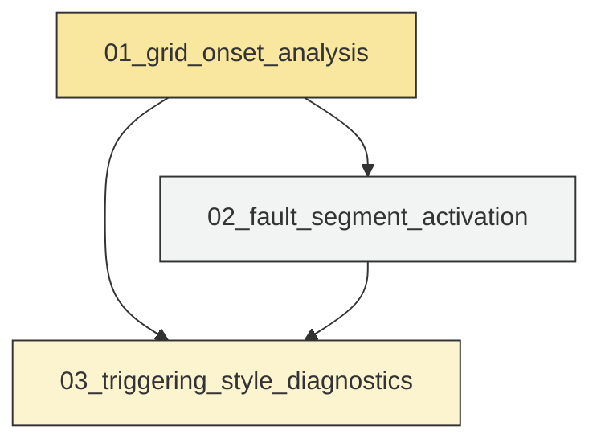
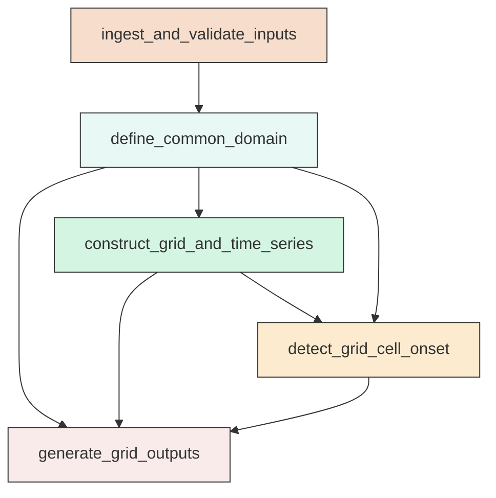
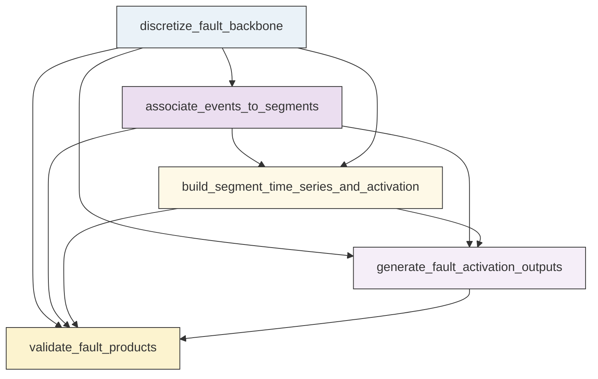
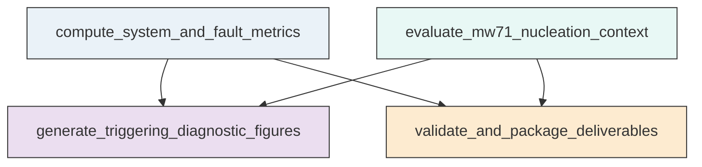

# Workflow Overview

## Top-Level Task Dependencies

**Description:**
- `01_grid_onset_analysis`: Load and validate Ridgecrest inputs, define the common space-time domain, build the 1 km grid, and compute grid-cell activation onset products.
- `02_fault_segment_activation`: Build the fault-segment backbone, associate earthquakes to segments, compute segment activation time series, and generate fault-based activation figures.
- `03_triggering_style_diagnostics`: Quantify synchrony, along-fault cascading, cross-fault complexity, and the Mw 7.1 nucleation-area activation history and package validated deliverables.

## Subtask Dependencies

#### 01_grid_onset_analysis
**Usage**: Load and validate Ridgecrest inputs, define the common space-time domain, build the 1 km grid, and compute grid-cell activation onset products.

**Description:**
- `ingest_and_validate_inputs`: Load the catalog, mainshock table, and fault polylines and validate required fields and malformed records.
- `define_common_domain`: Define the Mw 6.4 to Mw 7.1 time window, project coordinates to a local metric system, and build the buffered study region.
- `construct_grid_and_time_series`: Discretize the buffered region into 1 km cells, assign events to cells, and build 30-minute count-rate-cumulative series.
- `detect_grid_cell_onset`: Apply the fixed sustained-activation rule to assign onset times and confidence classes to occupied grid cells.
- `generate_grid_outputs`: Save reusable tables and figures for the study-domain overview and grid-based onset analysis.

#### 02_fault_segment_activation
**Usage**: Build the fault-segment backbone, associate earthquakes to segments, compute segment activation time series, and generate fault-based activation figures.

**Description:**
- `discretize_fault_backbone`: Convert mapped fault polylines into contiguous analyzable segments and compute segment geometry attributes.
- `associate_events_to_segments`: Compute nearest projected point-to-segment distances and assign events within 3 km to their nearest fault segments.
- `build_segment_time_series_and_activation`: Aggregate associated events into 30-minute segment time series and assign activation times using the fixed count threshold.
- `generate_fault_activation_outputs`: Produce fault-centered maps, activation-density products, and reusable summary tables from segment activation results.
- `validate_fault_products`: Validate non-empty fault-segment outputs, association coverage, and consistency of segment activation fields.

#### 03_triggering_style_diagnostics
**Usage**: Quantify synchrony, along-fault cascading, cross-fault complexity, and the Mw 7.1 nucleation-area activation history and package validated deliverables.

**Description:**
- `compute_system_and_fault_metrics`: Derive system-wide synchrony metrics, per-fault propagation metrics, and cross-fault complexity diagnostics from grid and segment activation products.
- `evaluate_mw71_nucleation_context`: Compare the activation timing of the segment nearest the Mw 7.1 epicenter with its local neighborhood and the full system.
- `generate_triggering_diagnostic_figures`: Create the integrated diagnostic figures needed to assess synchronous, staged, jump-like, or complex activation behavior.
- `validate_and_package_deliverables`: Validate cross-step consistency, summarize run parameters and counts, and package reusable outputs from all scripts.