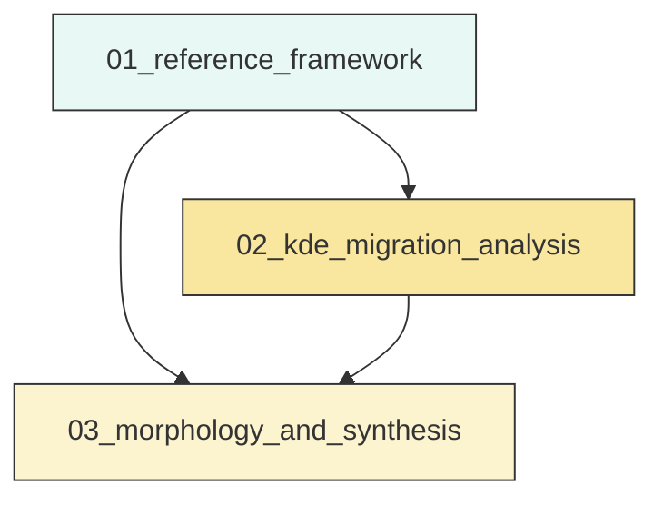
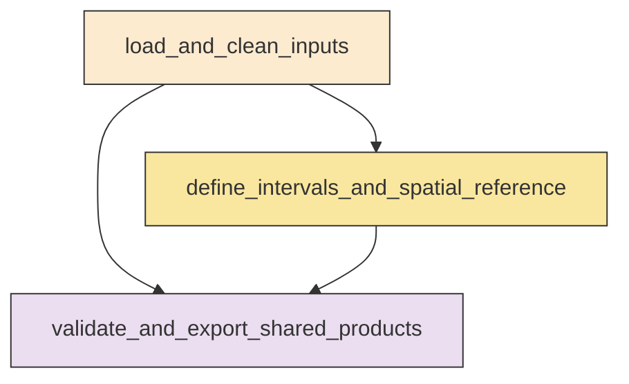
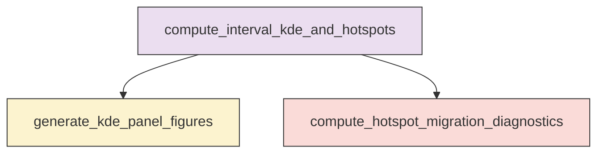
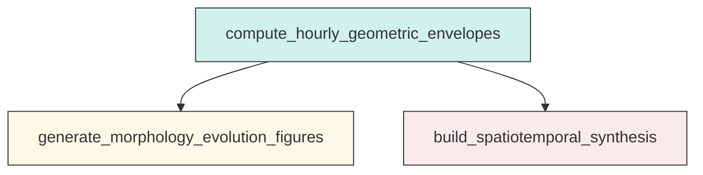

# Research Codings

## Task Overview


**Description:**
- `01_reference_framework`: Build the shared inter-mainshock dataset, interval tables, and spatial metadata for Ridgecrest analyses.
- `02_kde_migration_analysis`: Compute fixed-bandwidth interval KDEs, generate stage panel figures, and track hotspot migration between the two mainshocks.
- `03_morphology_and_synthesis`: Compute hourly convex hull and alpha-shape evolution, then summarize focusing, defocusing, and bifurcation diagnostics.


## Task Details


#### 01_reference_framework
**Usage**: Build the shared inter-mainshock dataset, interval tables, and spatial metadata for Ridgecrest analyses.

**Description:**
- `load_and_clean_inputs`: Read the catalog, mainshock table, and fault traces, then parse and validate required fields.
- `define_intervals_and_spatial_reference`: Create KDE and morphology interval tables, common map extent, and one local projected CRS.
- `validate_and_export_shared_products`: Save reusable shared outputs and verify interval completeness and metadata consistency.

#### Coding Script

```python

from __future__ import annotations

import json
import math
import os
import sys
import traceback
from dataclasses import dataclass
from pathlib import Path
from typing import List

import numpy as np
import pandas as pd
from pyproj import CRS, Transformer


CATALOG_PATH = Path(
    "<REPO_ROOT>/examples/ridgecrest/data/catalog_TRACE/TRACE_ridgecrest_relocated.csv"
)
MAINSHOCK_PATH = Path(
    "<REPO_ROOT>/examples/ridgecrest/data/catalog_TRACE/main_shock_events.csv"
)
FAULT_PATH = Path(
    "<REPO_ROOT>/examples/ridgecrest/data/faults/ridgecrest_surface_faults.json"
)
OUTPUT_DIR = Path(
    "../exp_run/outputs/01_reference_framework"
)

EXPECTED_COLUMNS = ["event_time", "latitude", "longitude", "depth_km", "magnitude"]
PLOT_MARGIN_DEG = 0.05
STAGE1_DURATION_HOURS = 4
STAGE1_FREQ = "30min"
STAGE2_FREQ = "2h"
MORPH_FREQ = "1h"
FINAL_BIN_POLICY = "left_closed_right_open_except_final_closed"


@dataclass(frozen=True)
class IntervalSpec:
    label: str
    start: pd.Timestamp
    end: pd.Timestamp
    is_final: bool


def log(message: str) -> None:
    print(message, flush=True)


def ensure_output_dir(path: Path) -> None:
    path.mkdir(parents=True, exist_ok=True)


def remove_stale_outputs(output_dir: Path) -> None:
    stale_names = [
        "intermainshock_catalog_clean.csv",
        "mainshock_reference_table.csv",
        "fault_segments_table.csv",
        "interval_definitions_kde_stage1.csv",
        "interval_definitions_kde_stage2.csv",
        "interval_definitions_morphology_1h.csv",
        "analysis_metadata.json",
    ]
    for name in stale_names:
        path = output_dir / name
        if path.exists():
            path.unlink()
            log(f"Removed stale output: {path}")


def validate_columns(df: pd.DataFrame, name: str) -> None:
    missing = [c for c in EXPECTED_COLUMNS if c not in df.columns]
    if missing:
        raise ValueError(f"{name} is missing required columns: {missing}")


def load_csv_with_time(path: Path, name: str) -> pd.DataFrame:
    log(f"Loading {name}: {path}")
    df = pd.read_csv(path)
    validate_columns(df, name)

    out = df.copy()
    out["event_time_raw"] = out["event_time"].astype(str)
    out["event_time"] = pd.to_datetime(out["event_time"], utc=True, errors="coerce")

    numeric_cols = ["latitude", "longitude", "depth_km", "magnitude"]
    for col in numeric_cols:
        out[col] = pd.to_numeric(out[col], errors="coerce")
    return out


def clean_event_table(df: pd.DataFrame, name: str) -> tuple[pd.DataFrame, dict]:
    before = len(df)
    valid_mask = (
        df["event_time"].notna()
        & df["latitude"].notna()
        & df["longitude"].notna()
        & np.isfinite(df["latitude"])
        & np.isfinite(df["longitude"])
    )
    cleaned = df.loc[valid_mask, EXPECTED_COLUMNS + ["event_time_raw"]].copy()
    cleaned = cleaned.sort_values("event_time").reset_index(drop=True)

    metadata = {
        "table_name": name,
        "rows_before_cleaning": int(before),
        "rows_after_cleaning": int(len(cleaned)),
        "rows_removed": int(before - len(cleaned)),
    }
    return cleaned, metadata


def identify_mainshocks(df: pd.DataFrame) -> tuple[pd.Series, pd.Series]:
    if len(df) < 2:
        raise ValueError("Mainshock table must contain at least two rows.")

    rounded = df["magnitude"].round(1)
    idx64 = rounded.sub(6.4).abs().idxmin()
    idx71 = rounded.sub(7.1).abs().idxmin()

    ms64 = df.loc[idx64].copy()
    ms71 = df.loc[idx71].copy()

    if pd.isna(ms64["event_time"]) or pd.isna(ms71["event_time"]):
        raise ValueError("Failed to identify valid event times for mainshocks.")
    if ms64["event_time"] >= ms71["event_time"]:
        raise ValueError("Mainshock64 must occur before Mainshock71.")
    return ms64, ms71


def build_interval_table(start: pd.Timestamp, end: pd.Timestamp, freq: str, stage_name: str) -> pd.DataFrame:
    if start >= end:
        raise ValueError(f"Invalid interval range for {stage_name}: start >= end")

    edges = list(pd.date_range(start=start, end=end, freq=freq, tz="UTC"))
    if not edges or edges[0] != start:
        edges = [start] + edges
    if edges[-1] != end:
        edges.append(end)

    intervals: List[IntervalSpec] = []
    for i in range(len(edges) - 1):
        left = edges[i]
        right = edges[i + 1]
        intervals.append(
            IntervalSpec(
                label=f"{stage_name}_{i + 1:02d}",
                start=left,
                end=right,
                is_final=(i == len(edges) - 2),
            )
        )

    rows = []
    for idx, interval in enumerate(intervals, start=1):
        duration_hours = (interval.end - interval.start).total_seconds() / 3600.0
        rows.append(
            {
                "stage": stage_name,
                "interval_index": idx,
                "interval_label": interval.label,
                "start_time": interval.start,
                "end_time": interval.end,
                "start_time_iso": interval.start.isoformat(),
                "end_time_iso": interval.end.isoformat(),
                "duration_hours": duration_hours,
                "is_final_interval": interval.is_final,
                "bin_inclusion_rule": FINAL_BIN_POLICY,
            }
        )
    return pd.DataFrame(rows)


def load_fault_segments(path: Path) -> tuple[pd.DataFrame, dict]:
    log(f"Loading faults: {path}")
    with path.open("r", encoding="utf-8") as f:
        segments = json.load(f)

    if not isinstance(segments, list):
        raise ValueError("Fault JSON must be a list of segments.")

    rows = []
    kept_segments = 0
    kept_points = 0
    skipped_segments = 0

    for seg_id, segment in enumerate(segments):
        if not isinstance(segment, list) or len(segment) < 2:
            skipped_segments += 1
            continue

        local_points = []
        for pt in segment:
            if not isinstance(pt, (list, tuple)) or len(pt) != 2:
                continue
            lon, lat = pt
            try:
                lon = float(lon)
                lat = float(lat)
            except Exception:
                continue
            if not (math.isfinite(lon) and math.isfinite(lat)):
                continue
            local_points.append((lon, lat))

        if len(local_points) < 2:
            skipped_segments += 1
            continue

        kept_segments += 1
        kept_points += len(local_points)
        for point_order, (lon, lat) in enumerate(local_points):
            rows.append(
                {
                    "segment_id": kept_segments - 1,
                    "source_segment_index": seg_id,
                    "point_order": point_order,
                    "longitude": lon,
                    "latitude": lat,
                }
            )

    fault_df = pd.DataFrame(rows)
    metadata = {
        "raw_segment_count": int(len(segments)),
        "kept_segment_count": int(kept_segments),
        "skipped_segment_count": int(skipped_segments),
        "kept_point_count": int(kept_points),
    }
    return fault_df, metadata


def choose_local_crs(lon_center: float, lat_center: float) -> CRS:
    zone = int(math.floor((lon_center + 180.0) / 6.0) + 1)
    epsg = 32600 + zone if lat_center >= 0 else 32700 + zone
    return CRS.from_epsg(epsg)


def project_xy(df: pd.DataFrame, transformer: Transformer, lon_col: str = "longitude", lat_col: str = "latitude") -> pd.DataFrame:
    x, y = transformer.transform(df[lon_col].to_numpy(), df[lat_col].to_numpy())
    out = df.copy()
    out["x_m"] = x
    out["y_m"] = y
    return out


def compute_extent_and_center(catalog_df: pd.DataFrame, main_df: pd.DataFrame, fault_df: pd.DataFrame) -> dict:
    lon_values = np.concatenate(
        [
            catalog_df["longitude"].to_numpy(),
            main_df["longitude"].to_numpy(),
            fault_df["longitude"].to_numpy(),
        ]
    )
    lat_values = np.concatenate(
        [
            catalog_df["latitude"].to_numpy(),
            main_df["latitude"].to_numpy(),
            fault_df["latitude"].to_numpy(),
        ]
    )

    lon_min = float(np.min(lon_values))
    lon_max = float(np.max(lon_values))
    lat_min = float(np.min(lat_values))
    lat_max = float(np.max(lat_values))

    return {
        "longitude_min": lon_min,
        "longitude_max": lon_max,
        "latitude_min": lat_min,
        "latitude_max": lat_max,
        "longitude_min_padded": lon_min - PLOT_MARGIN_DEG,
        "longitude_max_padded": lon_max + PLOT_MARGIN_DEG,
        "latitude_min_padded": lat_min - PLOT_MARGIN_DEG,
        "latitude_max_padded": lat_max + PLOT_MARGIN_DEG,
        "longitude_center": float((lon_min + lon_max) / 2.0),
        "latitude_center": float((lat_min + lat_max) / 2.0),
        "plot_margin_degrees": PLOT_MARGIN_DEG,
    }


def add_intermainshock_flags(catalog_df: pd.DataFrame, t0: pd.Timestamp, t1: pd.Timestamp) -> pd.DataFrame:
    out = catalog_df.copy()
    out["within_intermainshock_window"] = (out["event_time"] >= t0) & (out["event_time"] <= t1)
    return out.loc[out["within_intermainshock_window"]].copy().reset_index(drop=True)


def assign_interval_counts(events: pd.DataFrame, intervals: pd.DataFrame) -> pd.DataFrame:
    counts = []
    event_times = events["event_time"]
    for _, row in intervals.iterrows():
        start = row["start_time"]
        end = row["end_time"]
        if bool(row["is_final_interval"]):
            mask = (event_times >= start) & (event_times <= end)
        else:
            mask = (event_times >= start) & (event_times < end)
        counts.append(int(mask.sum()))
    out = intervals.copy()
    out["event_count"] = counts
    return out


def write_csv(df: pd.DataFrame, path: Path) -> None:
    tmp = df.copy()
    for col in tmp.columns:
        if pd.api.types.is_datetime64tz_dtype(tmp[col]):
            tmp[col] = tmp[col].dt.strftime("%Y-%m-%dT%H:%M:%S.%f%z")
    tmp.to_csv(path, index=False)
    log(f"Wrote CSV: {path}")


def build_mainshock_reference(ms64: pd.Series, ms71: pd.Series, catalog: pd.DataFrame) -> tuple[pd.DataFrame, dict]:
    rows = []
    discrepancy = {}
    for label, row in [("Mainshock64", ms64), ("Mainshock71", ms71)]:
        rounded_mag = round(float(row["magnitude"]), 1)
        catalog_match = catalog.loc[catalog["magnitude"].round(1) == rounded_mag].copy()
        time_difference_seconds = None
        if not catalog_match.empty:
            idx = (catalog_match["event_time"] - row["event_time"]).abs().idxmin()
            matched = catalog_match.loc[idx]
            time_difference_seconds = float(abs((matched["event_time"] - row["event_time"]).total_seconds()))
        discrepancy[label] = {
            "matched_catalog_event_found": bool(not catalog_match.empty),
            "nearest_catalog_time_difference_seconds": time_difference_seconds,
        }
        rows.append(
            {
                "event_label": label,
                "event_time": row["event_time"],
                "event_time_iso": row["event_time"].isoformat(),
                "latitude": float(row["latitude"]),
                "longitude": float(row["longitude"]),
                "depth_km": float(row["depth_km"]),
                "magnitude": float(row["magnitude"]),
            }
        )
    return pd.DataFrame(rows), discrepancy


def main() -> None:
    log("Starting Task 01_reference_framework")
    log(f"PID={os.getpid()}")
    ensure_output_dir(OUTPUT_DIR)
    remove_stale_outputs(OUTPUT_DIR)

    catalog_raw = load_csv_with_time(CATALOG_PATH, "catalog")
    main_raw = load_csv_with_time(MAINSHOCK_PATH, "mainshock_table")

    catalog_clean, catalog_meta = clean_event_table(catalog_raw, "catalog")
    main_clean, main_meta = clean_event_table(main_raw, "mainshock_table")
    ms64, ms71 = identify_mainshocks(main_clean)

    t64 = ms64["event_time"]
    t71 = ms71["event_time"]
    log(f"Inter-mainshock window: {t64.isoformat()} -> {t71.isoformat()}")

    inter_catalog = add_intermainshock_flags(catalog_clean, t64, t71)
    if inter_catalog.empty:
        raise ValueError("No events found in the inter-mainshock analysis window.")
    log(f"Inter-mainshock event count: {len(inter_catalog)}")

    mainshock_reference_df, discrepancy = build_mainshock_reference(ms64, ms71, catalog_clean)
    fault_df, fault_meta = load_fault_segments(FAULT_PATH)
    if fault_df.empty:
        raise ValueError("No valid fault points were parsed from the fault JSON.")

    extent = compute_extent_and_center(inter_catalog, mainshock_reference_df, fault_df)
    local_crs = choose_local_crs(extent["longitude_center"], extent["latitude_center"])
    transformer_fwd = Transformer.from_crs("EPSG:4326", local_crs, always_xy=True)

    inter_catalog = project_xy(inter_catalog, transformer_fwd)
    mainshock_reference_df = project_xy(mainshock_reference_df, transformer_fwd)
    fault_df = project_xy(fault_df, transformer_fwd)

    stage1_end = t64 + pd.Timedelta(hours=STAGE1_DURATION_HOURS)
    if stage1_end > t71:
        stage1_end = t71

    stage1_intervals = build_interval_table(t64, stage1_end, STAGE1_FREQ, "stage1")
    stage1_intervals = assign_interval_counts(inter_catalog, stage1_intervals)

    stage2_intervals = build_interval_table(stage1_end, t71, STAGE2_FREQ, "stage2")
    stage2_intervals = assign_interval_counts(inter_catalog, stage2_intervals)

    morph_intervals = build_interval_table(t64, t71, MORPH_FREQ, "morphology_1h")
    morph_intervals = assign_interval_counts(inter_catalog, morph_intervals)

    write_csv(inter_catalog, OUTPUT_DIR / "intermainshock_catalog_clean.csv")
    write_csv(mainshock_reference_df, OUTPUT_DIR / "mainshock_reference_table.csv")
    write_csv(fault_df, OUTPUT_DIR / "fault_segments_table.csv")
    write_csv(stage1_intervals, OUTPUT_DIR / "interval_definitions_kde_stage1.csv")
    write_csv(stage2_intervals, OUTPUT_DIR / "interval_definitions_kde_stage2.csv")
    write_csv(morph_intervals, OUTPUT_DIR / "interval_definitions_morphology_1h.csv")

    metadata = {
        "task": "01_reference_framework",
        "input_paths": {
            "catalog": str(CATALOG_PATH),
            "mainshock_table": str(MAINSHOCK_PATH),
            "fault_json": str(FAULT_PATH),
        },
        "output_dir": str(OUTPUT_DIR),
        "cleaning": {
            "catalog": catalog_meta,
            "mainshock_table": main_meta,
        },
        "mainshock_window": {
            "mainshock64_time": t64.isoformat(),
            "mainshock71_time": t71.isoformat(),
            "window_duration_hours": (t71 - t64).total_seconds() / 3600.0,
        },
        "mainshock_catalog_discrepancy": discrepancy,
        "interval_definitions": {
            "stage1": {
                "description": "[mainshock64, mainshock64 + 4 hours], 30-minute interval",
                "count": int(len(stage1_intervals)),
                "frequency": STAGE1_FREQ,
                "event_total": int(stage1_intervals["event_count"].sum()),
            },
            "stage2": {
                "description": "[mainshock64 + 4 hours, mainshock71], 2-hour interval",
                "count": int(len(stage2_intervals)),
                "frequency": STAGE2_FREQ,
                "event_total": int(stage2_intervals["event_count"].sum()),
            },
            "morphology_1h": {
                "description": "[mainshock64, mainshock71], 1-hour interval",
                "count": int(len(morph_intervals)),
                "frequency": MORPH_FREQ,
                "event_total": int(morph_intervals["event_count"].sum()),
            },
            "bin_policy": FINAL_BIN_POLICY,
        },
        "counts": {
            "intermainshock_catalog_event_count": int(len(inter_catalog)),
            "fault_segment_count": int(fault_meta["kept_segment_count"]),
            "fault_point_count": int(fault_meta["kept_point_count"]),
        },
        "fault_metadata": fault_meta,
        "plot_extent_degrees": extent,
        "projected_crs": {
            "epsg": local_crs.to_epsg(),
            "projjson": local_crs.to_json_dict(),
        },
    }

    metadata_path = OUTPUT_DIR / "analysis_metadata.json"
    with metadata_path.open("w", encoding="utf-8") as f:
        json.dump(metadata, f, indent=2)
    log(f"Wrote metadata: {metadata_path}")
    log("Task 01_reference_framework completed successfully")


if __name__ == "__main__":
    try:
        main()
    except Exception:
        print(traceback.format_exc(), flush=True)
        sys.exit(1)


```

#### 02_kde_migration_analysis
**Usage**: Compute fixed-bandwidth interval KDEs, generate stage panel figures, and track hotspot migration between the two mainshocks.

**Description:**
- `compute_interval_kde_and_hotspots`: Run interval-wise KDE on a common grid and extract the primary hotspot for each interval.
- `generate_kde_panel_figures`: Assemble paginated 2_by_4 KDE map panels with shared extent, normalization, and overlays.
- `compute_hotspot_migration_diagnostics`: Build stage-wise hotspot paths and supporting migration metrics relative to Mw 7.1 and mapped faults.

#### Coding Script

```python

from __future__ import annotations

import json
import math
import os
import shutil
import sys
import traceback
from pathlib import Path
from typing import Any

import matplotlib
matplotlib.use("Agg")
import matplotlib.pyplot as plt
import numpy as np
import pandas as pd
from joblib import Parallel, delayed
from matplotlib.colors import Normalize
from pyproj import Transformer
from scipy.ndimage import label as nd_label
from scipy.spatial import cKDTree
from scipy.stats import gaussian_kde


REFERENCE_DIR = Path(
    "../exp_run/outputs/01_reference_framework"
)
OUTPUT_DIR = Path(
    "../exp_run/outputs/02_kde_migration_analysis"
)

CATALOG_FILE = REFERENCE_DIR / "intermainshock_catalog_clean.csv"
MAINSHOCK_FILE = REFERENCE_DIR / "mainshock_reference_table.csv"
FAULT_FILE = REFERENCE_DIR / "fault_segments_table.csv"
STAGE1_FILE = REFERENCE_DIR / "interval_definitions_kde_stage1.csv"
STAGE2_FILE = REFERENCE_DIR / "interval_definitions_kde_stage2.csv"
METADATA_FILE = REFERENCE_DIR / "analysis_metadata.json"

MAX_CORES = 64
GRID_SIZE_X = 220
GRID_SIZE_Y = 220
BANDWIDTH_RULE = "scott"
LOW_SAMPLE_THRESHOLD = 3
FAULT_SIMPLIFY_STEP = 20
FAULT_COMPLEXITY_RADIUS_M = 3000.0
HOTSPOT_PATH_MARKERSIZE = 52
FIG_DPI = 220
CMAP_NAME = "magma"
PANEL_NROWS = 2
PANEL_NCOLS = 4
MIGRATION_CMAP_NAME = "turbo"
REQUIRED_CATALOG_COLUMNS = ["event_time", "latitude", "longitude", "x_m", "y_m"]
REQUIRED_MAINSHOCK_COLUMNS = ["event_label", "event_time", "latitude", "longitude", "x_m", "y_m"]
REQUIRED_FAULT_COLUMNS = ["segment_id", "point_order", "longitude", "latitude", "x_m", "y_m"]
REQUIRED_INTERVAL_COLUMNS = [
    "stage",
    "interval_index",
    "interval_label",
    "start_time",
    "end_time",
    "duration_hours",
    "is_final_interval",
]


def log(message: str) -> None:
    print(message, flush=True)


def ensure_clean_output_dir(output_dir: Path) -> None:
    output_dir.mkdir(parents=True, exist_ok=True)
    removable = [
        "kde_interval_summary.csv",
        "kde_stage1_hotspots.csv",
        "kde_stage2_hotspots.csv",
        "kde_global_normalization.json",
        "hotspot_migration_metrics.csv",
        "hotspot_migration_stage1.png",
        "hotspot_migration_stage2.png",
    ]
    for file_name in removable:
        path = output_dir / file_name
        if path.exists():
            path.unlink()
            log(f"Removed stale file: {path}")

    for path in output_dir.glob("kde_stage*_panels_page*.png"):
        path.unlink()
        log(f"Removed stale panel figure: {path}")

    arrays_dir = output_dir / "kde_arrays"
    if arrays_dir.exists():
        shutil.rmtree(arrays_dir)
        log(f"Removed stale array directory: {arrays_dir}")
    arrays_dir.mkdir(parents=True, exist_ok=True)


def require_exists(path: Path) -> None:
    if not path.exists():
        raise FileNotFoundError(f"Required input not found: {path}")


def validate_columns(df: pd.DataFrame, required: list[str], table_name: str) -> None:
    missing = [col for col in required if col not in df.columns]
    if missing:
        raise ValueError(f"{table_name} is missing required columns: {missing}")


def load_reference_inputs() -> tuple[pd.DataFrame, pd.DataFrame, pd.DataFrame, pd.DataFrame, pd.DataFrame, dict[str, Any]]:
    for path in [CATALOG_FILE, MAINSHOCK_FILE, FAULT_FILE, STAGE1_FILE, STAGE2_FILE, METADATA_FILE]:
        require_exists(path)

    log(f"Loading catalog: {CATALOG_FILE}")
    catalog = pd.read_csv(CATALOG_FILE)
    validate_columns(catalog, REQUIRED_CATALOG_COLUMNS, "intermainshock catalog")
    catalog["event_time"] = pd.to_datetime(catalog["event_time"], utc=True)

    log(f"Loading mainshocks: {MAINSHOCK_FILE}")
    mainshocks = pd.read_csv(MAINSHOCK_FILE)
    validate_columns(mainshocks, REQUIRED_MAINSHOCK_COLUMNS, "mainshock reference table")
    mainshocks["event_time"] = pd.to_datetime(mainshocks["event_time"], utc=True)

    log(f"Loading faults: {FAULT_FILE}")
    faults = pd.read_csv(FAULT_FILE)
    validate_columns(faults, REQUIRED_FAULT_COLUMNS, "fault segment table")

    log(f"Loading stage 1 intervals: {STAGE1_FILE}")
    stage1 = pd.read_csv(STAGE1_FILE)
    validate_columns(stage1, REQUIRED_INTERVAL_COLUMNS, "stage1 interval table")
    stage1["start_time"] = pd.to_datetime(stage1["start_time"], utc=True)
    stage1["end_time"] = pd.to_datetime(stage1["end_time"], utc=True)

    log(f"Loading stage 2 intervals: {STAGE2_FILE}")
    stage2 = pd.read_csv(STAGE2_FILE)
    validate_columns(stage2, REQUIRED_INTERVAL_COLUMNS, "stage2 interval table")
    stage2["start_time"] = pd.to_datetime(stage2["start_time"], utc=True)
    stage2["end_time"] = pd.to_datetime(stage2["end_time"], utc=True)

    with METADATA_FILE.open("r", encoding="utf-8") as f:
        metadata = json.load(f)

    return catalog, mainshocks, faults, stage1, stage2, metadata


def get_extent(metadata: dict[str, Any]) -> tuple[float, float, float, float]:
    extent = metadata.get("plot_extent_degrees")
    if not isinstance(extent, dict):
        raise ValueError("analysis_metadata.json missing plot_extent_degrees")

    padded_keys = [
        "longitude_min_padded",
        "longitude_max_padded",
        "latitude_min_padded",
        "latitude_max_padded",
    ]
    legacy_keys = ["min_longitude", "max_longitude", "min_latitude", "max_latitude"]

    if all(key in extent for key in padded_keys):
        return (
            float(extent["longitude_min_padded"]),
            float(extent["longitude_max_padded"]),
            float(extent["latitude_min_padded"]),
            float(extent["latitude_max_padded"]),
        )
    if all(key in extent for key in legacy_keys):
        return (
            float(extent["min_longitude"]),
            float(extent["max_longitude"]),
            float(extent["min_latitude"]),
            float(extent["max_latitude"]),
        )

    raise KeyError(
        "plot_extent_degrees must contain either padded keys "
        "(longitude_min_padded, longitude_max_padded, latitude_min_padded, latitude_max_padded) "
        "or legacy keys (min_longitude, max_longitude, min_latitude, max_latitude)."
    )


def get_projected_extent(catalog: pd.DataFrame, mainshocks: pd.DataFrame, faults: pd.DataFrame) -> tuple[float, float, float, float]:
    xs = np.concatenate([catalog["x_m"].to_numpy(), mainshocks["x_m"].to_numpy(), faults["x_m"].to_numpy()])
    ys = np.concatenate([catalog["y_m"].to_numpy(), mainshocks["y_m"].to_numpy(), faults["y_m"].to_numpy()])
    return float(xs.min()), float(xs.max()), float(ys.min()), float(ys.max())


def make_grid(projected_extent: tuple[float, float, float, float]) -> tuple[np.ndarray, np.ndarray, np.ndarray, np.ndarray]:
    min_x, max_x, min_y, max_y = projected_extent
    x_grid = np.linspace(min_x, max_x, GRID_SIZE_X)
    y_grid = np.linspace(min_y, max_y, GRID_SIZE_Y)
    xx, yy = np.meshgrid(x_grid, y_grid)
    return x_grid, y_grid, xx, yy


def select_interval_events(catalog: pd.DataFrame, start_time: pd.Timestamp, end_time: pd.Timestamp, is_final: bool) -> pd.DataFrame:
    if is_final:
        mask = (catalog["event_time"] >= start_time) & (catalog["event_time"] <= end_time)
    else:
        mask = (catalog["event_time"] >= start_time) & (catalog["event_time"] < end_time)
    subset = catalog.loc[mask].copy()
    return subset.sort_values("event_time").reset_index(drop=True)


def estimate_fixed_bandwidth_m(catalog: pd.DataFrame) -> float:
    coords = np.vstack([catalog["x_m"].to_numpy(), catalog["y_m"].to_numpy()])
    kde = gaussian_kde(coords, bw_method=BANDWIDTH_RULE)
    factor = float(kde.factor)
    covariance = np.cov(coords)
    pooled_sigma = math.sqrt(float(np.trace(covariance) / 2.0))
    bandwidth_m = factor * pooled_sigma
    return bandwidth_m


def highest_density_centroid(density: np.ndarray, peak_value: float, x_grid: np.ndarray, y_grid: np.ndarray) -> tuple[float, float]:
    peak_mask = np.isclose(density, peak_value, rtol=1e-10, atol=max(1e-14, peak_value * 1e-12))
    structure = np.ones((3, 3), dtype=int)
    labels, count = nd_label(peak_mask.astype(int), structure=structure)
    if count <= 1:
        iy, ix = np.argwhere(peak_mask)[0]
        return float(x_grid[ix]), float(y_grid[iy])

    best_label = None
    best_size = -1
    for label_id in range(1, count + 1):
        current_size = int((labels == label_id).sum())
        if current_size > best_size:
            best_label = label_id
            best_size = current_size
    rows, cols = np.where(labels == best_label)
    return float(x_grid[cols].mean()), float(y_grid[rows].mean())


def compute_interval_kde(
    interval_row: dict[str, Any],
    catalog: pd.DataFrame,
    xx: np.ndarray,
    yy: np.ndarray,
    x_grid: np.ndarray,
    y_grid: np.ndarray,
    lonlat_transformer: Transformer,
    arrays_dir: str,
) -> dict[str, Any]:
    label = interval_row["interval_label"]
    start_time = pd.Timestamp(interval_row["start_time"])
    end_time = pd.Timestamp(interval_row["end_time"])
    is_final = bool(interval_row["is_final_interval"])
    stage = str(interval_row["stage"])
    expected_count = int(interval_row.get("event_count", -1))

    subset = select_interval_events(catalog, start_time, end_time, is_final)
    event_count = int(len(subset))
    status = "ok"
    hotspot_x = np.nan
    hotspot_y = np.nan
    hotspot_lon = np.nan
    hotspot_lat = np.nan
    peak_density = np.nan
    array_relpath = None

    log(f"Computing KDE for {label}: stage={stage}, events={event_count}, start={start_time.isoformat()}, end={end_time.isoformat()}")

    if event_count == 0:
        status = "no_data"
    elif event_count < LOW_SAMPLE_THRESHOLD:
        status = "too_few_events"
    else:
        coords = np.vstack([subset["x_m"].to_numpy(), subset["y_m"].to_numpy()])
        kde = gaussian_kde(coords, bw_method=BANDWIDTH_RULE)
        positions = np.vstack([xx.ravel(), yy.ravel()])
        density = kde(positions).reshape(xx.shape)
        peak_density = float(np.nanmax(density))
        hotspot_x, hotspot_y = highest_density_centroid(density, peak_density, x_grid, y_grid)
        hotspot_lon, hotspot_lat = lonlat_transformer.transform(hotspot_x, hotspot_y)
        array_path = Path(arrays_dir) / f"{label}_density.npy"
        np.save(array_path, density.astype(np.float32))
        array_relpath = f"kde_arrays/{array_path.name}"

    return {
        "stage": stage,
        "interval_index": int(interval_row["interval_index"]),
        "interval_label": label,
        "start_time": start_time.isoformat(),
        "end_time": end_time.isoformat(),
        "duration_hours": float(interval_row["duration_hours"]),
        "is_final_interval": is_final,
        "event_count_expected": expected_count,
        "event_count_actual": event_count,
        "event_count_match_reference": bool(expected_count == event_count) if expected_count >= 0 else False,
        "status": status,
        "peak_density": peak_density,
        "hotspot_x_m": hotspot_x,
        "hotspot_y_m": hotspot_y,
        "hotspot_longitude": hotspot_lon,
        "hotspot_latitude": hotspot_lat,
        "kde_array_relpath": array_relpath,
    }


def build_fault_lines(faults: pd.DataFrame) -> list[np.ndarray]:
    lines = []
    grouped = faults.groupby("segment_id", sort=False)
    for _, seg in grouped:
        arr = seg.sort_values("point_order")[["longitude", "latitude"]].to_numpy()
        if len(arr) >= 2:
            lines.append(arr[::FAULT_SIMPLIFY_STEP] if len(arr) > FAULT_SIMPLIFY_STEP else arr)
    return lines


def build_fault_tree(faults: pd.DataFrame) -> tuple[cKDTree, np.ndarray]:
    sampled = faults.iloc[::FAULT_SIMPLIFY_STEP].copy().reset_index(drop=True)
    coords = sampled[["x_m", "y_m"]].to_numpy()
    tree = cKDTree(coords)
    return tree, coords


def plot_common_overlays(ax: plt.Axes, extent_deg: tuple[float, float, float, float], fault_lines: list[np.ndarray], mainshocks: pd.DataFrame) -> None:
    min_lon, max_lon, min_lat, max_lat = extent_deg
    for line in fault_lines:
        ax.plot(line[:, 0], line[:, 1], color="0.55", linewidth=0.4, alpha=0.55, zorder=1)

    ms64 = mainshocks.loc[mainshocks["event_label"] == "Mainshock64"].iloc[0]
    ms71 = mainshocks.loc[mainshocks["event_label"] == "Mainshock71"].iloc[0]
    ax.scatter(ms64["longitude"], ms64["latitude"], s=80, c="deepskyblue", edgecolors="black", linewidths=0.7, marker="*", zorder=5)
    ax.scatter(ms71["longitude"], ms71["latitude"], s=90, c="gold", edgecolors="black", linewidths=0.7, marker="*", zorder=5)
    ax.set_xlim(min_lon, max_lon)
    ax.set_ylim(min_lat, max_lat)
    ax.set_aspect("equal", adjustable="box")
    ax.grid(False)


def save_kde_panel_pages(
    stage_name: str,
    stage_df: pd.DataFrame,
    extent_deg: tuple[float, float, float, float],
    xx_lon: np.ndarray,
    yy_lat: np.ndarray,
    fault_lines: list[np.ndarray],
    mainshocks: pd.DataFrame,
    output_dir: Path,
    norm: Normalize,
) -> list[str]:
    output_names: list[str] = []
    stage_df = stage_df.sort_values("interval_index").reset_index(drop=True)
    page_size = PANEL_NROWS * PANEL_NCOLS

    for page_idx, start in enumerate(range(0, len(stage_df), page_size), start=1):
        chunk = stage_df.iloc[start : start + page_size].copy()
        fig, axes = plt.subplots(PANEL_NROWS, PANEL_NCOLS, figsize=(17.2, 9.4), constrained_layout=True)
        axes_flat = axes.ravel()
        mappable = None

        for ax, (_, row) in zip(axes_flat, chunk.iterrows()):
            plot_common_overlays(ax, extent_deg, fault_lines, mainshocks)
            title = f"{row['interval_label']}\nN={int(row['event_count_actual'])}"
            if row["status"] == "ok":
                density = np.load(output_dir / row["kde_array_relpath"])
                mappable = ax.pcolormesh(xx_lon, yy_lat, density, shading="auto", cmap=CMAP_NAME, norm=norm, zorder=0)
                ax.scatter(row["hotspot_longitude"], row["hotspot_latitude"], s=28, c="cyan", edgecolors="black", linewidths=0.5, zorder=6)
                title += f"\npeak={row['peak_density']:.2e}"
            else:
                ax.text(0.5, 0.5, row["status"], transform=ax.transAxes, ha="center", va="center", fontsize=11, color="crimson")
            ax.set_title(title, fontsize=9)
            ax.set_xlabel("Longitude")
            ax.set_ylabel("Latitude")

        for ax in axes_flat[len(chunk) :]:
            ax.axis("off")
            ax.text(0.5, 0.5, "unused", transform=ax.transAxes, ha="center", va="center", fontsize=11, color="0.4")

        if mappable is not None:
            cbar = fig.colorbar(mappable, ax=axes_flat.tolist(), orientation="vertical", shrink=0.92, pad=0.015)
            cbar.set_label("KDE density", fontsize=10)
            cbar.ax.tick_params(labelsize=8)

        fig.suptitle(f"Ridgecrest KDE density evolution: {stage_name} (fixed bandwidth, common scale)", fontsize=14)
        out_name = f"kde_{stage_name}_panels_page{page_idx:02d}.png"
        out_path = output_dir / out_name
        fig.savefig(out_path, dpi=FIG_DPI)
        plt.close(fig)
        output_names.append(out_name)
        log(f"Saved KDE panel page: {out_path}")

    return output_names


def compute_hotspot_metrics(
    hotspots: pd.DataFrame,
    stage_name: str,
    mainshocks: pd.DataFrame,
    fault_tree: cKDTree,
    fault_coords: np.ndarray,
) -> pd.DataFrame:
    records: list[dict[str, Any]] = []
    if hotspots.empty:
        return pd.DataFrame(records)

    ms71 = mainshocks.loc[mainshocks["event_label"] == "Mainshock71"].iloc[0]
    prev_x = None
    prev_y = None
    cumulative_length = 0.0

    for _, row in hotspots.sort_values("interval_index").iterrows():
        x = float(row["hotspot_x_m"])
        y = float(row["hotspot_y_m"])
        if prev_x is None or np.isnan(x) or np.isnan(y):
            step_distance = np.nan
        else:
            step_distance = float(math.hypot(x - prev_x, y - prev_y))
            cumulative_length += step_distance

        if np.isnan(x) or np.isnan(y):
            dist_to_ms71 = np.nan
            nearest_fault_distance = np.nan
            nearby_fault_points = np.nan
        else:
            dist_to_ms71 = float(math.hypot(x - float(ms71["x_m"]), y - float(ms71["y_m"])))
            nearest_fault_distance = float(fault_tree.query([[x, y]], k=1)[0][0])
            nearby_fault_points = int(len(fault_tree.query_ball_point([x, y], r=FAULT_COMPLEXITY_RADIUS_M)))

        records.append(
            {
                "stage": stage_name,
                "interval_index": int(row["interval_index"]),
                "interval_label": row["interval_label"],
                "start_time": row["start_time"],
                "end_time": row["end_time"],
                "event_count_actual": int(row["event_count_actual"]),
                "peak_density": float(row["peak_density"]),
                "hotspot_x_m": x,
                "hotspot_y_m": y,
                "hotspot_longitude": float(row["hotspot_longitude"]),
                "hotspot_latitude": float(row["hotspot_latitude"]),
                "step_distance_m": step_distance,
                "cumulative_path_length_m": cumulative_length,
                "distance_to_mainshock71_m": dist_to_ms71,
                "nearest_fault_distance_m": nearest_fault_distance,
                "fault_points_within_3km": nearby_fault_points,
            }
        )
        prev_x = x
        prev_y = y

    return pd.DataFrame(records)


def plot_hotspot_migration(
    stage_name: str,
    metrics_df: pd.DataFrame,
    extent_deg: tuple[float, float, float, float],
    fault_lines: list[np.ndarray],
    mainshocks: pd.DataFrame,
    output_dir: Path,
) -> str:
    fig, ax = plt.subplots(figsize=(10.4, 8.9), constrained_layout=True)
    plot_common_overlays(ax, extent_deg, fault_lines, mainshocks)

    ms64 = mainshocks.loc[mainshocks["event_label"] == "Mainshock64"].iloc[0]
    ms71 = mainshocks.loc[mainshocks["event_label"] == "Mainshock71"].iloc[0]
    legend_handles = [
        plt.Line2D([0], [0], color="0.55", lw=1.0, alpha=0.7, label="Fault traces"),
        plt.Line2D([0], [0], marker="*", linestyle="None", markerfacecolor="deepskyblue", markeredgecolor="black", markersize=10, label="Mw 6.4 mainshock"),
        plt.Line2D([0], [0], marker="*", linestyle="None", markerfacecolor="gold", markeredgecolor="black", markersize=10, label="Mw 7.1 mainshock"),
    ]

    if not metrics_df.empty:
        ordered = metrics_df.sort_values("interval_index").reset_index(drop=True)
        cmap = plt.get_cmap(MIGRATION_CMAP_NAME)
        colors = cmap(np.linspace(0, 1, len(ordered)))
        ax.plot(
            ordered["hotspot_longitude"],
            ordered["hotspot_latitude"],
            color="black",
            linewidth=1.6,
            alpha=0.85,
            zorder=6,
            label="Hotspot migration path",
        )
        ax.scatter(
            ordered["hotspot_longitude"],
            ordered["hotspot_latitude"],
            s=HOTSPOT_PATH_MARKERSIZE,
            c=np.arange(len(ordered)),
            cmap=MIGRATION_CMAP_NAME,
            edgecolors="black",
            linewidths=0.6,
            zorder=7,
            label="Interval hotspot",
        )

        lon_range = extent_deg[1] - extent_deg[0]
        lat_range = extent_deg[3] - extent_deg[2]
        angle_cycle = np.linspace(0.0, 2.0 * np.pi, len(ordered), endpoint=False)
        dx = 0.010 * lon_range * np.cos(angle_cycle)
        dy = 0.010 * lat_range * np.sin(angle_cycle)
        for idx, (_, row) in enumerate(ordered.iterrows()):
            ax.annotate(
                str(int(row["interval_index"])),
                xy=(row["hotspot_longitude"], row["hotspot_latitude"]),
                xytext=(row["hotspot_longitude"] + dx[idx], row["hotspot_latitude"] + dy[idx]),
                fontsize=8,
                color="black",
                ha="center",
                va="center",
                bbox={"boxstyle": "round,pad=0.16", "fc": "white", "ec": "0.25", "alpha": 0.85, "lw": 0.4},
                arrowprops={"arrowstyle": "-", "color": "0.2", "lw": 0.4, "alpha": 0.75},
                zorder=8,
            )

        start_row = ordered.iloc[0]
        end_row = ordered.iloc[-1]
        ax.scatter(start_row["hotspot_longitude"], start_row["hotspot_latitude"], s=90, facecolors="none", edgecolors="lime", linewidths=1.2, zorder=9)
        ax.scatter(end_row["hotspot_longitude"], end_row["hotspot_latitude"], s=90, facecolors="none", edgecolors="red", linewidths=1.2, zorder=9)
        legend_handles.extend([
            plt.Line2D([0], [0], color="black", lw=1.6, label="Hotspot migration path"),
            plt.Line2D([0], [0], marker="o", linestyle="None", markerfacecolor=cmap(0.55), markeredgecolor="black", markersize=7, label="Interval hotspot"),
            plt.Line2D([0], [0], marker="o", linestyle="None", markerfacecolor="none", markeredgecolor="lime", markersize=8, label="Stage start hotspot"),
            plt.Line2D([0], [0], marker="o", linestyle="None", markerfacecolor="none", markeredgecolor="red", markersize=8, label="Stage end hotspot"),
        ])
        sm = plt.cm.ScalarMappable(norm=Normalize(vmin=1, vmax=len(ordered)), cmap=MIGRATION_CMAP_NAME)
        sm.set_array([])
        cbar = fig.colorbar(sm, ax=ax, orientation="vertical", shrink=0.9, pad=0.02)
        cbar.set_label("Interval index", fontsize=10)
        cbar.ax.tick_params(labelsize=8)

    ax.legend(handles=legend_handles, loc="upper left", fontsize=8, frameon=True)
    ax.set_title(f"Hotspot migration path: {stage_name}")
    ax.set_xlabel("Longitude")
    ax.set_ylabel("Latitude")
    out_name = f"hotspot_migration_{stage_name}.png"
    out_path = output_dir / out_name
    fig.savefig(out_path, dpi=FIG_DPI)
    plt.close(fig)
    log(f"Saved hotspot migration figure: {out_path}")
    return out_name


def main() -> None:
    ensure_clean_output_dir(OUTPUT_DIR)
    arrays_dir = OUTPUT_DIR / "kde_arrays"

    catalog, mainshocks, faults, stage1, stage2, metadata = load_reference_inputs()
    extent_deg = get_extent(metadata)
    projected_extent = get_projected_extent(catalog, mainshocks, faults)
    x_grid, y_grid, xx, yy = make_grid(projected_extent)

    crs_info = metadata.get("projected_crs")
    if not isinstance(crs_info, dict) or "epsg" not in crs_info:
        raise ValueError("analysis_metadata.json missing projected_crs.epsg required for hotspot lon/lat back-transformation")
    utm_epsg = int(crs_info["epsg"])
    lonlat_transformer = Transformer.from_crs(f"EPSG:{utm_epsg}", "EPSG:4326", always_xy=True)

    bandwidth_m = estimate_fixed_bandwidth_m(catalog)
    log(f"Estimated fixed KDE bandwidth from full inter-mainshock catalog using Scott rule: {bandwidth_m:.2f} m")

    all_intervals = pd.concat([stage1, stage2], ignore_index=True)
    interval_rows = all_intervals.to_dict(orient="records")
    n_jobs = min(MAX_CORES, os.cpu_count() or 1, max(1, len(interval_rows)))
    log(f"Launching interval-parallel KDE computation with n_jobs={n_jobs} for {len(interval_rows)} intervals")

    results = Parallel(n_jobs=n_jobs, backend="loky")(
        delayed(compute_interval_kde)(row, catalog, xx, yy, x_grid, y_grid, lonlat_transformer, str(arrays_dir))
        for row in interval_rows
    )

    summary = pd.DataFrame(results).sort_values(["stage", "interval_index"]).reset_index(drop=True)
    summary_path = OUTPUT_DIR / "kde_interval_summary.csv"
    summary.to_csv(summary_path, index=False)
    log(f"Saved interval KDE summary: {summary_path}")

    valid_peak = summary.loc[summary["status"] == "ok", "peak_density"].dropna()
    if valid_peak.empty:
        raise RuntimeError("No valid KDE intervals were computed; cannot create normalization or figures.")
    global_max = float(valid_peak.max())
    norm = Normalize(vmin=0.0, vmax=global_max)

    norm_info = {
        "bandwidth_rule": BANDWIDTH_RULE,
        "estimated_fixed_bandwidth_m": bandwidth_m,
        "grid_shape": [int(GRID_SIZE_Y), int(GRID_SIZE_X)],
        "projected_extent_m": {
            "min_x": float(projected_extent[0]),
            "max_x": float(projected_extent[1]),
            "min_y": float(projected_extent[2]),
            "max_y": float(projected_extent[3]),
        },
        "plot_extent_degrees": {
            "min_longitude": float(extent_deg[0]),
            "max_longitude": float(extent_deg[1]),
            "min_latitude": float(extent_deg[2]),
            "max_latitude": float(extent_deg[3]),
        },
        "global_peak_density_max": global_max,
        "color_scale_vmin": 0.0,
        "color_scale_vmax": global_max,
    }
    norm_path = OUTPUT_DIR / "kde_global_normalization.json"
    with norm_path.open("w", encoding="utf-8") as f:
        json.dump(norm_info, f, indent=2)
    log(f"Saved KDE normalization metadata: {norm_path}")

    xx_lon = np.linspace(extent_deg[0], extent_deg[1], GRID_SIZE_X)
    yy_lat = np.linspace(extent_deg[2], extent_deg[3], GRID_SIZE_Y)
    xx_lon2d, yy_lat2d = np.meshgrid(xx_lon, yy_lat)

    fault_lines = build_fault_lines(faults)
    stage1_summary = summary.loc[summary["stage"] == "stage1"].copy().sort_values("interval_index")
    stage2_summary = summary.loc[summary["stage"] == "stage2"].copy().sort_values("interval_index")

    stage1_hotspots = stage1_summary.loc[stage1_summary["status"] == "ok"].copy()
    stage2_hotspots = stage2_summary.loc[stage2_summary["status"] == "ok"].copy()
    stage1_hotspots.to_csv(OUTPUT_DIR / "kde_stage1_hotspots.csv", index=False)
    stage2_hotspots.to_csv(OUTPUT_DIR / "kde_stage2_hotspots.csv", index=False)
    log(f"Saved hotspot tables for stage1 and stage2")

    save_kde_panel_pages("stage1", stage1_summary, extent_deg, xx_lon2d, yy_lat2d, fault_lines, mainshocks, OUTPUT_DIR, norm)
    save_kde_panel_pages("stage2", stage2_summary, extent_deg, xx_lon2d, yy_lat2d, fault_lines, mainshocks, OUTPUT_DIR, norm)

    fault_tree, fault_coords = build_fault_tree(faults)
    metrics_stage1 = compute_hotspot_metrics(stage1_hotspots, "stage1", mainshocks, fault_tree, fault_coords)
    metrics_stage2 = compute_hotspot_metrics(stage2_hotspots, "stage2", mainshocks, fault_tree, fault_coords)
    hotspot_metrics = pd.concat([metrics_stage1, metrics_stage2], ignore_index=True)
    metrics_path = OUTPUT_DIR / "hotspot_migration_metrics.csv"
    hotspot_metrics.to_csv(metrics_path, index=False)
    log(f"Saved hotspot migration metrics: {metrics_path}")

    plot_hotspot_migration("stage1", metrics_stage1, extent_deg, fault_lines, mainshocks, OUTPUT_DIR)
    plot_hotspot_migration("stage2", metrics_stage2, extent_deg, fault_lines, mainshocks, OUTPUT_DIR)

    log("02_kde_migration_analysis completed successfully.")


if __name__ == "__main__":
    try:
        main()
    except Exception:
        print(traceback.format_exc(), flush=True)
        sys.exit(1)


```

#### 03_morphology_and_synthesis
**Usage**: Compute hourly convex hull and alpha-shape evolution, then summarize focusing, defocusing, and bifurcation diagnostics.

**Description:**
- `compute_hourly_geometric_envelopes`: Derive hourly convex hull and alpha-shape boundaries and interval-level geometric metrics.
- `generate_morphology_evolution_figures`: Plot all valid convex hull and alpha-shape boundaries in a common frame with time-encoded colors.
- `build_spatiotemporal_synthesis`: Combine hotspot and geometry diagnostics into rule-based evidence summaries for focusing, spreading, and bifurcation.

#### Coding Script

```python

from __future__ import annotations

import json
import math
import os
import sys
import traceback
from pathlib import Path
from typing import Any

import matplotlib
matplotlib.use("Agg")
import matplotlib.pyplot as plt
import numpy as np
import pandas as pd
from joblib import Parallel, delayed
from matplotlib import cm, colors
from matplotlib.lines import Line2D
from pyproj import Transformer
from scipy.spatial import Delaunay, cKDTree
from shapely.geometry import LineString, MultiPoint, Polygon
from shapely.ops import polygonize, unary_union


REFERENCE_DIR = Path(
    "../exp_run/outputs/01_reference_framework"
)
KDE_DIR = Path(
    "../exp_run/outputs/02_kde_migration_analysis"
)
OUTPUT_DIR = Path(
    "../exp_run/outputs/03_morphology_and_synthesis"
)

CATALOG_FILE = REFERENCE_DIR / "intermainshock_catalog_clean.csv"
MAINSHOCK_FILE = REFERENCE_DIR / "mainshock_reference_table.csv"
FAULT_FILE = REFERENCE_DIR / "fault_segments_table.csv"
INTERVAL_FILE = REFERENCE_DIR / "interval_definitions_morphology_1h.csv"
METADATA_FILE = REFERENCE_DIR / "analysis_metadata.json"
HOTSPOT_METRICS_FILE = KDE_DIR / "hotspot_migration_metrics.csv"

MAX_CORES = 64
FIG_DPI = 220
FAULT_SIMPLIFY_STEP = 20
FAULT_COMPLEXITY_RADIUS_M = 3000.0
ALPHA_COMPONENT_AREA_MIN_M2 = 5.0e4
ALPHA_SELECTION_QUANTILES = [0.70, 0.75, 0.80, 0.85, 0.90]
ALPHA_SELECTION_SAMPLE_SIZE = 2000
CMAP_NAME = "turbo"
CONVEX_LINEWIDTH = 1.1
ALPHA_LINEWIDTH = 1.0

REQUIRED_CATALOG_COLUMNS = ["event_time", "latitude", "longitude", "x_m", "y_m"]
REQUIRED_MAINSHOCK_COLUMNS = ["event_label", "event_time", "latitude", "longitude", "x_m", "y_m"]
REQUIRED_FAULT_COLUMNS = ["segment_id", "point_order", "longitude", "latitude", "x_m", "y_m"]
REQUIRED_INTERVAL_COLUMNS = [
    "stage",
    "interval_index",
    "interval_label",
    "start_time",
    "end_time",
    "duration_hours",
    "is_final_interval",
]


def log(message: str) -> None:
    print(message, flush=True)


def require_exists(path: Path) -> None:
    if not path.exists():
        raise FileNotFoundError(f"Required input not found: {path}")


def ensure_clean_output_dir(output_dir: Path) -> None:
    output_dir.mkdir(parents=True, exist_ok=True)
    removable_files = [
        "convex_hull_metrics.csv",
        "alpha_shape_metrics.csv",
        "geometry_status_by_interval.csv",
        "convex_hull_boundaries.csv",
        "alpha_shape_boundaries.csv",
        "convex_hull_evolution.png",
        "alpha_shape_evolution.png",
        "spatiotemporal_synthesis_summary.csv",
        "interval_process_flags.csv",
        "analysis_validation_manifest.json",
        "output_inventory.csv",
    ]
    for name in removable_files:
        path = output_dir / name
        if path.exists():
            path.unlink()
            log(f"Removed stale file: {path}")


def validate_columns(df: pd.DataFrame, required: list[str], table_name: str) -> None:
    missing = [col for col in required if col not in df.columns]
    if missing:
        raise ValueError(f"{table_name} is missing required columns: {missing}")


def load_inputs() -> tuple[pd.DataFrame, pd.DataFrame, pd.DataFrame, pd.DataFrame, dict[str, Any], pd.DataFrame | None]:
    for path in [CATALOG_FILE, MAINSHOCK_FILE, FAULT_FILE, INTERVAL_FILE, METADATA_FILE]:
        require_exists(path)

    log(f"Loading catalog: {CATALOG_FILE}")
    catalog = pd.read_csv(CATALOG_FILE)
    validate_columns(catalog, REQUIRED_CATALOG_COLUMNS, "intermainshock catalog")
    catalog["event_time"] = pd.to_datetime(catalog["event_time"], utc=True)

    log(f"Loading mainshocks: {MAINSHOCK_FILE}")
    mainshocks = pd.read_csv(MAINSHOCK_FILE)
    validate_columns(mainshocks, REQUIRED_MAINSHOCK_COLUMNS, "mainshock reference table")
    mainshocks["event_time"] = pd.to_datetime(mainshocks["event_time"], utc=True)

    log(f"Loading faults: {FAULT_FILE}")
    faults = pd.read_csv(FAULT_FILE)
    validate_columns(faults, REQUIRED_FAULT_COLUMNS, "fault segment table")

    log(f"Loading morphology intervals: {INTERVAL_FILE}")
    intervals = pd.read_csv(INTERVAL_FILE)
    validate_columns(intervals, REQUIRED_INTERVAL_COLUMNS, "morphology interval table")
    intervals["start_time"] = pd.to_datetime(intervals["start_time"], utc=True)
    intervals["end_time"] = pd.to_datetime(intervals["end_time"], utc=True)

    with METADATA_FILE.open("r", encoding="utf-8") as f:
        metadata = json.load(f)

    hotspot_metrics = None
    if HOTSPOT_METRICS_FILE.exists():
        log(f"Loading hotspot metrics: {HOTSPOT_METRICS_FILE}")
        hotspot_metrics = pd.read_csv(HOTSPOT_METRICS_FILE)
        if "start_time" in hotspot_metrics.columns:
            hotspot_metrics["start_time"] = pd.to_datetime(hotspot_metrics["start_time"], utc=True)
        if "end_time" in hotspot_metrics.columns:
            hotspot_metrics["end_time"] = pd.to_datetime(hotspot_metrics["end_time"], utc=True)
    else:
        log(f"Hotspot metrics not found; synthesis will proceed without KDE-derived hotspot diagnostics: {HOTSPOT_METRICS_FILE}")

    return catalog, mainshocks, faults, intervals, metadata, hotspot_metrics


def get_extent(metadata: dict[str, Any]) -> tuple[float, float, float, float]:
    extent = metadata.get("plot_extent_degrees")
    if not isinstance(extent, dict):
        raise ValueError("analysis_metadata.json missing plot_extent_degrees")
    return (
        float(extent["longitude_min_padded"]),
        float(extent["longitude_max_padded"]),
        float(extent["latitude_min_padded"]),
        float(extent["latitude_max_padded"]),
    )


def build_transformers(metadata: dict[str, Any]) -> tuple[Transformer, Transformer, int | None]:
    proj = metadata.get("projected_crs", {})
    epsg = proj.get("epsg")
    if epsg is None:
        raise ValueError("analysis_metadata.json missing projected_crs.epsg")
    lonlat_to_xy = Transformer.from_crs("EPSG:4326", f"EPSG:{epsg}", always_xy=True)
    xy_to_lonlat = Transformer.from_crs(f"EPSG:{epsg}", "EPSG:4326", always_xy=True)
    return lonlat_to_xy, xy_to_lonlat, int(epsg)


def select_interval_events(catalog: pd.DataFrame, start_time: pd.Timestamp, end_time: pd.Timestamp, is_final: bool) -> pd.DataFrame:
    if is_final:
        mask = (catalog["event_time"] >= start_time) & (catalog["event_time"] <= end_time)
    else:
        mask = (catalog["event_time"] >= start_time) & (catalog["event_time"] < end_time)
    return catalog.loc[mask].copy().sort_values("event_time").reset_index(drop=True)


def build_fault_lines(faults: pd.DataFrame) -> list[np.ndarray]:
    lines = []
    for _, seg in faults.groupby("segment_id", sort=False):
        arr = seg.sort_values("point_order")[["longitude", "latitude"]].to_numpy()
        if len(arr) >= 2:
            lines.append(arr[::FAULT_SIMPLIFY_STEP] if len(arr) > FAULT_SIMPLIFY_STEP else arr)
    return lines


def build_fault_tree(faults: pd.DataFrame) -> tuple[cKDTree, np.ndarray]:
    sampled = faults.iloc[::FAULT_SIMPLIFY_STEP].copy().reset_index(drop=True)
    coords = sampled[["x_m", "y_m"]].to_numpy()
    return cKDTree(coords), coords


def polygon_to_boundary_records(geom: Any, interval_label: str, geom_type: str, xy_to_lonlat: Transformer) -> list[dict[str, Any]]:
    if geom is None or getattr(geom, "is_empty", True):
        return []

    polygons: list[Polygon] = []
    if geom.geom_type == "Polygon":
        polygons = [geom]
    elif geom.geom_type == "MultiPolygon":
        polygons = [g for g in geom.geoms if not g.is_empty]
    else:
        return []

    rows: list[dict[str, Any]] = []
    for component_index, poly in enumerate(polygons):
        ext = np.asarray(poly.exterior.coords)
        if ext.shape[0] < 2:
            continue
        lons, lats = xy_to_lonlat.transform(ext[:, 0], ext[:, 1])
        for point_order, (x_m, y_m, lon, lat) in enumerate(zip(ext[:, 0], ext[:, 1], lons, lats)):
            rows.append(
                {
                    "interval_label": interval_label,
                    "geometry_type": geom_type,
                    "component_index": component_index,
                    "ring_type": "exterior",
                    "point_order": point_order,
                    "x_m": float(x_m),
                    "y_m": float(y_m),
                    "longitude": float(lon),
                    "latitude": float(lat),
                }
            )
    return rows


def compute_compactness(area_m2: float, perimeter_m: float) -> float:
    if not np.isfinite(area_m2) or not np.isfinite(perimeter_m) or area_m2 <= 0.0 or perimeter_m <= 0.0:
        return np.nan
    return float(4.0 * math.pi * area_m2 / (perimeter_m ** 2))


def compute_oriented_box_metrics(geom: Polygon) -> tuple[float, float, float]:
    if geom is None or geom.is_empty:
        return np.nan, np.nan, np.nan
    mrr = geom.minimum_rotated_rectangle
    coords = np.asarray(mrr.exterior.coords)
    if coords.shape[0] < 4:
        return np.nan, np.nan, np.nan
    edges = []
    for i in range(4):
        p0 = coords[i]
        p1 = coords[i + 1]
        edges.append(float(np.linalg.norm(p1 - p0)))
    unique_edges = sorted(edges[:2], reverse=True)
    major = unique_edges[0]
    minor = unique_edges[1]
    dx = coords[1, 0] - coords[0, 0]
    dy = coords[1, 1] - coords[0, 1]
    azimuth_deg = (math.degrees(math.atan2(dy, dx)) + 360.0) % 180.0
    return major, minor, azimuth_deg


def triangle_circumradius(a: float, b: float, c: float, area: float) -> float:
    if area <= 0.0:
        return np.inf
    return (a * b * c) / (4.0 * area)


def build_alpha_shape(points: np.ndarray, alpha_value_inv_m: float) -> tuple[Any, str, int]:
    if points.shape[0] < 4:
        return None, "too_few_points", 0

    try:
        tri = Delaunay(points)
    except Exception:
        return None, "delaunay_failed", 0

    kept_edges: set[tuple[int, int]] = set()
    accepted_triangles = 0

    for simplex in tri.simplices:
        pa, pb, pc = points[simplex]
        a = float(np.linalg.norm(pb - pc))
        b = float(np.linalg.norm(pa - pc))
        c = float(np.linalg.norm(pa - pb))
        s = 0.5 * (a + b + c)
        area_sq = s * (s - a) * (s - b) * (s - c)
        if area_sq <= 0.0:
            continue
        area = math.sqrt(area_sq)
        radius = triangle_circumradius(a, b, c, area)
        if radius <= 1.0 / alpha_value_inv_m:
            accepted_triangles += 1
            for i, j in [(0, 1), (1, 2), (2, 0)]:
                edge = tuple(sorted((int(simplex[i]), int(simplex[j]))))
                if edge in kept_edges:
                    kept_edges.remove(edge)
                else:
                    kept_edges.add(edge)

    if not kept_edges:
        return None, "no_alpha_edges", 0

    edge_lines = [LineString([points[i], points[j]]) for i, j in kept_edges]
    merged = unary_union(edge_lines)
    polygons = list(polygonize(merged))
    if not polygons:
        return None, "polygonize_failed", accepted_triangles

    filtered = [poly for poly in polygons if poly.area >= ALPHA_COMPONENT_AREA_MIN_M2]
    if not filtered:
        filtered = polygons

    geom = unary_union(filtered)
    if geom.is_empty:
        return None, "invalid_alpha_geometry", accepted_triangles
    return geom, "ok", accepted_triangles


def estimate_alpha_parameter(catalog: pd.DataFrame) -> dict[str, Any]:
    coords = catalog[["x_m", "y_m"]].to_numpy(dtype=float)
    if coords.shape[0] > ALPHA_SELECTION_SAMPLE_SIZE:
        stride = max(1, coords.shape[0] // ALPHA_SELECTION_SAMPLE_SIZE)
        coords = coords[::stride][:ALPHA_SELECTION_SAMPLE_SIZE]

    tri = Delaunay(coords)
    radii = []
    for simplex in tri.simplices:
        pa, pb, pc = coords[simplex]
        a = float(np.linalg.norm(pb - pc))
        b = float(np.linalg.norm(pa - pc))
        c = float(np.linalg.norm(pa - pb))
        s = 0.5 * (a + b + c)
        area_sq = s * (s - a) * (s - b) * (s - c)
        if area_sq <= 0.0:
            continue
        area = math.sqrt(area_sq)
        radius = triangle_circumradius(a, b, c, area)
        if np.isfinite(radius) and radius > 0.0:
            radii.append(radius)

    if not radii:
        raise ValueError("Failed to estimate alpha parameter: no valid Delaunay circumradii.")

    radii_arr = np.asarray(radii, dtype=float)
    q_map = {str(q): float(np.quantile(radii_arr, q)) for q in ALPHA_SELECTION_QUANTILES}
    selected_radius = float(np.quantile(radii_arr, 0.80))
    alpha_value_inv_m = 1.0 / selected_radius
    return {
        "method": "delaunay_circumradius_quantile",
        "sample_point_count": int(coords.shape[0]),
        "triangle_count": int(len(radii_arr)),
        "radius_quantiles_m": q_map,
        "selected_radius_m": selected_radius,
        "selected_alpha_inv_m": alpha_value_inv_m,
    }


def extract_polygon_metrics(
    geom: Any,
    mainshock71_xy: np.ndarray,
    fault_tree: cKDTree,
    fault_coords: np.ndarray,
) -> dict[str, Any]:
    if geom is None or getattr(geom, "is_empty", True):
        return {
            "area_m2": np.nan,
            "perimeter_m": np.nan,
            "centroid_x_m": np.nan,
            "centroid_y_m": np.nan,
            "centroid_distance_to_mainshock71_m": np.nan,
            "nearest_fault_distance_m": np.nan,
            "fault_points_within_3km": np.nan,
            "compactness": np.nan,
            "major_axis_m": np.nan,
            "minor_axis_m": np.nan,
            "orientation_deg": np.nan,
            "component_count": 0,
        }

    centroid = geom.centroid
    centroid_xy = np.array([centroid.x, centroid.y], dtype=float)
    dist_main71 = float(np.linalg.norm(centroid_xy - mainshock71_xy))
    nearest_fault_dist = float(fault_tree.query(centroid_xy)[0])
    nearby_fault_count = int(len(fault_tree.query_ball_point(centroid_xy, r=FAULT_COMPLEXITY_RADIUS_M)))
    area_m2 = float(geom.area)
    perimeter_m = float(geom.length)
    compactness = compute_compactness(area_m2, perimeter_m)
    major_axis_m, minor_axis_m, orientation_deg = compute_oriented_box_metrics(geom.convex_hull if geom.geom_type != "Polygon" else geom)
    component_count = 1 if geom.geom_type == "Polygon" else len(getattr(geom, "geoms", []))
    return {
        "area_m2": area_m2,
        "perimeter_m": perimeter_m,
        "centroid_x_m": float(centroid.x),
        "centroid_y_m": float(centroid.y),
        "centroid_distance_to_mainshock71_m": dist_main71,
        "nearest_fault_distance_m": nearest_fault_dist,
        "fault_points_within_3km": nearby_fault_count,
        "compactness": compactness,
        "major_axis_m": major_axis_m,
        "minor_axis_m": minor_axis_m,
        "orientation_deg": orientation_deg,
        "component_count": int(component_count),
    }


def compute_interval_geometry(
    interval_row: dict[str, Any],
    catalog: pd.DataFrame,
    xy_to_lonlat: Transformer,
    alpha_value_inv_m: float,
    mainshock71_xy: np.ndarray,
    fault_tree: cKDTree,
    fault_coords: np.ndarray,
) -> dict[str, Any]:
    label = str(interval_row["interval_label"])
    start_time = pd.Timestamp(interval_row["start_time"])
    end_time = pd.Timestamp(interval_row["end_time"])
    is_final = bool(interval_row["is_final_interval"])
    expected_count = int(interval_row.get("event_count", -1))

    subset = select_interval_events(catalog, start_time, end_time, is_final)
    points = subset[["x_m", "y_m"]].to_numpy(dtype=float)
    event_count = int(points.shape[0])
    log(f"Processing geometry for {label}: events={event_count}, start={start_time.isoformat()}, end={end_time.isoformat()}")

    status = {
        "interval_label": label,
        "stage": str(interval_row["stage"]),
        "interval_index": int(interval_row["interval_index"]),
        "start_time": start_time.isoformat(),
        "end_time": end_time.isoformat(),
        "event_count_expected": expected_count,
        "event_count_actual": event_count,
        "event_count_match_reference": bool(expected_count == event_count) if expected_count >= 0 else False,
        "convex_status": "not_attempted",
        "alpha_status": "not_attempted",
    }

    convex_metrics = {
        "stage": str(interval_row["stage"]),
        "interval_index": int(interval_row["interval_index"]),
        "interval_label": label,
        "start_time": start_time.isoformat(),
        "end_time": end_time.isoformat(),
        "duration_hours": float(interval_row["duration_hours"]),
        "event_count_actual": event_count,
    }
    alpha_metrics = convex_metrics.copy()

    convex_boundary_rows: list[dict[str, Any]] = []
    alpha_boundary_rows: list[dict[str, Any]] = []

    if event_count < 3:
        status["convex_status"] = "too_few_points"
        status["alpha_status"] = "too_few_points"
        convex_metrics.update(
            {
                "geometry_status": "too_few_points",
                "area_m2": np.nan,
                "perimeter_m": np.nan,
                "centroid_x_m": np.nan,
                "centroid_y_m": np.nan,
                "centroid_longitude": np.nan,
                "centroid_latitude": np.nan,
                "centroid_distance_to_mainshock71_m": np.nan,
                "nearest_fault_distance_m": np.nan,
                "fault_points_within_3km": np.nan,
                "compactness": np.nan,
                "major_axis_m": np.nan,
                "minor_axis_m": np.nan,
                "orientation_deg": np.nan,
                "component_count": 0,
            }
        )
        alpha_metrics.update(convex_metrics | {"geometry_status": "too_few_points"})
        return {
            "status": status,
            "convex_metrics": convex_metrics,
            "alpha_metrics": alpha_metrics,
            "convex_boundary_rows": convex_boundary_rows,
            "alpha_boundary_rows": alpha_boundary_rows,
        }

    point_geom = MultiPoint(points)
    convex_geom = point_geom.convex_hull
    if convex_geom.geom_type != "Polygon" or convex_geom.is_empty or convex_geom.area <= 0.0:
        status["convex_status"] = "collinear_points"
        convex_metrics.update(
            {
                "geometry_status": "collinear_points",
                "area_m2": np.nan,
                "perimeter_m": np.nan,
                "centroid_x_m": np.nan,
                "centroid_y_m": np.nan,
                "centroid_longitude": np.nan,
                "centroid_latitude": np.nan,
                "centroid_distance_to_mainshock71_m": np.nan,
                "nearest_fault_distance_m": np.nan,
                "fault_points_within_3km": np.nan,
                "compactness": np.nan,
                "major_axis_m": np.nan,
                "minor_axis_m": np.nan,
                "orientation_deg": np.nan,
                "component_count": 0,
                "hull_vertex_count": int(len(points)),
            }
        )
    else:
        status["convex_status"] = "ok"
        centroid_lon, centroid_lat = xy_to_lonlat.transform(convex_geom.centroid.x, convex_geom.centroid.y)
        convex_extra = extract_polygon_metrics(convex_geom, mainshock71_xy, fault_tree, fault_coords)
        convex_metrics.update(convex_extra)
        convex_metrics.update(
            {
                "geometry_status": "ok",
                "centroid_longitude": float(centroid_lon),
                "centroid_latitude": float(centroid_lat),
                "hull_vertex_count": int(len(np.asarray(convex_geom.exterior.coords)) - 1),
            }
        )
        convex_boundary_rows = polygon_to_boundary_records(convex_geom, label, "convex_hull", xy_to_lonlat)

    alpha_geom = None
    if event_count < 4:
        status["alpha_status"] = "too_few_points"
        alpha_metrics.update(
            {
                "geometry_status": "too_few_points",
                "area_m2": np.nan,
                "perimeter_m": np.nan,
                "centroid_x_m": np.nan,
                "centroid_y_m": np.nan,
                "centroid_longitude": np.nan,
                "centroid_latitude": np.nan,
                "centroid_distance_to_mainshock71_m": np.nan,
                "nearest_fault_distance_m": np.nan,
                "fault_points_within_3km": np.nan,
                "compactness": np.nan,
                "major_axis_m": np.nan,
                "minor_axis_m": np.nan,
                "orientation_deg": np.nan,
                "component_count": 0,
                "accepted_triangle_count": 0,
            }
        )
    else:
        alpha_geom, alpha_status, accepted_triangles = build_alpha_shape(points, alpha_value_inv_m)
        status["alpha_status"] = alpha_status
        if alpha_status != "ok" or alpha_geom is None:
            alpha_metrics.update(
                {
                    "geometry_status": alpha_status,
                    "area_m2": np.nan,
                    "perimeter_m": np.nan,
                    "centroid_x_m": np.nan,
                    "centroid_y_m": np.nan,
                    "centroid_longitude": np.nan,
                    "centroid_latitude": np.nan,
                    "centroid_distance_to_mainshock71_m": np.nan,
                    "nearest_fault_distance_m": np.nan,
                    "fault_points_within_3km": np.nan,
                    "compactness": np.nan,
                    "major_axis_m": np.nan,
                    "minor_axis_m": np.nan,
                    "orientation_deg": np.nan,
                    "component_count": 0,
                    "accepted_triangle_count": int(accepted_triangles),
                }
            )
        else:
            centroid_lon, centroid_lat = xy_to_lonlat.transform(alpha_geom.centroid.x, alpha_geom.centroid.y)
            alpha_extra = extract_polygon_metrics(alpha_geom, mainshock71_xy, fault_tree, fault_coords)
            alpha_metrics.update(alpha_extra)
            alpha_metrics.update(
                {
                    "geometry_status": "ok",
                    "centroid_longitude": float(centroid_lon),
                    "centroid_latitude": float(centroid_lat),
                    "accepted_triangle_count": int(accepted_triangles),
                }
            )
            alpha_boundary_rows = polygon_to_boundary_records(alpha_geom, label, "alpha_shape", xy_to_lonlat)

    return {
        "status": status,
        "convex_metrics": convex_metrics,
        "alpha_metrics": alpha_metrics,
        "convex_boundary_rows": convex_boundary_rows,
        "alpha_boundary_rows": alpha_boundary_rows,
    }


def plot_common_overlays(ax: plt.Axes, extent_deg: tuple[float, float, float, float], fault_lines: list[np.ndarray], mainshocks: pd.DataFrame) -> None:
    min_lon, max_lon, min_lat, max_lat = extent_deg
    for line in fault_lines:
        ax.plot(line[:, 0], line[:, 1], color="0.6", linewidth=0.35, alpha=0.45, zorder=1)

    ms64 = mainshocks.loc[mainshocks["event_label"] == "Mainshock64"].iloc[0]
    ms71 = mainshocks.loc[mainshocks["event_label"] == "Mainshock71"].iloc[0]
    ax.scatter(ms64["longitude"], ms64["latitude"], marker="*", s=160, color="cyan", edgecolor="black", linewidth=0.8, zorder=6)
    ax.scatter(ms71["longitude"], ms71["latitude"], marker="*", s=180, color="yellow", edgecolor="black", linewidth=0.8, zorder=6)
    ax.set_xlim(min_lon, max_lon)
    ax.set_ylim(min_lat, max_lat)
    ax.set_xlabel("Longitude")
    ax.set_ylabel("Latitude")
    ax.set_aspect("equal", adjustable="box")


def add_time_colorbar(fig: plt.Figure, axes: np.ndarray, norm: colors.Normalize) -> None:
    sm = cm.ScalarMappable(norm=norm, cmap=cm.get_cmap(CMAP_NAME))
    sm.set_array([])
    cbar = fig.colorbar(sm, ax=axes.ravel().tolist() if isinstance(axes, np.ndarray) else axes, fraction=0.026, pad=0.02)
    cbar.set_label("Hours since Mw 6.4 mainshock")


def plot_boundary_evolution(
    boundaries: pd.DataFrame,
    metrics: pd.DataFrame,
    faults: pd.DataFrame,
    mainshocks: pd.DataFrame,
    extent_deg: tuple[float, float, float, float],
    output_path: Path,
    title: str,
    linewidth: float,
) -> None:
    fig, ax = plt.subplots(figsize=(10.5, 8.8), constrained_layout=True)
    fault_lines = build_fault_lines(faults)
    plot_common_overlays(ax, extent_deg, fault_lines, mainshocks)

    valid_metrics = metrics.loc[metrics["geometry_status"] == "ok"].copy().sort_values("interval_index")
    if valid_metrics.empty:
        ax.set_title(f"{title}\nNo valid geometry intervals")
        fig.savefig(output_path, dpi=FIG_DPI)
        plt.close(fig)
        return

    min_hour = float(valid_metrics["hours_since_mainshock64_start"].min())
    max_hour = float(valid_metrics["hours_since_mainshock64_start"].max())
    if math.isclose(min_hour, max_hour):
        max_hour = min_hour + 1.0
    norm = colors.Normalize(vmin=min_hour, vmax=max_hour)
    cmap = cm.get_cmap(CMAP_NAME)

    merged = boundaries.merge(
        valid_metrics[["interval_label", "hours_since_mainshock64_start"]],
        on="interval_label",
        how="inner",
    )
    for (interval_label, component_index), group in merged.groupby(["interval_label", "component_index"], sort=True):
        group = group.sort_values("point_order")
        hours = float(group["hours_since_mainshock64_start"].iloc[0])
        color = cmap(norm(hours))
        ax.plot(group["longitude"], group["latitude"], color=color, linewidth=linewidth, alpha=0.92, zorder=4)

    handles = [
        Line2D([0], [0], color=cmap(norm(min_hour)), linewidth=2, label="Early"),
        Line2D([0], [0], color=cmap(norm((min_hour + max_hour) / 2.0)), linewidth=2, label="Intermediate"),
        Line2D([0], [0], color=cmap(norm(max_hour)), linewidth=2, label="Late"),
        Line2D([0], [0], marker="*", color="w", markerfacecolor="cyan", markeredgecolor="black", markersize=12, linewidth=0, label="Mw 6.4"),
        Line2D([0], [0], marker="*", color="w", markerfacecolor="yellow", markeredgecolor="black", markersize=12, linewidth=0, label="Mw 7.1"),
    ]
    ax.legend(handles=handles, loc="upper right", frameon=True, fontsize=9)
    ax.set_title(title)
    add_time_colorbar(fig, np.asarray([ax]), norm)
    fig.savefig(output_path, dpi=FIG_DPI)
    plt.close(fig)
    log(f"Saved figure: {output_path}")


def build_output_inventory(output_dir: Path) -> pd.DataFrame:
    rows = []
    for path in sorted(output_dir.iterdir()):
        if path.is_file():
            rows.append({"file_name": path.name, "bytes": int(path.stat().st_size)})
    return pd.DataFrame(rows)


def main() -> None:
    ensure_clean_output_dir(OUTPUT_DIR)
    catalog, mainshocks, faults, intervals, metadata, hotspot_metrics = load_inputs()
    extent_deg = get_extent(metadata)
    _, xy_to_lonlat, epsg = build_transformers(metadata)
    fault_tree, _fault_coords = build_fault_tree(faults)

    ms64 = mainshocks.loc[mainshocks["event_label"] == "Mainshock64"].iloc[0]
    ms71 = mainshocks.loc[mainshocks["event_label"] == "Mainshock71"].iloc[0]
    mainshock71_xy = np.array([float(ms71["x_m"]), float(ms71["y_m"])] , dtype=float)
    t64 = pd.Timestamp(ms64["event_time"])

    alpha_meta = estimate_alpha_parameter(catalog)
    alpha_value_inv_m = float(alpha_meta["selected_alpha_inv_m"])
    log(
        "Selected fixed alpha parameter "
        f"(inverse length units): {alpha_value_inv_m:.8f} 1/m "
        f"from radius {alpha_meta['selected_radius_m']:.2f} m"
    )

    interval_records = intervals.sort_values("interval_index").to_dict("records")
    n_jobs = min(MAX_CORES, max(1, os.cpu_count() or 1), len(interval_records))
    log(f"Computing interval geometries in parallel with n_jobs={n_jobs}")
    results = Parallel(n_jobs=n_jobs, backend="loky", verbose=10)(
        delayed(compute_interval_geometry)(
            interval_row=row,
            catalog=catalog,
            xy_to_lonlat=xy_to_lonlat,
            alpha_value_inv_m=alpha_value_inv_m,
            mainshock71_xy=mainshock71_xy,
            fault_tree=fault_tree,
            fault_coords=_fault_coords,
        )
        for row in interval_records
    )

    status_df = pd.DataFrame([r["status"] for r in results]).sort_values("interval_index").reset_index(drop=True)
    convex_df = pd.DataFrame([r["convex_metrics"] for r in results]).sort_values("interval_index").reset_index(drop=True)
    alpha_df = pd.DataFrame([r["alpha_metrics"] for r in results]).sort_values("interval_index").reset_index(drop=True)

    convex_boundary_rows = [row for r in results for row in r["convex_boundary_rows"]]
    alpha_boundary_rows = [row for r in results for row in r["alpha_boundary_rows"]]
    convex_boundary_df = pd.DataFrame(convex_boundary_rows)
    alpha_boundary_df = pd.DataFrame(alpha_boundary_rows)

    for df in [convex_df, alpha_df]:
        start_times = pd.to_datetime(df["start_time"], utc=True)
        end_times = pd.to_datetime(df["end_time"], utc=True)
        df["hours_since_mainshock64_start"] = (start_times - t64).dt.total_seconds() / 3600.0
        df["hours_since_mainshock64_end"] = (end_times - t64).dt.total_seconds() / 3600.0

    convex_df.to_csv(OUTPUT_DIR / "convex_hull_metrics.csv", index=False)
    alpha_df.to_csv(OUTPUT_DIR / "alpha_shape_metrics.csv", index=False)
    status_df.to_csv(OUTPUT_DIR / "geometry_status_by_interval.csv", index=False)
    convex_boundary_df.to_csv(OUTPUT_DIR / "convex_hull_boundaries.csv", index=False)
    alpha_boundary_df.to_csv(OUTPUT_DIR / "alpha_shape_boundaries.csv", index=False)
    log("Saved morphology metrics and boundary tables.")

    plot_boundary_evolution(
        boundaries=convex_boundary_df,
        metrics=convex_df,
        faults=faults,
        mainshocks=mainshocks,
        extent_deg=extent_deg,
        output_path=OUTPUT_DIR / "convex_hull_evolution.png",
        title="Ridgecrest inter-mainshock convex hull evolution (1-hour intervals)",
        linewidth=CONVEX_LINEWIDTH,
    )
    plot_boundary_evolution(
        boundaries=alpha_boundary_df,
        metrics=alpha_df,
        faults=faults,
        mainshocks=mainshocks,
        extent_deg=extent_deg,
        output_path=OUTPUT_DIR / "alpha_shape_evolution.png",
        title="Ridgecrest inter-mainshock alpha-shape evolution (1-hour intervals)",
        linewidth=ALPHA_LINEWIDTH,
    )

    synth = intervals[["interval_index", "interval_label", "start_time", "end_time", "event_count"]].copy()
    synth["start_time"] = pd.to_datetime(synth["start_time"], utc=True)
    synth["end_time"] = pd.to_datetime(synth["end_time"], utc=True)
    synth = synth.rename(columns={"event_count": "event_count_reference"})
    synth = synth.merge(
        convex_df[
            [
                "interval_label",
                "event_count_actual",
                "geometry_status",
                "area_m2",
                "perimeter_m",
                "centroid_distance_to_mainshock71_m",
                "nearest_fault_distance_m",
                "fault_points_within_3km",
                "compactness",
                "major_axis_m",
                "minor_axis_m",
                "orientation_deg",
                "hours_since_mainshock64_start",
            ]
        ].rename(
            columns={
                "geometry_status": "convex_status",
                "area_m2": "convex_area_m2",
                "perimeter_m": "convex_perimeter_m",
                "centroid_distance_to_mainshock71_m": "convex_centroid_distance_to_mainshock71_m",
                "nearest_fault_distance_m": "convex_nearest_fault_distance_m",
                "fault_points_within_3km": "convex_fault_points_within_3km",
                "compactness": "convex_compactness",
                "major_axis_m": "convex_major_axis_m",
                "minor_axis_m": "convex_minor_axis_m",
                "orientation_deg": "convex_orientation_deg",
            }
        ),
        on="interval_label",
        how="left",
    )
    synth = synth.merge(
        alpha_df[
            [
                "interval_label",
                "geometry_status",
                "area_m2",
                "perimeter_m",
                "centroid_distance_to_mainshock71_m",
                "nearest_fault_distance_m",
                "fault_points_within_3km",
                "compactness",
                "major_axis_m",
                "minor_axis_m",
                "orientation_deg",
                "component_count",
                "accepted_triangle_count",
            ]
        ].rename(
            columns={
                "geometry_status": "alpha_status",
                "area_m2": "alpha_area_m2",
                "perimeter_m": "alpha_perimeter_m",
                "centroid_distance_to_mainshock71_m": "alpha_centroid_distance_to_mainshock71_m",
                "nearest_fault_distance_m": "alpha_nearest_fault_distance_m",
                "fault_points_within_3km": "alpha_fault_points_within_3km",
                "compactness": "alpha_compactness",
                "major_axis_m": "alpha_major_axis_m",
                "minor_axis_m": "alpha_minor_axis_m",
                "orientation_deg": "alpha_orientation_deg",
            }
        ),
        on="interval_label",
        how="left",
    )

    if hotspot_metrics is not None and not hotspot_metrics.empty:
        synth = synth.merge(
            hotspot_metrics[
                [
                    "interval_label",
                    "hotspot_longitude",
                    "hotspot_latitude",
                    "step_distance_m",
                    "cumulative_path_length_m",
                    "distance_to_mainshock71_m",
                    "nearest_fault_distance_m",
                    "fault_points_within_3km",
                    "peak_density",
                ]
            ].copy().rename(
                columns={
                    "distance_to_mainshock71_m": "hotspot_distance_to_mainshock71_m",
                    "nearest_fault_distance_m": "hotspot_nearest_fault_distance_m",
                    "fault_points_within_3km": "hotspot_fault_points_within_3km",
                }
            ),
            on="interval_label",
            how="left",
        )
    else:
        synth["hotspot_longitude"] = np.nan
        synth["hotspot_latitude"] = np.nan
        synth["step_distance_m"] = np.nan
        synth["cumulative_path_length_m"] = np.nan
        synth["hotspot_distance_to_mainshock71_m"] = np.nan
        synth["hotspot_nearest_fault_distance_m"] = np.nan
        synth["hotspot_fault_points_within_3km"] = np.nan
        synth["peak_density"] = np.nan

    required_synth_columns = [
        "interval_index",
        "interval_label",
        "event_count_reference",
        "event_count_actual",
        "convex_status",
        "convex_area_m2",
        "convex_centroid_distance_to_mainshock71_m",
        "alpha_status",
        "alpha_area_m2",
        "alpha_centroid_distance_to_mainshock71_m",
        "component_count",
    ]
    if hotspot_metrics is not None and not hotspot_metrics.empty:
        required_synth_columns.extend(
            [
                "hotspot_distance_to_mainshock71_m",
                "hotspot_nearest_fault_distance_m",
                "hotspot_fault_points_within_3km",
            ]
        )
    missing_synth_columns = [col for col in required_synth_columns if col not in synth.columns]
    if missing_synth_columns:
        raise ValueError(f"Synthesis table missing required downstream columns after merges: {missing_synth_columns}")

    synth = synth.sort_values("interval_index").reset_index(drop=True)
    synth["convex_area_change_m2"] = synth["convex_area_m2"].diff()
    synth["alpha_area_change_m2"] = synth["alpha_area_m2"].diff()
    synth["convex_distance_change_to_mainshock71_m"] = synth["convex_centroid_distance_to_mainshock71_m"].diff()
    synth["alpha_distance_change_to_mainshock71_m"] = synth["alpha_centroid_distance_to_mainshock71_m"].diff()
    synth["hotspot_distance_change_to_mainshock71_m"] = synth["hotspot_distance_to_mainshock71_m"].diff()
    synth["alpha_component_count_change"] = synth["component_count"].diff()
    synth["convex_area_ratio_to_previous"] = synth["convex_area_m2"] / synth["convex_area_m2"].shift(1)
    synth["alpha_area_ratio_to_previous"] = synth["alpha_area_m2"] / synth["alpha_area_m2"].shift(1)

    def classify_interval(row: pd.Series) -> str:
        focus = False
        defocus = False
        bifurcation = False

        if pd.notna(row["alpha_component_count_change"]) and row["alpha_component_count_change"] > 0:
            bifurcation = True
        if pd.notna(row["component_count"]) and row["component_count"] >= 2:
            bifurcation = True

        if (
            pd.notna(row["convex_distance_change_to_mainshock71_m"])
            and row["convex_distance_change_to_mainshock71_m"] < 0
            and pd.notna(row["convex_area_change_m2"])
            and row["convex_area_change_m2"] < 0
        ):
            focus = True
        if (
            pd.notna(row["hotspot_distance_change_to_mainshock71_m"])
            and row["hotspot_distance_change_to_mainshock71_m"] < 0
            and pd.notna(row["alpha_area_change_m2"])
            and row["alpha_area_change_m2"] <= 0
        ):
            focus = True

        if (
            pd.notna(row["convex_area_change_m2"])
            and row["convex_area_change_m2"] > 0
            and pd.notna(row["convex_distance_change_to_mainshock71_m"])
            and row["convex_distance_change_to_mainshock71_m"] >= 0
        ):
            defocus = True
        if pd.notna(row["alpha_area_ratio_to_previous"]) and row["alpha_area_ratio_to_previous"] > 1.15:
            defocus = True

        flags = []
        if focus:
            flags.append("focusing")
        if defocus:
            flags.append("defocusing")
        if bifurcation:
            flags.append("bifurcation")
        if not flags:
            return "indeterminate"
        return ";".join(flags)

    synth["process_flag"] = synth.apply(classify_interval, axis=1)
    synth["near_complex_fault_zone"] = (
        (synth["alpha_fault_points_within_3km"].fillna(0) >= 400)
        | (synth["hotspot_fault_points_within_3km"].fillna(0) >= 400)
    )

    synth["start_time"] = synth["start_time"].dt.strftime("%Y-%m-%dT%H:%M:%S.%f%z")
    synth["end_time"] = synth["end_time"].dt.strftime("%Y-%m-%dT%H:%M:%S.%f%z")

    process_flags = synth[
        [
            "interval_index",
            "interval_label",
            "hours_since_mainshock64_start",
            "event_count_actual",
            "convex_status",
            "alpha_status",
            "process_flag",
            "near_complex_fault_zone",
            "convex_area_change_m2",
            "alpha_area_change_m2",
            "convex_distance_change_to_mainshock71_m",
            "alpha_distance_change_to_mainshock71_m",
            "hotspot_distance_change_to_mainshock71_m",
            "alpha_component_count_change",
        ]
    ].copy()
    process_flags.to_csv(OUTPUT_DIR / "interval_process_flags.csv", index=False)
    synth.to_csv(OUTPUT_DIR / "spatiotemporal_synthesis_summary.csv", index=False)
    log("Saved synthesis tables.")

    validation_manifest = {
        "task": "03_morphology_and_synthesis",
        "reference_dir": str(REFERENCE_DIR),
        "kde_dir": str(KDE_DIR),
        "output_dir": str(OUTPUT_DIR),
        "projected_epsg": epsg,
        "alpha_selection": alpha_meta,
        "interval_count_expected": int(len(intervals)),
        "interval_count_status_table": int(len(status_df)),
        "interval_count_convex_metrics": int(len(convex_df)),
        "interval_count_alpha_metrics": int(len(alpha_df)),
        "valid_convex_interval_count": int((convex_df["geometry_status"] == "ok").sum()),
        "valid_alpha_interval_count": int((alpha_df["geometry_status"] == "ok").sum()),
        "convex_boundary_vertex_count": int(len(convex_boundary_df)),
        "alpha_boundary_vertex_count": int(len(alpha_boundary_df)),
        "kde_hotspot_metrics_available": bool(hotspot_metrics is not None and not hotspot_metrics.empty),
        "outputs_present": {
            name: (OUTPUT_DIR / name).exists()
            for name in [
                "convex_hull_metrics.csv",
                "alpha_shape_metrics.csv",
                "geometry_status_by_interval.csv",
                "convex_hull_boundaries.csv",
                "alpha_shape_boundaries.csv",
                "convex_hull_evolution.png",
                "alpha_shape_evolution.png",
                "spatiotemporal_synthesis_summary.csv",
                "interval_process_flags.csv",
            ]
        },
    }
    with (OUTPUT_DIR / "analysis_validation_manifest.json").open("w", encoding="utf-8") as f:
        json.dump(validation_manifest, f, indent=2)

    inventory_df = build_output_inventory(OUTPUT_DIR)
    inventory_df.to_csv(OUTPUT_DIR / "output_inventory.csv", index=False)
    log("Saved validation manifest and output inventory.")
    log("03_morphology_and_synthesis completed successfully.")


if __name__ == "__main__":
    try:
        main()
    except Exception:
        print(traceback.format_exc(), flush=True)
        sys.exit(1)


```