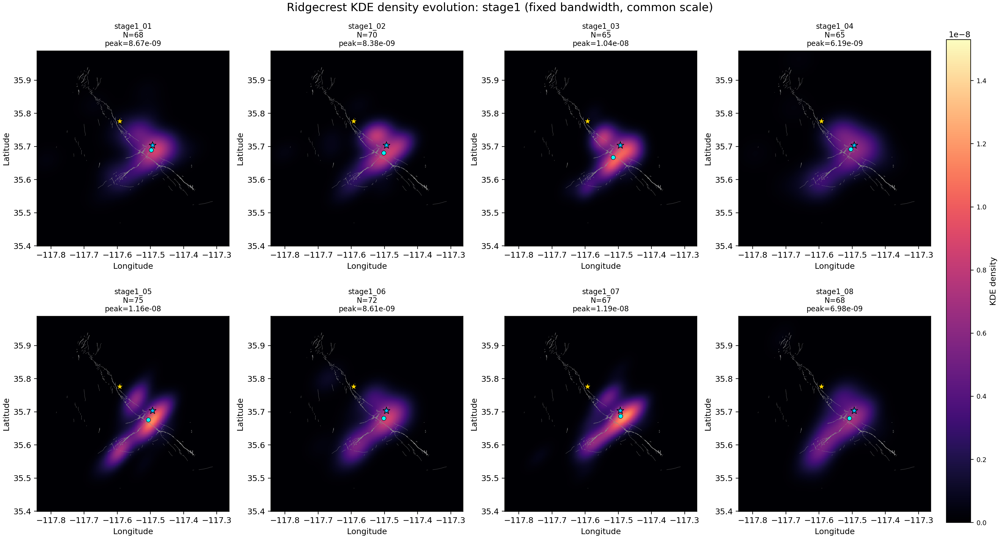
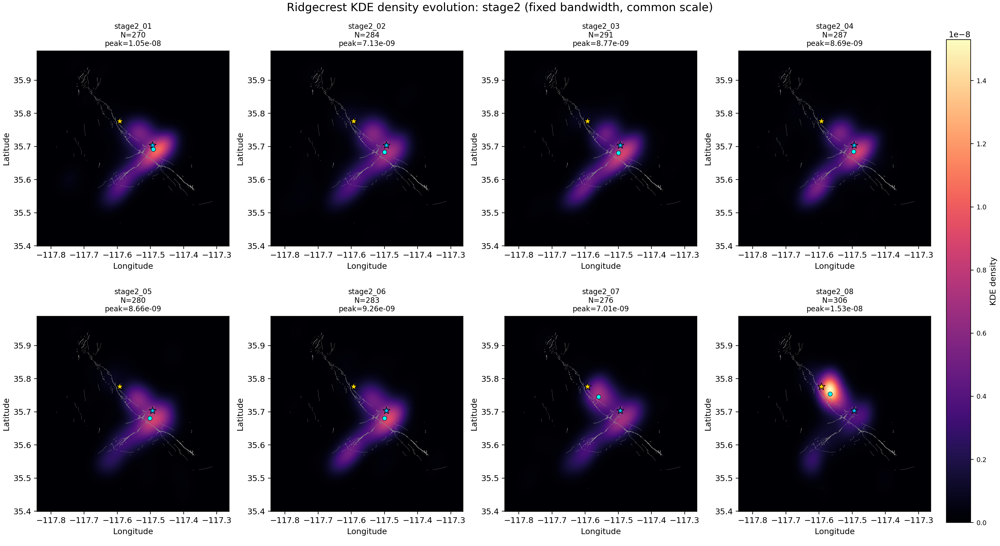
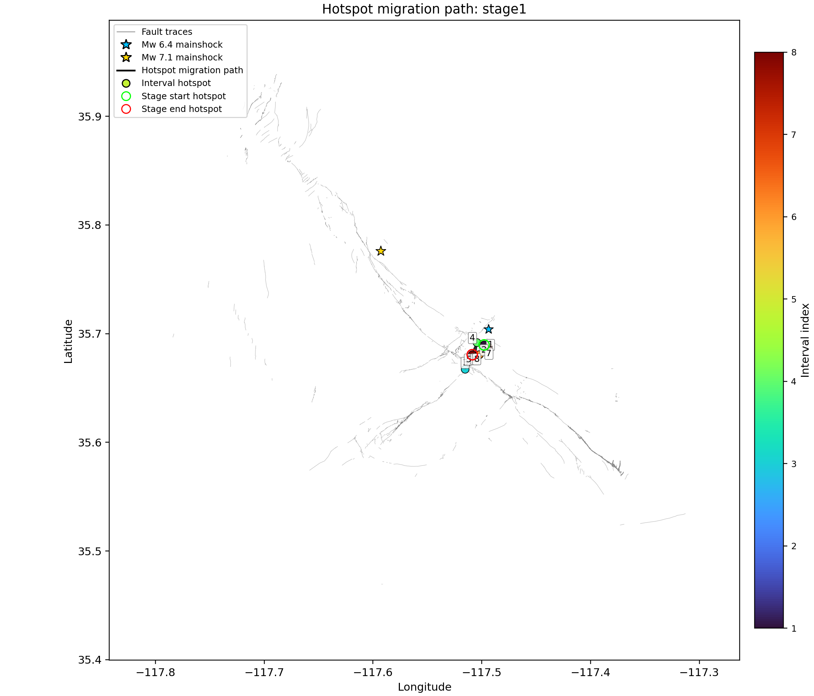
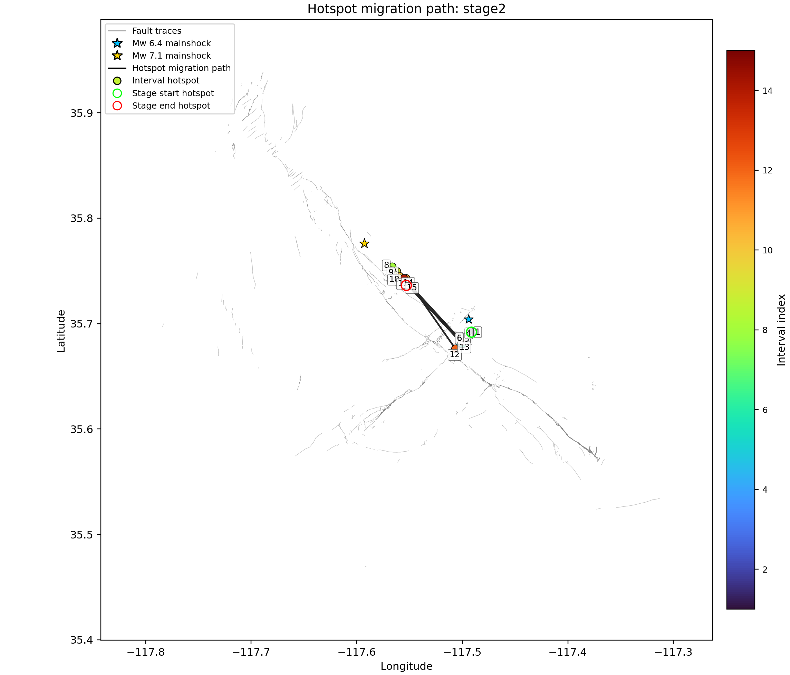
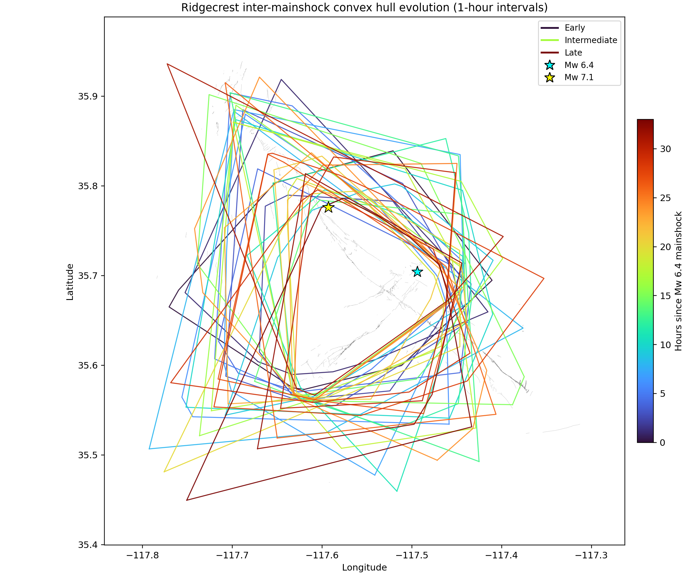
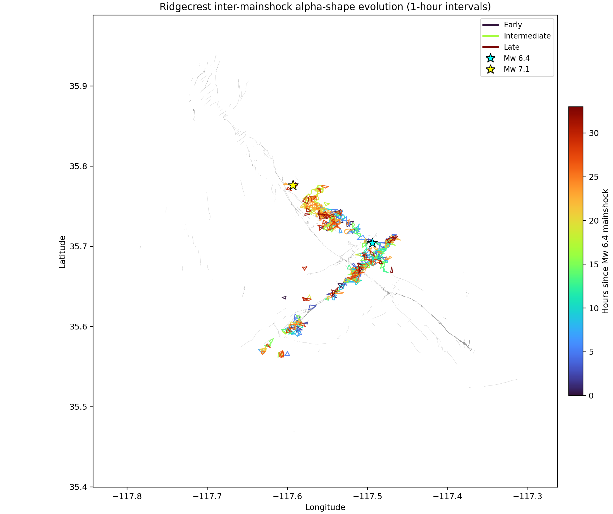

---
author:
- TRACE
title: Spatiotemporal Evolution of the Ridgecrest Inter-Mainshock Seismicity and Implications for Transfer from the Mw 6.4 to Mw 7.1 Mainshock
---

# Abstract

This report investigates the spatial evolution of the relocated Ridgecrest earthquake sequence between the Mw 6.4 event on 4 July 2019 and the Mw 7.1 event on 6 July 2019, with emphasis on whether transfer toward the Mw 7.1 rupture zone is better described as progressive focusing, progressive spreading/defocusing, or multi-lobed structurally guided reorganization. The analysis uses the relocated catalog, the two reference mainshocks, mapped surface faults, fixed-bandwidth two-dimensional kernel density estimation (KDE), hotspot tracking, and hourly geometric envelopes based on convex hulls and alpha-shapes. The shared reference framework contains 4,716 earthquakes in the exact inter-mainshock window. KDE results show a two-stage evolution: Stage 1 (first 4 hours after Mw 6.4) remains localized near the Mw 6.4 source region and nearby complex fault geometry, with hotspot distance to the Mw 7.1 epicentral area remaining approximately 12.3–14.0 km. Stage 2 exhibits broader reorganization and intermittent northwestward transfer, with some hotspot intervals approaching within about 3.4–5.7 km of the Mw 7.1 epicentral area, but not as a monotonic migration path. Morphological analysis across 34 hourly windows shows that convex-hull envelopes remain regionally extensive (about 301–856 km$`^2`$), while alpha-shape envelopes remain fragmented and multi-component (4–12 components in inspected intervals), arguing against a simple single-lobe geometric contraction. Taken together, the delivered evidence supports a structurally controlled, spatially heterogeneous transfer process in which the Mw 7.1 source region was activated within a persistently broad and complex fault-zone domain rather than by smooth deterministic focusing alone. These conclusions are pattern-based and should not be interpreted as direct proof of physical triggering mechanism in the absence of stress-change or depth-resolved analyses.

# Scientific Objective

The objective of this study is to investigate the spatiotemporal evolution of seismicity during the Ridgecrest inter-mainshock period, specifically from the Mw 6.4 mainshock to the Mw 7.1 mainshock, and to evaluate the likely style of transfer toward the eventual Mw 7.1 rupture zone. The requested diagnostic questions are whether seismicity clustered preferentially along strike, at corners or intersections, or within broader structurally complex fault zones; and whether the migration from the Mw 6.4 neighborhood toward the Mw 7.1 source region is most consistent with progressive spatial focusing, progressive spreading/defocusing, or bifurcation.

To preserve the scientific evidence chain, this report is organized around: (1) the shared reference dataset and interval definitions, (2) the actual implemented KDE migration analysis, (3) the actual implemented geometric morphology analysis, (4) synthesis of what these results imply for the Mw 6.4 to Mw 7.1 transfer, and (5) limitations that constrain interpretation.

# Data and Analysis Framework

## Input data

Three observation-based inputs were used:

1.  Relocated earthquake catalog: <a href="<REPO_ROOT>/examples/ridgecrest/data/catalog_TRACE/TRACE_ridgecrest_relocated.csv" class="uri"><REPO_ROOT>/examples/ridgecrest/data/catalog_TRACE/TRACE_ridgecrest_relocated.csv</a>.

2.  Reference mainshock table: <a href="<REPO_ROOT>/examples/ridgecrest/data/catalog_TRACE/main_shock_events.csv" class="uri"><REPO_ROOT>/examples/ridgecrest/data/catalog_TRACE/main_shock_events.csv</a>.

3.  Surface fault geometry: <a href="<REPO_ROOT>/examples/ridgecrest/data/faults/ridgecrest_surface_faults.json" class="uri"><REPO_ROOT>/examples/ridgecrest/data/faults/ridgecrest_surface_faults.json</a>.

The shared framework task matched the two mainshocks exactly to the relocated catalog and extracted the inter-mainshock catalog spanning from 2019-07-04T17:33:49.040000+00:00 (Mw 6.4) to 2019-07-06T03:19:53.040000+00:00 (Mw 7.1). The cleaned inter-mainshock catalog contains 4,716 events and was exported to: <a href="../exp_run/outputs/01_reference_framework/intermainshock_catalog_clean.csv" class="uri">../exp_run/outputs/01_reference_framework/intermainshock_catalog_clean.csv</a>.

The reference coordinates of the mainshocks were exported to: <a href="../exp_run/outputs/01_reference_framework/mainshock_reference_table.csv" class="uri">../exp_run/outputs/01_reference_framework/mainshock_reference_table.csv</a>. Verified values are Mw 6.4 at latitude 35.70421, longitude $`-117.49392`$, depth 11.864 km, and Mw 7.1 at latitude 35.77623, longitude $`-117.59286`$, depth 1.986 km.

## Temporal subdivision actually implemented

The delivered analysis followed the requested inter-mainshock decomposition:

- **KDE Stage 1:** 8 intervals of 30 minutes covering the first 4 hours after the Mw 6.4 event.

- **KDE Stage 2:** 15 intervals of 2 hours from 4 hours after the Mw 6.4 event until the Mw 7.1 event, with the final interval shorter than the nominal duration because it ends exactly at the Mw 7.1 origin time.

- **Morphology:** 34 hourly intervals over the same inter-mainshock window, again with the final interval shorter than one hour.

Interval tables were exported as: <a href="../exp_run/outputs/01_reference_framework/interval_definitions_kde_stage1.csv" class="uri">../exp_run/outputs/01_reference_framework/interval_definitions_kde_stage1.csv</a>, <a href="../exp_run/outputs/01_reference_framework/interval_definitions_kde_stage2.csv" class="uri">../exp_run/outputs/01_reference_framework/interval_definitions_kde_stage2.csv</a>, and <a href="../exp_run/outputs/01_reference_framework/interval_definitions_morphology_1h.csv" class="uri">../exp_run/outputs/01_reference_framework/interval_definitions_morphology_1h.csv</a>.

# Implemented Methods

## Fixed-bandwidth KDE migration analysis

For each KDE interval, the workflow computed a two-dimensional KDE in map view using a fixed bandwidth so that density magnitudes remained directly comparable across time windows. The reported global bandwidth is 1415.44 m, derived from Scott’s rule and documented in: <a href="../exp_run/outputs/02_kde_migration_analysis/kde_global_normalization.json" class="uri">../exp_run/outputs/02_kde_migration_analysis/kde_global_normalization.json</a>.

The workflow further enforced a common grid, shared normalization, and consistent spatial extent across all panels. For each interval, the primary KDE maximum was extracted as the interval hotspot. The hotspot table includes interval identity, event count, peak density, hotspot location, cumulative path length, distance to the Mw 7.1 mainshock, and proximity to mapped fault points: <a href="../exp_run/outputs/02_kde_migration_analysis/hotspot_migration_metrics.csv" class="uri">../exp_run/outputs/02_kde_migration_analysis/hotspot_migration_metrics.csv</a>.

## Geometric morphology analysis

For each of the 34 hourly windows, the workflow computed two complementary map-view envelopes:

- a **convex hull**, designed as a coarse outer envelope of occupied seismicity;

- an **alpha-shape**, using a fixed alpha parameter to preserve concave structure and disconnected morphology more effectively.

The geometry metrics were written to: <a href="../exp_run/outputs/03_morphology_and_synthesis/convex_hull_metrics.csv" class="uri">../exp_run/outputs/03_morphology_and_synthesis/convex_hull_metrics.csv</a> and <a href="../exp_run/outputs/03_morphology_and_synthesis/alpha_shape_metrics.csv" class="uri">../exp_run/outputs/03_morphology_and_synthesis/alpha_shape_metrics.csv</a>.

A geometry-status table confirms that all 34 intervals were processed successfully and yielded valid convex-hull and alpha-shape outputs: <a href="../exp_run/outputs/03_morphology_and_synthesis/geometry_status_by_interval.csv" class="uri">../exp_run/outputs/03_morphology_and_synthesis/geometry_status_by_interval.csv</a>.

# Results

## Reference products and readiness

The data-preparation stage completed successfully and produced the analysis-ready inter-mainshock catalog, fault-segment table, mainshock reference table, and interval-definition tables. This stage is important because it fixes the exact study window, ensures direct consistency between the relocated catalog and the two mainshock reference events, and establishes a common spatial reference for all subsequent comparisons. No interpretation about focusing or triggering derives from this step alone, but it provides the evidence base for the later analyses.

## KDE stage maps and hotspot migration

Figure <a href="#fig:kde-panels" data-reference-type="ref" data-reference="fig:kde-panels">1</a> shows the delivered KDE panel maps for the two stages, while Figure <a href="#fig:hotspot-migration" data-reference-type="ref" data-reference="fig:hotspot-migration">2</a> shows the corresponding hotspot trajectories.

<figure id="fig:kde-panels" data-latex-placement="H">

<figcaption>Fixed-bandwidth KDE evolution for the inter-mainshock period. Top: Stage 1, consisting of eight 30-minute intervals during the first 4 hours after the Mw 6.4 event. Bottom: Stage 2, consisting of fifteen 2-hour intervals from +4 hours after Mw 6.4 to the Mw 7.1 origin time. All panels use common spatial extent and common density normalization, allowing direct visual comparison of density evolution.</figcaption>
</figure>

<figure id="fig:hotspot-migration" data-latex-placement="H">
<figure>

<figcaption>Stage 1 hotspot path.</figcaption>
</figure>
<figure>

<figcaption>Stage 2 hotspot path.</figcaption>
</figure>
<figcaption>Migration paths of the primary KDE hotspot for the two stages. Mapped fault traces and the Mw 6.4 and Mw 7.1 epicenters are overlaid in the delivered figures.</figcaption>
</figure>

The hotspot metrics resolve a clear difference between the two stages.

#### Stage 1: localized activity near the Mw 6.4 source region.

During Stage 1, the hotspot remained consistently close to the Mw 6.4 neighborhood and nearby mapped fault complexity. Verified hotspot distances to the Mw 7.1 epicentral area range from 12.313 to 13.981 km, with the first and last Stage 1 hotspot positions at 12.890 and 13.049 km, respectively. The cumulative hotspot path length over the full 4-hour stage is only 10.911 km. The nearest-fault distance ranges from 0.117 to 0.938 km, and each hotspot lies in a densely faulted neighborhood as indicated by 275–629 mapped fault points within 3 km. These metrics support the claim that the earliest post-Mw 6.4 redistribution was strongly confined to the Mw 6.4 rupture neighborhood and adjacent transfer/intersection-like structural zone, rather than exhibiting systematic approach to the Mw 7.1 epicentral area.

#### Stage 2: broader reorganization with intermittent transfer toward Mw 7.1.

Stage 2 lasts longer and displays larger hotspot excursions. The cumulative hotspot path length reaches 33.616 km, substantially exceeding Stage 1. Distance from the hotspot to the Mw 7.1 epicentral area ranges from 13.569 km at the broadest separation to 3.438 km at the closest approach. The final Stage 2 hotspot remains 5.714 km from Mw 7.1 rather than collapsing exactly onto it. The closest hotspot positions occur only in some intervals, whereas others return to the Mw 6.4-side cluster, including intervals 12 and 13, where hotspot distance again exceeds 13 km. Therefore, transfer toward the Mw 7.1 zone was real but non-monotonic. It is better described as intermittent, structurally guided reorganization or branch switching than as a smooth progressive migration front.

#### Interpretation from KDE alone.

The KDE evidence therefore favors a *two-phase* view of the inter-mainshock sequence: (1) an early confinement phase near the Mw 6.4 source and nearby fault complexity, and (2) a later phase of larger-scale redistribution that intermittently focuses toward the Mw 7.1 side while preserving competing active lobes. This is inconsistent with a purely local stationary aftershock cloud, but it is also inconsistent with a single, continuous, deterministic focusing trajectory.

## Geometric morphology of the seismic cloud

Figure <a href="#fig:morphology" data-reference-type="ref" data-reference="fig:morphology">3</a> shows the delivered overlay plots for hourly convex hulls and alpha-shapes.

<figure id="fig:morphology" data-latex-placement="H">

<figcaption>Hourly morphology evolution during the inter-mainshock period. Top: convex-hull boundaries, emphasizing the gross outer envelope of occupied seismicity. Bottom: alpha-shape boundaries, emphasizing concavity, compartmentalization, and disconnected morphology. Colors encode time relative to the Mw 6.4 mainshock in the delivered figures.</figcaption>
</figure>

The morphology results complement the KDE analysis by showing how the overall seismic cloud changed shape through time.

#### Convex-hull result: the active domain stayed broad.

The convex-hull areas span 3.01$`\times10^8`$ to 8.56$`\times10^8`$ m$`^2`$, equivalent to about 301.03–856.42 km$`^2`$. Because the convex hull is intentionally coarse, these values should be interpreted as outer occupied-domain bounds rather than compact rupture areas. Even so, the result is important: the active domain remained regionally extensive through the full sequence. A simple geometric contraction toward the Mw 7.1 epicentral area would be expected to produce a strong and sustained reduction in occupied outer-domain area through time. That pattern is not supported by the delivered convex-hull metrics.

#### Alpha-shape result: persistent fragmentation and multi-lobed occupancy.

The alpha-shape areas are much smaller, from about 0.78 to 4.23 km$`^2`$, reflecting the fact that alpha-shapes capture only the tighter occupied branches rather than the full convex envelope. More important than the area alone is the component count: inspected hourly intervals contain multiple disconnected components, ranging from 4 to 12 in the verified metrics. Late intervals show somewhat fewer components than some early intervals, but the morphology remains segmented rather than collapsing into one simple lobe. This supports interpretation of fault-guided compartmentalized activity and argues against a single-lobe focusing process.

#### Validation status.

All 34 intervals were processed successfully, and the geometry-status table reports valid outputs for both convex hull and alpha-shape in every interval. Thus, the morphology conclusions are not driven by missing intervals or selective failures.

# Synthesis: What do the results imply about transfer from Mw 6.4 to Mw 7.1?

The combined evidence from hotspot migration and geometric morphology indicates that the Ridgecrest inter-mainshock sequence did **not** evolve as a simple monotonic contraction into the Mw 7.1 source region.

First, the earliest activity after the Mw 6.4 event remained centered near the Mw 6.4 source neighborhood for the full first 4 hours, with hotspot distance to Mw 7.1 staying near 13 km. This strongly suggests that the immediate response was dominated by local redistribution around the Mw 6.4 rupture and nearby structurally complex fault intersections or transfer zones.

Second, later activity did show intervals with clear approach toward the Mw 7.1 side, reaching a minimum hotspot distance of 3.438 km. However, these closer approaches were *intermittent*, not monotonic. Some subsequent intervals shifted back toward the Mw 6.4-side hotspot region. That means the system did not simply march steadily toward Mw 7.1; instead it reorganized among multiple active branches before the Mw 7.1 rupture occurred.

Third, the morphology results show that the seismically occupied domain remained broad at the convex-hull scale and fragmented at the alpha-shape scale. This combination is most consistent with **partial focusing within a broader, persistently defocused and structurally segmented domain**. In other words, the Mw 7.1 source region appears to have been part of an already active, repeatedly occupied fault network rather than the sole terminal focus of a shrinking aftershock cloud.

Accordingly, the most defensible interpretation from the delivered evidence is:

> The transfer from the Mw 6.4 to the Mw 7.1 mainshock is best described as **structurally guided, spatially heterogeneous reorganization** with intermittent northwestward focusing toward the eventual Mw 7.1 rupture zone, superimposed on a broader multi-lobed and fault-complex seismic domain. The evidence does *not* support pure monotonic focusing, nor does it support only diffuse spreading without transfer.

This directly addresses the user’s triggering question at the descriptive level: the sequence appears concentrated near complex mapped fault geometry and transfer/intersection-like neighborhoods, and the approach to Mw 7.1 is expressed more as episodic activation within that network than as a single smooth migration pathway.

# Key quantitative evidence

| Analysis | Metric | Verified value / interpretation |
|:---|:---|:---|
| Reference framework | Inter-mainshock catalog size | ,716 events between the exact Mw 6.4 and Mw 7.1 origin times. |
| KDE Stage 1 | Hotspot distance to Mw 7.1 | –13.981 km; no systematic approach to the Mw 7.1 epicentral area during the first 4 hours. |
| KDE Stage 1 | Cumulative hotspot path length |  km; indicates modest local migration rather than long-range transfer. |
| KDE Stage 1 | Hotspot proximity to mapped faults | Nearest-fault distance 0.117–0.938 km; hotspot remained embedded in mapped fault complexity. |
| KDE Stage 2 | Hotspot distance to Mw 7.1 | –13.569 km; later intervals intermittently approached Mw 7.1 but not monotonically. |
| KDE Stage 2 | Cumulative hotspot path length |  km; much larger reorganization than in Stage 1. |
| Morphology | Convex-hull area | $`\times10^8`$ to 8.56$`\times10^8`$ m$`^2`$ (301.03–856.42 km$`^2`$), indicating a persistently broad active domain. |
| Morphology | Alpha-shape area | About 0.78–4.23 km$`^2`$, showing tighter occupied branches within the broad convex envelope. |
| Morphology | Alpha-shape component count | –12 in verified intervals, supporting persistent multi-lobed / fragmented seismic morphology. |
| Validation | Hourly geometry success rate | of 34 intervals successfully processed with valid convex-hull and alpha-shape outputs. |

Selected quantitative diagnostics supporting the interpretation.

# Limitations and confidence

The conclusions above are well supported by the delivered products, but several limitations are scientifically important.

1.  **Pattern-based, not causal, triggering inference.** The report infers focusing, defocusing, and structurally guided transfer from map-view density and geometry. It does not include Coulomb stress modeling, rupture dynamics, waveform similarity, or depth-resolved migration tests. Therefore, the results constrain the *spatial style* of transfer, not the physical triggering mechanism in a strict causal sense.

2.  **Single fixed KDE bandwidth.** The KDE bandwidth is fixed at 1415.44 m for comparability. This is appropriate for time-series comparison, but it may smooth out fine-scale competing lobes, merge nearby branches, or suppress subtle bifurcation visible at smaller scales.

3.  **Primary-hotspot simplification.** Hotspot tracking keeps only the primary KDE maximum per interval. If multiple comparable peaks existed, secondary branches are not included in the path metric. This matters especially when evaluating bifurcation.

4.  **Morphology is map-view only.** Convex hulls and alpha-shapes summarize horizontal occupancy but do not resolve depth structure or dipping fault geometry.

5.  **Structural classification remains qualitative.** The user asked specifically about along-strike, corner, intersection, and complex fault zones. The delivered products address this meaningfully through mapped-fault proximity and qualitative structural complexity, but they do not implement a formal rule-based structural zone classification.

6.  **Cross-task synthesis table incompleteness.** Task 03 notes that some hotspot-related fields in a synthesis CSV contain `NaN` values, so integrated cross-task interpretation should rely primarily on the standalone validated Task 02 hotspot products and Task 03 morphology products rather than incomplete merged fields.

Given these constraints, the overall delivery status is complete and satisfactory, with **moderate scientific confidence** according to the provided evaluation metadata.

# Reproducible evidence inventory

The major evidence products referenced in this report are listed in Table <a href="#tab:evidence" data-reference-type="ref" data-reference="tab:evidence">2</a>.

| Product | Type | Absolute path |
|:---|:---|:---|
| Product | Type | Absolute path |
| Inter-mainshock catalog | CSV | <a href="../exp_run/outputs/01_reference_framework/intermainshock_catalog_clean.csv" class="uri">../exp_run/outputs/01_reference_framework/intermainshock_catalog_clean.csv</a> |
| Mainshock reference table | CSV | <a href="../exp_run/outputs/01_reference_framework/mainshock_reference_table.csv" class="uri">../exp_run/outputs/01_reference_framework/mainshock_reference_table.csv</a> |
| KDE interval summary | CSV | <a href="../exp_run/outputs/02_kde_migration_analysis/kde_interval_summary.csv" class="uri">../exp_run/outputs/02_kde_migration_analysis/kde_interval_summary.csv</a> |
| Hotspot migration metrics | CSV | <a href="../exp_run/outputs/02_kde_migration_analysis/hotspot_migration_metrics.csv" class="uri">../exp_run/outputs/02_kde_migration_analysis/hotspot_migration_metrics.csv</a> |
| KDE normalization metadata | JSON | <a href="../exp_run/outputs/02_kde_migration_analysis/kde_global_normalization.json" class="uri">../exp_run/outputs/02_kde_migration_analysis/kde_global_normalization.json</a> |
| Stage 1 KDE panels | PNG | <a href="../exp_run/outputs/02_kde_migration_analysis/kde_stage1_panels_page01.png" class="uri">../exp_run/outputs/02_kde_migration_analysis/kde_stage1_panels_page01.png</a> |
| Stage 2 KDE panels | PNG | <a href="../exp_run/outputs/02_kde_migration_analysis/kde_stage2_panels_page01.png" class="uri">../exp_run/outputs/02_kde_migration_analysis/kde_stage2_panels_page01.png</a> |
| Stage 1 hotspot path | PNG | <a href="../exp_run/outputs/02_kde_migration_analysis/hotspot_migration_stage1.png" class="uri">../exp_run/outputs/02_kde_migration_analysis/hotspot_migration_stage1.png</a> |
| Stage 2 hotspot path | PNG | <a href="../exp_run/outputs/02_kde_migration_analysis/hotspot_migration_stage2.png" class="uri">../exp_run/outputs/02_kde_migration_analysis/hotspot_migration_stage2.png</a> |
| Convex-hull metrics | CSV | <a href="../exp_run/outputs/03_morphology_and_synthesis/convex_hull_metrics.csv" class="uri">../exp_run/outputs/03_morphology_and_synthesis/convex_hull_metrics.csv</a> |
| Alpha-shape metrics | CSV | <a href="../exp_run/outputs/03_morphology_and_synthesis/alpha_shape_metrics.csv" class="uri">../exp_run/outputs/03_morphology_and_synthesis/alpha_shape_metrics.csv</a> |
| Convex-hull figure | PNG | <a href="../exp_run/outputs/03_morphology_and_synthesis/convex_hull_evolution.png" class="uri">../exp_run/outputs/03_morphology_and_synthesis/convex_hull_evolution.png</a> |
| Alpha-shape figure | PNG | <a href="../exp_run/outputs/03_morphology_and_synthesis/alpha_shape_evolution.png" class="uri">../exp_run/outputs/03_morphology_and_synthesis/alpha_shape_evolution.png</a> |
| Geometry status table | CSV | <a href="../exp_run/outputs/03_morphology_and_synthesis/geometry_status_by_interval.csv" class="uri">../exp_run/outputs/03_morphology_and_synthesis/geometry_status_by_interval.csv</a> |

Primary evidence products used in this report.

# Conclusions

The delivered Ridgecrest inter-mainshock analyses support four principal conclusions.

1.  The inter-mainshock reference framework is robust and complete: 4,716 relocated events were extracted between the exact Mw 6.4 and Mw 7.1 origin times, with exact mainshock matching and explicit interval definitions.

2.  The first 4 hours after the Mw 6.4 mainshock were dominated by localized activity near the Mw 6.4 source region and nearby mapped fault complexity, not by systematic motion toward the Mw 7.1 epicentral area.

3.  Later inter-mainshock evolution included intermittent approach toward the Mw 7.1 region, but this approach was non-monotonic and alternated with reactivation of other lobes. Thus, the sequence does not support a simple one-directional focusing narrative.

4.  Hourly morphology demonstrates that seismicity remained regionally broad at the outer-envelope scale and fragmented at the concave-envelope scale, implying that Mw 7.1 emerged from a pre-activated, structurally complex, multi-branch fault system.

In summary, the evidence is most consistent with **heterogeneous, fault-network-guided transfer with episodic focusing toward Mw 7.1 embedded within a broader defocused and segmented seismic domain**. This is the strongest interpretation supported by the delivered artifacts.
