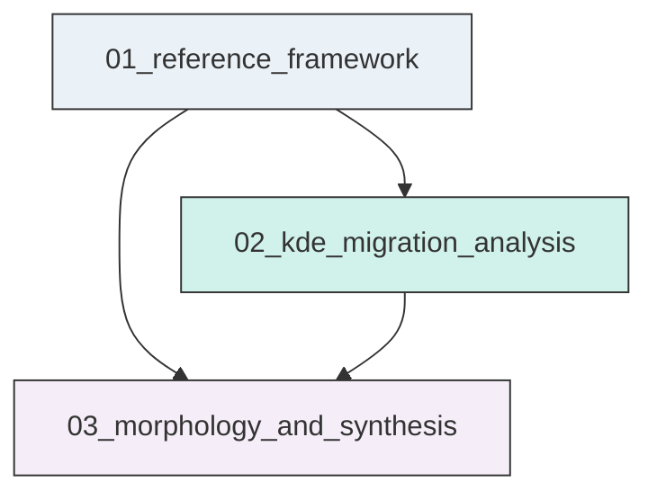
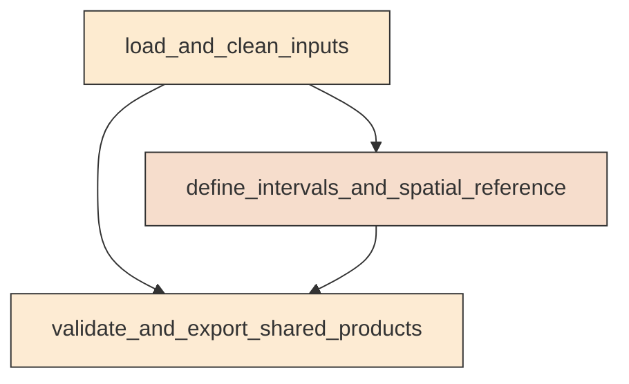
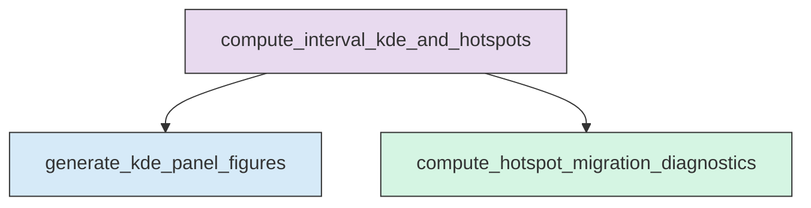
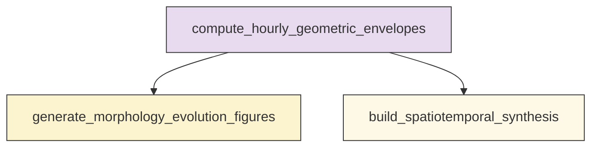

# Workflow Overview

## Top-Level Task Dependencies

**Description:**
- `01_reference_framework`: Build the shared inter-mainshock dataset, interval tables, and spatial metadata for Ridgecrest analyses.
- `02_kde_migration_analysis`: Compute fixed-bandwidth interval KDEs, generate stage panel figures, and track hotspot migration between the two mainshocks.
- `03_morphology_and_synthesis`: Compute hourly convex hull and alpha-shape evolution, then summarize focusing, defocusing, and bifurcation diagnostics.

## Subtask Dependencies

#### 01_reference_framework
**Usage**: Build the shared inter-mainshock dataset, interval tables, and spatial metadata for Ridgecrest analyses.

**Description:**
- `load_and_clean_inputs`: Read the catalog, mainshock table, and fault traces, then parse and validate required fields.
- `define_intervals_and_spatial_reference`: Create KDE and morphology interval tables, common map extent, and one local projected CRS.
- `validate_and_export_shared_products`: Save reusable shared outputs and verify interval completeness and metadata consistency.

#### 02_kde_migration_analysis
**Usage**: Compute fixed-bandwidth interval KDEs, generate stage panel figures, and track hotspot migration between the two mainshocks.

**Description:**
- `compute_interval_kde_and_hotspots`: Run interval-wise KDE on a common grid and extract the primary hotspot for each interval.
- `generate_kde_panel_figures`: Assemble paginated 2_by_4 KDE map panels with shared extent, normalization, and overlays.
- `compute_hotspot_migration_diagnostics`: Build stage-wise hotspot paths and supporting migration metrics relative to Mw 7.1 and mapped faults.

#### 03_morphology_and_synthesis
**Usage**: Compute hourly convex hull and alpha-shape evolution, then summarize focusing, defocusing, and bifurcation diagnostics.

**Description:**
- `compute_hourly_geometric_envelopes`: Derive hourly convex hull and alpha-shape boundaries and interval-level geometric metrics.
- `generate_morphology_evolution_figures`: Plot all valid convex hull and alpha-shape boundaries in a common frame with time-encoded colors.
- `build_spatiotemporal_synthesis`: Combine hotspot and geometry diagnostics into rule-based evidence summaries for focusing, spreading, and bifurcation.