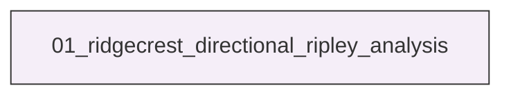
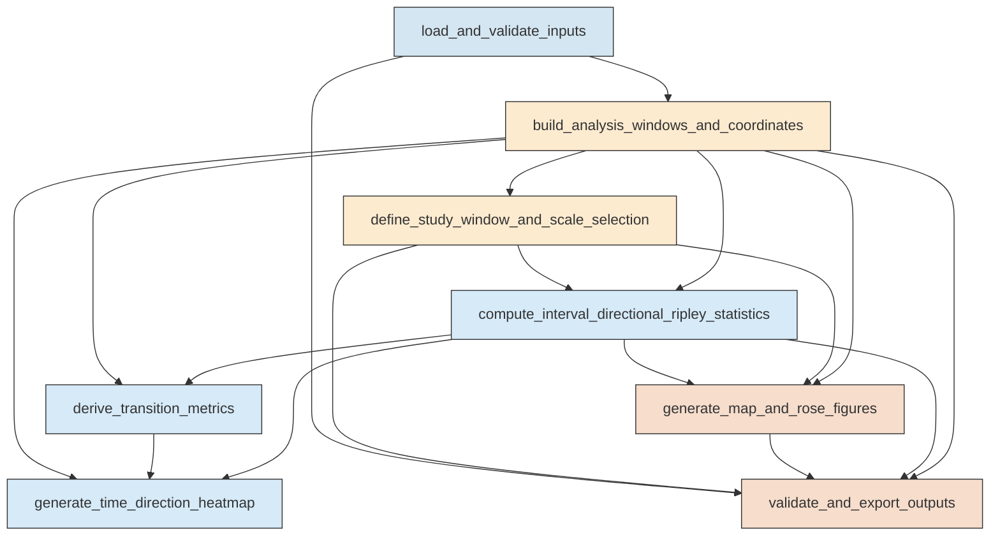

# Research Codings

## Task Overview


**Description:**
- `01_ridgecrest_directional_ripley_analysis`: Build the Ridgecrest analysis dataset, compute directional Ripley K and L statistics through time, derive transition metrics, generate the requested figures, and export validated machine-readable outputs.


## Task Details


#### 01_ridgecrest_directional_ripley_analysis
**Usage**: Build the Ridgecrest analysis dataset, compute directional Ripley K and L statistics through time, derive transition metrics, generate the requested figures, and export validated machine-readable outputs.

**Description:**
- `load_and_validate_inputs`: Load the catalog, mainshock table, and fault polylines and validate their schema and required fields.
- `build_analysis_windows_and_coordinates`: Define the fixed analysis window, assign 30-minute intervals, create representative windows, and project coordinates for pair calculations.
- `define_study_window_and_scale_selection`: Define the fixed study region, normalization protocol, candidate radii, and characteristic radius used across all directional analyses.
- `compute_interval_directional_ripley_statistics`: Compute interval-wise sector-based directional Ripley K and L statistics in parallel and summarize dominant directional features.
- `derive_transition_metrics`: Derive temporal directional metrics and compare them with mainshock-to-mainshock alignment and fault orientation families.
- `generate_time_direction_heatmap`: Build the requested time-direction heatmap and aligned support timeline products from the characteristic-scale directional matrix.
- `generate_map_and_rose_figures`: Create the three requested 2x4 map-plus-polar-rose figure families and compute exact window-level directional summaries where needed.
- `validate_and_export_outputs`: Validate merged dimensions and consistency across all products and export reusable machine-readable tables and logs.

#### Coding Script

```python

from __future__ import annotations

import json
import math
import os
import sys
import traceback
from concurrent.futures import ProcessPoolExecutor, as_completed
from dataclasses import dataclass
from pathlib import Path
from typing import Dict, Iterable, List, Optional, Sequence, Tuple

import matplotlib
matplotlib.use('Agg')
import matplotlib.dates as mdates
import matplotlib.pyplot as plt
import numpy as np
import pandas as pd
from matplotlib import colors
from mpl_toolkits.axes_grid1.inset_locator import inset_axes
from pyproj import CRS, Transformer
from scipy.spatial import ConvexHull
from scipy.spatial.distance import cdist
from tqdm import tqdm


SCRIPT_PATH = Path(__file__).resolve()
OUTPUT_DIR = Path(
    "../exp_run/outputs/01_ridgecrest_directional_ripley_analysis"
).resolve()
CATALOG_PATH = Path(
    "<REPO_ROOT>/examples/ridgecrest/data/catalog_TRACE/TRACE_ridgecrest_relocated.csv"
).resolve()
MAINSHOCK_PATH = Path(
    "<REPO_ROOT>/examples/ridgecrest/data/catalog_TRACE/main_shock_events.csv"
).resolve()
FAULT_PATH = Path(
    "<REPO_ROOT>/examples/ridgecrest/data/faults/ridgecrest_surface_faults.json"
).resolve()

INTERVAL_MINUTES = 30
WHOLE_WINDOW_HOURS = 4
N_REP_WINDOWS = 8
SECTOR_WIDTH_DEG = 5.0
N_SECTORS = int(360 / SECTOR_WIDTH_DEG)
AZIMUTH_EDGES = np.linspace(0.0, 360.0, N_SECTORS + 1)
AZIMUTH_CENTERS = (AZIMUTH_EDGES[:-1] + AZIMUTH_EDGES[1:]) / 2.0
EARTH_RADIUS_KM = 6371.0
MAX_CORES = 64
MIN_EVENTS_INTERVAL = 8
MIN_PAIRS_REQUIRED = 20
BUFFER_KM = 3.0
PAIR_BLOCK_SIZE = 2500
FIG_DPI = 220


@dataclass(frozen=True)
class RipleyParams:
    study_area_km2: float
    r_values_km: np.ndarray
    r_star_km: float
    sector_width_deg: float
    min_events: int
    min_pairs: int


def log(msg: str) -> None:
    print(msg, flush=True)


def ensure_output_dirs() -> Dict[str, Path]:
    OUTPUT_DIR.mkdir(parents=True, exist_ok=True)
    subdirs = {
        'tables': OUTPUT_DIR / 'tables',
        'figures': OUTPUT_DIR / 'figures',
        'intermediate': OUTPUT_DIR / 'intermediate',
        'logs': OUTPUT_DIR / 'logs',
    }
    for path in subdirs.values():
        path.mkdir(parents=True, exist_ok=True)
    stale_patterns = [
        'tables/*.csv',
        'figures/*.png',
        'figures/*.jpg',
        'intermediate/*.csv',
        'intermediate/*.npy',
        'logs/*.log',
        'logs/*.txt',
    ]
    removed = 0
    for pattern in stale_patterns:
        for old_path in OUTPUT_DIR.glob(pattern):
            if old_path.is_file():
                old_path.unlink()
                removed += 1
    log(f'Prepared output directory and removed {removed} stale derived files from prior runs.')
    return subdirs


def load_faults(path: Path) -> List[np.ndarray]:
    with path.open('r', encoding='utf-8') as f:
        data = json.load(f)
    faults = []
    for seg in data:
        arr = np.asarray(seg, dtype=float)
        if arr.ndim == 2 and arr.shape[1] == 2 and len(arr) >= 2:
            faults.append(arr)
    return faults


def infer_local_crs(lon0: float, lat0: float) -> CRS:
    zone = int(math.floor((lon0 + 180.0) / 6.0) + 1)
    epsg = 32600 + zone if lat0 >= 0 else 32700 + zone
    return CRS.from_epsg(epsg)


def project_points(lons: np.ndarray, lats: np.ndarray, transformer: Transformer) -> Tuple[np.ndarray, np.ndarray]:
    x_m, y_m = transformer.transform(lons, lats)
    return np.asarray(x_m) / 1000.0, np.asarray(y_m) / 1000.0


def polygon_area_km2(points: np.ndarray) -> float:
    x = points[:, 0]
    y = points[:, 1]
    return 0.5 * abs(np.dot(x, np.roll(y, -1)) - np.dot(y, np.roll(x, -1)))


def compute_buffered_hull_area(points_xy: np.ndarray, buffer_km: float) -> Tuple[float, np.ndarray]:
    if len(points_xy) < 3:
        x_min, y_min = points_xy.min(axis=0) - buffer_km
        x_max, y_max = points_xy.max(axis=0) + buffer_km
        box = np.array([[x_min, y_min], [x_max, y_min], [x_max, y_max], [x_min, y_max]])
        return polygon_area_km2(box), box
    hull = ConvexHull(points_xy)
    hull_points = points_xy[hull.vertices]
    perimeter = np.sum(np.sqrt(np.sum(np.diff(np.vstack([hull_points, hull_points[0]]), axis=0) ** 2, axis=1)))
    area = polygon_area_km2(hull_points)
    buffered_area = area + perimeter * buffer_km + math.pi * buffer_km * buffer_km
    return buffered_area, hull_points


def circular_difference_deg(a: float, b: float) -> float:
    d = abs(a - b) % 360.0
    return min(d, 360.0 - d)


def compute_orientation_family_from_faults(
    faults: List[np.ndarray], transformer: Transformer
) -> Tuple[pd.DataFrame, List[float]]:
    orientations = []
    lengths = []
    for seg in faults:
        x, y = project_points(seg[:, 0], seg[:, 1], transformer)
        dx = np.diff(x)
        dy = np.diff(y)
        seg_len = np.sqrt(dx ** 2 + dy ** 2)
        good = seg_len > 0
        if np.any(good):
            az = (np.degrees(np.arctan2(dy[good], dx[good])) + 360.0) % 180.0
            orientations.extend(az.tolist())
            lengths.extend(seg_len[good].tolist())
    if not orientations:
        return pd.DataFrame(columns=['orientation_deg', 'weight']), []
    orientations = np.asarray(orientations)
    lengths = np.asarray(lengths)
    bins = np.arange(0.0, 185.0, 5.0)
    bin_idx = np.digitize(orientations, bins) - 1
    rows = []
    for i in range(len(bins) - 1):
        mask = bin_idx == i
        if np.any(mask):
            rows.append({'orientation_deg': (bins[i] + bins[i + 1]) / 2.0, 'weight': float(lengths[mask].sum())})
    df = pd.DataFrame(rows).sort_values('weight', ascending=False)
    top_orients = df.head(4)['orientation_deg'].tolist()
    return df, top_orients


def choose_representative_indices(valid_indices: Sequence[int], n_select: int) -> List[int]:
    valid_indices = sorted(set(int(i) for i in valid_indices))
    if not valid_indices:
        return []
    if len(valid_indices) <= n_select:
        return valid_indices
    target = np.linspace(0, len(valid_indices) - 1, n_select)
    chosen = []
    used = set()
    for t in target:
        candidates = np.argsort(np.abs(np.arange(len(valid_indices)) - t))
        for c in candidates:
            idx = valid_indices[int(c)]
            if idx not in used:
                chosen.append(idx)
                used.add(idx)
                break
    return sorted(chosen)


def pairwise_directional_counts(coords_xy: np.ndarray, r_values_km: np.ndarray) -> Tuple[np.ndarray, np.ndarray, np.ndarray]:
    n = len(coords_xy)
    counts = np.zeros((len(r_values_km), N_SECTORS), dtype=np.float64)
    pair_counts_r = np.zeros(len(r_values_km), dtype=np.int64)
    pair_total = 0
    if n < 2:
        return counts, pair_counts_r, np.array([0], dtype=float)
    max_r = float(np.max(r_values_km))
    for start in range(0, n - 1, PAIR_BLOCK_SIZE):
        end = min(n - 1, start + PAIR_BLOCK_SIZE)
        xi = coords_xy[start:end]
        for i_local, i in enumerate(range(start, end)):
            diff = coords_xy[i + 1:] - xi[i_local]
            if diff.size == 0:
                continue
            dist = np.sqrt(np.sum(diff ** 2, axis=1))
            keep = dist <= max_r
            if not np.any(keep):
                continue
            diff = diff[keep]
            dist = dist[keep]
            az = (np.degrees(np.arctan2(diff[:, 1], diff[:, 0])) + 360.0) % 360.0
            pair_total += len(dist)
            sector_idx = np.floor(az / SECTOR_WIDTH_DEG).astype(int) % N_SECTORS
            for ir, r in enumerate(r_values_km):
                m = dist <= r
                if not np.any(m):
                    continue
                pair_counts_r[ir] += int(np.count_nonzero(m))
                binc = np.bincount(sector_idx[m], minlength=N_SECTORS)
                counts[ir] += binc
    return counts, pair_counts_r, np.array([pair_total], dtype=float)


def sector_ripley_for_coords(coords_xy: np.ndarray, params: RipleyParams) -> Dict[str, np.ndarray]:
    n = len(coords_xy)
    empty = {
        'K_by_r_theta': np.full((len(params.r_values_km), N_SECTORS), np.nan, dtype=float),
        'L_by_r_theta': np.full((len(params.r_values_km), N_SECTORS), np.nan, dtype=float),
        'pair_counts_r': np.zeros(len(params.r_values_km), dtype=int),
        'event_count': np.array([n], dtype=int),
        'pair_total_within_rmax': np.array([0], dtype=int),
    }
    if n < 2:
        return empty
    counts, pair_counts_r, pair_total = pairwise_directional_counts(coords_xy, params.r_values_km)
    density_factor = params.study_area_km2 / (n * (n - 1))
    sector_fraction = params.sector_width_deg / 360.0
    K = density_factor * counts / sector_fraction
    L = np.sqrt(np.maximum(K, 0.0) / math.pi)
    return {
        'K_by_r_theta': K,
        'L_by_r_theta': L,
        'pair_counts_r': pair_counts_r,
        'event_count': np.array([n], dtype=int),
        'pair_total_within_rmax': pair_total.astype(int),
    }


def smooth_circular(values: np.ndarray, passes: int = 1) -> np.ndarray:
    out = values.astype(float).copy()
    for _ in range(passes):
        out = 0.25 * np.roll(out, 1) + 0.5 * out + 0.25 * np.roll(out, -1)
    return out


def extract_direction_metrics(L_theta: np.ndarray, pair_count: int, params: RipleyParams) -> Dict[str, float]:
    result = {
        'dominant_azimuth_deg': np.nan,
        'secondary_azimuth_deg': np.nan,
        'anisotropy_strength': np.nan,
        'circular_resultant': np.nan,
        'valid': False,
    }
    if np.all(~np.isfinite(L_theta)) or pair_count < params.min_pairs:
        return result
    sm = smooth_circular(L_theta, passes=1)
    dominant_idx = int(np.nanargmax(sm))
    dominant = float(AZIMUTH_CENTERS[dominant_idx])
    exclusion = 3
    candidate = sm.copy()
    for k in range(-exclusion, exclusion + 1):
        candidate[(dominant_idx + k) % N_SECTORS] = -np.inf
    secondary_idx = int(np.argmax(candidate)) if np.isfinite(candidate).any() else dominant_idx
    secondary = float(AZIMUTH_CENTERS[secondary_idx])
    mean_val = float(np.nanmean(sm))
    max_val = float(np.nanmax(sm))
    min_val = float(np.nanmin(sm))
    anis = (max_val - mean_val) / (abs(mean_val) + 1e-9)
    weights = np.maximum(sm - min_val, 0.0) + 1e-6
    ang = np.deg2rad(AZIMUTH_CENTERS)
    resultant = np.sqrt((np.sum(weights * np.cos(ang)) / np.sum(weights)) ** 2 + (np.sum(weights * np.sin(ang)) / np.sum(weights)) ** 2)
    result.update(
        {
            'dominant_azimuth_deg': dominant,
            'secondary_azimuth_deg': secondary,
            'anisotropy_strength': anis,
            'circular_resultant': float(resultant),
            'valid': True,
        }
    )
    return result


def compute_interval_job(args: Tuple[int, np.ndarray, RipleyParams]) -> Dict[str, object]:
    interval_id, coords_xy, params = args
    stats = sector_ripley_for_coords(coords_xy, params)
    r_star_idx = int(np.argmin(np.abs(params.r_values_km - params.r_star_km)))
    L_star = stats['L_by_r_theta'][r_star_idx]
    pair_count_star = int(stats['pair_counts_r'][r_star_idx])
    metrics = extract_direction_metrics(L_star, pair_count_star, params)
    return {
        'interval_id': interval_id,
        'K_by_r_theta': stats['K_by_r_theta'],
        'L_by_r_theta': stats['L_by_r_theta'],
        'pair_counts_r': stats['pair_counts_r'],
        'event_count': int(stats['event_count'][0]),
        'pair_total_within_rmax': int(stats['pair_total_within_rmax'][0]),
        'L_theta_rstar': L_star,
        'pair_count_rstar': pair_count_star,
        **metrics,
    }


def save_dataframe(df: pd.DataFrame, path: Path) -> None:
    df.to_csv(path, index=False)
    log(f'Saved table: {path}')


def build_representative_windows(
    interval_df: pd.DataFrame,
    analysis_start: pd.Timestamp,
    analysis_end: pd.Timestamp,
    t64: pd.Timestamp,
    t71: pd.Timestamp,
) -> pd.DataFrame:
    rows = []

    total_duration_h = (analysis_end - analysis_start).total_seconds() / 3600.0
    if total_duration_h <= WHOLE_WINDOW_HOURS:
        start_times = [analysis_start]
    else:
        offsets_h = np.linspace(0.0, total_duration_h - WHOLE_WINDOW_HOURS, N_REP_WINDOWS)
        start_times = [analysis_start + pd.Timedelta(hours=float(h)) for h in offsets_h]
    for i, st in enumerate(start_times):
        et = min(st + pd.Timedelta(hours=WHOLE_WINDOW_HOURS), analysis_end)
        rows.append({'figure_group': 'whole_window_4h', 'window_rank': i + 1, 'window_start': st, 'window_end': et})

    after64 = interval_df[(interval_df['start_time'] >= t64) & (interval_df['start_time'] < t71)]
    before71 = interval_df[(interval_df['start_time'] >= t64) & (interval_df['start_time'] < t71)]

    idx_after64 = choose_representative_indices(after64['interval_id'].tolist(), N_REP_WINDOWS)
    idx_before71 = choose_representative_indices(before71['interval_id'].tolist(), N_REP_WINDOWS)

    for i, iid in enumerate(idx_after64):
        row = interval_df.loc[interval_df['interval_id'] == iid].iloc[0]
        rows.append({'figure_group': 'near_mainshock64_30m', 'window_rank': i + 1, 'window_start': row['start_time'], 'window_end': row['end_time'], 'interval_id': iid})
    for i, iid in enumerate(idx_before71):
        row = interval_df.loc[interval_df['interval_id'] == iid].iloc[0]
        rows.append({'figure_group': 'near_mainshock71_30m', 'window_rank': i + 1, 'window_start': row['start_time'], 'window_end': row['end_time'], 'interval_id': iid})

    rep_df = pd.DataFrame(rows)
    rep_df['window_label'] = rep_df['figure_group'] + '_w' + rep_df['window_rank'].astype(str)
    return rep_df


def compute_fault_and_connection_metrics(
    interval_summary: pd.DataFrame,
    mainshock_df: pd.DataFrame,
    top_fault_orients: List[float],
) -> pd.DataFrame:
    ms64 = mainshock_df.loc[mainshock_df['label'] == 'Mainshock64'].iloc[0]
    ms71 = mainshock_df.loc[mainshock_df['label'] == 'Mainshock71'].iloc[0]
    connection_az = (math.degrees(math.atan2(ms71['y_km'] - ms64['y_km'], ms71['x_km'] - ms64['x_km'])) + 360.0) % 360.0
    interval_summary = interval_summary.copy()
    interval_summary['dominant_to_ms64_ms71_deg'] = interval_summary['dominant_azimuth_deg'].apply(
        lambda x: circular_difference_deg(x, connection_az) if pd.notnull(x) else np.nan
    )
    if top_fault_orients:
        doubled = top_fault_orients + [o + 180.0 for o in top_fault_orients]
        interval_summary['dominant_to_fault_family_deg'] = interval_summary['dominant_azimuth_deg'].apply(
            lambda x: min(circular_difference_deg(x, o) for o in doubled) if pd.notnull(x) else np.nan
        )
    else:
        interval_summary['dominant_to_fault_family_deg'] = np.nan
    return interval_summary


def select_radii_from_catalog(coords_xy: np.ndarray) -> np.ndarray:
    sample_n = min(len(coords_xy), 4000)
    if len(coords_xy) > sample_n:
        rng = np.random.default_rng(42)
        idx = rng.choice(len(coords_xy), size=sample_n, replace=False)
        sample = coords_xy[idx]
    else:
        sample = coords_xy
    if len(sample) < 3:
        return np.array([1.0, 2.0, 3.0, 5.0, 8.0])
    dist_matrix = cdist(sample, sample)
    np.fill_diagonal(dist_matrix, np.inf)
    nn = np.min(dist_matrix, axis=1)
    finite_nn = nn[np.isfinite(nn)]
    q = np.quantile(finite_nn, [0.5, 0.75, 0.9]) if len(finite_nn) else np.array([0.5, 1.0, 2.0])
    base = np.unique(np.clip(np.array([q[0] * 2, q[1] * 3, q[2] * 4, 3.0, 5.0, 8.0, 12.0]), 0.5, 20.0))
    return np.round(np.sort(base), 2)


def choose_r_star(
    interval_groups: List[np.ndarray], study_area_km2: float, r_values_km: np.ndarray
) -> Tuple[float, pd.DataFrame]:
    rows = []
    sector_fraction = SECTOR_WIDTH_DEG / 360.0
    for r in r_values_km:
        support_events = 0
        support_pairs = 0
        anis_values = []
        for coords in interval_groups:
            n = len(coords)
            if n < MIN_EVENTS_INTERVAL:
                continue
            support_events += 1
            counts, pair_counts_r, _ = pairwise_directional_counts(coords, np.array([r]))
            pair_count = int(pair_counts_r[0])
            if pair_count >= MIN_PAIRS_REQUIRED:
                support_pairs += 1
                K = (study_area_km2 / (n * (n - 1))) * counts[0] / sector_fraction
                L = np.sqrt(np.maximum(K, 0.0) / math.pi)
                metrics = extract_direction_metrics(L, pair_count, RipleyParams(study_area_km2, np.array([r]), r, SECTOR_WIDTH_DEG, MIN_EVENTS_INTERVAL, MIN_PAIRS_REQUIRED))
                if metrics['valid']:
                    anis_values.append(metrics['anisotropy_strength'])
        rows.append(
            {
                'r_km': float(r),
                'intervals_with_min_events': support_events,
                'intervals_with_min_pairs': support_pairs,
                'support_fraction': support_pairs / max(len(interval_groups), 1),
                'median_anisotropy': float(np.median(anis_values)) if anis_values else np.nan,
            }
        )
    diag = pd.DataFrame(rows)
    candidates = diag[(diag['support_fraction'] >= 0.35) & (diag['median_anisotropy'].notna())].copy()
    if candidates.empty:
        r_star = float(diag.sort_values(['support_fraction', 'median_anisotropy'], ascending=[False, False]).iloc[0]['r_km'])
    else:
        candidates['score'] = candidates['median_anisotropy'] * (0.5 + candidates['support_fraction'])
        r_star = float(candidates.sort_values(['score', 'r_km'], ascending=[False, True]).iloc[0]['r_km'])
    return r_star, diag


def plot_scale_selection(diag: pd.DataFrame, r_star: float, out_path: Path) -> None:
    fig, ax1 = plt.subplots(figsize=(8, 5))
    ax1.plot(diag['r_km'], diag['support_fraction'], marker='o', color='tab:blue', label='Support fraction')
    ax1.set_xlabel('Radius r (km)')
    ax1.set_ylabel('Support fraction', color='tab:blue')
    ax1.tick_params(axis='y', labelcolor='tab:blue')
    ax2 = ax1.twinx()
    ax2.plot(diag['r_km'], diag['median_anisotropy'], marker='s', color='tab:red', label='Median anisotropy')
    ax2.set_ylabel('Median anisotropy', color='tab:red')
    ax2.tick_params(axis='y', labelcolor='tab:red')
    ax1.axvline(r_star, color='k', linestyle='--', lw=1.2, label=f'r*={r_star:.2f} km')
    ax1.grid(True, alpha=0.3)
    fig.suptitle('Characteristic radius selection for directional Ripley analysis')
    fig.tight_layout()
    fig.savefig(out_path, dpi=FIG_DPI)
    plt.close(fig)
    log(f'Saved figure: {out_path}')


def plot_heatmap(
    L_matrix: np.ndarray,
    interval_df: pd.DataFrame,
    interval_summary: pd.DataFrame,
    mainshock_df: pd.DataFrame,
    r_star: float,
    out_path: Path,
) -> None:
    times = mdates.date2num(interval_df['start_time'].dt.to_pydatetime())
    extent = [times[0], mdates.date2num(interval_df['end_time'].iloc[-1].to_pydatetime()), 0, 360]
    fig = plt.figure(figsize=(16, 9))
    gs = fig.add_gridspec(2, 1, height_ratios=[4, 1.2], hspace=0.08)
    ax = fig.add_subplot(gs[0])
    valid_vals = L_matrix[np.isfinite(L_matrix)]
    if valid_vals.size == 0:
        vmin, vmax = -1, 1
    else:
        vmin, vmax = np.nanpercentile(valid_vals, [5, 95])
        if vmin == vmax:
            vmin -= 1
            vmax += 1
    im = ax.imshow(L_matrix.T, origin='lower', aspect='auto', extent=extent, cmap='magma', vmin=vmin, vmax=vmax)
    ax.plot(times + (times[1] - times[0]) / 2 if len(times) > 1 else times, interval_summary['dominant_azimuth_deg'], color='cyan', lw=1.3, label='Dominant')
    ax.plot(times + (times[1] - times[0]) / 2 if len(times) > 1 else times, interval_summary['secondary_azimuth_deg'], color='lime', lw=1.0, alpha=0.8, label='Secondary')
    for _, row in mainshock_df.iterrows():
        t = mdates.date2num(row['event_time'].to_pydatetime())
        ax.axvline(t, color='white', linestyle='--', lw=1.1)
        ax.text(t, 350, row['label'], color='white', rotation=90, va='top', ha='right', fontsize=9)
    ax.set_ylabel('Azimuth (deg)')
    ax.set_title(f'Time-direction heatmap of directional Ripley L(r*, θ), r* = {r_star:.2f} km')
    ax.legend(loc='upper left', fontsize=9)
    ax.xaxis_date()
    ax.xaxis.set_major_formatter(mdates.DateFormatter('%m-%d\n%H:%M'))
    cb = fig.colorbar(im, ax=ax, pad=0.01)
    cb.set_label('Directional L(r*, θ)')

    ax2 = fig.add_subplot(gs[1], sharex=ax)
    ax2.plot(interval_df['start_time'], interval_summary['event_count'], color='tab:blue', label='Events')
    ax2.set_ylabel('Events', color='tab:blue')
    ax2.tick_params(axis='y', labelcolor='tab:blue')
    ax3 = ax2.twinx()
    ax3.plot(interval_df['start_time'], interval_summary['pair_count_rstar'], color='tab:red', label='Pairs ≤ r*')
    ax3.set_ylabel('Pairs', color='tab:red')
    ax3.tick_params(axis='y', labelcolor='tab:red')
    ax2.set_xlabel('Time (UTC)')
    ax2.grid(True, alpha=0.3)
    fig.tight_layout()
    fig.savefig(out_path, dpi=FIG_DPI)
    plt.close(fig)
    log(f'Saved figure: {out_path}')


def add_rose_inset(ax, theta_values: np.ndarray, title: str = '') -> None:
    inset = inset_axes(ax, width='33%', height='33%', loc='upper right', axes_class=plt.PolarAxes)
    angles = np.deg2rad(np.r_[AZIMUTH_CENTERS, AZIMUTH_CENTERS[0]])
    vals = np.r_[theta_values, theta_values[0]]
    base = np.nanmin(vals[np.isfinite(vals)]) if np.isfinite(vals).any() else 0.0
    vals = vals - base + 1e-6
    inset.fill(angles, vals, color='tab:orange', alpha=0.6)
    inset.plot(angles, vals, color='tab:red', lw=1.0)
    inset.set_xticks(np.deg2rad([0, 90, 180, 270]))
    inset.set_yticks([])
    inset.set_title(title, fontsize=7, pad=2)


def compute_window_stats(window_events: pd.DataFrame, params: RipleyParams) -> Dict[str, object]:
    coords = window_events[['x_km', 'y_km']].to_numpy(dtype=float)
    stats = sector_ripley_for_coords(coords, params)
    r_idx = int(np.argmin(np.abs(params.r_values_km - params.r_star_km)))
    L_theta = stats['L_by_r_theta'][r_idx]
    pair_count = int(stats['pair_counts_r'][r_idx])
    metrics = extract_direction_metrics(L_theta, pair_count, params)
    return {
        'event_count': len(window_events),
        'pair_count_rstar': pair_count,
        'L_theta_rstar': L_theta,
        **metrics,
    }


def plot_map_rose_family(
    rep_df: pd.DataFrame,
    catalog_df: pd.DataFrame,
    faults: List[np.ndarray],
    mainshock_df: pd.DataFrame,
    params: RipleyParams,
    color_mode: str,
    figure_title: str,
    out_path: Path,
) -> pd.DataFrame:
    fig, axes = plt.subplots(2, 4, figsize=(20, 10), constrained_layout=True)
    axes = axes.ravel()
    summaries = []
    all_lon = catalog_df['longitude'].to_numpy()
    all_lat = catalog_df['latitude'].to_numpy()
    xlim = (all_lon.min() - 0.03, all_lon.max() + 0.03)
    ylim = (all_lat.min() - 0.03, all_lat.max() + 0.03)

    if color_mode == 'relative_to_64_hours':
        cvals_all = catalog_df['hours_since_64']
        cbar_label = 'Hours since Mw 6.4'
    else:
        cvals_all = catalog_df['hours_since_71']
        cbar_label = 'Hours relative to Mw 7.1'
    norm = colors.Normalize(vmin=float(np.nanpercentile(cvals_all, 2)), vmax=float(np.nanpercentile(cvals_all, 98)))

    for ax, (_, win) in zip(axes, rep_df.iterrows()):
        subset = catalog_df[(catalog_df['event_time'] >= win['window_start']) & (catalog_df['event_time'] < win['window_end'])].copy()
        stats = compute_window_stats(subset, params)
        summaries.append(
            {
                'figure_group': win['figure_group'],
                'window_rank': win['window_rank'],
                'window_label': win['window_label'],
                'window_start': win['window_start'],
                'window_end': win['window_end'],
                'event_count': stats['event_count'],
                'pair_count_rstar': stats['pair_count_rstar'],
                'dominant_azimuth_deg': stats['dominant_azimuth_deg'],
                'secondary_azimuth_deg': stats['secondary_azimuth_deg'],
                'anisotropy_strength': stats['anisotropy_strength'],
                'valid': stats['valid'],
            }
        )
        for seg in faults:
            ax.plot(seg[:, 0], seg[:, 1], color='0.75', lw=0.4, alpha=0.5, zorder=1)
        if len(subset) > 0:
            cvals = subset['hours_since_64'] if color_mode == 'relative_to_64_hours' else subset['hours_since_71']
            sc = ax.scatter(subset['longitude'], subset['latitude'], c=cvals, s=8, cmap='viridis', norm=norm, alpha=0.9, linewidths=0, zorder=2)
        for _, ms in mainshock_df.iterrows():
            marker = '*' if ms['label'] == 'Mainshock64' else 'P'
            color = 'red' if ms['label'] == 'Mainshock64' else 'gold'
            ax.scatter(ms['longitude'], ms['latitude'], s=120, marker=marker, c=color, edgecolor='k', zorder=5)
        title = f"{win['window_rank']}: {pd.Timestamp(win['window_start']).strftime('%m-%d %H:%M')}\nN={len(subset)}"
        ax.set_title(title, fontsize=10)
        ax.set_xlim(*xlim)
        ax.set_ylim(*ylim)
        ax.set_xlabel('Longitude')
        ax.set_ylabel('Latitude')
        ax.grid(True, alpha=0.2)
        if np.isfinite(stats['L_theta_rstar']).any():
            add_rose_inset(ax, stats['L_theta_rstar'], title='Directional L')
        if not stats['valid']:
            ax.text(0.02, 0.98, 'Low support', transform=ax.transAxes, ha='left', va='top', fontsize=9, color='crimson', bbox=dict(boxstyle='round', fc='white', ec='crimson', alpha=0.8))

    for j in range(len(rep_df), len(axes)):
        axes[j].axis('off')
    fig.suptitle(figure_title, fontsize=15)
    sm = plt.cm.ScalarMappable(norm=norm, cmap='viridis')
    cbar = fig.colorbar(sm, ax=axes.tolist(), shrink=0.75, pad=0.02)
    cbar.set_label(cbar_label)
    fig.savefig(out_path, dpi=FIG_DPI)
    plt.close(fig)
    log(f'Saved figure: {out_path}')
    return pd.DataFrame(summaries)


def main() -> None:
    dirs = ensure_output_dirs()
    log(f'Script path: {SCRIPT_PATH}')
    log(f'Output dir: {OUTPUT_DIR}')
    log('Loading input datasets...')

    catalog_df = pd.read_csv(CATALOG_PATH, parse_dates=['event_time'])
    mainshock_df = pd.read_csv(MAINSHOCK_PATH, parse_dates=['event_time'])
    faults = load_faults(FAULT_PATH)

    catalog_df = catalog_df.dropna(subset=['event_time', 'latitude', 'longitude', 'depth_km', 'magnitude']).copy()
    mainshock_df = mainshock_df.dropna(subset=['event_time', 'latitude', 'longitude', 'depth_km', 'magnitude']).copy()
    catalog_df['event_time'] = pd.to_datetime(catalog_df['event_time'], utc=True)
    mainshock_df['event_time'] = pd.to_datetime(mainshock_df['event_time'], utc=True)

    ms64 = mainshock_df.iloc[(mainshock_df['magnitude'] - 6.4).abs().argsort()].iloc[0]
    ms71 = mainshock_df.iloc[(mainshock_df['magnitude'] - 7.1).abs().argsort()].iloc[0]
    t64 = pd.Timestamp(ms64['event_time'])
    t71 = pd.Timestamp(ms71['event_time'])
    analysis_start = t64
    analysis_end = t71 + pd.Timedelta(hours=10)

    mainshock_df = mainshock_df.copy()
    mainshock_df['label'] = np.where(
        np.isclose(mainshock_df['magnitude'], 6.4, atol=0.05),
        'Mainshock64',
        np.where(np.isclose(mainshock_df['magnitude'], 7.1, atol=0.05), 'Mainshock71', 'OtherMainshock')
    )
    if (mainshock_df['label'] == 'Mainshock64').sum() != 1 or (mainshock_df['label'] == 'Mainshock71').sum() != 1:
        raise ValueError('Expected exactly one Mw 6.4 mainshock and one Mw 7.1 mainshock in main_shock_events.csv')

    catalog_df = catalog_df[(catalog_df['event_time'] >= analysis_start) & (catalog_df['event_time'] <= analysis_end)].sort_values('event_time').reset_index(drop=True)
    log(f'Clipped catalog event count: {len(catalog_df)} from {analysis_start} to {analysis_end}')

    lon0 = float(np.mean([catalog_df['longitude'].mean(), ms64['longitude'], ms71['longitude']]))
    lat0 = float(np.mean([catalog_df['latitude'].mean(), ms64['latitude'], ms71['latitude']]))
    local_crs = infer_local_crs(lon0, lat0)
    transformer = Transformer.from_crs(CRS.from_epsg(4326), local_crs, always_xy=True)

    catalog_df['x_km'], catalog_df['y_km'] = project_points(catalog_df['longitude'].to_numpy(), catalog_df['latitude'].to_numpy(), transformer)
    mainshock_df['x_km'], mainshock_df['y_km'] = project_points(mainshock_df['longitude'].to_numpy(), mainshock_df['latitude'].to_numpy(), transformer)
    catalog_df['hours_since_64'] = (catalog_df['event_time'] - t64).dt.total_seconds() / 3600.0
    catalog_df['hours_since_71'] = (catalog_df['event_time'] - t71).dt.total_seconds() / 3600.0

    interval_edges = pd.date_range(start=analysis_start, end=analysis_end, freq=f'{INTERVAL_MINUTES}min', tz='UTC')
    if interval_edges[-1] < analysis_end:
        interval_edges = interval_edges.append(pd.DatetimeIndex([analysis_end]))
    interval_rows = []
    for i in range(len(interval_edges) - 1):
        interval_rows.append({'interval_id': i, 'start_time': interval_edges[i], 'end_time': interval_edges[i + 1]})
    interval_df = pd.DataFrame(interval_rows)
    catalog_df['interval_id'] = pd.cut(catalog_df['event_time'], bins=interval_edges, labels=False, right=False, include_lowest=True)
    last_mask = catalog_df['event_time'] == analysis_end
    if last_mask.any():
        catalog_df.loc[last_mask, 'interval_id'] = len(interval_df) - 1
    catalog_df['interval_id'] = catalog_df['interval_id'].astype(int)

    required_catalog_cols = ['event_time', 'latitude', 'longitude', 'depth_km', 'magnitude', 'x_km', 'y_km', 'hours_since_64', 'hours_since_71', 'interval_id']
    missing_catalog_cols = [c for c in required_catalog_cols if c not in catalog_df.columns]
    if missing_catalog_cols:
        raise ValueError(f'Missing required catalog columns after preprocessing: {missing_catalog_cols}')

    rep_df = build_representative_windows(interval_df, analysis_start, analysis_end, t64, t71)

    qc_df = pd.DataFrame(
        {
            'n_catalog_events': [len(catalog_df)],
            'n_intervals': [len(interval_df)],
            'analysis_start_utc': [analysis_start],
            'analysis_end_utc': [analysis_end],
            't64_utc': [t64],
            't71_utc': [t71],
            'local_crs': [local_crs.to_string()],
            'fault_segments': [len(faults)],
        }
    )

    full_points = catalog_df[['x_km', 'y_km']].to_numpy()
    study_area_km2, hull_points = compute_buffered_hull_area(full_points, BUFFER_KM)
    fault_orient_df, top_fault_orients = compute_orientation_family_from_faults(faults, transformer)
    r_values_km = select_radii_from_catalog(full_points)
    interval_groups = [
        catalog_df.loc[catalog_df['interval_id'] == iid, ['x_km', 'y_km']].to_numpy(dtype=float)
        for iid in interval_df['interval_id']
    ]
    log(f'Candidate radii (km): {r_values_km.tolist()}')
    r_star_km, radius_diag_df = choose_r_star(interval_groups, study_area_km2, r_values_km)
    params = RipleyParams(study_area_km2, r_values_km, r_star_km, SECTOR_WIDTH_DEG, MIN_EVENTS_INTERVAL, MIN_PAIRS_REQUIRED)
    log(f'Selected characteristic radius r*: {r_star_km:.2f} km')

    save_dataframe(qc_df, dirs['tables'] / 'analysis_qc_summary.csv')
    save_dataframe(interval_df, dirs['tables'] / 'interval_definitions.csv')
    save_dataframe(rep_df, dirs['tables'] / 'representative_windows.csv')
    save_dataframe(fault_orient_df, dirs['tables'] / 'fault_orientation_families.csv')
    save_dataframe(radius_diag_df, dirs['tables'] / 'radius_selection_diagnostics.csv')
    save_dataframe(catalog_df, dirs['tables'] / 'analysis_catalog_with_intervals.csv')
    save_dataframe(mainshock_df, dirs['tables'] / 'mainshock_metadata.csv')
    plot_scale_selection(radius_diag_df, r_star_km, dirs['figures'] / 'radius_selection_diagnostics.png')

    log('Computing 30-minute directional Ripley statistics in parallel...')
    jobs = []
    for iid in interval_df['interval_id']:
        coords = catalog_df.loc[catalog_df['interval_id'] == iid, ['x_km', 'y_km']].to_numpy(dtype=float)
        jobs.append((int(iid), coords, params))

    max_workers = min(MAX_CORES, os.cpu_count() or 1, max(1, len(jobs)))
    results = []
    with ProcessPoolExecutor(max_workers=max_workers) as ex:
        futures = [ex.submit(compute_interval_job, job) for job in jobs]
        for fut in tqdm(as_completed(futures), total=len(futures), desc='Intervals'):
            results.append(fut.result())
    results = sorted(results, key=lambda x: x['interval_id'])

    r_table_rows = []
    summary_rows = []
    L_matrix = np.full((len(interval_df), N_SECTORS), np.nan, dtype=float)
    for res in results:
        iid = res['interval_id']
        K = res['K_by_r_theta']
        L = res['L_by_r_theta']
        for ir, r in enumerate(r_values_km):
            for isec, theta in enumerate(AZIMUTH_CENTERS):
                r_table_rows.append(
                    {
                        'interval_id': iid,
                        'r_km': float(r),
                        'azimuth_center_deg': float(theta),
                        'K_value': float(K[ir, isec]) if np.isfinite(K[ir, isec]) else np.nan,
                        'L_value': float(L[ir, isec]) if np.isfinite(L[ir, isec]) else np.nan,
                    }
                )
        L_matrix[iid, :] = res['L_theta_rstar']
        summary_rows.append(
            {
                'interval_id': iid,
                'event_count': res['event_count'],
                'pair_total_within_rmax': res['pair_total_within_rmax'],
                'pair_count_rstar': res['pair_count_rstar'],
                'dominant_azimuth_deg': res['dominant_azimuth_deg'],
                'secondary_azimuth_deg': res['secondary_azimuth_deg'],
                'anisotropy_strength': res['anisotropy_strength'],
                'circular_resultant': res['circular_resultant'],
                'valid': res['valid'],
            }
        )
    full_directional_df = pd.DataFrame(r_table_rows)
    interval_summary = pd.DataFrame(summary_rows).merge(interval_df, on='interval_id', how='left')
    required_interval_summary_cols = [
        'interval_id', 'event_count', 'pair_total_within_rmax', 'pair_count_rstar',
        'dominant_azimuth_deg', 'secondary_azimuth_deg', 'anisotropy_strength',
        'circular_resultant', 'valid', 'start_time', 'end_time'
    ]
    missing_interval_cols = [c for c in required_interval_summary_cols if c not in interval_summary.columns]
    if missing_interval_cols:
        raise ValueError(f'Missing required interval summary columns after merge: {missing_interval_cols}')
    interval_summary = compute_fault_and_connection_metrics(interval_summary, mainshock_df, top_fault_orients)

    ms64row = mainshock_df.loc[mainshock_df['label'] == 'Mainshock64'].iloc[0]
    ms71row = mainshock_df.loc[mainshock_df['label'] == 'Mainshock71'].iloc[0]
    stage_conditions = [
        interval_summary['start_time'] < ms64row['event_time'] + pd.Timedelta(hours=4),
        (interval_summary['start_time'] >= ms64row['event_time'] + pd.Timedelta(hours=4)) & (interval_summary['start_time'] < ms71row['event_time'] - pd.Timedelta(hours=4)),
        (interval_summary['start_time'] >= ms71row['event_time'] - pd.Timedelta(hours=4)) & (interval_summary['start_time'] < ms71row['event_time']),
        interval_summary['start_time'] >= ms71row['event_time'],
    ]
    stage_labels = ['immediate_post_64', 'inter_mainshock_buildup', 'immediate_pre_71', 'post_71_plus10h']
    interval_summary['sequence_stage'] = np.select(stage_conditions, stage_labels, default='other')
    interval_summary['dominant_change_from_prev_deg'] = interval_summary['dominant_azimuth_deg'].diff().abs().apply(
        lambda x: min(x, 360 - x) if pd.notnull(x) else np.nan
    )
    transition_df = interval_summary[
        interval_summary['dominant_change_from_prev_deg'].fillna(0) >= 45
    ][['interval_id', 'start_time', 'dominant_azimuth_deg', 'secondary_azimuth_deg', 'anisotropy_strength', 'dominant_change_from_prev_deg', 'sequence_stage']].copy()

    l_matrix_df = pd.DataFrame(L_matrix, columns=[f'az_{int(c):03d}' for c in AZIMUTH_CENTERS])
    l_matrix_df.insert(0, 'interval_id', interval_df['interval_id'].to_numpy())
    l_matrix_df = interval_df[['interval_id', 'start_time', 'end_time']].merge(l_matrix_df, on='interval_id', how='left')

    save_dataframe(full_directional_df, dirs['tables'] / 'directional_ripley_full_interval_radius_sector.csv')
    save_dataframe(interval_summary, dirs['tables'] / 'interval_directional_summary.csv')
    save_dataframe(transition_df, dirs['tables'] / 'directional_transition_intervals.csv')
    save_dataframe(l_matrix_df, dirs['tables'] / 'directional_L_matrix_rstar.csv')

    plot_heatmap(L_matrix, interval_df, interval_summary, mainshock_df, r_star_km, dirs['figures'] / 'time_direction_heatmap_rstar.png')

    whole_df = rep_df[rep_df['figure_group'] == 'whole_window_4h'].sort_values('window_rank')
    near64_df = rep_df[rep_df['figure_group'] == 'near_mainshock64_30m'].sort_values('window_rank')
    near71_df = rep_df[rep_df['figure_group'] == 'near_mainshock71_30m'].sort_values('window_rank')

    whole_summary = plot_map_rose_family(
        whole_df,
        catalog_df,
        faults,
        mainshock_df,
        params,
        color_mode='relative_to_64_hours',
        figure_title='Ridgecrest sequence: 8 representative 4-hour windows',
        out_path=dirs['figures'] / 'map_rose_whole_window_4h.png',
    )
    near64_summary = plot_map_rose_family(
        near64_df,
        catalog_df,
        faults,
        mainshock_df,
        params,
        color_mode='relative_to_64_hours',
        figure_title='Ridgecrest sequence: representative 30-minute windows after Mw 6.4',
        out_path=dirs['figures'] / 'map_rose_near_mainshock64.png',
    )
    near71_summary = plot_map_rose_family(
        near71_df,
        catalog_df,
        faults,
        mainshock_df,
        params,
        color_mode='relative_to_71_hours',
        figure_title='Ridgecrest sequence: representative 30-minute windows before Mw 7.1',
        out_path=dirs['figures'] / 'map_rose_near_mainshock71.png',
    )
    rep_summary = pd.concat([whole_summary, near64_summary, near71_summary], ignore_index=True)
    save_dataframe(rep_summary, dirs['tables'] / 'representative_window_directional_summary.csv')

    param_df = pd.DataFrame(
        {
            'study_area_km2': [study_area_km2],
            'buffer_km': [BUFFER_KM],
            'sector_width_deg': [SECTOR_WIDTH_DEG],
            'n_sectors': [N_SECTORS],
            'r_values_km': [';'.join(f'{r:.2f}' for r in r_values_km)],
            'r_star_km': [r_star_km],
            'min_events_interval': [MIN_EVENTS_INTERVAL],
            'min_pairs_required': [MIN_PAIRS_REQUIRED],
            'edge_treatment': ['fixed buffered convex-hull study area; no explicit isotropic edge correction'],
            'azimuth_convention': ['counterclockwise from +x/east, mapped to [0,360)'],
        }
    )
    save_dataframe(param_df, dirs['tables'] / 'analysis_parameters.csv')

    validation_df = pd.DataFrame(
        {
            'check': [
                'interval_count_matches_matrix',
                'sector_count_is_72',
                'mainshock64_present',
                'mainshock71_present',
                'representative_windows_nonempty',
                'valid_intervals_present',
                'interval_summary_count_matches_intervals',
            ],
            'passed': [
                len(interval_df) == L_matrix.shape[0],
                L_matrix.shape[1] == N_SECTORS,
                (mainshock_df['label'] == 'Mainshock64').any(),
                (mainshock_df['label'] == 'Mainshock71').any(),
                len(rep_df) > 0,
                bool(interval_summary['valid'].any()),
                len(interval_summary) == len(interval_df),
            ],
        }
    )
    save_dataframe(validation_df, dirs['tables'] / 'validation_checks.csv')
    log('All requested analysis products generated successfully.')


if __name__ == '__main__':
    try:
        main()
    except Exception:
        print(traceback.format_exc(), flush=True)
        sys.exit(1)


```