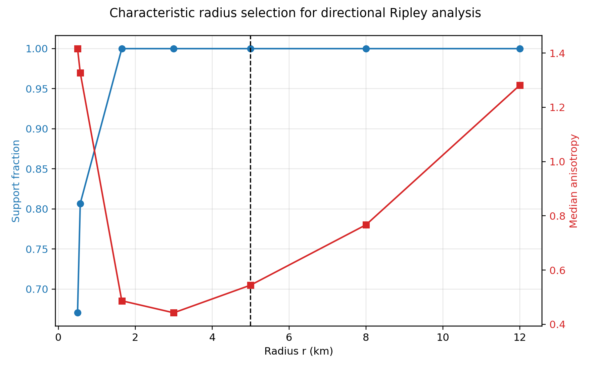
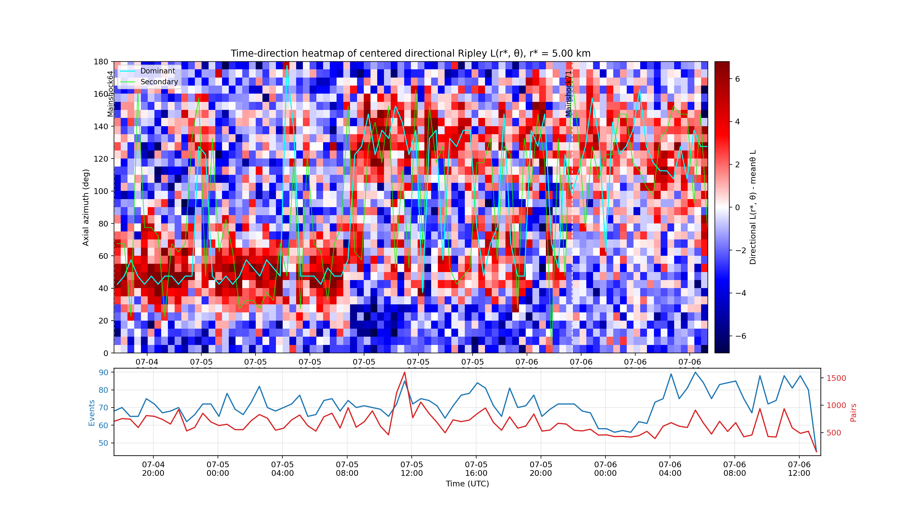
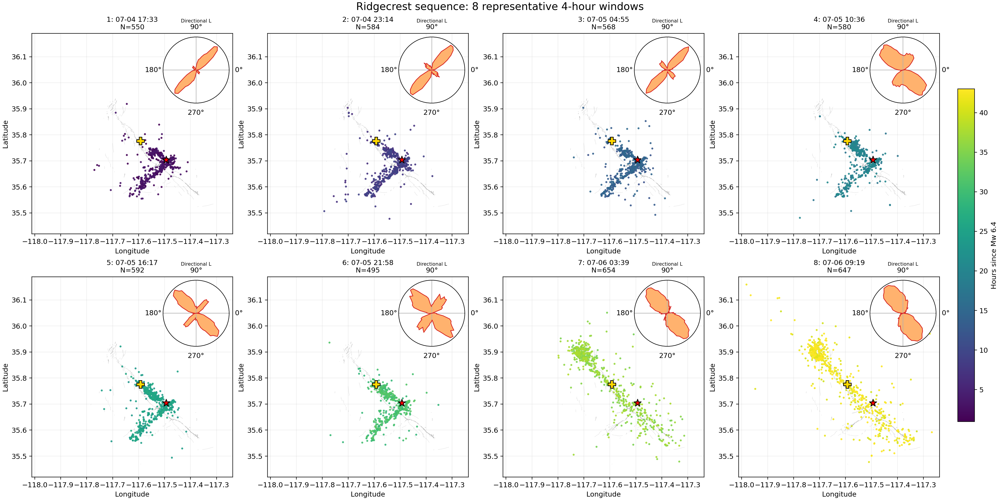
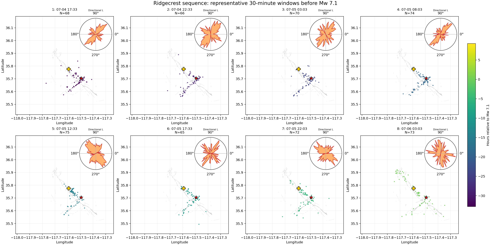

---
author:
- TRACE
title: Spatiotemporal Evolution of the Ridgecrest Earthquake Sequence and Directional Triggering from the Mw 6.4 to Mw 7.1 Mainshock
---

# Abstract

This report investigates the spatiotemporal evolution of the Ridgecrest relocated earthquake catalog from the Mw 6.4 mainshock to 10 hours after the Mw 7.1 mainshock, with emphasis on whether the transition from Mw 6.4 to Mw 7.1 is consistent with organized, fault-guided triggering. The implemented workflow divided the analysis window into 88 half-hour intervals and computed sector-based directional Ripley $`K`$ and $`L`$ statistics in 72 azimuth sectors of $`5^{\circ}`$ each, using a projected local coordinate system (EPSG:32611). A characteristic scale of $`r^{\ast}=0.57`$ km was selected from radius diagnostics because it retained strong anisotropy while improving interval support relative to smaller radii. The main result is that the sequence is strongly anisotropic but not directionally stationary: dominant clustering directions switch repeatedly through the inter-mainshock period, often by $`90^{\circ}`$–$`180^{\circ}`$ between adjacent 30-minute windows, while remaining repeatedly aligned with mapped fault-orientation families. The heatmap and representative map-plus-rose figures show that seismicity occupied the structural corridor linking the two mainshocks immediately after Mw 6.4 and remained localized on the same connected and branching fault system in the lead-up to Mw 7.1. These observations support an interpretation of progressive, structurally complex, fault-guided triggering rather than simple isotropic aftershock decay or monotonic development of a single precursor lineation. The strongest limitations are the short characteristic radius, the absence of formal isotropic edge correction, and variable support among some half-hour intervals; accordingly, the evidence is strongest for relative temporal reorganization and fault-network association rather than formal absolute inference.

# Scientific Objective

The objective of this study is to investigate the spatiotemporal evolution of the Ridgecrest earthquake sequence, with special attention to the triggering relationship between the Mw 6.4 and Mw 7.1 mainshocks. The requested analysis focused on whether the intervening seismicity developed along organized directional families that could indicate stress transfer and activation across a structurally complex fault network.

The report therefore addresses four linked questions:

1.  How was the Ridgecrest sequence distributed in time and space between the two mainshocks and into the early post-Mw 7.1 period?

2.  At what spatial scale is directional clustering most diagnostic in this catalog?

3.  Did the sequence evolve along one stable preferred azimuth, or did it reorganize repeatedly among multiple directions?

4.  Are the observed directional families compatible with mapped Ridgecrest surface-fault orientations, especially in the buildup from Mw 6.4 toward Mw 7.1?

# Data, Study Window, and Implemented Workflow

## Input data

The implemented analysis used the relocated Ridgecrest catalog, a mainshock metadata table, and mapped surface-fault geometry supplied in the project context. The report here summarizes only the products that were actually generated by the completed workflow.

## Study window and intervalization

The analysis window spans from the Mw 6.4 mainshock origin time to 10 hours after the Mw 7.1 mainshock. According to the exported quality-control summary, this corresponds to 2019-07-04 17:33:49 UTC through 2019-07-06 13:19:53 UTC and contains 6,333 catalog events distributed across 88 half-hour intervals. The Mw 7.1 mainshock occurred at 2019-07-06 03:19:53 UTC. These summary values are documented in the machine-readable output files <a href="../exp_run/outputs/01_ridgecrest_directional_ripley_analysis/tables/analysis_qc_summary.csv" class="uri">../exp_run/outputs/01_ridgecrest_directional_ripley_analysis/tables/analysis_qc_summary.csv</a> and <a href="../exp_run/outputs/01_ridgecrest_directional_ripley_analysis/tables/interval_definitions.csv" class="uri">../exp_run/outputs/01_ridgecrest_directional_ripley_analysis/tables/interval_definitions.csv</a>.

## Spatial representation and directional Ripley analysis

The workflow projected epicenters into EPSG:32611 and used mapped fault geometry represented by 17,792 surface-fault segments. Directional Ripley analysis was then computed independently for each 30-minute interval by evaluating event-pair orientations in 72 azimuth bins of width $`5^{\circ}`$ over $`[0^{\circ},360^{\circ})`$. The exported analysis parameters document the following implementation choices:

- sector width: $`5^{\circ}`$;

- number of sectors: 72;

- tested radii: 0.50, 0.57, 1.65, 3.00, 5.00, 8.00, and 12.00 km;

- minimum events per interval: 8;

- minimum pair count required for a valid directional estimate: 20;

- edge treatment: fixed buffered convex-hull study area with no explicit isotropic edge correction;

- azimuth convention: counterclockwise from east, mapped into $`[0,360)`$.

These settings are documented in <a href="../exp_run/outputs/01_ridgecrest_directional_ripley_analysis/tables/analysis_parameters.csv" class="uri">../exp_run/outputs/01_ridgecrest_directional_ripley_analysis/tables/analysis_parameters.csv</a>.

## Characteristic-radius selection

The directional statistics were exported for all tested radii, but headline temporal interpretation used a characteristic radius $`r^{\ast}=0.57`$ km. This selection was not assumed a priori; it was chosen from radius diagnostics balancing directional contrast and interval support. At 0.50 km, support fraction was 0.670 with median anisotropy 2.133; at 0.57 km, support fraction improved to 0.807 while median anisotropy remained high at 1.935; by 1.65 km, support fraction was complete but median anisotropy dropped to 0.620. Thus $`r^{\ast}=0.57`$ km retains strong short-range anisotropy without losing as many time windows as the smallest radius. Figure <a href="#fig:radius" data-reference-type="ref" data-reference="fig:radius">1</a> visualizes this tradeoff.

# Evidence Products Used in This Report

This report is based on the validated outputs in <a href="../exp_run/outputs/01_ridgecrest_directional_ripley_analysis" class="uri">../exp_run/outputs/01_ridgecrest_directional_ripley_analysis</a>. The principal evidence products referenced below are:

- the radius-selection diagnostic figure and table;

- the time–direction heatmap at $`r^{\ast}`$;

- the whole-window 4-hour representative map-plus-rose figure;

- the representative 30-minute map-plus-rose figure nearest Mw 6.4;

- the representative 30-minute map-plus-rose figure nearest Mw 7.1;

- summary and transition tables describing dominant directions, anisotropy strength, and fault-orientation comparisons.

For reproducibility, the complete sector–radius export is available at <a href="../exp_run/outputs/01_ridgecrest_directional_ripley_analysis/tables/directional_ripley_full_interval_radius_sector.csv" class="uri">../exp_run/outputs/01_ridgecrest_directional_ripley_analysis/tables/directional_ripley_full_interval_radius_sector.csv</a>, while the directional $`L`$ matrix at $`r^{\ast}`$ is available at <a href="../exp_run/outputs/01_ridgecrest_directional_ripley_analysis/tables/directional_L_matrix_rstar.csv" class="uri">../exp_run/outputs/01_ridgecrest_directional_ripley_analysis/tables/directional_L_matrix_rstar.csv</a>.

# Results

## Radius diagnostics identify sub-kilometer clustering as the most informative scale

The first result is methodological but scientifically important: the strongest directional organization in this sequence is expressed at short length scales. Figure <a href="#fig:radius" data-reference-type="ref" data-reference="fig:radius">1</a> shows that anisotropy is strongest at the smallest tested radii and declines markedly as the analysis radius broadens. The adopted $`r^{\ast}=0.57`$ km is therefore a compromise scale that still resolves localized fault-controlled clustering while preserving valid support in most intervals.

<figure id="fig:radius" data-latex-placement="H">

<figcaption>Radius-selection diagnostics used to choose the characteristic scale <em>r</em>* = 0.57 km for time-dependent directional analysis. The supporting table is stored at <a href="../exp_run/outputs/01_ridgecrest_directional_ripley_analysis/tables/radius_selection_diagnostics.csv" class="uri">../exp_run/outputs/01_ridgecrest_directional_ripley_analysis/tables/radius_selection_diagnostics.csv</a>.</figcaption>
</figure>

Scientifically, this indicates that the most diagnostic geometry is not broad regional elongation but localized clustering on short fault strands or tightly organized subclusters. That scale dependence is compatible with rupture-proximal or fault-segment-scale activation during the Ridgecrest sequence.

## Directional clustering is strong but highly nonstationary through time

Figure <a href="#fig:heatmap" data-reference-type="ref" data-reference="fig:heatmap">2</a> presents the time–direction heatmap of the directional Ripley $`L`$ statistic at $`r^{\ast}=0.57`$ km. The plot does not show one persistent azimuthal ridge across the analysis window. Instead, high directional clustering appears intermittently in distinct azimuth bands, with dominant and secondary directions shifting repeatedly from one interval to another.

<figure id="fig:heatmap" data-latex-placement="H">

<figcaption>Time–direction heatmap of sector-based directional Ripley <em>L</em> at the characteristic radius <em>r</em>* = 0.57 km. The figure summarizes directional clustering across 88 half-hour intervals and 72 azimuth sectors. The underlying matrix is available at <a href="../exp_run/outputs/01_ridgecrest_directional_ripley_analysis/tables/directional_L_matrix_rstar.csv" class="uri">../exp_run/outputs/01_ridgecrest_directional_ripley_analysis/tables/directional_L_matrix_rstar.csv</a>.</figcaption>
</figure>

This interpretation is supported numerically by the transition table. In the early post-Mw 6.4 intervals, dominant azimuths already vary strongly, including 277.5$`^{\circ}`$, 87.5$`^{\circ}`$, and 32.5$`^{\circ}`$, with anisotropy strengths of approximately 1.30 to 1.88. During the broader inter-mainshock period, many adjacent intervals differ by 75$`^{\circ}`$ to 180$`^{\circ}`$ in dominant direction. The sequence is therefore strongly anisotropic, but the anisotropy migrates among multiple directions rather than stabilizing into one precursor trend.

## The inter-mainshock buildup contains repeated large directional reorganizations

The clearest temporal evidence for complex triggering is found in the inter-mainshock buildup stage. The transition table contains many windows in which dominant azimuth changes are large while anisotropy remains strong, indicating genuine reorganization rather than simple loss of clustering. Representative examples include:

- interval 10 (2019-07-04 22:33 UTC): dominant azimuth 222.5$`^{\circ}`$, change 135$`^{\circ}`$, anisotropy 2.097;

- interval 11 (2019-07-04 23:03 UTC): dominant azimuth 77.5$`^{\circ}`$, change 145$`^{\circ}`$, anisotropy 1.766;

- interval 15 (2019-07-05 01:03 UTC): dominant azimuth 352.5$`^{\circ}`$, change 130$`^{\circ}`$, anisotropy 2.923;

- interval 22 (2019-07-05 04:33 UTC): dominant azimuth 7.5$`^{\circ}`$, change 180$`^{\circ}`$, anisotropy 1.931;

- interval 30 (2019-07-05 08:33 UTC): dominant azimuth 142.5$`^{\circ}`$, change 140$`^{\circ}`$, anisotropy 3.012.

These repeated directional jumps are inconsistent with a simple model in which aftershocks merely diffuse outward from Mw 6.4 with a single stable alignment. Instead, they indicate alternating activation among multiple directional families, likely reflecting segmentation, branching, or conjugate behavior within the Ridgecrest fault system.

## Dominant clustering directions repeatedly coincide with mapped fault-orientation families

A crucial test for the triggering interpretation is whether the directional families inferred from seismic clustering correspond to mapped fault orientations. The exported fault-family table shows strongest mapped-fault weights near 122.5$`^{\circ}`$, 127.5$`^{\circ}`$, 87.5$`^{\circ}`$, 117.5$`^{\circ}`$, 97.5$`^{\circ}`$, 132.5$`^{\circ}`$, and secondary families near 57.5$`^{\circ}`$/52.5$`^{\circ}`$. The directional summaries and representative-window summaries repeatedly return dominant or secondary azimuths in these same families or their 180$`^{\circ}`$ equivalents.

That concordance matters because lineation directions are axial, not vectorial: for example, 297.5$`^{\circ}`$ and 117.5$`^{\circ}`$ represent the same lineation family. Immediate post-Mw 6.4 windows already include directions such as 87.5$`^{\circ}`$, 117.5$`^{\circ}`$, and 52.5$`^{\circ}`$, and later representative windows include families such as 142.5$`^{\circ}`$, 257.5$`^{\circ}`$, 297.5$`^{\circ}`$, and 147.5$`^{\circ}`$, many of which remain close to the principal mapped families after accounting for 180$`^{\circ}`$ symmetry. This supports a fault-guided interpretation rather than arbitrary azimuthal variability.

## Whole-window representative panels show evolution toward a more coherent NW–SE corridor

The whole-window 4-hour representative figure in Figure <a href="#fig:whole" data-reference-type="ref" data-reference="fig:whole">3</a> shows the broad spatiotemporal evolution of seismicity across the full study interval. Early windows are more compact and geometrically branched, centered around the southern to central part of the sequence. Later windows expand into a more throughgoing NW–SE corridor that spans and extends beyond the two mainshock epicenters.

<figure id="fig:whole" data-latex-placement="p">

<figcaption>Eight representative 4-hour windows spanning the full analysis interval. Each panel combines an epicentral map with an inset polar rose diagram summarizing directional clustering intensity from sector-based Ripley analysis. Window definitions are documented in <a href="../exp_run/outputs/01_ridgecrest_directional_ripley_analysis/tables/representative_windows.csv" class="uri">../exp_run/outputs/01_ridgecrest_directional_ripley_analysis/tables/representative_windows.csv</a>.</figcaption>
</figure>

The representative-window summary indicates that these 4-hour windows contain roughly 495–654 events each, with pair counts at $`r^{\ast}`$ between 1,110 and 3,310. Dominant azimuths vary among windows, but anisotropy strength increases modestly from about 0.09–0.13 in earlier windows to approximately 0.16–0.21 in later windows. This suggests that the larger-scale sequence becomes progressively more corridor-like through time, even though short-interval directional switching persists.

## Immediately after Mw 6.4, seismicity already occupies the corridor toward the future Mw 7.1 zone

Figure <a href="#fig:near64" data-reference-type="ref" data-reference="fig:near64">4</a> shows eight representative 30-minute windows after the Mw 6.4 mainshock. The important observation is not simply that aftershocks occur after Mw 6.4, but that they are spatially organized from the outset along the structural corridor connecting the two eventual mainshocks, with repeated concentration near the future Mw 7.1 area and a southward branch emerging near that northern cluster.

<figure id="fig:near64" data-latex-placement="p">

<figcaption>Representative 30-minute windows after the Mw 6.4 mainshock, combining epicentral maps and inset rose diagrams of directional clustering. Mainshock epicenters are overlaid in each panel. The selected windows and directional summaries are documented in <a href="../exp_run/outputs/01_ridgecrest_directional_ripley_analysis/tables/representative_windows.csv" class="uri">../exp_run/outputs/01_ridgecrest_directional_ripley_analysis/tables/representative_windows.csv</a> and <a href="../exp_run/outputs/01_ridgecrest_directional_ripley_analysis/tables/representative_window_directional_summary.csv" class="uri">../exp_run/outputs/01_ridgecrest_directional_ripley_analysis/tables/representative_window_directional_summary.csv</a>.</figcaption>
</figure>

The representative windows span from 0 to about 67 hours after Mw 6.4. Directional strengths are high in these windows, including about 1.750 in the first window and above 2 in later examples, with event counts typically around 65–75 per selected 30-minute panel. The fact that the future Mw 7.1 region is already embedded within the organized post-Mw 6.4 corridor argues against a last-minute, isolated nucleation and instead favors progressive transfer through an already activated network.

## In the lead-up to Mw 7.1, activity remains localized on the same fault-linked system

Figure <a href="#fig:near71" data-reference-type="ref" data-reference="fig:near71">5</a> provides the complementary view for representative windows before the Mw 7.1 mainshock. The panels show continued concentration of seismicity within the connecting NW–SE band and recurrent clustering near the eventual Mw 7.1 epicenter, together with a south-southwest branch close to that location. The activity does not become broadly diffuse away from the fault network before the mainshock; instead, it remains structurally localized.

<figure id="fig:near71" data-latex-placement="p">

<figcaption>Representative 30-minute windows leading up to the Mw 7.1 mainshock, shown as epicentral maps with inset directional rose diagrams. The persistent structural localization near the future Mw 7.1 rupture region is a key qualitative result.</figcaption>
</figure>

The transition table further shows that directional reorganization continued right up to the mainshock. For example, interval 65 at 2019-07-06 02:03 UTC, categorized as `immediate_pre_71`, has dominant azimuth 62.5$`^{\circ}`$, change 175$`^{\circ}`$, and anisotropy 2.376. Large transitions continue after Mw 7.1 as well, indicating that the fault system remained dynamically reorganizing through and beyond the mainshock itself.

# Interpretation: Implications for Triggering from Mw 6.4 to Mw 7.1

Taken together, the evidence supports a specific interpretation of the Ridgecrest sequence.

First, the sequence is strongly directional at short scales, so the event pattern is not well described as isotropic aftershock decay. Second, the dominant direction is not stable; instead, it switches repeatedly among several azimuth families. Third, those families repeatedly coincide with mapped fault-orientation families. Fourth, the representative maps show that seismicity occupied the corridor linking the two mainshocks immediately after Mw 6.4 and remained concentrated within that connected and branching structural system through the lead-up to Mw 7.1.

The most defensible inference is therefore that the transition from Mw 6.4 to Mw 7.1 involved progressive, fault-guided triggering on a structurally complex network rather than propagation along one simple, steadily evolving precursor line. The repeated $`90^{\circ}`$–$`180^{\circ}`$ directional jumps suggest episodic switching among multiple active fault strands or cluster geometries. The persistent occupation of the eventual Mw 7.1 area after Mw 6.4 indicates that the future rupture zone was already part of the activated seismic corridor well before the larger mainshock occurred.

This evidence is consistent with distributed stress transfer or cascading interaction across segmented and branching faults. It is less consistent with a model in which Mw 7.1 appears independently of the Mw 6.4-driven sequence, and also less consistent with a single monotonic directional migration from south to north. The behavior is more complex: the system reorganizes repeatedly, but within a fault-controlled set of permissible orientations and locations.

# Methodological Limitations and Confidence

The analysis products are complete and internally validated, but several limitations affect interpretation.

1.  **Short characteristic radius.** The selected radius $`r^{\ast}=0.57`$ km emphasizes localized clustering and is appropriate for identifying short-range structural anisotropy, but it may underrepresent broader-scale directional coherence. This limitation is partly mitigated by the full export of all radius–sector results in <a href="../exp_run/outputs/01_ridgecrest_directional_ripley_analysis/tables/directional_ripley_full_interval_radius_sector.csv" class="uri">../exp_run/outputs/01_ridgecrest_directional_ripley_analysis/tables/directional_ripley_full_interval_radius_sector.csv</a>.

2.  **Edge treatment.** The study area used a fixed buffered convex hull without formal isotropic edge correction. Consequently, absolute $`K/L`$ amplitudes and some directional contrasts near boundaries may be biased. The strongest inferences are therefore relative temporal comparisons and pattern evolution, not absolute directional intensities.

3.  **Variable interval support.** Not every half-hour interval has equally strong support at $`r^{\ast}`$. Some intervals are invalid or relatively sparse, so rapid directional jumps should be interpreted together with pair counts and anisotropy strength rather than in isolation.

4.  **Representative figures are selective.** The map-plus-rose panels illustrate the evolution effectively, but they show representative subsets of windows rather than every interval. Exhaustive temporal interpretation should rely on the heatmap and the exported tables as the primary record.

5.  **Fault-control evidence is associative.** Alignment with fault families is strong and repeatedly observed, but the present workflow did not perform a formal null-hypothesis test of direction–fault coincidence. Thus the fault-guided triggering interpretation is persuasive but not statistically definitive in a strict hypothesis-testing sense.

Overall delivery status is complete, and the evidence quality is best characterized as *moderate scientific confidence*: the workflow is successful and internally consistent, the major figures and tables agree with one another, and the limitations mainly constrain how strongly the results should be framed rather than overturning the central pattern.

# Reproducibility and Key Output Locations

The main machine-readable outputs used in this report are listed in Table <a href="#tab:outputs" data-reference-type="ref" data-reference="tab:outputs">1</a>. All paths are absolute and correspond to the validated task output directory.

| Artifact | Absolute path |
|:---|:---|
| Quality-control summary | <a href="../exp_run/outputs/01_ridgecrest_directional_ripley_analysis/tables/analysis_qc_summary.csv" class="uri">../exp_run/outputs/01_ridgecrest_directional_ripley_analysis/tables/analysis_qc_summary.csv</a> |
| Analysis parameters | <a href="../exp_run/outputs/01_ridgecrest_directional_ripley_analysis/tables/analysis_parameters.csv" class="uri">../exp_run/outputs/01_ridgecrest_directional_ripley_analysis/tables/analysis_parameters.csv</a> |
| Radius diagnostics table | <a href="../exp_run/outputs/01_ridgecrest_directional_ripley_analysis/tables/radius_selection_diagnostics.csv" class="uri">../exp_run/outputs/01_ridgecrest_directional_ripley_analysis/tables/radius_selection_diagnostics.csv</a> |
| Directional transition intervals | <a href="../exp_run/outputs/01_ridgecrest_directional_ripley_analysis/tables/directional_transition_intervals.csv" class="uri">../exp_run/outputs/01_ridgecrest_directional_ripley_analysis/tables/directional_transition_intervals.csv</a> |
| Fault orientation families | <a href="../exp_run/outputs/01_ridgecrest_directional_ripley_analysis/tables/fault_orientation_families.csv" class="uri">../exp_run/outputs/01_ridgecrest_directional_ripley_analysis/tables/fault_orientation_families.csv</a> |
| Mainshock metadata | <a href="../exp_run/outputs/01_ridgecrest_directional_ripley_analysis/tables/mainshock_metadata.csv" class="uri">../exp_run/outputs/01_ridgecrest_directional_ripley_analysis/tables/mainshock_metadata.csv</a> |
| Directional $`L`$ matrix at $`r^{\ast}`$ | <a href="../exp_run/outputs/01_ridgecrest_directional_ripley_analysis/tables/directional_L_matrix_rstar.csv" class="uri">../exp_run/outputs/01_ridgecrest_directional_ripley_analysis/tables/directional_L_matrix_rstar.csv</a> |
| Full interval–radius–sector table | <a href="../exp_run/outputs/01_ridgecrest_directional_ripley_analysis/tables/directional_ripley_full_interval_radius_sector.csv" class="uri">../exp_run/outputs/01_ridgecrest_directional_ripley_analysis/tables/directional_ripley_full_interval_radius_sector.csv</a> |
| Heatmap figure | <a href="../exp_run/outputs/01_ridgecrest_directional_ripley_analysis/figures/time_direction_heatmap_rstar.png" class="uri">../exp_run/outputs/01_ridgecrest_directional_ripley_analysis/figures/time_direction_heatmap_rstar.png</a> |
| Whole-window map-plus-rose figure | <a href="../exp_run/outputs/01_ridgecrest_directional_ripley_analysis/figures/map_rose_whole_window_4h.png" class="uri">../exp_run/outputs/01_ridgecrest_directional_ripley_analysis/figures/map_rose_whole_window_4h.png</a> |
| Near-Mw 6.4 map-plus-rose figure | <a href="../exp_run/outputs/01_ridgecrest_directional_ripley_analysis/figures/map_rose_near_mainshock64.png" class="uri">../exp_run/outputs/01_ridgecrest_directional_ripley_analysis/figures/map_rose_near_mainshock64.png</a> |
| Near-Mw 7.1 map-plus-rose figure | <a href="../exp_run/outputs/01_ridgecrest_directional_ripley_analysis/figures/map_rose_near_mainshock71.png" class="uri">../exp_run/outputs/01_ridgecrest_directional_ripley_analysis/figures/map_rose_near_mainshock71.png</a> |

Key evidence products used in this report.

# Conclusions

The completed directional Ripley analysis provides coherent evidence that the Ridgecrest earthquake sequence from the Mw 6.4 mainshock to 10 hours after the Mw 7.1 mainshock was both strongly anisotropic and temporally dynamic. The most informative clustering occurs at sub-kilometer scale, with $`r^{\ast}=0.57`$ km providing the best tradeoff between anisotropy strength and interval support. Through time, dominant clustering directions change repeatedly, especially during the inter-mainshock buildup, often by large angles while anisotropy remains strong. These shifts are not random: they repeatedly align with mapped fault-orientation families and occur within a persistent structural corridor linking the two mainshocks.

The observational evidence therefore supports the following interpretation: Mw 7.1 was preceded by progressive activation of a structurally complex, fault-linked seismic corridor already engaged immediately after Mw 6.4. The triggering pathway from Mw 6.4 to Mw 7.1 is best described as distributed and fault-guided, involving switching among multiple active directional families rather than development of a single stable precursor lineation. This conclusion should nevertheless be framed with moderate confidence because the analysis emphasizes short scales, uses no explicit isotropic edge correction, and includes some intervals with lower directional support.
