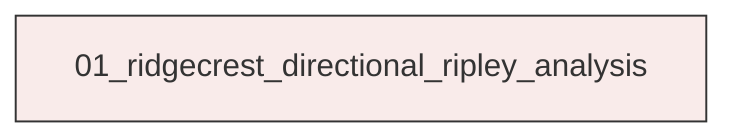
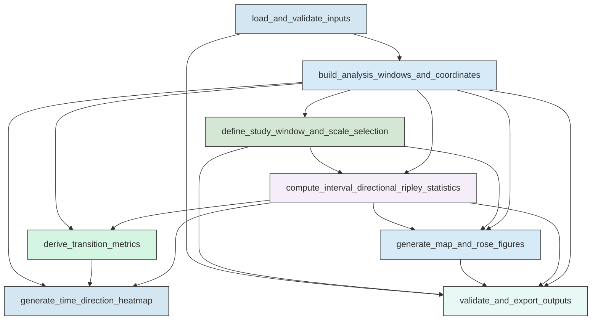

# Workflow Overview

## Top-Level Task Dependencies

**Description:**
- `01_ridgecrest_directional_ripley_analysis`: Build the Ridgecrest analysis dataset, compute directional Ripley K and L statistics through time, derive transition metrics, generate the requested figures, and export validated machine-readable outputs.

## Subtask Dependencies

#### 01_ridgecrest_directional_ripley_analysis
**Usage**: Build the Ridgecrest analysis dataset, compute directional Ripley K and L statistics through time, derive transition metrics, generate the requested figures, and export validated machine-readable outputs.

**Description:**
- `load_and_validate_inputs`: Load the catalog, mainshock table, and fault polylines and validate their schema and required fields.
- `build_analysis_windows_and_coordinates`: Define the fixed analysis window, assign 30-minute intervals, create representative windows, and project coordinates for pair calculations.
- `define_study_window_and_scale_selection`: Define the fixed study region, normalization protocol, candidate radii, and characteristic radius used across all directional analyses.
- `compute_interval_directional_ripley_statistics`: Compute interval-wise sector-based directional Ripley K and L statistics in parallel and summarize dominant directional features.
- `derive_transition_metrics`: Derive temporal directional metrics and compare them with mainshock-to-mainshock alignment and fault orientation families.
- `generate_time_direction_heatmap`: Build the requested time-direction heatmap and aligned support timeline products from the characteristic-scale directional matrix.
- `generate_map_and_rose_figures`: Create the three requested 2x4 map-plus-polar-rose figure families and compute exact window-level directional summaries where needed.
- `validate_and_export_outputs`: Validate merged dimensions and consistency across all products and export reusable machine-readable tables and logs.