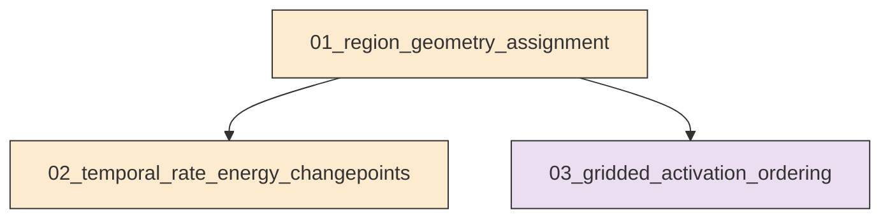
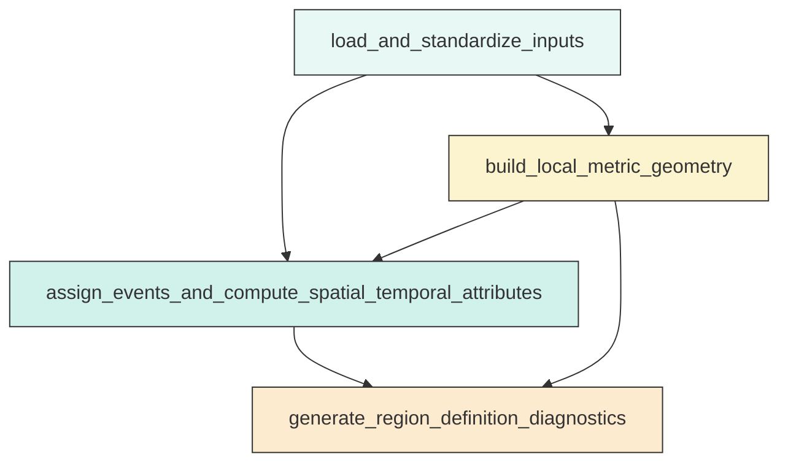
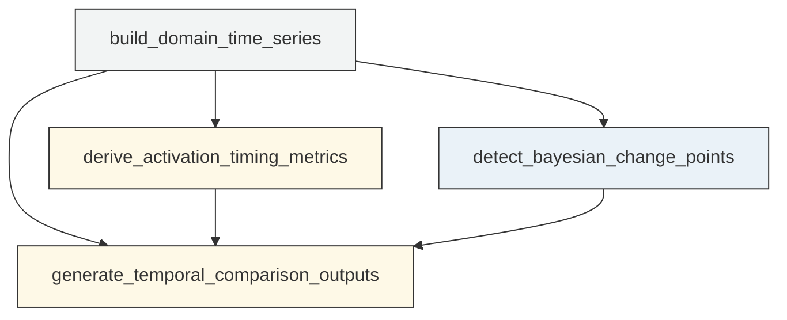
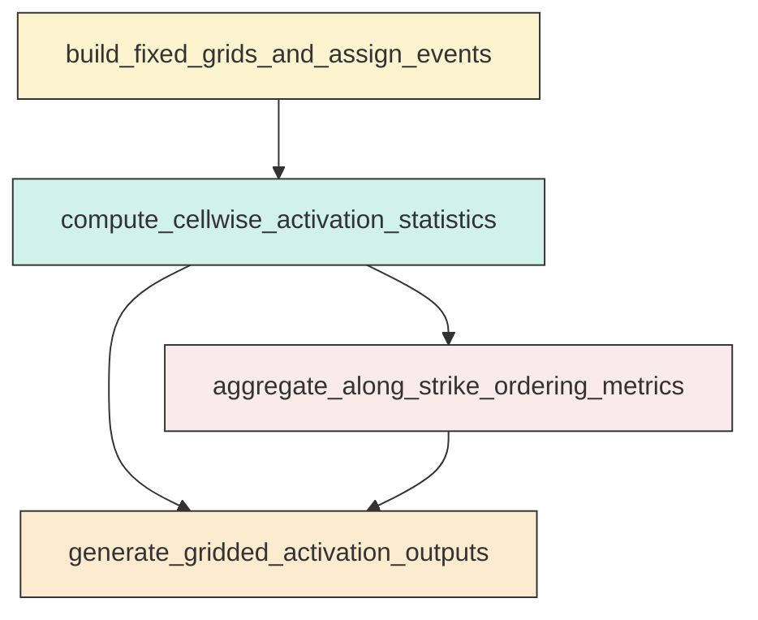

# Research Codings

## Task Overview


**Description:**
- `01_region_geometry_assignment`: Build the fixed local metric geometry, assign events to corridors and diagnostic neighborhoods, and generate region-definition quality-control outputs.
- `02_temporal_rate_energy_changepoints`: Construct domain-scale rate and energy time series, extract timing diagnostics, and run Bayesian change-point analysis for corridor and neighborhood domains.
- `03_gridded_activation_ordering`: Compute gridded corridor and neighborhood activation statistics and resolve internal spatial ordering before the Mw 7.1 mainshock.


## Task Details


#### 01_region_geometry_assignment
**Usage**: Build the fixed local metric geometry, assign events to corridors and diagnostic neighborhoods, and generate region-definition quality-control outputs.

**Description:**
- `load_and_standardize_inputs`: Load the relocated catalog, mainshock table, and fault traces and standardize required fields.
- `build_local_metric_geometry`: Construct one shared local metric coordinate system and fixed corridor and circle geometries for all spatial calculations.
- `assign_events_and_compute_spatial_temporal_attributes`: Compute projected coordinates, relative times, distances, along-strike and across-strike coordinates, and independent boolean domain masks for each event.
- `generate_region_definition_diagnostics`: Produce assignment summaries and diagnostic figures for corridor coverage, along-strike span, and unassigned-event distribution.

#### Coding Script

```python

from __future__ import annotations

import json
import math
import shutil
import sys
import traceback
from dataclasses import dataclass
from pathlib import Path

import matplotlib
matplotlib.use("Agg")
import matplotlib.pyplot as plt
import numpy as np
import pandas as pd
from matplotlib.colors import Normalize
from matplotlib.patches import Circle
from pyproj import CRS, Transformer


REQUIRED_CATALOG_COLUMNS = ["event_time", "latitude", "longitude", "depth_km", "magnitude"]
REQUIRED_MAINSHOCK_COLUMNS = ["event_time", "latitude", "longitude", "depth_km", "magnitude"]
REQUIRED_EVENT_OUTPUT_COLUMNS = [
    "event_time",
    "latitude",
    "longitude",
    "depth_km",
    "magnitude",
    "x_km",
    "y_km",
    "energy_joule",
    "hours_since_main64",
    "hours_to_main71",
    "is_all_region",
    "Region_A_along_km",
    "Region_A_across_km",
    "in_Region_A",
    "Region_B_along_km",
    "Region_B_across_km",
    "in_Region_B",
    "dist_to_main64_km",
    "dist_to_main71_km",
    "in_Mw64_neighborhood",
    "in_Mw71_neighborhood",
    "in_corridor_overlap",
    "unassigned_to_corridors",
    "display_assignment_class",
]


CATALOG_PATH = Path("<REPO_ROOT>/examples/ridgecrest/data/catalog_TRACE/TRACE_ridgecrest_relocated.csv")
MAINSHOCK_PATH = Path("<REPO_ROOT>/examples/ridgecrest/data/catalog_TRACE/main_shock_events.csv")
FAULT_PATH = Path("<REPO_ROOT>/examples/ridgecrest/data/faults/ridgecrest_surface_faults.json")
OUTPUT_DIR = Path("../exp_run/outputs/01_region_geometry_assignment")

REGION_A = {
    "name": "Region_A",
    "strike_deg": 39.0,
    "start_lon": -117.635877,
    "start_lat": 35.555024,
    "end_lon": -117.463113,
    "end_lat": 35.729199,
    "half_width_km": 3.0,
}
REGION_B = {
    "name": "Region_B",
    "strike_deg": 138.0,
    "start_lon": -117.735813,
    "start_lat": 35.897499,
    "end_lon": -117.362520,
    "end_lat": 35.559488,
    "half_width_km": 3.0,
}
NEIGHBORHOOD_RADIUS_KM = 10.0
DISPLAY_CLASS_ORDER = ["Region A only", "Region B only", "Overlap A&B", "Unassigned"]


@dataclass
class Corridor:
    name: str
    strike_deg: float
    half_width_km: float
    start_lon: float
    start_lat: float
    end_lon: float
    end_lat: float
    start_x_km: float
    start_y_km: float
    end_x_km: float
    end_y_km: float
    length_km: float
    ux: float
    uy: float
    vx: float
    vy: float
    boundary_xy: np.ndarray


def log(message: str) -> None:
    print(message, flush=True)


def reset_output_dir(output_dir: Path) -> None:
    if output_dir.exists():
        shutil.rmtree(output_dir)
    output_dir.mkdir(parents=True, exist_ok=True)
    (output_dir / "figures").mkdir(exist_ok=True)
    (output_dir / "tables").mkdir(exist_ok=True)
    (output_dir / "metadata").mkdir(exist_ok=True)


def build_local_transformer(center_lon: float, center_lat: float) -> tuple[Transformer, CRS]:
    proj4 = f"+proj=aeqd +lat_0={center_lat} +lon_0={center_lon} +datum=WGS84 +units=m +no_defs"
    crs_local = CRS.from_proj4(proj4)
    transformer = Transformer.from_crs("EPSG:4326", crs_local, always_xy=True)
    return transformer, crs_local


def project_lonlat(transformer: Transformer, lon: np.ndarray, lat: np.ndarray) -> tuple[np.ndarray, np.ndarray]:
    x_m, y_m = transformer.transform(lon, lat)
    return np.asarray(x_m) / 1000.0, np.asarray(y_m) / 1000.0


def make_corridor(defn: dict, transformer: Transformer) -> Corridor:
    sx, sy = project_lonlat(transformer, np.array([defn["start_lon"]]), np.array([defn["start_lat"]]))
    ex, ey = project_lonlat(transformer, np.array([defn["end_lon"]]), np.array([defn["end_lat"]]))
    sx = float(sx[0])
    sy = float(sy[0])
    ex = float(ex[0])
    ey = float(ey[0])
    dx = ex - sx
    dy = ey - sy
    length = float(math.hypot(dx, dy))
    ux = dx / length
    uy = dy / length
    vx = -uy
    vy = ux
    hw = defn["half_width_km"]
    boundary = np.array([
        [sx + vx * hw, sy + vy * hw],
        [ex + vx * hw, ey + vy * hw],
        [ex - vx * hw, ey - vy * hw],
        [sx - vx * hw, sy - vy * hw],
        [sx + vx * hw, sy + vy * hw],
    ])
    return Corridor(
        name=defn["name"],
        strike_deg=defn["strike_deg"],
        half_width_km=hw,
        start_lon=defn["start_lon"],
        start_lat=defn["start_lat"],
        end_lon=defn["end_lon"],
        end_lat=defn["end_lat"],
        start_x_km=sx,
        start_y_km=sy,
        end_x_km=ex,
        end_y_km=ey,
        length_km=length,
        ux=ux,
        uy=uy,
        vx=vx,
        vy=vy,
        boundary_xy=boundary,
    )


def compute_corridor_coordinates(df: pd.DataFrame, corridor: Corridor) -> pd.DataFrame:
    rx = df["x_km"].to_numpy() - corridor.start_x_km
    ry = df["y_km"].to_numpy() - corridor.start_y_km
    along = rx * corridor.ux + ry * corridor.uy
    across = rx * corridor.vx + ry * corridor.vy
    assigned = (along >= 0.0) & (along <= corridor.length_km) & (np.abs(across) <= corridor.half_width_km)
    return pd.DataFrame(
        {
            f"{corridor.name}_along_km": along,
            f"{corridor.name}_across_km": across,
            f"in_{corridor.name}": assigned,
        },
        index=df.index,
    )


def magnitude_to_energy_joule(magnitude: pd.Series) -> pd.Series:
    return np.power(10.0, 1.5 * magnitude.astype(float) + 4.8)


def load_fault_traces() -> list[np.ndarray]:
    with FAULT_PATH.open("r", encoding="utf-8") as f:
        raw = json.load(f)
    traces = []
    for trace in raw:
        arr = np.asarray(trace, dtype=float)
        if arr.ndim == 2 and arr.shape[1] == 2 and arr.shape[0] >= 2:
            traces.append(arr)
    return traces


def require_columns(df: pd.DataFrame, required_columns: list[str], table_name: str) -> None:
    missing = [col for col in required_columns if col not in df.columns]
    if missing:
        raise ValueError(f"Missing required columns in {table_name}: {missing}")


def validate_mainshock_table(df: pd.DataFrame) -> None:
    require_columns(df, REQUIRED_MAINSHOCK_COLUMNS, "mainshock table")
    if not np.isfinite(df["magnitude"]).all():
        raise ValueError("Mainshock table contains non-finite magnitude values.")


def select_mainshocks(df: pd.DataFrame) -> tuple[pd.Series, pd.Series]:
    mag64 = df.loc[np.isclose(df["magnitude"], 6.4)].sort_values("event_time")
    mag71 = df.loc[np.isclose(df["magnitude"], 7.1)].sort_values("event_time")
    if mag64.empty or mag71.empty:
        raise ValueError("Mainshock table must contain one Mw 6.4 row and one Mw 7.1 row.")
    row64 = mag64.iloc[0]
    row71 = mag71.iloc[0]
    if pd.Timestamp(row64["event_time"]) >= pd.Timestamp(row71["event_time"]):
        raise ValueError("Mw 6.4 event time must precede Mw 7.1 event time.")
    return row64, row71


def save_metadata(output_dir: Path, crs_local: CRS, main64: pd.Series, main71: pd.Series, corridor_a: Corridor, corridor_b: Corridor) -> None:
    meta = {
        "local_crs_wkt": crs_local.to_wkt(),
        "neighborhood_radius_km": NEIGHBORHOOD_RADIUS_KM,
        "region_a": {
            "strike_deg": corridor_a.strike_deg,
            "half_width_km": corridor_a.half_width_km,
            "length_km": corridor_a.length_km,
            "start_lon": corridor_a.start_lon,
            "start_lat": corridor_a.start_lat,
            "end_lon": corridor_a.end_lon,
            "end_lat": corridor_a.end_lat,
        },
        "region_b": {
            "strike_deg": corridor_b.strike_deg,
            "half_width_km": corridor_b.half_width_km,
            "length_km": corridor_b.length_km,
            "start_lon": corridor_b.start_lon,
            "start_lat": corridor_b.start_lat,
            "end_lon": corridor_b.end_lon,
            "end_lat": corridor_b.end_lat,
        },
        "mainshock64": {
            "event_time": str(main64["event_time"]),
            "longitude": float(main64["longitude"]),
            "latitude": float(main64["latitude"]),
            "magnitude": float(main64["magnitude"]),
        },
        "mainshock71": {
            "event_time": str(main71["event_time"]),
            "longitude": float(main71["longitude"]),
            "latitude": float(main71["latitude"]),
            "magnitude": float(main71["magnitude"]),
        },
        "notes": [
            "Corridor membership is based on finite-segment projection and 3 km half-width.",
            "Mw6.4-neighborhood and Mw7.1-neighborhood are fixed 10 km radius circles in local metric coordinates.",
            "Display figures may use an exclusive assignment class for symbol styling, but boolean masks remain independent.",
        ],
    }
    with (output_dir / "metadata" / "region_geometry_metadata.json").open("w", encoding="utf-8") as f:
        json.dump(meta, f, indent=2)


def setup_map_axes(ax: plt.Axes, title: str, xlabel: str = "Local x (km)", ylabel: str = "Local y (km)") -> None:
    ax.set_title(title)
    ax.set_xlabel(xlabel)
    ax.set_ylabel(ylabel)
    ax.set_aspect("equal", adjustable="box")
    ax.grid(True, alpha=0.2)


def plot_assignment_map(df: pd.DataFrame, fault_traces_xy: list[np.ndarray], main64: pd.Series, main71: pd.Series, corridor_a: Corridor, corridor_b: Corridor, output_path: Path) -> None:
    fig, ax = plt.subplots(figsize=(11, 10))
    for arr in fault_traces_xy:
        ax.plot(arr[:, 0], arr[:, 1], color="0.75", linewidth=0.35, alpha=0.5, zorder=1)

    mask_after64 = df["hours_since_main64"] >= 0.0
    norm = Normalize(vmin=0.0, vmax=max(1.0, float(df.loc[mask_after64, "hours_since_main64"].max()) if mask_after64.any() else 1.0))
    classes = {
        "Region A only": (df["in_Region_A"] & ~df["in_Region_B"], "o", 18),
        "Region B only": (df["in_Region_B"] & ~df["in_Region_A"], "^", 18),
        "Overlap A&B": (df["in_Region_A"] & df["in_Region_B"], "s", 22),
        "Unassigned": (~df["in_Region_A"] & ~df["in_Region_B"], ".", 8),
    }
    scatter_ref = None
    for label in DISPLAY_CLASS_ORDER:
        mask, marker, size = classes[label]
        subset = df.loc[mask]
        if subset.empty:
            continue
        scatter_ref = ax.scatter(
            subset["x_km"],
            subset["y_km"],
            c=np.clip(subset["hours_since_main64"], a_min=0.0, a_max=None),
            cmap="viridis",
            norm=norm,
            s=size,
            marker=marker,
            linewidths=0.15,
            edgecolors="black" if label != "Unassigned" else "none",
            alpha=0.8 if label != "Unassigned" else 0.55,
            label=label,
            zorder=2 if label == "Unassigned" else 3,
        )

    for corridor, color in [(corridor_a, "tab:red"), (corridor_b, "tab:blue")]:
        ax.plot([corridor.start_x_km, corridor.end_x_km], [corridor.start_y_km, corridor.end_y_km], color=color, linewidth=2.2, label=f"{corridor.name} centerline", zorder=4)
        ax.plot(corridor.boundary_xy[:, 0], corridor.boundary_xy[:, 1], color=color, linestyle="--", linewidth=1.5, label=f"{corridor.name} 6 km corridor", zorder=4)

    for series, color, label in [(main64, "gold", "Mw 6.4"), (main71, "orange", "Mw 7.1")]:
        circle = Circle((series["x_km"], series["y_km"]), NEIGHBORHOOD_RADIUS_KM, fill=False, color=color, linewidth=2.0, linestyle=":", zorder=5)
        ax.add_patch(circle)
        ax.scatter(series["x_km"], series["y_km"], marker="*", s=220, color=color, edgecolor="black", linewidth=0.8, zorder=6)
        ax.text(series["x_km"] + 0.7, series["y_km"] + 0.7, label, fontsize=10, weight="bold", zorder=6)

    if scatter_ref is not None:
        cbar = fig.colorbar(scatter_ref, ax=ax, shrink=0.82)
        cbar.set_label("Hours since Mw 6.4 mainshock")
    setup_map_axes(ax, "Fixed-corridor assignment map with faults, centerlines, 6 km corridors, and 10 km neighborhoods")
    ax.legend(loc="best", fontsize=8, ncol=2)
    fig.tight_layout()
    fig.savefig(output_path, dpi=220)
    plt.close(fig)


def plot_distance_distributions(df: pd.DataFrame, corridor: Corridor, output_path: Path) -> None:
    mask = df[f"in_{corridor.name}"]
    values = df.loc[mask, f"{corridor.name}_across_km"].to_numpy()
    fig, ax = plt.subplots(figsize=(8, 4.8))
    if values.size > 0:
        bins = np.linspace(-corridor.half_width_km, corridor.half_width_km, 31)
        ax.hist(values, bins=bins, color="0.4", edgecolor="white")
    ax.axvline(-corridor.half_width_km, color="tab:red", linestyle="--", linewidth=1.5, label="-3 km half-width")
    ax.axvline(corridor.half_width_km, color="tab:red", linestyle="--", linewidth=1.5, label="+3 km half-width")
    ax.set_title(f"{corridor.name} across-centerline distance distribution")
    ax.set_xlabel("Perpendicular distance to centerline (km)")
    ax.set_ylabel("Assigned event count")
    ax.grid(True, alpha=0.2)
    ax.legend()
    fig.tight_layout()
    fig.savefig(output_path, dpi=220)
    plt.close(fig)


def plot_along_distributions(df: pd.DataFrame, corridor: Corridor, output_path: Path) -> None:
    mask = df[f"in_{corridor.name}"]
    values = df.loc[mask, f"{corridor.name}_along_km"].to_numpy()
    fig, ax = plt.subplots(figsize=(8, 4.8))
    if values.size > 0:
        bins = np.linspace(0.0, corridor.length_km, 41)
        ax.hist(values, bins=bins, color="0.35", edgecolor="white")
    ax.axvline(0.0, color="tab:blue", linestyle="--", linewidth=1.5, label="Centerline start")
    ax.axvline(corridor.length_km, color="tab:blue", linestyle="--", linewidth=1.5, label="Centerline end")
    ax.set_title(f"{corridor.name} along-strike coordinate distribution")
    ax.set_xlabel("Along-strike distance from centerline start (km)")
    ax.set_ylabel("Assigned event count")
    ax.grid(True, alpha=0.2)
    ax.legend()
    fig.tight_layout()
    fig.savefig(output_path, dpi=220)
    plt.close(fig)


def plot_unassigned_map(df: pd.DataFrame, fault_traces_xy: list[np.ndarray], corridor_a: Corridor, corridor_b: Corridor, main64: pd.Series, main71: pd.Series, output_path: Path) -> None:
    fig, ax = plt.subplots(figsize=(11, 10))
    for arr in fault_traces_xy:
        ax.plot(arr[:, 0], arr[:, 1], color="0.8", linewidth=0.35, alpha=0.6, zorder=1)
    unassigned = df.loc[~df["in_Region_A"] & ~df["in_Region_B"]]
    assigned = df.loc[df["in_Region_A"] | df["in_Region_B"]]
    if not assigned.empty:
        ax.scatter(assigned["x_km"], assigned["y_km"], s=8, color="lightgrey", alpha=0.35, label="Assigned to A and/or B", zorder=2)
    if not unassigned.empty:
        ax.scatter(unassigned["x_km"], unassigned["y_km"], s=10, color="black", alpha=0.65, label="Unassigned to corridors", zorder=3)
    for corridor, color in [(corridor_a, "tab:red"), (corridor_b, "tab:blue")]:
        ax.plot([corridor.start_x_km, corridor.end_x_km], [corridor.start_y_km, corridor.end_y_km], color=color, linewidth=2.0, zorder=4)
        ax.plot(corridor.boundary_xy[:, 0], corridor.boundary_xy[:, 1], color=color, linestyle="--", linewidth=1.4, zorder=4)
    for series, color, label in [(main64, "gold", "Mw 6.4"), (main71, "orange", "Mw 7.1")]:
        ax.scatter(series["x_km"], series["y_km"], marker="*", s=210, color=color, edgecolor="black", linewidth=0.8, zorder=5)
        ax.text(series["x_km"] + 0.7, series["y_km"] + 0.7, label, fontsize=10, weight="bold", zorder=5)
    setup_map_axes(ax, "Unassigned-event diagnostic map")
    ax.legend(loc="best")
    fig.tight_layout()
    fig.savefig(output_path, dpi=220)
    plt.close(fig)


def validate_event_output_schema(df: pd.DataFrame) -> None:
    require_columns(df, REQUIRED_EVENT_OUTPUT_COLUMNS, "event assignment output table")


def build_assignment_summary(df: pd.DataFrame, corridor_a: Corridor, corridor_b: Corridor) -> pd.DataFrame:
    rows = []
    total = len(df)
    overlap_count = int((df["in_Region_A"] & df["in_Region_B"]).sum())
    unassigned_frac = float((~df["in_Region_A"] & ~df["in_Region_B"]).mean())
    for corridor in [corridor_a, corridor_b]:
        mask = df[f"in_{corridor.name}"]
        subset = df.loc[mask]
        across_abs = subset[f"{corridor.name}_across_km"].abs()
        along_vals = subset[f"{corridor.name}_along_km"]
        rows.append(
            {
                "region": corridor.name,
                "assigned_event_count": int(mask.sum()),
                "assigned_fraction": float(mask.mean()),
                "corridor_overlap_count": overlap_count,
                "corridor_overlap_fraction": overlap_count / total if total > 0 else np.nan,
                "unassigned_corridor_fraction": unassigned_frac,
                "median_abs_across_km": float(across_abs.median()) if len(across_abs) else np.nan,
                "p95_abs_across_km": float(across_abs.quantile(0.95)) if len(across_abs) else np.nan,
                "along_min_km": float(along_vals.min()) if len(along_vals) else np.nan,
                "along_max_km": float(along_vals.max()) if len(along_vals) else np.nan,
                "centerline_length_km": corridor.length_km,
                "half_width_km": corridor.half_width_km,
            }
        )
    return pd.DataFrame(rows)


def main() -> None:
    try:
        log(f"Preparing output directory: {OUTPUT_DIR}")
        reset_output_dir(OUTPUT_DIR)

        log(f"Loading catalog: {CATALOG_PATH}")
        catalog = pd.read_csv(CATALOG_PATH, parse_dates=["event_time"])
        require_columns(catalog, REQUIRED_CATALOG_COLUMNS, "catalog")
        log(f"Loaded {len(catalog):,} catalog events")

        log(f"Loading mainshocks: {MAINSHOCK_PATH}")
        mainshocks = pd.read_csv(MAINSHOCK_PATH, parse_dates=["event_time"])
        validate_mainshock_table(mainshocks)
        main64, main71 = select_mainshocks(mainshocks)
        log(f"Mw 6.4 event time: {main64['event_time']}")
        log(f"Mw 7.1 event time: {main71['event_time']}")

        catalog = catalog.sort_values("event_time").reset_index(drop=True)
        catalog = catalog.loc[catalog["event_time"] <= main71["event_time"]].copy()
        if catalog.empty:
            raise ValueError("Catalog is empty after truncation to the pre-Mw7.1 time window.")
        log(f"Catalog truncated to pre-Mw7.1 window: {len(catalog):,} events")

        center_lon = float(np.r_[catalog["longitude"].to_numpy(), mainshocks["longitude"].to_numpy()].mean())
        center_lat = float(np.r_[catalog["latitude"].to_numpy(), mainshocks["latitude"].to_numpy()].mean())
        transformer, crs_local = build_local_transformer(center_lon, center_lat)
        log("Built local azimuthal equidistant projection")

        x_km, y_km = project_lonlat(transformer, catalog["longitude"].to_numpy(), catalog["latitude"].to_numpy())
        catalog["x_km"] = x_km
        catalog["y_km"] = y_km
        catalog["energy_joule"] = magnitude_to_energy_joule(catalog["magnitude"])
        catalog["hours_since_main64"] = (catalog["event_time"] - main64["event_time"]).dt.total_seconds() / 3600.0
        catalog["hours_to_main71"] = (main71["event_time"] - catalog["event_time"]).dt.total_seconds() / 3600.0
        catalog["is_all_region"] = True

        main_xy_x, main_xy_y = project_lonlat(transformer, mainshocks["longitude"].to_numpy(), mainshocks["latitude"].to_numpy())
        mainshocks = mainshocks.copy()
        mainshocks["x_km"] = main_xy_x
        mainshocks["y_km"] = main_xy_y
        main64 = mainshocks.loc[np.isclose(mainshocks["magnitude"], 6.4)].sort_values("event_time").iloc[0]
        main71 = mainshocks.loc[np.isclose(mainshocks["magnitude"], 7.1)].sort_values("event_time").iloc[0]

        corridor_a = make_corridor(REGION_A, transformer)
        corridor_b = make_corridor(REGION_B, transformer)
        log(f"Region A centerline length: {corridor_a.length_km:.2f} km")
        log(f"Region B centerline length: {corridor_b.length_km:.2f} km")

        catalog = pd.concat([catalog, compute_corridor_coordinates(catalog, corridor_a), compute_corridor_coordinates(catalog, corridor_b)], axis=1)
        validate_event_output_schema(catalog.assign(
            dist_to_main64_km=np.nan,
            dist_to_main71_km=np.nan,
            in_Mw64_neighborhood=False,
            in_Mw71_neighborhood=False,
            in_corridor_overlap=False,
            unassigned_to_corridors=False,
            display_assignment_class="",
        ))

        catalog["dist_to_main64_km"] = np.hypot(catalog["x_km"] - float(main64["x_km"]), catalog["y_km"] - float(main64["y_km"]))
        catalog["dist_to_main71_km"] = np.hypot(catalog["x_km"] - float(main71["x_km"]), catalog["y_km"] - float(main71["y_km"]))
        catalog["in_Mw64_neighborhood"] = catalog["dist_to_main64_km"] <= NEIGHBORHOOD_RADIUS_KM
        catalog["in_Mw71_neighborhood"] = catalog["dist_to_main71_km"] <= NEIGHBORHOOD_RADIUS_KM
        catalog["in_corridor_overlap"] = catalog["in_Region_A"] & catalog["in_Region_B"]
        catalog["unassigned_to_corridors"] = ~catalog["in_Region_A"] & ~catalog["in_Region_B"]

        display_class = np.full(len(catalog), "Unassigned", dtype=object)
        display_class[catalog["in_Region_A"].to_numpy() & ~catalog["in_Region_B"].to_numpy()] = "Region A only"
        display_class[catalog["in_Region_B"].to_numpy() & ~catalog["in_Region_A"].to_numpy()] = "Region B only"
        display_class[catalog["in_Region_A"].to_numpy() & catalog["in_Region_B"].to_numpy()] = "Overlap A&B"
        catalog["display_assignment_class"] = display_class
        validate_event_output_schema(catalog)

        log(f"Loading faults: {FAULT_PATH}")
        fault_traces_ll = load_fault_traces()
        fault_traces_xy = []
        for trace in fault_traces_ll:
            tx, ty = project_lonlat(transformer, trace[:, 0], trace[:, 1])
            fault_traces_xy.append(np.column_stack([tx, ty]))
        log(f"Projected {len(fault_traces_xy):,} fault traces")

        event_table_path = OUTPUT_DIR / "tables" / "event_region_assignments.csv"
        summary_path = OUTPUT_DIR / "tables" / "region_assignment_summary.csv"
        catalog.to_csv(event_table_path, index=False)
        summary_df = build_assignment_summary(catalog, corridor_a, corridor_b)
        summary_df.to_csv(summary_path, index=False)
        log(f"Saved event-level enriched table: {event_table_path}")
        log(f"Saved assignment summary: {summary_path}")

        save_metadata(OUTPUT_DIR, crs_local, main64, main71, corridor_a, corridor_b)

        fig_dir = OUTPUT_DIR / "figures"
        plot_assignment_map(catalog, fault_traces_xy, main64, main71, corridor_a, corridor_b, fig_dir / "fixed_corridor_assignment_map.png")
        plot_distance_distributions(catalog, corridor_a, fig_dir / "region_a_across_centerline_distribution.png")
        plot_distance_distributions(catalog, corridor_b, fig_dir / "region_b_across_centerline_distribution.png")
        plot_along_distributions(catalog, corridor_a, fig_dir / "region_a_along_strike_distribution.png")
        plot_along_distributions(catalog, corridor_b, fig_dir / "region_b_along_strike_distribution.png")
        plot_unassigned_map(catalog, fault_traces_xy, corridor_a, corridor_b, main64, main71, fig_dir / "unassigned_event_diagnostic_map.png")
        log(f"Saved figures to: {fig_dir}")

        log("Assignment counts:")
        log(summary_df.to_string(index=False))
        if int(catalog["in_Region_A"].sum()) == 0 or int(catalog["in_Region_B"].sum()) == 0:
            raise RuntimeError("One or both fixed corridors received zero assigned events, which violates task expectations.")

        log("Task 01_region_geometry_assignment completed successfully.")
    except Exception:
        print(traceback.format_exc(), flush=True)
        sys.exit(1)


if __name__ == "__main__":
    main()


```

#### 02_temporal_rate_energy_changepoints
**Usage**: Construct domain-scale rate and energy time series, extract timing diagnostics, and run Bayesian change-point analysis for corridor and neighborhood domains.

**Description:**
- `build_domain_time_series`: Aggregate event counts and energy into shared 30-minute and 1-hour bins for all required domains.
- `derive_activation_timing_metrics`: Compute post-Mw 6.4 timing metrics for first activity, sustained activation, strongest rate change, and peak rate.
- `detect_bayesian_change_points`: Apply one consistent Bayesian change-point method to rate and energy series for all domains and resolutions.
- `generate_temporal_comparison_outputs`: Produce comparative temporal figures and compact summary tables for corridor and neighborhood activation evolution.

#### Coding Script

```python

from __future__ import annotations

import json
import math
import os
import shutil
import sys
import traceback
from concurrent.futures import ProcessPoolExecutor, as_completed
from pathlib import Path

import matplotlib
matplotlib.use("Agg")
import matplotlib.dates as mdates
import matplotlib.pyplot as plt
import numpy as np
import pandas as pd
from scipy.special import logsumexp as scipy_logsumexp


EVENT_TABLE_PATH = Path("../exp_run/outputs/01_region_geometry_assignment/tables/event_region_assignments.csv")
METADATA_PATH = Path("../exp_run/outputs/01_region_geometry_assignment/metadata/region_geometry_metadata.json")
OUTPUT_DIR = Path("../exp_run/outputs/02_temporal_rate_energy_changepoints")

TIME_RESOLUTIONS = {
    "30min": pd.Timedelta(minutes=30),
    "1h": pd.Timedelta(hours=1),
}
DOMAIN_MASKS = {
    "All_region": "is_all_region",
    "Region_A": "in_Region_A",
    "Region_B": "in_Region_B",
    "Mw64_neighborhood": "in_Mw64_neighborhood",
    "Mw71_neighborhood": "in_Mw71_neighborhood",
}
PRIMARY_DOMAINS = ["All_region", "Region_A", "Region_B"]
NEIGHBORHOOD_DOMAINS = ["Mw64_neighborhood", "Mw71_neighborhood"]
SUSTAINED_ACTIVITY_CONSECUTIVE_BINS = 2
MAX_CHANGEPOINTS = 5
CHANGEPOINT_MIN_SEGMENT_BINS = 4
BAYES_GRID_SIZE = 60
BAYES_CP_POSTERIOR_THRESHOLD = 0.3
MAX_WORKERS = min(64, max(1, os.cpu_count() or 1))


REQUIRED_COLUMNS = [
    "event_time",
    "magnitude",
    "energy_joule",
    "hours_since_main64",
    "is_all_region",
    "in_Region_A",
    "in_Region_B",
    "in_Mw64_neighborhood",
    "in_Mw71_neighborhood",
]


def log(message: str) -> None:
    print(message, flush=True)


def reset_output_dir(output_dir: Path) -> None:
    if output_dir.exists():
        shutil.rmtree(output_dir)
    (output_dir / "figures").mkdir(parents=True, exist_ok=True)
    (output_dir / "tables").mkdir(parents=True, exist_ok=True)
    (output_dir / "metadata").mkdir(parents=True, exist_ok=True)


def require_columns(df: pd.DataFrame, required_columns: list[str], table_name: str) -> None:
    missing = [col for col in required_columns if col not in df.columns]
    if missing:
        raise ValueError(f"Missing required columns in {table_name}: {missing}")


def load_inputs() -> tuple[pd.DataFrame, dict, pd.Timestamp, pd.Timestamp]:
    log(f"Loading event table: {EVENT_TABLE_PATH}")
    df = pd.read_csv(EVENT_TABLE_PATH, parse_dates=["event_time"])
    require_columns(df, REQUIRED_COLUMNS, "event_region_assignments.csv")
    with METADATA_PATH.open("r", encoding="utf-8") as f:
        meta = json.load(f)
    if "mainshock64" not in meta or "mainshock71" not in meta:
        raise ValueError("Metadata JSON must contain mainshock64 and mainshock71 entries.")
    main64_time = pd.Timestamp(meta["mainshock64"]["event_time"])
    main71_time = pd.Timestamp(meta["mainshock71"]["event_time"])
    if main64_time >= main71_time:
        raise ValueError("Mainshock timing metadata is invalid: Mw 6.4 must precede Mw 7.1.")
    df["event_time"] = pd.to_datetime(df["event_time"], utc=True, format="ISO8601")
    df = df.sort_values("event_time").reset_index(drop=True)
    if df.empty:
        raise ValueError("Input event table is empty.")
    catalog_start_time = pd.Timestamp(df["event_time"].min())
    if catalog_start_time > main64_time:
        raise ValueError("Event table starts after Mw 6.4, inconsistent with required analysis window.")
    if df["event_time"].max() > main71_time:
        raise ValueError("Event table contains events after Mw 7.1, inconsistent with Task 01 output.")
    return df, meta, main64_time, main71_time


def robust_normalized_change(signal: np.ndarray) -> np.ndarray:
    if signal.size < 2:
        return np.array([], dtype=float)
    diff = np.diff(signal)
    mad = np.median(np.abs(diff - np.median(diff)))
    scale = 1.4826 * mad
    if not np.isfinite(scale) or scale <= 0:
        scale = float(np.std(diff))
    if not np.isfinite(scale) or scale <= 0:
        scale = 1.0
    return diff / scale


def normal_logpdf(x: np.ndarray, mean: np.ndarray, std: np.ndarray) -> np.ndarray:
    var = np.maximum(std ** 2, 1e-12)
    return -0.5 * np.log(2.0 * np.pi * var) - ((x - mean) ** 2) / (2.0 * var)


def bayesian_single_changepoint_posterior(signal: np.ndarray, min_segment_bins: int) -> tuple[np.ndarray, np.ndarray]:
    signal = np.asarray(signal, dtype=float)
    n = signal.size
    candidate_idx = np.arange(min_segment_bins, n - min_segment_bins + 1, dtype=int)
    if candidate_idx.size == 0:
        return np.array([], dtype=int), np.array([], dtype=float)

    data_min = float(np.nanmin(signal))
    data_max = float(np.nanmax(signal))
    if not np.isfinite(data_min) or not np.isfinite(data_max):
        return np.array([], dtype=int), np.array([], dtype=float)
    if data_min == data_max:
        return candidate_idx, np.full(candidate_idx.size, 1.0 / candidate_idx.size)

    mean_grid = np.linspace(data_min, data_max, BAYES_GRID_SIZE)
    signal_std = float(np.nanstd(signal))
    std_floor = max(signal_std * 0.25, 1e-3)
    std_ceiling = max(signal_std * 2.5, std_floor * 1.5)
    std_grid = np.geomspace(std_floor, std_ceiling, BAYES_GRID_SIZE)
    log_prior = -math.log(candidate_idx.size) - math.log(mean_grid.size) - math.log(std_grid.size)

    log_marginals = []
    for cp in candidate_idx:
        left = signal[:cp]
        right = signal[cp:]
        left_loglike = np.empty((mean_grid.size, std_grid.size), dtype=float)
        right_loglike = np.empty((mean_grid.size, std_grid.size), dtype=float)
        for i, mean in enumerate(mean_grid):
            left_ll = normal_logpdf(left[:, None], mean, std_grid[None, :]).sum(axis=0)
            right_ll = normal_logpdf(right[:, None], mean, std_grid[None, :]).sum(axis=0)
            left_loglike[i, :] = left_ll
            right_loglike[i, :] = right_ll
        left_log_marginal = scipy_logsumexp(left_loglike.ravel() + log_prior + math.log(candidate_idx.size))
        right_log_marginal = scipy_logsumexp(right_loglike.ravel() + log_prior + math.log(candidate_idx.size))
        log_marginals.append(left_log_marginal + right_log_marginal)

    log_marginals = np.asarray(log_marginals, dtype=float)
    log_norm = scipy_logsumexp(log_marginals)
    posterior = np.exp(log_marginals - log_norm)
    return candidate_idx, posterior


def bayesian_changepoint_table_for_series(
    series_df: pd.DataFrame,
    value_col: str,
    domain: str,
    resolution: str,
    main64_time: pd.Timestamp,
) -> pd.DataFrame:
    values = series_df[value_col].to_numpy(dtype=float)
    if values.size < (2 * CHANGEPOINT_MIN_SEGMENT_BINS):
        return pd.DataFrame(columns=[
            "domain", "resolution", "observable", "cp_index", "cp_start_time", "cp_center_time",
            "hours_since_main64", "posterior_probability", "support_score", "pre_level", "post_level", "delta_level",
        ])
    cp_candidates, posterior = bayesian_single_changepoint_posterior(values, CHANGEPOINT_MIN_SEGMENT_BINS)
    if cp_candidates.size == 0:
        return pd.DataFrame(columns=[
            "domain", "resolution", "observable", "cp_index", "cp_start_time", "cp_center_time",
            "hours_since_main64", "posterior_probability", "support_score", "pre_level", "post_level", "delta_level",
        ])
    order = np.argsort(posterior)[::-1]
    records = []
    kept = 0
    for idx in order:
        if kept >= MAX_CHANGEPOINTS:
            break
        cp = int(cp_candidates[idx])
        post_prob = float(posterior[idx])
        if post_prob < BAYES_CP_POSTERIOR_THRESHOLD and kept > 0:
            continue
        pre = values[:cp]
        post = values[cp:]
        delta = float(post.mean() - pre.mean())
        pooled = np.concatenate([pre, post])
        pooled_std = float(np.std(pooled))
        support = delta / (pooled_std if pooled_std > 0 else 1.0)
        cp_start_time = pd.Timestamp(series_df.iloc[cp]["bin_start"])
        cp_center_time = pd.Timestamp(series_df.iloc[cp]["bin_center"])
        records.append({
            "domain": domain,
            "resolution": resolution,
            "observable": value_col,
            "cp_index": cp,
            "cp_start_time": cp_start_time,
            "cp_center_time": cp_center_time,
            "hours_since_main64": float((cp_center_time - main64_time) / pd.Timedelta(hours=1)),
            "posterior_probability": post_prob,
            "support_score": float(support),
            "pre_level": float(pre.mean()),
            "post_level": float(post.mean()),
            "delta_level": delta,
        })
        kept += 1
    return pd.DataFrame.from_records(records)


def changepoint_table_for_series(
    series_df: pd.DataFrame,
    value_col: str,
    domain: str,
    resolution: str,
    main64_time: pd.Timestamp,
) -> pd.DataFrame:
    values = series_df[value_col].to_numpy(dtype=float)
    if values.size < (2 * CHANGEPOINT_MIN_SEGMENT_BINS):
        return pd.DataFrame(columns=[
            "domain", "resolution", "observable", "cp_index", "cp_start_time", "cp_center_time",
            "hours_since_main64", "support_score", "pre_level", "post_level", "delta_level",
        ])
    cps = binary_segmentation(values, MAX_CHANGEPOINTS, CHANGEPOINT_MIN_SEGMENT_BINS)
    records = []
    for cp in cps:
        pre = values[:cp]
        post = values[cp:]
        delta = float(post.mean() - pre.mean())
        pooled = np.concatenate([pre, post])
        pooled_std = float(np.std(pooled))
        support = delta / (pooled_std if pooled_std > 0 else 1.0)
        cp_start_time = pd.Timestamp(series_df.iloc[cp]["bin_start"])
        cp_center_time = pd.Timestamp(series_df.iloc[cp]["bin_center"])
        records.append({
            "domain": domain,
            "resolution": resolution,
            "observable": value_col,
            "cp_index": int(cp),
            "cp_start_time": cp_start_time,
            "cp_center_time": cp_center_time,
            "hours_since_main64": float((cp_center_time - main64_time) / pd.Timedelta(hours=1)),
            "support_score": float(support),
            "pre_level": float(pre.mean()),
            "post_level": float(post.mean()),
            "delta_level": delta,
        })
    return pd.DataFrame.from_records(records)


def first_sustained_activity_time(post_df: pd.DataFrame) -> pd.Timestamp | pd.NaT:
    positive = (post_df["count"] > 0).to_numpy(dtype=bool)
    if positive.size < SUSTAINED_ACTIVITY_CONSECUTIVE_BINS:
        return pd.NaT
    streak = np.convolve(positive.astype(int), np.ones(SUSTAINED_ACTIVITY_CONSECUTIVE_BINS, dtype=int), mode="valid")
    idxs = np.where(streak >= SUSTAINED_ACTIVITY_CONSECUTIVE_BINS)[0]
    if idxs.size == 0:
        return pd.NaT
    return pd.Timestamp(post_df.iloc[int(idxs[0])]["bin_start"])


def strongest_positive_cp_time(cp_df: pd.DataFrame) -> pd.Timestamp | pd.NaT:
    if cp_df.empty:
        return pd.NaT
    positive = cp_df.loc[cp_df["delta_level"] > 0].copy()
    if positive.empty:
        return pd.NaT
    score_col = "posterior_probability" if "posterior_probability" in positive.columns else "support_score"
    row = positive.iloc[positive[score_col].to_numpy(dtype=float).argmax()]
    return pd.Timestamp(row["cp_center_time"])


def build_domain_series(args: tuple[str, str, pd.Timedelta, pd.DataFrame, pd.Timestamp, pd.Timestamp]) -> tuple[pd.DataFrame, pd.DataFrame, dict]:
    domain, mask_col, delta, df, main64_time, main71_time = args
    if mask_col not in df.columns:
        raise ValueError(f"Mask column {mask_col} is missing for domain {domain}.")
    domain_df = df.loc[df[mask_col].astype(bool)].copy()
    start_time = pd.Timestamp(df["event_time"].min()).floor(delta)
    end_time = pd.Timestamp(main71_time).ceil(delta)
    edges = pd.date_range(start=start_time, end=end_time, freq=delta)
    if edges[-1] < main71_time:
        edges = edges.append(pd.DatetimeIndex([edges[-1] + delta]))
    if len(edges) < 2:
        raise ValueError(f"Insufficient time-bin edges for {domain} at {delta}.")
    bin_start = edges[:-1]
    bin_end = edges[1:]
    bin_center = bin_start + (delta / 2)
    interval_hours = delta / pd.Timedelta(hours=1)
    counts = np.zeros(len(bin_start), dtype=int)
    energy = np.zeros(len(bin_start), dtype=float)
    if not domain_df.empty:
        event_times = domain_df["event_time"].to_numpy(dtype="datetime64[ns]")
        edge_values = edges.to_numpy(dtype="datetime64[ns]")
        idx = np.searchsorted(edge_values, event_times, side="right") - 1
        valid = (idx >= 0) & (idx < len(counts))
        idx_valid = idx[valid]
        np.add.at(counts, idx_valid, 1)
        np.add.at(energy, idx_valid, domain_df.iloc[np.flatnonzero(valid)]["energy_joule"].to_numpy(dtype=float))
    rate = counts.astype(float) / interval_hours
    cumulative_count = np.cumsum(counts)
    cumulative_energy = np.cumsum(energy)
    post_mask = bin_end > main64_time
    post_counts = counts[post_mask]
    post_energy = energy[post_mask]
    post_cum_count = np.cumsum(post_counts)
    post_cum_energy = np.cumsum(post_energy)
    total_post_count = int(post_counts.sum())
    total_post_energy = float(post_energy.sum())
    norm_count = np.full(len(counts), np.nan)
    norm_energy = np.full(len(counts), np.nan)
    if total_post_count > 0:
        norm_count[post_mask] = post_cum_count / total_post_count
    if total_post_energy > 0:
        norm_energy[post_mask] = post_cum_energy / total_post_energy
    series_df = pd.DataFrame({
        "domain": domain,
        "resolution": resolution_label(delta),
        "bin_start": bin_start,
        "bin_end": bin_end,
        "bin_center": bin_center,
        "hours_since_main64_bin_center": ((bin_center - main64_time) / pd.Timedelta(hours=1)).astype(float),
        "count": counts,
        "rate_per_hour": rate,
        "energy_joule": energy,
        "cumulative_count": cumulative_count,
        "cumulative_energy_joule": cumulative_energy,
        "normalized_cumulative_count_fraction": norm_count,
        "normalized_cumulative_energy_fraction": norm_energy,
        "rate_change_per_hour": np.r_[np.nan, np.diff(rate)],
        "energy_change_joule": np.r_[np.nan, np.diff(energy)],
        "rate_change_z": np.r_[np.nan, robust_normalized_change(rate)],
        "energy_change_z": np.r_[np.nan, robust_normalized_change(energy)],
    })
    require_columns(
        series_df,
        [
            "domain", "resolution", "bin_start", "bin_end", "bin_center",
            "count", "rate_per_hour", "energy_joule", "cumulative_count",
            "cumulative_energy_joule", "normalized_cumulative_count_fraction",
            "normalized_cumulative_energy_fraction",
        ],
        f"series_df for {domain}",
    )
    cp_rate = bayesian_changepoint_table_for_series(series_df, "rate_per_hour", domain, resolution_label(delta), main64_time)
    cp_energy = bayesian_changepoint_table_for_series(series_df, "energy_joule", domain, resolution_label(delta), main64_time)
    cp_df = pd.concat([cp_rate, cp_energy], ignore_index=True)
    first_event_time = pd.NaT
    if not domain_df.empty:
        post_event_times = domain_df.loc[domain_df["event_time"] >= main64_time, "event_time"]
        if not post_event_times.empty:
            first_event_time = pd.Timestamp(post_event_times.min())
    post_series = series_df.loc[series_df["bin_end"] > main64_time].reset_index(drop=True)
    sustained_time = first_sustained_activity_time(post_series)
    strongest_rate_time = strongest_positive_cp_time(cp_rate.loc[cp_rate["cp_center_time"] >= main64_time])
    peak_rate_time = pd.NaT
    if not post_series.empty and post_series["rate_per_hour"].max() > 0:
        peak_rate_time = pd.Timestamp(post_series.iloc[post_series["rate_per_hour"].to_numpy().argmax()]["bin_center"])
    strongest_energy_time = strongest_positive_cp_time(cp_energy.loc[cp_energy["cp_center_time"] >= main64_time])
    peak_energy_time = pd.NaT
    if not post_series.empty and post_series["energy_joule"].max() > 0:
        peak_energy_time = pd.Timestamp(post_series.iloc[post_series["energy_joule"].to_numpy().argmax()]["bin_center"])
    summary = {
        "domain": domain,
        "resolution": resolution_label(delta),
        "post_main64_event_count": total_post_count,
        "post_main64_cumulative_energy_joule": total_post_energy,
        "first_event_time": first_event_time,
        "first_event_hours_since_main64": hours_since(first_event_time, main64_time),
        "first_sustained_activity_time": sustained_time,
        "first_sustained_activity_hours_since_main64": hours_since(sustained_time, main64_time),
        "strongest_rate_change_time": strongest_rate_time,
        "strongest_rate_change_hours_since_main64": hours_since(strongest_rate_time, main64_time),
        "peak_rate_time": peak_rate_time,
        "peak_rate_hours_since_main64": hours_since(peak_rate_time, main64_time),
        "strongest_energy_change_time": strongest_energy_time,
        "strongest_energy_change_hours_since_main64": hours_since(strongest_energy_time, main64_time),
        "peak_energy_time": peak_energy_time,
        "peak_energy_hours_since_main64": hours_since(peak_energy_time, main64_time),
    }
    return series_df, cp_df, summary


def resolution_label(delta: pd.Timedelta) -> str:
    for label, value in TIME_RESOLUTIONS.items():
        if value == delta:
            return label
    return str(delta)


def hours_since(ts: pd.Timestamp | pd.NaT, ref: pd.Timestamp) -> float:
    if pd.isna(ts):
        return float("nan")
    return float((pd.Timestamp(ts) - ref) / pd.Timedelta(hours=1))


def is_datetime_like_dtype(dtype: object) -> bool:
    return isinstance(dtype, pd.DatetimeTZDtype) or pd.api.types.is_datetime64_any_dtype(dtype)


def save_dataframe(df: pd.DataFrame, path: Path) -> None:
    if any(is_datetime_like_dtype(df[c].dtype) for c in df.columns):
        out = df.copy()
        for col in out.columns:
            if is_datetime_like_dtype(out[col].dtype):
                out[col] = pd.to_datetime(out[col], utc=True, format="ISO8601").astype(str)
        out.to_csv(path, index=False)
    else:
        df.to_csv(path, index=False)


def plot_primary_rate(series_lookup: dict, main64_time: pd.Timestamp, main71_time: pd.Timestamp, resolution: str, out_path: Path) -> None:
    fig, ax = plt.subplots(figsize=(13, 5))
    colors = {"All_region": "black", "Region_A": "tab:blue", "Region_B": "tab:red"}
    for domain in PRIMARY_DOMAINS:
        sdf = series_lookup[(domain, resolution)]
        ax.plot(sdf["bin_center"], sdf["rate_per_hour"], label=domain, color=colors[domain], lw=1.6)
    ax.axvline(main64_time, color="tab:green", ls="--", lw=1.4, label="Mw 6.4")
    ax.axvline(main71_time, color="tab:purple", ls="--", lw=1.4, label="Mw 7.1")
    ax.set_ylabel("Seismic rate (events/hour)")
    ax.set_title(f"Seismic-rate time series ({resolution})")
    ax.legend(ncol=5, fontsize=9)
    ax.grid(alpha=0.3)
    ax.xaxis.set_major_formatter(mdates.DateFormatter("%m-%d\n%H:%M", tz=main64_time.tzinfo))
    fig.tight_layout()
    fig.savefig(out_path, dpi=220)
    plt.close(fig)


def plot_rate_change_diagnostics(series_lookup: dict, cp_lookup: dict, main64_time: pd.Timestamp, main71_time: pd.Timestamp, resolution: str, out_path: Path) -> None:
    fig, axes = plt.subplots(nrows=3, ncols=1, figsize=(13, 10), sharex=True)
    for ax, domain, color in zip(axes, PRIMARY_DOMAINS, ["black", "tab:blue", "tab:red"]):
        sdf = series_lookup[(domain, resolution)]
        cpdf = cp_lookup[(domain, resolution)]
        rate_cp = cpdf.loc[cpdf["observable"] == "rate_per_hour"]
        ax.plot(sdf["bin_center"], sdf["rate_change_z"], color=color, lw=1.4)
        first_cp = True
        for _, row in rate_cp.iterrows():
            ax.axvline(
                pd.Timestamp(row["cp_center_time"]),
                color="tab:orange",
                ls=":",
                lw=1.0,
                label="Rate changepoint" if first_cp else None,
            )
            first_cp = False
        ax.axvline(main64_time, color="tab:green", ls="--", lw=1.0, label="Mw 6.4")
        ax.axvline(main71_time, color="tab:purple", ls="--", lw=1.0, label="Mw 7.1")
        ax.set_ylabel(f"{domain}\nΔrate z")
        ax.grid(alpha=0.3)
    axes[0].set_title(f"Rate-change diagnostics and Bayesian change points ({resolution})")
    axes[0].legend(loc="upper right", fontsize=8)
    axes[-1].xaxis.set_major_formatter(mdates.DateFormatter("%m-%d\n%H:%M", tz=main64_time.tzinfo))
    fig.tight_layout()
    fig.savefig(out_path, dpi=220)
    plt.close(fig)


def plot_cumulative_count_comparison(series_lookup: dict, main64_time: pd.Timestamp, main71_time: pd.Timestamp, resolution: str, out_path: Path) -> None:
    fig, axes = plt.subplots(nrows=2, ncols=1, figsize=(13, 9), sharex=True)
    colors = {"Region_A": "tab:blue", "Region_B": "tab:red"}
    for domain in ["Region_A", "Region_B"]:
        sdf = series_lookup[(domain, resolution)]
        post = sdf.loc[sdf["bin_end"] > main64_time]
        axes[0].plot(post["bin_center"], post["cumulative_count"], label=domain, color=colors[domain], lw=1.8)
        axes[1].plot(post["bin_center"], post["normalized_cumulative_count_fraction"], label=domain, color=colors[domain], lw=1.8)
    for ax in axes:
        ax.axvline(main64_time, color="tab:green", ls="--", lw=1.0)
        ax.axvline(main71_time, color="tab:purple", ls="--", lw=1.0)
        ax.grid(alpha=0.3)
    axes[0].set_ylabel("Raw cumulative count")
    axes[1].set_ylabel("Normalized cumulative count")
    axes[0].set_title(f"Region A vs Region B cumulative counts ({resolution})")
    axes[0].legend()
    axes[-1].xaxis.set_major_formatter(mdates.DateFormatter("%m-%d\n%H:%M", tz=main64_time.tzinfo))
    fig.tight_layout()
    fig.savefig(out_path, dpi=220)
    plt.close(fig)


def plot_energy_panels(series_lookup: dict, cp_lookup: dict, main64_time: pd.Timestamp, main71_time: pd.Timestamp, resolution: str, out_path: Path) -> None:
    fig, axes = plt.subplots(nrows=3, ncols=2, figsize=(15, 11), sharex=True)
    colors = {"All_region": "black", "Region_A": "tab:blue", "Region_B": "tab:red"}
    for row, domain in enumerate(PRIMARY_DOMAINS):
        sdf = series_lookup[(domain, resolution)]
        cpdf = cp_lookup[(domain, resolution)]
        ecp = cpdf.loc[cpdf["observable"] == "energy_joule"]
        axes[row, 0].plot(sdf["bin_center"], sdf["energy_joule"], color=colors[domain], lw=1.4)
        axes[row, 1].plot(sdf["bin_center"], sdf["cumulative_energy_joule"], color=colors[domain], lw=1.4)
        first_cp = True
        for _, cp in ecp.iterrows():
            axes[row, 0].axvline(pd.Timestamp(cp["cp_center_time"]), color="tab:orange", ls=":", lw=0.9, label="Energy changepoint" if first_cp else None)
            axes[row, 1].axvline(pd.Timestamp(cp["cp_center_time"]), color="tab:orange", ls=":", lw=0.9, label="Energy changepoint" if first_cp else None)
            first_cp = False
        for ax in axes[row, :]:
            ax.axvline(main64_time, color="tab:green", ls="--", lw=0.9, label="Mw 6.4")
            ax.axvline(main71_time, color="tab:purple", ls="--", lw=0.9, label="Mw 7.1")
            ax.grid(alpha=0.3)
        axes[row, 0].set_ylabel(domain)
    axes[0, 0].set_title(f"Energy release by domain ({resolution})")
    axes[0, 1].set_title(f"Cumulative energy by domain ({resolution})")
    axes[0, 0].legend(loc="upper right", fontsize=8)
    axes[-1, 0].xaxis.set_major_formatter(mdates.DateFormatter("%m-%d\n%H:%M", tz=main64_time.tzinfo))
    axes[-1, 1].xaxis.set_major_formatter(mdates.DateFormatter("%m-%d\n%H:%M", tz=main64_time.tzinfo))
    fig.tight_layout()
    fig.savefig(out_path, dpi=220)
    plt.close(fig)


def plot_normalized_energy_fraction(series_lookup: dict, main64_time: pd.Timestamp, main71_time: pd.Timestamp, resolution: str, out_path: Path) -> None:
    fig, ax = plt.subplots(figsize=(13, 5))
    for domain, color in [("Region_A", "tab:blue"), ("Region_B", "tab:red")]:
        sdf = series_lookup[(domain, resolution)]
        post = sdf.loc[sdf["bin_end"] > main64_time]
        ax.plot(post["bin_center"], post["normalized_cumulative_energy_fraction"], color=color, lw=1.8, label=domain)
    ax.axvline(main64_time, color="tab:green", ls="--", lw=1.0)
    ax.axvline(main71_time, color="tab:purple", ls="--", lw=1.0)
    ax.set_ylabel("Normalized cumulative energy")
    ax.set_title(f"Normalized cumulative energy fractions ({resolution})")
    ax.legend()
    ax.grid(alpha=0.3)
    ax.xaxis.set_major_formatter(mdates.DateFormatter("%m-%d\n%H:%M", tz=main64_time.tzinfo))
    fig.tight_layout()
    fig.savefig(out_path, dpi=220)
    plt.close(fig)


def plot_neighborhood_comparison(series_lookup: dict, summary_df: pd.DataFrame, main64_time: pd.Timestamp, main71_time: pd.Timestamp, resolution: str, out_path: Path) -> None:
    fig, axes = plt.subplots(nrows=3, ncols=1, figsize=(13, 12), sharex=True)
    colors = {"Mw64_neighborhood": "tab:green", "Mw71_neighborhood": "tab:purple"}
    for domain in NEIGHBORHOOD_DOMAINS:
        sdf = series_lookup[(domain, resolution)]
        post = sdf.loc[sdf["bin_end"] > main64_time]
        axes[0].plot(post["bin_center"], post["rate_per_hour"], color=colors[domain], lw=1.8, label=domain)
        axes[1].plot(post["bin_center"], post["cumulative_count"], color=colors[domain], lw=1.8)
        axes[2].plot(post["bin_center"], post["normalized_cumulative_count_fraction"], color=colors[domain], lw=1.8)
        row = summary_df.loc[(summary_df["domain"] == domain) & (summary_df["resolution"] == resolution)]
        if not row.empty:
            row = row.iloc[0]
            for ax, key, linestyle, label in [
                (axes[0], "first_sustained_activity_time", "--", f"{domain} first sustained"),
                (axes[0], "strongest_rate_change_time", ":", f"{domain} strongest rate change"),
                (axes[0], "peak_rate_time", "-.", f"{domain} peak rate")
            ]:
                if pd.notna(row[key]):
                    ax.axvline(pd.Timestamp(row[key]), color=colors[domain], ls=linestyle, lw=1.2, label=label)
    for ax in axes:
        ax.axvline(main64_time, color="black", ls="--", lw=0.9, label="Mw 6.4")
        ax.axvline(main71_time, color="black", ls=":", lw=0.9, label="Mw 7.1")
        ax.grid(alpha=0.3)
    axes[0].set_ylabel("Rate (events/hour)")
    axes[1].set_ylabel("Raw cumulative count")
    axes[2].set_ylabel("Normalized cumulative count")
    axes[0].set_title(f"Near-mainshock neighborhood comparison ({resolution})")
    handles, labels = axes[0].get_legend_handles_labels()
    unique = dict(zip(labels, handles))
    axes[0].legend(unique.values(), unique.keys(), fontsize=8, ncol=2)
    axes[-1].xaxis.set_major_formatter(mdates.DateFormatter("%m-%d\n%H:%M", tz=main64_time.tzinfo))
    fig.tight_layout()
    fig.savefig(out_path, dpi=220)
    plt.close(fig)


def plot_rate_difference(series_lookup: dict, main64_time: pd.Timestamp, main71_time: pd.Timestamp, resolution: str, out_path: Path) -> None:
    a = series_lookup[("Region_A", resolution)]
    b = series_lookup[("Region_B", resolution)]
    fig, axes = plt.subplots(nrows=2, ncols=1, figsize=(13, 8), sharex=True)
    diff = a["rate_per_hour"].to_numpy() - b["rate_per_hour"].to_numpy()
    ratio = np.divide(
        a["rate_per_hour"].to_numpy(),
        b["rate_per_hour"].to_numpy(),
        out=np.full(len(a), np.nan),
        where=b["rate_per_hour"].to_numpy() > 0,
    )
    axes[0].plot(a["bin_center"], diff, color="tab:brown", lw=1.6)
    axes[1].plot(a["bin_center"], ratio, color="tab:cyan", lw=1.6)
    axes[0].axhline(0, color="black", lw=0.8)
    for ax in axes:
        ax.axvline(main64_time, color="tab:green", ls="--", lw=1.0)
        ax.axvline(main71_time, color="tab:purple", ls="--", lw=1.0)
        ax.grid(alpha=0.3)
    axes[0].set_ylabel("Rate difference\n(A - B)")
    axes[1].set_ylabel("Rate ratio\n(A / B)")
    axes[0].set_title(f"Region A vs Region B dominance diagnostics ({resolution})")
    axes[-1].xaxis.set_major_formatter(mdates.DateFormatter("%m-%d\n%H:%M", tz=main64_time.tzinfo))
    fig.tight_layout()
    fig.savefig(out_path, dpi=220)
    plt.close(fig)


def write_metadata(meta: dict, main64_time: pd.Timestamp, main71_time: pd.Timestamp, catalog_start_time: pd.Timestamp) -> None:
    out = {
        "time_resolutions": {k: str(v) for k, v in TIME_RESOLUTIONS.items()},
        "domain_masks": DOMAIN_MASKS,
        "sustained_activity_rule": f"First bin starting a run of >= {SUSTAINED_ACTIVITY_CONSECUTIVE_BINS} consecutive nonzero bins after Mw 6.4.",
        "changepoint_method": {
            "name": "bayesian single-changepoint posterior scan",
            "max_changepoints": MAX_CHANGEPOINTS,
            "min_segment_bins": CHANGEPOINT_MIN_SEGMENT_BINS,
            "mean_grid_size": BAYES_GRID_SIZE,
            "posterior_probability_threshold": BAYES_CP_POSTERIOR_THRESHOLD,
            "support_score": "(post_mean - pre_mean) / pooled_std",
        },
        "analysis_window": {
            "catalog_start_time": str(catalog_start_time),
            "mw64_time": str(main64_time),
            "mw71_time": str(main71_time),
        },
        "notes": [
            "A self-contained Bayesian changepoint scan was used to compute posterior probabilities for single mean-shift changepoints under a Gaussian likelihood with discretized mean and scale priors.",
            "Energy was taken from the ancestor event table using log10(E[J]) = 1.5*M + 4.8 from Task 01.",
            "Normalized cumulative fractions are defined only for bins after Mw 6.4.",
        ],
    }
    with (OUTPUT_DIR / "metadata" / "temporal_analysis_metadata.json").open("w", encoding="utf-8") as f:
        json.dump(out, f, indent=2)


def main() -> None:
    reset_output_dir(OUTPUT_DIR)
    df, meta, main64_time, main71_time = load_inputs()
    catalog_start_time = pd.Timestamp(df["event_time"].min())
    log(f"Loaded {len(df):,} events. Analysis window: {catalog_start_time} to {main71_time}")
    tasks = []
    for _, delta in TIME_RESOLUTIONS.items():
        for domain, mask_col in DOMAIN_MASKS.items():
            tasks.append((domain, mask_col, delta, df, main64_time, main71_time))
    series_frames = []
    cp_frames = []
    summary_records = []
    log(f"Building time series in parallel with up to {MAX_WORKERS} workers for {len(tasks)} domain-resolution combinations.")
    with ProcessPoolExecutor(max_workers=min(MAX_WORKERS, len(tasks))) as ex:
        future_map = {ex.submit(build_domain_series, task): (task[0], resolution_label(task[2])) for task in tasks}
        for future in as_completed(future_map):
            domain, resolution = future_map[future]
            log(f"Completed domain={domain}, resolution={resolution}")
            sdf, cpdf, summary = future.result()
            if sdf.empty:
                raise ValueError(f"Empty time-series output for {domain} at {resolution}.")
            series_frames.append(sdf)
            cp_frames.append(cpdf)
            summary_records.append(summary)
    series_all = pd.concat(series_frames, ignore_index=True)
    cp_all = pd.concat(cp_frames, ignore_index=True) if cp_frames else pd.DataFrame()
    summary_df = pd.DataFrame(summary_records)
    if summary_df.empty:
        raise ValueError("Summary table is empty.")
    series_lookup = {(d, r): g.sort_values("bin_start").reset_index(drop=True) for (d, r), g in series_all.groupby(["domain", "resolution"])}
    cp_lookup = {(d, r): g.sort_values(["observable", "cp_center_time"]).reset_index(drop=True) for (d, r), g in cp_all.groupby(["domain", "resolution"])} if not cp_all.empty else {}
    log("Saving time-series and change-point tables.")
    save_dataframe(series_all.sort_values(["resolution", "domain", "bin_start"]), OUTPUT_DIR / "tables" / "domain_time_series_all.csv")
    save_dataframe(cp_all.sort_values(["resolution", "domain", "observable", "cp_center_time"]) if not cp_all.empty else pd.DataFrame(columns=["domain"]), OUTPUT_DIR / "tables" / "changepoint_summary_all.csv")
    save_dataframe(summary_df.sort_values(["resolution", "domain"]), OUTPUT_DIR / "tables" / "domain_timing_summary_all.csv")
    primary_summary = summary_df.loc[summary_df["domain"].isin(PRIMARY_DOMAINS)].copy()
    neighborhood_summary = summary_df.loc[summary_df["domain"].isin(NEIGHBORHOOD_DOMAINS)].copy()
    save_dataframe(primary_summary.sort_values(["resolution", "domain"]), OUTPUT_DIR / "tables" / "primary_domain_timing_summary.csv")
    save_dataframe(neighborhood_summary.sort_values(["resolution", "domain"]), OUTPUT_DIR / "tables" / "neighborhood_timing_summary.csv")
    for resolution in TIME_RESOLUTIONS:
        log(f"Creating figures for resolution={resolution}")
        plot_primary_rate(series_lookup, main64_time, main71_time, resolution, OUTPUT_DIR / "figures" / f"seismic_rate_primary_domains_{resolution}.png")
        plot_rate_change_diagnostics(series_lookup, cp_lookup, main64_time, main71_time, resolution, OUTPUT_DIR / "figures" / f"rate_change_diagnostics_{resolution}.png")
        plot_cumulative_count_comparison(series_lookup, main64_time, main71_time, resolution, OUTPUT_DIR / "figures" / f"cumulative_counts_region_a_vs_b_{resolution}.png")
        plot_energy_panels(series_lookup, cp_lookup, main64_time, main71_time, resolution, OUTPUT_DIR / "figures" / f"energy_panels_primary_domains_{resolution}.png")
        plot_normalized_energy_fraction(series_lookup, main64_time, main71_time, resolution, OUTPUT_DIR / "figures" / f"normalized_cumulative_energy_region_a_vs_b_{resolution}.png")
        plot_neighborhood_comparison(series_lookup, summary_df, main64_time, main71_time, resolution, OUTPUT_DIR / "figures" / f"neighborhood_comparison_{resolution}.png")
        plot_rate_difference(series_lookup, main64_time, main71_time, resolution, OUTPUT_DIR / "figures" / f"region_a_vs_b_rate_difference_ratio_{resolution}.png")
    write_metadata(meta, main64_time, main71_time, catalog_start_time)
    for domain in PRIMARY_DOMAINS:
        if summary_df.loc[(summary_df["domain"] == domain) & (summary_df["resolution"] == "30min"), "post_main64_event_count"].sum() <= 0:
            raise ValueError(f"Primary domain {domain} has zero post-Mw6.4 events in 30-minute summary.")
    if cp_all.empty:
        raise ValueError("Change-point table is empty.")
    log(f"Finished successfully. Outputs written to {OUTPUT_DIR}")


if __name__ == "__main__":
    try:
        main()
    except Exception:
        print(traceback.format_exc(), flush=True)
        sys.exit(1)


```

#### 03_gridded_activation_ordering
**Usage**: Compute gridded corridor and neighborhood activation statistics and resolve internal spatial ordering before the Mw 7.1 mainshock.

**Description:**
- `build_fixed_grids_and_assign_events`: Create fixed 0.5 km grids inside both corridors and both circular neighborhoods and assign events to cells while retaining zero-count cells.
- `compute_cellwise_activation_statistics`: Calculate cell-level count, rate, energy, first-activation timing, peak-rate timing, and geometric attributes for corridor and neighborhood grids.
- `aggregate_along_strike_ordering_metrics`: Summarize cell statistics into along-strike bins and quantify internal activation ordering within each corridor.
- `generate_gridded_activation_outputs`: Produce cumulative-count maps, first-activation maps, time-versus-along-strike heatmaps, and export cell-level and along-strike summary tables.

#### Coding Script

```python

from __future__ import annotations

import json
import math
import os
import shutil
import sys
import traceback
from dataclasses import dataclass
from pathlib import Path

import matplotlib
matplotlib.use("Agg")
import matplotlib.colors as mcolors
import matplotlib.pyplot as plt
import numpy as np
import pandas as pd
from joblib import Parallel, delayed
from matplotlib.patches import Circle
from pyproj import CRS, Transformer

CATALOG_ASSIGNMENTS_PATH = Path(
    "../exp_run/outputs/01_region_geometry_assignment/tables/event_region_assignments.csv"
)
GEOMETRY_METADATA_PATH = Path(
    "../exp_run/outputs/01_region_geometry_assignment/metadata/region_geometry_metadata.json"
)
FAULT_PATH = Path(
    "<REPO_ROOT>/examples/ridgecrest/data/faults/ridgecrest_surface_faults.json"
)
OUTPUT_DIR = Path(
    "../exp_run/outputs/03_gridded_activation_ordering"
)

CELL_SIZE_KM = 0.5
HALF_HOUR_HOURS = 0.5
ONE_HOUR_HOURS = 1.0
MAX_CORES = 64
ALONG_STRIKE_BIN_KM = 0.5
ZERO_CELL_COLOR = "#d9d9d9"
HEATMAP_ZERO_COLOR = "#efefef"
CMAP_NAME = "viridis"


@dataclass
class Corridor:
    name: str
    half_width_km: float
    start_lon: float
    start_lat: float
    end_lon: float
    end_lat: float
    start_x_km: float
    start_y_km: float
    end_x_km: float
    end_y_km: float
    length_km: float
    ux: float
    uy: float
    vx: float
    vy: float
    boundary_xy: np.ndarray


@dataclass
class Mainshock:
    name: str
    event_time: pd.Timestamp
    longitude: float
    latitude: float
    x_km: float
    y_km: float
    magnitude: float


@dataclass
class CircleDomain:
    name: str
    center_x_km: float
    center_y_km: float
    radius_km: float
    mask_column: str


def log(message: str) -> None:
    print(message, flush=True)


def reset_output_dir(output_dir: Path) -> None:
    if output_dir.exists():
        shutil.rmtree(output_dir)
    output_dir.mkdir(parents=True, exist_ok=True)
    (output_dir / "figures").mkdir(exist_ok=True)
    (output_dir / "tables").mkdir(exist_ok=True)
    (output_dir / "metadata").mkdir(exist_ok=True)


def load_json(path: Path) -> dict:
    with path.open("r", encoding="utf-8") as f:
        return json.load(f)


def build_transformers(local_crs_wkt: str) -> tuple[Transformer, Transformer]:
    local_crs = CRS.from_wkt(local_crs_wkt)
    fwd = Transformer.from_crs("EPSG:4326", local_crs, always_xy=True)
    inv = Transformer.from_crs(local_crs, "EPSG:4326", always_xy=True)
    return fwd, inv


def project_lonlat(transformer: Transformer, lon: np.ndarray, lat: np.ndarray) -> tuple[np.ndarray, np.ndarray]:
    x_m, y_m = transformer.transform(lon, lat)
    return np.asarray(x_m) / 1000.0, np.asarray(y_m) / 1000.0


def inverse_project(transformer: Transformer, x_km: np.ndarray, y_km: np.ndarray) -> tuple[np.ndarray, np.ndarray]:
    lon, lat = transformer.transform(np.asarray(x_km) * 1000.0, np.asarray(y_km) * 1000.0)
    return np.asarray(lon), np.asarray(lat)


def make_corridor(defn: dict, transformer: Transformer, name: str) -> Corridor:
    sx, sy = project_lonlat(transformer, np.array([defn["start_lon"]]), np.array([defn["start_lat"]]))
    ex, ey = project_lonlat(transformer, np.array([defn["end_lon"]]), np.array([defn["end_lat"]]))
    sx = float(sx[0])
    sy = float(sy[0])
    ex = float(ex[0])
    ey = float(ey[0])
    dx = ex - sx
    dy = ey - sy
    length = float(math.hypot(dx, dy))
    ux = dx / length
    uy = dy / length
    vx = -uy
    vy = ux
    hw = float(defn["half_width_km"])
    boundary = np.array([
        [sx + vx * hw, sy + vy * hw],
        [ex + vx * hw, ey + vy * hw],
        [ex - vx * hw, ey - vy * hw],
        [sx - vx * hw, sy - vy * hw],
        [sx + vx * hw, sy + vy * hw],
    ])
    return Corridor(
        name=name,
        half_width_km=hw,
        start_lon=float(defn["start_lon"]),
        start_lat=float(defn["start_lat"]),
        end_lon=float(defn["end_lon"]),
        end_lat=float(defn["end_lat"]),
        start_x_km=sx,
        start_y_km=sy,
        end_x_km=ex,
        end_y_km=ey,
        length_km=length,
        ux=ux,
        uy=uy,
        vx=vx,
        vy=vy,
        boundary_xy=boundary,
    )


def enrich_mainshocks(metadata: dict, transformer: Transformer) -> tuple[Mainshock, Mainshock]:
    rows = []
    for key, name in [("mainshock64", "Mw6.4"), ("mainshock71", "Mw7.1")]:
        d = metadata[key]
        x, y = project_lonlat(transformer, np.array([d["longitude"]]), np.array([d["latitude"]]))
        rows.append(
            Mainshock(
                name=name,
                event_time=pd.Timestamp(d["event_time"]),
                longitude=float(d["longitude"]),
                latitude=float(d["latitude"]),
                x_km=float(x[0]),
                y_km=float(y[0]),
                magnitude=float(d["magnitude"]),
            )
        )
    return rows[0], rows[1]


def build_circle_domains(main64: Mainshock, main71: Mainshock, radius_km: float) -> list[CircleDomain]:
    return [
        CircleDomain(
            name="Mw6.4_neighborhood",
            center_x_km=main64.x_km,
            center_y_km=main64.y_km,
            radius_km=radius_km,
            mask_column="in_Mw64_neighborhood",
        ),
        CircleDomain(
            name="Mw7.1_neighborhood",
            center_x_km=main71.x_km,
            center_y_km=main71.y_km,
            radius_km=radius_km,
            mask_column="in_Mw71_neighborhood",
        ),
    ]


def build_time_edges(max_hours: float, step_hours: float) -> np.ndarray:
    nbins = int(math.ceil(max_hours / step_hours))
    return np.linspace(0.0, nbins * step_hours, nbins + 1)


def first_nonzero_bin_center(counts: np.ndarray, edges: np.ndarray) -> float:
    idx = np.flatnonzero(counts > 0)
    if idx.size == 0:
        return np.nan
    return float((edges[idx[0]] + edges[idx[0] + 1]) / 2.0)


def peak_rate_time(counts: np.ndarray, edges: np.ndarray) -> float:
    if counts.size == 0 or np.all(counts == 0):
        return np.nan
    idx = int(np.argmax(counts))
    return float((edges[idx] + edges[idx + 1]) / 2.0)


def generate_corridor_grid(corridor: Corridor, cell_size_km: float) -> pd.DataFrame:
    along_centers = np.arange(cell_size_km / 2.0, corridor.length_km, cell_size_km)
    across_centers = np.arange(-corridor.half_width_km + cell_size_km / 2.0, corridor.half_width_km, cell_size_km)
    along_grid, across_grid = np.meshgrid(along_centers, across_centers, indexing="xy")
    along_flat = along_grid.ravel()
    across_flat = across_grid.ravel()
    x = corridor.start_x_km + along_flat * corridor.ux + across_flat * corridor.vx
    y = corridor.start_y_km + along_flat * corridor.uy + across_flat * corridor.vy
    return pd.DataFrame(
        {
            "cell_id": np.arange(along_flat.size, dtype=int),
            "along_km": along_flat,
            "across_km": across_flat,
            "x_km": x,
            "y_km": y,
        }
    )


def generate_circle_grid(domain: CircleDomain, cell_size_km: float) -> pd.DataFrame:
    x_centers = np.arange(domain.center_x_km - domain.radius_km + cell_size_km / 2.0, domain.center_x_km + domain.radius_km, cell_size_km)
    y_centers = np.arange(domain.center_y_km - domain.radius_km + cell_size_km / 2.0, domain.center_y_km + domain.radius_km, cell_size_km)
    xg, yg = np.meshgrid(x_centers, y_centers, indexing="xy")
    x_flat = xg.ravel()
    y_flat = yg.ravel()
    dist = np.hypot(x_flat - domain.center_x_km, y_flat - domain.center_y_km)
    mask = dist <= domain.radius_km + 1e-9
    return pd.DataFrame(
        {
            "cell_id": np.arange(mask.sum(), dtype=int),
            "x_km": x_flat[mask],
            "y_km": y_flat[mask],
        }
    )


def assign_corridor_cell_indices(events: pd.DataFrame, cell_size_km: float, corridor: Corridor) -> tuple[np.ndarray, np.ndarray]:
    along = events[f"{corridor.name}_along_km"].to_numpy()
    across = events[f"{corridor.name}_across_km"].to_numpy()
    along_idx = np.floor(along / cell_size_km).astype(int)
    across_idx = np.floor((across + corridor.half_width_km) / cell_size_km).astype(int)
    return along_idx, across_idx


def assign_circle_cell_indices(events: pd.DataFrame, cell_size_km: float, domain: CircleDomain) -> tuple[np.ndarray, np.ndarray]:
    x = events["x_km"].to_numpy()
    y = events["y_km"].to_numpy()
    x_idx = np.floor((x - (domain.center_x_km - domain.radius_km)) / cell_size_km).astype(int)
    y_idx = np.floor((y - (domain.center_y_km - domain.radius_km)) / cell_size_km).astype(int)
    return x_idx, y_idx


def summarize_group(
    cell_id: int,
    idx: np.ndarray,
    event_hours: np.ndarray,
    event_energy: np.ndarray,
    edges_30m: np.ndarray,
    edges_1h: np.ndarray,
) -> dict:
    if idx.size == 0:
        return {
            "cell_id": cell_id,
            "event_count": 0,
            "cumulative_energy": 0.0,
            "first_activation_hours": np.nan,
            "peak_rate_time_30m_hours": np.nan,
            "peak_rate_time_1h_hours": np.nan,
            "first_nonzero_bin_30m_hours": np.nan,
            "first_nonzero_bin_1h_hours": np.nan,
            "counts_30m": np.zeros(edges_30m.size - 1, dtype=int),
            "counts_1h": np.zeros(edges_1h.size - 1, dtype=int),
        }
    hours = event_hours[idx]
    energy = event_energy[idx]
    counts_30m, _ = np.histogram(hours, bins=edges_30m)
    counts_1h, _ = np.histogram(hours, bins=edges_1h)
    return {
        "cell_id": cell_id,
        "event_count": int(idx.size),
        "cumulative_energy": float(np.sum(energy)),
        "first_activation_hours": float(np.nanmin(hours)),
        "peak_rate_time_30m_hours": peak_rate_time(counts_30m, edges_30m),
        "peak_rate_time_1h_hours": peak_rate_time(counts_1h, edges_1h),
        "first_nonzero_bin_30m_hours": first_nonzero_bin_center(counts_30m, edges_30m),
        "first_nonzero_bin_1h_hours": first_nonzero_bin_center(counts_1h, edges_1h),
        "counts_30m": counts_30m,
        "counts_1h": counts_1h,
    }


def parallel_group_summaries(
    group_map: dict[int, np.ndarray],
    event_hours: np.ndarray,
    event_energy: np.ndarray,
    edges_30m: np.ndarray,
    edges_1h: np.ndarray,
    n_jobs: int,
) -> list[dict]:
    ordered = sorted(group_map.items(), key=lambda kv: kv[0])
    return Parallel(n_jobs=n_jobs, prefer="processes", verbose=10)(
        delayed(summarize_group)(cell_id, idx, event_hours, event_energy, edges_30m, edges_1h)
        for cell_id, idx in ordered
    )


def build_group_map(cell_ids: np.ndarray, total_cells: int) -> dict[int, np.ndarray]:
    mapping = {cid: np.empty(0, dtype=int) for cid in range(total_cells)}
    if cell_ids.size == 0:
        return mapping
    order = np.argsort(cell_ids)
    sorted_ids = cell_ids[order]
    unique_ids, starts = np.unique(sorted_ids, return_index=True)
    starts = np.append(starts, sorted_ids.size)
    for uid, s0, s1 in zip(unique_ids, starts[:-1], starts[1:]):
        mapping[int(uid)] = order[s0:s1]
    return mapping


def corridor_cell_table(
    region_name: str,
    events: pd.DataFrame,
    corridor: Corridor,
    main64: Mainshock,
    main71: Mainshock,
    inv_transformer: Transformer,
    max_hours: float,
    n_jobs: int,
) -> tuple[pd.DataFrame, pd.DataFrame, pd.DataFrame]:
    log(f"Building cell table for {region_name}...")
    grid = generate_corridor_grid(corridor, CELL_SIZE_KM)
    if grid.empty:
        raise ValueError(f"{region_name} corridor grid is empty.")
    along_count = int(grid["along_km"].nunique())
    across_count = int(grid["across_km"].nunique())

    region_events = events.loc[events[f"in_{corridor.name}"] & (events["hours_since_main64"] >= 0.0)].copy()
    log(f"{region_name}: post-Mw6.4 assigned events = {len(region_events)}")

    edges_30m = build_time_edges(max_hours, HALF_HOUR_HOURS)
    edges_1h = build_time_edges(max_hours, ONE_HOUR_HOURS)

    if region_events.empty:
        raise ValueError(f"{region_name} contains no post-Mw6.4 events inside fixed corridor.")

    along_idx, across_idx = assign_corridor_cell_indices(region_events, CELL_SIZE_KM, corridor)
    valid = (
        (along_idx >= 0)
        & (along_idx < along_count)
        & (across_idx >= 0)
        & (across_idx < across_count)
    )
    region_events = region_events.loc[valid].copy()
    along_idx = along_idx[valid]
    across_idx = across_idx[valid]
    region_events["cell_id"] = across_idx * along_count + along_idx

    group_map = build_group_map(region_events["cell_id"].to_numpy(dtype=int), len(grid))
    summaries = parallel_group_summaries(
        group_map=group_map,
        event_hours=region_events["hours_since_main64"].to_numpy(float),
        event_energy=region_events["energy_joule"].to_numpy(float),
        edges_30m=edges_30m,
        edges_1h=edges_1h,
        n_jobs=n_jobs,
    )
    summary_df = pd.DataFrame(summaries).sort_values("cell_id").reset_index(drop=True)
    if summary_df.empty:
        raise ValueError(f"{region_name} summary table is empty.")
    cell_df = grid.merge(summary_df.drop(columns=["counts_30m", "counts_1h"]), on="cell_id", how="left")
    required_cell_cols = {
        "cell_id",
        "along_km",
        "across_km",
        "x_km",
        "y_km",
        "event_count",
        "cumulative_energy",
        "first_activation_hours",
        "peak_rate_time_30m_hours",
        "peak_rate_time_1h_hours",
        "first_nonzero_bin_30m_hours",
        "first_nonzero_bin_1h_hours",
    }
    missing = required_cell_cols.difference(cell_df.columns)
    if missing:
        raise ValueError(f"{region_name} cell table missing required columns after merge: {sorted(missing)}")
    lon, lat = inverse_project(inv_transformer, cell_df["x_km"].to_numpy(), cell_df["y_km"].to_numpy())
    cell_df["longitude"] = lon
    cell_df["latitude"] = lat
    cell_df["distance_to_Mw6.4_km"] = np.hypot(cell_df["x_km"] - main64.x_km, cell_df["y_km"] - main64.y_km)
    cell_df["distance_to_Mw7.1_km"] = np.hypot(cell_df["x_km"] - main71.x_km, cell_df["y_km"] - main71.y_km)
    cell_df.insert(0, "region", region_name)

    grid_lookup = grid.set_index("cell_id")[["along_km", "across_km"]]
    heatmap_rows = []
    for s in summaries:
        cid = int(s["cell_id"])
        meta = grid_lookup.loc[cid]
        counts_30m = s["counts_30m"]
        counts_1h = s["counts_1h"]
        for i in range(counts_30m.size):
            heatmap_rows.append(
                {
                    "region": region_name,
                    "cell_id": cid,
                    "along_km": meta["along_km"],
                    "across_km": meta["across_km"],
                    "resolution": "30min",
                    "bin_start_hours": edges_30m[i],
                    "bin_end_hours": edges_30m[i + 1],
                    "event_count": int(counts_30m[i]),
                    "rate_per_hour": float(counts_30m[i] / HALF_HOUR_HOURS),
                }
            )
        for i in range(counts_1h.size):
            heatmap_rows.append(
                {
                    "region": region_name,
                    "cell_id": cid,
                    "along_km": meta["along_km"],
                    "across_km": meta["across_km"],
                    "resolution": "1h",
                    "bin_start_hours": edges_1h[i],
                    "bin_end_hours": edges_1h[i + 1],
                    "event_count": int(counts_1h[i]),
                    "rate_per_hour": float(counts_1h[i] / ONE_HOUR_HOURS),
                }
            )
    heatmap_df = pd.DataFrame(heatmap_rows)

    region_events["along_bin_center_km"] = (np.floor(region_events[f"{corridor.name}_along_km"] / ALONG_STRIKE_BIN_KM) * ALONG_STRIKE_BIN_KM) + ALONG_STRIKE_BIN_KM / 2.0
    grouped = region_events.groupby("along_bin_center_km", sort=True)
    along_rows = []
    for center, g in grouped:
        counts_30m, _ = np.histogram(g["hours_since_main64"].to_numpy(), bins=edges_30m)
        along_rows.append(
            {
                "region": region_name,
                "along_bin_center_km": float(center),
                "event_count": int(len(g)),
                "first_activation_hours": float(g["hours_since_main64"].min()),
                "peak_rate_time_30m_hours": peak_rate_time(counts_30m, edges_30m),
                "cumulative_energy": float(g["energy_joule"].sum()),
            }
        )
    along_df = pd.DataFrame(along_rows)
    if along_df.empty:
        raise ValueError(f"{region_name} along-strike summary is empty.")
    expected_along_cols = {
        "region",
        "along_bin_center_km",
        "event_count",
        "first_activation_hours",
        "peak_rate_time_30m_hours",
        "cumulative_energy",
    }
    missing = expected_along_cols.difference(along_df.columns)
    if missing:
        raise ValueError(f"{region_name} along-strike summary missing columns: {sorted(missing)}")
    return cell_df, heatmap_df, along_df


def neighborhood_cell_table(
    domain: CircleDomain,
    events: pd.DataFrame,
    main64: Mainshock,
    main71: Mainshock,
    inv_transformer: Transformer,
    max_hours: float,
    n_jobs: int,
) -> pd.DataFrame:
    log(f"Building neighborhood cell table for {domain.name}...")
    grid = generate_circle_grid(domain, CELL_SIZE_KM)
    if grid.empty:
        raise ValueError(f"{domain.name} neighborhood grid is empty.")
    domain_events = events.loc[events[domain.mask_column] & (events["hours_since_main64"] >= 0.0)].copy()
    if domain_events.empty:
        raise ValueError(f"{domain.name} contains no post-Mw6.4 events.")

    edges_30m = build_time_edges(max_hours, HALF_HOUR_HOURS)
    edges_1h = build_time_edges(max_hours, ONE_HOUR_HOURS)

    x_idx, y_idx = assign_circle_cell_indices(domain_events, CELL_SIZE_KM, domain)
    x_count = int(round((2.0 * domain.radius_km) / CELL_SIZE_KM))
    y_count = x_count
    valid = (x_idx >= 0) & (x_idx < x_count) & (y_idx >= 0) & (y_idx < y_count)
    domain_events = domain_events.loc[valid].copy()
    x_idx = x_idx[valid]
    y_idx = y_idx[valid]

    center_lookup = {
        (int(np.floor((x - (domain.center_x_km - domain.radius_km)) / CELL_SIZE_KM)), int(np.floor((y - (domain.center_y_km - domain.radius_km)) / CELL_SIZE_KM))): cid
        for cid, x, y in grid[["cell_id", "x_km", "y_km"]].itertuples(index=False)
    }
    cell_ids = np.array([center_lookup.get((ix, iy), -1) for ix, iy in zip(x_idx, y_idx)], dtype=int)
    valid_ids = cell_ids >= 0
    domain_events = domain_events.loc[valid_ids].copy()
    cell_ids = cell_ids[valid_ids]
    domain_events["cell_id"] = cell_ids

    group_map = build_group_map(domain_events["cell_id"].to_numpy(dtype=int), len(grid))
    summaries = parallel_group_summaries(
        group_map=group_map,
        event_hours=domain_events["hours_since_main64"].to_numpy(float),
        event_energy=domain_events["energy_joule"].to_numpy(float),
        edges_30m=edges_30m,
        edges_1h=edges_1h,
        n_jobs=n_jobs,
    )
    summary_df = pd.DataFrame(summaries).sort_values("cell_id").reset_index(drop=True)
    if summary_df.empty:
        raise ValueError(f"{domain.name} neighborhood summary table is empty.")
    cell_df = grid.merge(summary_df.drop(columns=["counts_30m", "counts_1h"]), on="cell_id", how="left")
    required_cell_cols = {
        "cell_id",
        "x_km",
        "y_km",
        "event_count",
        "cumulative_energy",
        "first_activation_hours",
        "peak_rate_time_30m_hours",
        "peak_rate_time_1h_hours",
        "first_nonzero_bin_30m_hours",
        "first_nonzero_bin_1h_hours",
    }
    missing = required_cell_cols.difference(cell_df.columns)
    if missing:
        raise ValueError(f"{domain.name} neighborhood cell table missing required columns after merge: {sorted(missing)}")
    lon, lat = inverse_project(inv_transformer, cell_df["x_km"].to_numpy(), cell_df["y_km"].to_numpy())
    cell_df["longitude"] = lon
    cell_df["latitude"] = lat
    cell_df["distance_to_Mw6.4_km"] = np.hypot(cell_df["x_km"] - main64.x_km, cell_df["y_km"] - main64.y_km)
    cell_df["distance_to_Mw7.1_km"] = np.hypot(cell_df["x_km"] - main71.x_km, cell_df["y_km"] - main71.y_km)
    cell_df.insert(0, "domain", domain.name)
    return cell_df


def truncate_cmap(name: str, minval: float = 0.0, maxval: float = 1.0, n: int = 256):
    cmap = plt.get_cmap(name)
    return mcolors.LinearSegmentedColormap.from_list(
        f"trunc_{name}", cmap(np.linspace(minval, maxval, n))
    )


def plot_corridor_cumulative_maps(
    cell_tables: dict[str, pd.DataFrame],
    corridors: dict[str, Corridor],
    main64: Mainshock,
    main71: Mainshock,
    output_path: Path,
) -> None:
    fig, axes = plt.subplots(1, 2, figsize=(14, 6), constrained_layout=True)
    cmap = truncate_cmap(CMAP_NAME, 0.08, 1.0)
    for ax, region_name in zip(axes, ["Region_A", "Region_B"]):
        df = cell_tables[region_name]
        corridor = corridors[region_name]
        positive = df["event_count"] > 0
        vmax = max(float(df.loc[positive, "event_count"].max()) if positive.any() else 1.0, 1.0)
        ax.scatter(df.loc[~positive, "x_km"], df.loc[~positive, "y_km"], s=24, c=ZERO_CELL_COLOR, marker="s", linewidths=0)
        sc = ax.scatter(
            df.loc[positive, "x_km"],
            df.loc[positive, "y_km"],
            s=24,
            c=df.loc[positive, "event_count"],
            cmap=cmap,
            vmin=1,
            vmax=vmax,
            marker="s",
            linewidths=0,
        )
        ax.plot(corridor.boundary_xy[:, 0], corridor.boundary_xy[:, 1], color="black", lw=1.2)
        ax.plot([corridor.start_x_km, corridor.end_x_km], [corridor.start_y_km, corridor.end_y_km], color="black", lw=1.2, ls="--")
        ax.scatter([main64.x_km], [main64.y_km], color="red", marker="*", s=130, label="Mw 6.4")
        ax.scatter([main71.x_km], [main71.y_km], color="orange", marker="*", s=130, label="Mw 7.1")
        ax.set_title(f"{region_name.replace('_', ' ')} cumulative count")
        ax.set_xlabel("Local x (km)")
        ax.set_ylabel("Local y (km)")
        ax.set_aspect("equal", adjustable="box")
        cbar = fig.colorbar(sc, ax=ax, shrink=0.82)
        cbar.set_label("Cumulative event count")
    axes[0].legend(loc="upper left")
    fig.savefig(output_path, dpi=220)
    plt.close(fig)


def plot_corridor_first_activation_maps(
    cell_tables: dict[str, pd.DataFrame],
    corridors: dict[str, Corridor],
    main64: Mainshock,
    main71: Mainshock,
    max_hours: float,
    output_path: Path,
) -> None:
    fig, axes = plt.subplots(1, 2, figsize=(14, 6), constrained_layout=True)
    cmap = truncate_cmap(CMAP_NAME, 0.12, 1.0)
    for ax, region_name in zip(axes, ["Region_A", "Region_B"]):
        df = cell_tables[region_name]
        corridor = corridors[region_name]
        inactive = df["event_count"] == 0
        active = df["event_count"] > 0
        ax.scatter(df.loc[inactive, "x_km"], df.loc[inactive, "y_km"], s=24, c=ZERO_CELL_COLOR, marker="s", linewidths=0)
        sc = ax.scatter(
            df.loc[active, "x_km"],
            df.loc[active, "y_km"],
            s=24,
            c=df.loc[active, "first_activation_hours"],
            cmap=cmap,
            vmin=0.0,
            vmax=max_hours,
            marker="s",
            linewidths=0,
        )
        ax.plot(corridor.boundary_xy[:, 0], corridor.boundary_xy[:, 1], color="black", lw=1.2)
        ax.plot([corridor.start_x_km, corridor.end_x_km], [corridor.start_y_km, corridor.end_y_km], color="black", lw=1.0, ls="--")
        ax.scatter([main64.x_km], [main64.y_km], color="red", marker="*", s=130)
        ax.scatter([main71.x_km], [main71.y_km], color="orange", marker="*", s=130)
        ax.text(main64.x_km + 0.4, main64.y_km + 0.4, "Mw 6.4", color="red", fontsize=9)
        ax.text(main71.x_km + 0.4, main71.y_km + 0.4, "Mw 7.1", color="orange", fontsize=9)
        ax.set_title(f"{region_name.replace('_', ' ')} first activation")
        ax.set_xlabel("Local x (km)")
        ax.set_ylabel("Local y (km)")
        ax.set_aspect("equal", adjustable="box")
        cbar = fig.colorbar(sc, ax=ax, shrink=0.82)
        cbar.set_label("First activation time since Mw 6.4 (hours)")
    fig.savefig(output_path, dpi=220)
    plt.close(fig)


def plot_neighborhood_first_activation_maps(
    neighborhood_tables: dict[str, pd.DataFrame],
    domains: list[CircleDomain],
    main64: Mainshock,
    main71: Mainshock,
    max_hours: float,
    output_path: Path,
) -> None:
    fig, axes = plt.subplots(1, 2, figsize=(14, 6), constrained_layout=True)
    cmap = truncate_cmap(CMAP_NAME, 0.12, 1.0)
    for ax, domain in zip(axes, domains):
        df = neighborhood_tables[domain.name]
        inactive = df["event_count"] == 0
        active = df["event_count"] > 0
        ax.scatter(df.loc[inactive, "x_km"], df.loc[inactive, "y_km"], s=24, c=ZERO_CELL_COLOR, marker="s", linewidths=0)
        sc = ax.scatter(
            df.loc[active, "x_km"],
            df.loc[active, "y_km"],
            s=24,
            c=df.loc[active, "first_activation_hours"],
            cmap=cmap,
            vmin=0.0,
            vmax=max_hours,
            marker="s",
            linewidths=0,
        )
        ax.add_patch(Circle((domain.center_x_km, domain.center_y_km), domain.radius_km, fill=False, lw=1.2, color="black"))
        ax.scatter([main64.x_km], [main64.y_km], color="red", marker="*", s=130)
        ax.scatter([main71.x_km], [main71.y_km], color="orange", marker="*", s=130)
        ax.text(main64.x_km + 0.4, main64.y_km + 0.4, "Mw 6.4", color="red", fontsize=9)
        ax.text(main71.x_km + 0.4, main71.y_km + 0.4, "Mw 7.1", color="orange", fontsize=9)
        ax.set_title(domain.name.replace("_", " "))
        ax.set_xlabel("Local x (km)")
        ax.set_ylabel("Local y (km)")
        ax.set_aspect("equal", adjustable="box")
        cbar = fig.colorbar(sc, ax=ax, shrink=0.82)
        cbar.set_label("First activation time since Mw 6.4 (hours)")
    fig.savefig(output_path, dpi=220)
    plt.close(fig)


def plot_time_along_heatmaps(
    heatmap_tables: dict[str, pd.DataFrame],
    corridors: dict[str, Corridor],
    max_hours: float,
    output_path: Path,
) -> None:
    fig, axes = plt.subplots(1, 2, figsize=(14, 7), constrained_layout=True)
    cmap = truncate_cmap(CMAP_NAME, 0.08, 1.0)
    cmap.set_bad(HEATMAP_ZERO_COLOR)
    for ax, region_name in zip(axes, ["Region_A", "Region_B"]):
        df = heatmap_tables[region_name]
        df = df.loc[df["resolution"] == "30min"].copy()
        pivot = df.groupby(["along_km", "bin_start_hours"], as_index=False)["event_count"].sum()
        pivot = pivot.pivot(index="along_km", columns="bin_start_hours", values="event_count").sort_index(axis=0).sort_index(axis=1)
        data = pivot.to_numpy(dtype=float)
        data[data == 0] = np.nan
        extent = [0.0, max_hours, 0.0, corridors[region_name].length_km]
        im = ax.imshow(data, origin="lower", aspect="auto", extent=extent, cmap=cmap, interpolation="nearest")
        ax.set_title(f"{region_name.replace('_', ' ')} time-vs-along-strike count heatmap (30 min)")
        ax.set_xlabel("Time since Mw 6.4 (hours)")
        ax.set_ylabel("Along-strike distance (km)")
        cbar = fig.colorbar(im, ax=ax, shrink=0.82)
        cbar.set_label("Event count per along-strike bin")
    fig.savefig(output_path, dpi=220)
    plt.close(fig)


def plot_first_activation_vs_along(
    along_tables: dict[str, pd.DataFrame],
    output_path: Path,
) -> None:
    fig, axes = plt.subplots(1, 2, figsize=(14, 5.5), constrained_layout=True, sharey=True)
    for ax, region_name in zip(axes, ["Region_A", "Region_B"]):
        df = along_tables[region_name].copy()
        ax.scatter(df["along_bin_center_km"], df["first_activation_hours"], s=24, color="#1f77b4", alpha=0.9)
        if len(df) >= 2 and df["first_activation_hours"].notna().sum() >= 2:
            valid = df.dropna(subset=["first_activation_hours"]) 
            coef = np.polyfit(valid["along_bin_center_km"], valid["first_activation_hours"], 1)
            xfit = np.linspace(valid["along_bin_center_km"].min(), valid["along_bin_center_km"].max(), 200)
            yfit = np.polyval(coef, xfit)
            ax.plot(xfit, yfit, color="black", lw=1.3, ls="--", label=f"Linear trend: {coef[0]:.2f} h/km")
            corr = np.corrcoef(valid["along_bin_center_km"], valid["first_activation_hours"])[0, 1]
            ax.text(0.03, 0.95, f"r = {corr:.2f}", transform=ax.transAxes, va="top")
            ax.legend(loc="upper right")
        ax.set_title(f"{region_name.replace('_', ' ')} first activation vs along strike")
        ax.set_xlabel("Along-strike distance (km)")
        ax.set_ylabel("First activation time since Mw 6.4 (hours)")
        ax.grid(alpha=0.3)
    fig.savefig(output_path, dpi=220)
    plt.close(fig)


def save_metadata(output_dir: Path, max_hours: float, n_jobs: int) -> None:
    meta = {
        "cell_size_km": CELL_SIZE_KM,
        "corridor_grid_cell_size_km": CELL_SIZE_KM,
        "neighborhood_grid_cell_size_km": CELL_SIZE_KM,
        "time_resolutions_hours": [HALF_HOUR_HOURS, ONE_HOUR_HOURS],
        "first_activation_definition": "first post-Mw6.4 event time in each cell, in hours since Mw 6.4",
        "peak_rate_time_definition": "center of the highest-count bin within the specified resolution",
        "along_strike_bin_km": ALONG_STRIKE_BIN_KM,
        "max_hours_until_Mw7.1": max_hours,
        "parallel_jobs": n_jobs,
    }
    with (output_dir / "metadata" / "gridded_activation_metadata.json").open("w", encoding="utf-8") as f:
        json.dump(meta, f, indent=2)


def main() -> None:
    try:
        log("Resetting output directory...")
        reset_output_dir(OUTPUT_DIR)

        log("Loading geometry metadata and event assignments...")
        metadata = load_json(GEOMETRY_METADATA_PATH)
        events = pd.read_csv(CATALOG_ASSIGNMENTS_PATH, parse_dates=["event_time"])
        if events.empty:
            raise ValueError("Event assignment table is empty.")

        fwd_transformer, inv_transformer = build_transformers(metadata["local_crs_wkt"])
        main64, main71 = enrich_mainshocks(metadata, fwd_transformer)
        max_hours = float((main71.event_time - main64.event_time).total_seconds() / 3600.0)
        if max_hours <= 0:
            raise ValueError("Mw 7.1 origin time must be later than Mw 6.4 origin time.")

        region_a = make_corridor(metadata["region_a"], fwd_transformer, "Region_A")
        region_b = make_corridor(metadata["region_b"], fwd_transformer, "Region_B")
        corridors = {"Region_A": region_a, "Region_B": region_b}
        domains = build_circle_domains(main64, main71, float(metadata["neighborhood_radius_km"]))

        n_jobs = min(MAX_CORES, max(1, (os.cpu_count() or 1)))
        log(f"Using up to {n_jobs} parallel workers.")

        cell_tables: dict[str, pd.DataFrame] = {}
        heatmap_tables: dict[str, pd.DataFrame] = {}
        along_tables: dict[str, pd.DataFrame] = {}
        for region_name, corridor in corridors.items():
            cell_df, heatmap_df, along_df = corridor_cell_table(
                region_name=region_name,
                events=events,
                corridor=corridor,
                main64=main64,
                main71=main71,
                inv_transformer=inv_transformer,
                max_hours=max_hours,
                n_jobs=n_jobs,
            )
            cell_tables[region_name] = cell_df
            heatmap_tables[region_name] = heatmap_df
            along_tables[region_name] = along_df
            cell_df.to_csv(OUTPUT_DIR / "tables" / f"{region_name.lower()}_cell_activation_table.csv", index=False)
            heatmap_df.to_csv(OUTPUT_DIR / "tables" / f"{region_name.lower()}_time_along_heatmap_table.csv", index=False)
            along_df.to_csv(OUTPUT_DIR / "tables" / f"{region_name.lower()}_along_strike_summary.csv", index=False)

        neighborhood_tables: dict[str, pd.DataFrame] = {}
        for domain in domains:
            df = neighborhood_cell_table(
                domain=domain,
                events=events,
                main64=main64,
                main71=main71,
                inv_transformer=inv_transformer,
                max_hours=max_hours,
                n_jobs=n_jobs,
            )
            neighborhood_tables[domain.name] = df
            df.to_csv(OUTPUT_DIR / "tables" / f"{domain.name.lower()}_cell_activation_table.csv", index=False)

        combined_corridor = pd.concat([cell_tables["Region_A"], cell_tables["Region_B"]], ignore_index=True)
        combined_corridor.to_csv(OUTPUT_DIR / "tables" / "corridor_cell_activation_table_all_regions.csv", index=False)
        combined_neighborhood = pd.concat(list(neighborhood_tables.values()), ignore_index=True)
        combined_neighborhood.to_csv(OUTPUT_DIR / "tables" / "neighborhood_cell_activation_table.csv", index=False)

        log("Generating figures...")
        plot_corridor_cumulative_maps(
            cell_tables=cell_tables,
            corridors=corridors,
            main64=main64,
            main71=main71,
            output_path=OUTPUT_DIR / "figures" / "corridor_cumulative_seismicity_maps.png",
        )
        plot_corridor_first_activation_maps(
            cell_tables=cell_tables,
            corridors=corridors,
            main64=main64,
            main71=main71,
            max_hours=max_hours,
            output_path=OUTPUT_DIR / "figures" / "corridor_first_activation_maps.png",
        )
        plot_neighborhood_first_activation_maps(
            neighborhood_tables=neighborhood_tables,
            domains=domains,
            main64=main64,
            main71=main71,
            max_hours=max_hours,
            output_path=OUTPUT_DIR / "figures" / "neighborhood_first_activation_maps.png",
        )
        plot_time_along_heatmaps(
            heatmap_tables=heatmap_tables,
            corridors=corridors,
            max_hours=max_hours,
            output_path=OUTPUT_DIR / "figures" / "time_vs_along_strike_heatmaps.png",
        )
        plot_first_activation_vs_along(
            along_tables=along_tables,
            output_path=OUTPUT_DIR / "figures" / "first_activation_vs_along_strike.png",
        )

        save_metadata(OUTPUT_DIR, max_hours=max_hours, n_jobs=n_jobs)

        for region_name, df in cell_tables.items():
            if df.empty or int((df["event_count"] > 0).sum()) == 0:
                raise ValueError(f"{region_name} produced no activated cells.")
        log("03_gridded_activation_ordering completed successfully.")
    except Exception:
        print(traceback.format_exc(), flush=True)
        sys.exit(1)


if __name__ == "__main__":
    main()


```