---
author:
- TRACE
title: |
  Spatiotemporal Evidence for Triggering of the Ridgecrest Mw 7.1 Earthquake Following the Mw 6.4 Event:  
  Comparison of Two Fixed Fault-Oriented Regions
---

# Abstract

This report investigates whether and how the Ridgecrest Mw 6.4 mainshock was followed by activation that contributed to the Mw 7.1 earthquake, using two fixed fault-oriented corridors and two independent near-mainshock circular neighborhoods. The analysis combines a fixed geometric assignment in a local metric projection, binned seismic-rate and energy-release time series at 30-minute and 1-hour resolution, Bayesian single-changepoint diagnostics, and 0.5 km gridded activation-ordering analysis for the interval from catalog start to immediately before Mw 7.1. The corridor-scale temporal evidence shows that Region A and Region B began sustained post-Mw 6.4 activity at essentially the same time, so the data do not support a large domain-scale onset lag of the future Mw 7.1 fault system. However, the subsequent evolution differs systematically: Region A dominates the early post-Mw 6.4 buildup, peaks earlier in rate, and releases comparatively modest total pre-Mw 7.1 energy, whereas Region B peaks later, becomes dominant closer to Mw 7.1, and accumulates roughly an order of magnitude more energy. Gridded analysis further shows that Region A activated earlier and more broadly than Region B (67.2% versus 33.9% active cells; median first activation 4.99 h versus 7.71 h), while the Mw 7.1 neighborhood activated later and less extensively than the Mw 6.4 neighborhood. Within both corridors, activation is heterogeneous rather than a simple monotonic migration front; Region B is especially patchy, with delayed strengthening in specific along-strike sectors. Taken together, the evidence supports a model of near-synchronous corridor-scale triggering at Mw 6.4, followed by temporally and spatially asymmetric organization in which the Mw 7.1-related system underwent delayed, heterogeneous preparation rather than a sharply delayed system-wide onset.

# Scientific objective

The scientific objective was to investigate the triggering mechanism of the Ridgecrest Mw 7.1 earthquake by the preceding Mw 6.4 earthquake, with emphasis on comparing two fixed fault-oriented regions and quantifying their spatiotemporal seismic-rate evolution before Mw 7.1. The requested questions were:

1.  whether activation of the two regions after Mw 6.4 was synchronous or exhibited a systematic temporal offset;

2.  whether the two regions showed systematic differences in seismic-rate evolution and triggering behavior; and

3.  whether activation within each region was spatially coherent or directionally evolving through time.

The report also includes two independent circular diagnostic domains centered on the Mw 6.4 and Mw 7.1 epicentral areas, used to compare local activation near the two mainshock source regions without replacing the corridor-based framework.

# Data, fixed domains, and implemented workflow

## Input datasets

The analysis used only the provided observational inputs:

- relocated catalog: <a href="<REPO_ROOT>/examples/ridgecrest/data/catalog_TRACE/TRACE_ridgecrest_relocated.csv" class="uri"><REPO_ROOT>/examples/ridgecrest/data/catalog_TRACE/TRACE_ridgecrest_relocated.csv</a>;

- mainshock event file: <a href="<REPO_ROOT>/examples/ridgecrest/data/catalog_TRACE/main_shock_events.csv" class="uri"><REPO_ROOT>/examples/ridgecrest/data/catalog_TRACE/main_shock_events.csv</a>;

- mapped surface faults: <a href="<REPO_ROOT>/examples/ridgecrest/data/faults/ridgecrest_surface_faults.json" class="uri"><REPO_ROOT>/examples/ridgecrest/data/faults/ridgecrest_surface_faults.json</a>.

The analysis window was fixed to the interval from catalog start to immediately before the Mw 7.1 mainshock.

## Fixed spatial framework

A local projected metric system was implemented to convert epicentral coordinates into kilometers, allowing corridor widths, along-strike coordinates, and circular neighborhood radii to be defined consistently. Two user-prescribed fault-oriented corridors were applied:

- **Region A**: strike 39$`^{\circ}`$, finite centerline length about 24.87 km, half-width 3 km;

- **Region B**: strike 138$`^{\circ}`$, finite centerline length about 50.47 km, half-width 3 km.

Two additional independent diagnostic circles were also used: a 10 km radius Mw 6.4 neighborhood and a 10 km radius Mw 7.1 neighborhood.

The geometric implementation and event assignments are documented in:

- <a href="../exp_run/outputs/01_region_geometry_assignment/metadata/region_geometry_metadata.json" class="uri">../exp_run/outputs/01_region_geometry_assignment/metadata/region_geometry_metadata.json</a>

- <a href="../exp_run/outputs/01_region_geometry_assignment/tables/event_region_assignments.csv" class="uri">../exp_run/outputs/01_region_geometry_assignment/tables/event_region_assignments.csv</a>

## Temporal and spatial analyses actually implemented

The workflow proceeded in three linked tasks:

1.  **Fixed geometry and assignment**: event membership in the corridors and neighborhoods was computed, followed by geometry quality-control plots and assignment summaries.

2.  **Domain-scale temporal analysis**: seismic rate and magnitude-derived energy release were binned at 30-minute and 1-hour resolution for all domains. A sustained-activity metric was defined as the first bin beginning a run of at least two consecutive nonzero bins after Mw 6.4. Bayesian single-changepoint posterior scans with Gaussian likelihood, minimum segment length of 4 bins, and posterior threshold 0.3 were applied as timing diagnostics.

3.  **Gridded activation ordering**: a fixed 0.5 km $`\times`$ 0.5 km grid was applied within the two corridors and two neighborhoods. For each cell, cumulative event count, cumulative energy, first activation time, and peak-rate timing were computed; time-versus-along-strike heatmaps were also produced.

Energy was estimated from magnitude using
``` math
\log_{10}(E[\mathrm{J}]) = 1.5M + 4.8.
```

# Evidence base and report structure

This report synthesizes the delivered outputs from all three successful tasks. The main scientific evidence comes from the machine-readable summary tables and figure products located under: <a href="../exp_run/outputs" class="uri">../exp_run/outputs</a>.

The report is organized from geometry, to domain-scale temporal behavior, to internal spatial ordering, and then to an integrated interpretation of whether the Mw 6.4 event triggered the Mw 7.1 system synchronously or with delayed, heterogeneous preparation.

# Results

## Fixed-region geometry and assignment quality control

The fixed-corridor map confirms that the prescribed corridor pair captures the key seismicity bands associated with the Ridgecrest sequence while retaining an explicit unassigned remainder for diagnostic transparency (Figure <a href="#fig:geometry_map" data-reference-type="ref" data-reference="fig:geometry_map">1</a>). Assignment summary statistics show that Region A contains 2817 assigned events (59.24% of the catalog) and Region B contains 2876 assigned events (60.48%). The two corridors are not independent: 1239 events belong to both, corresponding to 26.06% of the catalog. The unassigned fraction relative to the corridor system is 6.33% for both summaries because the same global unassigned remainder is reported against each region table entry.

The corridor-width diagnostics indicate that both corridor definitions are geometrically reasonable under the prescribed 3 km half-width, but Region B is somewhat less centered on its assigned cloud than Region A. Region A has median absolute across-centerline distance 0.858 km and 95th percentile 2.404 km, whereas Region B has median 1.028 km and 95th percentile 2.676 km. These values remain within the 3 km half-width but imply a slightly broader or more offset event cloud for Region B. The along-strike ranges of assigned events are 0.21–24.86 km in Region A and 0.26–49.22 km in Region B, close to the full finite centerline extents.

<figure id="fig:geometry_map" data-latex-placement="H">
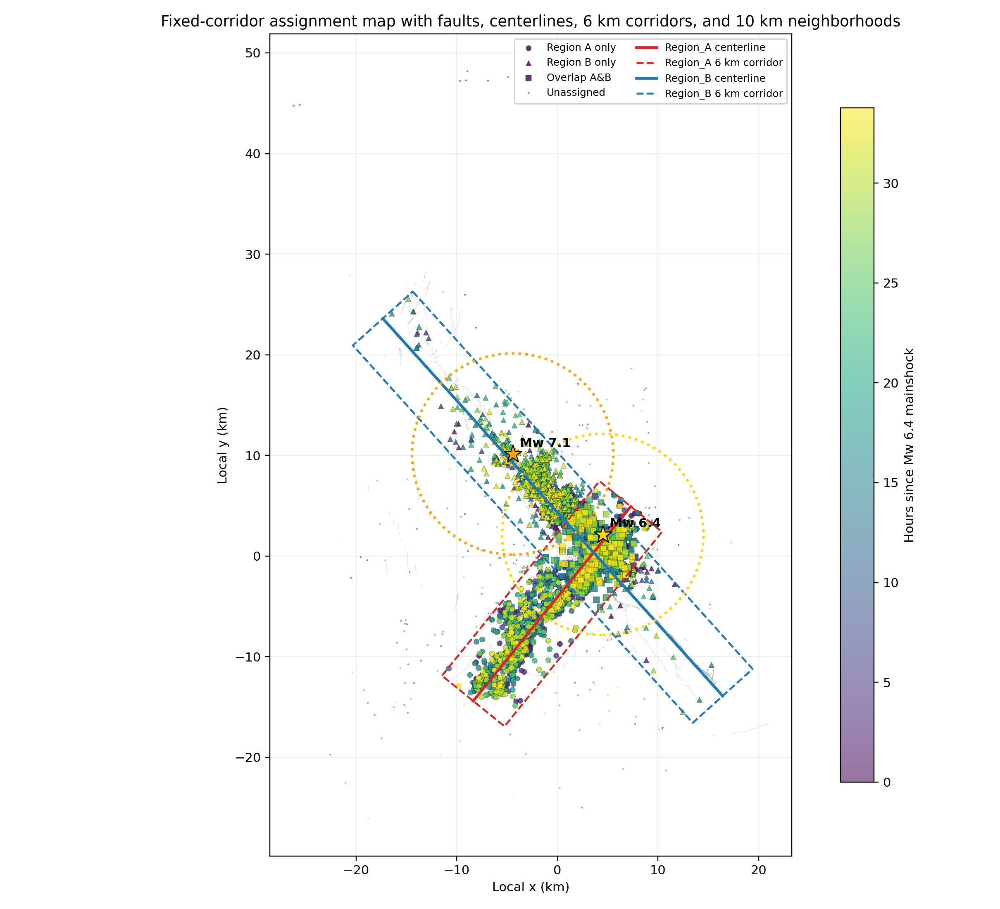
<figcaption>Fixed corridor assignment map showing the prescribed Region A and Region B geometry, mapped fault traces, event distribution, and mainshock locations. This figure establishes the spatial framework used in all subsequent analyses.</figcaption>
</figure>

<figure id="fig:across_diagnostics" data-latex-placement="H">
<figure>
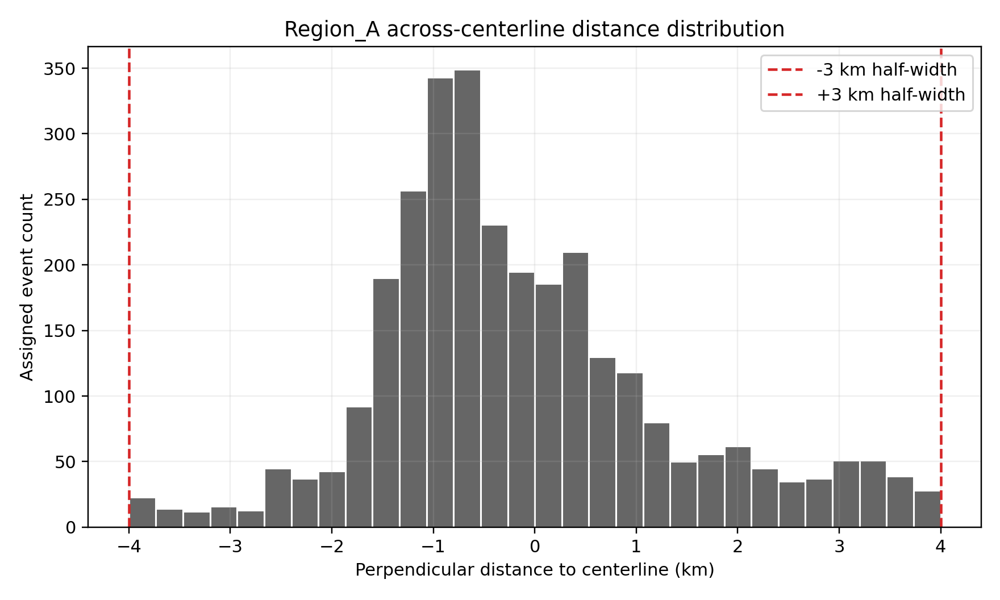
<figcaption>Region A across-centerline distances.</figcaption>
</figure>
<figure>
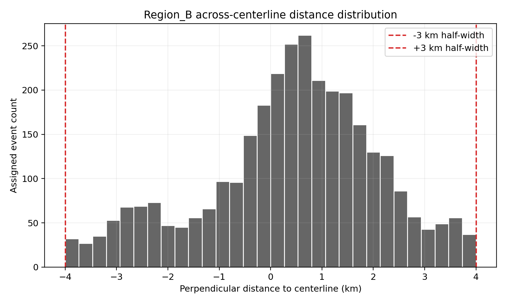
<figcaption>Region B across-centerline distances.</figcaption>
</figure>
<figcaption>Across-centerline distance diagnostics for the two corridors. The fixed 3 km half-width contains the assigned seismicity in both cases, but Region B is somewhat more broadly offset from its centerline than Region A.</figcaption>
</figure>

<div id="tab:assignment_summary">

| Region | Assigned count | Assigned frac. | Overlap count | Median $`|`$across$`|`$ (km) | 95th pct. (km) | Along range (km) |
|:---|---:|---:|---:|---:|---:|---:|
| Region A | 2817 | 0.5924 | 1239 | 0.858 | 2.404 | 0.21–24.86 |
| Region B | 2876 | 0.6048 | 1239 | 1.028 | 2.676 | 0.26–49.22 |

Compact summary of corridor assignment statistics from the machine-readable geometry summary table.

</div>

These geometry results matter scientifically because they show that the later temporal contrasts are not being driven by an obviously failed spatial partition. At the same time, the substantial overlap means direct Region A-versus-Region B comparisons are informative but not strictly independent.

## Domain-scale temporal evolution: synchronous onset, different buildup

The corridor-scale rate series provide the clearest answer to the first requested question. Region A and Region B both begin sustained post-Mw 6.4 activity at essentially the same time in both time discretizations (Figure <a href="#fig:rate_primary" data-reference-type="ref" data-reference="fig:rate_primary">3</a>). In the 30-minute summary, both domains have first post-Mw 6.4 event time at the Mw 6.4 origin and first sustained activity bin start at 2019-07-04 17:30:00+00:00. In the 1-hour summary, both first sustained activity times are 2019-07-04 17:00:00+00:00. The slightly negative reported hours relative to Mw 6.4 in some 1-hour entries are a bin-centering artifact, not evidence of pre-mainshock activation.

Therefore, the delivered temporal evidence does *not* support a large corridor-scale onset lag of Region B relative to Region A. Instead, the main difference is in how activity is organized after this common onset.

<figure id="fig:rate_primary" data-latex-placement="H">
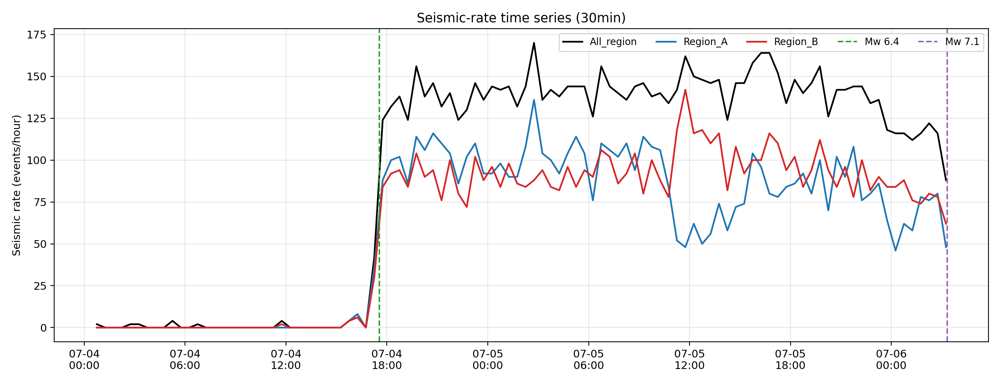
<figcaption>Thirty-minute seismic-rate time series for All region, Region A, and Region B with Mw 6.4 and Mw 7.1 reference times marked. The figure shows a common sharp rate increase at Mw 6.4, followed by different temporal organization of the two corridors.</figcaption>
</figure>

Although onset is nearly synchronous, cumulative counts show that Region A dominates the early post-Mw 6.4 buildup while Region B catches up later (Figure <a href="#fig:cumulative_counts" data-reference-type="ref" data-reference="fig:cumulative_counts">4</a>). This distinction remains visible in both raw cumulative counts and normalized cumulative fractions. By the end of the pre-Mw 7.1 window, total event counts are similar, but their temporal concentration differs:

- 30-minute summaries: Region A = 2793 events, Region B = 2856 events;

- 1-hour summaries: Region A = 2811 events, Region B = 2870 events.

Thus, the difference between the two fault systems is not primarily a difference in total number of pre-Mw 7.1 events, but rather when these events accumulated.

<figure id="fig:cumulative_counts" data-latex-placement="H">
<figure>
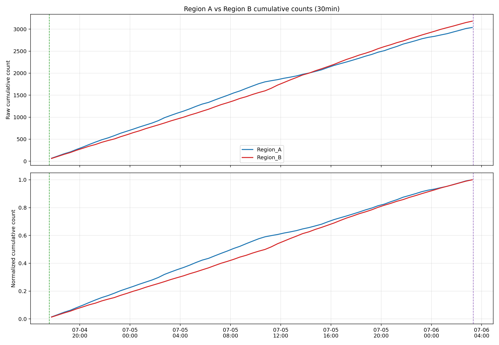
<figcaption>30-minute accumulation.</figcaption>
</figure>
<figure>
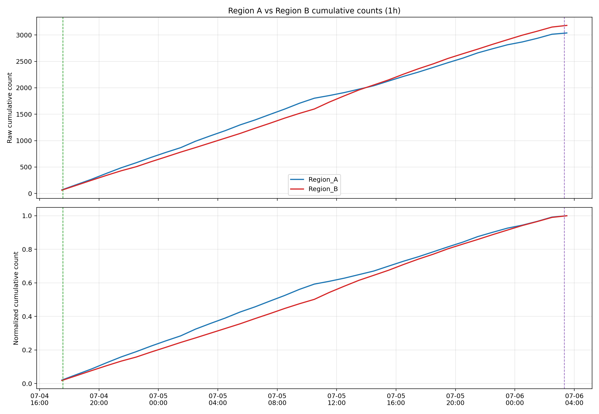
<figcaption>1-hour accumulation.</figcaption>
</figure>
<figcaption>Cumulative event-count comparisons between Region A and Region B. Region A accumulates more rapidly at early times, whereas Region B catches up later, especially closer to Mw 7.1.</figcaption>
</figure>

Peak-rate timing quantifies this offset. Region A reaches peak rate much earlier than Region B in both discretizations:

- 30-minute peak-rate time: Region A = 9.19 h after Mw 6.4; Region B = 18.19 h;

- 1-hour peak-rate time: Region A = 8.94 h after Mw 6.4; Region B = 17.94 h.

This roughly 9-hour difference in peak-rate timing is one of the strongest quantitative indicators that the two corridors responded differently after their common initial activation.

The direct A–B rate-difference and ratio diagnostics reinforce this interpretation (Figure <a href="#fig:ab_difference" data-reference-type="ref" data-reference="fig:ab_difference">5</a>). Early after Mw 6.4, the diagnostics indicate Region A dominance; later, around late morning to midday on 2019-07-05, the dominance reverses and Region B becomes stronger approaching Mw 7.1. This is important for interpretation because it argues against a binary active/inactive picture. Instead, the system shows a transfer in relative dominance through time.

<figure id="fig:ab_difference" data-latex-placement="H">
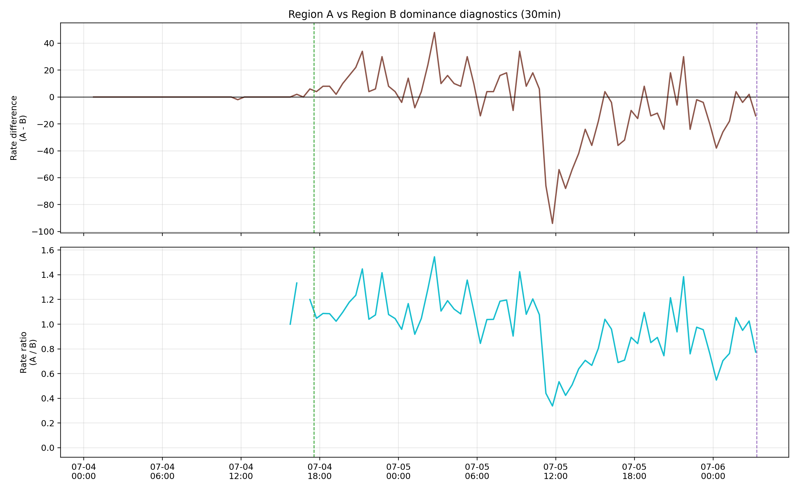
<figcaption>Direct comparison of Region A and Region B rate difference and ratio at 30-minute resolution. Region A dominates early, whereas Region B becomes increasingly dominant later in the sequence.</figcaption>
</figure>

## Bayesian changepoint diagnostics

The Bayesian single-changepoint scans identify Mw 6.4 as the dominant common transition in seismic rate for both corridors and both neighborhoods (Figure <a href="#fig:changepoint" data-reference-type="ref" data-reference="fig:changepoint">6</a>). In the changepoint summary table, the 30-minute rate changepoints for All region and Region B occur at 2019-07-04 17:45:00+00:00, only 0.186 h after Mw 6.4; the 1-hour rate changepoints for All region, Region A, and Region B are centered on the first Mw 6.4-containing hour bin. Region B therefore does not show a later *primary* onset changepoint than Region A.

At the same time, the changepoint diagnostics do show strong later energy shifts for Region B and the Mw 7.1 neighborhood near 30.94–32.19 h after Mw 6.4, close to the end of the pre-Mw 7.1 window. Those later energy changepoints are consistent with a late strengthening of the future Mw 7.1 fault system, but they should be interpreted as statistical timing diagnostics rather than direct mechanistic proof.

<figure id="fig:changepoint" data-latex-placement="H">
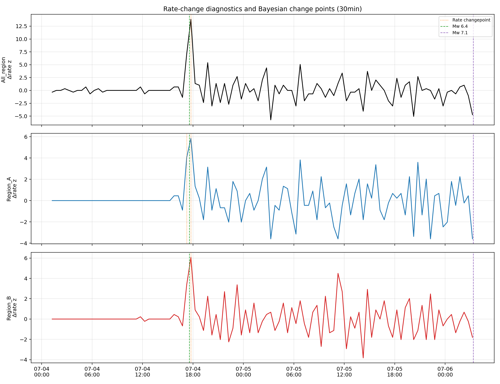
<figcaption>Thirty-minute rate-change and changepoint diagnostics for the primary domains. The dominant rate transition aligns with Mw 6.4 rather than indicating a large delayed onset in Region B.</figcaption>
</figure>

Overall, the changepoint evidence supports a common Mw 6.4-linked triggering onset, followed by corridor-specific divergence expressed more in later amplitude and energy organization than in initial activation time.

## Energy-release evolution: strong late dominance of the future Mw 7.1 system

Energy-release behavior differs more strongly between the corridors than event-count behavior (Figure <a href="#fig:energy_primary" data-reference-type="ref" data-reference="fig:energy_primary">7</a>). Region A is dominated by an early energy pulse near Mw 6.4 and then exhibits relatively limited additional cumulative energy growth. Region B, in contrast, shows a much larger late energy surge close to Mw 7.1.

This contrast is quantified by the primary timing table:

- Region A peak energy time: 0.186 h after Mw 6.4 (30-minute) and effectively the first 1-hour bin containing Mw 6.4;

- Region B peak energy time: 33.69 h after Mw 6.4 (30-minute) and 33.94 h (1-hour).

The cumulative energy totals are even more striking:

- Region A: about $`2.57 \times 10^{14}`$ J;

- Region B: about $`3.09 \times 10^{15}`$ J.

Thus, Region B releases roughly an order of magnitude more energy than Region A in the pre-Mw 7.1 interval, despite its later and less spatially extensive activation. This strongly suggests that the future Mw 7.1 system became increasingly important late in the sequence, likely through a smaller number of larger events.

<figure id="fig:energy_primary" data-latex-placement="H">
<figure>
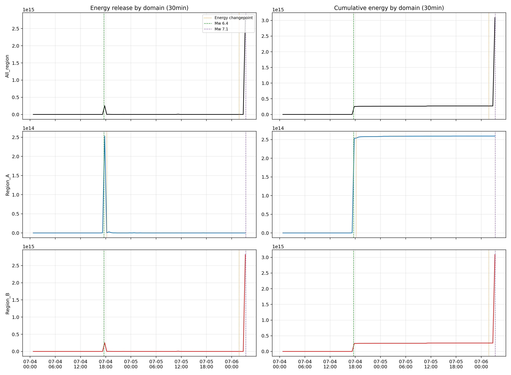
<figcaption>Primary-domain energy panels.</figcaption>
</figure>
<figure>
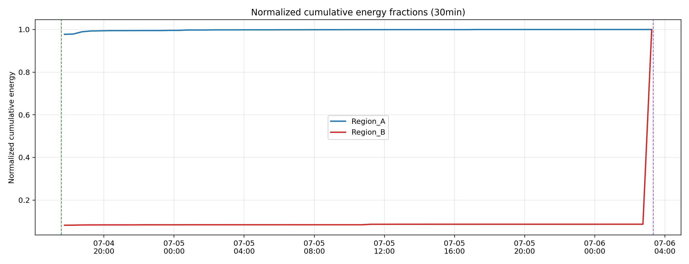
<figcaption>Normalized cumulative energy.</figcaption>
</figure>
<figcaption>Energy-release diagnostics at 30-minute resolution. Region A is early-energy dominated, whereas Region B shows a pronounced late energy surge close to Mw 7.1.</figcaption>
</figure>

## Near-mainshock neighborhoods: local behavior near the two source regions

The circular diagnostic neighborhoods refine the corridor-scale picture. At domain scale, the Mw 6.4 and Mw 7.1 neighborhoods begin sustained activity at essentially the same binned onset time, so the temporal analysis alone does not show a strong neighborhood-scale onset lag. However, their subsequent evolution differs sharply (Figure <a href="#fig:neighborhood_comparison" data-reference-type="ref" data-reference="fig:neighborhood_comparison">8</a>).

The Mw 6.4 neighborhood contains far more post-mainshock events than the Mw 7.1 neighborhood:

- 30-minute counts: 3397 versus 1637;

- 1-hour counts: 3417 versus 1638.

Yet the Mw 7.1 neighborhood dominates the cumulative energy budget:

- Mw 6.4 neighborhood: about $`2.70 \times 10^{14}`$ J;

- Mw 7.1 neighborhood: about $`2.83 \times 10^{15}`$ J.

Peak-rate times are similar between the two neighborhoods, near 17.94–18.19 h after Mw 6.4, but the Mw 7.1 neighborhood has a strong late energy changepoint and peak energy close to 33.7–33.9 h after Mw 6.4. This indicates lower early productivity near the future Mw 7.1 epicentral area, followed by much stronger late energetic strengthening.

<figure id="fig:neighborhood_comparison" data-latex-placement="H">
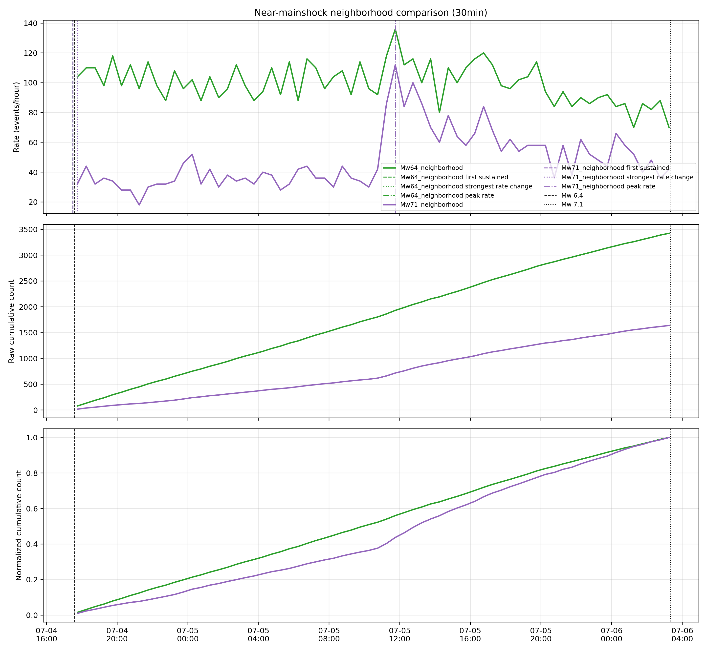
<figcaption>Thirty-minute neighborhood comparison for the Mw 6.4 and Mw 7.1 circular diagnostic domains. Local activity near Mw 6.4 is denser early, whereas the Mw 7.1 neighborhood shows stronger late energetic growth.</figcaption>
</figure>

## Internal spatial ordering: earlier and broader activation in Region A

The gridded activation analysis addresses the third requested question: whether activation inside each domain was spatially coherent or directionally evolving. The cell-level summary demonstrates that Region A activated earlier and more broadly than Region B before Mw 7.1:

- Region A: 403 activated cells out of 600 total (67.2%), median first activation = 4.99 h;

- Region B: 411 activated cells out of 1212 total (33.9%), median first activation = 7.71 h.

The first-activation maps (Figure <a href="#fig:first_activation_maps" data-reference-type="ref" data-reference="fig:first_activation_maps">9</a>) show that Region A contains a denser and more continuous belt of early activation, whereas Region B has a more localized early core surrounded by broader delayed areas.

<figure id="fig:first_activation_maps" data-latex-placement="H">
<figure>
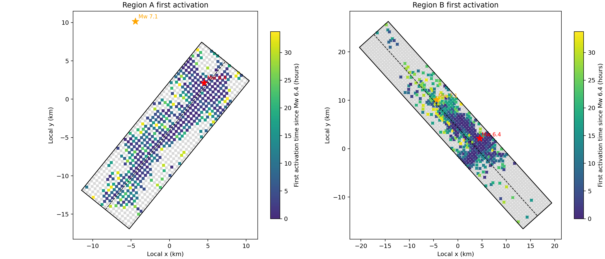
<figcaption>First activation in corridor cells.</figcaption>
</figure>
<figure>
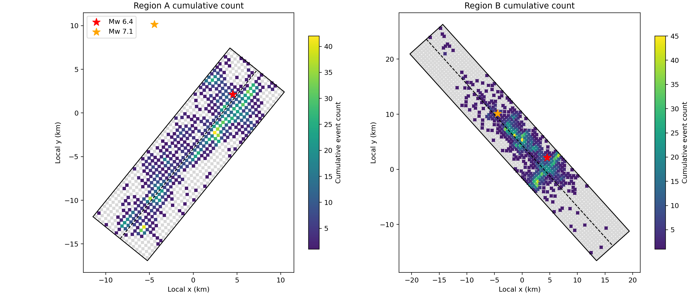
<figcaption>Cumulative corridor seismicity.</figcaption>
</figure>
<figcaption>Gridded corridor-scale spatial diagnostics. Region A activates more broadly and earlier, while Region B is more segmented and spatially heterogeneous.</figcaption>
</figure>

The cumulative seismicity maps show that Region A forms a comparatively continuous fault-parallel band with several hotspots, while Region B is broader and more segmented, with strong clusters separated by relatively sparse sections. This difference is consistent with broader, faster activation of the Mw 6.4-related conjugate system and more selective late strengthening of the future Mw 7.1 system.

## No simple monotonic migration; heterogeneous delayed patches in Region B

The along-strike activation diagnostics argue against a single coherent migration front in either corridor. In the first-activation-versus-along-strike analysis (Figure <a href="#fig:along_strike" data-reference-type="ref" data-reference="fig:along_strike">10</a>), weak negative trends exist, but the scatter is large. The delivered analysis reports figure-based correlations of about $`r=-0.35`$ for Region A and $`r=-0.11`$ for Region B, while direct cell-based calculations give similarly modest trends. These values are too weak, and the scatter too broad, to support a simple end-to-end migration interpretation.

Instead, Region A is characterized by broad early activation over multiple along-strike sectors, whereas Region B contains delayed patches superimposed on several early-active bands. The along-strike summaries identify particularly strong Region A activity near 16.25–21.25 km along strike, with many early first activations below about 1.3 h. In Region B, strong segments occur near 24.75–33.25 km, but an important delayed segment near about 21.75 km first activates at 10.86 h while still accumulating high counts. The time-versus-along-strike heatmaps make this especially clear: Region B includes a later-strengthening zone near about 21–22 km after roughly 17–18 h, rather than a uniformly progressive front.

<figure id="fig:along_strike" data-latex-placement="H">
<figure>
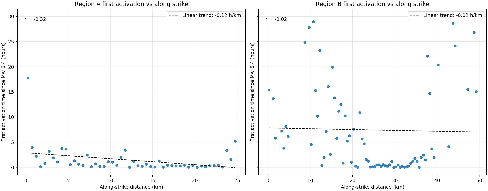
<figcaption>First activation versus along-strike position.</figcaption>
</figure>
<figure>
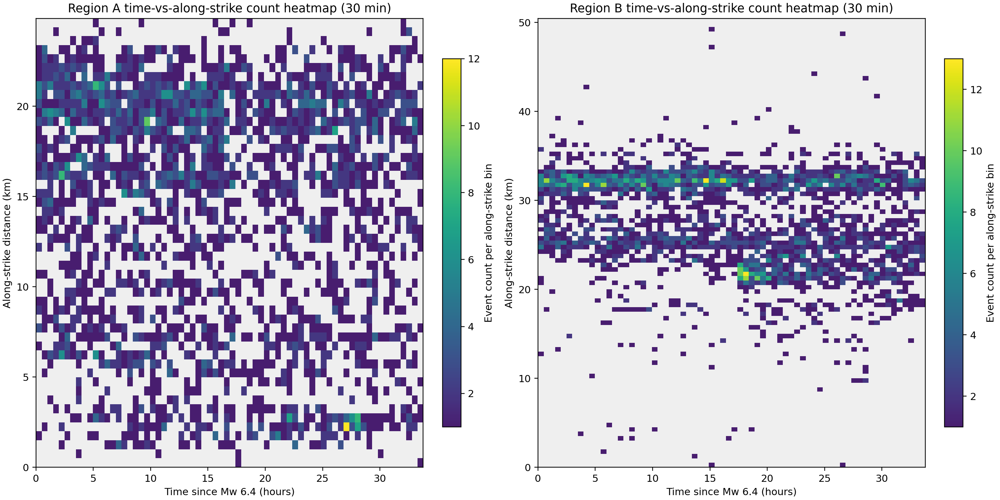
<figcaption>Time-versus-along-strike heatmaps.</figcaption>
</figure>
<figcaption>Internal ordering diagnostics for the two corridors. The patterns are heterogeneous rather than consistent with a simple monotonic migration front; Region B shows especially clear delayed-patch behavior.</figcaption>
</figure>

Scientifically, this means the available evidence favors heterogeneous triggering and selective patch activation over a simple propagating rupture-preparation front moving uniformly along either prescribed corridor.

## Neighborhood-scale spatial ordering: later activation near the future Mw 7.1 epicentral area

The neighborhood cell statistics provide an important independent diagnostic. The Mw 6.4 neighborhood activated earlier and more extensively than the Mw 7.1 neighborhood:

- Mw 6.4 neighborhood: 478 activated cells of 1264 (37.8%), median first activation = 5.86 h, median 30-minute peak time = 9.75 h;

- Mw 7.1 neighborhood: 299 activated cells of 1264 (23.7%), median first activation = 13.61 h, median 30-minute peak time = 17.25 h.

These results are strong spatial evidence that the future Mw 7.1 epicentral area did not activate as early or as broadly as the Mw 6.4 epicentral area, even though domain-scale sustained activity onset metrics were similar. The neighborhood activation maps visually confirm that the Mw 6.4 area contains more widespread early cells, while the Mw 7.1 area has fewer active cells and a larger share of later activation times (Figure <a href="#fig:neighborhood_maps" data-reference-type="ref" data-reference="fig:neighborhood_maps">11</a>).

<figure id="fig:neighborhood_maps" data-latex-placement="H">
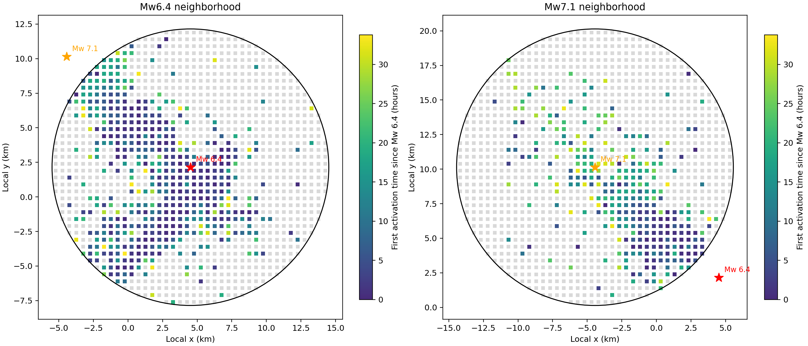
<figcaption>First-activation maps for the Mw 6.4 and Mw 7.1 circular diagnostic neighborhoods. The future Mw 7.1 epicentral area activates later and less extensively than the Mw 6.4 neighborhood.</figcaption>
</figure>

# Integrated interpretation

Taken together, the three analysis tasks support the following interpretation of the Ridgecrest triggering problem.

**First**, the Mw 6.4 mainshock produced an immediate system-wide response at corridor scale. Both fixed fault-oriented corridors show a sharp rise in seismic rate at the Mw 6.4 time, and both begin sustained activity in the same first post-mainshock bins. The main rate changepoint in each corridor is also associated with Mw 6.4. Therefore, the evidence does not support a large corridor-scale onset lag in the future Mw 7.1 fault system.

**Second**, the two fault systems did not evolve identically after this common onset. Region A dominated the early buildup in counts and reached its peak rate earlier, while Region B strengthened later, overtook Region A in relative dominance, and accumulated much larger total energy before Mw 7.1. This is consistent with early broad activation of the Mw 6.4-associated corridor and later concentration of more energetic activity in the Mw 7.1-associated system.

**Third**, the internal spatial patterns matter. Region A activated earlier and more broadly, while Region B was less spatially extensive, more segmented, and characterized by delayed activation in specific along-strike sectors rather than by simple monotonic migration. The neighborhood analysis independently confirms that the future Mw 7.1 epicentral area activated later and less extensively than the Mw 6.4 neighborhood.

**Therefore**, the most defensible interpretation from the delivered evidence is a *two-stage but overlapping* triggering picture: Mw 6.4 produced a near-immediate regional response that included both corridors, but the future Mw 7.1 system did not become uniformly or fully activated at once. Instead, it underwent delayed, spatially heterogeneous preparation, with late concentration of energetic activity near the future Mw 7.1 fault system and epicentral area. This pattern is compatible with Mw 6.4 having contributed to Mw 7.1 triggering, but through progressive and spatially uneven preparation rather than through a sharply delayed binary onset of the entire Region B system.

# Limitations and assumptions

The main conclusions above should be interpreted with the following constraints.

1.  **Fixed geometry**: Region A and Region B are user-prescribed finite corridors with constant 3 km half-width. They are intentionally not data-adaptive, so real curvature, branching, or variable-width damage zones are simplified.

2.  **Region overlap**: the two corridors share 1239 events (26.06% of the catalog), so A-versus-B contrasts are meaningful but not independent.

3.  **Region B centering**: Region B is somewhat less centered on its assigned cloud than Region A, and its centerline is longer than the most densely occupied segment. Some apparent delays may partly reflect inactive corridor sections.

4.  **Binning sensitivity**: exact peak and changepoint times depend modestly on the 30-minute versus 1-hour discretization. Broad conclusions are stable, but exact reported hours can shift by one bin.

5.  **Bin-centering artifacts**: some 1-hour timing values are slightly negative relative to Mw 6.4 because timestamps refer to bin centers. These are not true pre-mainshock activations.

6.  **Changepoint model**: the Bayesian diagnostic is a single-changepoint Gaussian-likelihood scan, not a multi-changepoint count-process or physical triggering model. It provides useful timing diagnostics, but not standalone proof of causal mechanism.

7.  **Energy estimation**: energy is derived from magnitude through an empirical scaling relation. Energy contrasts may be dominated by a few larger events and inherit magnitude uncertainty.

8.  **Gridded activation dependence**: first activation depends on catalog completeness, relocation quality, and the 0.5 km grid size. Spatial ordering results are therefore descriptive and resolution-dependent.

9.  **No explicit migration model**: the analysis shows that simple monotonic migration is not favored, but it does not fit a formal physical migration or stress-transfer model.

10. **Figure quality note**: Task 02 reported a possible label inconsistency in one 30-minute energy-panel rendering. For event times and numerical comparisons, the machine-readable tables should be treated as authoritative.

Overall evaluation metadata classify the delivery status as complete and scientifically satisfactory, with **moderate** scientific confidence.

# Main conclusions

1.  **Synchronous versus delayed onset**: Region A and Region B do not show a large corridor-scale onset lag after Mw 6.4. Sustained post-mainshock activity begins in the same first bins in both corridors, and the dominant rate changepoint in both is associated with Mw 6.4.

2.  **Systematic differences in triggering behavior**: despite synchronous onset, the two corridors evolve differently. Region A dominates the early post-Mw 6.4 buildup and peaks earlier in rate, whereas Region B strengthens later, becomes relatively dominant closer to Mw 7.1, and accumulates about an order of magnitude more total pre-Mw 7.1 energy.

3.  **Spatial inhomogeneity and temporal ordering**: Region A activates earlier and more broadly, while Region B activates later and more patchily. Neither corridor exhibits simple monotonic along-strike migration. Region B instead shows delayed-patch behavior superimposed on a few early-active bands.

4.  **Implication for Mw 7.1 triggering**: the evidence supports Mw 6.4 as the common initiating trigger for both fault systems at regional scale, but the future Mw 7.1 system appears to have undergone delayed, spatially heterogeneous preparation before failure, rather than a sharply delayed, system-wide onset.

# Key artifact locations

Primary artifacts cited in this report include:

- Geometry summary table: <a href="../exp_run/outputs/01_region_geometry_assignment/tables/region_assignment_summary.csv" class="uri">../exp_run/outputs/01_region_geometry_assignment/tables/region_assignment_summary.csv</a>

- Primary timing summary: <a href="../exp_run/outputs/02_temporal_rate_energy_changepoints/tables/primary_domain_timing_summary.csv" class="uri">../exp_run/outputs/02_temporal_rate_energy_changepoints/tables/primary_domain_timing_summary.csv</a>

- Neighborhood timing summary: <a href="../exp_run/outputs/02_temporal_rate_energy_changepoints/tables/neighborhood_timing_summary.csv" class="uri">../exp_run/outputs/02_temporal_rate_energy_changepoints/tables/neighborhood_timing_summary.csv</a>

- Changepoint summary: <a href="../exp_run/outputs/02_temporal_rate_energy_changepoints/tables/changepoint_summary_all.csv" class="uri">../exp_run/outputs/02_temporal_rate_energy_changepoints/tables/changepoint_summary_all.csv</a>

- Corridor cell activation table: <a href="../exp_run/outputs/03_gridded_activation_ordering/tables/corridor_cell_activation_table_all_regions.csv" class="uri">../exp_run/outputs/03_gridded_activation_ordering/tables/corridor_cell_activation_table_all_regions.csv</a>

- Region A cell activation table: <a href="../exp_run/outputs/03_gridded_activation_ordering/tables/region_a_cell_activation_table.csv" class="uri">../exp_run/outputs/03_gridded_activation_ordering/tables/region_a_cell_activation_table.csv</a>

- Region B cell activation table: <a href="../exp_run/outputs/03_gridded_activation_ordering/tables/region_b_cell_activation_table.csv" class="uri">../exp_run/outputs/03_gridded_activation_ordering/tables/region_b_cell_activation_table.csv</a>
