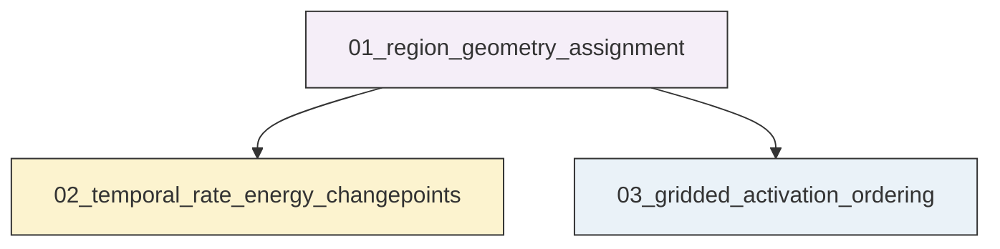
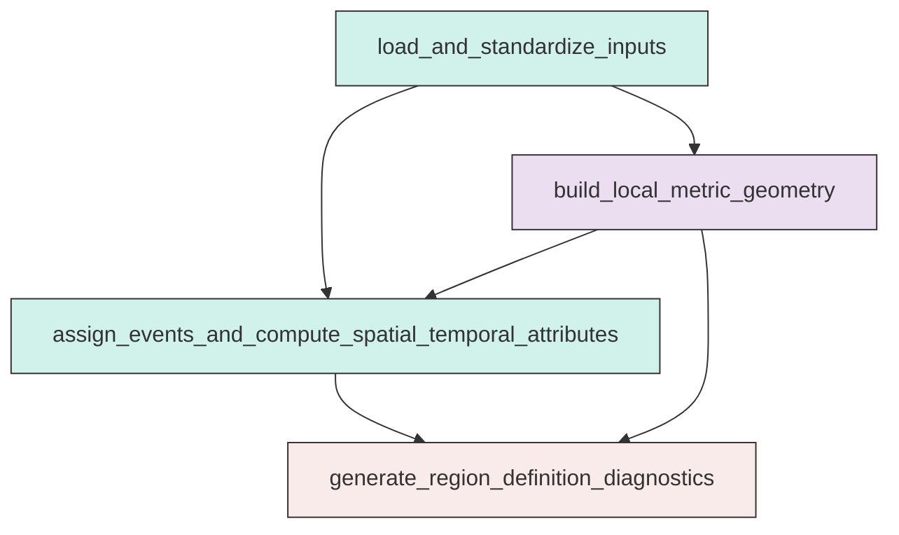
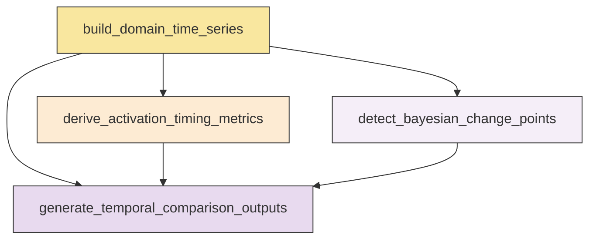
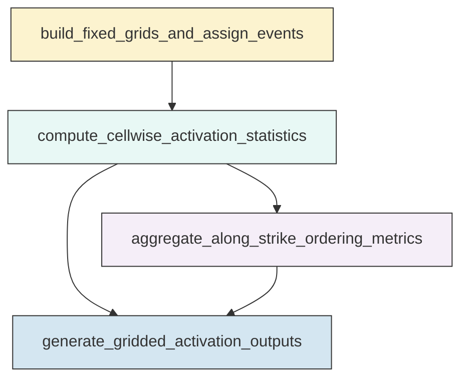

# Workflow Overview

## Top-Level Task Dependencies

**Description:**
- `01_region_geometry_assignment`: Build the fixed local metric geometry, assign events to corridors and diagnostic neighborhoods, and generate region-definition quality-control outputs.
- `02_temporal_rate_energy_changepoints`: Construct domain-scale rate and energy time series, extract timing diagnostics, and run Bayesian change-point analysis for corridor and neighborhood domains.
- `03_gridded_activation_ordering`: Compute gridded corridor and neighborhood activation statistics and resolve internal spatial ordering before the Mw 7.1 mainshock.

## Subtask Dependencies

#### 01_region_geometry_assignment
**Usage**: Build the fixed local metric geometry, assign events to corridors and diagnostic neighborhoods, and generate region-definition quality-control outputs.

**Description:**
- `load_and_standardize_inputs`: Load the relocated catalog, mainshock table, and fault traces and standardize required fields.
- `build_local_metric_geometry`: Construct one shared local metric coordinate system and fixed corridor and circle geometries for all spatial calculations.
- `assign_events_and_compute_spatial_temporal_attributes`: Compute projected coordinates, relative times, distances, along-strike and across-strike coordinates, and independent boolean domain masks for each event.
- `generate_region_definition_diagnostics`: Produce assignment summaries and diagnostic figures for corridor coverage, along-strike span, and unassigned-event distribution.

#### 02_temporal_rate_energy_changepoints
**Usage**: Construct domain-scale rate and energy time series, extract timing diagnostics, and run Bayesian change-point analysis for corridor and neighborhood domains.

**Description:**
- `build_domain_time_series`: Aggregate event counts and energy into shared 30-minute and 1-hour bins for all required domains.
- `derive_activation_timing_metrics`: Compute post-Mw 6.4 timing metrics for first activity, sustained activation, strongest rate change, and peak rate.
- `detect_bayesian_change_points`: Apply one consistent Bayesian change-point method to rate and energy series for all domains and resolutions.
- `generate_temporal_comparison_outputs`: Produce comparative temporal figures and compact summary tables for corridor and neighborhood activation evolution.

#### 03_gridded_activation_ordering
**Usage**: Compute gridded corridor and neighborhood activation statistics and resolve internal spatial ordering before the Mw 7.1 mainshock.

**Description:**
- `build_fixed_grids_and_assign_events`: Create fixed 0.5 km grids inside both corridors and both circular neighborhoods and assign events to cells while retaining zero-count cells.
- `compute_cellwise_activation_statistics`: Calculate cell-level count, rate, energy, first-activation timing, peak-rate timing, and geometric attributes for corridor and neighborhood grids.
- `aggregate_along_strike_ordering_metrics`: Summarize cell statistics into along-strike bins and quantify internal activation ordering within each corridor.
- `generate_gridded_activation_outputs`: Produce cumulative-count maps, first-activation maps, time-versus-along-strike heatmaps, and export cell-level and along-strike summary tables.