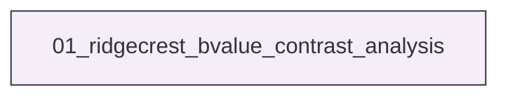
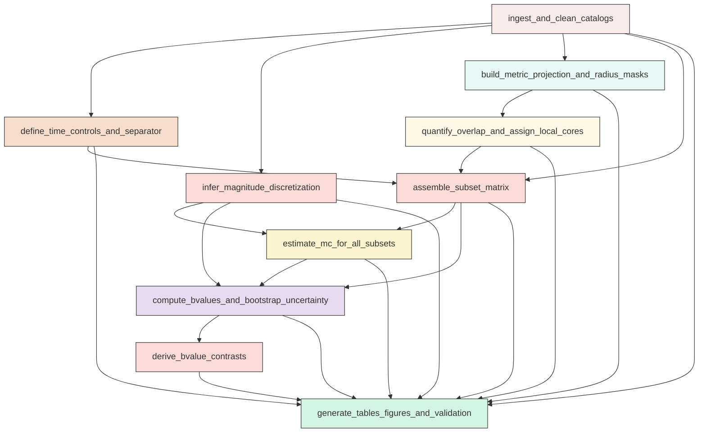

# Research Codings

## Task Overview


**Description:**
- `01_ridgecrest_bvalue_contrast_analysis`: Execute the complete Ridgecrest fixed-window b-value contrast workflow from catalog harmonization through diagnostics, figures, and validation.


## Task Details


#### 01_ridgecrest_bvalue_contrast_analysis
**Usage**: Execute the complete Ridgecrest fixed-window b-value contrast workflow from catalog harmonization through diagnostics, figures, and validation.

**Description:**
- `ingest_and_clean_catalogs`: Read the interevent, background, and mainshock files, harmonize schemas, clean invalid rows, and preserve traceable event identifiers.
- `define_time_controls_and_separator`: Identify the Mw 6.4 and Mw 7.1 origin times, locate the separator event metadata, and define strict interevent windows with required exclusions.
- `infer_magnitude_discretization`: Infer catalog magnitude discretization for Mc and b-value estimation and record any harmonized comparison increment.
- `build_metric_projection_and_radius_masks`: Project events and hypocenters to a local metric CRS, compute horizontal distances, and construct local core memberships for all requested radii.
- `quantify_overlap_and_assign_local_cores`: Compute raw overlap diagnostics for each radius and create exclusive nearest-hypocenter local assignments when overlap occurs.
- `assemble_subset_matrix`: Build the full matrix of background, interevent regional, and local-core subsets across windows, radii, and assignment modes.
- `estimate_mc_for_all_subsets`: Compute automatic and conservative magnitude of completeness values for every supported subset using maximum curvature.
- `compute_bvalues_and_bootstrap_uncertainty`: Estimate b-values and supporting statistics for fixed, automatic, and conservative Mc modes and bootstrap uncertainty summaries in parallel.
- `derive_bvalue_contrasts`: Compute requested fixed-window b-value contrasts and bootstrap difference intervals for core, regional, and temporal comparisons.
- `generate_tables_figures_and_validation`: Write all required CSV outputs, create diagnostic figures, save reproducibility metadata, and validate that required fixed-Mc products are present.

#### Coding Script

```python

#!<ENV_ROOT>/miniconda3/envs/seismoagent/bin/python
from __future__ import annotations

import json
import math
import os
import sys
import time
import traceback
from concurrent.futures import ProcessPoolExecutor, as_completed
from typing import Any
from dataclasses import dataclass
from pathlib import Path

import matplotlib
matplotlib.use('Agg')
import matplotlib.pyplot as plt
import numpy as np
import pandas as pd
from pyproj import CRS, Transformer
from seismostats.analysis import estimate_mc_maxc

INPUT_INTEREVENT = Path('<REPO_ROOT>/examples/ridgecrest/data/catalog_TRACE/TRACE_ridgecrest_relocated.csv')
INPUT_BACKGROUND = Path('<REPO_ROOT>/examples/ridgecrest/data/catalog_longterm/catalog_2year_background_before_64.csv')
INPUT_MAINSHOCKS = Path('<REPO_ROOT>/examples/ridgecrest/data/catalog_TRACE/main_shock_events.csv')
SCRIPT_PATH = Path('../exp_run/scripts/01_ridgecrest_bvalue_contrast_analysis.py')
OUTPUT_DIR = Path('../exp_run/outputs/01_ridgecrest_bvalue_contrast_analysis')
FIG_DIR = OUTPUT_DIR / 'figures'
TABLE_DIR = OUTPUT_DIR / 'tables'
META_DIR = OUTPUT_DIR / 'metadata'

FIXED_MC = 1.5
RADIUS_LIST_KM = [4.0, 5.0, 6.0, 7.0]
PRIMARY_RADIUS_KM = 5.0
SEPARATOR_TIME = pd.Timestamp('2019-07-05T11:07:52.830000Z')
BOOTSTRAP_SAMPLES = 2000
MAX_WORKERS = min(64, max(1, (os.cpu_count() or 1)))
BASE_SEED = 20240719
PROGRESS_EVERY = 250
FIG_DPI = 180


def log(msg: str) -> None:
    print(msg, flush=True)


@dataclass(frozen=True)
class SubsetTask:
    subset_id: str
    catalog_name: str
    window: str
    domain: str
    radius_km: float | None
    assignment_mode: str
    mc_mode: str
    events_csv: str
    magnitudes_above_mc_csv: str
    total_events: int
    mc_used: float
    auto_mc: float | None
    conservative_mc: float | None
    delta_m: float
    seed: int


def ensure_dirs() -> None:
    for path in [OUTPUT_DIR, FIG_DIR, TABLE_DIR, META_DIR]:
        path.mkdir(parents=True, exist_ok=True)


def clean_previous_outputs() -> None:
    quick_files = [
        'cleaned_catalog_summaries.csv',
        'separator_event_metadata.csv',
        'bvalue_aggregates_unified.csv',
        'bvalue_contrasts.csv',
        'radius_overlap_diagnostics.csv',
        'bootstrap_run_metadata.csv',
        'run_validation_summary.csv',
        'run_metadata.json',
        'subset_event_membership_primary.csv',
    ]
    for name in quick_files:
        path = TABLE_DIR / name if name.endswith('.csv') else META_DIR / name
        if path.exists():
            path.unlink()
    for fig in FIG_DIR.glob('*.png'):
        fig.unlink()


def read_catalogs() -> tuple[pd.DataFrame, pd.DataFrame, pd.DataFrame]:
    log(f'Reading interevent catalog: {INPUT_INTEREVENT}')
    inter = pd.read_csv(INPUT_INTEREVENT)
    log(f'Reading background catalog: {INPUT_BACKGROUND}')
    bg = pd.read_csv(INPUT_BACKGROUND)
    log(f'Reading mainshocks: {INPUT_MAINSHOCKS}')
    ms = pd.read_csv(INPUT_MAINSHOCKS)
    return inter, bg, ms


def canonicalize_catalog(df: pd.DataFrame, catalog_name: str, mapping: dict[str, str] | None = None) -> tuple[pd.DataFrame, dict]:
    original_count = len(df)
    out = df.copy()
    if mapping:
        out = out.rename(columns=mapping)
    required = ['event_time', 'latitude', 'longitude', 'depth_km', 'magnitude']
    missing = [c for c in required if c not in out.columns]
    if missing:
        raise ValueError(f'{catalog_name}: missing required columns {missing}')
    out = out.reset_index(drop=False).rename(columns={'index': 'source_row_index'})
    out['event_time'] = pd.to_datetime(out['event_time'], utc=True, errors='coerce')
    for col in ['latitude', 'longitude', 'depth_km', 'magnitude']:
        out[col] = pd.to_numeric(out[col], errors='coerce')
    before_dropna = len(out)
    out = out.dropna(subset=required).copy()
    removed_missing = before_dropna - len(out)
    out['event_id'] = [f'{catalog_name}_{i:07d}' for i in out['source_row_index'].to_numpy()]
    before_dupes = len(out)
    out = out.drop_duplicates(subset=['event_time', 'latitude', 'longitude', 'depth_km', 'magnitude'], keep='first').copy()
    removed_dupes = before_dupes - len(out)
    out = out.sort_values(['event_time', 'event_id']).reset_index(drop=True)
    meta = {
        'catalog_name': catalog_name,
        'rows_original': original_count,
        'rows_cleaned': len(out),
        'removed_missing_or_nonfinite': removed_missing,
        'removed_exact_duplicates': removed_dupes,
        'time_min': out['event_time'].min(),
        'time_max': out['event_time'].max(),
    }
    return out, meta


def infer_delta_m(series: pd.Series) -> tuple[float, dict]:
    vals = np.sort(np.unique(np.round(series.dropna().to_numpy(dtype=float), 6)))
    diffs = np.diff(vals)
    diffs = diffs[diffs > 1e-5]
    if len(diffs) == 0:
        delta = 0.1
        return delta, {'strategy': 'fallback_single_value', 'delta_m': delta}
    rounded = np.round(diffs, 4)
    counts = pd.Series(rounded).value_counts().sort_values(ascending=False)
    stable = counts[counts >= max(3, int(0.01 * len(rounded)))]
    if not stable.empty:
        delta = float(stable.index.min())
        strategy = 'smallest_stable_repeated_increment'
    else:
        delta = float(np.quantile(diffs, 0.1))
        strategy = 'low_quantile_increment'
    delta = round(delta, 3 if delta >= 0.1 else 2)
    if delta <= 0:
        delta = 0.01
    return delta, {
        'strategy': strategy,
        'delta_m': delta,
        'min_diff_raw': float(diffs.min()),
        'median_diff_raw': float(np.median(diffs)),
        'top_rounded_diffs': {str(k): int(v) for k, v in counts.head(10).items()},
    }


def choose_local_crs(latitudes: list[float], longitudes: list[float]) -> CRS:
    lon0 = float(np.mean(longitudes))
    lat0 = float(np.mean(latitudes))
    proj4 = f'+proj=aeqd +lat_0={lat0} +lon_0={lon0} +datum=WGS84 +units=m +no_defs'
    return CRS.from_proj4(proj4)


def project_points(df: pd.DataFrame, crs: CRS) -> pd.DataFrame:
    transformer = Transformer.from_crs('EPSG:4326', crs, always_xy=True)
    x, y = transformer.transform(df['longitude'].to_numpy(), df['latitude'].to_numpy())
    out = df.copy()
    out['x_m'] = x
    out['y_m'] = y
    return out


def validate_required_columns(df: pd.DataFrame, required: list[str], context: str) -> None:
    missing = [c for c in required if c not in df.columns]
    if missing:
        raise KeyError(f'{context}: missing required columns {missing}')


def compute_mc_maxc(mags: np.ndarray, delta_m: float) -> float | None:
    if len(mags) == 0:
        return None
    mc, _ = estimate_mc_maxc(np.asarray(mags, dtype=float), fmd_bin=delta_m)
    return float(mc)


def aki_utsu_b(mags_above: np.ndarray, mc: float, delta_m: float) -> float | None:
    mags_above = np.asarray(mags_above, dtype=float)
    if len(mags_above) < 2:
        return None
    denom = mags_above.mean() - mc + delta_m / 2.0
    if denom <= 0:
        return None
    return float(np.log10(np.e) / denom)


def estimate_a_value(n_above: int, mc: float, b_value: float) -> float | None:
    if n_above < 1 or not np.isfinite(b_value):
        return None
    return float(np.log10(n_above) + b_value * mc)


def bootstrap_subset(task: SubsetTask) -> tuple[dict, dict]:
    start = time.time()
    mags_above = np.fromstring(task.magnitudes_above_mc_csv, sep=',') if task.magnitudes_above_mc_csv else np.array([], dtype=float)
    result = {
        'subset_id': task.subset_id,
        'bootstrap_replicates': BOOTSTRAP_SAMPLES,
        'bootstrap_seed': task.seed,
        'bootstrap_b_median': np.nan,
        'bootstrap_b_p16': np.nan,
        'bootstrap_b_p84': np.nan,
        'bootstrap_b_std': np.nan,
    }
    meta = {
        'subset_id': task.subset_id,
        'replicates_requested': BOOTSTRAP_SAMPLES,
        'replicates_completed': 0,
        'seed': task.seed,
        'worker_pid': os.getpid(),
        'runtime_sec': np.nan,
        'warning': '',
    }
    if len(mags_above) < 2:
        meta['warning'] = 'insufficient_events_above_mc_for_bootstrap'
        meta['runtime_sec'] = time.time() - start
        return result, meta
    rng = np.random.default_rng(task.seed)
    samples = np.empty(BOOTSTRAP_SAMPLES, dtype=float)
    progress_step = max(1, BOOTSTRAP_SAMPLES // 4)
    for i in range(BOOTSTRAP_SAMPLES):
        resampled = rng.choice(mags_above, size=len(mags_above), replace=True)
        b = aki_utsu_b(resampled, task.mc_used, task.delta_m)
        samples[i] = np.nan if b is None else b
        if (i + 1) % progress_step == 0 or i + 1 == BOOTSTRAP_SAMPLES:
            print(f'bootstrap_worker subset={task.subset_id} progress={i + 1}/{BOOTSTRAP_SAMPLES}', flush=True)
    valid = samples[np.isfinite(samples)]
    if len(valid) == 0:
        meta['warning'] = 'all_bootstrap_samples_invalid'
    else:
        result['bootstrap_b_median'] = float(np.nanmedian(valid))
        result['bootstrap_b_p16'] = float(np.nanpercentile(valid, 16))
        result['bootstrap_b_p84'] = float(np.nanpercentile(valid, 84))
        result['bootstrap_b_std'] = float(np.nanstd(valid, ddof=1)) if len(valid) > 1 else 0.0
        meta['replicates_completed'] = int(len(valid))
    meta['runtime_sec'] = time.time() - start
    return result, meta


def reliability_label(n_above_mc: int) -> str:
    if n_above_mc >= 100:
        return 'robust'
    if n_above_mc >= 50:
        return 'usable_moderately_uncertain'
    if n_above_mc >= 30:
        return 'exploratory'
    return 'highly_unreliable'


def make_fmd(magnitudes: np.ndarray, delta_m: float) -> pd.DataFrame:
    if len(magnitudes) == 0:
        return pd.DataFrame(columns=['mag_bin', 'count_non_cum', 'count_cum'])
    start = math.floor(magnitudes.min() / delta_m) * delta_m
    end = math.ceil(magnitudes.max() / delta_m) * delta_m + delta_m * 0.5
    bins = np.arange(start, end + delta_m, delta_m)
    counts, edges = np.histogram(magnitudes, bins=bins)
    centers = edges[:-1]
    cum = counts[::-1].cumsum()[::-1]
    return pd.DataFrame({'mag_bin': centers, 'count_non_cum': counts, 'count_cum': cum})


def compute_subset_row(events: pd.DataFrame, subset_info: dict, mc_used: float, auto_mc: float | None, conservative_mc: float | None, delta_m: float) -> tuple[dict, np.ndarray]:
    mags = events['magnitude'].to_numpy(dtype=float)
    mags_above = mags[mags >= mc_used - 1e-12]
    total_events = int(len(events))
    n_above = int(len(mags_above))
    b_value = aki_utsu_b(mags_above, mc_used, delta_m)
    a_value = estimate_a_value(n_above, mc_used, b_value) if b_value is not None else None
    row = {
        **subset_info,
        'total_events': total_events,
        'mc_used': mc_used,
        'mc_auto_maxc': auto_mc,
        'mc_conservative': conservative_mc,
        'n_ge_mc': n_above,
        'b_value': b_value,
        'a_value': a_value,
        'magnitude_min_all': float(np.min(mags)) if total_events else np.nan,
        'magnitude_max_all': float(np.max(mags)) if total_events else np.nan,
        'magnitude_min_ge_mc': float(np.min(mags_above)) if n_above else np.nan,
        'magnitude_max_ge_mc': float(np.max(mags_above)) if n_above else np.nan,
        'magnitude_mean_ge_mc': float(np.mean(mags_above)) if n_above else np.nan,
        'reliability': reliability_label(n_above),
        'estimable': bool(n_above >= 2 and b_value is not None),
        'delta_m': delta_m,
    }
    return row, mags_above


def draw_gr_line(ax, mc, b, a, mags, label, color):
    if b is None or a is None or len(mags) == 0 or not np.isfinite(b) or not np.isfinite(a) or not np.isfinite(mc):
        return
    x = np.linspace(mc, max(float(np.max(mags)), mc + 0.5), 100)
    y = 10 ** (a - b * x)
    ax.plot(x, y, color=color, linestyle='--', linewidth=1.5, label=label)


def add_background_qc_summary_row(cleaning_rows: list[dict], bg: pd.DataFrame, delta_m: float, crs_str: str) -> None:
    bg_auto_mc = compute_mc_maxc(bg['magnitude'].to_numpy(dtype=float), delta_m)
    cleaning_rows.append({
        'catalog_name': 'background_qc_auto_mc',
        'source_path': str(INPUT_BACKGROUND),
        'rows_original': len(bg),
        'rows_cleaned': len(bg),
        'removed_missing_or_nonfinite': np.nan,
        'removed_exact_duplicates': np.nan,
        'time_min': bg['event_time'].min(),
        'time_max': bg['event_time'].max(),
        'delta_m_inferred': delta_m,
        'delta_m_used': delta_m,
        'delta_m_strategy': 'background_auto_mc_qc_summary',
        'crs': crs_str,
        'mc_qc_auto_maxc': bg_auto_mc,
    })


def save_cleaned_summary(cleaning_rows: list[dict]) -> None:
    pd.DataFrame(cleaning_rows).to_csv(TABLE_DIR / 'cleaned_catalog_summaries.csv', index=False)


def main() -> None:
    ensure_dirs()
    clean_previous_outputs()
    run_start = time.time()
    log('Starting Ridgecrest fixed-window b-value contrast workflow')

    inter_raw, bg_raw, ms_raw = read_catalogs()
    inter, inter_meta = canonicalize_catalog(inter_raw, 'interevent')
    bg, bg_meta = canonicalize_catalog(
        bg_raw,
        'background',
        mapping={'datetime': 'event_time', 'latR': 'latitude', 'lonR': 'longitude', 'depR': 'depth_km', 'mag': 'magnitude'},
    )
    ms, ms_meta = canonicalize_catalog(ms_raw, 'mainshock')
    validate_required_columns(inter, ['event_time', 'latitude', 'longitude', 'depth_km', 'magnitude', 'event_id'], 'inter cleaned catalog')
    validate_required_columns(bg, ['event_time', 'latitude', 'longitude', 'depth_km', 'magnitude', 'event_id'], 'background cleaned catalog')
    validate_required_columns(ms, ['event_time', 'latitude', 'longitude', 'depth_km', 'magnitude', 'event_id'], 'mainshock cleaned catalog')

    if len(ms) != 2:
        raise ValueError(f'Expected 2 mainshock rows, found {len(ms)}')
    ms = ms.sort_values('magnitude').reset_index(drop=True)
    ms64 = ms.iloc[0].copy()
    ms71 = ms.iloc[1].copy()
    if not (abs(ms64['magnitude'] - 6.4) < 0.2 and abs(ms71['magnitude'] - 7.1) < 0.2):
        raise ValueError('Mainshock magnitudes do not match expected Mw 6.4 and Mw 7.1 rows')

    delta_inter, delta_meta_inter = infer_delta_m(inter['magnitude'])
    delta_bg, delta_meta_bg = infer_delta_m(bg['magnitude'])
    common_delta_m = max(delta_inter, delta_bg)
    log(f'Inferred delta_m interevent={delta_inter}, background={delta_bg}, common={common_delta_m}')

    local_crs = choose_local_crs([ms64['latitude'], ms71['latitude']], [ms64['longitude'], ms71['longitude']])
    crs_str = local_crs.to_string()
    inter = project_points(inter, local_crs)
    bg = project_points(bg, local_crs)
    main_xy = project_points(ms[['event_id', 'event_time', 'latitude', 'longitude', 'depth_km', 'magnitude']].copy(), local_crs)
    ms64_xy = main_xy.iloc[0]
    ms71_xy = main_xy.iloc[1]
    center_separation_km = float(np.hypot(ms64_xy['x_m'] - ms71_xy['x_m'], ms64_xy['y_m'] - ms71_xy['y_m']) / 1000.0)
    log(f'Center separation = {center_separation_km:.3f} km')

    inter['dist_to_m64_km'] = np.hypot(inter['x_m'] - ms64_xy['x_m'], inter['y_m'] - ms64_xy['y_m']) / 1000.0
    inter['dist_to_m71_km'] = np.hypot(inter['x_m'] - ms71_xy['x_m'], inter['y_m'] - ms71_xy['y_m']) / 1000.0

    t64 = pd.Timestamp(ms64['event_time'])
    t71 = pd.Timestamp(ms71['event_time'])
    interevent_mask_base = (inter['event_time'] > t64) & (inter['event_time'] < t71)
    separator_match = inter[np.isclose((inter['event_time'] - SEPARATOR_TIME).dt.total_seconds(), 0.0)]
    separator_rows = separator_match.copy()
    if separator_rows.empty:
        sep_meta_row = {
            'separator_time': SEPARATOR_TIME.isoformat(),
            'matched_event_count': 0,
            'matched_event_ids': '',
            'latitude': np.nan,
            'longitude': np.nan,
            'depth_km': np.nan,
            'magnitude': 5.37,
            'role': 'boundary_only',
            'exclusion_rule': 'exclude all events exactly at separator timestamp from all b-value subsets',
            'full_window_start': t64.isoformat(),
            'full_window_end': t71.isoformat(),
            'early_window_end_exclusive': SEPARATOR_TIME.isoformat(),
            'late_window_start_exclusive': SEPARATOR_TIME.isoformat(),
        }
    else:
        first = separator_rows.iloc[0]
        sep_meta_row = {
            'separator_time': SEPARATOR_TIME.isoformat(),
            'matched_event_count': int(len(separator_rows)),
            'matched_event_ids': ';'.join(separator_rows['event_id'].astype(str).tolist()),
            'latitude': float(first['latitude']),
            'longitude': float(first['longitude']),
            'depth_km': float(first['depth_km']),
            'magnitude': float(first['magnitude']),
            'role': 'boundary_only',
            'exclusion_rule': 'exclude all events exactly at separator timestamp from all b-value subsets',
            'full_window_start': t64.isoformat(),
            'full_window_end': t71.isoformat(),
            'early_window_end_exclusive': SEPARATOR_TIME.isoformat(),
            'late_window_start_exclusive': SEPARATOR_TIME.isoformat(),
        }
    pd.DataFrame([sep_meta_row]).to_csv(TABLE_DIR / 'separator_event_metadata.csv', index=False)

    separator_exclusion = inter['event_time'] != SEPARATOR_TIME
    interevent_all = inter[interevent_mask_base & separator_exclusion].copy()
    windows = {
        'full': interevent_all.copy(),
        'early': interevent_all[interevent_all['event_time'] < SEPARATOR_TIME].copy(),
        'late': interevent_all[interevent_all['event_time'] > SEPARATOR_TIME].copy(),
    }

    overlap_rows = []
    membership_rows = []
    raw_radius_membership = {}
    assigned_radius_membership = {}
    for radius_km in RADIUS_LIST_KM:
        in64 = interevent_all['dist_to_m64_km'] <= radius_km
        in71 = interevent_all['dist_to_m71_km'] <= radius_km
        both = in64 & in71
        only64 = in64 & ~in71
        only71 = in71 & ~in64
        tie = both & np.isclose(interevent_all['dist_to_m64_km'], interevent_all['dist_to_m71_km'])
        assign64 = only64 | (both & ((interevent_all['dist_to_m64_km'] < interevent_all['dist_to_m71_km']) | tie))
        assign71 = only71 | (both & (interevent_all['dist_to_m71_km'] < interevent_all['dist_to_m64_km']))
        raw_radius_membership[radius_km] = {
            'm64': in64.copy(),
            'm71': in71.copy(),
            'both': both.copy(),
        }
        assigned_radius_membership[radius_km] = {
            'm64': assign64.copy(),
            'm71': assign71.copy(),
        }
        overlap_rows.append({
            'radius_km': radius_km,
            'center_separation_km': center_separation_km,
            'm64_only_raw_count': int(only64.sum()),
            'm71_only_raw_count': int(only71.sum()),
            'overlap_raw_count': int(both.sum()),
            'm64_raw_total': int(in64.sum()),
            'm71_raw_total': int(in71.sum()),
            'exclusive_m64_count': int(assign64.sum()),
            'exclusive_m71_count': int(assign71.sum()),
            'tie_count': int(tie.sum()),
            'overlap_fraction_local_candidates': float(both.sum() / max(1, (in64 | in71).sum())),
            'exclusive_assignment_required': bool(both.any()),
        })
        sub = interevent_all.loc[in64 | in71, ['event_id', 'event_time', 'latitude', 'longitude', 'depth_km', 'magnitude', 'dist_to_m64_km', 'dist_to_m71_km']].copy()
        if not sub.empty:
            sub['radius_km'] = radius_km
            sub['raw_in_m64'] = in64.loc[sub.index].to_numpy()
            sub['raw_in_m71'] = in71.loc[sub.index].to_numpy()
            sub['raw_in_both'] = both.loc[sub.index].to_numpy()
            sub['exclusive_to_m64'] = assign64.loc[sub.index].to_numpy()
            sub['exclusive_to_m71'] = assign71.loc[sub.index].to_numpy()
            membership_rows.append(sub)
    overlap_df = pd.DataFrame(overlap_rows)
    overlap_df.to_csv(TABLE_DIR / 'radius_overlap_diagnostics.csv', index=False)
    if membership_rows:
        pd.concat(membership_rows, ignore_index=True).to_csv(TABLE_DIR / 'subset_event_membership_primary.csv', index=False)

    cleaning_rows = []
    for meta, source, delta_meta, delta_used in [
        (inter_meta, str(INPUT_INTEREVENT), delta_meta_inter, common_delta_m),
        (bg_meta, str(INPUT_BACKGROUND), delta_meta_bg, common_delta_m),
        (ms_meta, str(INPUT_MAINSHOCKS), {'strategy': 'not_applicable', 'delta_m': np.nan}, np.nan),
    ]:
        cleaning_rows.append({
            'catalog_name': meta['catalog_name'],
            'source_path': source,
            'rows_original': meta['rows_original'],
            'rows_cleaned': meta['rows_cleaned'],
            'removed_missing_or_nonfinite': meta['removed_missing_or_nonfinite'],
            'removed_exact_duplicates': meta['removed_exact_duplicates'],
            'time_min': meta['time_min'],
            'time_max': meta['time_max'],
            'delta_m_inferred': delta_meta.get('delta_m', np.nan),
            'delta_m_used': delta_used,
            'delta_m_strategy': delta_meta.get('strategy', ''),
            'crs': crs_str,
        })
    cleaning_rows.extend([
        {
            'catalog_name': 'interevent_full_window',
            'source_path': str(INPUT_INTEREVENT),
            'rows_original': len(inter_raw),
            'rows_cleaned': len(windows['full']),
            'removed_missing_or_nonfinite': np.nan,
            'removed_exact_duplicates': np.nan,
            'time_min': windows['full']['event_time'].min(),
            'time_max': windows['full']['event_time'].max(),
            'delta_m_inferred': common_delta_m,
            'delta_m_used': common_delta_m,
            'delta_m_strategy': 'common_harmonized_increment',
            'crs': crs_str,
        },
        {
            'catalog_name': 'interevent_early_window',
            'source_path': str(INPUT_INTEREVENT),
            'rows_original': len(inter_raw),
            'rows_cleaned': len(windows['early']),
            'removed_missing_or_nonfinite': np.nan,
            'removed_exact_duplicates': np.nan,
            'time_min': windows['early']['event_time'].min() if not windows['early'].empty else pd.NaT,
            'time_max': windows['early']['event_time'].max() if not windows['early'].empty else pd.NaT,
            'delta_m_inferred': common_delta_m,
            'delta_m_used': common_delta_m,
            'delta_m_strategy': 'common_harmonized_increment',
            'crs': crs_str,
        },
        {
            'catalog_name': 'interevent_late_window',
            'source_path': str(INPUT_INTEREVENT),
            'rows_original': len(inter_raw),
            'rows_cleaned': len(windows['late']),
            'removed_missing_or_nonfinite': np.nan,
            'removed_exact_duplicates': np.nan,
            'time_min': windows['late']['event_time'].min() if not windows['late'].empty else pd.NaT,
            'time_max': windows['late']['event_time'].max() if not windows['late'].empty else pd.NaT,
            'delta_m_inferred': common_delta_m,
            'delta_m_used': common_delta_m,
            'delta_m_strategy': 'common_harmonized_increment',
            'crs': crs_str,
        },
    ])
    add_background_qc_summary_row(cleaning_rows, bg, common_delta_m, crs_str)
    save_cleaned_summary(cleaning_rows)

    full_domain_auto_mc = {'full_region': {}, 'm64_core': {}, 'm71_core': {}}
    aggregate_rows = []
    tasks = []
    subset_counter = 0

    def add_subset_family(events: pd.DataFrame, catalog_name: str, window: str, domain: str, radius_km: float | None, assignment_mode: str, full_window_auto_mc_ref: float | None = None):
        nonlocal subset_counter
        auto_mc = compute_mc_maxc(events['magnitude'].to_numpy(dtype=float), common_delta_m)
        if window == 'full':
            if domain == 'full_region':
                full_domain_auto_mc['full_region'][radius_km] = auto_mc
            elif domain == 'm64_core':
                full_domain_auto_mc['m64_core'][radius_km] = auto_mc
            elif domain == 'm71_core':
                full_domain_auto_mc['m71_core'][radius_km] = auto_mc
        conservative = auto_mc if window == 'full' else max(x for x in [auto_mc, full_window_auto_mc_ref] if x is not None) if any(x is not None for x in [auto_mc, full_window_auto_mc_ref]) else None
        subset_info = {
            'catalog_name': catalog_name,
            'window': window,
            'domain': domain,
            'radius_km': radius_km,
            'assignment_mode': assignment_mode,
        }
        mc_specs = [('fixed_1p5', FIXED_MC), ('auto_maxc', auto_mc), ('conservative_maxc', conservative)]
        for mc_mode, mc_used in mc_specs:
            subset_counter += 1
            row, mags_above = compute_subset_row(events, {**subset_info, 'mc_mode': mc_mode}, mc_used if mc_used is not None else np.nan, auto_mc, conservative, common_delta_m) if mc_used is not None else ({**subset_info, 'mc_mode': mc_mode, 'total_events': len(events), 'mc_used': np.nan, 'mc_auto_maxc': auto_mc, 'mc_conservative': conservative, 'n_ge_mc': 0, 'b_value': np.nan, 'a_value': np.nan, 'magnitude_min_all': float(events['magnitude'].min()) if len(events) else np.nan, 'magnitude_max_all': float(events['magnitude'].max()) if len(events) else np.nan, 'magnitude_min_ge_mc': np.nan, 'magnitude_max_ge_mc': np.nan, 'magnitude_mean_ge_mc': np.nan, 'reliability': 'highly_unreliable', 'estimable': False, 'delta_m': common_delta_m}, np.array([], dtype=float))
            subset_id = f'subset_{subset_counter:04d}'
            row['subset_id'] = subset_id
            aggregate_rows.append(row)
            task = SubsetTask(
                subset_id=subset_id,
                catalog_name=catalog_name,
                window=window,
                domain=domain,
                radius_km=radius_km,
                assignment_mode=assignment_mode,
                mc_mode=mc_mode,
                events_csv=','.join(map(str, events['magnitude'].to_numpy(dtype=float))),
                magnitudes_above_mc_csv=','.join(map(str, mags_above.tolist())),
                total_events=int(len(events)),
                mc_used=float(row['mc_used']) if pd.notna(row['mc_used']) else np.nan,
                auto_mc=float(auto_mc) if auto_mc is not None else None,
                conservative_mc=float(conservative) if conservative is not None else None,
                delta_m=common_delta_m,
                seed=BASE_SEED + subset_counter,
            )
            tasks.append(task)

    add_subset_family(bg.copy(), 'background', 'full', 'background_region', None, 'none', None)

    add_subset_family(windows['full'].copy(), 'interevent', 'full', 'full_region', None, 'none', None)
    add_subset_family(windows['early'].copy(), 'interevent', 'early', 'full_region', None, 'none', full_domain_auto_mc['full_region'].get(None))
    add_subset_family(windows['late'].copy(), 'interevent', 'late', 'full_region', None, 'none', full_domain_auto_mc['full_region'].get(None))

    for radius_km in RADIUS_LIST_KM:
        assign_needed = bool(overlap_df.loc[overlap_df['radius_km'] == radius_km, 'exclusive_assignment_required'].iloc[0])
        assignment_mode = 'exclusive_nearest' if assign_needed else 'raw_nonoverlap'
        for domain_key, label in [('m64', 'm64_core'), ('m71', 'm71_core')]:
            mask_full = assigned_radius_membership[radius_km][domain_key]
            ev_full = interevent_all[mask_full].copy()
            add_subset_family(ev_full, 'interevent', 'full', label, radius_km, assignment_mode, None)
        for domain_key, label in [('m64', 'm64_core'), ('m71', 'm71_core')]:
            mask_all = assigned_radius_membership[radius_km][domain_key]
            for window in ['early', 'late']:
                ev = windows[window].copy()
                ev = ev[mask_all.reindex(ev.index, fill_value=False)].copy()
                full_ref = full_domain_auto_mc[label].get(radius_km)
                add_subset_family(ev, 'interevent', window, label, radius_km, assignment_mode, full_ref)

    log(f'Prepared {len(tasks)} subset statistics rows and bootstrap tasks')

    bootstrap_meta_rows = []
    bootstrap_lookup = {}
    task_map = {t.subset_id: t for t in tasks}
    if tasks:
        log(f'Bootstrapping subsets with up to {MAX_WORKERS} workers and {BOOTSTRAP_SAMPLES} replicates each')
        completed = 0
        with ProcessPoolExecutor(max_workers=MAX_WORKERS) as ex:
            futures = {ex.submit(bootstrap_subset, task): task.subset_id for task in tasks}
            for future in as_completed(futures):
                subset_id = futures[future]
                result, meta = future.result()
                bootstrap_lookup[subset_id] = result
                bootstrap_meta_rows.append(meta)
                completed += 1
                if completed % max(1, min(PROGRESS_EVERY, len(tasks))) == 0 or completed == len(tasks):
                    log(f'Bootstrap progress: {completed}/{len(tasks)} subsets complete')
    aggregate_df = pd.DataFrame(aggregate_rows).sort_values(['catalog_name', 'domain', 'radius_km', 'window', 'mc_mode']).reset_index(drop=True)
    validate_required_columns(aggregate_df, ['subset_id', 'catalog_name', 'window', 'domain', 'radius_km', 'mc_mode', 'b_value', 'n_ge_mc', 'delta_m'], 'aggregate dataframe before bootstrap merge')
    if bootstrap_lookup:
        boot_df = pd.DataFrame(bootstrap_lookup.values())
        validate_required_columns(boot_df, ['subset_id', 'bootstrap_seed', 'bootstrap_b_median', 'bootstrap_b_p16', 'bootstrap_b_p84', 'bootstrap_b_std'], 'bootstrap dataframe')
        aggregate_df = aggregate_df.merge(boot_df, on='subset_id', how='left', validate='one_to_one')
    else:
        for col in ['bootstrap_replicates', 'bootstrap_seed', 'bootstrap_b_median', 'bootstrap_b_p16', 'bootstrap_b_p84', 'bootstrap_b_std']:
            aggregate_df[col] = np.nan
    validate_required_columns(aggregate_df, ['subset_id', 'bootstrap_seed', 'bootstrap_b_median', 'bootstrap_b_p16', 'bootstrap_b_p84', 'bootstrap_b_std'], 'aggregate dataframe after bootstrap merge')
    aggregate_df.to_csv(TABLE_DIR / 'bvalue_aggregates_unified.csv', index=False)
    pd.DataFrame(bootstrap_meta_rows).sort_values('subset_id').to_csv(TABLE_DIR / 'bootstrap_run_metadata.csv', index=False)

    contrast_rows = []
    fixed_df = aggregate_df[aggregate_df['mc_mode'] == 'fixed_1p5'].copy()

    def get_fixed_row(window, domain, radius_km=None, catalog_name='interevent'):
        df = fixed_df[(fixed_df['catalog_name'] == catalog_name) & (fixed_df['window'] == window) & (fixed_df['domain'] == domain)]
        if radius_km is None:
            df = df[df['radius_km'].isna()]
        else:
            df = df[np.isclose(df['radius_km'], radius_km)]
        if df.empty:
            return None
        return df.iloc[0]

    def bootstrap_diff_summary(row_a, row_b):
        if row_a is None or row_b is None:
            return (np.nan, np.nan, np.nan, np.nan, 'missing_component')
        task_a = task_map[row_a['subset_id']]
        task_b = task_map[row_b['subset_id']]
        mags_a = np.fromstring(task_a.magnitudes_above_mc_csv, sep=',') if task_a.magnitudes_above_mc_csv else np.array([], dtype=float)
        mags_b = np.fromstring(task_b.magnitudes_above_mc_csv, sep=',') if task_b.magnitudes_above_mc_csv else np.array([], dtype=float)
        if len(mags_a) < 2 or len(mags_b) < 2:
            return (np.nan, np.nan, np.nan, np.nan, 'insufficient_component_events')
        rng_a = np.random.default_rng(int(row_a['bootstrap_seed']))
        rng_b = np.random.default_rng(int(row_b['bootstrap_seed']) + 100000)
        diffs = np.empty(BOOTSTRAP_SAMPLES, dtype=float)
        for i in range(BOOTSTRAP_SAMPLES):
            ba = aki_utsu_b(rng_a.choice(mags_a, size=len(mags_a), replace=True), row_a['mc_used'], row_a['delta_m'])
            bb = aki_utsu_b(rng_b.choice(mags_b, size=len(mags_b), replace=True), row_b['mc_used'], row_b['delta_m'])
            diffs[i] = np.nan if (ba is None or bb is None) else (ba - bb)
        diffs = diffs[np.isfinite(diffs)]
        if len(diffs) == 0:
            return (np.nan, np.nan, np.nan, np.nan, 'no_valid_bootstrap_differences')
        return (float(np.nanmedian(diffs)), float(np.nanpercentile(diffs, 16)), float(np.nanpercentile(diffs, 84)), float(np.nanstd(diffs, ddof=1)) if len(diffs) > 1 else 0.0, 'ok')

    for radius_km in RADIUS_LIST_KM:
        for window in ['full', 'early', 'late']:
            row71 = get_fixed_row(window, 'm71_core', radius_km)
            row64 = get_fixed_row(window, 'm64_core', radius_km)
            rowfull = get_fixed_row(window, 'full_region', None)
            for contrast_name, a, b in [
                ('mw71_minus_mw64', row71, row64),
                ('mw71_minus_full_region', row71, rowfull),
            ]:
                med, p16, p84, std, status = bootstrap_diff_summary(a, b)
                point = float(a['b_value'] - b['b_value']) if a is not None and b is not None and pd.notna(a['b_value']) and pd.notna(b['b_value']) else np.nan
                weaker_n = int(min(a['n_ge_mc'], b['n_ge_mc'])) if a is not None and b is not None else 0
                direction = 'indistinguishable_within_interval'
                if np.isfinite(p16) and np.isfinite(p84):
                    if p16 > 0:
                        direction = 'higher_than_reference'
                    elif p84 < 0:
                        direction = 'lower_than_reference'
                contrast_rows.append({
                    'contrast_name': contrast_name,
                    'window': window,
                    'radius_km': radius_km,
                    'component_a_subset_id': a['subset_id'] if a is not None else '',
                    'component_b_subset_id': b['subset_id'] if b is not None else '',
                    'component_a_domain': a['domain'] if a is not None else '',
                    'component_b_domain': b['domain'] if b is not None else '',
                    'point_difference_b': point,
                    'bootstrap_median_difference_b': med,
                    'bootstrap_p16_difference_b': p16,
                    'bootstrap_p84_difference_b': p84,
                    'bootstrap_std_difference_b': std,
                    'direction_label': direction,
                    'component_a_n_ge_mc': int(a['n_ge_mc']) if a is not None else 0,
                    'component_b_n_ge_mc': int(b['n_ge_mc']) if b is not None else 0,
                    'contrast_reliability': reliability_label(weaker_n),
                    'difference_bootstrap_status': status,
                    'mc_mode': 'fixed_1p5',
                })
        for domain in ['m64_core', 'm71_core']:
            early = get_fixed_row('early', domain, radius_km)
            late = get_fixed_row('late', domain, radius_km)
            med, p16, p84, std, status = bootstrap_diff_summary(late, early)
            point = float(late['b_value'] - early['b_value']) if late is not None and early is not None and pd.notna(late['b_value']) and pd.notna(early['b_value']) else np.nan
            weaker_n = int(min(late['n_ge_mc'], early['n_ge_mc'])) if late is not None and early is not None else 0
            direction = 'indistinguishable_within_interval'
            if np.isfinite(p16) and np.isfinite(p84):
                if p16 > 0:
                    direction = 'late_higher_than_early'
                elif p84 < 0:
                    direction = 'late_lower_than_early'
            contrast_rows.append({
                'contrast_name': 'late_minus_early',
                'window': 'late_vs_early',
                'radius_km': radius_km,
                'component_a_subset_id': late['subset_id'] if late is not None else '',
                'component_b_subset_id': early['subset_id'] if early is not None else '',
                'component_a_domain': domain,
                'component_b_domain': domain,
                'point_difference_b': point,
                'bootstrap_median_difference_b': med,
                'bootstrap_p16_difference_b': p16,
                'bootstrap_p84_difference_b': p84,
                'bootstrap_std_difference_b': std,
                'direction_label': direction,
                'component_a_n_ge_mc': int(late['n_ge_mc']) if late is not None else 0,
                'component_b_n_ge_mc': int(early['n_ge_mc']) if early is not None else 0,
                'contrast_reliability': reliability_label(weaker_n),
                'difference_bootstrap_status': status,
                'mc_mode': 'fixed_1p5',
            })
    contrast_df = pd.DataFrame(contrast_rows)
    contrast_df.to_csv(TABLE_DIR / 'bvalue_contrasts.csv', index=False)

    log('Generating figures')
    plt.style.use('seaborn-v0_8-whitegrid')

    fig, ax = plt.subplots(figsize=(8, 8))
    ax.scatter(interevent_all['longitude'], interevent_all['latitude'], s=3, c='0.75', alpha=0.5, label='Interevent events')
    ax.scatter([ms64['longitude']], [ms64['latitude']], c='tab:blue', s=80, marker='*', label='Mw 6.4 hypocenter')
    ax.scatter([ms71['longitude']], [ms71['latitude']], c='tab:red', s=80, marker='*', label='Mw 7.1 hypocenter')
    deg_per_km_lat = 1.0 / 111.32
    deg_per_km_lon = 1.0 / (111.32 * math.cos(math.radians((ms64['latitude'] + ms71['latitude']) / 2)))
    for r in RADIUS_LIST_KM:
        for center, color, name in [(ms64, 'tab:blue', '64'), (ms71, 'tab:red', '71')]:
            theta = np.linspace(0, 2 * np.pi, 400)
            x = center['longitude'] + r * deg_per_km_lon * np.cos(theta)
            y = center['latitude'] + r * deg_per_km_lat * np.sin(theta)
            ax.plot(x, y, color=color, alpha=0.8 if r == PRIMARY_RADIUS_KM else 0.35, linewidth=1.8 if r == PRIMARY_RADIUS_KM else 1.0)
    ax.set_xlabel('Longitude')
    ax.set_ylabel('Latitude')
    ax.set_title('Interevent Ridgecrest map with Mw 6.4 / Mw 7.1 cores')
    ax.legend(loc='best', fontsize=8)
    ax.text(0.01, 0.01, f'Center separation = {center_separation_km:.2f} km', transform=ax.transAxes, ha='left', va='bottom')
    fig.tight_layout()
    fig.savefig(FIG_DIR / 'figure_1_interevent_map.png', dpi=FIG_DPI)
    plt.close(fig)

    fig, axes = plt.subplots(2, 2, figsize=(12, 9), sharex=False, sharey=False)
    fmd_specs = [
        ('Interevent full region', windows['full'], get_fixed_row('full', 'full_region', None), aggregate_df[(aggregate_df['catalog_name'] == 'interevent') & (aggregate_df['window'] == 'full') & (aggregate_df['domain'] == 'full_region') & (aggregate_df['mc_mode'] == 'auto_maxc')].iloc[0] if not aggregate_df[(aggregate_df['catalog_name'] == 'interevent') & (aggregate_df['window'] == 'full') & (aggregate_df['domain'] == 'full_region') & (aggregate_df['mc_mode'] == 'auto_maxc')].empty else None),
        ('Background region', bg, get_fixed_row('full', 'background_region', None, catalog_name='background'), aggregate_df[(aggregate_df['catalog_name'] == 'background') & (aggregate_df['window'] == 'full') & (aggregate_df['domain'] == 'background_region') & (aggregate_df['mc_mode'] == 'auto_maxc')].iloc[0] if not aggregate_df[(aggregate_df['catalog_name'] == 'background') & (aggregate_df['window'] == 'full') & (aggregate_df['domain'] == 'background_region') & (aggregate_df['mc_mode'] == 'auto_maxc')].empty else None),
        ('Mw 6.4 core 5 km full', interevent_all[assigned_radius_membership[PRIMARY_RADIUS_KM]['m64']], get_fixed_row('full', 'm64_core', PRIMARY_RADIUS_KM), aggregate_df[(aggregate_df['catalog_name'] == 'interevent') & (aggregate_df['window'] == 'full') & (aggregate_df['domain'] == 'm64_core') & (np.isclose(aggregate_df['radius_km'].fillna(-1), PRIMARY_RADIUS_KM)) & (aggregate_df['mc_mode'] == 'auto_maxc')].iloc[0] if not aggregate_df[(aggregate_df['catalog_name'] == 'interevent') & (aggregate_df['window'] == 'full') & (aggregate_df['domain'] == 'm64_core') & (np.isclose(aggregate_df['radius_km'].fillna(-1), PRIMARY_RADIUS_KM)) & (aggregate_df['mc_mode'] == 'auto_maxc')].empty else None),
        ('Mw 7.1 core 5 km full', interevent_all[assigned_radius_membership[PRIMARY_RADIUS_KM]['m71']], get_fixed_row('full', 'm71_core', PRIMARY_RADIUS_KM), aggregate_df[(aggregate_df['catalog_name'] == 'interevent') & (aggregate_df['window'] == 'full') & (aggregate_df['domain'] == 'm71_core') & (np.isclose(aggregate_df['radius_km'].fillna(-1), PRIMARY_RADIUS_KM)) & (aggregate_df['mc_mode'] == 'auto_maxc')].iloc[0] if not aggregate_df[(aggregate_df['catalog_name'] == 'interevent') & (aggregate_df['window'] == 'full') & (aggregate_df['domain'] == 'm71_core') & (np.isclose(aggregate_df['radius_km'].fillna(-1), PRIMARY_RADIUS_KM)) & (aggregate_df['mc_mode'] == 'auto_maxc')].empty else None),
    ]
    for ax, (title, df_sub, row_fixed, row_auto) in zip(axes.flat, fmd_specs):
        fmd = make_fmd(df_sub['magnitude'].to_numpy(dtype=float), common_delta_m)
        if not fmd.empty:
            ax.step(fmd['mag_bin'], fmd['count_cum'], where='post', color='k', label='Cumulative FMD')
            ax.scatter(fmd['mag_bin'], fmd['count_non_cum'], s=14, color='0.4', label='Incremental FMD')
        if row_auto is not None and pd.notna(row_auto['mc_auto_maxc']):
            ax.axvline(row_auto['mc_auto_maxc'], color='tab:orange', linestyle='-', label='Mc max curvature')
        ax.axvline(FIXED_MC, color='tab:green', linestyle='--', label='Fixed Mc = 1.5')
        if row_fixed is not None and pd.notna(row_fixed['b_value']) and pd.notna(row_fixed['a_value']):
            draw_gr_line(ax, FIXED_MC, row_fixed['b_value'], row_fixed['a_value'], df_sub['magnitude'].to_numpy(dtype=float), 'GR fit fixed Mc', 'tab:green')
        if row_auto is not None and pd.notna(row_auto['mc_auto_maxc']) and pd.notna(row_auto['b_value']) and pd.notna(row_auto['a_value']):
            draw_gr_line(ax, row_auto['mc_auto_maxc'], row_auto['b_value'], row_auto['a_value'], df_sub['magnitude'].to_numpy(dtype=float), 'GR fit auto Mc', 'tab:orange')
        ax.set_yscale('log')
        ax.set_title(title)
        ax.set_xlabel('Magnitude')
        ax.set_ylabel('Count')
        ax.legend(fontsize=7)
    fig.tight_layout()
    fig.savefig(FIG_DIR / 'figure_2_magnitude_frequency_distributions.png', dpi=FIG_DPI)
    plt.close(fig)

    fig = plt.figure(figsize=(12, 7))
    gs = fig.add_gridspec(1, 2, width_ratios=[4, 1.5])
    ax = fig.add_subplot(gs[0, 0])
    ax_bg = fig.add_subplot(gs[0, 1])
    windows_plot = ['full', 'early', 'late']
    x_positions = np.arange(len(windows_plot))
    offsets = [-0.16, 0.16]
    colors = {'m64_core': 'tab:blue', 'm71_core': 'tab:red'}
    labels = {'m64_core': 'Mw 6.4 core (5 km)', 'm71_core': 'Mw 7.1 core (5 km)'}
    for domain, offset in [('m64_core', offsets[0]), ('m71_core', offsets[1])]:
        xs, ys, yerr_low, yerr_high = [], [], [], []
        for i, window in enumerate(windows_plot):
            row = get_fixed_row(window, domain, PRIMARY_RADIUS_KM)
            xs.append(i + offset)
            ys.append(row['b_value'] if row is not None else np.nan)
            yerr_low.append((row['b_value'] - row['bootstrap_b_p16']) if row is not None and pd.notna(row['bootstrap_b_p16']) and pd.notna(row['b_value']) else np.nan)
            yerr_high.append((row['bootstrap_b_p84'] - row['b_value']) if row is not None and pd.notna(row['bootstrap_b_p84']) and pd.notna(row['b_value']) else np.nan)
            if row is not None and pd.notna(row['b_value']):
                ax.text(i + offset, row['b_value'] + 0.03, f"n={int(row['n_ge_mc'])}", ha='center', va='bottom', fontsize=8)
        yerr = np.vstack([np.nan_to_num(yerr_low, nan=0.0), np.nan_to_num(yerr_high, nan=0.0)])
        ax.errorbar(xs, ys, yerr=yerr, fmt='o', color=colors[domain], capsize=4, linewidth=1.5, label=labels[domain])
    ax.set_xticks(x_positions)
    ax.set_xticklabels(['Full interevent', 'Pre-separator', 'Post-separator'])
    ax.set_ylabel('b-value (fixed Mc = 1.5)')
    ax.set_title('Primary fixed-window core comparison at 5 km radius')
    ax.legend(loc='best')
    bg_row = get_fixed_row('full', 'background_region', None, catalog_name='background')
    if bg_row is not None and pd.notna(bg_row['b_value']):
        ax_bg.axhline(bg_row['b_value'], color='tab:purple', linewidth=2)
        ax_bg.fill_between([0, 1], bg_row['bootstrap_b_p16'], bg_row['bootstrap_b_p84'], color='tab:purple', alpha=0.2)
        ax_bg.text(0.5, bg_row['b_value'], f"Background\nb={bg_row['b_value']:.2f}\nn={int(bg_row['n_ge_mc'])}", ha='center', va='bottom')
    ax_bg.set_xlim(0, 1)
    ax_bg.set_xticks([])
    ax_bg.set_ylabel('b-value')
    ax_bg.set_title('Regional background')
    fig.tight_layout()
    fig.savefig(FIG_DIR / 'figure_3_fixed_window_bvalue_comparison.png', dpi=FIG_DPI)
    plt.close(fig)

    fig, ax = plt.subplots(figsize=(11, 6))
    plot_df = contrast_df[(contrast_df['radius_km'] == PRIMARY_RADIUS_KM) & (contrast_df['contrast_name'].isin(['mw71_minus_mw64', 'mw71_minus_full_region']))].copy()
    y_labels = []
    valid_plot_counter = 0
    for _, row in plot_df.iterrows():
        if pd.isna(row['bootstrap_median_difference_b']) or pd.isna(row['bootstrap_p16_difference_b']) or pd.isna(row['bootstrap_p84_difference_b']):
            continue
        ax.errorbar(row['bootstrap_median_difference_b'], valid_plot_counter, xerr=[[row['bootstrap_median_difference_b'] - row['bootstrap_p16_difference_b']], [row['bootstrap_p84_difference_b'] - row['bootstrap_median_difference_b']]], fmt='o', color='tab:gray', capsize=4)
        y_labels.append(f"{row['contrast_name']}\n{row['window']}")
        valid_plot_counter += 1
    ax.axvline(0.0, color='k', linestyle='--')
    ax.set_yticks(np.arange(valid_plot_counter))
    ax.set_yticklabels(y_labels)
    ax.set_xlabel('Contrast in b-value')
    ax.set_title('Primary 5 km contrasts with bootstrap intervals')
    fig.tight_layout()
    fig.savefig(FIG_DIR / 'figure_4_contrast_plot.png', dpi=FIG_DPI)
    plt.close(fig)

    fig, axes = plt.subplots(1, 2, figsize=(12, 5), sharey=True)
    for ax, domain in zip(axes, ['m64_core', 'm71_core']):
        for window, color in [('full', 'k'), ('early', 'tab:orange'), ('late', 'tab:green')]:
            rows = [get_fixed_row(window, domain, r) for r in RADIUS_LIST_KM]
            x = np.array(RADIUS_LIST_KM)
            y = np.array([row['b_value'] if row is not None else np.nan for row in rows], dtype=float)
            ax.plot(x, y, marker='o', color=color, label=window)
        ax.set_title(domain)
        ax.set_xlabel('Radius (km)')
        ax.set_ylabel('b-value fixed Mc = 1.5')
        ax.legend()
    fig.suptitle('Radius sensitivity for local interevent cores')
    fig.tight_layout()
    fig.savefig(FIG_DIR / 'figure_5_radius_sensitivity.png', dpi=FIG_DPI)
    plt.close(fig)

    fig, ax = plt.subplots(figsize=(12, 5))
    ax.scatter(windows['full']['event_time'], windows['full']['magnitude'], s=5, alpha=0.4, color='0.35')
    ax.axhline(FIXED_MC, color='tab:green', linestyle='--', label='Fixed Mc = 1.5')
    for t, label, color in [(t64, 'Mw 6.4', 'tab:blue'), (SEPARATOR_TIME, 'Separator M5.37', 'tab:orange'), (t71, 'Mw 7.1', 'tab:red')]:
        ax.axvline(t, color=color, linestyle='-')
        ax.text(t, ax.get_ylim()[1] if ax.get_ylim()[1] > 0 else 1, label, rotation=90, va='top', ha='right', fontsize=8)
    for window, color in [('full', 'k'), ('early', 'tab:orange'), ('late', 'tab:red')]:
        row = get_fixed_row(window, 'full_region', None)
        if row is not None and pd.notna(row['mc_auto_maxc']):
            ax.text(0.01, 0.95 - 0.06 * ['full', 'early', 'late'].index(window), f'{window} auto Mc={row["mc_auto_maxc"]:.2f}', transform=ax.transAxes, color=color)
    ax.set_ylabel('Magnitude')
    ax.set_title('Interevent time-magnitude completeness diagnostic')
    fig.tight_layout()
    fig.savefig(FIG_DIR / 'figure_6_time_magnitude_completeness.png', dpi=FIG_DPI)
    plt.close(fig)

    fig, ax = plt.subplots(figsize=(8, 5))
    x = np.arange(len(overlap_df))
    width = 0.22
    ax.bar(x - width, overlap_df['m64_raw_total'], width=width, label='Mw 6.4 raw total', color='tab:blue', alpha=0.7)
    ax.bar(x, overlap_df['overlap_raw_count'], width=width, label='Overlap raw count', color='tab:purple', alpha=0.7)
    ax.bar(x + width, overlap_df['m71_raw_total'], width=width, label='Mw 7.1 raw total', color='tab:red', alpha=0.7)
    for i, row in overlap_df.iterrows():
        ax.text(i, row['overlap_raw_count'] + 0.5, f"excl: {int(row['exclusive_m64_count'])}/{int(row['exclusive_m71_count'])}", ha='center', va='bottom', fontsize=8)
    ax.set_xticks(x)
    ax.set_xticklabels([str(r) for r in overlap_df['radius_km']])
    ax.set_xlabel('Radius (km)')
    ax.set_ylabel('Event count')
    ax.set_title('Overlap and exclusive-assignment diagnostic')
    ax.legend(fontsize=8)
    fig.tight_layout()
    fig.savefig(FIG_DIR / 'figure_7_overlap_diagnostic.png', dpi=FIG_DPI)
    plt.close(fig)

    validation_rows = []
    required_checks = [
        ('background_fixed_full', not fixed_df[(fixed_df['catalog_name'] == 'background') & (fixed_df['domain'] == 'background_region') & (fixed_df['window'] == 'full')].empty),
        ('interevent_full_region_all_windows', len(fixed_df[(fixed_df['catalog_name'] == 'interevent') & (fixed_df['domain'] == 'full_region') & (fixed_df['window'].isin(['full', 'early', 'late']))]) == 3),
        ('m64_primary_5km_all_windows', len(fixed_df[(fixed_df['domain'] == 'm64_core') & (np.isclose(fixed_df['radius_km'].fillna(-1), PRIMARY_RADIUS_KM)) & (fixed_df['window'].isin(['full', 'early', 'late']))]) == 3),
        ('m71_primary_5km_all_windows', len(fixed_df[(fixed_df['domain'] == 'm71_core') & (np.isclose(fixed_df['radius_km'].fillna(-1), PRIMARY_RADIUS_KM)) & (fixed_df['window'].isin(['full', 'early', 'late']))]) == 3),
        ('contrast_rows_nonempty', not contrast_df.empty),
    ]
    for fig_name in [
        'figure_1_interevent_map.png',
        'figure_2_magnitude_frequency_distributions.png',
        'figure_3_fixed_window_bvalue_comparison.png',
        'figure_4_contrast_plot.png',
        'figure_5_radius_sensitivity.png',
        'figure_6_time_magnitude_completeness.png',
        'figure_7_overlap_diagnostic.png',
    ]:
        required_checks.append((f'figure_exists::{fig_name}', (FIG_DIR / fig_name).exists()))
    for name, passed in required_checks:
        validation_rows.append({'check_name': name, 'passed': bool(passed)})
    pd.DataFrame(validation_rows).to_csv(TABLE_DIR / 'run_validation_summary.csv', index=False)

    run_metadata = {
        'script_path': str(SCRIPT_PATH),
        'input_interevent': str(INPUT_INTEREVENT),
        'input_background': str(INPUT_BACKGROUND),
        'input_mainshocks': str(INPUT_MAINSHOCKS),
        'output_dir': str(OUTPUT_DIR),
        'fixed_mc_primary': FIXED_MC,
        'radii_km': RADIUS_LIST_KM,
        'primary_radius_km': PRIMARY_RADIUS_KM,
        'separator_time_utc': SEPARATOR_TIME.isoformat(),
        'bootstrap_samples': BOOTSTRAP_SAMPLES,
        'max_workers': MAX_WORKERS,
        'base_seed': BASE_SEED,
        'delta_m_interevent': delta_inter,
        'delta_m_background': delta_bg,
        'delta_m_used': common_delta_m,
        'delta_m_interevent_metadata': delta_meta_inter,
        'delta_m_background_metadata': delta_meta_bg,
        'local_crs': crs_str,
        'center_separation_km': center_separation_km,
        'run_start_unix': run_start,
        'run_end_unix': time.time(),
        'runtime_sec': time.time() - run_start,
    }
    with open(META_DIR / 'run_metadata.json', 'w', encoding='utf-8') as f:
        json.dump(run_metadata, f, indent=2, default=str)

    log('Workflow complete')
    log(f'Outputs written to: {OUTPUT_DIR}')


if __name__ == '__main__':
    try:
        main()
    except Exception:
        print(traceback.format_exc(), file=sys.stderr, flush=True)
        sys.exit(1)


```