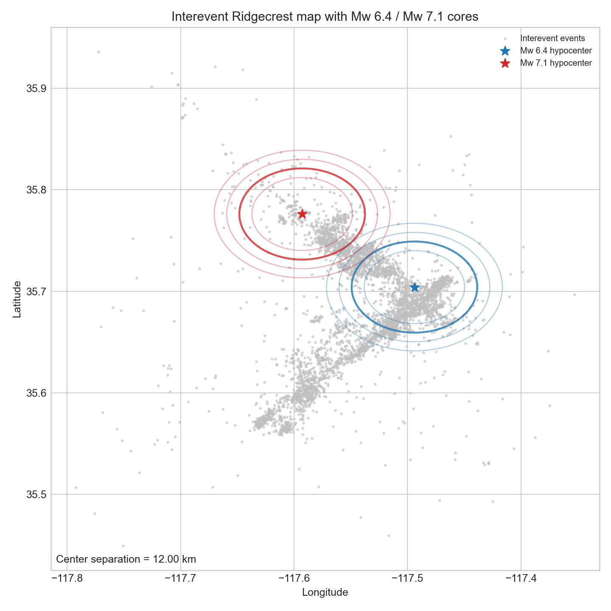
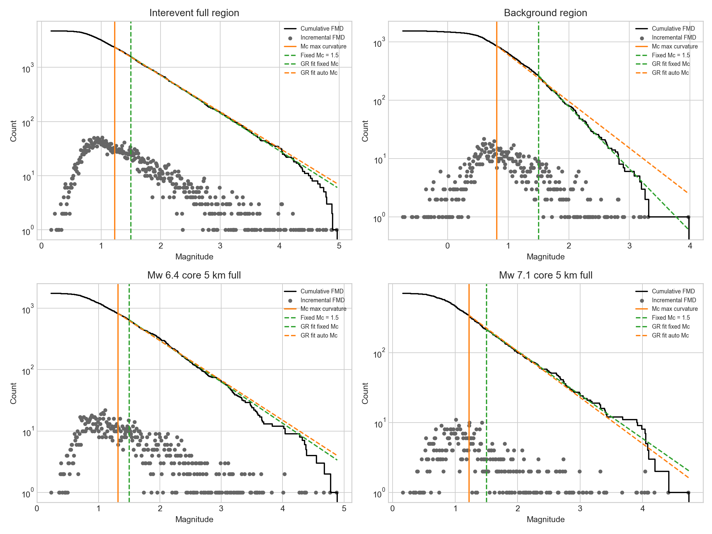
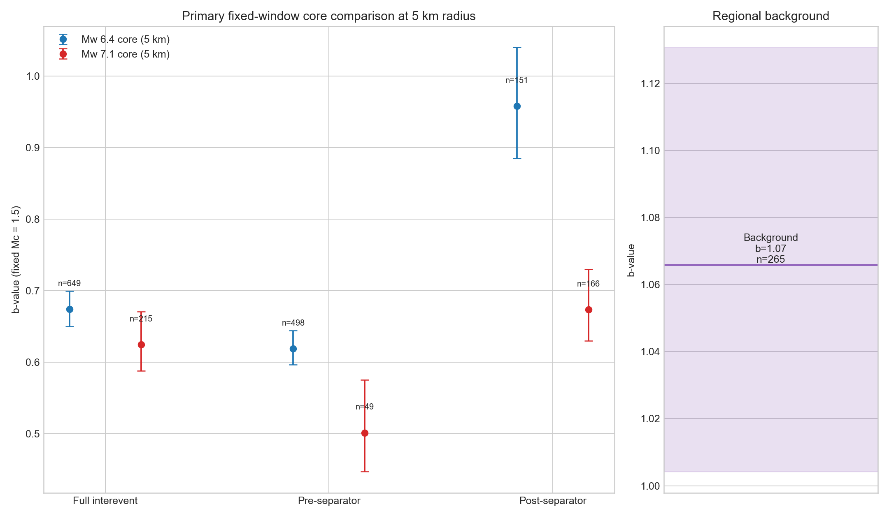
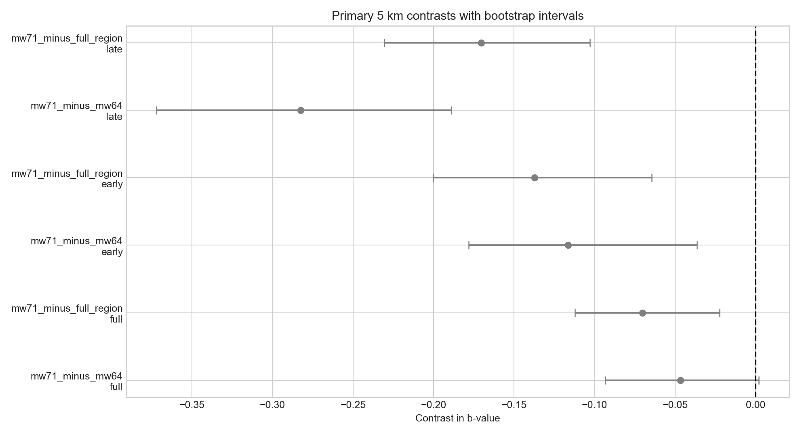
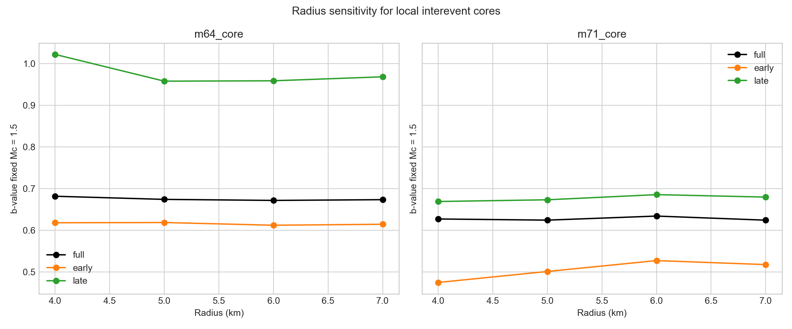
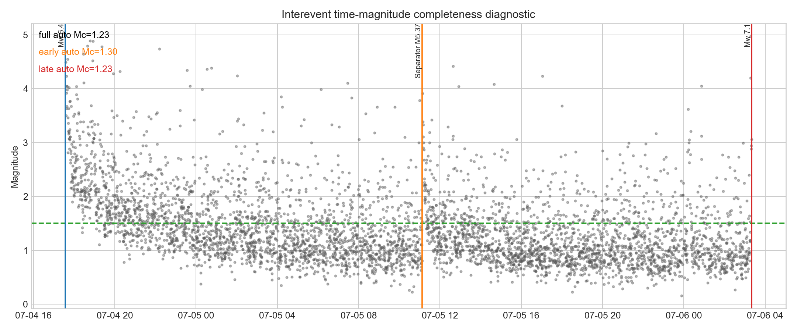
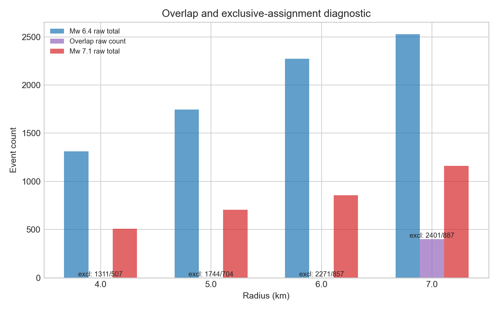

---
author:
- TRACE
date: 2026-07-06
title: Fixed-Window b-Value Contrasts for the Ridgecrest Sequence
---

# Abstract

This report documents a reproducible fixed-window Gutenberg–Richter b-value contrast analysis for the Ridgecrest sequence. The scientific objective was to compare seismicity in the future Mw 7.1 hypocentral core against the Mw 6.4 hypocentral control core, the full interevent region, and a larger long-term regional background, while reporting contrast direction, magnitude, uncertainty, and reliability without assuming any preferred sign a priori. The primary comparison uses a common fixed completeness threshold of $`M_c=1.5`$ across interevent subsets and the background reference, with automatic maximum-curvature and conservative $`M_c`$ estimates retained as quality-control diagnostics. The main 5 km results show that the Mw 7.1 core has lower fixed-$`M_c`$ b-values than both the Mw 6.4 core and the full interevent region in the full, early, and late interevent windows. However, the evidential strength is uneven: the full-window Mw 7.1 minus Mw 6.4 contrast is small ($`-0.050`$) and its 16th–84th percentile bootstrap interval reaches zero, whereas the late-window contrast is larger and robust ($`-0.285`$, 16th–84th percentile $`-0.372`$ to $`-0.189`$). All interevent local-core estimates are below the regional background reference evaluated at fixed $`M_c=1.5`$ ($`b\approx 1.066`$). The main limitation is the small early Mw 7.1 5 km subset ($`n_{\ge M_c}=49`$), which is exploratory and constrains interpretation of early-window contrasts.

# Scientific objective

The scientific question was: *How do b-values in the future Mw 7.1 hypocentral region compare with the Mw 6.4 hypocentral control region, the full interevent region, and the long-term regional background?* The requested workflow required fixed temporal windows, cylindrical local cores defined by horizontal distance in a local metric projection, and a primary fixed-$`M_c`$ comparison with $`M_c=1.5`$ for direct cross-window and cross-domain comparability.

The evidence package for this report is the completed analysis in <a href="../exp_run/outputs/01_ridgecrest_bvalue_contrast_analysis" class="uri">../exp_run/outputs/01_ridgecrest_bvalue_contrast_analysis</a>, with core machine-readable outputs in the aggregate and contrast tables and implementation metadata in the run metadata and validation files.

# Data, implementation, and reproducible workflow

## Input catalogs and analysis design

The analysis used the relocated interevent catalog, a two-year background catalog, and mainshock reference information specified in the task context. The full interevent window was defined from the Mw 6.4 origin time to the Mw 7.1 origin time, excluding both mainshocks. The early/late split used the fixed separator event at 2019-07-05T11:07:52.830000Z, which was excluded from all b-value estimates and retained only as a boundary marker. Background seismicity was treated as a single larger regional reference rather than subdivided into local cores.

A local azimuthal equidistant projection was used for distance calculations:

<div class="center">

<a href="+proj=aeqd +lat_0=35.74022 +lon_0=-117.54339 +datum=WGS84 +units=m +no_defs +type=crs" class="uri">+proj=aeqd +lat_0=35.74022 +lon_0=-117.54339 +datum=WGS84 +units=m +no_defs +type=crs</a>

</div>

This implementation choice is documented in the run metadata and catalog-summary outputs. The Mw 6.4 and Mw 7.1 hypocentral centers are separated by 11.998 km, which controls the expected overlap behavior of radius-based local cores.

## b-value estimation protocol

For each requested subset, the workflow reported total events, automatic maximum-curvature completeness $`M_c`$, conservative completeness $`M_c^{\mathrm{cons}}=\max(M_{c,\mathrm{subset}},M_{c,\mathrm{full\ window}})`$, number of events above threshold, b-value, bootstrap uncertainty, and magnitude range. The primary reported comparison uses fixed $`M_c=1.5`$ for the interevent subsets and the background regional reference. Supporting quality-control values were computed using automatic and conservative completeness thresholds.

b-values were estimated with the Aki–Utsu maximum-likelihood expression with magnitude-bin correction,
``` math
b = \frac{\log_{10}(e)}{\overline{M} - M_c + \Delta M/2},
```
where $`\Delta M`$ is the catalog magnitude precision. The workflow inferred a stable magnitude increment of $`\Delta M=0.01`$ for both the interevent and background catalogs. Uncertainty was estimated by bootstrap resampling with 2000 replicates per subset, using reproducible seeds and up to 64 workers. Reliability labels followed the requested thresholds based on $`n_{\ge M_c}`$.

## Produced outputs

The workflow succeeded and produced all requested figures and machine-readable tables, including:

- aggregate b-values: <a href="../exp_run/outputs/01_ridgecrest_bvalue_contrast_analysis/tables/bvalue_aggregates_unified.csv" class="uri">../exp_run/outputs/01_ridgecrest_bvalue_contrast_analysis/tables/bvalue_aggregates_unified.csv</a>

- contrast table: <a href="../exp_run/outputs/01_ridgecrest_bvalue_contrast_analysis/tables/bvalue_contrasts.csv" class="uri">../exp_run/outputs/01_ridgecrest_bvalue_contrast_analysis/tables/bvalue_contrasts.csv</a>

- overlap diagnostics: <a href="../exp_run/outputs/01_ridgecrest_bvalue_contrast_analysis/tables/radius_overlap_diagnostics.csv" class="uri">../exp_run/outputs/01_ridgecrest_bvalue_contrast_analysis/tables/radius_overlap_diagnostics.csv</a>

- cleaned catalog summaries: <a href="../exp_run/outputs/01_ridgecrest_bvalue_contrast_analysis/tables/cleaned_catalog_summaries.csv" class="uri">../exp_run/outputs/01_ridgecrest_bvalue_contrast_analysis/tables/cleaned_catalog_summaries.csv</a>

- separator metadata: <a href="../exp_run/outputs/01_ridgecrest_bvalue_contrast_analysis/tables/separator_event_metadata.csv" class="uri">../exp_run/outputs/01_ridgecrest_bvalue_contrast_analysis/tables/separator_event_metadata.csv</a>

- run metadata and validation: <a href="../exp_run/outputs/01_ridgecrest_bvalue_contrast_analysis/metadata/run_metadata.json" class="uri">../exp_run/outputs/01_ridgecrest_bvalue_contrast_analysis/metadata/run_metadata.json</a> and <a href="../exp_run/outputs/01_ridgecrest_bvalue_contrast_analysis/tables/run_validation_summary.csv" class="uri">../exp_run/outputs/01_ridgecrest_bvalue_contrast_analysis/tables/run_validation_summary.csv</a>

# Figures and direct evidence

Figure <a href="#fig:map" data-reference-type="ref" data-reference="fig:map">1</a> shows the interevent map and local-core geometry. Figure <a href="#fig:mfd" data-reference-type="ref" data-reference="fig:mfd">2</a> shows magnitude–frequency distributions and completeness diagnostics across key domains. Figure <a href="#fig:comparison" data-reference-type="ref" data-reference="fig:comparison">3</a> summarizes the main fixed-window b-value comparison at fixed $`M_c=1.5`$. Figure <a href="#fig:contrast" data-reference-type="ref" data-reference="fig:contrast">4</a> shows direct contrasts with bootstrap intervals. Figure <a href="#fig:radius" data-reference-type="ref" data-reference="fig:radius">5</a> evaluates radius sensitivity. Figure <a href="#fig:completeness" data-reference-type="ref" data-reference="fig:completeness">6</a> shows the time–magnitude completeness diagnostic, and Figure <a href="#fig:overlap" data-reference-type="ref" data-reference="fig:overlap">7</a> shows overlap behavior across radii.

<figure id="fig:map" data-latex-placement="H">

<figcaption>Interevent seismicity map with Mw 6.4 and Mw 7.1 hypocenters and the local-core geometry used in the analysis. The figure documents the approximately 12 km center spacing and the non-overlapping 5 km primary cores.</figcaption>
</figure>

<figure id="fig:mfd" data-latex-placement="H">

<figcaption>Magnitude–frequency distributions for the background region, full interevent region, and the two 5 km local cores. Catalog-derived automatic <span class="math inline"><em>M</em><sub><em>c</em></sub></span>, fixed <span class="math inline"><em>M</em><sub><em>c</em></sub> = 1.5</span>, and fitted Gutenberg–Richter lines are shown for direct comparison.</figcaption>
</figure>

<figure id="fig:comparison" data-latex-placement="H">

<figcaption>Primary fixed-window b-value comparison at fixed <span class="math inline"><em>M</em><sub><em>c</em></sub> = 1.5</span>. The Mw 6.4 and Mw 7.1 5 km cores are shown side by side for the full, early, and late interevent windows with bootstrap uncertainty intervals and sample-size labels. The regional background reference is displayed separately to preserve interpretability of the local pre/post comparison.</figcaption>
</figure>

<figure id="fig:contrast" data-latex-placement="H">

<figcaption>Direct b-value contrasts with bootstrap uncertainty intervals. Negative values indicate lower b-values in the Mw 7.1 target core relative to the reference domain.</figcaption>
</figure>

<figure id="fig:radius" data-latex-placement="H">

<figcaption>Radius sensitivity of local-core fixed-<span class="math inline"><em>M</em><sub><em>c</em></sub> = 1.5</span> b-values over radii of 4, 5, 6, and 7 km.</figcaption>
</figure>

<figure id="fig:completeness" data-latex-placement="H">

<figcaption>Time–magnitude completeness diagnostic for the interevent catalog. The figure supports fixed <span class="math inline"><em>M</em><sub><em>c</em></sub> = 1.5</span> as a conservative common threshold for the interevent analysis, while still showing transient detectability structure after the Mw 6.4 event.</figcaption>
</figure>

<figure id="fig:overlap" data-latex-placement="H">

<figcaption>Overlap diagnostic for local cores at radii of 4, 5, 6, and 7 km. The primary 5 km cores do not overlap. Overlap occurs only at 7 km, where exclusive nearest-hypocenter assignment is required.</figcaption>
</figure>

# Main results

## Primary 5 km fixed-$`M_c=1.5`$ b-values

Table <a href="#tab:primary" data-reference-type="ref" data-reference="tab:primary">1</a> summarizes the main fixed-window results used for interpretation. These values come directly from the unified aggregate table and correspond to the comparisons visualized in Figure <a href="#fig:comparison" data-reference-type="ref" data-reference="fig:comparison">3</a>.

<div id="tab:primary">

| Domain | Window | $`n_{\ge M_c}`$ | $`b`$ | Bootstrap 16th–84th | Reliability |
|:---|:---|:--:|:--:|:--:|:--:|
| Mw 6.4 core | Early | 498 | 0.619 | 0.596–0.645 | robust |
| Mw 6.4 core | Full | 649 | 0.674 | 0.650–0.699 | robust |
| Mw 6.4 core | Late | 151 | 0.958 | 0.885–1.040 | robust |
| Mw 7.1 core | Early | 49 | 0.501 | 0.447–0.575 | exploratory |
| Mw 7.1 core | Full | 215 | 0.624 | 0.588–0.671 | robust |
| Mw 7.1 core | Late | 166 | 0.673 | 0.630–0.730 | robust |
| Full interevent region | Early | 1067 | 0.642 | 0.624–0.661 | robust |
| Full interevent region | Full | 1594 | 0.697 | 0.681–0.715 | robust |
| Full interevent region | Late | 527 | 0.846 | 0.811–0.886 | robust |
| Background region | Full | 265 | 1.066 | 1.004–1.131 | robust |

Primary 5 km fixed-$`M_c=1.5`$ b-values for the local cores, full interevent region, and regional background reference. Bootstrap intervals are the 16th–84th percentile range. Reliability labels follow the requested $`n_{\ge M_c}`$ thresholds.

</div>

The primary 5 km results establish a clear descriptive ordering. In the full, early, and late windows, the Mw 7.1 core has lower fixed-$`M_c`$ b-values than both the Mw 6.4 core and the full interevent region. At the same time, all interevent local-core values remain below the regional background benchmark evaluated at fixed $`M_c=1.5`$. The interpretation is not that the Mw 7.1 region is deterministically precursory; rather, the observed low b-values are only consistent with more localized stress concentration relative to the comparison domains, subject to the reliability limits discussed below.

## Direct contrasts and their uncertainty

Table <a href="#tab:contrasts" data-reference-type="ref" data-reference="tab:contrasts">2</a> gives the key 5 km contrasts from the direct contrast table. These values address the scientific objective most directly because they quantify sign, magnitude, and uncertainty in a common framework.

<div id="tab:contrasts">

| Contrast | Window | $`\Delta b`$ | Bootstrap median | 16th–84th | Reliability | Interpretation |
|:---|:---|:---|:---|:---|:---|:---|
| Mw 7.1 $`-`$ Mw 6.4 | Full | $`-0.050`$ | $`-0.047`$ | $`-0.093`$ to $`+0.002`$ | robust | weak; interval reaches zero |
| Mw 7.1 $`-`$ Mw 6.4 | Early | $`-0.117`$ | $`-0.116`$ | $`-0.178`$ to $`-0.036`$ | exploratory | negative but limited by sample size |
| Mw 7.1 $`-`$ Mw 6.4 | Late | $`-0.285`$ | $`-0.283`$ | $`-0.372`$ to $`-0.189`$ | robust | strongest local-core deficit |
| Mw 7.1 $`-`$ Full region | Full | $`-0.073`$ | $`-0.070`$ | $`-0.112`$ to $`-0.022`$ | robust | clearly below regional interevent value |
| Mw 7.1 $`-`$ Full region | Early | $`-0.141`$ | $`-0.137`$ | $`-0.200`$ to $`-0.064`$ | exploratory | negative but limited by sample size |
| Mw 7.1 $`-`$ Full region | Late | $`-0.172`$ | $`-0.170`$ | $`-0.231`$ to $`-0.103`$ | robust | clear late deficit |

Primary 5 km fixed-$`M_c=1.5`$ contrasts. Negative values indicate lower b-values in the Mw 7.1 target core than in the reference domain.

</div>

Two points are especially important. First, the direction of the Mw 7.1 contrast is consistently negative across all 5 km windows for both reference choices. Second, not all negative contrasts are equally persuasive. The full-window Mw 7.1 minus Mw 6.4 contrast is small and not cleanly separated from zero at the reported bootstrap interval, whereas the late-window contrasts are substantially larger and remain entirely below zero.

## Temporal changes within each local core

The late-minus-early contrasts clarify why the late local-core comparison is the most diagnostic. For the 5 km radius, the Mw 6.4 core increases from $`b=0.619`$ in the early window to $`b=0.958`$ in the late window, giving late minus early $`=+0.339`$ with bootstrap interval $`+0.263`$ to $`+0.423`$ and robust reliability. The Mw 7.1 core also increases, from $`b=0.501`$ to $`b=0.673`$, giving late minus early $`=+0.172`$ with bootstrap interval $`+0.086`$ to $`+0.252`$, but the estimate is only exploratory because the early Mw 7.1 subset has $`n_{\ge M_c}=49`$. Thus both cores evolve toward higher late-window b-values, but the increase is much larger in the Mw 6.4 control core. This differential temporal change explains the strong late negative Mw 7.1 minus Mw 6.4 contrast in Figure <a href="#fig:comparison" data-reference-type="ref" data-reference="fig:comparison">3</a> and Figure <a href="#fig:contrast" data-reference-type="ref" data-reference="fig:contrast">4</a>.

## Background comparison and Mc dependence

The primary background comparison uses the larger regional background catalog evaluated at fixed $`M_c=1.5`$, giving $`b=1.066`$ with bootstrap interval $`1.004`$–$`1.131`$ and $`n_{\ge M_c}=265`$. This is the correct headline background value for cross-domain comparison because it uses the same threshold as the interevent subsets. As a supporting quality-control value, the automatic maximum-curvature background estimate is $`M_c\approx 0.81`$ with $`b\approx 0.799`$ and $`n_{\ge M_c}=855`$.

This difference is scientifically important. It does not indicate an error; it shows that the absolute background b-value depends materially on the completeness threshold because the background catalog remains complete to smaller magnitudes than the interevent windows. Therefore, the fixed-$`M_c=1.5`$ background value should be interpreted as a comparison convention chosen for consistency, whereas the automatic-$`M_c`$ background estimate serves as a diagnostic of catalog behavior. Figure <a href="#fig:mfd" data-reference-type="ref" data-reference="fig:mfd">2</a> makes this dependence explicit.

# Supporting diagnostics

## Completeness diagnostics and fixed-$`M_c`$ justification

Automatic interevent completeness values support the requested use of fixed $`M_c=1.5`$ as a conservative common threshold. The full interevent region has automatic $`M_c=1.23`$ for the full window, $`1.30`$ for the early window, and $`1.23`$ for the late window. For the 5 km local cores, automatic $`M_c`$ values are 1.32, 1.30, and 1.10 for the Mw 6.4 core and 1.22, 1.04, and 1.22 for the Mw 7.1 core for the full, early, and late windows, respectively. Figure <a href="#fig:completeness" data-reference-type="ref" data-reference="fig:completeness">6</a> shows that these values remain below 1.5, indicating that the fixed threshold is conservative for the interevent analysis. This supports direct cross-window comparisons while reducing sensitivity to transient post-mainshock incompleteness.

## Radius sensitivity

The local-core results are stable across radii of 4, 5, 6, and 7 km. For the fixed-$`M_c=1.5`$ full window, the Mw 6.4 core b-values are 0.682, 0.674, 0.672, and 0.674 across radii 4–7 km, and the Mw 7.1 core values are 0.627, 0.624, 0.634, and 0.624. The late-window deficit of the Mw 7.1 core relative to the Mw 6.4 core is also stable: $`-0.353`$, $`-0.285`$, $`-0.273`$, and $`-0.289`$ for 4, 5, 6, and 7 km, respectively. This consistency strengthens the conclusion that the late-window contrast is not an artifact of the exact local radius within the requested sensitivity range.

The early Mw 7.1 estimate is the least stable quantity because it is sample-size limited. At fixed $`M_c=1.5`$, $`n_{\ge M_c}`$ is 25 at 4 km, 49 at 5 km, 70 at 6 km, and 76 at 7 km. The corresponding reliability labels progress from highly unreliable to exploratory to usable-moderately-uncertain. Accordingly, the early-window sign is consistent but the exact magnitude should not be overinterpreted.

## Overlap behavior

Table <a href="#tab:overlap" data-reference-type="ref" data-reference="tab:overlap">3</a> summarizes the overlap diagnostics. The primary 5 km cores do not overlap, nor do the 4 km and 6 km cores. Overlap appears only at 7 km, where 401 events fall within both raw radius masks and exclusive nearest-hypocenter assignment is required.

<div id="tab:overlap">

| Radius (km) | Mw 6.4 raw total | Mw 7.1 raw total | Overlap count | Overlap fraction | Exclusive assignment required |
|:---|:---|:---|:---|:---|:---|
| 4 | 1311 | 507 | 0 | 0.000 | False |
| 5 | 1744 | 704 | 0 | 0.000 | False |
| 6 | 2271 | 857 | 0 | 0.000 | False |
| 7 | 2527 | 1162 | 401 | 0.122 | True |

Radius-overlap diagnostics for local cores. The center spacing is 11.998 km for all radii.

</div>

This result matters because it confirms that the primary 5 km comparison is not confounded by ambiguous event membership. The 7 km sensitivity case is still usable, but it is slightly less direct because it depends on exclusive assignment rules.

# Interpretation

The evidence supports the following scientifically restrained interpretation.

1.  The future Mw 7.1 hypocentral core has systematically lower fixed-$`M_c=1.5`$ b-values than both the Mw 6.4 hypocentral control core and the full interevent region in the full, early, and late windows.

2.  The strongest and most reliable expression of this difference occurs in the late interevent window, not in the full-window average. At the primary 5 km radius, Mw 7.1 minus Mw 6.4 is $`-0.285`$ in the late window with a bootstrap interval entirely below zero, whereas the full-window contrast is only $`-0.050`$ and is not cleanly distinguishable from zero at the reported interval.

3.  All interevent local-core b-values are below the larger-area background benchmark when the comparison is made at the requested common fixed threshold of $`M_c=1.5`$.

4.  The negative contrasts are consistent with localized stress concentration in the future Mw 7.1 hypocentral region relative to the comparison domains, but they should not be described as deterministic precursors. The analysis is diagnostic and comparative, not predictive.

# Limitations

The most important limitation is sample size in the early Mw 7.1 core. At the primary 5 km radius it contains only $`n_{\ge M_c}=49`$, which is classified as exploratory, and at 4 km it drops to 25 and becomes highly unreliable. Therefore, early-window comparisons involving the Mw 7.1 core are useful as directional evidence but should not carry the same interpretive weight as the full- and late-window robust results.

A second limitation is that the full-window Mw 7.1 minus Mw 6.4 contrast at 5 km is weak relative to its uncertainty. Its 16th–84th percentile interval extends from $`-0.093`$ to $`+0.002`$, so the negative sign is not cleanly separated from zero at that uncertainty level.

A third limitation is methodological rather than computational: the background benchmark depends on the choice of $`M_c`$. The requested fixed-$`M_c=1.5`$ background value is appropriate for direct comparison to the interevent results, but it is not the only valid absolute background estimate. The automatic-$`M_c`$ background value is much lower because the catalog is complete to smaller magnitudes.

A fourth limitation is the spatial definition. Local subsets were defined by horizontal cylindrical cores in the projected plane, as requested, rather than by full 3-D hypocentral distance. The results therefore characterize horizontal localization around the two hypocenters and may not capture any depth-dependent structure.

Finally, although fixed $`M_c=1.5`$ is supported as a conservative interevent threshold, Figure <a href="#fig:completeness" data-reference-type="ref" data-reference="fig:completeness">6</a> still shows transient post-mainshock detectability effects immediately after the Mw 6.4 event. The fixed threshold mitigates this issue but does not remove all completeness complexity.

# Conclusion

This analysis delivered the requested reproducible fixed-window b-value contrast study for the Ridgecrest sequence. The main conclusion is that, at the primary 5 km radius and fixed $`M_c=1.5`$, the future Mw 7.1 hypocentral core exhibits lower b-values than both the Mw 6.4 control core and the full interevent region in all three reported windows. The most compelling evidence is late in the interevent period, where the Mw 7.1 minus Mw 6.4 contrast is $`-0.285`$ with a bootstrap interval entirely below zero, and the Mw 7.1 minus full-region contrast is $`-0.172`$, also entirely below zero. By contrast, the full-window Mw 7.1 minus Mw 6.4 difference is small and not cleanly distinct from zero at the reported interval.

The broader regional background, evaluated using the requested fixed threshold of $`M_c=1.5`$, has a higher b-value than any of the interevent local-core estimates. Completeness diagnostics support the use of fixed $`M_c=1.5`$ as a conservative common threshold for the interevent analysis, radius sensitivity shows that the main local-core conclusions are stable across 4–7 km, and overlap diagnostics confirm that the primary 5 km cores are non-overlapping. The principal caution is the early Mw 7.1 subset, whose limited sample size makes early-window contrasts exploratory rather than definitive.

# Key evidence files

- Aggregates: <a href="../exp_run/outputs/01_ridgecrest_bvalue_contrast_analysis/tables/bvalue_aggregates_unified.csv" class="uri">../exp_run/outputs/01_ridgecrest_bvalue_contrast_analysis/tables/bvalue_aggregates_unified.csv</a>

- Contrasts: <a href="../exp_run/outputs/01_ridgecrest_bvalue_contrast_analysis/tables/bvalue_contrasts.csv" class="uri">../exp_run/outputs/01_ridgecrest_bvalue_contrast_analysis/tables/bvalue_contrasts.csv</a>

- Overlap diagnostics: <a href="../exp_run/outputs/01_ridgecrest_bvalue_contrast_analysis/tables/radius_overlap_diagnostics.csv" class="uri">../exp_run/outputs/01_ridgecrest_bvalue_contrast_analysis/tables/radius_overlap_diagnostics.csv</a>

- Run metadata: <a href="../exp_run/outputs/01_ridgecrest_bvalue_contrast_analysis/metadata/run_metadata.json" class="uri">../exp_run/outputs/01_ridgecrest_bvalue_contrast_analysis/metadata/run_metadata.json</a>

- Validation summary: <a href="../exp_run/outputs/01_ridgecrest_bvalue_contrast_analysis/tables/run_validation_summary.csv" class="uri">../exp_run/outputs/01_ridgecrest_bvalue_contrast_analysis/tables/run_validation_summary.csv</a>
