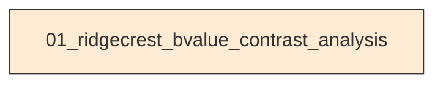
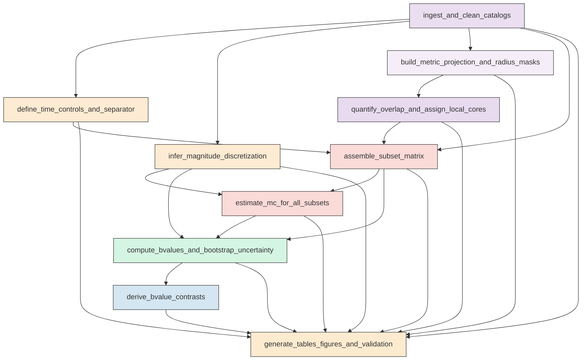

# Workflow Overview

## Top-Level Task Dependencies

**Description:**
- `01_ridgecrest_bvalue_contrast_analysis`: Execute the complete Ridgecrest fixed-window b-value contrast workflow from catalog harmonization through diagnostics, figures, and validation.

## Subtask Dependencies

#### 01_ridgecrest_bvalue_contrast_analysis
**Usage**: Execute the complete Ridgecrest fixed-window b-value contrast workflow from catalog harmonization through diagnostics, figures, and validation.

**Description:**
- `ingest_and_clean_catalogs`: Read the interevent, background, and mainshock files, harmonize schemas, clean invalid rows, and preserve traceable event identifiers.
- `define_time_controls_and_separator`: Identify the Mw 6.4 and Mw 7.1 origin times, locate the separator event metadata, and define strict interevent windows with required exclusions.
- `infer_magnitude_discretization`: Infer catalog magnitude discretization for Mc and b-value estimation and record any harmonized comparison increment.
- `build_metric_projection_and_radius_masks`: Project events and hypocenters to a local metric CRS, compute horizontal distances, and construct local core memberships for all requested radii.
- `quantify_overlap_and_assign_local_cores`: Compute raw overlap diagnostics for each radius and create exclusive nearest-hypocenter local assignments when overlap occurs.
- `assemble_subset_matrix`: Build the full matrix of background, interevent regional, and local-core subsets across windows, radii, and assignment modes.
- `estimate_mc_for_all_subsets`: Compute automatic and conservative magnitude of completeness values for every supported subset using maximum curvature.
- `compute_bvalues_and_bootstrap_uncertainty`: Estimate b-values and supporting statistics for fixed, automatic, and conservative Mc modes and bootstrap uncertainty summaries in parallel.
- `derive_bvalue_contrasts`: Compute requested fixed-window b-value contrasts and bootstrap difference intervals for core, regional, and temporal comparisons.
- `generate_tables_figures_and_validation`: Write all required CSV outputs, create diagnostic figures, save reproducibility metadata, and validate that required fixed-Mc products are present.