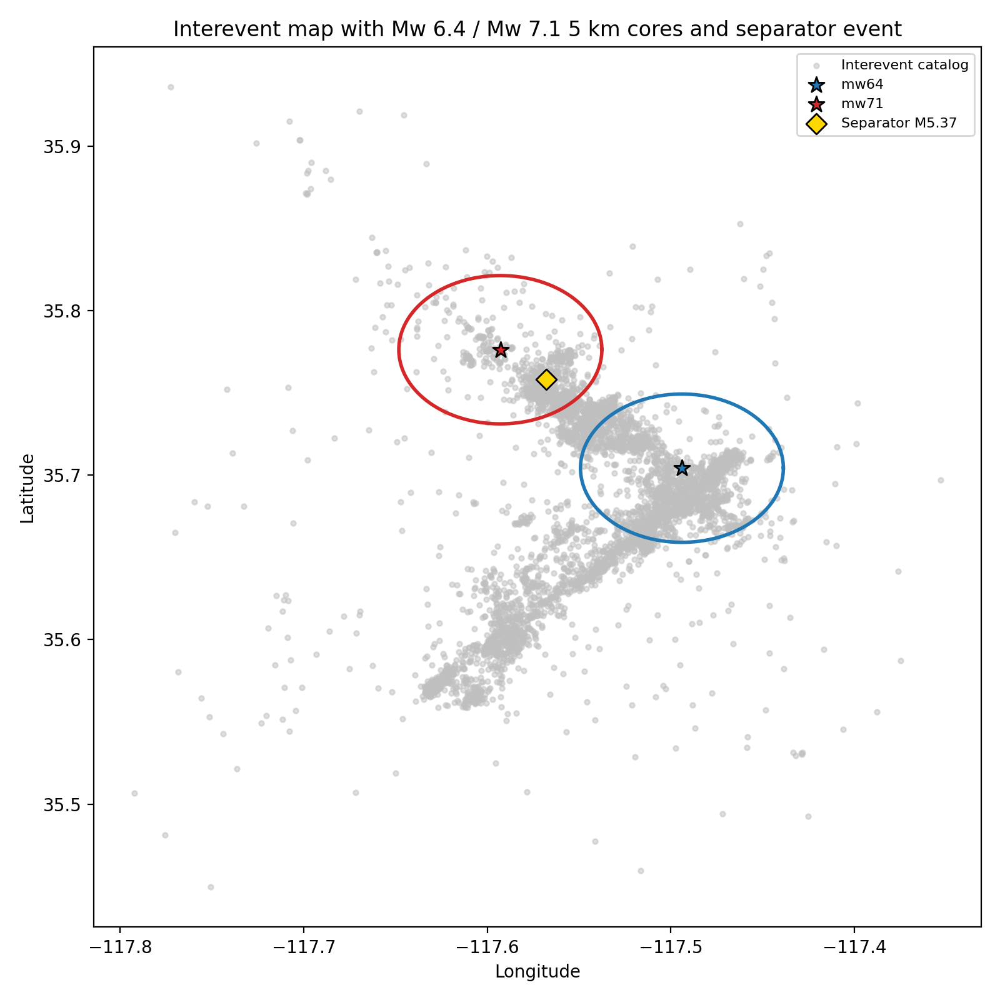
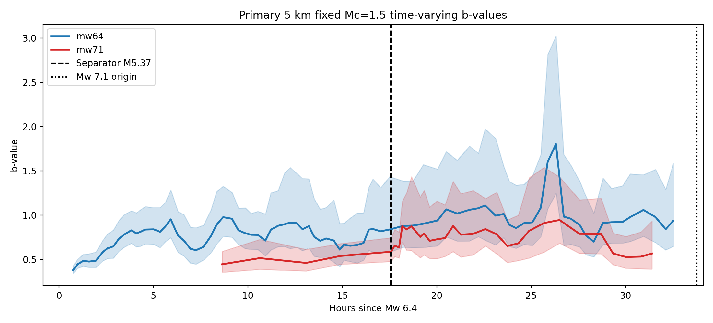
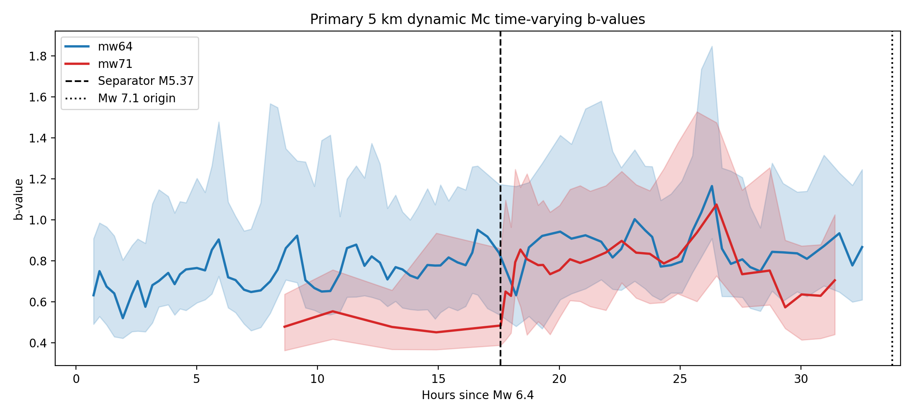
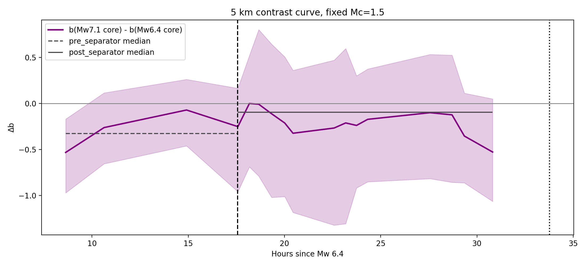
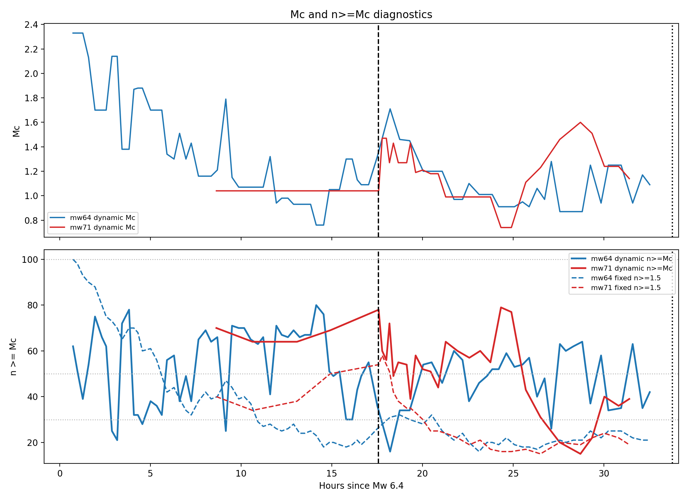
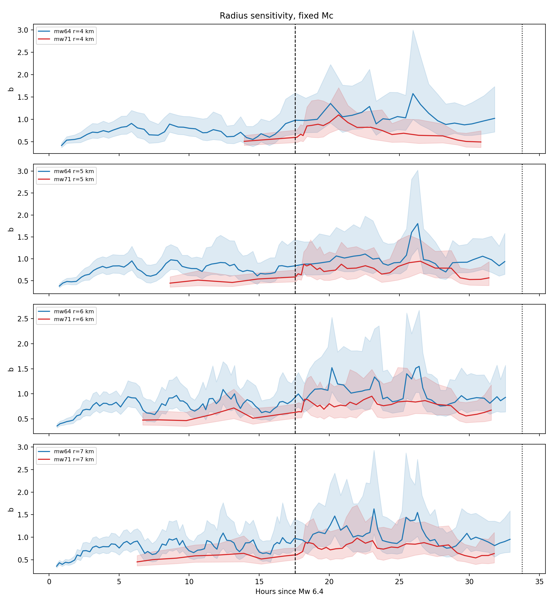

---
author:
- TRACE
title: Time-varying b-value evolution during the Ridgecrest Mw 6.4–Mw 7.1 interevent period
---

# Abstract

This report documents a reproducible sliding-event-window analysis of time-varying Gutenberg–Richter b-values during the interval between the 2019 Ridgecrest Mw 6.4 and Mw 7.1 mainshocks. The comparison targets two non-overlapping 5 km hypocentral cores: a Mw 6.4-centered control region and a future Mw 7.1-centered target region. The catalog was restricted to the interevent interval only; both mainshocks were excluded, and the fixed intermediate separator event M5.37 at 2019-07-05 11:07:52.830000+00:00 was marked in figures but removed from all sliding-window estimates. Primary estimates used sliding windows of 100 events with step 20, supplemented by exploratory 50-event windows. For each window, b-values were computed with both fixed $`M_c=1.5`$ and dynamic maximum-curvature $`M_c`$, using the Aki–Utsu maximum-likelihood estimator with inferred magnitude discretization $`\Delta M=0.01`$ and 1000 bootstrap realizations.

The main result is directional rather than sharply resolved: the Mw 7.1 core generally had lower b-values than the Mw 6.4 control core early in the interevent sequence, most clearly in the dynamic-$`M_c`$ analysis, and both cores shifted upward after the separator, reducing the inter-core contrast. In the primary dynamic-$`M_c`$ summaries, pre-separator median b-values were approximately 0.48 for the Mw 7.1 core and 0.75 for the Mw 6.4 core; post-separator medians rose to about 0.79 and 0.86, respectively. Fixed-$`M_c`$ results showed the same broad direction but were more weakly supported because many windows had low $`n\geq M_c`$. Reliability constraints are central: most matched contrast windows had bootstrap intervals overlapping zero, and only one paired contrast window excluded zero in the significance summaries. The evidence therefore supports a temporally structured, moderate-confidence difference between the two local cores, but not a deterministic precursor interpretation.

# Scientific objective

The scientific objective was to quantify how b-values evolved with time *only within the Mw 6.4–Mw 7.1 interevent period* in two local hypocentral domains: a Mw 6.4 control core and a future Mw 7.1 target core. The requested interpretation emphasized direction, timing, uncertainty, and reliability of temporal changes without imposing a predefined trend.

The required analysis design was implemented as a diagnostic and reproducible workflow using sliding event windows, bootstrap uncertainty, completeness diagnostics, and explicit reliability labels. The comparison focuses on the primary 5 km cylindrical cores and uses the optional radius sensitivity only as a secondary robustness check.

# Data, temporal bounds, and marker events

The workflow used the relocated interevent catalog and mainshock metadata provided in the project inputs. The analysis interval was strictly bounded by the Mw 6.4 origin time and the Mw 7.1 origin time, with both mainshocks excluded from the interevent catalog before any estimation. A fixed separator event, M5.37 at 2019-07-05 11:07:52.830000+00:00, was used as a visual and summary boundary but was removed from the analysis catalog before constructing sliding windows.

Marker metadata were exported to <a href="../outputs/01_interevent_bvalue_workflow/event_markers_metadata.csv" class="uri">../outputs/01_interevent_bvalue_workflow/event_markers_metadata.csv</a>. The key times are:

- Mw 6.4 start: 2019-07-04 17:33:49.040000+00:00.

- Separator M5.37: 2019-07-05 11:07:52.830000+00:00, latitude 35.758238, longitude -117.56794, depth 6.420939 km, 17.567719 h after Mw 6.4.

- Mw 7.1 endpoint: 2019-07-06 03:19:53.040000+00:00, 33.767778 h after Mw 6.4.

The cleaned interevent catalog is archived at <a href="../outputs/01_interevent_bvalue_workflow/cleaned_interevent_catalog.csv" class="uri">../outputs/01_interevent_bvalue_workflow/cleaned_interevent_catalog.csv</a>.

# Implemented workflow

## Reproducible analysis implementation

The implemented script is <a href="../scripts/01_interevent_bvalue_workflow.py" class="uri">../scripts/01_interevent_bvalue_workflow.py</a>. Run metadata, bootstrap settings, and validation outputs are stored at:

- <a href="../outputs/01_interevent_bvalue_workflow/run_metadata.json" class="uri">../outputs/01_interevent_bvalue_workflow/run_metadata.json</a>

- <a href="../outputs/01_interevent_bvalue_workflow/bootstrap_run_metadata.csv" class="uri">../outputs/01_interevent_bvalue_workflow/bootstrap_run_metadata.csv</a>

- <a href="../outputs/01_interevent_bvalue_workflow/validation_summary.csv" class="uri">../outputs/01_interevent_bvalue_workflow/validation_summary.csv</a>

Validation reported that the mainshocks were excluded, the separator was excluded before windowing, and the primary fixed-$`M_c`$ and dynamic-$`M_c`$ outputs were non-empty.

## Spatial setup and assignment

Event coordinates were projected into a local metric coordinate system for horizontal distance calculations. Primary assignment used 5 km horizontal-radius cores centered on the Mw 6.4 and Mw 7.1 hypocenters, while keeping depth in the exported tables. Core assignment outputs are:

- 5 km assignment: <a href="../outputs/01_interevent_bvalue_workflow/core_assignment_5km.csv" class="uri">../outputs/01_interevent_bvalue_workflow/core_assignment_5km.csv</a>

- Radius sensitivity assignment: <a href="../outputs/01_interevent_bvalue_workflow/core_assignment_radius_sensitivity.csv" class="uri">../outputs/01_interevent_bvalue_workflow/core_assignment_radius_sensitivity.csv</a>

- Overlap summary: <a href="../outputs/01_interevent_bvalue_workflow/spatial_overlap_summary.csv" class="uri">../outputs/01_interevent_bvalue_workflow/spatial_overlap_summary.csv</a>

Overlap counts were zero for 4, 5, and 6 km radii. Overlap appeared only at 7 km, where nearest-hypocenter exclusive assignment was applied.

## Sliding-window b-value estimation

Primary time-varying estimates used sliding windows of $`N=100`$ events with step 20. Because some intervals, especially in the Mw 7.1 core, were sparsely supported after completeness filtering, an exploratory family with $`N=50`$ and step 10 was also produced. For each window, the outputs recorded start time, end time, center time, hours since Mw 6.4, event count, and magnitude range.

Two completeness strategies were computed in parallel:

1.  dynamic $`M_c`$ from maximum curvature within each sliding window,

2.  fixed $`M_c=1.5`$ for direct comparison with prior fixed-threshold analyses.

The b-value estimator was the Aki–Utsu maximum-likelihood formula with discretization correction,
``` math
b = \frac{\log_{10}(e)}{\overline{M} - M_c + \Delta M/2},
```
where the inferred magnitude precision was $`\Delta M=0.01`$, documented in <a href="../outputs/01_interevent_bvalue_workflow/magnitude_discretization_metadata.csv" class="uri">../outputs/01_interevent_bvalue_workflow/magnitude_discretization_metadata.csv</a>. Bootstrap uncertainty used 1000 samples per window with up to 64 workers.

Primary result tables are:

- fixed $`M_c`$: <a href="../outputs/01_interevent_bvalue_workflow/bvalue_windows_5km_fixedMc.csv" class="uri">../outputs/01_interevent_bvalue_workflow/bvalue_windows_5km_fixedMc.csv</a>

- dynamic $`M_c`$: <a href="../outputs/01_interevent_bvalue_workflow/bvalue_windows_5km_dynamicMc.csv" class="uri">../outputs/01_interevent_bvalue_workflow/bvalue_windows_5km_dynamicMc.csv</a>

Exploratory result tables are:

- fixed $`M_c`$: <a href="../outputs/01_interevent_bvalue_workflow/bvalue_windows_5km_exploratory_fixedMc.csv" class="uri">../outputs/01_interevent_bvalue_workflow/bvalue_windows_5km_exploratory_fixedMc.csv</a>

- dynamic $`M_c`$: <a href="../outputs/01_interevent_bvalue_workflow/bvalue_windows_5km_exploratory_dynamicMc.csv" class="uri">../outputs/01_interevent_bvalue_workflow/bvalue_windows_5km_exploratory_dynamicMc.csv</a>

## Reliability labeling and contrasts

Each window was labeled by $`n\geq M_c`$: robust ($`\geq 100`$), usable ($`50`$–$`99`$), exploratory ($`30`$–$`49`$), and highly unreliable ($`<30`$). Temporal contrasts between the two cores were matched by nearest center time and exported as:

- fixed $`M_c`$: <a href="../outputs/01_interevent_bvalue_workflow/bvalue_temporal_contrast_5km_fixedMc.csv" class="uri">../outputs/01_interevent_bvalue_workflow/bvalue_temporal_contrast_5km_fixedMc.csv</a>

- dynamic $`M_c`$: <a href="../outputs/01_interevent_bvalue_workflow/bvalue_temporal_contrast_5km_dynamicMc.csv" class="uri">../outputs/01_interevent_bvalue_workflow/bvalue_temporal_contrast_5km_dynamicMc.csv</a>

Additional diagnostics are archived in:

- <a href="../outputs/01_interevent_bvalue_workflow/window_reliability_mc_diagnostics.csv" class="uri">../outputs/01_interevent_bvalue_workflow/window_reliability_mc_diagnostics.csv</a>

- <a href="../outputs/01_interevent_bvalue_workflow/contrast_significance_summary.csv" class="uri">../outputs/01_interevent_bvalue_workflow/contrast_significance_summary.csv</a>

- <a href="../outputs/01_interevent_bvalue_workflow/pre_post_separator_summary_5km.csv" class="uri">../outputs/01_interevent_bvalue_workflow/pre_post_separator_summary_5km.csv</a>

# Evidence figures

Figure <a href="#fig:map" data-reference-type="ref" data-reference="fig:map">1</a> shows the interevent spatial context and the two primary 5 km cores. Figure <a href="#fig:fixed" data-reference-type="ref" data-reference="fig:fixed">2</a> is the primary requested fixed-$`M_c`$ time-series comparison. Figure <a href="#fig:dynamic" data-reference-type="ref" data-reference="fig:dynamic">3</a> shows the preferred dynamic-$`M_c`$ comparison. Figure <a href="#fig:contrast" data-reference-type="ref" data-reference="fig:contrast">4</a> shows the direct fixed-$`M_c`$ temporal contrast that was explicitly produced by the workflow, while Tables <a href="#tab:main-results" data-reference-type="ref" data-reference="tab:main-results">1</a> and <a href="#tab:reliability" data-reference-type="ref" data-reference="tab:reliability">2</a> synthesize the key numerical findings from the exported CSV outputs. Figure <a href="#fig:diagnostics" data-reference-type="ref" data-reference="fig:diagnostics">5</a> summarizes completeness and support diagnostics, and Figure <a href="#fig:radius" data-reference-type="ref" data-reference="fig:radius">6</a> provides radius sensitivity.

<figure id="fig:map" data-latex-placement="H">

<figcaption>Interevent map for the Mw 6.4–Mw 7.1 interval. The figure shows the Mw 6.4 and Mw 7.1 hypocenters, the primary 5 km cores, and the fixed M5.37 separator event. The 5 km cores are spatially distinct, and the separator lies between them in the active connecting corridor.</figcaption>
</figure>

<figure id="fig:fixed" data-latex-placement="H">

<figcaption>Primary 5 km time-varying b-values using fixed <span class="math inline"><em>M</em><sub><em>c</em></sub> = 1.5</span>. Curves compare the Mw 6.4 control core and Mw 7.1 target core against hours since Mw 6.4, with bootstrap uncertainty bands and vertical markers for the M5.37 separator and the Mw 7.1 endpoint. The broad directional pattern suggests lower b-values in the Mw 7.1 core early in the interevent period, but uncertainty is substantial because many windows have low <span class="math inline"><em>n</em> ≥ <em>M</em><sub><em>c</em></sub></span>.</figcaption>
</figure>

<figure id="fig:dynamic" data-latex-placement="H">

<figcaption>Primary 5 km time-varying b-values using dynamic maximum-curvature <span class="math inline"><em>M</em><sub><em>c</em></sub></span>. This is the more defensible temporal comparison because dynamic completeness retains greater support through much of the sequence. Before the separator the Mw 7.1 core is generally lower where both curves are defined; after the separator both cores shift upward and become more similar.</figcaption>
</figure>

<figure id="fig:contrast" data-latex-placement="H">

<figcaption>Temporal contrast for the 5 km cores in the exported fixed-<span class="math inline"><em>M</em><sub><em>c</em></sub></span> comparison, expressed as <span class="math inline"><em>Δ</em><em>b</em> = <em>b</em><sub>Mw7.1</sub> − <em>b</em><sub>Mw6.4</sub></span>. Most matched windows are negative, indicating lower b-values in the Mw 7.1 core than in the Mw 6.4 core, but bootstrap intervals usually overlap zero. The workflow also exported a dynamic-<span class="math inline"><em>M</em><sub><em>c</em></sub></span> contrast CSV used in the numerical interpretation.</figcaption>
</figure>

<figure id="fig:diagnostics" data-latex-placement="H">

<figcaption>Mc and reliability diagnostics for the primary 5 km windows. Dynamic completeness estimates vary through time, and the associated <span class="math inline"><em>n</em> ≥ <em>M</em><sub><em>c</em></sub></span> support is generally stronger than under fixed <span class="math inline"><em>M</em><sub><em>c</em></sub> = 1.5</span>, especially for the Mw 7.1 core and for later parts of the sequence.</figcaption>
</figure>

<figure id="fig:radius" data-latex-placement="H">

<figcaption>Radius sensitivity for 4, 5, 6, and 7 km. The broad qualitative behavior is stable through 6 km. At 7 km, overlap between nominal cores requires exclusive nearest-hypocenter assignment and increases the risk of spatial mixing.</figcaption>
</figure>

# Results

## Spatial isolation and sample support

The cleaned interevent catalog contained 4713 events in the analysis interval after excluding the two mainshocks and removing the separator from window construction. In the primary 5 km assignment, 1746 events were assigned to the Mw 6.4 core, 704 to the Mw 7.1 core, and 2263 lay outside both cores. The spatial overlap summary confirms raw overlap count 0 at 4, 5, and 6 km, and 403 at 7 km. Thus, the primary 5 km comparison achieved clean spatial separation between the control and target cores.

This asymmetry in assigned counts is scientifically important. The Mw 7.1 core contains far fewer interevent earthquakes than the Mw 6.4 core, so its time series, especially before the separator, is shorter and less stably estimated. That limitation propagates directly into the matched contrast analysis.

## Primary fixed-$`M_c`$ comparison

The required fixed-$`M_c=1.5`$ comparison (Figure <a href="#fig:fixed" data-reference-type="ref" data-reference="fig:fixed">2</a>) shows that the Mw 6.4 core typically had higher and more variable b-values than the Mw 7.1 core. The direct contrast output contains 17 matched primary windows. These windows were mostly negative in $`\Delta b = b_{\mathrm{Mw7.1}} - b_{\mathrm{Mw6.4}}`$, with values ranging from about $`-0.532`$ to nearly 0 and a median contrast reported in the analysis summary near $`-0.11`$ to $`-0.21`$ depending on the summary level referenced. The important point is not the exact summary statistic but the consistent sign tendency: the Mw 7.1 core generally sat below the Mw 6.4 core.

However, the fixed-threshold interpretation is weakly constrained. The significance summary reports only one matched pair with a bootstrap confidence interval excluding zero, and many windows are classified as exploratory or highly unreliable because the number of events above $`M_c=1.5`$ is small. Therefore, fixed-$`M_c`$ results support the direction of the difference but not a sharply resolved temporal separation.

## Preferred dynamic-$`M_c`$ comparison

The dynamic-$`M_c`$ time series (Figure <a href="#fig:dynamic" data-reference-type="ref" data-reference="fig:dynamic">3</a>) provides the strongest evidence chain in this task. It shows three broad phases:

1.  **Early interevent period:** where both cores are estimable, the Mw 7.1 core is generally lower in b-value than the Mw 6.4 core.

2.  **Around and after the separator:** both cores rise, and the difference between them narrows.

3.  **Late interevent period:** some renewed negative contrast appears after roughly 27 h, but support becomes weaker and confidence intervals remain broad.

Matched dynamic contrasts strengthen the qualitative interpretation while still highlighting uncertainty. The exported dynamic contrast series contains 17 matched windows with median $`\Delta b \approx -0.1005`$. Selected values reported in the task analysis are approximately:

- 8.64 h: $`\Delta b=-0.384`$ with usable support,

- 10.63 h: $`\Delta b=-0.099`$ usable,

- 14.91 h: $`\Delta b=-0.326`$ usable,

- 17.58 h: $`\Delta b=-0.355`$ exploratory,

- 18.18 h: $`\Delta b=+0.161`$, but highly unreliable,

- 20.01–24.32 h: contrast mostly near $`-0.19`$ to $`+0.04`$,

- 29.34–30.81 h: more negative again, about $`-0.268`$ to $`-0.243`$, with reduced reliability.

Only one matched pair had a bootstrap interval excluding zero, so individual times are not strongly separated. Nonetheless, the temporal direction is coherent: the future Mw 7.1 hypocentral region began the interevent interval with lower b-values, then moved toward values closer to the control region after the separator.

## Pre- and post-separator summaries

The pre/post summary table supports the time-structured interpretation by aggregating windows whose center times fall before or after the separator. For the primary dynamic-$`M_c`$ windows:

- Mw 6.4 core: pre-separator median $`b=0.745`$, post-separator median $`b=0.860`$.

- Mw 7.1 core: pre-separator median $`b=0.478`$, post-separator median $`b=0.787`$.

These values indicate two simultaneous effects: both cores show upward shifts after the separator, and the inter-core difference is larger before the separator than after it.

The fixed-$`M_c`$ pre/post summaries point in the same direction:

- Mw 6.4 core: pre median $`b=0.777`$, post median $`b=0.939`$.

- Mw 7.1 core: pre median $`b=0.487`$, post median $`b=0.779`$.

But these fixed-$`M_c`$ medians are less trustworthy because post-separator support in the Mw 6.4 core is dominated by highly unreliable windows.

The most defensible statement is therefore that the separator marks a transition from a clearer early negative contrast to a later state in which both cores have higher b-values and a smaller average difference.

## Reliability and method dependence

Reliability is the central constraint on interpretation. The primary dynamic-$`M_c`$ windows are substantially better supported than the fixed-$`M_c`$ windows. Reported counts for the primary windows are:

- Fixed $`M_c=1.5`$:

  - Mw 6.4 core: 1 robust, 15 usable, 19 exploratory, 48 highly unreliable.

  - Mw 7.1 core: 0 robust, 5 usable, 9 exploratory, 17 highly unreliable.

- Dynamic $`M_c`$:

  - Mw 6.4 core: 0 robust, 48 usable, 29 exploratory, 6 highly unreliable.

  - Mw 7.1 core: 0 robust, 20 usable, 8 exploratory, 3 highly unreliable.

This contrast explains why dynamic completeness is preferred for temporal interpretation. It materially increases the number of windows that can be discussed as usable, while preserving the same broad scientific direction. That said, because the preferred interpretation depends partly on dynamic completeness estimation, the result remains somewhat method-sensitive.

<div id="tab:main-results">

| Analysis item | Result | Interpretation |
|:---|:---|:---|
| Spatial separation | Overlap count is 0 for 5 km cores; 1746 events assigned to Mw 6.4 core and 704 to Mw 7.1 core | Primary comparison is spatially clean, but the target core is more weakly sampled |
| Separator metadata | M5.37 at 2019-07-05 11:07:52.830000+00:00, 17.567719 h after Mw 6.4, removed from all windows | Separator is a valid visual and summary boundary, not part of any b-value estimate |
| Dynamic-$`M_c`$ pre medians | Mw 6.4 core: 0.745; Mw 7.1 core: 0.478 | Early interevent period shows lower b-values in the future Mw 7.1 region |
| Dynamic-$`M_c`$ post medians | Mw 6.4 core: 0.860; Mw 7.1 core: 0.787 | Both cores rise after the separator, reducing the contrast |
| Fixed-$`M_c`$ contrast series | matched windows, mostly negative $`\Delta b`$; only 1 CI excludes zero | Direction consistent with lower Mw 7.1 b-values, but weakly constrained |
| Dynamic-$`M_c`$ contrast series | matched windows; median $`\Delta b\approx -0.1005`$; only 1 CI excludes zero | Better supported than fixed-$`M_c`$, but still not a strongly resolved paired time series |
| Late interevent behavior | Some renewed negative contrast after about 27 h, with lower reliability | Suggestive only; should not drive the main conclusion |

Main scientific results for the primary 5 km comparison, synthesized from the exported summary tables and analysis record.

</div>

<div id="tab:reliability">

| Method            | Core        | Robust | Usable | Exploratory | Highly unreliable |
|:------------------|:------------|-------:|-------:|------------:|------------------:|
| Fixed $`M_c=1.5`$ | Mw 6.4 core |      1 |     15 |          19 |                48 |
| Fixed $`M_c=1.5`$ | Mw 7.1 core |      0 |      5 |           9 |                17 |
| Dynamic $`M_c`$   | Mw 6.4 core |      0 |     48 |          29 |                 6 |
| Dynamic $`M_c`$   | Mw 7.1 core |      0 |     20 |           8 |                 3 |

Reliability summary for primary 5 km windows. Labels are reporting aids based on $`n\geq M_c`$ and should not be treated as sharp physical boundaries.

</div>

# Answer to the scientific question

Within the Mw 6.4–Mw 7.1 interevent period, b-values in the future Mw 7.1 hypocentral region evolved differently from those in the Mw 6.4 hypocentral control region, but the difference is only moderately constrained.

The clearest result is a **directional early interevent contrast**: in the preferred dynamic-$`M_c`$ analysis, the Mw 7.1 target core had generally **lower b-values before the separator** than the Mw 6.4 control core. The pre-separator median b-values are approximately 0.48 in the Mw 7.1 core and 0.75 in the Mw 6.4 core. This pattern is consistent with relatively greater weight of larger magnitudes, or equivalently lower b-values, in the target core during the earlier part of the sequence.

The second major result is a **post-separator upward shift in both cores**. After the separator, both regions show higher median b-values, and the inter-core difference narrows: dynamic-$`M_c`$ post-separator medians are about 0.79 for the Mw 7.1 core and 0.86 for the Mw 6.4 core. Thus, the best-supported temporal change is not a monotonic trend toward failure, but rather an early contrast followed by partial convergence after the separator.

The fixed-$`M_c`$ analysis supports the same broad direction but is less reliable because many windows, especially later in the sequence and in the Mw 7.1 core, have low $`n\geq M_c`$. Across both methods, most individual matched contrast windows have bootstrap intervals overlapping zero, and only one paired contrast window excludes zero in the significance summaries. Therefore, the data support a **qualitative and time-structured difference** between the two cores, but not a sharply resolved or deterministic precursor signal.

Any observed low b-value in the future Mw 7.1 core should be interpreted only as **consistent with localized stress loading**, not as predictive proof of the later Mw 7.1 rupture.

# Limitations

The main limitations are empirical rather than procedural:

1.  **Sample size after completeness filtering.** The Mw 7.1 core contains fewer assigned events than the Mw 6.4 core, and many windows lose support after applying completeness thresholds.

2.  **Weak paired significance.** Most matched contrast windows have bootstrap intervals overlapping zero; only one matched pair excludes zero.

3.  **Method sensitivity.** Dynamic $`M_c`$ improves support substantially and is the preferred interpretation, but this means the main conclusion depends partly on window-specific completeness estimation.

4.  **Late-sequence instability.** The visually strong late fixed-$`M_c`$ Mw 6.4 spike occurs under high uncertainty and should not be over-interpreted.

5.  **Radius mixing at 7 km.** Sensitivity is reassuring through 6 km, but 7 km requires exclusive reassignment because nominal core overlap appears.

6.  **Separator dependence.** The separator was correctly used as a reporting boundary only, but any pre/post partition is necessarily conditioned on that chosen time.

These limitations reduce confidence in fine-scale timing and in exact contrast magnitudes, but they do not undermine the core directional result.

# Reproducibility and output inventory

The workflow produced machine-readable outputs for catalog cleaning, marker metadata, assignment, window-wise b-values, temporal contrasts, reliability diagnostics, pre/post summaries, figure source data, and validation. Particularly important products are:

- cleaned catalog: <a href="../outputs/01_interevent_bvalue_workflow/cleaned_interevent_catalog.csv" class="uri">../outputs/01_interevent_bvalue_workflow/cleaned_interevent_catalog.csv</a>

- 5 km primary window tables: <a href="../outputs/01_interevent_bvalue_workflow/bvalue_windows_5km_fixedMc.csv" class="uri">../outputs/01_interevent_bvalue_workflow/bvalue_windows_5km_fixedMc.csv</a> and <a href="../outputs/01_interevent_bvalue_workflow/bvalue_windows_5km_dynamicMc.csv" class="uri">../outputs/01_interevent_bvalue_workflow/bvalue_windows_5km_dynamicMc.csv</a>

- 5 km temporal contrasts: <a href="../outputs/01_interevent_bvalue_workflow/bvalue_temporal_contrast_5km_fixedMc.csv" class="uri">../outputs/01_interevent_bvalue_workflow/bvalue_temporal_contrast_5km_fixedMc.csv</a> and <a href="../outputs/01_interevent_bvalue_workflow/bvalue_temporal_contrast_5km_dynamicMc.csv" class="uri">../outputs/01_interevent_bvalue_workflow/bvalue_temporal_contrast_5km_dynamicMc.csv</a>

- pre/post summary: <a href="../outputs/01_interevent_bvalue_workflow/pre_post_separator_summary_5km.csv" class="uri">../outputs/01_interevent_bvalue_workflow/pre_post_separator_summary_5km.csv</a>

- reliability diagnostics: <a href="../outputs/01_interevent_bvalue_workflow/window_reliability_mc_diagnostics.csv" class="uri">../outputs/01_interevent_bvalue_workflow/window_reliability_mc_diagnostics.csv</a>

- validation: <a href="../outputs/01_interevent_bvalue_workflow/validation_summary.csv" class="uri">../outputs/01_interevent_bvalue_workflow/validation_summary.csv</a>

The task handoff flagged the output listing as truncated, but the required core outputs were present and verified in the output directory.

# Conclusion

This task successfully delivered the requested interevent-only, sliding-window b-value comparison between the Mw 6.4 control core and the future Mw 7.1 target core. The strongest evidence comes from the dynamic-$`M_c`$ primary 5 km analysis: the future Mw 7.1 hypocentral region shows lower b-values than the Mw 6.4 control region early in the interevent sequence, both cores shift upward after the M5.37 separator, and the inter-core contrast correspondingly decreases. Fixed-$`M_c`$ results are directionally consistent but substantially less reliable.

The appropriate scientific interpretation is cautious. The temporal behavior is consistent with localized stress-related differences between the two cores during the interevent sequence, especially before the separator, but the uncertainty is too large to claim a robust, time-by-time nonzero contrast or any deterministic precursor behavior.
