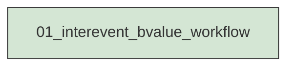
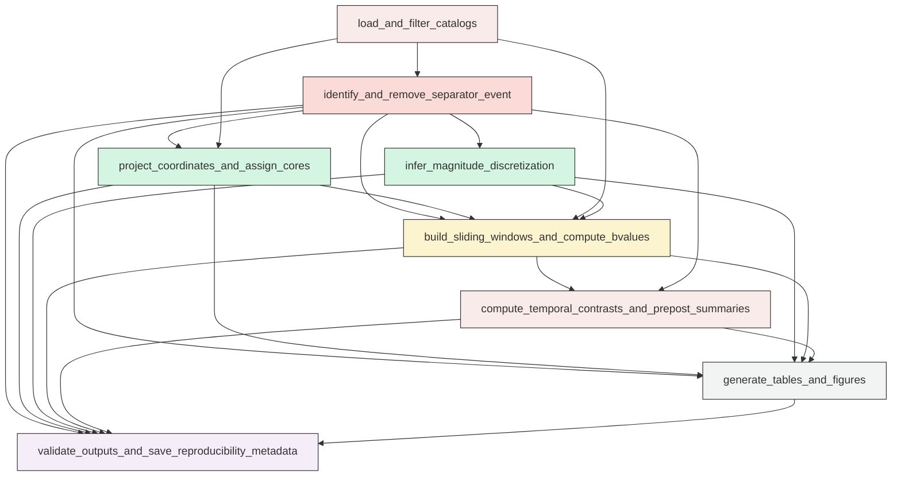

# Research Codings

## Task Overview


**Description:**
- `01_interevent_bvalue_workflow`: Execute the full interevent sliding-window b-value analysis for the Mw 6.4 and Mw 7.1 core regions, including cleaning, assignment, estimation, contrasts, figures, and validation.


## Task Details


#### 01_interevent_bvalue_workflow
**Usage**: Execute the full interevent sliding-window b-value analysis for the Mw 6.4 and Mw 7.1 core regions, including cleaning, assignment, estimation, contrasts, figures, and validation.

**Description:**
- `load_and_filter_catalogs`: Load the relocated catalog and mainshock table, identify the Mw 6.4 and Mw 7.1 events, isolate the strict interevent period, and exclude both mainshocks.
- `identify_and_remove_separator_event`: Identify the fixed M5.37 separator event, record its metadata and elapsed time since Mw 6.4, and remove it from all analysis inputs.
- `project_coordinates_and_assign_cores`: Project events to a local metric CRS, compute horizontal distances to both hypocenters, assign events to primary and sensitivity cores, and resolve overlap by nearest-hypocenter assignment when needed.
- `infer_magnitude_discretization`: Infer the global magnitude bin width from stable non-zero spacing in sorted unique magnitudes and record the selection metadata.
- `build_sliding_windows_and_compute_bvalues`: Construct chronological sliding event windows for each core and radius, then compute fixed-Mc and dynamic-Mc b-values, bootstrap uncertainty, Mc diagnostics, and reliability labels.
- `compute_temporal_contrasts_and_prepost_summaries`: Match Mw 7.1 and Mw 6.4 window estimates by nearest center time, compute b-value contrasts with uncertainty, and summarize pre- and post-separator behavior without fitting a trend model.
- `generate_tables_and_figures`: Save required CSV tables, figure-source tables, and the full figure suite with separator and Mw 7.1 endpoint markers on all time-series panels.
- `validate_outputs_and_save_reproducibility_metadata`: Validate catalog filtering, separator exclusion, window construction, statistical outputs, and figure completeness, then write run metadata, inventory, logs, and failure evidence if needed.

#### Coding Script

```python

from __future__ import annotations

import json
import math
import os
import shutil
import sys
import traceback
from concurrent.futures import ProcessPoolExecutor, as_completed
from dataclasses import dataclass
from pathlib import Path
from typing import Any

import matplotlib
matplotlib.use("Agg")
import matplotlib.pyplot as plt
import numpy as np
import pandas as pd
from matplotlib.patches import Circle
from pyproj import Transformer
from seismostats.analysis import estimate_b, estimate_mc_maxc


CATALOG_PATH = Path("<REPO_ROOT>/examples/ridgecrest/data/catalog_TRACE/TRACE_ridgecrest_relocated.csv")
MAINSHOCK_PATH = Path("<REPO_ROOT>/examples/ridgecrest/data/catalog_TRACE/main_shock_events.csv")
SCRIPT_PATH = Path("../exp_run/scripts/01_interevent_bvalue_workflow.py")
OUTPUT_DIR = Path("../exp_run/outputs/01_interevent_bvalue_workflow")

PRIMARY_RADIUS_KM = 5
SENSITIVITY_RADII_KM = [4, 5, 6, 7]
PRIMARY_WINDOW_N = 100
PRIMARY_STEP = 20
EXPLORATORY_WINDOW_N = 50
EXPLORATORY_STEP = 10
FIXED_MC = 1.5
SEPARATOR_TIME = pd.Timestamp("2019-07-05T11:07:52.830000Z")
BOOTSTRAP_SAMPLES = 1000
RANDOM_SEED = 20250706
MAX_WORKERS = min(64, os.cpu_count() or 1)
CONF_LEVELS = (2.5, 97.5)
TIME_MISMATCH_FRAC = 0.5
RELIABILITY_RANK = {
    "invalid": 0,
    "highly_unreliable": 1,
    "exploratory": 2,
    "usable_but_moderately_uncertain": 3,
    "robust": 4,
}


@dataclass(frozen=True)
class WindowSpec:
    label: str
    n_events: int
    step: int
    exploratory: bool


def log(message: str) -> None:
    print(message, flush=True)


def reset_output_dir(output_dir: Path) -> None:
    output_dir.mkdir(parents=True, exist_ok=True)
    for child in output_dir.iterdir():
        if child.is_dir():
            shutil.rmtree(child)
        else:
            child.unlink()


def infer_delta_m(magnitudes: pd.Series) -> tuple[float, dict[str, Any]]:
    unique_vals = np.sort(np.unique(np.round(magnitudes.dropna().to_numpy(dtype=float), 6)))
    diffs = np.diff(unique_vals)
    diffs = diffs[diffs > 1e-6]
    if len(diffs) == 0:
        delta = 0.1
    else:
        q10 = float(np.quantile(diffs, 0.1))
        candidates = np.array([0.001, 0.005, 0.01, 0.02, 0.05, 0.1])
        delta = float(candidates[np.argmin(np.abs(candidates - q10))])
    meta = {
        "n_unique_magnitudes": int(len(unique_vals)),
        "n_nonzero_diffs": int(len(diffs)),
        "min_diff": None if len(diffs) == 0 else float(np.min(diffs)),
        "q01_diff": None if len(diffs) == 0 else float(np.quantile(diffs, 0.01)),
        "q05_diff": None if len(diffs) == 0 else float(np.quantile(diffs, 0.05)),
        "q10_diff": None if len(diffs) == 0 else float(np.quantile(diffs, 0.10)),
        "median_diff": None if len(diffs) == 0 else float(np.quantile(diffs, 0.50)),
        "selected_delta_m": delta,
    }
    return delta, meta


def reliability_label(n_ge_mc: float | int | None) -> str:
    if n_ge_mc is None or pd.isna(n_ge_mc):
        return "invalid"
    n = float(n_ge_mc)
    if n >= 100:
        return "robust"
    if n >= 50:
        return "usable_but_moderately_uncertain"
    if n >= 30:
        return "exploratory"
    return "highly_unreliable"


def project_catalog(df: pd.DataFrame, main_df: pd.DataFrame) -> tuple[pd.DataFrame, pd.DataFrame, str]:
    lon0 = float(main_df["longitude"].mean())
    zone = int(math.floor((lon0 + 180.0) / 6.0) + 1)
    epsg = 32600 + zone
    transformer = Transformer.from_crs("EPSG:4326", f"EPSG:{epsg}", always_xy=True)

    main_x, main_y = transformer.transform(main_df["longitude"].to_numpy(), main_df["latitude"].to_numpy())
    main_df = main_df.copy()
    main_df["x_m"] = main_x
    main_df["y_m"] = main_y

    x, y = transformer.transform(df["longitude"].to_numpy(), df["latitude"].to_numpy())
    df = df.copy()
    df["x_m"] = x
    df["y_m"] = y
    return df, main_df, f"EPSG:{epsg}"


def add_distance_columns(df: pd.DataFrame, main_df: pd.DataFrame) -> pd.DataFrame:
    df = df.copy()
    for _, row in main_df.iterrows():
        label = row["shock_label"]
        dist_km = np.hypot(df["x_m"] - row["x_m"], df["y_m"] - row["y_m"]) / 1000.0
        df[f"dist_{label}_km"] = dist_km
    return df


def build_assignments(clean_df: pd.DataFrame, radii_km: list[int]) -> tuple[pd.DataFrame, pd.DataFrame]:
    records = []
    overlap_records = []
    nearest = np.where(
        clean_df["dist_mw64_km"].to_numpy() <= clean_df["dist_mw71_km"].to_numpy(),
        "mw64",
        "mw71",
    )
    for radius in radii_km:
        in64 = clean_df["dist_mw64_km"] <= radius
        in71 = clean_df["dist_mw71_km"] <= radius
        overlap = in64 & in71
        assigned = np.full(len(clean_df), "outside", dtype=object)
        assigned[in64 & ~in71] = "mw64"
        assigned[in71 & ~in64] = "mw71"
        overlap_idx = np.where(overlap)[0]
        if len(overlap_idx) > 0:
            assigned[overlap_idx] = nearest[overlap_idx]
        tmp = clean_df[["event_time", "latitude", "longitude", "depth_km", "magnitude", "dist_mw64_km", "dist_mw71_km"]].copy()
        tmp["radius_km"] = radius
        tmp["raw_in_mw64"] = in64.to_numpy()
        tmp["raw_in_mw71"] = in71.to_numpy()
        tmp["raw_overlap"] = overlap.to_numpy()
        tmp["nearest_hypocenter"] = nearest
        tmp["assigned_core"] = assigned
        records.append(tmp)
        overlap_records.append(
            {
                "radius_km": radius,
                "raw_count_mw64": int(in64.sum()),
                "raw_count_mw71": int(in71.sum()),
                "raw_overlap_count": int(overlap.sum()),
                "assigned_count_mw64": int((assigned == "mw64").sum()),
                "assigned_count_mw71": int((assigned == "mw71").sum()),
                "outside_count": int((assigned == "outside").sum()),
            }
        )
    return pd.concat(records, ignore_index=True), pd.DataFrame(overlap_records)


def make_windows(df: pd.DataFrame, spec: WindowSpec) -> list[dict[str, Any]]:
    windows = []
    n_total = len(df)
    if n_total < spec.n_events:
        return windows
    mags = df["magnitude"].to_numpy(dtype=float)
    times = df["event_time"].to_numpy()
    for start in range(0, n_total - spec.n_events + 1, spec.step):
        end = start + spec.n_events
        sub = df.iloc[start:end]
        windows.append(
            {
                "window_index": len(windows),
                "start_idx": start,
                "end_idx_exclusive": end,
                "magnitudes": mags[start:end].copy(),
                "times": times[start:end].copy(),
                "start_time": sub["event_time"].iloc[0],
                "end_time": sub["event_time"].iloc[-1],
                "center_time": sub["event_time"].iloc[len(sub) // 2],
                "median_time": sub["event_time"].sort_values().iloc[len(sub) // 2],
                "event_count": int(len(sub)),
                "magnitude_min": float(sub["magnitude"].min()),
                "magnitude_max": float(sub["magnitude"].max()),
            }
        )
    return windows


def compute_ci(values: np.ndarray) -> tuple[float | None, float | None]:
    valid = values[np.isfinite(values)]
    if len(valid) == 0:
        return None, None
    return float(np.percentile(valid, CONF_LEVELS[0])), float(np.percentile(valid, CONF_LEVELS[1]))


def compute_b_for_sample(magnitudes: np.ndarray, mc_mode: str, delta_m: float, fixed_mc: float) -> tuple[float | None, float | None, int | None, str | None]:
    try:
        mags = np.asarray(magnitudes, dtype=float)
        mags = mags[np.isfinite(mags)]
        if len(mags) == 0:
            return None, None, None, "no_magnitudes"
        if mc_mode == "fixed":
            mc = float(fixed_mc)
        elif mc_mode == "dynamic":
            mc, _meta = estimate_mc_maxc(mags, fmd_bin=delta_m)
            mc = float(mc)
        else:
            raise ValueError(f"Unsupported mc_mode: {mc_mode}")
        n_ge_mc = int(np.sum(mags >= mc))
        if n_ge_mc < 2:
            return None, mc, n_ge_mc, "n_ge_mc_lt_2"
        b_val = float(estimate_b(mags, mc=mc, delta_m=delta_m))
        if not np.isfinite(b_val):
            return None, mc, n_ge_mc, "b_not_finite"
        return b_val, mc, n_ge_mc, None
    except Exception as exc:
        return None, None, None, f"{type(exc).__name__}: {exc}"


def bootstrap_distribution(magnitudes: np.ndarray, mc_mode: str, delta_m: float, fixed_mc: float, n_boot: int, seed: int) -> tuple[np.ndarray, np.ndarray, np.ndarray]:
    rng = np.random.default_rng(seed)
    n = len(magnitudes)
    bvals = np.full(n_boot, np.nan, dtype=float)
    mcs = np.full(n_boot, np.nan, dtype=float)
    nge = np.full(n_boot, np.nan, dtype=float)
    for i in range(n_boot):
        sample = rng.choice(magnitudes, size=n, replace=True)
        b_val, mc, n_ge_mc, _status = compute_b_for_sample(sample, mc_mode=mc_mode, delta_m=delta_m, fixed_mc=fixed_mc)
        if b_val is not None:
            bvals[i] = b_val
        if mc is not None:
            mcs[i] = mc
        if n_ge_mc is not None:
            nge[i] = n_ge_mc
    return bvals, mcs, nge


def analyze_window_task(task: dict[str, Any]) -> dict[str, Any]:
    mags = task["magnitudes"]
    base_b, mc, n_ge_mc, status = compute_b_for_sample(mags, task["mc_mode"], task["delta_m"], task["fixed_mc"])
    boot_b, boot_mc, boot_nge = bootstrap_distribution(
        magnitudes=mags,
        mc_mode=task["mc_mode"],
        delta_m=task["delta_m"],
        fixed_mc=task["fixed_mc"],
        n_boot=task["bootstrap_samples"],
        seed=task["seed"],
    )
    ci_low, ci_high = compute_ci(boot_b)
    valid_boot = boot_b[np.isfinite(boot_b)]
    valid_boot_mc = boot_mc[np.isfinite(boot_mc)]
    valid_boot_nge = boot_nge[np.isfinite(boot_nge)]
    return {
        **{k: v for k, v in task.items() if k != "magnitudes"},
        "b_value": base_b,
        "mc": mc,
        "n_ge_mc": n_ge_mc,
        "status": "ok" if status is None else status,
        "bootstrap_valid_count": int(len(valid_boot)),
        "bootstrap_mean": None if len(valid_boot) == 0 else float(np.mean(valid_boot)),
        "bootstrap_median": None if len(valid_boot) == 0 else float(np.median(valid_boot)),
        "bootstrap_std": None if len(valid_boot) == 0 else float(np.std(valid_boot, ddof=1)) if len(valid_boot) > 1 else 0.0,
        "bootstrap_ci_low": ci_low,
        "bootstrap_ci_high": ci_high,
        "bootstrap_ci_width": None if ci_low is None or ci_high is None else float(ci_high - ci_low),
        "bootstrap_mc_median": None if len(valid_boot_mc) == 0 else float(np.median(valid_boot_mc)),
        "bootstrap_n_ge_mc_median": None if len(valid_boot_nge) == 0 else float(np.median(valid_boot_nge)),
    }


def run_window_analysis(core_df: pd.DataFrame, core_label: str, radius_km: int, spec: WindowSpec, delta_m: float, mw64_time: pd.Timestamp, mc_mode: str) -> pd.DataFrame:
    windows = make_windows(core_df, spec)
    if not windows:
        return pd.DataFrame()
    log(f"Preparing {len(windows)} windows for core={core_label}, radius={radius_km}, spec={spec.label}, mc_mode={mc_mode}")
    tasks = []
    for w in windows:
        tasks.append(
            {
                "core_label": core_label,
                "radius_km": radius_km,
                "window_label": spec.label,
                "window_n": spec.n_events,
                "window_step": spec.step,
                "exploratory": spec.exploratory,
                "mc_mode": mc_mode,
                "delta_m": delta_m,
                "fixed_mc": FIXED_MC,
                "bootstrap_samples": BOOTSTRAP_SAMPLES,
                "window_index": w["window_index"],
                "start_idx": w["start_idx"],
                "end_idx_exclusive": w["end_idx_exclusive"],
                "start_time": w["start_time"],
                "end_time": w["end_time"],
                "center_time": w["center_time"],
                "median_time": w["median_time"],
                "hours_since_mw64": float((pd.Timestamp(w["center_time"]) - mw64_time).total_seconds() / 3600.0),
                "event_count": w["event_count"],
                "magnitude_min": w["magnitude_min"],
                "magnitude_max": w["magnitude_max"],
                "seed": RANDOM_SEED + radius_km * 100000 + (0 if core_label == "mw64" else 50000) + w["window_index"] * 17 + (0 if mc_mode == "fixed" else 1),
                "magnitudes": w["magnitudes"],
            }
        )
    results: list[dict[str, Any]] = []
    with ProcessPoolExecutor(max_workers=MAX_WORKERS) as ex:
        future_to_idx = {ex.submit(analyze_window_task, task): i for i, task in enumerate(tasks)}
        total = len(future_to_idx)
        for j, future in enumerate(as_completed(future_to_idx), start=1):
            results.append(future.result())
            if j == 1 or j % max(1, total // 10) == 0 or j == total:
                log(f"Completed {j}/{total} windows for core={core_label}, radius={radius_km}, spec={spec.label}, mc_mode={mc_mode}")
    out = pd.DataFrame(results).sort_values("window_index").reset_index(drop=True)
    out["reliability_label"] = out["n_ge_mc"].apply(reliability_label)
    return out


def match_contrasts(df: pd.DataFrame, label: str) -> pd.DataFrame:
    required_cols = [
        "core_label", "center_time", "hours_since_mw64", "window_label", "radius_km", "mc_mode",
        "exploratory", "b_value", "bootstrap_ci_low", "bootstrap_ci_high", "reliability_label", "n_ge_mc",
    ]
    if df.empty or any(col not in df.columns for col in required_cols):
        return pd.DataFrame()
    left = df[df["core_label"] == "mw64"].sort_values("center_time").reset_index(drop=True)
    right = df[df["core_label"] == "mw71"].sort_values("center_time").reset_index(drop=True)
    if left.empty or right.empty:
        return pd.DataFrame()
    left_times = pd.to_datetime(left["center_time"]).astype("int64").to_numpy()
    spacing_hours = np.diff(np.sort(np.unique(np.concatenate([left["hours_since_mw64"].to_numpy(), right["hours_since_mw64"].to_numpy()]))))
    median_spacing = float(np.median(spacing_hours)) if len(spacing_hours) else np.nan
    max_mismatch = np.inf if not np.isfinite(median_spacing) else TIME_MISMATCH_FRAC * median_spacing
    rows = []
    for _, r in right.iterrows():
        target = pd.Timestamp(r["center_time"]).value
        idx = int(np.argmin(np.abs(left_times - target)))
        l = left.iloc[idx]
        mismatch_h = abs(float(r["hours_since_mw64"]) - float(l["hours_since_mw64"]))
        if mismatch_h > max_mismatch:
            continue
        ci_low = None
        ci_high = None
        if pd.notna(r["bootstrap_ci_low"]) and pd.notna(l["bootstrap_ci_high"]):
            ci_low = float(r["bootstrap_ci_low"] - l["bootstrap_ci_high"])
        if pd.notna(r["bootstrap_ci_high"]) and pd.notna(l["bootstrap_ci_low"]):
            ci_high = float(r["bootstrap_ci_high"] - l["bootstrap_ci_low"])
        joint_reliability = r["reliability_label"]
        if RELIABILITY_RANK.get(l["reliability_label"], -1) < RELIABILITY_RANK.get(r["reliability_label"], -1):
            joint_reliability = l["reliability_label"]
        rows.append(
            {
                "series_label": label,
                "window_label": r["window_label"],
                "radius_km": int(r["radius_km"]),
                "mc_mode": r["mc_mode"],
                "exploratory": bool(r["exploratory"]),
                "matched_center_time": r["center_time"],
                "hours_since_mw64": float(r["hours_since_mw64"]),
                "time_mismatch_hours": mismatch_h,
                "delta_b": None if pd.isna(r["b_value"]) or pd.isna(l["b_value"]) else float(r["b_value"] - l["b_value"]),
                "delta_b_ci_low": ci_low,
                "delta_b_ci_high": ci_high,
                "delta_b_ci_width": None if ci_low is None or ci_high is None else float(ci_high - ci_low),
                "joint_reliability_label": joint_reliability,
                "mw71_b": r["b_value"],
                "mw64_b": l["b_value"],
                "mw71_n_ge_mc": r["n_ge_mc"],
                "mw64_n_ge_mc": l["n_ge_mc"],
                "mw71_center_time": r["center_time"],
                "mw64_center_time": l["center_time"],
            }
        )
    return pd.DataFrame(rows)


def summarize_pre_post(window_df: pd.DataFrame, contrast_df: pd.DataFrame, separator_time: pd.Timestamp) -> pd.DataFrame:
    rows = []
    for name, df in [("window", window_df), ("contrast", contrast_df)]:
        if df.empty:
            continue
        time_col = "center_time" if name == "window" else "matched_center_time"
        for keys, group in df.groupby([c for c in ["core_label", "radius_km", "window_label", "mc_mode"] if c in df.columns], dropna=False):
            if not isinstance(keys, tuple):
                keys = (keys,)
            key_names = [c for c in ["core_label", "radius_km", "window_label", "mc_mode"] if c in df.columns]
            key_map = dict(zip(key_names, keys))
            for period_name, sub in {
                "pre_separator": group[pd.to_datetime(group[time_col]) < separator_time],
                "post_separator": group[pd.to_datetime(group[time_col]) >= separator_time],
            }.items():
                if sub.empty:
                    continue
                value_col = "b_value" if name == "window" else "delta_b"
                ciw_col = "bootstrap_ci_width" if name == "window" else "delta_b_ci_width"
                row = {
                    "series_type": name,
                    "period": period_name,
                    "n_windows": int(len(sub)),
                    "n_robust": int((sub.get("reliability_label", sub.get("joint_reliability_label")) == "robust").sum()),
                    "n_usable": int((sub.get("reliability_label", sub.get("joint_reliability_label")) == "usable_but_moderately_uncertain").sum()),
                    "n_exploratory": int((sub.get("reliability_label", sub.get("joint_reliability_label")) == "exploratory").sum()),
                    "n_highly_unreliable": int((sub.get("reliability_label", sub.get("joint_reliability_label")) == "highly_unreliable").sum()),
                    "median_value": float(sub[value_col].dropna().median()) if sub[value_col].notna().any() else None,
                    "mean_value": float(sub[value_col].dropna().mean()) if sub[value_col].notna().any() else None,
                    "median_ci_width": float(sub[ciw_col].dropna().median()) if ciw_col in sub.columns and sub[ciw_col].notna().any() else None,
                }
                if "mc" in sub.columns and sub["mc"].notna().any():
                    row["median_mc"] = float(sub["mc"].dropna().median())
                row.update(key_map)
                rows.append(row)
    return pd.DataFrame(rows)


def figure_map(clean_df: pd.DataFrame, main_df: pd.DataFrame, separator_row: pd.Series, out_path: Path, crs: str) -> None:
    fig, ax = plt.subplots(figsize=(8, 8))
    ax.scatter(clean_df["longitude"], clean_df["latitude"], c="0.75", s=8, alpha=0.5, label="Interevent catalog")
    colors = {"mw64": "tab:blue", "mw71": "tab:red"}
    local_to_geo = Transformer.from_crs(crs, "EPSG:4326", always_xy=True)
    for _, row in main_df.iterrows():
        ax.scatter(row["longitude"], row["latitude"], s=90, c=colors[row["shock_label"]], marker="*", edgecolor="k", label=row["shock_label"])
    ax.scatter(separator_row["longitude"], separator_row["latitude"], s=70, c="gold", marker="D", edgecolor="k", label="Separator M5.37")
    theta = np.linspace(0, 2 * np.pi, 400)
    for _, row in main_df.iterrows():
        x = row["x_m"] + PRIMARY_RADIUS_KM * 1000.0 * np.cos(theta)
        y = row["y_m"] + PRIMARY_RADIUS_KM * 1000.0 * np.sin(theta)
        lon, lat = local_to_geo.transform(x, y)
        ax.plot(lon, lat, color=colors[row["shock_label"]], linewidth=2)
    ax.set_xlabel("Longitude")
    ax.set_ylabel("Latitude")
    ax.legend(loc="best", fontsize=8)
    ax.set_title("Interevent map with Mw 6.4 / Mw 7.1 5 km cores and separator event")
    fig.tight_layout()
    fig.savefig(out_path, dpi=200)
    plt.close(fig)


def plot_timeseries(window_df: pd.DataFrame, separator_hours: float, endpoint_hours: float, out_path: Path, title: str, ylabel: str = "b-value") -> None:
    fig, ax = plt.subplots(figsize=(11, 5))
    colors = {"mw64": "tab:blue", "mw71": "tab:red"}
    for core_label, sub in window_df.groupby("core_label"):
        sub = sub.sort_values("hours_since_mw64")
        ax.plot(sub["hours_since_mw64"], sub["b_value"], color=colors.get(core_label, "k"), label=core_label, linewidth=2)
        if "bootstrap_ci_low" in sub.columns:
            ax.fill_between(sub["hours_since_mw64"], sub["bootstrap_ci_low"], sub["bootstrap_ci_high"], color=colors.get(core_label, "k"), alpha=0.2)
    ax.axvline(separator_hours, color="k", linestyle="--", linewidth=1.5, label="Separator M5.37")
    ax.axvline(endpoint_hours, color="k", linestyle=":", linewidth=1.5, label="Mw 7.1 origin")
    ax.set_xlabel("Hours since Mw 6.4")
    ax.set_ylabel(ylabel)
    ax.set_title(title)
    ax.legend(loc="best")
    fig.tight_layout()
    fig.savefig(out_path, dpi=200)
    plt.close(fig)


def plot_contrast(contrast_df: pd.DataFrame, separator_hours: float, endpoint_hours: float, pre_post: pd.DataFrame, out_path: Path, title: str) -> None:
    fig, ax = plt.subplots(figsize=(11, 5))
    sub = contrast_df.sort_values("hours_since_mw64")
    ax.plot(sub["hours_since_mw64"], sub["delta_b"], color="purple", linewidth=2, label="b(Mw7.1 core) - b(Mw6.4 core)")
    if "delta_b_ci_low" in sub.columns:
        ax.fill_between(sub["hours_since_mw64"], sub["delta_b_ci_low"], sub["delta_b_ci_high"], color="purple", alpha=0.2)
    rel = pre_post[(pre_post["series_type"] == "contrast") & pre_post["window_label"].isin(sub["window_label"].unique())]
    for period, style in [("pre_separator", "--"), ("post_separator", "-")]:
        tmp = rel[rel["period"] == period]
        if not tmp.empty and ((tmp["n_robust"] + tmp["n_usable"]) > 0).any():
            level = float(tmp["median_value"].iloc[0])
            if period == "pre_separator":
                xmin, xmax = sub["hours_since_mw64"].min(), separator_hours
            else:
                xmin, xmax = separator_hours, sub["hours_since_mw64"].max()
            ax.hlines(level, xmin=xmin, xmax=xmax, colors="0.3", linestyles=style, linewidth=1.5, label=f"{period} median")
    ax.axhline(0.0, color="0.5", linewidth=1)
    ax.axvline(separator_hours, color="k", linestyle="--", linewidth=1.5)
    ax.axvline(endpoint_hours, color="k", linestyle=":", linewidth=1.5)
    ax.set_xlabel("Hours since Mw 6.4")
    ax.set_ylabel("Δb")
    ax.set_title(title)
    ax.legend(loc="best")
    fig.tight_layout()
    fig.savefig(out_path, dpi=200)
    plt.close(fig)


def plot_diagnostics(dynamic_df: pd.DataFrame, fixed_df: pd.DataFrame, separator_hours: float, endpoint_hours: float, out_path: Path) -> None:
    fig, axes = plt.subplots(2, 1, figsize=(11, 8), sharex=True)
    colors = {"mw64": "tab:blue", "mw71": "tab:red"}
    for core_label, sub in dynamic_df.groupby("core_label"):
        sub = sub.sort_values("hours_since_mw64")
        axes[0].plot(sub["hours_since_mw64"], sub["mc"], color=colors.get(core_label, "k"), label=f"{core_label} dynamic Mc")
        axes[1].plot(sub["hours_since_mw64"], sub["n_ge_mc"], color=colors.get(core_label, "k"), linewidth=2, label=f"{core_label} dynamic n>=Mc")
    for core_label, sub in fixed_df.groupby("core_label"):
        sub = sub.sort_values("hours_since_mw64")
        axes[1].plot(sub["hours_since_mw64"], sub["n_ge_mc"], color=colors.get(core_label, "k"), linestyle="--", linewidth=1.5, label=f"{core_label} fixed n>=1.5")
    for ax in axes:
        ax.axvline(separator_hours, color="k", linestyle="--", linewidth=1.5)
        ax.axvline(endpoint_hours, color="k", linestyle=":", linewidth=1.5)
    for y in [30, 50, 100]:
        axes[1].axhline(y, color="0.7", linestyle=":", linewidth=1)
    axes[0].set_ylabel("Mc")
    axes[1].set_ylabel("n >= Mc")
    axes[1].set_xlabel("Hours since Mw 6.4")
    axes[0].legend(loc="best", fontsize=8)
    axes[1].legend(loc="best", fontsize=8)
    axes[0].set_title("Mc and n>=Mc diagnostics")
    fig.tight_layout()
    fig.savefig(out_path, dpi=200)
    plt.close(fig)


def plot_radius_sensitivity(df: pd.DataFrame, separator_hours: float, endpoint_hours: float, out_path: Path, title: str) -> None:
    radii = sorted(df["radius_km"].dropna().unique())
    fig, axes = plt.subplots(len(radii), 1, figsize=(11, 3 * len(radii)), sharex=True)
    if len(radii) == 1:
        axes = [axes]
    colors = {"mw64": "tab:blue", "mw71": "tab:red"}
    for ax, radius in zip(axes, radii):
        subr = df[df["radius_km"] == radius]
        for core_label, sub in subr.groupby("core_label"):
            sub = sub.sort_values("hours_since_mw64")
            ax.plot(sub["hours_since_mw64"], sub["b_value"], color=colors.get(core_label, "k"), label=f"{core_label} r={radius} km")
            ax.fill_between(sub["hours_since_mw64"], sub["bootstrap_ci_low"], sub["bootstrap_ci_high"], color=colors.get(core_label, "k"), alpha=0.15)
        ax.axvline(separator_hours, color="k", linestyle="--", linewidth=1.2)
        ax.axvline(endpoint_hours, color="k", linestyle=":", linewidth=1.2)
        ax.set_ylabel("b")
        ax.legend(loc="best", fontsize=8)
    axes[-1].set_xlabel("Hours since Mw 6.4")
    fig.suptitle(title)
    fig.tight_layout()
    fig.savefig(out_path, dpi=200)
    plt.close(fig)


def save_csv(df: pd.DataFrame, path: Path) -> None:
    df.to_csv(path, index=False)


def main() -> None:
    log(f"Script path: {SCRIPT_PATH}")
    log(f"Output dir: {OUTPUT_DIR}")
    reset_output_dir(OUTPUT_DIR)
    log("Loading catalogs")
    catalog = pd.read_csv(CATALOG_PATH, parse_dates=["event_time"])
    mainshocks = pd.read_csv(MAINSHOCK_PATH, parse_dates=["event_time"]).sort_values("magnitude").reset_index(drop=True)
    mainshocks["shock_label"] = ["mw64", "mw71"]

    mw64 = mainshocks.iloc[0].copy()
    mw71 = mainshocks.iloc[1].copy()
    interevent = catalog[(catalog["event_time"] > mw64["event_time"]) & (catalog["event_time"] < mw71["event_time"])].copy()
    separator_rows = interevent[interevent["event_time"] == SEPARATOR_TIME].copy()
    if len(separator_rows) != 1:
        raise RuntimeError(f"Expected exactly one separator event, found {len(separator_rows)}")
    separator = separator_rows.iloc[0].copy()
    interevent = interevent[interevent["event_time"] != SEPARATOR_TIME].copy()
    interevent = interevent.sort_values("event_time").reset_index(drop=True)

    delta_m, delta_meta = infer_delta_m(interevent["magnitude"])
    log(f"Inferred delta_m={delta_m}")

    projected_interevent, projected_main, crs = project_catalog(interevent, mainshocks)
    projected_interevent = add_distance_columns(projected_interevent, projected_main)
    assignments, overlap_summary = build_assignments(projected_interevent, SENSITIVITY_RADII_KM)

    separator_hours = float((separator["event_time"] - mw64["event_time"]).total_seconds() / 3600.0)
    endpoint_hours = float((mw71["event_time"] - mw64["event_time"]).total_seconds() / 3600.0)

    cleaned_catalog = projected_interevent.copy()
    cleaned_catalog["hours_since_mw64"] = (cleaned_catalog["event_time"] - mw64["event_time"]).dt.total_seconds() / 3600.0
    event_markers = pd.DataFrame([
        {"event_label": "mw64", **mw64.to_dict(), "hours_since_mw64": 0.0, "role": "mainshock_start"},
        {"event_label": "separator_m5.37", **separator.to_dict(), "hours_since_mw64": separator_hours, "role": "separator_visual_boundary"},
        {"event_label": "mw71", **mw71.to_dict(), "hours_since_mw64": endpoint_hours, "role": "mainshock_end"},
    ])
    event_markers = event_markers[[col for col in ["event_label", "role", "event_time", "latitude", "longitude", "depth_km", "magnitude", "hours_since_mw64", "shock_label"] if col in event_markers.columns]]

    save_csv(cleaned_catalog, OUTPUT_DIR / "cleaned_interevent_catalog.csv")
    save_csv(event_markers, OUTPUT_DIR / "event_markers_metadata.csv")
    save_csv(assignments[assignments["radius_km"] == PRIMARY_RADIUS_KM], OUTPUT_DIR / "core_assignment_5km.csv")
    save_csv(assignments, OUTPUT_DIR / "core_assignment_radius_sensitivity.csv")
    save_csv(overlap_summary, OUTPUT_DIR / "spatial_overlap_summary.csv")
    save_csv(pd.DataFrame([delta_meta]), OUTPUT_DIR / "magnitude_discretization_metadata.csv")

    specs = [WindowSpec("primary_N100_step20", PRIMARY_WINDOW_N, PRIMARY_STEP, False), WindowSpec("exploratory_N50_step10", EXPLORATORY_WINDOW_N, EXPLORATORY_STEP, True)]
    fixed_results = []
    dynamic_results = []
    bootstrap_meta_rows = []

    for radius in SENSITIVITY_RADII_KM:
        sub_assign = assignments[assignments["radius_km"] == radius].copy()
        for core_label in ["mw64", "mw71"]:
            core_df = cleaned_catalog.loc[sub_assign["assigned_core"].eq(core_label).to_numpy()].copy().sort_values("event_time").reset_index(drop=True)
            for spec in specs:
                if len(core_df) < spec.n_events:
                    log(f"Skipping core={core_label}, radius={radius}, spec={spec.label} due to insufficient events: {len(core_df)}")
                    continue
                for mc_mode in ["fixed", "dynamic"]:
                    out = run_window_analysis(core_df, core_label, radius, spec, delta_m, mw64["event_time"], mc_mode)
                    if out.empty:
                        continue
                    bootstrap_meta_rows.append({
                        "core_label": core_label,
                        "radius_km": radius,
                        "window_label": spec.label,
                        "mc_mode": mc_mode,
                        "bootstrap_samples": BOOTSTRAP_SAMPLES,
                        "max_workers": MAX_WORKERS,
                        "n_windows": int(len(out)),
                    })
                    if mc_mode == "fixed":
                        fixed_results.append(out)
                    else:
                        dynamic_results.append(out)

    fixed_all = pd.concat(fixed_results, ignore_index=True) if fixed_results else pd.DataFrame()
    dynamic_all = pd.concat(dynamic_results, ignore_index=True) if dynamic_results else pd.DataFrame()

    primary_fixed = fixed_all[(fixed_all["radius_km"] == PRIMARY_RADIUS_KM) & (~fixed_all["exploratory"])] if not fixed_all.empty else pd.DataFrame()
    primary_dynamic = dynamic_all[(dynamic_all["radius_km"] == PRIMARY_RADIUS_KM) & (~dynamic_all["exploratory"])] if not dynamic_all.empty else pd.DataFrame()
    exploratory_fixed = fixed_all[(fixed_all["radius_km"] == PRIMARY_RADIUS_KM) & (fixed_all["exploratory"])] if not fixed_all.empty else pd.DataFrame()
    exploratory_dynamic = dynamic_all[(dynamic_all["radius_km"] == PRIMARY_RADIUS_KM) & (dynamic_all["exploratory"])] if not dynamic_all.empty else pd.DataFrame()

    save_csv(primary_fixed, OUTPUT_DIR / "bvalue_windows_5km_fixedMc.csv")
    save_csv(primary_dynamic, OUTPUT_DIR / "bvalue_windows_5km_dynamicMc.csv")
    save_csv(exploratory_fixed, OUTPUT_DIR / "bvalue_windows_5km_exploratory_fixedMc.csv")
    save_csv(exploratory_dynamic, OUTPUT_DIR / "bvalue_windows_5km_exploratory_dynamicMc.csv")
    save_csv(fixed_all, OUTPUT_DIR / "bvalue_windows_radius_sensitivity_fixedMc.csv")
    save_csv(dynamic_all, OUTPUT_DIR / "bvalue_windows_radius_sensitivity_dynamicMc.csv")
    save_csv(pd.concat([fixed_all, dynamic_all], ignore_index=True), OUTPUT_DIR / "window_reliability_mc_diagnostics.csv")
    save_csv(pd.DataFrame(bootstrap_meta_rows), OUTPUT_DIR / "bootstrap_run_metadata.csv")

    contrast_primary_fixed = match_contrasts(primary_fixed, "5km_fixed")
    contrast_primary_dynamic = match_contrasts(primary_dynamic, "5km_dynamic")
    contrast_exploratory_fixed = match_contrasts(exploratory_fixed, "5km_exploratory_fixed")
    contrast_exploratory_dynamic = match_contrasts(exploratory_dynamic, "5km_exploratory_dynamic")
    save_csv(contrast_primary_fixed, OUTPUT_DIR / "bvalue_temporal_contrast_5km_fixedMc.csv")
    save_csv(contrast_primary_dynamic, OUTPUT_DIR / "bvalue_temporal_contrast_5km_dynamicMc.csv")
    save_csv(contrast_exploratory_fixed, OUTPUT_DIR / "bvalue_temporal_contrast_5km_exploratory_fixedMc.csv")
    save_csv(contrast_exploratory_dynamic, OUTPUT_DIR / "bvalue_temporal_contrast_5km_exploratory_dynamicMc.csv")

    pre_post_summary = summarize_pre_post(pd.concat([primary_fixed, primary_dynamic, exploratory_fixed, exploratory_dynamic], ignore_index=True), pd.concat([contrast_primary_fixed, contrast_primary_dynamic, contrast_exploratory_fixed, contrast_exploratory_dynamic], ignore_index=True), SEPARATOR_TIME)
    save_csv(pre_post_summary[(pre_post_summary.get("radius_km") == PRIMARY_RADIUS_KM) | pre_post_summary["radius_km"].isna()], OUTPUT_DIR / "pre_post_separator_summary_5km.csv")
    save_csv(pre_post_summary, OUTPUT_DIR / "pre_post_separator_summary_radius_sensitivity.csv")

    significance_rows = []
    for name, df in [("fixed", contrast_primary_fixed), ("dynamic", contrast_primary_dynamic), ("exploratory_fixed", contrast_exploratory_fixed), ("exploratory_dynamic", contrast_exploratory_dynamic)]:
        if df.empty:
            continue
        usable = df[~df["joint_reliability_label"].isin(["highly_unreliable", "invalid"])].copy()
        if usable.empty:
            continue
        usable["ci_excludes_zero"] = (usable["delta_b_ci_low"] > 0) | (usable["delta_b_ci_high"] < 0)
        significance_rows.append(pd.DataFrame({
            "series": [name],
            "n_pairs": [int(len(df))],
            "n_usable_pairs": [int(len(usable))],
            "n_ci_excludes_zero": [int(usable["ci_excludes_zero"].sum())],
            "median_delta_b": [float(usable["delta_b"].dropna().median()) if usable["delta_b"].notna().any() else None],
        }))
    contrast_summary = pd.concat(significance_rows, ignore_index=True) if significance_rows else pd.DataFrame()
    save_csv(contrast_summary, OUTPUT_DIR / "contrast_significance_summary.csv")

    figure_map(cleaned_catalog, projected_main, separator, OUTPUT_DIR / "interevent_map_5km.png", crs)
    if not primary_fixed.empty:
        plot_timeseries(primary_fixed, separator_hours, endpoint_hours, OUTPUT_DIR / "timeseries_5km_fixedMc.png", "Primary 5 km fixed Mc=1.5 time-varying b-values")
    if not primary_dynamic.empty:
        plot_timeseries(primary_dynamic, separator_hours, endpoint_hours, OUTPUT_DIR / "timeseries_5km_dynamicMc.png", "Primary 5 km dynamic Mc time-varying b-values")
    if not contrast_primary_fixed.empty:
        plot_contrast(contrast_primary_fixed, separator_hours, endpoint_hours, pre_post_summary, OUTPUT_DIR / "contrast_5km_fixedMc.png", "5 km contrast curve, fixed Mc=1.5")
    if not primary_dynamic.empty and not primary_fixed.empty:
        plot_diagnostics(primary_dynamic, primary_fixed, separator_hours, endpoint_hours, OUTPUT_DIR / "diagnostics_5km.png")
    if not fixed_all.empty:
        plot_radius_sensitivity(fixed_all[~fixed_all["exploratory"]], separator_hours, endpoint_hours, OUTPUT_DIR / "radius_sensitivity_fixedMc.png", "Radius sensitivity, fixed Mc")

    save_csv(cleaned_catalog[["event_time", "latitude", "longitude", "depth_km", "magnitude", "dist_mw64_km", "dist_mw71_km"]], OUTPUT_DIR / "figure_source_data_map.csv")
    save_csv(primary_fixed, OUTPUT_DIR / "figure_source_data_fixedMc_5km.csv")
    save_csv(primary_dynamic, OUTPUT_DIR / "figure_source_data_dynamicMc_5km.csv")
    save_csv(contrast_primary_fixed, OUTPUT_DIR / "figure_source_data_contrast_5km.csv")
    save_csv(pd.concat([primary_fixed, primary_dynamic], ignore_index=True), OUTPUT_DIR / "figure_source_data_diagnostics_5km.csv")
    save_csv(fixed_all, OUTPUT_DIR / "figure_source_data_radius_sensitivity.csv")

    validation_rows = []
    validation_rows.append({"check": "mainshocks_excluded_from_clean_catalog", "passed": bool(~cleaned_catalog["event_time"].isin(mainshocks["event_time"]).any()), "details": "interevent catalog excludes Mw6.4 and Mw7.1"})
    validation_rows.append({"check": "separator_excluded_from_clean_catalog", "passed": bool((cleaned_catalog["event_time"] != SEPARATOR_TIME).all()), "details": "separator removed before analysis windows"})
    if not pd.concat([fixed_all, dynamic_all], ignore_index=True).empty:
        combo = pd.concat([fixed_all, dynamic_all], ignore_index=True)
        validation_rows.append({"check": "n_ge_mc_le_event_count", "passed": bool((combo["n_ge_mc"].fillna(0) <= combo["event_count"]).all()), "details": "eligible counts bounded by raw window size"})
    validation_rows.append({"check": "primary_fixed_nonempty", "passed": bool(not primary_fixed.empty), "details": f"rows={len(primary_fixed)}"})
    validation_rows.append({"check": "primary_dynamic_nonempty", "passed": bool(not primary_dynamic.empty), "details": f"rows={len(primary_dynamic)}"})
    validation_rows.append({"check": "required_map_generated", "passed": bool((OUTPUT_DIR / 'interevent_map_5km.png').exists()), "details": "map figure exists"})
    validation_df = pd.DataFrame(validation_rows)
    save_csv(validation_df, OUTPUT_DIR / "validation_summary.csv")

    inventory_rows = []
    for path in sorted(OUTPUT_DIR.iterdir()):
        inventory_rows.append({"file_name": path.name, "path": str(path), "size_bytes": path.stat().st_size})
    save_csv(pd.DataFrame(inventory_rows), OUTPUT_DIR / "output_inventory.csv")

    run_meta = {
        "catalog_path": str(CATALOG_PATH),
        "mainshock_path": str(MAINSHOCK_PATH),
        "output_dir": str(OUTPUT_DIR),
        "script_path": str(SCRIPT_PATH),
        "random_seed": RANDOM_SEED,
        "bootstrap_samples": BOOTSTRAP_SAMPLES,
        "max_workers": MAX_WORKERS,
        "fixed_mc": FIXED_MC,
        "delta_m": delta_m,
        "selected_crs": crs,
        "separator_time": str(SEPARATOR_TIME),
        "separator_hours_since_mw64": separator_hours,
        "mw71_hours_since_mw64": endpoint_hours,
        "window_specs": [spec.__dict__ for spec in specs],
        "overlap_summary": overlap_summary.to_dict(orient="records"),
        "input_row_counts": {
            "catalog": int(len(catalog)),
            "interevent_before_separator_removal": int(len(catalog[(catalog['event_time'] > mw64['event_time']) & (catalog['event_time'] < mw71['event_time'])])),
            "interevent_cleaned": int(len(cleaned_catalog)),
        },
    }
    with open(OUTPUT_DIR / "run_metadata.json", "w", encoding="utf-8") as f:
        json.dump(run_meta, f, indent=2)

    with open(OUTPUT_DIR / "run_log.txt", "w", encoding="utf-8") as f:
        f.write("Execution completed successfully. See stdout for progress logs.\n")


if __name__ == "__main__":
    try:
        main()
    except Exception:
        tb = traceback.format_exc()
        print(tb, flush=True)
        try:
            OUTPUT_DIR.mkdir(parents=True, exist_ok=True)
            with open(OUTPUT_DIR / "failure_evidence.txt", "w", encoding="utf-8") as f:
                f.write(tb)
        finally:
            sys.exit(1)


```