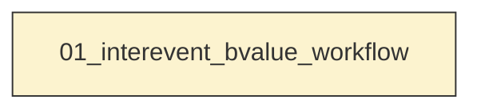
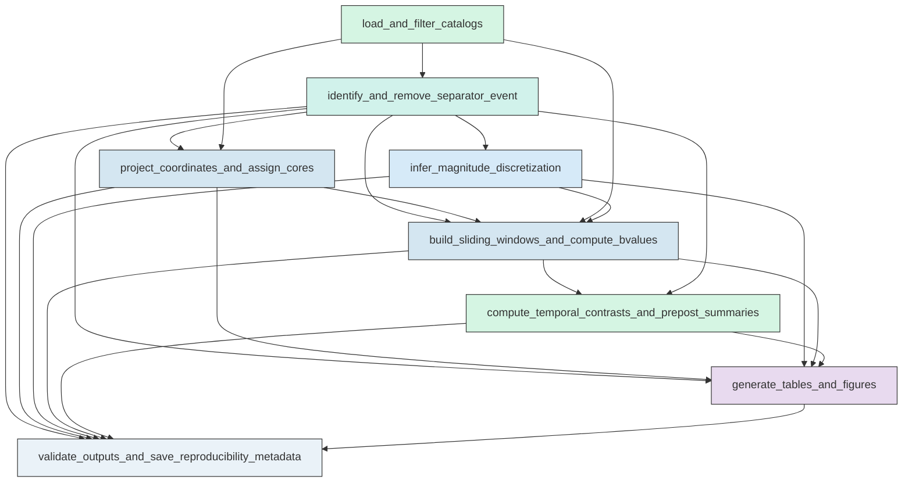

# Workflow Overview

## Top-Level Task Dependencies

**Description:**
- `01_interevent_bvalue_workflow`: Execute the full interevent sliding-window b-value analysis for the Mw 6.4 and Mw 7.1 core regions, including cleaning, assignment, estimation, contrasts, figures, and validation.

## Subtask Dependencies

#### 01_interevent_bvalue_workflow
**Usage**: Execute the full interevent sliding-window b-value analysis for the Mw 6.4 and Mw 7.1 core regions, including cleaning, assignment, estimation, contrasts, figures, and validation.

**Description:**
- `load_and_filter_catalogs`: Load the relocated catalog and mainshock table, identify the Mw 6.4 and Mw 7.1 events, isolate the strict interevent period, and exclude both mainshocks.
- `identify_and_remove_separator_event`: Identify the fixed M5.37 separator event, record its metadata and elapsed time since Mw 6.4, and remove it from all analysis inputs.
- `project_coordinates_and_assign_cores`: Project events to a local metric CRS, compute horizontal distances to both hypocenters, assign events to primary and sensitivity cores, and resolve overlap by nearest-hypocenter assignment when needed.
- `infer_magnitude_discretization`: Infer the global magnitude bin width from stable non-zero spacing in sorted unique magnitudes and record the selection metadata.
- `build_sliding_windows_and_compute_bvalues`: Construct chronological sliding event windows for each core and radius, then compute fixed-Mc and dynamic-Mc b-values, bootstrap uncertainty, Mc diagnostics, and reliability labels.
- `compute_temporal_contrasts_and_prepost_summaries`: Match Mw 7.1 and Mw 6.4 window estimates by nearest center time, compute b-value contrasts with uncertainty, and summarize pre- and post-separator behavior without fitting a trend model.
- `generate_tables_and_figures`: Save required CSV tables, figure-source tables, and the full figure suite with separator and Mw 7.1 endpoint markers on all time-series panels.
- `validate_outputs_and_save_reproducibility_metadata`: Validate catalog filtering, separator exclusion, window construction, statistical outputs, and figure completeness, then write run metadata, inventory, logs, and failure evidence if needed.