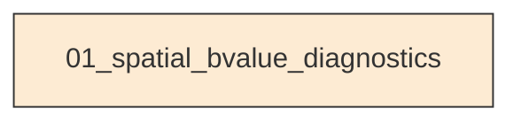
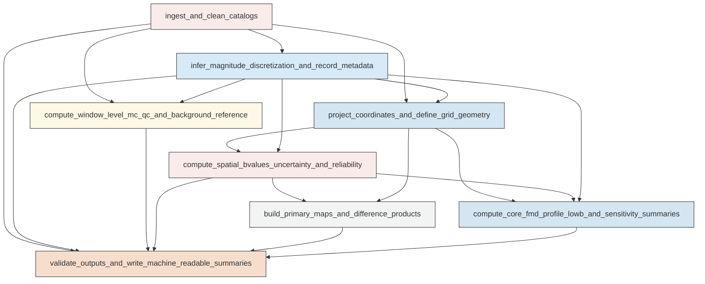

# Research Codings

## Task Overview


**Description:**
- `01_spatial_bvalue_diagnostics`: Execute the full Ridgecrest interevent spatial b-value analysis, figure generation, and scientific validation in one script.


## Task Details


#### 01_spatial_bvalue_diagnostics
**Usage**: Execute the full Ridgecrest interevent spatial b-value analysis, figure generation, and scientific validation in one script.

**Description:**
- `ingest_and_clean_catalogs`: Read the interevent, background, and main-shock catalogs, standardize fields, define windows, and exclude marker events.
- `infer_magnitude_discretization_and_record_metadata`: Infer the stable magnitude bin width, define the fixed-Mc b-value settings, and record analysis metadata.
- `project_coordinates_and_define_grid_geometry`: Project catalogs to local metric coordinates, build a common analysis grid, and define core circles and the Mw 7.1 profile geometry.
- `compute_window_level_mc_qc_and_background_reference`: Estimate one dynamic Mc per window and a regional background reference b-value for context using seismostats methods.
- `compute_spatial_bvalues_uncertainty_and_reliability`: Calculate node-wise fixed-radius b-values, bootstrap uncertainty, counts, and reliability classes for all windows and radii.
- `build_primary_maps_and_difference_products`: Generate the required 5 km b-value maps, reliability maps, and post-minus-pre difference products on common valid nodes.
- `compute_core_fmd_profile_lowb_and_sensitivity_summaries`: Derive core-region b-values and FMDs, the Mw 7.1 post-separator profile, low-b summaries, and radius sensitivity tables and figures.
- `validate_outputs_and_write_machine_readable_summaries`: Check that required outputs are present and scientifically usable, then write manifests and compact comparison summaries.

#### Coding Script

```python

import json
import math
import os
import shutil
import sys
import traceback
from concurrent.futures import ProcessPoolExecutor, as_completed
from dataclasses import dataclass
from pathlib import Path

import matplotlib
matplotlib.use('Agg')
import matplotlib.pyplot as plt
from matplotlib.colors import ListedColormap
from matplotlib.patches import Circle
import numpy as np
import pandas as pd
from pyproj import CRS, Transformer
from scipy.spatial import cKDTree
from seismostats import Catalog
from seismostats.analysis import estimate_b


SCRIPT_PATH = Path(__file__).resolve()
OUTPUT_DIR = Path('../exp_run/outputs/01_spatial_bvalue_diagnostics').resolve()
INTEREVENT_PATH = Path('<REPO_ROOT>/examples/ridgecrest/data/catalog_TRACE/TRACE_ridgecrest_relocated.csv').resolve()
BACKGROUND_PATH = Path('<REPO_ROOT>/examples/ridgecrest/data/catalog_longterm/catalog_2year_background_before_64.csv').resolve()
MAINSHOCK_PATH = Path('<REPO_ROOT>/examples/ridgecrest/data/catalog_TRACE/main_shock_events.csv').resolve()

FIXED_MC = 1.5
RADII_KM = [4.0, 5.0, 6.0, 7.0]
PRIMARY_RADIUS_KM = 5.0
GRID_SPACING_KM = 0.5
GRID_SPACING_FALLBACK_KM = 1.0
MAX_WORKERS = min(64, max(1, os.cpu_count() or 1))
MIN_EVENTS_GE_MC = 30
BOOTSTRAP_SAMPLES_NODES = 500
BOOTSTRAP_SAMPLES_CORE = 1000
SEPARATOR_TIME = pd.Timestamp('2019-07-05T11:07:52.830000Z')
LOW_B_THRESHOLD = 0.9
LOW_B_QUANTILE = 0.2
BOOTSTRAP_SEED = 20240719
PROFILE_SWATH_HALF_WIDTH_KM = 5.0
PROFILE_BIN_KM = 1.0
MAP_DPI = 180


@dataclass
class Marker:
    name: str
    time: pd.Timestamp
    latitude: float
    longitude: float
    depth_km: float
    magnitude: float
    x_km: float = np.nan
    y_km: float = np.nan


def log(message: str) -> None:
    print(message, flush=True)


def ensure_clean_output_dir(path: Path) -> None:
    path.mkdir(parents=True, exist_ok=True)
    for child in path.iterdir():
        if child.is_file() or child.is_symlink():
            child.unlink()
        elif child.is_dir():
            shutil.rmtree(child)


def infer_delta_m(magnitudes: np.ndarray) -> tuple[float, pd.DataFrame]:
    mags = np.asarray(magnitudes, dtype=float)
    mags = mags[np.isfinite(mags)]
    unique = np.unique(np.round(mags, 4))
    diffs = np.diff(np.sort(unique))
    diffs = diffs[diffs > 1e-6]
    if diffs.size == 0:
        return 0.1, pd.DataFrame({'diff': [], 'count': []})
    rounded = np.round(diffs, 3)
    counts = pd.Series(rounded).value_counts().sort_index()
    freq = counts.reset_index()
    freq.columns = ['diff', 'count']
    dominant = float(counts.sort_values(ascending=False).index[0])
    allowed = [0.01, 0.02, 0.05, 0.1]
    chosen = min(allowed, key=lambda x: abs(x - dominant))
    return chosen, freq


def parse_mainshocks(df: pd.DataFrame) -> tuple[Marker, Marker]:
    df = df.copy()
    df['event_time'] = pd.to_datetime(df['event_time'], utc=True)
    df = df.sort_values('magnitude')
    mw64 = df.iloc[0]
    mw71 = df.iloc[-1]
    return (
        Marker('Mw6.4', mw64['event_time'], float(mw64['latitude']), float(mw64['longitude']), float(mw64['depth_km']), float(mw64['magnitude'])),
        Marker('Mw7.1', mw71['event_time'], float(mw71['latitude']), float(mw71['longitude']), float(mw71['depth_km']), float(mw71['magnitude'])),
    )


def build_transformer(center_lon: float, center_lat: float):
    proj4 = f'+proj=aeqd +lat_0={center_lat} +lon_0={center_lon} +datum=WGS84 +units=m +no_defs'
    crs = CRS.from_proj4(proj4)
    transformer = Transformer.from_crs('EPSG:4326', crs, always_xy=True)
    inverse = Transformer.from_crs(crs, 'EPSG:4326', always_xy=True)
    return crs, transformer, inverse


def project_df(df: pd.DataFrame, transformer: Transformer) -> pd.DataFrame:
    x, y = transformer.transform(df['longitude'].to_numpy(), df['latitude'].to_numpy())
    out = df.copy()
    out['x_km'] = x / 1000.0
    out['y_km'] = y / 1000.0
    return out


def reliability_class(n_ge_mc: float) -> str:
    if not np.isfinite(n_ge_mc) or n_ge_mc < MIN_EVENTS_GE_MC:
        return 'insufficient'
    if n_ge_mc < 50:
        return 'exploratory'
    if n_ge_mc < 100:
        return 'moderately_uncertain'
    return 'robust'


def aki_utsu_b(mags: np.ndarray, mc: float, delta_m: float) -> float:
    mags = np.asarray(mags, dtype=float)
    mags = mags[np.isfinite(mags) & (mags >= mc)]
    if mags.size == 0:
        return np.nan
    denom = mags.mean() - mc + delta_m / 2.0
    if denom <= 0:
        return np.nan
    return math.log10(math.e) / denom


def bootstrap_b(mags: np.ndarray, mc: float, delta_m: float, n_boot: int, seed: int):
    rng = np.random.default_rng(seed)
    mags = np.asarray(mags, dtype=float)
    boots = np.empty(n_boot, dtype=float)
    for i in range(n_boot):
        sample = rng.choice(mags, size=mags.size, replace=True)
        boots[i] = aki_utsu_b(sample, mc, delta_m)
    boots = boots[np.isfinite(boots)]
    if boots.size == 0:
        return np.nan, np.nan, np.nan, np.nan
    return float(np.mean(boots)), float(np.std(boots, ddof=1)), float(np.quantile(boots, 0.025)), float(np.quantile(boots, 0.975))


def seismostats_mc(mags: np.ndarray, delta_m: float) -> dict:
    out = {
        'mc_maxc': np.nan,
        'mc_ks': np.nan,
        'mc_mbs': np.nan,
        'status': 'ok',
        'error_maxc': '',
        'error_ks': '',
        'error_mbs': '',
    }
    mags = np.asarray(mags, dtype=float)
    mags = mags[np.isfinite(mags)]
    if mags.size < 30:
        out['status'] = 'insufficient_sample'
        return out
    cat = Catalog({'magnitude': mags})
    try:
        cat.bin_magnitudes(delta_m=delta_m, inplace=True)
    except Exception as exc:
        out['status'] = 'binning_warning'
        out['error_maxc'] = f'bin_magnitudes_failed:{exc}'
    try:
        cat.estimate_mc_maxc(fmd_bin=delta_m)
        out['mc_maxc'] = float(cat.mc)
    except Exception as exc:
        out['error_maxc'] = str(exc)
    try:
        cat.estimate_mc_ks(delta_m=delta_m, p_value_pass=0.1)
        out['mc_ks'] = float(cat.mc)
    except Exception as exc:
        out['error_ks'] = str(exc)
    try:
        cat.estimate_mc_b_stability()
        out['mc_mbs'] = float(cat.mc)
    except Exception as exc:
        out['error_mbs'] = str(exc)
    return out


def window_b_qc(mags: np.ndarray, fixed_mc: float, dynamic_mc: float, delta_m: float) -> dict:
    out = {
        'b_fixed_mc': np.nan,
        'n_fixed_mc': int(np.sum(np.asarray(mags) >= fixed_mc)),
        'b_dynamic_mc': np.nan,
        'n_dynamic_mc': np.nan,
        'b_fixed_method': 'seismostats',
        'b_dynamic_method': 'seismostats',
        'b_fixed_error': '',
        'b_dynamic_error': '',
    }
    try:
        out['b_fixed_mc'] = float(estimate_b(mags, mc=fixed_mc, delta_m=delta_m))
    except Exception as exc:
        out['b_fixed_mc'] = aki_utsu_b(mags, fixed_mc, delta_m)
        out['b_fixed_method'] = 'aki_utsu_fallback'
        out['b_fixed_error'] = str(exc)
    if np.isfinite(dynamic_mc):
        out['n_dynamic_mc'] = int(np.sum(np.asarray(mags) >= dynamic_mc))
        if out['n_dynamic_mc'] > 0:
            try:
                out['b_dynamic_mc'] = float(estimate_b(mags, mc=dynamic_mc, delta_m=delta_m))
            except Exception as exc:
                out['b_dynamic_mc'] = aki_utsu_b(mags, dynamic_mc, delta_m)
                out['b_dynamic_method'] = 'aki_utsu_fallback'
                out['b_dynamic_error'] = str(exc)
    return out


def build_grid(df: pd.DataFrame, spacing_km: float, margin_km: float = 7.0) -> pd.DataFrame:
    xmin = math.floor((df['x_km'].min() - margin_km) / spacing_km) * spacing_km
    xmax = math.ceil((df['x_km'].max() + margin_km) / spacing_km) * spacing_km
    ymin = math.floor((df['y_km'].min() - margin_km) / spacing_km) * spacing_km
    ymax = math.ceil((df['y_km'].max() + margin_km) / spacing_km) * spacing_km
    xs = np.arange(xmin, xmax + spacing_km / 2.0, spacing_km)
    ys = np.arange(ymin, ymax + spacing_km / 2.0, spacing_km)
    xx, yy = np.meshgrid(xs, ys)
    grid = pd.DataFrame({'x_km': xx.ravel(), 'y_km': yy.ravel()})
    grid['node_id'] = np.arange(len(grid), dtype=int)
    return grid[['node_id', 'x_km', 'y_km']]


def node_batch_worker(node_ids, node_xy, event_xy, event_mag, radius_km, mc, delta_m, n_boot, seed_base):
    tree = cKDTree(event_xy)
    rows = []
    for local_idx, node_id in enumerate(node_ids):
        x, y = node_xy[local_idx]
        idx = tree.query_ball_point([x, y], r=radius_km)
        if len(idx) == 0:
            rows.append((int(node_id), 0, 0, np.nan, np.nan, np.nan, np.nan, np.nan, 'insufficient', 0))
            continue
        mags_all = event_mag[idx]
        mags = mags_all[np.isfinite(mags_all) & (mags_all >= mc)]
        n_total = len(idx)
        n_ge = mags.size
        if n_ge < MIN_EVENTS_GE_MC:
            rows.append((int(node_id), n_total, n_ge, float(np.nanmean(mags)) if n_ge > 0 else np.nan, np.nan, np.nan, np.nan, np.nan, reliability_class(n_ge), 0))
            continue
        b = aki_utsu_b(mags, mc, delta_m)
        boot_mean, boot_std, ci_low, ci_high = bootstrap_b(mags, mc, delta_m, n_boot=n_boot, seed=seed_base + int(node_id))
        rows.append((int(node_id), n_total, n_ge, float(np.mean(mags)), b, boot_mean, boot_std, ci_low, ci_high, reliability_class(n_ge), 1))
    return rows


def compute_spatial_b(grid: pd.DataFrame, events: pd.DataFrame, window_name: str, radius_km: float, mc: float, delta_m: float, n_boot: int, max_workers: int, progress_path: Path) -> pd.DataFrame:
    log(f'[spatial] window={window_name} radius_km={radius_km} nodes={len(grid)} events={len(events)}')
    event_xy = events[['x_km', 'y_km']].to_numpy(dtype=float)
    event_mag = events['magnitude'].to_numpy(dtype=float)
    chunks = np.array_split(grid.index.to_numpy(), min(max_workers, max(1, len(grid) // 200 + 1)))
    results = []
    with ProcessPoolExecutor(max_workers=max_workers) as ex:
        futures = []
        for batch_idx, idxs in enumerate(chunks):
            if len(idxs) == 0:
                continue
            sub = grid.loc[idxs, ['node_id', 'x_km', 'y_km']]
            fut = ex.submit(
                node_batch_worker,
                sub['node_id'].to_numpy(dtype=int),
                sub[['x_km', 'y_km']].to_numpy(dtype=float),
                event_xy,
                event_mag,
                radius_km,
                mc,
                delta_m,
                n_boot,
                BOOTSTRAP_SEED + int(radius_km * 1000) + batch_idx * 10000,
            )
            futures.append((batch_idx, fut, len(sub)))
        done = 0
        future_meta = {fut: (batch_idx, batch_size) for batch_idx, fut, batch_size in futures}
        for fut in as_completed(list(future_meta.keys())):
            batch_idx, batch_size = future_meta[fut]
            rows = fut.result()
            done += batch_size
            with progress_path.open('a', encoding='utf-8') as fp:
                fp.write(f'{window_name},{radius_km},{batch_idx},{batch_size},{done}\n')
            log(f'[spatial-progress] window={window_name} radius={radius_km} done_nodes={done}/{len(grid)}')
            results.extend(rows)
    cols = ['node_id', 'n_total', 'n_ge_mc', 'mean_mag_ge_mc', 'b_value', 'b_boot_mean', 'b_boot_std', 'b_ci_low', 'b_ci_high', 'reliability_class', 'valid_flag']
    out = pd.DataFrame(results, columns=cols)
    out = grid.merge(out, on='node_id', how='left')
    out['window_name'] = window_name
    out['radius_km'] = radius_km
    return out


def add_lonlat(df: pd.DataFrame, inverse: Transformer) -> pd.DataFrame:
    lon, lat = inverse.transform(df['x_km'].to_numpy() * 1000.0, df['y_km'].to_numpy() * 1000.0)
    out = df.copy()
    out['longitude'] = lon
    out['latitude'] = lat
    return out


def compute_core_summary(events: pd.DataFrame, center_x: float, center_y: float, window_name: str, core_name: str, delta_m: float, n_boot: int):
    dist = np.sqrt((events['x_km'] - center_x) ** 2 + (events['y_km'] - center_y) ** 2)
    subset = events.loc[dist <= PRIMARY_RADIUS_KM].copy()
    mags_all = subset['magnitude'].to_numpy(dtype=float)
    mags = mags_all[np.isfinite(mags_all) & (mags_all >= FIXED_MC)]
    row = {
        'window_name': window_name,
        'core_name': core_name,
        'radius_km': PRIMARY_RADIUS_KM,
        'n_total': int(len(subset)),
        'n_ge_mc': int(mags.size),
        'b_value': np.nan,
        'b_boot_mean': np.nan,
        'b_boot_std': np.nan,
        'b_ci_low': np.nan,
        'b_ci_high': np.nan,
        'reliability_class': reliability_class(mags.size),
    }
    if mags.size >= MIN_EVENTS_GE_MC:
        row['b_value'] = aki_utsu_b(mags, FIXED_MC, delta_m)
        bm, bs, bl, bh = bootstrap_b(mags, FIXED_MC, delta_m, n_boot=n_boot, seed=BOOTSTRAP_SEED + int(center_x * 1000) + int(center_y * 100))
        row['b_boot_mean'] = bm
        row['b_boot_std'] = bs
        row['b_ci_low'] = bl
        row['b_ci_high'] = bh
    fmd = build_fmd(subset['magnitude'].to_numpy(dtype=float), delta_m, FIXED_MC)
    fmd['window_name'] = window_name
    fmd['core_name'] = core_name
    return row, fmd, subset


def build_fmd(mags: np.ndarray, delta_m: float, mc: float) -> pd.DataFrame:
    mags = np.asarray(mags, dtype=float)
    mags = mags[np.isfinite(mags)]
    if mags.size == 0:
        return pd.DataFrame(columns=['mag_bin', 'count_incremental', 'count_cumulative', 'count_incremental_ge_mc', 'count_cumulative_ge_mc'])
    mmin = math.floor(mags.min() / delta_m) * delta_m
    mmax = math.ceil(mags.max() / delta_m) * delta_m
    bins = np.arange(mmin, mmax + delta_m, delta_m)
    counts, edges = np.histogram(mags, bins=np.append(bins, bins[-1] + delta_m))
    cum = counts[::-1].cumsum()[::-1]
    ge_mask = bins >= mc
    counts_ge = counts.copy()
    counts_ge[~ge_mask] = 0
    cum_ge = counts_ge[::-1].cumsum()[::-1]
    return pd.DataFrame({'mag_bin': bins, 'count_incremental': counts, 'count_cumulative': cum, 'count_incremental_ge_mc': counts_ge, 'count_cumulative_ge_mc': cum_ge})


def plot_map(df: pd.DataFrame, value_col: str, title: str, out_path: Path, markers: list[Marker], circles: list[tuple[np.ndarray, np.ndarray, str]], vmin=None, vmax=None, cmap='viridis', cbar_label=''):
    fig, ax = plt.subplots(figsize=(9, 7))
    valid = df[np.isfinite(df[value_col])].copy()
    if not valid.empty:
        sc = ax.scatter(valid['longitude'], valid['latitude'], c=valid[value_col], s=18, cmap=cmap, vmin=vmin, vmax=vmax, marker='s', linewidths=0)
        cb = fig.colorbar(sc, ax=ax, shrink=0.85)
        cb.set_label(cbar_label)
    for marker in markers:
        if np.isfinite(marker.longitude) and np.isfinite(marker.latitude):
            ax.scatter(marker.longitude, marker.latitude, s=80, c='red', edgecolor='black', zorder=5)
            ax.text(marker.longitude, marker.latitude, marker.name, fontsize=9, ha='left', va='bottom')
    for lon_vals, lat_vals, label in circles:
        ax.plot(lon_vals, lat_vals, color='black', linewidth=1.2, linestyle='--')
        ax.text(lon_vals[0], lat_vals[0], label, fontsize=8)
    ax.set_title(title)
    ax.set_xlabel('Longitude')
    ax.set_ylabel('Latitude')
    ax.grid(True, alpha=0.25)
    fig.tight_layout()
    fig.savefig(out_path, dpi=MAP_DPI)
    plt.close(fig)


def plot_map_projected(df: pd.DataFrame, value_col: str, title: str, out_path: Path, markers: list[Marker], circles: list[tuple[float, float, float, str]], vmin=None, vmax=None, cmap='viridis', cbar_label=''):
    fig, ax = plt.subplots(figsize=(9, 7))
    valid = df[np.isfinite(df[value_col])].copy()
    if not valid.empty:
        sc = ax.scatter(valid['x_km'], valid['y_km'], c=valid[value_col], s=18, cmap=cmap, vmin=vmin, vmax=vmax, marker='s', linewidths=0)
        cb = fig.colorbar(sc, ax=ax, shrink=0.85)
        cb.set_label(cbar_label)
    for marker in markers:
        ax.scatter(marker.x_km, marker.y_km, s=90, c='red', edgecolor='black', zorder=5)
        ax.text(marker.x_km, marker.y_km, marker.name, fontsize=9, ha='left', va='bottom')
    for x_km, y_km, r_km, label in circles:
        circ = Circle((x_km, y_km), r_km, facecolor='none', edgecolor='black', linewidth=1.4, linestyle='--')
        ax.add_patch(circ)
        ax.text(x_km + r_km, y_km + r_km, label, fontsize=8)
    ax.set_aspect('equal', adjustable='box')
    ax.set_title(title)
    ax.set_xlabel('X (km)')
    ax.set_ylabel('Y (km)')
    ax.grid(True, alpha=0.25)
    fig.tight_layout()
    fig.savefig(out_path, dpi=MAP_DPI)
    plt.close(fig)


def plot_core_fmd(core_fmd: pd.DataFrame, out_path: Path):
    fig, axes = plt.subplots(1, 3, figsize=(15, 4.5), sharey=False)
    windows = ['full_interevent', 'pre_separator', 'post_separator']
    for ax, win in zip(axes, windows):
        sub = core_fmd[core_fmd['window_name'] == win]
        for core_name, color in [('Mw6.4_core', 'tab:blue'), ('Mw7.1_core', 'tab:orange')]:
            ss = sub[sub['core_name'] == core_name]
            if ss.empty:
                continue
            ax.step(ss['mag_bin'], ss['count_cumulative_ge_mc'], where='post', label=f'{core_name} cumulative', color=color)
            ax.step(ss['mag_bin'], ss['count_incremental_ge_mc'], where='mid', linestyle='--', label=f'{core_name} incremental', color=color, alpha=0.6)
        ax.set_title(win)
        ax.set_xlabel('Magnitude bin')
        ax.set_ylabel('Count')
        ax.grid(True, alpha=0.25)
        ax.legend(fontsize=7)
    fig.tight_layout()
    fig.savefig(out_path, dpi=MAP_DPI)
    plt.close(fig)


def compute_profile_orientation(events: pd.DataFrame, center_x: float, center_y: float, neighborhood_km: float = 10.0):
    dist = np.sqrt((events['x_km'] - center_x) ** 2 + (events['y_km'] - center_y) ** 2)
    subset = events.loc[dist <= neighborhood_km, ['x_km', 'y_km']].copy()
    if len(subset) < 5:
        return 0.0, 'fallback_east_west'
    arr = subset[['x_km', 'y_km']].to_numpy()
    arr = arr - arr.mean(axis=0)
    cov = np.cov(arr.T)
    vals, vecs = np.linalg.eigh(cov)
    vec = vecs[:, np.argmax(vals)]
    strike_deg = (np.degrees(np.arctan2(vec[0], vec[1])) + 360.0) % 180.0
    return float(strike_deg), 'principal_axis_post_separator_near_Mw7.1'


def project_to_profile(x, y, origin_x, origin_y, strike_deg):
    theta = np.deg2rad(strike_deg)
    dx = x - origin_x
    dy = y - origin_y
    along = dx * np.sin(theta) + dy * np.cos(theta)
    across = dx * np.cos(theta) - dy * np.sin(theta)
    return along, across


def profile_from_nodes(df: pd.DataFrame, strike_deg: float, origin_x: float, origin_y: float, out_csv: Path, out_fig: Path, marker: Marker):
    work = df.copy()
    work['along_km'], work['across_km'] = project_to_profile(work['x_km'].to_numpy(), work['y_km'].to_numpy(), origin_x, origin_y, strike_deg)
    swath = work[(work['valid_flag'] == 1) & (np.abs(work['across_km']) <= PROFILE_SWATH_HALF_WIDTH_KM)].copy()
    swath.sort_values('along_km', inplace=True)
    if not swath.empty:
        bins = np.arange(math.floor(swath['along_km'].min()), math.ceil(swath['along_km'].max()) + PROFILE_BIN_KM, PROFILE_BIN_KM)
        swath['along_bin'] = pd.cut(swath['along_km'], bins=bins, include_lowest=True)
        grp = swath.groupby('along_bin', observed=False).agg(
            along_center_km=('along_km', 'mean'),
            b_value=('b_value', 'mean'),
            b_boot_std=('b_boot_std', 'median'),
            n_ge_mc=('n_ge_mc', 'sum'),
            node_count=('node_id', 'count')
        ).reset_index(drop=True)
    else:
        grp = pd.DataFrame(columns=['along_center_km', 'b_value', 'b_boot_std', 'n_ge_mc', 'node_count'])
    swath.to_csv(out_csv, index=False)
    fig, ax1 = plt.subplots(figsize=(10, 4.5))
    if not grp.empty:
        ax1.plot(grp['along_center_km'], grp['b_value'], color='tab:blue', marker='o', label='mean b-value')
        ax1.fill_between(grp['along_center_km'], grp['b_value'] - grp['b_boot_std'], grp['b_value'] + grp['b_boot_std'], color='tab:blue', alpha=0.2)
    marker_along, _ = project_to_profile(np.array([marker.x_km]), np.array([marker.y_km]), origin_x, origin_y, strike_deg)
    ax1.axvline(marker_along[0], color='red', linestyle='--', label='Mw7.1 hypocenter')
    ax1.set_xlabel('Along-strike distance (km)')
    ax1.set_ylabel('b-value')
    ax1.grid(True, alpha=0.25)
    ax1.legend(loc='upper left')
    ax2 = ax1.twinx()
    if not grp.empty:
        ax2.bar(grp['along_center_km'], grp['n_ge_mc'], width=0.8, color='grey', alpha=0.25, label='n>=Mc')
    ax2.set_ylabel('n>=Mc')
    fig.tight_layout()
    fig.savefig(out_fig, dpi=MAP_DPI)
    plt.close(fig)
    return swath, grp


def summarize_low_b(df: pd.DataFrame, window_name: str, marker71: Marker, marker64: Marker):
    valid = df[df['valid_flag'] == 1].copy()
    if valid.empty:
        return pd.DataFrame(), {'window_name': window_name, 'valid_nodes': 0}
    q20 = float(valid['b_value'].quantile(LOW_B_QUANTILE))
    valid['is_low_abs'] = valid['b_value'] < LOW_B_THRESHOLD
    valid['is_low_q20'] = valid['b_value'] <= q20
    valid['dist_to_mw71_km'] = np.sqrt((valid['x_km'] - marker71.x_km) ** 2 + (valid['y_km'] - marker71.y_km) ** 2)
    valid['dist_to_mw64_km'] = np.sqrt((valid['x_km'] - marker64.x_km) ** 2 + (valid['y_km'] - marker64.y_km) ** 2)
    low = valid[valid['is_low_abs'] | valid['is_low_q20']].copy()
    summary = {
        'window_name': window_name,
        'valid_nodes': int(len(valid)),
        'low_nodes': int(len(low)),
        'low_fraction': float(len(low) / len(valid)),
        'threshold_q20': q20,
        'median_low_b': float(low['b_value'].median()) if not low.empty else np.nan,
        'median_low_uncertainty': float(low['b_boot_std'].median()) if not low.empty else np.nan,
        'median_low_n_ge_mc': float(low['n_ge_mc'].median()) if not low.empty else np.nan,
        'low_near_mw71_5km': int((low['dist_to_mw71_km'] <= PRIMARY_RADIUS_KM).sum()) if not low.empty else 0,
        'low_near_mw64_5km': int((low['dist_to_mw64_km'] <= PRIMARY_RADIUS_KM).sum()) if not low.empty else 0,
    }
    low['window_name'] = window_name
    return low, summary


def main():
    ensure_clean_output_dir(OUTPUT_DIR)
    fig_dir = OUTPUT_DIR / 'figures'
    tab_dir = OUTPUT_DIR / 'tables'
    fig_dir.mkdir(parents=True, exist_ok=True)
    tab_dir.mkdir(parents=True, exist_ok=True)
    progress_path = tab_dir / 'bootstrap_progress_log.csv'
    progress_path.write_text('window_name,radius_km,batch_idx,batch_size,cumulative_done\n', encoding='utf-8')

    log('[read] loading catalogs')
    inter = pd.read_csv(INTEREVENT_PATH)
    inter['event_time'] = pd.to_datetime(inter['event_time'], utc=True)
    inter = inter.rename(columns={'event_time': 'time'})
    bg = pd.read_csv(BACKGROUND_PATH)
    bg['datetime'] = pd.to_datetime(bg['datetime'], utc=True)
    bg = bg.rename(columns={'datetime': 'time', 'latR': 'latitude', 'lonR': 'longitude', 'depR': 'depth_km', 'mag': 'magnitude'})
    bg = bg[['time', 'latitude', 'longitude', 'depth_km', 'magnitude']].copy()
    main_df = pd.read_csv(MAINSHOCK_PATH)
    mw64, mw71 = parse_mainshocks(main_df)
    sep_marker = Marker('M5.37_sep', SEPARATOR_TIME, np.nan, np.nan, np.nan, 5.37)

    excluded_rows = []
    inter['exclude_reason'] = ''
    inter.loc[inter['time'] == mw64.time, 'exclude_reason'] = 'mw64_mainshock'
    inter.loc[inter['time'] == mw71.time, 'exclude_reason'] = 'mw71_mainshock'
    inter.loc[inter['time'] == SEPARATOR_TIME, 'exclude_reason'] = np.where(inter.loc[inter['time'] == SEPARATOR_TIME, 'exclude_reason'] == '', 'separator_event', inter.loc[inter['time'] == SEPARATOR_TIME, 'exclude_reason'] + ';separator_event')
    excluded = inter[inter['exclude_reason'] != ''].copy()
    excluded_rows.append(excluded[['time', 'latitude', 'longitude', 'depth_km', 'magnitude', 'exclude_reason']])
    inter_clean = inter[inter['exclude_reason'] == ''].copy().drop(columns=['exclude_reason'])

    full = inter_clean[(inter_clean['time'] >= mw64.time) & (inter_clean['time'] < mw71.time)].copy()
    pre = inter_clean[(inter_clean['time'] >= mw64.time) & (inter_clean['time'] < SEPARATOR_TIME)].copy()
    post = inter_clean[(inter_clean['time'] > SEPARATOR_TIME) & (inter_clean['time'] < mw71.time)].copy()
    bg_clean = bg[bg['time'] < mw64.time].copy()

    pd.concat(excluded_rows, ignore_index=True).to_csv(tab_dir / 'excluded_events_log.csv', index=False)
    full.to_csv(tab_dir / 'catalog_full_interevent_clean.csv', index=False)
    pre.to_csv(tab_dir / 'catalog_pre_separator_clean.csv', index=False)
    post.to_csv(tab_dir / 'catalog_post_separator_clean.csv', index=False)
    bg_clean.to_csv(tab_dir / 'catalog_background_reference_clean.csv', index=False)

    delta_m, diff_freq = infer_delta_m(np.concatenate([full['magnitude'].to_numpy(), pre['magnitude'].to_numpy(), post['magnitude'].to_numpy(), bg_clean['magnitude'].to_numpy()]))
    diff_freq.to_csv(tab_dir / 'magnitude_precision_deltaM_check.csv', index=False)

    center_lon = float(np.nanmean([mw64.longitude, mw71.longitude, full['longitude'].mean()]))
    center_lat = float(np.nanmean([mw64.latitude, mw71.latitude, full['latitude'].mean()]))
    crs, transformer, inverse = build_transformer(center_lon, center_lat)
    for marker in [mw64, mw71]:
        x, y = transformer.transform(marker.longitude, marker.latitude)
        marker.x_km = x / 1000.0
        marker.y_km = y / 1000.0

    full = project_df(full, transformer)
    pre = project_df(pre, transformer)
    post = project_df(post, transformer)
    bg_clean = project_df(bg_clean, transformer)
    grid_spacing = GRID_SPACING_KM
    grid = build_grid(full, grid_spacing)
    est_nodes = len(grid)
    if est_nodes > 15000:
        grid_spacing = GRID_SPACING_FALLBACK_KM
        grid = build_grid(full, grid_spacing)
    grid = add_lonlat(grid, inverse)
    grid.to_csv(tab_dir / 'grid_nodes.csv', index=False)

    proj_meta = pd.DataFrame([{ 'center_lon': center_lon, 'center_lat': center_lat, 'crs_proj4': crs.to_proj4(), 'grid_spacing_km': grid_spacing, 'node_count': len(grid)}])
    proj_meta.to_csv(tab_dir / 'projection_and_grid_definition.csv', index=False)
    sep_lon = np.nan
    sep_lat = np.nan
    sep_match = excluded[excluded['time'] == SEPARATOR_TIME].copy()
    if not sep_match.empty:
        sep_lat = float(sep_match['latitude'].iloc[0])
        sep_lon = float(sep_match['longitude'].iloc[0])
        sep_x, sep_y = transformer.transform(sep_lon, sep_lat)
        sep_marker.latitude = sep_lat
        sep_marker.longitude = sep_lon
        sep_marker.x_km = sep_x / 1000.0
        sep_marker.y_km = sep_y / 1000.0
    pd.DataFrame([
        {'name': mw64.name, 'time': mw64.time, 'latitude': mw64.latitude, 'longitude': mw64.longitude, 'depth_km': mw64.depth_km, 'magnitude': mw64.magnitude, 'x_km': mw64.x_km, 'y_km': mw64.y_km},
        {'name': mw71.name, 'time': mw71.time, 'latitude': mw71.latitude, 'longitude': mw71.longitude, 'depth_km': mw71.depth_km, 'magnitude': mw71.magnitude, 'x_km': mw71.x_km, 'y_km': mw71.y_km},
        {'name': sep_marker.name, 'time': sep_marker.time, 'latitude': sep_marker.latitude, 'longitude': sep_marker.longitude, 'depth_km': sep_marker.depth_km, 'magnitude': sep_marker.magnitude, 'x_km': sep_marker.x_km, 'y_km': sep_marker.y_km},
    ]).to_csv(tab_dir / 'mainshock_markers_projected.csv', index=False)
    pd.DataFrame([
        {'core_name': 'Mw6.4_core', 'center_x_km': mw64.x_km, 'center_y_km': mw64.y_km, 'radius_km': PRIMARY_RADIUS_KM},
        {'core_name': 'Mw7.1_core', 'center_x_km': mw71.x_km, 'center_y_km': mw71.y_km, 'radius_km': PRIMARY_RADIUS_KM},
    ]).to_csv(tab_dir / 'core_regions_5km.csv', index=False)

    log('[qc] computing window-level Mc and b-value context')
    catalogs = {
        'full_interevent': full,
        'pre_separator': pre,
        'post_separator': post,
        'background_reference': bg_clean,
    }
    mc_rows = []
    bqc_rows = []
    fmd_rows = []
    for name, df in catalogs.items():
        mags = df['magnitude'].to_numpy(dtype=float)
        mc_info = seismostats_mc(mags, delta_m)
        mc_info['window_name'] = name
        mc_info['n_events'] = len(df)
        mc_rows.append(mc_info)
        qc = window_b_qc(mags, FIXED_MC, mc_info.get('mc_maxc', np.nan), delta_m)
        qc['window_name'] = name
        bqc_rows.append(qc)
        fmd = build_fmd(mags, delta_m, FIXED_MC)
        fmd['window_name'] = name
        fmd_rows.append(fmd)
    pd.DataFrame(mc_rows).to_csv(tab_dir / 'window_level_mc_qc.csv', index=False)
    pd.DataFrame(bqc_rows).to_csv(tab_dir / 'window_level_bvalue_qc.csv', index=False)
    pd.concat(fmd_rows, ignore_index=True).to_csv(tab_dir / 'window_level_fmd_summary.csv', index=False)
    pd.DataFrame([row for row in bqc_rows if row['window_name'] == 'background_reference']).to_csv(tab_dir / 'background_reference_bvalue.csv', index=False)

    log('[spatial] computing node-wise maps for radii 4-7 km')
    spatial_tables = {}
    for window_name, df in [('full_interevent', full), ('pre_separator', pre), ('post_separator', post)]:
        for radius_km in RADII_KM:
            table = compute_spatial_b(grid[['node_id', 'x_km', 'y_km']], df, window_name, radius_km, FIXED_MC, delta_m, BOOTSTRAP_SAMPLES_NODES, MAX_WORKERS, progress_path)
            table = add_lonlat(table, inverse)
            out_name = f'grid_bvalues_{window_name}_r{int(radius_km)}.csv'
            table.to_csv(tab_dir / out_name, index=False)
            spatial_tables[(window_name, radius_km)] = table

    validation_rows = []
    for key, table in spatial_tables.items():
        validation_rows.append({'window_name': key[0], 'radius_km': key[1], 'node_count': len(table), 'valid_nodes': int((table['valid_flag'] == 1).sum()), 'median_n_ge_mc_valid': float(table.loc[table['valid_flag'] == 1, 'n_ge_mc'].median()) if (table['valid_flag'] == 1).any() else np.nan})
    pd.DataFrame(validation_rows).to_csv(tab_dir / 'spatial_validation_checks.csv', index=False)

    log('[maps] rendering primary and reliability figures')
    primary_tables = [spatial_tables[('full_interevent', 5.0)], spatial_tables[('pre_separator', 5.0)], spatial_tables[('post_separator', 5.0)]]
    pooled_b = pd.concat([t.loc[t['valid_flag'] == 1, 'b_value'] for t in primary_tables], ignore_index=True)
    pooled_b = pooled_b[np.isfinite(pooled_b)]
    vmin = float(pooled_b.quantile(0.02)) if not pooled_b.empty else 0.5
    vmax = float(pooled_b.quantile(0.98)) if not pooled_b.empty else 1.5
    circles = [(mw64.x_km, mw64.y_km, PRIMARY_RADIUS_KM, 'Mw6.4 5 km core'), (mw71.x_km, mw71.y_km, PRIMARY_RADIUS_KM, 'Mw7.1 5 km core')]
    markers = [mw64, sep_marker, mw71]
    geo_circles = []
    for marker_obj, label in [(mw64, 'Mw6.4 5 km core'), (mw71, 'Mw7.1 5 km core')]:
        ang = np.linspace(0, 2 * np.pi, 180)
        circle_x = marker_obj.x_km + PRIMARY_RADIUS_KM * np.cos(ang)
        circle_y = marker_obj.y_km + PRIMARY_RADIUS_KM * np.sin(ang)
        circle_lon, circle_lat = inverse.transform(circle_x * 1000.0, circle_y * 1000.0)
        geo_circles.append((circle_lon, circle_lat, label))
    for window_name, title in [('full_interevent', 'Full interevent'), ('pre_separator', 'Pre-separator'), ('post_separator', 'Post-separator')]:
        df = spatial_tables[(window_name, 5.0)]
        plot_map_projected(df, 'b_value', f'{title} b-value (r=5 km, Mc=1.5)', fig_dir / f'map_bvalue_{window_name}_r5.png', markers, circles, vmin=vmin, vmax=vmax, cmap='viridis', cbar_label='b-value')
        plot_map(df, 'b_value', f'{title} b-value geographic (r=5 km, Mc=1.5)', fig_dir / f'map_bvalue_{window_name}_r5_geo.png', markers, geo_circles, vmin=vmin, vmax=vmax, cmap='viridis', cbar_label='b-value')
        plot_map_projected(df, 'n_ge_mc', f'{title} support n>=Mc (r=5 km)', fig_dir / f'map_reliability_ngeMc_{window_name}_r5.png', markers, circles, cmap='plasma', cbar_label='n>=Mc')
        plot_map_projected(df, 'b_boot_std', f'{title} bootstrap uncertainty (r=5 km)', fig_dir / f'map_uncertainty_{window_name}_r5.png', markers, circles, cmap='magma_r', cbar_label='bootstrap std(b)')
        class_map = {'exploratory': 1, 'moderately_uncertain': 2, 'robust': 3}
        class_df = df.copy()
        class_df['reliability_num'] = class_df['reliability_class'].map(class_map)
        plot_map_projected(class_df, 'reliability_num', f'{title} reliability class (r=5 km)', fig_dir / f'map_reliability_class_{window_name}_r5.png', markers, circles, vmin=1, vmax=3, cmap=ListedColormap(['#fee8c8', '#fdbb84', '#e34a33']), cbar_label='1 exploratory, 2 moderate, 3 robust')

    log('[difference] computing post-pre difference map')
    pre5 = spatial_tables[('pre_separator', 5.0)][['node_id', 'x_km', 'y_km', 'longitude', 'latitude', 'b_value', 'b_boot_std', 'n_ge_mc', 'valid_flag']].rename(columns={'b_value': 'b_pre', 'b_boot_std': 'b_pre_std', 'n_ge_mc': 'n_pre', 'valid_flag': 'valid_pre'})
    post5 = spatial_tables[('post_separator', 5.0)][['node_id', 'b_value', 'b_boot_std', 'n_ge_mc', 'valid_flag']].rename(columns={'b_value': 'b_post', 'b_boot_std': 'b_post_std', 'n_ge_mc': 'n_post', 'valid_flag': 'valid_post'})
    diff = pre5.merge(post5, on='node_id', how='inner')
    diff = diff[(diff['valid_pre'] == 1) & (diff['valid_post'] == 1)].copy()
    diff['delta_b'] = diff['b_post'] - diff['b_pre']
    diff['combined_uncertainty'] = np.sqrt(diff['b_pre_std'] ** 2 + diff['b_post_std'] ** 2)
    diff.to_csv(tab_dir / 'grid_bvalue_difference_post_minus_pre_r5.csv', index=False)
    pd.DataFrame([{'common_valid_nodes': int(len(diff)), 'pre_valid_nodes': int((pre5['valid_pre'] == 1).sum()), 'post_valid_nodes': int((post5['valid_post'] == 1).sum())}]).to_csv(tab_dir / 'difference_map_coverage_summary.csv', index=False)
    if not diff.empty:
        dv = float(max(abs(diff['delta_b'].quantile(0.98)), abs(diff['delta_b'].quantile(0.02))))
        plot_map_projected(diff, 'delta_b', 'Post - Pre b-value difference (r=5 km)', fig_dir / 'map_bvalue_difference_post_minus_pre_r5.png', markers, circles, vmin=-dv, vmax=dv, cmap='coolwarm', cbar_label='delta b')

    log('[cores] computing core summaries and FMDs')
    core_rows = []
    core_fmds = []
    core_event_counts = []
    for window_name, df in [('full_interevent', full), ('pre_separator', pre), ('post_separator', post)]:
        for core_name, marker in [('Mw6.4_core', mw64), ('Mw7.1_core', mw71)]:
            row, fmd, subset = compute_core_summary(df, marker.x_km, marker.y_km, window_name, core_name, delta_m, BOOTSTRAP_SAMPLES_CORE)
            core_rows.append(row)
            core_fmds.append(fmd)
            core_event_counts.append({'window_name': window_name, 'core_name': core_name, 'raw_events_in_circle': len(subset), 'events_ge_mc': int((subset['magnitude'] >= FIXED_MC).sum())})
    core_df = pd.DataFrame(core_rows)
    core_df.to_csv(tab_dir / 'core_bvalues_fmd_summary.csv', index=False)
    core_fmd_df = pd.concat(core_fmds, ignore_index=True)
    core_fmd_df.to_csv(tab_dir / 'core_fmd_bins.csv', index=False)
    pd.DataFrame(core_event_counts).to_csv(tab_dir / 'core_region_event_counts.csv', index=False)
    comp_rows = []
    for window_name in ['full_interevent', 'pre_separator', 'post_separator']:
        a = core_df[(core_df['window_name'] == window_name) & (core_df['core_name'] == 'Mw7.1_core')]
        b = core_df[(core_df['window_name'] == window_name) & (core_df['core_name'] == 'Mw6.4_core')]
        if not a.empty and not b.empty:
            comp_rows.append({
                'window_name': window_name,
                'b_71core': float(a['b_value'].iloc[0]) if np.isfinite(a['b_value'].iloc[0]) else np.nan,
                'b_64core': float(b['b_value'].iloc[0]) if np.isfinite(b['b_value'].iloc[0]) else np.nan,
                'delta_b_71_minus_64': (float(a['b_value'].iloc[0]) - float(b['b_value'].iloc[0])) if np.isfinite(a['b_value'].iloc[0]) and np.isfinite(b['b_value'].iloc[0]) else np.nan,
                'n71': int(a['n_ge_mc'].iloc[0]),
                'n64': int(b['n_ge_mc'].iloc[0]),
            })
    pd.DataFrame(comp_rows).to_csv(tab_dir / 'core_vs_control_comparison.csv', index=False)
    plot_core_fmd(core_fmd_df, fig_dir / 'figure_core_fmd_comparison.png')

    log('[profile] building Mw7.1 post-separator fault-oriented profile')
    strike_deg, strike_source = compute_profile_orientation(post, mw71.x_km, mw71.y_km)
    pd.DataFrame([{'strike_deg': strike_deg, 'source': strike_source, 'origin_x_km': mw71.x_km, 'origin_y_km': mw71.y_km, 'swath_half_width_km': PROFILE_SWATH_HALF_WIDTH_KM}]).to_csv(tab_dir / 'fault_profile_definition.csv', index=False)
    pd.DataFrame([{'strike_deg': strike_deg, 'source': strike_source}]).to_csv(tab_dir / 'profile_orientation_metadata.csv', index=False)
    swath_nodes, grp = profile_from_nodes(spatial_tables[('post_separator', 5.0)], strike_deg, mw71.x_km, mw71.y_km, tab_dir / 'mw71_profile_post_separator_r5.csv', fig_dir / 'profile_mw71_post_separator_bvalue.png', mw71)
    grp.to_csv(tab_dir / 'mw71_profile_post_separator_r5_binned.csv', index=False)

    log('[low-b] generating descriptive low-b summaries')
    low_rows = []
    low_summaries = []
    for window_name in ['full_interevent', 'pre_separator', 'post_separator']:
        low_df, summary = summarize_low_b(spatial_tables[(window_name, 5.0)], window_name, mw71, mw64)
        if not low_df.empty:
            low_rows.append(low_df)
        low_summaries.append(summary)
    low_nodes_df = pd.concat(low_rows, ignore_index=True) if low_rows else pd.DataFrame()
    low_nodes_df.to_csv(tab_dir / 'low_b_nodes_by_window_r5.csv', index=False)
    low_summary_df = pd.DataFrame(low_summaries)
    low_summary_df.to_csv(tab_dir / 'low_b_summary_by_window.csv', index=False)
    future_control = []
    for window_name in ['full_interevent', 'pre_separator', 'post_separator']:
        valid = spatial_tables[(window_name, 5.0)]
        valid = valid[valid['valid_flag'] == 1].copy()
        if valid.empty:
            future_control.append({'window_name': window_name, 'future71_relative_class': 'insufficient', 'control64_relative_class': 'insufficient'})
            continue
        valid['dist71'] = np.sqrt((valid['x_km'] - mw71.x_km) ** 2 + (valid['y_km'] - mw71.y_km) ** 2)
        valid['dist64'] = np.sqrt((valid['x_km'] - mw64.x_km) ** 2 + (valid['y_km'] - mw64.y_km) ** 2)
        b71 = valid.loc[valid['dist71'] <= PRIMARY_RADIUS_KM, 'b_value'].median()
        b64 = valid.loc[valid['dist64'] <= PRIMARY_RADIUS_KM, 'b_value'].median()
        med = valid['b_value'].median()
        def rel_class(v):
            if not np.isfinite(v):
                return 'insufficient'
            if v < med - 0.05:
                return 'lower'
            if v > med + 0.05:
                return 'higher'
            return 'similar'
        future_control.append({'window_name': window_name, 'mw71_core_median_b': b71, 'mw64_core_median_b': b64, 'valid_node_median_b': med, 'future71_relative_class': rel_class(b71), 'control64_relative_class': rel_class(b64)})
    pd.DataFrame(future_control).to_csv(tab_dir / 'future71_vs_control_lowb_comparison.csv', index=False)

    log('[sensitivity] summarizing radius sensitivity')
    sens_rows = []
    core_sens_rows = []
    for window_name in ['full_interevent', 'pre_separator', 'post_separator']:
        ref = spatial_tables[(window_name, 5.0)]
        ref_valid = ref[['node_id', 'b_value', 'valid_flag']].rename(columns={'b_value': 'b_ref', 'valid_flag': 'valid_ref'})
        for radius in RADII_KM:
            table = spatial_tables[(window_name, radius)]
            valid = table[table['valid_flag'] == 1]
            corr = np.nan
            if radius != 5.0:
                merged = ref_valid.merge(table[['node_id', 'b_value', 'valid_flag']], on='node_id', how='inner')
                merged = merged[(merged['valid_ref'] == 1) & (merged['valid_flag'] == 1)]
                if len(merged) >= 5:
                    corr = float(np.corrcoef(merged['b_ref'], merged['b_value'])[0, 1])
            sens_rows.append({'window_name': window_name, 'radius_km': radius, 'valid_nodes': int(len(valid)), 'valid_fraction': float(len(valid) / len(table)), 'median_b': float(valid['b_value'].median()) if not valid.empty else np.nan, 'median_uncertainty': float(valid['b_boot_std'].median()) if not valid.empty else np.nan, 'fraction_b_lt_0.9': float((valid['b_value'] < LOW_B_THRESHOLD).mean()) if not valid.empty else np.nan, 'map_correlation_with_r5': corr})
            for core_name, marker in [('Mw6.4_core', mw64), ('Mw7.1_core', mw71)]:
                dist = np.sqrt((table['x_km'] - marker.x_km) ** 2 + (table['y_km'] - marker.y_km) ** 2)
                subset = table[(table['valid_flag'] == 1) & (dist <= PRIMARY_RADIUS_KM)]
                core_sens_rows.append({'window_name': window_name, 'radius_km': radius, 'core_name': core_name, 'median_node_b_in_5km_core': float(subset['b_value'].median()) if not subset.empty else np.nan, 'node_count': int(len(subset))})
    pd.DataFrame(sens_rows).to_csv(tab_dir / 'radius_sensitivity_summary.csv', index=False)
    pd.DataFrame(core_sens_rows).to_csv(tab_dir / 'core_radius_sensitivity_summary.csv', index=False)
    fig, axes = plt.subplots(1, 2, figsize=(12, 4.5))
    sens_df = pd.DataFrame(sens_rows)
    for window_name, color in [('full_interevent', 'tab:blue'), ('pre_separator', 'tab:orange'), ('post_separator', 'tab:green')]:
        ss = sens_df[sens_df['window_name'] == window_name]
        axes[0].plot(ss['radius_km'], ss['median_b'], marker='o', label=window_name, color=color)
        axes[1].plot(ss['radius_km'], ss['valid_fraction'], marker='o', label=window_name, color=color)
    axes[0].set_ylabel('Median b-value of valid nodes')
    axes[1].set_ylabel('Valid-node fraction')
    for ax in axes:
        ax.set_xlabel('Sampling radius (km)')
        ax.grid(True, alpha=0.25)
        ax.legend(fontsize=8)
    fig.tight_layout()
    fig.savefig(fig_dir / 'figure_radius_sensitivity.png', dpi=MAP_DPI)
    plt.close(fig)

    log('[validation] writing machine-readable summaries')
    catalog_checks = pd.DataFrame([
        {'catalog': 'full_interevent', 'rows': len(full), 'time_min': full['time'].min(), 'time_max': full['time'].max()},
        {'catalog': 'pre_separator', 'rows': len(pre), 'time_min': pre['time'].min(), 'time_max': pre['time'].max()},
        {'catalog': 'post_separator', 'rows': len(post), 'time_min': post['time'].min(), 'time_max': post['time'].max()},
        {'catalog': 'background_reference', 'rows': len(bg_clean), 'time_min': bg_clean['time'].min(), 'time_max': bg_clean['time'].max()},
    ])
    catalog_checks.to_csv(tab_dir / 'catalog_validation_checks.csv', index=False)

    required_files = sorted([str(p.relative_to(OUTPUT_DIR)) for p in OUTPUT_DIR.rglob('*') if p.is_file()])
    pd.DataFrame({'relative_path': required_files}).to_csv(tab_dir / 'output_manifest.csv', index=False)
    checklist = []
    for rel in required_files:
        p = OUTPUT_DIR / rel
        checklist.append({'relative_path': rel, 'exists': p.exists(), 'size_bytes': p.stat().st_size if p.exists() else 0})
    pd.DataFrame(checklist).to_csv(tab_dir / 'required_output_checklist.csv', index=False)

    comparison_df = pd.DataFrame(future_control)
    comparison_df.to_csv(tab_dir / 'comparison_summary.csv', index=False)
    summary = {
        'fixed_mc': FIXED_MC,
        'delta_m': delta_m,
        'grid_spacing_km': grid_spacing,
        'max_workers_used': MAX_WORKERS,
        'full_interevent_valid_nodes_r5': int((spatial_tables[('full_interevent', 5.0)]['valid_flag'] == 1).sum()),
        'pre_separator_valid_nodes_r5': int((spatial_tables[('pre_separator', 5.0)]['valid_flag'] == 1).sum()),
        'post_separator_valid_nodes_r5': int((spatial_tables[('post_separator', 5.0)]['valid_flag'] == 1).sum()),
        'difference_common_valid_nodes_r5': int(len(diff)),
        'mw71_vs_control': future_control,
        'interpretation_note': 'Spatial Q2 results are to be interpreted only as support or non-support for Q0/Q1 local b-value findings, not as an independent precursor claim.',
    }
    (tab_dir / 'result_summary.json').write_text(json.dumps(summary, indent=2, default=str), encoding='utf-8')
    metadata = {
        'script_path': str(SCRIPT_PATH),
        'output_dir': str(OUTPUT_DIR),
        'input_files': [str(INTEREVENT_PATH), str(BACKGROUND_PATH), str(MAINSHOCK_PATH)],
        'fixed_mc': FIXED_MC,
        'delta_m': delta_m,
        'radii_km': RADII_KM,
        'primary_radius_km': PRIMARY_RADIUS_KM,
        'grid_spacing_km': grid_spacing,
        'min_events_ge_mc': MIN_EVENTS_GE_MC,
        'bootstrap_samples_nodes': BOOTSTRAP_SAMPLES_NODES,
        'bootstrap_samples_core': BOOTSTRAP_SAMPLES_CORE,
        'separator_time': str(SEPARATOR_TIME),
        'projection_center': {'lon': center_lon, 'lat': center_lat},
        'profile': {'strike_deg': strike_deg, 'source': strike_source, 'swath_half_width_km': PROFILE_SWATH_HALF_WIDTH_KM},
        'common_b_map_scale': {'vmin': vmin, 'vmax': vmax},
    }
    (tab_dir / 'analysis_metadata.json').write_text(json.dumps(metadata, indent=2, default=str), encoding='utf-8')
    validation = {
        'success': bool(len(full) > 0 and len(post) > 0 and summary['full_interevent_valid_nodes_r5'] > 0 and summary['post_separator_valid_nodes_r5'] > 0),
        'checks': {
            'clean_catalogs_nonempty': bool(len(full) > 0 and len(post) > 0),
            'delta_m_recorded': bool(np.isfinite(delta_m)),
            'full_r5_valid_nodes_positive': bool(summary['full_interevent_valid_nodes_r5'] > 0),
            'post_r5_valid_nodes_positive': bool(summary['post_separator_valid_nodes_r5'] > 0),
            'difference_table_present': bool((tab_dir / 'grid_bvalue_difference_post_minus_pre_r5.csv').exists()),
            'separator_marker_logged': bool((tab_dir / 'mainshock_markers_projected.csv').exists()),
        },
        'notes': ['Sparse pre-separator coverage should be treated as exploratory.']
    }
    (tab_dir / 'validation_report.json').write_text(json.dumps(validation, indent=2, default=str), encoding='utf-8')
    log('[done] analysis complete')


if __name__ == '__main__':
    try:
        main()
    except Exception:
        print(traceback.format_exc(), flush=True)
        sys.exit(1)


```