---
author:
- TRACE
title: Spatial b-value diagnostics for the Ridgecrest Mw 6.4–Mw 7.1 interevent period
---

# Abstract

This report evaluates whether the Ridgecrest interevent catalog between the Mw 6.4 and Mw 7.1 main shocks contains a spatial b-value pattern near the future Mw 7.1 hypocentral/rupture region that is consistent with the local Q0/Q1 b-value results. The implemented workflow used a local azimuthal equidistant projection, a 1 km regular grid over the active interevent region, fixed-radius circular sampling with radii of 4–7 km, and a primary 5 km analysis radius. Main map products used a fixed completeness threshold of $`M_c=1.5`$, excluded the Mw 6.4, Mw 7.1, and the fixed M5.37 separator event from all estimates, and retained only nodes with at least 30 events above $`M_c`$. b-values were computed with the Aki–Utsu maximum-likelihood estimator using $`\Delta M=0.01`$, and node uncertainty was evaluated with 500 bootstrap realizations where valid.

The main scientific result is cautious but positive: the future Mw 7.1 region shows a localized low-b pattern that is clearest in the post-separator window and stronger than in the Mw 6.4 control region. In the primary 5 km core comparison, the post-separator future Mw 7.1 core has $`b=0.673`$ (95% bootstrap CI 0.587–0.784; $`n_{\ge M_c}=166`$; robust), whereas the Mw 6.4 control core has $`b=0.958`$ (95% bootstrap CI 0.825–1.119; $`n_{\ge M_c}=151`$; robust), giving $`\Delta b_{71-64}=-0.285`$. The full-interevent window shows the same direction but only a modest contrast, and the pre-separator window is exploratory because the future Mw 7.1 core has only 49 events above $`M_c`$. Thus, the Q2 spatial analysis supports Q0/Q1 in the limited sense that the interevent catalog contains a spatially coherent, comparatively low-b region around the future Mw 7.1 area, especially after the separator event, but it does not justify any deterministic precursor claim.

# Scientific objective

The objective was to compute spatial b-value diagnostics for the Ridgecrest Mw 6.4–Mw 7.1 interevent period and to compare the future Mw 7.1 hypocentral/rupture region with a Mw 6.4 control region. The scientific question was whether the interevent catalog shows a spatial b-value pattern near the future Mw 7.1 region that is consistent with the Q0/Q1 local b-value results, while reporting uncertainty and reliability explicitly and without assuming a predefined anomaly.

The requested analysis windows were: (1) the full interevent period from the Mw 6.4 origin time to the Mw 7.1 origin time, (2) the pre-separator interval from Mw 6.4 to the fixed M5.37 event at 2019-07-05T11:07:52.830000Z, and (3) the post-separator interval from the separator event to Mw 7.1. The background catalog was used only to provide a broader regional reference b-value.

# Data, implementation, and evidence chain

## Input data and event exclusions

The implemented workflow used the relocated interevent catalog, the two-year background catalog, and the main-shock file listed in the analysis metadata. The Mw 6.4 main shock, the Mw 7.1 main shock, and the fixed separator event were excluded from all b-value and completeness estimates, but retained as spatial and temporal markers. Excluded events were documented in the delivered output set.

## Projection, grid, and spatial sampling

A local azimuthal equidistant projection centered at longitude $`-117.5435766`$ and latitude $`35.7214674`$ was used for metric analysis. A regular 1 km grid with 3920 nodes was built over the active interevent region. At each node, events were sampled within a circular horizontal neighborhood. Sensitivity radii of 4, 5, 6, and 7 km were computed, with the primary interpretation based on the 5 km results. A node was retained only if at least 30 events remained above $`M_c`$.

## b-value estimation and uncertainty

The primary maps used fixed $`M_c=1.5`$ for all windows and nodes, as required. Window-level dynamic $`M_c`$ was computed only as a quality-control diagnostic. b-values were calculated with the Aki–Utsu maximum-likelihood estimator with magnitude-bin correction,
``` math
b = \frac{\log_{10}(e)}{\overline{M} - M_c + \Delta M/2},
```
with $`\Delta M=0.01`$, consistent with the catalog magnitude precision check. Bootstrap uncertainty was estimated for valid nodes using 500 realizations and for core summaries using 1000 realizations. Parallel execution used up to 64 workers.

## Reliability framework

Reliability classes were assigned from the number of events above $`M_c`$: 30–49 exploratory, 50–99 moderately uncertain, and $`\ge 100`$ robust. This reliability labeling is central to the interpretation of the pre-separator results.

## Key implementation artifacts

The evidence chain is documented in the delivered outputs, especially:

- analysis metadata: <a href="../exp_run/outputs/01_spatial_bvalue_diagnostics/tables/analysis_metadata.json" class="uri">../exp_run/outputs/01_spatial_bvalue_diagnostics/tables/analysis_metadata.json</a>

- validation report: <a href="../exp_run/outputs/01_spatial_bvalue_diagnostics/tables/validation_report.json" class="uri">../exp_run/outputs/01_spatial_bvalue_diagnostics/tables/validation_report.json</a>

- required output checklist: <a href="../exp_run/outputs/01_spatial_bvalue_diagnostics/tables/required_output_checklist.csv" class="uri">../exp_run/outputs/01_spatial_bvalue_diagnostics/tables/required_output_checklist.csv</a>

- task analysis narrative: <a href="../exp_run/analysis/01_spatial_bvalue_diagnostics.md" class="uri">../exp_run/analysis/01_spatial_bvalue_diagnostics.md</a>

# Window-level context

Before interpreting the spatial maps, it is useful to summarize the catalog-wide window-level b-values at fixed $`M_c=1.5`$. The full interevent window has $`b=0.6975`$ with $`n=1594`$, the pre-separator window has $`b=0.6419`$ with $`n=1067`$, and the post-separator window has $`b=0.8457`$ with $`n=527`$. The two-year background reference has a higher fixed-threshold value of $`b=1.0659`$ with $`n=265`$. Thus, the interevent sequence as a whole is low-b relative to the broader regional background, while the post-separator subwindow is higher-b than the pre-separator subwindow at the catalog-wide scale.

Dynamic $`M_c`$ QC indicates that completeness estimates vary by window: approximately 1.21–1.23 for the full window, 1.26–1.33 for the pre-separator window, and 0.81–1.23 for the post-separator window, depending on the QC estimator. These QC results support the fixed-threshold choice as a consistency-focused mapping strategy, but they also imply that the main maps should not be interpreted as locally completeness-adaptive.

<div class="tabularx">

P3.0cmP1.7cmP1.4cmP1.8cmP1.5cmP1.5cmP1.5cm Window & $`b`$ at fixed $`M_c`$ & $`n`$ at fixed $`M_c`$ & Background role & $`M_c^{\mathrm{maxc}}`$ & $`M_c^{\mathrm{KS}}`$ & $`M_c^{\mathrm{MBS}}`$  
Full interevent & 0.6975 & 1594 & primary & 1.23 & 1.21 & 1.23  
Pre-separator & 0.6419 & 1067 & primary & 1.30 & 1.26 & 1.33  
Post-separator & 0.8457 & 527 & primary & 1.23 & 0.81 & 0.88  
Background reference & 1.0659 & 265 & context only & 0.81 & 1.31 & 1.33  

</div>

# Primary spatial diagnostics at 5 km radius

## Map-view b-value fields

The primary 5 km map set is shown in Figure <a href="#fig:bmaps" data-reference-type="ref" data-reference="fig:bmaps">1</a>. These maps use a common color scale and display the full interevent, pre-separator, and post-separator windows. The main spatial pattern is that the future Mw 7.1 area tends to occupy a lower-b environment than the Mw 6.4 control region, but the strength and reliability of that contrast vary strongly by time window.

<figure id="fig:bmaps" data-latex-placement="H">
<figure>
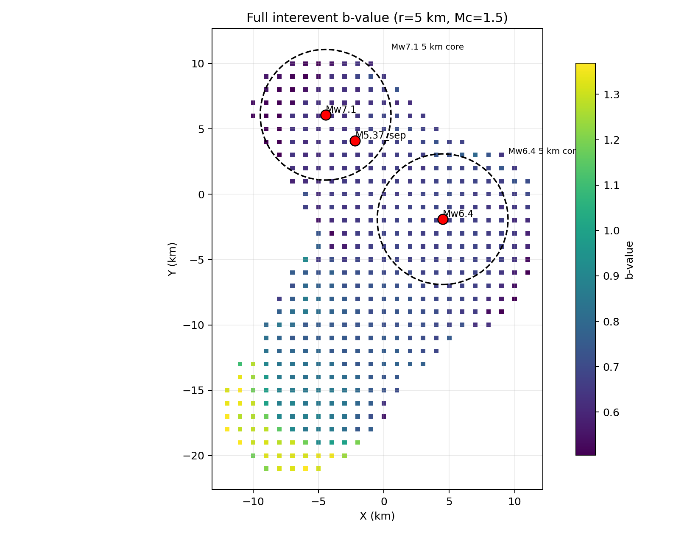
<figcaption>Full interevent</figcaption>
</figure>
<figure>
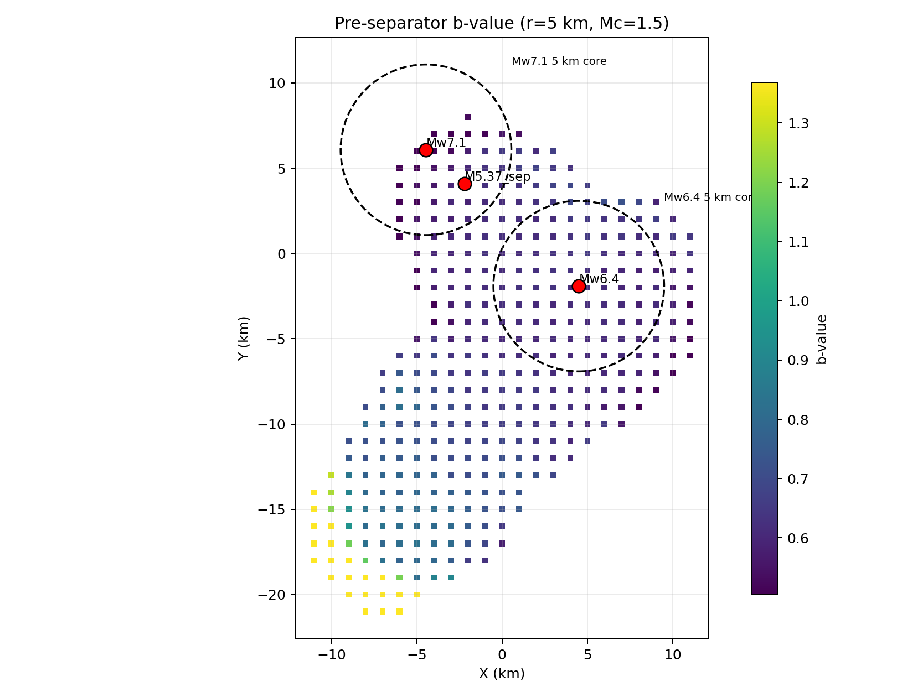
<figcaption>Pre-separator</figcaption>
</figure>
<figure>
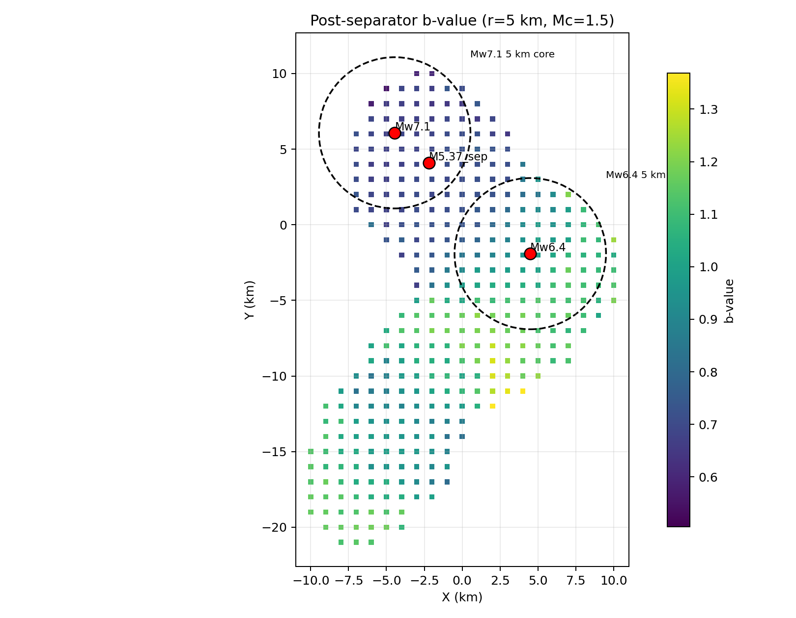
<figcaption>Post-separator</figcaption>
</figure>
<figcaption>Primary 5 km fixed-<span class="math inline"><em>M</em><sub><em>c</em></sub></span> spatial b-value maps for the three interevent windows. All maps use the common color scale documented in the analysis metadata. Geographic versions are also available in the output directory.</figcaption>
</figure>

For the full interevent window, the map shows a southwest-to-northeast contrast, with comparatively higher b-values in the southwest and lower values toward the northern and eastern sectors. The future Mw 7.1 core lies within a lower-b patch than the Mw 6.4 control, but the contrast is modest. For the pre-separator window, the future Mw 7.1 area also appears low-b, but coverage is sparse near the northern edge. For the post-separator window, the low-b patch centered on the future Mw 7.1 region is the clearest and most coherent of the three windows.

## Reliability and uncertainty

Figure <a href="#fig:reliability" data-reference-type="ref" data-reference="fig:reliability">2</a> summarizes the 5 km reliability-class maps, and Figure <a href="#fig:uncertainty" data-reference-type="ref" data-reference="fig:uncertainty">3</a> shows bootstrap uncertainty. These diagnostics are essential because they distinguish robust spatial structure from sparse-edge artifacts.

<figure id="fig:reliability" data-latex-placement="H">
<figure>

<figcaption>Full interevent</figcaption>
</figure>
<figure>
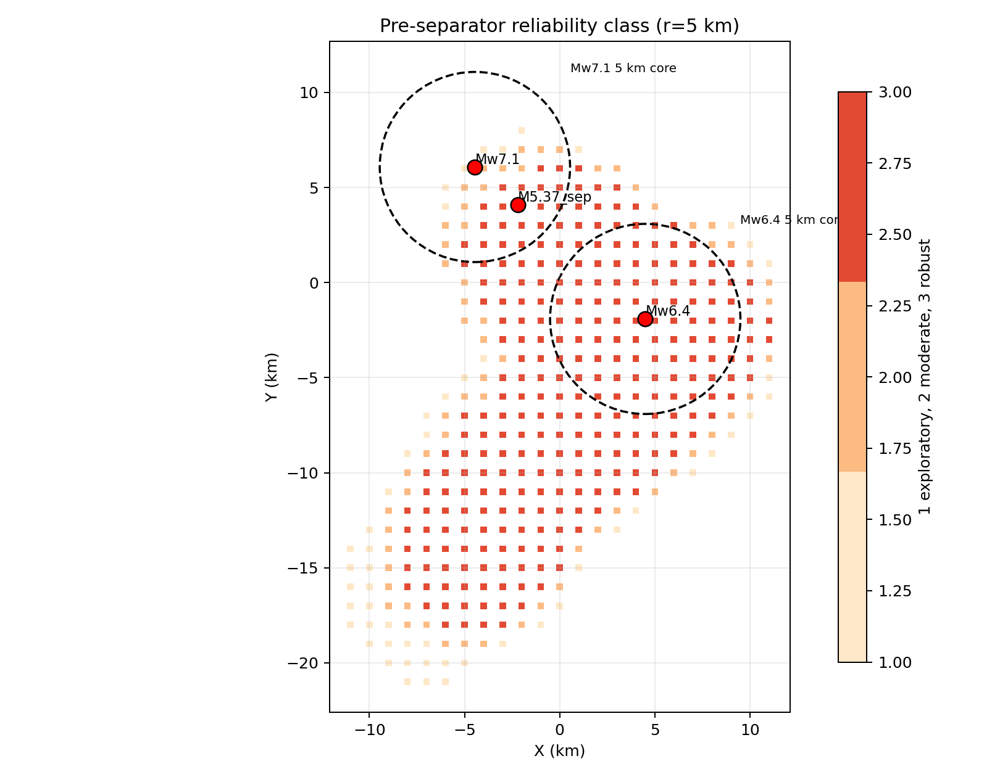
<figcaption>Pre-separator</figcaption>
</figure>
<figure>
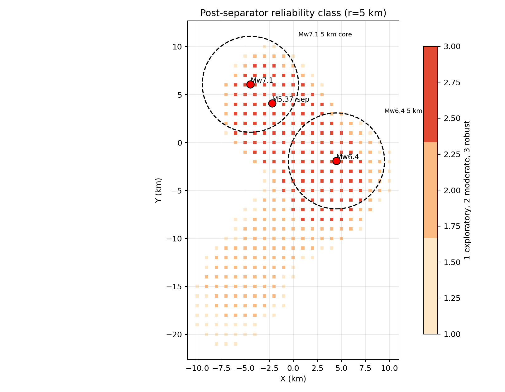
<figcaption>Post-separator</figcaption>
</figure>
<figcaption>Reliability-class maps at 5 km radius, based on the number of events above <span class="math inline"><em>M</em><sub><em>c</em></sub></span>. The pre-separator future Mw 7.1 area is notably less well supported than the post-separator case.</figcaption>
</figure>

<figure id="fig:uncertainty" data-latex-placement="H">
<figure>
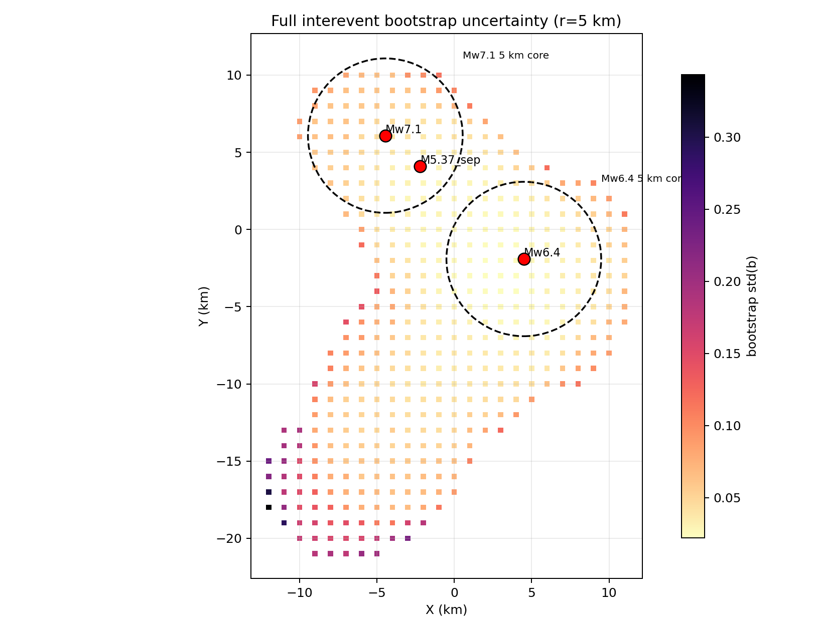
<figcaption>Full interevent</figcaption>
</figure>
<figure>
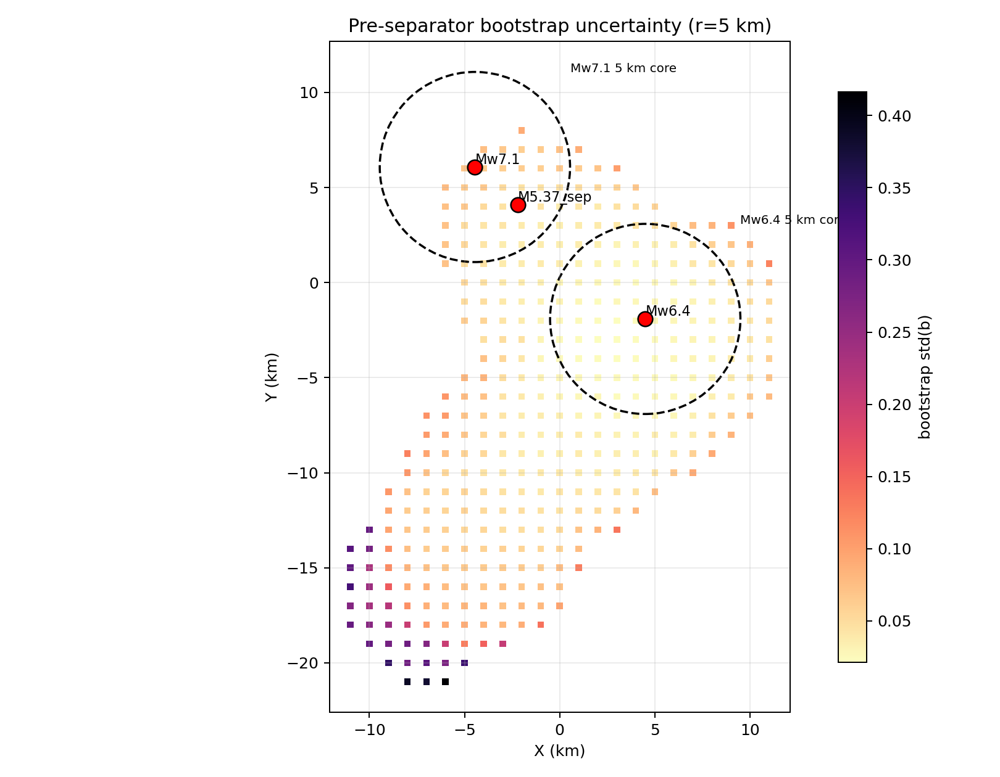
<figcaption>Pre-separator</figcaption>
</figure>
<figure>
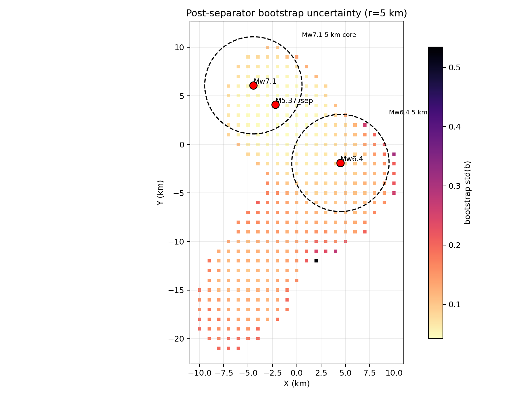
<figcaption>Post-separator</figcaption>
</figure>
<figcaption>Bootstrap uncertainty maps for the 5 km primary b-value fields. The post-separator future Mw 7.1 core lies in a comparatively low-uncertainty, well-supported low-b zone, whereas the pre-separator northern edge is less certain.</figcaption>
</figure>

# Core comparison: future Mw 7.1 region versus Mw 6.4 control

The most direct test of the scientific question is the comparison between 5 km cores centered on the Mw 7.1 and Mw 6.4 main-shock regions. Table <a href="#tab:core_summary" data-reference-type="ref" data-reference="tab:core_summary">[tab:core_summary]</a> summarizes the core b-values and uncertainties for all three windows.

<div class="tabularx">

P2.6cmP2.0cmP1.2cmP1.8cmP1.5cmP1.8cmP1.5cmP1.6cm Window & Core & $`b`$ & 95% CI & $`n_{\ge M_c}`$ & Reliability & $`\Delta b_{71-64}`$ & Interpretation  
Full interevent & Mw 7.1 core & 0.6245 & 0.551–0.717 & 215 & robust & -0.0498 & lower than control, modest  
Full interevent & Mw 6.4 core & 0.6743 & 0.629–0.728 & 649 & robust & — & control  
Pre-separator & Mw 7.1 core & 0.5012 & 0.394–0.682 & 49 & exploratory & -0.1175 & lower than control, but sparse  
Pre-separator & Mw 6.4 core & 0.6187 & 0.574–0.667 & 498 & robust & — & control  
Post-separator & Mw 7.1 core & 0.6733 & 0.587–0.784 & 166 & robust & -0.2848 & clearly lower than control  
Post-separator & Mw 6.4 core & 0.9581 & 0.825–1.119 & 151 & robust & — & control  

</div>

The results show a consistent directional pattern across all windows: the future Mw 7.1 core has lower b-values than the Mw 6.4 control. However, confidence differs by interval. In the full interevent window, the contrast is modest and the bootstrap intervals overlap. In the pre-separator window, the contrast is larger in amplitude but only exploratory because the future Mw 7.1 core contains 49 events above $`M_c`$ and has substantially broader uncertainty. In the post-separator window, both cores are robustly sampled and the contrast is large, making this the strongest evidence that the future Mw 7.1 region is embedded in a localized low-b zone.

# Temporal change and spatial localization

## Difference map

The post-minus-pre difference map is shown in Figure <a href="#fig:diffmap" data-reference-type="ref" data-reference="fig:diffmap">4</a>. Over the common-coverage area, most nodes show positive $`\Delta b`$, indicating that b-values generally increased from the pre-separator to the post-separator window. However, the increase is weaker in the future Mw 7.1 region than around the Mw 6.4 control area. This matters because it shows that the post-separator result is not a simple basin-wide lowering of b-values near Mw 7.1; rather, the future Mw 7.1 region remains relatively low compared with its surroundings and with the control.

Common coverage is limited to 334 valid nodes, compared with 396 valid nodes in the pre-separator map and 361 in the post-separator map. Therefore, spatial change should be interpreted only where both windows satisfy the event-count threshold.

<figure id="fig:diffmap" data-latex-placement="H">
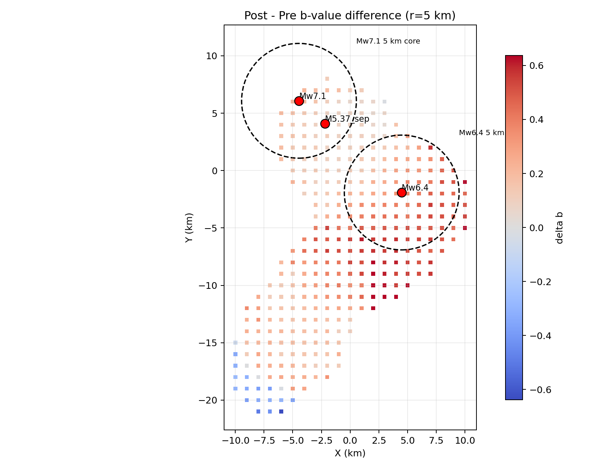
<figcaption>Difference map for <span class="math inline"><em>b</em><sub>post</sub> − <em>b</em><sub>pre</sub></span> at 5 km radius. Positive values dominate the common-coverage area, but the future Mw 7.1 region remains comparatively low relative to the Mw 6.4 control and its surroundings.</figcaption>
</figure>

## Fault-oriented post-separator profile

A fault-oriented along-strike profile provides an independent spatial view of the post-separator pattern. Figure <a href="#fig:profile" data-reference-type="ref" data-reference="fig:profile">5</a> shows that b-values are lowest near the Mw 7.1 hypocentral/core segment and rise away along strike. The profile minimum occurs near $`-2.50`$ km with $`b=0.568`$ and $`n_{\ge M_c}=81`$. From roughly $`-1.5`$ to $`6.5`$ km along strike, b-values remain mostly in the range 0.67–0.72 with high support, then increase progressively to about 0.87 at 9.48 km, 0.94 at 10.52 km, 1.02 at 11.56 km, and 1.15 at 14.55 km. This pattern supports a localized low-b segment centered near the future Mw 7.1 core rather than a diffuse field-wide effect.

<figure id="fig:profile" data-latex-placement="H">
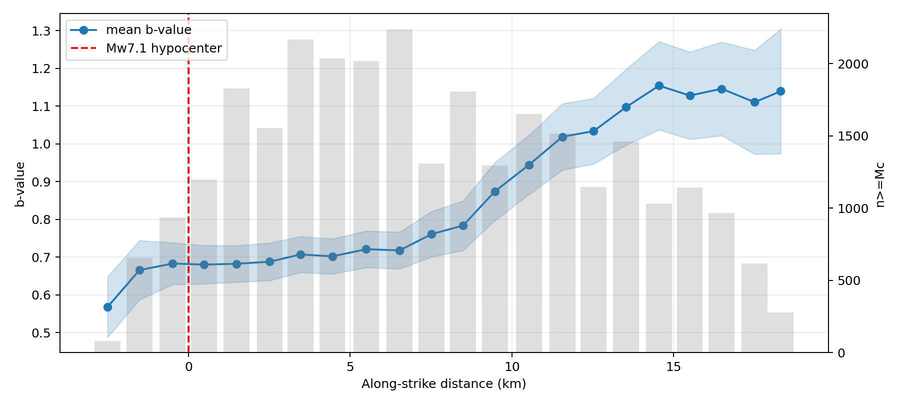
<figcaption>Fault-oriented along-strike b-value profile for the post-separator window. The lowest values occur near the Mw 7.1 hypocentral/core segment and increase away along strike.</figcaption>
</figure>

# Frequency–magnitude distributions and descriptive low-b summary

The core frequency–magnitude distribution comparison in Figure <a href="#fig:fmd" data-reference-type="ref" data-reference="fig:fmd">6</a> is consistent with the mapped b-value contrasts. The post-separator panel is especially informative: the future Mw 7.1 core has a flatter frequency–magnitude distribution than the Mw 6.4 control, indicating relatively more moderate-to-larger magnitudes above the fixed threshold and therefore a lower b-value. The pre-separator panel is much sparser for the future Mw 7.1 core, matching its exploratory reliability class.

<figure id="fig:fmd" data-latex-placement="H">
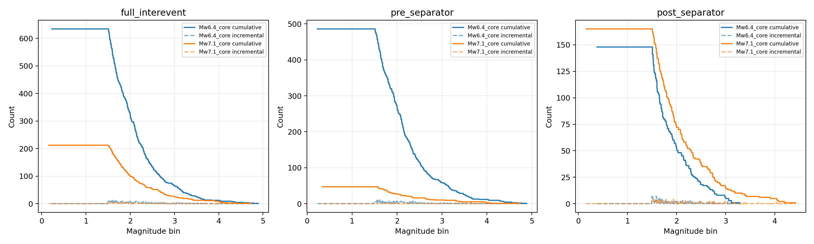
<figcaption>Core frequency–magnitude distribution comparison for the Mw 7.1 and Mw 6.4 5 km cores across the three windows. The post-separator future Mw 7.1 core is visibly flatter than the Mw 6.4 control, consistent with its lower b-value.</figcaption>
</figure>

The descriptive low-b summary also supports the same interpretation. Using the requested low-b definition based on $`b<0.9`$ and/or the lowest 20% of valid nodes, the post-separator window contains 58 low-b nodes within 5 km of Mw 7.1 but only 20 within 5 km of Mw 6.4. In contrast, the full interevent window has 78 versus 80 low-b nodes near Mw 7.1 and Mw 6.4, respectively, and the pre-separator window has 37 versus 80, but the pre result is limited by sparse support around the future Mw 7.1 region. Thus, the descriptive low-b concentration is most distinctive in the post-separator interval.

# Radius sensitivity and robustness

The primary interpretation is based on the 5 km radius, but sensitivity tests across radii of 4–7 km show that the core contrast is not an artifact of a single radius choice. Figure <a href="#fig:radius" data-reference-type="ref" data-reference="fig:radius">7</a> summarizes the sensitivity analysis.

For the full interevent window, the Mw 7.1 core median node b remains lower than the Mw 6.4 control at every radius, increasing only modestly from 0.619 to 0.641 as radius grows from 4 to 7 km, whereas the control stays near 0.675–0.677. For the pre-separator window, the Mw 7.1 core remains lower than the control at all radii, but valid-node support rises strongly from 25 nodes at 4 km to 63 nodes at 7 km, confirming sensitivity to sparse sampling. For the post-separator window, the result is strongest: the Mw 7.1 core median node b is nearly invariant at about 0.686–0.690 across all radii, while the Mw 6.4 control decreases from 1.018 at 4 km to 0.944 at 7 km but remains much higher than the Mw 7.1 core throughout.

<figure id="fig:radius" data-latex-placement="H">
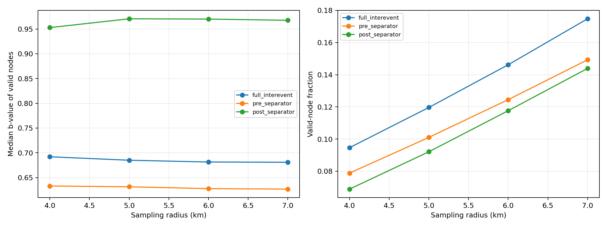
<figcaption>Radius sensitivity of the spatial diagnostics. The future Mw 7.1 core remains lower-b than the Mw 6.4 control from 4 to 7 km, with the strongest and most stable contrast in the post-separator window.</figcaption>
</figure>

# Interpretation relative to the scientific question

The analysis answers the scientific question with a restrained affirmative. The interevent catalog does show a spatial b-value pattern near the future Mw 7.1 hypocentral/rupture region that is consistent with the Q0/Q1 local b-value results, but that support is uneven across time windows.

The strongest support comes from the post-separator interval. In that window, the future Mw 7.1 core is lower-b than the Mw 6.4 control by $`\Delta b=-0.285`$, both cores are robustly sampled, the low-b patch is spatially coherent on the map, bootstrap uncertainty is comparatively low in the future Mw 7.1 core, and the along-strike profile places the lowest b-values at and near the future Mw 7.1 segment. The full interevent window points in the same direction but with a smaller amplitude and overlapping confidence intervals. The pre-separator window also points in the same direction, but the future Mw 7.1 core is exploratory and therefore cannot support a strong stand-alone inference.

In the interpretation framework specified for this task, low b-values are understood only as being consistent with localized stress loading or relatively higher differential stress. They are not treated as evidence of deterministic prediction. Accordingly, the Q2 spatial analysis should be read as spatial support for the Q0/Q1 local b-value findings, not as an independent precursor claim.

# Limitations

The main limitations that qualify the results are as follows.

1.  **Fixed-$`M_c`$ mapping assumption.** The main maps use fixed $`M_c=1.5`$ by design, while dynamic $`M_c`$ QC differs among windows, especially in the post-separator and background cases. This improves comparability across space and time but does not adapt to local completeness variations.

2.  **Sparse pre-separator support near the future Mw 7.1 core.** The pre-separator Mw 7.1 core has only 49 events above $`M_c`$ and is explicitly classified as exploratory. Its bootstrap interval is wider than in the other core estimates, and map coverage near the northern edge is incomplete.

3.  **Limited common coverage for the difference map.** Only 334 nodes are valid in both pre and post windows, compared with 396 pre-valid and 361 post-valid nodes separately. Spatial change can therefore be interpreted only over the common-coverage subset.

4.  **Background catalog is contextual only.** The two-year background reference spans a different time window and a larger region, so it should not be used as a direct control for the local core comparison.

5.  **Full-window contrast is modest.** In the full interevent comparison, the future Mw 7.1 core is lower-b than the control, but the amplitude is small and confidence intervals overlap. The main scientific support therefore comes primarily from the post-separator window.

# Reproducibility and output inventory

The requested output classes were produced, including cleaned window catalogs, grid-node b-value tables, uncertainty and reliability tables, core FMD summaries, difference-map source data, low-b summaries, and validation checks. Representative file locations are listed in Table <a href="#tab:outputs" data-reference-type="ref" data-reference="tab:outputs">[tab:outputs]</a>. All paths below are absolute paths within the delivered output directory.

<div class="tabularx">

P4.0cmY Artifact type & File path  
Analysis metadata & <a href="../exp_run/outputs/01_spatial_bvalue_diagnostics/tables/analysis_metadata.json" class="uri">../exp_run/outputs/01_spatial_bvalue_diagnostics/tables/analysis_metadata.json</a>  
Validation report & <a href="../exp_run/outputs/01_spatial_bvalue_diagnostics/tables/validation_report.json" class="uri">../exp_run/outputs/01_spatial_bvalue_diagnostics/tables/validation_report.json</a>  
Window-level b-values & <a href="../exp_run/outputs/01_spatial_bvalue_diagnostics/tables/window_level_bvalue_qc.csv" class="uri">../exp_run/outputs/01_spatial_bvalue_diagnostics/tables/window_level_bvalue_qc.csv</a>  
Window-level dynamic $`M_c`$ QC & <a href="../exp_run/outputs/01_spatial_bvalue_diagnostics/tables/window_level_mc_qc.csv" class="uri">../exp_run/outputs/01_spatial_bvalue_diagnostics/tables/window_level_mc_qc.csv</a>  
Core comparison summary & <a href="../exp_run/outputs/01_spatial_bvalue_diagnostics/tables/core_bvalues_fmd_summary.csv" class="uri">../exp_run/outputs/01_spatial_bvalue_diagnostics/tables/core_bvalues_fmd_summary.csv</a>  
Core-versus-control table & <a href="../exp_run/outputs/01_spatial_bvalue_diagnostics/tables/core_vs_control_comparison.csv" class="uri">../exp_run/outputs/01_spatial_bvalue_diagnostics/tables/core_vs_control_comparison.csv</a>  
Difference-map coverage & <a href="../exp_run/outputs/01_spatial_bvalue_diagnostics/tables/difference_map_coverage_summary.csv" class="uri">../exp_run/outputs/01_spatial_bvalue_diagnostics/tables/difference_map_coverage_summary.csv</a>  
Along-strike profile data & <a href="../exp_run/outputs/01_spatial_bvalue_diagnostics/tables/mw71_profile_post_separator_r5_binned.csv" class="uri">../exp_run/outputs/01_spatial_bvalue_diagnostics/tables/mw71_profile_post_separator_r5_binned.csv</a>  
Low-b summary & <a href="../exp_run/outputs/01_spatial_bvalue_diagnostics/tables/low_b_summary_by_window.csv" class="uri">../exp_run/outputs/01_spatial_bvalue_diagnostics/tables/low_b_summary_by_window.csv</a>  
Radius sensitivity & <a href="../exp_run/outputs/01_spatial_bvalue_diagnostics/tables/core_radius_sensitivity_summary.csv" class="uri">../exp_run/outputs/01_spatial_bvalue_diagnostics/tables/core_radius_sensitivity_summary.csv</a>  

</div>

# Conclusion

The Ridgecrest interevent catalog contains a spatially localized low-b region around the future Mw 7.1 hypocentral/rupture area that is most clearly resolved in the post-separator interval. Relative to the Mw 6.4 control region, the future Mw 7.1 core is lower-b in the full, pre-, and post-separator windows, but only the post-separator comparison is both strong in amplitude and robust in sampling. The post-separator maps, reliability fields, uncertainty maps, along-strike profile, core FMD comparison, and radius-sensitivity analysis all point to the same restrained conclusion: the Q2 spatial diagnostics are consistent with the Q0/Q1 local b-value results and provide spatial support for a localized low-b segment near the future Mw 7.1 region. Because the pre-separator evidence is sparse and because the analysis uses a fixed-threshold mapping framework, these results should be interpreted as evidence of relative spatial loading-state heterogeneity, not as deterministic earthquake prediction.
