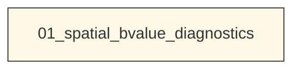
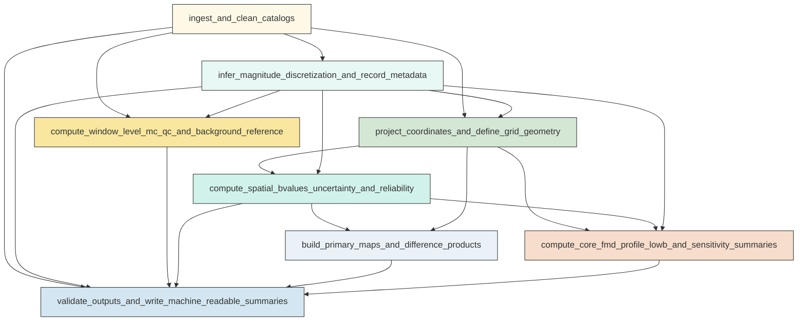

# Workflow Overview

## Top-Level Task Dependencies

**Description:**
- `01_spatial_bvalue_diagnostics`: Execute the full Ridgecrest interevent spatial b-value analysis, figure generation, and scientific validation in one script.

## Subtask Dependencies

#### 01_spatial_bvalue_diagnostics
**Usage**: Execute the full Ridgecrest interevent spatial b-value analysis, figure generation, and scientific validation in one script.

**Description:**
- `ingest_and_clean_catalogs`: Read the interevent, background, and main-shock catalogs, standardize fields, define windows, and exclude marker events.
- `infer_magnitude_discretization_and_record_metadata`: Infer the stable magnitude bin width, define the fixed-Mc b-value settings, and record analysis metadata.
- `project_coordinates_and_define_grid_geometry`: Project catalogs to local metric coordinates, build a common analysis grid, and define core circles and the Mw 7.1 profile geometry.
- `compute_window_level_mc_qc_and_background_reference`: Estimate one dynamic Mc per window and a regional background reference b-value for context using seismostats methods.
- `compute_spatial_bvalues_uncertainty_and_reliability`: Calculate node-wise fixed-radius b-values, bootstrap uncertainty, counts, and reliability classes for all windows and radii.
- `build_primary_maps_and_difference_products`: Generate the required 5 km b-value maps, reliability maps, and post-minus-pre difference products on common valid nodes.
- `compute_core_fmd_profile_lowb_and_sensitivity_summaries`: Derive core-region b-values and FMDs, the Mw 7.1 post-separator profile, low-b summaries, and radius sensitivity tables and figures.
- `validate_outputs_and_write_machine_readable_summaries`: Check that required outputs are present and scientifically usable, then write manifests and compact comparison summaries.