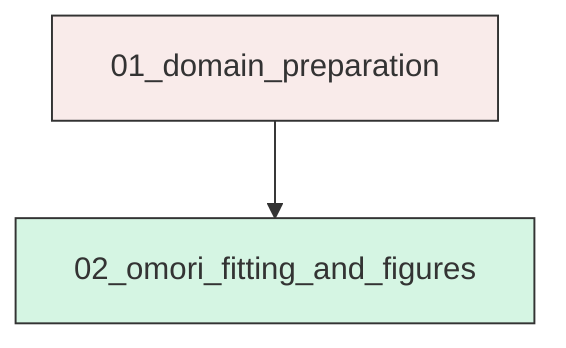
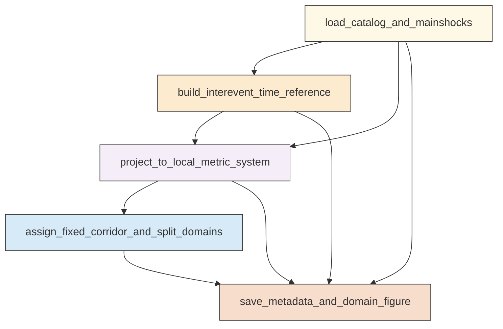
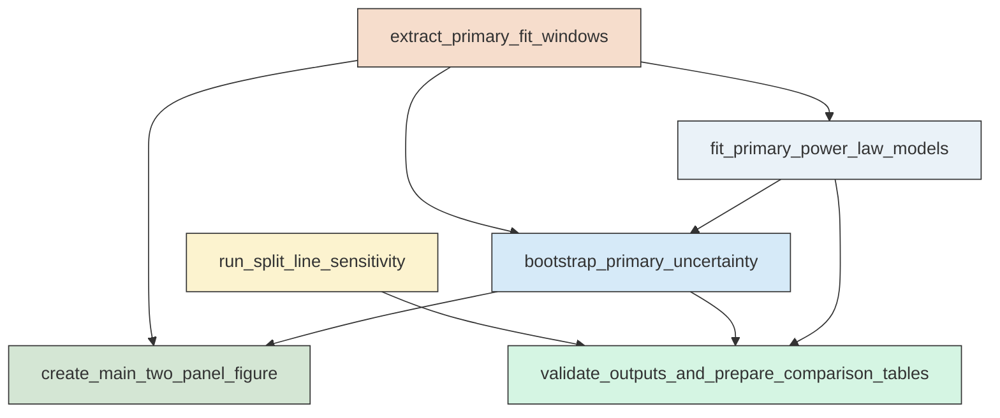

# Research Codings

## Task Overview


**Description:**
- `01_domain_preparation`: Build the Ridgecrest interevent event table, assign fixed corridor and north-south domains, and save domain diagnostics metadata.
- `02_omori_fitting_and_figures`: Fit cumulative pure power-law Omori models with bootstrap uncertainty, create required figures, and save primary and split-sensitivity results.


## Task Details


#### 01_domain_preparation
**Usage**: Build the Ridgecrest interevent event table, assign fixed corridor and north-south domains, and save domain diagnostics metadata.

**Description:**
- `load_catalog_and_mainshocks`: Read the relocated catalog and identify the Mw 6.4 and Mw 7.1 mainshock origin times.
- `build_interevent_time_reference`: Compute time since Mw 6.4 and retain only events strictly between the Mw 6.4 and Mw 7.1 origin times.
- `project_to_local_metric_system`: Project events and corridor control points to a local metric coordinate system for distance calculations.
- `assign_fixed_corridor_and_split_domains`: Compute along-strike and cross-strike positions and assign entire, north, and south domain flags for the required split latitudes.
- `save_metadata_and_domain_figure`: Save required metadata and generate the domain-assignment diagnostic figure for the fixed primary geometry.

#### Coding Script

```python

from __future__ import annotations

import json
import math
import os
import sys
import traceback
from dataclasses import dataclass, asdict
from pathlib import Path

import matplotlib
matplotlib.use('Agg')
import matplotlib.pyplot as plt
import numpy as np
import pandas as pd
from pyproj import CRS, Transformer


CATALOG_PATH = Path('<REPO_ROOT>/examples/ridgecrest/data/catalog_TRACE/TRACE_ridgecrest_relocated.csv')
MAINSHOCK_PATH = Path('<REPO_ROOT>/examples/ridgecrest/data/catalog_TRACE/main_shock_events.csv')
OUTPUT_DIR = Path('../exp_run/outputs/01_domain_preparation')

EVENT_TABLE_CSV = OUTPUT_DIR / 'interevent_domain_event_table.csv'
DOMAIN_COUNT_CSV = OUTPUT_DIR / 'domain_counts_primary.csv'
DOMAIN_CHECK_CSV = OUTPUT_DIR / 'domain_assignment_checks.csv'
METADATA_JSON = OUTPUT_DIR / 'domain_metadata.json'
FIGURE_PATH = OUTPUT_DIR / 'domain_assignment_diagnostic.png'
OUTPUT_FILES = [EVENT_TABLE_CSV, DOMAIN_COUNT_CSV, DOMAIN_CHECK_CSV, METADATA_JSON, FIGURE_PATH]

PRIMARY_SPLIT_LAT = 35.72
SPLIT_LATS = [35.70, 35.72, 35.74]
PRIMARY_MAG_THRESHOLD = 3.0
M54_SEPARATOR_DAYS = 0.732
FINAL_PERIOD_DAYS = 1.404
STRIKE_DEG = 138.0
CORRIDOR_WIDTH_KM = 6.0
HALF_WIDTH_KM = CORRIDOR_WIDTH_KM / 2.0
CENTERLINE_START_LON = -117.735813
CENTERLINE_START_LAT = 35.897499
CENTERLINE_END_LON = -117.362520
CENTERLINE_END_LAT = 35.559488
TIME_COL = 'event_time'


@dataclass
class CorridorGeometry:
    strike_deg: float
    centerline_start_lon: float
    centerline_start_lat: float
    centerline_end_lon: float
    centerline_end_lat: float
    total_width_km: float
    half_width_km: float
    centerline_length_km: float


def log(message: str) -> None:
    print(message, flush=True)


def build_local_transformer() -> tuple[Transformer, Transformer, CRS]:
    lon0 = (CENTERLINE_START_LON + CENTERLINE_END_LON) / 2.0
    lat0 = (CENTERLINE_START_LAT + CENTERLINE_END_LAT) / 2.0
    crs_local = CRS.from_proj4(
        f'+proj=aeqd +lat_0={lat0} +lon_0={lon0} +datum=WGS84 +units=m +no_defs'
    )
    forward = Transformer.from_crs('EPSG:4326', crs_local, always_xy=True)
    inverse = Transformer.from_crs(crs_local, 'EPSG:4326', always_xy=True)
    return forward, inverse, crs_local


def read_inputs() -> tuple[pd.DataFrame, pd.DataFrame]:
    log(f'Reading catalog: {CATALOG_PATH}')
    catalog = pd.read_csv(CATALOG_PATH)
    log(f'Reading mainshocks: {MAINSHOCK_PATH}')
    mainshocks = pd.read_csv(MAINSHOCK_PATH)
    expected = ['event_time', 'latitude', 'longitude', 'depth_km', 'magnitude']
    if list(catalog.columns) != expected:
        raise ValueError(f'Unexpected catalog columns: {catalog.columns.tolist()}')
    if list(mainshocks.columns) != expected:
        raise ValueError(f'Unexpected mainshock columns: {mainshocks.columns.tolist()}')
    return catalog, mainshocks


def identify_mainshocks(mainshocks: pd.DataFrame) -> tuple[pd.Series, pd.Series]:
    ms64 = mainshocks.loc[np.isclose(mainshocks['magnitude'], 6.4)]
    ms71 = mainshocks.loc[np.isclose(mainshocks['magnitude'], 7.1)]
    if len(ms64) != 1 or len(ms71) != 1:
        raise ValueError('Could not uniquely identify Mw 6.4 and Mw 7.1 mainshocks.')
    return ms64.iloc[0], ms71.iloc[0]


def project_points(df: pd.DataFrame, transformer: Transformer) -> pd.DataFrame:
    x_m, y_m = transformer.transform(df['longitude'].to_numpy(), df['latitude'].to_numpy())
    out = df.copy()
    out['x_m'] = x_m
    out['y_m'] = y_m
    out['x_km'] = out['x_m'] / 1000.0
    out['y_km'] = out['y_m'] / 1000.0
    return out


def assign_corridor_domains(interevent: pd.DataFrame, transformer: Transformer) -> tuple[pd.DataFrame, CorridorGeometry, dict[str, np.ndarray]]:
    sx, sy = transformer.transform(CENTERLINE_START_LON, CENTERLINE_START_LAT)
    ex, ey = transformer.transform(CENTERLINE_END_LON, CENTERLINE_END_LAT)
    start = np.array([sx, sy], dtype=float)
    end = np.array([ex, ey], dtype=float)
    vec = end - start
    length_m = float(np.hypot(vec[0], vec[1]))
    if not np.isfinite(length_m) or length_m <= 0:
        raise ValueError('Invalid centerline length.')
    u = vec / length_m
    left_normal = np.array([-u[1], u[0]], dtype=float)

    pts = interevent[['x_m', 'y_m']].to_numpy(dtype=float)
    rel = pts - start[None, :]
    along_m = rel @ u
    cross_m = rel @ left_normal

    in_segment = (along_m >= 0.0) & (along_m <= length_m)
    in_width = np.abs(cross_m) <= HALF_WIDTH_KM * 1000.0
    in_entire = in_segment & in_width

    out = interevent.copy()
    out['along_strike_km'] = along_m / 1000.0
    out['cross_strike_km'] = cross_m / 1000.0
    out['in_entire_corridor'] = in_entire

    lat = out['latitude'].to_numpy()
    for split in SPLIT_LATS:
        token = f'{split:.2f}'.replace('.', 'p')
        out[f'on_split_{token}'] = np.zeros(len(out), dtype=bool)
        out[f'north_{token}'] = in_entire & (lat > split)
        out[f'south_{token}'] = in_entire & (lat < split)

    corners = np.array([
        start + left_normal * HALF_WIDTH_KM * 1000.0,
        end + left_normal * HALF_WIDTH_KM * 1000.0,
        end - left_normal * HALF_WIDTH_KM * 1000.0,
        start - left_normal * HALF_WIDTH_KM * 1000.0,
        start + left_normal * HALF_WIDTH_KM * 1000.0,
    ])

    geometry = CorridorGeometry(
        strike_deg=STRIKE_DEG,
        centerline_start_lon=CENTERLINE_START_LON,
        centerline_start_lat=CENTERLINE_START_LAT,
        centerline_end_lon=CENTERLINE_END_LON,
        centerline_end_lat=CENTERLINE_END_LAT,
        total_width_km=CORRIDOR_WIDTH_KM,
        half_width_km=HALF_WIDTH_KM,
        centerline_length_km=length_m / 1000.0,
    )
    plot_arrays = {
        'centerline_xy_m': np.vstack([start, end]),
        'corridor_polygon_xy_m': corners,
    }
    return out, geometry, plot_arrays


def make_domain_counts(df: pd.DataFrame) -> pd.DataFrame:
    rows = []
    rows.append({'domain_label': 'Entire area', 'split_latitude_deg': PRIMARY_SPLIT_LAT, 'event_count_all_magnitudes': int(df['in_entire_corridor'].sum())})
    rows.append({'domain_label': 'Northern area', 'split_latitude_deg': PRIMARY_SPLIT_LAT, 'event_count_all_magnitudes': int(df['north_35p72'].sum())})
    rows.append({'domain_label': 'Southern area', 'split_latitude_deg': PRIMARY_SPLIT_LAT, 'event_count_all_magnitudes': int(df['south_35p72'].sum())})
    out = pd.DataFrame(rows)
    out['event_count_m_ge_3'] = [
        int((df['in_entire_corridor'] & (df['magnitude'] >= PRIMARY_MAG_THRESHOLD)).sum()),
        int((df['north_35p72'] & (df['magnitude'] >= PRIMARY_MAG_THRESHOLD)).sum()),
        int((df['south_35p72'] & (df['magnitude'] >= PRIMARY_MAG_THRESHOLD)).sum()),
    ]
    return out


def make_assignment_checks(df: pd.DataFrame) -> pd.DataFrame:
    north_all = int(df['north_35p72'].sum())
    south_all = int(df['south_35p72'].sum())
    onsplit_all = int(df['on_split_35p72'].sum())
    entire_all = int(df['in_entire_corridor'].sum())
    checks = [
        ('all_interevent_events', len(df)),
        ('entire_corridor_all_magnitudes', entire_all),
        ('north_35p72_all_magnitudes', north_all),
        ('south_35p72_all_magnitudes', south_all),
        ('on_split_35p72_all_magnitudes', onsplit_all),
        ('north_plus_south_35p72_all_magnitudes', north_all + south_all),
        ('north_plus_south_minus_entire_35p72_all_magnitudes', (north_all + south_all) - entire_all),
        ('entire_corridor_m_ge_3', int((df['in_entire_corridor'] & (df['magnitude'] >= PRIMARY_MAG_THRESHOLD)).sum())),
        ('north_35p72_m_ge_3', int((df['north_35p72'] & (df['magnitude'] >= PRIMARY_MAG_THRESHOLD)).sum())),
        ('south_35p72_m_ge_3', int((df['south_35p72'] & (df['magnitude'] >= PRIMARY_MAG_THRESHOLD)).sum())),
    ]
    return pd.DataFrame(checks, columns=['check_name', 'value'])


def plot_diagnostic(interevent: pd.DataFrame, mainshocks_proj: pd.DataFrame, plot_arrays: dict[str, np.ndarray], inverse: Transformer) -> None:
    log(f'Creating diagnostic figure: {FIGURE_PATH}')
    fig, ax = plt.subplots(figsize=(8.8, 7.6), constrained_layout=True)

    scatter = ax.scatter(
        interevent['longitude'],
        interevent['latitude'],
        c=interevent['t_days'],
        s=8,
        cmap='viridis',
        alpha=0.65,
        linewidths=0,
        label='All interevent events',
        zorder=1,
    )

    entire = interevent.loc[interevent['in_entire_corridor']]
    north = interevent.loc[interevent['north_35p72']]
    south = interevent.loc[interevent['south_35p72']]

    ax.scatter(entire['longitude'], entire['latitude'], s=14, facecolors='none', edgecolors='0.35', linewidths=0.6, label='Entire corridor events', zorder=2)
    ax.scatter(north['longitude'], north['latitude'], s=16, c='tab:blue', alpha=0.85, linewidths=0, label='Northern area', zorder=3)
    ax.scatter(south['longitude'], south['latitude'], s=16, c='tab:red', alpha=0.85, linewidths=0, label='Southern area', zorder=3)

    centerline = plot_arrays['centerline_xy_m']
    center_lon, center_lat = inverse.transform(centerline[:, 0], centerline[:, 1])
    ax.plot(center_lon, center_lat, color='k', lw=1.8, label='Mw 7.1 centerline', zorder=4)

    polygon = plot_arrays['corridor_polygon_xy_m']
    poly_lon, poly_lat = inverse.transform(polygon[:, 0], polygon[:, 1])
    ax.plot(poly_lon, poly_lat, color='k', lw=1.0, ls='--', label='6 km corridor boundary', zorder=4)

    lon_min = min(interevent['longitude'].min(), poly_lon.min(), mainshocks_proj['longitude'].min()) - 0.02
    lon_max = max(interevent['longitude'].max(), poly_lon.max(), mainshocks_proj['longitude'].max()) + 0.02
    ax.hlines(PRIMARY_SPLIT_LAT, lon_min, lon_max, color='magenta', lw=1.5, ls=':', label='35.72°N split', zorder=4)

    ms64 = mainshocks_proj.loc[np.isclose(mainshocks_proj['magnitude'], 6.4)].iloc[0]
    ms71 = mainshocks_proj.loc[np.isclose(mainshocks_proj['magnitude'], 7.1)].iloc[0]
    ax.scatter(ms64['longitude'], ms64['latitude'], marker='*', s=220, c='gold', edgecolors='k', linewidths=0.8, label='Mw 6.4 mainshock', zorder=5)
    ax.scatter(ms71['longitude'], ms71['latitude'], marker='*', s=240, c='orange', edgecolors='k', linewidths=0.8, label='Mw 7.1 mainshock', zorder=5)

    cbar = fig.colorbar(scatter, ax=ax, pad=0.02)
    cbar.set_label('Time since Mw 6.4 [day]')

    ax.set_xlabel('Longitude')
    ax.set_ylabel('Latitude')
    ax.set_title('Ridgecrest interevent domain assignment for fixed Mw 7.1 fault-zone corridor')
    ax.set_xlim(lon_min, lon_max)
    lat_min = min(interevent['latitude'].min(), poly_lat.min(), mainshocks_proj['latitude'].min()) - 0.02
    lat_max = max(interevent['latitude'].max(), poly_lat.max(), mainshocks_proj['latitude'].max()) + 0.02
    ax.set_ylim(lat_min, lat_max)
    ax.grid(True, color='0.9', linewidth=0.7)
    ax.legend(loc='best', fontsize=8, frameon=True)

    fig.savefig(FIGURE_PATH, dpi=220)
    plt.close(fig)


def remove_stale_outputs() -> None:
    for path in OUTPUT_FILES:
        if path.exists():
            log(f'Removing stale output: {path}')
            path.unlink()


def validate_required_columns(df: pd.DataFrame, required: list[str], label: str) -> None:
    missing = [col for col in required if col not in df.columns]
    if missing:
        raise ValueError(f'Missing required columns in {label}: {missing}')


def main() -> None:
    OUTPUT_DIR.mkdir(parents=True, exist_ok=True)
    log(f'Output directory: {OUTPUT_DIR}')
    remove_stale_outputs()

    catalog, mainshocks = read_inputs()
    validate_required_columns(catalog, ['event_time', 'latitude', 'longitude', 'depth_km', 'magnitude'], 'catalog')
    validate_required_columns(mainshocks, ['event_time', 'latitude', 'longitude', 'depth_km', 'magnitude'], 'mainshocks')

    catalog[TIME_COL] = pd.to_datetime(catalog[TIME_COL], utc=True)
    mainshocks[TIME_COL] = pd.to_datetime(mainshocks[TIME_COL], utc=True)

    ms64, ms71 = identify_mainshocks(mainshocks)
    t0 = ms64[TIME_COL]
    t71 = ms71[TIME_COL]
    if not (t71 > t0):
        raise ValueError('Mw 7.1 origin time must be after Mw 6.4 origin time.')

    log(f'Mw 6.4 origin time: {t0.isoformat()}')
    log(f'Mw 7.1 origin time: {t71.isoformat()}')

    catalog['t_days'] = (catalog[TIME_COL] - t0).dt.total_seconds() / 86400.0
    interevent = catalog.loc[(catalog[TIME_COL] > t0) & (catalog[TIME_COL] < t71)].copy()
    interevent.sort_values(TIME_COL, inplace=True)
    interevent.reset_index(drop=False, inplace=True)
    interevent.rename(columns={'index': 'source_row_index'}, inplace=True)
    log(f'Interevent events retained: {len(interevent)}')

    forward, inverse, local_crs = build_local_transformer()
    interevent = project_points(interevent, forward)
    mainshocks_proj = project_points(mainshocks.copy(), forward)
    interevent, geometry, plot_arrays = assign_corridor_domains(interevent, forward)
    validate_required_columns(
        interevent,
        [
            'source_row_index', 'event_time', 'latitude', 'longitude', 'depth_km', 'magnitude', 't_days',
            'x_km', 'y_km', 'along_strike_km', 'cross_strike_km', 'in_entire_corridor',
            'north_35p70', 'south_35p70', 'on_split_35p70',
            'north_35p72', 'south_35p72', 'on_split_35p72',
            'north_35p74', 'south_35p74', 'on_split_35p74',
        ],
        'interevent domain table',
    )

    checks = make_assignment_checks(interevent)
    entire = int(interevent['in_entire_corridor'].sum())
    north = int(interevent['north_35p72'].sum())
    south = int(interevent['south_35p72'].sum())
    onsplit = int(interevent['on_split_35p72'].sum())
    if north + south != entire:
        raise ValueError('Primary strict north/south split accounting does not match entire corridor count.')
    if onsplit != 0:
        log(f'Note: on_split_35p72 diagnostic count is {onsplit}, but strict domain assignment follows exact > / < partitioning from source latitudes.')

    domain_counts = make_domain_counts(interevent)

    event_columns = [
        'source_row_index', 'event_time', 'latitude', 'longitude', 'depth_km', 'magnitude', 't_days',
        'x_km', 'y_km', 'along_strike_km', 'cross_strike_km', 'in_entire_corridor',
        'north_35p70', 'south_35p70', 'on_split_35p70',
        'north_35p72', 'south_35p72', 'on_split_35p72',
        'north_35p74', 'south_35p74', 'on_split_35p74'
    ]
    interevent_to_save = interevent[event_columns].copy()
    interevent_to_save['event_time'] = interevent_to_save['event_time'].dt.strftime('%Y-%m-%dT%H:%M:%S.%fZ')

    log(f'Saving event table: {EVENT_TABLE_CSV}')
    interevent_to_save.to_csv(EVENT_TABLE_CSV, index=False)
    log(f'Saving domain counts: {DOMAIN_COUNT_CSV}')
    domain_counts.to_csv(DOMAIN_COUNT_CSV, index=False)
    log(f'Saving assignment checks: {DOMAIN_CHECK_CSV}')
    checks.to_csv(DOMAIN_CHECK_CSV, index=False)

    metadata = {
        'mw64_time_utc': t0.isoformat(),
        'mw71_time_utc': t71.isoformat(),
        'm54_separator_period_days': M54_SEPARATOR_DAYS,
        'final_period_days': FINAL_PERIOD_DAYS,
        'primary_magnitude_threshold': PRIMARY_MAG_THRESHOLD,
        'primary_split_latitude_deg': PRIMARY_SPLIT_LAT,
        'robustness_split_latitudes_deg': SPLIT_LATS,
        'catalog_path': str(CATALOG_PATH),
        'mainshock_path': str(MAINSHOCK_PATH),
        'local_projection_wkt_snippet': local_crs.to_wkt()[:500],
        'corridor_geometry': asdict(geometry),
        'interevent_event_count_all_magnitudes': int(len(interevent)),
        'interevent_event_count_m_ge_3': int((interevent['magnitude'] >= PRIMARY_MAG_THRESHOLD).sum()),
        'primary_domain_counts': domain_counts.to_dict(orient='records'),
    }
    log(f'Saving metadata: {METADATA_JSON}')
    with open(METADATA_JSON, 'w', encoding='utf-8') as f:
        json.dump(metadata, f, indent=2)

    plot_diagnostic(interevent, mainshocks_proj, plot_arrays, inverse)
    log('01_domain_preparation completed successfully.')


if __name__ == '__main__':
    try:
        main()
    except Exception:
        print(traceback.format_exc(), file=sys.stderr, flush=True)
        sys.exit(1)


```

#### 02_omori_fitting_and_figures
**Usage**: Fit cumulative pure power-law Omori models with bootstrap uncertainty, create required figures, and save primary and split-sensitivity results.

**Description:**
- `extract_primary_fit_windows`: Build cumulative domain-period event subsets for the primary M greater than or equal to 3.0 analysis.
- `fit_primary_power_law_models`: Fit lambda of t equals K times t to the minus p by maximum likelihood for each primary domain-period window and record failures explicitly.
- `bootstrap_primary_uncertainty`: Resample event times within each successful window, refit the same model, and summarize bootstrap uncertainty for p.
- `create_main_two_panel_figure`: Generate the primary two-panel figure for p-value evolution and the final entire-area rate-fit diagnostic.
- `run_split_line_sensitivity`: Repeat north-south cumulative fitting and bootstrap summaries for the three requested split latitudes as a robustness check.
- `validate_outputs_and_prepare_comparison_tables`: Cross-check deliverables and save compact tables that support the primary north-versus-south interpretation.

#### Coding Script

```python

from __future__ import annotations

import json
import math
import os
import sys
import traceback
from concurrent.futures import ProcessPoolExecutor, as_completed
from dataclasses import dataclass
from pathlib import Path
from typing import Any

import matplotlib
matplotlib.use('Agg')
import matplotlib.pyplot as plt
import numpy as np
import pandas as pd
from scipy.optimize import brentq


INPUT_DIR = Path('../exp_run/outputs/01_domain_preparation')
OUTPUT_DIR = Path('../exp_run/outputs/02_omori_fitting_and_figures')
SCRIPT_PATH = Path('../exp_run/scripts/02_omori_fitting_and_figures.py')

EVENT_TABLE_CSV = INPUT_DIR / 'interevent_domain_event_table.csv'
DOMAIN_COUNTS_CSV = INPUT_DIR / 'domain_counts_primary.csv'
METADATA_JSON_IN = INPUT_DIR / 'domain_metadata.json'
DOMAIN_CHECKS_CSV = INPUT_DIR / 'domain_assignment_checks.csv'

PRIMARY_FIT_CSV = OUTPUT_DIR / 'primary_fit_table.csv'
FIT_AUDIT_CSV = OUTPUT_DIR / 'fit_input_audit_table.csv'
BOOTSTRAP_SUMMARY_CSV = OUTPUT_DIR / 'bootstrap_summary.csv'
FINAL_RESULTS_CSV = OUTPUT_DIR / 'final_merged_primary_results.csv'
PANELB_RATE_CSV = OUTPUT_DIR / 'panel_b_rate_curve_support.csv'
MAIN_FIGURE_PNG = OUTPUT_DIR / 'main_two_panel_omori_comparison.png'
SPLIT_RESULTS_CSV = OUTPUT_DIR / 'split_sensitivity_results.csv'
SPLIT_FIGURE_PNG = OUTPUT_DIR / 'split_sensitivity_summary.png'
PRIMARY_COMPARISON_CSV = OUTPUT_DIR / 'north_vs_south_primary_comparison_35p72.csv'
WORKFLOW_MANIFEST_JSON = OUTPUT_DIR / 'workflow_manifest.json'
RUN_METADATA_JSON = OUTPUT_DIR / 'run_metadata.json'

OUTPUT_FILES = [
    PRIMARY_FIT_CSV,
    FIT_AUDIT_CSV,
    BOOTSTRAP_SUMMARY_CSV,
    FINAL_RESULTS_CSV,
    PANELB_RATE_CSV,
    MAIN_FIGURE_PNG,
    SPLIT_RESULTS_CSV,
    SPLIT_FIGURE_PNG,
    PRIMARY_COMPARISON_CSV,
    WORKFLOW_MANIFEST_JSON,
    RUN_METADATA_JSON,
]

PRIMARY_MAG_THRESHOLD = 3.0
PRIMARY_SPLIT_LAT = 35.72
SPLIT_LATS = [35.70, 35.72, 35.74]
PERIOD_ENDPOINTS_DAYS = [0.30, 0.50, 0.68, 0.732, 0.85, 1.00, 1.10, 1.22, 1.404]
M54_SEPARATOR_DAYS = 0.732
FINAL_PERIOD_DAYS = 1.404
MIN_EVENTS_TO_FIT = 5
BOOTSTRAP_REPLICATES = 1000
RATE_BIN_COUNT = 12
DOMAIN_SPECS = {
    'Entire area': 'in_entire_corridor',
    'Northern area': 'north_35p72',
    'Southern area': 'south_35p72',
}
DOMAIN_COLORS = {
    'Entire area': '0.45',
    'Northern area': 'tab:blue',
    'Southern area': 'tab:red',
}
OPEN_CIRCLE_THRESHOLD = 20
EPS_TIME = 1e-12


@dataclass
class FitResult:
    domain_label: str
    domain_flag_column: str
    split_latitude_deg: float | None
    period_days: float
    event_count: int
    success_flag: bool
    failure_reason: str
    p_fit: float
    k_fit: float
    log_likelihood: float
    t_min_used_days: float
    t_max_used_days: float
    sum_log_t: float
    low_count_open_circle: bool


def log(message: str) -> None:
    print(message, flush=True)


def remove_stale_outputs() -> None:
    for path in OUTPUT_FILES:
        if path.exists():
            log(f'Removing stale output: {path}')
            path.unlink()


def validate_inputs() -> None:
    required = [EVENT_TABLE_CSV, DOMAIN_COUNTS_CSV, METADATA_JSON_IN, DOMAIN_CHECKS_CSV]
    for path in required:
        if not path.exists():
            raise FileNotFoundError(f'Required input not found: {path}')


def load_inputs() -> tuple[pd.DataFrame, dict[str, Any]]:
    log(f'Reading event table: {EVENT_TABLE_CSV}')
    events = pd.read_csv(EVENT_TABLE_CSV)
    with open(METADATA_JSON_IN, 'r', encoding='utf-8') as f:
        metadata = json.load(f)
    required_cols = [
        'event_time', 'magnitude', 't_days',
        'in_entire_corridor', 'north_35p70', 'south_35p70',
        'north_35p72', 'south_35p72', 'north_35p74', 'south_35p74',
    ]
    missing = [c for c in required_cols if c not in events.columns]
    if missing:
        raise ValueError(f'Missing required columns in event table: {missing}')
    events['event_time'] = pd.to_datetime(events['event_time'], utc=True)
    if events['t_days'].isna().any():
        raise ValueError('Found NaN values in t_days.')
    for col in [c for c in events.columns if c.startswith(('in_', 'north_', 'south_', 'on_split_'))]:
        events[col] = events[col].astype(bool)
    events = events.sort_values('t_days').reset_index(drop=True)
    return events, metadata


def domain_specs_for_split(split_lat: float, include_entire: bool) -> list[tuple[str, str, float | None]]:
    token = f'{split_lat:.2f}'.replace('.', 'p')
    specs: list[tuple[str, str, float | None]] = []
    if include_entire:
        specs.append(('Entire area', 'in_entire_corridor', None))
    specs.append((f'Northern area @ {split_lat:.2f}', f'north_{token}', split_lat))
    specs.append((f'Southern area @ {split_lat:.2f}', f'south_{token}', split_lat))
    return specs


def stable_integral(t_min: float, t_max: float, p: float) -> float:
    if not (np.isfinite(t_min) and np.isfinite(t_max) and np.isfinite(p)):
        return np.nan
    if t_min <= 0 or t_max <= t_min:
        return np.nan
    if abs(p - 1.0) < 1e-8:
        return math.log(t_max / t_min)
    log_ratio = math.log(t_max / t_min)
    exponent = 1.0 - p
    if abs(exponent * log_ratio) < 1e-6:
        return (t_min ** exponent) * math.expm1(exponent * log_ratio) / exponent
    return (t_max ** exponent - t_min ** exponent) / exponent


def mle_pure_power_from_times(times: np.ndarray) -> tuple[bool, dict[str, Any]]:
    times = np.asarray(times, dtype=float)
    times = times[np.isfinite(times)]
    if times.size < MIN_EVENTS_TO_FIT:
        return False, {'failure_reason': f'too_few_events_lt_{MIN_EVENTS_TO_FIT}', 'event_count': int(times.size)}
    times.sort()
    t_min = float(times.min())
    t_max = float(times.max())
    if t_min <= 0:
        return False, {'failure_reason': 'non_positive_event_time', 'event_count': int(times.size)}
    if t_max <= t_min:
        return False, {'failure_reason': 'degenerate_time_window', 'event_count': int(times.size)}

    n = int(times.size)
    sum_log_t = float(np.log(times).sum())

    def score(p: float) -> float:
        integral = stable_integral(t_min, t_max, p)
        if not np.isfinite(integral) or integral <= 0:
            return np.nan
        if abs(p - 1.0) < 1e-8:
            dj = -0.5 * (math.log(t_max) ** 2 - math.log(t_min) ** 2)
        else:
            exponent = 1.0 - p
            a = t_max ** exponent
            b = t_min ** exponent
            da = -math.log(t_max) * a
            db = -math.log(t_min) * b
            dj = ((da - db) * exponent + (a - b)) / (exponent ** 2)
        return -sum_log_t - n * dj / integral

    bracket_pairs = [(-5.0, 0.999999), (1.000001, 5.0)]
    p_hat = None
    for lo, hi in bracket_pairs:
        try:
            flo = score(lo)
            fhi = score(hi)
            if np.isfinite(flo) and np.isfinite(fhi) and flo == 0:
                p_hat = lo
                break
            if np.isfinite(flo) and np.isfinite(fhi) and fhi == 0:
                p_hat = hi
                break
            if np.isfinite(flo) and np.isfinite(fhi) and flo * fhi < 0:
                p_hat = float(brentq(score, lo, hi, maxiter=200, xtol=1e-12, rtol=1e-10))
                break
        except Exception:
            continue

    if p_hat is None:
        candidate_ps = np.concatenate([
            np.linspace(-5.0, 0.98, 2500),
            np.linspace(1.02, 5.0, 2500),
        ])
        ll_values = []
        for p in candidate_ps:
            integral = stable_integral(t_min, t_max, float(p))
            if not np.isfinite(integral) or integral <= 0:
                ll_values.append(-np.inf)
                continue
            k = n / integral
            ll = n * math.log(k) - p * sum_log_t - k * integral
            ll_values.append(ll)
        best_idx = int(np.argmax(ll_values))
        best_ll = float(ll_values[best_idx])
        if not np.isfinite(best_ll):
            return False, {
                'failure_reason': 'likelihood_optimization_failed',
                'event_count': n,
                't_min_used_days': t_min,
                't_max_used_days': t_max,
            }
        p_hat = float(candidate_ps[best_idx])

    integral = stable_integral(t_min, t_max, p_hat)
    if not np.isfinite(integral) or integral <= 0:
        return False, {
            'failure_reason': 'invalid_integral_at_solution',
            'event_count': n,
            't_min_used_days': t_min,
            't_max_used_days': t_max,
        }
    k_hat = n / integral
    if not np.isfinite(k_hat) or k_hat <= 0:
        return False, {
            'failure_reason': 'invalid_k_at_solution',
            'event_count': n,
            't_min_used_days': t_min,
            't_max_used_days': t_max,
        }
    log_likelihood = n * math.log(k_hat) - p_hat * sum_log_t - k_hat * integral
    if not np.isfinite(log_likelihood):
        return False, {
            'failure_reason': 'non_finite_log_likelihood',
            'event_count': n,
            't_min_used_days': t_min,
            't_max_used_days': t_max,
        }

    return True, {
        'failure_reason': '',
        'event_count': n,
        'p_fit': float(p_hat),
        'k_fit': float(k_hat),
        'log_likelihood': float(log_likelihood),
        't_min_used_days': t_min,
        't_max_used_days': t_max,
        'sum_log_t': sum_log_t,
    }


def fit_one_window(domain_label: str, flag_column: str, split_latitude_deg: float | None, period_days: float, times: np.ndarray) -> FitResult:
    ok, payload = mle_pure_power_from_times(times)
    low_count_flag = (domain_label.startswith('Northern area') and len(times) <= OPEN_CIRCLE_THRESHOLD)
    if not ok:
        return FitResult(
            domain_label=domain_label,
            domain_flag_column=flag_column,
            split_latitude_deg=split_latitude_deg,
            period_days=float(period_days),
            event_count=int(payload.get('event_count', len(times))),
            success_flag=False,
            failure_reason=str(payload.get('failure_reason', 'fit_failed')),
            p_fit=np.nan,
            k_fit=np.nan,
            log_likelihood=np.nan,
            t_min_used_days=float(payload.get('t_min_used_days', np.nan)),
            t_max_used_days=float(payload.get('t_max_used_days', period_days)),
            sum_log_t=np.nan,
            low_count_open_circle=bool(low_count_flag),
        )
    return FitResult(
        domain_label=domain_label,
        domain_flag_column=flag_column,
        split_latitude_deg=split_latitude_deg,
        period_days=float(period_days),
        event_count=int(payload['event_count']),
        success_flag=True,
        failure_reason='',
        p_fit=float(payload['p_fit']),
        k_fit=float(payload['k_fit']),
        log_likelihood=float(payload['log_likelihood']),
        t_min_used_days=float(payload['t_min_used_days']),
        t_max_used_days=float(payload['t_max_used_days']),
        sum_log_t=float(payload['sum_log_t']),
        low_count_open_circle=bool(low_count_flag),
    )


def build_fit_tables(events: pd.DataFrame) -> tuple[pd.DataFrame, pd.DataFrame]:
    log('Building primary fit table and audit table.')
    primary_events = events.loc[events['magnitude'] >= PRIMARY_MAG_THRESHOLD].copy()
    fit_rows: list[dict[str, Any]] = []
    audit_rows: list[dict[str, Any]] = []
    for domain_label, flag_col in DOMAIN_SPECS.items():
        domain_series = primary_events[flag_col].to_numpy(dtype=bool)
        domain_times_all = primary_events.loc[domain_series, 't_days'].to_numpy(dtype=float)
        for period in PERIOD_ENDPOINTS_DAYS:
            times = domain_times_all[(domain_times_all > 0.0) & (domain_times_all <= period + EPS_TIME)]
            result = fit_one_window(domain_label, flag_col, PRIMARY_SPLIT_LAT if domain_label != 'Entire area' else None, period, times)
            fit_rows.append(result.__dict__)
            if len(times) > 0:
                for i, t in enumerate(np.sort(times), start=1):
                    audit_rows.append({
                        'domain_label': domain_label,
                        'domain_flag_column': flag_col,
                        'split_latitude_deg': PRIMARY_SPLIT_LAT if domain_label != 'Entire area' else np.nan,
                        'period_days': float(period),
                        'event_index_within_window': i,
                        'event_time_days': float(t),
                    })
            else:
                audit_rows.append({
                    'domain_label': domain_label,
                    'domain_flag_column': flag_col,
                    'split_latitude_deg': PRIMARY_SPLIT_LAT if domain_label != 'Entire area' else np.nan,
                    'period_days': float(period),
                    'event_index_within_window': np.nan,
                    'event_time_days': np.nan,
                })
    fit_df = pd.DataFrame(fit_rows)
    audit_df = pd.DataFrame(audit_rows)
    return fit_df, audit_df


def bootstrap_worker(times: np.ndarray, n_boot: int, seed: int) -> dict[str, Any]:
    rng = np.random.default_rng(seed)
    times = np.asarray(times, dtype=float)
    n = len(times)
    p_values = []
    failures = 0
    for _ in range(n_boot):
        sample = rng.choice(times, size=n, replace=True)
        ok, payload = mle_pure_power_from_times(np.sort(sample))
        if ok:
            p_values.append(float(payload['p_fit']))
        else:
            failures += 1
    return {'p_values': p_values, 'failures': failures}


def summarize_bootstrap(result_row: pd.Series, times: np.ndarray, max_workers: int) -> dict[str, Any]:
    if not bool(result_row['success_flag']):
        return {
            'domain_label': result_row['domain_label'],
            'period_days': float(result_row['period_days']),
            'bootstrap_replicates_requested': BOOTSTRAP_REPLICATES,
            'bootstrap_success_count': 0,
            'bootstrap_failure_count': 0,
            'bootstrap_success_fraction': np.nan,
            'bootstrap_p_median': np.nan,
            'bootstrap_p_q025': np.nan,
            'bootstrap_p_q975': np.nan,
            'bootstrap_warning': 'primary_fit_failed',
        }
    n_workers = max(1, min(max_workers, 8, BOOTSTRAP_REPLICATES))
    replicate_splits = [BOOTSTRAP_REPLICATES // n_workers] * n_workers
    for i in range(BOOTSTRAP_REPLICATES % n_workers):
        replicate_splits[i] += 1
    seeds = np.random.SeedSequence(20250707 + int(round(1000 * float(result_row['period_days'])))).spawn(n_workers)
    futures = []
    all_ps: list[float] = []
    fail_count = 0
    with ProcessPoolExecutor(max_workers=n_workers) as ex:
        for child_seed, n_boot in zip(seeds, replicate_splits):
            if n_boot <= 0:
                continue
            futures.append(ex.submit(bootstrap_worker, times, int(n_boot), int(child_seed.generate_state(1)[0])))
        for future in as_completed(futures):
            out = future.result()
            all_ps.extend(out['p_values'])
            fail_count += int(out['failures'])
    success_count = len(all_ps)
    success_fraction = success_count / BOOTSTRAP_REPLICATES if BOOTSTRAP_REPLICATES > 0 else np.nan
    warning = ''
    if success_count == 0:
        warning = 'all_bootstrap_replicates_failed'
        return {
            'domain_label': result_row['domain_label'],
            'period_days': float(result_row['period_days']),
            'bootstrap_replicates_requested': BOOTSTRAP_REPLICATES,
            'bootstrap_success_count': 0,
            'bootstrap_failure_count': int(fail_count),
            'bootstrap_success_fraction': success_fraction,
            'bootstrap_p_median': np.nan,
            'bootstrap_p_q025': np.nan,
            'bootstrap_p_q975': np.nan,
            'bootstrap_warning': warning,
        }
    arr = np.asarray(all_ps, dtype=float)
    if success_fraction < 0.8:
        warning = 'bootstrap_success_fraction_below_0p8'
    return {
        'domain_label': result_row['domain_label'],
        'period_days': float(result_row['period_days']),
        'bootstrap_replicates_requested': BOOTSTRAP_REPLICATES,
        'bootstrap_success_count': int(success_count),
        'bootstrap_failure_count': int(fail_count),
        'bootstrap_success_fraction': float(success_fraction),
        'bootstrap_p_median': float(np.nanmedian(arr)),
        'bootstrap_p_q025': float(np.nanpercentile(arr, 2.5)),
        'bootstrap_p_q975': float(np.nanpercentile(arr, 97.5)),
        'bootstrap_warning': warning,
    }


def run_bootstrap_for_primary(events: pd.DataFrame, fit_df: pd.DataFrame) -> pd.DataFrame:
    primary_events = events.loc[events['magnitude'] >= PRIMARY_MAG_THRESHOLD].copy()
    max_workers = max(1, min((os.cpu_count() or 1), 8))
    log(f'Running bootstrap summaries with up to {max_workers} worker processes and {BOOTSTRAP_REPLICATES} replicates per successful window.')
    summaries = []
    for idx, row in fit_df.iterrows():
        log(f'Bootstrap {idx + 1}/{len(fit_df)}: domain={row["domain_label"]}, period={row["period_days"]:.3f} day, N={row["event_count"]}, success={row["success_flag"]}')
        mask = primary_events[row['domain_flag_column']].to_numpy(dtype=bool)
        times = primary_events.loc[mask & (primary_events['t_days'] > 0.0) & (primary_events['t_days'] <= float(row['period_days']) + EPS_TIME), 't_days'].to_numpy(dtype=float)
        summaries.append(summarize_bootstrap(row, times, max_workers))
    return pd.DataFrame(summaries)


def build_panel_b_support(events: pd.DataFrame, final_entire_row: pd.Series) -> pd.DataFrame:
    primary_events = events.loc[events['magnitude'] >= PRIMARY_MAG_THRESHOLD].copy()
    times = primary_events.loc[
        primary_events['in_entire_corridor'] & (primary_events['t_days'] > 0.0) & (primary_events['t_days'] <= FINAL_PERIOD_DAYS + EPS_TIME),
        't_days'
    ].to_numpy(dtype=float)
    times.sort()
    if len(times) == 0:
        raise ValueError('No entire-area M>=3 events available for panel b.')
    t_min = max(float(times.min()), 1e-5)
    edges = np.geomspace(t_min, FINAL_PERIOD_DAYS, RATE_BIN_COUNT + 1)
    counts, edges = np.histogram(times, bins=edges)
    mids = np.sqrt(edges[:-1] * edges[1:])
    widths = np.diff(edges)
    observed = counts / widths
    fitted = float(final_entire_row['k_fit']) * mids ** (-float(final_entire_row['p_fit']))
    return pd.DataFrame({
        'bin_left_day': edges[:-1],
        'bin_right_day': edges[1:],
        'bin_mid_day': mids,
        'bin_width_day': widths,
        'count': counts,
        'observed_rate_day_inv': observed,
        'fitted_rate_day_inv': fitted,
    })


def make_main_figure(final_df: pd.DataFrame, panel_b_df: pd.DataFrame, metadata: dict[str, Any]) -> None:
    log(f'Creating main two-panel figure: {MAIN_FIGURE_PNG}')
    fig, axes = plt.subplots(1, 2, figsize=(12.2, 5.4), constrained_layout=True)
    ax = axes[0]

    for domain_label in ['Entire area', 'Northern area', 'Southern area']:
        sub = final_df.loc[final_df['domain_label'] == domain_label].sort_values('period_days')
        sub_success = sub.loc[sub['success_flag']].copy()
        if sub_success.empty:
            continue
        color = DOMAIN_COLORS[domain_label]
        plot_sub = sub_success.loc[
            np.isfinite(sub_success['p_fit']) &
            np.isfinite(sub_success['bootstrap_p_q025']) &
            np.isfinite(sub_success['bootstrap_p_q975'])
        ].copy()
        if plot_sub.empty:
            continue
        if domain_label == 'Northern area':
            open_mask = plot_sub['low_count_open_circle'].fillna(False).to_numpy(dtype=bool)
            filled = plot_sub.loc[~open_mask]
            open_df = plot_sub.loc[open_mask]
            if not filled.empty:
                ax.errorbar(
                    filled['period_days'], filled['p_fit'],
                    yerr=np.vstack([
                        filled['p_fit'] - filled['bootstrap_p_q025'],
                        filled['bootstrap_p_q975'] - filled['p_fit'],
                    ]),
                    fmt='o', ms=5.5, color=color, ecolor=color, elinewidth=1.0, capsize=2.5,
                    label=domain_label,
                )
            if not open_df.empty:
                ax.errorbar(
                    open_df['period_days'], open_df['p_fit'],
                    yerr=np.vstack([
                        open_df['p_fit'] - open_df['bootstrap_p_q025'],
                        open_df['bootstrap_p_q975'] - open_df['p_fit'],
                    ]),
                    fmt='o', ms=6.0, mfc='white', mec=color, color=color, ecolor=color,
                    elinewidth=1.0, capsize=2.5, label=f'{domain_label} (N≤20)',
                )
        else:
            ax.errorbar(
                plot_sub['period_days'], plot_sub['p_fit'],
                yerr=np.vstack([
                    plot_sub['p_fit'] - plot_sub['bootstrap_p_q025'],
                    plot_sub['bootstrap_p_q975'] - plot_sub['p_fit'],
                ]),
                fmt='o', ms=5.5, color=color, ecolor=color, elinewidth=1.0, capsize=2.5,
                label=domain_label,
            )

    for xpos in [0.0, M54_SEPARATOR_DAYS, FINAL_PERIOD_DAYS]:
        ax.axvline(xpos, color='0.5', ls='--', lw=1.0)
    ax.set_xlabel('Period [day]')
    ax.set_ylabel('p value')
    ax.set_xlim(-0.02, FINAL_PERIOD_DAYS + 0.05)
    ax.grid(True, color='0.9', linewidth=0.8)
    ax.legend(loc='best', fontsize=8, frameon=True)
    ax.text(0.02, 0.98, 'a', transform=ax.transAxes, ha='left', va='top', fontsize=13, fontweight='bold')

    ax2 = axes[1]
    support = panel_b_df.loc[panel_b_df['count'] > 0].copy()
    ax2.scatter(support['bin_mid_day'], support['observed_rate_day_inv'], s=26, c='k', label='Observed binned rate')
    full_curve_t = np.geomspace(panel_b_df['bin_left_day'].min(), panel_b_df['bin_right_day'].max(), 400)
    final_entire = final_df.loc[(final_df['domain_label'] == 'Entire area') & (np.isclose(final_df['period_days'], FINAL_PERIOD_DAYS))]
    if final_entire.empty:
        raise ValueError('Missing final entire-area result for panel b.')
    row = final_entire.iloc[0]
    full_curve_y = float(row['k_fit']) * full_curve_t ** (-float(row['p_fit']))
    ax2.plot(full_curve_t, full_curve_y, color='0.35', lw=1.8, label='Fitted power-law rate')
    ax2.set_xscale('log')
    ax2.set_yscale('log')
    ax2.set_xlabel('Time since Mw 6.4 [day]')
    ax2.set_ylabel(r'$\lambda$ [day$^{-1}$]')
    ax2.grid(True, which='both', color='0.9', linewidth=0.8)
    txt = (
        f'p = {row["p_fit"]:.2f} '\
        f'[{row["bootstrap_p_q025"]:.2f}, {row["bootstrap_p_q975"]:.2f}]\n'
        f'Period = {FINAL_PERIOD_DAYS:.3f} day\n'
        f'N = {int(row["event_count"])}'
    )
    ax2.text(0.04, 0.96, txt, transform=ax2.transAxes, ha='left', va='top', fontsize=9,
             bbox=dict(facecolor='white', edgecolor='0.8', boxstyle='round,pad=0.25'))
    ax2.legend(loc='lower left', fontsize=8, frameon=True)
    ax2.text(0.02, 0.98, 'b', transform=ax2.transAxes, ha='left', va='top', fontsize=13, fontweight='bold')

    fig.savefig(MAIN_FIGURE_PNG, dpi=240)
    plt.close(fig)


def fit_split_sensitivity(events: pd.DataFrame) -> pd.DataFrame:
    primary_events = events.loc[events['magnitude'] >= PRIMARY_MAG_THRESHOLD].copy()
    rows = []
    for split_lat in SPLIT_LATS:
        log(f'Fitting split sensitivity for split latitude {split_lat:.2f}°N')
        for domain_label, flag_col, split_value in domain_specs_for_split(split_lat, include_entire=False):
            times_all = primary_events.loc[primary_events[flag_col], 't_days'].to_numpy(dtype=float)
            for period in PERIOD_ENDPOINTS_DAYS:
                times = times_all[(times_all > 0.0) & (times_all <= period + EPS_TIME)]
                fit = fit_one_window(domain_label, flag_col, split_value, period, times)
                row = fit.__dict__.copy()
                row['base_domain'] = 'Northern area' if domain_label.startswith('Northern area') else 'Southern area'
                rows.append(row)
    split_df = pd.DataFrame(rows)
    return split_df


def make_split_figure(split_df: pd.DataFrame) -> None:
    log(f'Creating split-sensitivity figure: {SPLIT_FIGURE_PNG}')
    fig, axes = plt.subplots(1, 3, figsize=(13.5, 4.3), sharey=True, constrained_layout=True)
    for ax, split_lat in zip(axes, SPLIT_LATS):
        for base_domain, color in [('Northern area', 'tab:blue'), ('Southern area', 'tab:red')]:
            sub = split_df.loc[
                (split_df['split_latitude_deg'] == split_lat) &
                (split_df['base_domain'] == base_domain) &
                (split_df['success_flag'])
            ].sort_values('period_days')
            if sub.empty:
                continue
            ax.plot(sub['period_days'], sub['p_fit'], marker='o', ms=4.5, color=color, label=base_domain)
        ax.axvline(M54_SEPARATOR_DAYS, color='0.6', ls='--', lw=1.0)
        ax.axvline(FINAL_PERIOD_DAYS, color='0.6', ls='--', lw=1.0)
        ax.set_title(f'Split = {split_lat:.2f}°N')
        ax.set_xlabel('Period [day]')
        ax.grid(True, color='0.9', linewidth=0.8)
    axes[0].set_ylabel('p value')
    axes[0].legend(loc='best', fontsize=8, frameon=True)
    fig.savefig(SPLIT_FIGURE_PNG, dpi=220)
    plt.close(fig)


def build_primary_comparison(final_df: pd.DataFrame) -> pd.DataFrame:
    north = final_df.loc[final_df['domain_label'] == 'Northern area'].copy()
    south = final_df.loc[final_df['domain_label'] == 'Southern area'].copy()
    merged = north.merge(south, on='period_days', suffixes=('_north', '_south'))
    rows = []
    for _, row in merged.iterrows():
        overlap = False
        if np.isfinite(row['bootstrap_p_q025_north']) and np.isfinite(row['bootstrap_p_q975_north']) and np.isfinite(row['bootstrap_p_q025_south']) and np.isfinite(row['bootstrap_p_q975_south']):
            overlap = not (row['bootstrap_p_q975_north'] < row['bootstrap_p_q025_south'] or row['bootstrap_p_q975_south'] < row['bootstrap_p_q025_north'])
        rows.append({
            'period_days': float(row['period_days']),
            'north_success_flag': bool(row['success_flag_north']),
            'south_success_flag': bool(row['success_flag_south']),
            'north_event_count': int(row['event_count_north']),
            'south_event_count': int(row['event_count_south']),
            'north_p_fit': float(row['p_fit_north']) if np.isfinite(row['p_fit_north']) else np.nan,
            'south_p_fit': float(row['p_fit_south']) if np.isfinite(row['p_fit_south']) else np.nan,
            'north_minus_south_p_fit': float(row['p_fit_north'] - row['p_fit_south']) if np.isfinite(row['p_fit_north']) and np.isfinite(row['p_fit_south']) else np.nan,
            'north_bootstrap_p_median': float(row['bootstrap_p_median_north']) if np.isfinite(row['bootstrap_p_median_north']) else np.nan,
            'south_bootstrap_p_median': float(row['bootstrap_p_median_south']) if np.isfinite(row['bootstrap_p_median_south']) else np.nan,
            'north_minus_south_bootstrap_median': float(row['bootstrap_p_median_north'] - row['bootstrap_p_median_south']) if np.isfinite(row['bootstrap_p_median_north']) and np.isfinite(row['bootstrap_p_median_south']) else np.nan,
            'bootstrap_interval_overlap_flag': bool(overlap),
            'north_low_count_open_circle': bool(row['low_count_open_circle_north']),
            'later_period_flag': bool(float(row['period_days']) >= 1.10),
        })
    return pd.DataFrame(rows).sort_values('period_days').reset_index(drop=True)


def save_run_metadata(input_metadata: dict[str, Any], fit_df: pd.DataFrame, bootstrap_df: pd.DataFrame) -> None:
    run_metadata = {
        'input_metadata_path': str(METADATA_JSON_IN),
        'event_table_path': str(EVENT_TABLE_CSV),
        'primary_magnitude_threshold': PRIMARY_MAG_THRESHOLD,
        'primary_split_latitude_deg': PRIMARY_SPLIT_LAT,
        'robustness_split_latitudes_deg': SPLIT_LATS,
        'period_endpoints_days': PERIOD_ENDPOINTS_DAYS,
        'm54_separator_period_days': M54_SEPARATOR_DAYS,
        'final_period_days': FINAL_PERIOD_DAYS,
        'minimum_events_to_fit': MIN_EVENTS_TO_FIT,
        'bootstrap_replicates': BOOTSTRAP_REPLICATES,
        'cpu_count_detected': os.cpu_count(),
        'successful_primary_windows': int(fit_df['success_flag'].sum()),
        'failed_primary_windows': int((~fit_df['success_flag']).sum()),
        'bootstrap_windows_with_warning': int((bootstrap_df['bootstrap_warning'].fillna('') != '').sum()),
        'mw64_time_utc': input_metadata['mw64_time_utc'],
        'mw71_time_utc': input_metadata['mw71_time_utc'],
        'corridor_geometry': input_metadata['corridor_geometry'],
    }
    with open(RUN_METADATA_JSON, 'w', encoding='utf-8') as f:
        json.dump(run_metadata, f, indent=2)


def save_manifest() -> None:
    manifest = {
        'outputs': [
            {'path': str(PRIMARY_FIT_CSV), 'description': 'Primary cumulative pure power-law Omori fit table.'},
            {'path': str(FIT_AUDIT_CSV), 'description': 'Event-time audit table for each primary fit window.'},
            {'path': str(BOOTSTRAP_SUMMARY_CSV), 'description': 'Bootstrap uncertainty summaries for primary windows.'},
            {'path': str(FINAL_RESULTS_CSV), 'description': 'Merged primary results with fit and bootstrap fields.'},
            {'path': str(PANELB_RATE_CSV), 'description': 'Observed/fitted rate support table for main-figure panel b.'},
            {'path': str(MAIN_FIGURE_PNG), 'description': 'Required main two-panel Omori comparison figure.'},
            {'path': str(SPLIT_RESULTS_CSV), 'description': 'North/south split-sensitivity fit results for 35.70/35.72/35.74.'},
            {'path': str(SPLIT_FIGURE_PNG), 'description': 'Optional split-sensitivity summary figure.'},
            {'path': str(PRIMARY_COMPARISON_CSV), 'description': 'Primary north-vs-south comparison table for 35.72 split.'},
            {'path': str(RUN_METADATA_JSON), 'description': 'Run metadata and configuration summary.'},
            {'path': str(WORKFLOW_MANIFEST_JSON), 'description': 'Manifest of this task outputs.'},
        ]
    }
    with open(WORKFLOW_MANIFEST_JSON, 'w', encoding='utf-8') as f:
        json.dump(manifest, f, indent=2)


def main() -> None:
    OUTPUT_DIR.mkdir(parents=True, exist_ok=True)
    log(f'Output directory: {OUTPUT_DIR}')
    validate_inputs()
    remove_stale_outputs()
    events, input_metadata = load_inputs()

    fit_df, audit_df = build_fit_tables(events)
    log(f'Saving primary fit table: {PRIMARY_FIT_CSV}')
    fit_df.to_csv(PRIMARY_FIT_CSV, index=False)
    log(f'Saving fit audit table: {FIT_AUDIT_CSV}')
    audit_df.to_csv(FIT_AUDIT_CSV, index=False)

    bootstrap_df = run_bootstrap_for_primary(events, fit_df)
    log(f'Saving bootstrap summary: {BOOTSTRAP_SUMMARY_CSV}')
    bootstrap_df.to_csv(BOOTSTRAP_SUMMARY_CSV, index=False)

    final_df = fit_df.merge(bootstrap_df, on=['domain_label', 'period_days'], how='left', validate='one_to_one')
    required_final_cols = [
        'domain_label', 'period_days', 'event_count', 'success_flag', 'failure_reason',
        'p_fit', 'k_fit', 't_min_used_days', 't_max_used_days', 'low_count_open_circle',
        'bootstrap_p_median', 'bootstrap_p_q025', 'bootstrap_p_q975',
        'bootstrap_success_count', 'bootstrap_failure_count', 'bootstrap_success_fraction',
    ]
    missing_final = [c for c in required_final_cols if c not in final_df.columns]
    if missing_final:
        raise ValueError(f'Missing required columns after merging fit and bootstrap results: {missing_final}')
    log(f'Saving merged primary results: {FINAL_RESULTS_CSV}')
    final_df.to_csv(FINAL_RESULTS_CSV, index=False)

    final_entire = final_df.loc[(final_df['domain_label'] == 'Entire area') & (np.isclose(final_df['period_days'], FINAL_PERIOD_DAYS))]
    if final_entire.empty or not bool(final_entire.iloc[0]['success_flag']):
        raise ValueError('Final entire-area 1.404-day fit is unavailable; cannot create required panel b.')
    panel_b_df = build_panel_b_support(events, final_entire.iloc[0])
    log(f'Saving panel-b support table: {PANELB_RATE_CSV}')
    panel_b_df.to_csv(PANELB_RATE_CSV, index=False)

    make_main_figure(final_df, panel_b_df, input_metadata)

    split_df = fit_split_sensitivity(events)
    log(f'Saving split-sensitivity results: {SPLIT_RESULTS_CSV}')
    split_df.to_csv(SPLIT_RESULTS_CSV, index=False)
    make_split_figure(split_df)

    primary_comparison_df = build_primary_comparison(final_df)
    log(f'Saving primary comparison table: {PRIMARY_COMPARISON_CSV}')
    primary_comparison_df.to_csv(PRIMARY_COMPARISON_CSV, index=False)

    save_run_metadata(input_metadata, fit_df, bootstrap_df)
    save_manifest()
    log('02_omori_fitting_and_figures completed successfully.')


if __name__ == '__main__':
    try:
        main()
    except Exception:
        print(traceback.format_exc(), file=sys.stderr, flush=True)
        sys.exit(1)


```