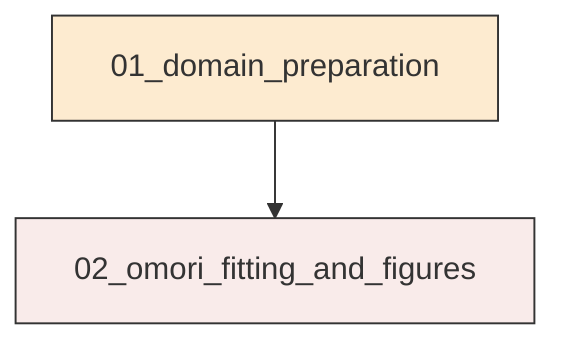
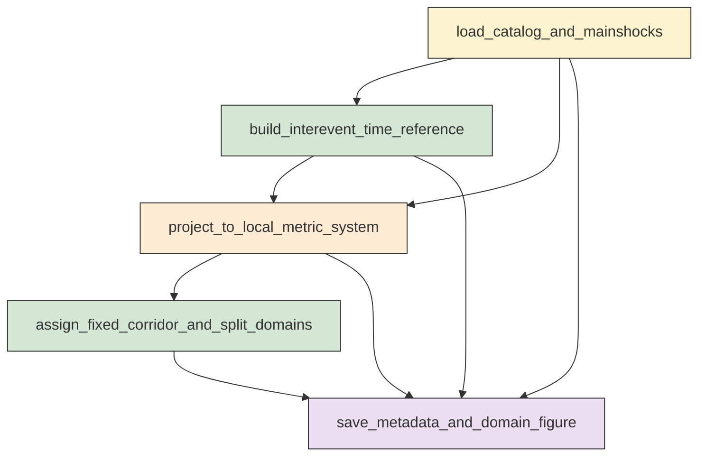
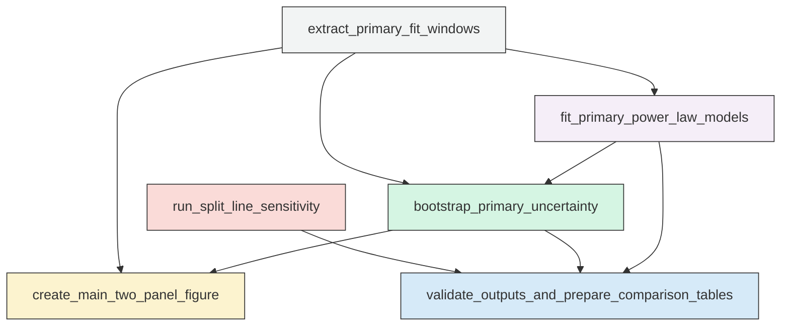

# Workflow Overview

## Top-Level Task Dependencies

**Description:**
- `01_domain_preparation`: Build the Ridgecrest interevent event table, assign fixed corridor and north-south domains, and save domain diagnostics metadata.
- `02_omori_fitting_and_figures`: Fit cumulative pure power-law Omori models with bootstrap uncertainty, create required figures, and save primary and split-sensitivity results.

## Subtask Dependencies

#### 01_domain_preparation
**Usage**: Build the Ridgecrest interevent event table, assign fixed corridor and north-south domains, and save domain diagnostics metadata.

**Description:**
- `load_catalog_and_mainshocks`: Read the relocated catalog and identify the Mw 6.4 and Mw 7.1 mainshock origin times.
- `build_interevent_time_reference`: Compute time since Mw 6.4 and retain only events strictly between the Mw 6.4 and Mw 7.1 origin times.
- `project_to_local_metric_system`: Project events and corridor control points to a local metric coordinate system for distance calculations.
- `assign_fixed_corridor_and_split_domains`: Compute along-strike and cross-strike positions and assign entire, north, and south domain flags for the required split latitudes.
- `save_metadata_and_domain_figure`: Save required metadata and generate the domain-assignment diagnostic figure for the fixed primary geometry.

#### 02_omori_fitting_and_figures
**Usage**: Fit cumulative pure power-law Omori models with bootstrap uncertainty, create required figures, and save primary and split-sensitivity results.

**Description:**
- `extract_primary_fit_windows`: Build cumulative domain-period event subsets for the primary M greater than or equal to 3.0 analysis.
- `fit_primary_power_law_models`: Fit lambda of t equals K times t to the minus p by maximum likelihood for each primary domain-period window and record failures explicitly.
- `bootstrap_primary_uncertainty`: Resample event times within each successful window, refit the same model, and summarize bootstrap uncertainty for p.
- `create_main_two_panel_figure`: Generate the primary two-panel figure for p-value evolution and the final entire-area rate-fit diagnostic.
- `run_split_line_sensitivity`: Repeat north-south cumulative fitting and bootstrap summaries for the three requested split latitudes as a robustness check.
- `validate_outputs_and_prepare_comparison_tables`: Cross-check deliverables and save compact tables that support the primary north-versus-south interpretation.