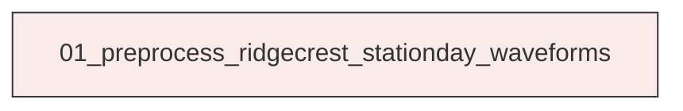
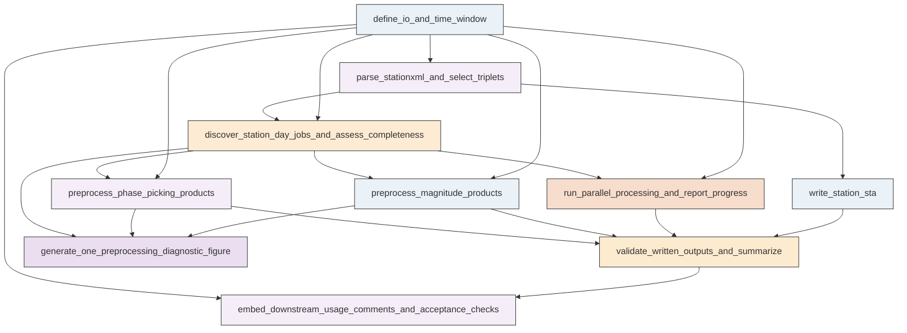

# Research Codings

## Task Overview


**Description:**
- `01_preprocess_ridgecrest_stationday_waveforms`: Build station metadata, preprocess 22 daily windows of Ridgecrest continuous waveforms into separate phase-picking and magnitude products, validate outputs, and save QC artifacts.


## Task Details


#### 01_preprocess_ridgecrest_stationday_waveforms
**Usage**: Build station metadata, preprocess 22 daily windows of Ridgecrest continuous waveforms into separate phase-picking and magnitude products, validate outputs, and save QC artifacts.

**Description:**
- `define_io_and_time_window`: Define the explicit ObsPy UTCDateTime study window, input roots, output namespaces, and parallel settings.
- `parse_stationxml_and_select_triplets`: Read StationXML files, identify preferred HH or EH three-component channel triplets valid in the study window, and extract station metadata.
- `write_station_sta`: Write the required station metadata table and compact station QC summary.
- `discover_station_day_jobs_and_assess_completeness`: Enumerate station-day jobs for 2019-07-04 through 2019-07-25, read overlapping MiniSEED files, merge segments, trim to exact UTC days, and compute completeness metrics.
- `preprocess_phase_picking_products`: Apply a picking-oriented preprocessing pipeline and save one final three-component MiniSEED per successful station-day without response removal or normalization.
- `preprocess_magnitude_products`: Apply response removal and Wood-Anderson simulation to the same validated station-day streams and save separate three-component MiniSEED products for magnitude estimation.
- `run_parallel_processing_and_report_progress`: Execute station-day preprocessing in parallel up to 64 workers and emit progress information for submitted, completed, skipped, and failed jobs.
- `validate_written_outputs_and_summarize`: Read back all saved MiniSEED outputs, verify exact three-component day-bounded products, and write compact machine-readable summaries.
- `generate_one_preprocessing_diagnostic_figure`: Create one representative figure comparing raw merged traces with final phase-picking and Wood-Anderson magnitude products for a successful station-day.
- `embed_downstream_usage_comments_and_acceptance_checks`: Add concise in-script usage comments for later phase-picking and magnitude workflows and record requirement-level acceptance status.

#### Coding Script

```python

#!/usr/bin/env python
from __future__ import annotations

import csv
import json
import os
import shutil
import sys
import traceback
from concurrent.futures import ProcessPoolExecutor, as_completed
from dataclasses import dataclass
from pathlib import Path
from typing import Dict, List, Optional, Sequence, Tuple

import matplotlib
matplotlib.use("Agg")
import matplotlib.pyplot as plt
import numpy as np
import pandas as pd
from obspy import Stream, Trace, UTCDateTime, read, read_inventory
from obspy.core.inventory import Inventory
from obspy.core.inventory.channel import Channel
from obspy.signal.invsim import WOODANDERSON


# -----------------------------------------------------------------------------
# Explicit task configuration
# -----------------------------------------------------------------------------
START_TIME = UTCDateTime("2019-07-04T00:00:00")
END_TIME = UTCDateTime("2019-07-26T00:00:00")

WAVEFORM_ROOT = Path(
    "<DATA_ROOT>/Science2019_Ross_Ridgecrest/data/waveforms_raw"
)
STATIONXML_ROOT = Path(
    "<DATA_ROOT>/Science2019_Ross_Ridgecrest/data/stationxml"
)
OUTPUT_DIR = Path(
    "<CASE_ROOT>/catalog_construction/01_step1_data_preprocessing_for_phasepicking/exp_run/outputs/01_preprocess_ridgecrest_stationday_waveforms"
)

PHASE_DIR = OUTPUT_DIR / "phase_picking"
MAG_DIR = OUTPUT_DIR / "magnitude_wood_anderson"
FIG_DIR = OUTPUT_DIR / "figures"
QC_DIR = OUTPUT_DIR / "qc"
STATION_STA_PATH = OUTPUT_DIR / "station.sta"

MAX_WORKERS = min(64, os.cpu_count() or 1)
DAY_SECONDS = 24 * 3600
COMPONENT_PRIORITY = (("Z", "N", "E"), ("Z", "1", "2"))
FAMILY_PRIORITY = ("HH", "EH")
TARGET_INSTRUMENT_CODE = WOODANDERSON


# -----------------------------------------------------------------------------
# Helpers
# -----------------------------------------------------------------------------
def log(message: str) -> None:
    print(message, flush=True)


def ensure_clean_output_dirs() -> None:
    OUTPUT_DIR.mkdir(parents=True, exist_ok=True)
    managed_paths = [PHASE_DIR, MAG_DIR, FIG_DIR, QC_DIR]
    for path in managed_paths:
        if path.exists():
            shutil.rmtree(path)
        path.mkdir(parents=True, exist_ok=True)
    if STATION_STA_PATH.exists():
        STATION_STA_PATH.unlink()


@dataclass
class StationChoice:
    network: str
    station: str
    station_key: str
    latitude: float
    longitude: float
    elevation_m: float
    xml_path: str
    family: str
    location_code: str
    channels: List[str]
    components: List[str]
    sample_rate: float
    gain_mean: float
    gains: List[Optional[float]]


def time_overlaps(channel: Channel, start: UTCDateTime, end: UTCDateTime) -> bool:
    ch_start = channel.start_date or UTCDateTime(0)
    ch_end = channel.end_date or UTCDateTime("2100-01-01T00:00:00")
    return not (ch_end <= start or ch_start >= end)


def channel_gain(channel: Channel) -> Optional[float]:
    sensitivity = getattr(getattr(channel, "response", None), "instrument_sensitivity", None)
    return None if sensitivity is None else float(sensitivity.value)


def choose_station_triplet(inv: Inventory, start: UTCDateTime, end: UTCDateTime) -> Tuple[Optional[StationChoice], Dict[str, str]]:
    qc = {}
    for net in inv:
        for sta in net:
            station_key = f"{net.code}.{sta.code}"
            candidates = []
            for fam in FAMILY_PRIORITY:
                for component_set in COMPONENT_PRIORITY:
                    by_loc: Dict[str, Dict[str, Channel]] = {}
                    for ch in sta:
                        if not time_overlaps(ch, start, end):
                            continue
                        if not ch.code.startswith(fam):
                            continue
                        component = ch.code[-1]
                        if component not in component_set:
                            continue
                        by_loc.setdefault(ch.location_code, {})[component] = ch
                    for loc, comp_map in by_loc.items():
                        if all(comp in comp_map for comp in component_set):
                            chans = [comp_map[comp] for comp in component_set]
                            sample_rates = [float(ch.sample_rate) for ch in chans]
                            if max(sample_rates) - min(sample_rates) > 1e-6:
                                continue
                            gains = [channel_gain(ch) for ch in chans]
                            valid_gain = [g for g in gains if g is not None and np.isfinite(g)]
                            if len(valid_gain) != 3:
                                continue
                            candidates.append(
                                StationChoice(
                                    network=net.code,
                                    station=sta.code,
                                    station_key=station_key,
                                    latitude=float(sta.latitude),
                                    longitude=float(sta.longitude),
                                    elevation_m=float(sta.elevation),
                                    xml_path="",
                                    family=fam,
                                    location_code=loc,
                                    channels=[ch.code for ch in chans],
                                    components=list(component_set),
                                    sample_rate=float(sample_rates[0]),
                                    gain_mean=float(np.mean(valid_gain)),
                                    gains=gains,
                                )
                            )
            if candidates:
                choice = sorted(
                    candidates,
                    key=lambda c: (
                        FAMILY_PRIORITY.index(c.family),
                        COMPONENT_PRIORITY.index(tuple(c.components)),
                        c.location_code != "",
                    ),
                )[0]
                qc[station_key] = "selected"
                return choice, qc
            qc[station_key] = "no_valid_HH_or_EH_triplet"
    return None, qc


def build_station_table() -> Tuple[List[StationChoice], pd.DataFrame]:
    rows: List[StationChoice] = []
    qc_rows = []
    xml_files = sorted(STATIONXML_ROOT.glob("*.xml"))
    log(f"Building station table from {len(xml_files)} StationXML files: {STATIONXML_ROOT}")
    for idx, xml_path in enumerate(xml_files, start=1):
        if idx % 10 == 0 or idx == len(xml_files):
            log(f"  StationXML progress: {idx}/{len(xml_files)}")
        inv = read_inventory(str(xml_path), format="STATIONXML")
        choice, qc = choose_station_triplet(inv, START_TIME, END_TIME)
        if choice is not None:
            choice.xml_path = str(xml_path)
            rows.append(choice)
            qc_rows.append(
                {
                    "station_key": choice.station_key,
                    "status": "selected",
                    "network": choice.network,
                    "station": choice.station,
                    "xml_path": str(xml_path),
                    "latitude": choice.latitude,
                    "longitude": choice.longitude,
                    "elevation_m": choice.elevation_m,
                    "family": choice.family,
                    "location_code": choice.location_code,
                    "components": "/".join(choice.components),
                    "channels": "/".join(choice.channels),
                    "sample_rate": choice.sample_rate,
                    "gain_1": choice.gains[0],
                    "gain_2": choice.gains[1],
                    "gain_3": choice.gains[2],
                    "gain_mean": choice.gain_mean,
                    "reason": "",
                }
            )
        else:
            station_key = xml_path.stem
            qc_rows.append(
                {
                    "station_key": station_key,
                    "status": "excluded",
                    "network": station_key.split(".")[0],
                    "station": station_key.split(".")[1],
                    "xml_path": str(xml_path),
                    "latitude": np.nan,
                    "longitude": np.nan,
                    "elevation_m": np.nan,
                    "family": "",
                    "location_code": "",
                    "components": "",
                    "channels": "",
                    "sample_rate": np.nan,
                    "gain_1": np.nan,
                    "gain_2": np.nan,
                    "gain_3": np.nan,
                    "gain_mean": np.nan,
                    "reason": list(qc.values())[0] if qc else "no_station_metadata",
                }
            )
    rows = sorted(rows, key=lambda x: x.station_key)
    with STATION_STA_PATH.open("w", newline="") as fp:
        writer = csv.writer(fp)
        for row in rows:
            writer.writerow([
                row.station_key,
                f"{row.latitude:.6f}",
                f"{row.longitude:.6f}",
                f"{row.elevation_m:.2f}",
                f"{row.gain_mean:.6f}",
            ])
    log(f"Wrote station table: {STATION_STA_PATH}")
    return rows, pd.DataFrame(qc_rows)


def utc_day_windows(start: UTCDateTime, end: UTCDateTime) -> List[Tuple[UTCDateTime, UTCDateTime]]:
    windows = []
    current = start
    while current < end:
        nxt = current + DAY_SECONDS
        windows.append((current, nxt))
        current = nxt
    return windows


def parse_waveform_filename(path: Path) -> Optional[Dict[str, object]]:
    name = path.name
    if "__" not in name or not name.endswith(".mseed"):
        return None
    head, start_str, end_ext = name.split("__")
    end_str = end_ext.replace(".mseed", "")
    parts = head.split(".")
    if len(parts) != 4:
        return None
    network, station, location, channel = parts
    return {
        "network": network,
        "station": station,
        "location": location,
        "channel": channel,
        "start": UTCDateTime(start_str),
        "end": UTCDateTime(end_str),
    }


def file_overlaps_day(path: Path, day_start: UTCDateTime, day_end: UTCDateTime) -> bool:
    meta = parse_waveform_filename(path)
    if meta is None:
        return False
    return not (meta["end"] <= day_start or meta["start"] >= day_end)


def choose_day_triplet(files: Sequence[Path], preferred_family: str) -> Optional[Dict[str, object]]:
    file_meta = []
    for path in files:
        meta = parse_waveform_filename(path)
        if meta is None:
            continue
        file_meta.append((path, meta))

    family_order = [preferred_family] + [fam for fam in FAMILY_PRIORITY if fam != preferred_family]
    for fam in family_order:
        for component_set in COMPONENT_PRIORITY:
            loc_map: Dict[str, Dict[str, List[Path]]] = {}
            for path, meta in file_meta:
                channel = str(meta["channel"])
                if not channel.startswith(fam):
                    continue
                comp = channel[-1]
                if comp not in component_set:
                    continue
                loc = str(meta["location"])
                loc_map.setdefault(loc, {}).setdefault(comp, []).append(path)
            valid = []
            for loc, comp_map in loc_map.items():
                if all(comp in comp_map for comp in component_set):
                    valid.append(
                        {
                            "family": fam,
                            "components": list(component_set),
                            "location": loc,
                            "paths_by_component": {comp: sorted(comp_map[comp]) for comp in component_set},
                            "n_files": int(sum(len(comp_map[comp]) for comp in component_set)),
                        }
                    )
            if valid:
                valid.sort(key=lambda x: (x["location"] != "", x["n_files"]))
                return valid[0]
    return None


def read_merge_trim_component(paths: Sequence[Path], day_start: UTCDateTime, day_end: UTCDateTime) -> Tuple[Trace, Dict[str, float]]:
    stream = Stream()
    for path in paths:
        stream += read(str(path))
    stream.sort(keys=["starttime", "endtime"])
    initial_segment_count = len(stream)
    gaps = stream.get_gaps()
    gap_count = len(gaps)
    gap_duration = float(sum(max(0.0, gap[6]) for gap in gaps)) if gaps else 0.0
    overlap_duration = float(sum(abs(gap[6]) for gap in gaps if gap[6] < 0)) if gaps else 0.0

    stream.merge(method=1, fill_value=0)
    if len(stream) != 1:
        stream.merge(method=1, fill_value=0)
    if len(stream) != 1:
        raise RuntimeError(f"Expected one merged trace, got {len(stream)}")

    trace = stream[0]
    sampling_rate = float(trace.stats.sampling_rate)
    expected_samples = int(round((day_end - day_start) * sampling_rate))
    trace.trim(day_start, day_end, nearest_sample=False, pad=True, fill_value=0)
    actual_samples = int(trace.stats.npts)
    coverage_fraction = actual_samples / expected_samples if expected_samples > 0 else np.nan
    metrics = {
        "initial_segment_count": initial_segment_count,
        "gap_count": gap_count,
        "gap_duration_s": gap_duration,
        "overlap_duration_s": overlap_duration,
        "expected_samples": expected_samples,
        "actual_samples": actual_samples,
        "coverage_fraction": coverage_fraction,
        "sampling_rate": sampling_rate,
    }
    return trace, metrics


def validate_three_component_stream(stream: Stream, day_start: UTCDateTime, day_end: UTCDateTime) -> None:
    if len(stream) != 3:
        raise RuntimeError(f"Expected 3 traces, got {len(stream)}")
    starts = [tr.stats.starttime for tr in stream]
    ends = [tr.stats.endtime for tr in stream]
    npts = [tr.stats.npts for tr in stream]
    sr = [float(tr.stats.sampling_rate) for tr in stream]
    if any(abs(s - sr[0]) > 1e-6 for s in sr):
        raise RuntimeError(f"Inconsistent sampling rates: {sr}")
    if len(set(npts)) != 1:
        raise RuntimeError(f"Inconsistent npts: {npts}")
    expected_npts = int(round((day_end - day_start) * sr[0]))
    if npts[0] != expected_npts:
        raise RuntimeError(f"Unexpected npts: {npts}, expected {expected_npts}")
    for st in starts:
        if abs(st - day_start) > 1.0 / sr[0]:
            raise RuntimeError(f"Unexpected starttime: {starts}")
    expected_end = day_start + (expected_npts - 1) / sr[0]
    for en in ends:
        if abs(en - expected_end) > 1.5 / sr[0]:
            raise RuntimeError(f"Unexpected endtime: {ends}, expected {expected_end}")


def phase_filter_freqs(sampling_rate: float) -> Tuple[float, float]:
    nyquist = 0.5 * sampling_rate
    low = 1.0
    high = min(20.0, 0.8 * nyquist)
    if high <= low:
        high = max(low + 0.5, 0.8 * nyquist)
    return low, high


def response_prefilt(sampling_rate: float) -> List[float]:
    nyquist = 0.5 * sampling_rate
    f1 = 0.05
    f2 = 0.10
    f3 = min(0.8 * nyquist, 35.0)
    f4 = min(0.9 * nyquist, max(f3 + 0.5, 40.0))
    if not (f1 < f2 < f3 < f4):
        f3 = min(0.7 * nyquist, max(f2 + 0.5, 10.0))
        f4 = min(0.85 * nyquist, max(f3 + 0.5, f3 * 1.1))
    return [float(f1), float(f2), float(f3), float(f4)]


def preprocess_for_phase(stream: Stream) -> Tuple[Stream, Dict[str, object]]:
    processed = stream.copy()
    sr = float(processed[0].stats.sampling_rate)
    freqmin, freqmax = phase_filter_freqs(sr)
    for tr in processed:
        tr.detrend("demean")
        tr.detrend("linear")
        tr.taper(max_percentage=0.01, type="cosine")
        tr.filter("bandpass", freqmin=freqmin, freqmax=freqmax, corners=4, zerophase=True)
    processed.sort(keys=["channel"])
    info = {
        "sampling_rate": sr,
        "phase_filter_freqmin": freqmin,
        "phase_filter_freqmax": freqmax,
    }
    return processed, info


def preprocess_for_magnitude(stream: Stream, inventory: Inventory, day_start: UTCDateTime, day_end: UTCDateTime) -> Tuple[Stream, Dict[str, object]]:
    processed = stream.copy()
    sr = float(processed[0].stats.sampling_rate)
    pre_filt = response_prefilt(sr)
    for tr in processed:
        tr.detrend("demean")
        tr.detrend("linear")
        tr.taper(max_percentage=0.01, type="cosine")
        tr.remove_response(inventory=inventory, output="VEL", pre_filt=pre_filt, water_level=60)
        tr.simulate(paz_simulate=TARGET_INSTRUMENT_CODE)
        tr.trim(day_start, day_end, nearest_sample=False, pad=True, fill_value=0)
    processed.sort(keys=["channel"])
    info = {
        "sampling_rate": sr,
        "response_prefilt": pre_filt,
        "response_output": "VEL",
        "simulate": "WOODANDERSON",
    }
    return processed, info


def save_stream(stream: Stream, out_path: Path) -> None:
    out_path.parent.mkdir(parents=True, exist_ok=True)
    stream.write(str(out_path), format="MSEED")


def validate_saved_file(path: Path, day_start: UTCDateTime, day_end: UTCDateTime) -> Dict[str, object]:
    stream = read(str(path))
    validate_three_component_stream(stream, day_start, day_end)
    return {
        "path": str(path),
        "n_traces": len(stream),
        "sampling_rate": float(stream[0].stats.sampling_rate),
        "npts": int(stream[0].stats.npts),
        "starttime": str(stream[0].stats.starttime),
        "endtime": str(stream[0].stats.endtime),
        "channels": "/".join(tr.stats.channel for tr in stream),
    }


def build_output_filename(network: str, station: str, day_start: UTCDateTime, day_end: UTCDateTime) -> str:
    return f"{network}.{station}.{day_start.strftime('%Y%m%dT%H%M%SZ')}.{day_end.strftime('%Y%m%dT%H%M%SZ')}.mseed"


def process_station_day(job: Dict[str, object]) -> Dict[str, object]:
    station_key = str(job["station_key"])
    network = str(job["network"])
    station = str(job["station"])
    xml_path = Path(str(job["xml_path"]))
    station_dir = Path(str(job["station_dir"]))
    preferred_family = str(job["preferred_family"])
    day_start = UTCDateTime(str(job["day_start"]))
    day_end = UTCDateTime(str(job["day_end"]))
    day_str = day_start.strftime("%Y%m%d")

    result: Dict[str, object] = {
        "station_key": station_key,
        "day": day_str,
        "status": "failed",
        "reason": "",
        "phase_output": "",
        "magnitude_output": "",
        "family": "",
        "location_code": "",
        "channels": "",
        "components": "",
        "sample_rate": np.nan,
        "phase_validated": False,
        "magnitude_validated": False,
        "figure_candidate": False,
    }

    try:
        files = [
            path for path in station_dir.glob("*.mseed")
            if file_overlaps_day(path, day_start, day_end)
        ]
        if not files:
            result["status"] = "skipped"
            result["reason"] = "no_waveform_files_for_day"
            return result

        day_choice = choose_day_triplet(files, preferred_family)
        if day_choice is None:
            result["status"] = "skipped"
            result["reason"] = "no_valid_3c_triplet_for_day"
            return result

        traces = []
        component_metrics = []
        for comp in day_choice["components"]:
            tr, metrics = read_merge_trim_component(day_choice["paths_by_component"][comp], day_start, day_end)
            traces.append(tr)
            metrics["component"] = comp
            metrics["channel"] = tr.stats.channel
            component_metrics.append(metrics)

        sampling_rates = [float(tr.stats.sampling_rate) for tr in traces]
        if max(sampling_rates) - min(sampling_rates) > 1e-6:
            raise RuntimeError(f"Inconsistent sampling rate across components: {sampling_rates}")

        raw_stream = Stream(traces=traces)
        validate_three_component_stream(raw_stream, day_start, day_end)

        inventory = read_inventory(str(xml_path), format="STATIONXML")

        # Downstream usage comment:
        # The phase-picking product is intended for later deep-learning phase picking.
        # It is detrended, tapered, and bandpass filtered only; no response removal and no amplitude normalization are applied.
        phase_stream, phase_info = preprocess_for_phase(raw_stream)
        validate_three_component_stream(phase_stream, day_start, day_end)

        # Downstream usage comment:
        # The magnitude-estimation product is intended for later local-magnitude analysis.
        # Instrument response is removed and the traces are simulated to Wood-Anderson response,
        # preserving three components for later amplitude measurements, especially on horizontals.
        mag_stream, mag_info = preprocess_for_magnitude(raw_stream, inventory, day_start, day_end)
        validate_three_component_stream(mag_stream, day_start, day_end)

        phase_name = build_output_filename(network, station, day_start, day_end)
        phase_path = PHASE_DIR / day_str / phase_name
        mag_path = MAG_DIR / day_str / phase_name
        save_stream(phase_stream, phase_path)
        save_stream(mag_stream, mag_path)

        phase_validation = validate_saved_file(phase_path, day_start, day_end)
        mag_validation = validate_saved_file(mag_path, day_start, day_end)

        mean_coverage = float(np.mean([m["coverage_fraction"] for m in component_metrics]))
        result.update(
            {
                "status": "success",
                "family": day_choice["family"],
                "location_code": day_choice["location"],
                "channels": "/".join(tr.stats.channel for tr in raw_stream),
                "components": "/".join(day_choice["components"]),
                "sample_rate": float(raw_stream[0].stats.sampling_rate),
                "mean_coverage_fraction": mean_coverage,
                "phase_output": str(phase_path),
                "magnitude_output": str(mag_path),
                "phase_validated": True,
                "magnitude_validated": True,
                "raw_component_metrics_json": json.dumps(component_metrics),
                "phase_info_json": json.dumps(phase_info),
                "magnitude_info_json": json.dumps(mag_info),
                "phase_validation_json": json.dumps(phase_validation),
                "magnitude_validation_json": json.dumps(mag_validation),
                "figure_candidate": bool(mean_coverage >= 0.99),
            }
        )
        return result
    except Exception as exc:
        result["status"] = "failed"
        result["reason"] = f"{type(exc).__name__}: {exc}"
        return result


def make_diagnostic_figure(success_row: pd.Series, station_rows: Dict[str, StationChoice]) -> Optional[str]:
    station_key = str(success_row["station_key"])
    choice = station_rows[station_key]
    day = str(success_row["day"])
    day_start = UTCDateTime(f"{day}T000000Z")
    day_end = day_start + DAY_SECONDS
    station_dir = WAVEFORM_ROOT / station_key
    files = [path for path in station_dir.glob("*.mseed") if file_overlaps_day(path, day_start, day_end)]
    day_choice = choose_day_triplet(files, str(success_row["family"]))
    if day_choice is None:
        return None
    traces = []
    for comp in day_choice["components"]:
        tr, _ = read_merge_trim_component(day_choice["paths_by_component"][comp], day_start, day_end)
        traces.append(tr)
    raw_stream = Stream(traces=traces)
    phase_stream, _ = preprocess_for_phase(raw_stream)
    inventory = read_inventory(choice.xml_path, format="STATIONXML")
    mag_stream, _ = preprocess_for_magnitude(raw_stream, inventory, day_start, day_end)

    t = np.arange(raw_stream[0].stats.npts) / raw_stream[0].stats.sampling_rate
    fig, axes = plt.subplots(3, 3, figsize=(16, 10), sharex=True)
    for i, (raw_tr, ph_tr, mg_tr) in enumerate(zip(raw_stream, phase_stream, mag_stream)):
        axes[i, 0].plot(t, raw_tr.data, lw=0.4, color="black")
        axes[i, 0].set_ylabel(raw_tr.stats.channel)
        axes[i, 1].plot(t, ph_tr.data, lw=0.4, color="tab:blue")
        axes[i, 2].plot(t, mg_tr.data, lw=0.4, color="tab:red")
    axes[0, 0].set_title("Raw merged + trimmed")
    axes[0, 1].set_title("Phase-picking product")
    axes[0, 2].set_title("Magnitude WA product")
    for ax in axes[-1, :]:
        ax.set_xlabel("Time since day start (s)")
    fig.suptitle(
        f"Preprocessing diagnostic: {station_key} {day} | family={success_row['family']} | coverage={success_row.get('mean_coverage_fraction', np.nan):.3f}",
        fontsize=12,
    )
    fig.tight_layout(rect=[0, 0, 1, 0.97])
    out_path = FIG_DIR / f"preprocessing_diagnostic_{station_key}_{day}.png"
    fig.savefig(out_path, dpi=180)
    plt.close(fig)
    return str(out_path)


def main() -> None:
    ensure_clean_output_dirs()
    log(f"Waveform root: {WAVEFORM_ROOT}")
    log(f"StationXML root: {STATIONXML_ROOT}")
    log(f"Output dir: {OUTPUT_DIR}")
    log(f"Explicit processing window: {START_TIME} to {END_TIME}")

    station_rows, station_qc_df = build_station_table()
    station_qc_path = QC_DIR / "station_metadata_qc.csv"
    station_qc_df.to_csv(station_qc_path, index=False)
    log(f"Wrote station metadata QC: {station_qc_path}")

    day_windows = utc_day_windows(START_TIME, END_TIME)
    jobs = []
    for row in station_rows:
        station_dir = WAVEFORM_ROOT / row.station_key
        if not station_dir.is_dir():
            continue
        for day_start, day_end in day_windows:
            jobs.append(
                {
                    "station_key": row.station_key,
                    "network": row.network,
                    "station": row.station,
                    "xml_path": row.xml_path,
                    "station_dir": str(station_dir),
                    "preferred_family": row.family,
                    "day_start": str(day_start),
                    "day_end": str(day_end),
                }
            )
    log(f"Prepared {len(jobs)} station-day jobs")
    if not jobs:
        raise RuntimeError("No station-day jobs prepared")

    workers = min(MAX_WORKERS, len(jobs))
    log(f"Using up to {workers} workers")
    results: List[Dict[str, object]] = []
    with ProcessPoolExecutor(max_workers=workers) as executor:
        future_map = {executor.submit(process_station_day, job): job for job in jobs}
        for idx, future in enumerate(as_completed(future_map), start=1):
            result = future.result()
            results.append(result)
            if idx % 10 == 0 or idx == len(future_map):
                n_success = sum(1 for r in results if r["status"] == "success")
                n_skipped = sum(1 for r in results if r["status"] == "skipped")
                n_failed = sum(1 for r in results if r["status"] == "failed")
                log(
                    f"Completed {idx}/{len(future_map)} jobs | success={n_success} skipped={n_skipped} failed={n_failed}"
                )

    results_df = pd.DataFrame(results)
    required_result_columns = [
        "station_key",
        "day",
        "status",
        "reason",
        "phase_output",
        "magnitude_output",
        "family",
        "location_code",
        "channels",
        "components",
        "sample_rate",
        "phase_validated",
        "magnitude_validated",
        "figure_candidate",
    ]
    missing_result_columns = [col for col in required_result_columns if col not in results_df.columns]
    if missing_result_columns:
        raise RuntimeError(f"Missing required result columns: {missing_result_columns}")
    results_df = results_df.sort_values(["station_key", "day"]).reset_index(drop=True)
    results_path = QC_DIR / "station_day_processing_results.csv"
    results_df.to_csv(results_path, index=False)
    log(f"Wrote station-day results: {results_path}")

    validation_rows = []
    for _, row in results_df[results_df["status"] == "success"].iterrows():
        day_start = UTCDateTime(f"{row['day']}T000000Z")
        day_end = day_start + DAY_SECONDS
        for product_name, path_col in [("phase", "phase_output"), ("magnitude", "magnitude_output")]:
            path = Path(str(row[path_col]))
            try:
                validation = validate_saved_file(path, day_start, day_end)
                validation.update(
                    {
                        "station_key": row["station_key"],
                        "day": row["day"],
                        "product": product_name,
                        "status": "validated",
                    }
                )
            except Exception as exc:
                validation = {
                    "station_key": row["station_key"],
                    "day": row["day"],
                    "product": product_name,
                    "status": "failed",
                    "path": str(path),
                    "reason": f"{type(exc).__name__}: {exc}",
                }
            validation_rows.append(validation)
    validation_df = pd.DataFrame(validation_rows)
    validation_path = QC_DIR / "final_product_validation.csv"
    validation_df.to_csv(validation_path, index=False)
    log(f"Wrote final product validation: {validation_path}")

    success_df = results_df[results_df["status"] == "success"].copy()
    diag_path = None
    if not success_df.empty:
        success_df = success_df.sort_values(["mean_coverage_fraction", "station_key"], ascending=[False, True])
        station_lookup = {row.station_key: row for row in station_rows}
        diag_path = make_diagnostic_figure(success_df.iloc[0], station_lookup)
        if diag_path:
            log(f"Wrote diagnostic figure: {diag_path}")

    summary = {
        "start_time": str(START_TIME),
        "end_time": str(END_TIME),
        "n_stationxml_files": int(len(list(STATIONXML_ROOT.glob('*.xml')))),
        "n_selected_stations": int(len(station_rows)),
        "n_jobs": int(len(jobs)),
        "n_success": int((results_df["status"] == "success").sum()),
        "n_skipped": int((results_df["status"] == "skipped").sum()),
        "n_failed": int((results_df["status"] == "failed").sum()),
        "phase_outputs": int(results_df["phase_validated"].fillna(False).sum()),
        "magnitude_outputs": int(results_df["magnitude_validated"].fillna(False).sum()),
        "diagnostic_figure": diag_path,
        "deliverables": {
            "station_sta": str(STATION_STA_PATH),
            "phase_dir": str(PHASE_DIR),
            "magnitude_dir": str(MAG_DIR),
            "qc_dir": str(QC_DIR),
            "figure_dir": str(FIG_DIR),
        },
    }
    summary_path = QC_DIR / "processing_summary.json"
    with summary_path.open("w") as fp:
        json.dump(summary, fp, indent=2)
    log(f"Wrote processing summary: {summary_path}")
    log("Preprocessing workflow completed successfully")


if __name__ == "__main__":
    try:
        main()
    except Exception:
        print(traceback.format_exc(), file=sys.stderr, flush=True)
        sys.exit(1)


```