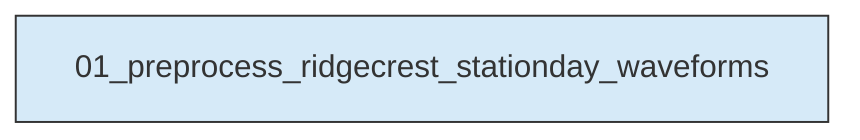
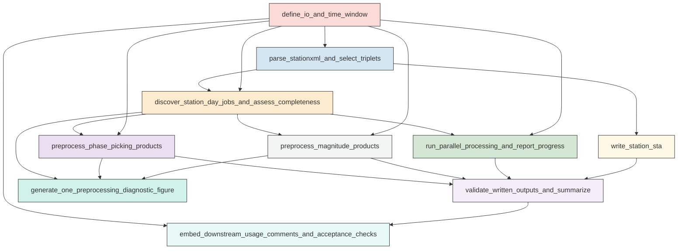

# Workflow Overview

## Top-Level Task Dependencies

**Description:**
- `01_preprocess_ridgecrest_stationday_waveforms`: Build station metadata, preprocess 22 daily windows of Ridgecrest continuous waveforms into separate phase-picking and magnitude products, validate outputs, and save QC artifacts.

## Subtask Dependencies

#### 01_preprocess_ridgecrest_stationday_waveforms
**Usage**: Build station metadata, preprocess 22 daily windows of Ridgecrest continuous waveforms into separate phase-picking and magnitude products, validate outputs, and save QC artifacts.

**Description:**
- `define_io_and_time_window`: Define the explicit ObsPy UTCDateTime study window, input roots, output namespaces, and parallel settings.
- `parse_stationxml_and_select_triplets`: Read StationXML files, identify preferred HH or EH three-component channel triplets valid in the study window, and extract station metadata.
- `write_station_sta`: Write the required station metadata table and compact station QC summary.
- `discover_station_day_jobs_and_assess_completeness`: Enumerate station-day jobs for 2019-07-04 through 2019-07-25, read overlapping MiniSEED files, merge segments, trim to exact UTC days, and compute completeness metrics.
- `preprocess_phase_picking_products`: Apply a picking-oriented preprocessing pipeline and save one final three-component MiniSEED per successful station-day without response removal or normalization.
- `preprocess_magnitude_products`: Apply response removal and Wood-Anderson simulation to the same validated station-day streams and save separate three-component MiniSEED products for magnitude estimation.
- `run_parallel_processing_and_report_progress`: Execute station-day preprocessing in parallel up to 64 workers and emit progress information for submitted, completed, skipped, and failed jobs.
- `validate_written_outputs_and_summarize`: Read back all saved MiniSEED outputs, verify exact three-component day-bounded products, and write compact machine-readable summaries.
- `generate_one_preprocessing_diagnostic_figure`: Create one representative figure comparing raw merged traces with final phase-picking and Wood-Anderson magnitude products for a successful station-day.
- `embed_downstream_usage_comments_and_acceptance_checks`: Add concise in-script usage comments for later phase-picking and magnitude workflows and record requirement-level acceptance status.