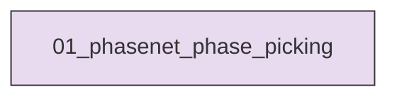
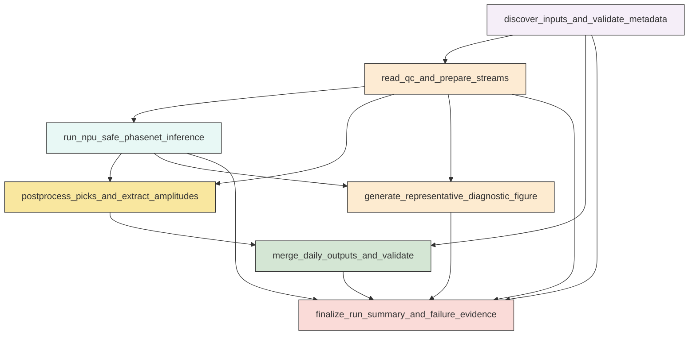

# Research Codings

## Task Overview


**Description:**
- `01_phasenet_phase_picking`: Run an end-to-end PhaseNet picking workflow on the requested Ridgecrest station-day MiniSEED files using NPU-safe multiprocessing and produce validated daily CSV outputs plus one diagnostic figure.


## Task Details


#### 01_phasenet_phase_picking
**Usage**: Run an end-to-end PhaseNet picking workflow on the requested Ridgecrest station-day MiniSEED files using NPU-safe multiprocessing and produce validated daily CSV outputs plus one diagnostic figure.

**Description:**
- `discover_inputs_and_validate_metadata`: Enumerate the requested day folders, parse waveform filenames, and cross-check station identifiers against station metadata.
- `read_qc_and_prepare_streams`: Read each MiniSEED file, enforce usable three-component stream structure, preserve waveform values for amplitude extraction, and record QC decisions.
- `run_npu_safe_phasenet_inference`: Execute PhaseNet discrete picking in parallel with spawn-based multiprocessing, worker-local NPU initialization, progress reporting, and failure capture.
- `postprocess_picks_and_extract_amplitudes`: Convert PhaseNet outputs to the required schema, keep only P and S picks, and extract waveform amplitudes at the nearest sample to each pick time.
- `merge_daily_outputs_and_validate`: Merge station-level picks into one CSV per UTC day, enforce the exact header and field constraints, and record day-level validation results.
- `generate_representative_diagnostic_figure`: Create one real diagnostic figure from a successfully processed case showing waveform traces, pick markers, and optional probability traces.
- `finalize_run_summary_and_failure_evidence`: Validate that both daily CSV outputs and the diagnostic figure are real processed products and assemble machine-readable run, skip, and failure summaries.

#### Coding Script

```python

import csv
import json
import math
import os
import shutil
import sys
import traceback
from collections import Counter, defaultdict
from concurrent.futures import ProcessPoolExecutor, as_completed
from datetime import datetime, timedelta
from pathlib import Path
import multiprocessing as mp

import matplotlib
matplotlib.use('Agg')
import matplotlib.dates as mdates
import matplotlib.pyplot as plt
import numpy as np
import obspy
from obspy import Stream, UTCDateTime


SEISMOAGENT_BASE = Path('<PROJECT_ROOT>/seismoagent')
AI_MODULE_PATH = SEISMOAGENT_BASE / 'library' / 'ai_module'
MODEL_PATH = AI_MODULE_PATH / 'phase_picking' / 'model' / 'phasenet.py'
PRETRAINED_PATH = AI_MODULE_PATH / 'phase_picking' / 'pretrained' / 'v3' / 'phasenet' / 'original.pt.v2'
PRETRAINED_JSON_PATH = Path(str(PRETRAINED_PATH).replace('pt', 'json'))

INPUT_BASE_DIR = Path('<CASE_ROOT>/catalog_construction/01_step1_data_preprocessing_for_phasepicking/exp_run/outputs/01_preprocess_ridgecrest_stationday_waveforms/phase_picking')
STATION_METADATA_FILE = Path('<CASE_ROOT>/catalog_construction/01_step1_data_preprocessing_for_phasepicking/exp_run/outputs/01_preprocess_ridgecrest_stationday_waveforms/station.sta')
OUTPUT_DIR = Path('<CASE_ROOT>/catalog_construction/01_step2_phase_picking_PhaseNet/exp_run/outputs/01_phasenet_phase_picking')

START_TIME = UTCDateTime('2019-07-04T00:00:00Z')
END_TIME = UTCDateTime('2019-07-26T00:00:00Z')
MIN_PROCESSES = 32
P_THRESHOLD = 0.3
S_THRESHOLD = 0.3
OVERLAP = 1500
PLOT_WINDOW_SECONDS = 120.0
CSV_COLUMNS = ['station_id', 'phase_time', 'phase_score', 'phase_amplitude', 'phase_type']
AMPLITUDE_RULES = {
    'P': 'absolute amplitude on vertical component at nearest waveform sample',
    'S': 'maximum absolute amplitude across the two horizontal components at nearest waveform sample',
}

WORKER_MODEL = None
WORKER_DEVICE = None
WORKER_TORCH = None
WORKER_MODEL_ARGS = None


def log(message):
    print(f'[{datetime.utcnow().isoformat()}Z] {message}', flush=True)


def utc_to_iso_z(value):
    return UTCDateTime(value).isoformat().replace('+00:00', 'Z')


def day_keys_from_range(start_time, end_time):
    keys = []
    current = datetime.strptime(start_time.strftime('%Y%m%d'), '%Y%m%d')
    end_day = datetime.strptime(end_time.strftime('%Y%m%d'), '%Y%m%d')
    while current < end_day:
        keys.append(current.strftime('%Y%m%d'))
        current += timedelta(days=1)
    return keys


def parse_station_metadata(path):
    stations = {}
    with path.open('r', encoding='utf-8') as f:
        for line_no, raw in enumerate(f, start=1):
            line = raw.strip()
            if not line:
                continue
            parts = [item.strip() for item in line.split(',')]
            station_id = parts[0]
            stations[station_id] = {
                'station_id': station_id,
                'latitude': float(parts[1]) if len(parts) > 1 and parts[1] else math.nan,
                'longitude': float(parts[2]) if len(parts) > 2 and parts[2] else math.nan,
                'elevation_m': float(parts[3]) if len(parts) > 3 and parts[3] else math.nan,
                'raw_fields': parts,
                'line_no': line_no,
            }
    return stations


def parse_waveform_filename(path):
    parts = path.name.split('.')
    if len(parts) < 5 or parts[-1].lower() != 'mseed':
        raise ValueError(f'Unexpected waveform filename format: {path.name}')
    station_id = f'{parts[0]}.{parts[1]}'
    file_start = UTCDateTime(parts[2])
    file_end = UTCDateTime(parts[3])
    return station_id, file_start, file_end


def build_manifest(day_keys, station_lookup):
    manifest = []
    skipped = []
    for day in day_keys:
        day_dir = INPUT_BASE_DIR / day
        if not day_dir.exists():
            skipped.append({'day': day, 'reason': 'missing_day_directory', 'path': str(day_dir)})
            continue
        files = sorted(day_dir.glob('*.mseed'))
        log(f'Discovered {len(files)} waveform files in {day_dir}')
        for path in files:
            try:
                station_id, file_start, file_end = parse_waveform_filename(path)
                if file_end <= START_TIME or file_start >= END_TIME:
                    skipped.append({'day': day, 'reason': 'outside_requested_window', 'path': str(path)})
                    continue
                manifest.append({
                    'day': day,
                    'station_id': station_id,
                    'file_path': str(path),
                    'file_start': utc_to_iso_z(file_start),
                    'file_end': utc_to_iso_z(file_end),
                    'metadata_match': station_id in station_lookup,
                })
            except Exception as exc:
                skipped.append({'day': day, 'reason': f'filename_parse_failed: {exc}', 'path': str(path)})
    return manifest, skipped


def clean_output_dir():
    OUTPUT_DIR.mkdir(parents=True, exist_ok=True)
    targets = [
        OUTPUT_DIR / 'picks_20190704.csv',
        OUTPUT_DIR / 'picks_20190705.csv',
        OUTPUT_DIR / 'run_summary.json',
        OUTPUT_DIR / 'manifest.json',
        OUTPUT_DIR / 'failures.json',
        OUTPUT_DIR / 'diagnostic_case_metadata.json',
        OUTPUT_DIR / 'phasenet_pick_example.png',
    ]
    for target in targets:
        if target.exists():
            target.unlink()
    temp_dir = OUTPUT_DIR / 'temp'
    if temp_dir.exists():
        shutil.rmtree(temp_dir)
    temp_dir.mkdir(parents=True, exist_ok=True)
    return temp_dir


def component_rank(channel):
    suffix = channel[-1].upper()
    order = {'E': 0, '1': 0, 'N': 1, '2': 1, 'Z': 2, '3': 2}
    return order.get(suffix, 99)


def choose_component_traces(stream):
    grouped = {}
    for tr in stream:
        suffix = tr.stats.channel[-1].upper()
        grouped[suffix] = tr
    vertical = grouped.get('Z') or grouped.get('3')
    north = grouped.get('N') or grouped.get('2')
    east = grouped.get('E') or grouped.get('1')
    if not all([east, north, vertical]):
        return None
    return Stream([east.copy(), north.copy(), vertical.copy()])


def prepare_stream_for_inference(file_path, global_start, global_end):
    st = obspy.read(file_path)
    if len(st) < 3:
        raise ValueError(f'Need at least 3 traces, found {len(st)}')
    st.merge(method=1, fill_value='interpolate')
    st = Stream([tr for tr in st if tr.stats.npts > 0])
    ordered = choose_component_traces(st)
    if ordered is None:
        channels = [tr.stats.channel for tr in st]
        raise ValueError(f'Missing required 3 components in channels={channels}')
    rates = {round(float(tr.stats.sampling_rate), 6) for tr in ordered}
    if len(rates) != 1:
        raise ValueError(f'Inconsistent sampling rates: {rates}')
    rate = list(rates)[0]
    if abs(rate - 100.0) > 1e-6:
        raise ValueError(f'Unexpected sampling rate {rate}; expected 100 Hz')
    common_start = max(tr.stats.starttime for tr in ordered)
    common_end = min(tr.stats.endtime for tr in ordered)
    trim_start = max(common_start, global_start)
    trim_end = min(common_end, global_end)
    if trim_end <= trim_start:
        raise ValueError('No overlap with requested analysis window after trimming')
    ordered.trim(trim_start, trim_end, nearest_sample=False, pad=False)
    npts = {tr.stats.npts for tr in ordered}
    if len(npts) != 1:
        min_npts = min(npts)
        for tr in ordered:
            tr.data = tr.data[:min_npts]
            tr.stats.npts = min_npts
    return ordered


def nearest_sample_amplitude(trace, pick_time):
    index = int(round((pick_time - trace.stats.starttime) * trace.stats.sampling_rate))
    index = max(0, min(index, trace.stats.npts - 1))
    return float(abs(trace.data[index]))


def extract_phase_amplitude(stream, pick_time, phase_type):
    traces = {tr.stats.channel[-1].upper(): tr for tr in stream}
    if phase_type == 'P':
        preferred = traces.get('Z') or traces.get('3')
        if preferred is None:
            raise ValueError('Vertical component missing during P-amplitude extraction after 3C validation')
        return nearest_sample_amplitude(preferred, pick_time)
    if phase_type == 'S':
        east = traces.get('E') or traces.get('1')
        north = traces.get('N') or traces.get('2')
        if east is None or north is None:
            raise ValueError('Horizontal component missing during S-amplitude extraction after 3C validation')
        return float(max(nearest_sample_amplitude(east, pick_time), nearest_sample_amplitude(north, pick_time)))
    raise ValueError(f'Unsupported phase_type for amplitude extraction: {phase_type}')


def init_worker():
    global WORKER_MODEL, WORKER_DEVICE, WORKER_TORCH, WORKER_MODEL_ARGS
    import warnings
    warnings.filterwarnings('ignore', category=UserWarning)
    if str(AI_MODULE_PATH) not in sys.path:
        sys.path.append(str(AI_MODULE_PATH))
    import torch
    import torch_npu  # noqa: F401
    from phase_picking.model.phasenet import PhaseNet
    WORKER_TORCH = torch
    with PRETRAINED_JSON_PATH.open('r', encoding='utf-8') as f:
        pretrained_args = json.load(f)
    WORKER_MODEL_ARGS = pretrained_args['model_args']
    WORKER_DEVICE = torch.device('npu:0')
    torch.npu.set_device(WORKER_DEVICE)
    model = PhaseNet(**WORKER_MODEL_ARGS)
    model = model.to(WORKER_DEVICE)
    state = torch.load(str(PRETRAINED_PATH), map_location='cpu')
    state = state.get('state_dict', state)
    model.load_state_dict(state)
    model.eval()
    WORKER_MODEL = model
    log(f'Worker initialized on device={WORKER_DEVICE}')


def process_file(task):
    try:
        station_id = task['station_id']
        day = task['day']
        file_path = task['file_path']
        day_start = UTCDateTime(f'{day[:4]}-{day[4:6]}-{day[6:8]}T00:00:00Z')
        day_end = day_start + 86400
        analysis_start = max(day_start, START_TIME)
        analysis_end = min(day_end, END_TIME)
        log(f'START file={file_path} station={station_id} day={day}')
        st = prepare_stream_for_inference(file_path, analysis_start, analysis_end)
        output = WORKER_MODEL.classify(st, overlap=OVERLAP, P_threshold=P_THRESHOLD, S_threshold=S_THRESHOLD)
        picks = []
        phase_counter = Counter()
        for pick in output.picks:
            phase_type = str(pick.phase).upper()
            if phase_type not in {'P', 'S'}:
                continue
            pick_time = UTCDateTime(pick.peak_time)
            if not (analysis_start <= pick_time < analysis_end):
                continue
            amp = extract_phase_amplitude(st, pick_time, phase_type)
            score = float(pick.peak_value)
            picks.append({
                'station_id': station_id,
                'phase_time': utc_to_iso_z(pick_time),
                'phase_score': score,
                'phase_amplitude': amp,
                'phase_type': phase_type,
            })
            phase_counter[phase_type] += 1
        log(f'DONE file={file_path} station={station_id} day={day} picks={len(picks)} P={phase_counter["P"]} S={phase_counter["S"]}')
        return {
            'ok': True,
            'task': task,
            'picks': picks,
            'phase_counts': dict(phase_counter),
            'trace_summary': [
                {
                    'id': tr.id,
                    'starttime': utc_to_iso_z(tr.stats.starttime),
                    'endtime': utc_to_iso_z(tr.stats.endtime),
                    'sampling_rate': float(tr.stats.sampling_rate),
                    'npts': int(tr.stats.npts),
                }
                for tr in st
            ],
        }
    except Exception as exc:
        return {
            'ok': False,
            'task': task,
            'error': f'{type(exc).__name__}: {exc}',
        }


def write_daily_csv(day, picks):
    output_path = OUTPUT_DIR / f'picks_{day}.csv'
    rows = sorted(picks, key=lambda row: (UTCDateTime(row['phase_time']), row['station_id'], row['phase_type']))
    with output_path.open('w', newline='', encoding='utf-8') as f:
        writer = csv.DictWriter(f, fieldnames=CSV_COLUMNS)
        writer.writeheader()
        for row in rows:
            writer.writerow({
                'station_id': row['station_id'],
                'phase_time': row['phase_time'],
                'phase_score': f"{float(row['phase_score']):.6f}",
                'phase_amplitude': f"{float(row['phase_amplitude']):.6f}",
                'phase_type': row['phase_type'],
            })
    return output_path


def validate_csv(path):
    rows = []
    with path.open('r', encoding='utf-8') as f:
        reader = csv.DictReader(f)
        if reader.fieldnames != CSV_COLUMNS:
            raise ValueError(f'Unexpected CSV header in {path}: {reader.fieldnames}')
        for idx, row in enumerate(reader, start=1):
            if '.' not in row['station_id']:
                raise ValueError(f'Invalid station_id at row {idx}: {row}')
            if row['phase_type'] not in {'P', 'S'}:
                raise ValueError(f'Invalid phase_type at row {idx}: {row}')
            _ = UTCDateTime(row['phase_time'])
            score = float(row['phase_score'])
            amp = float(row['phase_amplitude'])
            if not (math.isfinite(score) and math.isfinite(amp)):
                raise ValueError(f'Non-finite numeric value at row {idx}: {row}')
            rows.append(row)
    return rows


def choose_plot_case(successes_by_day):
    for day in sorted(successes_by_day):
        candidates = sorted(successes_by_day[day], key=lambda item: len(item['picks']), reverse=True)
        for result in candidates:
            phases = {row['phase_type'] for row in result['picks']}
            if len(result['picks']) >= 2 and {'P', 'S'}.issubset(phases):
                return result
        if candidates:
            return candidates[0]
    return None


def probability_stream_nps(model, st, overlap):
    output = model.annotate(st, overlap=overlap)
    phases = model.get_model_args().get('phases', 'NPS')
    if phases.lower() in 'ps':
        phases = 'NPS'
    desired_order = [phases.index(p) for p in 'NPS' if p in phases]
    reordered = Stream([output[i] for i in desired_order])
    return reordered


def build_diagnostic_figure(plot_case):
    if plot_case is None:
        log('No successful case available for diagnostic figure.')
        return None
    import warnings
    warnings.filterwarnings('ignore', category=UserWarning)
    if str(AI_MODULE_PATH) not in sys.path:
        sys.path.append(str(AI_MODULE_PATH))
    import torch
    import torch_npu  # noqa: F401
    from phase_picking.model.phasenet import PhaseNet

    device = torch.device('npu:0')
    torch.npu.set_device(device)
    with PRETRAINED_JSON_PATH.open('r', encoding='utf-8') as f:
        pretrained_args = json.load(f)
    model = PhaseNet(**pretrained_args['model_args']).to(device)
    state = torch.load(str(PRETRAINED_PATH), map_location='cpu')
    state = state.get('state_dict', state)
    model.load_state_dict(state)
    model.eval()

    task = plot_case['task']
    task_day_start = UTCDateTime(f'{task["day"][:4]}-{task["day"][4:6]}-{task["day"][6:8]}T00:00:00Z')
    task_day_end = task_day_start + 86400
    st = prepare_stream_for_inference(task['file_path'], max(START_TIME, task_day_start), min(END_TIME, task_day_end))
    picks = [row for row in plot_case['picks'] if row['phase_type'] in {'P', 'S'}]
    picks_sorted = sorted(picks, key=lambda row: UTCDateTime(row['phase_time']))
    if not picks_sorted:
        log('Selected plot case has no P/S picks after filtering; skipping diagnostic figure.')
        return None

    center_pick = UTCDateTime(picks_sorted[0]['phase_time'])
    for idx in range(len(picks_sorted) - 1):
        t0 = UTCDateTime(picks_sorted[idx]['phase_time'])
        t1 = UTCDateTime(picks_sorted[idx + 1]['phase_time'])
        if picks_sorted[idx]['phase_type'] != picks_sorted[idx + 1]['phase_type'] and abs(t1 - t0) <= 20.0:
            center_pick = t0 + 0.5 * (t1 - t0)
            break

    window_start = max(st[0].stats.starttime, center_pick - PLOT_WINDOW_SECONDS / 2.0)
    window_end = min(st[0].stats.endtime, center_pick + PLOT_WINDOW_SECONDS / 2.0)
    st_plot = st.copy().trim(window_start, window_end)
    probs = probability_stream_nps(model, st_plot.copy(), overlap=OVERLAP)

    if len(st_plot) != 3:
        raise ValueError(f'Diagnostic plot expected 3 waveform traces, found {len(st_plot)}')
    if len(probs) < 3:
        raise ValueError(f'Diagnostic probability stream expected at least 3 traces, found {len(probs)}')

    component_labels = [f'{tr.id}\n({tr.stats.channel})' for tr in st_plot]
    probability_indices = {'P': 1, 'S': 2}
    pick_colors = {'P': 'tab:blue', 'S': 'tab:red'}

    fig, axes = plt.subplots(5, 1, figsize=(14, 10), sharex=True, gridspec_kw={'height_ratios': [1, 1, 1, 0.8, 0.8]})

    for ax, tr, label in zip(axes[:3], st_plot, component_labels):
        times = [t.datetime for t in tr.times('utcdatetime')]
        ax.plot(times, tr.data, color='black', linewidth=0.5)
        ax.set_ylabel(label)
        for row in picks_sorted:
            pick_time = UTCDateTime(row['phase_time'])
            if window_start <= pick_time <= window_end:
                ax.axvline(pick_time.datetime, color=pick_colors[row['phase_type']], linestyle='--', linewidth=1.0)
        ax.grid(True, alpha=0.3)

    for axis_index, phase in enumerate(['P', 'S'], start=3):
        ax = axes[axis_index]
        tr = probs[probability_indices[phase]]
        times = [t.datetime for t in tr.times('utcdatetime')]
        ax.plot(times, tr.data, color=pick_colors[phase], linewidth=0.8)
        ax.axhline(P_THRESHOLD if phase == 'P' else S_THRESHOLD, color='gray', linestyle=':', linewidth=0.8)
        for row in picks_sorted:
            pick_time = UTCDateTime(row['phase_time'])
            if window_start <= pick_time <= window_end and row['phase_type'] == phase:
                ax.axvline(pick_time.datetime, color=pick_colors[phase], linestyle='--', linewidth=1.0)
        ax.set_ylabel(f'{phase} prob')
        ax.set_ylim(-0.02, 1.02)
        ax.grid(True, alpha=0.3)

    axes[-1].xaxis.set_major_formatter(mdates.DateFormatter('%Y-%m-%d\n%H:%M:%S'))
    axes[-1].set_xlabel('UTC time')
    axes[-1].set_xlim(window_start.datetime, window_end.datetime)
    fig.suptitle(f'PhaseNet picking example: {task["station_id"]} {task["day"]}')
    fig.tight_layout(rect=[0, 0, 1, 0.97])

    fig_path = OUTPUT_DIR / 'phasenet_pick_example.png'
    fig.savefig(fig_path, dpi=200)
    plt.close(fig)

    meta = {
        'station_id': task['station_id'],
        'day': task['day'],
        'file_path': task['file_path'],
        'plot_window_start': utc_to_iso_z(window_start),
        'plot_window_end': utc_to_iso_z(window_end),
        'figure_path': str(fig_path),
    }
    with (OUTPUT_DIR / 'diagnostic_case_metadata.json').open('w', encoding='utf-8') as f:
        json.dump(meta, f, indent=2)
    return fig_path


def main():
    log('Starting PhaseNet phase picking workflow')
    log(f'Model path: {MODEL_PATH}')
    log(f'Pretrained weights: {PRETRAINED_PATH}')
    if not MODEL_PATH.exists():
        raise FileNotFoundError(f'Model file not found: {MODEL_PATH}')
    if not PRETRAINED_PATH.exists():
        raise FileNotFoundError(f'Pretrained weights not found: {PRETRAINED_PATH}')
    if not PRETRAINED_JSON_PATH.exists():
        raise FileNotFoundError(f'Pretrained config not found: {PRETRAINED_JSON_PATH}')
    if not INPUT_BASE_DIR.exists():
        raise FileNotFoundError(f'Input waveform directory not found: {INPUT_BASE_DIR}')
    if not STATION_METADATA_FILE.exists():
        raise FileNotFoundError(f'Station metadata file not found: {STATION_METADATA_FILE}')

    clean_output_dir()
    station_lookup = parse_station_metadata(STATION_METADATA_FILE)
    day_keys = day_keys_from_range(START_TIME, END_TIME)
    log(f'Processing UTC day keys: {day_keys}')
    manifest, skipped_manifest = build_manifest(day_keys, station_lookup)
    with (OUTPUT_DIR / 'manifest.json').open('w', encoding='utf-8') as f:
        json.dump({'manifest': manifest, 'skipped': skipped_manifest}, f, indent=2)

    if not manifest:
        raise RuntimeError('No waveform files discovered for requested time range')

    requested_workers = max(MIN_PROCESSES, min(64, os.cpu_count() or MIN_PROCESSES))
    log(f'Using multiprocessing start method=spawn workers={requested_workers}')
    mp_context = mp.get_context('spawn')

    all_results = []
    failures = []
    completed = 0
    total = len(manifest)
    successes_by_day = defaultdict(list)
    picks_by_day = defaultdict(list)

    with ProcessPoolExecutor(max_workers=requested_workers, mp_context=mp_context, initializer=init_worker) as executor:
        future_to_task = {executor.submit(process_file, task): task for task in manifest}
        for future in as_completed(future_to_task):
            task = future_to_task[future]
            completed += 1
            try:
                result = future.result()
            except Exception as exc:
                result = {'ok': False, 'task': task, 'error': f'FutureError: {type(exc).__name__}: {exc}'}
            if result['ok']:
                all_results.append(result)
                successes_by_day[result['task']['day']].append(result)
                picks_by_day[result['task']['day']].extend(result['picks'])
            else:
                failures.append(result)
                log(f'FAILED file={task["file_path"]} station={task["station_id"]} day={task["day"]} error={result["error"]}')
            log(f'Progress: {completed}/{total} files completed')

    with (OUTPUT_DIR / 'failures.json').open('w', encoding='utf-8') as f:
        json.dump(failures, f, indent=2)

    summary = {
        'start_time': utc_to_iso_z(START_TIME),
        'end_time': utc_to_iso_z(END_TIME),
        'workers': requested_workers,
        'thresholds': {'P_threshold': P_THRESHOLD, 'S_threshold': S_THRESHOLD, 'overlap': OVERLAP},
        'amplitude_rules': AMPLITUDE_RULES,
        'station_metadata_count': len(station_lookup),
        'files_discovered': len(manifest),
        'files_skipped_during_discovery': len(skipped_manifest),
        'files_failed': len(failures),
        'files_succeeded': len(all_results),
        'days': {},
    }

    for day in day_keys:
        output_csv = write_daily_csv(day, picks_by_day[day])
        rows = validate_csv(output_csv)
        phase_counts = Counter(row['phase_type'] for row in rows)
        summary['days'][day] = {
            'csv_path': str(output_csv),
            'rows_written': len(rows),
            'P_picks': int(phase_counts['P']),
            'S_picks': int(phase_counts['S']),
            'files_attempted': sum(1 for task in manifest if task['day'] == day),
            'files_succeeded': len(successes_by_day[day]),
            'files_failed': sum(1 for item in failures if item['task']['day'] == day),
        }
        log(f'Wrote {output_csv} rows={len(rows)} P={phase_counts["P"]} S={phase_counts["S"]}')

    figure_path = build_diagnostic_figure(choose_plot_case(successes_by_day))
    summary['diagnostic_figure'] = str(figure_path) if figure_path else None

    with (OUTPUT_DIR / 'run_summary.json').open('w', encoding='utf-8') as f:
        json.dump(summary, f, indent=2)

    log('Workflow finished successfully')
    log(json.dumps(summary, indent=2))


if __name__ == '__main__':
    try:
        main()
    except Exception:
        print(traceback.format_exc(), flush=True)
        sys.exit(1)


```