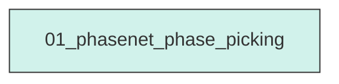
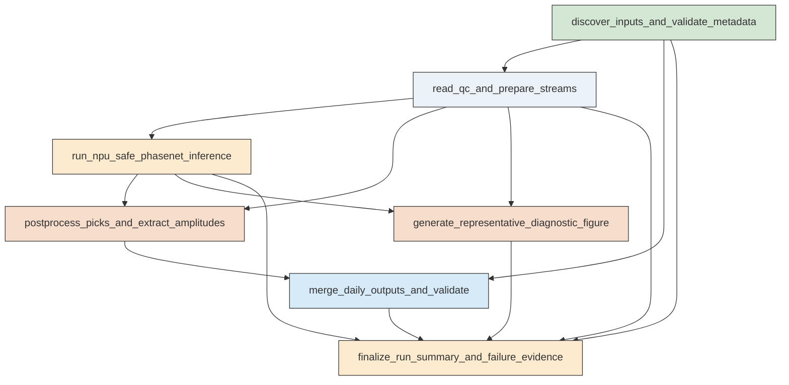

# Workflow Overview

## Top-Level Task Dependencies

**Description:**
- `01_phasenet_phase_picking`: Run an end-to-end PhaseNet picking workflow on the requested Ridgecrest station-day MiniSEED files using NPU-safe multiprocessing and produce validated daily CSV outputs plus one diagnostic figure.

## Subtask Dependencies

#### 01_phasenet_phase_picking
**Usage**: Run an end-to-end PhaseNet picking workflow on the requested Ridgecrest station-day MiniSEED files using NPU-safe multiprocessing and produce validated daily CSV outputs plus one diagnostic figure.

**Description:**
- `discover_inputs_and_validate_metadata`: Enumerate the requested day folders, parse waveform filenames, and cross-check station identifiers against station metadata.
- `read_qc_and_prepare_streams`: Read each MiniSEED file, enforce usable three-component stream structure, preserve waveform values for amplitude extraction, and record QC decisions.
- `run_npu_safe_phasenet_inference`: Execute PhaseNet discrete picking in parallel with spawn-based multiprocessing, worker-local NPU initialization, progress reporting, and failure capture.
- `postprocess_picks_and_extract_amplitudes`: Convert PhaseNet outputs to the required schema, keep only P and S picks, and extract waveform amplitudes at the nearest sample to each pick time.
- `merge_daily_outputs_and_validate`: Merge station-level picks into one CSV per UTC day, enforce the exact header and field constraints, and record day-level validation results.
- `generate_representative_diagnostic_figure`: Create one real diagnostic figure from a successfully processed case showing waveform traces, pick markers, and optional probability traces.
- `finalize_run_summary_and_failure_evidence`: Validate that both daily CSV outputs and the diagnostic figure are real processed products and assemble machine-readable run, skip, and failure summaries.