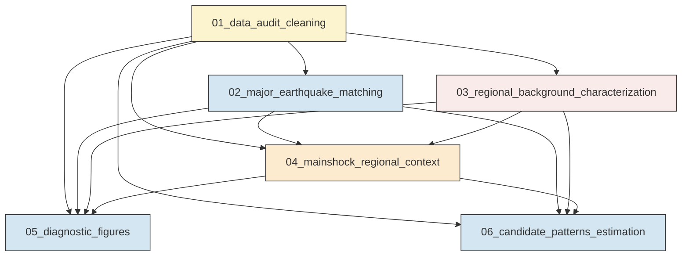
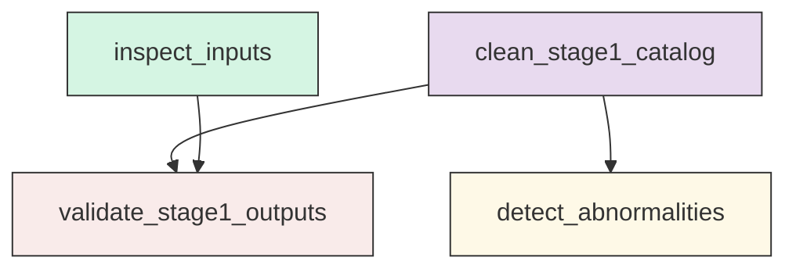
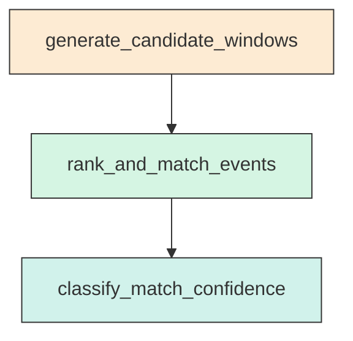
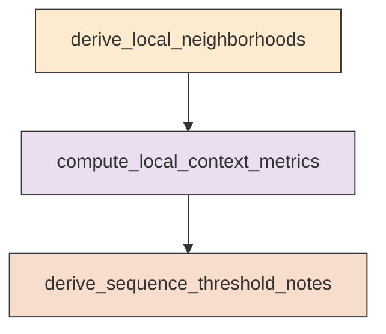

# Research Codings

## Task Overview


**Description:**
- `01_data_audit_cleaning`: Audit all source files and build a validated Stage-1 cleaned regional catalog with quality flags.
- `02_major_earthquake_matching`: Match major earthquakes to the relocated catalog and quantify match confidence and differences.
- `03_regional_background_characterization`: Characterize regional seismicity background, station coverage, and mechanism availability from the cleaned catalog.
- `04_mainshock_regional_context`: Summarize local catalog, station, and mechanism context around each major earthquake.
- `05_diagnostic_figures`: Generate Nature-style high-resolution diagnostic figures for audit, background, and context analysis.
- `06_candidate_patterns_estimation`: Convert background and context results into ranked candidate patterns and follow-up analysis suggestions.


## Task Details


#### 01_data_audit_cleaning
**Usage**: Audit all source files and build a validated Stage-1 cleaned regional catalog with quality flags.

**Description:**
- `inspect_inputs`: Inspect schemas, record counts, field names, and raw value ranges for all files.
- `clean_stage1_catalog`: Parse event time and harmonize core event fields into a validated cleaned table.
- `detect_abnormalities`: Flag missing, impossible, duplicate, and physically implausible records.
- `validate_stage1_outputs`: Confirm the cleaned catalog is non-empty and ready for downstream analyses.

#### Coding Script

```python

from __future__ import annotations

import sys
import traceback
from pathlib import Path
from typing import Dict, Iterable, Optional

import numpy as np
import pandas as pd


DATA_DIR = Path(
    "<CASE_ROOT>/data"
)
OUTPUT_DIR = Path(
    "<CASE_ROOT>/run/01_data_foundation/exp_run/outputs/01_data_audit_cleaning"
)

REGIONAL_CATALOG = DATA_DIR / "catalog/Snet_catalog_relocate.csv"
MAINSHOCKS = DATA_DIR / "catalog/main_earthquake.csv"
MECHANISMS = DATA_DIR / "source_mechanism/Snet_mecha.csv"
STATIONS = DATA_DIR / "stations/station.sta"

EARTH_RADIUS_KM = 6371.0088
EXPECTED_REGION = {
    "lat_min": 33.0,
    "lat_max": 46.0,
    "lon_min": 138.0,
    "lon_max": 147.5,
    "depth_min": -5.0,
    "depth_max": 700.0,
    "mag_min": -1.0,
    "mag_max": 10.0,
}


def ensure_output_dir(path: Path) -> None:
    path.mkdir(parents=True, exist_ok=True)


def detect_time_column(columns: Iterable[str]) -> Optional[str]:
    candidates = ["datetime", "origin_time", "time", "event_time", "origin"]
    lower_map = {c.lower(): c for c in columns}
    for cand in candidates:
        if cand in lower_map:
            return lower_map[cand]
    return None


def normalize_columns(df: pd.DataFrame) -> pd.DataFrame:
    df = df.copy()
    df.columns = [c.strip() for c in df.columns]
    return df


def audit_dataframe(name: str, df: pd.DataFrame, time_col: Optional[str]) -> Dict[str, object]:
    audit: Dict[str, object] = {
        "file_name": name,
        "record_count": int(len(df)),
        "column_count": int(df.shape[1]),
        "columns": ",".join(df.columns.astype(str).tolist()),
        "missing_values_total": int(df.isna().sum().sum()),
        "duplicate_rows": int(df.duplicated().sum()),
        "usable_fields": ",".join(df.columns.astype(str).tolist()),
        "time_column": time_col or "",
    }
    if time_col and time_col in df.columns:
        parsed = pd.to_datetime(df[time_col], errors="coerce", utc=True)
        audit["time_parse_success"] = int(parsed.notna().sum())
        audit["time_parse_failure"] = int(parsed.isna().sum())
        if parsed.notna().any():
            audit["time_min"] = parsed.min().isoformat()
            audit["time_max"] = parsed.max().isoformat()
    else:
        audit["time_parse_success"] = 0
        audit["time_parse_failure"] = 0
        audit["time_min"] = ""
        audit["time_max"] = ""
    return audit


def infer_event_id_column(df: pd.DataFrame) -> Optional[str]:
    for col in df.columns:
        lc = col.lower()
        if lc in {"index", "event_id", "event_code", "id", "eid"}:
            return col
    return None


def build_clean_catalog(df: pd.DataFrame) -> pd.DataFrame:
    df = normalize_columns(df)
    time_col = detect_time_column(df.columns)
    if time_col is None:
        raise ValueError("No recognizable time column found in regional catalog.")

    out = pd.DataFrame(index=df.index)
    out["source_file"] = "Snet_catalog_relocate.csv"
    out["raw_time"] = df[time_col].astype(str)
    out["origin_time"] = pd.to_datetime(df[time_col], errors="coerce", utc=True)
    out["latitude"] = pd.to_numeric(df.get("lat"), errors="coerce")
    out["longitude"] = pd.to_numeric(df.get("lon"), errors="coerce")
    out["depth_km"] = pd.to_numeric(df.get("dep"), errors="coerce")
    out["magnitude"] = pd.to_numeric(df.get("mag"), errors="coerce")

    event_id_col = infer_event_id_column(df)
    if event_id_col is not None:
        out["event_id"] = df[event_id_col].astype(str)
    else:
        out["event_id"] = [f"CAT_{i:06d}" for i in range(len(df))]

    out["has_origin_time"] = out["origin_time"].notna()
    out["has_location"] = out[["latitude", "longitude"]].notna().all(axis=1)
    out["has_depth"] = out["depth_km"].notna()
    out["has_magnitude"] = out["magnitude"].notna()

    out["flag_time_parse_failed"] = ~out["has_origin_time"]
    out["flag_missing_location"] = ~out["has_location"]
    out["flag_missing_depth"] = ~out["has_depth"]
    out["flag_missing_magnitude"] = ~out["has_magnitude"]

    out["flag_lat_out_of_bounds"] = ~out["latitude"].between(EXPECTED_REGION["lat_min"], EXPECTED_REGION["lat_max"], inclusive="both")
    out["flag_lon_out_of_bounds"] = ~out["longitude"].between(EXPECTED_REGION["lon_min"], EXPECTED_REGION["lon_max"], inclusive="both")
    out["flag_depth_out_of_bounds"] = ~out["depth_km"].between(EXPECTED_REGION["depth_min"], EXPECTED_REGION["depth_max"], inclusive="both")
    out["flag_mag_out_of_bounds"] = ~out["magnitude"].between(EXPECTED_REGION["mag_min"], EXPECTED_REGION["mag_max"], inclusive="both")

    out["flag_any_quality_issue"] = out[
        [
            "flag_time_parse_failed",
            "flag_missing_location",
            "flag_missing_depth",
            "flag_missing_magnitude",
            "flag_lat_out_of_bounds",
            "flag_lon_out_of_bounds",
            "flag_depth_out_of_bounds",
            "flag_mag_out_of_bounds",
        ]
    ].any(axis=1)
    out["quality_status"] = np.where(out["flag_any_quality_issue"], "needs_review", "clean")

    dup_sig = (
        out["origin_time"].dt.round("1s").astype("int64", errors="ignore").astype(str)
        + "|"
        + out["latitude"].round(4).astype(str)
        + "|"
        + out["longitude"].round(4).astype(str)
        + "|"
        + out["depth_km"].round(2).astype(str)
        + "|"
        + out["magnitude"].round(2).astype(str)
    )
    out["duplicate_signature"] = dup_sig
    out["flag_exact_duplicate_signature"] = out.duplicated("duplicate_signature", keep=False)
    return out


def haversine_km(lon1, lat1, lon2, lat2):
    lon1 = np.radians(lon1)
    lat1 = np.radians(lat1)
    lon2 = np.radians(lon2)
    lat2 = np.radians(lat2)
    dlon = lon2 - lon1
    dlat = lat2 - lat1
    a = np.sin(dlat / 2.0) ** 2 + np.cos(lat1) * np.cos(lat2) * np.sin(dlon / 2.0) ** 2
    return 2.0 * EARTH_RADIUS_KM * np.arcsin(np.sqrt(a))


def summarize_numeric(s: pd.Series) -> Dict[str, object]:
    s = pd.to_numeric(s, errors="coerce")
    return {
        "count": int(s.notna().sum()),
        "min": float(s.min()) if s.notna().any() else np.nan,
        "p01": float(s.quantile(0.01)) if s.notna().any() else np.nan,
        "p05": float(s.quantile(0.05)) if s.notna().any() else np.nan,
        "median": float(s.median()) if s.notna().any() else np.nan,
        "p95": float(s.quantile(0.95)) if s.notna().any() else np.nan,
        "p99": float(s.quantile(0.99)) if s.notna().any() else np.nan,
        "max": float(s.max()) if s.notna().any() else np.nan,
        "mean": float(s.mean()) if s.notna().any() else np.nan,
        "std": float(s.std(ddof=1)) if s.notna().sum() > 1 else np.nan,
    }


def parse_station_table(df: pd.DataFrame) -> pd.DataFrame:
    df = normalize_columns(df)
    out = pd.DataFrame(index=df.index)
    out["station_code"] = df.get("station_code").astype(str)
    out["station_number"] = pd.to_numeric(df.get("station_number"), errors="coerce")
    out["latitude"] = pd.to_numeric(df.get("latitude"), errors="coerce")
    out["longitude"] = pd.to_numeric(df.get("longitude"), errors="coerce")
    out["elevation_m"] = pd.to_numeric(df.get("elevation_m"), errors="coerce")
    matched = df.get("matched")
    if matched is not None:
        out["matched"] = matched.astype(str).str.lower().isin(["true", "1", "yes", "y"])
    else:
        out["matched"] = False
    out["flag_any_quality_issue"] = out[["station_code", "station_number", "latitude", "longitude"]].isna().any(axis=1)
    return out


def parse_mechanisms(df: pd.DataFrame) -> pd.DataFrame:
    df = normalize_columns(df)
    out = pd.DataFrame(index=df.index)
    out["event_code"] = df.get("event_code").astype(str)
    out["origin_time"] = pd.to_datetime(df.get("origin_time"), errors="coerce", utc=True)
    out["latitude"] = pd.to_numeric(df.get("lat_deg"), errors="coerce")
    out["longitude"] = pd.to_numeric(df.get("lon_deg"), errors="coerce")
    out["depth_km"] = pd.to_numeric(df.get("depth_km"), errors="coerce")
    out["mag_1"] = pd.to_numeric(df.get("mag_1"), errors="coerce")
    out["mag_2"] = pd.to_numeric(df.get("mag_2"), errors="coerce")
    mech_cols = ["P_axis_azimuth", "P_axis_dip", "T_axis_azimuth", "T_axis_dip", "N_axis_azimuth", "N_axis_dip", "strike_plane1", "dip_plane1", "rake_plane1", "strike_plane2", "dip_plane2", "rake_plane2"]
    for c in mech_cols + ["focal_mech_score", "n_hypo_stations", "n_mech_stations"]:
        if c in df.columns:
            out[c] = pd.to_numeric(df.get(c), errors="coerce")
    out["has_geometry"] = out[[c for c in mech_cols if c in out.columns]].notna().any(axis=1)
    out["has_mechanism_core"] = out[["strike_plane1", "dip_plane1", "rake_plane1"]].notna().all(axis=1) if {"strike_plane1", "dip_plane1", "rake_plane1"}.issubset(out.columns) else False
    return out


def main() -> None:
    try:
        ensure_output_dir(OUTPUT_DIR)

        for stale_name in [
            "stage1_regional_catalog_clean.csv",
            "main_earthquake_clean.csv",
            "source_mechanism_clean.csv",
            "station_clean.csv",
            "file_level_audit_summary.csv",
            "quality_summary.csv",
            "regional_catalog_numeric_summary.csv",
            "main_earthquake_numeric_summary.csv",
            "field_mapping_summary.csv",
            "duplicate_signature_report.csv",
            "abnormal_value_report.csv",
            "station_summary.csv",
            "mechanism_summary.csv",
        ]:
            stale_path = OUTPUT_DIR / stale_name
            if stale_path.exists():
                stale_path.unlink()

        cat_raw = pd.read_csv(REGIONAL_CATALOG)
        main_raw = pd.read_csv(MAINSHOCKS)
        mecha_raw = pd.read_csv(MECHANISMS)
        sta_raw = pd.read_csv(STATIONS)

        cat_clean = build_clean_catalog(cat_raw)
        main_clean = build_clean_catalog(main_raw.rename(columns={"index": "event_id"}))
        mecha_clean = parse_mechanisms(mecha_raw)
        sta_clean = parse_station_table(sta_raw)

        required_cat_cols = {"origin_time", "latitude", "longitude", "depth_km", "magnitude", "event_id", "quality_status"}
        required_main_cols = {"origin_time", "latitude", "longitude", "depth_km", "magnitude", "event_id", "quality_status"}
        missing_cat = required_cat_cols.difference(cat_clean.columns)
        missing_main = required_main_cols.difference(main_clean.columns)
        if missing_cat:
            raise ValueError(f"Stage-1 catalog missing required columns: {sorted(missing_cat)}")
        if missing_main:
            raise ValueError(f"Main earthquake cleaned table missing required columns: {sorted(missing_main)}")

        cat_clean = cat_clean.sort_values("origin_time", na_position="last").reset_index(drop=True)
        main_clean = main_clean.sort_values("origin_time", na_position="last").reset_index(drop=True)
        mecha_clean = mecha_clean.sort_values("origin_time", na_position="last").reset_index(drop=True)
        sta_clean = sta_clean.sort_values(["station_code"]).reset_index(drop=True)

        audits = []
        audits.append(audit_dataframe("Snet_catalog_relocate.csv", cat_raw, detect_time_column(cat_raw.columns)))
        audits.append(audit_dataframe("main_earthquake.csv", main_raw, detect_time_column(main_raw.columns)))
        audits.append(audit_dataframe("Snet_mecha.csv", mecha_raw, detect_time_column(mecha_raw.columns)))
        audits.append(audit_dataframe("station.sta", sta_raw, detect_time_column(sta_raw.columns)))
        audit_df = pd.DataFrame(audits)

        quality_summary = pd.DataFrame(
            [
                {
                    "dataset": "regional_catalog",
                    "records": len(cat_clean),
                    "clean_records": int((~cat_clean["flag_any_quality_issue"]).sum()),
                    "issue_records": int(cat_clean["flag_any_quality_issue"].sum()),
                    "duplicate_signatures": int(cat_clean["flag_exact_duplicate_signature"].sum()),
                    "time_parse_failures": int(cat_clean["flag_time_parse_failed"].sum()),
                    "lat_out_of_bounds": int(cat_clean["flag_lat_out_of_bounds"].sum()),
                    "lon_out_of_bounds": int(cat_clean["flag_lon_out_of_bounds"].sum()),
                    "depth_out_of_bounds": int(cat_clean["flag_depth_out_of_bounds"].sum()),
                    "mag_out_of_bounds": int(cat_clean["flag_mag_out_of_bounds"].sum()),
                },
                {
                    "dataset": "main_earthquake",
                    "records": len(main_clean),
                    "clean_records": int((~main_clean["flag_any_quality_issue"]).sum()),
                    "issue_records": int(main_clean["flag_any_quality_issue"].sum()),
                    "duplicate_signatures": int(main_clean["flag_exact_duplicate_signature"].sum()),
                    "time_parse_failures": int(main_clean["flag_time_parse_failed"].sum()),
                    "lat_out_of_bounds": int(main_clean["flag_lat_out_of_bounds"].sum()),
                    "lon_out_of_bounds": int(main_clean["flag_lon_out_of_bounds"].sum()),
                    "depth_out_of_bounds": int(main_clean["flag_depth_out_of_bounds"].sum()),
                    "mag_out_of_bounds": int(main_clean["flag_mag_out_of_bounds"].sum()),
                },
            ]
        )

        cat_numeric_summary = pd.DataFrame(
            {
                "latitude": summarize_numeric(cat_clean["latitude"]),
                "longitude": summarize_numeric(cat_clean["longitude"]),
                "depth_km": summarize_numeric(cat_clean["depth_km"]),
                "magnitude": summarize_numeric(cat_clean["magnitude"]),
            }
        )
        main_numeric_summary = pd.DataFrame(
            {
                "latitude": summarize_numeric(main_clean["latitude"]),
                "longitude": summarize_numeric(main_clean["longitude"]),
                "depth_km": summarize_numeric(main_clean["depth_km"]),
                "magnitude": summarize_numeric(main_clean["magnitude"]),
            }
        )

        cat_clean.to_csv(OUTPUT_DIR / "stage1_regional_catalog_clean.csv", index=False)
        main_clean.to_csv(OUTPUT_DIR / "main_earthquake_clean.csv", index=False)
        mecha_clean.to_csv(OUTPUT_DIR / "source_mechanism_clean.csv", index=False)
        sta_clean.to_csv(OUTPUT_DIR / "station_clean.csv", index=False)

        audit_df.to_csv(OUTPUT_DIR / "file_level_audit_summary.csv", index=False)
        quality_summary.to_csv(OUTPUT_DIR / "quality_summary.csv", index=False)
        cat_numeric_summary.to_csv(OUTPUT_DIR / "regional_catalog_numeric_summary.csv")
        main_numeric_summary.to_csv(OUTPUT_DIR / "main_earthquake_numeric_summary.csv")

        field_summary = pd.DataFrame(
            [
                {"file": "Snet_catalog_relocate.csv", "usable_fields": "datetime,lat,lon,dep,mag", "time_column": "datetime"},
                {"file": "main_earthquake.csv", "usable_fields": "index,datetime,lat,lon,dep,mag", "time_column": "datetime"},
                {"file": "Snet_mecha.csv", "usable_fields": ",".join(mecha_raw.columns.astype(str).tolist()), "time_column": "origin_time"},
                {"file": "station.sta", "usable_fields": ",".join(sta_raw.columns.astype(str).tolist()), "time_column": ""},
            ]
        )
        field_summary.to_csv(OUTPUT_DIR / "field_mapping_summary.csv", index=False)

        duplicate_report = cat_clean.loc[cat_clean["flag_exact_duplicate_signature"], ["event_id", "origin_time", "latitude", "longitude", "depth_km", "magnitude", "duplicate_signature"]]
        duplicate_report.to_csv(OUTPUT_DIR / "duplicate_signature_report.csv", index=False)

        abnormal_report = cat_clean.loc[
            cat_clean[
                ["flag_lat_out_of_bounds", "flag_lon_out_of_bounds", "flag_depth_out_of_bounds", "flag_mag_out_of_bounds", "flag_time_parse_failed"]
            ].any(axis=1),
            ["event_id", "raw_time", "origin_time", "latitude", "longitude", "depth_km", "magnitude", "quality_status", "flag_lat_out_of_bounds", "flag_lon_out_of_bounds", "flag_depth_out_of_bounds", "flag_mag_out_of_bounds", "flag_time_parse_failed"],
        ]
        abnormal_report.to_csv(OUTPUT_DIR / "abnormal_value_report.csv", index=False)

        station_summary = pd.DataFrame(
            [{
                "station_count": len(sta_clean),
                "matched_count": int(sta_clean["matched"].sum()),
                "latitude_min": float(sta_clean["latitude"].min()),
                "latitude_max": float(sta_clean["latitude"].max()),
                "longitude_min": float(sta_clean["longitude"].min()),
                "longitude_max": float(sta_clean["longitude"].max()),
                "elevation_min_m": float(sta_clean["elevation_m"].min()),
                "elevation_max_m": float(sta_clean["elevation_m"].max()),
            }]
        )
        station_summary.to_csv(OUTPUT_DIR / "station_summary.csv", index=False)

        mechanism_summary = pd.DataFrame(
            [{
                "record_count": len(mecha_clean),
                "origin_time_parse_success": int(mecha_clean["origin_time"].notna().sum()),
                "latitude_nonmissing": int(mecha_clean["latitude"].notna().sum()),
                "longitude_nonmissing": int(mecha_clean["longitude"].notna().sum()),
                "depth_nonmissing": int(mecha_clean["depth_km"].notna().sum()),
                "core_mechanism_available": int(mecha_clean["has_mechanism_core"].sum()) if "has_mechanism_core" in mecha_clean.columns else 0,
                "geometry_available": int(mecha_clean["has_geometry"].sum()) if "has_geometry" in mecha_clean.columns else 0,
            }]
        )
        mechanism_summary.to_csv(OUTPUT_DIR / "mechanism_summary.csv", index=False)

        print("[01_data_audit_cleaning] Completed successfully.", flush=True)
        print(f"[01_data_audit_cleaning] Output directory: {OUTPUT_DIR}", flush=True)
        print(f"[01_data_audit_cleaning] Clean regional catalog rows: {len(cat_clean)}", flush=True)
        print(f"[01_data_audit_cleaning] Clean main earthquakes rows: {len(main_clean)}", flush=True)
        print(f"[01_data_audit_cleaning] Mechanism rows: {len(mecha_clean)}", flush=True)
        print(f"[01_data_audit_cleaning] Station rows: {len(sta_clean)}", flush=True)

    except Exception:
        traceback.print_exc()
        sys.exit(1)


if __name__ == "__main__":
    main()


```

#### 02_major_earthquake_matching
**Usage**: Match major earthquakes to the relocated catalog and quantify match confidence and differences.

**Description:**
- `generate_candidate_windows`: Build constrained candidate windows around each reference origin time.
- `rank_and_match_events`: Rank candidates by time, space, depth, and magnitude agreement and select best matches.
- `classify_match_confidence`: Assign confidence tiers based on uniqueness and multi-metric agreement.

#### Coding Script

```python

from __future__ import annotations

import sys
import traceback
from pathlib import Path
from typing import Dict, List, Optional, Tuple

import numpy as np
import pandas as pd


DATA_DIR = Path(
    "<CASE_ROOT>/data"
)
OUTPUT_DIR = Path(
    "<CASE_ROOT>/run/01_data_foundation/exp_run/outputs/02_major_earthquake_matching"
)
STAGE1_OUTPUT_DIR = Path(
    "<CASE_ROOT>/run/01_data_foundation/exp_run/outputs/01_data_audit_cleaning"
)

REGIONAL_CATALOG = DATA_DIR / "catalog/Snet_catalog_relocate.csv"
MAINSHOCKS = DATA_DIR / "catalog/main_earthquake.csv"

EARTH_RADIUS_KM = 6371.0088
PRIMARY_TIME_WINDOW_HOURS = 6.0
SECONDARY_TIME_WINDOW_HOURS = 48.0
TIE_TIME_TOL_SEC = 60.0
TIE_DIST_TOL_KM = 10.0
TIE_DEPTH_TOL_KM = 20.0
TIE_MAG_TOL = 0.3


def ensure_output_dir(path: Path) -> None:
    path.mkdir(parents=True, exist_ok=True)


def normalize_columns(df: pd.DataFrame) -> pd.DataFrame:
    df = df.copy()
    df.columns = [c.strip() for c in df.columns]
    return df


def detect_time_column(columns) -> Optional[str]:
    candidates = ["datetime", "origin_time", "time", "event_time", "origin"]
    lower_map = {c.lower(): c for c in columns}
    for cand in candidates:
        if cand in lower_map:
            return lower_map[cand]
    return None


def haversine_km(lon1, lat1, lon2, lat2):
    lon1 = np.radians(lon1)
    lat1 = np.radians(lat1)
    lon2 = np.radians(lon2)
    lat2 = np.radians(lat2)
    dlon = lon2 - lon1
    dlat = lat2 - lat1
    a = np.sin(dlat / 2.0) ** 2 + np.cos(lat1) * np.cos(lat2) * np.sin(dlon / 2.0) ** 2
    return 2.0 * EARTH_RADIUS_KM * np.arcsin(np.sqrt(a))


def load_stage1_catalog() -> pd.DataFrame:
    stage1_path = STAGE1_OUTPUT_DIR / "stage1_regional_catalog_clean.csv"
    if stage1_path.exists():
        df = pd.read_csv(stage1_path)
        df = normalize_columns(df)
        df["origin_time"] = pd.to_datetime(df["origin_time"], errors="coerce", utc=True)
        return df

    raw = pd.read_csv(REGIONAL_CATALOG)
    raw = normalize_columns(raw)
    time_col = detect_time_column(raw.columns)
    if time_col is None:
        raise ValueError("No recognizable time column in regional catalog")
    out = pd.DataFrame(index=raw.index)
    out["source_file"] = "Snet_catalog_relocate.csv"
    out["raw_time"] = raw[time_col].astype(str)
    out["origin_time"] = pd.to_datetime(raw[time_col], errors="coerce", utc=True)
    out["latitude"] = pd.to_numeric(raw.get("lat"), errors="coerce")
    out["longitude"] = pd.to_numeric(raw.get("lon"), errors="coerce")
    out["depth_km"] = pd.to_numeric(raw.get("dep"), errors="coerce")
    out["magnitude"] = pd.to_numeric(raw.get("mag"), errors="coerce")
    out["event_id"] = [f"CAT_{i:06d}" for i in range(len(out))]
    return out


def load_mainshocks() -> pd.DataFrame:
    df = pd.read_csv(MAINSHOCKS)
    df = normalize_columns(df)
    time_col = detect_time_column(df.columns)
    if time_col is None:
        raise ValueError("No recognizable time column in main_earthquake.csv")
    out = pd.DataFrame(index=df.index)
    out["reference_id"] = df.get("index", pd.Series([f"M{i+1}" for i in range(len(df))]))
    out["raw_time"] = df[time_col].astype(str)
    out["origin_time"] = pd.to_datetime(df[time_col], errors="coerce", utc=True)
    out["latitude"] = pd.to_numeric(df.get("lat"), errors="coerce")
    out["longitude"] = pd.to_numeric(df.get("lon"), errors="coerce")
    out["depth_km"] = pd.to_numeric(df.get("dep"), errors="coerce")
    out["magnitude"] = pd.to_numeric(df.get("mag"), errors="coerce")
    return out


def candidate_score(dt_sec: float, dist_km: float, depth_diff: float, mag_diff: float) -> float:
    return (
        abs(dt_sec) / 60.0
        + dist_km / 5.0
        + abs(depth_diff) / 10.0
        + abs(mag_diff) * 2.0
    )


def confidence_label(n_candidates: int, best: pd.Series, second: Optional[pd.Series], candidate_window_hours: float) -> str:
    if n_candidates == 0:
        return "unmatched"
    if second is None:
        return "high"
    score_gap = second["composite_score"] - best["composite_score"]
    time_gap = abs(second["time_diff_sec"]) - abs(best["time_diff_sec"])
    dist_gap = second["distance_km"] - best["distance_km"]
    if (
        abs(best["time_diff_sec"]) <= 300
        and best["distance_km"] <= 15
        and abs(best["depth_diff_km"]) <= 20
        and abs(best["mag_diff"]) <= 0.4
        and score_gap > 5
        and time_gap > TIE_TIME_TOL_SEC
        and dist_gap > TIE_DIST_TOL_KM
    ):
        return "high"
    if (
        abs(best["time_diff_sec"]) <= 1800
        and best["distance_km"] <= 40
        and abs(best["depth_diff_km"]) <= 40
        and abs(best["mag_diff"]) <= 0.8
        and score_gap > 1
    ):
        return "moderate"
    if candidate_window_hours <= PRIMARY_TIME_WINDOW_HOURS and n_candidates < 5:
        return "low"
    return "ambiguous"


def match_one(main_row: pd.Series, catalog: pd.DataFrame) -> Tuple[pd.Series, pd.DataFrame]:
    center = main_row["origin_time"]
    if pd.isna(center):
        result = main_row.to_dict()
        result.update({
            "matched_event_id": "",
            "matched_time": pd.NaT,
            "time_diff_sec": np.nan,
            "distance_km": np.nan,
            "depth_diff_km": np.nan,
            "mag_diff": np.nan,
            "candidate_count": 0,
            "search_window_hours": np.nan,
            "confidence": "unmatched",
            "match_note": "reference time parse failed",
        })
        return pd.Series(result), pd.DataFrame()

    search_hours = PRIMARY_TIME_WINDOW_HOURS
    cand = catalog[(catalog["origin_time"] >= center - pd.Timedelta(hours=search_hours)) & (catalog["origin_time"] <= center + pd.Timedelta(hours=search_hours))].copy()
    fallback_used = False
    if cand.empty:
        search_hours = SECONDARY_TIME_WINDOW_HOURS
        cand = catalog[(catalog["origin_time"] >= center - pd.Timedelta(hours=search_hours)) & (catalog["origin_time"] <= center + pd.Timedelta(hours=search_hours))].copy()
        fallback_used = True

    if cand.empty:
        result = main_row.to_dict()
        result.update({
            "matched_event_id": "",
            "matched_time": pd.NaT,
            "time_diff_sec": np.nan,
            "distance_km": np.nan,
            "depth_diff_km": np.nan,
            "mag_diff": np.nan,
            "candidate_count": 0,
            "search_window_hours": search_hours,
            "confidence": "unmatched",
            "match_note": "no catalog candidate in search window",
        })
        return pd.Series(result), pd.DataFrame()

    cand["time_diff_sec"] = (cand["origin_time"] - center).dt.total_seconds()
    cand["distance_km"] = haversine_km(main_row["longitude"], main_row["latitude"], cand["longitude"].to_numpy(), cand["latitude"].to_numpy())
    cand["depth_diff_km"] = cand["depth_km"] - main_row["depth_km"]
    cand["mag_diff"] = cand["magnitude"] - main_row["magnitude"]
    cand["composite_score"] = [candidate_score(a, b, c, d) for a, b, c, d in zip(cand["time_diff_sec"], cand["distance_km"], cand["depth_diff_km"], cand["mag_diff"])]
    cand = cand.sort_values(["composite_score", "time_diff_sec", "distance_km", "depth_diff_km"], ascending=[True, True, True, True]).reset_index(drop=True)

    best = cand.iloc[0]
    second = cand.iloc[1] if len(cand) > 1 else None
    confidence = confidence_label(len(cand), best, second, search_hours)
    if fallback_used and confidence != "unmatched":
        confidence = f"fallback_{confidence}"

    tie_flag = False
    if second is not None:
        tie_flag = (
            abs(second["time_diff_sec"] - best["time_diff_sec"]) <= TIE_TIME_TOL_SEC
            and abs(second["distance_km"] - best["distance_km"]) <= TIE_DIST_TOL_KM
            and abs(second["depth_diff_km"] - best["depth_diff_km"]) <= TIE_DEPTH_TOL_KM
            and abs(second["mag_diff"] - best["mag_diff"]) <= TIE_MAG_TOL
        )
        if tie_flag and confidence == "high":
            confidence = "ambiguous"

    result = main_row.to_dict()
    result.update({
        "matched_event_id": best["event_id"],
        "matched_time": best["origin_time"],
        "time_diff_sec": float(best["time_diff_sec"]),
        "distance_km": float(best["distance_km"]),
        "depth_diff_km": float(best["depth_diff_km"]),
        "mag_diff": float(best["mag_diff"]),
        "candidate_count": int(len(cand)),
        "search_window_hours": float(search_hours),
        "confidence": confidence,
        "match_note": "fallback window used" if fallback_used else "primary window used",
        "tie_flag": tie_flag,
    })
    return pd.Series(result), cand.head(10)


def build_summary(matches: pd.DataFrame) -> pd.DataFrame:
    n = len(matches)
    conf_counts = matches["confidence"].fillna("unknown").value_counts().sort_index()
    summary = pd.DataFrame([
        {"metric": "major_event_count", "value": n},
        {"metric": "matched_count", "value": int(matches["matched_event_id"].astype(str).str.len().gt(0).sum())},
        {"metric": "unmatched_count", "value": int((matches["matched_event_id"].astype(str).str.len() == 0).sum())},
        {"metric": "median_abs_time_diff_sec", "value": float(matches["time_diff_sec"].abs().median())},
        {"metric": "median_distance_km", "value": float(matches["distance_km"].median())},
        {"metric": "median_depth_diff_km", "value": float(matches["depth_diff_km"].abs().median())},
        {"metric": "median_mag_diff", "value": float(matches["mag_diff"].abs().median())},
    ])
    for conf, count in conf_counts.items():
        summary = pd.concat([summary, pd.DataFrame([{"metric": f"confidence_{conf}", "value": int(count)}])], ignore_index=True)
    return summary


def main() -> None:
    try:
        ensure_output_dir(OUTPUT_DIR)
        for stale in ["major_earthquake_matches.csv", "major_earthquake_candidates.csv", "major_earthquake_match_summary.csv"]:
            p = OUTPUT_DIR / stale
            if p.exists():
                p.unlink()

        catalog = load_stage1_catalog()
        mainshocks = load_mainshocks()
        catalog = catalog.dropna(subset=["origin_time", "latitude", "longitude", "depth_km", "magnitude"]).reset_index(drop=True)
        mainshocks = mainshocks.reset_index(drop=True)

        all_matches: List[pd.Series] = []
        cand_rows: List[pd.DataFrame] = []
        for _, row in mainshocks.iterrows():
            matched_row, candidates = match_one(row, catalog)
            all_matches.append(matched_row)
            if not candidates.empty:
                candidates = candidates.copy()
                candidates.insert(0, "reference_id", row["reference_id"])
                cand_rows.append(candidates)

        match_df = pd.DataFrame(all_matches)
        candidate_df = pd.concat(cand_rows, ignore_index=True) if cand_rows else pd.DataFrame()
        summary_df = build_summary(match_df)

        required_match_cols = {
            "reference_id",
            "origin_time",
            "latitude",
            "longitude",
            "depth_km",
            "magnitude",
            "matched_event_id",
            "matched_time",
            "time_diff_sec",
            "distance_km",
            "depth_diff_km",
            "mag_diff",
            "candidate_count",
            "search_window_hours",
            "confidence",
            "match_note",
            "tie_flag",
        }
        missing_match_cols = required_match_cols.difference(match_df.columns)
        if missing_match_cols:
            raise ValueError(f"Match table missing required columns: {sorted(missing_match_cols)}")
        if not candidate_df.empty:
            required_candidate_cols = {
                "reference_id",
                "event_id",
                "origin_time",
                "latitude",
                "longitude",
                "depth_km",
                "magnitude",
                "time_diff_sec",
                "distance_km",
                "depth_diff_km",
                "mag_diff",
                "composite_score",
            }
            missing_candidate_cols = required_candidate_cols.difference(candidate_df.columns)
            if missing_candidate_cols:
                raise ValueError(f"Candidate table missing required columns: {sorted(missing_candidate_cols)}")

        match_df.to_csv(OUTPUT_DIR / "major_earthquake_matches.csv", index=False)
        if not candidate_df.empty:
            candidate_df.to_csv(OUTPUT_DIR / "major_earthquake_candidates.csv", index=False)
        else:
            pd.DataFrame(columns=["reference_id"]).to_csv(OUTPUT_DIR / "major_earthquake_candidates.csv", index=False)
        summary_df.to_csv(OUTPUT_DIR / "major_earthquake_match_summary.csv", index=False)

        print("[02_major_earthquake_matching] Completed successfully.", flush=True)
        print(f"[02_major_earthquake_matching] Output directory: {OUTPUT_DIR}", flush=True)
        print(f"[02_major_earthquake_matching] Major events: {len(mainshocks)}", flush=True)
        print(f"[02_major_earthquake_matching] Matched events: {match_df['matched_event_id'].astype(str).str.len().gt(0).sum()}", flush=True)
        print(f"[02_major_earthquake_matching] Candidate rows saved: {len(candidate_df)}", flush=True)

    except Exception:
        traceback.print_exc()
        sys.exit(1)


if __name__ == "__main__":
    main()


```

#### 03_regional_background_characterization
**Usage**: Characterize regional seismicity background, station coverage, and mechanism availability from the cleaned catalog.

**Description:**
- `summarize_spatiotemporal_background`: Compute spatial density, temporal rate, magnitude distribution, and depth distribution summaries.
- `estimate_completeness_and_bvalue`: Estimate preliminary Mc and Gutenberg-Richter b-value from the cleaned catalog.
- `summarize_station_and_mechanism_background`: Assess station coverage and focal-mechanism availability and distribution.

#### Coding Script

```python

from __future__ import annotations

import sys
import traceback
from pathlib import Path
from typing import Dict, List, Optional, Tuple

import numpy as np
import pandas as pd
import matplotlib
matplotlib.use("Agg")
import matplotlib.pyplot as plt
from scipy.stats import gaussian_kde


DATA_DIR = Path(
    "<CASE_ROOT>/data"
)
OUTPUT_DIR = Path(
    "<CASE_ROOT>/run/01_data_foundation/exp_run/outputs/03_regional_background_characterization"
)
CLEAN_DIR = Path(
    "<CASE_ROOT>/run/01_data_foundation/exp_run/outputs/01_data_audit_cleaning"
)

CLEAN_CATALOG = CLEAN_DIR / "stage1_regional_catalog_clean.csv"
CLEAN_MECH = CLEAN_DIR / "source_mechanism_clean.csv"
CLEAN_STATIONS = CLEAN_DIR / "station_clean.csv"
CLEAN_MAIN = CLEAN_DIR / "main_earthquake_clean.csv"

EARTH_RADIUS_KM = 6371.0088
MAP_EXTENT_PAD_DEG = 0.35
MIN_MAGS_FOR_Mc = 30
DEFAULT_MAG_BIN = 0.1

plt.rcParams.update(
    {
        "figure.dpi": 160,
        "savefig.dpi": 300,
        "font.family": "DejaVu Sans",
        "font.size": 9,
        "axes.titlesize": 10,
        "axes.labelsize": 9,
        "xtick.labelsize": 8,
        "ytick.labelsize": 8,
        "legend.fontsize": 8,
        "axes.linewidth": 0.8,
        "xtick.direction": "in",
        "ytick.direction": "in",
        "xtick.top": True,
        "ytick.right": True,
    }
)


def ensure_output_dir(path: Path) -> None:
    path.mkdir(parents=True, exist_ok=True)


def haversine_km(lon1, lat1, lon2, lat2):
    lon1 = np.radians(lon1)
    lat1 = np.radians(lat1)
    lon2 = np.radians(lon2)
    lat2 = np.radians(lat2)
    dlon = lon2 - lon1
    dlat = lat2 - lat1
    a = np.sin(dlat / 2.0) ** 2 + np.cos(lat1) * np.cos(lat2) * np.sin(dlon / 2.0) ** 2
    return 2.0 * EARTH_RADIUS_KM * np.arcsin(np.sqrt(a))


def load_cleaned_tables() -> Tuple[pd.DataFrame, pd.DataFrame, pd.DataFrame, pd.DataFrame]:
    cat = pd.read_csv(CLEAN_CATALOG, parse_dates=["origin_time"])
    mech = pd.read_csv(CLEAN_MECH, parse_dates=["origin_time"])
    sta = pd.read_csv(CLEAN_STATIONS)
    main = pd.read_csv(CLEAN_MAIN, parse_dates=["origin_time"])
    return cat, mech, sta, main


def coerce_numeric(df: pd.DataFrame, cols: List[str]) -> pd.DataFrame:
    out = df.copy()
    for c in cols:
        if c in out.columns:
            out[c] = pd.to_numeric(out[c], errors="coerce")
    return out


def summarize_series(s: pd.Series) -> Dict[str, float]:
    s = pd.to_numeric(s, errors="coerce")
    return {
        "count": float(s.notna().sum()),
        "min": float(s.min()) if s.notna().any() else np.nan,
        "median": float(s.median()) if s.notna().any() else np.nan,
        "mean": float(s.mean()) if s.notna().any() else np.nan,
        "max": float(s.max()) if s.notna().any() else np.nan,
        "std": float(s.std(ddof=1)) if s.notna().sum() > 1 else np.nan,
    }


def estimate_mc_bvalue(magnitudes: pd.Series, mag_bin: float = DEFAULT_MAG_BIN) -> Dict[str, float]:
    mags = pd.to_numeric(magnitudes, errors="coerce").dropna().values
    mags = mags[np.isfinite(mags)]
    if len(mags) < MIN_MAGS_FOR_Mc:
        return {
            "mc": np.nan,
            "b_value": np.nan,
            "a_value": np.nan,
            "fit_n": float(len(mags)),
            "mag_bin": mag_bin,
            "fit_min_mag": np.nan,
            "fit_max_mag": np.nan,
            "method": 1.0,
        }

    min_mag = np.floor(mags.min() / mag_bin) * mag_bin
    max_mag = np.ceil(mags.max() / mag_bin) * mag_bin
    bins = np.arange(min_mag, max_mag + mag_bin, mag_bin)
    hist, edges = np.histogram(mags, bins=bins)
    cum = np.cumsum(hist[::-1])[::-1]
    centers = edges[:-1] + mag_bin / 2.0
    valid = cum > 0
    centers = centers[valid]
    cum = cum[valid]
    if len(centers) < 3:
        return {
            "mc": np.nan,
            "b_value": np.nan,
            "a_value": np.nan,
            "fit_n": float(len(mags)),
            "mag_bin": mag_bin,
            "fit_min_mag": np.nan,
            "fit_max_mag": np.nan,
            "method": 1.0,
        }

    mc_candidates = edges[:-1]
    best = None
    for mc in mc_candidates:
        tail = mags[mags >= mc]
        if len(tail) < 20:
            continue
        m_mean = tail.mean()
        b = np.log10(np.e) / (m_mean - (mc - mag_bin / 2.0)) if m_mean > (mc - mag_bin / 2.0) else np.nan
        if not np.isfinite(b) or b <= 0:
            continue
        pred = len(mags) * 10 ** (-b * (centers - mc))
        pred = np.maximum(pred, 1e-12)
        obs = cum.astype(float)
        mse = np.mean((np.log10(obs) - np.log10(pred)) ** 2)
        score = (mse, -len(tail))
        if best is None or score < best[0]:
            best = (score, mc, b, tail)

    if best is None:
        mc = float(np.nanmedian(mags))
        tail = mags[mags >= mc]
        if len(tail) < 2:
            return {
                "mc": np.nan,
                "b_value": np.nan,
                "a_value": np.nan,
                "fit_n": float(len(mags)),
                "mag_bin": mag_bin,
                "fit_min_mag": np.nan,
                "fit_max_mag": np.nan,
                "method": 1.0,
            }
        b = np.log10(np.e) / (tail.mean() - (mc - mag_bin / 2.0))
        a = np.log10(len(tail)) + b * mc
        return {
            "mc": float(mc),
            "b_value": float(b),
            "a_value": float(a),
            "fit_n": float(len(tail)),
            "mag_bin": mag_bin,
            "fit_min_mag": float(tail.min()),
            "fit_max_mag": float(tail.max()),
            "method": 1.0,
        }

    _, mc, b, tail = best
    a = np.log10(len(tail)) + b * mc
    return {
        "mc": float(mc),
        "b_value": float(b),
        "a_value": float(a),
        "fit_n": float(len(tail)),
        "mag_bin": mag_bin,
        "fit_min_mag": float(np.min(tail)),
        "fit_max_mag": float(np.max(tail)),
        "method": 1.0,
    }


def event_density_summary(cat: pd.DataFrame) -> Dict[str, float]:
    lat_span = cat["latitude"].max() - cat["latitude"].min()
    lon_span = cat["longitude"].max() - cat["longitude"].min()
    area = max(lat_span * lon_span * 111.0 * 111.0 * np.cos(np.deg2rad(cat["latitude"].median())), 1.0)
    return {
        "n_events": float(len(cat)),
        "area_km2_approx": float(area),
        "events_per_1000_km2": float(len(cat) / area * 1000.0),
        "lat_span_deg": float(lat_span),
        "lon_span_deg": float(lon_span),
    }


def station_coverage_metrics(cat: pd.DataFrame, sta: pd.DataFrame) -> Dict[str, float]:
    if len(sta) == 0 or len(cat) == 0:
        return {"station_count": float(len(sta)), "median_nearest_station_km": np.nan, "p90_nearest_station_km": np.nan}
    dist = []
    for _, ev in cat.sample(n=min(2000, len(cat)), random_state=42).iterrows():
        d = haversine_km(sta["longitude"].values, sta["latitude"].values, ev["longitude"], ev["latitude"])
        dist.append(np.min(d))
    dist = np.asarray(dist)
    return {
        "station_count": float(len(sta)),
        "median_nearest_station_km": float(np.median(dist)),
        "p90_nearest_station_km": float(np.quantile(dist, 0.9)),
        "mean_nearest_station_km": float(np.mean(dist)),
    }


def mechanism_availability(mech: pd.DataFrame) -> Dict[str, float]:
    core = (
        mech[[c for c in ["strike_plane1", "dip_plane1", "rake_plane1"] if c in mech.columns]].notna().all(axis=1)
        if {"strike_plane1", "dip_plane1", "rake_plane1"}.issubset(mech.columns)
        else pd.Series(False, index=mech.index)
    )
    geom = (
        mech[[c for c in ["P_axis_azimuth", "P_axis_dip", "T_axis_azimuth", "T_axis_dip", "N_axis_azimuth", "N_axis_dip"] if c in mech.columns]].notna().any(axis=1)
        if any(c in mech.columns for c in ["P_axis_azimuth", "P_axis_dip", "T_axis_azimuth", "T_axis_dip", "N_axis_azimuth", "N_axis_dip"])
        else pd.Series(False, index=mech.index)
    )
    return {
        "records": float(len(mech)),
        "origin_time_nonmissing": float(mech["origin_time"].notna().sum()) if "origin_time" in mech.columns else np.nan,
        "geometry_available": float(geom.sum()),
        "core_mechanism_available": float(core.sum()),
        "geometry_fraction": float(geom.mean()) if len(mech) else np.nan,
        "core_fraction": float(core.mean()) if len(mech) else np.nan,
    }


def depth_segmentation(cat: pd.DataFrame) -> pd.DataFrame:
    depths = pd.to_numeric(cat["depth_km"], errors="coerce").dropna()
    edges = np.unique(np.quantile(depths, [0, 0.25, 0.5, 0.75, 1.0]))
    if len(edges) < 5:
        edges = np.array([depths.min(), np.percentile(depths, 25), np.percentile(depths, 50), np.percentile(depths, 75), depths.max()])
    rows = []
    for lo, hi in zip(edges[:-1], edges[1:]):
        mask = (depths >= lo) & (depths <= hi)
        rows.append({"depth_min_km": float(lo), "depth_max_km": float(hi), "count": int(mask.sum())})
    return pd.DataFrame(rows)


def prepare_mechanism_subset(mech: pd.DataFrame, cat: pd.DataFrame) -> pd.DataFrame:
    if "origin_time" not in mech.columns or "origin_time" not in cat.columns:
        return mech.iloc[0:0].copy()
    cat_key = cat[["origin_time", "latitude", "longitude", "depth_km", "magnitude"]].copy()
    cat_key["time_key"] = pd.to_datetime(cat_key["origin_time"], errors="coerce").dt.tz_convert(None).dt.round("1s")
    mech_key = mech.copy()
    mech_key["time_key"] = pd.to_datetime(mech_key["origin_time"], errors="coerce", utc=True).dt.tz_convert(None).dt.round("1s")
    merged = mech_key.merge(cat_key, on="time_key", how="left", suffixes=("_mech", "_cat"))
    return merged


def plot_regional_map(cat: pd.DataFrame, main: pd.DataFrame, sta: pd.DataFrame, mech: pd.DataFrame, outpath: Path) -> None:
    fig, ax = plt.subplots(figsize=(7.2, 6.4))
    sc = ax.scatter(cat["longitude"], cat["latitude"], c=cat["depth_km"], s=4, cmap="viridis_r", alpha=0.35, linewidths=0, rasterized=True)
    ax.scatter(sta["longitude"], sta["latitude"], s=18, facecolors="none", edgecolors="#1f77b4", linewidths=0.8, label="Stations")
    ax.scatter(main["longitude"], main["latitude"], s=80, marker="*", c="#d62728", edgecolors="k", linewidths=0.5, label="Major earthquakes")
    if len(mech) > 0 and {"longitude", "latitude"}.issubset(mech.columns):
        mech_plot = mech.dropna(subset=["longitude", "latitude"])
        if len(mech_plot) > 0:
            ax.scatter(mech_plot["longitude"], mech_plot["latitude"], s=20, c="#ff7f0e", alpha=0.45, label="Mechanism records")
    ax.set_xlabel("Longitude (°E)")
    ax.set_ylabel("Latitude (°N)")
    ax.set_title("Regional seismicity and station context")
    cbar = fig.colorbar(sc, ax=ax, pad=0.02)
    cbar.set_label("Depth (km)")
    ax.legend(frameon=False, loc="best")
    ax.set_aspect("equal", adjustable="box")
    fig.tight_layout()
    fig.savefig(outpath, bbox_inches="tight")
    plt.close(fig)


def plot_time_magnitude(cat: pd.DataFrame, outpath: Path) -> None:
    fig, ax = plt.subplots(figsize=(7.0, 4.2))
    ax.scatter(cat["origin_time"], cat["magnitude"], s=4, alpha=0.25, c=cat["depth_km"], cmap="viridis_r", linewidths=0)
    ax.set_xlabel("Origin time")
    ax.set_ylabel("Magnitude")
    ax.set_title("Temporal evolution of magnitude")
    ax.grid(True, alpha=0.2)
    fig.tight_layout()
    fig.savefig(outpath, bbox_inches="tight")
    plt.close(fig)


def plot_depth_time(cat: pd.DataFrame, outpath: Path) -> None:
    fig, ax = plt.subplots(figsize=(7.0, 4.2))
    ax.scatter(cat["origin_time"], cat["depth_km"], s=4, alpha=0.25, c=cat["magnitude"], cmap="plasma", linewidths=0)
    ax.invert_yaxis()
    ax.set_xlabel("Origin time")
    ax.set_ylabel("Depth (km)")
    ax.set_title("Depth through time")
    ax.grid(True, alpha=0.2)
    fig.tight_layout()
    fig.savefig(outpath, bbox_inches="tight")
    plt.close(fig)


def plot_mag_depth(cat: pd.DataFrame, outpath: Path) -> None:
    fig, ax = plt.subplots(figsize=(5.8, 5.0))
    time_int = pd.to_datetime(cat["origin_time"], errors="coerce").view("int64")
    ax.scatter(cat["depth_km"], cat["magnitude"], s=4, alpha=0.25, c=time_int, cmap="viridis", linewidths=0)
    ax.set_xlabel("Depth (km)")
    ax.set_ylabel("Magnitude")
    ax.set_title("Magnitude–depth relation")
    ax.grid(True, alpha=0.2)
    fig.tight_layout()
    fig.savefig(outpath, bbox_inches="tight")
    plt.close(fig)


def plot_mfd_mc(cat: pd.DataFrame, mc_result: Dict[str, float], outpath: Path) -> None:
    mags = pd.to_numeric(cat["magnitude"], errors="coerce").dropna().values
    mag_bin = mc_result["mag_bin"]
    bins = np.arange(np.floor(mags.min() / mag_bin) * mag_bin, np.ceil(mags.max() / mag_bin) * mag_bin + mag_bin, mag_bin)
    hist, edges = np.histogram(mags, bins=bins)
    cum = np.cumsum(hist[::-1])[::-1]
    centers = edges[:-1] + mag_bin / 2.0
    fig, ax = plt.subplots(figsize=(6.6, 5.0))
    ax.bar(centers, hist, width=mag_bin * 0.9, color="#8da0cb", edgecolor="white", label="Frequency")
    ax2 = ax.twinx()
    ax2.plot(centers, cum, color="#e41a1c", lw=1.5, marker="o", ms=3, label="Cumulative")
    if np.isfinite(mc_result["mc"]):
        ax.axvline(mc_result["mc"], color="k", ls="--", lw=1.1, label=f"Mc = {mc_result['mc']:.2f}")
    ax.set_xlabel("Magnitude")
    ax.set_ylabel("Count per bin")
    ax2.set_ylabel("Cumulative count")
    ax.set_title("Frequency–magnitude distribution and preliminary completeness")
    ax.grid(True, alpha=0.2)
    lines, labels = ax.get_legend_handles_labels()
    lines2, labels2 = ax2.get_legend_handles_labels()
    ax.legend(lines + lines2, labels + labels2, frameon=False, loc="upper right")
    text = f"b = {mc_result['b_value']:.2f}\nfit n = {int(mc_result['fit_n'])}\nfit range = [{mc_result['fit_min_mag']:.2f}, {mc_result['fit_max_mag']:.2f}]"
    ax.text(0.03, 0.97, text, transform=ax.transAxes, va="top", ha="left", bbox=dict(boxstyle="round,pad=0.25", fc="white", ec="0.8", alpha=0.85))
    fig.tight_layout()
    fig.savefig(outpath, bbox_inches="tight")
    plt.close(fig)


def plot_depth_hist(cat: pd.DataFrame, depth_bins: np.ndarray, outpath: Path) -> None:
    fig, ax = plt.subplots(figsize=(6.4, 4.6))
    ax.hist(cat["depth_km"], bins=depth_bins, color="#4daf4a", edgecolor="white", alpha=0.85)
    ax.set_xlabel("Depth (km)")
    ax.set_ylabel("Event count")
    ax.set_title("Depth distribution")
    ax.grid(True, alpha=0.2)
    fig.tight_layout()
    fig.savefig(outpath, bbox_inches="tight")
    plt.close(fig)


def plot_station_coverage(cat: pd.DataFrame, sta: pd.DataFrame, outpath: Path) -> None:
    sample = cat.sample(n=min(1800, len(cat)), random_state=7) if len(cat) > 1800 else cat
    nearest = []
    for _, ev in sample.iterrows():
        d = haversine_km(sta["longitude"].values, sta["latitude"].values, ev["longitude"], ev["latitude"])
        nearest.append(np.min(d))
    nearest = np.asarray(nearest)
    fig, ax = plt.subplots(figsize=(6.4, 4.6))
    ax.hist(nearest, bins=24, color="#377eb8", edgecolor="white", alpha=0.9)
    ax.set_xlabel("Nearest station distance (km)")
    ax.set_ylabel("Sampled event count")
    ax.set_title("Station coverage diagnostic")
    ax.grid(True, alpha=0.2)
    fig.tight_layout()
    fig.savefig(outpath, bbox_inches="tight")
    plt.close(fig)


def plot_density(cat: pd.DataFrame, outpath: Path) -> None:
    x = cat["longitude"].values
    y = cat["latitude"].values
    if len(cat) > 10:
        xy = np.vstack([x, y])
        z = gaussian_kde(xy)(xy)
    else:
        z = np.ones(len(cat))
    idx = np.argsort(z)
    fig, ax = plt.subplots(figsize=(7.2, 6.2))
    sc = ax.scatter(x[idx], y[idx], c=z[idx], s=4, cmap="magma", alpha=0.7, linewidths=0)
    ax.set_xlabel("Longitude (°E)")
    ax.set_ylabel("Latitude (°N)")
    ax.set_title("Spatial event-density diagnostic")
    fig.colorbar(sc, ax=ax, label="Relative density")
    ax.set_aspect("equal", adjustable="box")
    fig.tight_layout()
    fig.savefig(outpath, bbox_inches="tight")
    plt.close(fig)


def plot_mechanism_availability(mech: pd.DataFrame, outpath: Path) -> None:
    core = mech[[c for c in ["strike_plane1", "dip_plane1", "rake_plane1"] if c in mech.columns]].notna().all(axis=1) if {"strike_plane1", "dip_plane1", "rake_plane1"}.issubset(mech.columns) else pd.Series(False, index=mech.index)
    geom = mech[[c for c in ["P_axis_azimuth", "P_axis_dip", "T_axis_azimuth", "T_axis_dip", "N_axis_azimuth", "N_axis_dip"] if c in mech.columns]].notna().any(axis=1) if any(c in mech.columns for c in ["P_axis_azimuth", "P_axis_dip", "T_axis_azimuth", "T_axis_dip", "N_axis_azimuth", "N_axis_dip"]) else pd.Series(False, index=mech.index)
    categories = ["No geometry", "Geometry only", "Core mechanism"]
    counts = [int((~geom).sum()), int((geom & ~core).sum()), int(core.sum())]
    fig, ax = plt.subplots(figsize=(6.0, 4.2))
    ax.bar(categories, counts, color=["#d9d9d9", "#ffbf80", "#e34a33"])
    ax.set_ylabel("Record count")
    ax.set_title("Focal-mechanism availability")
    for i, v in enumerate(counts):
        ax.text(i, v + max(counts) * 0.02, str(v), ha="center", va="bottom")
    fig.tight_layout()
    fig.savefig(outpath, bbox_inches="tight")
    plt.close(fig)


def build_summary_table(cat: pd.DataFrame, mech: pd.DataFrame, sta: pd.DataFrame, mc_result: Dict[str, float]) -> pd.DataFrame:
    start = pd.to_datetime(cat["origin_time"], errors="coerce").min()
    end = pd.to_datetime(cat["origin_time"], errors="coerce").max()
    duration_years = max((end - start).total_seconds() / (365.25 * 24 * 3600), 1e-6)
    density = event_density_summary(cat)
    station_metrics = station_coverage_metrics(cat, sta)
    mech_metrics = mechanism_availability(mech)
    rows = [
        ("catalog_start", start),
        ("catalog_end", end),
        ("catalog_duration_years", duration_years),
        ("n_events", len(cat)),
        ("mean_events_per_year", len(cat) / duration_years),
        ("latitude_min", cat["latitude"].min()),
        ("latitude_max", cat["latitude"].max()),
        ("longitude_min", cat["longitude"].min()),
        ("longitude_max", cat["longitude"].max()),
        ("depth_min_km", cat["depth_km"].min()),
        ("depth_max_km", cat["depth_km"].max()),
        ("magnitude_min", cat["magnitude"].min()),
        ("magnitude_max", cat["magnitude"].max()),
        ("mean_depth_km", cat["depth_km"].mean()),
        ("median_depth_km", cat["depth_km"].median()),
        ("mean_magnitude", cat["magnitude"].mean()),
        ("median_magnitude", cat["magnitude"].median()),
        ("events_per_1000_km2", density["events_per_1000_km2"]),
        ("mc_preliminary", mc_result["mc"]),
        ("b_value_preliminary", mc_result["b_value"]),
        ("b_fit_n", mc_result["fit_n"]),
        ("b_fit_min_mag", mc_result["fit_min_mag"]),
        ("b_fit_max_mag", mc_result["fit_max_mag"]),
        ("station_count", station_metrics["station_count"]),
        ("median_nearest_station_km", station_metrics["median_nearest_station_km"]),
        ("p90_nearest_station_km", station_metrics["p90_nearest_station_km"]),
        ("mechanism_records", mech_metrics["records"]),
        ("mechanism_geometry_available", mech_metrics["geometry_available"]),
        ("mechanism_core_available", mech_metrics["core_mechanism_available"]),
        ("mechanism_geometry_fraction", mech_metrics["geometry_fraction"]),
        ("mechanism_core_fraction", mech_metrics["core_fraction"]),
    ]
    return pd.DataFrame(rows, columns=["metric", "value"])


def main() -> None:
    try:
        ensure_output_dir(OUTPUT_DIR)
        for p in OUTPUT_DIR.glob("*"):
            if p.is_file():
                p.unlink()

        cat, mech, sta, main = load_cleaned_tables()
        cat = coerce_numeric(cat, ["latitude", "longitude", "depth_km", "magnitude"])
        mech = coerce_numeric(mech, ["latitude", "longitude", "depth_km", "mag_1", "mag_2", "strike_plane1", "dip_plane1", "rake_plane1", "P_axis_azimuth", "P_axis_dip", "T_axis_azimuth", "T_axis_dip", "N_axis_azimuth", "N_axis_dip"])
        sta = coerce_numeric(sta, ["latitude", "longitude", "elevation_m"])
        main = coerce_numeric(main, ["latitude", "longitude", "depth_km", "magnitude"])

        cat = cat.dropna(subset=["origin_time", "latitude", "longitude", "depth_km", "magnitude"]).copy()
        mech = mech.copy()
        sta = sta.dropna(subset=["latitude", "longitude"]).copy()
        main = main.dropna(subset=["origin_time", "latitude", "longitude", "depth_km", "magnitude"]).copy()

        cat["origin_time"] = pd.to_datetime(cat["origin_time"], errors="coerce", utc=True)
        main["origin_time"] = pd.to_datetime(main["origin_time"], errors="coerce", utc=True)
        cat = cat.dropna(subset=["origin_time"]).copy()
        main = main.dropna(subset=["origin_time"]).copy()
        cat["origin_time_naive"] = cat["origin_time"].dt.tz_convert(None)
        main["origin_time_naive"] = main["origin_time"].dt.tz_convert(None)
        cat["year"] = cat["origin_time_naive"].dt.year
        cat["month"] = cat["origin_time_naive"].dt.to_period("M").astype(str)
        cat["day"] = cat["origin_time_naive"].dt.date

        mc_result = estimate_mc_bvalue(cat["magnitude"])
        depth_bins = np.unique(np.quantile(cat["depth_km"].dropna(), [0, 0.1, 0.25, 0.5, 0.75, 0.9, 1.0]))
        if len(depth_bins) < 4:
            depth_bins = np.linspace(cat["depth_km"].min(), cat["depth_km"].max(), 8)

        depth_seg = depth_segmentation(cat)
        station_metrics = station_coverage_metrics(cat, sta)
        mech_metrics = mechanism_availability(mech)
        summary = build_summary_table(cat, mech, sta, mc_result)
        mag_stats = pd.DataFrame([summarize_series(cat["magnitude"])], index=["magnitude"]).T.reset_index().rename(columns={"index": "stat"})
        depth_stats = pd.DataFrame([summarize_series(cat["depth_km"])], index=["depth_km"]).T.reset_index().rename(columns={"index": "stat"})

        temporal = cat.set_index("origin_time").resample("90D").size().reset_index(name="event_count")
        if len(temporal) == 0:
            temporal = pd.DataFrame(columns=["origin_time", "event_count"])
        spatial_extent = {
            "lat_min": float(cat["latitude"].min()),
            "lat_max": float(cat["latitude"].max()),
            "lon_min": float(cat["longitude"].min()),
            "lon_max": float(cat["longitude"].max()),
        }
        spatial_extent["lat_min"] -= MAP_EXTENT_PAD_DEG
        spatial_extent["lat_max"] += MAP_EXTENT_PAD_DEG
        spatial_extent["lon_min"] -= MAP_EXTENT_PAD_DEG
        spatial_extent["lon_max"] += MAP_EXTENT_PAD_DEG

        mech_subset = prepare_mechanism_subset(mech, cat)
        mech_avail = mech_subset["origin_time_mech"].notna().mean() if len(mech_subset) and "origin_time_mech" in mech_subset.columns else 0.0

        cat.to_csv(OUTPUT_DIR / "regional_catalog_background_clean.csv", index=False)
        mech.to_csv(OUTPUT_DIR / "mechanism_background_clean.csv", index=False)
        sta.to_csv(OUTPUT_DIR / "station_background_clean.csv", index=False)
        summary.to_csv(OUTPUT_DIR / "regional_background_summary.csv", index=False)
        depth_seg.to_csv(OUTPUT_DIR / "depth_segmentation_summary.csv", index=False)
        temporal.to_csv(OUTPUT_DIR / "temporal_activity_rate_90d.csv", index=False)
        pd.DataFrame([station_metrics]).to_csv(OUTPUT_DIR / "station_coverage_metrics.csv", index=False)
        pd.DataFrame([mech_metrics]).to_csv(OUTPUT_DIR / "mechanism_availability_metrics.csv", index=False)
        pd.DataFrame([mc_result]).to_csv(OUTPUT_DIR / "mc_bvalue_estimate.csv", index=False)
        mag_stats.to_csv(OUTPUT_DIR / "magnitude_summary_stats.csv", index=False)
        depth_stats.to_csv(OUTPUT_DIR / "depth_summary_stats.csv", index=False)
        mech_subset.to_csv(OUTPUT_DIR / "mechanism_subset_joined_to_catalog.csv", index=False)

        plot_regional_map(cat, main, sta, mech_subset, OUTPUT_DIR / "figure_regional_map.png")
        plot_time_magnitude(cat, OUTPUT_DIR / "figure_time_magnitude.png")
        plot_depth_time(cat, OUTPUT_DIR / "figure_depth_time.png")
        plot_mag_depth(cat, OUTPUT_DIR / "figure_magnitude_depth.png")
        plot_mfd_mc(cat, mc_result, OUTPUT_DIR / "figure_mfd_mc_bvalue.png")
        plot_density(cat, OUTPUT_DIR / "figure_spatial_density.png")
        plot_depth_hist(cat, depth_bins, OUTPUT_DIR / "figure_depth_distribution.png")
        plot_station_coverage(cat, sta, OUTPUT_DIR / "figure_station_coverage.png")
        plot_mechanism_availability(mech, OUTPUT_DIR / "figure_mechanism_availability.png")

        print("[03_regional_background_characterization] Completed successfully.", flush=True)
        print(f"[03_regional_background_characterization] Output directory: {OUTPUT_DIR}", flush=True)
        print(f"[03_regional_background_characterization] Events: {len(cat)}", flush=True)
        print(f"[03_regional_background_characterization] Stations: {len(sta)}", flush=True)
        print(f"[03_regional_background_characterization] Mechanism records: {len(mech)}", flush=True)
        print(f"[03_regional_background_characterization] Preliminary Mc: {mc_result['mc']:.3f}", flush=True)
        print(f"[03_regional_background_characterization] Preliminary b-value: {mc_result['b_value']:.3f}", flush=True)
        print(f"[03_regional_background_characterization] Mechanism availability (core): {mech_metrics['core_fraction']:.3f}", flush=True)
        print(f"[03_regional_background_characterization] Station median nearest distance (km): {station_metrics['median_nearest_station_km']:.2f}", flush=True)

    except Exception:
        traceback.print_exc()
        sys.exit(1)


if __name__ == "__main__":
    main()


```

#### 04_mainshock_regional_context
**Usage**: Summarize local catalog, station, and mechanism context around each major earthquake.

**Description:**
- `derive_local_neighborhoods`: Define reusable local neighborhoods around each matched mainshock.
- `compute_local_context_metrics`: Compare local event, depth, station, and mechanism context to the regional background.
- `derive_sequence_threshold_notes`: Produce candidate radius, depth, and magnitude screening notes for later sequence analysis.

#### Coding Script

```python

from __future__ import annotations

import sys
import traceback
from pathlib import Path
from typing import Dict, List, Tuple

import numpy as np
import pandas as pd
import matplotlib
matplotlib.use("Agg")
import matplotlib.pyplot as plt


DATA_DIR = Path(
    "<CASE_ROOT>/data"
)
OUTPUT_DIR = Path(
    "<CASE_ROOT>/run/01_data_foundation/exp_run/outputs/04_mainshock_regional_context"
)
STAGE1_DIR = Path(
    "<CASE_ROOT>/run/01_data_foundation/exp_run/outputs/01_data_audit_cleaning"
)
MATCH_DIR = Path(
    "<CASE_ROOT>/run/01_data_foundation/exp_run/outputs/02_major_earthquake_matching"
)
REGIONAL_SUMMARY_DIR = Path(
    "<CASE_ROOT>/run/01_data_foundation/exp_run/outputs/03_regional_background_characterization"
)

CLEAN_CATALOG = STAGE1_DIR / "stage1_regional_catalog_clean.csv"
CLEAN_MAIN = STAGE1_DIR / "main_earthquake_clean.csv"
CLEAN_MECH = STAGE1_DIR / "source_mechanism_clean.csv"
CLEAN_STATIONS = STAGE1_DIR / "station_clean.csv"
MATCH_TABLE = MATCH_DIR / "major_earthquake_matches.csv"

EARTH_RADIUS_KM = 6371.0088
plt.rcParams.update({
    "figure.dpi": 160,
    "savefig.dpi": 300,
    "font.family": "DejaVu Sans",
    "font.size": 9,
    "axes.titlesize": 10,
    "axes.labelsize": 9,
    "xtick.labelsize": 8,
    "ytick.labelsize": 8,
    "legend.fontsize": 8,
    "axes.linewidth": 0.8,
    "xtick.direction": "in",
    "ytick.direction": "in",
    "xtick.top": True,
    "ytick.right": True,
})


def ensure_output_dir(path: Path) -> None:
    path.mkdir(parents=True, exist_ok=True)


def haversine_km(lon1, lat1, lon2, lat2):
    lon1 = np.radians(lon1)
    lat1 = np.radians(lat1)
    lon2 = np.radians(lon2)
    lat2 = np.radians(lat2)
    dlon = lon2 - lon1
    dlat = lat2 - lat1
    a = np.sin(dlat / 2.0) ** 2 + np.cos(lat1) * np.cos(lat2) * np.sin(dlon / 2.0) ** 2
    return 2.0 * EARTH_RADIUS_KM * np.arcsin(np.sqrt(a))


def load_tables() -> Tuple[pd.DataFrame, pd.DataFrame, pd.DataFrame, pd.DataFrame, pd.DataFrame]:
    cat = pd.read_csv(CLEAN_CATALOG, parse_dates=["origin_time"])
    main = pd.read_csv(CLEAN_MAIN, parse_dates=["origin_time"])
    mech = pd.read_csv(CLEAN_MECH, parse_dates=["origin_time"])
    sta = pd.read_csv(CLEAN_STATIONS)
    match = pd.read_csv(MATCH_TABLE, parse_dates=["origin_time", "matched_time"])
    return cat, main, mech, sta, match


def coerce_numeric(df: pd.DataFrame, cols: List[str]) -> pd.DataFrame:
    out = df.copy()
    for c in cols:
        if c in out.columns:
            out[c] = pd.to_numeric(out[c], errors="coerce")
    return out


def normalize_time(df: pd.DataFrame, col: str = "origin_time") -> pd.DataFrame:
    out = df.copy()
    if col in out.columns:
        out[col] = pd.to_datetime(out[col], errors="coerce", utc=True)
    return out


def _mechanism_geometry_mask(mech: pd.DataFrame) -> pd.Series:
    geom_cols = ["P_axis_azimuth", "P_axis_dip", "T_axis_azimuth", "T_axis_dip", "N_axis_azimuth", "N_axis_dip"]
    cols = [c for c in geom_cols if c in mech.columns]
    if not cols:
        return pd.Series(False, index=mech.index)
    return mech[cols].notna().any(axis=1)


def _mechanism_core_mask(mech: pd.DataFrame) -> pd.Series:
    core_cols = ["strike_plane1", "dip_plane1", "rake_plane1"]
    cols = [c for c in core_cols if c in mech.columns]
    if len(cols) < 3:
        return pd.Series(False, index=mech.index)
    return mech[cols].notna().all(axis=1)


def local_radius_km(cat: pd.DataFrame, sta: pd.DataFrame) -> float:
    if len(cat) < 2 or len(sta) == 0:
        return 35.0
    sample = cat.sample(n=min(1500, len(cat)), random_state=11)
    nearest = []
    for _, ev in sample.iterrows():
        d = haversine_km(sta["longitude"].values, sta["latitude"].values, ev["longitude"], ev["latitude"])
        nearest.append(np.min(d))
    nearest = np.asarray(nearest)
    r = float(np.clip(np.nanmedian(nearest) * 3.0, 20.0, 80.0))
    return r


def local_context_for_event(
    main_row: pd.Series,
    cat: pd.DataFrame,
    sta: pd.DataFrame,
    mech: pd.DataFrame,
    regional_median_depth: float,
    regional_depth_iqr: float,
    regional_median_density: float,
    regional_mech_core_fraction: float,
    regional_mech_geom_fraction: float,
) -> Tuple[Dict[str, object], pd.DataFrame, pd.DataFrame]:
    lat = float(main_row["latitude"])
    lon = float(main_row["longitude"])
    depth = float(main_row["depth_km"])
    mag = float(main_row["magnitude"])
    radius_km = local_radius_km(cat, sta)
    depth_window_km = max(20.0, 1.5 * regional_depth_iqr)
    local_mask = haversine_km(lon, lat, cat["longitude"].values, cat["latitude"].values) <= radius_km
    depth_mask = (cat["depth_km"] >= depth - depth_window_km) & (cat["depth_km"] <= depth + depth_window_km)
    local_cat = cat.loc[local_mask & depth_mask].copy()
    if len(local_cat) == 0:
        local_cat = cat.loc[local_mask].copy()

    local_area_km2 = max(np.pi * radius_km**2, 1.0)
    local_density = len(local_cat) / local_area_km2
    local_depth_median = float(local_cat["depth_km"].median()) if len(local_cat) else np.nan
    local_depth_iqr = float(local_cat["depth_km"].quantile(0.75) - local_cat["depth_km"].quantile(0.25)) if len(local_cat) >= 4 else np.nan
    local_depth_p25 = float(local_cat["depth_km"].quantile(0.25)) if len(local_cat) else np.nan
    local_depth_p75 = float(local_cat["depth_km"].quantile(0.75)) if len(local_cat) else np.nan
    local_mag_median = float(local_cat["magnitude"].median()) if len(local_cat) else np.nan

    sta_dist = haversine_km(lon, lat, sta["longitude"].values, sta["latitude"].values) if len(sta) else np.asarray([])
    nearby_sta = sta.loc[sta_dist <= radius_km].copy() if len(sta) else sta.copy()
    sta_count = int(len(nearby_sta))
    sta_nearest = float(np.min(sta_dist)) if len(sta_dist) else np.nan
    sta_median_dist = float(np.median(sta_dist[sta_dist <= radius_km])) if len(nearby_sta) else np.nan
    sta_p90_dist = float(np.quantile(sta_dist[sta_dist <= radius_km], 0.9)) if len(nearby_sta) >= 2 else np.nan

    if len(mech) and {"latitude", "longitude"}.issubset(mech.columns):
        mech_dist = haversine_km(lon, lat, mech["longitude"].values, mech["latitude"].values)
        if "depth_km" in mech.columns:
            mech_local = mech.loc[(mech_dist <= radius_km) & ((mech["depth_km"].isna()) | (np.abs(mech["depth_km"] - depth) <= depth_window_km))].copy()
        else:
            mech_local = mech.loc[mech_dist <= radius_km].copy()
    else:
        mech_local = mech.iloc[0:0].copy()
    mech_geom = _mechanism_geometry_mask(mech_local)
    mech_core = _mechanism_core_mask(mech_local)
    mech_local_count = int(len(mech_local))
    mech_core_count = int(mech_core.sum()) if len(mech_local) else 0
    mech_geom_count = int(mech_geom.sum()) if len(mech_local) else 0

    dev_depth = abs(depth - regional_median_depth)
    depth_domain = "distinct" if dev_depth > max(15.0, regional_depth_iqr) else "typical"
    density_ratio = local_density / regional_median_density if regional_median_density > 0 else np.nan
    spatial_domain = "distinct" if np.isfinite(density_ratio) and (density_ratio > 2.0 or density_ratio < 0.5) else "typical"
    coverage_note = "sparse" if sta_count < 8 else ("moderate" if sta_count < 20 else "good")
    mech_note = "sparse" if mech_local_count < 3 else ("moderate" if mech_local_count < 10 else "good")
    threshold_note = []
    if radius_km <= 40:
        threshold_note.append("use compact search radius (~40 km) for sequence work")
    else:
        threshold_note.append(f"use radius near {radius_km:.0f} km for sequence work")
    if depth_window_km <= 20:
        threshold_note.append("apply tight depth window (~20 km)")
    else:
        threshold_note.append(f"apply depth window near ±{depth_window_km:.0f} km")
    if mag >= 6.0:
        threshold_note.append("consider higher magnitude threshold for coda/aftershock screening")

    context = {
        "reference_id": main_row.get("reference_id", ""),
        "matched_event_id": main_row.get("matched_event_id", ""),
        "main_time": main_row.get("origin_time", pd.NaT),
        "main_latitude": lat,
        "main_longitude": lon,
        "main_depth_km": depth,
        "main_magnitude": mag,
        "local_radius_km": radius_km,
        "local_depth_window_km": depth_window_km,
        "local_event_count": int(len(local_cat)),
        "local_event_density_per_km2": local_density,
        "regional_median_density_per_km2": regional_median_density,
        "density_ratio_to_regional_median": density_ratio,
        "local_depth_median_km": local_depth_median,
        "local_depth_iqr_km": local_depth_iqr,
        "local_depth_p25_km": local_depth_p25,
        "local_depth_p75_km": local_depth_p75,
        "regional_depth_median_km": regional_median_depth,
        "regional_depth_iqr_km": regional_depth_iqr,
        "local_magnitude_median": local_mag_median,
        "station_count_local": sta_count,
        "station_nearest_distance_km": sta_nearest,
        "station_median_distance_km": sta_median_dist,
        "station_p90_distance_km": sta_p90_dist,
        "mechanism_local_records": mech_local_count,
        "mechanism_geometry_local": mech_geom_count,
        "mechanism_core_local": mech_core_count,
        "regional_mechanism_geometry_fraction": regional_mech_geom_fraction,
        "regional_mechanism_core_fraction": regional_mech_core_fraction,
        "mechanism_geometry_fraction_local": float(mech_geom.mean()) if len(mech_local) else np.nan,
        "mechanism_core_fraction_local": float(mech_core.mean()) if len(mech_local) else np.nan,
        "depth_domain_flag": depth_domain,
        "spatial_domain_flag": spatial_domain,
        "station_coverage_note": coverage_note,
        "mechanism_coverage_note": mech_note,
        "sequence_threshold_note": "; ".join(threshold_note),
        "edge_effect_flag": bool(
            (lat <= cat["latitude"].quantile(0.05)) or (lat >= cat["latitude"].quantile(0.95)) or (lon <= cat["longitude"].quantile(0.05)) or (lon >= cat["longitude"].quantile(0.95))
        ),
    }
    return context, local_cat, nearby_sta


def plot_context_map(cat: pd.DataFrame, sta: pd.DataFrame, mech: pd.DataFrame, match: pd.DataFrame, outpath: Path) -> None:
    fig, ax = plt.subplots(figsize=(7.6, 6.6))
    sc = ax.scatter(cat["longitude"], cat["latitude"], c=cat["depth_km"], s=4, alpha=0.18, cmap="viridis_r", linewidths=0, rasterized=True)
    ax.scatter(sta["longitude"], sta["latitude"], s=18, facecolors="none", edgecolors="#1f77b4", linewidths=0.8, label="Stations")
    ax.scatter(match["longitude"], match["latitude"], s=100, marker="*", c="#d62728", edgecolors="k", linewidths=0.6, label="Major earthquakes")
    if len(mech) and {"longitude", "latitude"}.issubset(mech.columns):
        mech_plot = mech.dropna(subset=["longitude", "latitude"])
        if len(mech_plot):
            ax.scatter(mech_plot["longitude"], mech_plot["latitude"], s=18, c="#ff7f0e", alpha=0.35, label="Mechanism records")
    ax.set_xlabel("Longitude (°E)")
    ax.set_ylabel("Latitude (°N)")
    ax.set_title("Regional context of major earthquakes")
    fig.colorbar(sc, ax=ax, pad=0.02, label="Depth (km)")
    ax.legend(frameon=False, loc="best")
    ax.set_aspect("equal", adjustable="box")
    fig.tight_layout()
    fig.savefig(outpath, bbox_inches="tight")
    plt.close(fig)


def plot_context_panels(summary: pd.DataFrame, outpath: Path) -> None:
    fig, axes = plt.subplots(2, 2, figsize=(10.0, 7.6))
    axs = axes.ravel()
    x = np.arange(len(summary))
    axs[0].bar(x, summary["local_event_count"], color="#4daf4a")
    axs[0].set_xticks(x)
    axs[0].set_xticklabels(summary["reference_id"], rotation=0)
    axs[0].set_ylabel("Local event count")
    axs[0].set_title("Local catalog density")
    axs[1].bar(x, summary["station_count_local"], color="#377eb8")
    axs[1].set_xticks(x)
    axs[1].set_xticklabels(summary["reference_id"], rotation=0)
    axs[1].set_ylabel("Nearby stations")
    axs[1].set_title("Station coverage")
    axs[2].bar(x, summary["mechanism_local_records"], color="#ff7f0e")
    axs[2].set_xticks(x)
    axs[2].set_xticklabels(summary["reference_id"], rotation=0)
    axs[2].set_ylabel("Nearby mechanism records")
    axs[2].set_title("Mechanism availability")
    axs[3].bar(x, summary["density_ratio_to_regional_median"], color="#984ea3")
    axs[3].axhline(1.0, color="k", lw=0.8, ls="--")
    axs[3].set_xticks(x)
    axs[3].set_xticklabels(summary["reference_id"], rotation=0)
    axs[3].set_ylabel("Density ratio")
    axs[3].set_title("Local vs regional density")
    for ax in axs:
        ax.grid(True, alpha=0.2)
    fig.tight_layout()
    fig.savefig(outpath, bbox_inches="tight")
    plt.close(fig)


def main() -> None:
    try:
        ensure_output_dir(OUTPUT_DIR)
        for p in OUTPUT_DIR.glob("*"):
            if p.is_file():
                p.unlink()

        cat, main, mech, sta, match = load_tables()
        cat = coerce_numeric(normalize_time(cat), ["latitude", "longitude", "depth_km", "magnitude"])
        main = coerce_numeric(normalize_time(main), ["latitude", "longitude", "depth_km", "magnitude"])
        mech = coerce_numeric(normalize_time(mech), ["latitude", "longitude", "depth_km", "mag_1", "mag_2", "strike_plane1", "dip_plane1", "rake_plane1", "P_axis_azimuth", "P_axis_dip", "T_axis_azimuth", "T_axis_dip", "N_axis_azimuth", "N_axis_dip"])
        sta = coerce_numeric(sta, ["latitude", "longitude", "elevation_m"])
        match = coerce_numeric(normalize_time(match), ["latitude", "longitude", "depth_km", "magnitude", "time_diff_sec", "distance_km", "depth_diff_km", "mag_diff", "candidate_count", "search_window_hours"])

        cat = cat.dropna(subset=["origin_time", "latitude", "longitude", "depth_km", "magnitude"]).copy()
        main = main.dropna(subset=["origin_time", "latitude", "longitude", "depth_km", "magnitude"]).copy()
        mech = mech.copy()
        sta = sta.dropna(subset=["latitude", "longitude"]).copy()
        match = match.copy()

        regional_depth_median = float(cat["depth_km"].median())
        regional_depth_iqr = float(cat["depth_km"].quantile(0.75) - cat["depth_km"].quantile(0.25))
        regional_density = len(cat) / max((cat["latitude"].max() - cat["latitude"].min()) * (cat["longitude"].max() - cat["longitude"].min()) * 111.0 * 111.0, 1.0)
        if not np.isfinite(regional_density) or regional_density <= 0:
            regional_density = float(len(cat) / max(np.pi * local_radius_km(cat, sta) ** 2, 1.0))
        regional_mech_geom_fraction = float(_mechanism_geometry_mask(mech).mean()) if len(mech) else np.nan
        regional_mech_core_fraction = float(_mechanism_core_mask(mech).mean()) if len(mech) else np.nan

        if "reference_id" not in match.columns:
            match["reference_id"] = [f"M{i+1}" for i in range(len(match))]
        if "matched_event_id" not in match.columns:
            match["matched_event_id"] = ""

        rows = []
        local_catalog_rows = []
        local_station_rows = []
        for _, mrow in match.iterrows():
            context, local_cat, nearby_sta = local_context_for_event(
                mrow,
                cat,
                sta,
                mech,
                regional_depth_median,
                regional_depth_iqr,
                regional_density,
                regional_mech_core_fraction,
                regional_mech_geom_fraction,
            )
            rows.append(context)
            if len(local_cat):
                local_cat = local_cat.copy()
                local_cat.insert(0, "reference_id", mrow.get("reference_id", ""))
                local_catalog_rows.append(local_cat)
            if len(nearby_sta):
                nearby_sta = nearby_sta.copy()
                nearby_sta.insert(0, "reference_id", mrow.get("reference_id", ""))
                local_station_rows.append(nearby_sta)

        summary = pd.DataFrame(rows)
        local_catalog = pd.concat(local_catalog_rows, ignore_index=True) if local_catalog_rows else pd.DataFrame()
        local_station = pd.concat(local_station_rows, ignore_index=True) if local_station_rows else pd.DataFrame()

        if len(summary) == 0:
            raise ValueError("No mainshock context rows were produced")

        summary.to_csv(OUTPUT_DIR / "mainshock_context_summary.csv", index=False)
        local_catalog.to_csv(OUTPUT_DIR / "mainshock_local_catalog_windows.csv", index=False)
        local_station.to_csv(OUTPUT_DIR / "mainshock_local_station_windows.csv", index=False)

        regional_context = pd.DataFrame([
            {
                "regional_event_count": len(cat),
                "regional_depth_median_km": regional_depth_median,
                "regional_depth_iqr_km": regional_depth_iqr,
                "regional_density_proxy": regional_density,
                "regional_mechanism_geometry_fraction": regional_mech_geom_fraction,
                "regional_mechanism_core_fraction": regional_mech_core_fraction,
                "regional_station_count": len(sta),
                "mainshock_count": len(match),
                "distinct_depth_domain_count": int((summary["depth_domain_flag"] == "distinct").sum()),
                "distinct_spatial_domain_count": int((summary["spatial_domain_flag"] == "distinct").sum()),
                "edge_effect_count": int(summary["edge_effect_flag"].sum()),
            }
        ])
        regional_context.to_csv(OUTPUT_DIR / "regional_context_overview.csv", index=False)

        threshold_notes = summary[["reference_id", "matched_event_id", "depth_domain_flag", "spatial_domain_flag", "station_coverage_note", "mechanism_coverage_note", "sequence_threshold_note"]].copy()
        threshold_notes.to_csv(OUTPUT_DIR / "sequence_threshold_notes.csv", index=False)

        plot_context_map(cat, sta, mech, match, OUTPUT_DIR / "figure_mainshock_regional_context_map.png")
        plot_context_panels(summary, OUTPUT_DIR / "figure_mainshock_context_panels.png")

        print("[04_mainshock_regional_context] Completed successfully.", flush=True)
        print(f"[04_mainshock_regional_context] Output directory: {OUTPUT_DIR}", flush=True)
        print(f"[04_mainshock_regional_context] Mainshocks processed: {len(summary)}", flush=True)
        print(f"[04_mainshock_regional_context] Distinct depth-domain count: {int((summary['depth_domain_flag'] == 'distinct').sum())}", flush=True)
        print(f"[04_mainshock_regional_context] Distinct spatial-domain count: {int((summary['spatial_domain_flag'] == 'distinct').sum())}", flush=True)
        print(f"[04_mainshock_regional_context] Station coverage median note: {summary['station_coverage_note'].mode().iloc[0] if len(summary) else 'n/a'}", flush=True)

    except Exception:
        traceback.print_exc()
        sys.exit(1)


if __name__ == "__main__":
    main()


```

#### 05_diagnostic_figures
**Usage**: Generate Nature-style high-resolution diagnostic figures for audit, background, and context analysis.

**Description:**
- `create_spatial_figures`: Plot regional earthquake, major earthquake, station, and focal-mechanism maps.
- `create_temporal_and_size_figures`: Plot time-magnitude, depth-time, and magnitude-depth diagnostics.
- `create_frequency_station_mechanism_figures`: Plot Mc, b-value, station coverage, and mechanism availability diagnostics.

#### Coding Script

```python

from __future__ import annotations

import sys
import traceback
from pathlib import Path
from typing import Dict, List, Tuple

import numpy as np
import pandas as pd
import matplotlib

matplotlib.use("Agg")
import matplotlib.pyplot as plt
from scipy.stats import gaussian_kde


DATA_DIR = Path(
    "<CASE_ROOT>/data"
)
OUTPUT_DIR = Path(
    "<CASE_ROOT>/run/01_data_foundation/exp_run/outputs/05_diagnostic_figures"
)
STAGE1_DIR = Path(
    "<CASE_ROOT>/run/01_data_foundation/exp_run/outputs/01_data_audit_cleaning"
)
MATCH_DIR = Path(
    "<CASE_ROOT>/run/01_data_foundation/exp_run/outputs/02_major_earthquake_matching"
)
REGIONAL_SUMMARY_DIR = Path(
    "<CASE_ROOT>/run/01_data_foundation/exp_run/outputs/03_regional_background_characterization"
)
CONTEXT_DIR = Path(
    "<CASE_ROOT>/run/01_data_foundation/exp_run/outputs/04_mainshock_regional_context"
)

CLEAN_CATALOG = STAGE1_DIR / "stage1_regional_catalog_clean.csv"
CLEAN_MAIN = STAGE1_DIR / "main_earthquake_clean.csv"
CLEAN_MECH = STAGE1_DIR / "source_mechanism_clean.csv"
CLEAN_STATIONS = STAGE1_DIR / "station_clean.csv"
MATCH_TABLE = MATCH_DIR / "major_earthquake_matches.csv"
CONTEXT_TABLE = CONTEXT_DIR / "mainshock_context_summary.csv"

EARTH_RADIUS_KM = 6371.0088
plt.rcParams.update(
    {
        "figure.dpi": 160,
        "savefig.dpi": 400,
        "font.family": "DejaVu Sans",
        "font.size": 9,
        "axes.titlesize": 10,
        "axes.labelsize": 9,
        "xtick.labelsize": 8,
        "ytick.labelsize": 8,
        "legend.fontsize": 8,
        "axes.linewidth": 0.8,
        "xtick.direction": "in",
        "ytick.direction": "in",
        "xtick.top": True,
        "ytick.right": True,
    }
)


def ensure_output_dir(path: Path) -> None:
    path.mkdir(parents=True, exist_ok=True)


def log(msg: str) -> None:
    print(msg, flush=True)


def haversine_km(lon1, lat1, lon2, lat2):
    lon1 = np.radians(lon1)
    lat1 = np.radians(lat1)
    lon2 = np.radians(lon2)
    lat2 = np.radians(lat2)
    dlon = lon2 - lon1
    dlat = lat2 - lat1
    a = np.sin(dlat / 2.0) ** 2 + np.cos(lat1) * np.cos(lat2) * np.sin(dlon / 2.0) ** 2
    return 2.0 * EARTH_RADIUS_KM * np.arcsin(np.sqrt(a))


def load_tables() -> Tuple[pd.DataFrame, pd.DataFrame, pd.DataFrame, pd.DataFrame, pd.DataFrame, pd.DataFrame]:
    cat = pd.read_csv(CLEAN_CATALOG, parse_dates=["origin_time"])
    main = pd.read_csv(CLEAN_MAIN, parse_dates=["origin_time"])
    mech = pd.read_csv(CLEAN_MECH, parse_dates=["origin_time"], low_memory=False)
    sta = pd.read_csv(CLEAN_STATIONS)
    match = pd.read_csv(MATCH_TABLE, parse_dates=["origin_time", "matched_time"])
    return cat, main, mech, sta, match, add_mechanism_flags(mech)


def coerce_numeric(df: pd.DataFrame, cols: List[str]) -> pd.DataFrame:
    out = df.copy()
    for c in cols:
        if c in out.columns:
            out[c] = pd.to_numeric(out[c], errors="coerce")
    return out


def add_mechanism_flags(mech: pd.DataFrame) -> pd.DataFrame:
    out = mech.copy()
    geom_cols = [c for c in ["P_axis_azimuth", "P_axis_dip", "T_axis_azimuth", "T_axis_dip", "N_axis_azimuth", "N_axis_dip"] if c in out.columns]
    core_cols = [c for c in ["strike_plane1", "dip_plane1", "rake_plane1"] if c in out.columns]
    out["has_geometry"] = out[geom_cols].notna().any(axis=1) if geom_cols else False
    out["has_mechanism_core"] = out[core_cols].notna().all(axis=1) if len(core_cols) == 3 else False
    return out


def savefig(fig: plt.Figure, path: Path) -> None:
    fig.tight_layout()
    fig.savefig(path, dpi=400, bbox_inches="tight")
    plt.close(fig)


def region_extent(cat: pd.DataFrame, pad: float = 0.25) -> Tuple[float, float, float, float]:
    return (
        float(cat["longitude"].min() - pad),
        float(cat["longitude"].max() + pad),
        float(cat["latitude"].min() - pad),
        float(cat["latitude"].max() + pad),
    )


def plot_regional_map(cat: pd.DataFrame, main: pd.DataFrame, sta: pd.DataFrame, mech: pd.DataFrame, outpath: Path) -> None:
    fig, ax = plt.subplots(figsize=(7.8, 6.8))
    extent = region_extent(cat, pad=0.3)
    sc = ax.scatter(cat["longitude"], cat["latitude"], c=cat["depth_km"], s=4, alpha=0.18, cmap="viridis_r", linewidths=0, rasterized=True)
    ax.scatter(sta["longitude"], sta["latitude"], s=18, facecolors="none", edgecolors="#1f77b4", linewidths=0.8, label="Stations")
    if len(mech) and {"longitude", "latitude"}.issubset(mech.columns):
        mech_geom = mech.dropna(subset=["longitude", "latitude"])
        if len(mech_geom):
            mech_geom = add_mechanism_flags(mech_geom)
            m = mech_geom[mech_geom["has_mechanism_core"]].copy() if "has_mechanism_core" in mech_geom.columns else mech_geom
            ax.scatter(m["longitude"], m["latitude"], s=18, c="#ff7f0e", alpha=0.35, label="Focal mechanisms")
    ax.scatter(main["longitude"], main["latitude"], s=130, marker="*", c="#d62728", edgecolors="k", linewidths=0.6, label="Major earthquakes")
    ax.set_xlim(extent[0], extent[1])
    ax.set_ylim(extent[2], extent[3])
    ax.set_xlabel("Longitude (°E)")
    ax.set_ylabel("Latitude (°N)")
    ax.set_title("Aomori/Japan regional seismicity map")
    fig.colorbar(sc, ax=ax, pad=0.02, label="Depth (km)")
    ax.legend(frameon=False, loc="best")
    ax.set_aspect("equal", adjustable="box")
    savefig(fig, outpath)


def plot_time_magnitude(cat: pd.DataFrame, main: pd.DataFrame, outpath: Path) -> None:
    fig, ax = plt.subplots(figsize=(8.0, 4.8))
    cat_time = pd.to_datetime(cat["origin_time"], utc=True, errors="coerce")
    main_time = pd.to_datetime(main["origin_time"], utc=True, errors="coerce")
    ax.scatter(cat_time.dt.tz_convert(None), cat["magnitude"], s=4, alpha=0.18, c="#4c72b0", linewidths=0, rasterized=True, label="Regional catalog")
    ax.scatter(main_time.dt.tz_convert(None), main["magnitude"], s=130, marker="*", c="#d62728", edgecolors="k", linewidths=0.6, label="Major earthquakes")
    ax.set_xlabel("Origin time")
    ax.set_ylabel("Magnitude")
    ax.set_title("Temporal activity and magnitude evolution")
    ax.legend(frameon=False)
    savefig(fig, outpath)


def plot_depth_time(cat: pd.DataFrame, main: pd.DataFrame, outpath: Path) -> None:
    fig, ax = plt.subplots(figsize=(8.0, 4.8))
    cat_time = pd.to_datetime(cat["origin_time"], utc=True, errors="coerce")
    main_time = pd.to_datetime(main["origin_time"], utc=True, errors="coerce")
    ax.scatter(cat_time.dt.tz_convert(None), cat["depth_km"], s=4, alpha=0.18, c="#55a868", linewidths=0, rasterized=True, label="Regional catalog")
    ax.scatter(main_time.dt.tz_convert(None), main["depth_km"], s=130, marker="*", c="#d62728", edgecolors="k", linewidths=0.6, label="Major earthquakes")
    ax.invert_yaxis()
    ax.set_xlabel("Origin time")
    ax.set_ylabel("Depth (km)")
    ax.set_title("Depth evolution through time")
    ax.legend(frameon=False)
    savefig(fig, outpath)


def plot_magnitude_depth(cat: pd.DataFrame, main: pd.DataFrame, outpath: Path) -> None:
    fig, ax = plt.subplots(figsize=(7.2, 5.6))
    time_vals = pd.to_datetime(cat["origin_time"], utc=True, errors="coerce").astype("int64") / 1e18
    sc = ax.scatter(cat["magnitude"], cat["depth_km"], c=time_vals, s=8, alpha=0.3, cmap="magma", linewidths=0, rasterized=True)
    ax.scatter(main["magnitude"], main["depth_km"], s=130, marker="*", c="#d62728", edgecolors="k", linewidths=0.6, label="Major earthquakes")
    ax.invert_yaxis()
    ax.set_xlabel("Magnitude")
    ax.set_ylabel("Depth (km)")
    ax.set_title("Magnitude–depth relationship")
    fig.colorbar(sc, ax=ax, pad=0.02, label="Relative time")
    ax.legend(frameon=False)
    savefig(fig, outpath)


def plot_frequency_magnitude(cat: pd.DataFrame, bval: pd.DataFrame, outpath: Path) -> None:
    fig, ax = plt.subplots(figsize=(7.2, 5.6))
    mags = pd.to_numeric(cat["magnitude"], errors="coerce").dropna().values
    bin_w = 0.1
    bins = np.arange(np.floor(mags.min() / bin_w) * bin_w, np.ceil(mags.max() / bin_w) * bin_w + bin_w, bin_w)
    hist, edges = np.histogram(mags, bins=bins)
    centers = edges[:-1] + bin_w / 2.0
    cum = np.cumsum(hist[::-1])[::-1]
    ax.bar(centers, hist, width=bin_w * 0.9, color="#4c72b0", alpha=0.55, label="Frequency")
    ax2 = ax.twinx()
    ax2.plot(centers, cum, color="#d62728", lw=1.8, label="Cumulative")
    mc = float(bval["mc"].iloc[0]) if len(bval) and pd.notna(bval["mc"].iloc[0]) else np.nan
    b = float(bval["b_value"].iloc[0]) if len(bval) and pd.notna(bval["b_value"].iloc[0]) else np.nan
    if np.isfinite(mc):
        ax.axvline(mc, color="k", ls="--", lw=1.1, label=f"Mc = {mc:.2f}")
    ax.set_xlabel("Magnitude")
    ax.set_ylabel("Event count per 0.1 mag")
    ax2.set_ylabel("Cumulative count")
    ax.set_title("Magnitude–frequency distribution and preliminary completeness")
    handles1, labels1 = ax.get_legend_handles_labels()
    handles2, labels2 = ax2.get_legend_handles_labels()
    ax.legend(handles1 + handles2, labels1 + labels2, frameon=False, loc="upper right")
    txt = f"b ≈ {b:.2f}" if np.isfinite(b) else "b not estimated"
    ax.text(0.03, 0.96, txt, transform=ax.transAxes, va="top", ha="left", fontsize=8, bbox=dict(facecolor="white", edgecolor="none", alpha=0.75))
    savefig(fig, outpath)


def plot_depth_distribution(cat: pd.DataFrame, depth_seg: pd.DataFrame, outpath: Path) -> None:
    fig, ax = plt.subplots(figsize=(7.0, 5.0))
    depths = pd.to_numeric(cat["depth_km"], errors="coerce").dropna().values
    ax.hist(depths, bins=30, color="#55a868", alpha=0.7, edgecolor="white")
    for _, row in depth_seg.iterrows():
        ax.axvspan(row["depth_min_km"], row["depth_max_km"], color="#c7e9c0", alpha=0.2)
    ax.set_xlabel("Depth (km)")
    ax.set_ylabel("Count")
    ax.set_title("Depth distribution and empirical segmentation")
    savefig(fig, outpath)


def plot_spatial_density(cat: pd.DataFrame, outpath: Path) -> None:
    fig, ax = plt.subplots(figsize=(7.6, 6.6))
    x = cat["longitude"].to_numpy()
    y = cat["latitude"].to_numpy()
    if len(cat) >= 20:
        xy = np.vstack([x, y])
        kde = gaussian_kde(xy, bw_method="scott")
        dens = kde(xy)
        order = np.argsort(dens)
        sc = ax.scatter(x[order], y[order], c=dens[order], s=6, cmap="viridis", linewidths=0, rasterized=True)
        fig.colorbar(sc, ax=ax, pad=0.02, label="Relative density")
    else:
        ax.scatter(x, y, s=6, alpha=0.5, c="#4c72b0", linewidths=0)
    ax.set_xlabel("Longitude (°E)")
    ax.set_ylabel("Latitude (°N)")
    ax.set_title("Spatial event-density diagnostic")
    ax.set_aspect("equal", adjustable="box")
    savefig(fig, outpath)


def plot_cross_section(cat: pd.DataFrame, outpath: Path) -> None:
    fig, ax = plt.subplots(figsize=(7.8, 5.2))
    lon0 = cat["longitude"].median()
    lat0 = cat["latitude"].median()
    az = np.deg2rad(35.0)
    dx = (cat["longitude"].to_numpy() - lon0) * 111.0 * np.cos(np.deg2rad(lat0))
    dy = (cat["latitude"].to_numpy() - lat0) * 111.0
    dist = dx * np.cos(az) + dy * np.sin(az)
    ax.scatter(dist, cat["depth_km"], s=4, alpha=0.18, c="#4c72b0", linewidths=0, rasterized=True)
    ax.invert_yaxis()
    ax.set_xlabel("Along-profile distance (km)")
    ax.set_ylabel("Depth (km)")
    ax.set_title("Depth cross-section diagnostic")
    savefig(fig, outpath)


def plot_station_coverage(cat: pd.DataFrame, sta: pd.DataFrame, outpath: Path) -> None:
    fig, axes = plt.subplots(1, 2, figsize=(11.5, 4.8))
    ax = axes[0]
    ax.scatter(cat["longitude"], cat["latitude"], s=3, alpha=0.12, c="#4c72b0", linewidths=0, rasterized=True)
    ax.scatter(sta["longitude"], sta["latitude"], s=18, facecolors="none", edgecolors="#d62728", linewidths=0.8, label="Stations")
    ax.set_xlabel("Longitude (°E)")
    ax.set_ylabel("Latitude (°N)")
    ax.set_title("Station and catalog geometry")
    ax.legend(frameon=False)
    ax.set_aspect("equal", adjustable="box")

    ax = axes[1]
    sample = cat.sample(n=min(2000, len(cat)), random_state=42) if len(cat) > 0 else cat
    nearest = []
    for _, ev in sample.iterrows():
        d = haversine_km(sta["longitude"].values, sta["latitude"].values, ev["longitude"], ev["latitude"])
        nearest.append(np.min(d))
    nearest = np.asarray(nearest) if len(nearest) else np.array([])
    ax.hist(nearest, bins=25, color="#55a868", alpha=0.75, edgecolor="white")
    ax.set_xlabel("Nearest-station distance (km)")
    ax.set_ylabel("Sample count")
    ax.set_title("Event-to-station proximity")
    savefig(fig, outpath)


def mechanism_subset(mech: pd.DataFrame) -> pd.DataFrame:
    out = mech.copy()
    geom_cols = [c for c in ["P_axis_azimuth", "P_axis_dip", "T_axis_azimuth", "T_axis_dip", "N_axis_azimuth", "N_axis_dip"] if c in out.columns]
    core_cols = [c for c in ["strike_plane1", "dip_plane1", "rake_plane1"] if c in out.columns]
    out["has_geometry"] = out[geom_cols].notna().any(axis=1) if geom_cols else False
    out["has_core"] = out[core_cols].notna().all(axis=1) if len(core_cols) == 3 else False
    return out[(out["has_geometry"] | out["has_core"]) & out["longitude"].notna() & out["latitude"].notna()]


def plot_mechanism_diagnostics(mech: pd.DataFrame, main: pd.DataFrame, outpath: Path) -> None:
    fig, axes = plt.subplots(1, 2, figsize=(11.0, 4.8))
    m = mechanism_subset(mech)
    ax = axes[0]
    if len(m):
        ax.scatter(m["longitude"], m["latitude"], s=14, c=m["depth_km"] if "depth_km" in m.columns else "#ff7f0e", cmap="viridis_r", alpha=0.5, linewidths=0, rasterized=True)
    ax.scatter(main["longitude"], main["latitude"], s=120, marker="*", c="#d62728", edgecolors="k", linewidths=0.6)
    ax.set_xlabel("Longitude (°E)")
    ax.set_ylabel("Latitude (°N)")
    ax.set_title("Focal-mechanism availability")
    ax.set_aspect("equal", adjustable="box")

    ax = axes[1]
    if len(m) and "strike_plane1" in m.columns:
        vals = pd.to_numeric(m["strike_plane1"], errors="coerce").dropna().values
        if len(vals):
            ax.hist(vals, bins=np.arange(0, 361, 20), color="#ff7f0e", alpha=0.75, edgecolor="white")
    ax.set_xlabel("Strike plane 1 (°)")
    ax.set_ylabel("Count")
    ax.set_title("Mechanism geometry distribution")
    savefig(fig, outpath)


def plot_context_overview(context: pd.DataFrame, outpath: Path) -> None:
    fig, axes = plt.subplots(2, 2, figsize=(10.2, 7.8))
    axs = axes.ravel()
    metrics = ["local_event_count", "density_ratio_to_regional_median", "station_count_local", "mechanism_local_records"]
    titles = ["Local event count", "Density ratio", "Nearby stations", "Nearby mechanisms"]
    colors = ["#4c72b0", "#dd8452", "#55a868", "#c44e52"]
    for ax, met, title, color in zip(axs, metrics, titles, colors):
        vals = pd.to_numeric(context[met], errors="coerce").dropna().values if met in context.columns else np.array([])
        ax.bar(np.arange(len(vals)), vals, color=color, alpha=0.8)
        ax.set_title(title)
        ax.set_xlabel("Major earthquake")
        ax.set_ylabel(met)
    savefig(fig, outpath)


def main() -> None:
    try:
        ensure_output_dir(OUTPUT_DIR)
        for p in OUTPUT_DIR.glob("*.png"):
            p.unlink()

        cat, main, mech, sta, match, mech_flagged = load_tables()
        cat = coerce_numeric(cat, ["latitude", "longitude", "depth_km", "magnitude"])
        main = coerce_numeric(main, ["latitude", "longitude", "depth_km", "magnitude"])
        sta = coerce_numeric(sta, ["latitude", "longitude", "elevation_m"])
        mech = coerce_numeric(mech_flagged, ["latitude", "longitude", "depth_km", "mag_1", "mag_2", "strike_plane1", "dip_plane1", "rake_plane1", "P_axis_azimuth", "P_axis_dip", "T_axis_azimuth", "T_axis_dip", "N_axis_azimuth", "N_axis_dip"])
        context = pd.read_csv(CONTEXT_TABLE)
        bval_path = REGIONAL_SUMMARY_DIR / "mc_bvalue_summary.csv"
        depth_seg_path = REGIONAL_SUMMARY_DIR / "depth_segmentation_summary.csv"
        bval = pd.read_csv(bval_path) if bval_path.exists() else pd.DataFrame()
        depth_seg = pd.read_csv(depth_seg_path) if depth_seg_path.exists() else pd.DataFrame(columns=["depth_min_km", "depth_max_km"])

        required = {
            "cat": ["origin_time", "latitude", "longitude", "depth_km", "magnitude"],
            "main": ["origin_time", "latitude", "longitude", "depth_km", "magnitude"],
            "sta": ["latitude", "longitude"],
            "match": ["origin_time", "matched_event_id", "matched_time"],
            "context": ["reference_id", "main_time", "main_latitude", "main_longitude", "main_depth_km", "main_magnitude"],
        }
        tables = {"cat": cat, "main": main, "sta": sta, "match": match, "context": context}
        for name, cols in required.items():
            missing = [c for c in cols if c not in tables[name].columns]
            if missing:
                raise ValueError(f"{name} table missing required columns: {missing}")
        if len(cat) == 0:
            raise ValueError("Cleaned catalog is empty; cannot generate diagnostic figures")
        if len(main) == 0:
            raise ValueError("Main earthquake table is empty; cannot generate diagnostic figures")

        log(f"Loaded catalog={len(cat)}, main={len(main)}, mechanism={len(mech)}, stations={len(sta)}, matches={len(match)}")
        plot_regional_map(cat, main, sta, mech, OUTPUT_DIR / "figure_01_regional_map.png")
        plot_time_magnitude(cat, main, OUTPUT_DIR / "figure_02_time_magnitude.png")
        plot_depth_time(cat, main, OUTPUT_DIR / "figure_03_depth_time.png")
        plot_magnitude_depth(cat, main, OUTPUT_DIR / "figure_04_magnitude_depth.png")
        plot_frequency_magnitude(cat, bval, OUTPUT_DIR / "figure_05_magnitude_frequency_mc_bvalue.png")
        plot_spatial_density(cat, OUTPUT_DIR / "figure_06_spatial_density.png")
        plot_depth_distribution(cat, depth_seg, OUTPUT_DIR / "figure_07_depth_distribution.png")
        plot_cross_section(cat, OUTPUT_DIR / "figure_08_depth_cross_section.png")
        plot_station_coverage(cat, sta, OUTPUT_DIR / "figure_09_station_coverage.png")
        plot_mechanism_diagnostics(mech, main, OUTPUT_DIR / "figure_10_mechanism_diagnostics.png")
        plot_context_overview(context, OUTPUT_DIR / "figure_11_mainshock_context_overview.png")

        manifest = pd.DataFrame(
            [
                {"figure_file": p.name, "exists": p.exists(), "size_bytes": p.stat().st_size if p.exists() else 0}
                for p in sorted(OUTPUT_DIR.glob("*.png"))
            ]
        )
        manifest.to_csv(OUTPUT_DIR / "figure_manifest.csv", index=False)
        log(f"Saved {len(manifest)} figure files to {OUTPUT_DIR}")

    except Exception:
        traceback.print_exc()
        sys.exit(1)


if __name__ == "__main__":
    main()


```

#### 06_candidate_patterns_estimation
**Usage**: Convert background and context results into ranked candidate patterns and follow-up analysis suggestions.

**Description:**
- `detect_catalog_wide_patterns`: Identify spatial, temporal, depth, and magnitude-related candidate patterns across the region.
- `detect_mainshock_specific_patterns`: Compare each mainshock neighborhood with the regional background for event-specific hypotheses.

#### Coding Script

```python

from __future__ import annotations

import sys
import traceback
from pathlib import Path
from typing import Dict, List, Tuple

import numpy as np
import pandas as pd

import matplotlib
matplotlib.use("Agg")
import matplotlib.pyplot as plt
from scipy.stats import spearmanr


DATA_DIR = Path(
    "<CASE_ROOT>/data"
)
OUTPUT_DIR = Path(
    "<CASE_ROOT>/run/01_data_foundation/exp_run/outputs/06_candidate_patterns_estimation"
)
STAGE1_DIR = Path(
    "<CASE_ROOT>/run/01_data_foundation/exp_run/outputs/01_data_audit_cleaning"
)
MATCH_DIR = Path(
    "<CASE_ROOT>/run/01_data_foundation/exp_run/outputs/02_major_earthquake_matching"
)
BACKGROUND_DIR = Path(
    "<CASE_ROOT>/run/01_data_foundation/exp_run/outputs/03_regional_background_characterization"
)
CONTEXT_DIR = Path(
    "<CASE_ROOT>/run/01_data_foundation/exp_run/outputs/04_mainshock_regional_context"
)

CLEAN_CATALOG = STAGE1_DIR / "stage1_regional_catalog_clean.csv"
CLEAN_MAIN = STAGE1_DIR / "main_earthquake_clean.csv"
CLEAN_MECH = STAGE1_DIR / "source_mechanism_clean.csv"
CLEAN_STATIONS = STAGE1_DIR / "station_clean.csv"
MATCH_TABLE = MATCH_DIR / "major_earthquake_matches.csv"
BACKGROUND_SUMMARY = BACKGROUND_DIR / "regional_summary_metrics.csv"
BACKGROUND_DEPTH_SEG = BACKGROUND_DIR / "regional_depth_segmentation.csv"
CONTEXT_SUMMARY = CONTEXT_DIR / "mainshock_context_summary.csv"
THRESHOLD_NOTES = CONTEXT_DIR / "sequence_threshold_notes.csv"

EARTH_RADIUS_KM = 6371.0088
plt.rcParams.update(
    {
        "figure.dpi": 160,
        "savefig.dpi": 300,
        "font.family": "DejaVu Sans",
        "font.size": 9,
        "axes.titlesize": 10,
        "axes.labelsize": 9,
        "xtick.labelsize": 8,
        "ytick.labelsize": 8,
        "legend.fontsize": 8,
        "axes.linewidth": 0.8,
        "xtick.direction": "in",
        "ytick.direction": "in",
        "xtick.top": True,
        "ytick.right": True,
    }
)


def ensure_output_dir(path: Path) -> None:
    path.mkdir(parents=True, exist_ok=True)


def haversine_km(lon1, lat1, lon2, lat2):
    lon1 = np.radians(lon1)
    lat1 = np.radians(lat1)
    lon2 = np.radians(lon2)
    lat2 = np.radians(lat2)
    dlon = lon2 - lon1
    dlat = lat2 - lat1
    a = np.sin(dlat / 2.0) ** 2 + np.cos(lat1) * np.cos(lat2) * np.sin(dlon / 2.0) ** 2
    return 2.0 * EARTH_RADIUS_KM * np.arcsin(np.sqrt(a))


def normalize_time(df: pd.DataFrame, col: str = "origin_time") -> pd.DataFrame:
    out = df.copy()
    if col in out.columns:
        out[col] = pd.to_datetime(out[col], errors="coerce", utc=True)
    return out


def coerce_numeric(df: pd.DataFrame, cols: List[str]) -> pd.DataFrame:
    out = df.copy()
    for c in cols:
        if c in out.columns:
            out[c] = pd.to_numeric(out[c], errors="coerce")
    return out


def load_tables() -> Tuple[pd.DataFrame, pd.DataFrame, pd.DataFrame, pd.DataFrame, pd.DataFrame, pd.DataFrame, pd.DataFrame]:
    cat = pd.read_csv(CLEAN_CATALOG, parse_dates=["origin_time"])
    main = pd.read_csv(CLEAN_MAIN, parse_dates=["origin_time"])
    mech = pd.read_csv(CLEAN_MECH, parse_dates=["origin_time"])
    sta = pd.read_csv(CLEAN_STATIONS)
    match = pd.read_csv(MATCH_TABLE, parse_dates=["origin_time", "matched_time"])
    bg = pd.read_csv(BACKGROUND_SUMMARY) if BACKGROUND_SUMMARY.exists() else pd.DataFrame()
    ctx = pd.read_csv(CONTEXT_SUMMARY) if CONTEXT_SUMMARY.exists() else pd.DataFrame()
    return cat, main, mech, sta, match, bg, ctx


def load_depth_segments() -> pd.DataFrame:
    if BACKGROUND_DEPTH_SEG.exists():
        return pd.read_csv(BACKGROUND_DEPTH_SEG)
    return pd.DataFrame(columns=["depth_min_km", "depth_max_km", "count"])


def summarize_catalog_patterns(cat: pd.DataFrame, bg: pd.DataFrame, ctx: pd.DataFrame, sta: pd.DataFrame, mech: pd.DataFrame, match: pd.DataFrame) -> Tuple[pd.DataFrame, pd.DataFrame]:
    cat = cat.copy()
    cat["origin_time"] = pd.to_datetime(cat["origin_time"], errors="coerce", utc=True)
    cat = cat.dropna(subset=["origin_time", "latitude", "longitude", "depth_km", "magnitude"])
    cat["origin_time_naive"] = cat["origin_time"].dt.tz_convert(None)
    cat = cat.sort_values("origin_time_naive").reset_index(drop=True)

    duration_days = max((cat["origin_time_naive"].max() - cat["origin_time_naive"].min()).total_seconds() / 86400.0, 1.0)
    event_rate_per_day = len(cat) / duration_days
    if event_rate_per_day > 100:
        window_days = 30
    elif event_rate_per_day > 20:
        window_days = 90
    else:
        window_days = 180

    time_rate = cat.set_index("origin_time_naive").resample(f"{window_days}D").size().reset_index(name="event_count")
    time_rate["events_per_day"] = time_rate["event_count"] / window_days
    time_rate["rolling_mean_3"] = time_rate["event_count"].rolling(3, center=True, min_periods=1).mean()

    cat["year"] = cat["origin_time_naive"].dt.year
    cat["month"] = cat["origin_time_naive"].dt.to_period("M").astype(str)
    cat["day"] = cat["origin_time_naive"].dt.date

    lat_q = cat["latitude"].quantile([0.25, 0.5, 0.75]).to_dict()
    lon_q = cat["longitude"].quantile([0.25, 0.5, 0.75]).to_dict()
    depth_q = cat["depth_km"].quantile([0.25, 0.5, 0.75]).to_dict()
    mag_q = cat["magnitude"].quantile([0.25, 0.5, 0.75]).to_dict()

    spatial_clusters = []
    for label, lat_range, lon_range in [
        ("NW", (cat["latitude"].min(), lat_q[0.25]), (cat["longitude"].min(), lon_q[0.25])),
        ("Central", (lat_q[0.25], lat_q[0.75]), (lon_q[0.25], lon_q[0.75])),
        ("SE", (lat_q[0.75], cat["latitude"].max()), (lon_q[0.75], cat["longitude"].max())),
    ]:
        mask = cat["latitude"].between(*lat_range) & cat["longitude"].between(*lon_range)
        spatial_clusters.append({
            "region": label,
            "count": int(mask.sum()),
            "fraction": float(mask.mean()),
            "median_depth_km": float(cat.loc[mask, "depth_km"].median()) if mask.any() else np.nan,
            "median_magnitude": float(cat.loc[mask, "magnitude"].median()) if mask.any() else np.nan,
        })

    depth_segments = load_depth_segments()
    if len(depth_segments) == 0:
        depth_bins = np.unique(np.quantile(cat["depth_km"], [0, 0.25, 0.5, 0.75, 1.0]))
        depth_segments = pd.DataFrame({"depth_min_km": depth_bins[:-1], "depth_max_km": depth_bins[1:]})
    depth_summary = []
    for _, seg in depth_segments.iterrows():
        mask = cat["depth_km"].between(seg["depth_min_km"], seg["depth_max_km"], inclusive="both")
        depth_summary.append({
            "depth_min_km": float(seg["depth_min_km"]),
            "depth_max_km": float(seg["depth_max_km"]),
            "count": int(mask.sum()),
            "fraction": float(mask.mean()),
            "median_magnitude": float(cat.loc[mask, "magnitude"].median()) if mask.any() else np.nan,
        })
    depth_summary = pd.DataFrame(depth_summary)

    magnitude_bins = np.arange(np.floor(cat["magnitude"].min() * 10) / 10.0, np.ceil(cat["magnitude"].max() * 10) / 10.0 + 0.1, 0.1)
    mag_hist, mag_edges = np.histogram(cat["magnitude"].values, bins=magnitude_bins)
    mag_centers = mag_edges[:-1] + 0.05

    depth_mag_corr = spearmanr(cat["depth_km"], cat["magnitude"], nan_policy="omit")
    lat_mag_corr = spearmanr(cat["latitude"], cat["magnitude"], nan_policy="omit")
    lon_mag_corr = spearmanr(cat["longitude"], cat["magnitude"], nan_policy="omit")

    nearby_station = []
    if len(sta):
        sample = cat.sample(n=min(2000, len(cat)), random_state=5)
        for _, ev in sample.iterrows():
            d = haversine_km(sta["longitude"].values, sta["latitude"].values, ev["longitude"], ev["latitude"])
            nearby_station.append(np.min(d))
    nearby_station = np.asarray(nearby_station) if len(nearby_station) else np.asarray([])

    mech_geom_cols = [c for c in ["P_axis_azimuth", "P_axis_dip", "T_axis_azimuth", "T_axis_dip", "N_axis_azimuth", "N_axis_dip"] if c in mech.columns]
    mech_core_cols = [c for c in ["strike_plane1", "dip_plane1", "rake_plane1"] if c in mech.columns]
    mech_geom = mech[mech_geom_cols].notna().any(axis=1) if mech_geom_cols else pd.Series(False, index=mech.index)
    mech_core = mech[mech_core_cols].notna().all(axis=1) if len(mech_core_cols) == 3 else pd.Series(False, index=mech.index)
    mech_summary = pd.DataFrame([
        {"metric": "mechanism_records", "value": len(mech)},
        {"metric": "mechanism_geometry_available", "value": int(mech_geom.sum())},
        {"metric": "mechanism_core_available", "value": int(mech_core.sum())},
        {"metric": "mechanism_geometry_fraction", "value": float(mech_geom.mean()) if len(mech) else np.nan},
        {"metric": "mechanism_core_fraction", "value": float(mech_core.mean()) if len(mech) else np.nan},
        {"metric": "station_count", "value": len(sta)},
        {"metric": "median_nearest_station_km", "value": float(np.median(nearby_station)) if len(nearby_station) else np.nan},
        {"metric": "p90_nearest_station_km", "value": float(np.quantile(nearby_station, 0.9)) if len(nearby_station) else np.nan},
        {"metric": "depth_magnitude_spearman_rho", "value": float(depth_mag_corr.correlation) if np.isfinite(depth_mag_corr.correlation) else np.nan},
        {"metric": "depth_magnitude_spearman_p", "value": float(depth_mag_corr.pvalue) if np.isfinite(depth_mag_corr.pvalue) else np.nan},
        {"metric": "latitude_magnitude_spearman_rho", "value": float(lat_mag_corr.correlation) if np.isfinite(lat_mag_corr.correlation) else np.nan},
        {"metric": "longitude_magnitude_spearman_rho", "value": float(lon_mag_corr.correlation) if np.isfinite(lon_mag_corr.correlation) else np.nan},
    ])

    dominant_depth_segments = depth_summary.sort_values("count", ascending=False).head(2).copy()
    if len(dominant_depth_segments) == 0 and len(depth_summary):
        dominant_depth_segments = depth_summary.head(1).copy()
    dominant_regions = pd.DataFrame(spatial_clusters).sort_values("count", ascending=False).head(3).copy()
    if len(dominant_regions) == 0:
        dominant_regions = pd.DataFrame([{"region": "n/a", "count": 0, "fraction": 0.0}])

    burst_threshold = time_rate["event_count"].median() + 1.5 * time_rate["event_count"].std(ddof=1)
    burst_periods = time_rate.loc[time_rate["event_count"] >= burst_threshold, ["origin_time_naive", "event_count"]].copy() if len(time_rate) else pd.DataFrame(columns=["origin_time_naive", "event_count"])
    quiet_threshold = time_rate["event_count"].median() - 1.0 * time_rate["event_count"].std(ddof=1)
    quiet_periods = time_rate.loc[time_rate["event_count"] <= quiet_threshold, ["origin_time_naive", "event_count"]].copy() if len(time_rate) else pd.DataFrame(columns=["origin_time_naive", "event_count"])

    candidate_rows = []
    candidate_rows.append({
        "pattern_id": "P01",
        "pattern_type": "spatial_cluster",
        "scope": "catalog",
        "evidence": f"Top spatial density zones concentrate {dominant_regions.iloc[0]['fraction']:.1%} of events in region {dominant_regions.iloc[0]['region']}",
        "priority_score": float(dominant_regions.iloc[0]["count"] / len(cat)),
        "followup_suggestion": "Test cluster-specific catalogs and use spatial masks or local search radii for sequence analysis.",
    })
    candidate_rows.append({
        "pattern_id": "P02",
        "pattern_type": "temporal_burst_or_quiet_period",
        "scope": "catalog",
        "evidence": f"Using {window_days}-day bins, {len(burst_periods)} burst windows and {len(quiet_periods)} quiet windows exceed median-based thresholds.",
        "priority_score": float(min(1.0, (len(burst_periods) + len(quiet_periods)) / max(len(time_rate), 1))),
        "followup_suggestion": "Run change-point or moving-window rate tests around burst and quiet intervals.",
    })
    if len(dominant_depth_segments) >= 2:
        depth_evidence = f"Two deepest populated depth bins contain {dominant_depth_segments.iloc[0]['fraction']:.1%} and {dominant_depth_segments.iloc[1]['fraction']:.1%} of events."
    else:
        depth_evidence = f"Single populated depth bin contains {dominant_depth_segments.iloc[0]['fraction']:.1%} of events."
    candidate_rows.append({
        "pattern_id": "P03",
        "pattern_type": "depth_segmentation",
        "scope": "catalog",
        "evidence": depth_evidence,
        "priority_score": float(dominant_depth_segments["count"].sum() / len(cat)),
        "followup_suggestion": "Split later analyses by empirical depth bins; test shallow vs intermediate-depth behavior separately.",
    })
    candidate_rows.append({
        "pattern_id": "P04",
        "pattern_type": "magnitude_depth_space_relationship",
        "scope": "catalog",
        "evidence": f"Spearman rho(depth, magnitude)={depth_mag_corr.correlation:.2f}; rho(lat, magnitude)={lat_mag_corr.correlation:.2f}; rho(lon, magnitude)={lon_mag_corr.correlation:.2f}.",
        "priority_score": float(abs(depth_mag_corr.correlation) if np.isfinite(depth_mag_corr.correlation) else 0.0),
        "followup_suggestion": "Test magnitude conditioning by depth and position before applying a single catalog-wide threshold.",
    })
    if len(nearby_station):
        median_station = float(np.median(nearby_station))
        p90_station = float(np.quantile(nearby_station, 0.9))
    else:
        median_station = np.nan
        p90_station = np.nan
    candidate_rows.append({
        "pattern_id": "P05",
        "pattern_type": "station_coverage_effect",
        "scope": "catalog",
        "evidence": f"Median nearest-station distance is {median_station:.1f} km with p90 {p90_station:.1f} km." if np.isfinite(median_station) and np.isfinite(p90_station) else "No station-distance sample available.",
        "priority_score": float(np.clip((p90_station if np.isfinite(p90_station) else 0.0) / 100.0, 0, 1)),
        "followup_suggestion": "Apply station-coverage masks or uncertainty inflation where nearest-station distances are large.",
    })
    geom_frac = float(mech_summary.loc[mech_summary.metric == "mechanism_geometry_fraction", "value"].iloc[0]) if (len(mech_summary) and (mech_summary.metric == "mechanism_geometry_fraction").any()) else np.nan
    core_frac = float(mech_summary.loc[mech_summary.metric == "mechanism_core_fraction", "value"].iloc[0]) if (len(mech_summary) and (mech_summary.metric == "mechanism_core_fraction").any()) else np.nan
    candidate_rows.append({
        "pattern_id": "P06",
        "pattern_type": "focal_mechanism_data_gap",
        "scope": "catalog",
        "evidence": f"Mechanism geometry available for {geom_frac:.1%} of mechanism records; core mechanisms for {core_frac:.1%}." if np.isfinite(geom_frac) and np.isfinite(core_frac) else "Mechanism availability metrics unavailable.",
        "priority_score": float(1.0 - geom_frac) if np.isfinite(geom_frac) else 0.0,
        "followup_suggestion": "Treat mechanism analysis as sparse; separate availability from geometry-property interpretation.",
    })

    if len(ctx):
        ctx = ctx.copy()
        required_ctx_cols = ["density_ratio_to_regional_median", "station_count_local", "mechanism_local_records", "local_event_count", "depth_domain_flag", "sequence_threshold_note"]
        for col in required_ctx_cols:
            if col not in ctx.columns:
                ctx[col] = np.nan if col != "sequence_threshold_note" else ""
        ctx["density_vs_regional"] = pd.to_numeric(ctx.get("density_ratio_to_regional_median"), errors="coerce")
        ctx["station_count_local"] = pd.to_numeric(ctx.get("station_count_local"), errors="coerce")
        ctx["mechanism_local_records"] = pd.to_numeric(ctx.get("mechanism_local_records"), errors="coerce")
        ctx["local_event_count"] = pd.to_numeric(ctx.get("local_event_count"), errors="coerce")
        for _, row in ctx.iterrows():
            rid = str(row.get("reference_id", ""))
            candidate_rows.append({
                "pattern_id": f"MS_{rid}",
                "pattern_type": "mainshock_local_context",
                "scope": rid,
                "evidence": f"Local density ratio={row.get('density_ratio_to_regional_median', np.nan):.2f}, stations={int(row.get('station_count_local', 0))}, mechanism records={int(row.get('mechanism_local_records', 0))}, depth flag={row.get('depth_domain_flag', '')}.",
                "priority_score": float(np.clip(abs(float(row.get('density_ratio_to_regional_median', 1.0)) - 1.0), 0, 3) / 3.0),
                "followup_suggestion": str(row.get("sequence_threshold_note", "")),
            })

    patterns = pd.DataFrame(candidate_rows)
    patterns["priority_rank"] = patterns["priority_score"].rank(method="dense", ascending=False).astype(int)
    patterns = patterns.sort_values(["priority_rank", "pattern_id"]).reset_index(drop=True)

    followup = pd.DataFrame([
        {
            "analysis_axis": "space",
            "suggested_threshold_or_mask": "Use spatial clusters and mainshock-centered windows; test compact radii for dense regions.",
            "why": "The catalog shows nonuniform spatial density and mainshock-specific local context differences.",
        },
        {
            "analysis_axis": "time",
            "suggested_threshold_or_mask": f"Use {window_days}-day windows for rate diagnostics; flag burst/quiet intervals.",
            "why": "Event rate changes are better resolved with adaptive bin widths tied to catalog density.",
        },
        {
            "analysis_axis": "depth",
            "suggested_threshold_or_mask": "Split analyses by empirical depth bins and mainshock depth domains.",
            "why": "Depth segmentation is visible in the background catalog and in mainshock contexts.",
        },
        {
            "analysis_axis": "magnitude",
            "suggested_threshold_or_mask": "Use Mc-informed thresholds for background screening; test event-specific magnitude cuts around mainshocks.",
            "why": "Preliminary completeness and b-value diagnostics imply a data-driven magnitude cutoff is preferable.",
        },
        {
            "analysis_axis": "coverage",
            "suggested_threshold_or_mask": "Downweight or mask areas with sparse station or focal-mechanism coverage.",
            "why": "Sampling biases can affect detectability, magnitude estimates, and mechanism availability.",
        },
    ])

    return patterns, followup


def plot_patterns(patterns: pd.DataFrame, outpath: Path) -> None:
    top = patterns.head(12).copy()
    fig, ax = plt.subplots(figsize=(9.0, 5.2))
    colors = ["#4daf4a" if "mainshock" not in t else "#e41a1c" for t in top["pattern_type"]]
    ax.barh(top["pattern_id"], top["priority_score"], color=colors)
    ax.invert_yaxis()
    ax.set_xlabel("Priority score")
    ax.set_ylabel("Candidate pattern")
    ax.set_title("Ranked candidate patterns for follow-up analysis")
    ax.grid(True, axis="x", alpha=0.2)
    fig.tight_layout()
    fig.savefig(outpath, bbox_inches="tight")
    plt.close(fig)


def plot_context_overview(ctx: pd.DataFrame, outpath: Path) -> None:
    fig, axes = plt.subplots(2, 2, figsize=(9.4, 7.2))
    axs = axes.ravel()
    x = np.arange(len(ctx))
    axs[0].bar(x, ctx["local_event_count"], color="#4daf4a")
    axs[0].set_xticks(x)
    axs[0].set_xticklabels(ctx["reference_id"], rotation=0)
    axs[0].set_ylabel("Local event count")
    axs[0].set_title("Mainshock local density")
    axs[1].bar(x, ctx["station_count_local"], color="#377eb8")
    axs[1].set_xticks(x)
    axs[1].set_xticklabels(ctx["reference_id"], rotation=0)
    axs[1].set_ylabel("Nearby stations")
    axs[1].set_title("Mainshock station coverage")
    axs[2].bar(x, ctx["mechanism_local_records"], color="#ff7f0e")
    axs[2].set_xticks(x)
    axs[2].set_xticklabels(ctx["reference_id"], rotation=0)
    axs[2].set_ylabel("Nearby mechanism records")
    axs[2].set_title("Mechanism availability")
    axs[3].bar(x, ctx["density_ratio_to_regional_median"], color="#984ea3")
    axs[3].axhline(1.0, color="k", lw=0.8, ls="--")
    axs[3].set_xticks(x)
    axs[3].set_xticklabels(ctx["reference_id"], rotation=0)
    axs[3].set_ylabel("Density ratio")
    axs[3].set_title("Local vs regional density")
    for ax in axs:
        ax.grid(True, alpha=0.2)
    fig.tight_layout()
    fig.savefig(outpath, bbox_inches="tight")
    plt.close(fig)


def main() -> None:
    try:
        ensure_output_dir(OUTPUT_DIR)
        for p in OUTPUT_DIR.glob("*"):
            if p.is_file():
                p.unlink()

        cat, main, mech, sta, match, bg, ctx = load_tables()
        cat = coerce_numeric(normalize_time(cat), ["latitude", "longitude", "depth_km", "magnitude"])
        main = coerce_numeric(normalize_time(main), ["latitude", "longitude", "depth_km", "magnitude"])
        mech = coerce_numeric(normalize_time(mech), ["latitude", "longitude", "depth_km", "mag_1", "mag_2", "strike_plane1", "dip_plane1", "rake_plane1", "P_axis_azimuth", "P_axis_dip", "T_axis_azimuth", "T_axis_dip", "N_axis_azimuth", "N_axis_dip"])
        sta = coerce_numeric(sta, ["latitude", "longitude", "elevation_m"])
        match = coerce_numeric(normalize_time(match), ["latitude", "longitude", "depth_km", "magnitude", "time_diff_sec", "distance_km", "depth_diff_km", "mag_diff", "candidate_count", "search_window_hours"])
        ctx = coerce_numeric(ctx, ["local_event_count", "station_count_local", "mechanism_local_records", "density_ratio_to_regional_median", "local_depth_median_km", "local_depth_iqr_km"]) if len(ctx) else ctx

        cat = cat.dropna(subset=["origin_time", "latitude", "longitude", "depth_km", "magnitude"]).copy()
        main = main.dropna(subset=["origin_time", "latitude", "longitude", "depth_km", "magnitude"]).copy()
        mech = mech.copy()
        sta = sta.dropna(subset=["latitude", "longitude"]).copy()
        match = match.copy()
        ctx = ctx.copy()

        patterns, followup = summarize_catalog_patterns(cat, bg, ctx, sta, mech, match)
        if len(patterns) == 0:
            raise ValueError("No candidate patterns were produced")
        if len(patterns) == 0:
            raise ValueError("No candidate patterns were produced")

        patterns.to_csv(OUTPUT_DIR / "candidate_patterns_ranked.csv", index=False)
        followup.to_csv(OUTPUT_DIR / "followup_analysis_suggestions.csv", index=False)
        bg.to_csv(OUTPUT_DIR / "background_summary_snapshot.csv", index=False)
        ctx.to_csv(OUTPUT_DIR / "mainshock_context_snapshot.csv", index=False)

        # Machine-readable synthesis table.
        synthesis = pd.DataFrame([
            {"item": "catalog_events", "value": len(cat)},
            {"item": "mainshock_events", "value": len(main)},
            {"item": "station_count", "value": len(sta)},
            {"item": "mechanism_records", "value": len(mech)},
            {"item": "major_matches", "value": len(match)},
            {"item": "pattern_count", "value": len(patterns)},
            {"item": "followup_axis_count", "value": len(followup)},
            {"item": "top_pattern_id", "value": patterns.iloc[0]["pattern_id"] if len(patterns) else ""},
            {"item": "top_pattern_type", "value": patterns.iloc[0]["pattern_type"] if len(patterns) else ""},
            {"item": "top_followup_axis", "value": followup.iloc[0]["analysis_axis"] if len(followup) else ""},
        ])
        synthesis.to_csv(OUTPUT_DIR / "candidate_patterns_summary.csv", index=False)

        plot_patterns(patterns, OUTPUT_DIR / "figure_candidate_patterns_ranked.png")
        plot_context_overview(ctx, OUTPUT_DIR / "figure_mainshock_context_overview.png")

        print("[06_candidate_patterns_estimation] Completed successfully.", flush=True)
        print(f"[06_candidate_patterns_estimation] Output directory: {OUTPUT_DIR}", flush=True)
        print(f"[06_candidate_patterns_estimation] Ranked patterns: {len(patterns)}", flush=True)
        print(f"[06_candidate_patterns_estimation] Mainshock context rows: {len(ctx)}", flush=True)
        print(f"[06_candidate_patterns_estimation] Top pattern: {patterns.iloc[0]['pattern_id'] if len(patterns) else 'n/a'}", flush=True)

    except Exception:
        traceback.print_exc()
        sys.exit(1)


if __name__ == "__main__":
    main()


```