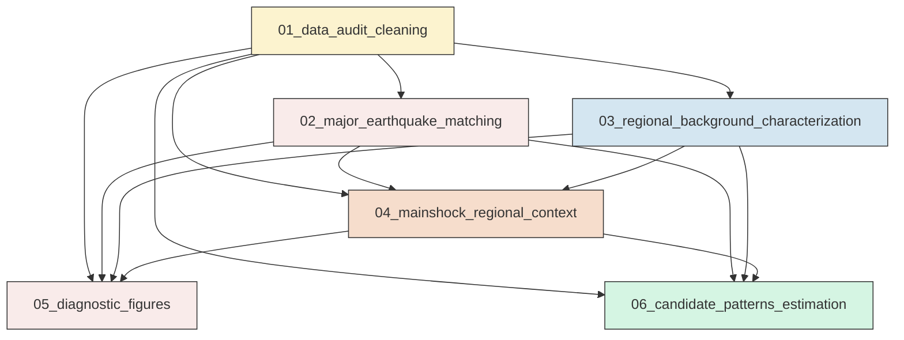
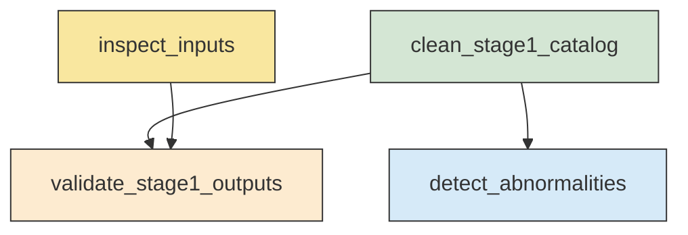
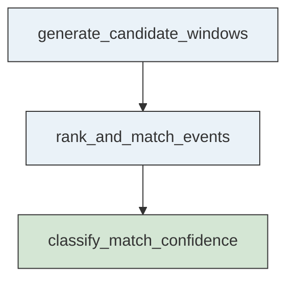
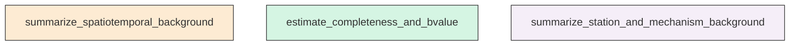
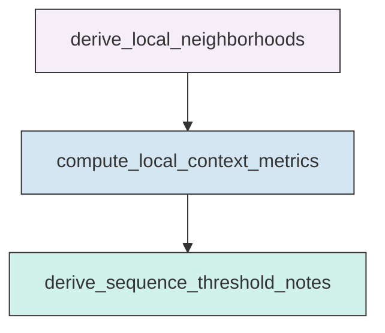
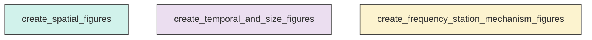
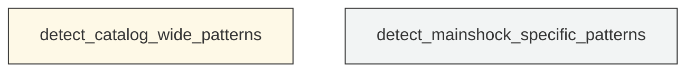

# Workflow Overview

## Top-Level Task Dependencies

**Description:**
- `01_data_audit_cleaning`: Audit all source files and build a validated Stage-1 cleaned regional catalog with quality flags.
- `02_major_earthquake_matching`: Match major earthquakes to the relocated catalog and quantify match confidence and differences.
- `03_regional_background_characterization`: Characterize regional seismicity background, station coverage, and mechanism availability from the cleaned catalog.
- `04_mainshock_regional_context`: Summarize local catalog, station, and mechanism context around each major earthquake.
- `05_diagnostic_figures`: Generate Nature-style high-resolution diagnostic figures for audit, background, and context analysis.
- `06_candidate_patterns_estimation`: Convert background and context results into ranked candidate patterns and follow-up analysis suggestions.

## Subtask Dependencies

#### 01_data_audit_cleaning
**Usage**: Audit all source files and build a validated Stage-1 cleaned regional catalog with quality flags.

**Description:**
- `inspect_inputs`: Inspect schemas, record counts, field names, and raw value ranges for all files.
- `clean_stage1_catalog`: Parse event time and harmonize core event fields into a validated cleaned table.
- `detect_abnormalities`: Flag missing, impossible, duplicate, and physically implausible records.
- `validate_stage1_outputs`: Confirm the cleaned catalog is non-empty and ready for downstream analyses.

#### 02_major_earthquake_matching
**Usage**: Match major earthquakes to the relocated catalog and quantify match confidence and differences.

**Description:**
- `generate_candidate_windows`: Build constrained candidate windows around each reference origin time.
- `rank_and_match_events`: Rank candidates by time, space, depth, and magnitude agreement and select best matches.
- `classify_match_confidence`: Assign confidence tiers based on uniqueness and multi-metric agreement.

#### 03_regional_background_characterization
**Usage**: Characterize regional seismicity background, station coverage, and mechanism availability from the cleaned catalog.

**Description:**
- `summarize_spatiotemporal_background`: Compute spatial density, temporal rate, magnitude distribution, and depth distribution summaries.
- `estimate_completeness_and_bvalue`: Estimate preliminary Mc and Gutenberg-Richter b-value from the cleaned catalog.
- `summarize_station_and_mechanism_background`: Assess station coverage and focal-mechanism availability and distribution.

#### 04_mainshock_regional_context
**Usage**: Summarize local catalog, station, and mechanism context around each major earthquake.

**Description:**
- `derive_local_neighborhoods`: Define reusable local neighborhoods around each matched mainshock.
- `compute_local_context_metrics`: Compare local event, depth, station, and mechanism context to the regional background.
- `derive_sequence_threshold_notes`: Produce candidate radius, depth, and magnitude screening notes for later sequence analysis.

#### 05_diagnostic_figures
**Usage**: Generate Nature-style high-resolution diagnostic figures for audit, background, and context analysis.

**Description:**
- `create_spatial_figures`: Plot regional earthquake, major earthquake, station, and focal-mechanism maps.
- `create_temporal_and_size_figures`: Plot time-magnitude, depth-time, and magnitude-depth diagnostics.
- `create_frequency_station_mechanism_figures`: Plot Mc, b-value, station coverage, and mechanism availability diagnostics.

#### 06_candidate_patterns_estimation
**Usage**: Convert background and context results into ranked candidate patterns and follow-up analysis suggestions.

**Description:**
- `detect_catalog_wide_patterns`: Identify spatial, temporal, depth, and magnitude-related candidate patterns across the region.
- `detect_mainshock_specific_patterns`: Compare each mainshock neighborhood with the regional background for event-specific hypotheses.