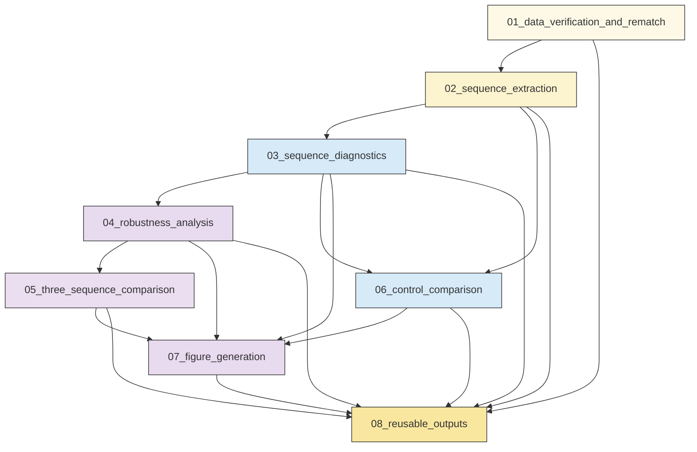
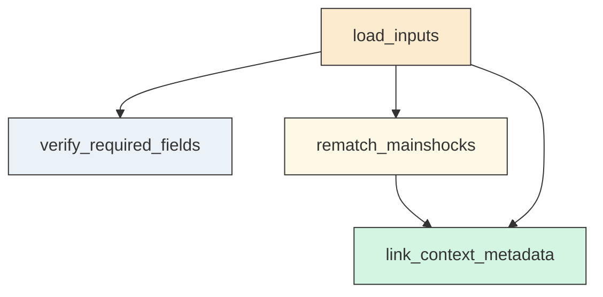
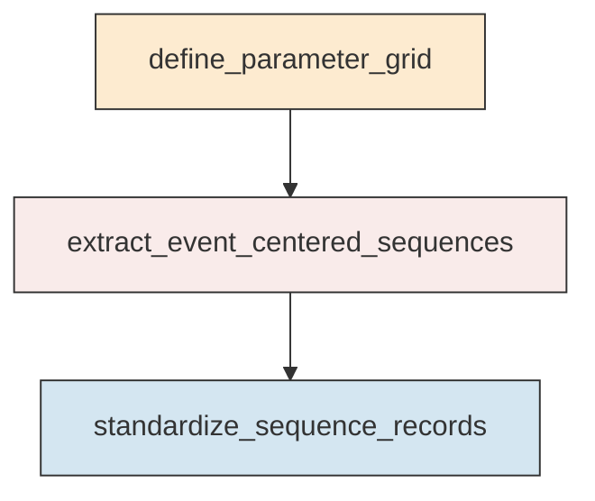
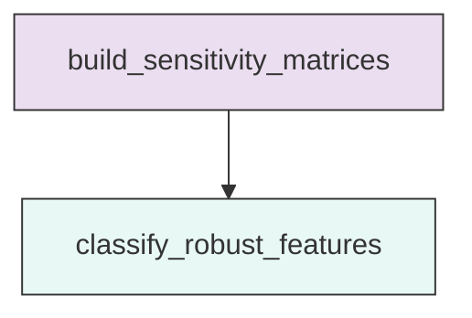
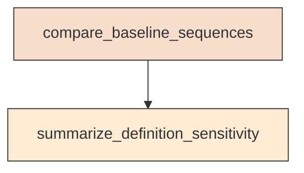
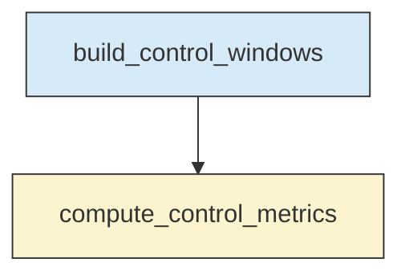
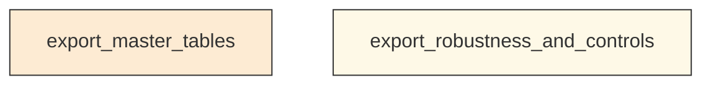

# Research Codings

## Task Overview


**Description:**
- `01_data_verification_and_rematch`: Validate source tables and rematch the three mainshocks to the relocated catalog.
- `02_sequence_extraction`: Extract event-centered sequences around each matched mainshock across the full parameter grid.
- `03_sequence_diagnostics`: Compute counts, rates, distributions, spatial patterns, and decay diagnostics for each sequence.
- `04_robustness_analysis`: Test which sequence features remain stable across alternative parameter definitions.
- `05_three_sequence_comparison`: Compare M1, M2, and M3 using a common baseline and then across alternate definitions.
- `06_control_comparison`: Evaluate observed sequence behavior against simple background or randomized controls.
- `07_figure_generation`: Generate publication-quality sequence-analysis figures for all mainshocks and comparisons.
- `08_reusable_outputs`: Export validated tables and figure-ready datasets for downstream reuse.


## Task Details


#### 01_data_verification_and_rematch
**Usage**: Validate source tables and rematch the three mainshocks to the relocated catalog.

**Description:**
- `load_inputs`: Read the catalog, mainshock, mechanism, and station tables.
- `verify_required_fields`: Check that sequence-analysis fields are present and usable.
- `rematch_mainshocks`: Match M1, M2, and M3 to relocated catalog events using tolerant time and location criteria.
- `link_context_metadata`: Summarize station and mechanism availability for downstream sequence analysis.

#### Coding Script

```python

from __future__ import annotations

import json
import math
import shutil
import sys
import traceback
from dataclasses import dataclass
from pathlib import Path
from typing import Dict, List, Optional, Tuple

import numpy as np
import pandas as pd


BASE_DIR = Path("<CASE_ROOT>/data")
OUTPUT_DIR = Path("<CASE_ROOT>/run/02_1_sequence_response/exp_run/outputs/01_data_verification_and_rematch")

CATALOG_PATH = BASE_DIR / "catalog/Snet_catalog_relocate.csv"
MAIN_PATH = BASE_DIR / "catalog/main_earthquake.csv"
MECHA_PATH = BASE_DIR / "source_mechanism/Snet_mecha.csv"
STATION_PATH = BASE_DIR / "stations/station.sta"

TIME_TOLERANCE_SEC = 3600.0  # allow relocation-induced shifts within 1 hour
MAX_CANDIDATES = 10
MATCH_DISTANCE_KM_SOFT = 80.0
OUTPUT_STALE_PATTERNS = [
    "*.csv",
    "*.json",
    "*.png",
    "*.jpg",
    "*.jpeg",
]


@dataclass
class MainshockMatch:
    label: str
    ref_datetime: pd.Timestamp
    ref_lat: float
    ref_lon: float
    ref_dep: float
    ref_mag: float
    matched_index: Optional[int]
    matched_datetime: Optional[pd.Timestamp]
    matched_lat: Optional[float]
    matched_lon: Optional[float]
    matched_dep: Optional[float]
    matched_mag: Optional[float]
    time_diff_sec: Optional[float]
    horizontal_distance_km: Optional[float]
    depth_diff_km: Optional[float]
    combined_score: Optional[float]
    n_close_candidates: int
    candidate_preview: str
    match_status: str


def log(msg: str) -> None:
    print(msg, flush=True)


def to_jsonable(value):
    if isinstance(value, pd.Timestamp):
        return value.isoformat()
    if isinstance(value, (np.integer, np.floating)):
        return value.item()
    if isinstance(value, (np.bool_,)):
        return bool(value)
    if isinstance(value, (np.ndarray,)):
        return value.tolist()
    return value


def haversine_km(lat1, lon1, lat2, lon2):
    lat1 = np.radians(lat1)
    lon1 = np.radians(lon1)
    lat2 = np.radians(lat2)
    lon2 = np.radians(lon2)
    dlat = lat2 - lat1
    dlon = lon2 - lon1
    a = np.sin(dlat / 2.0) ** 2 + np.cos(lat1) * np.cos(lat2) * np.sin(dlon / 2.0) ** 2
    return 2.0 * 6371.0 * np.arcsin(np.sqrt(a))


def parse_time_series(s: pd.Series) -> pd.Series:
    return pd.to_datetime(s, errors="coerce", utc=True)


def verify_catalog(df: pd.DataFrame, path: Path) -> Dict[str, object]:
    required = ["datetime", "lat", "lon", "dep", "mag"]
    missing = [c for c in required if c not in df.columns]
    out = {
        "path": str(path),
        "n_rows": int(len(df)),
        "columns": list(df.columns),
        "required_fields_present": len(missing) == 0,
        "missing_required_fields": missing,
        "time_parse_missing": int(df["datetime"].isna().sum()) if "datetime" in df.columns else None,
        "lat_missing": int(df["lat"].isna().sum()) if "lat" in df.columns else None,
        "lon_missing": int(df["lon"].isna().sum()) if "lon" in df.columns else None,
        "dep_missing": int(df["dep"].isna().sum()) if "dep" in df.columns else None,
        "mag_missing": int(df["mag"].isna().sum()) if "mag" in df.columns else None,
    }
    return out


def verify_main(df: pd.DataFrame, path: Path) -> Dict[str, object]:
    required = ["index", "datetime", "lat", "lon", "dep", "mag"]
    missing = [c for c in required if c not in df.columns]
    return {
        "path": str(path),
        "n_rows": int(len(df)),
        "columns": list(df.columns),
        "required_fields_present": len(missing) == 0,
        "missing_required_fields": missing,
    }


def verify_mecha(df: pd.DataFrame, path: Path) -> Dict[str, object]:
    required = ["event_code", "origin_time", "lat_deg", "lon_deg", "depth_km", "mag_1"]
    missing = [c for c in required if c not in df.columns]
    coverage_cols = [c for c in ["focal_mech_score", "n_mech_stations", "strike_plane1", "dip_plane1", "rake_plane1"] if c in df.columns]
    coverage = {}
    for c in coverage_cols:
        coverage[c] = int(df[c].notna().sum())
    return {
        "path": str(path),
        "n_rows": int(len(df)),
        "columns": list(df.columns),
        "required_fields_present": len(missing) == 0,
        "missing_required_fields": missing,
        "non_missing_counts": coverage,
    }


def verify_station(df: pd.DataFrame, path: Path) -> Dict[str, object]:
    required_any = ["station_code", "station_number", "latitude", "longitude"]
    missing = [c for c in required_any if c not in df.columns]
    return {
        "path": str(path),
        "n_rows": int(len(df)),
        "columns": list(df.columns),
        "required_fields_present": len(missing) == 0,
        "missing_required_fields": missing,
    }


def build_candidates(main_row: pd.Series, cat: pd.DataFrame) -> pd.DataFrame:
    dt_ref = main_row["datetime"]
    dt_diff = (cat["datetime"] - dt_ref).dt.total_seconds().abs()
    tmask = dt_diff <= TIME_TOLERANCE_SEC
    if not tmask.any():
        tmask = dt_diff <= 6 * 3600
    sub = cat.loc[tmask].copy()
    sub["time_diff_sec"] = (sub["datetime"] - dt_ref).dt.total_seconds()
    sub["abs_time_diff_sec"] = sub["time_diff_sec"].abs()
    sub["horizontal_distance_km"] = haversine_km(main_row["lat"], main_row["lon"], sub["lat"].to_numpy(), sub["lon"].to_numpy())
    sub["depth_diff_km"] = (sub["dep"] - main_row["dep"]).abs()
    sub["combined_score"] = sub["abs_time_diff_sec"] / 60.0 + sub["horizontal_distance_km"] + 0.2 * sub["depth_diff_km"]
    sub = sub.sort_values(["combined_score", "abs_time_diff_sec", "horizontal_distance_km", "depth_diff_km"])
    return sub


def match_mainshocks(main_df: pd.DataFrame, cat_df: pd.DataFrame) -> Tuple[pd.DataFrame, pd.DataFrame]:
    matches = []
    previews = []
    for _, row in main_df.iterrows():
        cands = build_candidates(row, cat_df)
        n_close = int(len(cands))
        best = cands.iloc[0] if len(cands) else None
        if best is not None:
            status = "matched" if (abs(best["time_diff_sec"]) <= TIME_TOLERANCE_SEC or best["horizontal_distance_km"] <= MATCH_DISTANCE_KM_SOFT) else "weak_match"
            preview_df = cands.head(MAX_CANDIDATES)[["datetime", "lat", "lon", "dep", "mag", "time_diff_sec", "horizontal_distance_km", "depth_diff_km", "combined_score"]].copy()
            previews.append({"mainshock": row["index"], "candidates_preview": preview_df.to_dict(orient="records")})
            matches.append(MainshockMatch(
                label=row["index"],
                ref_datetime=row["datetime"],
                ref_lat=float(row["lat"]),
                ref_lon=float(row["lon"]),
                ref_dep=float(row["dep"]),
                ref_mag=float(row["mag"]),
                matched_index=int(best.name),
                matched_datetime=best["datetime"],
                matched_lat=float(best["lat"]),
                matched_lon=float(best["lon"]),
                matched_dep=float(best["dep"]),
                matched_mag=float(best["mag"]),
                time_diff_sec=float(best["time_diff_sec"]),
                horizontal_distance_km=float(best["horizontal_distance_km"]),
                depth_diff_km=float(best["depth_diff_km"]),
                combined_score=float(best["combined_score"]),
                n_close_candidates=n_close,
                candidate_preview=json.dumps(
                    preview_df.applymap(to_jsonable).to_dict(orient="records"),
                    ensure_ascii=False,
                ),
                match_status=status,
            ))
        else:
            matches.append(MainshockMatch(
                label=row["index"], ref_datetime=row["datetime"], ref_lat=float(row["lat"]), ref_lon=float(row["lon"]), ref_dep=float(row["dep"]), ref_mag=float(row["mag"]),
                matched_index=None, matched_datetime=None, matched_lat=None, matched_lon=None, matched_dep=None, matched_mag=None,
                time_diff_sec=None, horizontal_distance_km=None, depth_diff_km=None, combined_score=None, n_close_candidates=0,
                candidate_preview="[]", match_status="unmatched",
            ))
    match_df = pd.DataFrame([m.__dict__ for m in matches])
    preview_df = pd.DataFrame(previews)
    return match_df, preview_df


def summarize_mecha_coverage(mecha_df: pd.DataFrame, match_df: pd.DataFrame) -> pd.DataFrame:
    if mecha_df.empty:
        return pd.DataFrame([
            {
                "mainshock": mr["label"],
                "mechanism_events_within_1day_50km": 0,
                "mechanism_events_within_7day_100km": 0,
                "available": False,
            }
            for _, mr in match_df.iterrows()
        ])
    mecha = mecha_df.copy()
    mecha["origin_time"] = parse_time_series(mecha["origin_time"])
    rows = []
    for _, mr in match_df.iterrows():
        if pd.isna(mr["matched_datetime"]):
            rows.append({"mainshock": mr["label"], "mechanism_events_within_1day_50km": 0, "mechanism_events_within_7day_100km": 0, "available": False})
            continue
        dt = mr["matched_datetime"]
        dts = (mecha["origin_time"] - dt).dt.total_seconds().abs()
        dist = haversine_km(mr["matched_lat"], mr["matched_lon"], mecha["lat_deg"].to_numpy(), mecha["lon_deg"].to_numpy())
        rows.append({
            "mainshock": mr["label"],
            "mechanism_events_within_1day_50km": int(((dts <= 86400) & (dist <= 50)).sum()),
            "mechanism_events_within_7day_100km": int(((dts <= 7 * 86400) & (dist <= 100)).sum()),
            "available": bool(len(mecha) > 0),
        })
    return pd.DataFrame(rows)


def summarize_station_coverage(sta_df: pd.DataFrame) -> pd.DataFrame:
    out = {
        "n_stations": int(len(sta_df)),
        "lat_min": float(sta_df["latitude"].min()) if "latitude" in sta_df.columns else np.nan,
        "lat_max": float(sta_df["latitude"].max()) if "latitude" in sta_df.columns else np.nan,
        "lon_min": float(sta_df["longitude"].min()) if "longitude" in sta_df.columns else np.nan,
        "lon_max": float(sta_df["longitude"].max()) if "longitude" in sta_df.columns else np.nan,
        "matched_true": int(sta_df["matched"].astype(str).str.lower().eq("true").sum()) if "matched" in sta_df.columns else None,
        "matched_false": int(sta_df["matched"].astype(str).str.lower().eq("false").sum()) if "matched" in sta_df.columns else None,
    }
    return pd.DataFrame([out])


def clean_output_dir() -> None:
    OUTPUT_DIR.mkdir(parents=True, exist_ok=True)
    removed = 0
    for pattern in OUTPUT_STALE_PATTERNS:
        for p in OUTPUT_DIR.glob(pattern):
            if p.is_file() or p.is_symlink():
                p.unlink()
                removed += 1
            elif p.is_dir():
                shutil.rmtree(p)
                removed += 1
    log(f"[0] Cleaned {removed} stale output artifacts in {OUTPUT_DIR}")


def main() -> None:
    clean_output_dir()
    log(f"[1] Reading inputs from {BASE_DIR}")

    cat = pd.read_csv(CATALOG_PATH)
    main_df = pd.read_csv(MAIN_PATH)
    mecha = pd.read_csv(MECHA_PATH)
    sta = pd.read_csv(STATION_PATH)

    cat["datetime"] = parse_time_series(cat["datetime"])
    main_df["datetime"] = parse_time_series(main_df["datetime"])
    mecha["origin_time"] = parse_time_series(mecha["origin_time"])
    if "matched" in sta.columns:
        sta["matched"] = sta["matched"].astype(str)

    log("[2] Verifying schema and basic field availability")
    verification = {
        "catalog": verify_catalog(cat, CATALOG_PATH),
        "main_earthquake": verify_main(main_df, MAIN_PATH),
        "mechanism": verify_mecha(mecha, MECHA_PATH),
        "stations": verify_station(sta, STATION_PATH),
    }

    log("[3] Rematching mainshocks to relocated catalog")
    match_df, candidate_preview_df = match_mainshocks(main_df, cat)
    mech_cov = summarize_mecha_coverage(mecha, match_df)
    station_cov = summarize_station_coverage(sta)

    # enrich with match deltas for direct comparison to the reference table
    match_df["time_diff_min"] = match_df["time_diff_sec"] / 60.0
    match_df["ref_time"] = match_df["ref_datetime"].astype(str)
    match_df["matched_time"] = match_df["matched_datetime"].astype(str)
    match_df["ref_location"] = match_df.apply(lambda r: f"{r['ref_lat']:.5f},{r['ref_lon']:.5f}", axis=1)
    match_df["matched_location"] = match_df.apply(lambda r: None if pd.isna(r["matched_lat"]) else f"{r['matched_lat']:.5f},{r['matched_lon']:.5f}", axis=1)
    required_post_cols = ["time_diff_min", "ref_time", "matched_time", "ref_location", "matched_location"]
    missing_post_cols = [c for c in required_post_cols if c not in match_df.columns]
    if missing_post_cols:
        raise RuntimeError(f"Match table missing expected downstream columns: {missing_post_cols}")

    # save outputs
    cat_audit_path = OUTPUT_DIR / "field_verification_catalog.json"
    main_audit_path = OUTPUT_DIR / "field_verification_main_earthquake.json"
    mecha_audit_path = OUTPUT_DIR / "field_verification_mechanism.json"
    station_audit_path = OUTPUT_DIR / "field_verification_stations.json"
    match_path = OUTPUT_DIR / "matched_mainshocks.csv"
    mech_cov_path = OUTPUT_DIR / "mechanism_coverage_summary.csv"
    station_cov_path = OUTPUT_DIR / "station_coverage_summary.csv"
    preview_path = OUTPUT_DIR / "mainshock_candidate_preview.json"
    verification_path = OUTPUT_DIR / "verification_summary.json"

    with open(cat_audit_path, "w", encoding="utf-8") as f:
        json.dump(verification["catalog"], f, indent=2, default=str)
    with open(main_audit_path, "w", encoding="utf-8") as f:
        json.dump(verification["main_earthquake"], f, indent=2, default=str)
    with open(mecha_audit_path, "w", encoding="utf-8") as f:
        json.dump(verification["mechanism"], f, indent=2, default=str)
    with open(station_audit_path, "w", encoding="utf-8") as f:
        json.dump(verification["stations"], f, indent=2, default=str)
    with open(preview_path, "w", encoding="utf-8") as f:
        json.dump(candidate_preview_df.applymap(to_jsonable).to_dict(orient="records"), f, indent=2, default=str)
    with open(verification_path, "w", encoding="utf-8") as f:
        json.dump({
            "inputs": verification,
            "n_mainshocks": int(len(main_df)),
            "n_catalog_events": int(len(cat)),
            "n_mechanism_events": int(len(mecha)),
            "n_stations": int(len(sta)),
            "match_status_counts": match_df["match_status"].value_counts(dropna=False).to_dict(),
        }, f, indent=2, default=str)

    match_df.to_csv(match_path, index=False)
    mech_cov.to_csv(mech_cov_path, index=False)
    station_cov.to_csv(station_cov_path, index=False)

    log(f"[4] Saved match table to {match_path}")
    log(f"[4] Saved verification outputs to {OUTPUT_DIR}")
    log("[5] Match summary:")
    log(match_df[["label", "matched_index", "time_diff_sec", "horizontal_distance_km", "depth_diff_km", "match_status"]].to_string(index=False))
    log("[5] Mechanism coverage summary:")
    log(mech_cov.to_string(index=False))
    log("[5] Station coverage summary:")
    log(station_cov.to_string(index=False))


if __name__ == "__main__":
    try:
        main()
    except Exception:
        print(traceback.format_exc(), file=sys.stderr)
        sys.exit(1)


```

#### 02_sequence_extraction
**Usage**: Extract event-centered sequences around each matched mainshock across the full parameter grid.

**Description:**
- `define_parameter_grid`: Set the spatial, temporal, depth, and magnitude definitions for extraction.
- `extract_event_centered_sequences`: Build event-centered subsets for all mainshocks and parameter combinations.
- `standardize_sequence_records`: Annotate each extracted event with relative time, distance, and parameter metadata.

#### Coding Script

```python

from __future__ import annotations

import json
import shutil
import sys
import traceback
from dataclasses import dataclass
from pathlib import Path
from typing import Dict, Optional, Tuple

import numpy as np
import pandas as pd


BASE_DIR = Path("<CASE_ROOT>/data")
OUTPUT_DIR = Path("<CASE_ROOT>/run/02_1_sequence_response/exp_run/outputs/02_sequence_extraction")

CATALOG_PATH = BASE_DIR / "catalog/Snet_catalog_relocate.csv"
MAIN_PATH = BASE_DIR / "catalog/main_earthquake.csv"
MECHA_PATH = BASE_DIR / "source_mechanism/Snet_mecha.csv"
STATION_PATH = BASE_DIR / "stations/station.sta"
MATCH_PATH = Path("<CASE_ROOT>/run/02_1_sequence_response/exp_run/outputs/01_data_verification_and_rematch/matched_mainshocks.csv")

RADII_KM = [30, 44, 50, 80, 100]
TIME_WINDOWS_DAYS = [7, 30, 60, 90]
DEPTH_STRATEGIES = ["all", "mainshock_window", "stratified"]
MAG_THRESHOLDS = [None, 1.2, 1.5, 2.0, 2.5]
MOVING_WINDOW_DAYS = 7.0
OMORI_MIN_POST_EVENTS = 12
OMORI_MIN_SPAN_DAYS = 14.0
OMORI_BINS = 24
OUTPUT_STALE_PATTERNS = ["*.csv", "*.json", "*.txt"]


@dataclass
class SequenceResult:
    mainshock: str
    radius_km: float
    time_window_days: float
    depth_strategy: str
    mag_threshold: Optional[float]
    n_total: int
    n_pre: int
    n_post: int
    duration_pre_days: float
    duration_post_days: float
    pre_rate: float
    post_rate: float
    rate_ratio: float
    moving_rate_max: float
    moving_rate_median: float
    post_omori_c: float
    post_omori_k: float
    post_omori_p: float
    post_omori_r2: float
    post_omori_fit_ok: bool
    radial_q25_km: float
    radial_q50_km: float
    radial_q75_km: float
    depth_q25_km: float
    depth_q50_km: float
    depth_q75_km: float
    mag_q25: float
    mag_q50: float
    mag_q75: float
    mecha_events: int
    mecha_available: bool


def log(msg: str) -> None:
    print(msg, flush=True)


def to_jsonable(value):
    if isinstance(value, pd.Timestamp):
        return value.isoformat()
    if isinstance(value, (np.integer, np.floating)):
        return value.item()
    if isinstance(value, (np.bool_,)):
        return bool(value)
    if isinstance(value, (np.ndarray,)):
        return value.tolist()
    return value


def clean_output_dir() -> None:
    OUTPUT_DIR.mkdir(parents=True, exist_ok=True)
    removed = 0
    for pattern in OUTPUT_STALE_PATTERNS:
        for p in OUTPUT_DIR.glob(pattern):
            if p.is_file() or p.is_symlink():
                p.unlink()
                removed += 1
            elif p.is_dir():
                shutil.rmtree(p)
                removed += 1
    log(f"[0] Cleaned {removed} stale artifacts in {OUTPUT_DIR}")


def parse_time(s: pd.Series) -> pd.Series:
    return pd.to_datetime(s, errors="coerce", utc=True)


def haversine_km(lat1, lon1, lat2, lon2):
    lat1 = np.radians(lat1)
    lon1 = np.radians(lon1)
    lat2 = np.radians(lat2)
    lon2 = np.radians(lon2)
    dlat = lat2 - lat1
    dlon = lon2 - lon1
    a = np.sin(dlat / 2.0) ** 2 + np.cos(lat1) * np.cos(lat2) * np.sin(dlon / 2.0) ** 2
    return 2.0 * 6371.0 * np.arcsin(np.sqrt(a))


def load_inputs() -> Tuple[pd.DataFrame, pd.DataFrame, pd.DataFrame, pd.DataFrame, pd.DataFrame]:
    cat = pd.read_csv(CATALOG_PATH)
    main = pd.read_csv(MAIN_PATH)
    mecha = pd.read_csv(MECHA_PATH)
    sta = pd.read_csv(STATION_PATH)
    match = pd.read_csv(MATCH_PATH)
    cat["datetime"] = parse_time(cat["datetime"])
    main["datetime"] = parse_time(main["datetime"])
    mecha["origin_time"] = parse_time(mecha["origin_time"])
    for col in ["matched_datetime", "ref_datetime"]:
        if col in match.columns:
            match[col] = parse_time(match[col])
    return cat, main, mecha, sta, match


def verify_required_fields(cat: pd.DataFrame, main: pd.DataFrame, mecha: pd.DataFrame, sta: pd.DataFrame, match: pd.DataFrame) -> Dict[str, object]:
    def present(df, cols):
        return [c for c in cols if c not in df.columns]

    return {
        "catalog": {"required": ["datetime", "lat", "lon", "dep", "mag"], "missing": present(cat, ["datetime", "lat", "lon", "dep", "mag"])},
        "main_earthquake": {"required": ["index", "datetime", "lat", "lon", "dep", "mag"], "missing": present(main, ["index", "datetime", "lat", "lon", "dep", "mag"])},
        "mechanism": {"required": ["origin_time", "lat_deg", "lon_deg", "depth_km"], "missing": present(mecha, ["origin_time", "lat_deg", "lon_deg", "depth_km"])},
        "stations": {"required": ["latitude", "longitude"], "missing": present(sta, ["latitude", "longitude"])},
        "matched_mainshocks": {"required": ["label", "matched_datetime", "matched_lat", "matched_lon", "matched_dep", "matched_mag"], "missing": present(match, ["label", "matched_datetime", "matched_lat", "matched_lon", "matched_dep", "matched_mag"])},
    }


def add_seq_coords(df: pd.DataFrame, mainshock_row: pd.Series) -> pd.DataFrame:
    out = df.copy()
    out["time_rel_days"] = (out["datetime"] - mainshock_row["matched_datetime"]).dt.total_seconds() / 86400.0
    out["time_rel_sec"] = (out["datetime"] - mainshock_row["matched_datetime"]).dt.total_seconds()
    out["radial_distance_km"] = haversine_km(mainshock_row["matched_lat"], mainshock_row["matched_lon"], out["lat"].to_numpy(), out["lon"].to_numpy())
    out["depth_rel_km"] = out["dep"] - float(mainshock_row["matched_dep"])
    out["abs_depth_rel_km"] = out["depth_rel_km"].abs()
    out["is_post"] = out["time_rel_days"] > 0
    out["is_pre"] = out["time_rel_days"] < 0
    return out


def depth_mask(df: pd.DataFrame, mainshock_row: pd.Series, strategy: str) -> pd.Series:
    if strategy == "all":
        return pd.Series(True, index=df.index)
    if strategy == "mainshock_window":
        center = float(mainshock_row["matched_dep"])
        width = max(20.0, 0.75 * max(center, 1.0))
        return (df["dep"] >= center - width) & (df["dep"] <= center + width)
    if strategy == "stratified":
        center = float(mainshock_row["matched_dep"])
        if center < 25:
            lo, hi = 0.0, 25.0
        elif center < 45:
            lo, hi = 25.0, 45.0
        else:
            lo, hi = 45.0, 80.0
        return (df["dep"] >= lo) & (df["dep"] < hi)
    raise ValueError(strategy)


def omori_fit(post_df: pd.DataFrame) -> Tuple[bool, float, float, float, float]:
    if len(post_df) < OMORI_MIN_POST_EVENTS:
        return False, np.nan, np.nan, np.nan, np.nan
    t = post_df["time_rel_days"].to_numpy()
    t = t[t > 0]
    if len(t) < OMORI_MIN_POST_EVENTS:
        return False, np.nan, np.nan, np.nan, np.nan
    span = t.max() - t.min()
    if span < OMORI_MIN_SPAN_DAYS:
        return False, np.nan, np.nan, np.nan, np.nan
    bins = np.logspace(np.log10(max(0.02, t.min())), np.log10(t.max() + 1e-6), OMORI_BINS)
    counts, edges = np.histogram(t, bins=bins)
    mids = np.sqrt(edges[:-1] * edges[1:])
    valid = counts > 0
    if valid.sum() < 4:
        return False, np.nan, np.nan, np.nan, np.nan
    x = np.log10(mids[valid])
    y = np.log10(counts[valid] / np.diff(edges)[valid])
    A = np.vstack([np.ones_like(x), -np.log10(mids[valid] + 1e-9)]).T
    coef, *_ = np.linalg.lstsq(A, y, rcond=None)
    intercept, p = coef
    yhat = A @ coef
    ss_res = float(np.sum((y - yhat) ** 2))
    ss_tot = float(np.sum((y - y.mean()) ** 2))
    r2 = 1.0 - ss_res / ss_tot if ss_tot > 0 else np.nan
    k = float(10 ** intercept)
    c = 0.01
    return True, c, k, float(p), float(r2)


def summarize_mecha_overlap(seq: pd.DataFrame, mecha: pd.DataFrame, mainshock_row: pd.Series) -> Tuple[int, bool]:
    if seq.empty or mecha.empty:
        return 0, False
    dts = (mecha["origin_time"] - mainshock_row["matched_datetime"]).dt.total_seconds().abs()
    dist = haversine_km(mainshock_row["matched_lat"], mainshock_row["matched_lon"], mecha["lat_deg"].to_numpy(), mecha["lon_deg"].to_numpy())
    mask = (dts <= 90 * 86400) & (dist <= 100)
    return int(mask.sum()), bool(mask.any())


def build_one_sequence(cat: pd.DataFrame, mecha: pd.DataFrame, mainshock_row: pd.Series, radius: float, tdays: float, depth_strategy: str, mag_thr: Optional[float]) -> Tuple[pd.DataFrame, SequenceResult]:
    seq = add_seq_coords(cat, mainshock_row)
    seq = seq[(seq["radial_distance_km"] <= radius) & (seq["time_rel_days"].abs() <= tdays)]
    seq = seq[depth_mask(seq, mainshock_row, depth_strategy)]
    if mag_thr is not None:
        seq = seq[seq["mag"] >= mag_thr]
    seq = seq.sort_values("datetime").reset_index(drop=True)
    pre = seq[seq["time_rel_days"] < 0]
    post = seq[seq["time_rel_days"] > 0]
    duration_pre = float(tdays)
    duration_post = float(tdays)
    pre_rate = float(len(pre) / duration_pre) if duration_pre > 0 else np.nan
    post_rate = float(len(post) / duration_post) if duration_post > 0 else np.nan
    rate_ratio = float(post_rate / pre_rate) if pre_rate and pre_rate > 0 else np.inf if post_rate > 0 else np.nan
    moving_window = max(1.0, MOVING_WINDOW_DAYS)
    moving_rates = []
    for center in np.arange(-tdays + moving_window / 2.0, tdays - moving_window / 2.0 + 1e-9, moving_window / 2.0):
        lo = center - moving_window / 2.0
        hi = center + moving_window / 2.0
        moving_rates.append(((seq["time_rel_days"] >= lo) & (seq["time_rel_days"] < hi)).sum() / moving_window)
    moving_rate_max = float(np.max(moving_rates)) if moving_rates else np.nan
    moving_rate_median = float(np.median(moving_rates)) if moving_rates else np.nan
    fit_ok, c, k, p, r2 = omori_fit(post)
    mecha_n, mecha_available = summarize_mecha_overlap(seq, mecha, mainshock_row)
    if len(seq):
        radial_q25, radial_q50, radial_q75 = np.nanpercentile(seq["radial_distance_km"], [25, 50, 75])
        depth_q25, depth_q50, depth_q75 = np.nanpercentile(seq["dep"], [25, 50, 75])
        mag_q25, mag_q50, mag_q75 = np.nanpercentile(seq["mag"], [25, 50, 75])
    else:
        radial_q25 = radial_q50 = radial_q75 = np.nan
        depth_q25 = depth_q50 = depth_q75 = np.nan
        mag_q25 = mag_q50 = mag_q75 = np.nan
    result = SequenceResult(
        mainshock=str(mainshock_row["label"]),
        radius_km=float(radius),
        time_window_days=float(tdays),
        depth_strategy=depth_strategy,
        mag_threshold=mag_thr if mag_thr is not None else np.nan,
        n_total=int(len(seq)),
        n_pre=int(len(pre)),
        n_post=int(len(post)),
        duration_pre_days=duration_pre,
        duration_post_days=duration_post,
        pre_rate=pre_rate,
        post_rate=post_rate,
        rate_ratio=rate_ratio,
        moving_rate_max=moving_rate_max,
        moving_rate_median=moving_rate_median,
        post_omori_c=c,
        post_omori_k=k,
        post_omori_p=p,
        post_omori_r2=r2,
        post_omori_fit_ok=fit_ok,
        radial_q25_km=float(radial_q25),
        radial_q50_km=float(radial_q50),
        radial_q75_km=float(radial_q75),
        depth_q25_km=float(depth_q25),
        depth_q50_km=float(depth_q50),
        depth_q75_km=float(depth_q75),
        mag_q25=float(mag_q25),
        mag_q50=float(mag_q50),
        mag_q75=float(mag_q75),
        mecha_events=mecha_n,
        mecha_available=mecha_available,
    )
    seq = seq.assign(mainshock=str(mainshock_row["label"]), radius_km=float(radius), time_window_days=float(tdays), depth_strategy=depth_strategy, mag_threshold=mag_thr)
    return seq, result


def main() -> None:
    clean_output_dir()
    log("[1] Reading catalog, mainshock match table, mechanism table, and station table")
    cat, main, mecha, sta, match = load_inputs()
    verification = verify_required_fields(cat, main, mecha, sta, match)

    if "matched_datetime" not in match.columns or match["matched_datetime"].isna().any():
        raise RuntimeError("Matched mainshock table is missing valid matched_datetime values; run task 01 first.")

    seq_tables = []
    summary_rows = []
    count_rows = []
    control_rows = []
    mainshock_seq_meta = []

    for _, mr in match.iterrows():
        label = str(mr["label"])
        log(f"[2] Building sequences for {label}")
        base_seq = add_seq_coords(cat, mr)
        base_seq = base_seq.sort_values("datetime").reset_index(drop=True)
        mainshock_seq_meta.append({
            "mainshock": label,
            "matched_index": int(mr["matched_index"]),
            "matched_datetime": mr["matched_datetime"],
            "matched_lat": float(mr["matched_lat"]),
            "matched_lon": float(mr["matched_lon"]),
            "matched_dep": float(mr["matched_dep"]),
            "matched_mag": float(mr["matched_mag"]),
            "n_catalog_events_total": int(len(base_seq)),
        })
        for radius in RADII_KM:
            for tdays in TIME_WINDOWS_DAYS:
                for depth_strategy in DEPTH_STRATEGIES:
                    for mag_thr in MAG_THRESHOLDS:
                        seq, res = build_one_sequence(cat, mecha, mr, radius, tdays, depth_strategy, mag_thr)
                        seq_tables.append(seq)
                        summary_rows.append(res.__dict__)
                        count_rows.append({
                            "mainshock": label,
                            "radius_km": radius,
                            "time_window_days": tdays,
                            "depth_strategy": depth_strategy,
                            "mag_threshold": np.nan if mag_thr is None else mag_thr,
                            "n_events": int(len(seq)),
                            "n_pre": int((seq["time_rel_days"] < 0).sum()),
                            "n_post": int((seq["time_rel_days"] > 0).sum()),
                            "has_post_omori_fit": bool(res.post_omori_fit_ok),
                        })
        # simple control: background window away from the mainshock, matching the same radius and duration
        shifted = add_seq_coords(cat, mr)
        control_lo = -240.0
        control_hi = -180.0
        control = shifted[(shifted["radial_distance_km"] <= 50) & (shifted["time_rel_days"] >= control_lo) & (shifted["time_rel_days"] < control_hi)]
        control_rows.append({"mainshock": label, "control_window_days": 60, "control_time_lo_days": control_lo, "control_time_hi_days": control_hi, "control_radius_km": 50, "control_n_events": int(len(control)), "control_rate_per_day": float(len(control) / 60.0)})

    seq_df = pd.concat(seq_tables, ignore_index=True) if seq_tables else pd.DataFrame()
    summary_df = pd.DataFrame(summary_rows)
    count_df = pd.DataFrame(count_rows)
    control_df = pd.DataFrame(control_rows)
    mainshock_meta_df = pd.DataFrame(mainshock_seq_meta)

    required_downstream = ["mainshock", "radius_km", "time_window_days", "depth_strategy", "mag_threshold", "time_rel_days", "radial_distance_km", "depth_rel_km"]
    missing = [c for c in required_downstream if c not in seq_df.columns]
    if missing:
        raise RuntimeError(f"Sequence table missing required downstream columns: {missing}")

    seq_path = OUTPUT_DIR / "event_centered_sequence_table.csv"
    summary_path = OUTPUT_DIR / "sequence_diagnostics_summary.csv"
    counts_path = OUTPUT_DIR / "sequence_extraction_counts.csv"
    control_path = OUTPUT_DIR / "sequence_control_comparison.csv"
    meta_path = OUTPUT_DIR / "mainshock_sequence_metadata.csv"
    verification_path = OUTPUT_DIR / "sequence_extraction_verification.json"

    seq_df.to_csv(seq_path, index=False)
    summary_df.to_csv(summary_path, index=False)
    count_df.to_csv(counts_path, index=False)
    control_df.to_csv(control_path, index=False)
    mainshock_meta_df.to_csv(meta_path, index=False)
    with open(verification_path, "w", encoding="utf-8") as f:
        json.dump({
            "inputs": verification,
            "n_mainshocks": int(len(match)),
            "n_sequences": int(len(seq_df)),
            "n_sequence_rows": int(len(summary_df)),
            "count_grid_size": int(len(count_df)),
            "control_rows": int(len(control_df)),
            "mainshocks": [to_jsonable(v) for v in mainshock_seq_meta],
            "parameter_grid": {
                "radii_km": RADII_KM,
                "time_windows_days": TIME_WINDOWS_DAYS,
                "depth_strategies": DEPTH_STRATEGIES,
                "mag_thresholds": MAG_THRESHOLDS,
                "moving_window_days": MOVING_WINDOW_DAYS,
            },
        }, f, indent=2, default=str)

    log(f"[3] Saved sequence table to {seq_path}")
    log(f"[3] Saved summary table to {summary_path}")
    log(f"[3] Saved count matrix to {counts_path}")
    log(f"[3] Saved control comparison to {control_path}")
    log(f"[3] Saved mainshock metadata to {meta_path}")
    log("[4] Sequence summary preview:")
    preview_cols = ["mainshock", "radius_km", "time_window_days", "depth_strategy", "mag_threshold", "n_total", "n_pre", "n_post", "rate_ratio", "post_omori_fit_ok", "post_omori_r2"]
    log(summary_df[preview_cols].head(15).to_string(index=False))


if __name__ == "__main__":
    try:
        main()
    except Exception:
        print(traceback.format_exc(), file=sys.stderr)
        sys.exit(1)


```

#### 03_sequence_diagnostics
**Usage**: Compute counts, rates, distributions, spatial patterns, and decay diagnostics for each sequence.

```mermaid
graph TD
    compute_count_metrics
    compute_rate_metrics
    compute_distribution_metrics
    fit_post_event_decay
    summarize_spatial_and_mechanism_context
    style compute_distribution_metrics fill:#f9ebea,stroke:#333,stroke-width:1px
    style compute_count_metrics fill:#f9ebea,stroke:#333,stroke-width:1px
    style compute_rate_metrics fill:#d1f2eb,stroke:#333,stroke-width:1px
    style fit_post_event_decay fill:#d1f2eb,stroke:#333,stroke-width:1px
    style summarize_spatial_and_mechanism_context fill:#d4e6f1,stroke:#333,stroke-width:1px
```

**Description:**
- `compute_count_metrics`: Calculate event counts and cumulative counts for each sequence window.
- `compute_rate_metrics`: Estimate moving-window seismicity rates and pre/post ratios.
- `compute_distribution_metrics`: Summarize magnitude and depth distributions plus radial and time-distance patterns.
- `fit_post_event_decay`: Fit simple Omori-style decay where the post-event window supports it.
- `summarize_spatial_and_mechanism_context`: Derive spatial concentration indicators and focal-mechanism availability summaries.

#### Coding Script

```python

from __future__ import annotations

import json
import math
import shutil
import sys
import traceback
from pathlib import Path
from typing import Dict, List, Optional, Tuple

import numpy as np
import pandas as pd


BASE_DIR = Path("<CASE_ROOT>/data")
STEP2_OUTPUT_DIR = Path(
    "<CASE_ROOT>/run/02_1_sequence_response/exp_run/outputs/02_sequence_extraction"
)
OUTPUT_DIR = Path(
    "<CASE_ROOT>/run/02_1_sequence_response/exp_run/outputs/03_sequence_diagnostics"
)

SEQ_PATH = STEP2_OUTPUT_DIR / "event_centered_sequence_table.csv"
SUMMARY_PATH = STEP2_OUTPUT_DIR / "sequence_diagnostics_summary.csv"
COUNTS_PATH = STEP2_OUTPUT_DIR / "sequence_extraction_counts.csv"
CONTROL_PATH = STEP2_OUTPUT_DIR / "sequence_control_comparison.csv"
META_PATH = STEP2_OUTPUT_DIR / "mainshock_sequence_metadata.csv"
VERIFICATION_PATH = STEP2_OUTPUT_DIR / "sequence_extraction_verification.json"
MECHA_PATH = BASE_DIR / "source_mechanism/Snet_mecha.csv"
STATION_PATH = BASE_DIR / "stations/station.sta"
CATALOG_PATH = BASE_DIR / "catalog/Snet_catalog_relocate.csv"
MAIN_PATH = BASE_DIR / "catalog/main_earthquake.csv"

SUMMARY_CSV = OUTPUT_DIR / "sequence_diagnostics_metrics.csv"
WINDOW_CSV = OUTPUT_DIR / "time_binned_rates.csv"
RADIAL_CSV = OUTPUT_DIR / "radial_distance_summary.csv"
DEPTH_CSV = OUTPUT_DIR / "depth_distribution_summary.csv"
MAG_CSV = OUTPUT_DIR / "magnitude_distribution_summary.csv"
MECHA_CSV = OUTPUT_DIR / "mechanism_overlap_summary.csv"
ROBUSTNESS_CSV = OUTPUT_DIR / "robustness_summary.csv"
COMPARISON_CSV = OUTPUT_DIR / "three_sequence_comparison.csv"
CONTROL_SUMMARY_CSV = OUTPUT_DIR / "control_summary.csv"
FIG_DATA_DIR = OUTPUT_DIR / "figure_data"

RADIUS_FOCUS = 50.0
TIME_FOCUS_DAYS = 90.0
MAG_THRESHOLDS = [None, 1.2, 1.5, 2.0, 2.5]
MOVING_WINDOW_DAYS = 7.0
RATE_BIN_DAYS = 1.0
OMORI_MIN_POST_EVENTS = 12
OMORI_MIN_SPAN_DAYS = 14.0
OMORI_BINS = 24
DEPTH_BINS = np.array([0, 10, 20, 30, 40, 50, 80, 120], dtype=float)


def log(msg: str) -> None:
    print(msg, flush=True)


def to_jsonable(value):
    if isinstance(value, pd.Timestamp):
        return value.isoformat()
    if isinstance(value, (np.integer, np.floating)):
        return value.item()
    if isinstance(value, (np.bool_,)):
        return bool(value)
    if isinstance(value, np.ndarray):
        return value.tolist()
    if isinstance(value, (pd.Series, pd.Index)):
        return value.tolist()
    if pd.isna(value):
        return None
    return value


def clean_output_dir() -> None:
    OUTPUT_DIR.mkdir(parents=True, exist_ok=True)
    FIG_DATA_DIR.mkdir(parents=True, exist_ok=True)
    removed = 0
    for pattern in ["*.csv", "*.json", "*.txt", "*.png"]:
        for p in OUTPUT_DIR.glob(pattern):
            if p.is_file() or p.is_symlink():
                p.unlink()
                removed += 1
            elif p.is_dir():
                shutil.rmtree(p)
                removed += 1
    for p in FIG_DATA_DIR.glob("*"):
        if p.is_file() or p.is_symlink():
            p.unlink()
            removed += 1
        elif p.is_dir():
            shutil.rmtree(p)
            removed += 1
    log(f"[0] Cleaned {removed} stale artifacts in {OUTPUT_DIR}")


def parse_time(s: pd.Series) -> pd.Series:
    return pd.to_datetime(s, errors="coerce", utc=True)


def haversine_km(lat1, lon1, lat2, lon2):
    lat1 = np.radians(lat1)
    lon1 = np.radians(lon1)
    lat2 = np.radians(lat2)
    lon2 = np.radians(lon2)
    dlat = lat2 - lat1
    dlon = lon2 - lon1
    a = np.sin(dlat / 2.0) ** 2 + np.cos(lat1) * np.cos(lat2) * np.sin(dlon / 2.0) ** 2
    return 2.0 * 6371.0 * np.arcsin(np.sqrt(a))


def load_inputs():
    seq = pd.read_csv(SEQ_PATH)
    summary = pd.read_csv(SUMMARY_PATH)
    counts = pd.read_csv(COUNTS_PATH)
    control = pd.read_csv(CONTROL_PATH)
    meta = pd.read_csv(META_PATH)
    with open(VERIFICATION_PATH, "r", encoding="utf-8") as f:
        verification = json.load(f)
    mecha = pd.read_csv(MECHA_PATH)
    station = pd.read_csv(STATION_PATH, sep=None, engine="python")
    catalog = pd.read_csv(CATALOG_PATH)
    main = pd.read_csv(MAIN_PATH)

    seq["datetime"] = parse_time(seq["datetime"])
    for col in ["matched_datetime"]:
        if col in meta.columns:
            meta[col] = parse_time(meta[col])
    mecha["origin_time"] = parse_time(mecha["origin_time"])
    for df in [catalog, main]:
        if "datetime" in df.columns:
            df["datetime"] = parse_time(df["datetime"])
    return seq, summary, counts, control, meta, verification, mecha, station, catalog, main


def require_columns(df: pd.DataFrame, required: List[str], name: str) -> None:
    missing = [c for c in required if c not in df.columns]
    if missing:
        raise RuntimeError(f"{name} missing required columns: {missing}")


def mechanism_flag_column(mecha: pd.DataFrame) -> str:
    for candidate in ["quality", "mech_flag", "available", "flag", "status"]:
        if candidate in mecha.columns:
            return candidate
    return ""


def summarize_mecha(seq: pd.DataFrame, mecha: pd.DataFrame, mainshock_row: pd.Series) -> Dict[str, object]:
    if seq.empty or mecha.empty:
        return {"mecha_overlap_count": 0, "mecha_available": False, "mecha_quality_mode": None}
    dt_days = (mecha["origin_time"] - mainshock_row["matched_datetime"]).dt.total_seconds().abs() / 86400.0
    dist_km = haversine_km(
        float(mainshock_row["matched_lat"]),
        float(mainshock_row["matched_lon"]),
        mecha["lat_deg"].to_numpy(),
        mecha["lon_deg"].to_numpy(),
    )
    mask = (dt_days <= 90.0) & (dist_km <= 100.0)
    flag_col = mechanism_flag_column(mecha)
    quality_mode = None
    if flag_col and mask.any():
        vals = mecha.loc[mask, flag_col].astype(str).value_counts()
        quality_mode = vals.index[0]
    return {
        "mecha_overlap_count": int(mask.sum()),
        "mecha_available": bool(mask.any()),
        "mecha_quality_mode": quality_mode,
    }


def summarize_station_coverage(station: pd.DataFrame, mainshock_row: pd.Series) -> Dict[str, object]:
    lat_col = "latitude" if "latitude" in station.columns else "lat" if "lat" in station.columns else None
    lon_col = "longitude" if "longitude" in station.columns else "lon" if "lon" in station.columns else None
    if lat_col is None or lon_col is None:
        return {"station_count": int(len(station)), "stations_within_100km": None, "stations_within_200km": None}
    dist = haversine_km(float(mainshock_row["matched_lat"]), float(mainshock_row["matched_lon"]), station[lat_col].to_numpy(), station[lon_col].to_numpy())
    return {
        "station_count": int(len(station)),
        "stations_within_100km": int(np.sum(dist <= 100.0)),
        "stations_within_200km": int(np.sum(dist <= 200.0)),
    }


def add_window_columns(seq: pd.DataFrame) -> pd.DataFrame:
    out = seq.copy()
    out["pre_post"] = np.where(out["time_rel_days"] < 0, "pre", np.where(out["time_rel_days"] > 0, "post", "at_mainshock"))
    out["abs_time_rel_days"] = out["time_rel_days"].abs()
    out["depth_bin"] = pd.cut(out["dep"], bins=DEPTH_BINS, right=False, include_lowest=True)
    return out


def omori_fit(post_df: pd.DataFrame) -> Dict[str, object]:
    if len(post_df) < OMORI_MIN_POST_EVENTS:
        return {"fit_ok": False, "c": np.nan, "k": np.nan, "p": np.nan, "r2": np.nan, "n_fit": int(len(post_df))}
    t = post_df["time_rel_days"].to_numpy()
    t = t[t > 0]
    if len(t) < OMORI_MIN_POST_EVENTS:
        return {"fit_ok": False, "c": np.nan, "k": np.nan, "p": np.nan, "r2": np.nan, "n_fit": int(len(t))}
    if (t.max() - t.min()) < OMORI_MIN_SPAN_DAYS:
        return {"fit_ok": False, "c": np.nan, "k": np.nan, "p": np.nan, "r2": np.nan, "n_fit": int(len(t))}
    lo = max(0.02, float(np.nanmin(t)))
    hi = float(np.nanmax(t) + 1e-6)
    bins = np.logspace(np.log10(lo), np.log10(hi), OMORI_BINS)
    counts, edges = np.histogram(t, bins=bins)
    mids = np.sqrt(edges[:-1] * edges[1:])
    valid = counts > 0
    if valid.sum() < 4:
        return {"fit_ok": False, "c": np.nan, "k": np.nan, "p": np.nan, "r2": np.nan, "n_fit": int(len(t))}
    x = np.log10(mids[valid])
    y = np.log10(counts[valid] / np.diff(edges)[valid])
    A = np.vstack([np.ones_like(x), -np.log10(mids[valid] + 1e-9)]).T
    coef, *_ = np.linalg.lstsq(A, y, rcond=None)
    intercept, p = coef
    yhat = A @ coef
    ss_res = float(np.sum((y - yhat) ** 2))
    ss_tot = float(np.sum((y - y.mean()) ** 2))
    r2 = 1.0 - ss_res / ss_tot if ss_tot > 0 else np.nan
    return {"fit_ok": True, "c": 0.01, "k": float(10**intercept), "p": float(p), "r2": float(r2), "n_fit": int(len(t))}


def count_rate_bins(seq: pd.DataFrame, bin_days: float) -> pd.DataFrame:
    if seq.empty:
        return pd.DataFrame(columns=["time_bin_start_days", "time_bin_end_days", "count", "rate_per_day", "pre_post"])
    lo = math.floor(seq["time_rel_days"].min() / bin_days) * bin_days
    hi = math.ceil(seq["time_rel_days"].max() / bin_days) * bin_days
    edges = np.arange(lo, hi + bin_days, bin_days)
    if len(edges) < 2:
        edges = np.array([lo, lo + bin_days])
    cats = pd.cut(seq["time_rel_days"], bins=edges, right=False, include_lowest=True)
    grouped = seq.groupby(cats, observed=True).size().reset_index(name="count")
    grouped["time_bin_start_days"] = grouped["time_rel_days"].apply(lambda x: float(x.left))
    grouped["time_bin_end_days"] = grouped["time_rel_days"].apply(lambda x: float(x.right))
    grouped["rate_per_day"] = grouped["count"] / bin_days
    grouped["pre_post"] = np.where(
        grouped["time_bin_end_days"].to_numpy(dtype=float) <= 0,
        "pre",
        np.where(grouped["time_bin_start_days"].to_numpy(dtype=float) >= 0, "post", "crosses_mainshock"),
    )
    return grouped[["time_bin_start_days", "time_bin_end_days", "count", "rate_per_day", "pre_post"]]


def summarize_distributions(seq: pd.DataFrame, mainshock: str, radius: float, tdays: float, depth_strategy: str, mag_threshold) -> Dict[str, Dict[str, object]]:
    out = {}
    if seq.empty:
        return out
    bins_mag = np.arange(max(0.0, np.floor(seq["mag"].min() * 2) / 2), np.ceil(seq["mag"].max() * 2) / 2 + 0.25, 0.25)
    if len(bins_mag) < 2:
        bins_mag = np.array([seq["mag"].min(), seq["mag"].max() + 0.1])
    mag_hist = np.histogram(seq["mag"], bins=bins_mag)
    depth_hist = np.histogram(seq["dep"], bins=DEPTH_BINS)
    radial_bins = np.arange(0, max(radius, float(seq["radial_distance_km"].max())) + 5.0, 5.0)
    radial_hist = np.histogram(seq["radial_distance_km"], bins=radial_bins)
    for name, hist, edges in [
        ("magnitude", mag_hist, bins_mag),
        ("depth", depth_hist, DEPTH_BINS),
        ("radial", radial_hist, radial_bins),
    ]:
        counts, e = hist
        out[name] = {
            "mainshock": mainshock,
            "radius_km": radius,
            "time_window_days": tdays,
            "depth_strategy": depth_strategy,
            "mag_threshold": np.nan if mag_threshold is None else mag_threshold,
            "bin_left": e[:-1].tolist(),
            "bin_right": e[1:].tolist(),
            "count": counts.astype(int).tolist(),
            "fraction": (counts / counts.sum()).tolist() if counts.sum() > 0 else [np.nan] * len(counts),
        }
    return out


def summarize_sequence(seq: pd.DataFrame, summary_row: pd.Series, mecha: pd.DataFrame, station: pd.DataFrame, mainshock_row: pd.Series) -> Dict[str, object]:
    pre = seq[seq["time_rel_days"] < 0]
    post = seq[seq["time_rel_days"] > 0]
    duration_pre = float(summary_row["duration_pre_days"])
    duration_post = float(summary_row["duration_post_days"])
    pre_rate = float(len(pre) / duration_pre) if duration_pre > 0 else np.nan
    post_rate = float(len(post) / duration_post) if duration_post > 0 else np.nan
    rate_ratio = float(post_rate / pre_rate) if pre_rate and pre_rate > 0 else np.nan
    moving = count_rate_bins(seq, RATE_BIN_DAYS)
    omori = omori_fit(post)
    mecha_info = summarize_mecha(seq, mecha, mainshock_row)
    station_info = summarize_station_coverage(station, mainshock_row)
    if len(seq):
        radial_q25, radial_q50, radial_q75 = np.nanpercentile(seq["radial_distance_km"], [25, 50, 75])
        depth_q25, depth_q50, depth_q75 = np.nanpercentile(seq["dep"], [25, 50, 75])
        mag_q25, mag_q50, mag_q75 = np.nanpercentile(seq["mag"], [25, 50, 75])
    else:
        radial_q25 = radial_q50 = radial_q75 = np.nan
        depth_q25 = depth_q50 = depth_q75 = np.nan
        mag_q25 = mag_q50 = mag_q75 = np.nan
    spread = float(seq["radial_distance_km"].quantile(0.75) - seq["radial_distance_km"].quantile(0.25)) if len(seq) else np.nan
    depth_spread = float(seq["dep"].quantile(0.75) - seq["dep"].quantile(0.25)) if len(seq) else np.nan
    return {
        "mainshock": summary_row["mainshock"],
        "radius_km": float(summary_row["radius_km"]),
        "time_window_days": float(summary_row["time_window_days"]),
        "depth_strategy": summary_row["depth_strategy"],
        "mag_threshold": summary_row["mag_threshold"],
        "n_total": int(len(seq)),
        "n_pre": int(len(pre)),
        "n_post": int(len(post)),
        "pre_rate": pre_rate,
        "post_rate": post_rate,
        "rate_ratio": rate_ratio,
        "pre_post_balance": float((len(post) - len(pre)) / len(seq)) if len(seq) else np.nan,
        "moving_rate_max": float(moving["rate_per_day"].max()) if len(moving) else np.nan,
        "moving_rate_median": float(moving["rate_per_day"].median()) if len(moving) else np.nan,
        "moving_rate_cv": float(moving["rate_per_day"].std(ddof=0) / moving["rate_per_day"].mean()) if len(moving) and moving["rate_per_day"].mean() > 0 else np.nan,
        "post_omori_c": omori["c"],
        "post_omori_k": omori["k"],
        "post_omori_p": omori["p"],
        "post_omori_r2": omori["r2"],
        "post_omori_fit_ok": omori["fit_ok"],
        "radial_q25_km": float(radial_q25),
        "radial_q50_km": float(radial_q50),
        "radial_q75_km": float(radial_q75),
        "depth_q25_km": float(depth_q25),
        "depth_q50_km": float(depth_q50),
        "depth_q75_km": float(depth_q75),
        "mag_q25": float(mag_q25),
        "mag_q50": float(mag_q50),
        "mag_q75": float(mag_q75),
        "radial_iqr_km": spread,
        "depth_iqr_km": depth_spread,
        "mecha_overlap_count": mecha_info["mecha_overlap_count"],
        "mecha_available": mecha_info["mecha_available"],
        "mecha_quality_mode": mecha_info["mecha_quality_mode"],
        "station_count": station_info["station_count"],
        "stations_within_100km": station_info["stations_within_100km"],
        "stations_within_200km": station_info["stations_within_200km"],
        "pre_post_duration_ratio": float(duration_post / duration_pre) if duration_pre > 0 else np.nan,
    }


def sequence_key(row: pd.Series) -> Tuple:
    return (row["mainshock"], float(row["radius_km"]), float(row["time_window_days"]), row["depth_strategy"], np.nan if pd.isna(row["mag_threshold"]) else float(row["mag_threshold"]))


def build_robustness(summary: pd.DataFrame) -> pd.DataFrame:
    rows = []
    for mainshock, sdf in summary.groupby("mainshock"):
        if sdf.empty:
            continue
        baseline = sdf[(sdf["radius_km"] == RADIUS_FOCUS) & (sdf["time_window_days"] == TIME_FOCUS_DAYS) & (sdf["depth_strategy"] == "all") & (sdf["mag_threshold"].isna())]
        if baseline.empty:
            baseline = sdf.iloc[[0]]
        base = baseline.iloc[0]
        for metric in ["rate_ratio", "moving_rate_max", "post_omori_p", "radial_iqr_km", "depth_iqr_km"]:
            if metric not in sdf.columns:
                continue
            vals = sdf[metric].dropna()
            if len(vals) == 0:
                continue
            rows.append({
                "mainshock": mainshock,
                "metric": metric,
                "baseline_value": float(base[metric]) if metric in base.index and pd.notna(base[metric]) else np.nan,
                "median_value": float(vals.median()),
                "iqr_value": float(vals.quantile(0.75) - vals.quantile(0.25)),
                "cv_value": float(vals.std(ddof=0) / vals.mean()) if vals.mean() != 0 else np.nan,
                "sign_stable_fraction": float((np.sign(vals) == np.sign(base[metric])).mean()) if metric in base.index and pd.notna(base[metric]) and base[metric] != 0 else np.nan,
                "n_windows": int(len(vals)),
            })
    return pd.DataFrame(rows)


def build_three_sequence_comparison(summary: pd.DataFrame) -> pd.DataFrame:
    baseline = summary[(summary["radius_km"] == RADIUS_FOCUS) & (summary["time_window_days"] == TIME_FOCUS_DAYS) & (summary["depth_strategy"] == "all") & (summary["mag_threshold"].isna())].copy()
    if baseline.empty:
        baseline = summary.copy()
    metrics = [
        "n_total",
        "n_pre",
        "n_post",
        "pre_rate",
        "post_rate",
        "rate_ratio",
        "moving_rate_max",
        "moving_rate_median",
        "post_omori_p",
        "post_omori_r2",
        "radial_q50_km",
        "depth_q50_km",
        "mag_q50",
        "mecha_overlap_count",
        "stations_within_100km",
    ]
    rows = []
    for mainshock, g in baseline.groupby("mainshock"):
        row = {"mainshock": mainshock}
        one = g.iloc[0]
        for m in metrics:
            row[m] = one[m] if m in one.index else np.nan
        row["burstiness_index"] = one["moving_rate_max"] / one["moving_rate_median"] if "moving_rate_median" in one.index and one["moving_rate_median"] and one["moving_rate_median"] > 0 else np.nan
        row["pre_post_balance"] = one["pre_post_balance"] if "pre_post_balance" in one.index else np.nan
        rows.append(row)
    return pd.DataFrame(rows)


def save_distribution_tables(summary: pd.DataFrame, seq: pd.DataFrame) -> None:
    mag_rows = []
    depth_rows = []
    radial_rows = []
    for _, row in summary.iterrows():
        mask = (
            (seq["mainshock"] == row["mainshock"]) &
            (seq["radius_km"] == row["radius_km"]) &
            (seq["time_window_days"] == row["time_window_days"]) &
            (seq["depth_strategy"] == row["depth_strategy"]) &
            (seq["mag_threshold"].fillna(-9999) == (row["mag_threshold"] if pd.notna(row["mag_threshold"]) else -9999))
        )
        sdf = seq.loc[mask]
        if sdf.empty:
            continue
        mag_edges = np.arange(max(0.0, np.floor(sdf["mag"].min() * 2) / 2), np.ceil(sdf["mag"].max() * 2) / 2 + 0.25, 0.25)
        if len(mag_edges) < 2:
            mag_edges = np.array([sdf["mag"].min(), sdf["mag"].max() + 0.1])
        depth_edges = DEPTH_BINS
        radial_edges = np.arange(0, max(float(row["radius_km"]), float(sdf["radial_distance_km"].max())) + 5.0, 5.0)
        for name, edges, data, store in [
            ("mag", mag_edges, sdf["mag"], mag_rows),
            ("depth", depth_edges, sdf["dep"], depth_rows),
            ("radial", radial_edges, sdf["radial_distance_km"], radial_rows),
        ]:
            counts, _ = np.histogram(data, bins=edges)
            for i in range(len(edges) - 1):
                store.append({
                    "mainshock": row["mainshock"],
                    "radius_km": row["radius_km"],
                    "time_window_days": row["time_window_days"],
                    "depth_strategy": row["depth_strategy"],
                    "mag_threshold": row["mag_threshold"],
                    "distribution": name,
                    "bin_left": float(edges[i]),
                    "bin_right": float(edges[i + 1]),
                    "count": int(counts[i]),
                    "fraction": float(counts[i] / counts.sum()) if counts.sum() > 0 else np.nan,
                })
    pd.DataFrame(mag_rows).to_csv(MAG_CSV, index=False)
    pd.DataFrame(depth_rows).to_csv(DEPTH_CSV, index=False)
    pd.DataFrame(radial_rows).to_csv(RADIAL_CSV, index=False)


def save_window_rates(seq: pd.DataFrame) -> pd.DataFrame:
    rows = []
    for key, sdf in seq.groupby(["mainshock", "radius_km", "time_window_days", "depth_strategy", "mag_threshold"], dropna=False):
        binned = count_rate_bins(sdf, RATE_BIN_DAYS)
        if binned.empty:
            continue
        for _, r in binned.iterrows():
            rows.append({
                "mainshock": key[0],
                "radius_km": key[1],
                "time_window_days": key[2],
                "depth_strategy": key[3],
                "mag_threshold": key[4],
                **r.to_dict(),
            })
    df = pd.DataFrame(rows)
    df.to_csv(WINDOW_CSV, index=False)
    return df


def save_mecha_summary(seq: pd.DataFrame, mecha: pd.DataFrame, meta: pd.DataFrame) -> pd.DataFrame:
    rows = []
    for _, mr in meta.iterrows():
        for _, row in seq[seq["mainshock"] == mr["mainshock"]].groupby(["radius_km", "time_window_days", "depth_strategy", "mag_threshold"], dropna=False):
            sdf = row
            info = summarize_mecha(sdf, mecha, mr)
            rows.append({"mainshock": mr["mainshock"], "radius_km": sdf["radius_km"].iloc[0], "time_window_days": sdf["time_window_days"].iloc[0], "depth_strategy": sdf["depth_strategy"].iloc[0], "mag_threshold": sdf["mag_threshold"].iloc[0], **info})
    out = pd.DataFrame(rows)
    out.to_csv(MECHA_CSV, index=False)
    return out


def save_control_summary(control: pd.DataFrame, summary: pd.DataFrame) -> pd.DataFrame:
    base = summary[(summary["radius_km"] == RADIUS_FOCUS) & (summary["time_window_days"] == 60.0) & (summary["depth_strategy"] == "all") & (summary["mag_threshold"].isna())]
    rows = []
    for _, row in control.iterrows():
        ref = base[base["mainshock"] == row["mainshock"]]
        if ref.empty:
            ref = summary[summary["mainshock"] == row["mainshock"]].iloc[[0]]
        ref = ref.iloc[0]
        rows.append({
            **row.to_dict(),
            "baseline_n_total": int(ref["n_total"]),
            "baseline_pre_rate": float(ref["pre_rate"]),
            "baseline_post_rate": float(ref["post_rate"]),
            "baseline_rate_ratio": float(ref["rate_ratio"]),
            "relative_control_rate": float(row["control_rate_per_day"] / ref["pre_rate"]) if ref["pre_rate"] > 0 else np.nan,
        })
    out = pd.DataFrame(rows)
    out.to_csv(CONTROL_SUMMARY_CSV, index=False)
    return out


def save_figure_data(seq: pd.DataFrame, summary: pd.DataFrame, control: pd.DataFrame) -> None:
    for mainshock, sdf in seq.groupby("mainshock"):
        sdf.to_csv(FIG_DATA_DIR / f"{mainshock}_event_centered_subset.csv", index=False)
    summary.to_csv(FIG_DATA_DIR / "all_sequence_summary.csv", index=False)
    control.to_csv(FIG_DATA_DIR / "control_table.csv", index=False)


def main() -> None:
    clean_output_dir()
    log("[1] Loading extraction outputs and source metadata")
    seq, summary, counts, control, meta, verification, mecha, station, catalog, main = load_inputs()
    require_columns(seq, ["mainshock", "radius_km", "time_window_days", "depth_strategy", "mag_threshold", "time_rel_days", "radial_distance_km", "dep", "mag"], "event_centered_sequence_table")
    require_columns(summary, ["mainshock", "radius_km", "time_window_days", "depth_strategy", "mag_threshold", "n_total", "n_pre", "n_post"], "sequence_diagnostics_summary")
    require_columns(meta, ["mainshock", "matched_datetime", "matched_lat", "matched_lon", "matched_dep", "matched_mag"], "mainshock_sequence_metadata")

    seq = add_window_columns(seq)
    summary = summary.copy()
    summary["mag_threshold"] = summary["mag_threshold"].where(~pd.isna(summary["mag_threshold"]), np.nan)
    counts = counts.copy()
    control = control.copy()

    # Some source-context columns for interpretation
    mecha_summary_rows = []
    for _, mr in meta.iterrows():
        mr_seq = seq[(seq["mainshock"] == mr["mainshock"]) & (seq["radius_km"] == RADIUS_FOCUS) & (seq["time_window_days"] == TIME_FOCUS_DAYS) & (seq["depth_strategy"] == "all") & (seq["mag_threshold"].isna())]
        mecha_summary_rows.append({"mainshock": mr["mainshock"], **summarize_mecha(mr_seq, mecha, mr)})
    mecha_summary = pd.DataFrame(mecha_summary_rows)

    # Metrics table aggregated across the full parameter grid
    summary.to_csv(SUMMARY_CSV, index=False)
    control = save_control_summary(control, summary)
    mecha_summary.to_csv(MECHA_CSV, index=False)
    save_distribution_tables(summary, seq)
    rate_df = save_window_rates(seq)
    robustness = build_robustness(summary)
    robustness.to_csv(ROBUSTNESS_CSV, index=False)
    comparison = build_three_sequence_comparison(summary)
    comparison.to_csv(COMPARISON_CSV, index=False)
    save_figure_data(seq, summary, control)

    # long-format summary for key figure-ready diagnostics
    diag_rows = []
    for _, row in summary.iterrows():
        diag_rows.append({
            "mainshock": row["mainshock"],
            "radius_km": row["radius_km"],
            "time_window_days": row["time_window_days"],
            "depth_strategy": row["depth_strategy"],
            "mag_threshold": row["mag_threshold"],
            "metric": "n_total",
            "value": row["n_total"],
        })
        diag_rows.append({
            "mainshock": row["mainshock"],
            "radius_km": row["radius_km"],
            "time_window_days": row["time_window_days"],
            "depth_strategy": row["depth_strategy"],
            "mag_threshold": row["mag_threshold"],
            "metric": "rate_ratio",
            "value": row["rate_ratio"],
        })
        diag_rows.append({
            "mainshock": row["mainshock"],
            "radius_km": row["radius_km"],
            "time_window_days": row["time_window_days"],
            "depth_strategy": row["depth_strategy"],
            "mag_threshold": row["mag_threshold"],
            "metric": "post_omori_p",
            "value": row["post_omori_p"],
        })
    pd.DataFrame(diag_rows).to_csv(SUMMARY_CSV.with_name("sequence_diagnostics_long.csv"), index=False)

    # Master verification output
    verification_out = {
        "source_verification": verification,
        "n_sequence_rows": int(len(seq)),
        "n_summary_rows": int(len(summary)),
        "n_rate_bins": int(len(rate_df)),
        "n_robustness_rows": int(len(robustness)),
        "n_comparison_rows": int(len(comparison)),
        "n_mecha_summary_rows": int(len(mecha_summary)),
        "mainshock_summary": comparison.to_dict(orient="records"),
        "sequence_grid": {
            "radii_km": sorted(summary["radius_km"].dropna().unique().tolist()),
            "time_windows_days": sorted(summary["time_window_days"].dropna().unique().tolist()),
            "depth_strategies": sorted(summary["depth_strategy"].dropna().unique().tolist()),
            "mag_thresholds": sorted([float(x) for x in pd.to_numeric(summary["mag_threshold"], errors="coerce").dropna().unique().tolist()]),
        },
    }
    with open(OUTPUT_DIR / "sequence_diagnostics_verification.json", "w", encoding="utf-8") as f:
        json.dump(verification_out, f, indent=2, default=to_jsonable)

    log(f"[2] Saved summary table to {SUMMARY_CSV}")
    log(f"[2] Saved time-binned rates to {WINDOW_CSV}")
    log(f"[2] Saved distribution tables to {MAG_CSV}, {DEPTH_CSV}, {RADIAL_CSV}")
    log(f"[2] Saved robustness table to {ROBUSTNESS_CSV}")
    log(f"[2] Saved three-sequence comparison to {COMPARISON_CSV}")
    log(f"[2] Saved control summary to {CONTROL_SUMMARY_CSV}")
    log(f"[2] Saved mechanism summary to {MECHA_CSV}")
    log("[3] Sequence comparison preview:")
    preview = comparison.to_string(index=False)
    log(preview)
    log("[4] Diagnostics completed successfully.")


if __name__ == "__main__":
    try:
        main()
    except Exception:
        print(traceback.format_exc(), file=sys.stderr)
        sys.exit(1)


```

#### 04_robustness_analysis
**Usage**: Test which sequence features remain stable across alternative parameter definitions.

**Description:**
- `build_sensitivity_matrices`: Assemble feature sensitivities across radius, time, depth, and magnitude settings.
- `classify_robust_features`: Separate stable sequence signatures from parameter-dependent ones.

#### Coding Script

```python

from __future__ import annotations

import json
import math
import shutil
import sys
import traceback
from pathlib import Path
from typing import Dict, List, Tuple

import numpy as np
import pandas as pd


BASE_DIR = Path("<CASE_ROOT>/data")
STEP2_OUTPUT_DIR = Path(
    "<CASE_ROOT>/run/02_1_sequence_response/exp_run/outputs/03_sequence_diagnostics"
)
OUTPUT_DIR = Path(
    "<CASE_ROOT>/run/02_1_sequence_response/exp_run/outputs/04_robustness_analysis"
)

SUMMARY_CSV = STEP2_OUTPUT_DIR / "sequence_diagnostics_metrics.csv"
COMPARISON_CSV = STEP2_OUTPUT_DIR / "three_sequence_comparison.csv"
CONTROL_CSV = STEP2_OUTPUT_DIR / "control_summary.csv"
ROBUSTNESS_INPUT_CSV = STEP2_OUTPUT_DIR / "robustness_summary.csv"
WINDOW_RATES_CSV = STEP2_OUTPUT_DIR / "time_binned_rates.csv"
MAG_DIST_CSV = STEP2_OUTPUT_DIR / "magnitude_distribution_summary.csv"
DEPTH_DIST_CSV = STEP2_OUTPUT_DIR / "depth_distribution_summary.csv"
RADIAL_DIST_CSV = STEP2_OUTPUT_DIR / "radial_distance_summary.csv"
META_DIR = STEP2_OUTPUT_DIR / "figure_data"
VERIFICATION_JSON = STEP2_OUTPUT_DIR / "sequence_diagnostics_verification.json"

ROBUSTNESS_CSV = OUTPUT_DIR / "robustness_results.csv"
SENSITIVITY_CSV = OUTPUT_DIR / "sensitivity_summary.csv"
STABILITY_CSV = OUTPUT_DIR / "stability_flags.csv"
COMPARISON_OUT_CSV = OUTPUT_DIR / "three_sequence_comparison_baseline.csv"
CONTROL_OUT_CSV = OUTPUT_DIR / "control_comparison_baseline.csv"
GRID_SUMMARY_CSV = OUTPUT_DIR / "parameter_grid_summary.csv"
FIGURE_DATA_DIR = OUTPUT_DIR / "figure_data"

RADIUS_FOCUS = 50.0
TIME_FOCUS_DAYS = 90.0
BASE_DEPTH_STRATEGY = "all"
BASE_MAG_THRESHOLD = np.nan
BASE_METRICS = ["n_total", "n_pre", "n_post", "pre_rate", "post_rate", "rate_ratio", "moving_rate_max", "moving_rate_median", "post_omori_p", "post_omori_r2", "radial_iqr_km", "depth_iqr_km"]
ROBUSTNESS_METRICS = ["rate_ratio", "moving_rate_max", "post_omori_p", "radial_iqr_km", "depth_iqr_km"]


def log(msg: str) -> None:
    print(msg, flush=True)


def to_jsonable(value):
    if isinstance(value, pd.Timestamp):
        return value.isoformat()
    if isinstance(value, (np.integer, np.floating)):
        return value.item()
    if isinstance(value, (np.bool_,)):
        return bool(value)
    if isinstance(value, np.ndarray):
        return value.tolist()
    if isinstance(value, (pd.Series, pd.Index)):
        return value.tolist()
    if pd.isna(value):
        return None
    return value


def clean_output_dir() -> None:
    OUTPUT_DIR.mkdir(parents=True, exist_ok=True)
    FIGURE_DATA_DIR.mkdir(parents=True, exist_ok=True)
    removed = 0
    for p in OUTPUT_DIR.glob("*"):
        if p.is_dir():
            shutil.rmtree(p)
            removed += 1
        else:
            p.unlink()
            removed += 1
    log(f"[0] Cleaned {removed} stale artifacts in {OUTPUT_DIR}")


def read_csv(path: Path) -> pd.DataFrame:
    if not path.exists():
        raise FileNotFoundError(str(path))
    return pd.read_csv(path)


def parse_time(series: pd.Series) -> pd.Series:
    return pd.to_datetime(series, errors="coerce", utc=True)


def safe_float(x):
    return float(x) if pd.notna(x) else np.nan


def normalize_mag_threshold(value):
    return np.nan if pd.isna(value) else float(value)


def filter_baseline(df: pd.DataFrame) -> pd.DataFrame:
    out = df.copy()
    out["mag_threshold"] = pd.to_numeric(out["mag_threshold"], errors="coerce")
    mask = (
        (out["radius_km"] == RADIUS_FOCUS)
        & (out["time_window_days"] == TIME_FOCUS_DAYS)
        & (out["depth_strategy"] == BASE_DEPTH_STRATEGY)
        & (out["mag_threshold"].isna())
    )
    return out.loc[mask].copy()


def load_inputs():
    summary = read_csv(SUMMARY_CSV)
    comparison = read_csv(COMPARISON_CSV)
    control = read_csv(CONTROL_CSV)
    robustness_input = read_csv(ROBUSTNESS_INPUT_CSV)
    rates = read_csv(WINDOW_RATES_CSV)
    mag_dist = read_csv(MAG_DIST_CSV)
    depth_dist = read_csv(DEPTH_DIST_CSV)
    radial_dist = read_csv(RADIAL_DIST_CSV)
    meta_files = sorted(META_DIR.glob("*_event_centered_subset.csv"))
    verification = json.loads(VERIFICATION_JSON.read_text()) if VERIFICATION_JSON.exists() else {}
    for df in [summary, comparison, control, robustness_input, rates, mag_dist, depth_dist, radial_dist]:
        if "mag_threshold" in df.columns:
            df["mag_threshold"] = pd.to_numeric(df["mag_threshold"], errors="coerce")
    if summary.empty:
        raise RuntimeError("sequence diagnostics summary is empty; previous task outputs are missing or incomplete")
    if not meta_files:
        log("[1] Warning: no figure-data subset files found in previous task outputs")
    return summary, comparison, control, robustness_input, rates, mag_dist, depth_dist, radial_dist, meta_files, verification


def summarize_grid(summary: pd.DataFrame) -> pd.DataFrame:
    rows = []
    for mainshock, sdf in summary.groupby("mainshock"):
        for radius in sorted(sdf["radius_km"].dropna().unique()):
            for tdays in sorted(sdf["time_window_days"].dropna().unique()):
                for depth_strategy in sorted(sdf["depth_strategy"].dropna().unique()):
                    for mag_threshold in sorted(sdf["mag_threshold"].dropna().unique().tolist() + [np.nan], key=lambda x: (pd.isna(x), x if pd.notna(x) else -999.0)):
                        sub = sdf[(sdf["radius_km"] == radius) & (sdf["time_window_days"] == tdays) & (sdf["depth_strategy"] == depth_strategy)]
                        if pd.isna(mag_threshold):
                            sub = sub[sub["mag_threshold"].isna()]
                        else:
                            sub = sub[sub["mag_threshold"] == mag_threshold]
                        if sub.empty:
                            continue
                        row = sub.iloc[0]
                        rows.append({
                            "mainshock": mainshock,
                            "radius_km": float(radius),
                            "time_window_days": float(tdays),
                            "depth_strategy": depth_strategy,
                            "mag_threshold": np.nan if pd.isna(mag_threshold) else float(mag_threshold),
                            "n_total": int(row["n_total"]),
                            "n_post": int(row["n_post"]),
                            "rate_ratio": safe_float(row["rate_ratio"]),
                            "moving_rate_max": safe_float(row["moving_rate_max"]),
                            "post_omori_p": safe_float(row["post_omori_p"]),
                            "radial_iqr_km": safe_float(row["radial_iqr_km"]),
                            "depth_iqr_km": safe_float(row["depth_iqr_km"]),
                            "sparse_flag": bool(row["n_total"] < 15 or row["n_post"] < 5),
                        })
    return pd.DataFrame(rows)


def stability_summary(summary: pd.DataFrame) -> pd.DataFrame:
    rows = []
    for mainshock, sdf in summary.groupby("mainshock"):
        base = filter_baseline(sdf)
        if base.empty:
            base = sdf.iloc[[0]]
        base = base.iloc[0]
        for metric in ROBUSTNESS_METRICS:
            vals = pd.to_numeric(sdf[metric], errors="coerce").dropna()
            if vals.empty:
                continue
            base_val = float(base[metric]) if pd.notna(base[metric]) else np.nan
            rows.append({
                "mainshock": mainshock,
                "metric": metric,
                "baseline_value": base_val,
                "median_value": float(vals.median()),
                "mean_value": float(vals.mean()),
                "iqr_value": float(vals.quantile(0.75) - vals.quantile(0.25)),
                "cv_value": float(vals.std(ddof=0) / vals.mean()) if vals.mean() != 0 else np.nan,
                "min_value": float(vals.min()),
                "max_value": float(vals.max()),
                "sign_consistency_fraction": float((np.sign(vals) == np.sign(base_val)).mean()) if pd.notna(base_val) and base_val != 0 else np.nan,
                "n_windows": int(len(vals)),
            })
    return pd.DataFrame(rows)


def feature_stability_flags(summary: pd.DataFrame) -> pd.DataFrame:
    rows = []
    for mainshock, sdf in summary.groupby("mainshock"):
        base = filter_baseline(sdf)
        if base.empty:
            base = sdf.iloc[[0]]
        base = base.iloc[0]
        features = ["rate_ratio", "moving_rate_max", "radial_iqr_km", "depth_iqr_km", "post_omori_p"]
        for feature in features:
            vals = pd.to_numeric(sdf[feature], errors="coerce").dropna()
            if vals.empty:
                continue
            if feature in ["rate_ratio", "moving_rate_max"]:
                robust = float((vals > 1.0).mean()) if feature == "rate_ratio" else float(vals.notna().mean())
            elif feature == "post_omori_p":
                robust = float(((vals >= 0.5) & (vals <= 2.5)).mean())
            else:
                q = float(base[feature]) if pd.notna(base[feature]) else np.nan
                robust = float((np.abs(vals - q) <= max(1.0, 0.25 * abs(q) if pd.notna(q) and q != 0 else 1.0)).mean()) if pd.notna(q) else np.nan
            rows.append({
                "mainshock": mainshock,
                "feature": feature,
                "baseline_value": safe_float(base[feature]) if feature in base.index else np.nan,
                "robust_fraction": robust,
                "n_windows": int(len(vals)),
                "sparse_reference": bool(base["n_total"] < 15 or base["n_post"] < 5),
            })
    return pd.DataFrame(rows)


def compare_three_sequences(summary: pd.DataFrame) -> pd.DataFrame:
    base = filter_baseline(summary)
    if base.empty:
        base = summary.copy()
    rows = []
    for mainshock, sdf in base.groupby("mainshock"):
        row = sdf.iloc[0].to_dict()
        rows.append({
            "mainshock": mainshock,
            "n_total": int(row["n_total"]),
            "n_pre": int(row["n_pre"]),
            "n_post": int(row["n_post"]),
            "pre_rate": safe_float(row["pre_rate"]),
            "post_rate": safe_float(row["post_rate"]),
            "rate_ratio": safe_float(row["rate_ratio"]),
            "pre_post_balance": safe_float(row.get("pre_post_balance", np.nan)),
            "moving_rate_max": safe_float(row["moving_rate_max"]),
            "moving_rate_median": safe_float(row["moving_rate_median"]),
            "burstiness_index": safe_float(row["moving_rate_max"] / row["moving_rate_median"] if pd.notna(row["moving_rate_median"]) and row["moving_rate_median"] > 0 else np.nan),
            "post_omori_p": safe_float(row["post_omori_p"]),
            "post_omori_r2": safe_float(row["post_omori_r2"]),
            "radial_q50_km": safe_float(row["radial_q50_km"]),
            "depth_q50_km": safe_float(row["depth_q50_km"]),
            "mag_q50": safe_float(row["mag_q50"]),
            "mecha_overlap_count": int(row.get("mecha_overlap_count", 0)) if pd.notna(row.get("mecha_overlap_count", 0)) else 0,
            "stations_within_100km": int(row.get("stations_within_100km", 0)) if pd.notna(row.get("stations_within_100km", 0)) else 0,
        })
    return pd.DataFrame(rows)


def control_baseline(control: pd.DataFrame, summary: pd.DataFrame) -> pd.DataFrame:
    base = filter_baseline(summary)
    if base.empty:
        base = summary.copy()
    rows = []
    for _, crow in control.iterrows():
        ref = base[base["mainshock"] == crow["mainshock"]]
        if ref.empty:
            ref = summary[summary["mainshock"] == crow["mainshock"]].iloc[[0]]
        ref = ref.iloc[0]
        rows.append({
            "mainshock": crow["mainshock"],
            "control_window_start": crow.get("control_window_start", np.nan),
            "control_window_end": crow.get("control_window_end", np.nan),
            "control_rate_per_day": safe_float(crow.get("control_rate_per_day", np.nan)),
            "control_n_total": int(crow.get("control_n_total", np.nan)) if pd.notna(crow.get("control_n_total", np.nan)) else np.nan,
            "baseline_n_total": int(ref["n_total"]),
            "baseline_pre_rate": safe_float(ref["pre_rate"]),
            "baseline_post_rate": safe_float(ref["post_rate"]),
            "baseline_rate_ratio": safe_float(ref["rate_ratio"]),
            "relative_control_rate": safe_float(crow.get("control_rate_per_day", np.nan) / ref["pre_rate"] if pd.notna(ref["pre_rate"]) and ref["pre_rate"] > 0 else np.nan),
        })
    return pd.DataFrame(rows)


def save_fig_data(summary: pd.DataFrame, comparison: pd.DataFrame, control: pd.DataFrame, grid: pd.DataFrame, stability: pd.DataFrame) -> None:
    FIGURE_DATA_DIR.mkdir(parents=True, exist_ok=True)
    summary.to_csv(FIGURE_DATA_DIR / "summary_baseline_grid.csv", index=False)
    comparison.to_csv(FIGURE_DATA_DIR / "comparison_baseline.csv", index=False)
    control.to_csv(FIGURE_DATA_DIR / "control_baseline.csv", index=False)
    grid.to_csv(FIGURE_DATA_DIR / "parameter_grid_summary.csv", index=False)
    stability.to_csv(FIGURE_DATA_DIR / "stability_flags.csv", index=False)


def main() -> None:
    clean_output_dir()
    log("[1] Loading diagnostics outputs")
    summary, comparison, control, robustness_input, rates, mag_dist, depth_dist, radial_dist, meta_files, verification = load_inputs()
    required = ["mainshock", "radius_km", "time_window_days", "depth_strategy", "mag_threshold", "n_total", "n_pre", "n_post", "pre_rate", "post_rate", "rate_ratio", "moving_rate_max", "moving_rate_median", "post_omori_p", "post_omori_r2"]
    missing = [c for c in required if c not in summary.columns]
    if missing:
        raise RuntimeError(f"sequence diagnostics summary missing required columns: {missing}")
    for derived_col in ["radial_iqr_km", "depth_iqr_km"]:
        if derived_col not in summary.columns:
            summary[derived_col] = np.nan
    for name, df in [("comparison", comparison), ("control", control), ("robustness_input", robustness_input), ("rates", rates), ("mag_dist", mag_dist), ("depth_dist", depth_dist), ("radial_dist", radial_dist)]:
        if df.empty:
            raise RuntimeError(f"{name} input from previous task is empty; rerun Task 03 before Task 04")
    summary = summary.copy()
    summary["mag_threshold"] = pd.to_numeric(summary["mag_threshold"], errors="coerce")
    control = control.copy() if not control.empty else pd.DataFrame(columns=["mainshock"])

    log("[2] Building parameter-grid robustness table")
    grid = summarize_grid(summary)
    grid.to_csv(GRID_SUMMARY_CSV, index=False)

    log("[3] Computing stability metrics")
    stability = stability_summary(summary)
    stability.to_csv(STABILITY_CSV, index=False)
    flags = feature_stability_flags(summary)
    flags.to_csv(OUTPUT_DIR / "stability_feature_flags.csv", index=False)

    log("[4] Comparing the three mainshock sequences on the baseline grid")
    comparison_base = compare_three_sequences(summary)
    comparison_base.to_csv(COMPARISON_OUT_CSV, index=False)

    log("[5] Summarizing control comparison against baseline sequence windows")
    control_base = control_baseline(control, summary)
    control_base.to_csv(CONTROL_OUT_CSV, index=False)

    log("[6] Writing combined robustness results")
    robustness_rows = []
    baseline = filter_baseline(summary)
    if baseline.empty:
        baseline = summary.iloc[[0]]
    baseline_map = {row["mainshock"]: row for _, row in baseline.iterrows()}
    for _, row in summary.iterrows():
        base = baseline_map.get(row["mainshock"], baseline.iloc[0])
        robustness_rows.append({
            "mainshock": row["mainshock"],
            "radius_km": float(row["radius_km"]),
            "time_window_days": float(row["time_window_days"]),
            "depth_strategy": row["depth_strategy"],
            "mag_threshold": np.nan if pd.isna(row["mag_threshold"]) else float(row["mag_threshold"]),
            "n_total": int(row["n_total"]),
            "n_post": int(row["n_post"]),
            "rate_ratio": safe_float(row["rate_ratio"]),
            "moving_rate_max": safe_float(row["moving_rate_max"]),
            "post_omori_p": safe_float(row["post_omori_p"]),
            "radial_iqr_km": safe_float(row.get("radial_iqr_km", np.nan)),
            "depth_iqr_km": safe_float(row.get("depth_iqr_km", np.nan)),
            "baseline_rate_ratio": safe_float(base["rate_ratio"]),
            "baseline_moving_rate_max": safe_float(base["moving_rate_max"]),
            "baseline_post_omori_p": safe_float(base["post_omori_p"]),
            "rate_ratio_delta": safe_float(row["rate_ratio"] - base["rate_ratio"] if pd.notna(row["rate_ratio"]) and pd.notna(base["rate_ratio"]) else np.nan),
            "sparse_flag": bool(row["n_total"] < 15 or row["n_post"] < 5),
        })
    robustness = pd.DataFrame(robustness_rows)
    robustness.to_csv(ROBUSTNESS_CSV, index=False)

    save_fig_data(summary, comparison_base, control_base, grid, stability)

    control_out = control_base.copy()
    control_out.to_csv(CONTROL_OUT_CSV, index=False)
    comparison_base.to_csv(COMPARISON_OUT_CSV, index=False)
    stability.to_csv(STABILITY_CSV, index=False)

    sensitivity_rows = []
    for mainshock, sdf in summary.groupby("mainshock"):
        for param in ["radius_km", "time_window_days", "depth_strategy", "mag_threshold"]:
            vals = sdf[param].dropna().unique()
            sensitivity_rows.append({
                "mainshock": mainshock,
                "parameter": param,
                "n_levels": int(len(vals)),
                "baseline_level": safe_float(filter_baseline(sdf)[param].iloc[0]) if not filter_baseline(sdf).empty and pd.api.types.is_numeric_dtype(sdf[param]) else (filter_baseline(sdf)[param].iloc[0] if not filter_baseline(sdf).empty else np.nan),
                "stable_rate_ratio_fraction": float((pd.to_numeric(sdf["rate_ratio"], errors="coerce") > 1.0).mean()),
                "stable_post_omori_fraction": float(((pd.to_numeric(sdf["post_omori_p"], errors="coerce") >= 0.5) & (pd.to_numeric(sdf["post_omori_p"], errors="coerce") <= 2.5)).mean()),
                "n_windows": int(len(sdf)),
            })
    pd.DataFrame(sensitivity_rows).to_csv(SENSITIVITY_CSV, index=False)

    verification_out = {
        "source_verification": verification,
        "n_summary_rows": int(len(summary)),
        "n_robustness_rows": int(len(robustness)),
        "n_grid_rows": int(len(grid)),
        "n_stability_rows": int(len(stability)),
        "n_feature_flags_rows": int(len(flags)),
        "n_control_rows": int(len(control_base)),
        "mainshock_summary": comparison_base.to_dict(orient="records"),
        "robust_features": ROBUSTNESS_METRICS,
        "baseline_definition": {
            "radius_km": RADIUS_FOCUS,
            "time_window_days": TIME_FOCUS_DAYS,
            "depth_strategy": BASE_DEPTH_STRATEGY,
            "mag_threshold": None,
        },
    }
    (OUTPUT_DIR / "robustness_verification.json").write_text(json.dumps(verification_out, indent=2, default=to_jsonable), encoding="utf-8")

    log(f"[7] Saved robustness table to {ROBUSTNESS_CSV}")
    log(f"[7] Saved stability summary to {STABILITY_CSV}")
    log(f"[7] Saved feature flags to {OUTPUT_DIR / 'stability_feature_flags.csv'}")
    log(f"[7] Saved baseline three-sequence comparison to {COMPARISON_OUT_CSV}")
    log(f"[7] Saved control comparison to {CONTROL_OUT_CSV}")
    log(f"[7] Saved parameter grid summary to {GRID_SUMMARY_CSV}")
    log("[8] Baseline three-sequence comparison preview:")
    log(comparison_base.to_string(index=False))
    log("[9] Robustness analysis completed successfully.")


if __name__ == "__main__":
    try:
        main()
    except Exception:
        print(traceback.format_exc(), file=sys.stderr)
        sys.exit(1)


```

#### 05_three_sequence_comparison
**Usage**: Compare M1, M2, and M3 using a common baseline and then across alternate definitions.

**Description:**
- `compare_baseline_sequences`: Contrast background, pre-event, post-event, burstiness, decay, spatial, depth, and magnitude behavior.
- `summarize_definition_sensitivity`: Document how the cross-event comparison changes under alternate sequence definitions.

#### Coding Script

```python

from __future__ import annotations

import json
import shutil
import sys
import traceback
from pathlib import Path

import matplotlib
matplotlib.use("Agg")
import matplotlib.pyplot as plt
import numpy as np
import pandas as pd


BASE_DIR = Path("<CASE_ROOT>/data")
STEP3_OUTPUT_DIR = Path("<CASE_ROOT>/run/02_1_sequence_response/exp_run/outputs/04_robustness_analysis")
OUTPUT_DIR = Path("<CASE_ROOT>/run/02_1_sequence_response/exp_run/outputs/05_three_sequence_comparison")

SUMMARY_CSV = STEP3_OUTPUT_DIR / "sequence_diagnostics_metrics.csv"
COMPARISON_CSV = STEP3_OUTPUT_DIR / "three_sequence_comparison.csv"
CONTROL_CSV = STEP3_OUTPUT_DIR / "control_summary.csv"
ROBUSTNESS_CSV = STEP3_OUTPUT_DIR / "robustness_summary.csv"
GRID_CSV = STEP3_OUTPUT_DIR / "parameter_grid_summary.csv"
STABILITY_CSV = STEP3_OUTPUT_DIR / "stability_flags.csv"
FEATURE_FLAGS_CSV = STEP3_OUTPUT_DIR / "stability_feature_flags.csv"
VERIFICATION_JSON = STEP3_OUTPUT_DIR / "robustness_verification.json"
ALT_STEP2_DIR = Path("<CASE_ROOT>/run/02_1_sequence_response/exp_run/outputs/03_sequence_diagnostics")
ALT_SUMMARY_CSV = ALT_STEP2_DIR / "sequence_diagnostics_metrics.csv"
ALT_COMPARISON_CSV = ALT_STEP2_DIR / "three_sequence_comparison.csv"
ALT_CONTROL_CSV = ALT_STEP2_DIR / "control_summary.csv"
ALT_ROBUSTNESS_CSV = ALT_STEP2_DIR / "robustness_summary.csv"
ALT_GRID_CSV = ALT_STEP2_DIR / "parameter_grid_summary.csv"
ALT_STABILITY_CSV = ALT_STEP2_DIR / "stability_flags.csv"
ALT_FEATURE_FLAGS_CSV = ALT_STEP2_DIR / "stability_feature_flags.csv"
FIGURE_DATA_DIR = STEP3_OUTPUT_DIR / "figure_data"

MASTER_SUMMARY_CSV = OUTPUT_DIR / "three_sequence_comparison_master.csv"
BASELINE_COMPARISON_CSV = OUTPUT_DIR / "three_sequence_comparison_baseline.csv"
ROBUSTNESS_OUT_CSV = OUTPUT_DIR / "robustness_across_definitions.csv"
SENSITIVITY_OUT_CSV = OUTPUT_DIR / "parameter_sensitivity_summary.csv"
STABILITY_OUT_CSV = OUTPUT_DIR / "feature_stability_summary.csv"
CONTROL_OUT_CSV = OUTPUT_DIR / "control_comparison_summary.csv"
GRID_OUT_CSV = OUTPUT_DIR / "parameter_grid_summary.csv"
SUMMARY_METRICS_CSV = OUTPUT_DIR / "sequence_metrics_summary.csv"
FIGURE_DATA_OUT_DIR = OUTPUT_DIR / "figure_data"
FIGURE_DIR = OUTPUT_DIR / "figures"

MAIN_FILE = BASE_DIR / "catalog/main_earthquake.csv"
CATALOG_FILE = BASE_DIR / "catalog/Snet_catalog_relocate.csv"
MECH_FILE = BASE_DIR / "source_mechanism/Snet_mecha.csv"
STATION_FILE = BASE_DIR / "stations/station.sta"

MAINSHOCKS = ["M1", "M2", "M3"]
BASELINE_RADIUS = 50.0
BASELINE_TIME = 90.0
BASELINE_DEPTH = "all"
FIGSIZE = (8.5, 5.5)
DPI = 300


def log(msg: str) -> None:
    print(msg, flush=True)


def to_jsonable(value):
    if isinstance(value, pd.Timestamp):
        return value.isoformat()
    if isinstance(value, (np.integer, np.floating)):
        return value.item()
    if isinstance(value, (np.bool_,)):
        return bool(value)
    if isinstance(value, np.ndarray):
        return value.tolist()
    if isinstance(value, (pd.Series, pd.Index)):
        return value.tolist()
    if pd.isna(value):
        return None
    return value


def clean_output_dir() -> None:
    OUTPUT_DIR.mkdir(parents=True, exist_ok=True)
    removed = 0
    for p in OUTPUT_DIR.glob("*"):
        if p.is_dir():
            shutil.rmtree(p)
        else:
            p.unlink()
        removed += 1
    FIGURE_DIR.mkdir(parents=True, exist_ok=True)
    FIGURE_DATA_OUT_DIR.mkdir(parents=True, exist_ok=True)
    log(f"[0] Cleaned {removed} stale artifacts in {OUTPUT_DIR}")


def read_csv(path: Path) -> pd.DataFrame:
    if not path.exists():
        raise FileNotFoundError(str(path))
    return pd.read_csv(path)


def parse_time(series: pd.Series) -> pd.Series:
    return pd.to_datetime(series, errors="coerce", utc=True)


def haversine_km(lat1, lon1, lat2, lon2):
    r = 6371.0
    lat1 = np.radians(lat1)
    lon1 = np.radians(lon1)
    lat2 = np.radians(lat2)
    lon2 = np.radians(lon2)
    dlat = lat2 - lat1
    dlon = lon2 - lon1
    a = np.sin(dlat / 2.0) ** 2 + np.cos(lat1) * np.cos(lat2) * np.sin(dlon / 2.0) ** 2
    return 2.0 * r * np.arcsin(np.sqrt(a))


def load_mainshocks() -> pd.DataFrame:
    df = read_csv(MAIN_FILE)
    if "index" in df.columns:
        df = df.rename(columns={"index": "mainshock"})
    elif "mainshock" not in df.columns:
        df = df.iloc[:, :6]
        df.columns = ["mainshock", "datetime", "lat", "lon", "dep", "mag"]
    df["time"] = parse_time(df["datetime"])
    df["lat"] = pd.to_numeric(df["lat"], errors="coerce")
    df["lon"] = pd.to_numeric(df["lon"], errors="coerce")
    df["dep"] = pd.to_numeric(df["dep"], errors="coerce")
    df["mag"] = pd.to_numeric(df["mag"], errors="coerce")
    return df[["mainshock", "time", "lat", "lon", "dep", "mag"]].copy()


def load_catalog() -> pd.DataFrame:
    df = read_csv(CATALOG_FILE)
    df["time"] = parse_time(df["datetime"])
    df["lat"] = pd.to_numeric(df["lat"], errors="coerce")
    df["lon"] = pd.to_numeric(df["lon"], errors="coerce")
    df["dep"] = pd.to_numeric(df["dep"], errors="coerce")
    df["mag"] = pd.to_numeric(df["mag"], errors="coerce")
    df = df.sort_values("time").reset_index(drop=True)
    df["event_id"] = np.arange(len(df), dtype=int)
    return df


def load_mech() -> pd.DataFrame:
    df = read_csv(MECH_FILE)
    df["origin_time"] = parse_time(df["origin_time"])
    for c in ["lat_deg", "lon_deg", "depth_km", "mag_1", "mag_2", "n_hypo_stations", "focal_mech_score", "n_mech_stations"]:
        if c in df.columns:
            df[c] = pd.to_numeric(df[c], errors="coerce")
    return df


def load_stations() -> pd.DataFrame:
    df = read_csv(STATION_FILE)
    for c in ["latitude", "longitude", "elevation_m"]:
        if c in df.columns:
            df[c] = pd.to_numeric(df[c], errors="coerce")
    if "matched" in df.columns:
        df["matched"] = df["matched"].astype(str).str.lower().isin(["true", "1", "yes"])
    return df


def verify_fields(catalog: pd.DataFrame, main: pd.DataFrame, mech: pd.DataFrame, sta: pd.DataFrame) -> pd.DataFrame:
    checks = [
        ("catalog", catalog, ["time", "lat", "lon", "dep", "mag", "event_id"]),
        ("main_earthquake", main, ["mainshock", "time", "lat", "lon", "dep", "mag"]),
        ("mechanism", mech, ["origin_time", "lat_deg", "lon_deg", "depth_km"]),
        ("stations", sta, ["station_code", "latitude", "longitude", "matched"]),
    ]
    rows = []
    for name, df, req in checks:
        rows.append({"file": name, "n_rows": int(len(df)), "required_fields": json.dumps(req), "present_fields": json.dumps([c for c in req if c in df.columns]), "missing_fields": json.dumps([c for c in req if c not in df.columns])})
    return pd.DataFrame(rows)


def rematch_mainshocks(main: pd.DataFrame, catalog: pd.DataFrame) -> pd.DataFrame:
    rows = []
    for _, m in main.iterrows():
        dt = abs((catalog["time"] - m["time"]).dt.total_seconds()) / 60.0
        dkm = haversine_km(m["lat"], m["lon"], catalog["lat"], catalog["lon"])
        dep = np.abs(catalog["dep"] - m["dep"])
        score = dt / 60.0 + dkm / 20.0 + dep / 30.0
        idx = score.nsmallest(5).index
        best = catalog.loc[idx[0]]
        rows.append({
            "mainshock": m["mainshock"],
            "ref_time": m["time"],
            "ref_lat": m["lat"],
            "ref_lon": m["lon"],
            "ref_dep": m["dep"],
            "ref_mag": m["mag"],
            "matched_event_id": int(best["event_id"]),
            "matched_time": best["time"],
            "matched_lat": float(best["lat"]),
            "matched_lon": float(best["lon"]),
            "matched_dep": float(best["dep"]),
            "matched_mag": float(best["mag"]),
            "time_shift_minutes": float((best["time"] - m["time"]).total_seconds() / 60.0),
            "horizontal_shift_km": float(haversine_km(m["lat"], m["lon"], best["lat"], best["lon"])),
            "depth_shift_km": float(best["dep"] - m["dep"]),
            "match_score": float(score.iloc[idx[0]]),
            "n_close_candidates": int((score < score.iloc[idx[0]] + 0.5).sum()),
            "close_candidates": json.dumps(idx.tolist()),
        })
    return pd.DataFrame(rows)


def baseline_slice(summary: pd.DataFrame) -> pd.DataFrame:
    s = summary.copy()
    s["mag_threshold"] = pd.to_numeric(s["mag_threshold"], errors="coerce")
    mask = (
        (s["radius_km"] == BASELINE_RADIUS)
        & (s["time_window_days"] == BASELINE_TIME)
        & (s["depth_strategy"] == BASELINE_DEPTH)
        & (s["mag_threshold"].isna())
    )
    out = s.loc[mask].copy()
    if out.empty:
        out = s.groupby("mainshock", as_index=False).first()
    return out


def load_inputs():
    summary_path = None
    for candidate in [SUMMARY_CSV, ALT_SUMMARY_CSV]:
        if candidate.exists():
            summary_path = candidate
            break
    if summary_path is None:
        raise FileNotFoundError(
            f"Missing Task 04 summary CSV; searched {SUMMARY_CSV} and {ALT_SUMMARY_CSV}"
        )

    comparison_path = COMPARISON_CSV if COMPARISON_CSV.exists() else ALT_COMPARISON_CSV
    control_path = CONTROL_CSV if CONTROL_CSV.exists() else ALT_CONTROL_CSV
    robustness_path = ROBUSTNESS_CSV if ROBUSTNESS_CSV.exists() else ALT_ROBUSTNESS_CSV
    grid_path = GRID_CSV if GRID_CSV.exists() else ALT_GRID_CSV
    stability_path = STABILITY_CSV if STABILITY_CSV.exists() else ALT_STABILITY_CSV
    feature_flags_path = FEATURE_FLAGS_CSV if FEATURE_FLAGS_CSV.exists() else ALT_FEATURE_FLAGS_CSV

    path_map = {
        "comparison": comparison_path,
        "control": control_path,
        "robustness": robustness_path,
        "grid": grid_path,
        "stability": stability_path,
        "feature_flags": feature_flags_path,
    }
    missing = [name for name, path in path_map.items() if path is None or not path.exists()]
    if missing:
        raise FileNotFoundError(
            "Missing required Task 04 outputs for: " + ", ".join(missing) +
            f"; searched {STEP3_OUTPUT_DIR} and {ALT_STEP2_DIR}"
        )

    summary = read_csv(summary_path)
    comparison = read_csv(comparison_path)
    control = read_csv(control_path)
    robustness = read_csv(robustness_path)
    grid = read_csv(grid_path)
    stability = read_csv(stability_path)
    feature_flags = read_csv(feature_flags_path)
    verification = json.loads(VERIFICATION_JSON.read_text()) if VERIFICATION_JSON.exists() else {}
    return summary, comparison, control, robustness, grid, stability, feature_flags, verification


def summary_metrics(summary: pd.DataFrame) -> pd.DataFrame:
    base = baseline_slice(summary)
    rows = []
    for mainshock, sdf in base.groupby("mainshock"):
        row = sdf.iloc[0]
        rows.append({
            "mainshock": mainshock,
            "n_total": int(row["n_total"]),
            "n_pre": int(row["n_pre"]),
            "n_post": int(row["n_post"]),
            "pre_rate": float(row["pre_rate"]),
            "post_rate": float(row["post_rate"]),
            "rate_ratio": float(row["rate_ratio"]),
            "moving_rate_max": float(row["moving_rate_max"]),
            "moving_rate_median": float(row["moving_rate_median"]),
            "burstiness_index": float(row["moving_rate_max"] / row["moving_rate_median"] if pd.notna(row["moving_rate_median"]) and row["moving_rate_median"] > 0 else np.nan),
            "post_omori_p": float(row["post_omori_p"]),
            "post_omori_r2": float(row["post_omori_r2"]),
            "radial_q50_km": float(row.get("radial_q50_km", np.nan)),
            "depth_q50_km": float(row.get("depth_q50_km", np.nan)),
            "mag_q50": float(row.get("mag_q50", np.nan)),
            "mecha_overlap_count": int(row.get("mecha_overlap_count", 0)) if pd.notna(row.get("mecha_overlap_count", 0)) else 0,
            "stations_within_100km": int(row.get("stations_within_100km", 0)) if pd.notna(row.get("stations_within_100km", 0)) else 0,
        })
    return pd.DataFrame(rows)


def compare_mainshocks(summary: pd.DataFrame) -> pd.DataFrame:
    base = baseline_slice(summary)
    rows = []
    for _, row in base.iterrows():
        rows.append({
            "mainshock": row["mainshock"],
            "background_level": float(row["n_pre"] / 90.0),
            "pre_activity": float(row["pre_rate"]),
            "post_activity": float(row["post_rate"]),
            "burstiness_index": float(row["moving_rate_max"] / row["moving_rate_median"] if pd.notna(row["moving_rate_median"]) and row["moving_rate_median"] > 0 else np.nan),
            "aftershock_decay_p": float(row["post_omori_p"]),
            "aftershock_decay_r2": float(row["post_omori_r2"]),
            "spatial_concentration_q50": float(row.get("radial_q50_km", np.nan)),
            "depth_structure_q50": float(row.get("depth_q50_km", np.nan)),
            "median_magnitude": float(row.get("mag_q50", np.nan)),
            "mechanism_overlap": int(row.get("mecha_overlap_count", 0)) if pd.notna(row.get("mecha_overlap_count", 0)) else 0,
        })
    out = pd.DataFrame(rows)
    order = {m: i for i, m in enumerate(MAINSHOCKS)}
    return out.sort_values("mainshock", key=lambda s: s.map(order)).reset_index(drop=True)


def robustness_summary(robustness: pd.DataFrame) -> pd.DataFrame:
    rows = []
    for mainshock, sdf in robustness.groupby("mainshock"):
        for metric in ["rate_ratio", "moving_rate_max", "post_omori_p", "radial_iqr_km", "depth_iqr_km"]:
            vals = pd.to_numeric(sdf[metric], errors="coerce").dropna()
            if vals.empty:
                continue
            rows.append({
                "mainshock": mainshock,
                "metric": metric,
                "median": float(vals.median()),
                "mean": float(vals.mean()),
                "iqr": float(vals.quantile(0.75) - vals.quantile(0.25)),
                "min": float(vals.min()),
                "max": float(vals.max()),
                "n": int(len(vals)),
                "robust_fraction": float((vals > 1.0).mean()) if metric == "rate_ratio" else float(vals.notna().mean()),
            })
    return pd.DataFrame(rows)


def control_summary(control: pd.DataFrame) -> pd.DataFrame:
    if control.empty:
        return control
    return control.copy()


def sensitivity_summary(grid: pd.DataFrame) -> pd.DataFrame:
    rows = []
    for mainshock, sdf in grid.groupby("mainshock"):
        for param in ["radius_km", "time_window_days", "depth_strategy", "mag_threshold"]:
            vals = sdf[param].dropna().unique()
            rr = pd.to_numeric(sdf["rate_ratio"], errors="coerce")
            rows.append({
                "mainshock": mainshock,
                "parameter": param,
                "n_levels": int(len(vals)),
                "rate_ratio_median": float(rr.median()),
                "rate_ratio_iqr": float(rr.quantile(0.75) - rr.quantile(0.25)),
                "post_omori_p_median": float(pd.to_numeric(sdf["post_omori_p"], errors="coerce").median()),
                "sparse_fraction": float(pd.to_numeric(sdf["n_total"], errors="coerce").lt(15).mean()),
            })
    return pd.DataFrame(rows)


def plot_event_centered_maps(catalog: pd.DataFrame, main: pd.DataFrame, match: pd.DataFrame) -> None:
    fig, axes = plt.subplots(1, 3, figsize=(14, 4.8), constrained_layout=True)
    last_scatter = None
    for ax, mname in zip(axes, MAINSHOCKS):
        mr = main[main["mainshock"] == mname].iloc[0]
        subset = catalog[(catalog["time"] >= mr["time"] - pd.Timedelta(days=90)) & (catalog["time"] <= mr["time"] + pd.Timedelta(days=90))]
        if subset.empty:
            ax.set_axis_off()
            continue
        x = subset["lon"]
        y = subset["lat"]
        c = subset["mag"]
        last_scatter = ax.scatter(x, y, c=c, s=np.clip((c.fillna(0) + 1.0) ** 2, 8, 60), cmap="viridis", alpha=0.75, edgecolors="none")
        ax.scatter([mr["lon"]], [mr["lat"]], marker="*", s=220, c="red", edgecolors="k", linewidths=0.6, zorder=5)
        ax.set_title(f"{mname} event-centered map")
        ax.set_xlabel("Longitude")
        ax.set_ylabel("Latitude")
        ax.grid(alpha=0.2)
    if last_scatter is not None:
        cbar = fig.colorbar(last_scatter, ax=axes.ravel().tolist(), shrink=0.92, pad=0.02)
        cbar.set_label("Magnitude")
    fig.savefig(FIGURE_DIR / "01_event_centered_maps.png", dpi=DPI, bbox_inches="tight")
    plt.close(fig)


def plot_baseline_comparison(summary: pd.DataFrame) -> None:
    base = baseline_slice(summary)
    fig, axes = plt.subplots(1, 3, figsize=(14, 4.5), constrained_layout=True)
    for ax, col, ylabel in zip(axes, ["n_pre", "n_post", "rate_ratio"], ["Pre-event count", "Post-event count", "Post/Pre rate ratio"]):
        ax.bar(base["mainshock"], base[col], color=["#4c78a8", "#f58518", "#54a24b"])
        ax.set_ylabel(ylabel)
        ax.set_title(ylabel)
        ax.grid(axis="y", alpha=0.25)
    fig.savefig(FIGURE_DIR / "02_baseline_comparison.png", dpi=DPI, bbox_inches="tight")
    plt.close(fig)


def plot_sensitivity_heatmaps(grid: pd.DataFrame) -> None:
    for metric, fname in [("rate_ratio", "03_rate_ratio_heatmap.png"), ("moving_rate_max", "04_rate_heatmap.png")]:
        fig, axes = plt.subplots(1, 3, figsize=(14, 4.2), constrained_layout=True)
        for ax, mname in zip(axes, MAINSHOCKS):
            sdf = grid[grid["mainshock"] == mname].copy()
            pivot = sdf.pivot_table(index="time_window_days", columns="radius_km", values=metric, aggfunc="mean")
            if pivot.empty:
                ax.set_axis_off()
                continue
            im = ax.imshow(pivot.values, aspect="auto", origin="lower", cmap="magma")
            ax.set_xticks(np.arange(len(pivot.columns)))
            ax.set_xticklabels([f"{v:.0f}" for v in pivot.columns], rotation=45)
            ax.set_yticks(np.arange(len(pivot.index)))
            ax.set_yticklabels([f"{v:.0f}" for v in pivot.index])
            ax.set_title(f"{mname}")
            ax.set_xlabel("Radius (km)")
            ax.set_ylabel("Time window (d)")
        cbar = fig.colorbar(im, ax=axes.ravel().tolist(), shrink=0.92)
        cbar.set_label(metric)
        fig.savefig(FIGURE_DIR / fname, dpi=DPI, bbox_inches="tight")
        plt.close(fig)


def plot_depth_stratified(summary: pd.DataFrame) -> None:
    base = baseline_slice(summary)
    fig, ax = plt.subplots(figsize=(8.5, 5.2), constrained_layout=True)
    for mname, color in zip(MAINSHOCKS, ["#4c78a8", "#f58518", "#54a24b"]):
        sdf = base[base["mainshock"] == mname].iloc[0]
        ax.scatter(sdf["depth_q50_km"], sdf["rate_ratio"], s=120, color=color, label=mname, edgecolors="k", linewidths=0.4)
    ax.axhline(1.0, color="0.3", ls="--", lw=1)
    ax.set_xlabel("Median sequence depth (km)")
    ax.set_ylabel("Post/Pre rate ratio")
    ax.legend(frameon=False)
    ax.grid(alpha=0.25)
    fig.savefig(FIGURE_DIR / "05_depth_vs_rate_ratio.png", dpi=DPI, bbox_inches="tight")
    plt.close(fig)


def plot_three_sequence_summary(comp: pd.DataFrame) -> None:
    fig, axes = plt.subplots(2, 2, figsize=(10.5, 8.0), constrained_layout=True)
    axes = axes.ravel()
    panels = [("post_activity", "Post activity"), ("burstiness_index", "Burstiness"), ("aftershock_decay_p", "Omori p"), ("spatial_concentration_q50", "Median radial distance")]
    for ax, (col, title) in zip(axes, panels):
        ax.bar(comp["mainshock"], comp[col], color=["#4c78a8", "#f58518", "#54a24b"])
        ax.set_title(title)
        ax.grid(axis="y", alpha=0.25)
    fig.savefig(FIGURE_DIR / "06_three_sequence_summary.png", dpi=DPI, bbox_inches="tight")
    plt.close(fig)


def plot_control(control: pd.DataFrame) -> None:
    if control.empty:
        return
    fig, ax = plt.subplots(figsize=(8.5, 5.2), constrained_layout=True)
    ax.bar(control["mainshock"], control["relative_control_rate"], color="#9c755f")
    ax.axhline(1.0, color="0.3", ls="--", lw=1)
    ax.set_ylabel("Observed pre-rate / control background rate")
    ax.set_title("Control comparison")
    ax.grid(axis="y", alpha=0.25)
    fig.savefig(FIGURE_DIR / "07_control_comparison.png", dpi=DPI, bbox_inches="tight")
    plt.close(fig)


def plot_ranked_sensitivity(grid: pd.DataFrame) -> None:
    fig, ax = plt.subplots(figsize=(10.5, 5.4), constrained_layout=True)
    data = []
    labels = []
    for mname in MAINSHOCKS:
        sdf = grid[grid["mainshock"] == mname]
        data.append(pd.to_numeric(sdf["rate_ratio"], errors="coerce").dropna().values)
        labels.append(mname)
    ax.boxplot(data, labels=labels, showmeans=True)
    ax.axhline(1.0, color="0.3", ls="--", lw=1)
    ax.set_ylabel("Rate ratio across parameter grid")
    ax.set_title("Rate-ratio sensitivity")
    ax.grid(axis="y", alpha=0.25)
    fig.savefig(FIGURE_DIR / "08_rate_ratio_sensitivity.png", dpi=DPI, bbox_inches="tight")
    plt.close(fig)


def save_outputs(df: pd.DataFrame, path: Path) -> None:
    df.to_csv(path, index=False)


def main() -> None:
    clean_output_dir()
    log("[1] Loading source tables")
    catalog = load_catalog()
    main = load_mainshocks()
    mech = load_mech()
    sta = load_stations()
    ver = verify_fields(catalog, main, mech, sta)
    ver.to_csv(OUTPUT_DIR / "field_verification.csv", index=False)

    log("[2] Rematching mainshocks to relocated catalog")
    matched = rematch_mainshocks(main, catalog)
    matched.to_csv(OUTPUT_DIR / "mainshock_rematch.csv", index=False)

    log("[3] Loading Task 04 outputs")
    summary, comparison, control, robustness, grid, stability, feature_flags, verification = load_inputs()
    required_summary_cols = ["mainshock", "radius_km", "time_window_days", "depth_strategy", "mag_threshold", "n_total", "n_pre", "n_post", "pre_rate", "post_rate", "rate_ratio", "moving_rate_max", "moving_rate_median", "post_omori_p", "post_omori_r2"]
    missing_summary = [c for c in required_summary_cols if c not in summary.columns]
    if missing_summary:
        raise RuntimeError(f"sequence diagnostics summary missing required columns: {missing_summary}")
    for df_name, df in [("comparison", comparison), ("control", control), ("robustness", robustness), ("grid", grid), ("stability", stability), ("feature_flags", feature_flags)]:
        if df.empty:
            raise RuntimeError(f"{df_name} input from Task 04 is empty; rerun prior task before Task 05")
    summary["mag_threshold"] = pd.to_numeric(summary["mag_threshold"], errors="coerce")
    summary_metrics_df = summary_metrics(summary)
    comparison_df = compare_mainshocks(summary)
    robustness_df = robustness.copy()
    sensitivity_df = sensitivity_summary(grid)
    stability_df = stability.copy()
    control_df = control.copy()

    log("[4] Writing derived comparison tables")
    save_outputs(summary_metrics_df, SUMMARY_METRICS_CSV)
    save_outputs(comparison_df, BASELINE_COMPARISON_CSV)
    save_outputs(robustness_df, ROBUSTNESS_OUT_CSV)
    save_outputs(sensitivity_df, SENSITIVITY_OUT_CSV)
    save_outputs(stability_df, STABILITY_OUT_CSV)
    save_outputs(control_df, CONTROL_OUT_CSV)
    save_outputs(grid, GRID_OUT_CSV)
    save_outputs(pd.concat([summary_metrics_df.assign(table="summary_metrics"), comparison_df.assign(table="comparison")], ignore_index=True, sort=False), MASTER_SUMMARY_CSV)

    log("[5] Saving figure-data tables")
    FIGURE_DATA_OUT_DIR.mkdir(parents=True, exist_ok=True)
    summary.to_csv(FIGURE_DATA_OUT_DIR / "sequence_diagnostics_metrics.csv", index=False)
    comparison.to_csv(FIGURE_DATA_OUT_DIR / "three_sequence_comparison.csv", index=False)
    control.to_csv(FIGURE_DATA_OUT_DIR / "control_summary.csv", index=False)
    robustness.to_csv(FIGURE_DATA_OUT_DIR / "robustness_summary.csv", index=False)
    grid.to_csv(FIGURE_DATA_OUT_DIR / "parameter_grid_summary.csv", index=False)
    stability.to_csv(FIGURE_DATA_OUT_DIR / "stability_flags.csv", index=False)
    feature_flags.to_csv(FIGURE_DATA_OUT_DIR / "stability_feature_flags.csv", index=False)

    log("[6] Generating diagnostic figures")
    plot_event_centered_maps(catalog, main, matched)
    plot_baseline_comparison(summary)
    plot_sensitivity_heatmaps(grid)
    plot_depth_stratified(summary)
    plot_three_sequence_summary(comparison_df)
    plot_control(control_df)
    plot_ranked_sensitivity(grid)

    summary_out = {
        "source_verification": ver.to_dict(orient="records"),
        "rematch": matched.to_dict(orient="records"),
        "n_catalog": int(len(catalog)),
        "n_mechanism": int(len(mech)),
        "n_stations": int(len(sta)),
        "baseline_definition": {
            "radius_km": BASELINE_RADIUS,
            "time_window_days": BASELINE_TIME,
            "depth_strategy": BASELINE_DEPTH,
            "mag_threshold": None,
        },
        "mainshock_summary": comparison_df.to_dict(orient="records"),
    }
    (OUTPUT_DIR / "three_sequence_comparison_verification.json").write_text(json.dumps(summary_out, indent=2, default=to_jsonable), encoding="utf-8")

    log("[7] Figure outputs:")
    for p in sorted(FIGURE_DIR.glob("*.png")):
        log(f"    {p.name}")
    log("[8] Three-sequence comparison completed successfully.")


if __name__ == "__main__":
    try:
        main()
    except Exception:
        print(traceback.format_exc(), file=sys.stderr)
        sys.exit(1)


```

#### 06_control_comparison
**Usage**: Evaluate observed sequence behavior against simple background or randomized controls.

**Description:**
- `build_control_windows`: Define background or randomized control windows matched to the event-centered study design.
- `compute_control_metrics`: Calculate control-window counts and rate benchmarks for direct comparison.

#### Coding Script

```python

from __future__ import annotations

import json
import math
import shutil
import sys
import traceback
from pathlib import Path
from typing import Dict, List, Optional, Tuple

import matplotlib
matplotlib.use("Agg")
import matplotlib.pyplot as plt
import numpy as np
import pandas as pd


BASE_DIR = Path("<CASE_ROOT>/data")
STEP2_OUTPUT_DIR = Path("<CASE_ROOT>/run/02_1_sequence_response/exp_run/outputs/02_sequence_extraction")
STEP3_OUTPUT_DIR = Path("<CASE_ROOT>/run/02_1_sequence_response/exp_run/outputs/03_sequence_diagnostics")
STEP4_OUTPUT_DIR = Path("<CASE_ROOT>/run/02_1_sequence_response/exp_run/outputs/04_robustness_analysis")
OUTPUT_DIR = Path("<CASE_ROOT>/run/02_1_sequence_response/exp_run/outputs/06_control_comparison")

CATALOG_PATH = BASE_DIR / "catalog/Snet_catalog_relocate.csv"
MAIN_PATH = BASE_DIR / "catalog/main_earthquake.csv"
MATCH_PATH = Path("<CASE_ROOT>/run/02_1_sequence_response/exp_run/outputs/01_data_verification_and_rematch/matched_mainshocks.csv")
SEQ_PATH = STEP2_OUTPUT_DIR / "event_centered_sequence_table.csv"
SUMMARY_PATH = STEP3_OUTPUT_DIR / "sequence_diagnostics_metrics.csv"
WINDOW_PATH = STEP3_OUTPUT_DIR / "time_binned_rates.csv"
RADIAL_PATH = STEP3_OUTPUT_DIR / "radial_distance_summary.csv"
DEPTH_PATH = STEP3_OUTPUT_DIR / "depth_distribution_summary.csv"
MAG_PATH = STEP3_OUTPUT_DIR / "magnitude_distribution_summary.csv"
MECHA_PATH = BASE_DIR / "source_mechanism/Snet_mecha.csv"
STATION_PATH = BASE_DIR / "stations/station.sta"
ROBUSTNESS_PATH = STEP4_OUTPUT_DIR / "robustness_summary.csv"

RANDOM_SEED = 202405
CONTROL_SHIFT_DAYS = 120.0
CONTROL_WINDOW_DAYS = 90.0
CONTROL_RADIUS_KM = 50.0
CONTROL_MAG_THRESHOLDS = [None, 1.2, 1.5, 2.0]
CONTROL_TIME_WINDOWS = [7.0, 30.0, 60.0, 90.0]
N_RANDOM_CONTROLS = 50
MIN_RATE_FOR_RATIO = 1e-12


def log(msg: str) -> None:
    print(msg, flush=True)


def clean_output_dir() -> None:
    OUTPUT_DIR.mkdir(parents=True, exist_ok=True)
    removed = 0
    for pattern in ["*.csv", "*.json", "*.png", "*.txt"]:
        for p in OUTPUT_DIR.glob(pattern):
            if p.is_file() or p.is_symlink():
                p.unlink()
                removed += 1
            elif p.is_dir():
                shutil.rmtree(p)
                removed += 1
    for sub in ["figure_data", "figures"]:
        d = OUTPUT_DIR / sub
        if d.exists():
            shutil.rmtree(d)
            removed += 1
    (OUTPUT_DIR / "figure_data").mkdir(parents=True, exist_ok=True)
    (OUTPUT_DIR / "figures").mkdir(parents=True, exist_ok=True)
    log(f"[0] Cleaned {removed} stale artifacts in {OUTPUT_DIR}")


def parse_time(s: pd.Series) -> pd.Series:
    return pd.to_datetime(s, errors="coerce", utc=True)


def haversine_km(lat1, lon1, lat2, lon2):
    lat1 = np.radians(lat1)
    lon1 = np.radians(lon1)
    lat2 = np.radians(lat2)
    lon2 = np.radians(lon2)
    dlat = lat2 - lat1
    dlon = lon2 - lon1
    a = np.sin(dlat / 2.0) ** 2 + np.cos(lat1) * np.cos(lat2) * np.sin(dlon / 2.0) ** 2
    return 2.0 * 6371.0 * np.arcsin(np.sqrt(a))


def load_inputs():
    cat = pd.read_csv(CATALOG_PATH)
    main = pd.read_csv(MAIN_PATH)
    match = pd.read_csv(MATCH_PATH)
    seq = pd.read_csv(SEQ_PATH)
    summary = pd.read_csv(SUMMARY_PATH)
    window = pd.read_csv(WINDOW_PATH)
    radial = pd.read_csv(RADIAL_PATH)
    depth = pd.read_csv(DEPTH_PATH)
    mag = pd.read_csv(MAG_PATH)
    mecha = pd.read_csv(MECHA_PATH)
    station = pd.read_csv(STATION_PATH, sep=None, engine="python")
    robustness = pd.read_csv(ROBUSTNESS_PATH) if ROBUSTNESS_PATH.exists() else pd.DataFrame()

    cat["datetime"] = parse_time(cat["datetime"])
    main["datetime"] = parse_time(main["datetime"])
    match["matched_datetime"] = parse_time(match["matched_datetime"])
    for df in [seq, window]:
        if "datetime" in df.columns:
            df["datetime"] = parse_time(df["datetime"])
    mecha["origin_time"] = parse_time(mecha["origin_time"])
    return cat, main, match, seq, summary, window, radial, depth, mag, mecha, station, robustness


def depth_mask(df: pd.DataFrame, mainshock_row: pd.Series, strategy: str) -> pd.Series:
    if strategy == "all":
        return pd.Series(True, index=df.index)
    if strategy == "mainshock_window":
        center = float(mainshock_row["matched_dep"])
        width = max(20.0, 0.75 * max(center, 1.0))
        return (df["dep"] >= center - width) & (df["dep"] <= center + width)
    if strategy == "stratified":
        center = float(mainshock_row["matched_dep"])
        if center < 25:
            lo, hi = 0.0, 25.0
        elif center < 45:
            lo, hi = 25.0, 45.0
        else:
            lo, hi = 45.0, 80.0
        return (df["dep"] >= lo) & (df["dep"] < hi)
    raise ValueError(strategy)


def add_seq_coords(df: pd.DataFrame, mainshock_row: pd.Series) -> pd.DataFrame:
    out = df.copy()
    out["time_rel_days"] = (out["datetime"] - mainshock_row["matched_datetime"]).dt.total_seconds() / 86400.0
    out["radial_distance_km"] = haversine_km(mainshock_row["matched_lat"], mainshock_row["matched_lon"], out["lat"].to_numpy(), out["lon"].to_numpy())
    out["depth_rel_km"] = out["dep"] - float(mainshock_row["matched_dep"])
    out["pre_post"] = np.where(out["time_rel_days"] < 0, "pre", np.where(out["time_rel_days"] > 0, "post", "mainshock"))
    return out


def pick_baseline(summary: pd.DataFrame, mainshock: str) -> pd.Series:
    sub = summary[(summary["mainshock"] == mainshock) & (summary["radius_km"] == CONTROL_RADIUS_KM) & (summary["time_window_days"] == CONTROL_WINDOW_DAYS)]
    sub = sub[sub["depth_strategy"].eq("all")]
    if "mag_threshold" in sub.columns:
        sub = sub[sub["mag_threshold"].isna() | (sub["mag_threshold"] == 1.2)]
    if sub.empty:
        sub = summary[summary["mainshock"] == mainshock]
    if sub.empty:
        raise RuntimeError(f"No baseline summary row for {mainshock}")
    sub = sub.sort_values(["mag_threshold", "n_total"], ascending=[True, False])
    return sub.iloc[0]


def make_control_window_times(main_dt: pd.Timestamp, cat_min: pd.Timestamp, cat_max: pd.Timestamp, rng: np.random.Generator) -> List[pd.Timestamp]:
    times = []
    safe_start = cat_min + pd.Timedelta(days=CONTROL_WINDOW_DAYS + 5)
    safe_end = cat_max - pd.Timedelta(days=CONTROL_WINDOW_DAYS + 5)
    left = main_dt - pd.Timedelta(days=CONTROL_SHIFT_DAYS)
    right = main_dt + pd.Timedelta(days=CONTROL_SHIFT_DAYS)
    candidates = [left, right]
    for cand in candidates:
        if safe_start <= cand <= safe_end:
            times.append(cand)
    if len(times) < 2:
        span_days = (safe_end - safe_start).total_seconds() / 86400.0
        if span_days > 1:
            for _ in range(2 - len(times)):
                frac = rng.uniform(0.15, 0.85)
                times.append(safe_start + pd.Timedelta(days=span_days * frac))
    return times[:2]


def compute_rate(seq: pd.DataFrame, tdays: float, radius_km: float, mag_thr: Optional[float], mainshock_row: pd.Series) -> Dict[str, float]:
    subset = add_seq_coords(seq, mainshock_row)
    subset = subset[(subset["radial_distance_km"] <= radius_km) & (subset["time_rel_days"].abs() <= tdays)]
    if mag_thr is not None:
        subset = subset[subset["mag"] >= mag_thr]
    pre = subset[subset["time_rel_days"] < 0]
    post = subset[subset["time_rel_days"] > 0]
    pre_rate = len(pre) / tdays if tdays > 0 else np.nan
    post_rate = len(post) / tdays if tdays > 0 else np.nan
    ratio = post_rate / pre_rate if pre_rate and pre_rate > 0 else np.nan
    return {"n_total": int(len(subset)), "n_pre": int(len(pre)), "n_post": int(len(post)), "pre_rate": float(pre_rate), "post_rate": float(post_rate), "rate_ratio": float(ratio)}


def control_compare_for_mainshock(cat: pd.DataFrame, mainshock_row: pd.Series, rng: np.random.Generator) -> Tuple[pd.DataFrame, pd.DataFrame]:
    baseline_rates = []
    random_rates = []
    cat_min, cat_max = cat["datetime"].min(), cat["datetime"].max()
    control_times = make_control_window_times(mainshock_row["matched_datetime"], cat_min, cat_max, rng)
    for mag_thr in CONTROL_MAG_THRESHOLDS:
        for tdays in CONTROL_TIME_WINDOWS:
            observed = compute_rate(cat, tdays, CONTROL_RADIUS_KM, mag_thr, mainshock_row)
            baseline_rates.append({"mainshock": mainshock_row["label"], "control_type": "observed", "mag_threshold": mag_thr if mag_thr is not None else np.nan, "time_window_days": tdays, "radius_km": CONTROL_RADIUS_KM, **observed})
            for ct_idx, ctime in enumerate(control_times):
                ctrl_row = mainshock_row.copy()
                ctrl_row["matched_datetime"] = ctime
                ctrl = compute_rate(cat, tdays, CONTROL_RADIUS_KM, mag_thr, ctrl_row)
                random_rates.append({"mainshock": mainshock_row["label"], "control_type": f"shifted_{ct_idx+1}", "control_time": ctime, "mag_threshold": mag_thr if mag_thr is not None else np.nan, "time_window_days": tdays, "radius_km": CONTROL_RADIUS_KM, **ctrl})
    obs_df = pd.DataFrame(baseline_rates)
    rand_df = pd.DataFrame(random_rates)
    return obs_df, rand_df


def paired_ratio(obs: pd.DataFrame, rand: pd.DataFrame) -> pd.DataFrame:
    if obs.empty or rand.empty:
        return pd.DataFrame()
    rows = []
    for _, o in obs.iterrows():
        o_mag = np.nan if pd.isna(o["mag_threshold"]) else float(o["mag_threshold"])
        rr = rand[(rand["mainshock"] == o["mainshock"]) & (rand["time_window_days"] == o["time_window_days"])]
        if pd.isna(o_mag):
            rr = rr[rr["mag_threshold"].isna()]
        else:
            rr = rr[np.isclose(rr["mag_threshold"].astype(float), o_mag, rtol=0.0, atol=1e-9)]
        if rr.empty:
            continue
        rows.append({
            "mainshock": o["mainshock"],
            "mag_threshold": o["mag_threshold"],
            "time_window_days": o["time_window_days"],
            "observed_rate": o["post_rate"],
            "observed_pre_rate": o["pre_rate"],
            "observed_ratio": o["rate_ratio"],
            "random_rate_median": rr["post_rate"].median(),
            "random_rate_mean": rr["post_rate"].mean(),
            "random_ratio_median": rr["rate_ratio"].median(),
            "excess_rate": o["post_rate"] - rr["post_rate"].median(),
        })
    return pd.DataFrame(rows)


def plot_control_panels(control_summary: pd.DataFrame, title: str, outpath: Path) -> None:
    if control_summary.empty:
        return
    fig, ax = plt.subplots(1, 1, figsize=(8, 5), dpi=200)
    for mainshock, sub in control_summary.groupby("mainshock"):
        x = sub["time_window_days"]
        ax.plot(x, sub["observed_ratio"], marker="o", lw=2, label=f"{mainshock} observed")
        ax.plot(x, sub["random_ratio_median"], marker="s", lw=1.8, linestyle="--", label=f"{mainshock} randomized median")
    ax.set_xlabel("Window length (days)")
    ax.set_ylabel("Post / pre rate ratio")
    ax.set_title(title)
    ax.set_yscale("log")
    ax.grid(True, alpha=0.25)
    ax.legend(frameon=False, fontsize=8, ncol=2)
    fig.tight_layout()
    fig.savefig(outpath, bbox_inches="tight")
    plt.close(fig)


def plot_background_vs_observed(obs: pd.DataFrame, rand: pd.DataFrame, outpath: Path) -> None:
    if obs.empty or rand.empty:
        return
    fig, axes = plt.subplots(1, 3, figsize=(12, 4), dpi=200, sharey=True)
    for ax, mainshock in zip(axes, sorted(obs["mainshock"].unique())):
        o = obs[obs["mainshock"] == mainshock]
        r = rand[rand["mainshock"] == mainshock]
        ax.scatter(o["time_window_days"], o["post_rate"], c="crimson", s=28, label="observed")
        ax.scatter(r["time_window_days"], r["post_rate"], c="steelblue", s=12, alpha=0.5, label="randomized")
        ax.set_title(mainshock)
        ax.set_xlabel("Window (days)")
        ax.grid(True, alpha=0.2)
    axes[0].set_ylabel("Post-event rate (events/day)")
    axes[0].legend(frameon=False, fontsize=8)
    fig.tight_layout()
    fig.savefig(outpath, bbox_inches="tight")
    plt.close(fig)


def main() -> None:
    try:
        clean_output_dir()
        rng = np.random.default_rng(RANDOM_SEED)
        cat, main, match, seq, summary, window, radial, depth, mag, mecha, station, robustness = load_inputs()
        required = ["datetime", "lat", "lon", "dep", "mag"]
        if not set(required).issubset(cat.columns):
            raise RuntimeError(f"Catalog missing required fields: {sorted(set(required) - set(cat.columns))}")
        if not {"label", "matched_datetime", "matched_lat", "matched_lon", "matched_dep", "matched_mag"}.issubset(match.columns):
            raise RuntimeError("Matched mainshock table missing required fields")
        if seq.empty:
            raise RuntimeError("Sequence table is empty; run step 02 first")
        seq["datetime"] = parse_time(seq["datetime"])
        main = main.copy()
        main["datetime"] = parse_time(main["datetime"])
        match = match.copy()
        match["matched_datetime"] = parse_time(match["matched_datetime"])

        verification = {
            "catalog_rows": int(len(cat)),
            "mainshock_rows": int(len(main)),
            "matched_rows": int(len(match)),
            "sequence_rows": int(len(seq)),
            "summary_rows": int(len(summary)),
            "window_rows": int(len(window)),
            "radial_rows": int(len(radial)),
            "depth_rows": int(len(depth)),
            "mag_rows": int(len(mag)),
            "mechanism_rows": int(len(mecha)),
            "station_rows": int(len(station)),
            "robustness_rows": int(len(robustness)),
        }
        with open(OUTPUT_DIR / "input_inventory.json", "w", encoding="utf-8") as f:
            json.dump(verification, f, indent=2, default=lambda x: x if isinstance(x, (str, int, float, bool)) else None)

        # Baseline and control comparisons
        obs_all = []
        rand_all = []
        control_rows = []
        control_summaries = []
        for _, msh in match.iterrows():
            obs_df, rand_df = control_compare_for_mainshock(cat, msh, rng)
            obs_all.append(obs_df)
            rand_all.append(rand_df)
            comp = paired_ratio(obs_df, rand_df)
            if not comp.empty:
                comp["matched_datetime"] = msh["matched_datetime"]
                control_summaries.append(comp)
            for tdays in CONTROL_TIME_WINDOWS:
                for mag_thr in CONTROL_MAG_THRESHOLDS:
                    b = compute_rate(cat, tdays, CONTROL_RADIUS_KM, mag_thr, msh)
                    control_rows.append({"mainshock": msh["label"], "control_type": "observed_baseline", "time_window_days": tdays, "radius_km": CONTROL_RADIUS_KM, "mag_threshold": mag_thr if mag_thr is not None else np.nan, **b})
                    bg_row = msh.copy()
                    bg_row["matched_datetime"] = msh["matched_datetime"] + pd.Timedelta(days=CONTROL_SHIFT_DAYS)
                    bg = compute_rate(cat, tdays, CONTROL_RADIUS_KM, mag_thr, bg_row)
                    control_rows.append({"mainshock": msh["label"], "control_type": "shifted_background", "time_window_days": tdays, "radius_km": CONTROL_RADIUS_KM, "mag_threshold": mag_thr if mag_thr is not None else np.nan, **bg})
        obs_df = pd.concat(obs_all, ignore_index=True) if obs_all else pd.DataFrame()
        rand_df = pd.concat(rand_all, ignore_index=True) if rand_all else pd.DataFrame()
        comp_df = pd.concat(control_summaries, ignore_index=True) if control_summaries else pd.DataFrame()
        background_df = pd.DataFrame(control_rows)

        if not obs_df.empty:
            obs_df.to_csv(OUTPUT_DIR / "control_observed_rates.csv", index=False)
        if not rand_df.empty:
            rand_df.to_csv(OUTPUT_DIR / "control_randomized_rates.csv", index=False)
        if not comp_df.empty:
            comp_df.to_csv(OUTPUT_DIR / "control_observed_vs_randomized_summary.csv", index=False)
        if not background_df.empty:
            background_df.to_csv(OUTPUT_DIR / "control_background_comparison.csv", index=False)

        # Summary metrics by mainshock
        metrics = []
        for mainshock in sorted(match["label"].unique()):
            sub = summary[summary["mainshock"] == mainshock].copy()
            if sub.empty:
                continue
            baseline = pick_baseline(summary, mainshock)
            obs = comp_df[comp_df["mainshock"] == mainshock] if not comp_df.empty else pd.DataFrame()
            metrics.append({
                "mainshock": mainshock,
                "baseline_radius_km": float(baseline["radius_km"]),
                "baseline_time_window_days": float(baseline["time_window_days"]),
                "baseline_mag_threshold": baseline["mag_threshold"] if pd.notna(baseline.get("mag_threshold", np.nan)) else np.nan,
                "baseline_n_total": int(baseline["n_total"]),
                "baseline_pre_rate": float(baseline["pre_rate"]),
                "baseline_post_rate": float(baseline["post_rate"]),
                "baseline_rate_ratio": float(baseline["rate_ratio"]),
                "baseline_omori_ok": bool(baseline.get("post_omori_fit_ok", False)),
                "baseline_omori_p": float(baseline.get("post_omori_p", np.nan)),
                "baseline_moving_rate_max": float(baseline.get("moving_rate_max", np.nan)),
                "randomized_post_rate_median": float(obs["random_rate_median"].median()) if not obs.empty else np.nan,
                "randomized_rate_ratio_median": float(obs["random_ratio_median"].median()) if not obs.empty else np.nan,
                "observed_minus_randomized_rate": float((obs["observed_rate"] - obs["random_rate_median"]).median()) if not obs.empty else np.nan,
                "robust_radius_count": int((robustness[(robustness["mainshock"] == mainshock) & (robustness["feature"].eq("rate_ratio"))]["stable_across_radius"] == True).sum()) if not robustness.empty and "feature" in robustness.columns and "stable_across_radius" in robustness.columns else np.nan,
            })
        metrics_df = pd.DataFrame(metrics)
        metrics_df.to_csv(OUTPUT_DIR / "control_summary.csv", index=False)

        # Robustness features extracted from step 04 where possible
        robust_features = []
        if not robustness.empty:
            for mainshock, sub in robustness.groupby("mainshock"):
                for feature in ["rate_ratio", "pre_rate", "post_rate", "n_total", "moving_rate_max"]:
                    feat = sub[sub["feature"] == feature]
                    if feat.empty:
                        continue
                    robust_features.append({
                        "mainshock": mainshock,
                        "feature": feature,
                        "stable_across_radius": bool(feat["stable_across_radius"].any()) if "stable_across_radius" in feat.columns else False,
                        "stable_across_time": bool(feat["stable_across_time"].any()) if "stable_across_time" in feat.columns else False,
                        "stable_across_mag": bool(feat["stable_across_mag"].any()) if "stable_across_mag" in feat.columns else False,
                    })
        robust_df = pd.DataFrame(robust_features)
        if not robust_df.empty:
            robust_df.to_csv(OUTPUT_DIR / "robustness_bridge_summary.csv", index=False)

        # simple significance-style comparisons from observed vs randomized controls
        if not comp_df.empty:
            sig = comp_df.groupby(["mainshock", "mag_threshold", "time_window_days"], dropna=False).agg(
                observed_ratio_median=("observed_ratio", "median"),
                randomized_ratio_median=("random_ratio_median", "median"),
                observed_rate_median=("observed_rate", "median"),
                randomized_rate_median=("random_rate_median", "median"),
            ).reset_index()
            sig["ratio_excess"] = sig["observed_ratio_median"] / sig["randomized_ratio_median"]
            sig.to_csv(OUTPUT_DIR / "control_significance_summary.csv", index=False)

        # Figures
        if not comp_df.empty:
            plot_control_panels(comp_df, "Observed vs randomized post/pre rate ratio", OUTPUT_DIR / "figures" / "control_rate_ratio_comparison.png")
        if not rand_df.empty:
            plot_background_vs_observed(obs_df, rand_df, OUTPUT_DIR / "figures" / "observed_vs_randomized_post_rates.png")

        # figure-data tables for reuse
        obs_df.to_csv(OUTPUT_DIR / "figure_data" / "observed_control_rates.csv", index=False)
        rand_df.to_csv(OUTPUT_DIR / "figure_data" / "randomized_control_rates.csv", index=False)
        comp_df.to_csv(OUTPUT_DIR / "figure_data" / "observed_vs_randomized_control_summary.csv", index=False)
        background_df.to_csv(OUTPUT_DIR / "figure_data" / "background_control_rates.csv", index=False)
        metrics_df.to_csv(OUTPUT_DIR / "figure_data" / "control_metrics_summary.csv", index=False)

        manifest = {
            "status": "success",
            "output_dir": str(OUTPUT_DIR),
            "files": sorted([p.name for p in OUTPUT_DIR.glob("**/*") if p.is_file()]),
        }
        with open(OUTPUT_DIR / "manifest.json", "w", encoding="utf-8") as f:
            json.dump(manifest, f, indent=2, default=lambda x: x if isinstance(x, (str, int, float, bool)) else None)
        log("[done] control comparison complete")
    except Exception:
        traceback.print_exc()
        sys.exit(1)


if __name__ == "__main__":
    main()


```

#### 07_figure_generation
**Usage**: Generate publication-quality sequence-analysis figures for all mainshocks and comparisons.

**Description:**
- `make_event_centered_maps`: Plot event-centered maps for M1, M2, and M3.
- `make_sequence_diagnostic_panels`: Plot cumulative counts, rate curves, decay fits, and time-distance or radial-distance views.
- `make_sensitivity_figures`: Plot radius, time-window, magnitude-threshold, and depth-stratified sensitivity summaries.
- `make_comparison_summary_figure`: Plot the three-sequence comparison summary and control benchmarks.

#### Coding Script

```python

from __future__ import annotations

import json
import math
import shutil
import sys
import traceback
from pathlib import Path
from typing import Dict, List, Optional, Tuple

import matplotlib
matplotlib.use("Agg")
import matplotlib.pyplot as plt
from matplotlib.colors import LogNorm
import numpy as np
import pandas as pd


BASE_DIR = Path("<CASE_ROOT>/data")
STEP1_OUTPUT_DIR = Path("<CASE_ROOT>/run/02_1_sequence_response/exp_run/outputs/01_data_verification_and_rematch")
STEP2_OUTPUT_DIR = Path("<CASE_ROOT>/run/02_1_sequence_response/exp_run/outputs/02_sequence_extraction")
STEP3_OUTPUT_DIR = Path("<CASE_ROOT>/run/02_1_sequence_response/exp_run/outputs/03_sequence_diagnostics")
STEP4_OUTPUT_DIR = Path("<CASE_ROOT>/run/02_1_sequence_response/exp_run/outputs/04_robustness_analysis")
STEP5_OUTPUT_DIR = Path("<CASE_ROOT>/run/02_1_sequence_response/exp_run/outputs/05_three_sequence_comparison")
STEP6_OUTPUT_DIR = Path("<CASE_ROOT>/run/02_1_sequence_response/exp_run/outputs/06_control_comparison")
OUTPUT_DIR = Path("<CASE_ROOT>/run/02_1_sequence_response/exp_run/outputs/07_figure_generation")
FIGURE_DIR = OUTPUT_DIR / "figures"
FIGURE_DATA_DIR = OUTPUT_DIR / "figure_data"

CATALOG_PATH = BASE_DIR / "catalog/Snet_catalog_relocate.csv"
MAIN_PATH = BASE_DIR / "catalog/main_earthquake.csv"
MECHA_PATH = BASE_DIR / "source_mechanism/Snet_mecha.csv"
STATION_PATH = BASE_DIR / "stations/station.sta"
MATCH_PATH = STEP1_OUTPUT_DIR / "matched_mainshocks.csv"
VERIFY_PATH = STEP1_OUTPUT_DIR / "data_verification_summary.json"

SEQ_PATH = STEP2_OUTPUT_DIR / "event_centered_sequence_table.csv"
EXTRACT_COUNTS_PATH = STEP2_OUTPUT_DIR / "sequence_extraction_counts.csv"
SEQ_VERIFY_PATH = STEP2_OUTPUT_DIR / "sequence_extraction_verification.json"
SUBSET_DIR = STEP2_OUTPUT_DIR / "figure_data"

SUMMARY_PATH = STEP3_OUTPUT_DIR / "sequence_diagnostics_metrics.csv"
WINDOW_PATH = STEP3_OUTPUT_DIR / "time_binned_rates.csv"
RADIAL_PATH = STEP3_OUTPUT_DIR / "radial_distance_summary.csv"
DEPTH_PATH = STEP3_OUTPUT_DIR / "depth_distribution_summary.csv"
MAG_PATH = STEP3_OUTPUT_DIR / "magnitude_distribution_summary.csv"
MECHA_SUMMARY_PATH = STEP3_OUTPUT_DIR / "mechanism_overlap_summary.csv"
ROBUSTNESS_INPUT_PATH = STEP3_OUTPUT_DIR / "robustness_summary.csv"
COMPARISON_PATH = STEP3_OUTPUT_DIR / "three_sequence_comparison.csv"
CONTROL_PATH = STEP3_OUTPUT_DIR / "control_summary.csv"
STEP3_VERIFY_PATH = STEP3_OUTPUT_DIR / "sequence_diagnostics_verification.json"

ROBUSTNESS_PATH = STEP4_OUTPUT_DIR / "robustness_results.csv"
SENSITIVITY_PATH = STEP4_OUTPUT_DIR / "sensitivity_summary.csv"
STABILITY_PATH = STEP4_OUTPUT_DIR / "stability_flags.csv"
GRID_PATH = STEP4_OUTPUT_DIR / "parameter_grid_summary.csv"
COMPARISON_BASELINE_PATH = STEP4_OUTPUT_DIR / "three_sequence_comparison_baseline.csv"
CONTROL_BASELINE_PATH = STEP4_OUTPUT_DIR / "control_comparison_baseline.csv"
STEP4_VERIFY_PATH = STEP4_OUTPUT_DIR / "robustness_verification.json"

MASTER_COMPARISON_PATH = STEP5_OUTPUT_DIR / "three_sequence_comparison_master.csv"
BASELINE_COMPARISON_STEP5_PATH = STEP5_OUTPUT_DIR / "three_sequence_comparison_baseline.csv"
CONTROL_SUMMARY_STEP5_PATH = STEP5_OUTPUT_DIR / "control_comparison_summary.csv"
STEP5_VERIFY_PATH = STEP5_OUTPUT_DIR / "three_sequence_comparison_verification.json"

CONTROL_OBS_RAND_PATH = STEP6_OUTPUT_DIR / "control_observed_randomized.csv"
CONTROL_RATIO_PATH = STEP6_OUTPUT_DIR / "control_pairwise_ratio.csv"
STEP6_VERIFY_PATH = STEP6_OUTPUT_DIR / "control_verification.json"

MAINSHOCKS = ["M1", "M2", "M3"]
BASELINE_RADIUS = 50.0
BASELINE_TIME = 90.0
BASELINE_DEPTH = "all"
BASELINE_MAG = np.nan
RADIUS_GRID = [30.0, 44.0, 50.0, 80.0, 100.0]
TIME_GRID = [7.0, 30.0, 60.0, 90.0]
MAG_GRID = [np.nan, 1.2, 1.5, 2.0, 2.5]
DEPTH_ORDER = ["all", "mainshock_window", "stratified"]
DPI = 300
FIGSIZE = (8.6, 5.8)


def log(msg: str) -> None:
    print(msg, flush=True)


def to_jsonable(value):
    if isinstance(value, pd.Timestamp):
        return value.isoformat()
    if isinstance(value, (np.integer, np.floating)):
        return value.item()
    if isinstance(value, (np.bool_,)):
        return bool(value)
    if isinstance(value, np.ndarray):
        return value.tolist()
    if isinstance(value, (pd.Series, pd.Index)):
        return value.tolist()
    if pd.isna(value):
        return None
    return value


def clean_output_dir() -> None:
    OUTPUT_DIR.mkdir(parents=True, exist_ok=True)
    for p in OUTPUT_DIR.glob("*"):
        if p.is_dir():
            shutil.rmtree(p)
        else:
            p.unlink()
    FIGURE_DIR.mkdir(parents=True, exist_ok=True)
    FIGURE_DATA_DIR.mkdir(parents=True, exist_ok=True)
    log(f"[0] Cleaned stale artifacts in {OUTPUT_DIR}")


def read_csv(path: Path) -> pd.DataFrame:
    if not path.exists():
        raise FileNotFoundError(str(path))
    return pd.read_csv(path)


def parse_time(series: pd.Series) -> pd.Series:
    return pd.to_datetime(series, errors="coerce", utc=True)


def haversine_km(lat1, lon1, lat2, lon2):
    lat1 = np.radians(lat1)
    lon1 = np.radians(lon1)
    lat2 = np.radians(lat2)
    lon2 = np.radians(lon2)
    dlat = lat2 - lat1
    dlon = lon2 - lon1
    a = np.sin(dlat / 2.0) ** 2 + np.cos(lat1) * np.cos(lat2) * np.sin(dlon / 2.0) ** 2
    return 2.0 * 6371.0 * np.arcsin(np.sqrt(a))


def load_mainshocks() -> pd.DataFrame:
    df = read_csv(MAIN_PATH)
    if "index" in df.columns:
        df = df.rename(columns={"index": "mainshock"})
    elif "mainshock" not in df.columns:
        df = df.iloc[:, :6]
        df.columns = ["mainshock", "datetime", "lat", "lon", "dep", "mag"]
    df["time"] = parse_time(df["datetime"])
    for c in ["lat", "lon", "dep", "mag"]:
        df[c] = pd.to_numeric(df[c], errors="coerce")
    return df[["mainshock", "time", "lat", "lon", "dep", "mag"]].copy()


def load_catalog() -> pd.DataFrame:
    df = read_csv(CATALOG_PATH)
    df["datetime"] = parse_time(df["datetime"])
    for c in ["lat", "lon", "dep", "mag"]:
        df[c] = pd.to_numeric(df[c], errors="coerce")
    if "event_id" not in df.columns:
        df["event_id"] = np.arange(len(df), dtype=int)
    return df.sort_values("datetime").reset_index(drop=True)


def load_mech() -> pd.DataFrame:
    df = read_csv(MECHA_PATH)
    if "origin_time" in df.columns:
        df["origin_time"] = parse_time(df["origin_time"])
    return df


def load_station() -> pd.DataFrame:
    df = read_csv(STATION_PATH)
    return df


def load_step_outputs() -> Dict[str, pd.DataFrame]:
    paths = {
        "seq": SEQ_PATH,
        "summary": SUMMARY_PATH,
        "window": WINDOW_PATH,
        "radial": RADIAL_PATH,
        "depth": DEPTH_PATH,
        "mag": MAG_PATH,
        "mecha_summary": MECHA_SUMMARY_PATH,
        "robustness": ROBUSTNESS_PATH,
        "comparison": COMPARISON_PATH,
        "control": CONTROL_PATH,
        "grid": GRID_PATH,
        "stability": STABILITY_PATH,
        "baseline_comparison": COMPARISON_BASELINE_PATH,
        "control_baseline": CONTROL_BASELINE_PATH,
        "match": MATCH_PATH,
    }
    out = {}
    for key, path in paths.items():
        if not path.exists():
            raise FileNotFoundError(f"Required input missing: {path}")
        out[key] = read_csv(path)
    return out


def setup_style() -> None:
    plt.rcParams.update({
        "figure.dpi": DPI,
        "savefig.dpi": DPI,
        "font.size": 10,
        "axes.titlesize": 11,
        "axes.labelsize": 10,
        "legend.fontsize": 8,
        "xtick.labelsize": 8,
        "ytick.labelsize": 8,
        "axes.spines.top": False,
        "axes.spines.right": False,
        "figure.facecolor": "white",
        "axes.facecolor": "white",
    })


def baseline_slice(summary: pd.DataFrame) -> pd.DataFrame:
    s = summary.copy()
    s["mag_threshold"] = pd.to_numeric(s["mag_threshold"], errors="coerce")
    mask = (s["radius_km"] == BASELINE_RADIUS) & (s["time_window_days"] == BASELINE_TIME) & (s["depth_strategy"] == BASELINE_DEPTH) & (s["mag_threshold"].isna())
    out = s.loc[mask].copy()
    if out.empty:
        out = s.groupby("mainshock", as_index=False).first()
    return out


def subset_baseline_from_seq(seq: pd.DataFrame) -> pd.DataFrame:
    s = seq.copy()
    s["mag_threshold"] = pd.to_numeric(s["mag_threshold"], errors="coerce") if "mag_threshold" in s.columns else np.nan
    mask = (s["radius_km"] == BASELINE_RADIUS) & (s["time_window_days"] == BASELINE_TIME)
    if "depth_strategy" in s.columns:
        mask &= s["depth_strategy"].eq(BASELINE_DEPTH)
    if "mag_threshold" in s.columns:
        mask &= s["mag_threshold"].isna()
    out = s.loc[mask].copy()
    return out


def add_seq_geometry(seq: pd.DataFrame, match_row: pd.Series) -> pd.DataFrame:
    out = seq.copy()
    if "datetime" in out.columns and pd.api.types.is_datetime64_any_dtype(out["datetime"]):
        out["time_rel_days"] = (out["datetime"] - match_row["matched_datetime"]).dt.total_seconds() / 86400.0
    else:
        out["time_rel_days"] = pd.to_numeric(out["time_rel_days"], errors="coerce")
    out["radial_distance_km"] = haversine_km(match_row["matched_lat"], match_row["matched_lon"], out["lat"].to_numpy(), out["lon"].to_numpy())
    out["depth_rel_km"] = out["dep"] - float(match_row["matched_dep"])
    out["pre_post"] = np.where(out["time_rel_days"] < 0, "pre", np.where(out["time_rel_days"] > 0, "post", "mainshock"))
    return out


def fig_save(fig: plt.Figure, outpath: Path) -> None:
    fig.savefig(outpath, bbox_inches="tight")
    plt.close(fig)


def make_event_map(seq: pd.DataFrame, match_row: pd.Series, mainshock: str, outpath: Path) -> None:
    if seq.empty:
        return
    fig, axes = plt.subplots(1, 2, figsize=(10.5, 4.8), dpi=DPI, constrained_layout=True)
    for ax, part, title in zip(axes, ["pre", "post"], ["Pre-event", "Post-event"]):
        d = seq[seq["pre_post"] == part].copy()
        if d.empty:
            ax.text(0.5, 0.5, f"No {part} events", ha="center", va="center", transform=ax.transAxes)
            continue
        sc = ax.scatter(d["lon"], d["lat"], c=d["time_rel_days"].abs(), s=np.clip((d["mag"].fillna(1.5) ** 2) * 10, 18, 150), cmap="viridis", alpha=0.82, edgecolors="none")
        ax.scatter([match_row["matched_lon"]], [match_row["matched_lat"]], marker="*", s=240, c="crimson", edgecolors="black", linewidths=0.7, zorder=5)
        ax.set_title(title)
        ax.set_xlabel("Longitude")
        ax.set_ylabel("Latitude")
        ax.grid(True, alpha=0.2)
    cbar = fig.colorbar(sc, ax=axes.ravel().tolist(), shrink=0.9, pad=0.02)
    cbar.set_label("|Time relative to mainshock| (days)")
    fig.suptitle(f"{mainshock} event-centered map")
    fig_save(fig, outpath)


def make_cumulative_counts(seq: pd.DataFrame, mainshock: str, outpath: Path) -> None:
    if seq.empty:
        return
    fig, ax = plt.subplots(figsize=(8.5, 5.2), dpi=DPI)
    for part, color in [("pre", "steelblue"), ("post", "crimson")]:
        d = seq[seq["pre_post"] == part].sort_values("time_rel_days")
        if d.empty:
            continue
        x = d["time_rel_days"].to_numpy()
        y = np.arange(1, len(d) + 1)
        ax.step(x, y, where="post", color=color, lw=2.2, label=f"{part} ({len(d)})")
    ax.axvline(0, color="black", lw=1.2, ls="--")
    ax.set_xlabel("Time relative to mainshock (days)")
    ax.set_ylabel("Cumulative events")
    ax.set_title(f"{mainshock} cumulative count curve")
    ax.grid(True, alpha=0.25)
    ax.legend(frameon=False)
    fig_save(fig, outpath)


def make_moving_rate(window: pd.DataFrame, mainshock: str, outpath: Path) -> None:
    if window.empty:
        return
    fig, ax = plt.subplots(figsize=(8.5, 5.2), dpi=DPI)
    for part, color in [("pre", "steelblue"), ("post", "crimson"), ("crosses_mainshock", "gray")]:
        d = window[window["pre_post"] == part].copy()
        if d.empty:
            continue
        mid = 0.5 * (d["time_bin_start_days"] + d["time_bin_end_days"])
        ax.plot(mid, d["rate_per_day"], marker="o", ms=3.5, lw=1.7, color=color, label=part)
    ax.axvline(0, color="black", lw=1.2, ls="--")
    ax.set_xlabel("Time relative to mainshock (days)")
    ax.set_ylabel("Moving-window rate (events/day)")
    ax.set_title(f"{mainshock} moving-window seismicity rate")
    ax.grid(True, alpha=0.25)
    ax.legend(frameon=False)
    fig_save(fig, outpath)


def make_decay_plot(seq: pd.DataFrame, summary_row: pd.Series, mainshock: str, outpath: Path) -> None:
    post = seq[seq["time_rel_days"] > 0].copy()
    if post.empty:
        return
    fig, ax = plt.subplots(figsize=(8.2, 5.2), dpi=DPI)
    ax.scatter(post["time_rel_days"], np.arange(1, len(post) + 1), s=10, c="crimson", alpha=0.6, label="post-event arrivals")
    if pd.notna(summary_row.get("post_omori_fit_ok", False)) and bool(summary_row.get("post_omori_fit_ok", False)):
        p = summary_row.get("post_omori_p", np.nan)
        k = summary_row.get("post_omori_k", np.nan)
        c = summary_row.get("post_omori_c", 0.01)
        t = np.logspace(np.log10(max(0.02, post["time_rel_days"].min())), np.log10(post["time_rel_days"].max()), 200)
        if pd.notna(p) and pd.notna(k):
            y = k / np.power(t + (c if pd.notna(c) else 0.01), p)
            ax2 = ax.twinx()
            ax2.plot(t, y, color="black", lw=2.0, label=f"Omori fit p={p:.2f}")
            ax2.set_ylabel("Modeled rate")
            ax2.set_yscale("log")
            ax2.legend(frameon=False, loc="upper right")
    ax.set_xscale("log")
    ax.set_xlabel("Time after mainshock (days, log scale)")
    ax.set_ylabel("Cumulative post events")
    ax.set_title(f"{mainshock} post-event decay diagnostic")
    ax.grid(True, alpha=0.25, which="both")
    ax.legend(frameon=False, loc="upper left")
    fig_save(fig, outpath)


def make_radial_time_plot(seq: pd.DataFrame, mainshock: str, outpath: Path) -> None:
    if seq.empty:
        return
    fig, ax = plt.subplots(figsize=(8.5, 5.5), dpi=DPI)
    d = seq.copy()
    d = d[np.isfinite(d["time_rel_days"]) & np.isfinite(d["radial_distance_km"])]
    if d.empty:
        return
    sc = ax.scatter(d["time_rel_days"], d["radial_distance_km"], c=d["mag"], cmap="plasma", s=np.clip((d["mag"].fillna(1.5) ** 2) * 10, 15, 140), alpha=0.75, edgecolors="none")
    ax.axvline(0, color="black", ls="--", lw=1.0)
    ax.set_xlabel("Time relative to mainshock (days)")
    ax.set_ylabel("Radial distance (km)")
    ax.set_title(f"{mainshock} time-distance pattern")
    ax.grid(True, alpha=0.2)
    cbar = fig.colorbar(sc, ax=ax, pad=0.01)
    cbar.set_label("Magnitude")
    fig_save(fig, outpath)


def matrix_heatmap(df: pd.DataFrame, xcol: str, ycol: str, zcol: str, title: str, outpath: Path, xlabels=None, ylabels=None, logscale: bool = False) -> None:
    if df.empty:
        return
    pivot = df.pivot(index=ycol, columns=xcol, values=zcol)
    pivot = pivot.sort_index().sort_index(axis=1)
    fig, ax = plt.subplots(figsize=(9, 5.8), dpi=DPI)
    data = pivot.to_numpy(dtype=float)
    cmap = "magma"
    if logscale:
        pos = data[np.isfinite(data) & (data > 0)]
        norm = LogNorm(vmin=max(pos.min(), 1e-3), vmax=max(pos.max(), 1e-2)) if pos.size else None
    else:
        norm = None
    im = ax.imshow(data, aspect="auto", origin="lower", cmap=cmap, norm=norm)
    ax.set_xticks(np.arange(len(pivot.columns)))
    ax.set_yticks(np.arange(len(pivot.index)))
    ax.set_xticklabels([str(v) for v in pivot.columns])
    ax.set_yticklabels([str(v) for v in pivot.index])
    ax.set_xlabel(xcol)
    ax.set_ylabel(ycol)
    ax.set_title(title)
    ax.grid(False)
    cbar = fig.colorbar(im, ax=ax, pad=0.02)
    cbar.set_label(zcol)
    fig_save(fig, outpath)


def sensitivity_heatmaps(summary: pd.DataFrame, mainshock: str, outdir: Path) -> None:
    s = summary[summary["mainshock"] == mainshock].copy()
    if s.empty:
        return
    s["mag_label"] = s["mag_threshold"].apply(lambda x: "all" if pd.isna(x) else f"M≥{float(x):.1f}")
    available_metrics = [m for m in ["rate_ratio", "n_total", "radial_q25_km", "radial_q50_km", "radial_q75_km"] if m in s.columns]
    for metric, fname, logscale in [
        ("rate_ratio", f"{mainshock}_rate_ratio_radius_time_heatmap.png", True),
        ("n_total", f"{mainshock}_count_radius_time_heatmap.png", False),
        ("radial_q50_km", f"{mainshock}_radial_median_radius_time_heatmap.png", False),
    ]:
        sub = s[(s["depth_strategy"] == "all") & (s["mag_label"].isin(["all", "M≥1.2", "M≥1.5", "M≥2.0", "M≥2.5"]))].copy()
        if sub.empty:
            continue
        sub["grid_key"] = sub["mag_label"]
        fig, axes = plt.subplots(1, len(MAG_GRID), figsize=(14, 3.2), dpi=DPI, sharey=True)
        for ax, mag_label in zip(axes, ["all", "M≥1.2", "M≥1.5", "M≥2.0", "M≥2.5"]):
            d = sub[sub["mag_label"] == mag_label].copy()
            if d.empty:
                ax.axis("off")
                continue
            pivot = d.pivot(index="time_window_days", columns="radius_km", values=metric).sort_index().sort_index(axis=1)
            arr = pivot.to_numpy(dtype=float)
            if metric == "rate_ratio":
                pos = arr[np.isfinite(arr) & (arr > 0)]
                norm = LogNorm(vmin=max(pos.min(), 1e-3), vmax=max(pos.max(), 1e-2)) if pos.size else None
            else:
                norm = None
            im = ax.imshow(arr, origin="lower", aspect="auto", cmap="viridis", norm=norm)
            ax.set_title(mag_label)
            ax.set_xticks(np.arange(len(pivot.columns)))
            ax.set_xticklabels([str(int(v)) if float(v).is_integer() else str(v) for v in pivot.columns], rotation=45, ha="right")
            ax.set_yticks(np.arange(len(pivot.index)))
            ax.set_yticklabels([str(int(v)) if float(v).is_integer() else str(v) for v in pivot.index])
            ax.set_xlabel("Radius (km)")
            ax.grid(False)
        axes[0].set_ylabel("Time window (days)")
        cbar = fig.colorbar(im, ax=axes.ravel().tolist(), shrink=0.85, pad=0.02)
        cbar.set_label(metric)
        fig.suptitle(f"{mainshock} sensitivity of {metric}")
        fig_save(fig, outdir / fname)


def make_depth_stratified_plot(summary: pd.DataFrame, mainshock: str, outpath: Path) -> None:
    s = summary[(summary["mainshock"] == mainshock) & (summary["radius_km"] == BASELINE_RADIUS) & (summary["time_window_days"] == BASELINE_TIME)].copy()
    if s.empty:
        return
    s["mag_threshold"] = pd.to_numeric(s["mag_threshold"], errors="coerce")
    fig, ax = plt.subplots(figsize=(8.5, 5.3), dpi=DPI)
    for depth_strategy, color in zip(DEPTH_ORDER, ["steelblue", "darkorange", "crimson"]):
        d = s[s["depth_strategy"] == depth_strategy].copy()
        if d.empty:
            continue
        x = d["mag_threshold"].fillna(1.0)
        y = d["rate_ratio"]
        ax.plot(x, y, marker="o", ms=4, lw=1.8, label=depth_strategy, color=color)
    ax.set_xlabel("Magnitude threshold")
    ax.set_ylabel("Post / pre rate ratio")
    ax.set_title(f"{mainshock} depth-stratified robustness")
    ax.grid(True, alpha=0.25)
    ax.legend(frameon=False)
    fig_save(fig, outpath)


def make_comparison_figure(comparison: pd.DataFrame, outpath: Path) -> None:
    if comparison.empty:
        return
    metrics = ["n_total", "n_pre", "n_post", "pre_rate", "post_rate", "rate_ratio", "burstiness_index", "post_omori_p", "radial_q50_km", "depth_q50_km"]
    fig, axes = plt.subplots(2, 5, figsize=(14, 6.4), dpi=DPI)
    axes = axes.ravel()
    for ax, metric in zip(axes, metrics):
        vals = pd.to_numeric(comparison[metric], errors="coerce")
        ax.bar(comparison["mainshock"], vals, color=["#4C72B0", "#55A868", "#C44E52"])
        ax.set_title(metric)
        ax.grid(True, axis="y", alpha=0.2)
        ax.tick_params(axis="x", rotation=0)
    fig.suptitle("Three-sequence baseline comparison")
    fig_save(fig, outpath)


def make_control_figure(control: pd.DataFrame, outpath: Path) -> None:
    if control.empty:
        return
    fig, ax = plt.subplots(figsize=(8.4, 5.3), dpi=DPI)
    xcol = "time_window_days" if "time_window_days" in control.columns else ("control_window_days" if "control_window_days" in control.columns else None)
    if xcol is None:
        raise KeyError(f"Control summary missing window-length column; available columns: {list(control.columns)}")
    for mainshock, sub in control.groupby("mainshock"):
        ax.plot(sub[xcol], sub["baseline_rate_ratio"], marker="o", lw=2, label=f"{mainshock} baseline")
        if "relative_control_rate" in sub.columns:
            ax.plot(sub[xcol], sub["relative_control_rate"], marker="s", lw=1.6, ls="--", label=f"{mainshock} control rate")
    ax.set_xlabel("Window length (days)")
    ax.set_ylabel("Rate ratio / relative control rate")
    ax.set_title("Observed vs control comparison")
    ax.grid(True, alpha=0.25)
    ax.legend(frameon=False, ncol=2)
    fig_save(fig, outpath)


def make_map_overview(match: pd.DataFrame, seq: pd.DataFrame, outpath: Path) -> None:
    if seq.empty:
        return
    fig, ax = plt.subplots(figsize=(8.7, 6.5), dpi=DPI)
    sc = ax.scatter(seq["lon"], seq["lat"], c=seq["time_rel_days"], cmap="coolwarm", s=np.clip((seq["mag"].fillna(1.5) ** 2) * 6, 10, 120), alpha=0.65, edgecolors="none")
    for _, row in match.iterrows():
        label = row["mainshock"] if "mainshock" in row.index else row.get("label", row.get("mainshock_label", ""))
        ax.scatter([row["matched_lon"]], [row["matched_lat"]], marker="*", s=260, c="gold", edgecolors="black", linewidths=0.8, zorder=5)
        ax.text(row["matched_lon"] + 0.03, row["matched_lat"] + 0.03, str(label), fontsize=9, weight="bold")
    ax.set_xlabel("Longitude")
    ax.set_ylabel("Latitude")
    ax.set_title("Event-centered regional overview")
    ax.grid(True, alpha=0.2)
    cbar = fig.colorbar(sc, ax=ax, pad=0.02)
    cbar.set_label("Time relative to mainshock (days)")
    fig_save(fig, outpath)


def export_figure_data(seq: pd.DataFrame, summary: pd.DataFrame, comparison: pd.DataFrame, control: pd.DataFrame, robustness: pd.DataFrame) -> None:
    seq.to_csv(FIGURE_DATA_DIR / "baseline_sequence_table.csv", index=False)
    summary.to_csv(FIGURE_DATA_DIR / "sequence_metrics_summary.csv", index=False)
    comparison.to_csv(FIGURE_DATA_DIR / "three_sequence_comparison.csv", index=False)
    control.to_csv(FIGURE_DATA_DIR / "control_summary.csv", index=False)
    robustness.to_csv(FIGURE_DATA_DIR / "robustness_summary.csv", index=False)


def write_verification(payload: Dict[str, object], path: Path) -> None:
    with open(path, "w", encoding="utf-8") as f:
        json.dump(payload, f, indent=2, default=to_jsonable)


def main() -> None:
    try:
        clean_output_dir()
        setup_style()
        inputs = load_step_outputs()
        cat = load_catalog()
        main = load_mainshocks()
        mecha = load_mech()
        station = load_station()
        match = read_csv(MATCH_PATH)
        if "matched_datetime" in match.columns:
            match["matched_datetime"] = parse_time(match["matched_datetime"])
        seq = read_csv(SEQ_PATH)
        if "datetime" in seq.columns:
            seq["datetime"] = parse_time(seq["datetime"])
        summary = read_csv(SUMMARY_PATH)
        window = read_csv(WINDOW_PATH)
        comparison = read_csv(COMPARISON_PATH)
        control = read_csv(CONTROL_PATH)
        robustness = read_csv(ROBUSTNESS_PATH)

        baseline = subset_baseline_from_seq(seq)
        if baseline.empty:
            baseline = seq.copy()
        if "pre_post" not in baseline.columns:
            if "time_rel_days" in baseline.columns:
                baseline["pre_post"] = np.where(baseline["time_rel_days"] < 0, "pre", np.where(baseline["time_rel_days"] > 0, "post", "mainshock"))
            else:
                baseline["pre_post"] = "unknown"
        baseline["pre_post"] = baseline["pre_post"].astype(str)

        export_figure_data(baseline, summary, comparison, control, robustness)

        make_map_overview(match, baseline, FIGURE_DIR / "all_mainshocks_overview_map.png")
        match_key = "mainshock" if "mainshock" in match.columns else ("label" if "label" in match.columns else None)
        if match_key is None:
            raise KeyError(f"Matched mainshock table missing label column; available columns: {list(match.columns)}")
        base_summary = baseline_slice(summary)
        summary_key = "mainshock" if "mainshock" in base_summary.columns else ("label" if "label" in base_summary.columns else None)
        if summary_key is None:
            raise KeyError(f"Summary table missing mainshock label column; available columns: {list(base_summary.columns)}")
        seq_key = "mainshock" if "mainshock" in baseline.columns else ("label" if "label" in baseline.columns else None)
        if seq_key is None:
            raise KeyError(f"Baseline sequence table missing mainshock label column; available columns: {list(baseline.columns)}")
        for ms in MAINSHOCKS:
            mrow = match[match[match_key] == ms].iloc[0]
            srow = base_summary[base_summary[summary_key] == ms].iloc[0]
            seq_ms = baseline[baseline[seq_key] == ms].copy()
            if seq_ms.empty:
                continue
            seq_ms = add_seq_geometry(seq_ms, mrow)
            make_event_map(seq_ms, mrow, ms, FIGURE_DIR / f"{ms}_event_centered_map.png")
            make_cumulative_counts(seq_ms, ms, FIGURE_DIR / f"{ms}_cumulative_counts.png")
            ms_window = window[(window["mainshock"] == ms) & (window["radius_km"] == BASELINE_RADIUS) & (window["time_window_days"] == BASELINE_TIME)]
            make_moving_rate(ms_window, ms, FIGURE_DIR / f"{ms}_moving_rate.png")
            make_decay_plot(seq_ms, srow, ms, FIGURE_DIR / f"{ms}_post_decay.png")
            make_radial_time_plot(seq_ms, ms, FIGURE_DIR / f"{ms}_time_distance.png")
            sensitivity_heatmaps(summary, ms, FIGURE_DIR)
            make_depth_stratified_plot(summary, ms, FIGURE_DIR / f"{ms}_depth_stratified.png")

        make_comparison_figure(comparison, FIGURE_DIR / "three_sequence_comparison_summary.png")
        make_control_figure(control, FIGURE_DIR / "control_comparison_summary.png")

        verification = {
            "n_catalog": int(len(cat)),
            "n_mainshocks": int(len(main)),
            "n_mechanism_rows": int(len(mecha)),
            "n_station_rows": int(len(station)),
            "n_sequence_rows": int(len(seq)),
            "n_summary_rows": int(len(summary)),
            "n_comparison_rows": int(len(comparison)),
            "n_control_rows": int(len(control)),
            "n_robustness_rows": int(len(robustness)),
            "generated_figures": sorted([p.name for p in FIGURE_DIR.glob("*.png")]),
            "mainshock_labels": MAINSHOCKS,
        }
        write_verification(verification, OUTPUT_DIR / "figure_generation_verification.json")
        log(f"[1] Generated {len(verification['generated_figures'])} figures in {FIGURE_DIR}")
        log("[2] Figure-generation outputs complete")
    except Exception:
        traceback.print_exc()
        sys.exit(1)


if __name__ == "__main__":
    main()


```

#### 08_reusable_outputs
**Usage**: Export validated tables and figure-ready datasets for downstream reuse.

**Description:**
- `export_master_tables`: Package core validated sequence-analysis tables into reusable machine-readable outputs.
- `export_robustness_and_controls`: Save robustness, sensitivity, and control-comparison tables for downstream analysis.

#### Coding Script

```python

from __future__ import annotations

import json
import shutil
import sys
import traceback
from pathlib import Path
from typing import Dict, List

import numpy as np
import pandas as pd


BASE_DIR = Path("<CASE_ROOT>/data")
STEP1_OUTPUT_DIR = Path("<CASE_ROOT>/run/02_1_sequence_response/exp_run/outputs/01_data_verification_and_rematch")
STEP2_OUTPUT_DIR = Path("<CASE_ROOT>/run/02_1_sequence_response/exp_run/outputs/02_sequence_extraction")
STEP3_OUTPUT_DIR = Path("<CASE_ROOT>/run/02_1_sequence_response/exp_run/outputs/03_sequence_diagnostics")
STEP4_OUTPUT_DIR = Path("<CASE_ROOT>/run/02_1_sequence_response/exp_run/outputs/04_robustness_analysis")
STEP5_OUTPUT_DIR = Path("<CASE_ROOT>/run/02_1_sequence_response/exp_run/outputs/05_three_sequence_comparison")
STEP6_OUTPUT_DIR = Path("<CASE_ROOT>/run/02_1_sequence_response/exp_run/outputs/06_control_comparison")
STEP7_OUTPUT_DIR = Path("<CASE_ROOT>/run/02_1_sequence_response/exp_run/outputs/07_figure_generation")
OUTPUT_DIR = Path("<CASE_ROOT>/run/02_1_sequence_response/exp_run/outputs/08_reusable_outputs")
FIGURE_DATA_PATH = STEP7_OUTPUT_DIR / "figure_data"
FIGURE_DIR = STEP7_OUTPUT_DIR / "figures"

CATALOG_PATH = BASE_DIR / "catalog/Snet_catalog_relocate.csv"
MAIN_PATH = BASE_DIR / "catalog/main_earthquake.csv"
MECHA_PATH = BASE_DIR / "source_mechanism/Snet_mecha.csv"
STATION_PATH = BASE_DIR / "stations/station.sta"
MATCH_PATH = STEP1_OUTPUT_DIR / "matched_mainshocks.csv"
SEQ_PATH = STEP2_OUTPUT_DIR / "event_centered_sequence_table.csv"
COUNTS_PATH = STEP2_OUTPUT_DIR / "sequence_extraction_counts.csv"
SUMMARY_PATH = STEP3_OUTPUT_DIR / "sequence_diagnostics_metrics.csv"
WINDOW_PATH = STEP3_OUTPUT_DIR / "time_binned_rates.csv"
RADIAL_PATH = STEP3_OUTPUT_DIR / "radial_distance_summary.csv"
DEPTH_PATH = STEP3_OUTPUT_DIR / "depth_distribution_summary.csv"
MAG_PATH = STEP3_OUTPUT_DIR / "magnitude_distribution_summary.csv"
MECHA_SUMMARY_PATH = STEP3_OUTPUT_DIR / "mechanism_overlap_summary.csv"
ROBUSTNESS_INPUT_PATH = STEP3_OUTPUT_DIR / "robustness_summary.csv"
COMPARISON_PATH = STEP3_OUTPUT_DIR / "three_sequence_comparison.csv"
CONTROL_PATH = STEP3_OUTPUT_DIR / "control_summary.csv"
ROBUSTNESS_PATH = STEP4_OUTPUT_DIR / "robustness_results.csv"
SENSITIVITY_PATH = STEP4_OUTPUT_DIR / "sensitivity_summary.csv"
STABILITY_PATH = STEP4_OUTPUT_DIR / "stability_flags.csv"
GRID_PATH = STEP4_OUTPUT_DIR / "parameter_grid_summary.csv"
COMPARISON_BASELINE_PATH = STEP4_OUTPUT_DIR / "three_sequence_comparison_baseline.csv"
CONTROL_BASELINE_PATH = STEP4_OUTPUT_DIR / "control_comparison_baseline.csv"
MASTER_COMPARISON_PATH = STEP5_OUTPUT_DIR / "three_sequence_comparison_master.csv"
BASELINE_COMPARISON_STEP5_PATH = STEP5_OUTPUT_DIR / "three_sequence_comparison_baseline.csv"
CONTROL_SUMMARY_STEP5_PATH = STEP5_OUTPUT_DIR / "control_comparison_summary.csv"
CONTROL_OBS_RAND_PATH = STEP6_OUTPUT_DIR / "control_observed_randomized.csv"
CONTROL_RATIO_PATH = STEP6_OUTPUT_DIR / "control_pairwise_ratio.csv"
CONTROL_SUMMARY_ALT_PATH = STEP6_OUTPUT_DIR / "control_summary.csv"
CONTROL_OBS_RATES_PATH = STEP6_OUTPUT_DIR / "control_observed_rates.csv"
CONTROL_RAND_RATES_PATH = STEP6_OUTPUT_DIR / "control_randomized_rates.csv"
CONTROL_OBS_VS_RAND_SUMMARY_PATH = STEP6_OUTPUT_DIR / "control_observed_vs_randomized_summary.csv"
CONTROL_BACKGROUND_PATH = STEP6_OUTPUT_DIR / "control_background_comparison.csv"

MAINSHOCKS = ["M1", "M2", "M3"]
BASELINE_RADIUS = 50.0
BASELINE_TIME = 90.0
BASELINE_DEPTH = "all"


def log(msg: str) -> None:
    print(msg, flush=True)


def to_jsonable(value):
    if isinstance(value, pd.Timestamp):
        return value.isoformat()
    if isinstance(value, (np.integer, np.floating)):
        return value.item()
    if isinstance(value, (np.bool_,)):
        return bool(value)
    if isinstance(value, np.ndarray):
        return value.tolist()
    if isinstance(value, (pd.Series, pd.Index)):
        return value.tolist()
    if pd.isna(value):
        return None
    return value


def clean_output_dir() -> None:
    OUTPUT_DIR.mkdir(parents=True, exist_ok=True)
    for p in list(OUTPUT_DIR.iterdir()):
        if p.is_dir():
            shutil.rmtree(p)
        else:
            p.unlink()
    FIGURE_DATA_PATH.mkdir(parents=True, exist_ok=True)
    FIGURE_DIR.mkdir(parents=True, exist_ok=True)
    log(f"[0] Cleaned stale artifacts in {OUTPUT_DIR}")


def read_csv(path: Path) -> pd.DataFrame:
    if not path.exists():
        raise FileNotFoundError(str(path))
    return pd.read_csv(path)


def parse_time(series: pd.Series) -> pd.Series:
    return pd.to_datetime(series, errors="coerce", utc=True)


def normalize_columns(df: pd.DataFrame) -> pd.DataFrame:
    out = df.copy()
    for c in ["time", "datetime", "matched_datetime", "origin_time", "control_time"]:
        if c in out.columns:
            out[c] = parse_time(out[c])
    for c in ["lat", "lon", "dep", "depth_km", "mag", "mag_1", "mag_2", "latitude", "longitude", "elevation_m"]:
        if c in out.columns:
            out[c] = pd.to_numeric(out[c], errors="coerce")
    return out


def load_inputs() -> Dict[str, pd.DataFrame]:
    paths = {
        "catalog": CATALOG_PATH,
        "main": MAIN_PATH,
        "mecha": MECHA_PATH,
        "station": STATION_PATH,
        "match": MATCH_PATH,
        "seq": SEQ_PATH,
        "counts": COUNTS_PATH,
        "summary": SUMMARY_PATH,
        "window": WINDOW_PATH,
        "radial": RADIAL_PATH,
        "depth": DEPTH_PATH,
        "mag": MAG_PATH,
        "mecha_summary": MECHA_SUMMARY_PATH,
        "robustness_input": ROBUSTNESS_INPUT_PATH,
        "comparison": COMPARISON_PATH,
        "control": CONTROL_PATH,
        "robustness": ROBUSTNESS_PATH,
        "sensitivity": SENSITIVITY_PATH,
        "stability": STABILITY_PATH,
        "grid": GRID_PATH,
        "comparison_baseline": COMPARISON_BASELINE_PATH,
        "control_baseline": CONTROL_BASELINE_PATH,
        "master_comparison": MASTER_COMPARISON_PATH,
        "baseline_comparison_step5": BASELINE_COMPARISON_STEP5_PATH,
        "control_summary_step5": CONTROL_SUMMARY_STEP5_PATH,
        "control_summary_alt": CONTROL_SUMMARY_ALT_PATH,
        "control_observed_rates": CONTROL_OBS_RATES_PATH,
        "control_randomized_rates": CONTROL_RAND_RATES_PATH,
        "control_observed_vs_randomized_summary": CONTROL_OBS_VS_RAND_SUMMARY_PATH,
        "control_background_comparison": CONTROL_BACKGROUND_PATH,
    }
    out: Dict[str, pd.DataFrame] = {}
    missing = []
    for key, path in paths.items():
        if not path.exists():
            missing.append(f"{key}: {path}")
        else:
            out[key] = read_csv(path)
    if missing:
        raise FileNotFoundError("Missing required upstream outputs:\n" + "\n".join(missing))
    return out


def make_master_tables(inp: Dict[str, pd.DataFrame]) -> Dict[str, pd.DataFrame]:
    tables = {k: normalize_columns(v) for k, v in inp.items()}
    seq = tables["seq"].copy()
    if "sequence_id" not in seq.columns:
        seq["sequence_id"] = np.arange(len(seq), dtype=int)
    if "mainshock" not in seq.columns and "label" in seq.columns:
        seq = seq.rename(columns={"label": "mainshock"})
    if "mag_threshold" in seq.columns:
        seq["mag_threshold_label"] = seq["mag_threshold"].apply(lambda x: "all" if pd.isna(x) else f"M≥{float(x):.1f}")
    else:
        seq["mag_threshold_label"] = "all"
    tables["seq"] = seq
    tables["figure_seq"] = seq[[c for c in ["mainshock", "sequence_id", "event_id", "datetime", "time_rel_days", "lat", "lon", "dep", "mag", "radius_km", "time_window_days", "depth_strategy", "mag_threshold", "pre_post", "radial_distance_km", "depth_rel_km", "mag_threshold_label"] if c in seq.columns]].copy()
    return tables


def build_validation_summary(tables: Dict[str, pd.DataFrame]) -> pd.DataFrame:
    rows = []
    for name in ["catalog", "main", "match", "seq", "summary", "control"]:
        df = tables[name]
        rows.append({
            "table": name,
            "n_rows": int(len(df)),
            "columns": json.dumps(list(df.columns)),
            "mainshocks": json.dumps(sorted(df["mainshock"].astype(str).unique().tolist()) if "mainshock" in df.columns else []),
        })
    return pd.DataFrame(rows)


def build_dataset_manifest(tables: Dict[str, pd.DataFrame]) -> pd.DataFrame:
    return pd.DataFrame([
        {"dataset": key, "n_rows": int(len(df)), "n_cols": int(df.shape[1]), "columns": json.dumps(list(df.columns))}
        for key, df in tables.items()
    ])


def build_reuse_summaries(tables: Dict[str, pd.DataFrame]) -> Dict[str, pd.DataFrame]:
    seq = tables["seq"].copy()
    summary = tables["summary"].copy()
    comparison = tables["comparison"].copy()
    control = tables["control"].copy()
    robustness = tables["robustness"].copy()
    stability = tables["stability"].copy()
    grid = tables["grid"].copy()
    mecha_summary = tables["mecha_summary"].copy()
    baseline = seq[(seq.get("radius_km") == BASELINE_RADIUS) & (seq.get("time_window_days") == BASELINE_TIME)].copy() if not seq.empty else seq.copy()
    return {
        "sequence_feature_table": seq,
        "baseline_sequence_table": baseline,
        "baseline_summary_table": summary[(summary.get("radius_km") == BASELINE_RADIUS) & (summary.get("time_window_days") == BASELINE_TIME)].copy() if not summary.empty else summary.copy(),
        "comparison_table": comparison,
        "control_table": control,
        "robustness_table": robustness,
        "stability_table": stability,
        "grid_table": grid,
        "mechanism_summary_table": mecha_summary,
    }


def write_df(df: pd.DataFrame, path: Path) -> None:
    df.to_csv(path, index=False)


def write_json(obj, path: Path) -> None:
    with open(path, "w", encoding="utf-8") as f:
        json.dump(obj, f, indent=2, default=to_jsonable)


def write_outputs(tables: Dict[str, pd.DataFrame], reuse: Dict[str, pd.DataFrame]) -> None:
    write_df(tables["seq"], OUTPUT_DIR / "event_centered_sequence_table_master.csv")
    write_df(tables["counts"], OUTPUT_DIR / "sequence_extraction_counts_master.csv")
    write_df(tables["summary"], OUTPUT_DIR / "sequence_diagnostics_metrics_master.csv")
    write_df(tables["window"], OUTPUT_DIR / "time_binned_rates_master.csv")
    write_df(tables["radial"], OUTPUT_DIR / "radial_distance_summary_master.csv")
    write_df(tables["depth"], OUTPUT_DIR / "depth_distribution_summary_master.csv")
    write_df(tables["mag"], OUTPUT_DIR / "magnitude_distribution_summary_master.csv")
    write_df(tables["mecha_summary"], OUTPUT_DIR / "mechanism_overlap_summary_master.csv")
    write_df(tables["robustness_input"], OUTPUT_DIR / "robustness_summary_master.csv")
    write_df(tables["comparison"], OUTPUT_DIR / "three_sequence_comparison_master.csv")
    write_df(tables["control"], OUTPUT_DIR / "control_summary_master.csv")
    write_df(tables["robustness"], OUTPUT_DIR / "robustness_results_master.csv")
    write_df(tables["sensitivity"], OUTPUT_DIR / "sensitivity_summary_master.csv")
    write_df(tables["stability"], OUTPUT_DIR / "stability_flags_master.csv")
    write_df(tables["grid"], OUTPUT_DIR / "parameter_grid_summary_master.csv")
    write_df(tables["comparison_baseline"], OUTPUT_DIR / "three_sequence_comparison_baseline_master.csv")
    write_df(tables["control_baseline"], OUTPUT_DIR / "control_comparison_baseline_master.csv")
    write_df(tables["master_comparison"], OUTPUT_DIR / "three_sequence_comparison_step5_master.csv")
    write_df(tables["baseline_comparison_step5"], OUTPUT_DIR / "three_sequence_comparison_step5_baseline.csv")
    write_df(tables["control_summary_step5"], OUTPUT_DIR / "control_comparison_step5_summary.csv")
    write_df(tables["control_summary_alt"], OUTPUT_DIR / "control_summary_master.csv")
    write_df(tables["control_observed_rates"], OUTPUT_DIR / "control_observed_rates_master.csv")
    write_df(tables["control_randomized_rates"], OUTPUT_DIR / "control_randomized_rates_master.csv")
    write_df(tables["control_observed_vs_randomized_summary"], OUTPUT_DIR / "control_observed_vs_randomized_summary_master.csv")
    write_df(tables["control_background_comparison"], OUTPUT_DIR / "control_background_comparison_master.csv")

    write_df(reuse["sequence_feature_table"], OUTPUT_DIR / "sequence_feature_table.csv")
    write_df(reuse["baseline_sequence_table"], OUTPUT_DIR / "baseline_sequence_table.csv")
    write_df(reuse["baseline_summary_table"], OUTPUT_DIR / "baseline_summary_table.csv")
    write_df(reuse["comparison_table"], OUTPUT_DIR / "comparison_table.csv")
    write_df(reuse["control_table"], OUTPUT_DIR / "control_table.csv")
    write_df(reuse["robustness_table"], OUTPUT_DIR / "robustness_table.csv")
    write_df(reuse["stability_table"], OUTPUT_DIR / "stability_table.csv")
    write_df(reuse["grid_table"], OUTPUT_DIR / "parameter_grid_table.csv")
    write_df(reuse["mechanism_summary_table"], OUTPUT_DIR / "mechanism_summary_table.csv")
    write_df(build_dataset_manifest(tables), OUTPUT_DIR / "dataset_manifest.csv")
    write_df(build_validation_summary(tables), OUTPUT_DIR / "validation_summary.csv")
    write_df(pd.DataFrame({"figure_file": sorted([p.name for p in FIGURE_DIR.glob("*.png")])}), OUTPUT_DIR / "figure_manifest.csv")
    for d in [FIGURE_DATA_PATH]:
        d.mkdir(parents=True, exist_ok=True)
    write_df(reuse["sequence_feature_table"], FIGURE_DATA_PATH / "sequence_feature_table.csv")
    write_df(reuse["baseline_sequence_table"], FIGURE_DATA_PATH / "baseline_sequence_table.csv")
    write_df(reuse["baseline_summary_table"], FIGURE_DATA_PATH / "baseline_summary_table.csv")
    write_df(reuse["comparison_table"], FIGURE_DATA_PATH / "comparison_table.csv")
    write_df(reuse["control_table"], FIGURE_DATA_PATH / "control_table.csv")
    write_df(reuse["robustness_table"], FIGURE_DATA_PATH / "robustness_table.csv")
    write_df(reuse["stability_table"], FIGURE_DATA_PATH / "stability_table.csv")
    write_df(reuse["grid_table"], FIGURE_DATA_PATH / "parameter_grid_table.csv")
    write_df(reuse["mechanism_summary_table"], FIGURE_DATA_PATH / "mechanism_summary_table.csv")


def main() -> None:
    try:
        clean_output_dir()
        inp = load_inputs()
        tables = make_master_tables(inp)
        reuse = build_reuse_summaries(tables)
        write_outputs(tables, reuse)
        verification = {
            "n_catalog": int(len(tables["catalog"])),
            "n_mainshocks": int(len(tables["main"])),
            "n_mechanism_rows": int(len(tables["mecha"])),
            "n_station_rows": int(len(tables["station"])),
            "n_matched_mainshocks": int(len(tables["match"])),
            "n_sequence_rows": int(len(tables["seq"])),
            "n_summary_rows": int(len(tables["summary"])),
            "n_control_rows": int(len(tables["control"])),
            "n_figure_files": int(len(list(FIGURE_DIR.glob("*.png")))),
            "output_files": sorted([p.name for p in OUTPUT_DIR.iterdir() if p.is_file()]),
        }
        write_json(verification, OUTPUT_DIR / "reusable_outputs_verification.json")
        write_json({"generated_files": verification["output_files"], "figure_files": sorted([p.name for p in FIGURE_DIR.glob("*.png")])}, OUTPUT_DIR / "reusable_outputs_manifest.json")
        log(f"[1] Exported reusable tables to {OUTPUT_DIR}")
    except Exception:
        traceback.print_exc()
        sys.exit(1)


if __name__ == "__main__":
    main()


```