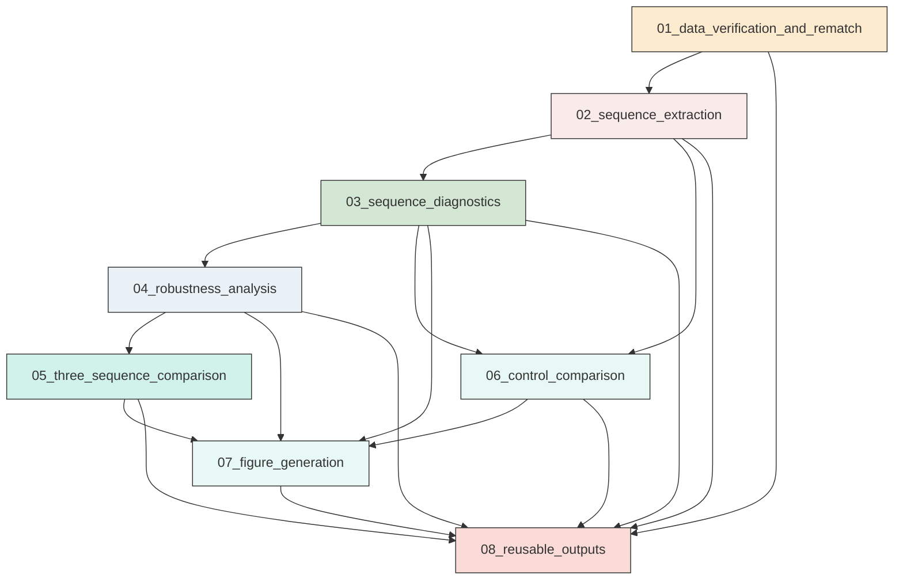
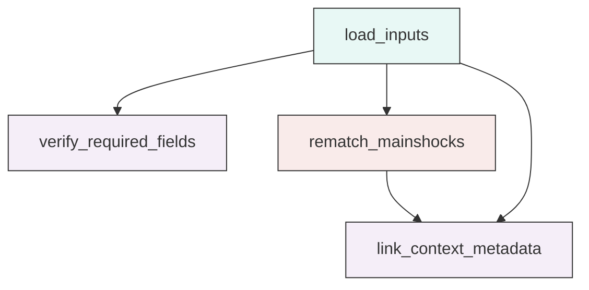
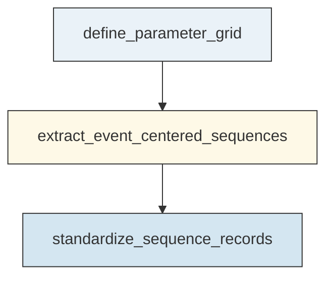
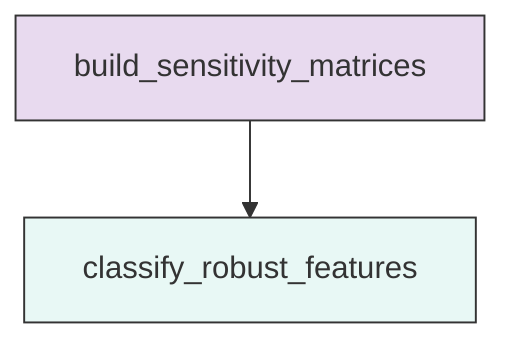
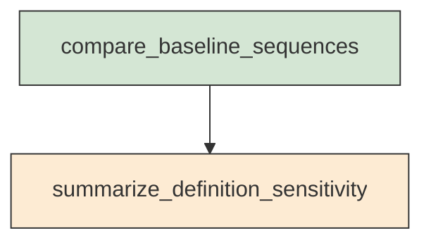
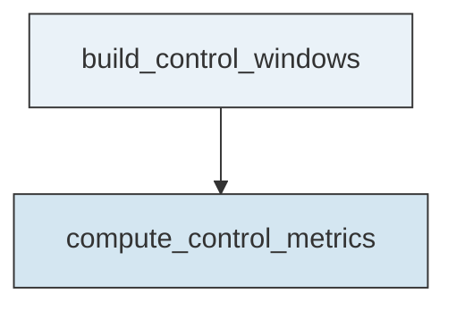
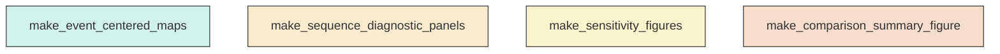
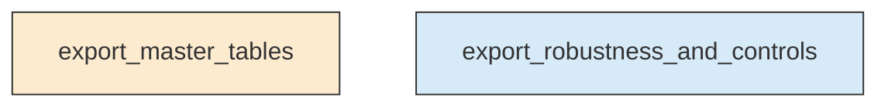

# Workflow Overview

## Top-Level Task Dependencies

**Description:**
- `01_data_verification_and_rematch`: Validate source tables and rematch the three mainshocks to the relocated catalog.
- `02_sequence_extraction`: Extract event-centered sequences around each matched mainshock across the full parameter grid.
- `03_sequence_diagnostics`: Compute counts, rates, distributions, spatial patterns, and decay diagnostics for each sequence.
- `04_robustness_analysis`: Test which sequence features remain stable across alternative parameter definitions.
- `05_three_sequence_comparison`: Compare M1, M2, and M3 using a common baseline and then across alternate definitions.
- `06_control_comparison`: Evaluate observed sequence behavior against simple background or randomized controls.
- `07_figure_generation`: Generate publication-quality sequence-analysis figures for all mainshocks and comparisons.
- `08_reusable_outputs`: Export validated tables and figure-ready datasets for downstream reuse.

## Subtask Dependencies

#### 01_data_verification_and_rematch
**Usage**: Validate source tables and rematch the three mainshocks to the relocated catalog.

**Description:**
- `load_inputs`: Read the catalog, mainshock, mechanism, and station tables.
- `verify_required_fields`: Check that sequence-analysis fields are present and usable.
- `rematch_mainshocks`: Match M1, M2, and M3 to relocated catalog events using tolerant time and location criteria.
- `link_context_metadata`: Summarize station and mechanism availability for downstream sequence analysis.

#### 02_sequence_extraction
**Usage**: Extract event-centered sequences around each matched mainshock across the full parameter grid.

**Description:**
- `define_parameter_grid`: Set the spatial, temporal, depth, and magnitude definitions for extraction.
- `extract_event_centered_sequences`: Build event-centered subsets for all mainshocks and parameter combinations.
- `standardize_sequence_records`: Annotate each extracted event with relative time, distance, and parameter metadata.

#### 03_sequence_diagnostics
**Usage**: Compute counts, rates, distributions, spatial patterns, and decay diagnostics for each sequence.

**Description:**
- `compute_count_metrics`: Calculate event counts and cumulative counts for each sequence window.
- `compute_rate_metrics`: Estimate moving-window seismicity rates and pre/post ratios.
- `compute_distribution_metrics`: Summarize magnitude and depth distributions plus radial and time-distance patterns.
- `fit_post_event_decay`: Fit simple Omori-style decay where the post-event window supports it.
- `summarize_spatial_and_mechanism_context`: Derive spatial concentration indicators and focal-mechanism availability summaries.

#### 04_robustness_analysis
**Usage**: Test which sequence features remain stable across alternative parameter definitions.

**Description:**
- `build_sensitivity_matrices`: Assemble feature sensitivities across radius, time, depth, and magnitude settings.
- `classify_robust_features`: Separate stable sequence signatures from parameter-dependent ones.

#### 05_three_sequence_comparison
**Usage**: Compare M1, M2, and M3 using a common baseline and then across alternate definitions.

**Description:**
- `compare_baseline_sequences`: Contrast background, pre-event, post-event, burstiness, decay, spatial, depth, and magnitude behavior.
- `summarize_definition_sensitivity`: Document how the cross-event comparison changes under alternate sequence definitions.

#### 06_control_comparison
**Usage**: Evaluate observed sequence behavior against simple background or randomized controls.

**Description:**
- `build_control_windows`: Define background or randomized control windows matched to the event-centered study design.
- `compute_control_metrics`: Calculate control-window counts and rate benchmarks for direct comparison.

#### 07_figure_generation
**Usage**: Generate publication-quality sequence-analysis figures for all mainshocks and comparisons.

**Description:**
- `make_event_centered_maps`: Plot event-centered maps for M1, M2, and M3.
- `make_sequence_diagnostic_panels`: Plot cumulative counts, rate curves, decay fits, and time-distance or radial-distance views.
- `make_sensitivity_figures`: Plot radius, time-window, magnitude-threshold, and depth-stratified sensitivity summaries.
- `make_comparison_summary_figure`: Plot the three-sequence comparison summary and control benchmarks.

#### 08_reusable_outputs
**Usage**: Export validated tables and figure-ready datasets for downstream reuse.

**Description:**
- `export_master_tables`: Package core validated sequence-analysis tables into reusable machine-readable outputs.
- `export_robustness_and_controls`: Save robustness, sensitivity, and control-comparison tables for downstream analysis.