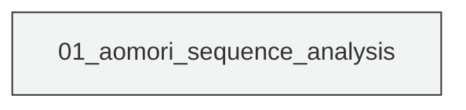
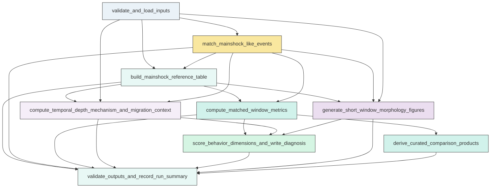

# Research Codings

## Task Overview


**Description:**
- `01_aomori_sequence_analysis`: Build the mainshock-referenced sequence dataset, compute all requested metrics and context summaries, generate the required figures, score behavior dimensions, assemble the scientific diagnosis, and validate outputs in one self-contained script.


## Task Details


#### 01_aomori_sequence_analysis
**Usage**: Build the mainshock-referenced sequence dataset, compute all requested metrics and context summaries, generate the required figures, score behavior dimensions, assemble the scientific diagnosis, and validate outputs in one self-contained script.

**Description:**
- `validate_and_load_inputs`: Load the catalog, mainshock, mechanism, and station inputs and standardize required fields.
- `match_mainshock_like_events`: Identify the catalog event corresponding to each mainshock with deterministic matching and ambiguity diagnostics.
- `build_mainshock_reference_table`: Compute event-to-mainshock relative times, distances, depth differences, bins, flags, and overlap diagnostics for all events.
- `generate_short_window_morphology_figures`: Create the required plus-minus 7 day and within 100 km morphology and summary figures for M1, M2, and M3.
- `compute_matched_window_metrics`: Compute exhaustive matched pre and post metrics across all requested time windows and spatial definitions.
- `derive_curated_comparison_products`: Summarize the exhaustive metric tables into cross-mainshock comparison figures and sensitivity views.
- `compute_temporal_depth_mechanism_and_migration_context`: Quantify temporal concentration, radial progression diagnostics, depth distributions, and focal mechanism context for each mainshock-centered sequence.
- `score_behavior_dimensions_and_write_diagnosis`: Assign evidence-based behavior-dimension scores for each mainshock and assemble the concise scientific diagnosis and evidence tables.
- `validate_outputs_and_record_run_summary`: Verify that all required tables and figures were created, are non-empty, and are recorded in a machine-readable run summary.

#### Coding Script

```python

from __future__ import annotations

import math
import sys
import traceback
from pathlib import Path
from typing import Dict, List, Tuple

import numpy as np
import pandas as pd
import matplotlib
matplotlib.use("Agg")
import matplotlib.pyplot as plt
from matplotlib.lines import Line2D


BASE_DATA_DIR = Path("<CASE_ROOT>/data")
OUTPUT_DIR = Path("<CASE_ROOT>/run/02_2_behavior_diagnosis/exp_run/outputs/01_aomori_sequence_analysis")

CATALOG_PATH = BASE_DATA_DIR / "catalog" / "Snet_catalog_relocate_250930_260501.csv"
MAINSHOCK_PATH = BASE_DATA_DIR / "catalog" / "main_earthquake.csv"
MECHA_PATH = BASE_DATA_DIR / "source_mechanism" / "Snet_mecha.csv"
STATION_PATH = BASE_DATA_DIR / "stations" / "station.sta"

TIME_WINDOWS_DAYS = [7, 14, 25]
CUMULATIVE_RADII_KM = [30.0, 60.0, 100.0]
DISTANCE_BANDS = [(0.0, 30.0), (30.0, 60.0), (60.0, 100.0)]
MAG_BINS = [-np.inf, 4.0, 5.0, 6.0, np.inf]
MAG_BIN_LABELS = ["<4", "4-<5", "5-<6", ">=6"]
DISTANCE_COLORS = {
    "0-30 km": "#1f78b4",
    "30-60 km": "#33a02c",
    "60-100 km": "#e31a1c",
    ">100 km": "#999999",
}
MAINSHOCK_COLORS = {"M1": "#4c78a8", "M2": "#f58518", "M3": "#54a24b"}
SCORE_LEVELS = ["low", "possible", "moderate", "strong"]

plt.rcParams.update({
    "figure.dpi": 180,
    "savefig.dpi": 300,
    "font.size": 10,
    "axes.titlesize": 11,
    "axes.labelsize": 10,
    "legend.fontsize": 9,
    "xtick.labelsize": 9,
    "ytick.labelsize": 9,
    "axes.spines.top": False,
    "axes.spines.right": False,
})


def log(message: str) -> None:
    print(message, flush=True)


REQUIRED_REFERENCE_COLUMNS = [
    "event_id", "origin_time", "latitude", "longitude", "depth_km", "magnitude",
    "mainshock_id", "mainshock_time", "mainshock_latitude", "mainshock_longitude",
    "mainshock_depth_km", "mainshock_magnitude", "relative_time_seconds",
    "relative_time_hours", "relative_time_days", "epicentral_distance_km",
    "depth_diff_km", "abs_depth_diff_km", "hypocentral_distance_km",
    "distance_band", "within_30km", "within_60km", "within_100km",
    "prepost_flag", "magnitude_bin", "is_m4plus", "is_m5plus", "is_m6plus",
    "mag_to_mainshock_gap", "is_mainshock_like_event",
]


REQUIRED_METRIC_KEYS = [
    "matched_window_metrics_all",
    "matched_window_metrics_by_band",
    "magnitude_dominance_metrics",
    "companion_event_metrics",
    "largest_event_lists_by_window",
    "regional_outerband_metrics",
    "post_response_temporal_metrics",
    "migration_diagnostics",
    "depth_summary_by_mainshock",
    "depth_summary_m4_m5",
]


FORMATTED_EVIDENCE_DIMENSIONS = [
    "aftershock_response",
    "single_mainshock_dominance",
    "compact_cascade_compound_structure",
    "swarm_like_organization",
    "foreshock_pre_mainshock_activation",
    "broader_regional_activation",
    "radial_migration_expansion",
    "slow_slip_related_candidate",
]


def ensure_inputs() -> None:
    for path in [CATALOG_PATH, MAINSHOCK_PATH, MECHA_PATH, STATION_PATH]:
        if not path.exists():
            raise FileNotFoundError(f"Required input missing: {path}")


def clean_output_dir(output_dir: Path) -> None:
    output_dir.mkdir(parents=True, exist_ok=True)
    removed_files = 0
    removed_dirs = 0
    for path in list(output_dir.iterdir()):
        if path.is_file() or path.is_symlink():
            path.unlink()
            removed_files += 1
        elif path.is_dir():
            for sub in sorted(path.rglob("*"), reverse=True):
                if sub.is_file() or sub.is_symlink():
                    sub.unlink()
                elif sub.is_dir():
                    sub.rmdir()
            path.rmdir()
            removed_dirs += 1
    log(f"Prepared output directory: removed {removed_files} files and {removed_dirs} directories from {output_dir}")


def load_catalog() -> pd.DataFrame:
    log(f"Loading catalog: {CATALOG_PATH}")
    cat = pd.read_csv(CATALOG_PATH)
    cat = cat.rename(columns={"datetime": "origin_time", "lat": "latitude", "lon": "longitude", "dep": "depth_km", "mag": "magnitude"})
    cat["origin_time"] = pd.to_datetime(cat["origin_time"], utc=True, errors="coerce")
    if cat["origin_time"].isna().any():
        raise ValueError("Catalog contains unparsable origin_time values")
    for col in ["latitude", "longitude", "depth_km", "magnitude"]:
        cat[col] = pd.to_numeric(cat[col], errors="coerce")
    if cat[["latitude", "longitude", "depth_km", "magnitude"]].isna().any().any():
        raise ValueError("Catalog contains missing numeric values in core columns")
    cat = cat.reset_index(drop=True)
    cat["event_id"] = [f"EVT_{i:06d}" for i in range(len(cat))]
    cat = cat.sort_values("origin_time").reset_index(drop=True)
    log(f"Catalog loaded with {len(cat):,} events")
    return cat


def load_mainshocks() -> pd.DataFrame:
    log(f"Loading mainshocks: {MAINSHOCK_PATH}")
    ms = pd.read_csv(MAINSHOCK_PATH)
    ms = ms.rename(columns={"index": "mainshock_id", "datetime": "origin_time", "lat": "latitude", "lon": "longitude", "dep": "depth_km", "mag": "magnitude"})
    ms["origin_time"] = pd.to_datetime(ms["origin_time"], utc=True, errors="coerce")
    for col in ["latitude", "longitude", "depth_km", "magnitude"]:
        ms[col] = pd.to_numeric(ms[col], errors="coerce")
    if len(ms) != 3:
        raise ValueError(f"Expected 3 mainshocks, found {len(ms)}")
    ms = ms.sort_values("origin_time").reset_index(drop=True)
    log(f"Mainshock table loaded with ids: {', '.join(ms['mainshock_id'])}")
    return ms


def load_mechanisms() -> pd.DataFrame:
    log(f"Loading mechanisms: {MECHA_PATH}")
    mecha = pd.read_csv(MECHA_PATH)
    mecha["origin_time"] = pd.to_datetime(mecha["origin_time"], utc=True, errors="coerce")
    mecha = mecha.rename(columns={"lat_deg": "latitude", "lon_deg": "longitude", "depth_km": "depth_km", "mag_1": "magnitude"})
    for col in ["latitude", "longitude", "depth_km", "magnitude"]:
        if col in mecha.columns:
            mecha[col] = pd.to_numeric(mecha[col], errors="coerce")
    return mecha


def load_stations() -> pd.DataFrame:
    st = pd.read_csv(STATION_PATH)
    for col in ["latitude", "longitude", "elevation_m"]:
        st[col] = pd.to_numeric(st[col], errors="coerce")
    return st


def haversine_km(lat1, lon1, lat2, lon2):
    lat1 = np.radians(lat1)
    lon1 = np.radians(lon1)
    lat2 = np.radians(lat2)
    lon2 = np.radians(lon2)
    dlat = lat2 - lat1
    dlon = lon2 - lon1
    a = np.sin(dlat / 2.0) ** 2 + np.cos(lat1) * np.cos(lat2) * np.sin(dlon / 2.0) ** 2
    c = 2 * np.arcsin(np.sqrt(a))
    return 6371.0 * c


def distance_band_label(distance_km: pd.Series) -> pd.Series:
    labels = np.full(len(distance_km), ">100 km", dtype=object)
    labels = np.where(distance_km <= 30, "0-30 km", labels)
    labels = np.where((distance_km > 30) & (distance_km <= 60), "30-60 km", labels)
    labels = np.where((distance_km > 60) & (distance_km <= 100), "60-100 km", labels)
    return pd.Series(labels, index=distance_km.index)


def magnitude_bin_label(mag: pd.Series) -> pd.Series:
    return pd.cut(mag, bins=MAG_BINS, labels=MAG_BIN_LABELS, right=False, include_lowest=True).astype(str)


def marker_size_from_mag(mag: pd.Series) -> np.ndarray:
    return 18 + np.clip((mag.fillna(0).to_numpy() - 1.0), 0, None) ** 2 * 10


def build_reference_table(catalog: pd.DataFrame, mainshocks: pd.DataFrame) -> Tuple[pd.DataFrame, pd.DataFrame]:
    log("Building mainshock-referenced event table")
    parts: List[pd.DataFrame] = []
    match_rows: List[Dict[str, object]] = []

    for _, ms in mainshocks.iterrows():
        df = catalog.copy()
        df["mainshock_id"] = ms["mainshock_id"]
        df["mainshock_time"] = ms["origin_time"]
        df["mainshock_latitude"] = ms["latitude"]
        df["mainshock_longitude"] = ms["longitude"]
        df["mainshock_depth_km"] = ms["depth_km"]
        df["mainshock_magnitude"] = ms["magnitude"]
        dt = (df["origin_time"] - ms["origin_time"]).dt.total_seconds()
        df["relative_time_seconds"] = dt
        df["relative_time_hours"] = dt / 3600.0
        df["relative_time_days"] = dt / 86400.0
        df["epicentral_distance_km"] = haversine_km(df["latitude"].to_numpy(), df["longitude"].to_numpy(), ms["latitude"], ms["longitude"])
        df["depth_diff_km"] = df["depth_km"] - ms["depth_km"]
        df["abs_depth_diff_km"] = df["depth_diff_km"].abs()
        df["hypocentral_distance_km"] = np.sqrt(df["epicentral_distance_km"] ** 2 + df["depth_diff_km"] ** 2)
        df["distance_band"] = distance_band_label(df["epicentral_distance_km"])
        df["within_30km"] = df["epicentral_distance_km"] <= 30.0
        df["within_60km"] = df["epicentral_distance_km"] <= 60.0
        df["within_100km"] = df["epicentral_distance_km"] <= 100.0
        df["prepost_flag"] = np.where(df["relative_time_seconds"] < 0, "pre", np.where(df["relative_time_seconds"] > 0, "post", "zero"))
        df["magnitude_bin"] = magnitude_bin_label(df["magnitude"])
        df["is_m4plus"] = df["magnitude"] >= 4.0
        df["is_m5plus"] = df["magnitude"] >= 5.0
        df["is_m6plus"] = df["magnitude"] >= 6.0
        df["mag_to_mainshock_gap"] = ms["magnitude"] - df["magnitude"]

        candidate = df.sort_values(["relative_time_seconds", "epicentral_distance_km"]).copy()
        candidate["abs_time_seconds"] = candidate["relative_time_seconds"].abs()
        candidate["mag_abs_diff"] = (candidate["magnitude"] - ms["magnitude"]).abs()
        stages = [
            (120.0, 15.0, 15.0, 0.6),
            (600.0, 30.0, 25.0, 1.0),
            (3600.0, 80.0, 40.0, 1.5),
            (86400.0, 150.0, 60.0, 2.0),
        ]
        selected = None
        ambiguity = False
        stage_used = None
        candidate_count = 0
        for i, (tt, dd, zd, md) in enumerate(stages, start=1):
            subset = candidate[(candidate["abs_time_seconds"] <= tt) & (candidate["epicentral_distance_km"] <= dd) & (candidate["abs_depth_diff_km"] <= zd) & (candidate["mag_abs_diff"] <= md)].copy()
            if len(subset) > 0:
                subset = subset.sort_values(["abs_time_seconds", "epicentral_distance_km", "abs_depth_diff_km", "mag_abs_diff", "event_id"])
                selected = subset.iloc[0]
                ambiguity = len(subset) > 1
                stage_used = i
                candidate_count = len(subset)
                break
        if selected is None:
            subset = candidate.sort_values(["abs_time_seconds", "epicentral_distance_km", "abs_depth_diff_km", "mag_abs_diff", "event_id"])
            selected = subset.iloc[0]
            ambiguity = len(subset) > 1
            stage_used = 0
            candidate_count = len(subset)

        df["is_mainshock_like_event"] = df["event_id"] == selected["event_id"]
        parts.append(df)
        match_rows.append({
            "mainshock_id": ms["mainshock_id"],
            "matched_event_id": selected["event_id"],
            "matched_origin_time": selected["origin_time"],
            "mainshock_time": ms["origin_time"],
            "time_residual_seconds": float(selected["relative_time_seconds"]),
            "abs_time_residual_seconds": float(abs(selected["relative_time_seconds"])),
            "epicentral_distance_km": float(selected["epicentral_distance_km"]),
            "depth_residual_km": float(selected["depth_diff_km"]),
            "abs_depth_residual_km": float(selected["abs_depth_diff_km"]),
            "matched_magnitude": float(selected["magnitude"]),
            "mainshock_magnitude": float(ms["magnitude"]),
            "magnitude_residual": float(selected["magnitude"] - ms["magnitude"]),
            "tolerance_stage": stage_used,
            "candidate_count_in_stage": candidate_count,
            "ambiguity_flag": ambiguity,
        })

    ref = pd.concat(parts, ignore_index=True)
    ref["window_pm7d"] = ref["relative_time_days"].abs() <= 7
    ref["window_pm14d"] = ref["relative_time_days"].abs() <= 14
    ref["window_pm25d"] = ref["relative_time_days"].abs() <= 25
    overlap = ref[["event_id", "mainshock_id", "relative_time_days", "epicentral_distance_km"]].copy()
    overlap["overlap_pm25d_100km"] = (overlap["relative_time_days"].abs() <= 25) & (overlap["epicentral_distance_km"] <= 100)
    overlap_count = overlap.groupby("event_id")["overlap_pm25d_100km"].sum().rename("overlap_mainshock_count_pm25d_100km")
    ref = ref.merge(overlap_count, on="event_id", how="left")
    ref["shared_across_mainshocks_pm25d_100km"] = ref["overlap_mainshock_count_pm25d_100km"] > 1
    match_df = pd.DataFrame(match_rows)
    log(f"Built reference table with {len(ref):,} rows")
    return ref, match_df


def require_columns(df: pd.DataFrame, required: List[str], df_name: str) -> None:
    missing = [col for col in required if col not in df.columns]
    if missing:
        raise KeyError(f"{df_name} missing required columns: {missing}")


def format_metric_value(value: object) -> str:
    if pd.isna(value):
        return "NA"
    if isinstance(value, (bool, np.bool_)):
        return str(bool(value))
    if isinstance(value, (int, np.integer)):
        return str(int(value))
    if isinstance(value, (float, np.floating)):
        return f"{float(value):.3f}"
    return str(value)


def build_qa_table(ref: pd.DataFrame) -> pd.DataFrame:
    rows = []
    for ms_id, g in ref.groupby("mainshock_id"):
        for window in TIME_WINDOWS_DAYS:
            subset = g[g["relative_time_days"].abs() <= window]
            for band in ["all", "<=30 km", "<=60 km", "<=100 km", "0-30 km", "30-60 km", "60-100 km", ">100 km"]:
                if band == "all":
                    ss = subset
                elif band.startswith("<="):
                    radius = float(band.replace("<=", "").replace(" km", ""))
                    ss = subset[subset["epicentral_distance_km"] <= radius]
                else:
                    ss = subset[subset["distance_band"] == band]
                rows.append({
                    "mainshock_id": ms_id,
                    "window_days": window,
                    "distance_selector": band,
                    "event_count": len(ss),
                    "m4plus_count": int(ss["is_m4plus"].sum()),
                    "m5plus_count": int(ss["is_m5plus"].sum()),
                    "m6plus_count": int(ss["is_m6plus"].sum()),
                })
    return pd.DataFrame(rows)


def annulus_area_km2(r0: float, r1: float) -> float:
    return math.pi * (r1 ** 2 - r0 ** 2)


def safe_ratio(num: float, den: float) -> float:
    if den == 0:
        return np.nan
    return num / den


def score_label(value: float, thresholds: Tuple[float, float, float], higher_is_stronger: bool = True) -> str:
    t1, t2, t3 = thresholds
    if np.isnan(value):
        return "low"
    if higher_is_stronger:
        if value >= t3:
            return "strong"
        if value >= t2:
            return "moderate"
        if value >= t1:
            return "possible"
        return "low"
    if value <= t3:
        return "strong"
    if value <= t2:
        return "moderate"
    if value <= t1:
        return "possible"
    return "low"


def compute_matched_metrics(ref: pd.DataFrame, mainshocks: pd.DataFrame) -> Dict[str, pd.DataFrame]:
    log("Computing matched-window metrics")
    rows_all: List[Dict[str, object]] = []
    rows_band: List[Dict[str, object]] = []
    rows_dom: List[Dict[str, object]] = []
    rows_comp: List[Dict[str, object]] = []
    rows_largest: List[Dict[str, object]] = []
    rows_outer: List[Dict[str, object]] = []
    rows_post: List[Dict[str, object]] = []
    rows_migration: List[Dict[str, object]] = []
    depth_rows: List[Dict[str, object]] = []
    depth_rows_thresh: List[Dict[str, object]] = []
    require_columns(ref, REQUIRED_REFERENCE_COLUMNS, "mainshock_reference_event_table")

    for _, ms in mainshocks.iterrows():
        ms_id = ms["mainshock_id"]
        g = ref[ref["mainshock_id"] == ms_id].copy()
        nonms_all = g[~g["is_mainshock_like_event"]].copy()

        for window in TIME_WINDOWS_DAYS:
            gwin = g[g["relative_time_days"].abs() <= window].copy()
            nonms = gwin[~gwin["is_mainshock_like_event"]].copy()
            for radius in CUMULATIVE_RADII_KM:
                sub = gwin[gwin["epicentral_distance_km"] <= radius].copy()
                sub_nonms = sub[~sub["is_mainshock_like_event"]].copy()
                for side, side_mask in {"pre": sub["relative_time_days"] < 0, "post": sub["relative_time_days"] > 0}.items():
                    ss = sub.loc[side_mask].copy()
                    duration_days = window
                    mag_counts = ss["magnitude_bin"].value_counts().to_dict()
                    rows_all.append({
                        "mainshock_id": ms_id,
                        "window_days": window,
                        "space_type": "cumulative_radius",
                        "space_label": f"<={int(radius)} km",
                        "space_value_km": radius,
                        "side": side,
                        "event_count": len(ss),
                        "event_rate_per_day": len(ss) / duration_days,
                        "m4plus_count": int(ss["is_m4plus"].sum()),
                        "m4plus_rate_per_day": float(ss["is_m4plus"].sum()) / duration_days,
                        "m5plus_count": int(ss["is_m5plus"].sum()),
                        "m5plus_rate_per_day": float(ss["is_m5plus"].sum()) / duration_days,
                        "m6plus_count": int(ss["is_m6plus"].sum()),
                        "m6plus_rate_per_day": float(ss["is_m6plus"].sum()) / duration_days,
                        "magbin_<4_count": int(mag_counts.get("<4", 0)),
                        "magbin_4_5_count": int(mag_counts.get("4-<5", 0)),
                        "magbin_5_6_count": int(mag_counts.get("5-<6", 0)),
                        "magbin_ge6_count": int(mag_counts.get(">=6", 0)),
                        "largest_event_mag": float(ss["magnitude"].max()) if len(ss) else np.nan,
                        "largest_event_time": ss.loc[ss["magnitude"].idxmax(), "origin_time"] if len(ss) else pd.NaT,
                        "largest_event_distance_km": float(ss.loc[ss["magnitude"].idxmax(), "epicentral_distance_km"]) if len(ss) else np.nan,
                        "largest_event_depth_diff_km": float(ss.loc[ss["magnitude"].idxmax(), "depth_diff_km"]) if len(ss) else np.nan,
                    })

                pre = sub[sub["relative_time_days"] < 0]
                post = sub[sub["relative_time_days"] > 0]
                m4_pre = int(pre["is_m4plus"].sum())
                m4_post = int(post["is_m4plus"].sum())
                m5_pre = int(pre["is_m5plus"].sum())
                m5_post = int(post["is_m5plus"].sum())
                m6_pre = int(pre["is_m6plus"].sum())
                m6_post = int(post["is_m6plus"].sum())
                largest_nonms_mag = float(sub_nonms["magnitude"].max()) if len(sub_nonms) else np.nan
                largest_pre_mag = float(pre["magnitude"].max()) if len(pre) else np.nan
                largest_post_mag = float(post["magnitude"].max()) if len(post) else np.nan
                dom_gap = ms["magnitude"] - largest_nonms_mag if not np.isnan(largest_nonms_mag) else np.nan
                companion_05 = int((sub_nonms["magnitude"] >= ms["magnitude"] - 0.5).sum())
                companion_10 = int((sub_nonms["magnitude"] >= ms["magnitude"] - 1.0).sum())
                sorted_nonms = sub_nonms.sort_values("magnitude", ascending=False)
                top2_gap = np.nan
                if len(sorted_nonms) >= 2:
                    top2_gap = float(sorted_nonms.iloc[0]["magnitude"] - sorted_nonms.iloc[1]["magnitude"])
                rows_dom.append({
                    "mainshock_id": ms_id,
                    "window_days": window,
                    "space_type": "cumulative_radius",
                    "space_label": f"<={int(radius)} km",
                    "space_value_km": radius,
                    "mainshock_magnitude": ms["magnitude"],
                    "largest_non_mainshock_mag": largest_nonms_mag,
                    "largest_pre_mag": largest_pre_mag,
                    "largest_post_mag": largest_post_mag,
                    "mainshock_minus_largest_nonmainshock_gap": dom_gap,
                    "largest_post_minus_largest_pre_gap": largest_post_mag - largest_pre_mag if (not np.isnan(largest_post_mag) and not np.isnan(largest_pre_mag)) else np.nan,
                    "top_nonmainshock_gap": top2_gap,
                    "companion_within_0p5mag": companion_05,
                    "companion_within_1p0mag": companion_10,
                    "nonmainshock_event_count": len(sub_nonms),
                    "m4plus_pre_count": m4_pre,
                    "m4plus_post_count": m4_post,
                    "m5plus_pre_count": m5_pre,
                    "m5plus_post_count": m5_post,
                    "m6plus_pre_count": m6_pre,
                    "m6plus_post_count": m6_post,
                })
                rows_comp.append({
                    "mainshock_id": ms_id,
                    "window_days": window,
                    "space_label": f"<={int(radius)} km",
                    "space_value_km": radius,
                    "companion_within_0p5mag": companion_05,
                    "companion_within_1p0mag": companion_10,
                    "largest_non_mainshock_mag": largest_nonms_mag,
                    "dominance_gap": dom_gap,
                })
                rows_largest.append({
                    "mainshock_id": ms_id,
                    "window_days": window,
                    "space_type": "cumulative_radius",
                    "space_label": f"<={int(radius)} km",
                    "largest_pre_event_id": pre.sort_values("magnitude", ascending=False)["event_id"].iloc[0] if len(pre) else None,
                    "largest_pre_mag": largest_pre_mag,
                    "largest_pre_time_days": float(pre.sort_values("magnitude", ascending=False)["relative_time_days"].iloc[0]) if len(pre) else np.nan,
                    "largest_pre_distance_km": float(pre.sort_values("magnitude", ascending=False)["epicentral_distance_km"].iloc[0]) if len(pre) else np.nan,
                    "largest_post_event_id": post.sort_values("magnitude", ascending=False)["event_id"].iloc[0] if len(post) else None,
                    "largest_post_mag": largest_post_mag,
                    "largest_post_time_days": float(post.sort_values("magnitude", ascending=False)["relative_time_days"].iloc[0]) if len(post) else np.nan,
                    "largest_post_distance_km": float(post.sort_values("magnitude", ascending=False)["epicentral_distance_km"].iloc[0]) if len(post) else np.nan,
                })
            outer = gwin[(gwin["relative_time_days"] != 0) & (gwin["epicentral_distance_km"] <= 100)].copy()
            pre_all = outer[outer["relative_time_days"] < 0]
            post_all = outer[outer["relative_time_days"] > 0]
            for side, ss in [("pre", pre_all), ("post", post_all)]:
                near = ss[ss["distance_band"] == "0-30 km"]
                outer_ss = ss[ss["distance_band"].isin(["30-60 km", "60-100 km"])]
                rows_outer.append({
                    "mainshock_id": ms_id,
                    "window_days": window,
                    "side": side,
                    "all_event_count_le100": len(ss),
                    "nearfield_count_0_30": len(near),
                    "outerband_count_30_100": len(outer_ss),
                    "outerband_fraction_30_100": safe_ratio(len(outer_ss), len(ss)),
                    "nearfield_fraction_0_30": safe_ratio(len(near), len(ss)),
                    "m4plus_outerband_count_30_100": int(outer_ss["is_m4plus"].sum()),
                    "m4plus_outerband_fraction_30_100": safe_ratio(int(outer_ss["is_m4plus"].sum()), int(ss["is_m4plus"].sum())),
                })

            for r0, r1 in DISTANCE_BANDS:
                label = f"{int(r0)}-{int(r1)} km"
                band = gwin[(gwin["epicentral_distance_km"] > r0) & (gwin["epicentral_distance_km"] <= r1)].copy()
                area = annulus_area_km2(r0, r1)
                for side, side_mask in {"pre": band["relative_time_days"] < 0, "post": band["relative_time_days"] > 0}.items():
                    ss = band.loc[side_mask].copy()
                    duration_days = window
                    mag_counts = ss["magnitude_bin"].value_counts().to_dict()
                    rows_band.append({
                        "mainshock_id": ms_id,
                        "window_days": window,
                        "space_type": "annulus_band",
                        "space_label": label,
                        "r_inner_km": r0,
                        "r_outer_km": r1,
                        "annulus_area_km2": area,
                        "side": side,
                        "event_count": len(ss),
                        "event_rate_per_day": len(ss) / duration_days,
                        "area_normalized_rate": len(ss) / duration_days / area,
                        "m4plus_count": int(ss["is_m4plus"].sum()),
                        "m4plus_rate_per_day": float(ss["is_m4plus"].sum()) / duration_days,
                        "m4plus_area_normalized_rate": float(ss["is_m4plus"].sum()) / duration_days / area,
                        "m5plus_count": int(ss["is_m5plus"].sum()),
                        "m5plus_rate_per_day": float(ss["is_m5plus"].sum()) / duration_days,
                        "m5plus_area_normalized_rate": float(ss["is_m5plus"].sum()) / duration_days / area,
                        "m6plus_count": int(ss["is_m6plus"].sum()),
                        "magbin_<4_count": int(mag_counts.get("<4", 0)),
                        "magbin_4_5_count": int(mag_counts.get("4-<5", 0)),
                        "magbin_5_6_count": int(mag_counts.get("5-<6", 0)),
                        "magbin_ge6_count": int(mag_counts.get(">=6", 0)),
                        "largest_event_mag": float(ss["magnitude"].max()) if len(ss) else np.nan,
                    })

            post_only = gwin[(gwin["relative_time_days"] > 0) & (gwin["epicentral_distance_km"] <= 100) & (~gwin["is_mainshock_like_event"])].copy()
            total_post = len(post_only)
            for hours in [6, 12, 24, 72]:
                count = int((post_only["relative_time_hours"] <= hours).sum())
                m4count = int(((post_only["relative_time_hours"] <= hours) & post_only["is_m4plus"]).sum())
                rows_post.append({
                    "mainshock_id": ms_id,
                    "window_days": window,
                    "hours_since_mainshock": hours,
                    "post_event_count_within_hours": count,
                    "post_event_fraction_within_hours": safe_ratio(count, total_post),
                    "post_m4plus_count_within_hours": m4count,
                    "post_m4plus_fraction_within_hours": safe_ratio(m4count, int(post_only["is_m4plus"].sum())),
                    "total_post_event_count": total_post,
                })

            for side_name, ss in [("pre", gwin[(gwin["relative_time_days"] < 0) & (gwin["epicentral_distance_km"] <= 100)]), ("post", gwin[(gwin["relative_time_days"] > 0) & (gwin["epicentral_distance_km"] <= 100)])]:
                if len(ss) >= 5 and ss["relative_time_days"].nunique() > 1:
                    x = ss["relative_time_days"].to_numpy()
                    if side_name == "pre":
                        x = np.abs(x)
                    y = ss["epicentral_distance_km"].to_numpy()
                    slope = np.polyfit(x, y, 1)[0]
                    corr = pd.Series(x).corr(pd.Series(y), method="spearman")
                else:
                    slope = np.nan
                    corr = np.nan
                m4 = ss[ss["is_m4plus"]]
                if len(m4) >= 3 and m4["relative_time_days"].nunique() > 1:
                    x2 = m4["relative_time_days"].to_numpy()
                    if side_name == "pre":
                        x2 = np.abs(x2)
                    y2 = m4["epicentral_distance_km"].to_numpy()
                    slope2 = np.polyfit(x2, y2, 1)[0]
                    corr2 = pd.Series(x2).corr(pd.Series(y2), method="spearman")
                else:
                    slope2 = np.nan
                    corr2 = np.nan
                rows_migration.append({
                    "mainshock_id": ms_id,
                    "window_days": window,
                    "side": side_name,
                    "all_event_count": len(ss),
                    "distance_time_slope_km_per_day": slope,
                    "distance_time_spearman": corr,
                    "m4plus_count": len(m4),
                    "m4plus_distance_time_slope_km_per_day": slope2,
                    "m4plus_distance_time_spearman": corr2,
                    "monotonic_progression_supported": bool((not np.isnan(corr)) and (abs(corr) >= 0.45) and (not np.isnan(slope)) and (abs(slope) >= 1.0)),
                })

            for threshold_name, threshold_mask in [("all", gwin["epicentral_distance_km"] <= 100), ("m4plus", (gwin["epicentral_distance_km"] <= 100) & gwin["is_m4plus"]), ("m5plus", (gwin["epicentral_distance_km"] <= 100) & gwin["is_m5plus"])]:
                ss = gwin[threshold_mask].copy()
                for side_name, sub in [("pre", ss[ss["relative_time_days"] < 0]), ("post", ss[ss["relative_time_days"] > 0])]:
                    depth_rows.append({
                        "mainshock_id": ms_id,
                        "window_days": window,
                        "subset_name": threshold_name,
                        "side": side_name,
                        "event_count": len(sub),
                        "depth_median_km": float(sub["depth_km"].median()) if len(sub) else np.nan,
                        "depth_iqr_km": float(sub["depth_km"].quantile(0.75) - sub["depth_km"].quantile(0.25)) if len(sub) else np.nan,
                        "depth_min_km": float(sub["depth_km"].min()) if len(sub) else np.nan,
                        "depth_max_km": float(sub["depth_km"].max()) if len(sub) else np.nan,
                        "depthdiff_median_km": float(sub["depth_diff_km"].median()) if len(sub) else np.nan,
                    })

                if threshold_name in {"m4plus", "m5plus"}:
                    depth_rows_thresh.append({
                        "mainshock_id": ms_id,
                        "window_days": window,
                        "subset_name": threshold_name,
                        "side": side_name,
                        "event_count": len(sub),
                        "depth_median_km": float(sub["depth_km"].median()) if len(sub) else np.nan,
                        "depth_iqr_km": float(sub["depth_km"].quantile(0.75) - sub["depth_km"].quantile(0.25)) if len(sub) else np.nan,
                        "depth_min_km": float(sub["depth_km"].min()) if len(sub) else np.nan,
                        "depth_max_km": float(sub["depth_km"].max()) if len(sub) else np.nan,
                        "depthdiff_median_km": float(sub["depth_diff_km"].median()) if len(sub) else np.nan,
                    })

    metrics = {
        "matched_window_metrics_all": pd.DataFrame(rows_all),
        "matched_window_metrics_by_band": pd.DataFrame(rows_band),
        "magnitude_dominance_metrics": pd.DataFrame(rows_dom),
        "companion_event_metrics": pd.DataFrame(rows_comp),
        "largest_event_lists_by_window": pd.DataFrame(rows_largest),
        "regional_outerband_metrics": pd.DataFrame(rows_outer),
        "post_response_temporal_metrics": pd.DataFrame(rows_post),
        "migration_diagnostics": pd.DataFrame(rows_migration),
        "depth_summary_by_mainshock": pd.DataFrame(depth_rows),
        "depth_summary_m4_m5": pd.DataFrame(depth_rows_thresh),
    }
    missing_keys = [key for key in REQUIRED_METRIC_KEYS if key not in metrics]
    if missing_keys:
        raise KeyError(f"Metric dictionary missing required keys: {missing_keys}")
    return metrics


def mechanism_context(ref: pd.DataFrame, mecha: pd.DataFrame) -> Tuple[pd.DataFrame, pd.DataFrame]:
    log("Matching focal mechanisms to catalog events")
    mecha = mecha.dropna(subset=["origin_time", "latitude", "longitude"]).copy()
    cat_unique = ref[["event_id", "origin_time", "latitude", "longitude", "depth_km", "magnitude"]].drop_duplicates("event_id").copy()
    matches = []
    for _, row in mecha.iterrows():
        time_diff = (cat_unique["origin_time"] - row["origin_time"]).dt.total_seconds().abs()
        spatial = haversine_km(cat_unique["latitude"].to_numpy(), cat_unique["longitude"].to_numpy(), row["latitude"], row["longitude"])
        depth_diff = (cat_unique["depth_km"] - row.get("depth_km", np.nan)).abs()
        mag_diff = (cat_unique["magnitude"] - row.get("magnitude", np.nan)).abs()
        scored = cat_unique.copy()
        scored["abs_time_seconds"] = time_diff
        scored["distance_km"] = spatial
        scored["abs_depth_diff_km"] = depth_diff
        scored["abs_mag_diff"] = mag_diff
        subset = scored[(scored["abs_time_seconds"] <= 600) & (scored["distance_km"] <= 25) & (scored["abs_depth_diff_km"] <= 25)]
        if len(subset) == 0:
            subset = scored.sort_values(["abs_time_seconds", "distance_km", "abs_depth_diff_km", "abs_mag_diff"]).head(1)
            ambiguity = False
            within_tolerance = False
        else:
            subset = subset.sort_values(["abs_time_seconds", "distance_km", "abs_depth_diff_km", "abs_mag_diff"])
            ambiguity = len(subset) > 1
            within_tolerance = True
        best = subset.iloc[0]
        matches.append({
            "event_code": row.get("event_code"),
            "mechanism_origin_time": row["origin_time"],
            "matched_event_id": best["event_id"],
            "time_residual_seconds": float(best["abs_time_seconds"]),
            "distance_residual_km": float(best["distance_km"]),
            "depth_residual_km": float(best["abs_depth_diff_km"]),
            "mag_residual": float(best["abs_mag_diff"]) if not pd.isna(best["abs_mag_diff"]) else np.nan,
            "within_primary_tolerance": within_tolerance,
            "ambiguity_flag": ambiguity,
            "focal_mech_projection": row.get("focal_mech_projection"),
            "focal_mech_score": row.get("focal_mech_score"),
            "strike_plane1": row.get("strike_plane1"),
            "dip_plane1": row.get("dip_plane1"),
            "rake_plane1": row.get("rake_plane1"),
            "strike_plane2": row.get("strike_plane2"),
            "dip_plane2": row.get("dip_plane2"),
            "rake_plane2": row.get("rake_plane2"),
            "region_name": row.get("region_name"),
        })
    match_df = pd.DataFrame(matches)
    ref_ms = ref[["event_id", "mainshock_id", "relative_time_days", "epicentral_distance_km", "distance_band", "is_m4plus", "is_m5plus"]]
    joined = match_df.merge(ref_ms, left_on="matched_event_id", right_on="event_id", how="left")
    context_rows = []
    for (ms_id,), g in joined.dropna(subset=["mainshock_id"]).groupby(["mainshock_id"]):
        near = g[g["epicentral_distance_km"] <= 30]
        outer = g[(g["epicentral_distance_km"] > 30) & (g["epicentral_distance_km"] <= 100)]
        context_rows.append({
            "mainshock_id": ms_id,
            "matched_mechanism_count": len(g),
            "within_primary_tolerance_count": int(g["within_primary_tolerance"].sum()),
            "nearfield_mechanism_count_0_30": len(near),
            "outerband_mechanism_count_30_100": len(outer),
            "m4plus_mechanism_count": int(g["is_m4plus"].fillna(False).sum()),
            "m5plus_mechanism_count": int(g["is_m5plus"].fillna(False).sum()),
            "median_strike_plane1": float(pd.to_numeric(g["strike_plane1"], errors="coerce").median()) if len(g) else np.nan,
            "median_dip_plane1": float(pd.to_numeric(g["dip_plane1"], errors="coerce").median()) if len(g) else np.nan,
            "median_rake_plane1": float(pd.to_numeric(g["rake_plane1"], errors="coerce").median()) if len(g) else np.nan,
            "quality_labels": "; ".join(sorted({str(x) for x in g["focal_mech_score"].dropna().unique()})) if len(g) else "",
        })
    return match_df, pd.DataFrame(context_rows)


def save_table(df: pd.DataFrame, filename: str) -> None:
    path = OUTPUT_DIR / filename
    df.to_csv(path, index=False)
    log(f"Saved table: {path} ({len(df):,} rows)")


def filtered_pm7_100(ref: pd.DataFrame) -> pd.DataFrame:
    return ref[(ref["relative_time_days"].abs() <= 7) & (ref["epicentral_distance_km"] <= 100)].copy()


def add_common_legends(fig):
    band_handles = [Line2D([0], [0], marker='o', color='none', markerfacecolor=DISTANCE_COLORS[k], markeredgecolor='black', markersize=7, label=k) for k in ["0-30 km", "30-60 km", "60-100 km"]]
    extra_handles = [
        Line2D([0], [0], marker='*', color='gold', markeredgecolor='black', markersize=12, linestyle='None', label='Mainshock-like event'),
        Line2D([0], [0], marker='o', color='none', markerfacecolor='white', markeredgecolor='black', markersize=8, linestyle='None', label='M4+ black edge'),
    ]
    fig.legend(handles=band_handles + extra_handles, loc='upper center', ncol=5, frameon=False, bbox_to_anchor=(0.5, 1.01))


def figure_magnitude_time_distance(ref: pd.DataFrame) -> None:
    log("Generating figure: magnitude_time_distance_pm7d_100km.png")
    df = filtered_pm7_100(ref)
    fig, axes = plt.subplots(3, 2, figsize=(14, 12), sharex='col')
    for i, ms_id in enumerate(["M1", "M2", "M3"]):
        g = df[df["mainshock_id"] == ms_id].copy()
        ax_mag = axes[i, 0]
        ax_dist = axes[i, 1]
        for band in ["0-30 km", "30-60 km", "60-100 km"]:
            ss = g[g["distance_band"] == band]
            if len(ss) == 0:
                continue
            edge = np.where(ss["is_m4plus"], 'black', 'none')
            ax_mag.scatter(ss["relative_time_days"], ss["magnitude"], s=marker_size_from_mag(ss["magnitude"]), c=DISTANCE_COLORS[band], edgecolors=edge, linewidths=np.where(ss["is_m4plus"], 0.8, 0.0), alpha=0.8)
            ax_dist.scatter(ss["relative_time_days"], ss["epicentral_distance_km"], s=marker_size_from_mag(ss["magnitude"]), c=DISTANCE_COLORS[band], edgecolors=edge, linewidths=np.where(ss["is_m4plus"], 0.8, 0.0), alpha=0.8)
        msrow = g[g["is_mainshock_like_event"]]
        if len(msrow):
            ax_mag.scatter(msrow["relative_time_days"], msrow["magnitude"], marker='*', s=260, c='gold', edgecolors='black', linewidths=1.0, zorder=5)
            ax_dist.scatter(msrow["relative_time_days"], msrow["epicentral_distance_km"], marker='*', s=260, c='gold', edgecolors='black', linewidths=1.0, zorder=5)
        ax_mag.axvline(0, color='k', lw=1.0, ls='--')
        ax_dist.axvline(0, color='k', lw=1.0, ls='--')
        for y in [4, 5]:
            ax_mag.axhline(y, color='0.7', lw=0.8, ls=':')
        for y in [30, 60]:
            ax_dist.axhline(y, color='0.7', lw=0.8, ls=':')
        ax_mag.set_ylabel(f"{ms_id}\nMagnitude")
        ax_dist.set_ylabel(f"{ms_id}\nDistance (km)")
        ax_mag.set_xlim(-7, 7)
        ax_dist.set_xlim(-7, 7)
        ax_dist.set_ylim(0, 105)
        ax_mag.set_title(f"{ms_id} magnitude-time")
        ax_dist.set_title(f"{ms_id} distance-time")
    axes[-1, 0].set_xlabel("Relative time (days)")
    axes[-1, 1].set_xlabel("Relative time (days)")
    add_common_legends(fig)
    fig.tight_layout(rect=[0, 0, 1, 0.96])
    fig.savefig(OUTPUT_DIR / "magnitude_time_distance_pm7d_100km.png", bbox_inches='tight')
    plt.close(fig)


def figure_m4plus_sequence_views(ref: pd.DataFrame) -> None:
    log("Generating figure: m4plus_sequence_views_pm7d_100km.png")
    df = filtered_pm7_100(ref)
    fig, axes = plt.subplots(3, 2, figsize=(14, 12), sharex='col')
    cmap = plt.cm.viridis
    for i, ms_id in enumerate(["M1", "M2", "M3"]):
        g = df[(df["mainshock_id"] == ms_id) & (df["is_m4plus"])].copy()
        ax_mag = axes[i, 0]
        ax_dist = axes[i, 1]
        support = g[~g["is_mainshock_like_event"]].copy()
        if len(support):
            ax_mag.scatter(support["relative_time_days"], support["magnitude"], s=marker_size_from_mag(support["magnitude"]), c=support["epicentral_distance_km"], cmap=cmap, edgecolors='black', linewidths=0.6, alpha=0.9)
            dist_sc = ax_dist.scatter(support["relative_time_days"], support["epicentral_distance_km"], s=marker_size_from_mag(support["magnitude"]), c=support["magnitude"], cmap=cmap, edgecolors='black', linewidths=0.6, alpha=0.9)
        msrow = g[g["is_mainshock_like_event"]]
        if len(msrow):
            ax_mag.scatter(msrow["relative_time_days"], msrow["magnitude"], marker='*', s=280, c='gold', edgecolors='black', linewidths=1.0, zorder=6)
            ax_dist.scatter(msrow["relative_time_days"], msrow["epicentral_distance_km"], marker='*', s=280, c='gold', edgecolors='black', linewidths=1.0, zorder=6)
        ax_mag.axvline(0, color='k', lw=1.0, ls='--')
        ax_dist.axvline(0, color='k', lw=1.0, ls='--')
        ax_mag.set_ylabel(f"{ms_id}\nMagnitude")
        ax_dist.set_ylabel(f"{ms_id}\nDistance (km)")
        ax_mag.set_xlim(-7, 7)
        ax_dist.set_xlim(-7, 7)
        ax_dist.set_ylim(0, 105)
        ax_mag.set_title(f"{ms_id} M4+ magnitude-time")
        ax_dist.set_title(f"{ms_id} M4+ distance-time")
    axes[-1, 0].set_xlabel("Relative time (days)")
    axes[-1, 1].set_xlabel("Relative time (days)")
    sm = plt.cm.ScalarMappable(cmap=cmap, norm=plt.Normalize(vmin=4, vmax=max(7.8, df["magnitude"].max())))
    cbar = fig.colorbar(sm, ax=axes[:, 1], fraction=0.02, pad=0.02)
    cbar.set_label("Magnitude")
    fig.tight_layout(rect=[0, 0, 1, 0.98])
    fig.savefig(OUTPUT_DIR / "m4plus_sequence_views_pm7d_100km.png", bbox_inches='tight')
    plt.close(fig)


def figure_prepost_counts(ref: pd.DataFrame) -> None:
    log("Generating figure: prepost_magnitude_distance_counts_pm7d_100km.png")
    df = filtered_pm7_100(ref)
    fig, axes = plt.subplots(3, 2, figsize=(15, 12))
    for i, ms_id in enumerate(["M1", "M2", "M3"]):
        g = df[(df["mainshock_id"] == ms_id) & (~df["is_mainshock_like_event"])].copy()
        mag_ax = axes[i, 0]
        dist_ax = axes[i, 1]
        mag_counts = g.groupby(["prepost_flag", "magnitude_bin"]).size().unstack(fill_value=0).reindex(index=["pre", "post"], columns=MAG_BIN_LABELS, fill_value=0)
        dist_counts = g[g["distance_band"].isin(["0-30 km", "30-60 km", "60-100 km"])].groupby(["prepost_flag", "distance_band"]).size().unstack(fill_value=0).reindex(index=["pre", "post"], columns=["0-30 km", "30-60 km", "60-100 km"], fill_value=0)
        mag_counts.plot(kind='bar', stacked=True, ax=mag_ax, color=['#d9d9d9', '#9ecae1', '#6baed6', '#2171b5'], width=0.7)
        dist_counts.plot(kind='bar', stacked=True, ax=dist_ax, color=[DISTANCE_COLORS[k] for k in ["0-30 km", "30-60 km", "60-100 km"]], width=0.7)
        mag_ax.set_title(f"{ms_id} pre/post magnitude-bin counts")
        dist_ax.set_title(f"{ms_id} pre/post distance-band counts")
        mag_ax.set_ylabel("Count")
        dist_ax.set_ylabel("Count")
        ann = g.groupby("prepost_flag").agg(m4=("is_m4plus", "sum"), m5=("is_m5plus", "sum"), m6=("is_m6plus", "sum")).reindex(["pre", "post"]).fillna(0)
        for j, flag in enumerate(["pre", "post"]):
            txt = f"M4+ {int(ann.loc[flag, 'm4'])}\nM5+ {int(ann.loc[flag, 'm5'])}\nM6+ {int(ann.loc[flag, 'm6'])}"
            mag_ax.text(j, mag_ax.get_ylim()[1] * 0.92, txt, ha='center', va='top', fontsize=8, bbox=dict(facecolor='white', alpha=0.7, edgecolor='none'))
    for ax in axes.flat:
        ax.legend(frameon=False)
        ax.set_xlabel("")
    fig.tight_layout()
    fig.savefig(OUTPUT_DIR / "prepost_magnitude_distance_counts_pm7d_100km.png", bbox_inches='tight')
    plt.close(fig)


def figure_m4_m5_distance_contrib(ref: pd.DataFrame) -> None:
    log("Generating figure: m4_m5_distance_band_contribution_pm7d_100km.png")
    df = filtered_pm7_100(ref)
    df = df[(~df["is_mainshock_like_event"]) & (df["distance_band"].isin(["0-30 km", "30-60 km", "60-100 km"]))].copy()
    fig, axes = plt.subplots(2, 2, figsize=(14, 10))
    thresholds = [("M4+", "is_m4plus"), ("M5+", "is_m5plus")]
    for row, (label, col) in enumerate(thresholds):
        counts = df[df[col]].groupby(["mainshock_id", "distance_band"]).size().unstack(fill_value=0).reindex(index=["M1", "M2", "M3"], columns=["0-30 km", "30-60 km", "60-100 km"], fill_value=0)
        fracs = counts.div(counts.sum(axis=1).replace(0, np.nan), axis=0)
        counts.plot(kind='bar', stacked=True, ax=axes[row, 0], color=[DISTANCE_COLORS[k] for k in counts.columns], width=0.7)
        fracs.plot(kind='bar', stacked=True, ax=axes[row, 1], color=[DISTANCE_COLORS[k] for k in fracs.columns], width=0.7)
        axes[row, 0].set_title(f"{label} raw counts by distance band")
        axes[row, 1].set_title(f"{label} normalized fractions by distance band")
        axes[row, 0].set_ylabel("Count")
        axes[row, 1].set_ylabel("Fraction")
        axes[row, 1].set_ylim(0, 1.0)
    for ax in axes.flat:
        ax.legend(frameon=False)
        ax.set_xlabel("")
    fig.tight_layout()
    fig.savefig(OUTPUT_DIR / "m4_m5_distance_band_contribution_pm7d_100km.png", bbox_inches='tight')
    plt.close(fig)


def figure_dominance_companion(dom_df: pd.DataFrame) -> None:
    log("Generating figure: magnitude_dominance_companion_summary.png")
    df = dom_df[(dom_df["window_days"] == 7) & (dom_df["space_label"] == "<=100 km")].copy().set_index("mainshock_id").reindex(["M1", "M2", "M3"])
    fig, axes = plt.subplots(1, 2, figsize=(12, 5))
    axes[0].bar(df.index, df["mainshock_minus_largest_nonmainshock_gap"], color=[MAINSHOCK_COLORS[k] for k in df.index])
    axes[0].axhline(0.5, color='0.5', ls=':')
    axes[0].axhline(1.0, color='0.5', ls='--')
    axes[0].set_ylabel("Magnitude gap")
    axes[0].set_title("Mainshock dominance gap (mainshock - largest companion)")
    x = np.arange(len(df.index))
    w = 0.35
    axes[1].bar(x - w/2, df["companion_within_0p5mag"], width=w, label='Within 0.5 mag', color='#6baed6')
    axes[1].bar(x + w/2, df["companion_within_1p0mag"], width=w, label='Within 1.0 mag', color='#2171b5')
    axes[1].set_xticks(x)
    axes[1].set_xticklabels(df.index)
    axes[1].set_ylabel("Count")
    axes[1].set_title("Comparable companion-event counts")
    axes[1].legend(frameon=False)
    fig.tight_layout()
    fig.savefig(OUTPUT_DIR / "magnitude_dominance_companion_summary.png", bbox_inches='tight')
    plt.close(fig)


def draw_heatmap(ax, data: pd.DataFrame, title: str, cmap: str = 'viridis', fmt: str = '.2f'):
    arr = data.to_numpy(dtype=float)
    im = ax.imshow(arr, aspect='auto', cmap=cmap)
    ax.set_xticks(np.arange(data.shape[1]))
    ax.set_xticklabels(data.columns)
    ax.set_yticks(np.arange(data.shape[0]))
    ax.set_yticklabels(data.index)
    ax.set_title(title)
    for i in range(data.shape[0]):
        for j in range(data.shape[1]):
            val = arr[i, j]
            if np.isnan(val):
                txt = 'NA'
            else:
                txt = format(val, fmt)
            ax.text(j, i, txt, ha='center', va='center', color='white' if not np.isnan(val) and val > np.nanmedian(arr) else 'black', fontsize=8)
    return im


def figure_sensitivity(metrics_all: pd.DataFrame, dom_df: pd.DataFrame) -> None:
    log("Generating figure: window_radius_sensitivity_heatmaps.png")
    fig, axes = plt.subplots(3, 3, figsize=(14, 11))
    for i, ms_id in enumerate(["M1", "M2", "M3"]):
        g = metrics_all[(metrics_all["mainshock_id"] == ms_id) & (metrics_all["space_type"] == "cumulative_radius")]
        piv = g.pivot_table(index="window_days", columns="space_label", values="event_rate_per_day", aggfunc='sum')
        pre = g[g["side"] == "pre"].pivot(index="window_days", columns="space_label", values="m4plus_count")
        post = g[g["side"] == "post"].pivot(index="window_days", columns="space_label", values="m4plus_count")
        ratio = post / pre.replace(0, np.nan)
        dom = dom_df[dom_df["mainshock_id"] == ms_id].pivot(index="window_days", columns="space_label", values="mainshock_minus_largest_nonmainshock_gap")
        draw_heatmap(axes[i, 0], piv.reindex(index=TIME_WINDOWS_DAYS, columns=["<=30 km", "<=60 km", "<=100 km"]), f"{ms_id} total rate sum", cmap='Blues')
        draw_heatmap(axes[i, 1], ratio.reindex(index=TIME_WINDOWS_DAYS, columns=["<=30 km", "<=60 km", "<=100 km"]), f"{ms_id} post/pre M4+ ratio", cmap='OrRd')
        draw_heatmap(axes[i, 2], dom.reindex(index=TIME_WINDOWS_DAYS, columns=["<=30 km", "<=60 km", "<=100 km"]), f"{ms_id} dominance gap", cmap='Greens')
    fig.tight_layout()
    fig.savefig(OUTPUT_DIR / "window_radius_sensitivity_heatmaps.png", bbox_inches='tight')
    plt.close(fig)


def figure_optional_robustness(dom_df: pd.DataFrame) -> None:
    log("Generating figure: optional_window_robustness_comparison.png")
    df = dom_df[dom_df["space_label"] == "<=100 km"].copy()
    fig, axes = plt.subplots(1, 2, figsize=(12, 5))
    for ms_id in ["M1", "M2", "M3"]:
        g = df[df["mainshock_id"] == ms_id].sort_values("window_days")
        axes[0].plot(g["window_days"], g["mainshock_minus_largest_nonmainshock_gap"], marker='o', label=ms_id, color=MAINSHOCK_COLORS[ms_id])
        axes[1].plot(g["window_days"], g["companion_within_1p0mag"], marker='o', label=ms_id, color=MAINSHOCK_COLORS[ms_id])
    axes[0].set_title("Dominance-gap robustness across windows")
    axes[0].set_xlabel("Window (days)")
    axes[0].set_ylabel("Magnitude gap")
    axes[1].set_title("Comparable-companion robustness across windows")
    axes[1].set_xlabel("Window (days)")
    axes[1].set_ylabel("Count within 1.0 mag")
    axes[1].legend(frameon=False)
    fig.tight_layout()
    fig.savefig(OUTPUT_DIR / "optional_window_robustness_comparison.png", bbox_inches='tight')
    plt.close(fig)


def summarize_station_context(stations: pd.DataFrame, mainshocks: pd.DataFrame) -> pd.DataFrame:
    rows = []
    for _, ms in mainshocks.iterrows():
        dist = haversine_km(stations["latitude"].to_numpy(), stations["longitude"].to_numpy(), ms["latitude"], ms["longitude"])
        rows.append({
            "mainshock_id": ms["mainshock_id"],
            "stations_within_50km": int((dist <= 50).sum()),
            "stations_within_100km": int((dist <= 100).sum()),
            "stations_within_150km": int((dist <= 150).sum()),
            "matched_true_fraction": float(stations["matched"].astype(str).str.lower().eq("true").mean()),
        })
    return pd.DataFrame(rows)


def determine_behavior_scores(ref: pd.DataFrame, metrics: Dict[str, pd.DataFrame], mech_context: pd.DataFrame) -> Tuple[pd.DataFrame, pd.DataFrame, pd.DataFrame]:
    log("Scoring behavior dimensions")
    dom = metrics["magnitude_dominance_metrics"]
    outer = metrics["regional_outerband_metrics"]
    post = metrics["post_response_temporal_metrics"]
    migration = metrics["migration_diagnostics"]
    largest = metrics["largest_event_lists_by_window"]
    depth = metrics["depth_summary_by_mainshock"]
    allm = metrics["matched_window_metrics_all"]

    score_rows = []
    support_rows = []
    evidence_table_rows = []

    for ms_id in ["M1", "M2", "M3"]:
        dom7 = dom[(dom["mainshock_id"] == ms_id) & (dom["window_days"] == 7) & (dom["space_label"] == "<=100 km")].iloc[0]
        outer_pre = outer[(outer["mainshock_id"] == ms_id) & (outer["window_days"] == 7) & (outer["side"] == "pre")]
        outer_post = outer[(outer["mainshock_id"] == ms_id) & (outer["window_days"] == 7) & (outer["side"] == "post")]
        post24 = post[(post["mainshock_id"] == ms_id) & (post["window_days"] == 7) & (post["hours_since_mainshock"] == 24)]
        mig7_post = migration[(migration["mainshock_id"] == ms_id) & (migration["window_days"] == 7) & (migration["side"] == "post")]
        largest7 = largest[(largest["mainshock_id"] == ms_id) & (largest["window_days"] == 7) & (largest["space_label"] == "<=100 km")].iloc[0]
        mecha7 = mech_context[mech_context["mainshock_id"] == ms_id]
        dpre = depth[(depth["mainshock_id"] == ms_id) & (depth["window_days"] == 7) & (depth["subset_name"] == "all") & (depth["side"] == "pre")]
        dpost = depth[(depth["mainshock_id"] == ms_id) & (depth["window_days"] == 7) & (depth["subset_name"] == "all") & (depth["side"] == "post")]
        m7 = allm[(allm["mainshock_id"] == ms_id) & (allm["window_days"] == 7) & (allm["space_label"] == "<=100 km")]
        pre_count = int(m7[m7["side"] == "pre"]["event_count"].iloc[0])
        post_count = int(m7[m7["side"] == "post"]["event_count"].iloc[0])
        m4_pre = int(m7[m7["side"] == "pre"]["m4plus_count"].iloc[0])
        m4_post = int(m7[m7["side"] == "post"]["m4plus_count"].iloc[0])
        m5_pre = int(m7[m7["side"] == "pre"]["m5plus_count"].iloc[0])
        m5_post = int(m7[m7["side"] == "post"]["m5plus_count"].iloc[0])
        post_pre_ratio = safe_ratio(post_count, pre_count)
        m4_post_pre_ratio = safe_ratio(m4_post, m4_pre)
        near_post_frac = float(outer_post["nearfield_fraction_0_30"].iloc[0]) if len(outer_post) else np.nan
        outer_post_frac = float(outer_post["outerband_fraction_30_100"].iloc[0]) if len(outer_post) else np.nan
        immediate_post_frac = float(post24["post_event_fraction_within_hours"].iloc[0]) if len(post24) else np.nan
        dominance_gap = float(dom7["mainshock_minus_largest_nonmainshock_gap"])
        companions_05 = int(dom7["companion_within_0p5mag"])
        companions_10 = int(dom7["companion_within_1p0mag"])
        largest_pre_mag = float(dom7["largest_pre_mag"])
        largest_post_mag = float(dom7["largest_post_mag"])
        pre_largest_time = float(largest7["largest_pre_time_days"]) if not pd.isna(largest7["largest_pre_time_days"]) else np.nan
        pre_largest_dist = float(largest7["largest_pre_distance_km"]) if not pd.isna(largest7["largest_pre_distance_km"]) else np.nan
        migration_corr = float(mig7_post["distance_time_spearman"].iloc[0]) if len(mig7_post) else np.nan
        migration_slope = float(mig7_post["distance_time_slope_km_per_day"].iloc[0]) if len(mig7_post) else np.nan
        mecha_count = int(mecha7["matched_mechanism_count"].iloc[0]) if len(mecha7) else 0
        depth_shift = float(dpost["depth_median_km"].iloc[0] - dpre["depth_median_km"].iloc[0]) if len(dpre) and len(dpost) and not pd.isna(dpost["depth_median_km"].iloc[0]) and not pd.isna(dpre["depth_median_km"].iloc[0]) else np.nan

        aftershock_score_numeric = np.nanmean([
            0 if np.isnan(post_pre_ratio) else min(post_pre_ratio, 6),
            0 if np.isnan(immediate_post_frac) else immediate_post_frac * 4,
            0 if np.isnan(near_post_frac) else near_post_frac * 3,
        ])
        aftershock_label = score_label(aftershock_score_numeric, (1.2, 2.0, 3.0))

        single_dom_label = score_label(dominance_gap, (0.5, 1.0, 1.5), higher_is_stronger=True)
        compact_cascade_numeric = np.nanmean([
            0 if np.isnan(dominance_gap) else max(0, 1.2 - dominance_gap),
            min(companions_05, 4),
            min(companions_10 / 2.0, 4),
        ])
        compact_cascade_label = score_label(compact_cascade_numeric, (0.8, 1.5, 2.5))

        swarm_numeric = np.nanmean([
            0 if np.isnan(dominance_gap) else max(0, 1.0 - dominance_gap) * 2,
            min((m4_pre + m4_post) / 4.0, 4),
            min(companions_10 / 2.0, 4),
            0 if np.isnan(post_pre_ratio) else max(0, 2.0 - abs(post_pre_ratio - 1.0)),
        ])
        swarm_label = score_label(swarm_numeric, (0.8, 1.5, 2.5))

        foreshock_numeric = np.nanmean([
            min(m4_pre, 5),
            0 if np.isnan(largest_pre_mag) else max(0, largest_pre_mag - 3.5),
            0 if np.isnan(pre_largest_dist) else max(0, 1.5 - pre_largest_dist / 40.0),
        ])
        foreshock_label = score_label(foreshock_numeric, (0.8, 1.5, 2.5))

        regional_numeric = np.nanmean([
            0 if np.isnan(outer_post_frac) else outer_post_frac * 4,
            0 if len(outer_post) == 0 else float(outer_post["m4plus_outerband_fraction_30_100"].iloc[0]) * 4 if not pd.isna(outer_post["m4plus_outerband_fraction_30_100"].iloc[0]) else 0,
            0 if len(outer_pre) == 0 else float(outer_pre["outerband_fraction_30_100"].iloc[0]) * 2 if not pd.isna(outer_pre["outerband_fraction_30_100"].iloc[0]) else 0,
        ])
        regional_label = score_label(regional_numeric, (0.8, 1.5, 2.5))

        migration_numeric = np.nanmean([
            0 if np.isnan(migration_corr) else abs(migration_corr) * 3,
            0 if np.isnan(migration_slope) else min(abs(migration_slope) / 3.0, 3),
        ])
        migration_label = score_label(migration_numeric, (0.8, 1.5, 2.5))

        slowslip_numeric = np.nanmean([
            0 if np.isnan(migration_corr) else abs(migration_corr) * 2,
            0 if np.isnan(outer_post_frac) else outer_post_frac * 2,
            0 if np.isnan(depth_shift) else 1.0 if abs(depth_shift) <= 10 else 0.2,
            min((m4_pre + m4_post) / 6.0, 2),
        ])
        slowslip_label = score_label(slowslip_numeric, (1.2, 2.2, 3.2))
        if slowslip_label in {"moderate", "strong"} and (np.isnan(migration_corr) or abs(migration_corr) < 0.45):
            slowslip_label = "possible"

        dimensions = {
            "aftershock_response": (aftershock_label, {
                "post_pre_ratio": post_pre_ratio,
                "m4_post_pre_ratio": m4_post_pre_ratio,
                "nearfield_post_fraction": near_post_frac,
                "post_fraction_within_24h": immediate_post_frac,
            }, "Catalog-only post/pre changes can be inflated by overlap with neighboring sequences or changing detectability."),
            "single_mainshock_dominance": (single_dom_label, {
                "dominance_gap": dominance_gap,
                "companion_within_0p5mag": companions_05,
                "companion_within_1p0mag": companions_10,
            }, "Dominance gap depends on the selected time-radius window and does not alone resolve compound rupture versus swarm-like organization."),
            "compact_cascade_compound_structure": (compact_cascade_label, {
                "dominance_gap": dominance_gap,
                "companion_within_0p5mag": companions_05,
                "companion_within_1p0mag": companions_10,
                "largest_post_mag": largest_post_mag,
            }, "Comparable-magnitude companions may reflect neighboring regional activation rather than one compact compound source."),
            "swarm_like_organization": (swarm_label, {
                "dominance_gap": dominance_gap,
                "m4_total": m4_pre + m4_post,
                "m5_total": m5_pre + m5_post,
                "companion_within_1p0mag": companions_10,
            }, "Swarm-like here means catalog-level organization only; it does not confirm a physical swarm process."),
            "foreshock_pre_mainshock_activation": (foreshock_label, {
                "m4_pre_count": m4_pre,
                "m5_pre_count": m5_pre,
                "largest_pre_mag": largest_pre_mag,
                "largest_pre_time_days": pre_largest_time,
                "largest_pre_distance_km": pre_largest_dist,
            }, "Pre-mainshock activity may overlap another mainshock-centered frame or reflect broader regional activation."),
            "broader_regional_activation": (regional_label, {
                "outerband_post_fraction": outer_post_frac,
                "outerband_pre_fraction": float(outer_pre["outerband_fraction_30_100"].iloc[0]) if len(outer_pre) else np.nan,
                "m4_outerband_post_fraction": float(outer_post["m4plus_outerband_fraction_30_100"].iloc[0]) if len(outer_post) and not pd.isna(outer_post["m4plus_outerband_fraction_30_100"].iloc[0]) else np.nan,
            }, "Outer-band concentration alone is not evidence for migration, swarm, or remote triggering style."),
            "radial_migration_expansion": (migration_label, {
                "distance_time_spearman": migration_corr,
                "distance_time_slope_km_per_day": migration_slope,
                "monotonic_progression_supported": bool(mig7_post["monotonic_progression_supported"].iloc[0]) if len(mig7_post) else False,
            }, "Scattered distance-time clouds can produce weak trends; monotonic ordering should be checked independently."),
            "slow_slip_related_candidate": (slowslip_label, {
                "distance_time_spearman": migration_corr,
                "outerband_post_fraction": outer_post_frac,
                "depth_median_shift_km": depth_shift,
                "matched_mechanism_count": mecha_count,
            }, "Catalog evidence is only screening-level and cannot establish slow slip without geodetic or tremor confirmation."),
        }

        for dim, (label, metrics_used, caveat) in dimensions.items():
            score_rows.append({"mainshock_id": ms_id, "dimension": dim, "score": label})
            support_rows.append({
                "mainshock_id": ms_id,
                "dimension": dim,
                "score": label,
                "key_metrics": "; ".join([f"{k}={format_metric_value(v)}" for k, v in metrics_used.items()]),
                "caveat": caveat,
            })

        evidence_table_rows.append({
            "mainshock_id": ms_id,
            "aftershock_response": aftershock_label,
            "single_mainshock_dominance": single_dom_label,
            "compact_cascade_compound_structure": compact_cascade_label,
            "swarm_like_organization": swarm_label,
            "foreshock_pre_mainshock_activation": foreshock_label,
            "broader_regional_activation": regional_label,
            "radial_migration_expansion": migration_label,
            "slow_slip_related_candidate": slowslip_label,
            "headline_metrics": (
                f"post/pre={format_metric_value(post_pre_ratio)}; "
                f"gap={format_metric_value(dominance_gap)}; "
                f"pre M4+={m4_pre}; post M4+={m4_post}; "
                f"outer post frac={format_metric_value(outer_post_frac)}"
            ),
        })

    evidence_df = pd.DataFrame(evidence_table_rows)
    missing_dims = [dim for dim in FORMATTED_EVIDENCE_DIMENSIONS if dim not in evidence_df.columns]
    if missing_dims:
        raise KeyError(f"Evidence table missing required dimensions: {missing_dims}")
    return pd.DataFrame(score_rows), pd.DataFrame(support_rows), evidence_df


def build_visual_summary_text(ref: pd.DataFrame, metrics: Dict[str, pd.DataFrame]) -> Dict[str, str]:
    dom = metrics["magnitude_dominance_metrics"]
    outer = metrics["regional_outerband_metrics"]
    post = metrics["post_response_temporal_metrics"]
    summaries = {}
    for ms_id in ["M1", "M2", "M3"]:
        g = filtered_pm7_100(ref)
        ss = g[(g["mainshock_id"] == ms_id) & (~g["is_mainshock_like_event"])]
        pre = ss[ss["relative_time_days"] < 0]
        post_ss = ss[ss["relative_time_days"] > 0]
        dom7 = dom[(dom["mainshock_id"] == ms_id) & (dom["window_days"] == 7) & (dom["space_label"] == "<=100 km")].iloc[0]
        outp = outer[(outer["mainshock_id"] == ms_id) & (outer["window_days"] == 7) & (outer["side"] == "post")]
        p24 = post[(post["mainshock_id"] == ms_id) & (post["window_days"] == 7) & (post["hours_since_mainshock"] == 24)]
        summaries[ms_id] = (
            f"Within ±7 d and 100 km, {ms_id} has {len(pre)} pre-events and {len(post_ss)} post-events excluding the mainshock-like event; "
            f"M4+ counts are {int(pre['is_m4plus'].sum())} pre and {int(post_ss['is_m4plus'].sum())} post. "
            f"The mainshock-minus-largest companion gap is {float(dom7['mainshock_minus_largest_nonmainshock_gap']):.2f} magnitude units, "
            f"with {int(dom7['companion_within_1p0mag'])} companion events within 1.0 magnitude unit. "
            f"Post-window outer-band (30-100 km) fraction is {float(outp['outerband_fraction_30_100'].iloc[0]) if len(outp) else np.nan:.2f}, "
            f"and the fraction of post-events within 24 h is {float(p24['post_event_fraction_within_hours'].iloc[0]) if len(p24) else np.nan:.2f}."
        )
    return summaries


def assemble_diagnosis(ref: pd.DataFrame, score_df: pd.DataFrame, support_df: pd.DataFrame, evidence_df: pd.DataFrame, metrics: Dict[str, pd.DataFrame], mech_context: pd.DataFrame) -> str:
    visual_summary = build_visual_summary_text(ref, metrics)
    lines: List[str] = []
    lines.append("# Aomori mainshock-centered sequence diagnosis\n")
    lines.append("## 1. Visual summary of the ±7 day sequence morphology\n")
    for ms_id in ["M1", "M2", "M3"]:
        lines.append(f"- **{ms_id}**: {visual_summary[ms_id]}")
    lines.append("\n## 2. Per-mainshock interpretation by behavior dimension\n")
    for ms_id in ["M1", "M2", "M3"]:
        lines.append(f"### {ms_id}")
        sub = support_df[support_df["mainshock_id"] == ms_id]
        for _, row in sub.iterrows():
            dim = row["dimension"].replace("_", " ")
            lines.append(f"- **{dim}**: {row['score']}. Evidence: {row['key_metrics']}. Caveat: {row['caveat']}")
        mecha_sub = mech_context[mech_context["mainshock_id"] == ms_id]
        if len(mecha_sub):
            r = mecha_sub.iloc[0]
            lines.append(f"- **Mechanism/depth context**: {int(r['matched_mechanism_count'])} mechanism-matched events, with quality labels [{r['quality_labels']}]. This is contextual only and coverage may be sparse.")
    lines.append("\n## 3. Compact evidence table\n")
    lines.append(evidence_df.to_markdown(index=False))
    lines.append("\n## 4. What should not be over-interpreted from catalog evidence alone\n")
    lines.append("- Distance-band concentration by itself does not identify swarm behavior, triggering style, or migration.")
    lines.append("- Post/pre count ratios can be biased by overlapping windows, neighboring mainshock sequences, and possible detectability changes after large events.")
    lines.append("- Small magnitude gaps alone do not distinguish compact compound rupture from swarm-like organization or broader regional activation.")
    lines.append("- Catalog-only migration hints are screening evidence only unless supported by robust monotonic distance-time ordering and independent physical constraints.")
    lines.append("- Slow-slip-related interpretations remain speculative without GNSS, tremor, ocean-bottom pressure, or dedicated slow-slip catalogs.")
    lines.append("\n## 5. Verification analyses needed to strengthen or reject these candidate interpretations\n")
    lines.append("- Quantify short-term completeness and detection-rate changes before and after each mainshock.")
    lines.append("- Fit Omori-type and/or ETAS-like post-mainshock decay models for each mainshock-centered window.")
    lines.append("- Use waveform similarity, repeater detection, and refined double-difference relocation to test compact-cascade versus swarm-like clustering.")
    lines.append("- Compare focal mechanisms more systematically within near-field and outer-band subsets where mechanism coverage exists.")
    lines.append("- Test along-strike or slab-projected migration rather than radial distance alone.")
    lines.append("- Compare with GNSS, tremor, ocean-bottom pressure, or independent slow-slip products if slow-slip screening remains of interest.")
    return "\n".join(lines)


def validate_outputs() -> None:
    required = [
        "mainshock_reference_event_table.csv",
        "mainshock_like_match_summary.csv",
        "magnitude_time_distance_pm7d_100km.png",
        "m4plus_sequence_views_pm7d_100km.png",
        "prepost_magnitude_distance_counts_pm7d_100km.png",
        "m4_m5_distance_band_contribution_pm7d_100km.png",
        "matched_window_metrics_all.csv",
        "matched_window_metrics_by_band.csv",
        "magnitude_dominance_metrics.csv",
        "companion_event_metrics.csv",
        "largest_event_lists_by_window.csv",
        "regional_outerband_metrics.csv",
        "post_response_temporal_metrics.csv",
        "migration_diagnostics.csv",
        "depth_summary_by_mainshock.csv",
        "depth_summary_m4_m5.csv",
        "mechanism_match_summary.csv",
        "mechanism_context_by_sequence.csv",
        "magnitude_dominance_companion_summary.png",
        "window_radius_sensitivity_heatmaps.png",
        "optional_window_robustness_comparison.png",
        "behavior_dimension_scores.csv",
        "behavior_dimension_supporting_metrics.csv",
        "sequence_behavior_evidence_table.csv",
        "aomori_mainshock_sequence_diagnosis.md",
    ]
    missing = [name for name in required if not (OUTPUT_DIR / name).exists()]
    if missing:
        raise FileNotFoundError(f"Missing required outputs: {missing}")
    for name in required:
        path = OUTPUT_DIR / name
        if path.suffix.lower() == ".csv":
            df = pd.read_csv(path)
            if df.empty:
                raise ValueError(f"Output CSV is empty: {path}")
        else:
            if path.stat().st_size <= 0:
                raise ValueError(f"Output file is empty: {path}")
    log("Output validation completed successfully")


def main() -> None:
    ensure_inputs()
    clean_output_dir(OUTPUT_DIR)
    catalog = load_catalog()
    mainshocks = load_mainshocks()
    mecha = load_mechanisms()
    stations = load_stations()

    ref, match_df = build_reference_table(catalog, mainshocks)
    qa = build_qa_table(ref)
    metrics = compute_matched_metrics(ref, mainshocks)
    mech_match, mech_context = mechanism_context(ref, mecha)
    station_context = summarize_station_context(stations, mainshocks)

    pm7 = filtered_pm7_100(ref)
    figure_magnitude_time_distance(ref)
    figure_m4plus_sequence_views(ref)
    figure_prepost_counts(ref)
    figure_m4_m5_distance_contrib(ref)
    figure_dominance_companion(metrics["magnitude_dominance_metrics"])
    figure_sensitivity(metrics["matched_window_metrics_all"], metrics["magnitude_dominance_metrics"])
    figure_optional_robustness(metrics["magnitude_dominance_metrics"])

    score_df, support_df, evidence_df = determine_behavior_scores(ref, metrics, mech_context)
    diagnosis = assemble_diagnosis(ref, score_df, support_df, evidence_df, metrics, mech_context)

    save_table(ref, "mainshock_reference_event_table.csv")
    save_table(match_df, "mainshock_like_match_summary.csv")
    save_table(qa, "qa_count_table_by_mainshock_window_distance.csv")
    save_table(pm7, "plotted_events_pm7d_100km.csv")
    for name, df in metrics.items():
        save_table(df, f"{name}.csv")
    save_table(mech_match, "mechanism_match_summary.csv")
    save_table(mech_context, "mechanism_context_by_sequence.csv")
    save_table(station_context, "station_context_summary.csv")
    save_table(metrics["depth_summary_m4_m5"], "depth_summary_m4_m5.csv")
    save_table(score_df, "behavior_dimension_scores.csv")
    save_table(support_df, "behavior_dimension_supporting_metrics.csv")
    save_table(evidence_df, "sequence_behavior_evidence_table.csv")
    (OUTPUT_DIR / "aomori_mainshock_sequence_diagnosis.md").write_text(diagnosis, encoding="utf-8")
    log(f"Saved diagnosis markdown: {OUTPUT_DIR / 'aomori_mainshock_sequence_diagnosis.md'}")

    validate_outputs()
    log("Aomori sequence analysis finished successfully")


if __name__ == "__main__":
    try:
        main()
    except Exception:
        print(traceback.format_exc(), file=sys.stderr, flush=True)
        sys.exit(1)


```