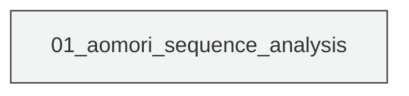
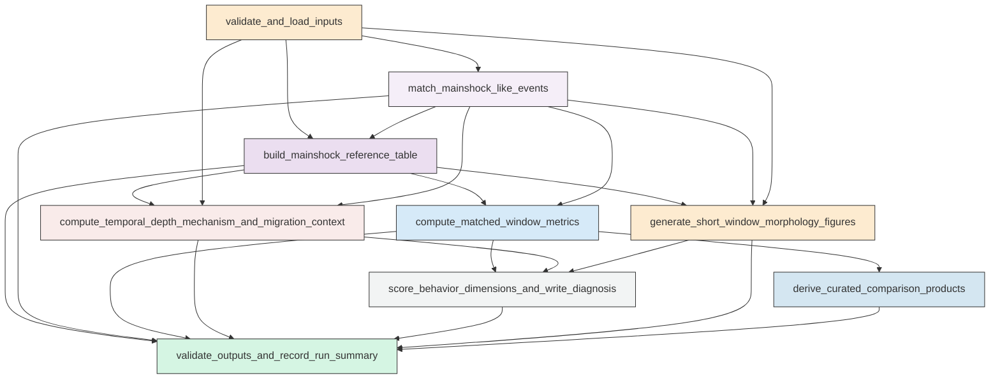

# Workflow Overview

## Top-Level Task Dependencies

**Description:**
- `01_aomori_sequence_analysis`: Build the mainshock-referenced sequence dataset, compute all requested metrics and context summaries, generate the required figures, score behavior dimensions, assemble the scientific diagnosis, and validate outputs in one self-contained script.

## Subtask Dependencies

#### 01_aomori_sequence_analysis
**Usage**: Build the mainshock-referenced sequence dataset, compute all requested metrics and context summaries, generate the required figures, score behavior dimensions, assemble the scientific diagnosis, and validate outputs in one self-contained script.

**Description:**
- `validate_and_load_inputs`: Load the catalog, mainshock, mechanism, and station inputs and standardize required fields.
- `match_mainshock_like_events`: Identify the catalog event corresponding to each mainshock with deterministic matching and ambiguity diagnostics.
- `build_mainshock_reference_table`: Compute event-to-mainshock relative times, distances, depth differences, bins, flags, and overlap diagnostics for all events.
- `generate_short_window_morphology_figures`: Create the required plus-minus 7 day and within 100 km morphology and summary figures for M1, M2, and M3.
- `compute_matched_window_metrics`: Compute exhaustive matched pre and post metrics across all requested time windows and spatial definitions.
- `derive_curated_comparison_products`: Summarize the exhaustive metric tables into cross-mainshock comparison figures and sensitivity views.
- `compute_temporal_depth_mechanism_and_migration_context`: Quantify temporal concentration, radial progression diagnostics, depth distributions, and focal mechanism context for each mainshock-centered sequence.
- `score_behavior_dimensions_and_write_diagnosis`: Assign evidence-based behavior-dimension scores for each mainshock and assemble the concise scientific diagnosis and evidence tables.
- `validate_outputs_and_record_run_summary`: Verify that all required tables and figures were created, are non-empty, and are recorded in a machine-readable run summary.