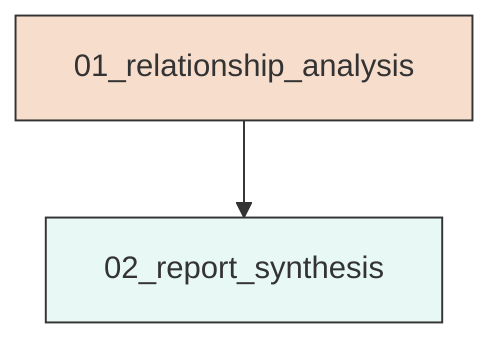
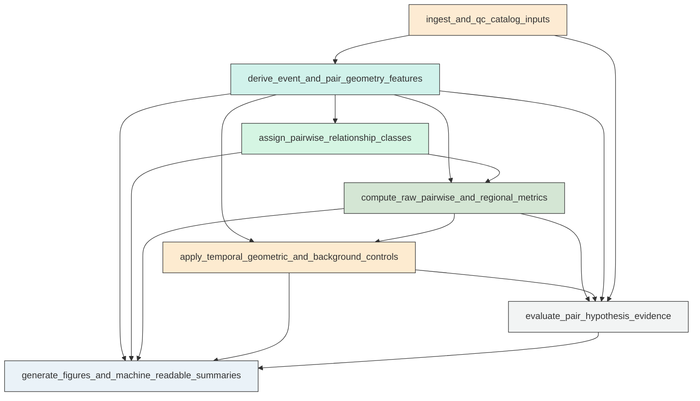
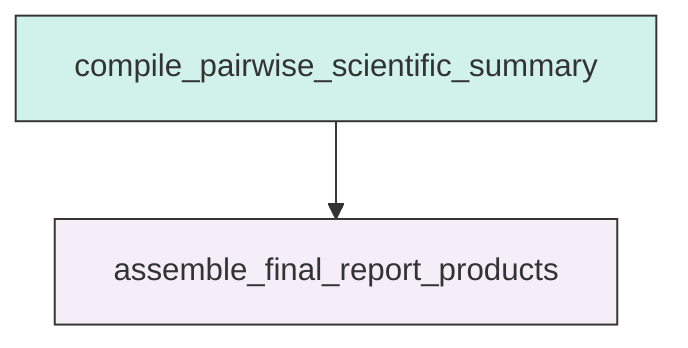

# Research Codings

## Task Overview


**Description:**
- `01_relationship_analysis`: Build the unified event-feature dataset, compute symmetric pairwise relationship metrics and controls, evaluate hypotheses, and generate compact diagnostic outputs for the Aomori M1-M2-M3 catalog analysis.
- `02_report_synthesis`: Assemble the final concise scientific report from validated relationship-analysis outputs without recomputing core metrics.


## Task Details


#### 01_relationship_analysis
**Usage**: Build the unified event-feature dataset, compute symmetric pairwise relationship metrics and controls, evaluate hypotheses, and generate compact diagnostic outputs for the Aomori M1-M2-M3 catalog analysis.

**Description:**
- `ingest_and_qc_catalog_inputs`: Load the relocated catalog and mainshock table, standardize fields, verify anchor events, and record catalog quality checks.
- `derive_event_and_pair_geometry_features`: Compute event-relative temporal and geometric features to each mainshock and to each mainshock pair.
- `assign_pairwise_relationship_classes`: Apply the same ambiguity-aware association framework to all three pairs and summarize stability across spatial settings.
- `compute_raw_pairwise_and_regional_metrics`: Quantify symmetric raw relationship metrics for all three pairs and summarize broader three-cluster regional activation patterns.
- `apply_temporal_geometric_and_background_controls`: Compare observed pairwise signals against temporal, geometric, and local-background controls to identify artifacts and robust effects.
- `evaluate_pair_hypothesis_evidence`: Score each pair-hypothesis combination with separate raw, control-corrected, and distance-aware evidence layers and assign follow-up priorities.
- `generate_figures_and_machine_readable_summaries`: Create the compact diagnostic figure set and export structured summary tables for pairwise interpretation and next-step prioritization.

#### Coding Script

```python

from __future__ import annotations

import math
import os
import sys
import traceback
from dataclasses import dataclass
from pathlib import Path
from typing import Dict, List, Tuple

import matplotlib
matplotlib.use('Agg')
import matplotlib.pyplot as plt
import numpy as np
import pandas as pd


BASE_DIR = Path("<CASE_ROOT>")
DATA_DIR = BASE_DIR / "data"
OUTPUT_DIR = BASE_DIR / "run/02_3_relationship_screening/exp_run/outputs/01_relationship_analysis"
CATALOG_PATH = DATA_DIR / "catalog/Snet_catalog_relocate_250930_260501.csv"
MAIN_PATH = DATA_DIR / "catalog/main_earthquake.csv"
MECHA_PATH = DATA_DIR / "source_mechanism/Snet_mecha.csv"
STATION_PATH = DATA_DIR / "stations/station.sta"

PAIR_NAMES = [("M1", "M2"), ("M1", "M3"), ("M2", "M3")]
MAG_THRESHOLDS = [3.0, 4.0, 5.0, 6.0]
RNG_SEED = 20260524
TEMPORAL_CONTROL_COUNT = 120
GEOMETRIC_CONTROL_COUNT = 120
PAIR_WINDOW_DAYS = 30.0
PREPOST_WINDOW_DAYS = 21.0
ENDPOINT_RADIUS_KM = 35.0
OVERLAP_RADIUS_KM = 60.0
OUTER_BAND_KM = 100.0
CORRIDOR_WIDTH_FACTORS = [0.12, 0.18, 0.25]
CORRIDOR_EXTEND_FRACTION = 0.10
TIME_LAG_DAYS = [3.0, 7.0, 14.0]
EARTH_RADIUS_KM = 6371.0
STALE_OUTPUT_PATTERNS = [
    "*.csv",
    "*.png",
    "*.jpg",
    "*.jpeg",
    "*.txt",
]


def log(message: str) -> None:
    print(message, flush=True)


def haversine_km(lat1, lon1, lat2, lon2):
    lat1 = np.radians(np.asarray(lat1, dtype=float))
    lon1 = np.radians(np.asarray(lon1, dtype=float))
    lat2 = np.radians(np.asarray(lat2, dtype=float))
    lon2 = np.radians(np.asarray(lon2, dtype=float))
    dlat = lat2 - lat1
    dlon = lon2 - lon1
    a = np.sin(dlat / 2.0) ** 2 + np.cos(lat1) * np.cos(lat2) * np.sin(dlon / 2.0) ** 2
    c = 2.0 * np.arcsin(np.sqrt(np.clip(a, 0.0, 1.0)))
    return EARTH_RADIUS_KM * c


def azimuth_deg(lat1, lon1, lat2, lon2):
    lat1r = np.radians(lat1)
    lat2r = np.radians(lat2)
    dlon = np.radians(lon2 - lon1)
    x = np.sin(dlon) * np.cos(lat2r)
    y = np.cos(lat1r) * np.sin(lat2r) - np.sin(lat1r) * np.cos(lat2r) * np.cos(dlon)
    az = np.degrees(np.arctan2(x, y))
    return (az + 360.0) % 360.0


def destination_point(lat_deg: float, lon_deg: float, az_deg: float, distance_km: float) -> Tuple[float, float]:
    lat1 = math.radians(lat_deg)
    lon1 = math.radians(lon_deg)
    brng = math.radians(az_deg)
    ang_dist = distance_km / EARTH_RADIUS_KM
    lat2 = math.asin(math.sin(lat1) * math.cos(ang_dist) + math.cos(lat1) * math.sin(ang_dist) * math.cos(brng))
    lon2 = lon1 + math.atan2(
        math.sin(brng) * math.sin(ang_dist) * math.cos(lat1),
        math.cos(ang_dist) - math.sin(lat1) * math.sin(lat2),
    )
    lon2 = (lon2 + math.pi) % (2 * math.pi) - math.pi
    return math.degrees(lat2), math.degrees(lon2)


def to_local_xy_km(lat, lon, lat0, lon0):
    lat = np.asarray(lat, dtype=float)
    lon = np.asarray(lon, dtype=float)
    mean_lat = np.radians((lat + lat0) / 2.0)
    x = (lon - lon0) * 111.32 * np.cos(mean_lat)
    y = (lat - lat0) * 111.32
    return x, y


@dataclass
class PairGeometry:
    pair_name: str
    a: str
    b: str
    a_time: pd.Timestamp
    b_time: pd.Timestamp
    a_lat: float
    a_lon: float
    b_lat: float
    b_lon: float
    a_dep: float
    b_dep: float
    separation_km: float
    depth_diff_km: float
    azimuth_ab_deg: float


def ensure_output_dir() -> None:
    OUTPUT_DIR.mkdir(parents=True, exist_ok=True)
    for pattern in STALE_OUTPUT_PATTERNS:
        for path in OUTPUT_DIR.glob(pattern):
            try:
                path.unlink()
                log(f"Removed stale output: {path}")
            except FileNotFoundError:
                continue


def load_inputs() -> Tuple[pd.DataFrame, pd.DataFrame, pd.DataFrame, pd.DataFrame]:
    log(f"Loading catalog from {CATALOG_PATH}")
    catalog = pd.read_csv(CATALOG_PATH)
    main = pd.read_csv(MAIN_PATH)
    mecha = pd.read_csv(MECHA_PATH)
    stations = pd.read_csv(STATION_PATH)

    catalog = catalog.rename(columns={"datetime": "origin_time", "lat": "latitude", "lon": "longitude", "dep": "depth_km", "mag": "magnitude"})
    main = main.rename(columns={"index": "mainshock_id", "datetime": "origin_time", "lat": "latitude", "lon": "longitude", "dep": "depth_km", "mag": "magnitude"})

    catalog["origin_time"] = pd.to_datetime(catalog["origin_time"], utc=True)
    main["origin_time"] = pd.to_datetime(main["origin_time"], utc=True)
    mecha["origin_time"] = pd.to_datetime(mecha["origin_time"], utc=True)

    catalog = catalog.drop_duplicates(subset=["origin_time", "latitude", "longitude", "depth_km", "magnitude"]).copy()
    catalog = catalog.sort_values("origin_time").reset_index(drop=True)
    catalog["event_id"] = np.arange(len(catalog), dtype=int)

    main = main.sort_values("origin_time").reset_index(drop=True)
    expected_ids = {"M1", "M2", "M3"}
    if set(main["mainshock_id"]) != expected_ids:
        raise ValueError(f"Unexpected mainshock ids: {set(main['mainshock_id'])}")

    for thr in MAG_THRESHOLDS:
        catalog[f"is_M{int(thr)}plus"] = catalog["magnitude"] >= thr

    return catalog, main, mecha, stations


def match_mechanisms(catalog: pd.DataFrame, mecha: pd.DataFrame) -> Tuple[pd.DataFrame, pd.DataFrame]:
    log("Matching focal mechanisms with conservative time-space tolerances")
    catalog_key = catalog[["event_id", "origin_time", "latitude", "longitude", "depth_km", "magnitude"]].copy()
    cat = catalog_key.sort_values("origin_time").reset_index(drop=True)
    mch = mecha.sort_values("origin_time").reset_index(drop=True).copy()
    merge = pd.merge_asof(
        mch,
        cat,
        on="origin_time",
        direction="nearest",
        tolerance=pd.Timedelta(seconds=15),
        suffixes=("_mecha", "_catalog"),
    )
    if "depth_km_mecha" not in merge.columns:
        raise ValueError("Mechanism table missing expected depth_km_mecha column after merge")
    if "depth_km_catalog" not in merge.columns:
        merge["depth_km_catalog"] = np.nan
    merge["space_km"] = haversine_km(merge["lat_deg"], merge["lon_deg"], merge["latitude"], merge["longitude"])
    merge["depth_abs_diff_km"] = (merge["depth_km_mecha"] - merge["depth_km_catalog"]).abs()
    merge["match_ok"] = merge["event_id"].notna() & (merge["space_km"] <= 10.0) & (merge["depth_abs_diff_km"] <= 15.0)
    matched = merge[merge["match_ok"]].copy()
    summary = pd.DataFrame(
        {
            "n_mechanisms": [len(mecha)],
            "n_time_matched": [merge["event_id"].notna().sum()],
            "n_conservative_matches": [len(matched)],
            "fraction_conservative_matches": [len(matched) / max(len(mecha), 1)],
            "median_space_km_time_matches": [merge.loc[merge["event_id"].notna(), "space_km"].median()],
        }
    )
    return matched, summary


def build_event_features(catalog: pd.DataFrame, main: pd.DataFrame) -> Tuple[pd.DataFrame, pd.DataFrame, Dict[str, PairGeometry]]:
    log("Building unified event-feature table and pair geometry")
    features = catalog.copy()
    main_by_id = {row.mainshock_id: row for row in main.itertuples(index=False)}

    for mid, row in main_by_id.items():
        features[f"dt_days_{mid}"] = (features["origin_time"] - row.origin_time).dt.total_seconds() / 86400.0
        features[f"dist_km_{mid}"] = haversine_km(features["latitude"], features["longitude"], row.latitude, row.longitude)
        features[f"depth_diff_km_{mid}"] = features["depth_km"] - row.depth_km
        features[f"hypo_proxy_km_{mid}"] = np.sqrt(features[f"dist_km_{mid}"] ** 2 + features[f"depth_diff_km_{mid}"] ** 2)

    dist_cols = [f"dist_km_{mid}" for mid in ["M1", "M2", "M3"]]
    dist_array = features[dist_cols].to_numpy()
    order = np.argsort(dist_array, axis=1)
    sorted_dist = np.take_along_axis(dist_array, order, axis=1)
    main_ids = np.array(["M1", "M2", "M3"])
    features["nearest_mainshock"] = main_ids[order[:, 0]]
    features["second_nearest_mainshock"] = main_ids[order[:, 1]]
    features["nearest_dist_km"] = sorted_dist[:, 0]
    features["second_nearest_dist_km"] = sorted_dist[:, 1]
    features["nearest_margin_km"] = sorted_dist[:, 1] - sorted_dist[:, 0]
    features["nearest_ratio"] = sorted_dist[:, 0] / np.maximum(sorted_dist[:, 1], 1e-6)
    features["all_pair_min_dist_km"] = sorted_dist[:, 0]

    pair_rows = []
    pair_geoms: Dict[str, PairGeometry] = {}
    for a, b in PAIR_NAMES:
        ra = main_by_id[a]
        rb = main_by_id[b]
        sep = float(haversine_km(ra.latitude, ra.longitude, rb.latitude, rb.longitude))
        az = float(azimuth_deg(ra.latitude, ra.longitude, rb.latitude, rb.longitude))
        geom = PairGeometry(
            pair_name=f"{a}_{b}",
            a=a,
            b=b,
            a_time=ra.origin_time,
            b_time=rb.origin_time,
            a_lat=float(ra.latitude),
            a_lon=float(ra.longitude),
            b_lat=float(rb.latitude),
            b_lon=float(rb.longitude),
            a_dep=float(ra.depth_km),
            b_dep=float(rb.depth_km),
            separation_km=sep,
            depth_diff_km=float(rb.depth_km - ra.depth_km),
            azimuth_ab_deg=az,
        )
        pair_geoms[geom.pair_name] = geom
        pair_rows.append(
            {
                "pair_name": geom.pair_name,
                "mainshock_a": a,
                "mainshock_b": b,
                "a_time": geom.a_time,
                "b_time": geom.b_time,
                "pair_time_sep_days": (geom.b_time - geom.a_time).total_seconds() / 86400.0,
                "pair_sep_km": geom.separation_km,
                "pair_depth_diff_km": geom.depth_diff_km,
                "pair_azimuth_deg": geom.azimuth_ab_deg,
            }
        )

        ax, ay = to_local_xy_km(features["latitude"], features["longitude"], geom.a_lat, geom.a_lon)
        bx, by = to_local_xy_km(np.array([geom.b_lat]), np.array([geom.b_lon]), geom.a_lat, geom.a_lon)
        bx = float(bx[0])
        by = float(by[0])
        pair_vec = np.array([bx, by], dtype=float)
        pair_len2 = max(float(np.dot(pair_vec, pair_vec)), 1e-6)
        proj = (ax * pair_vec[0] + ay * pair_vec[1]) / math.sqrt(pair_len2)
        pos = (ax * pair_vec[0] + ay * pair_vec[1]) / pair_len2
        cross = (ax * pair_vec[1] - ay * pair_vec[0]) / math.sqrt(pair_len2)
        midpoint_x = 0.5 * bx
        midpoint_y = 0.5 * by
        midpoint_dist = np.sqrt((ax - midpoint_x) ** 2 + (ay - midpoint_y) ** 2)
        features[f"proj_km_{geom.pair_name}"] = proj
        features[f"pos_{geom.pair_name}"] = pos
        features[f"cross_km_{geom.pair_name}"] = cross
        features[f"midpoint_dist_km_{geom.pair_name}"] = midpoint_dist

    pair_df = pd.DataFrame(pair_rows)
    return features, pair_df, pair_geoms


def classify_pair_events(features: pd.DataFrame, geom: PairGeometry, width_km: float) -> pd.DataFrame:
    df = features[[
        "event_id", "origin_time", "latitude", "longitude", "depth_km", "magnitude",
        f"dist_km_{geom.a}", f"dist_km_{geom.b}", "nearest_mainshock", "second_nearest_mainshock",
        "nearest_dist_km", "second_nearest_dist_km", "nearest_margin_km", "nearest_ratio",
        f"proj_km_{geom.pair_name}", f"pos_{geom.pair_name}", f"cross_km_{geom.pair_name}",
        f"midpoint_dist_km_{geom.pair_name}", f"dt_days_{geom.a}", f"dt_days_{geom.b}",
    ]].copy()
    df = df.rename(columns={
        f"dist_km_{geom.a}": "dist_a_km",
        f"dist_km_{geom.b}": "dist_b_km",
        f"proj_km_{geom.pair_name}": "proj_km",
        f"pos_{geom.pair_name}": "pos_norm",
        f"cross_km_{geom.pair_name}": "cross_km",
        f"midpoint_dist_km_{geom.pair_name}": "midpoint_dist_km",
        f"dt_days_{geom.a}": "dt_a_days",
        f"dt_days_{geom.b}": "dt_b_days",
    })
    df["pair_name"] = geom.pair_name
    corridor_min = -CORRIDOR_EXTEND_FRACTION
    corridor_max = 1.0 + CORRIDOR_EXTEND_FRACTION
    in_corridor = (df["pos_norm"] >= corridor_min) & (df["pos_norm"] <= corridor_max) & (df["cross_km"].abs() <= width_km)
    in_core_segment = (df["pos_norm"] >= 0.0) & (df["pos_norm"] <= 1.0) & (df["cross_km"].abs() <= width_km)
    endpoint_a = df["dist_a_km"] <= ENDPOINT_RADIUS_KM
    endpoint_b = df["dist_b_km"] <= ENDPOINT_RADIUS_KM
    overlap = (df["dist_a_km"] <= OVERLAP_RADIUS_KM) & (df["dist_b_km"] <= OVERLAP_RADIUS_KM)
    outer_band = (
        ((df["dist_a_km"] > ENDPOINT_RADIUS_KM) & (df["dist_a_km"] <= OUTER_BAND_KM)) |
        ((df["dist_b_km"] > ENDPOINT_RADIUS_KM) & (df["dist_b_km"] <= OUTER_BAND_KM))
    )

    required_cols = {
        "dist_a_km", "dist_b_km", "nearest_mainshock", "nearest_margin_km", "nearest_ratio",
        "second_nearest_dist_km", "pos_norm", "cross_km"
    }
    missing = required_cols.difference(df.columns)
    if missing:
        raise ValueError(f"Missing required columns for pair classification {geom.pair_name}: {sorted(missing)}")

    labels = []
    for row in df.itertuples(index=False):
        label = "regional_background"
        if row.dist_a_km <= ENDPOINT_RADIUS_KM and row.dist_b_km > OVERLAP_RADIUS_KM and row.nearest_mainshock == geom.a and row.nearest_margin_km >= 10.0:
            label = f"unique_{geom.a}"
        elif row.dist_b_km <= ENDPOINT_RADIUS_KM and row.dist_a_km > OVERLAP_RADIUS_KM and row.nearest_mainshock == geom.b and row.nearest_margin_km >= 10.0:
            label = f"unique_{geom.b}"
        elif row.dist_a_km <= OVERLAP_RADIUS_KM and row.dist_b_km <= OVERLAP_RADIUS_KM:
            label = "shared_overlap"
        elif corridor_min <= row.pos_norm <= corridor_max and abs(row.cross_km) <= width_km and row.dist_a_km > ENDPOINT_RADIUS_KM and row.dist_b_km > ENDPOINT_RADIUS_KM:
            label = "corridor_like"
        elif corridor_min <= row.pos_norm <= corridor_max and abs(row.cross_km) <= width_km and (row.dist_a_km <= ENDPOINT_RADIUS_KM or row.dist_b_km <= ENDPOINT_RADIUS_KM):
            label = "endpoint_centered_corridor_adjacent"
        elif ((ENDPOINT_RADIUS_KM < row.dist_a_km <= OUTER_BAND_KM) or (ENDPOINT_RADIUS_KM < row.dist_b_km <= OUTER_BAND_KM)):
            label = "outer_cluster"
        elif row.nearest_ratio > 0.85 and row.second_nearest_dist_km <= OVERLAP_RADIUS_KM * 1.3:
            label = "unresolved"
        labels.append(label)

    df["in_corridor"] = in_corridor
    df["in_core_segment"] = in_core_segment
    df["in_sideband"] = (df["pos_norm"] >= corridor_min) & (df["pos_norm"] <= corridor_max) & (df["cross_km"].abs() > width_km) & (df["cross_km"].abs() <= 2 * width_km)
    df["endpoint_a_near"] = endpoint_a
    df["endpoint_b_near"] = endpoint_b
    df["shared_overlap"] = overlap
    df["outer_band"] = outer_band
    df["assignment"] = labels
    df["corridor_width_km"] = width_km
    return df


def build_assignment_tables(features: pd.DataFrame, pair_geoms: Dict[str, PairGeometry]) -> Tuple[Dict[str, pd.DataFrame], pd.DataFrame]:
    log("Assigning ambiguity-aware pairwise event categories")
    assignments = {}
    stability_rows = []
    for pair_name, geom in pair_geoms.items():
        widths = [max(12.0, geom.separation_km * f) for f in CORRIDOR_WIDTH_FACTORS]
        width_tables = []
        for width in widths:
            width_tables.append(classify_pair_events(features, geom, width))
        base = width_tables[1].copy()
        compare = pd.concat([t[["event_id", "assignment"]].rename(columns={"assignment": f"assignment_{i}"}) for i, t in enumerate(width_tables)], axis=1)
        compare = compare.loc[:, ~compare.columns.duplicated()]
        stable = (compare["assignment_0"] == compare["assignment_1"]) & (compare["assignment_1"] == compare["assignment_2"])
        base["assignment_stable_across_widths"] = stable.values
        assignments[pair_name] = base
        counts = base["assignment"].value_counts(dropna=False).to_dict()
        stability_rows.append(
            {
                "pair_name": pair_name,
                "width_narrow_km": widths[0],
                "width_base_km": widths[1],
                "width_broad_km": widths[2],
                "stable_fraction": float(stable.mean()),
                "n_events": len(base),
                **{f"count_{k}": v for k, v in counts.items()},
            }
        )
    return assignments, pd.DataFrame(stability_rows)


def summarize_intervening_chain(df: pd.DataFrame, geom: PairGeometry, mag_thr: float) -> Dict[str, object]:
    subset = df[(df["magnitude"] >= mag_thr) & (df["pos_norm"] >= 0.0) & (df["pos_norm"] <= 1.0)].copy()
    subset = subset.sort_values("origin_time")
    between_mask = (subset["origin_time"] >= geom.a_time) & (subset["origin_time"] <= geom.b_time)
    between = subset[between_mask].copy()
    first_time = between["origin_time"].min() if len(between) else pd.NaT
    first_pos = between.loc[between["origin_time"].idxmin(), "pos_norm"] if len(between) else np.nan
    trend = np.nan
    if len(between) >= 3:
        x = (between["origin_time"] - geom.a_time).dt.total_seconds() / 86400.0
        y = between["pos_norm"].to_numpy()
        trend = np.polyfit(x, y, 1)[0]
    return {
        "pair_name": geom.pair_name,
        "mag_threshold": mag_thr,
        "n_segment_events": len(subset),
        "n_between_mainshocks": len(between),
        "first_between_time": first_time,
        "first_between_pos_norm": first_pos,
        "between_pos_trend_per_day": trend,
        "between_magnitudes": "|".join(f"{m:.1f}" for m in between["magnitude"].head(12)),
        "between_times": "|".join(t.isoformat() for t in between["origin_time"].head(12)),
    }


def compute_pair_metrics(assign_df: pd.DataFrame, geom: PairGeometry) -> Tuple[List[Dict[str, object]], List[Dict[str, object]]]:
    metrics = []
    chains = []
    t0 = geom.a_time - pd.Timedelta(days=PAIR_WINDOW_DAYS)
    t1 = geom.b_time + pd.Timedelta(days=PAIR_WINDOW_DAYS)
    pair_scope = assign_df[(assign_df["origin_time"] >= t0) & (assign_df["origin_time"] <= t1)].copy()

    for thr in [0.0] + MAG_THRESHOLDS:
        name = "all" if thr == 0.0 else f"M{int(thr)}plus"
        sub = pair_scope if thr == 0.0 else pair_scope[pair_scope["magnitude"] >= thr]
        between = sub[(sub["origin_time"] >= geom.a_time) & (sub["origin_time"] <= geom.b_time)]
        pre_a = sub[(sub["origin_time"] >= geom.a_time - pd.Timedelta(days=PREPOST_WINDOW_DAYS)) & (sub["origin_time"] < geom.a_time)]
        post_a = sub[(sub["origin_time"] > geom.a_time) & (sub["origin_time"] <= geom.a_time + pd.Timedelta(days=PREPOST_WINDOW_DAYS))]
        pre_b = sub[(sub["origin_time"] >= geom.b_time - pd.Timedelta(days=PREPOST_WINDOW_DAYS)) & (sub["origin_time"] < geom.b_time)]
        post_b = sub[(sub["origin_time"] > geom.b_time) & (sub["origin_time"] <= geom.b_time + pd.Timedelta(days=PREPOST_WINDOW_DAYS))]
        a_near = sub[sub["endpoint_a_near"]]
        b_near = sub[sub["endpoint_b_near"]]
        corridor = sub[sub["in_core_segment"]]
        sideband = sub[sub["in_sideband"]]
        outer = sub[sub["outer_band"]]
        shared = sub[sub["shared_overlap"]]
        ambiguous_fraction = float(sub["assignment"].isin(["shared_overlap", "corridor_like", "unresolved", "endpoint_centered_corridor_adjacent"]).mean()) if len(sub) else np.nan
        nearest_balance = float((sub["nearest_mainshock"] == geom.a).sum() / max((sub["nearest_mainshock"] == geom.b).sum(), 1)) if len(sub) else np.nan
        corridor_fraction = float(len(corridor) / max(len(sub), 1))
        midpoint_fraction = float((sub["midpoint_dist_km"] <= geom.separation_km * 0.25).mean()) if len(sub) else np.nan
        between_corridor_fraction = float(corridor["origin_time"].between(geom.a_time, geom.b_time, inclusive="both").mean()) if len(corridor) else np.nan
        row = {
            "pair_name": geom.pair_name,
            "mag_subset": name,
            "n_events": len(sub),
            "n_between_mainshocks": len(between),
            "n_endpoint_a": len(a_near),
            "n_endpoint_b": len(b_near),
            "n_shared_overlap": len(shared),
            "n_corridor": len(corridor),
            "n_sideband": len(sideband),
            "n_outer_band": len(outer),
            "corridor_fraction": corridor_fraction,
            "sideband_fraction": float(len(sideband) / max(len(sub), 1)),
            "outer_fraction": float(len(outer) / max(len(sub), 1)),
            "shared_fraction": float(len(shared) / max(len(sub), 1)),
            "midpoint_fraction": midpoint_fraction,
            "ambiguous_fraction": ambiguous_fraction,
            "nearest_balance_a_over_b": nearest_balance,
            "pre_a_count": len(pre_a),
            "post_a_count": len(post_a),
            "pre_b_count": len(pre_b),
            "post_b_count": len(post_b),
            "post_pre_a_ratio": float((len(post_a) + 1) / (len(pre_a) + 1)),
            "post_pre_b_ratio": float((len(post_b) + 1) / (len(pre_b) + 1)),
            "between_corridor_fraction": between_corridor_fraction,
            "median_cross_km": float(sub["cross_km"].abs().median()) if len(sub) else np.nan,
            "median_midpoint_dist_km": float(sub["midpoint_dist_km"].median()) if len(sub) else np.nan,
            "median_depth_km": float(sub["depth_km"].median()) if len(sub) else np.nan,
            "median_depth_endpoint_a": float(a_near["depth_km"].median()) if len(a_near) else np.nan,
            "median_depth_endpoint_b": float(b_near["depth_km"].median()) if len(b_near) else np.nan,
            "median_depth_corridor": float(corridor["depth_km"].median()) if len(corridor) else np.nan,
            "median_mag": float(sub["magnitude"].median()) if len(sub) else np.nan,
        }
        for lag in TIME_LAG_DAYS:
            b_after_a = sub[(sub["endpoint_b_near"]) & (sub["origin_time"] > geom.a_time) & (sub["origin_time"] <= geom.a_time + pd.Timedelta(days=lag))]
            a_before_a = sub[(sub["endpoint_b_near"]) & (sub["origin_time"] >= geom.a_time - pd.Timedelta(days=lag)) & (sub["origin_time"] < geom.a_time)]
            a_after_b = sub[(sub["endpoint_a_near"]) & (sub["origin_time"] > geom.b_time) & (sub["origin_time"] <= geom.b_time + pd.Timedelta(days=lag))]
            b_before_b = sub[(sub["endpoint_a_near"]) & (sub["origin_time"] >= geom.b_time - pd.Timedelta(days=lag)) & (sub["origin_time"] < geom.b_time)]
            row[f"opp_endpoint_response_{int(lag)}d_after_a"] = len(b_after_a) - len(a_before_a)
            row[f"opp_endpoint_response_{int(lag)}d_after_b"] = len(a_after_b) - len(b_before_b)
        metrics.append(row)

    for thr in MAG_THRESHOLDS:
        chains.append(summarize_intervening_chain(pair_scope, geom, thr))
    return metrics, chains


def compute_regional_summary(features: pd.DataFrame, main: pd.DataFrame, assignments: Dict[str, pd.DataFrame]) -> pd.DataFrame:
    log("Computing three-cluster regional diagnostics")
    rows = []
    rows.append({
        "metric": "catalog_event_count",
        "value": len(features),
    })
    rows.append({
        "metric": "m4plus_event_count",
        "value": int((features["magnitude"] >= 4.0).sum()),
    })
    rows.append({
        "metric": "m5plus_event_count",
        "value": int((features["magnitude"] >= 5.0).sum()),
    })
    nearest_counts = features["nearest_mainshock"].value_counts().to_dict()
    for k, v in nearest_counts.items():
        rows.append({"metric": f"nearest_partition_{k}", "value": int(v)})
    features["outer_any_100km"] = ((features["dist_km_M1"].between(ENDPOINT_RADIUS_KM, OUTER_BAND_KM)) | (features["dist_km_M2"].between(ENDPOINT_RADIUS_KM, OUTER_BAND_KM)) | (features["dist_km_M3"].between(ENDPOINT_RADIUS_KM, OUTER_BAND_KM)))
    month_series = features["origin_time"].dt.tz_convert("UTC").dt.strftime("%Y-%m")
    monthly = features.assign(month=month_series).groupby("month").agg(total=("event_id", "count"), outer=("outer_any_100km", "sum"), m4plus=("is_M4plus", "sum")).reset_index()
    monthly["outer_fraction"] = monthly["outer"] / monthly["total"]
    monthly.to_csv(OUTPUT_DIR / "regional_outer_band_timeline.csv", index=False)
    for _, row in monthly.iterrows():
        rows.append({"metric": f"monthly_outer_fraction_{row['month']}", "value": row["outer_fraction"]})
    for pair_name, df in assignments.items():
        for thr in [4.0, 5.0, 6.0]:
            sub = df[df["magnitude"] >= thr]
            frac = float(sub["assignment"].isin(["shared_overlap", "corridor_like", "endpoint_centered_corridor_adjacent", "unresolved"]).mean()) if len(sub) else np.nan
            rows.append({"metric": f"{pair_name}_ambiguous_frac_M{int(thr)}plus", "value": frac})
    return pd.DataFrame(rows)


def temporal_control_metrics(assign_df: pd.DataFrame, geom: PairGeometry, thr: float, rng: np.random.Generator) -> Dict[str, float]:
    sub = assign_df if thr == 0.0 else assign_df[assign_df["magnitude"] >= thr]
    if len(sub) == 0:
        return {"between_count_control_median": np.nan, "between_count_control_pct": np.nan, "corridor_between_control_median": np.nan, "corridor_between_control_pct": np.nan}
    observed_between = int(((sub["origin_time"] >= geom.a_time) & (sub["origin_time"] <= geom.b_time)).sum())
    observed_corridor_between = int((((sub["origin_time"] >= geom.a_time) & (sub["origin_time"] <= geom.b_time)) & sub["in_core_segment"]).sum())
    span_days = max((geom.b_time - geom.a_time).total_seconds() / 86400.0, 1.0)
    tmin = sub["origin_time"].min() + pd.Timedelta(days=span_days / 2.0)
    tmax = sub["origin_time"].max() - pd.Timedelta(days=span_days / 2.0)
    if tmax <= tmin:
        return {"between_count_control_median": np.nan, "between_count_control_pct": np.nan, "corridor_between_control_median": np.nan, "corridor_between_control_pct": np.nan}
    center_ns = rng.integers(int(tmin.value), int(tmax.value) + 1, size=TEMPORAL_CONTROL_COUNT, dtype=np.int64)
    centers = pd.to_datetime(center_ns, utc=True)
    between_counts = []
    corridor_counts = []
    half = pd.Timedelta(days=span_days / 2.0)
    for c in centers:
        w0 = c - half
        w1 = c + half
        mask = (sub["origin_time"] >= w0) & (sub["origin_time"] <= w1)
        between_counts.append(int(mask.sum()))
        corridor_counts.append(int((mask & sub["in_core_segment"]).sum()))
    between_arr = np.array(between_counts)
    corr_arr = np.array(corridor_counts)
    return {
        "between_count_control_median": float(np.median(between_arr)),
        "between_count_control_pct": float((between_arr <= observed_between).mean()),
        "corridor_between_control_median": float(np.median(corr_arr)),
        "corridor_between_control_pct": float((corr_arr <= observed_corridor_between).mean()),
    }


def geometric_control_metrics(assign_df: pd.DataFrame, geom: PairGeometry, thr: float, rng: np.random.Generator) -> Dict[str, float]:
    sub = assign_df if thr == 0.0 else assign_df[assign_df["magnitude"] >= thr]
    if len(sub) == 0:
        return {"pseudo_corridor_median": np.nan, "pseudo_corridor_pct": np.nan, "pseudo_sideband_median": np.nan}
    observed_corridor = int(sub["in_core_segment"].sum())
    observed_sideband = int(sub["in_sideband"].sum())
    width = float(sub["corridor_width_km"].iloc[0])
    lat_ref = float(0.5 * (geom.a_lat + geom.b_lat))
    lon_ref = float(0.5 * (geom.a_lon + geom.b_lon))
    x, y = to_local_xy_km(sub["latitude"], sub["longitude"], lat_ref, lon_ref)
    pseudo_counts = []
    pseudo_side = []
    sep = geom.separation_km
    for _ in range(GEOMETRIC_CONTROL_COUNT):
        az = rng.uniform(0, 360)
        shift = rng.uniform(-0.35 * sep, 0.35 * sep)
        start_lat, start_lon = destination_point(lat_ref, lon_ref, az + 180, sep / 2.0)
        start_lat, start_lon = destination_point(start_lat, start_lon, az + 90, shift)
        end_lat, end_lon = destination_point(start_lat, start_lon, az, sep)
        sx, sy = to_local_xy_km(np.array([start_lat]), np.array([start_lon]), lat_ref, lon_ref)
        ex, ey = to_local_xy_km(np.array([end_lat]), np.array([end_lon]), lat_ref, lon_ref)
        vec = np.array([float(ex[0] - sx[0]), float(ey[0] - sy[0])])
        vlen2 = max(float(np.dot(vec, vec)), 1e-6)
        px = x - float(sx[0])
        py = y - float(sy[0])
        pos = (px * vec[0] + py * vec[1]) / vlen2
        cross = (px * vec[1] - py * vec[0]) / math.sqrt(vlen2)
        core = (pos >= 0.0) & (pos <= 1.0) & (np.abs(cross) <= width)
        side = (pos >= -CORRIDOR_EXTEND_FRACTION) & (pos <= 1.0 + CORRIDOR_EXTEND_FRACTION) & (np.abs(cross) > width) & (np.abs(cross) <= 2 * width)
        pseudo_counts.append(int(core.sum()))
        pseudo_side.append(int(side.sum()))
    pc = np.array(pseudo_counts)
    ps = np.array(pseudo_side)
    return {
        "pseudo_corridor_median": float(np.median(pc)),
        "pseudo_corridor_pct": float((pc <= observed_corridor).mean()),
        "pseudo_sideband_median": float(np.median(ps)),
        "observed_corridor_count": observed_corridor,
        "observed_sideband_count": observed_sideband,
    }


def build_control_corrected_metrics(assignments: Dict[str, pd.DataFrame], pair_geoms: Dict[str, PairGeometry]) -> pd.DataFrame:
    log("Running temporal and geometric controls")
    rng = np.random.default_rng(RNG_SEED)
    rows = []
    for pair_name, df in assignments.items():
        geom = pair_geoms[pair_name]
        for thr in [0.0] + MAG_THRESHOLDS:
            subset_name = "all" if thr == 0.0 else f"M{int(thr)}plus"
            trow = temporal_control_metrics(df, geom, thr, rng)
            grow = geometric_control_metrics(df, geom, thr, rng)
            observed = df if thr == 0.0 else df[df["magnitude"] >= thr]
            obs_between = int(((observed["origin_time"] >= geom.a_time) & (observed["origin_time"] <= geom.b_time)).sum())
            obs_corridor_between = int((((observed["origin_time"] >= geom.a_time) & (observed["origin_time"] <= geom.b_time)) & observed["in_core_segment"]).sum())
            obs_corridor = int(observed["in_core_segment"].sum())
            obs_side = int(observed["in_sideband"].sum())
            side_ratio = obs_corridor / max(obs_side, 1)
            pseudo_side_median = grow.get("pseudo_sideband_median", np.nan)
            pseudo_side_ratio = obs_corridor / max(pseudo_side_median, 1.0) if pd.notna(pseudo_side_median) else np.nan
            rows.append({
                "pair_name": pair_name,
                "mag_subset": subset_name,
                "obs_between_count": obs_between,
                "obs_corridor_between_count": obs_corridor_between,
                "obs_corridor_count": obs_corridor,
                "obs_sideband_count": obs_side,
                "corridor_side_ratio": side_ratio,
                "temporal_effect_between": obs_between - trow.get("between_count_control_median", np.nan),
                "temporal_effect_corridor_between": obs_corridor_between - trow.get("corridor_between_control_median", np.nan),
                **trow,
                **grow,
                "geometric_corridor_effect": obs_corridor - grow.get("pseudo_corridor_median", np.nan),
                "corridor_vs_sideband_control_ratio": pseudo_side_ratio,
            })
    return pd.DataFrame(rows)


def classify_strength(score: float) -> str:
    if pd.isna(score):
        return "low"
    if score >= 0.75:
        return "strong"
    if score >= 0.50:
        return "moderate"
    if score >= 0.25:
        return "possible"
    return "low"


def evaluate_hypotheses(raw_metrics: pd.DataFrame, control_metrics: pd.DataFrame, pair_geoms: Dict[str, PairGeometry], mechanism_matches: pd.DataFrame) -> Tuple[pd.DataFrame, pd.DataFrame, pd.DataFrame]:
    log("Evaluating pair-hypothesis evidence matrix")
    hypotheses = [
        "independent_local_clusters",
        "overlapping_activation_zones",
        "delayed_activation_between_clusters",
        "linked_local_fault_system_activation",
        "corridor_like_migration_or_expansion",
        "broader_regional_activation",
        "compound_swarm_like_multi_event_clustering",
        "apparent_relationship_from_background_or_window_choices",
        "common_regional_rate_pulse_without_pair_specific_linkage",
    ]
    evidence_rows = []
    plaus_rows = []
    priority_rows = []
    raw_all = raw_metrics[raw_metrics["mag_subset"] == "all"].set_index("pair_name")
    raw_m4 = raw_metrics[raw_metrics["mag_subset"] == "M4plus"].set_index("pair_name")
    raw_m5 = raw_metrics[raw_metrics["mag_subset"] == "M5plus"].set_index("pair_name")
    ctrl_all = control_metrics[control_metrics["mag_subset"] == "all"].set_index("pair_name")
    ctrl_m4 = control_metrics[control_metrics["mag_subset"] == "M4plus"].set_index("pair_name")

    for pair_name, geom in pair_geoms.items():
        ra = raw_all.loc[pair_name]
        rm4 = raw_m4.loc[pair_name] if pair_name in raw_m4.index else ra
        rm5 = raw_m5.loc[pair_name] if pair_name in raw_m5.index else ra
        ca = ctrl_all.loc[pair_name]
        cm4 = ctrl_m4.loc[pair_name] if pair_name in ctrl_m4.index else ca

        sep_norm = geom.separation_km
        distance_link_score = max(0.0, 1.0 - min(sep_norm / 180.0, 1.0))
        depth_penalty = min(abs(geom.depth_diff_km) / 40.0, 1.0)
        time_sep_days = abs((geom.b_time - geom.a_time).total_seconds() / 86400.0)
        time_penalty = min(time_sep_days / 180.0, 1.0)
        corridor_raw = min(1.0, rm4.get("corridor_fraction", 0.0) * 4.0 + rm4.get("midpoint_fraction", 0.0) * 1.5)
        overlap_raw = min(1.0, rm4.get("shared_fraction", 0.0) * 5.0 + rm4.get("ambiguous_fraction", 0.0))
        delayed_raw = min(1.0, max(rm4.get("opp_endpoint_response_7d_after_a", 0), rm4.get("opp_endpoint_response_7d_after_b", 0), 0) / 4.0)
        regional_raw = min(1.0, rm4.get("outer_fraction", 0.0) * 2.0 + rm5.get("n_outer_band", 0) / 5.0)
        compound_raw = min(1.0, (rm4.get("ambiguous_fraction", 0.0) + max(0.0, 1.0 - abs(math.log(max(rm4.get("nearest_balance_a_over_b", 1.0), 1e-6)))) / 3.0) / 2.0)
        independent_raw = min(1.0, ((1.0 - rm4.get("ambiguous_fraction", 0.0)) + (1.0 - rm4.get("corridor_fraction", 0.0))) / 2.0)
        artifact_raw = min(1.0, (max(0.0, 1.0 - cm4.get("between_count_control_pct", 0.0)) + max(0.0, 1.0 - cm4.get("pseudo_corridor_pct", 0.0))) / 2.0)
        pulse_raw = min(1.0, regional_raw * 0.7 + max(0.0, 1.0 - corridor_raw) * 0.3)

        corrected_overlap = min(1.0, overlap_raw * cm4.get("pseudo_corridor_pct", 0.0) * cm4.get("between_count_control_pct", 0.0))
        corrected_corridor = min(1.0, corridor_raw * cm4.get("pseudo_corridor_pct", 0.0))
        corrected_delayed = min(1.0, delayed_raw * cm4.get("between_count_control_pct", 0.0))
        corrected_regional = min(1.0, regional_raw * (0.5 + 0.5 * ca.get("between_count_control_pct", 0.0)))
        corrected_compound = min(1.0, compound_raw * (0.5 + 0.5 * cm4.get("between_count_control_pct", 0.0)))
        corrected_independent = min(1.0, independent_raw * (1.0 - corrected_overlap * 0.5 - corrected_corridor * 0.5))
        corrected_artifact = min(1.0, max(0.0, 1.0 - cm4.get("between_count_control_pct", 0.0)) * 0.5 + max(0.0, 1.0 - cm4.get("pseudo_corridor_pct", 0.0)) * 0.5)
        corrected_linked = min(1.0, 0.5 * corrected_overlap + 0.5 * corrected_corridor)
        corrected_pulse = min(1.0, corrected_regional * (1.0 - corrected_corridor * 0.4))

        distance_overlap = max(0.0, distance_link_score - 0.2 * depth_penalty)
        distance_delayed = max(0.0, distance_link_score - 0.3 * depth_penalty - 0.3 * time_penalty)
        distance_linked = max(0.0, distance_link_score - 0.2 * depth_penalty)
        distance_corridor = max(0.0, distance_link_score - 0.25 * depth_penalty)
        distance_regional = min(1.0, 0.3 + (1.0 - distance_link_score) * 0.7 + 0.2 * depth_penalty)
        distance_compound = max(0.0, distance_link_score - 0.4 * time_penalty)
        distance_independent = min(1.0, 0.3 + (1.0 - distance_link_score) * 0.7 + 0.2 * depth_penalty)
        distance_artifact = min(1.0, 0.4 + (1.0 - distance_link_score) * 0.4 + 0.2 * time_penalty)
        distance_pulse = min(1.0, distance_regional)

        score_map = {
            "independent_local_clusters": (independent_raw, corrected_independent, distance_independent),
            "overlapping_activation_zones": (overlap_raw, corrected_overlap, distance_overlap),
            "delayed_activation_between_clusters": (delayed_raw, corrected_delayed, distance_delayed),
            "linked_local_fault_system_activation": (0.5 * (overlap_raw + corridor_raw), corrected_linked, distance_linked),
            "corridor_like_migration_or_expansion": (corridor_raw, corrected_corridor, distance_corridor),
            "broader_regional_activation": (regional_raw, corrected_regional, distance_regional),
            "compound_swarm_like_multi_event_clustering": (compound_raw, corrected_compound, distance_compound),
            "apparent_relationship_from_background_or_window_choices": (artifact_raw, corrected_artifact, distance_artifact),
            "common_regional_rate_pulse_without_pair_specific_linkage": (pulse_raw, corrected_pulse, distance_pulse),
        }

        mech_subset = mechanism_matches.copy()
        if len(mech_subset):
            da = haversine_km(mech_subset["lat_deg"], mech_subset["lon_deg"], geom.a_lat, geom.a_lon)
            db = haversine_km(mech_subset["lat_deg"], mech_subset["lon_deg"], geom.b_lat, geom.b_lon)
            mech_near = mech_subset[(da <= 50) | (db <= 50)]
            mech_quality = "too_sparse"
            if len(mech_near) >= 5:
                rake_std = np.nanstd(pd.to_numeric(mech_near["rake_plane1"], errors="coerce"))
                mech_quality = "mixed" if rake_std > 60 else "broadly_compatible"
        else:
            mech_quality = "too_sparse"

        for hyp in hypotheses:
            raw_score, corr_score, dist_score = score_map[hyp]
            evidence_rows.append({
                "pair_name": pair_name,
                "hypothesis": hyp,
                "raw_score": raw_score,
                "corrected_score": corr_score,
                "distance_score": dist_score,
                "raw_evidence": classify_strength(raw_score),
                "control_corrected_evidence": classify_strength(corr_score),
                "distance_aware_plausibility": classify_strength(dist_score),
                "mechanism_context": mech_quality,
            })
        plaus_rows.append({
            "pair_name": pair_name,
            "pair_sep_km": geom.separation_km,
            "pair_depth_diff_km": geom.depth_diff_km,
            "pair_time_sep_days": time_sep_days,
            "distance_link_score": distance_link_score,
            "depth_penalty": depth_penalty,
            "time_penalty": time_penalty,
        })

    evidence_df = pd.DataFrame(evidence_rows)
    for row in evidence_df.itertuples(index=False):
        priority = "low"
        if row.control_corrected_evidence in ["moderate", "strong"] and row.distance_aware_plausibility in ["moderate", "strong"]:
            priority = "high"
        elif row.control_corrected_evidence in ["possible", "moderate"] or row.distance_aware_plausibility in ["possible", "moderate"]:
            priority = "medium"
        priority_rows.append({
            "pair_name": row.pair_name,
            "hypothesis": row.hypothesis,
            "followup_priority": priority,
            "recommended_followup": recommend_followup(row.hypothesis, priority),
        })
    return evidence_df, pd.DataFrame(plaus_rows), pd.DataFrame(priority_rows)


def recommend_followup(hypothesis: str, priority: str) -> str:
    if priority == "low":
        return "No immediate escalation beyond catalog checks"
    mapping = {
        "overlapping_activation_zones": "Relocation refinement, waveform cross-correlation, and focal-mechanism comparison",
        "delayed_activation_between_clusters": "Waveform similarity, lagged rate-change tests, and stress-change screening",
        "linked_local_fault_system_activation": "High-precision relocation, focal mechanisms, and stress modeling",
        "corridor_like_migration_or_expansion": "Waveform migration tests, relocation, and along-strike stress or fluid indicators",
        "broader_regional_activation": "Regional rate modeling, geodesy, OBP, and stress-field comparison",
        "compound_swarm_like_multi_event_clustering": "Waveform family analysis, relocation, and fluid-sensitive geodetic or OBP review",
        "apparent_relationship_from_background_or_window_choices": "Expand control suite and compare alternative windows before physical interpretation",
        "common_regional_rate_pulse_without_pair_specific_linkage": "Regional background-rate modeling and broad geodetic/stress context",
        "independent_local_clusters": "Low priority; only revisit after improved relocations and background-rate modeling",
    }
    return mapping.get(hypothesis, "Waveform, relocation, and mechanism follow-up")


def build_qc_summary(catalog: pd.DataFrame, main: pd.DataFrame, mecha_summary: pd.DataFrame, stations: pd.DataFrame) -> pd.DataFrame:
    return pd.DataFrame([
        {"metric": "catalog_events", "value": len(catalog)},
        {"metric": "catalog_start", "value": catalog["origin_time"].min().isoformat()},
        {"metric": "catalog_end", "value": catalog["origin_time"].max().isoformat()},
        {"metric": "mainshock_count", "value": len(main)},
        {"metric": "m4plus_count", "value": int((catalog["magnitude"] >= 4.0).sum())},
        {"metric": "m5plus_count", "value": int((catalog["magnitude"] >= 5.0).sum())},
        {"metric": "mechanism_rows", "value": int(mecha_summary["n_mechanisms"].iloc[0])},
        {"metric": "mechanism_matches", "value": int(mecha_summary["n_conservative_matches"].iloc[0])},
        {"metric": "station_rows", "value": len(stations)},
    ])


def plot_overview_map(features: pd.DataFrame, main: pd.DataFrame, assignments: Dict[str, pd.DataFrame], pair_geoms: Dict[str, PairGeometry]) -> None:
    fig, ax = plt.subplots(figsize=(9, 8))
    bg = features[features["magnitude"] < 4.0]
    ax.scatter(bg["longitude"], bg["latitude"], s=4, c="lightgray", alpha=0.35, linewidths=0)
    colors = {"M1": "tab:blue", "M2": "tab:orange", "M3": "tab:red"}
    for row in main.itertuples(index=False):
        ax.scatter(row.longitude, row.latitude, s=180, marker="*", c=colors[row.mainshock_id], edgecolor="k", linewidth=0.8, zorder=5)
        ax.text(row.longitude + 0.03, row.latitude + 0.03, row.mainshock_id, fontsize=10, weight="bold")
    m4 = features[features["magnitude"] >= 4.0]
    ax.scatter(m4["longitude"], m4["latitude"], s=18 + (m4["magnitude"] - 4.0).clip(lower=0) * 24, c="k", alpha=0.7, label="M4+")
    for geom in pair_geoms.values():
        ax.plot([geom.a_lon, geom.b_lon], [geom.a_lat, geom.b_lat], linestyle="--", color="purple", alpha=0.55, linewidth=1.2)
    ax.set_xlabel("Longitude")
    ax.set_ylabel("Latitude")
    ax.set_title("Aomori M1-M2-M3 pairwise relationship overview")
    ax.grid(alpha=0.2)
    fig.tight_layout()
    fig.savefig(OUTPUT_DIR / "fig_pairwise_overview_map.png", dpi=200)
    plt.close(fig)


def plot_time_projection(assignments: Dict[str, pd.DataFrame], pair_geoms: Dict[str, PairGeometry]) -> None:
    fig, axes = plt.subplots(3, 1, figsize=(11.5, 10.5), sharex=False, constrained_layout=True)
    sc = None
    for ax, pair_name in zip(axes, ["M1_M2", "M1_M3", "M2_M3"]):
        geom = pair_geoms[pair_name]
        df = assignments[pair_name]
        sub = df[df["magnitude"] >= 3.0].copy()
        times = (sub["origin_time"] - geom.a_time).dt.total_seconds() / 86400.0
        sc = ax.scatter(
            times,
            sub["pos_norm"],
            c=sub["cross_km"].abs(),
            cmap="viridis",
            s=12 + (sub["magnitude"] - 3.0).clip(lower=0) * 10,
            alpha=0.75,
        )
        ax.axhline(0, color="gray", linewidth=0.8)
        ax.axhline(1, color="gray", linewidth=0.8)
        ax.axvline(0, color="tab:blue", linestyle="--", linewidth=1)
        ax.axvline((geom.b_time - geom.a_time).total_seconds() / 86400.0, color="tab:red", linestyle="--", linewidth=1)
        ax.set_ylabel(f"{pair_name}\nnormalized position")
        ax.grid(alpha=0.2)
    axes[-1].set_xlabel("Days since first pair endpoint mainshock")
    cbar = fig.colorbar(sc, ax=axes, location="right", fraction=0.035, pad=0.02)
    cbar.set_label("Absolute cross-corridor offset (km)")
    fig.suptitle("Pairwise time-projection diagnostics (M3+)")
    fig.savefig(OUTPUT_DIR / "fig_pairwise_time_projection.png", dpi=200, bbox_inches="tight")
    plt.close(fig)


def plot_intervening_chains(chains: pd.DataFrame) -> None:
    fig, axes = plt.subplots(1, 3, figsize=(13, 4), sharey=True)
    for ax, pair_name in zip(axes, ["M1_M2", "M1_M3", "M2_M3"]):
        sub = chains[(chains["pair_name"] == pair_name) & (chains["mag_threshold"].isin([4.0, 5.0, 6.0]))].copy()
        ax.bar(sub["mag_threshold"].astype(str), sub["n_between_mainshocks"], color=["tab:blue", "tab:orange", "tab:red"][: len(sub)])
        ax.set_title(pair_name)
        ax.set_xlabel("Magnitude threshold")
        ax.grid(axis="y", alpha=0.2)
    axes[0].set_ylabel("Intervening-event count between mainshocks")
    fig.suptitle("Moderate-to-large intervening-event chain comparison")
    fig.tight_layout(rect=[0, 0, 1, 0.94])
    fig.savefig(OUTPUT_DIR / "fig_intervening_event_chains.png", dpi=200)
    plt.close(fig)


def plot_corridor_vs_control(control_metrics: pd.DataFrame) -> None:
    sub = control_metrics[control_metrics["mag_subset"] == "M4plus"].copy()
    fig, ax = plt.subplots(figsize=(8, 5))
    x = np.arange(len(sub))
    ax.bar(x - 0.18, sub["obs_corridor_count"], width=0.36, label="Observed corridor")
    ax.bar(x + 0.18, sub["pseudo_corridor_median"], width=0.36, label="Pseudo-corridor median")
    ax.set_xticks(x)
    ax.set_xticklabels(sub["pair_name"])
    ax.set_ylabel("M4+ event count")
    ax.set_title("Corridor versus geometric-control comparison")
    ax.legend()
    ax.grid(axis="y", alpha=0.2)
    fig.tight_layout()
    fig.savefig(OUTPUT_DIR / "fig_corridor_vs_control.png", dpi=200)
    plt.close(fig)


def plot_evidence_matrix(evidence: pd.DataFrame) -> None:
    pairs = ["M1_M2", "M1_M3", "M2_M3"]
    hyps = [
        "independent_local_clusters",
        "overlapping_activation_zones",
        "delayed_activation_between_clusters",
        "linked_local_fault_system_activation",
        "corridor_like_migration_or_expansion",
        "broader_regional_activation",
        "compound_swarm_like_multi_event_clustering",
        "apparent_relationship_from_background_or_window_choices",
        "common_regional_rate_pulse_without_pair_specific_linkage",
    ]
    hyp_labels = [
        "independent local clusters",
        "overlapping activation zones",
        "delayed activation",
        "linked local fault-system activation",
        "corridor-like migration/expansion",
        "broader regional activation",
        "compound/swarm-like clustering",
        "apparent background/window artifact",
        "common regional rate pulse",
    ]
    score_map = {"low": 0, "possible": 1, "moderate": 2, "strong": 3}
    fig, axes = plt.subplots(1, 3, figsize=(16, 6.5), sharey=True, constrained_layout=True)
    im = None
    for ax, col in zip(axes, ["raw_evidence", "control_corrected_evidence", "distance_aware_plausibility"]):
        mat = np.full((len(hyps), len(pairs)), np.nan)
        for i, hyp in enumerate(hyps):
            for j, pair in enumerate(pairs):
                val = evidence[(evidence["pair_name"] == pair) & (evidence["hypothesis"] == hyp)][col].iloc[0]
                mat[i, j] = score_map[val]
        im = ax.imshow(mat, aspect="auto", vmin=0, vmax=3, cmap="YlOrRd")
        ax.set_xticks(np.arange(len(pairs)))
        ax.set_xticklabels(pairs, rotation=25, ha="right")
        ax.set_yticks(np.arange(len(hyps)))
        ax.set_yticklabels(hyp_labels)
        ax.set_title(col.replace("_", " "))
    cbar = fig.colorbar(im, ax=axes, location="right", fraction=0.035, pad=0.02)
    cbar.set_ticks([0, 1, 2, 3])
    cbar.set_ticklabels(["low", "possible", "moderate", "strong"])
    fig.suptitle("Relationship hypothesis evidence matrix")
    fig.savefig(OUTPUT_DIR / "fig_relationship_evidence_matrix.png", dpi=200, bbox_inches="tight")
    plt.close(fig)


def plot_followup_priority(priority_df: pd.DataFrame) -> None:
    plot_df = priority_df.copy()
    plot_df["priority_num"] = plot_df["followup_priority"].map({"low": 1, "medium": 2, "high": 3})
    short_pair = plot_df["pair_name"].str.replace("_", "-", regex=False)
    short_hyp = (
        plot_df["hypothesis"]
        .str.replace("independent_local_clusters", "independent", regex=False)
        .str.replace("overlapping_activation_zones", "overlap", regex=False)
        .str.replace("delayed_activation_between_clusters", "delayed", regex=False)
        .str.replace("linked_local_fault_system_activation", "linked-fault", regex=False)
        .str.replace("corridor_like_migration_or_expansion", "corridor", regex=False)
        .str.replace("broader_regional_activation", "regional", regex=False)
        .str.replace("compound_swarm_like_multi_event_clustering", "compound/swarm", regex=False)
        .str.replace("apparent_relationship_from_background_or_window_choices", "artifact", regex=False)
        .str.replace("common_regional_rate_pulse_without_pair_specific_linkage", "regional pulse", regex=False)
    )
    plot_df["label"] = short_pair + " | " + short_hyp
    plot_df = plot_df.sort_values(["priority_num", "pair_name", "hypothesis"], ascending=[True, True, True]).reset_index(drop=True)

    fig_height = max(8.0, 0.34 * len(plot_df) + 1.8)
    fig, ax = plt.subplots(figsize=(12.5, fig_height), constrained_layout=True)
    y = np.arange(len(plot_df))
    colors = ["#8dd3c7" if s == 1 else "#fdb462" if s == 2 else "#fb8072" for s in plot_df["priority_num"]]
    ax.barh(y, plot_df["priority_num"], color=colors)
    ax.set_yticks(y)
    ax.set_yticklabels(plot_df["label"], fontsize=9)
    ax.set_xticks([1, 2, 3])
    ax.set_xticklabels(["low", "medium", "high"])
    ax.set_xlabel("Follow-up priority")
    ax.set_title("Follow-up priority by pair-hypothesis combination")
    ax.grid(axis="x", alpha=0.2)
    ax.set_axisbelow(True)
    fig.savefig(OUTPUT_DIR / "fig_followup_priority.png", dpi=200, bbox_inches="tight")
    plt.close(fig)


def main() -> None:
    ensure_output_dir()
    log(f"Outputs will be written to {OUTPUT_DIR}")
    catalog, main_df, mecha, stations = load_inputs()
    mech_matches, mecha_summary = match_mechanisms(catalog, mecha)
    features, pair_geometry_df, pair_geoms = build_event_features(catalog, main_df)
    required_feature_cols = {
        "event_id", "origin_time", "latitude", "longitude", "depth_km", "magnitude",
        "dist_km_M1", "dist_km_M2", "dist_km_M3", "nearest_mainshock", "nearest_ratio",
        "is_M3plus", "is_M4plus", "is_M5plus", "is_M6plus"
    }
    missing_feature_cols = required_feature_cols.difference(features.columns)
    if missing_feature_cols:
        raise ValueError(f"Missing required feature columns: {sorted(missing_feature_cols)}")
    assignments, stability = build_assignment_tables(features, pair_geoms)

    raw_rows = []
    chain_rows = []
    for pair_name, df in assignments.items():
        metrics, chains = compute_pair_metrics(df, pair_geoms[pair_name])
        raw_rows.extend(metrics)
        chain_rows.extend(chains)
    raw_metrics = pd.DataFrame(raw_rows)
    chain_df = pd.DataFrame(chain_rows)
    regional_summary = compute_regional_summary(features, main_df, assignments)
    control_metrics = build_control_corrected_metrics(assignments, pair_geoms)
    evidence_df, plaus_df, priority_df = evaluate_hypotheses(raw_metrics, control_metrics, pair_geoms, mech_matches)

    qc_summary = build_qc_summary(catalog, main_df, mecha_summary, stations)
    mecha_summary.to_csv(OUTPUT_DIR / "mechanism_match_summary.csv", index=False)
    qc_summary.to_csv(OUTPUT_DIR / "catalog_qc_summary.csv", index=False)
    features.to_csv(OUTPUT_DIR / "relationship_event_features.csv", index=False)
    pair_geometry_df.to_csv(OUTPUT_DIR / "mainshock_pair_geometry.csv", index=False)
    stability.to_csv(OUTPUT_DIR / "assignment_stability_summary.csv", index=False)
    for pair_name, df in assignments.items():
        df.to_csv(OUTPUT_DIR / f"pairwise_event_assignment_{pair_name}.csv", index=False)
    raw_metrics.to_csv(OUTPUT_DIR / "pairwise_raw_metrics.csv", index=False)
    chain_df.to_csv(OUTPUT_DIR / "pairwise_intervening_event_chains.csv", index=False)
    regional_summary.to_csv(OUTPUT_DIR / "regional_activation_summary.csv", index=False)
    raw_metrics.to_csv(OUTPUT_DIR / "pairwise_raw_evidence_table.csv", index=False)
    control_metrics.to_csv(OUTPUT_DIR / "pairwise_control_corrected_metrics.csv", index=False)
    control_metrics.to_csv(OUTPUT_DIR / "control_test_summary.csv", index=False)
    control_metrics.to_csv(OUTPUT_DIR / "robustness_summary.csv", index=False)
    artifact_flags = evidence_df[evidence_df["hypothesis"] == "apparent_relationship_from_background_or_window_choices"].copy()
    artifact_flags.to_csv(OUTPUT_DIR / "artifact_flag_summary.csv", index=False)
    evidence_df.to_csv(OUTPUT_DIR / "pair_hypothesis_evidence_matrix.csv", index=False)
    plaus_df.to_csv(OUTPUT_DIR / "pairwise_distance_aware_plausibility.csv", index=False)
    priority_df.to_csv(OUTPUT_DIR / "followup_priority_table.csv", index=False)

    strongest = evidence_df.copy()
    strongest["priority_num"] = strongest["control_corrected_evidence"].map({"low": 0, "possible": 1, "moderate": 2, "strong": 3}) + strongest["distance_aware_plausibility"].map({"low": 0, "possible": 1, "moderate": 2, "strong": 3})
    strongest = strongest.sort_values(["priority_num", "raw_score"], ascending=False)
    strongest.to_csv(OUTPUT_DIR / "strongest_signals_and_gaps.csv", index=False)

    pairwise_summary = raw_metrics.merge(control_metrics, on=["pair_name", "mag_subset"], how="left")
    pairwise_summary.to_csv(OUTPUT_DIR / "pairwise_relationship_summary.csv", index=False)
    cluster_synthesis = evidence_df.merge(priority_df, on=["pair_name", "hypothesis"], how="left")
    cluster_synthesis.to_csv(OUTPUT_DIR / "cluster_level_synthesis.csv", index=False)
    priority_df.to_csv(OUTPUT_DIR / "recommended_next_steps.csv", index=False)

    plot_overview_map(features, main_df, assignments, pair_geoms)
    plot_time_projection(assignments, pair_geoms)
    plot_intervening_chains(chain_df)
    plot_corridor_vs_control(control_metrics)
    plot_evidence_matrix(evidence_df)
    plot_followup_priority(priority_df)
    log("Relationship analysis complete")


if __name__ == "__main__":
    try:
        main()
    except Exception:
        print(traceback.format_exc(), flush=True)
        sys.exit(1)


```

#### 02_report_synthesis
**Usage**: Assemble the final concise scientific report from validated relationship-analysis outputs without recomputing core metrics.

**Description:**
- `compile_pairwise_scientific_summary`: Summarize the evidence for M1-M2, M1-M3, and M2-M3 with separate raw, corrected, and distance-aware interpretations.
- `assemble_final_report_products`: Produce the final concise report tables and machine-readable synthesis artifacts requested by the study.

#### Coding Script

```python

from __future__ import annotations

import shutil
import sys
import traceback
from pathlib import Path
from typing import Dict, List

import pandas as pd


BASE_DIR = Path("<CASE_ROOT>")
ANALYSIS_DIR = BASE_DIR / "run/02_3_relationship_screening/exp_run/outputs/01_relationship_analysis"
OUTPUT_DIR = BASE_DIR / "run/02_3_relationship_screening/exp_run/outputs/02_report_synthesis"

PAIR_ORDER = ["M1_M2", "M1_M3", "M2_M3"]
PAIR_LABELS = {"M1_M2": "M1-M2", "M1_M3": "M1-M3", "M2_M3": "M2-M3"}
HYPOTHESIS_ORDER = [
    "independent_local_clusters",
    "overlapping_activation_zones",
    "delayed_activation_between_clusters",
    "linked_local_fault_system_activation",
    "corridor_like_migration_or_expansion",
    "broader_regional_activation",
    "compound_swarm_like_multi_event_clustering",
    "apparent_relationship_from_background_or_window_choices",
    "common_regional_rate_pulse_without_pair_specific_linkage",
]
HYPOTHESIS_LABELS = {
    "independent_local_clusters": "independent local clusters",
    "overlapping_activation_zones": "overlapping activation zones",
    "delayed_activation_between_clusters": "delayed activation between clusters",
    "linked_local_fault_system_activation": "linked local fault-system activation",
    "corridor_like_migration_or_expansion": "corridor-like migration or expansion",
    "broader_regional_activation": "broader regional activation",
    "compound_swarm_like_multi_event_clustering": "compound/swarm-like multi-event clustering",
    "apparent_relationship_from_background_or_window_choices": "apparent relationship from burst-like background or window choices",
    "common_regional_rate_pulse_without_pair_specific_linkage": "common regional rate pulse without pair-specific linkage",
}
PRIORITY_ORDER = {"high": 3, "medium": 2, "low": 1}
EVIDENCE_ORDER = {"strong": 4, "moderate": 3, "possible": 2, "low": 1}
TABLE_OUTPUTS = [
    "pairwise_scientific_summary.csv",
    "relationship_evidence_matrix_concise.csv",
    "followup_priorities_concise.csv",
    "raw_corrected_distance_summary.csv",
    "strongest_supported_signals.csv",
    "weak_negative_unresolved_signals.csv",
    "recommended_next_steps_ranked.csv",
    "report_manifest.csv",
]
FIGURES_TO_COPY = [
    "fig_pairwise_overview_map.png",
    "fig_pairwise_time_projection.png",
    "fig_intervening_event_chains.png",
    "fig_corridor_vs_control.png",
    "fig_relationship_evidence_matrix.png",
    "fig_followup_priority.png",
]


def log(message: str) -> None:
    print(message, flush=True)


def ensure_output_dir() -> None:
    OUTPUT_DIR.mkdir(parents=True, exist_ok=True)
    for pattern in TABLE_OUTPUTS + ["final_scientific_report.md", "executive_summary.txt"] + FIGURES_TO_COPY:
        path = OUTPUT_DIR / pattern
        if path.exists():
            path.unlink()
            log(f"Removed stale output: {path}")


REQUIRED_COLUMNS = {
    "pairwise_relationship_summary": [
        "pair_name", "mag_subset", "n_events", "n_between_mainshocks", "n_corridor", "n_outer_band",
        "corridor_fraction", "ambiguous_fraction", "shared_fraction", "post_pre_a_ratio", "post_pre_b_ratio",
    ],
    "pair_hypothesis_evidence_matrix": [
        "pair_name", "hypothesis", "raw_score", "corrected_score", "distance_score",
        "raw_evidence", "control_corrected_evidence", "distance_aware_plausibility", "mechanism_context",
    ],
    "followup_priority_table": ["pair_name", "hypothesis", "followup_priority", "recommended_followup"],
    "recommended_next_steps": ["pair_name", "hypothesis", "followup_priority", "recommended_followup"],
    "pairwise_control_corrected_metrics": [
        "pair_name", "mag_subset", "temporal_effect_between", "temporal_effect_corridor_between",
        "between_count_control_pct", "corridor_between_control_pct", "geometric_corridor_effect",
        "pseudo_corridor_pct", "corridor_vs_sideband_control_ratio",
    ],
    "pairwise_distance_aware_plausibility": [
        "pair_name", "pair_sep_km", "pair_depth_diff_km", "pair_time_sep_days",
        "distance_link_score", "depth_penalty", "time_penalty",
    ],
    "regional_activation_summary": ["metric", "value"],
    "mainshock_pair_geometry": ["pair_name", "pair_time_sep_days", "pair_sep_km", "pair_depth_diff_km"],
    "assignment_stability_summary": ["pair_name", "stable_fraction"],
}


def require_file(path: Path) -> None:
    if not path.exists():
        raise FileNotFoundError(f"Required input not found: {path}")


def require_columns(df: pd.DataFrame, required: List[str], table_name: str) -> None:
    missing = [col for col in required if col not in df.columns]
    if missing:
        raise ValueError(f"Missing required columns in {table_name}: {missing}")


def load_inputs() -> Dict[str, pd.DataFrame]:
    files = {
        "pairwise_relationship_summary": ANALYSIS_DIR / "pairwise_relationship_summary.csv",
        "pair_hypothesis_evidence_matrix": ANALYSIS_DIR / "pair_hypothesis_evidence_matrix.csv",
        "followup_priority_table": ANALYSIS_DIR / "followup_priority_table.csv",
        "recommended_next_steps": ANALYSIS_DIR / "recommended_next_steps.csv",
        "pairwise_control_corrected_metrics": ANALYSIS_DIR / "pairwise_control_corrected_metrics.csv",
        "pairwise_distance_aware_plausibility": ANALYSIS_DIR / "pairwise_distance_aware_plausibility.csv",
        "regional_activation_summary": ANALYSIS_DIR / "regional_activation_summary.csv",
        "mainshock_pair_geometry": ANALYSIS_DIR / "mainshock_pair_geometry.csv",
        "assignment_stability_summary": ANALYSIS_DIR / "assignment_stability_summary.csv",
    }
    for path in files.values():
        require_file(path)
    data = {name: pd.read_csv(path) for name, path in files.items()}
    for table_name, required in REQUIRED_COLUMNS.items():
        if table_name in data:
            require_columns(data[table_name], required, table_name)
    return data


def ordered_pairs(df: pd.DataFrame, pair_col: str = "pair_name") -> pd.DataFrame:
    temp = df.copy()
    temp["_pair_order"] = temp[pair_col].map({k: i for i, k in enumerate(PAIR_ORDER)})
    if "hypothesis" in temp.columns:
        temp["_hyp_order"] = temp["hypothesis"].map({k: i for i, k in enumerate(HYPOTHESIS_ORDER)})
        temp = temp.sort_values(["_pair_order", "_hyp_order"], kind="stable")
        return temp.drop(columns=["_pair_order", "_hyp_order"])
    temp = temp.sort_values(["_pair_order"], kind="stable")
    return temp.drop(columns=["_pair_order"])


def collect_pair_summary(data: Dict[str, pd.DataFrame]) -> pd.DataFrame:
    raw = data["pairwise_relationship_summary"].copy()
    raw_all = raw[raw["mag_subset"] == "all"].copy()
    raw_m4 = raw[raw["mag_subset"] == "M4plus"].copy()
    raw_m5 = raw[raw["mag_subset"] == "M5plus"].copy()
    ctrl = data["pairwise_control_corrected_metrics"].copy()
    ctrl_all = ctrl[ctrl["mag_subset"] == "all"].copy()
    ctrl_m4 = ctrl[ctrl["mag_subset"] == "M4plus"].copy()
    dist = data["pairwise_distance_aware_plausibility"].copy()
    assign = data["assignment_stability_summary"].copy()
    geom = data["mainshock_pair_geometry"].copy()

    summary = raw_all.merge(
        raw_m4[["pair_name", "n_events", "n_between_mainshocks", "n_corridor", "n_outer_band", "ambiguous_fraction", "corridor_fraction", "shared_fraction", "post_pre_a_ratio", "post_pre_b_ratio"]].rename(
            columns={
                "n_events": "m4_n_events",
                "n_between_mainshocks": "m4_between_count",
                "n_corridor": "m4_corridor_count",
                "n_outer_band": "m4_outer_count",
                "ambiguous_fraction": "m4_ambiguous_fraction",
                "corridor_fraction": "m4_corridor_fraction",
                "shared_fraction": "m4_shared_fraction",
                "post_pre_a_ratio": "m4_post_pre_a_ratio",
                "post_pre_b_ratio": "m4_post_pre_b_ratio",
            }
        ),
        on="pair_name",
        how="left",
    )
    summary = summary.merge(
        raw_m5[["pair_name", "n_events", "n_outer_band"]].rename(columns={"n_events": "m5_n_events", "n_outer_band": "m5_outer_count"}),
        on="pair_name",
        how="left",
    )
    summary = summary.merge(
        ctrl_all[["pair_name", "temporal_effect_between", "between_count_control_pct", "geometric_corridor_effect", "pseudo_corridor_pct", "corridor_vs_sideband_control_ratio"]].rename(
            columns={
                "temporal_effect_between": "all_temporal_effect_between",
                "between_count_control_pct": "all_between_count_control_pct",
                "geometric_corridor_effect": "all_geometric_corridor_effect",
                "pseudo_corridor_pct": "all_pseudo_corridor_pct",
                "corridor_vs_sideband_control_ratio": "all_corridor_vs_sideband_control_ratio",
            }
        ),
        on="pair_name",
        how="left",
    )
    summary = summary.merge(
        ctrl_m4[["pair_name", "temporal_effect_between", "temporal_effect_corridor_between", "between_count_control_pct", "corridor_between_control_pct", "geometric_corridor_effect", "pseudo_corridor_pct", "corridor_vs_sideband_control_ratio"]].rename(
            columns={
                "temporal_effect_between": "m4_temporal_effect_between",
                "temporal_effect_corridor_between": "m4_temporal_effect_corridor_between",
                "between_count_control_pct": "m4_between_count_control_pct",
                "corridor_between_control_pct": "m4_corridor_between_control_pct",
                "geometric_corridor_effect": "m4_geometric_corridor_effect",
                "pseudo_corridor_pct": "m4_pseudo_corridor_pct",
                "corridor_vs_sideband_control_ratio": "m4_corridor_vs_sideband_control_ratio",
            }
        ),
        on="pair_name",
        how="left",
    )
    summary = summary.merge(dist, on="pair_name", how="left", suffixes=("", "_dist"))
    summary = summary.merge(assign[["pair_name", "stable_fraction"]], on="pair_name", how="left")
    summary = summary.merge(geom[["pair_name", "pair_time_sep_days", "pair_sep_km", "pair_depth_diff_km"]], on="pair_name", how="left", suffixes=("", "_geom"))

    for base_col in ["pair_sep_km", "pair_depth_diff_km", "pair_time_sep_days"]:
        dist_col = f"{base_col}_dist"
        geom_col = f"{base_col}_geom"
        if base_col not in summary.columns:
            if dist_col in summary.columns:
                summary[base_col] = summary[dist_col]
            elif geom_col in summary.columns:
                summary[base_col] = summary[geom_col]
        if base_col not in summary.columns:
            raise ValueError(f"Missing required merged geometry column: {base_col}")

    summary["pair_label"] = summary["pair_name"].map(PAIR_LABELS)
    summary["raw_signal_level"] = summary.apply(
        lambda r: "high"
        if (pd.notna(r["m4_between_count"]) and r["m4_between_count"] >= 40) or (pd.notna(r["m4_corridor_fraction"]) and r["m4_corridor_fraction"] >= 0.35)
        else ("medium" if pd.notna(r["m4_between_count"]) and r["m4_between_count"] >= 10 else "low"),
        axis=1,
    )
    summary["control_screen"] = summary.apply(
        lambda r: "survives_controls"
        if pd.notna(r["m4_between_count_control_pct"]) and pd.notna(r["m4_pseudo_corridor_pct"]) and r["m4_between_count_control_pct"] >= 0.6 and r["m4_pseudo_corridor_pct"] >= 0.6
        else ("partly_weakened" if pd.notna(r["m4_between_count_control_pct"]) and (r["m4_between_count_control_pct"] >= 0.3 or r["m4_pseudo_corridor_pct"] >= 0.3) else "weak_or_control_explained"),
        axis=1,
    )
    summary["distance_plausibility_screen"] = summary["distance_link_score"].apply(
        lambda x: "nearby_plausible" if pd.notna(x) and x >= 0.5 else ("regional_only_or_limited" if pd.notna(x) and x >= 0.2 else "not_local_linkage_plausible")
    )

    keep_cols = [
        "pair_name", "pair_label", "pair_sep_km", "pair_depth_diff_km", "pair_time_sep_days",
        "n_events", "n_between_mainshocks", "n_corridor", "n_outer_band", "corridor_fraction", "ambiguous_fraction",
        "m4_n_events", "m4_between_count", "m4_corridor_count", "m4_outer_count", "m4_ambiguous_fraction", "m4_corridor_fraction", "m4_shared_fraction",
        "m4_post_pre_a_ratio", "m4_post_pre_b_ratio", "m5_n_events", "m5_outer_count",
        "m4_temporal_effect_between", "m4_temporal_effect_corridor_between", "m4_between_count_control_pct", "m4_corridor_between_control_pct",
        "m4_geometric_corridor_effect", "m4_pseudo_corridor_pct", "m4_corridor_vs_sideband_control_ratio",
        "distance_link_score", "depth_penalty", "time_penalty", "stable_fraction",
        "raw_signal_level", "control_screen", "distance_plausibility_screen",
    ]
    return ordered_pairs(summary[keep_cols])


def build_concise_evidence_tables(data: Dict[str, pd.DataFrame]) -> Dict[str, pd.DataFrame]:
    evidence = ordered_pairs(data["pair_hypothesis_evidence_matrix"].copy())
    priority = ordered_pairs(data["followup_priority_table"].copy())
    next_steps = ordered_pairs(data["recommended_next_steps"].copy())

    concise = evidence.copy()
    concise["pair_label"] = concise["pair_name"].map(PAIR_LABELS)
    concise["hypothesis_label"] = concise["hypothesis"].map(HYPOTHESIS_LABELS)
    concise = concise[[
        "pair_name", "pair_label", "hypothesis", "hypothesis_label", "raw_score", "corrected_score", "distance_score",
        "raw_evidence", "control_corrected_evidence", "distance_aware_plausibility", "mechanism_context",
    ]]

    followup = concise.merge(priority, on=["pair_name", "hypothesis"], how="left", validate="one_to_one")
    require_columns(followup, ["followup_priority", "recommended_followup"], "followup_priorities_concise_intermediate")
    if followup[["followup_priority", "recommended_followup"]].isna().any().any():
        raise ValueError("Missing follow-up annotations after merging evidence and priority tables")
    followup = followup.merge(next_steps, on=["pair_name", "hypothesis", "followup_priority", "recommended_followup"], how="left", validate="one_to_one")
    followup["priority_num"] = followup["followup_priority"].map(PRIORITY_ORDER)
    followup = followup.sort_values(["priority_num", "corrected_score", "distance_score", "raw_score"], ascending=[False, False, False, False], kind="stable")
    followup = followup.drop(columns=["priority_num"])

    return {
        "relationship_evidence_matrix_concise": concise,
        "followup_priorities_concise": followup,
    }


def select_signal_tables(data: Dict[str, pd.DataFrame]) -> Dict[str, pd.DataFrame]:
    evidence = ordered_pairs(data["pair_hypothesis_evidence_matrix"].copy())
    priority = ordered_pairs(data["recommended_next_steps"].copy())
    merged = evidence.merge(priority, on=["pair_name", "hypothesis"], how="left", validate="one_to_one")
    require_columns(merged, ["followup_priority", "recommended_followup"], "signal_table_intermediate")
    if merged[["followup_priority", "recommended_followup"]].isna().any().any():
        raise ValueError("Missing follow-up annotations after merging evidence and next-step tables")
    merged["priority_num"] = merged["followup_priority"].map(PRIORITY_ORDER)
    merged["evidence_num"] = merged["control_corrected_evidence"].map(EVIDENCE_ORDER)
    merged["distance_num"] = merged["distance_aware_plausibility"].map(EVIDENCE_ORDER)
    merged["support_rank"] = merged["corrected_score"] + 0.5 * merged["distance_score"] + 0.25 * merged["raw_score"]

    strongest = merged[(merged["followup_priority"].isin(["high", "medium"])) & (merged["control_corrected_evidence"].isin(["strong", "moderate", "possible"]))].copy()
    strongest = strongest.sort_values(["priority_num", "support_rank", "distance_num", "evidence_num"], ascending=[False, False, False, False], kind="stable")
    strongest = strongest[[
        "pair_name", "hypothesis", "raw_score", "corrected_score", "distance_score", "raw_evidence",
        "control_corrected_evidence", "distance_aware_plausibility", "mechanism_context", "followup_priority", "recommended_followup",
    ]]

    weak = merged[(merged["control_corrected_evidence"] == "low") | (merged["distance_aware_plausibility"] == "low") | (merged["hypothesis"] == "apparent_relationship_from_background_or_window_choices")].copy()
    weak = weak.sort_values(["pair_name", "hypothesis"], kind="stable")
    weak = weak[[
        "pair_name", "hypothesis", "raw_score", "corrected_score", "distance_score", "raw_evidence",
        "control_corrected_evidence", "distance_aware_plausibility", "mechanism_context", "followup_priority", "recommended_followup",
    ]]
    return {
        "strongest_supported_signals": ordered_pairs(strongest),
        "weak_negative_unresolved_signals": ordered_pairs(weak),
        "recommended_next_steps_ranked": ordered_pairs(merged[["pair_name", "hypothesis", "followup_priority", "recommended_followup"]].drop_duplicates()),
    }


def evidence_sentence(row: pd.Series) -> str:
    hyp = HYPOTHESIS_LABELS.get(row["hypothesis"], row["hypothesis"])
    return (
        f"{hyp}: raw {row['raw_evidence']}, corrected {row['control_corrected_evidence']}, "
        f"distance-aware {row['distance_aware_plausibility']}, priority {row['followup_priority']}"
    )


def choose_pair_headlines(pair_name: str, evidence: pd.DataFrame) -> Dict[str, List[str]]:
    sub = evidence[evidence["pair_name"] == pair_name].copy()
    support = sub[sub["followup_priority"].isin(["high", "medium"])].copy()
    support = support.sort_values(["corrected_score", "distance_score", "raw_score"], ascending=[False, False, False], kind="stable")
    strong_lines = [evidence_sentence(row) for _, row in support.head(3).iterrows()]

    contradictions = sub[(sub["control_corrected_evidence"] == "low") | (sub["distance_aware_plausibility"] == "low")].copy()
    contradictions = contradictions.sort_values(["distance_score", "corrected_score", "raw_score"], ascending=[True, True, False], kind="stable")
    weak_lines = [evidence_sentence(row) for _, row in contradictions.head(3).iterrows()]
    return {"support": strong_lines, "weak": weak_lines}


def build_report_text(data: Dict[str, pd.DataFrame], pair_summary: pd.DataFrame, concise_evidence: pd.DataFrame, followup: pd.DataFrame, strong: pd.DataFrame, weak: pd.DataFrame) -> str:
    regional = data["regional_activation_summary"].copy()
    regional_map = dict(zip(regional["metric"], regional["value"]))
    lines: List[str] = []
    lines.append("# Final scientific report: M1-M2-M3 relationship synthesis")
    lines.append("")
    lines.append("## Scope")
    lines.append("This report assembles validated outputs from the relationship-analysis task without recomputing the core catalog metrics. Interpretations are catalog-level only and do not infer triggering or a physical mechanism from timing and proximity alone.")
    lines.append("")
    lines.append("## Executive summary")
    lines.append(f"- Catalog size: {int(regional_map.get('catalog_event_count', 0))} relocated events; M4+: {int(regional_map.get('m4plus_event_count', 0))}; M5+: {int(regional_map.get('m5plus_event_count', 0))}.")
    lines.append("- The pairwise synthesis does not support a single common story for all three cluster pairs.")
    lines.append("- M1-M3 is the clearest candidate for further physical verification because several relationship hypotheses remain at least moderate after controls and remain distance-plausible for nearby source regions.")
    lines.append("- M1-M2 shows strong raw and corrected evidence for broader regional activation, but its large separation and depth offset argue against a simple local pair-linkage interpretation.")
    lines.append("- M2-M3 is best treated primarily as independent local clusters embedded in a broader regional rate episode; local pair-linkage evidence is weak after distance-aware screening.")
    lines.append("- For all pairs, broader regional activation and common regional rate-pulse explanations remain important alternatives that must be separated from pair-specific linkage.")
    lines.append("")
    lines.append("## Pairwise relationship evidence summary")
    for row in pair_summary.itertuples(index=False):
        pair_name = row.pair_name
        headlines = choose_pair_headlines(pair_name, followup)
        lines.append(f"### {PAIR_LABELS[pair_name]}")
        m4_corridor_fraction_text = f"{row.m4_corridor_fraction:.3f}" if pd.notna(row.m4_corridor_fraction) else "nan"
        lines.append(f"- Raw catalog evidence: all-event between-mainshock count {int(row.n_between_mainshocks)}, corridor fraction {row.corridor_fraction:.3f}, ambiguous fraction {row.ambiguous_fraction:.3f}; M4+ between count {int(row.m4_between_count) if pd.notna(row.m4_between_count) else 0}, M4+ corridor fraction {m4_corridor_fraction_text}.")
        m4_between_pct_text = f"{row.m4_between_count_control_pct:.3f}" if pd.notna(row.m4_between_count_control_pct) else "nan"
        m4_pseudo_pct_text = f"{row.m4_pseudo_corridor_pct:.3f}" if pd.notna(row.m4_pseudo_corridor_pct) else "nan"
        m4_temporal_effect_text = f"{row.m4_temporal_effect_between:.1f}" if pd.notna(row.m4_temporal_effect_between) else "nan"
        m4_geometric_effect_text = f"{row.m4_geometric_corridor_effect:.1f}" if pd.notna(row.m4_geometric_corridor_effect) else "nan"
        lines.append(f"- Control-corrected evidence: M4+ temporal exceedance percentile {m4_between_pct_text}, M4+ geometric corridor percentile {m4_pseudo_pct_text}, M4+ temporal effect {m4_temporal_effect_text}, geometric corridor effect {m4_geometric_effect_text}; screening result = {row.control_screen}.")
        lines.append(f"- Distance-aware plausibility: separation {row.pair_sep_km:.1f} km, depth difference {row.pair_depth_diff_km:.1f} km, time separation {row.pair_time_sep_days:.1f} days, distance-link score {row.distance_link_score:.3f}; screen = {row.distance_plausibility_screen}.")
        if headlines["support"]:
            lines.append("- Strongest supported catalog-level signals:")
            for item in headlines["support"]:
                lines.append(f"  - {item}")
        if headlines["weak"]:
            lines.append("- Weak, contradictory, or unresolved signals:")
            for item in headlines["weak"]:
                lines.append(f"  - {item}")
        lines.append("")
    lines.append("## Relationship evidence matrix")
    lines.append("Evidence levels are reported separately for raw catalog evidence, control-corrected evidence, and distance-aware plausibility.")
    lines.append("")
    for pair in PAIR_ORDER:
        lines.append(f"### {PAIR_LABELS[pair]}")
        sub = concise_evidence[concise_evidence["pair_name"] == pair]
        for row in sub.itertuples(index=False):
            lines.append(
                f"- {row.hypothesis_label}: raw={row.raw_evidence}, corrected={row.control_corrected_evidence}, distance-aware={row.distance_aware_plausibility}."
            )
        lines.append("")
    lines.append("## Strongest supported relationship signals")
    for row in strong.head(12).itertuples(index=False):
        lines.append(
            f"- {PAIR_LABELS[row.pair_name]} — {HYPOTHESIS_LABELS[row.hypothesis]}: raw={row.raw_evidence}, corrected={row.control_corrected_evidence}, distance-aware={row.distance_aware_plausibility}, follow-up priority={row.followup_priority}."
        )
    lines.append("")
    lines.append("## Weak, negative, or unresolved evidence")
    for row in weak.head(15).itertuples(index=False):
        lines.append(
            f"- {PAIR_LABELS[row.pair_name]} — {HYPOTHESIS_LABELS[row.hypothesis]}: raw={row.raw_evidence}, corrected={row.control_corrected_evidence}, distance-aware={row.distance_aware_plausibility}, follow-up priority={row.followup_priority}."
        )
    lines.append("")
    lines.append("## Follow-up priorities")
    top_follow = followup[followup["followup_priority"] == "high"].copy()
    for row in top_follow.head(12).itertuples(index=False):
        lines.append(f"- {PAIR_LABELS[row.pair_name]} — {HYPOTHESIS_LABELS[row.hypothesis]}: {row.recommended_followup}.")
    lines.append("")
    lines.append("## Recommended next research directions")
    lines.append("- Prioritize M1-M3 for high-precision relocation, waveform cross-correlation, focal-mechanism comparison, and stress-screening because multiple pair-linkage hypotheses remain viable after controls and are geographically plausible at the catalog level.")
    lines.append("- Test M1-M2 and M2-M3 primarily as regional-episode or rate-pulse candidates using regional background-rate modeling, geodesy, ocean-bottom pressure, and stress-field context before investing in a simple pair-triggering narrative.")
    lines.append("- Use waveform-family analysis to distinguish swarm-like multi-event clustering from corridor-style migration, especially for M1-centered activity and any M1-M3 intervening chain candidates.")
    lines.append("- Revisit all pairwise interpretations after improved relocations and uncertainty-aware geometry checks, because distance-aware plausibility is a major filter on the raw relationship metrics.")
    lines.append("- Treat mechanism context only as a discriminator in follow-up work; current matched mechanism context is broadly compatible but not decisive from catalog evidence alone.")
    lines.append("")
    lines.append("## Bottom line")
    lines.append("The catalog most strongly supports further investigation of M1-M3 as a potentially meaningful nearby relationship and supports broader regional activation as an important framing hypothesis for all three clusters. M1-M2 and M2-M3 should not be prioritized as simple local pair-linkage cases based on catalog evidence alone, especially once control-corrected and distance-aware constraints are applied.")
    lines.append("")
    return "\n".join(lines)


def build_executive_summary(pair_summary: pd.DataFrame, strong: pd.DataFrame) -> str:
    lines = [
        "Aomori M1-M2-M3 relationship synthesis",
        "====================================",
        "",
        "Top scientific takeaways:",
        "- M1-M3 is the highest-priority pair for deeper physical follow-up.",
        "- M1-M2 and M2-M3 are better framed as regional-episode candidates than as simple local pair-linkages.",
        "- Broader regional activation remains a strong competing explanation across the system.",
        "",
        "Pair screens:",
    ]
    for row in pair_summary.itertuples(index=False):
        lines.append(
            f"- {PAIR_LABELS[row.pair_name]}: raw={row.raw_signal_level}, controls={row.control_screen}, distance={row.distance_plausibility_screen}."
        )
    lines.append("")
    lines.append("Highest-priority pair-hypothesis combinations:")
    for row in strong.head(8).itertuples(index=False):
        lines.append(
            f"- {PAIR_LABELS[row.pair_name]} — {HYPOTHESIS_LABELS[row.hypothesis]} ({row.followup_priority})"
        )
    lines.append("")
    lines.append("See final_scientific_report.md and companion CSV tables for the full evidence matrix.")
    return "\n".join(lines)


def copy_figures() -> pd.DataFrame:
    rows = []
    for fig_name in FIGURES_TO_COPY:
        src = ANALYSIS_DIR / fig_name
        require_file(src)
        dst = OUTPUT_DIR / fig_name
        shutil.copy2(src, dst)
        rows.append({"output_name": fig_name, "source": str(src), "category": "figure"})
        log(f"Copied figure: {src} -> {dst}")
    return pd.DataFrame(rows)


def write_outputs(outputs: Dict[str, pd.DataFrame], report_text: str, executive_summary: str, copied_manifest: pd.DataFrame) -> None:
    manifest_rows = []
    for name, df in outputs.items():
        path = OUTPUT_DIR / f"{name}.csv"
        df.to_csv(path, index=False)
        manifest_rows.append({"output_name": path.name, "category": "table", "rows": len(df)})
        log(f"Wrote table: {path} rows={len(df)}")
    report_path = OUTPUT_DIR / "final_scientific_report.md"
    report_path.write_text(report_text, encoding="utf-8")
    manifest_rows.append({"output_name": report_path.name, "category": "report", "rows": len(report_text.splitlines())})
    log(f"Wrote report: {report_path}")
    exec_path = OUTPUT_DIR / "executive_summary.txt"
    exec_path.write_text(executive_summary, encoding="utf-8")
    manifest_rows.append({"output_name": exec_path.name, "category": "summary", "rows": len(executive_summary.splitlines())})
    manifest = pd.concat([pd.DataFrame(manifest_rows), copied_manifest], ignore_index=True, sort=False)
    manifest.to_csv(OUTPUT_DIR / "report_manifest.csv", index=False)
    log(f"Wrote manifest: {OUTPUT_DIR / 'report_manifest.csv'}")


def main() -> None:
    ensure_output_dir()
    log(f"Reading validated relationship-analysis outputs from {ANALYSIS_DIR}")
    data = load_inputs()
    pair_summary = collect_pair_summary(data)
    concise_tables = build_concise_evidence_tables(data)
    signal_tables = select_signal_tables(data)
    report_text = build_report_text(
        data=data,
        pair_summary=pair_summary,
        concise_evidence=concise_tables["relationship_evidence_matrix_concise"],
        followup=concise_tables["followup_priorities_concise"],
        strong=signal_tables["strongest_supported_signals"],
        weak=signal_tables["weak_negative_unresolved_signals"],
    )
    executive_summary = build_executive_summary(pair_summary, signal_tables["strongest_supported_signals"])
    copied_manifest = copy_figures()
    outputs = {
        "pairwise_scientific_summary": pair_summary,
        "relationship_evidence_matrix_concise": concise_tables["relationship_evidence_matrix_concise"],
        "followup_priorities_concise": concise_tables["followup_priorities_concise"],
        "raw_corrected_distance_summary": pair_summary[[
            "pair_name", "pair_label", "raw_signal_level", "control_screen", "distance_plausibility_screen",
            "m4_between_count", "m4_corridor_fraction", "m4_ambiguous_fraction", "m4_between_count_control_pct",
            "m4_pseudo_corridor_pct", "pair_sep_km", "pair_depth_diff_km", "pair_time_sep_days", "distance_link_score",
        ]],
        "strongest_supported_signals": signal_tables["strongest_supported_signals"],
        "weak_negative_unresolved_signals": signal_tables["weak_negative_unresolved_signals"],
        "recommended_next_steps_ranked": signal_tables["recommended_next_steps_ranked"],
    }
    write_outputs(outputs, report_text, executive_summary, copied_manifest)
    log("Report synthesis complete")


if __name__ == "__main__":
    try:
        main()
    except Exception:
        print(traceback.format_exc(), file=sys.stderr, flush=True)
        sys.exit(1)


```