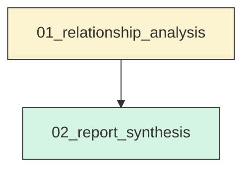
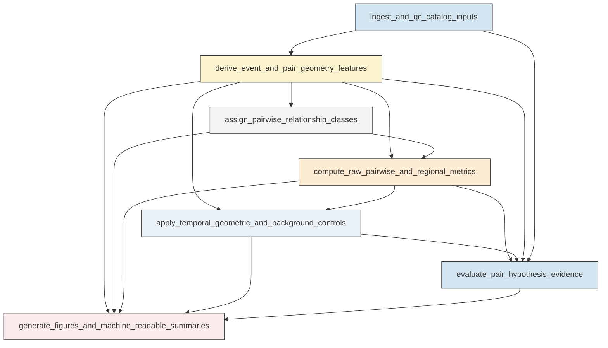
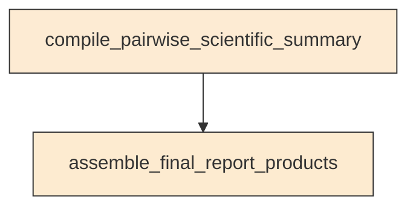

# Workflow Overview

## Top-Level Task Dependencies

**Description:**
- `01_relationship_analysis`: Build the unified event-feature dataset, compute symmetric pairwise relationship metrics and controls, evaluate hypotheses, and generate compact diagnostic outputs for the Aomori M1-M2-M3 catalog analysis.
- `02_report_synthesis`: Assemble the final concise scientific report from validated relationship-analysis outputs without recomputing core metrics.

## Subtask Dependencies

#### 01_relationship_analysis
**Usage**: Build the unified event-feature dataset, compute symmetric pairwise relationship metrics and controls, evaluate hypotheses, and generate compact diagnostic outputs for the Aomori M1-M2-M3 catalog analysis.

**Description:**
- `ingest_and_qc_catalog_inputs`: Load the relocated catalog and mainshock table, standardize fields, verify anchor events, and record catalog quality checks.
- `derive_event_and_pair_geometry_features`: Compute event-relative temporal and geometric features to each mainshock and to each mainshock pair.
- `assign_pairwise_relationship_classes`: Apply the same ambiguity-aware association framework to all three pairs and summarize stability across spatial settings.
- `compute_raw_pairwise_and_regional_metrics`: Quantify symmetric raw relationship metrics for all three pairs and summarize broader three-cluster regional activation patterns.
- `apply_temporal_geometric_and_background_controls`: Compare observed pairwise signals against temporal, geometric, and local-background controls to identify artifacts and robust effects.
- `evaluate_pair_hypothesis_evidence`: Score each pair-hypothesis combination with separate raw, control-corrected, and distance-aware evidence layers and assign follow-up priorities.
- `generate_figures_and_machine_readable_summaries`: Create the compact diagnostic figure set and export structured summary tables for pairwise interpretation and next-step prioritization.

#### 02_report_synthesis
**Usage**: Assemble the final concise scientific report from validated relationship-analysis outputs without recomputing core metrics.

**Description:**
- `compile_pairwise_scientific_summary`: Summarize the evidence for M1-M2, M1-M3, and M2-M3 with separate raw, corrected, and distance-aware interpretations.
- `assemble_final_report_products`: Produce the final concise report tables and machine-readable synthesis artifacts requested by the study.