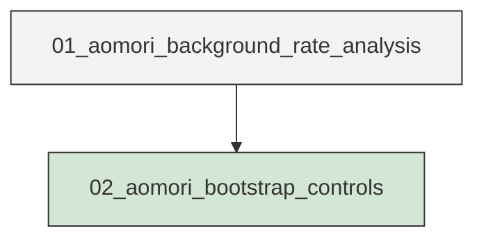
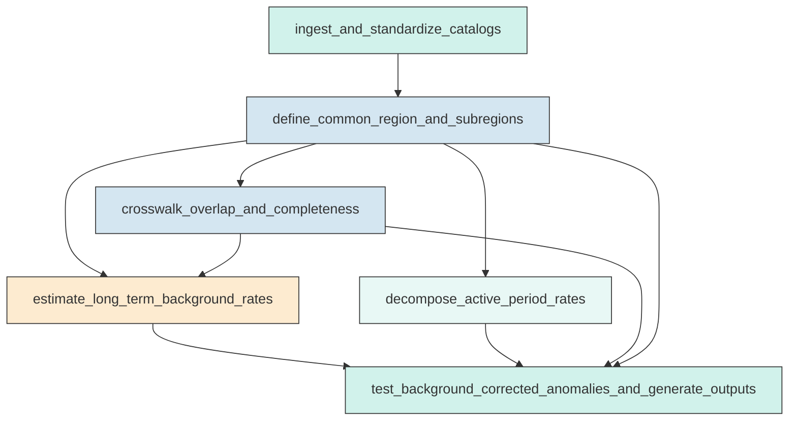
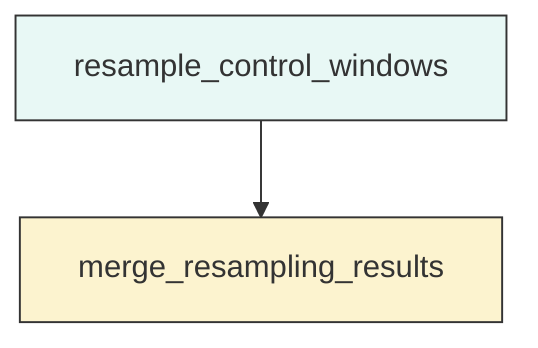

# Research Codings

## Task Overview


**Description:**
- `01_aomori_background_rate_analysis`: Audit the two catalogs, define the common analysis region, estimate long-term background rates, decompose active-period rates, and generate anomaly tables and figures.
- `02_aomori_bootstrap_controls`: Run heavy bootstrap and random-window control resampling from validated intermediate outputs and merge the results into the anomaly summary.


## Task Details


#### 01_aomori_background_rate_analysis
**Usage**: Audit the two catalogs, define the common analysis region, estimate long-term background rates, decompose active-period rates, and generate anomaly tables and figures.

**Description:**
- `ingest_and_standardize_catalogs`: Load the long-term and active-period catalogs, normalize schema and data types, and document any file substitution.
- `define_common_region_and_subregions`: Derive the common spatial mask from the active-period catalog, add a small documented buffer if needed, and freeze named analysis subregions.
- `crosswalk_overlap_and_completeness`: Compare the catalogs over the overlap period within the common region, match larger events where feasible, and assess threshold reliability.
- `estimate_long_term_background_rates`: Compute baseline rates and empirical window distributions from the filtered long-term catalog for the common region and fixed subregions.
- `decompose_active_period_rates`: Resolve active-period rate evolution by region, threshold, depth bin, and timescale using the relocated catalog only.
- `test_background_corrected_anomalies_and_generate_outputs`: Compare active-period observations against long-term expectations, apply controls, and write the compact evidence products and diagnostic figures.

#### Coding Script

```python

from __future__ import annotations

import math
import os
import sys
import traceback
from dataclasses import dataclass
from pathlib import Path
from typing import Dict, Iterable, List, Optional, Sequence, Tuple

import matplotlib
matplotlib.use("Agg")
import matplotlib.dates as mdates
import matplotlib.pyplot as plt
import numpy as np
import pandas as pd


DATA_DIR = Path("<CASE_ROOT>/data")
CATALOG_DIR = DATA_DIR / "catalog"
OUTPUT_DIR = Path("<CASE_ROOT>/run/02_4_bg_rate_correction/exp_run/outputs/01_aomori_background_rate_analysis")

LONG_TERM_PATH = CATALOG_DIR / "Snet_catalog_20200101_20260522_filter.csv"
ACTIVE_REQUESTED_PATH = DATA_DIR / "Snet_catalog_20251001_20260501_filter.csv"
ACTIVE_CANDIDATE_PATHS = [
    ACTIVE_REQUESTED_PATH,
    CATALOG_DIR / "Snet_catalog_20251001_20260501_filter.csv",
    CATALOG_DIR / "Snet_catalog_relocate_250930_260501.csv",
]
MAINSHOCK_PATH = CATALOG_DIR / "main_earthquake.csv"
MECHA_PATH = DATA_DIR / "source_mechanism" / "Snet_mecha.csv"
STATION_PATH = DATA_DIR / "stations" / "station.sta"

ACTIVE_START = pd.Timestamp("2025-10-01T00:00:00Z")
ACTIVE_END = pd.Timestamp("2026-05-01T23:59:59Z")
LONG_TERM_START = pd.Timestamp("2020-01-01T00:00:00Z")
LONG_TERM_END = pd.Timestamp("2026-05-22T23:59:59Z")

COMMON_BUFFER_DEG = 0.15
GRID_SPACING_DEG = 0.2
EARTH_KM_PER_DEG = 111.19
MAIN_RADIUS_KM = 35.0
M2_NEAR_RADIUS_KM = 55.0
M2_OUTER_INNER_KM = 55.0
M2_OUTER_OUTER_KM = 140.0
BOOTSTRAP_N = 2000
RNG_SEED = 20260524

THRESHOLDS_CROSSWALK = [1.2, 2.0, 3.0, 4.0, 5.0, 6.0]
THRESHOLDS_ACTIVE = [1.2, 2.0, 3.0, 4.0, 5.0]
THRESHOLDS_LONG = [3.0, 4.0, 5.0, 6.0]
DEPTH_BINS = [(0.0, 30.0), (30.0, 60.0), (60.0, np.inf)]
WINDOWS = {
    "7D": pd.Timedelta(days=7),
    "14D": pd.Timedelta(days=14),
    "30D": pd.Timedelta(days=30),
    "active_period": ACTIVE_END - ACTIVE_START,
}


@dataclass(frozen=True)
class Region:
    name: str
    kind: str
    min_lat: float
    max_lat: float
    min_lon: float
    max_lon: float
    center_lat: Optional[float] = None
    center_lon: Optional[float] = None
    inner_radius_km: Optional[float] = None
    outer_radius_km: Optional[float] = None
    exclude_other_main_circles: bool = False
    notes: str = ""


def log(message: str) -> None:
    print(message, flush=True)


def ensure_output_dirs() -> Dict[str, Path]:
    subdirs = {
        "root": OUTPUT_DIR,
        "tables": OUTPUT_DIR / "tables",
        "figures": OUTPUT_DIR / "figures",
        "diagnostics": OUTPUT_DIR / "diagnostics",
    }
    if OUTPUT_DIR.exists():
        for stale_path in OUTPUT_DIR.iterdir():
            if stale_path.is_dir() and stale_path.name in {"tables", "figures", "diagnostics"}:
                shutil.rmtree(stale_path)
            elif stale_path.is_file() and stale_path.suffix.lower() in {".txt", ".csv", ".png", ".jpg", ".jpeg"}:
                stale_path.unlink()
    for path in subdirs.values():
        path.mkdir(parents=True, exist_ok=True)
    return subdirs


def haversine_km(lat1, lon1, lat2, lon2):
    lat1 = np.radians(lat1)
    lon1 = np.radians(lon1)
    lat2 = np.radians(lat2)
    lon2 = np.radians(lon2)
    dlat = lat2 - lat1
    dlon = lon2 - lon1
    a = np.sin(dlat / 2.0) ** 2 + np.cos(lat1) * np.cos(lat2) * np.sin(dlon / 2.0) ** 2
    return 2.0 * 6371.0 * np.arcsin(np.sqrt(a))


def resolve_active_catalog_path() -> Tuple[Path, str]:
    for idx, candidate in enumerate(ACTIVE_CANDIDATE_PATHS):
        if candidate.exists():
            if idx == 0:
                note = f"Active-period catalog found at requested path: {candidate}"
            elif candidate.name == "Snet_catalog_20251001_20260501_filter.csv":
                note = f"Active-period catalog found under catalog directory: {candidate}"
            else:
                note = f"Active-period analysis catalog path resolved to: {candidate}"
            return candidate, note
    raise FileNotFoundError(
        "No active-period catalog found. Checked: " + ", ".join(str(path) for path in ACTIVE_CANDIDATE_PATHS)
    )


def parse_catalog(path: Path, name: str, time_format: Optional[str] = None) -> pd.DataFrame:
    log(f"Reading catalog: {name} <- {path}")
    df = pd.read_csv(path)
    expected = ["datetime", "lat", "lon", "dep", "mag"]
    if list(df.columns) != expected:
        raise ValueError(f"Unexpected schema for {name}: {df.columns.tolist()}")
    if time_format:
        times = pd.to_datetime(df["datetime"], format=time_format, utc=True, errors="coerce")
    else:
        times = pd.to_datetime(df["datetime"], utc=True, errors="coerce")
    out = pd.DataFrame(
        {
            "datetime": times,
            "lat": pd.to_numeric(df["lat"], errors="coerce"),
            "lon": pd.to_numeric(df["lon"], errors="coerce"),
            "dep": pd.to_numeric(df["dep"], errors="coerce"),
            "mag": pd.to_numeric(df["mag"], errors="coerce"),
        }
    )
    before = len(out)
    out = out.dropna().copy()
    out = out.sort_values("datetime").reset_index(drop=True)
    out["catalog"] = name
    out["event_id"] = [f"{name}_{i:07d}" for i in range(len(out))]
    log(f"Parsed {name}: {before} rows -> {len(out)} clean rows")
    return out


def parse_mainshocks(path: Path) -> pd.DataFrame:
    df = pd.read_csv(path)
    df["datetime"] = pd.to_datetime(df["datetime"], utc=True, errors="coerce")
    for col in ["lat", "lon", "dep", "mag"]:
        df[col] = pd.to_numeric(df[col], errors="coerce")
    if df[["datetime", "lat", "lon", "dep", "mag"]].isna().any().any():
        raise ValueError("Mainshock table contains invalid values")
    return df


def summarize_catalog(df: pd.DataFrame, name: str) -> pd.DataFrame:
    dup_count = int(df.duplicated(subset=["datetime", "lat", "lon", "dep", "mag"]).sum())
    return pd.DataFrame(
        [
            {
                "catalog": name,
                "n_events": len(df),
                "time_min_utc": df["datetime"].min(),
                "time_max_utc": df["datetime"].max(),
                "lat_min": df["lat"].min(),
                "lat_max": df["lat"].max(),
                "lon_min": df["lon"].min(),
                "lon_max": df["lon"].max(),
                "dep_min_km": df["dep"].min(),
                "dep_max_km": df["dep"].max(),
                "mag_min": df["mag"].min(),
                "mag_max": df["mag"].max(),
                "duplicates_exact": dup_count,
            }
        ]
    )


def estimate_mc_max_curvature(magnitudes: Sequence[float], bin_width: float = 0.1) -> Tuple[float, int]:
    mags = np.asarray(magnitudes, dtype=float)
    mags = mags[np.isfinite(mags)]
    if mags.size < 50:
        return np.nan, mags.size
    lo = math.floor(mags.min() / bin_width) * bin_width
    hi = math.ceil(mags.max() / bin_width) * bin_width + bin_width
    bins = np.arange(lo, hi + bin_width, bin_width)
    counts, edges = np.histogram(mags, bins=bins)
    if counts.sum() == 0:
        return np.nan, mags.size
    idx = int(np.argmax(counts))
    mc = edges[idx] + bin_width / 2.0
    return round(float(mc), 2), mags.size


def build_common_region(active_df: pd.DataFrame) -> Region:
    return Region(
        name="common_region",
        kind="bbox",
        min_lat=float(active_df["lat"].min() - COMMON_BUFFER_DEG),
        max_lat=float(active_df["lat"].max() + COMMON_BUFFER_DEG),
        min_lon=float(active_df["lon"].min() - COMMON_BUFFER_DEG),
        max_lon=float(active_df["lon"].max() + COMMON_BUFFER_DEG),
        notes="Bounding box derived from relocated active-period catalog with 0.15 degree buffer.",
    )


def region_mask(df: pd.DataFrame, region: Region, mainshock_df: Optional[pd.DataFrame] = None) -> pd.Series:
    base = (
        (df["lat"] >= region.min_lat)
        & (df["lat"] <= region.max_lat)
        & (df["lon"] >= region.min_lon)
        & (df["lon"] <= region.max_lon)
    )
    if region.kind == "bbox":
        return base
    if region.kind in {"circle", "ring"}:
        dist = haversine_km(df["lat"].values, df["lon"].values, region.center_lat, region.center_lon)
        if region.kind == "circle":
            mask = base & (dist <= float(region.outer_radius_km))
        else:
            mask = base & (dist > float(region.inner_radius_km)) & (dist <= float(region.outer_radius_km))
        if region.exclude_other_main_circles and mainshock_df is not None:
            for _, row in mainshock_df.iterrows():
                if abs(row["lat"] - region.center_lat) < 1e-9 and abs(row["lon"] - region.center_lon) < 1e-9:
                    continue
                other_dist = haversine_km(df["lat"].values, df["lon"].values, row["lat"], row["lon"])
                mask &= other_dist > MAIN_RADIUS_KM
        return pd.Series(mask, index=df.index)
    raise ValueError(f"Unknown region kind: {region.kind}")


def define_regions(common_region: Region, mainshocks: pd.DataFrame) -> List[Region]:
    m1 = mainshocks.loc[mainshocks["index"] == "M1"].iloc[0]
    m2 = mainshocks.loc[mainshocks["index"] == "M2"].iloc[0]
    m3 = mainshocks.loc[mainshocks["index"] == "M3"].iloc[0]
    regions = [common_region]
    for row in [m1, m2, m3]:
        regions.append(
            Region(
                name=f"{row['index'].lower()}_local",
                kind="circle",
                min_lat=common_region.min_lat,
                max_lat=common_region.max_lat,
                min_lon=common_region.min_lon,
                max_lon=common_region.max_lon,
                center_lat=float(row["lat"]),
                center_lon=float(row["lon"]),
                outer_radius_km=MAIN_RADIUS_KM,
                notes=f"{row['index']} local circle, {MAIN_RADIUS_KM:.0f} km radius.",
            )
        )
    regions.append(
        Region(
            name="m1_m3_local_union",
            kind="bbox",
            min_lat=common_region.min_lat,
            max_lat=common_region.max_lat,
            min_lon=common_region.min_lon,
            max_lon=common_region.max_lon,
            notes="Union of M1 and M3 local circles, implemented separately in mask helper.",
        )
    )
    regions.append(
        Region(
            name="m2_near_field",
            kind="circle",
            min_lat=common_region.min_lat,
            max_lat=common_region.max_lat,
            min_lon=common_region.min_lon,
            max_lon=common_region.max_lon,
            center_lat=float(m2["lat"]),
            center_lon=float(m2["lon"]),
            outer_radius_km=M2_NEAR_RADIUS_KM,
            notes=f"M2 near-field circle, {M2_NEAR_RADIUS_KM:.0f} km radius.",
        )
    )
    regions.append(
        Region(
            name="m2_outer_band",
            kind="ring",
            min_lat=common_region.min_lat,
            max_lat=common_region.max_lat,
            min_lon=common_region.min_lon,
            max_lon=common_region.max_lon,
            center_lat=float(m2["lat"]),
            center_lon=float(m2["lon"]),
            inner_radius_km=M2_OUTER_INNER_KM,
            outer_radius_km=M2_OUTER_OUTER_KM,
            exclude_other_main_circles=True,
            notes=f"M2 outer band ring, {M2_OUTER_INNER_KM:.0f}-{M2_OUTER_OUTER_KM:.0f} km, excluding M1/M3 local circles.",
        )
    )
    regions.append(
        Region(
            name="control_region",
            kind="bbox",
            min_lat=common_region.min_lat,
            max_lat=common_region.max_lat,
            min_lon=common_region.min_lon,
            max_lon=common_region.max_lon,
            notes="Common region excluding all three 35 km mainshock local circles and the M2 outer band.",
        )
    )
    return regions


def get_region_mask(df: pd.DataFrame, region_name: str, regions: Dict[str, Region], mainshocks: pd.DataFrame) -> pd.Series:
    if region_name == "m1_m3_local_union":
        m1 = regions["m1_local"]
        m3 = regions["m3_local"]
        return region_mask(df, m1, mainshocks) | region_mask(df, m3, mainshocks)
    if region_name == "control_region":
        base = region_mask(df, regions["common_region"], mainshocks)
        excluded = (
            region_mask(df, regions["m1_local"], mainshocks)
            | region_mask(df, regions["m2_local"], mainshocks)
            | region_mask(df, regions["m3_local"], mainshocks)
            | region_mask(df, regions["m2_outer_band"], mainshocks)
        )
        return base & (~excluded)
    return region_mask(df, regions[region_name], mainshocks)


def add_region_flags(df: pd.DataFrame, regions: Dict[str, Region], mainshocks: pd.DataFrame, region_names: Sequence[str]) -> pd.DataFrame:
    out = df.copy()
    for name in region_names:
        out[f"is_{name}"] = get_region_mask(out, name, regions, mainshocks).values
    return out


def threshold_counts(df: pd.DataFrame, thresholds: Sequence[float], region_name: str, catalog_name: str) -> pd.DataFrame:
    rows = []
    for thr in thresholds:
        rows.append(
            {
                "catalog": catalog_name,
                "region": region_name,
                "threshold": thr,
                "count": int((df["mag"] >= thr).sum()),
            }
        )
    return pd.DataFrame(rows)


def overlap_subset(df: pd.DataFrame, start: pd.Timestamp, end: pd.Timestamp) -> pd.DataFrame:
    return df[(df["datetime"] >= start) & (df["datetime"] <= end)].copy()


def match_large_events(raw_df: pd.DataFrame, reloc_df: pd.DataFrame, mag_threshold: float) -> pd.DataFrame:
    a = raw_df[raw_df["mag"] >= mag_threshold].copy().reset_index(drop=True)
    b = reloc_df[reloc_df["mag"] >= mag_threshold].copy().reset_index(drop=True)
    matched_rows = []
    if a.empty or b.empty:
        return pd.DataFrame(columns=["threshold", "raw_event_id", "reloc_event_id", "time_diff_s", "dist_km", "mag_diff", "dep_diff_km"])
    used = set()
    for _, row in b.iterrows():
        candidates = a.loc[~a.index.isin(used)].copy()
        if candidates.empty:
            break
        dt_s = (candidates["datetime"] - row["datetime"]).abs().dt.total_seconds()
        dist = haversine_km(candidates["lat"].values, candidates["lon"].values, row["lat"], row["lon"])
        score = dt_s / 60.0 + dist + (candidates["mag"] - row["mag"]).abs() * 10.0
        best_idx = int(score.idxmin())
        if dt_s.loc[best_idx] <= 600 and float(dist[list(candidates.index).index(best_idx)]) <= 50.0:
            used.add(best_idx)
            raw_row = a.loc[best_idx]
            matched_rows.append(
                {
                    "threshold": mag_threshold,
                    "raw_event_id": raw_row["event_id"],
                    "reloc_event_id": row["event_id"],
                    "time_diff_s": float(abs((raw_row["datetime"] - row["datetime"]).total_seconds())),
                    "dist_km": float(haversine_km(raw_row["lat"], raw_row["lon"], row["lat"], row["lon"])),
                    "mag_diff": float(raw_row["mag"] - row["mag"]),
                    "dep_diff_km": float(raw_row["dep"] - row["dep"]),
                }
            )
    return pd.DataFrame(matched_rows)


def monthly_counts(df: pd.DataFrame, threshold: float) -> pd.Series:
    subset = df[df["mag"] >= threshold].copy()
    if subset.empty:
        return pd.Series(dtype=float)
    s = subset.set_index("datetime").sort_index().resample("MS").size()
    return s


def sliding_window_counts(df: pd.DataFrame, threshold: float, window: pd.Timedelta, start: pd.Timestamp, end: pd.Timestamp) -> pd.DataFrame:
    subset = df[df["mag"] >= threshold].copy().sort_values("datetime")
    starts = pd.date_range(start=start, end=end - window, freq="1D", tz="UTC")
    if len(starts) == 0:
        return pd.DataFrame(columns=["window_start", "window_end", "count"])
    times = subset["datetime"].values.astype("datetime64[ns]")
    start_vals = starts.values.astype("datetime64[ns]")
    end_vals = (starts + window).values.astype("datetime64[ns]")
    left = np.searchsorted(times, start_vals, side="left")
    right = np.searchsorted(times, end_vals, side="right")
    counts = right - left
    return pd.DataFrame({"window_start": starts, "window_end": starts + window, "count": counts})


def bootstrap_rate_ratio(background_counts: np.ndarray, observed_count: int, rng: np.random.Generator) -> Tuple[float, float, float]:
    if background_counts.size == 0:
        return np.nan, np.nan, np.nan
    samples = rng.choice(background_counts, size=BOOTSTRAP_N, replace=True)
    expected = float(np.mean(samples))
    ratios = observed_count / np.maximum(samples, 0.5)
    return expected, float(np.percentile(ratios, 2.5)), float(np.percentile(ratios, 97.5))


def depth_label(low: float, high: float) -> str:
    if np.isinf(high):
        return f">={int(low)} km"
    return f"{int(low)}-{int(high)} km"


def save_table(df: pd.DataFrame, path: Path) -> None:
    df.to_csv(path, index=False)
    log(f"Saved table: {path}")


def plot_footprints(long_df, active_df, stations, mainshocks, regions, fig_path: Path) -> None:
    fig, ax = plt.subplots(figsize=(10, 8))
    ax.scatter(long_df["lon"], long_df["lat"], s=1, c="lightgray", alpha=0.3, label="Long-term raw")
    ax.scatter(active_df["lon"], active_df["lat"], s=2, c="tab:blue", alpha=0.5, label="Active relocated")
    ax.scatter(stations["longitude"], stations["latitude"], s=8, c="k", alpha=0.25, label="Stations")
    common = regions["common_region"]
    ax.plot([common.min_lon, common.max_lon, common.max_lon, common.min_lon, common.min_lon], [common.min_lat, common.min_lat, common.max_lat, common.max_lat, common.min_lat], c="tab:red", lw=2, label="Common region")
    colors = {"M1": "tab:orange", "M2": "tab:green", "M3": "tab:purple"}
    for _, row in mainshocks.iterrows():
        ax.scatter(row["lon"], row["lat"], marker="*", s=180, c=colors[row["index"]], edgecolor="k", label=row["index"])
        deg = MAIN_RADIUS_KM / EARTH_KM_PER_DEG
        circ = plt.Circle((row["lon"], row["lat"]), deg, color=colors[row["index"]], fill=False, lw=1.5, alpha=0.9)
        ax.add_patch(circ)
    m2 = mainshocks.loc[mainshocks["index"] == "M2"].iloc[0]
    for radius_km, style in [(M2_NEAR_RADIUS_KM, "--"), (M2_OUTER_OUTER_KM, ":")]:
        deg = radius_km / EARTH_KM_PER_DEG
        ax.add_patch(plt.Circle((m2["lon"], m2["lat"]), deg, color="tab:green", fill=False, lw=1.5, ls=style, alpha=0.8))
    ax.set_xlabel("Longitude")
    ax.set_ylabel("Latitude")
    ax.set_title("Catalog footprints, common region, stations, and mainshock-centered regions")
    ax.legend(loc="upper left", fontsize=8, ncol=2)
    fig.tight_layout()
    fig.savefig(fig_path, dpi=200)
    plt.close(fig)


def plot_mfd_depth(long_df, active_df, fig_path: Path) -> None:
    fig, axes = plt.subplots(1, 2, figsize=(12, 5))
    bins_mag = np.arange(-1.0, 8.1, 0.2)
    axes[0].hist(long_df["mag"], bins=bins_mag, alpha=0.5, label="Long-term raw", color="gray")
    axes[0].hist(active_df["mag"], bins=bins_mag, alpha=0.5, label="Active relocated", color="tab:blue")
    axes[0].set_yscale("log")
    axes[0].set_xlabel("Magnitude")
    axes[0].set_ylabel("Count")
    axes[0].set_title("Magnitude-frequency comparison")
    axes[0].legend()
    bins_dep = np.arange(0, max(long_df["dep"].max(), active_df["dep"].max()) + 5, 5)
    axes[1].hist(long_df["dep"], bins=bins_dep, alpha=0.5, label="Long-term raw", color="gray")
    axes[1].hist(active_df["dep"], bins=bins_dep, alpha=0.5, label="Active relocated", color="tab:blue")
    axes[1].set_yscale("log")
    axes[1].set_xlabel("Depth (km)")
    axes[1].set_ylabel("Count")
    axes[1].set_title("Depth distribution comparison")
    axes[1].legend()
    fig.tight_layout()
    fig.savefig(fig_path, dpi=200)
    plt.close(fig)


def plot_matched_differences(match_df: pd.DataFrame, fig_path: Path) -> None:
    if match_df.empty:
        return
    fig, axes = plt.subplots(1, 3, figsize=(12, 4))
    axes[0].hist(match_df["time_diff_s"], bins=20, color="tab:blue")
    axes[0].set_xlabel("|Δt| (s)")
    axes[0].set_title("Matched event time differences")
    axes[1].hist(match_df["dist_km"], bins=20, color="tab:orange")
    axes[1].set_xlabel("Epicentral distance difference (km)")
    axes[1].set_title("Matched event location differences")
    axes[2].hist(match_df["dep_diff_km"], bins=20, color="tab:green")
    axes[2].set_xlabel("Depth difference (km)")
    axes[2].set_title("Matched event depth differences")
    fig.tight_layout()
    fig.savefig(fig_path, dpi=200)
    plt.close(fig)


def plot_long_term_rates(monthly_dict: Dict[str, pd.Series], active_start: pd.Timestamp, active_end: pd.Timestamp, fig_path: Path) -> None:
    fig, axes = plt.subplots(len(monthly_dict), 1, figsize=(12, 3 * len(monthly_dict)), sharex=True)
    if len(monthly_dict) == 1:
        axes = [axes]
    active_start_naive = active_start.tz_convert(None)
    active_end_naive = active_end.tz_convert(None)
    for ax, (label, series) in zip(axes, monthly_dict.items()):
        series_plot = series.copy()
        if getattr(series_plot.index, "tz", None) is not None:
            series_plot.index = series_plot.index.tz_convert(None)
        ax.plot(series_plot.index, series_plot.values, marker="o", ms=3, lw=1.2)
        ax.axvspan(active_start_naive, active_end_naive, color="tab:red", alpha=0.15, label="Active period")
        ax.set_ylabel("Monthly count")
        ax.set_title(label)
        ax.legend(loc="upper left")
    axes[-1].xaxis.set_major_locator(mdates.MonthLocator(interval=3))
    axes[-1].xaxis.set_major_formatter(mdates.DateFormatter("%Y-%m"))
    fig.autofmt_xdate()
    fig.tight_layout()
    fig.savefig(fig_path, dpi=200)
    plt.close(fig)


def plot_active_rates(active_df: pd.DataFrame, mainshocks: pd.DataFrame, fig_path: Path) -> None:
    fig, axes = plt.subplots(2, 1, figsize=(12, 8), sharex=True)
    daily = active_df.set_index("datetime").resample("1D").size()
    weekly = active_df.set_index("datetime").resample("7D").size()
    if getattr(daily.index, "tz", None) is not None:
        daily.index = daily.index.tz_convert(None)
    if getattr(weekly.index, "tz", None) is not None:
        weekly.index = weekly.index.tz_convert(None)
    axes[0].bar(daily.index, daily.values, width=1.0, color="tab:blue")
    axes[0].set_ylabel("Daily count")
    axes[0].set_title("Active-period daily seismicity (all relocated events)")
    axes[1].bar(weekly.index, weekly.values, width=5.0, color="tab:purple")
    axes[1].set_ylabel("7-day count")
    axes[1].set_title("Active-period 7-day seismicity (all relocated events)")
    for ax in axes:
        ymax = ax.get_ylim()[1]
        ytext = ymax * 0.9 if ymax > 0 else 1.0
        for _, row in mainshocks.iterrows():
            x = row["datetime"].tz_convert(None)
            ax.axvline(x, color="tab:red", ls="--", lw=1)
            ax.text(x, ytext, row["index"], color="tab:red")
    axes[-1].xaxis.set_major_locator(mdates.MonthLocator(interval=1))
    axes[-1].xaxis.set_major_formatter(mdates.DateFormatter("%Y-%m"))
    fig.autofmt_xdate()
    fig.tight_layout()
    fig.savefig(fig_path, dpi=200)
    plt.close(fig)


def plot_region_comparison(active_df: pd.DataFrame, regions: Dict[str, Region], mainshocks: pd.DataFrame, fig_path: Path) -> None:
    region_names = ["m1_m3_local_union", "m2_near_field", "m2_outer_band", "control_region"]
    fig, axes = plt.subplots(len(region_names), 1, figsize=(12, 10), sharex=True)
    for ax, region_name in zip(axes, region_names):
        mask = get_region_mask(active_df, region_name, regions, mainshocks)
        counts = active_df.loc[mask].set_index("datetime").resample("7D").size()
        if getattr(counts.index, "tz", None) is not None:
            counts.index = counts.index.tz_convert(None)
        ax.plot(counts.index, counts.values, marker="o", ms=3, lw=1.2)
        ax.set_ylabel("7-day count")
        ax.set_title(region_name)
        for _, row in mainshocks.iterrows():
            ax.axvline(row["datetime"].tz_convert(None), color="tab:red", ls="--", lw=1)
    axes[-1].xaxis.set_major_locator(mdates.MonthLocator(interval=1))
    axes[-1].xaxis.set_major_formatter(mdates.DateFormatter("%Y-%m"))
    fig.autofmt_xdate()
    fig.tight_layout()
    fig.savefig(fig_path, dpi=200)
    plt.close(fig)


def plot_depth_stratified(active_df: pd.DataFrame, fig_path: Path) -> None:
    fig, axes = plt.subplots(len(DEPTH_BINS), 1, figsize=(12, 9), sharex=True)
    for ax, (lo, hi) in zip(axes, DEPTH_BINS):
        mask = (active_df["dep"] >= lo) & (active_df["dep"] < hi)
        counts = active_df.loc[mask].set_index("datetime").resample("7D").size()
        if getattr(counts.index, "tz", None) is not None:
            counts.index = counts.index.tz_convert(None)
        ax.plot(counts.index, counts.values, marker="o", lw=1.2)
        ax.set_ylabel("7-day count")
        ax.set_title(depth_label(lo, hi))
    axes[-1].xaxis.set_major_locator(mdates.MonthLocator(interval=1))
    axes[-1].xaxis.set_major_formatter(mdates.DateFormatter("%Y-%m"))
    fig.autofmt_xdate()
    fig.tight_layout()
    fig.savefig(fig_path, dpi=200)
    plt.close(fig)


def plot_percentile_comparison(percentile_df: pd.DataFrame, fig_path: Path) -> None:
    subset = percentile_df[percentile_df["window_name"] == "active_period"].copy()
    if subset.empty:
        return
    pivot = subset.pivot(index="region", columns="threshold", values="percentile")
    fig, ax = plt.subplots(figsize=(10, 5))
    im = ax.imshow(pivot.values, aspect="auto", cmap="magma", vmin=0, vmax=100)
    ax.set_xticks(np.arange(len(pivot.columns)))
    ax.set_xticklabels([f"M≥{c:g}" for c in pivot.columns])
    ax.set_yticks(np.arange(len(pivot.index)))
    ax.set_yticklabels(pivot.index)
    ax.set_title("Active-period percentile rank within long-term window distributions")
    for i in range(pivot.shape[0]):
        for j in range(pivot.shape[1]):
            val = pivot.values[i, j]
            ax.text(j, i, "nan" if pd.isna(val) else f"{val:.1f}", ha="center", va="center", color="white", fontsize=8)
    fig.colorbar(im, ax=ax, label="Percentile")
    fig.tight_layout()
    fig.savefig(fig_path, dpi=200)
    plt.close(fig)


def plot_spatial_anomaly_map(long_df: pd.DataFrame, active_df: pd.DataFrame, common_region: Region, fig_path: Path) -> pd.DataFrame:
    lat_edges = np.arange(common_region.min_lat, common_region.max_lat + GRID_SPACING_DEG, GRID_SPACING_DEG)
    lon_edges = np.arange(common_region.min_lon, common_region.max_lon + GRID_SPACING_DEG, GRID_SPACING_DEG)
    active_duration_days = (ACTIVE_END - ACTIVE_START).days + 1
    long_duration_days = max((LONG_TERM_END - LONG_TERM_START).days + 1, 1)
    scale = active_duration_days / long_duration_days
    rows = []
    grid = np.full((len(lat_edges) - 1, len(lon_edges) - 1), np.nan)
    for i in range(len(lat_edges) - 1):
        for j in range(len(lon_edges) - 1):
            lat0, lat1 = lat_edges[i], lat_edges[i + 1]
            lon0, lon1 = lon_edges[j], lon_edges[j + 1]
            mask_long = (long_df["lat"] >= lat0) & (long_df["lat"] < lat1) & (long_df["lon"] >= lon0) & (long_df["lon"] < lon1) & (long_df["mag"] >= 3.0)
            mask_act = (active_df["lat"] >= lat0) & (active_df["lat"] < lat1) & (active_df["lon"] >= lon0) & (active_df["lon"] < lon1) & (active_df["mag"] >= 3.0)
            expected = mask_long.sum() * scale
            observed = int(mask_act.sum())
            ratio = observed / expected if expected > 0 else np.nan
            rows.append({"lat0": lat0, "lat1": lat1, "lon0": lon0, "lon1": lon1, "observed_M3": observed, "expected_M3": expected, "obs_exp_ratio": ratio})
            grid[i, j] = np.log10(ratio) if expected >= 0.5 and observed > 0 and np.isfinite(ratio) and ratio > 0 else np.nan
    fig, ax = plt.subplots(figsize=(9, 7))
    im = ax.imshow(grid, origin="lower", extent=[lon_edges[0], lon_edges[-1], lat_edges[0], lat_edges[-1]], cmap="coolwarm", aspect="auto")
    ax.set_xlabel("Longitude")
    ax.set_ylabel("Latitude")
    ax.set_title("Spatial anomaly map: log10(observed/expected) for M≥3")
    fig.colorbar(im, ax=ax, label="log10(obs/exp)")
    fig.tight_layout()
    fig.savefig(fig_path, dpi=200)
    plt.close(fig)
    return pd.DataFrame(rows)


def plot_evidence_matrix(evidence_df: pd.DataFrame, fig_path: Path) -> None:
    if evidence_df.empty:
        return
    pivot = evidence_df.pivot_table(index=["region", "depth_bin"], columns="threshold", values="obs_exp_ratio", aggfunc="first")
    fig, ax = plt.subplots(figsize=(10, max(5, 0.35 * len(pivot))))
    im = ax.imshow(pivot.values, aspect="auto", cmap="viridis")
    ax.set_xticks(np.arange(len(pivot.columns)))
    ax.set_xticklabels([f"M≥{x:g}" for x in pivot.columns])
    ax.set_yticks(np.arange(len(pivot.index)))
    ax.set_yticklabels([f"{r[0]} | {r[1]}" for r in pivot.index], fontsize=8)
    ax.set_title("Background-rate evidence matrix (obs/exp ratio)")
    for i in range(pivot.shape[0]):
        for j in range(pivot.shape[1]):
            val = pivot.values[i, j]
            ax.text(j, i, "nan" if pd.isna(val) else f"{val:.2f}", ha="center", va="center", color="white", fontsize=7)
    fig.colorbar(im, ax=ax, label="Observed / expected")
    fig.tight_layout()
    fig.savefig(fig_path, dpi=200)
    plt.close(fig)


def build_report(summary_lines: List[str], path: Path) -> None:
    path.write_text("\n".join(summary_lines), encoding="utf-8")
    log(f"Saved report: {path}")


def main() -> None:
    rng = np.random.default_rng(RNG_SEED)
    dirs = ensure_output_dirs()
    log(f"Output root: {dirs['root']}")

    active_path, active_source_note = resolve_active_catalog_path()
    long_df = parse_catalog(LONG_TERM_PATH, "long_term_raw")
    active_df = parse_catalog(active_path, "active_relocated")
    mainshocks = parse_mainshocks(MAINSHOCK_PATH)
    stations = pd.read_csv(STATION_PATH)
    required_station_cols = {"latitude", "longitude"}
    if not required_station_cols.issubset(stations.columns):
        raise ValueError(f"Station file missing required columns: {sorted(required_station_cols - set(stations.columns))}")
    log(active_source_note)

    qa_df = pd.concat([summarize_catalog(long_df, "long_term_raw"), summarize_catalog(active_df, "active_relocated")], ignore_index=True)
    save_table(qa_df, dirs["tables"] / "catalog_qa_summary.csv")

    common_region = build_common_region(active_df[(active_df["datetime"] >= ACTIVE_START) & (active_df["datetime"] <= ACTIVE_END)])
    regions_list = define_regions(common_region, mainshocks)
    regions = {r.name: r for r in regions_list}
    region_def_df = pd.DataFrame([r.__dict__ for r in regions_list])
    save_table(region_def_df, dirs["tables"] / "region_definitions.csv")

    long_common = long_df[get_region_mask(long_df, "common_region", regions, mainshocks)].copy()
    active_common = active_df[get_region_mask(active_df, "common_region", regions, mainshocks)].copy()
    active_common = overlap_subset(active_common, ACTIVE_START, ACTIVE_END)
    long_common = overlap_subset(long_common, LONG_TERM_START, LONG_TERM_END)

    retention_df = pd.DataFrame(
        [
            {"catalog": "long_term_raw", "region": "common_region", "retained_events": len(long_common), "original_events": len(long_df), "retention_fraction": len(long_common) / len(long_df)},
            {"catalog": "active_relocated", "region": "common_region", "retained_events": len(active_common), "original_events": len(active_df), "retention_fraction": len(active_common) / len(active_df)},
        ]
    )
    save_table(retention_df, dirs["tables"] / "common_region_retention.csv")

    overlap_long = overlap_subset(long_common, ACTIVE_START, ACTIVE_END)
    overlap_active = active_common.copy()

    count_frames = [
        threshold_counts(overlap_long, THRESHOLDS_CROSSWALK, "common_region_overlap", "long_term_raw"),
        threshold_counts(overlap_active, THRESHOLDS_CROSSWALK, "common_region_overlap", "active_relocated"),
    ]
    count_df = pd.concat(count_frames, ignore_index=True)
    save_table(count_df, dirs["tables"] / "overlap_threshold_counts.csv")

    match4 = match_large_events(overlap_long, overlap_active, 4.0)
    match5 = match_large_events(overlap_long, overlap_active, 5.0)
    match_df = pd.concat([match4, match5], ignore_index=True)
    save_table(match_df, dirs["tables"] / "matched_large_events.csv")

    mc_rows = []
    for catalog_name, df in [("long_term_common", long_common), ("active_common", active_common), ("long_overlap", overlap_long), ("active_overlap", overlap_active)]:
        mc, n_used = estimate_mc_max_curvature(df["mag"])
        mc_rows.append({"catalog_subset": catalog_name, "Mc_max_curvature": mc, "n_events": n_used})
    mc_df = pd.DataFrame(mc_rows)
    save_table(mc_df, dirs["tables"] / "magnitude_completeness_summary.csv")

    long_mc = mc_df.loc[mc_df["catalog_subset"] == "long_term_common", "Mc_max_curvature"].iloc[0]
    active_mc = mc_df.loc[mc_df["catalog_subset"] == "active_common", "Mc_max_curvature"].iloc[0]
    reliability_rows = []
    for thr in THRESHOLDS_CROSSWALK:
        reliable = bool((thr >= 3.0) or (pd.notna(long_mc) and pd.notna(active_mc) and thr >= max(long_mc, active_mc)))
        note = "Preferred for cross-catalog comparison" if thr in (3.0, 4.0, 5.0) else ("Active-period only unless completeness justified" if thr == 1.2 else "Descriptive only if sparse")
        reliability_rows.append({"threshold": thr, "reliable_for_long_term_comparison": reliable, "note": note})
    reliability_df = pd.DataFrame(reliability_rows)
    save_table(reliability_df, dirs["tables"] / "threshold_reliability.csv")

    plot_footprints(long_df, active_df, stations, mainshocks, regions, dirs["figures"] / "01_catalog_footprints_common_region.png")
    plot_mfd_depth(long_common, active_common, dirs["figures"] / "02_magnitude_depth_comparison.png")
    plot_matched_differences(match_df, dirs["figures"] / "03_matched_event_differences.png")

    monthly_dict = {
        "Common region M≥3": monthly_counts(long_common, 3.0),
        "Common region M≥4": monthly_counts(long_common, 4.0),
        "Common region M≥5": monthly_counts(long_common, 5.0),
    }
    plot_long_term_rates(monthly_dict, ACTIVE_START, ACTIVE_END, dirs["figures"] / "04_long_term_monthly_rates.png")
    plot_active_rates(active_common, mainshocks, dirs["figures"] / "05_active_period_rates.png")
    plot_region_comparison(active_common, regions, mainshocks, dirs["figures"] / "06_active_region_comparison.png")
    plot_depth_stratified(active_common, dirs["figures"] / "07_depth_stratified_rates.png")

    long_common = add_region_flags(long_common, regions, mainshocks, ["common_region", "m1_local", "m2_local", "m3_local", "m1_m3_local_union", "m2_near_field", "m2_outer_band", "control_region"])
    active_common = add_region_flags(active_common, regions, mainshocks, ["common_region", "m1_local", "m2_local", "m3_local", "m1_m3_local_union", "m2_near_field", "m2_outer_band", "control_region"])

    background_rows = []
    percentile_rows = []
    active_rate_rows = []
    evidence_rows = []
    region_names = ["common_region", "m1_m3_local_union", "m2_near_field", "m2_outer_band", "control_region"]
    for region_name in region_names:
        long_region = long_common[long_common[f"is_{region_name}"]].copy()
        active_region = active_common[active_common[f"is_{region_name}"]].copy()
        for thr in THRESHOLDS_LONG:
            monthly = monthly_counts(long_region, thr)
            if not monthly.empty:
                background_rows.append({"region": region_name, "threshold": thr, "window_name": "monthly", "mean_count": float(monthly.mean()), "median_count": float(monthly.median()), "p95_count": float(monthly.quantile(0.95)), "n_windows": int(monthly.shape[0])})
            for window_name, window in WINDOWS.items():
                if window_name == "active_period":
                    start = LONG_TERM_START
                    end = LONG_TERM_END
                else:
                    start = LONG_TERM_START
                    end = LONG_TERM_END
                windows_df = sliding_window_counts(long_region, thr, window, start, end)
                if windows_df.empty:
                    continue
                observed = int(((active_region["datetime"] >= ACTIVE_START) & (active_region["datetime"] <= min(ACTIVE_END, ACTIVE_START + window))).sum()) if window_name != "active_period" else int((active_region["mag"] >= thr).sum())
                if window_name != "active_period":
                    observed = int(((active_region["mag"] >= thr) & (active_region["datetime"] >= ACTIVE_START) & (active_region["datetime"] <= ACTIVE_START + window)).sum())
                counts = windows_df["count"].to_numpy(dtype=float)
                percentile = float((counts <= observed).mean() * 100.0)
                exceedance = float((counts >= observed).mean())
                expected, ratio_lo, ratio_hi = bootstrap_rate_ratio(counts, observed, rng)
                obs_exp = observed / expected if expected and np.isfinite(expected) and expected > 0 else np.nan
                percentile_rows.append({"region": region_name, "threshold": thr, "window_name": window_name, "observed_count": observed, "expected_count": expected, "obs_exp_ratio": obs_exp, "obs_exp_ratio_ci_low": ratio_lo, "obs_exp_ratio_ci_high": ratio_hi, "percentile": percentile, "exceedance_fraction": exceedance, "n_background_windows": int(len(counts))})
        for thr in THRESHOLDS_ACTIVE:
            for scale_name, freq in [("daily", "1D"), ("weekly", "7D"), ("monthly", "MS")]:
                series = active_region[active_region["mag"] >= thr].set_index("datetime").resample(freq).size()
                for t, count in series.items():
                    active_rate_rows.append({"region": region_name, "threshold": thr, "time_scale": scale_name, "time_bin_start": t, "count": int(count)})
            for lo, hi in DEPTH_BINS:
                depth_subset = active_region[(active_region["dep"] >= lo) & (active_region["dep"] < hi)]
                observed = int((depth_subset["mag"] >= thr).sum())
                long_depth = long_region[(long_region["dep"] >= lo) & (long_region["dep"] < hi)]
                expected = float((long_depth["mag"] >= thr).sum()) * ((ACTIVE_END - ACTIVE_START).days + 1) / ((LONG_TERM_END - LONG_TERM_START).days + 1)
                obs_exp = observed / expected if expected > 0 else np.nan
                evidence_rows.append({"region": region_name, "depth_bin": depth_label(lo, hi), "threshold": thr, "observed_count": observed, "expected_count": expected, "obs_exp_ratio": obs_exp})

    background_df = pd.DataFrame(background_rows)
    percentile_df = pd.DataFrame(percentile_rows)
    active_rates_df = pd.DataFrame(active_rate_rows)
    evidence_df = pd.DataFrame(evidence_rows)
    save_table(background_df, dirs["tables"] / "long_term_background_rates.csv")
    save_table(percentile_df, dirs["tables"] / "active_period_percentile_vs_background.csv")
    save_table(active_rates_df, dirs["tables"] / "active_period_rates_by_region.csv")
    save_table(evidence_df, dirs["tables"] / "background_rate_evidence_matrix.csv")

    spatial_df = plot_spatial_anomaly_map(long_common, active_common, common_region, dirs["figures"] / "08_spatial_anomaly_map_M3.png")
    save_table(spatial_df, dirs["tables"] / "spatial_anomaly_grid_M3.csv")
    plot_percentile_comparison(percentile_df, dirs["figures"] / "09_active_period_percentiles.png")
    plot_evidence_matrix(evidence_df, dirs["figures"] / "10_background_rate_evidence_matrix.png")

    required_percentile_cols = {"region", "threshold", "window_name", "observed_count", "expected_count", "obs_exp_ratio", "percentile"}
    if not required_percentile_cols.issubset(percentile_df.columns):
        raise ValueError(f"Percentile table missing required columns: {sorted(required_percentile_cols - set(percentile_df.columns))}")
    required_evidence_cols = {"region", "depth_bin", "threshold", "observed_count", "expected_count", "obs_exp_ratio"}
    if not required_evidence_cols.issubset(evidence_df.columns):
        raise ValueError(f"Evidence table missing required columns: {sorted(required_evidence_cols - set(evidence_df.columns))}")

    overlap_summary = count_df.pivot(index="threshold", columns="catalog", values="count").reset_index()
    m4p = percentile_df[(percentile_df["region"] == "common_region") & (percentile_df["threshold"] == 4.0) & (percentile_df["window_name"] == "active_period")]
    m5p = percentile_df[(percentile_df["region"] == "common_region") & (percentile_df["threshold"] == 5.0) & (percentile_df["window_name"] == "active_period")]
    strongest = evidence_df.replace([np.inf, -np.inf], np.nan).dropna(subset=["obs_exp_ratio"]).sort_values("obs_exp_ratio", ascending=False).head(10)

    summary_lines = [
        "Aomori background-rate analysis report",
        "====================================",
        "",
        f"Active catalog source note: {active_source_note}",
        f"Long-term common-region events: {len(long_common):,}",
        f"Active common-region events: {len(active_common):,}",
        "",
        "Catalog crosswalk and threshold reliability",
        "----------------------------------------",
        f"Long-term Mc (common region, max-curvature): {long_mc}",
        f"Active Mc (common region, max-curvature): {active_mc}",
        "Preferred cross-catalog thresholds: M>=3, M>=4, and M>=5.",
        "M>=1.2 is retained for active-period relocated analysis only unless later completeness work justifies broader use.",
        "",
        "Overlap-period count comparison in the common region",
        "-----------------------------------------------",
    ]
    for _, row in overlap_summary.iterrows():
        summary_lines.append(f"Threshold M>={row['threshold']}: long-term raw overlap={int(row.get('long_term_raw', 0))}, active relocated overlap={int(row.get('active_relocated', 0))}")
    summary_lines.extend([
        "",
        "Long-term background interpretation",
        "-------------------------------",
    ])
    if not m4p.empty:
        r = m4p.iloc[0]
        summary_lines.append(f"Common-region active-period M>=4 count={int(r['observed_count'])}, expected={r['expected_count']:.2f}, obs/exp={r['obs_exp_ratio']:.2f}, percentile={r['percentile']:.1f}.")
    if not m5p.empty:
        r = m5p.iloc[0]
        summary_lines.append(f"Common-region active-period M>=5 count={int(r['observed_count'])}, expected={r['expected_count']:.2f}, obs/exp={r['obs_exp_ratio']:.2f}, percentile={r['percentile']:.1f}.")
    summary_lines.extend([
        "",
        "Strongest regional and depth anomalies by observed/expected ratio",
        "-------------------------------------------------------------",
    ])
    for _, row in strongest.iterrows():
        summary_lines.append(f"{row['region']} | {row['depth_bin']} | M>={row['threshold']}: observed={int(row['observed_count'])}, expected={row['expected_count']:.2f}, obs/exp={row['obs_exp_ratio']:.2f}")
    summary_lines.extend([
        "",
        "Interpretive answers",
        "--------------------",
        "1) The script evaluates exceptionality relative to the 2020-2026 raw background only inside the relocated-catalog-derived common region.",
        "2) Strong anomalies are identified where active-period observed/expected ratios and percentile ranks are high across the region-depth-threshold summaries.",
        "3) Regional versus localized behavior should be judged from the common-region baseline together with the m1_m3_local_union, m2_near_field, m2_outer_band, and control-region comparisons.",
        "4) The evidence matrix is statistical only and should not be interpreted as proof of triggering or any specific physical mechanism.",
    ])
    build_report(summary_lines, dirs["root"] / "summary_report.txt")

    context_df = pd.DataFrame([
        {"key": "active_catalog_source_note", "value": active_source_note},
        {"key": "requested_active_path_exists", "value": str(ACTIVE_REQUESTED_PATH.exists())},
        {"key": "requested_active_path", "value": str(ACTIVE_REQUESTED_PATH)},
        {"key": "resolved_active_path", "value": str(active_path)},
        {"key": "mechanism_path", "value": str(MECHA_PATH)},
        {"key": "station_path", "value": str(STATION_PATH)},
    ])
    save_table(context_df, dirs["diagnostics"] / "context_paths_and_notes.csv")
    log("Analysis completed successfully.")


if __name__ == "__main__":
    try:
        main()
    except Exception:
        print(traceback.format_exc(), flush=True)
        sys.exit(1)


```

#### 02_aomori_bootstrap_controls
**Usage**: Run heavy bootstrap and random-window control resampling from validated intermediate outputs and merge the results into the anomaly summary.

**Description:**
- `resample_control_windows`: Generate bootstrap and random-window null distributions for predefined region-threshold-depth combinations.
- `merge_resampling_results`: Integrate resampling outputs with the anomaly summary without changing predefined regions or threshold decisions.

#### Coding Script

```python

from __future__ import annotations

import os
import sys
import traceback
from concurrent.futures import ProcessPoolExecutor, as_completed
from dataclasses import dataclass
from pathlib import Path
from typing import Dict, Iterable, List, Optional, Sequence, Tuple

import matplotlib
matplotlib.use("Agg")
import matplotlib.pyplot as plt
import numpy as np
import pandas as pd


DATA_DIR = Path("<CASE_ROOT>/data")
CATALOG_DIR = DATA_DIR / "catalog"
SCRIPT_PATH = Path("<CASE_ROOT>/run/02_4_bg_rate_correction/exp_run/scripts/02_aomori_bootstrap_controls.py")
OUTPUT_DIR = Path("<CASE_ROOT>/run/02_4_bg_rate_correction/exp_run/outputs/02_aomori_bootstrap_controls")
PRIMARY_OUTPUT_DIR = Path("<CASE_ROOT>/run/02_4_bg_rate_correction/exp_run/outputs/01_aomori_background_rate_analysis")
PRIMARY_TABLES_DIR = PRIMARY_OUTPUT_DIR / "tables"
PRIMARY_FIGURES_DIR = PRIMARY_OUTPUT_DIR / "figures"

LONG_TERM_PATH = CATALOG_DIR / "Snet_catalog_20200101_20260522_filter.csv"
ACTIVE_REQUESTED_PATH = DATA_DIR / "Snet_catalog_20251001_20260501_filter.csv"
ACTIVE_CANDIDATE_PATHS = [
    ACTIVE_REQUESTED_PATH,
    CATALOG_DIR / "Snet_catalog_20251001_20260501_filter.csv",
    CATALOG_DIR / "Snet_catalog_relocate_250930_260501.csv",
]
MAINSHOCK_PATH = CATALOG_DIR / "main_earthquake.csv"

ACTIVE_START = pd.Timestamp("2025-10-01T00:00:00Z")
ACTIVE_END = pd.Timestamp("2026-05-01T23:59:59Z")
LONG_TERM_START = pd.Timestamp("2020-01-01T00:00:00Z")
LONG_TERM_END = pd.Timestamp("2026-05-22T23:59:59Z")

MAIN_RADIUS_KM = 35.0
RESAMPLE_N = 4000
SHIFTED_WINDOW_STEP_DAYS = 7
BOOTSTRAP_SEED = 20260524
MAX_WORKERS = max(1, min(8, (os.cpu_count() or 1) - 1))
COUNT_FLOOR_FOR_RATIO = 0.5

THRESHOLDS = [3.0, 4.0, 5.0]
WINDOWS = {
    "7D": pd.Timedelta(days=7),
    "14D": pd.Timedelta(days=14),
    "30D": pd.Timedelta(days=30),
    "active_period": ACTIVE_END - ACTIVE_START,
}
DEPTH_BINS = [(0.0, 30.0), (30.0, 60.0), (60.0, np.inf)]
TARGET_REGIONS = ["common_region", "m1_m3_local_union", "m2_near_field", "m2_outer_band", "control_region"]


@dataclass(frozen=True)
class Region:
    name: str
    kind: str
    min_lat: float
    max_lat: float
    min_lon: float
    max_lon: float
    center_lat: Optional[float] = None
    center_lon: Optional[float] = None
    inner_radius_km: Optional[float] = None
    outer_radius_km: Optional[float] = None
    exclude_other_main_circles: bool = False
    notes: str = ""


def log(message: str) -> None:
    print(message, flush=True)


def ensure_output_dirs() -> Dict[str, Path]:
    subdirs = {
        "root": OUTPUT_DIR,
        "tables": OUTPUT_DIR / "tables",
        "figures": OUTPUT_DIR / "figures",
        "diagnostics": OUTPUT_DIR / "diagnostics",
    }
    OUTPUT_DIR.mkdir(parents=True, exist_ok=True)
    for sub in subdirs.values():
        sub.mkdir(parents=True, exist_ok=True)
    for file_path in OUTPUT_DIR.glob("*.txt"):
        file_path.unlink()
    for sub_name in ["tables", "figures", "diagnostics"]:
        for file_path in (OUTPUT_DIR / sub_name).glob("*"):
            if file_path.is_file():
                file_path.unlink()
    return subdirs


def save_table(df: pd.DataFrame, path: Path) -> None:
    df.to_csv(path, index=False)
    log(f"Saved table: {path}")


def resolve_active_catalog_path() -> Tuple[Path, str]:
    for idx, candidate in enumerate(ACTIVE_CANDIDATE_PATHS):
        if candidate.exists():
            if idx == 0:
                note = f"Active-period catalog found at requested path: {candidate}"
            elif candidate.name == "Snet_catalog_20251001_20260501_filter.csv":
                note = f"Active-period catalog found under catalog directory: {candidate}"
            else:
                note = f"Active-period analysis catalog path resolved to: {candidate}"
            return candidate, note
    raise FileNotFoundError(
        "No active-period catalog found. Checked: " + ", ".join(str(path) for path in ACTIVE_CANDIDATE_PATHS)
    )


def parse_catalog(path: Path, name: str) -> pd.DataFrame:
    log(f"Reading catalog: {name} <- {path}")
    df = pd.read_csv(path)
    expected = ["datetime", "lat", "lon", "dep", "mag"]
    if list(df.columns) != expected:
        raise ValueError(f"Unexpected schema for {name}: {df.columns.tolist()}")
    out = pd.DataFrame(
        {
            "datetime": pd.to_datetime(df["datetime"], utc=True, errors="coerce"),
            "lat": pd.to_numeric(df["lat"], errors="coerce"),
            "lon": pd.to_numeric(df["lon"], errors="coerce"),
            "dep": pd.to_numeric(df["dep"], errors="coerce"),
            "mag": pd.to_numeric(df["mag"], errors="coerce"),
        }
    ).dropna()
    out = out.sort_values("datetime").reset_index(drop=True)
    out["catalog"] = name
    return out


def parse_mainshocks(path: Path) -> pd.DataFrame:
    df = pd.read_csv(path)
    df["datetime"] = pd.to_datetime(df["datetime"], utc=True, errors="coerce")
    for col in ["lat", "lon", "dep", "mag"]:
        df[col] = pd.to_numeric(df[col], errors="coerce")
    if df[["datetime", "lat", "lon", "dep", "mag"]].isna().any().any():
        raise ValueError("Mainshock table contains invalid values")
    return df


def load_regions(path: Path) -> Dict[str, Region]:
    df = pd.read_csv(path)
    regions: Dict[str, Region] = {}
    for _, row in df.iterrows():
        regions[row["name"]] = Region(
            name=row["name"],
            kind=row["kind"],
            min_lat=float(row["min_lat"]),
            max_lat=float(row["max_lat"]),
            min_lon=float(row["min_lon"]),
            max_lon=float(row["max_lon"]),
            center_lat=None if pd.isna(row["center_lat"]) else float(row["center_lat"]),
            center_lon=None if pd.isna(row["center_lon"]) else float(row["center_lon"]),
            inner_radius_km=None if pd.isna(row["inner_radius_km"]) else float(row["inner_radius_km"]),
            outer_radius_km=None if pd.isna(row["outer_radius_km"]) else float(row["outer_radius_km"]),
            exclude_other_main_circles=bool(row["exclude_other_main_circles"]),
            notes=str(row["notes"]),
        )
    return regions


def haversine_km(lat1, lon1, lat2, lon2):
    lat1 = np.radians(lat1)
    lon1 = np.radians(lon1)
    lat2 = np.radians(lat2)
    lon2 = np.radians(lon2)
    dlat = lat2 - lat1
    dlon = lon2 - lon1
    a = np.sin(dlat / 2.0) ** 2 + np.cos(lat1) * np.cos(lat2) * np.sin(dlon / 2.0) ** 2
    return 2.0 * 6371.0 * np.arcsin(np.sqrt(a))


def region_mask(df: pd.DataFrame, region: Region, mainshock_df: Optional[pd.DataFrame] = None) -> pd.Series:
    base = (
        (df["lat"] >= region.min_lat)
        & (df["lat"] <= region.max_lat)
        & (df["lon"] >= region.min_lon)
        & (df["lon"] <= region.max_lon)
    )
    if region.kind == "bbox":
        return base
    if region.kind in {"circle", "ring"}:
        dist = haversine_km(df["lat"].values, df["lon"].values, region.center_lat, region.center_lon)
        if region.kind == "circle":
            mask = base & (dist <= float(region.outer_radius_km))
        else:
            mask = base & (dist > float(region.inner_radius_km)) & (dist <= float(region.outer_radius_km))
        if region.exclude_other_main_circles and mainshock_df is not None:
            for _, row in mainshock_df.iterrows():
                if abs(row["lat"] - region.center_lat) < 1e-9 and abs(row["lon"] - region.center_lon) < 1e-9:
                    continue
                other_dist = haversine_km(df["lat"].values, df["lon"].values, row["lat"], row["lon"])
                mask &= other_dist > MAIN_RADIUS_KM
        return pd.Series(mask, index=df.index)
    raise ValueError(f"Unknown region kind: {region.kind}")


def get_region_mask(df: pd.DataFrame, region_name: str, regions: Dict[str, Region], mainshocks: pd.DataFrame) -> pd.Series:
    if region_name == "m1_m3_local_union":
        return region_mask(df, regions["m1_local"], mainshocks) | region_mask(df, regions["m3_local"], mainshocks)
    if region_name == "control_region":
        base = region_mask(df, regions["common_region"], mainshocks)
        excluded = (
            region_mask(df, regions["m1_local"], mainshocks)
            | region_mask(df, regions["m2_local"], mainshocks)
            | region_mask(df, regions["m3_local"], mainshocks)
            | region_mask(df, regions["m2_outer_band"], mainshocks)
        )
        return base & (~excluded)
    return region_mask(df, regions[region_name], mainshocks)


def depth_label(low: float, high: float) -> str:
    if np.isinf(high):
        return f">={int(low)} km"
    return f"{int(low)}-{int(high)} km"


def build_region_depth_event_times(
    long_df: pd.DataFrame,
    active_df: pd.DataFrame,
    regions: Dict[str, Region],
    mainshocks: pd.DataFrame,
) -> Dict[Tuple[str, str], Dict[str, np.ndarray]]:
    payload: Dict[Tuple[str, str], Dict[str, np.ndarray]] = {}
    log("Building region/depth event-time payloads")
    for region_name in TARGET_REGIONS:
        long_region = long_df.loc[get_region_mask(long_df, region_name, regions, mainshocks)].copy()
        active_region = active_df.loc[get_region_mask(active_df, region_name, regions, mainshocks)].copy()
        for low, high in DEPTH_BINS:
            label = depth_label(low, high)
            long_depth = long_region[(long_region["dep"] >= low) & (long_region["dep"] < high)].copy()
            active_depth = active_region[(active_region["dep"] >= low) & (active_region["dep"] < high)].copy()
            payload[(region_name, label)] = {
                "long_times": long_depth["datetime"].values.astype("datetime64[ns]"),
                "long_mag": long_depth["mag"].to_numpy(dtype=float),
                "active_times": active_depth["datetime"].values.astype("datetime64[ns]"),
                "active_mag": active_depth["mag"].to_numpy(dtype=float),
            }
    return payload


def sliding_window_counts_from_arrays(
    event_times: np.ndarray,
    event_mags: np.ndarray,
    threshold: float,
    window: pd.Timedelta,
    start: pd.Timestamp,
    end: pd.Timestamp,
    exclude_intervals: Optional[List[Tuple[np.datetime64, np.datetime64]]] = None,
    step_days: int = 1,
) -> np.ndarray:
    if event_times.size == 0:
        return np.array([], dtype=int)
    mask = event_mags >= threshold
    times = np.sort(event_times[mask])
    starts = pd.date_range(start=start, end=end - window, freq=f"{step_days}D", tz="UTC")
    if len(starts) == 0:
        return np.array([], dtype=int)
    start_vals = starts.tz_convert(None).values.astype("datetime64[ns]")
    valid = np.ones(len(start_vals), dtype=bool)
    if exclude_intervals:
        end_vals = (starts + window).values.astype("datetime64[ns]")
        for exc_start, exc_end in exclude_intervals:
            overlap = (start_vals <= exc_end) & (end_vals >= exc_start)
            valid &= ~overlap
    start_vals = start_vals[valid]
    if start_vals.size == 0:
        return np.array([], dtype=int)
    end_vals = start_vals + np.timedelta64(int(window / pd.Timedelta(seconds=1)), "s")
    left = np.searchsorted(times, start_vals, side="left")
    right = np.searchsorted(times, end_vals, side="right")
    return (right - left).astype(int)


def bootstrap_poisson_ratio(background_counts: np.ndarray, observed_count: int, rng: np.random.Generator, n: int) -> Dict[str, float]:
    background_counts = np.asarray(background_counts, dtype=float)
    if background_counts.size == 0:
        return {
            "expected_mean": np.nan,
            "expected_median": np.nan,
            "expected_ci_low": np.nan,
            "expected_ci_high": np.nan,
            "ratio_mean": np.nan,
            "ratio_ci_low": np.nan,
            "ratio_ci_high": np.nan,
            "excess_mean": np.nan,
            "excess_ci_low": np.nan,
            "excess_ci_high": np.nan,
            "percentile": np.nan,
            "exceedance_fraction": np.nan,
        }
    sampled = rng.choice(background_counts, size=n, replace=True)
    ratios = observed_count / np.maximum(sampled, COUNT_FLOOR_FOR_RATIO)
    excess = observed_count - sampled
    percentile = 100.0 * float(np.mean(background_counts <= observed_count))
    exceedance_fraction = float(np.mean(background_counts >= observed_count))
    return {
        "expected_mean": float(np.mean(sampled)),
        "expected_median": float(np.median(sampled)),
        "expected_ci_low": float(np.percentile(sampled, 2.5)),
        "expected_ci_high": float(np.percentile(sampled, 97.5)),
        "ratio_mean": float(np.mean(ratios)),
        "ratio_ci_low": float(np.percentile(ratios, 2.5)),
        "ratio_ci_high": float(np.percentile(ratios, 97.5)),
        "excess_mean": float(np.mean(excess)),
        "excess_ci_low": float(np.percentile(excess, 2.5)),
        "excess_ci_high": float(np.percentile(excess, 97.5)),
        "percentile": percentile,
        "exceedance_fraction": exceedance_fraction,
    }


def summarize_shifted_active_windows(
    event_times: np.ndarray,
    event_mags: np.ndarray,
    threshold: float,
    window: pd.Timedelta,
) -> Dict[str, float]:
    starts = pd.date_range(start=ACTIVE_START, end=ACTIVE_END - window, freq=f"{SHIFTED_WINDOW_STEP_DAYS}D", tz="UTC")
    if len(starts) == 0:
        observed = int(np.sum(event_mags >= threshold))
        return {
            "n_shifted_windows": 1,
            "active_shifted_mean": float(observed),
            "active_shifted_median": float(observed),
            "active_shifted_max": float(observed),
            "active_shifted_percentile": 100.0,
        }
    mask = event_mags >= threshold
    times = np.sort(event_times[mask])
    start_vals = starts.values.astype("datetime64[ns]")
    end_vals = start_vals + np.timedelta64(int(window / pd.Timedelta(seconds=1)), "s")
    left = np.searchsorted(times, start_vals, side="left")
    right = np.searchsorted(times, end_vals, side="right")
    counts = (right - left).astype(int)
    observed = int(np.sum(mask)) if window == WINDOWS["active_period"] else int(counts[0])
    percentile = 100.0 * float(np.mean(counts <= observed)) if counts.size else np.nan
    return {
        "n_shifted_windows": int(counts.size),
        "active_shifted_mean": float(np.mean(counts)) if counts.size else np.nan,
        "active_shifted_median": float(np.median(counts)) if counts.size else np.nan,
        "active_shifted_max": float(np.max(counts)) if counts.size else np.nan,
        "active_shifted_percentile": percentile,
    }


def worker_task(args: Tuple[str, str, float, str, int, Dict[str, np.ndarray]]) -> Dict[str, object]:
    region_name, depth_bin, threshold, window_name, seed, arrays = args
    rng = np.random.default_rng(seed)
    window = WINDOWS[window_name]
    long_times = arrays["long_times"]
    long_mag = arrays["long_mag"]
    active_times = arrays["active_times"]
    active_mag = arrays["active_mag"]

    if window_name == "active_period":
        observed_count = int(np.sum(active_mag >= threshold))
    else:
        observed_array = sliding_window_counts_from_arrays(
            active_times,
            active_mag,
            threshold,
            window,
            ACTIVE_START,
            ACTIVE_START + window,
            None,
            1,
        )
        observed_count = int(observed_array[0]) if observed_array.size else 0

    random_counts = sliding_window_counts_from_arrays(
        long_times,
        long_mag,
        threshold,
        window,
        LONG_TERM_START,
        LONG_TERM_END,
        exclude_intervals=None,
        step_days=1,
    )
    outside_counts = sliding_window_counts_from_arrays(
        long_times,
        long_mag,
        threshold,
        window,
        LONG_TERM_START,
        LONG_TERM_END,
        exclude_intervals=[(np.datetime64(ACTIVE_START.tz_convert(None)), np.datetime64(ACTIVE_END.tz_convert(None)))],
        step_days=1,
    )

    random_stats = bootstrap_poisson_ratio(random_counts, observed_count, rng, RESAMPLE_N)
    outside_stats = bootstrap_poisson_ratio(outside_counts, observed_count, rng, RESAMPLE_N)
    shifted_stats = summarize_shifted_active_windows(active_times, active_mag, threshold, window)

    result = {
        "region": region_name,
        "depth_bin": depth_bin,
        "threshold": threshold,
        "window_name": window_name,
        "observed_count": observed_count,
        "n_random_windows": int(random_counts.size),
        "n_outside_windows": int(outside_counts.size),
        **{f"random_{k}": v for k, v in random_stats.items()},
        **{f"outside_{k}": v for k, v in outside_stats.items()},
        **shifted_stats,
    }
    required_cols = {
        "region",
        "depth_bin",
        "threshold",
        "window_name",
        "observed_count",
        "n_random_windows",
        "n_outside_windows",
        "random_expected_mean",
        "random_ratio_mean",
        "random_percentile",
        "outside_expected_mean",
        "outside_ratio_mean",
        "outside_percentile",
        "active_shifted_mean",
        "active_shifted_percentile",
    }
    missing = sorted(required_cols - set(result))
    if missing:
        raise ValueError(f"Worker result missing required fields: {missing}")
    return result


def plot_control_heatmap(df: pd.DataFrame, value_col: str, title: str, fig_path: Path) -> None:
    required_cols = {"region", "depth_bin", "threshold", value_col}
    missing = sorted(required_cols - set(df.columns))
    if missing:
        raise ValueError(f"Heatmap input missing required columns: {missing}")
    subset = df.copy()
    if subset.empty:
        return
    subset["row"] = subset["region"].astype(str) + " | " + subset["depth_bin"].astype(str)
    pivot = subset.pivot_table(index="row", columns="threshold", values=value_col, aggfunc="first")
    fig, ax = plt.subplots(figsize=(10, max(5, 0.35 * len(pivot))))
    im = ax.imshow(pivot.values, aspect="auto", cmap="magma")
    ax.set_xticks(np.arange(len(pivot.columns)))
    ax.set_xticklabels([f"M≥{x:g}" for x in pivot.columns])
    ax.set_yticks(np.arange(len(pivot.index)))
    ax.set_yticklabels(pivot.index, fontsize=8)
    ax.set_title(title)
    for i in range(pivot.shape[0]):
        for j in range(pivot.shape[1]):
            val = pivot.values[i, j]
            ax.text(j, i, "nan" if pd.isna(val) else f"{val:.2f}", ha="center", va="center", color="white", fontsize=7)
    fig.colorbar(im, ax=ax, label=value_col)
    fig.tight_layout()
    fig.savefig(fig_path, dpi=200)
    plt.close(fig)


def plot_random_vs_outside(df: pd.DataFrame, fig_path: Path) -> None:
    required_cols = {"region", "depth_bin", "threshold", "random_ratio_mean", "outside_ratio_mean", "random_percentile", "outside_percentile"}
    missing = sorted(required_cols - set(df.columns))
    if missing:
        raise ValueError(f"Scatter input missing required columns: {missing}")
    subset = df.copy()
    subset = subset[np.isfinite(subset["random_ratio_mean"]) & np.isfinite(subset["outside_ratio_mean"])].copy()
    if subset.empty:
        return

    subset["label"] = subset["region"].astype(str) + " | " + subset["depth_bin"].astype(str) + " | M≥" + subset["threshold"].map(lambda x: f"{x:g}")
    subset["annotation_score"] = (
        subset["random_ratio_mean"].fillna(0.0)
        + subset["outside_ratio_mean"].fillna(0.0)
        + 0.02 * subset["random_percentile"].fillna(0.0)
        + 0.02 * subset["outside_percentile"].fillna(0.0)
    )
    annotate_df = subset.sort_values("annotation_score", ascending=False).head(12).copy()

    fig, ax = plt.subplots(figsize=(9, 7))
    ax.scatter(subset["random_ratio_mean"], subset["outside_ratio_mean"], s=40, alpha=0.75, color="tab:blue", edgecolors="none")
    line_max = float(np.nanmax([subset["random_ratio_mean"].max(), subset["outside_ratio_mean"].max(), 1.0]))
    ax.plot([0, line_max], [0, line_max], "k--", lw=1)

    x_span = max(line_max, 1.0)
    y_span = x_span
    x_offset = 0.012 * x_span
    y_offset = 0.012 * y_span
    used_positions = []
    for _, row in annotate_df.iterrows():
        x = float(row["random_ratio_mean"])
        y = float(row["outside_ratio_mean"])
        if not (np.isfinite(x) and np.isfinite(y)):
            continue
        dx = x_offset
        dy = y_offset
        for prev_x, prev_y in used_positions:
            if abs((x + dx) - prev_x) < 0.05 * x_span and abs((y + dy) - prev_y) < 0.05 * y_span:
                dy += 0.03 * y_span
        text_x = x + dx
        text_y = y + dy
        used_positions.append((text_x, text_y))
        ax.annotate(
            row["label"],
            xy=(x, y),
            xytext=(text_x, text_y),
            textcoords="data",
            fontsize=7,
            ha="left",
            va="bottom",
            arrowprops={"arrowstyle": "-", "lw": 0.5, "color": "0.4", "alpha": 0.8},
            bbox={"boxstyle": "round,pad=0.15", "fc": "white", "ec": "0.7", "alpha": 0.9},
        )

    ax.set_xlabel("Bootstrap ratio mean vs all long-term random windows")
    ax.set_ylabel("Bootstrap ratio mean vs long-term windows outside active dates")
    ax.set_title("Control comparison for active-period windows")
    note = f"Annotated top {len(annotate_df)} outliers by control-score; dense core points left unlabeled for readability"
    ax.text(0.02, 0.98, note, transform=ax.transAxes, ha="left", va="top", fontsize=8,
            bbox={"boxstyle": "round,pad=0.2", "fc": "white", "ec": "0.8", "alpha": 0.9})
    fig.tight_layout()
    fig.savefig(fig_path, dpi=200)
    plt.close(fig)


def build_merged_evidence(primary_evidence: pd.DataFrame, bootstrap_df: pd.DataFrame) -> pd.DataFrame:
    required_primary_cols = {"region", "depth_bin", "threshold", "observed_count", "expected_count", "obs_exp_ratio"}
    missing_primary = sorted(required_primary_cols - set(primary_evidence.columns))
    if missing_primary:
        raise ValueError(f"Primary evidence table missing required columns: {missing_primary}")
    required_bootstrap_cols = {
        "region",
        "depth_bin",
        "threshold",
        "window_name",
        "random_expected_mean",
        "random_percentile",
        "random_exceedance_fraction",
        "random_ratio_mean",
        "random_ratio_ci_low",
        "random_ratio_ci_high",
        "outside_expected_mean",
        "outside_percentile",
        "outside_exceedance_fraction",
        "outside_ratio_mean",
        "outside_ratio_ci_low",
        "outside_ratio_ci_high",
        "active_shifted_mean",
        "active_shifted_percentile",
        "n_random_windows",
        "n_outside_windows",
    }
    missing_bootstrap = sorted(required_bootstrap_cols - set(bootstrap_df.columns))
    if missing_bootstrap:
        raise ValueError(f"Bootstrap control table missing required columns: {missing_bootstrap}")
    active_subset = bootstrap_df[bootstrap_df["window_name"] == "active_period"].copy()
    merged = primary_evidence.merge(
        active_subset[[
            "region",
            "depth_bin",
            "threshold",
            "random_expected_mean",
            "random_percentile",
            "random_exceedance_fraction",
            "random_ratio_mean",
            "random_ratio_ci_low",
            "random_ratio_ci_high",
            "outside_expected_mean",
            "outside_percentile",
            "outside_exceedance_fraction",
            "outside_ratio_mean",
            "outside_ratio_ci_low",
            "outside_ratio_ci_high",
            "active_shifted_mean",
            "active_shifted_percentile",
            "n_random_windows",
            "n_outside_windows",
        ]],
        on=["region", "depth_bin", "threshold"],
        how="left",
        validate="one_to_one",
    )

    def classify(row: pd.Series) -> str:
        ratio = row.get("random_ratio_mean")
        pct = row.get("random_percentile")
        outside_pct = row.get("outside_percentile")
        if pd.isna(ratio) or pd.isna(pct):
            return "insufficient_control_data"
        if ratio >= 3.0 and pct >= 97.5 and (pd.isna(outside_pct) or outside_pct >= 95.0):
            return "very_strong"
        if ratio >= 2.0 and pct >= 95.0:
            return "strong"
        if ratio >= 1.5 and pct >= 90.0:
            return "moderate"
        if ratio >= 1.2 and pct >= 75.0:
            return "weak"
        return "not_unusual"

    merged["control_support_level"] = merged.apply(classify, axis=1)
    return merged


def build_report(merged_df: pd.DataFrame, diagnostics_df: pd.DataFrame, path: Path) -> None:
    active = merged_df.copy()
    active = active.sort_values(["control_support_level", "random_ratio_mean", "random_percentile"], ascending=[True, False, False])
    top = active.sort_values(["random_ratio_mean", "random_percentile"], ascending=[False, False]).head(12)
    lines = [
        "Aomori bootstrap/control resampling summary",
        f"Primary outputs source: {PRIMARY_OUTPUT_DIR}",
        f"Long-term catalog: {LONG_TERM_PATH}",
        f"Active-period window: {ACTIVE_START.isoformat()} to {ACTIVE_END.isoformat()}",
        f"Bootstrap/random resamples per combination: {RESAMPLE_N}",
        f"Parallel workers requested: {MAX_WORKERS}",
        "",
        "Top active-period anomalies after control resampling:",
    ]
    for _, row in top.iterrows():
        lines.append(
            f"- {row['region']} | {row['depth_bin']} | M>={row['threshold']:g}: obs/exp(primary)={row['obs_exp_ratio']:.2f}, "
            f"random_ratio_mean={row['random_ratio_mean']:.2f}, random_percentile={row['random_percentile']:.1f}, "
            f"outside_percentile={row['outside_percentile']:.1f}, support={row['control_support_level']}"
        )
    lines.append("")
    lines.append("Execution diagnostics:")
    for _, row in diagnostics_df.iterrows():
        lines.append(f"- {row['item']}: {row['value']}")
    path.write_text("\n".join(lines), encoding="utf-8")
    log(f"Saved report: {path}")


def main() -> None:
    dirs = ensure_output_dirs()
    log(f"Output root: {dirs['root']}")
    required_primary = [
        PRIMARY_TABLES_DIR / "region_definitions.csv",
        PRIMARY_TABLES_DIR / "background_rate_evidence_matrix.csv",
        PRIMARY_TABLES_DIR / "threshold_reliability.csv",
    ]
    missing = [str(p) for p in required_primary if not p.exists()]
    if missing:
        raise FileNotFoundError("Validated primary outputs missing: " + ", ".join(missing))

    active_path, active_note = resolve_active_catalog_path()
    long_df = parse_catalog(LONG_TERM_PATH, "long_term_raw")
    active_df = parse_catalog(active_path, "active_relocated")
    mainshocks = parse_mainshocks(MAINSHOCK_PATH)
    regions = load_regions(PRIMARY_TABLES_DIR / "region_definitions.csv")
    primary_evidence = pd.read_csv(PRIMARY_TABLES_DIR / "background_rate_evidence_matrix.csv")
    threshold_reliability = pd.read_csv(PRIMARY_TABLES_DIR / "threshold_reliability.csv")
    reliable_thresholds = set(threshold_reliability.loc[threshold_reliability["reliable_for_long_term_comparison"], "threshold"].astype(float).tolist())
    selected_thresholds = [thr for thr in THRESHOLDS if thr in reliable_thresholds]
    if not selected_thresholds:
        raise ValueError("No reliable thresholds available for bootstrap controls")
    log(active_note)
    log(f"Selected thresholds for bootstrap controls: {selected_thresholds}")

    long_df = long_df[(long_df["datetime"] >= LONG_TERM_START) & (long_df["datetime"] <= LONG_TERM_END)].copy()
    active_df = active_df[(active_df["datetime"] >= ACTIVE_START) & (active_df["datetime"] <= ACTIVE_END)].copy()
    long_df = long_df.loc[get_region_mask(long_df, "common_region", regions, mainshocks)].copy()
    active_df = active_df.loc[get_region_mask(active_df, "common_region", regions, mainshocks)].copy()

    payload = build_region_depth_event_times(long_df, active_df, regions, mainshocks)

    tasks: List[Tuple[str, str, float, str, int, Dict[str, np.ndarray]]] = []
    seed_seq = np.random.SeedSequence(BOOTSTRAP_SEED)
    combo_count = len(TARGET_REGIONS) * len(DEPTH_BINS) * len(selected_thresholds) * len(WINDOWS)
    child_seeds = seed_seq.spawn(combo_count)
    idx = 0
    for region_name in TARGET_REGIONS:
        for low, high in DEPTH_BINS:
            depth_bin = depth_label(low, high)
            arrays = payload[(region_name, depth_bin)]
            for threshold in selected_thresholds:
                for window_name in WINDOWS:
                    tasks.append((region_name, depth_bin, threshold, window_name, int(child_seeds[idx].generate_state(1)[0]), arrays))
                    idx += 1

    log(f"Launching {len(tasks)} bootstrap/control jobs with up to {MAX_WORKERS} workers")
    results: List[Dict[str, object]] = []
    with ProcessPoolExecutor(max_workers=MAX_WORKERS) as executor:
        futures = {executor.submit(worker_task, task): task[:4] for task in tasks}
        completed = 0
        for future in as_completed(futures):
            completed += 1
            region_name, depth_bin, threshold, window_name = futures[future]
            log(f"Completed {completed}/{len(futures)}: region={region_name}, depth={depth_bin}, threshold={threshold}, window={window_name}")
            results.append(future.result())

    bootstrap_df = pd.DataFrame(results)
    required_bootstrap_df_cols = {
        "region",
        "depth_bin",
        "threshold",
        "window_name",
        "observed_count",
        "random_expected_mean",
        "random_percentile",
        "outside_expected_mean",
        "outside_percentile",
    }
    missing_bootstrap_df_cols = sorted(required_bootstrap_df_cols - set(bootstrap_df.columns))
    if missing_bootstrap_df_cols:
        raise ValueError(f"Assembled bootstrap results missing required columns: {missing_bootstrap_df_cols}")
    bootstrap_df = bootstrap_df.sort_values(["region", "depth_bin", "threshold", "window_name"]).reset_index(drop=True)
    save_table(bootstrap_df, dirs["tables"] / "bootstrap_random_window_controls.csv")

    merged_df = build_merged_evidence(primary_evidence, bootstrap_df)
    save_table(merged_df, dirs["tables"] / "background_rate_evidence_matrix_with_controls.csv")

    diagnostics = pd.DataFrame(
        [
            {"item": "script_path", "value": str(SCRIPT_PATH)},
            {"item": "primary_output_dir", "value": str(PRIMARY_OUTPUT_DIR)},
            {"item": "active_catalog_path", "value": str(active_path)},
            {"item": "selected_thresholds", "value": ",".join(str(x) for x in selected_thresholds)},
            {"item": "resample_n", "value": str(RESAMPLE_N)},
            {"item": "max_workers", "value": str(MAX_WORKERS)},
            {"item": "task_count", "value": str(len(tasks))},
            {"item": "long_term_common_events", "value": str(len(long_df))},
            {"item": "active_common_events", "value": str(len(active_df))},
        ]
    )
    save_table(diagnostics, dirs["diagnostics"] / "run_diagnostics.csv")

    plot_control_heatmap(
        merged_df,
        value_col="random_ratio_mean",
        title="Bootstrap control mean ratio for active-period windows",
        fig_path=dirs["figures"] / "01_bootstrap_control_ratio_heatmap.png",
    )
    plot_control_heatmap(
        merged_df,
        value_col="random_percentile",
        title="Long-term percentile of active-period windows after bootstrap controls",
        fig_path=dirs["figures"] / "02_bootstrap_control_percentile_heatmap.png",
    )
    plot_random_vs_outside(
        merged_df,
        fig_path=dirs["figures"] / "03_random_vs_outside_control_scatter.png",
    )

    build_report(merged_df, diagnostics, OUTPUT_DIR / "summary_report.txt")
    log("Bootstrap/control workflow completed successfully")


if __name__ == "__main__":
    try:
        main()
    except Exception:
        print(traceback.format_exc(), file=sys.stderr, flush=True)
        sys.exit(1)


```