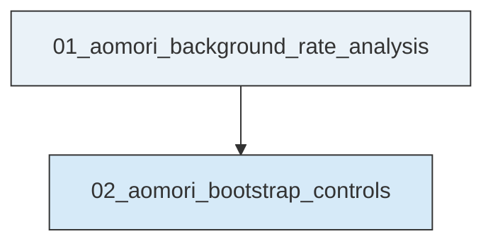
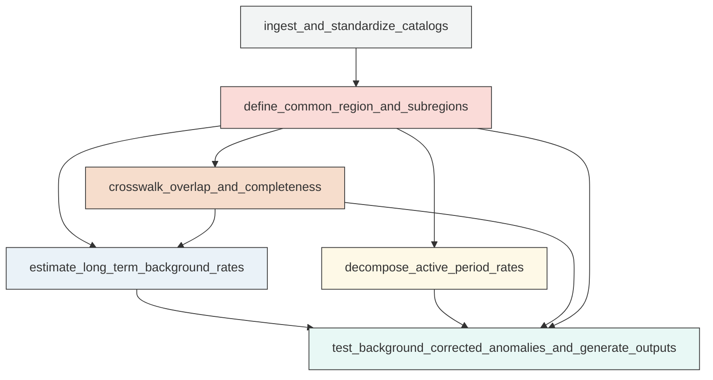
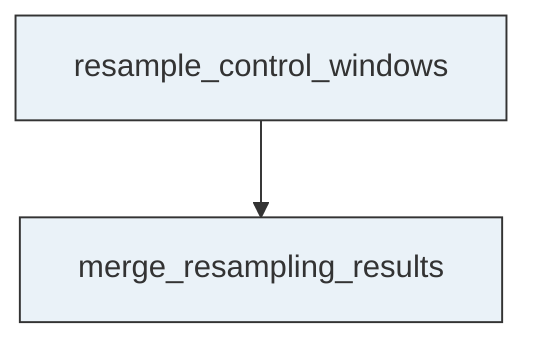

# Workflow Overview

## Top-Level Task Dependencies

**Description:**
- `01_aomori_background_rate_analysis`: Audit the two catalogs, define the common analysis region, estimate long-term background rates, decompose active-period rates, and generate anomaly tables and figures.
- `02_aomori_bootstrap_controls`: Run heavy bootstrap and random-window control resampling from validated intermediate outputs and merge the results into the anomaly summary.

## Subtask Dependencies

#### 01_aomori_background_rate_analysis
**Usage**: Audit the two catalogs, define the common analysis region, estimate long-term background rates, decompose active-period rates, and generate anomaly tables and figures.

**Description:**
- `ingest_and_standardize_catalogs`: Load the long-term and active-period catalogs, normalize schema and data types, and document any file substitution.
- `define_common_region_and_subregions`: Derive the common spatial mask from the active-period catalog, add a small documented buffer if needed, and freeze named analysis subregions.
- `crosswalk_overlap_and_completeness`: Compare the catalogs over the overlap period within the common region, match larger events where feasible, and assess threshold reliability.
- `estimate_long_term_background_rates`: Compute baseline rates and empirical window distributions from the filtered long-term catalog for the common region and fixed subregions.
- `decompose_active_period_rates`: Resolve active-period rate evolution by region, threshold, depth bin, and timescale using the relocated catalog only.
- `test_background_corrected_anomalies_and_generate_outputs`: Compare active-period observations against long-term expectations, apply controls, and write the compact evidence products and diagnostic figures.

#### 02_aomori_bootstrap_controls
**Usage**: Run heavy bootstrap and random-window control resampling from validated intermediate outputs and merge the results into the anomaly summary.

**Description:**
- `resample_control_windows`: Generate bootstrap and random-window null distributions for predefined region-threshold-depth combinations.
- `merge_resampling_results`: Integrate resampling outputs with the anomaly summary without changing predefined regions or threshold decisions.