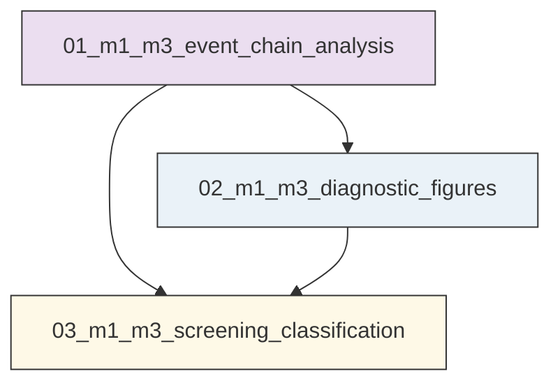
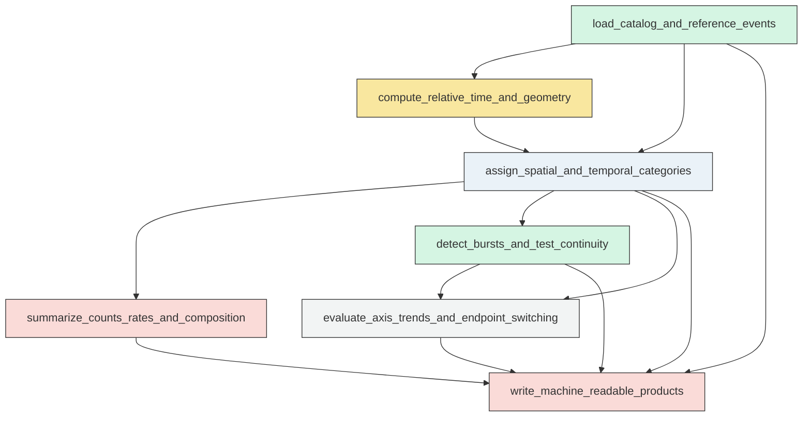
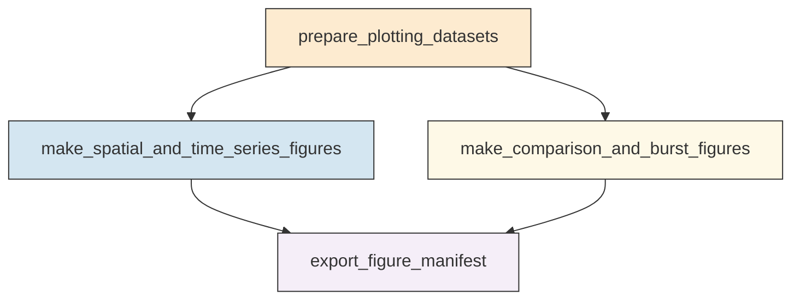
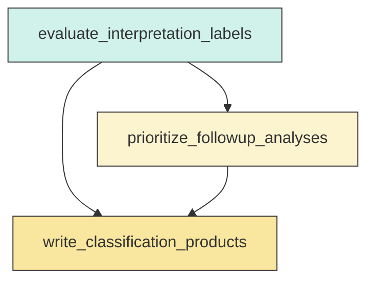

# Research Codings

## Task Overview


**Description:**
- `01_m1_m3_event_chain_analysis`: Build the unified M1-M3 event-chain analysis table and all core catalog-level summaries for raw and M2-aware screening.
- `02_m1_m3_diagnostic_figures`: Generate the compact diagnostic figure suite for fixed-window behavior, burst structure, spatial organization, and raw versus M2-aware comparisons.
- `03_m1_m3_screening_classification`: Convert the catalog summaries into a final non-causal screening classification and follow-up priority tables.


## Task Details


#### 01_m1_m3_event_chain_analysis
**Usage**: Build the unified M1-M3 event-chain analysis table and all core catalog-level summaries for raw and M2-aware screening.

**Description:**
- `load_catalog_and_reference_events`: Load the relocated catalog and authoritative M1, M2, and M3 reference events.
- `compute_relative_time_and_geometry`: Compute event-level relative-time, endpoint-distance, and M1-M3 axis geometry metrics.
- `assign_spatial_and_temporal_categories`: Assign local-union, endpoint, corridor, M2-aware, and fixed-window categories to each event.
- `summarize_counts_rates_and_composition`: Summarize magnitude-threshold counts, rates, phase contributions, and spatial composition by fixed window.
- `detect_bursts_and_test_continuity`: Detect major bursts and quantify whether middle-phase activity is sustained, sparse, or burst-separated.
- `evaluate_axis_trends_and_endpoint_switching`: Compare full-interval and window-separated along-axis behavior to distinguish migration-like patterns from endpoint switching.
- `write_machine_readable_products`: Write the event-chain table, reference table, summaries, and follow-up target list for downstream plotting and reporting.

#### Coding Script

```python

from __future__ import annotations

import math
import sys
import traceback
from dataclasses import dataclass
from pathlib import Path
from typing import Dict, List, Tuple

import numpy as np
import pandas as pd


BASE_DIR = Path("<CASE_ROOT>")
RUN_DIR = BASE_DIR / "run" / "03_1A_event_chain_and_bursts" / "exp_run"
OUTPUT_DIR = RUN_DIR / "outputs" / "01_m1_m3_event_chain_analysis"
CATALOG_PATH = BASE_DIR / "data" / "catalog" / "Snet_catalog_relocate_250601_260501.csv"
MAINSHOCK_PATH = BASE_DIR / "data" / "catalog" / "main_earthquake.csv"
MECHA_PATH = BASE_DIR / "data" / "source_mechanism" / "Snet_mecha.csv"

CATALOG_COLUMNS = ["origin_time", "latitude", "longitude", "depth_km", "magnitude"]
MAG_THRESHOLDS = [3.0, 4.0, 5.0, 6.0]
PRIMARY_CORRIDOR_WIDTH_KM = 20.0
SENSITIVITY_CORRIDOR_WIDTH_KM = 30.0
CORE_RADIUS_KM = 30.0
EXTENDED_RADIUS_KM = 60.0
M2_RADIUS_KM = 100.0
EARTH_RADIUS_KM = 6371.0
POST_M3_WINDOWS_DAYS = [7, 14]
ROLLING_BURST_WINDOWS = [1, 3, 7]
MIN_BURST_EVENTS = {3.0: 4, 4.0: 2}


@dataclass(frozen=True)
class Mainshock:
    label: str
    origin_time: pd.Timestamp
    latitude: float
    longitude: float
    depth_km: float
    magnitude: float


WINDOW_DEFINITIONS = {
    "pre_M1_baseline_14d": ("-inf", "M1-14d"),
    "pre_M1_baseline_7d": ("-inf", "M1-7d"),
    "M1_related_primary": ("M1-14d", "M1+21d"),
    "M1_related_sensitivity_narrow": ("M1-7d", "M1+14d"),
    "M1_related_sensitivity_broad": ("M1-14d", "M1+28d"),
    "full_M1_to_M3": ("M1", "M3"),
    "middle_primary": ("M1+21d", "M3-35d"),
    "pre_M3_primary": ("M3-35d", "M3"),
    "pre_M3_sensitivity_42d": ("M3-42d", "M3"),
    "pre_M3_sensitivity_28d": ("M3-28d", "M3"),
    "post_M3_7d": ("M3", "M3+7d"),
    "post_M3_14d": ("M3", "M3+14d"),
}


def log(message: str) -> None:
    print(message, flush=True)


def haversine_km(lat1, lon1, lat2, lon2):
    lat1 = np.radians(lat1)
    lon1 = np.radians(lon1)
    lat2 = np.radians(lat2)
    lon2 = np.radians(lon2)
    dlat = lat2 - lat1
    dlon = lon2 - lon1
    a = np.sin(dlat / 2.0) ** 2 + np.cos(lat1) * np.cos(lat2) * np.sin(dlon / 2.0) ** 2
    return 2.0 * EARTH_RADIUS_KM * np.arcsin(np.sqrt(a))


def local_xy_km(lat, lon, ref_lat, ref_lon):
    lat = np.asarray(lat, dtype=float)
    lon = np.asarray(lon, dtype=float)
    lat0 = float(ref_lat)
    lon0 = float(ref_lon)
    x = (lon - lon0) * 111.32 * math.cos(math.radians(lat0))
    y = (lat - lat0) * 110.574
    return x, y


def parse_bound(token: str, refs: Dict[str, Mainshock]) -> pd.Timestamp | None:
    token = token.strip()
    if token == "-inf":
        return None
    if token in refs:
        return refs[token].origin_time
    if "+" in token:
        key, offset = token.split("+", 1)
        return refs[key].origin_time + pd.to_timedelta(offset)
    if "-" in token:
        key, offset = token.split("-", 1)
        return refs[key].origin_time - pd.to_timedelta(offset)
    raise ValueError(f"Unsupported time token: {token}")


def format_threshold_label(threshold: float) -> str:
    return f"M{int(threshold)}+"


def clean_output_dir(output_dir: Path) -> None:
    output_dir.mkdir(parents=True, exist_ok=True)
    removable = [
        "m1_m3_event_chain_table.csv",
        "m1_m3_reference_table.csv",
        "m1_m3_window_summary_counts_rates.csv",
        "m1_m3_window_summary_composition.csv",
        "m1_m3_raw_vs_m2aware_summary.csv",
        "m1_m3_phase_contribution_summary.csv",
        "m1_m3_burst_table.csv",
        "m1_m3_gap_continuity_metrics.csv",
        "m1_m3_migration_endpoint_switching_summary.csv",
        "m1_m3_control_comparison.csv",
        "m1_m3_followup_targets.csv",
        "m1_m3_classification_summary.csv",
    ]
    for name in removable:
        path = output_dir / name
        if path.exists():
            path.unlink()


def load_mainshocks(path: Path) -> Dict[str, Mainshock]:
    log(f"Loading mainshock table: {path}")
    df = pd.read_csv(path)
    rename_map = {"index": "label", "datetime": "origin_time", "lat": "latitude", "lon": "longitude", "dep": "depth_km", "mag": "magnitude"}
    df = df.rename(columns=rename_map)
    required = ["label", "origin_time", "latitude", "longitude", "depth_km", "magnitude"]
    missing = [c for c in required if c not in df.columns]
    if missing:
        raise ValueError(f"Mainshock table missing columns: {missing}")
    df["origin_time"] = pd.to_datetime(df["origin_time"], utc=True)
    refs = {}
    for _, row in df.iterrows():
        refs[str(row["label"])] = Mainshock(
            label=str(row["label"]),
            origin_time=row["origin_time"],
            latitude=float(row["latitude"]),
            longitude=float(row["longitude"]),
            depth_km=float(row["depth_km"]),
            magnitude=float(row["magnitude"]),
        )
    for key in ["M1", "M2", "M3"]:
        if key not in refs:
            raise ValueError(f"Mainshock table does not contain required label {key}")
    return refs


def load_catalog(path: Path) -> pd.DataFrame:
    log(f"Loading relocated catalog: {path}")
    df = pd.read_csv(path, header=None, names=CATALOG_COLUMNS)
    df["origin_time"] = pd.to_datetime(df["origin_time"], utc=True)
    numeric_cols = ["latitude", "longitude", "depth_km", "magnitude"]
    for col in numeric_cols:
        df[col] = pd.to_numeric(df[col], errors="coerce")
    df = df.dropna(subset=["origin_time", "latitude", "longitude", "depth_km", "magnitude"]).copy()
    df = df.sort_values("origin_time").reset_index(drop=True)
    df["event_id"] = [f"evt_{i:06d}" for i in range(1, len(df) + 1)]
    return df


def build_geometry(df: pd.DataFrame, refs: Dict[str, Mainshock]) -> pd.DataFrame:
    m1, m2, m3 = refs["M1"], refs["M2"], refs["M3"]
    lat0 = (m1.latitude + m3.latitude) / 2.0
    lon0 = (m1.longitude + m3.longitude) / 2.0
    event_x, event_y = local_xy_km(df["latitude"].to_numpy(), df["longitude"].to_numpy(), lat0, lon0)
    m1x, m1y = local_xy_km([m1.latitude], [m1.longitude], lat0, lon0)
    m3x, m3y = local_xy_km([m3.latitude], [m3.longitude], lat0, lon0)
    m1x, m1y, m3x, m3y = float(m1x[0]), float(m1y[0]), float(m3x[0]), float(m3y[0])
    axis_vec = np.array([m3x - m1x, m3y - m1y], dtype=float)
    axis_len = float(np.hypot(axis_vec[0], axis_vec[1]))
    axis_hat = axis_vec / axis_len
    rel_x = event_x - m1x
    rel_y = event_y - m1y
    along = rel_x * axis_hat[0] + rel_y * axis_hat[1]
    perp = np.abs(rel_x * axis_hat[1] - rel_y * axis_hat[0])
    dist_m1 = haversine_km(df["latitude"].to_numpy(), df["longitude"].to_numpy(), m1.latitude, m1.longitude)
    dist_m2 = haversine_km(df["latitude"].to_numpy(), df["longitude"].to_numpy(), m2.latitude, m2.longitude)
    dist_m3 = haversine_km(df["latitude"].to_numpy(), df["longitude"].to_numpy(), m3.latitude, m3.longitude)
    df = df.copy()
    df["time_since_M1_days"] = (df["origin_time"] - m1.origin_time) / pd.Timedelta(days=1)
    df["time_before_M3_days"] = (m3.origin_time - df["origin_time"]) / pd.Timedelta(days=1)
    df["distance_to_M1_km"] = dist_m1
    df["distance_to_M2_km"] = dist_m2
    df["distance_to_M3_km"] = dist_m3
    df["along_axis_km"] = along
    df["perpendicular_distance_km"] = perp
    df["axis_length_km"] = axis_len
    df["axis_fraction"] = along / axis_len
    df["nearest_endpoint"] = np.where(dist_m1 <= dist_m3, "M1", "M3")
    df["in_M1_core_30km"] = dist_m1 <= CORE_RADIUS_KM
    df["in_M3_core_30km"] = dist_m3 <= CORE_RADIUS_KM
    df["in_M1_extended_60km"] = dist_m1 <= EXTENDED_RADIUS_KM
    df["in_M3_extended_60km"] = dist_m3 <= EXTENDED_RADIUS_KM
    df["in_local_union_60km"] = df["in_M1_extended_60km"] | df["in_M3_extended_60km"]
    corridor_buffer = EXTENDED_RADIUS_KM
    corridor_between = (along >= -corridor_buffer) & (along <= axis_len + corridor_buffer)
    df["in_corridor_20km"] = corridor_between & (perp <= PRIMARY_CORRIDOR_WIDTH_KM)
    df["in_corridor_30km"] = corridor_between & (perp <= SENSITIVITY_CORRIDOR_WIDTH_KM)
    df["off_corridor_local"] = df["in_local_union_60km"] & (~df["in_corridor_20km"])
    df["M2_related_100km"] = dist_m2 <= M2_RADIUS_KM
    df["M2_ambiguous_overlap"] = df["M2_related_100km"] & (df["in_local_union_60km"] | df["in_corridor_20km"])

    categories = np.full(len(df), "outside_local_union", dtype=object)
    overlap_core = df["in_M1_core_30km"] & df["in_M3_core_30km"]
    m1_core = df["in_M1_core_30km"] & ~df["in_M3_core_30km"]
    m3_core = df["in_M3_core_30km"] & ~df["in_M1_core_30km"]
    corridor_noncore = df["in_local_union_60km"] & df["in_corridor_20km"] & ~(df["in_M1_core_30km"] | df["in_M3_core_30km"])
    off_corr = df["in_local_union_60km"] & ~df["in_corridor_20km"] & ~(df["in_M1_core_30km"] | df["in_M3_core_30km"])
    categories[overlap_core] = "overlap_core"
    categories[m1_core] = "M1-core"
    categories[m3_core] = "M3-core"
    categories[corridor_noncore] = "corridor_noncore"
    categories[off_corr] = "off-corridor_local"
    df["spatial_category"] = categories
    return df


def assign_windows(df: pd.DataFrame, refs: Dict[str, Mainshock]) -> pd.DataFrame:
    df = df.copy()
    for window_name, (start_token, end_token) in WINDOW_DEFINITIONS.items():
        start = parse_bound(start_token, refs)
        end = parse_bound(end_token, refs)
        mask = pd.Series(True, index=df.index)
        if start is not None:
            mask &= df["origin_time"] >= start
        if end is not None:
            mask &= df["origin_time"] < end
        df[f"window__{window_name}"] = mask
    return df


def build_reference_table(refs: Dict[str, Mainshock]) -> pd.DataFrame:
    rows = []
    m1, m2, m3 = refs["M1"], refs["M2"], refs["M3"]
    for item in [m1, m2, m3]:
        rows.append(
            {
                "label": item.label,
                "origin_time": item.origin_time,
                "latitude": item.latitude,
                "longitude": item.longitude,
                "depth_km": item.depth_km,
                "magnitude": item.magnitude,
                "distance_to_M1_km": haversine_km(item.latitude, item.longitude, m1.latitude, m1.longitude),
                "distance_to_M2_km": haversine_km(item.latitude, item.longitude, m2.latitude, m2.longitude),
                "distance_to_M3_km": haversine_km(item.latitude, item.longitude, m3.latitude, m3.longitude),
            }
        )
    return pd.DataFrame(rows)


def get_window_duration_days(df: pd.DataFrame, mask: pd.Series) -> float:
    sub = df.loc[mask, "origin_time"]
    if sub.empty:
        return 0.0
    duration = (sub.max() - sub.min()) / pd.Timedelta(days=1)
    return float(max(duration, 1e-9))


def summarize_counts_rates(chain_df: pd.DataFrame, refs: Dict[str, Mainshock]) -> pd.DataFrame:
    log("Computing counts/rates summary")
    rows: List[Dict[str, object]] = []
    total_full_raw = {}
    total_full_m2 = {}
    full_mask = chain_df["window__full_M1_to_M3"]
    for threshold in MAG_THRESHOLDS:
        mag_mask = chain_df["magnitude"] >= threshold
        total_full_raw[threshold] = int((full_mask & mag_mask).sum())
        total_full_m2[threshold] = int((full_mask & mag_mask & ~chain_df["M2_related_100km"]).sum())
    for window_name in WINDOW_DEFINITIONS:
        mask_window = chain_df[f"window__{window_name}"]
        duration_days = get_window_duration_days(chain_df, mask_window)
        for version_name, version_mask in {
            "raw": pd.Series(True, index=chain_df.index),
            "m2aware": ~chain_df["M2_related_100km"],
        }.items():
            final_mask = mask_window & version_mask
            for threshold in MAG_THRESHOLDS:
                mag_mask = chain_df["magnitude"] >= threshold
                count = int((final_mask & mag_mask).sum())
                base_total = total_full_raw[threshold] if version_name == "raw" else total_full_m2[threshold]
                fraction = count / base_total if base_total > 0 else np.nan
                rows.append(
                    {
                        "window": window_name,
                        "version": version_name,
                        "magnitude_threshold": threshold,
                        "threshold_label": format_threshold_label(threshold),
                        "event_count": count,
                        "duration_days": duration_days,
                        "rate_per_day": count / duration_days if duration_days > 0 else np.nan,
                        "fraction_of_full_M1_to_M3": fraction,
                        "window_start": parse_bound(WINDOW_DEFINITIONS[window_name][0], refs),
                        "window_end": parse_bound(WINDOW_DEFINITIONS[window_name][1], refs),
                    }
                )
    return pd.DataFrame(rows)


def summarize_composition(chain_df: pd.DataFrame, refs: Dict[str, Mainshock]) -> pd.DataFrame:
    log("Computing window composition summary")
    spatial_categories = ["overlap_core", "M1-core", "M3-core", "corridor_noncore", "off-corridor_local"]
    rows = []
    local_mask = chain_df["in_local_union_60km"]
    for window_name in WINDOW_DEFINITIONS:
        mask_window = chain_df[f"window__{window_name}"]
        for version_name, version_mask in {
            "raw": pd.Series(True, index=chain_df.index),
            "m2aware": ~chain_df["M2_related_100km"],
        }.items():
            final_mask = mask_window & version_mask & local_mask
            total_local = int(final_mask.sum())
            row_base = {
                "window": window_name,
                "version": version_name,
                "window_start": parse_bound(WINDOW_DEFINITIONS[window_name][0], refs),
                "window_end": parse_bound(WINDOW_DEFINITIONS[window_name][1], refs),
                "total_local_events": total_local,
                "count_in_M1_extended_60km": int((mask_window & version_mask & chain_df["in_M1_extended_60km"]).sum()),
                "count_in_M3_extended_60km": int((mask_window & version_mask & chain_df["in_M3_extended_60km"]).sum()),
                "count_in_corridor_20km": int((mask_window & version_mask & chain_df["in_corridor_20km"]).sum()),
                "count_in_corridor_30km": int((mask_window & version_mask & chain_df["in_corridor_30km"]).sum()),
            }
            m1_core_count = int((final_mask & (chain_df["spatial_category"] == "M1-core")).sum())
            m3_core_count = int((final_mask & (chain_df["spatial_category"] == "M3-core")).sum())
            row_base["M1_core_minus_M3_core"] = m1_core_count - m3_core_count
            row_base["M1_to_M3_core_ratio"] = (m1_core_count / m3_core_count) if m3_core_count > 0 else np.nan
            for cat in spatial_categories:
                count = int((final_mask & (chain_df["spatial_category"] == cat)).sum())
                row_base[f"count_{cat}"] = count
                row_base[f"fraction_{cat}"] = count / total_local if total_local > 0 else np.nan
            rows.append(row_base)
    return pd.DataFrame(rows)


def summarize_raw_vs_m2aware(counts_df: pd.DataFrame, composition_df: pd.DataFrame) -> pd.DataFrame:
    log("Computing raw vs M2-aware summary")
    rows = []
    merged_counts = counts_df.pivot_table(
        index=["window", "magnitude_threshold", "threshold_label"],
        columns="version",
        values=["event_count", "rate_per_day", "fraction_of_full_M1_to_M3"],
        aggfunc="first",
    )
    merged_counts.columns = ["__".join(map(str, c)).strip() for c in merged_counts.columns.to_flat_index()]
    merged_counts = merged_counts.reset_index()
    for _, row in merged_counts.iterrows():
        raw_count = row.get("event_count__raw", np.nan)
        m2_count = row.get("event_count__m2aware", np.nan)
        rows.append(
            {
                "summary_type": "counts_rates",
                "window": row["window"],
                "magnitude_threshold": row["magnitude_threshold"],
                "threshold_label": row["threshold_label"],
                "raw_event_count": raw_count,
                "m2aware_event_count": m2_count,
                "count_difference_raw_minus_m2aware": raw_count - m2_count if pd.notna(raw_count) and pd.notna(m2_count) else np.nan,
                "fraction_removed_by_M2": (raw_count - m2_count) / raw_count if pd.notna(raw_count) and raw_count not in (0, np.nan) else np.nan,
                "raw_rate_per_day": row.get("rate_per_day__raw", np.nan),
                "m2aware_rate_per_day": row.get("rate_per_day__m2aware", np.nan),
                "raw_fraction_of_full": row.get("fraction_of_full_M1_to_M3__raw", np.nan),
                "m2aware_fraction_of_full": row.get("fraction_of_full_M1_to_M3__m2aware", np.nan),
            }
        )
    comp_subset = composition_df[["window", "version", "total_local_events", "count_M1-core", "count_M3-core", "count_corridor_noncore", "count_off-corridor_local"]].copy()
    comp_pivot = comp_subset.pivot_table(index="window", columns="version", values=[c for c in comp_subset.columns if c not in ["window", "version"]], aggfunc="first")
    comp_pivot.columns = ["__".join(map(str, c)).strip() for c in comp_pivot.columns.to_flat_index()]
    comp_pivot = comp_pivot.reset_index()
    for _, row in comp_pivot.iterrows():
        raw_total = row.get("total_local_events__raw", np.nan)
        m2_total = row.get("total_local_events__m2aware", np.nan)
        rows.append(
            {
                "summary_type": "composition",
                "window": row["window"],
                "magnitude_threshold": np.nan,
                "threshold_label": "all_magnitudes",
                "raw_event_count": raw_total,
                "m2aware_event_count": m2_total,
                "count_difference_raw_minus_m2aware": raw_total - m2_total if pd.notna(raw_total) and pd.notna(m2_total) else np.nan,
                "fraction_removed_by_M2": (raw_total - m2_total) / raw_total if pd.notna(raw_total) and raw_total not in (0, np.nan) else np.nan,
                "raw_rate_per_day": np.nan,
                "m2aware_rate_per_day": np.nan,
                "raw_fraction_of_full": np.nan,
                "m2aware_fraction_of_full": np.nan,
                "raw_M1_core": row.get("count_M1-core__raw", np.nan),
                "raw_M3_core": row.get("count_M3-core__raw", np.nan),
                "raw_corridor_noncore": row.get("count_corridor_noncore__raw", np.nan),
                "raw_off_corridor_local": row.get("count_off-corridor_local__raw", np.nan),
                "m2aware_M1_core": row.get("count_M1-core__m2aware", np.nan),
                "m2aware_M3_core": row.get("count_M3-core__m2aware", np.nan),
                "m2aware_corridor_noncore": row.get("count_corridor_noncore__m2aware", np.nan),
                "m2aware_off_corridor_local": row.get("count_off-corridor_local__m2aware", np.nan),
            }
        )
    return pd.DataFrame(rows)


def summarize_phase_contributions(counts_df: pd.DataFrame) -> pd.DataFrame:
    log("Computing phase contribution summary")
    rows = []
    phases = ["M1_related_primary", "middle_primary", "pre_M3_primary", "full_M1_to_M3"]
    sub = counts_df[counts_df["window"].isin(phases)].copy()
    for version_name in sub["version"].unique():
        for threshold in MAG_THRESHOLDS:
            part = sub[(sub["version"] == version_name) & (sub["magnitude_threshold"] == threshold)]
            full_count = float(part.loc[part["window"] == "full_M1_to_M3", "event_count"].iloc[0]) if (part["window"] == "full_M1_to_M3").any() else np.nan
            m1_count = float(part.loc[part["window"] == "M1_related_primary", "event_count"].iloc[0]) if (part["window"] == "M1_related_primary").any() else np.nan
            middle_count = float(part.loc[part["window"] == "middle_primary", "event_count"].iloc[0]) if (part["window"] == "middle_primary").any() else np.nan
            prem3_count = float(part.loc[part["window"] == "pre_M3_primary", "event_count"].iloc[0]) if (part["window"] == "pre_M3_primary").any() else np.nan
            rows.append(
                {
                    "version": version_name,
                    "magnitude_threshold": threshold,
                    "threshold_label": format_threshold_label(threshold),
                    "full_M1_to_M3_count": full_count,
                    "M1_related_count": m1_count,
                    "middle_count": middle_count,
                    "pre_M3_count": prem3_count,
                    "M1_related_fraction_of_full": m1_count / full_count if full_count and pd.notna(full_count) else np.nan,
                    "middle_fraction_of_full": middle_count / full_count if full_count and pd.notna(full_count) else np.nan,
                    "pre_M3_fraction_of_full": prem3_count / full_count if full_count and pd.notna(full_count) else np.nan,
                    "middle_plus_pre_M3_fraction_of_full": (middle_count + prem3_count) / full_count if full_count and pd.notna(full_count) else np.nan,
                }
            )
    return pd.DataFrame(rows)


def classify_burst_phase(start: pd.Timestamp, end: pd.Timestamp, refs: Dict[str, Mainshock]) -> str:
    overlaps = []
    for name in ["M1_related_primary", "middle_primary", "pre_M3_primary", "post_M3_14d"]:
        w0 = parse_bound(WINDOW_DEFINITIONS[name][0], refs)
        w1 = parse_bound(WINDOW_DEFINITIONS[name][1], refs)
        overlap = max(pd.Timedelta(0), min(end, w1) - max(start, w0)) / pd.Timedelta(days=1)
        overlaps.append((name, float(overlap)))
    overlaps.sort(key=lambda x: x[1], reverse=True)
    best_name, best_overlap = overlaps[0]
    if best_overlap <= 0:
        return "mixed/ambiguous"
    mapping = {
        "M1_related_primary": "M1-related dominated phase",
        "middle_primary": "intermediate M1-M3 activity",
        "pre_M3_primary": "pre-M3 local activation",
        "post_M3_14d": "post-M3 context",
    }
    return mapping.get(best_name, "mixed/ambiguous")


def detect_bursts(chain_df: pd.DataFrame, refs: Dict[str, Mainshock]) -> pd.DataFrame:
    log("Detecting major bursts")
    local_df = chain_df[chain_df["in_local_union_60km"]].copy().sort_values("origin_time")
    if local_df.empty:
        return pd.DataFrame()
    bursts = []
    for threshold in [3.0, 4.0]:
        threshold_df = local_df[local_df["magnitude"] >= threshold].copy()
        if threshold_df.empty:
            continue
        times = threshold_df["origin_time"].to_numpy(dtype="datetime64[ns]")
        gap_days = np.diff(times) / np.timedelta64(1, "D")
        split_points = np.where(gap_days > 7.0)[0] + 1
        groups = np.split(np.arange(len(threshold_df)), split_points)
        for group_idx, group in enumerate(groups, start=1):
            if len(group) < MIN_BURST_EVENTS[threshold]:
                continue
            sub = threshold_df.iloc[group].copy()
            start = sub["origin_time"].min()
            end = sub["origin_time"].max()
            duration_days = max((end - start) / pd.Timedelta(days=1), 0.0)
            bursts.append(
                {
                    "burst_id": f"T{int(threshold)}_{group_idx:03d}",
                    "threshold": threshold,
                    "threshold_label": format_threshold_label(threshold),
                    "start_time": start,
                    "end_time": end,
                    "duration_days": duration_days,
                    "event_count": int(len(sub)),
                    "largest_magnitude": float(sub["magnitude"].max()),
                    "mean_magnitude": float(sub["magnitude"].mean()),
                    "min_depth_km": float(sub["depth_km"].min()),
                    "max_depth_km": float(sub["depth_km"].max()),
                    "median_depth_km": float(sub["depth_km"].median()),
                    "centroid_latitude": float(sub["latitude"].mean()),
                    "centroid_longitude": float(sub["longitude"].mean()),
                    "along_axis_centroid_km": float(sub["along_axis_km"].mean()),
                    "dominant_spatial_category": str(sub["spatial_category"].mode().iloc[0]),
                    "M2_related_fraction": float(sub["M2_related_100km"].mean()),
                    "nearest_endpoint_mode": str(sub["nearest_endpoint"].mode().iloc[0]),
                    "phase_class": classify_burst_phase(start, end, refs),
                }
            )
    burst_df = pd.DataFrame(bursts)
    if burst_df.empty:
        return burst_df
    burst_df = burst_df.sort_values(["start_time", "threshold"]).reset_index(drop=True)
    return burst_df


def compute_gap_metrics(chain_df: pd.DataFrame, refs: Dict[str, Mainshock]) -> pd.DataFrame:
    log("Computing continuity/gap metrics")
    rows = []
    local_df = chain_df[chain_df["in_local_union_60km"]].copy().sort_values("origin_time")
    for version_name, version_mask in {
        "raw": pd.Series(True, index=local_df.index),
        "m2aware": ~local_df["M2_related_100km"],
    }.items():
        dfv = local_df[version_mask].copy().sort_values("origin_time")
        for threshold in [0.0, 3.0, 4.0, 5.0]:
            sub = dfv[dfv["magnitude"] >= threshold].copy()
            if len(sub) < 2:
                rows.append(
                    {
                        "version": version_name,
                        "magnitude_threshold": threshold,
                        "threshold_label": format_threshold_label(threshold) if threshold > 0 else "all",
                        "n_events": int(len(sub)),
                        "median_gap_days": np.nan,
                        "p90_gap_days": np.nan,
                        "max_gap_days": np.nan,
                        "full_M1_to_M3_max_gap_days": np.nan,
                        "middle_phase_max_gap_days": np.nan,
                    }
                )
                continue
                continue
            gaps = sub["origin_time"].diff().dropna() / pd.Timedelta(days=1)
            full_sub = sub[sub["window__full_M1_to_M3"]]
            middle_sub = sub[sub["window__middle_primary"]]
            full_gaps = full_sub["origin_time"].diff().dropna() / pd.Timedelta(days=1)
            middle_gaps = middle_sub["origin_time"].diff().dropna() / pd.Timedelta(days=1)
            rows.append(
                {
                    "version": version_name,
                    "magnitude_threshold": threshold,
                    "threshold_label": format_threshold_label(threshold) if threshold > 0 else "all",
                    "n_events": int(len(sub)),
                    "median_gap_days": float(gaps.median()),
                    "p90_gap_days": float(gaps.quantile(0.9)),
                    "max_gap_days": float(gaps.max()),
                    "full_M1_to_M3_max_gap_days": float(full_gaps.max()) if not full_gaps.empty else np.nan,
                    "middle_phase_max_gap_days": float(middle_gaps.max()) if not middle_gaps.empty else np.nan,
                }
            )
    return pd.DataFrame(rows)


def fit_time_trend(sub: pd.DataFrame) -> Tuple[float, float, float]:
    if len(sub) < 3:
        return np.nan, np.nan, np.nan
    x = sub["time_since_M1_days"].to_numpy(dtype=float)
    y = sub["along_axis_km"].to_numpy(dtype=float)
    slope, intercept = np.polyfit(x, y, 1)
    corr = np.corrcoef(x, y)[0, 1] if len(sub) > 1 else np.nan
    return float(slope), float(intercept), float(corr)


def summarize_migration(chain_df: pd.DataFrame) -> pd.DataFrame:
    log("Computing migration / endpoint-switching summary")
    rows = []
    phase_names = ["full_M1_to_M3", "M1_related_primary", "middle_primary", "pre_M3_primary"]
    for version_name, version_mask in {
        "raw": pd.Series(True, index=chain_df.index),
        "m2aware": ~chain_df["M2_related_100km"],
    }.items():
        for phase in phase_names:
            sub = chain_df[chain_df["in_local_union_60km"] & version_mask & chain_df[f"window__{phase}"]].copy()
            slope, intercept, corr = fit_time_trend(sub)
            rows.append(
                {
                    "version": version_name,
                    "phase": phase,
                    "n_events": int(len(sub)),
                    "along_axis_mean_km": float(sub["along_axis_km"].mean()) if len(sub) else np.nan,
                    "along_axis_median_km": float(sub["along_axis_km"].median()) if len(sub) else np.nan,
                    "perp_median_km": float(sub["perpendicular_distance_km"].median()) if len(sub) else np.nan,
                    "slope_km_per_day": slope,
                    "time_along_axis_correlation": corr,
                    "fraction_nearest_M1": float((sub["nearest_endpoint"] == "M1").mean()) if len(sub) else np.nan,
                    "fraction_nearest_M3": float((sub["nearest_endpoint"] == "M3").mean()) if len(sub) else np.nan,
                    "fraction_M1_core": float((sub["spatial_category"] == "M1-core").mean()) if len(sub) else np.nan,
                    "fraction_M3_core": float((sub["spatial_category"] == "M3-core").mean()) if len(sub) else np.nan,
                    "fraction_corridor_noncore": float((sub["spatial_category"] == "corridor_noncore").mean()) if len(sub) else np.nan,
                    "fraction_off_corridor_local": float((sub["spatial_category"] == "off-corridor_local").mean()) if len(sub) else np.nan,
                }
            )
    return pd.DataFrame(rows)


def summarize_controls(chain_df: pd.DataFrame) -> pd.DataFrame:
    log("Computing control comparisons")
    rows = []
    baseline_windows = ["pre_M1_baseline_14d", "pre_M1_baseline_7d"]
    compare_windows = ["M1_related_primary", "middle_primary", "pre_M3_primary", "full_M1_to_M3"]
    for version_name, version_mask in {
        "raw": pd.Series(True, index=chain_df.index),
        "m2aware": ~chain_df["M2_related_100km"],
    }.items():
        for baseline in baseline_windows:
            base_mask = chain_df["in_local_union_60km"] & version_mask & chain_df[f"window__{baseline}"]
            base_duration = get_window_duration_days(chain_df, base_mask)
            base_count = int(base_mask.sum())
            base_rate = base_count / base_duration if base_duration > 0 else np.nan
            base_corridor = int((base_mask & chain_df["in_corridor_20km"]).sum())
            base_off = int((base_mask & chain_df["off_corridor_local"]).sum())
            for compare in compare_windows:
                cmp_mask = chain_df["in_local_union_60km"] & version_mask & chain_df[f"window__{compare}"]
                cmp_duration = get_window_duration_days(chain_df, cmp_mask)
                cmp_count = int(cmp_mask.sum())
                cmp_rate = cmp_count / cmp_duration if cmp_duration > 0 else np.nan
                rows.append(
                    {
                        "version": version_name,
                        "baseline_window": baseline,
                        "compare_window": compare,
                        "baseline_event_count": base_count,
                        "compare_event_count": cmp_count,
                        "baseline_rate_per_day": base_rate,
                        "compare_rate_per_day": cmp_rate,
                        "rate_ratio_compare_to_baseline": cmp_rate / base_rate if pd.notna(base_rate) and base_rate > 0 else np.nan,
                        "baseline_corridor_fraction": base_corridor / base_count if base_count > 0 else np.nan,
                        "baseline_off_corridor_fraction": base_off / base_count if base_count > 0 else np.nan,
                        "compare_corridor_fraction": int((cmp_mask & chain_df["in_corridor_20km"]).sum()) / cmp_count if cmp_count > 0 else np.nan,
                        "compare_off_corridor_fraction": int((cmp_mask & chain_df["off_corridor_local"]).sum()) / cmp_count if cmp_count > 0 else np.nan,
                    }
                )
    return pd.DataFrame(rows)


def build_followup_targets(counts_df: pd.DataFrame, composition_df: pd.DataFrame, migration_df: pd.DataFrame, burst_df: pd.DataFrame) -> pd.DataFrame:
    log("Building follow-up target suggestions")
    rows = []
    for version_name in ["raw", "m2aware"]:
        phase_sub = counts_df[(counts_df["version"] == version_name) & (counts_df["magnitude_threshold"] == 4.0)]
        full = phase_sub.loc[phase_sub["window"] == "full_M1_to_M3", "event_count"]
        m1r = phase_sub.loc[phase_sub["window"] == "M1_related_primary", "event_count"]
        prem3 = phase_sub.loc[phase_sub["window"] == "pre_M3_primary", "event_count"]
        middle = phase_sub.loc[phase_sub["window"] == "middle_primary", "event_count"]
        full_count = float(full.iloc[0]) if not full.empty else np.nan
        m1_count = float(m1r.iloc[0]) if not m1r.empty else np.nan
        prem3_count = float(prem3.iloc[0]) if not prem3.empty else np.nan
        middle_count = float(middle.iloc[0]) if not middle.empty else np.nan
        rows.append(
            {
                "version": version_name,
                "followup_topic": "spatial_depth_screening",
                "priority": "high" if (pd.notna(prem3_count) and prem3_count >= 3) or (burst_df["phase_class"].eq("pre-M3 local activation").any() if not burst_df.empty else False) else "medium",
                "reason": "Check whether pre-M3 or multi-burst activity occupies distinct depth bands or endpoint clusters.",
            }
        )
        rows.append(
            {
                "version": version_name,
                "followup_topic": "b_value_completeness",
                "priority": "high" if pd.notna(full_count) and full_count >= 20 else "medium",
                "reason": "Enough local events to test whether phase-specific magnitude-frequency behavior differs from pre-M1 background.",
            }
        )
        mig = migration_df[(migration_df["version"] == version_name) & (migration_df["phase"] == "full_M1_to_M3")]
        mig_flag = False
        if not mig.empty:
            corr = mig["time_along_axis_correlation"].iloc[0]
            mig_flag = pd.notna(corr) and abs(corr) >= 0.35
        rows.append(
            {
                "version": version_name,
                "followup_topic": "burst_wise_migration_screening",
                "priority": "high" if mig_flag and pd.notna(middle_count) and middle_count >= 3 else "medium",
                "reason": "Only warranted if along-axis trends remain after separating M1-related, middle, and pre-M3 windows.",
            }
        )
        rows.append(
            {
                "version": version_name,
                "followup_topic": "mechanism_screening",
                "priority": "medium",
                "reason": "Mechanisms are optional context; use only for burst or endpoint groups with sufficient coverage.",
            }
        )
    return pd.DataFrame(rows)


def build_classification_summary(counts_df: pd.DataFrame, composition_df: pd.DataFrame, migration_df: pd.DataFrame, controls_df: pd.DataFrame, burst_df: pd.DataFrame) -> pd.DataFrame:
    log("Building screening classification summary")
    rows = []
    for version_name in ["raw", "m2aware"]:
        def get_count(window: str, thr: float) -> float:
            sub = counts_df[(counts_df["version"] == version_name) & (counts_df["window"] == window) & (counts_df["magnitude_threshold"] == thr)]
            return float(sub["event_count"].iloc[0]) if not sub.empty else np.nan

        def get_rate_ratio(baseline: str, compare: str) -> float:
            sub = controls_df[(controls_df["version"] == version_name) & (controls_df["baseline_window"] == baseline) & (controls_df["compare_window"] == compare)]
            return float(sub["rate_ratio_compare_to_baseline"].iloc[0]) if not sub.empty else np.nan

        pre_existing = "present" if get_count("pre_M1_baseline_14d", 3.0) > 0 else "weak_or_absent"
        m1_boost = get_rate_ratio("pre_M1_baseline_14d", "M1_related_primary")
        m1_related_state = "strong" if pd.notna(m1_boost) and m1_boost >= 2.0 else ("moderate" if pd.notna(m1_boost) and m1_boost >= 1.2 else "weak")
        middle_ratio = get_rate_ratio("pre_M1_baseline_14d", "middle_primary")
        middle_state = "sustained" if pd.notna(middle_ratio) and middle_ratio >= 1.0 else ("moderate" if pd.notna(middle_ratio) and middle_ratio >= 0.5 else "quiet")
        prem3_ratio = get_rate_ratio("pre_M1_baseline_14d", "pre_M3_primary")
        prem3_state = "clear_local_activation" if pd.notna(prem3_ratio) and prem3_ratio >= 1.0 and get_count("pre_M3_primary", 3.0) >= 3 else ("limited_or_weak" if get_count("pre_M3_primary", 3.0) > 0 else "absent")

        comp_mid = composition_df[(composition_df["version"] == version_name) & (composition_df["window"] == "middle_primary")]
        comp_pre = composition_df[(composition_df["version"] == version_name) & (composition_df["window"] == "pre_M3_primary")]
        corridor_like = False
        endpoint_centered = False
        if not comp_mid.empty:
            corridor_frac = comp_mid["fraction_corridor_noncore"].iloc[0]
            m1_frac = comp_mid["fraction_M1-core"].iloc[0]
            m3_frac = comp_mid["fraction_M3-core"].iloc[0]
            corridor_like = pd.notna(corridor_frac) and corridor_frac >= max(m1_frac, m3_frac, 0.4)
            endpoint_centered = pd.notna(m1_frac) and pd.notna(m3_frac) and (m1_frac + m3_frac) >= 0.6
        sep_bursts = False
        if not burst_df.empty:
            bsub = burst_df.copy()
            if version_name == "m2aware":
                bsub = bsub[bsub["M2_related_fraction"] < 0.5]
            sep_bursts = len(bsub) >= 2

        mig_full = migration_df[(migration_df["version"] == version_name) & (migration_df["phase"] == "full_M1_to_M3")]
        mig_mid = migration_df[(migration_df["version"] == version_name) & (migration_df["phase"] == "middle_primary")]
        mig_pre = migration_df[(migration_df["version"] == version_name) & (migration_df["phase"] == "pre_M3_primary")]
        apparent_migration = False
        endpoint_switching = False
        if not mig_full.empty:
            corr_full = mig_full["time_along_axis_correlation"].iloc[0]
            corr_mid = mig_mid["time_along_axis_correlation"].iloc[0] if not mig_mid.empty else np.nan
            corr_pre = mig_pre["time_along_axis_correlation"].iloc[0] if not mig_pre.empty else np.nan
            apparent_migration = pd.notna(corr_full) and abs(corr_full) >= 0.35 and ((pd.notna(corr_mid) and abs(corr_mid) >= 0.25) or (pd.notna(corr_pre) and abs(corr_pre) >= 0.25))
            endpoint_switching = pd.notna(corr_full) and abs(corr_full) >= 0.2 and not apparent_migration

        raw_full_m3 = get_count("full_M1_to_M3", 3.0) if version_name == "raw" else np.nan
        m2aware_full_m3 = get_count("full_M1_to_M3", 3.0) if version_name == "m2aware" else np.nan
        if version_name == "raw":
            m2_status = "compare_raw_and_m2aware"
        else:
            raw_ref = counts_df[
                (counts_df["version"] == "raw")
                & (counts_df["window"] == "full_M1_to_M3")
                & (counts_df["magnitude_threshold"] == 3.0)
            ]
            raw_ref_count = float(raw_ref["event_count"].iloc[0]) if not raw_ref.empty else np.nan
            this_count = get_count("full_M1_to_M3", 3.0)
            if pd.notna(raw_ref_count) and raw_ref_count > 0 and pd.notna(this_count):
                frac_removed = (raw_ref_count - this_count) / raw_ref_count
                m2_status = "yes" if frac_removed >= 0.1 else "limited"
            else:
                m2_status = "unclear"

        rows.extend(
            [
                {"version": version_name, "classification_item": "pre_existing_local_activity_before_M1", "classification": pre_existing},
                {"version": version_name, "classification_item": "M1_related_swarm_aftershock_dominated", "classification": m1_related_state},
                {"version": version_name, "classification_item": "middle_phase_activity_after_M1_plus_21d", "classification": middle_state},
                {"version": version_name, "classification_item": "separated_bursts", "classification": "yes" if sep_bursts else "no_or_unclear"},
                {"version": version_name, "classification_item": "endpoint_centered_activity", "classification": "yes" if endpoint_centered else "no_or_mixed"},
                {"version": version_name, "classification_item": "corridor_like_activity", "classification": "yes" if corridor_like else "no_or_mixed"},
                {"version": version_name, "classification_item": "pre_M3_local_activation", "classification": prem3_state},
                {"version": version_name, "classification_item": "continuous_activation_chain", "classification": "unlikely" if middle_state == "quiet" and sep_bursts else "possible_or_mixed"},
                {"version": version_name, "classification_item": "apparent_migration", "classification": "yes" if apparent_migration else "not_robust"},
                {"version": version_name, "classification_item": "endpoint_switching_or_mixed_endpoint_sequences", "classification": "yes" if endpoint_switching else "no_or_unclear"},
                {"version": version_name, "classification_item": "broader_regional_or_background_component", "classification": "present" if not endpoint_centered and not corridor_like else "subordinate"},
                {"version": version_name, "classification_item": "M2_affected_or_ambiguous_mixed_behavior", "classification": m2_status},
            ]
        )
    return pd.DataFrame(rows)


def save_dataframe(df: pd.DataFrame, path: Path) -> None:
    df.to_csv(path, index=False)
    log(f"Wrote: {path}")


def main() -> None:
    clean_output_dir(OUTPUT_DIR)
    refs = load_mainshocks(MAINSHOCK_PATH)
    catalog_df = load_catalog(CATALOG_PATH)
    log(f"Catalog events loaded: {len(catalog_df)}")
    catalog_df = build_geometry(catalog_df, refs)
    catalog_df = assign_windows(catalog_df, refs)

    chain_df = catalog_df[(catalog_df["in_local_union_60km"]) | (catalog_df["in_corridor_20km"])].copy()
    chain_df = chain_df.sort_values("origin_time").reset_index(drop=True)
    log(f"M1-M3 local/corridor events retained: {len(chain_df)}")

    reference_df = build_reference_table(refs)
    counts_df = summarize_counts_rates(chain_df, refs)
    composition_df = summarize_composition(chain_df, refs)
    raw_vs_m2_df = summarize_raw_vs_m2aware(counts_df, composition_df)
    phase_df = summarize_phase_contributions(counts_df)
    burst_df = detect_bursts(chain_df, refs)
    gap_df = compute_gap_metrics(chain_df, refs)
    migration_df = summarize_migration(chain_df)
    controls_df = summarize_controls(chain_df)
    followup_df = build_followup_targets(counts_df, composition_df, migration_df, burst_df)
    classification_df = build_classification_summary(counts_df, composition_df, migration_df, controls_df, burst_df)

    required_chain_columns = [
        "event_id",
        "origin_time",
        "latitude",
        "longitude",
        "depth_km",
        "magnitude",
        "time_since_M1_days",
        "time_before_M3_days",
        "distance_to_M1_km",
        "distance_to_M2_km",
        "distance_to_M3_km",
        "along_axis_km",
        "perpendicular_distance_km",
        "spatial_category",
        "M2_related_100km",
    ]
    missing_cols = [c for c in required_chain_columns if c not in chain_df.columns]
    if missing_cols:
        raise ValueError(f"Event-chain table missing required columns: {missing_cols}")

    save_dataframe(chain_df, OUTPUT_DIR / "m1_m3_event_chain_table.csv")
    save_dataframe(reference_df, OUTPUT_DIR / "m1_m3_reference_table.csv")
    save_dataframe(counts_df, OUTPUT_DIR / "m1_m3_window_summary_counts_rates.csv")
    save_dataframe(composition_df, OUTPUT_DIR / "m1_m3_window_summary_composition.csv")
    save_dataframe(raw_vs_m2_df, OUTPUT_DIR / "m1_m3_raw_vs_m2aware_summary.csv")
    save_dataframe(phase_df, OUTPUT_DIR / "m1_m3_phase_contribution_summary.csv")
    save_dataframe(burst_df, OUTPUT_DIR / "m1_m3_burst_table.csv")
    save_dataframe(gap_df, OUTPUT_DIR / "m1_m3_gap_continuity_metrics.csv")
    save_dataframe(migration_df, OUTPUT_DIR / "m1_m3_migration_endpoint_switching_summary.csv")
    save_dataframe(controls_df, OUTPUT_DIR / "m1_m3_control_comparison.csv")
    save_dataframe(followup_df, OUTPUT_DIR / "m1_m3_followup_targets.csv")
    save_dataframe(classification_df, OUTPUT_DIR / "m1_m3_classification_summary.csv")

    log("Completed Task 01 M1-M3 event-chain analysis")


if __name__ == "__main__":
    try:
        main()
    except Exception:
        print(traceback.format_exc(), flush=True)
        sys.exit(1)


```

#### 02_m1_m3_diagnostic_figures
**Usage**: Generate the compact diagnostic figure suite for fixed-window behavior, burst structure, spatial organization, and raw versus M2-aware comparisons.

**Description:**
- `prepare_plotting_datasets`: Prepare filtered plotting tables and annotations from the event-chain outputs.
- `make_spatial_and_time_series_figures`: Create the map and time-series figures used to assess endpoint, corridor, and temporal structure.
- `make_comparison_and_burst_figures`: Create cumulative-count, burst-timeline, pre-M3 comparison, and window-composition figures.
- `export_figure_manifest`: Save figure metadata and output references for report synthesis.

#### Coding Script

```python

from __future__ import annotations

import math
import sys
import traceback
from pathlib import Path
from typing import Dict, List, Tuple

import matplotlib.dates as mdates
import matplotlib.pyplot as plt
import numpy as np
import pandas as pd
from matplotlib.lines import Line2D
from matplotlib.patches import Circle, Polygon, Rectangle

BASE_DIR = Path("<CASE_ROOT>")
RUN_DIR = BASE_DIR / "run" / "03_1A_event_chain_and_bursts" / "exp_run"
INPUT_DIR = RUN_DIR / "outputs" / "01_m1_m3_event_chain_analysis"
OUTPUT_DIR = RUN_DIR / "outputs" / "02_m1_m3_diagnostic_figures"

EVENT_PATH = INPUT_DIR / "m1_m3_event_chain_table.csv"
REFERENCE_PATH = INPUT_DIR / "m1_m3_reference_table.csv"
COUNTS_PATH = INPUT_DIR / "m1_m3_window_summary_counts_rates.csv"
COMPOSITION_PATH = INPUT_DIR / "m1_m3_window_summary_composition.csv"
RAW_VS_M2_PATH = INPUT_DIR / "m1_m3_raw_vs_m2aware_summary.csv"
BURST_PATH = INPUT_DIR / "m1_m3_burst_table.csv"
MIGRATION_PATH = INPUT_DIR / "m1_m3_migration_endpoint_switching_summary.csv"

CORE_RADIUS_KM = 30.0
EXTENDED_RADIUS_KM = 60.0
PRIMARY_CORRIDOR_WIDTH_KM = 20.0
SENSITIVITY_CORRIDOR_WIDTH_KM = 30.0

PHASE_WINDOWS: List[Tuple[str, str]] = [
    ("pre_M1_baseline_14d", "Pre-M1 baseline\n(start to M1-14 d)"),
    ("M1_related_primary", "M1-related dominated\n(M1-14 d to M1+21 d)"),
    ("middle_primary", "Middle phase\n(M1+21 d to M3-35 d)"),
    ("pre_M3_primary", "Pre-M3 activation\n(M3-35 d to M3)"),
    ("post_M3_7d", "Post-M3 context\n(M3 to M3+7 d)"),
]
WINDOW_COLUMNS = [name for name, _ in PHASE_WINDOWS]
WINDOW_LABELS = {name: label for name, label in PHASE_WINDOWS}

CATEGORY_COLORS = {
    "M1-core": "#d73027",
    "M3-core": "#4575b4",
    "corridor_noncore": "#1a9850",
    "off-corridor_local": "#7b3294",
    "overlap_core": "#fdae61",
    "outside_local_union": "#bdbdbd",
}
CATEGORY_ORDER = ["M1-core", "M3-core", "corridor_noncore", "off-corridor_local", "overlap_core"]
THRESHOLD_MARKERS = {3.0: "o", 4.0: "^", 5.0: "s"}
PHASE_COLORS = {
    "pre_M1_baseline_14d": "#f0f0f0",
    "M1_related_primary": "#fee08b",
    "middle_primary": "#d9ef8b",
    "pre_M3_primary": "#91bfdb",
    "post_M3_7d": "#fdae61",
}


def log(message: str) -> None:
    print(message, flush=True)


def clean_output_dir(path: Path) -> None:
    path.mkdir(parents=True, exist_ok=True)
    for png in path.glob("*.png"):
        png.unlink()


def validate_columns(df: pd.DataFrame, required: List[str], name: str) -> None:
    missing = [col for col in required if col not in df.columns]
    if missing:
        raise ValueError(f"{name} missing required columns: {missing}")


def load_inputs() -> Dict[str, pd.DataFrame]:
    log(f"Loading analysis outputs from: {INPUT_DIR}")
    events = pd.read_csv(EVENT_PATH)
    refs = pd.read_csv(REFERENCE_PATH)
    counts = pd.read_csv(COUNTS_PATH)
    composition = pd.read_csv(COMPOSITION_PATH)
    raw_vs_m2 = pd.read_csv(RAW_VS_M2_PATH)
    migration = pd.read_csv(MIGRATION_PATH)
    bursts = pd.read_csv(BURST_PATH) if BURST_PATH.exists() and BURST_PATH.stat().st_size > 0 else pd.DataFrame()

    validate_columns(
        events,
        [
            "origin_time", "latitude", "longitude", "depth_km", "magnitude", "axis_length_km",
            "along_axis_km", "distance_to_M1_km", "distance_to_M3_km", "spatial_category",
            "in_local_union_60km", "M2_related_100km", "window__pre_M3_primary",
        ],
        "event_chain_table",
    )
    validate_columns(refs, ["label", "origin_time", "latitude", "longitude"], "reference_table")
    validate_columns(
        composition,
        [
            "window", "version", "fraction_M1-core", "fraction_M3-core",
            "fraction_corridor_noncore", "fraction_off-corridor_local",
        ],
        "composition_table",
    )
    validate_columns(
        migration,
        ["version", "phase", "slope_km_per_day", "time_along_axis_correlation"],
        "migration_table",
    )

    events["origin_time"] = pd.to_datetime(events["origin_time"], utc=True, format="ISO8601")
    refs["origin_time"] = pd.to_datetime(refs["origin_time"], utc=True, format="ISO8601")
    for df in [counts, composition]:
        for col in ["window_start", "window_end"]:
            df[col] = pd.to_datetime(df[col], utc=True, errors="coerce", format="ISO8601")
    if not bursts.empty:
        validate_columns(
            bursts,
            ["burst_id", "start_time", "end_time", "largest_magnitude", "dominant_spatial_category", "phase_class", "threshold_label"],
            "burst_table",
        )
        for col in ["start_time", "end_time"]:
            bursts[col] = pd.to_datetime(bursts[col], utc=True, format="ISO8601")

    return {
        "events": events,
        "refs": refs,
        "counts": counts,
        "composition": composition,
        "raw_vs_m2": raw_vs_m2,
        "migration": migration,
        "bursts": bursts,
    }


def build_reference_lookup(refs: pd.DataFrame) -> Dict[str, pd.Series]:
    return {row["label"]: row for _, row in refs.iterrows()}


def local_xy_km(lat, lon, ref_lat, ref_lon):
    lat = np.asarray(lat, dtype=float)
    lon = np.asarray(lon, dtype=float)
    x = (lon - ref_lon) * 111.32 * math.cos(math.radians(ref_lat))
    y = (lat - ref_lat) * 110.574
    return x, y


def parse_window_bounds(events: pd.DataFrame, refs_lookup: Dict[str, pd.Series]) -> Dict[str, Tuple[pd.Timestamp, pd.Timestamp]]:
    bounds: Dict[str, Tuple[pd.Timestamp, pd.Timestamp]] = {}
    min_time = events["origin_time"].min()
    max_time = events["origin_time"].max()
    m1 = refs_lookup["M1"]["origin_time"]
    m3 = refs_lookup["M3"]["origin_time"]
    bounds["pre_M1_baseline_14d"] = (min_time, m1 - pd.Timedelta(days=14))
    bounds["M1_related_primary"] = (m1 - pd.Timedelta(days=14), m1 + pd.Timedelta(days=21))
    bounds["middle_primary"] = (m1 + pd.Timedelta(days=21), m3 - pd.Timedelta(days=35))
    bounds["pre_M3_primary"] = (m3 - pd.Timedelta(days=35), m3)
    bounds["post_M3_7d"] = (m3, min(m3 + pd.Timedelta(days=7), max_time))
    return bounds


def add_time_helpers(events: pd.DataFrame, refs_lookup: Dict[str, pd.Series]) -> pd.DataFrame:
    events = events.copy()
    m1_time = refs_lookup["M1"]["origin_time"]
    events["days_relative_M1"] = (events["origin_time"] - m1_time) / pd.Timedelta(days=1)
    return events


def select_local_events(events: pd.DataFrame, magnitude_threshold: float = 3.0) -> pd.DataFrame:
    mask = events["in_local_union_60km"] & (events["magnitude"] >= magnitude_threshold)
    return events.loc[mask].copy()


def select_local_events_m2aware(events: pd.DataFrame, magnitude_threshold: float = 3.0) -> pd.DataFrame:
    mask = events["in_local_union_60km"] & (~events["M2_related_100km"]) & (events["magnitude"] >= magnitude_threshold)
    return events.loc[mask].copy()


def get_window_legend_handles() -> List[Rectangle]:
    handles = []
    for window_name, label in PHASE_WINDOWS:
        handles.append(Rectangle((0, 0), 1, 1, facecolor=PHASE_COLORS.get(window_name, "#efefef"), edgecolor="none", alpha=0.28, label=label.replace("\n", " ")))
    return handles


def style_time_axis(
    ax,
    refs_lookup: Dict[str, pd.Series],
    bounds: Dict[str, Tuple[pd.Timestamp, pd.Timestamp]],
    show_event_labels: bool = True,
    event_label_y: float = 0.985,
) -> None:
    for window_name, _ in PHASE_WINDOWS:
        start, end = bounds[window_name]
        if pd.notna(start) and pd.notna(end) and end > start:
            ax.axvspan(start, end, color=PHASE_COLORS.get(window_name, "#efefef"), alpha=0.28, lw=0)
    for label in ["M1", "M2", "M3"]:
        t = refs_lookup[label]["origin_time"]
        ax.axvline(t, color="black", lw=1.2, ls="--", alpha=0.9)
        if show_event_labels:
            ax.text(t, event_label_y, label, transform=ax.get_xaxis_transform(), ha="center", va="top", fontsize=8.5, fontweight="bold", bbox=dict(facecolor="white", edgecolor="none", alpha=0.75, pad=1.0))
    ax.xaxis.set_major_locator(mdates.MonthLocator(interval=1, tz=mdates.UTC))
    ax.xaxis.set_major_formatter(mdates.DateFormatter("%Y-%m", tz=mdates.UTC))
    for tick in ax.get_xticklabels():
        tick.set_rotation(30)
        tick.set_ha("right")
    ax.grid(True, alpha=0.25)


def save_figure(fig: plt.Figure, filename: str) -> None:
    out = OUTPUT_DIR / filename
    fig.savefig(out, dpi=220, bbox_inches="tight")
    plt.close(fig)
    log(f"Saved figure: {out}")


def plot_map(events: pd.DataFrame, refs_lookup: Dict[str, pd.Series]) -> None:
    log("Creating M1-M3 map figure")
    local = select_local_events(events, 3.0)
    ref_lat = float((refs_lookup["M1"]["latitude"] + refs_lookup["M3"]["latitude"]) / 2.0)
    ref_lon = float((refs_lookup["M1"]["longitude"] + refs_lookup["M3"]["longitude"]) / 2.0)
    local["x_km"], local["y_km"] = local_xy_km(local["latitude"], local["longitude"], ref_lat, ref_lon)

    fig, ax = plt.subplots(figsize=(9.5, 8.5))
    tmin = local["origin_time"].min().value
    tmax = local["origin_time"].max().value

    sc = None
    for threshold in [3.0, 4.0, 5.0]:
        mag_low = threshold
        mag_high = np.inf if threshold == 5.0 else threshold + 1.0
        sub = local[(local["magnitude"] >= mag_low) & (local["magnitude"] < mag_high)]
        if sub.empty:
            continue
        sc = ax.scatter(
            sub["longitude"],
            sub["latitude"],
            c=sub["origin_time"].astype("int64"),
            cmap="turbo",
            vmin=tmin,
            vmax=tmax,
            s=14 + (sub["magnitude"] - 2.5).clip(lower=0) ** 2 * 9,
            marker=THRESHOLD_MARKERS[threshold],
            edgecolors=[CATEGORY_COLORS.get(cat, "#666666") for cat in sub["spatial_category"]],
            linewidths=0.5,
            alpha=0.85,
            label=f"M{int(threshold)}-{int(mag_high) - 1 if np.isfinite(mag_high) else '+'}",
        )

    for label in ["M1", "M2", "M3"]:
        row = refs_lookup[label]
        ax.scatter(row["longitude"], row["latitude"], marker="*", s=260, c="black", edgecolors="white", linewidths=0.8, zorder=5)
        ax.text(row["longitude"] + 0.02, row["latitude"] + 0.015, label, fontsize=10, fontweight="bold")

    m1 = refs_lookup["M1"]
    m3 = refs_lookup["M3"]
    ax.plot([m1["longitude"], m3["longitude"]], [m1["latitude"], m3["latitude"]], color="black", lw=1.5, ls="--", alpha=0.8)

    for label in ["M1", "M3"]:
        row = refs_lookup[label]
        for radius_km, ls, alpha in [(CORE_RADIUS_KM, "-", 0.8), (EXTENDED_RADIUS_KM, ":", 0.8)]:
            rdeg = radius_km / 111.0
            circ = Circle((row["longitude"], row["latitude"]), rdeg, fill=False, ec="#444444", ls=ls, lw=1.0, alpha=alpha)
            ax.add_patch(circ)

    axis_len = float(local["axis_length_km"].iloc[0])
    box_x0 = -EXTENDED_RADIUS_KM
    box_x1 = axis_len + EXTENDED_RADIUS_KM
    m1x, m1y = local_xy_km([m1["latitude"]], [m1["longitude"]], ref_lat, ref_lon)
    m3x, m3y = local_xy_km([m3["latitude"]], [m3["longitude"]], ref_lat, ref_lon)
    m1xy = np.array([float(m1x[0]), float(m1y[0])])
    axis_vec = np.array([float(m3x[0]) - float(m1x[0]), float(m3y[0]) - float(m1y[0])])
    axis_len_xy = float(np.hypot(axis_vec[0], axis_vec[1]))
    if axis_len_xy <= 0:
        raise ValueError("Invalid M1-M3 axis length for corridor polygon")
    axis_hat = axis_vec / axis_len_xy
    perp_hat = np.array([-axis_hat[1], axis_hat[0]])
    for width, color, alpha in [(SENSITIVITY_CORRIDOR_WIDTH_KM, "#74add1", 0.10), (PRIMARY_CORRIDOR_WIDTH_KM, "#4575b4", 0.16)]:
        corners = np.array([
            m1xy + axis_hat * box_x0 + perp_hat * width,
            m1xy + axis_hat * box_x1 + perp_hat * width,
            m1xy + axis_hat * box_x1 - perp_hat * width,
            m1xy + axis_hat * box_x0 - perp_hat * width,
        ])
        poly_lon = ref_lon + corners[:, 0] / (111.32 * math.cos(math.radians(ref_lat)))
        poly_lat = ref_lat + corners[:, 1] / 110.574
        ax.add_patch(Polygon(np.column_stack([poly_lon, poly_lat]), closed=True, facecolor=color, edgecolor="none", alpha=alpha, zorder=0))

    if sc is None:
        raise ValueError("No M3+ local events available for map colorbar")
    cbar = fig.colorbar(sc, ax=ax, fraction=0.035, pad=0.02)
    cbar.ax.set_ylabel("Origin time", rotation=90)
    ticks = np.linspace(tmin, tmax, 5)
    cbar.set_ticks(ticks)
    cbar.set_ticklabels([pd.to_datetime(int(t), utc=True).strftime("%Y-%m-%d") for t in ticks])

    cat_handles = [
        Line2D([0], [0], marker="o", color="none", markerfacecolor="white", markeredgecolor=CATEGORY_COLORS[c], markeredgewidth=1.2, label=c)
        for c in ["M1-core", "M3-core", "corridor_noncore", "off-corridor_local", "overlap_core"]
    ]
    mag_handles = [
        Line2D([0], [0], marker=THRESHOLD_MARKERS[3.0], color="#555555", linestyle="None", markersize=7, label="M3-M3.9"),
        Line2D([0], [0], marker=THRESHOLD_MARKERS[4.0], color="#555555", linestyle="None", markersize=7, label="M4-M4.9"),
        Line2D([0], [0], marker=THRESHOLD_MARKERS[5.0], color="#555555", linestyle="None", markersize=7, label="M5+"),
    ]
    leg1 = ax.legend(handles=mag_handles, loc="upper left", title="Magnitude")
    ax.add_artist(leg1)
    ax.legend(handles=cat_handles, loc="lower right", title="Spatial category")
    ax.set_xlabel("Longitude")
    ax.set_ylabel("Latitude")
    ax.set_title("M1-M3 local union map: M3+/M4+/M5+ events colored by time")
    ax.grid(True, alpha=0.2)
    save_figure(fig, "fig_m1_m3_map_time_category.png")


def plot_magnitude_time(events: pd.DataFrame, refs_lookup: Dict[str, pd.Series], bounds: Dict[str, Tuple[pd.Timestamp, pd.Timestamp]]) -> None:
    log("Creating magnitude-time figure")
    local = events[events["in_local_union_60km"]].copy()
    fig, ax = plt.subplots(figsize=(12, 5.5))
    for cat in CATEGORY_ORDER:
        sub = local[local["spatial_category"] == cat]
        if sub.empty:
            continue
        ax.scatter(sub["origin_time"], sub["magnitude"], s=12 + (sub["magnitude"].clip(lower=0) ** 2), c=CATEGORY_COLORS[cat], alpha=0.7, label=cat, edgecolors="none")
    style_time_axis(ax, refs_lookup, bounds)
    for y in [3, 4, 5, 6]:
        ax.axhline(y, color="#777777", lw=0.8, ls=":")
        ax.text(0.995, y, f" M{y}+", transform=ax.get_yaxis_transform(), ha="right", va="bottom", fontsize=8, color="#555555")
    ax.set_ylabel("Magnitude")
    ax.set_xlabel("Origin time")
    ax.set_title("Magnitude-time evolution in the M1-M3 local union", pad=20)
    legend1 = ax.legend(ncol=5, fontsize=8, frameon=True, loc="upper center", bbox_to_anchor=(0.5, 1.20), title="Spatial category")
    ax.add_artist(legend1)
    ax.legend(handles=get_window_legend_handles(), ncol=3, fontsize=7.5, frameon=True, loc="upper left", bbox_to_anchor=(0.0, 1.18), title="Fixed windows")
    save_figure(fig, "fig_magnitude_time_windows.png")


def plot_projected_distance(events: pd.DataFrame, refs_lookup: Dict[str, pd.Series], bounds: Dict[str, Tuple[pd.Timestamp, pd.Timestamp]], migration: pd.DataFrame) -> None:
    log("Creating projected-distance-time figure")
    local = select_local_events(events, 3.0)
    local_m2 = select_local_events_m2aware(events, 3.0)
    fig, axes = plt.subplots(2, 1, figsize=(12, 8), sharex=True, height_ratios=[2.1, 1.0])

    for ax, sub, title in [(axes[0], local, "Raw"), (axes[1], local_m2, "M2-aware")]:
        ax.scatter(sub["origin_time"], sub["along_axis_km"], c=[CATEGORY_COLORS.get(c, "#666") for c in sub["spatial_category"]], s=10 + (sub["magnitude"] - 2.5).clip(lower=0) ** 2 * 7, alpha=0.7, edgecolors="none")
        for label in ["M1", "M3"]:
            pos = 0.0 if label == "M1" else float(sub["axis_length_km"].iloc[0])
            ax.axhline(pos, color="#333333", lw=1.0, ls="--", alpha=0.7)
        style_time_axis(ax, refs_lookup, bounds)
        ax.set_ylabel("Along-axis km\nfrom M1")
        ax.set_title(f"{title}: along-axis position versus time")

    phase_lookup = migration.set_index(["version", "phase"])
    for version, ax in [("raw", axes[0]), ("m2aware", axes[1])]:
        for phase in ["M1_related_primary", "middle_primary", "pre_M3_primary", "full_M1_to_M3"]:
            key = (version, phase)
            if key not in phase_lookup.index:
                continue
            row = phase_lookup.loc[key]
            if isinstance(row, pd.DataFrame):
                row = row.iloc[0]
            text = f"{phase}: slope={row['slope_km_per_day']:.2f} km/d, r={row['time_along_axis_correlation']:.2f}"
            ax.text(0.01, 0.97 - 0.08 * ["full_M1_to_M3", "M1_related_primary", "middle_primary", "pre_M3_primary"].index(phase), text, transform=ax.transAxes, ha="left", va="top", fontsize=8, bbox=dict(facecolor="white", alpha=0.65, edgecolor="none"))

    axes[-1].set_xlabel("Origin time")
    save_figure(fig, "fig_projected_distance_time.png")


def plot_distance_to_endpoints(events: pd.DataFrame, refs_lookup: Dict[str, pd.Series], bounds: Dict[str, Tuple[pd.Timestamp, pd.Timestamp]]) -> None:
    log("Creating endpoint-distance-time figure")
    local = select_local_events(events, 3.0)
    fig, axes = plt.subplots(2, 1, figsize=(12, 8), sharex=True)
    axes[0].scatter(local["origin_time"], local["distance_to_M1_km"], c="#d73027", s=12 + (local["magnitude"] - 2.5).clip(lower=0) ** 2 * 7, alpha=0.65, edgecolors="none")
    axes[1].scatter(local["origin_time"], local["distance_to_M3_km"], c="#4575b4", s=12 + (local["magnitude"] - 2.5).clip(lower=0) ** 2 * 7, alpha=0.65, edgecolors="none")
    for ax, dist_label in zip(axes, ["Distance to M1 (km)", "Distance to M3 (km)"]):
        style_time_axis(ax, refs_lookup, bounds)
        ax.axhline(CORE_RADIUS_KM, color="#333333", lw=1.0, ls="--")
        ax.axhline(EXTENDED_RADIUS_KM, color="#666666", lw=1.0, ls=":")
        ax.set_ylabel(dist_label)
    axes[0].set_title("Endpoint-centered behavior through time")
    axes[1].set_xlabel("Origin time")
    save_figure(fig, "fig_distance_to_M1_M3_time.png")


def build_cumulative_series(events: pd.DataFrame, threshold: float, m2aware: bool) -> pd.DataFrame:
    sub = events[events["in_local_union_60km"] & (events["magnitude"] >= threshold)].copy()
    if m2aware:
        sub = sub[~sub["M2_related_100km"]].copy()
    sub = sub.sort_values("origin_time")
    sub["cum_count"] = np.arange(1, len(sub) + 1)
    return sub


def plot_cumulative_counts(events: pd.DataFrame, refs_lookup: Dict[str, pd.Series], bounds: Dict[str, Tuple[pd.Timestamp, pd.Timestamp]]) -> None:
    log("Creating cumulative counts figure")
    fig, axes = plt.subplots(2, 1, figsize=(12, 8.4), sharex=True)
    for ax, threshold in zip(axes, [4.0, 5.0]):
        raw = build_cumulative_series(events, threshold, m2aware=False)
        m2 = build_cumulative_series(events, threshold, m2aware=True)
        raw_line = None
        m2_line = None
        if not raw.empty:
            raw_line = ax.step(raw["origin_time"], raw["cum_count"], where="post", color="#1b7837", lw=2.4, label="Raw")[0]
        if not m2.empty:
            m2_line = ax.step(m2["origin_time"], m2["cum_count"], where="post", color="#762a83", lw=2.0, ls="--", label="M2-aware")[0]
        if raw_line is not None and m2_line is not None and not raw.empty and not m2.empty:
            merged = pd.merge_asof(
                raw[["origin_time", "cum_count"]].sort_values("origin_time"),
                m2[["origin_time", "cum_count"]].sort_values("origin_time"),
                on="origin_time",
                direction="nearest",
                suffixes=("_raw", "_m2"),
            )
            diff = merged["cum_count_raw"] - merged["cum_count_m2"]
            if (diff > 0).any():
                ax.fill_between(merged["origin_time"], merged["cum_count_m2"], merged["cum_count_raw"], where=diff > 0, color="#dd3497", alpha=0.18, step="post", label="Raw - M2-aware difference")
        style_time_axis(ax, refs_lookup, bounds, show_event_labels=False)
        ax.set_ylabel(f"Cumulative M{int(threshold)}+ count")
        ax.text(0.01, 0.98, f"M{int(threshold)}+", transform=ax.transAxes, ha="left", va="top", fontsize=9, fontweight="bold", bbox=dict(facecolor="white", edgecolor="none", alpha=0.8, pad=1.0))
        ax.legend(loc="upper left", ncol=3, fontsize=8)
    axes[0].set_title("Cumulative large-event counts: raw versus M2-aware", pad=20)
    axes[0].text(0.995, 1.07, "Background colors = fixed windows", transform=axes[0].transAxes, ha="right", va="bottom", fontsize=8, color="#444444")
    axes[1].set_xlabel("Origin time")
    save_figure(fig, "fig_cumulative_counts_raw_vs_M2aware.png")


def plot_burst_timeline(events: pd.DataFrame, refs_lookup: Dict[str, pd.Series], bounds: Dict[str, Tuple[pd.Timestamp, pd.Timestamp]], bursts: pd.DataFrame) -> None:
    log("Creating burst timeline figure")
    local = select_local_events(events, 3.0)
    fig, ax = plt.subplots(figsize=(14, 6.8))
    daily = local.set_index("origin_time").resample("1D").size()
    rolling = daily.rolling(7, center=True, min_periods=1).mean()
    ax.bar(daily.index, daily.values, width=0.9, color="#a6bddb", alpha=0.7, label="Daily M3+ local count")
    ax.plot(rolling.index, rolling.values, color="#045a8d", lw=2.0, label="7-day rolling mean")
    style_time_axis(ax, refs_lookup, bounds, show_event_labels=False)
    if not bursts.empty:
        ymax = max(float(daily.max()) if len(daily) else 1.0, 1.0)
        ax.set_ylim(0, ymax * 1.55)
        band_base = ymax * 1.02
        band_height = ymax * 0.08
        text_levels = [ymax * 1.14, ymax * 1.26, ymax * 1.38]
        color_map = {
            "M1-related dominated phase": "#f46d43",
            "intermediate M1-M3 activity": "#66bd63",
            "pre-M3 local activation": "#3288bd",
            "post-M3 context": "#fdae61",
        }
        burst_rows = bursts.sort_values(["start_time", "threshold"]).reset_index(drop=True)
        prev_text_time = [None] * len(text_levels)
        min_sep = pd.Timedelta(days=18)
        for i, (_, row) in enumerate(burst_rows.iterrows()):
            color = color_map.get(row["phase_class"], "#999999")
            x0 = mdates.date2num(row["start_time"])
            x1 = mdates.date2num(row["end_time"])
            width = max(x1 - x0, 0.8)
            ax.add_patch(Rectangle((x0, band_base), width, band_height, color=color, alpha=0.8, zorder=4))
            mid = row["start_time"] + (row["end_time"] - row["start_time"]) / 2
            available_rows = [k for k, tprev in enumerate(prev_text_time) if tprev is None or (mid - tprev) >= min_sep]
            if available_rows:
                row_idx = available_rows[0]
            else:
                row_idx = i % len(text_levels)
            prev_text_time[row_idx] = mid
            label = f"{row['burst_id']} | {row['threshold_label']} | max {row['largest_magnitude']:.1f}\n{row['dominant_spatial_category']}"
            ax.annotate(
                label,
                xy=(mid, band_base + band_height * 0.55),
                xytext=(mid, text_levels[row_idx]),
                textcoords="data",
                ha="center",
                va="bottom",
                fontsize=6.8 if len(burst_rows) > 10 else 7.2,
                bbox=dict(facecolor="white", edgecolor="none", alpha=0.8, pad=1.2),
                arrowprops=dict(arrowstyle="-", color="#666666", lw=0.6, alpha=0.8),
                zorder=5,
            )
        phase_handles = [Rectangle((0, 0), 1, 1, facecolor=color, edgecolor="none", alpha=0.8, label=label) for label, color in color_map.items()]
        legend_main = ax.legend(loc="upper left", fontsize=8)
        ax.add_artist(legend_main)
        ax.legend(handles=phase_handles, loc="upper left", bbox_to_anchor=(0.17, 1.0), fontsize=7.5, title="Burst phase class")
    ax.set_ylabel("M3+ count per day")
    ax.set_xlabel("Origin time")
    ax.set_title("Burst timeline summary with fixed windows", pad=22)
    ax.text(0.995, 1.03, "Top bars/labels summarize detected bursts", transform=ax.transAxes, ha="right", va="bottom", fontsize=8, color="#444444")
    save_figure(fig, "fig_burst_timeline_summary.png")


def plot_pre_m3_activation(events: pd.DataFrame, refs_lookup: Dict[str, pd.Series], bounds: Dict[str, Tuple[pd.Timestamp, pd.Timestamp]]) -> None:
    log("Creating pre-M3 activation figure")
    mask = events["window__pre_M3_primary"] & events["in_local_union_60km"] & (events["magnitude"] >= 3.0)
    raw = events.loc[mask].copy()
    m2 = raw.loc[~raw["M2_related_100km"]].copy()
    fig, axes = plt.subplots(1, 2, figsize=(13.5, 5.4), sharey=True)
    panel_specs = [
        (axes[0], raw, "Raw", "All local pre-M3 events retained", "#f7f7f7"),
        (axes[1], m2, "M2-aware", "M2-related local events excluded", "#fcf3ff"),
    ]
    for ax, sub, title, subtitle, facecolor in panel_specs:
        ax.set_facecolor(facecolor)
        for cat in ["M1-core", "M3-core", "corridor_noncore", "off-corridor_local", "overlap_core"]:
            d = sub[sub["spatial_category"] == cat]
            if d.empty:
                continue
            ax.scatter(d["origin_time"], d["along_axis_km"], c=CATEGORY_COLORS[cat], s=20 + (d["magnitude"] - 2.5).clip(lower=0) ** 2 * 10, alpha=0.75, edgecolors="none", label=cat)
        style_time_axis(ax, refs_lookup, bounds, show_event_labels=False)
        ax.set_title(title, pad=14)
        ax.text(0.01, 0.98, subtitle, transform=ax.transAxes, ha="left", va="top", fontsize=8, color="#444444", bbox=dict(facecolor="white", edgecolor="none", alpha=0.75, pad=1.0))
        ax.set_xlabel("Origin time")
        ax.set_ylabel("Along-axis km from M1")
    fig.suptitle("Pre-M3 local activation: raw versus M2-aware", y=0.98)
    axes[1].legend(loc="upper left", fontsize=8)
    save_figure(fig, "fig_preM3_activation_raw_vs_M2aware.png")


def plot_window_composition(composition: pd.DataFrame) -> None:
    log("Creating window composition figure")
    use = composition[composition["window"].isin(WINDOW_COLUMNS)].copy()
    fig, axes = plt.subplots(1, 2, figsize=(14, 5.4), sharey=True)
    plot_cols = ["fraction_M1-core", "fraction_M3-core", "fraction_corridor_noncore", "fraction_off-corridor_local"]
    plot_labels = ["M1-core", "M3-core", "corridor_noncore", "off-corridor_local"]
    for ax, version, title in [(axes[0], "raw", "Raw"), (axes[1], "m2aware", "M2-aware")]:
        sub = use[use["version"] == version].copy()
        sub["window"] = pd.Categorical(sub["window"], categories=WINDOW_COLUMNS, ordered=True)
        sub = sub.sort_values("window")
        bottom = np.zeros(len(sub))
        x = np.arange(len(sub))
        for col, label in zip(plot_cols, plot_labels):
            vals = sub[col].fillna(0).to_numpy()
            ax.bar(x, vals, bottom=bottom, color=CATEGORY_COLORS[label], label=label)
            bottom += vals
        short_labels = {
            "pre_M1_baseline_14d": "Pre-M1\nbaseline",
            "M1_related_primary": "M1-related",
            "middle_primary": "Middle",
            "pre_M3_primary": "Pre-M3",
            "post_M3_7d": "Post-M3",
        }
        ax.set_xticks(x)
        ax.set_xticklabels([short_labels[w] for w in sub["window"]], rotation=0, ha="center")
        ax.set_ylim(0, 1.0)
        ax.set_ylabel("Fraction of local events")
        ax.set_title(title)
        ax.grid(True, axis="y", alpha=0.25)
    axes[1].legend(loc="upper left", bbox_to_anchor=(1.02, 1.0))
    fig.suptitle("Window-separated endpoint/corridor composition")
    fig.text(0.5, 0.02, "Background-color windows in other panels correspond to these same fixed phases.", ha="center", va="bottom", fontsize=8, color="#444444")
    save_figure(fig, "fig_window_composition_raw_vs_M2aware.png")


def main() -> None:
    log(f"Output directory: {OUTPUT_DIR}")
    clean_output_dir(OUTPUT_DIR)
    data = load_inputs()
    refs_lookup = build_reference_lookup(data["refs"])
    bounds = parse_window_bounds(data["events"], refs_lookup)
    events = add_time_helpers(data["events"], refs_lookup)

    plt.style.use("seaborn-v0_8-whitegrid")
    plt.rcParams.update({
        "font.size": 10,
        "axes.titlesize": 12,
        "axes.labelsize": 10,
        "legend.fontsize": 8,
        "figure.titlesize": 13,
    })

    plot_map(events, refs_lookup)
    plot_magnitude_time(events, refs_lookup, bounds)
    plot_projected_distance(events, refs_lookup, bounds, data["migration"])
    plot_distance_to_endpoints(events, refs_lookup, bounds)
    plot_cumulative_counts(events, refs_lookup, bounds)
    plot_burst_timeline(events, refs_lookup, bounds, data["bursts"])
    plot_pre_m3_activation(events, refs_lookup, bounds)
    plot_window_composition(data["composition"])
    log("All diagnostic figures completed successfully.")


if __name__ == "__main__":
    try:
        main()
    except Exception:
        print(traceback.format_exc(), flush=True)
        sys.exit(1)


```

#### 03_m1_m3_screening_classification
**Usage**: Convert the catalog summaries into a final non-causal screening classification and follow-up priority tables.

**Description:**
- `evaluate_interpretation_labels`: Assign evidence for the requested event-chain interpretation labels from the fixed-window and sensitivity results.
- `prioritize_followup_analyses`: Identify which deeper screening analyses are justified by the catalog-level evidence.
- `write_classification_products`: Save the final classification summary and follow-up priority outputs for reporting.

#### Coding Script

```python

from __future__ import annotations

import sys
import traceback
from pathlib import Path
from typing import Dict, List, Tuple

import numpy as np
import pandas as pd

BASE_DIR = Path("<CASE_ROOT>")
RUN_DIR = BASE_DIR / "run" / "03_1A_event_chain_and_bursts" / "exp_run"
INPUT_DIR = RUN_DIR / "outputs" / "01_m1_m3_event_chain_analysis"
OUTPUT_DIR = RUN_DIR / "outputs" / "03_m1_m3_screening_classification"

COUNTS_PATH = INPUT_DIR / "m1_m3_window_summary_counts_rates.csv"
COMPOSITION_PATH = INPUT_DIR / "m1_m3_window_summary_composition.csv"
RAW_VS_M2_PATH = INPUT_DIR / "m1_m3_raw_vs_m2aware_summary.csv"
PHASE_CONTRIB_PATH = INPUT_DIR / "m1_m3_phase_contribution_summary.csv"
BURST_PATH = INPUT_DIR / "m1_m3_burst_table.csv"
GAP_PATH = INPUT_DIR / "m1_m3_gap_continuity_metrics.csv"
MIGRATION_PATH = INPUT_DIR / "m1_m3_migration_endpoint_switching_summary.csv"
CONTROL_PATH = INPUT_DIR / "m1_m3_control_comparison.csv"
REFERENCE_PATH = INPUT_DIR / "m1_m3_reference_table.csv"

CLASSIFICATION_OUT = OUTPUT_DIR / "m1_m3_classification_summary.csv"
FOLLOWUP_OUT = OUTPUT_DIR / "m1_m3_followup_priority_table.csv"
REPORT_OUT = OUTPUT_DIR / "m1_m3_screening_report.md"
EVIDENCE_OUT = OUTPUT_DIR / "m1_m3_classification_evidence.csv"

VERSIONS = ["raw", "m2aware"]
THRESHOLDS = [3.0, 4.0, 5.0, 6.0]
KEY_WINDOWS = [
    "pre_M1_baseline_14d",
    "pre_M1_baseline_7d",
    "M1_related_primary",
    "full_M1_to_M3",
    "middle_primary",
    "pre_M3_primary",
    "post_M3_7d",
]
CLASSIFICATION_ORDER = [
    "pre_existing_local_activity_before_M1",
    "M1_related_swarm_aftershock_dominated",
    "middle_phase_activity_after_M1_plus_21d",
    "continuous_activation_chain",
    "separated_bursts",
    "endpoint_centered_activity",
    "pre_M3_local_activation",
    "corridor_like_activity",
    "apparent_migration",
    "endpoint_switching_or_mixed_endpoint_sequences",
    "broader_regional_or_background_component",
    "M2_affected_or_ambiguous_mixed_behavior",
]


def log(message: str) -> None:
    print(message, flush=True)


def clean_output_dir(output_dir: Path) -> None:
    output_dir.mkdir(parents=True, exist_ok=True)
    for path in [CLASSIFICATION_OUT, FOLLOWUP_OUT, REPORT_OUT, EVIDENCE_OUT]:
        if path.exists():
            path.unlink()


def load_csv(path: Path) -> pd.DataFrame:
    if not path.exists():
        raise FileNotFoundError(f"Required input not found: {path}")
    df = pd.read_csv(path)
    for col in ["window_start", "window_end", "start_time", "end_time", "origin_time"]:
        if col in df.columns:
            df[col] = pd.to_datetime(df[col], utc=True, errors="coerce", format="ISO8601")
    return df


def require_columns(df: pd.DataFrame, required: List[str], name: str) -> None:
    missing = [col for col in required if col not in df.columns]
    if missing:
        raise ValueError(f"{name} missing required columns: {missing}")


def build_lookup(df: pd.DataFrame, key_cols: List[str]) -> pd.DataFrame:
    duplicate_mask = df.duplicated(subset=key_cols, keep=False)
    if duplicate_mask.any():
        dup = df.loc[duplicate_mask, key_cols].head(10).to_dict(orient="records")
        raise ValueError(f"Duplicate key rows found for lookup {key_cols}: {dup}")
    return df.set_index(key_cols, drop=False)


def get_counts_row(counts_idx: pd.DataFrame, window: str, version: str, threshold: float) -> pd.Series:
    return counts_idx.loc[(window, version, threshold)]


def get_composition_row(comp_idx: pd.DataFrame, window: str, version: str) -> pd.Series:
    return comp_idx.loc[(window, version)]


def get_control_row(ctrl_idx: pd.DataFrame, version: str, baseline_window: str, compare_window: str) -> pd.Series:
    return ctrl_idx.loc[(version, baseline_window, compare_window)]


def get_gap_row(gap_idx: pd.DataFrame, version: str, threshold: float) -> pd.Series:
    return gap_idx.loc[(version, threshold)]


def get_phase_row(phase_idx: pd.DataFrame, version: str, threshold: float) -> pd.Series:
    return phase_idx.loc[(version, threshold)]


def get_migration_row(mig_idx: pd.DataFrame, version: str, phase: str) -> pd.Series:
    return mig_idx.loc[(version, phase)]


def classify_version(
    version: str,
    refs: pd.DataFrame,
    counts_idx: pd.DataFrame,
    comp_idx: pd.DataFrame,
    raw_vs_m2: pd.DataFrame,
    phase_idx: pd.DataFrame,
    burst_df: pd.DataFrame,
    gap_idx: pd.DataFrame,
    mig_idx: pd.DataFrame,
    ctrl_idx: pd.DataFrame,
) -> Tuple[List[Dict[str, object]], List[Dict[str, object]], List[Dict[str, object]]]:
    summary_rows: List[Dict[str, object]] = []
    evidence_rows: List[Dict[str, object]] = []
    followup_rows: List[Dict[str, object]] = []

    m3_pre14 = get_counts_row(counts_idx, "pre_M1_baseline_14d", version, 3.0)
    m3_pre7 = get_counts_row(counts_idx, "pre_M1_baseline_7d", version, 3.0)
    m3_m1rel = get_counts_row(counts_idx, "M1_related_primary", version, 3.0)
    m4_m1rel = get_counts_row(counts_idx, "M1_related_primary", version, 4.0)
    m5_m1rel = get_counts_row(counts_idx, "M1_related_primary", version, 5.0)
    m3_middle = get_counts_row(counts_idx, "middle_primary", version, 3.0)
    m4_middle = get_counts_row(counts_idx, "middle_primary", version, 4.0)
    m3_preM3 = get_counts_row(counts_idx, "pre_M3_primary", version, 3.0)
    m4_preM3 = get_counts_row(counts_idx, "pre_M3_primary", version, 4.0)
    m3_full = get_counts_row(counts_idx, "full_M1_to_M3", version, 3.0)
    m4_full = get_counts_row(counts_idx, "full_M1_to_M3", version, 4.0)

    comp_pre14 = get_composition_row(comp_idx, "pre_M1_baseline_14d", version)
    comp_m1rel = get_composition_row(comp_idx, "M1_related_primary", version)
    comp_middle = get_composition_row(comp_idx, "middle_primary", version)
    comp_preM3 = get_composition_row(comp_idx, "pre_M3_primary", version)
    comp_full = get_composition_row(comp_idx, "full_M1_to_M3", version)

    ctrl_m1rel = get_control_row(ctrl_idx, version, "pre_M1_baseline_14d", "M1_related_primary")
    ctrl_middle = get_control_row(ctrl_idx, version, "pre_M1_baseline_14d", "middle_primary")
    ctrl_preM3 = get_control_row(ctrl_idx, version, "pre_M1_baseline_14d", "pre_M3_primary")

    phase_m3 = get_phase_row(phase_idx, version, 3.0)
    phase_m4 = get_phase_row(phase_idx, version, 4.0)

    gap_m3 = get_gap_row(gap_idx, version, 3.0)
    gap_m4 = get_gap_row(gap_idx, version, 4.0)

    mig_full = get_migration_row(mig_idx, version, "full_M1_to_M3")
    mig_m1rel = get_migration_row(mig_idx, version, "M1_related_primary")
    mig_middle = get_migration_row(mig_idx, version, "middle_primary")
    mig_preM3 = get_migration_row(mig_idx, version, "pre_M3_primary")

    raw_vs_sub = raw_vs_m2[(raw_vs_m2["summary_type"] == "counts_rates") & (raw_vs_m2["window"].isin(["full_M1_to_M3", "middle_primary", "pre_M3_primary"])) & (raw_vs_m2["magnitude_threshold"] == 3.0)].copy()

    bursts_v = burst_df.copy()
    if "version" in bursts_v.columns:
        bursts_v = bursts_v[bursts_v["version"] == version].copy()
    n_major_bursts = int((bursts_v["threshold_label"] == "M3+").sum()) if not bursts_v.empty else 0
    n_preM3_bursts = int(((bursts_v["phase_class"] == "pre-M3 local activation") | (bursts_v["phase_class"] == "pre_M3_local_activation")).sum()) if not bursts_v.empty else 0

    classification: Dict[str, str] = {}
    notes: Dict[str, str] = {}

    pre_existing = "present" if int(m3_pre14["event_count"]) >= 10 else "weak_or_sparse"
    classification["pre_existing_local_activity_before_M1"] = pre_existing
    notes["pre_existing_local_activity_before_M1"] = (
        f"Pre-M1 baseline (to M1-14 d) contains {int(m3_pre14['event_count'])} M3+ events over {m3_pre14['duration_days']:.1f} d "
        f"({m3_pre14['rate_per_day']:.3f}/d), with M1-core {comp_pre14['fraction_M1-core']:.2f}, M3-core {comp_pre14['fraction_M3-core']:.2f}, "
        f"corridor non-core {comp_pre14['fraction_corridor_noncore']:.2f}, off-corridor {comp_pre14['fraction_off-corridor_local']:.2f}."
    )

    if float(ctrl_m1rel["rate_ratio_compare_to_baseline"]) >= 5 and phase_m3["M1_related_fraction_of_full"] >= 0.6:
        m1_class = "strong"
    elif float(ctrl_m1rel["rate_ratio_compare_to_baseline"]) >= 2:
        m1_class = "moderate"
    else:
        m1_class = "weak_or_unclear"
    classification["M1_related_swarm_aftershock_dominated"] = m1_class
    notes["M1_related_swarm_aftershock_dominated"] = (
        f"M1-related window has {int(m3_m1rel['event_count'])} M3+, {int(m4_m1rel['event_count'])} M4+, {int(m5_m1rel['event_count'])} M5+; "
        f"M3+ rate is {float(ctrl_m1rel['rate_ratio_compare_to_baseline']):.2f}x the conservative pre-M1 baseline, and the phase contributes "
        f"{phase_m3['M1_related_fraction_of_full']:.2%} of full-interval M3+ and {phase_m4['M1_related_fraction_of_full']:.2%} of M4+."
    )

    middle_rate_ratio = float(ctrl_middle["rate_ratio_compare_to_baseline"])
    if middle_rate_ratio >= 2 and int(m3_middle["event_count"]) >= 30:
        middle_class = "sustained"
    elif int(m3_middle["event_count"]) >= 10:
        middle_class = "present_but_limited"
    else:
        middle_class = "quiet"
    classification["middle_phase_activity_after_M1_plus_21d"] = middle_class
    notes["middle_phase_activity_after_M1_plus_21d"] = (
        f"Middle phase contains {int(m3_middle['event_count'])} M3+ and {int(m4_middle['event_count'])} M4+; M3+ rate is {middle_rate_ratio:.2f}x baseline and the phase accounts for "
        f"{phase_m3['middle_fraction_of_full']:.2%} of full-interval M3+."
    )

    if gap_m3["full_M1_to_M3_max_gap_days"] <= 7 and middle_rate_ratio >= 1.5 and int(m3_middle["event_count"]) >= 30:
        cont_class = "possible_or_mixed"
    elif gap_m3["full_M1_to_M3_max_gap_days"] <= 3 and middle_rate_ratio >= 2.5:
        cont_class = "supported"
    else:
        cont_class = "not_supported"
    classification["continuous_activation_chain"] = cont_class
    notes["continuous_activation_chain"] = (
        f"Full M1-M3 M3+ max inter-event gap is {gap_m3['full_M1_to_M3_max_gap_days']:.2f} d and middle-phase max gap is {gap_m3['middle_phase_max_gap_days']:.2f} d; "
        f"continuous activation is screened cautiously because fixed-window activity persists but is not uniform." 
    )

    sep_class = "yes" if (n_major_bursts >= 2 or gap_m3["full_M1_to_M3_max_gap_days"] >= 7 or gap_m4["full_M1_to_M3_max_gap_days"] >= 14) else "no_or_unclear"
    classification["separated_bursts"] = sep_class
    notes["separated_bursts"] = (
        f"Burst table reports {n_major_bursts} M3+ bursts; full-interval max gaps are {gap_m3['full_M1_to_M3_max_gap_days']:.2f} d for M3+ and {gap_m4['full_M1_to_M3_max_gap_days']:.2f} d for M4+, supporting burst separation rather than a homogeneous sequence."
    )

    endpoint_strength = max(comp_full["fraction_M1-core"] + comp_full["fraction_M3-core"], comp_m1rel["fraction_M1-core"] + comp_m1rel["fraction_M3-core"], comp_preM3["fraction_M1-core"] + comp_preM3["fraction_M3-core"])
    endpoint_class = "yes" if endpoint_strength >= 0.65 else "mixed_or_weak"
    classification["endpoint_centered_activity"] = endpoint_class
    notes["endpoint_centered_activity"] = (
        f"Endpoint cores dominate local events in key windows: full M1-M3 {(comp_full['fraction_M1-core'] + comp_full['fraction_M3-core']):.2f}, "
        f"M1-related {(comp_m1rel['fraction_M1-core'] + comp_m1rel['fraction_M3-core']):.2f}, pre-M3 {(comp_preM3['fraction_M1-core'] + comp_preM3['fraction_M3-core']):.2f}."
    )

    if float(ctrl_preM3["rate_ratio_compare_to_baseline"]) >= 2 and int(m3_preM3["event_count"]) >= 20:
        preM3_class = "clear_local_activation"
    elif int(m3_preM3["event_count"]) >= 10:
        preM3_class = "possible_or_limited"
    else:
        preM3_class = "weak_or_absent"
    classification["pre_M3_local_activation"] = preM3_class
    notes["pre_M3_local_activation"] = (
        f"Pre-M3 window contains {int(m3_preM3['event_count'])} M3+ and {int(m4_preM3['event_count'])} M4+; M3+ rate is {float(ctrl_preM3['rate_ratio_compare_to_baseline']):.2f}x baseline, with M3-core fraction {comp_preM3['fraction_M3-core']:.2f} and M1-core fraction {comp_preM3['fraction_M1-core']:.2f}."
    )

    corridor_fraction_max = max(comp_full["fraction_corridor_noncore"], comp_middle["fraction_corridor_noncore"], comp_preM3["fraction_corridor_noncore"])
    corridor_class = "yes" if corridor_fraction_max >= 0.3 else "no_or_mixed"
    classification["corridor_like_activity"] = corridor_class
    notes["corridor_like_activity"] = (
        f"Corridor non-core fractions are full M1-M3 {comp_full['fraction_corridor_noncore']:.2f}, middle {comp_middle['fraction_corridor_noncore']:.2f}, pre-M3 {comp_preM3['fraction_corridor_noncore']:.2f}; corridor events are present but not dominant." 
    )

    robust_migration = (
        abs(mig_full["time_along_axis_correlation"]) >= 0.35
        and abs(mig_middle["time_along_axis_correlation"]) >= 0.25
        and abs(mig_preM3["time_along_axis_correlation"]) >= 0.25
    )
    migration_class = "possible" if robust_migration else "not_robust"
    classification["apparent_migration"] = migration_class
    notes["apparent_migration"] = (
        f"Time-along-axis correlations are full {mig_full['time_along_axis_correlation']:.3f}, M1-related {mig_m1rel['time_along_axis_correlation']:.3f}, middle {mig_middle['time_along_axis_correlation']:.3f}, pre-M3 {mig_preM3['time_along_axis_correlation']:.3f}; apparent full-interval trend does not remain robust after window separation." 
    )

    endpoint_switch = (
        comp_m1rel["fraction_M1-core"] > comp_m1rel["fraction_M3-core"]
        and comp_preM3["fraction_M3-core"] > comp_preM3["fraction_M1-core"]
    )
    if not robust_migration and endpoint_strength >= 0.65:
        endpoint_switch_class = "mixed_endpoint_sequences"
    elif endpoint_switch:
        endpoint_switch_class = "possible_but_M1_weighted"
    else:
        endpoint_switch_class = "no_or_unclear"
    classification["endpoint_switching_or_mixed_endpoint_sequences"] = endpoint_switch_class
    notes["endpoint_switching_or_mixed_endpoint_sequences"] = (
        f"Window-separated activity remains endpoint-heavy without robust migration; M1-core fractions are {comp_m1rel['fraction_M1-core']:.2f} in the M1-related phase and {comp_preM3['fraction_M1-core']:.2f} in the pre-M3 phase, while M3-core fractions are {comp_m1rel['fraction_M3-core']:.2f} and {comp_preM3['fraction_M3-core']:.2f}."
    )

    offcorr_full = comp_full["fraction_off-corridor_local"]
    background_class = "meaningful" if offcorr_full >= 0.35 else "subordinate"
    classification["broader_regional_or_background_component"] = background_class
    notes["broader_regional_or_background_component"] = (
        f"Off-corridor local fraction is {offcorr_full:.2f} for full M1-M3 and {comp_pre14['fraction_off-corridor_local']:.2f} in the pre-M1 baseline, so broader/background local activity is present but secondary to endpoint-centered activity."
    )

    m2_removed_full = raw_vs_sub.loc[raw_vs_sub["window"] == "full_M1_to_M3", "fraction_removed_by_M2"]
    m2_removed_middle = raw_vs_sub.loc[raw_vs_sub["window"] == "middle_primary", "fraction_removed_by_M2"]
    m2_removed_preM3 = raw_vs_sub.loc[raw_vs_sub["window"] == "pre_M3_primary", "fraction_removed_by_M2"]
    m2_full_val = float(m2_removed_full.iloc[0]) if not m2_removed_full.empty else 0.0
    m2_middle_val = float(m2_removed_middle.iloc[0]) if not m2_removed_middle.empty else 0.0
    m2_preM3_val = float(m2_removed_preM3.iloc[0]) if not m2_removed_preM3.empty else 0.0
    if max(m2_full_val, m2_middle_val, m2_preM3_val) >= 0.15:
        m2_class = "material"
    elif max(m2_full_val, m2_middle_val, m2_preM3_val) >= 0.03:
        m2_class = "compare_raw_and_m2aware"
    else:
        m2_class = "limited_effect"
    classification["M2_affected_or_ambiguous_mixed_behavior"] = m2_class
    notes["M2_affected_or_ambiguous_mixed_behavior"] = (
        f"M2-aware removal changes M3+ counts by {m2_full_val:.2%} for full M1-M3, {m2_middle_val:.2%} for the middle phase, and {m2_preM3_val:.2%} for the pre-M3 phase; effects are quantified but do not erase the main fixed-window pattern."
    )

    for item in CLASSIFICATION_ORDER:
        summary_rows.append(
            {
                "version": version,
                "classification_item": item,
                "classification": classification[item],
                "evidence_note": notes[item],
            }
        )
        evidence_rows.append(
            {
                "version": version,
                "classification_item": item,
                "classification": classification[item],
                "evidence_note": notes[item],
            }
        )

    followup_rows.extend(
        [
            {
                "version": version,
                "followup_topic": "spatial_depth_screening",
                "priority": "high" if classification["pre_M3_local_activation"] in {"clear_local_activation", "possible_or_limited"} else "medium",
                "reason": "Separate M1-related, middle, and pre-M3 depth bands and endpoint clusters to test whether later activity occupies distinct local volumes rather than a single homogeneous sequence.",
            },
            {
                "version": version,
                "followup_topic": "b_value_completeness",
                "priority": "high" if int(m3_full["event_count"]) >= 100 else "medium",
                "reason": "The local chain has enough events to compare magnitude-frequency behavior across the conservative pre-M1 baseline, M1-related phase, middle phase, and pre-M3 phase.",
            },
            {
                "version": version,
                "followup_topic": "burst_wise_migration_screening",
                "priority": "medium" if classification["apparent_migration"] == "not_robust" else "high",
                "reason": "Only test burst-wise centroid motion after keeping M1-related, middle, and pre-M3 windows separate; do not rely on full-interval centroid shifts alone.",
            },
            {
                "version": version,
                "followup_topic": "mechanism_screening",
                "priority": "medium",
                "reason": "Use focal mechanisms only as partial-coverage context for identified endpoint groups or bursts; treat any mechanism interpretation as hypothesis-level follow-up.",
            },
        ]
    )

    return summary_rows, evidence_rows, followup_rows


def build_report(refs: pd.DataFrame, summary_df: pd.DataFrame, counts: pd.DataFrame, comp: pd.DataFrame, ctrl: pd.DataFrame, phase: pd.DataFrame) -> str:
    ref_lookup = refs.set_index("label")
    m1_time = pd.to_datetime(ref_lookup.loc["M1", "origin_time"], utc=True)
    m3_time = pd.to_datetime(ref_lookup.loc["M3", "origin_time"], utc=True)

    def fetch_class(version: str, item: str) -> str:
        row = summary_df[(summary_df["version"] == version) & (summary_df["classification_item"] == item)].iloc[0]
        return str(row["classification"])

    def count_row(window: str, version: str, threshold: float) -> pd.Series:
        return counts[(counts["window"] == window) & (counts["version"] == version) & (counts["magnitude_threshold"] == threshold)].iloc[0]

    def comp_row(window: str, version: str) -> pd.Series:
        return comp[(comp["window"] == window) & (comp["version"] == version)].iloc[0]

    def ctrl_row(version: str, compare_window: str) -> pd.Series:
        return ctrl[(ctrl["version"] == version) & (ctrl["baseline_window"] == "pre_M1_baseline_14d") & (ctrl["compare_window"] == compare_window)].iloc[0]

    def phase_row(version: str, threshold: float) -> pd.Series:
        return phase[(phase["version"] == version) & (phase["magnitude_threshold"] == threshold)].iloc[0]

    raw_full = count_row("full_M1_to_M3", "raw", 3.0)
    m2_full = count_row("full_M1_to_M3", "m2aware", 3.0)
    raw_middle = count_row("middle_primary", "raw", 3.0)
    raw_preM3 = count_row("pre_M3_primary", "raw", 3.0)
    raw_m1rel = count_row("M1_related_primary", "raw", 3.0)
    raw_pre14 = count_row("pre_M1_baseline_14d", "raw", 3.0)
    raw_pre7 = count_row("pre_M1_baseline_7d", "raw", 3.0)
    raw_comp_full = comp_row("full_M1_to_M3", "raw")
    raw_comp_m1rel = comp_row("M1_related_primary", "raw")
    raw_comp_middle = comp_row("middle_primary", "raw")
    raw_comp_preM3 = comp_row("pre_M3_primary", "raw")
    raw_ctrl_m1rel = ctrl_row("raw", "M1_related_primary")
    raw_ctrl_middle = ctrl_row("raw", "middle_primary")
    raw_ctrl_preM3 = ctrl_row("raw", "pre_M3_primary")
    raw_phase = phase_row("raw", 3.0)
    m2_phase = phase_row("m2aware", 3.0)

    lines = []
    lines.append("# M1-M3 screening classification")
    lines.append("")
    lines.append("## Scope and caution")
    lines.append(
        "This is a catalog-level, non-causal screening summary for the M1-M3 local system. The interpretation is based on fixed windows and local/corridor geometry only. Temporal order or spatial proximity alone are not treated as evidence of triggering or physical causality."
    )
    lines.append("")
    lines.append("## Reference interval")
    lines.append(f"- M1 origin time: {m1_time.isoformat()}")
    lines.append(f"- M3 origin time: {m3_time.isoformat()}")
    lines.append(f"- Conservative pre-M1 baseline: catalog start to M1-14 d")
    lines.append(f"- Sensitivity pre-M1 baseline: catalog start to M1-7 d")
    lines.append(f"- M1-related dominated phase: M1-14 d to M1+21 d")
    lines.append(f"- Middle phase: M1+21 d to M3-35 d")
    lines.append(f"- Pre-M3 local activation phase: M3-35 d to M3")
    lines.append("")
    lines.append("## Main screening conclusions")
    for item in CLASSIFICATION_ORDER:
        raw_class = fetch_class("raw", item)
        m2_class = fetch_class("m2aware", item)
        lines.append(f"- **{item}**: raw={raw_class}; m2aware={m2_class}")
    lines.append("")
    lines.append("## Key evidence")
    lines.append(
        f"- Pre-M1 local activity is clearly present: {int(raw_pre14['event_count'])} M3+ events over {raw_pre14['duration_days']:.1f} d ({raw_pre14['rate_per_day']:.3f}/d) using the conservative baseline, and {int(raw_pre7['event_count'])} M3+ using the M1-7 d sensitivity baseline."
    )
    lines.append(
        f"- The M1-related dominated phase is the strongest component of the M1-M3 interval: {int(raw_m1rel['event_count'])} M3+ with rate ratio {raw_ctrl_m1rel['rate_ratio_compare_to_baseline']:.2f}x relative to the conservative baseline, contributing {raw_phase['M1_related_fraction_of_full']:.1%} of full-interval M3+."
    )
    lines.append(
        f"- After separating the M1-related phase, the middle phase is not empty: {int(raw_middle['event_count'])} M3+ with rate ratio {raw_ctrl_middle['rate_ratio_compare_to_baseline']:.2f}x baseline, so the interval after M1+21 d is better described as sustained but weaker than the M1-related phase, not homogeneous with it."
    )
    lines.append(
        f"- The final pre-M3 window also shows distinct local activity: {int(raw_preM3['event_count'])} M3+ with rate ratio {raw_ctrl_preM3['rate_ratio_compare_to_baseline']:.2f}x baseline, consistent with pre-M3 local activation that remains after M2-aware flagging ({int(m2_full['event_count'])} M3+ for full M1-M3 versus {int(raw_full['event_count'])} raw)."
    )
    lines.append(
        f"- Endpoint cores dominate more than corridor non-core activity. In the full M1-M3 interval, M1-core={raw_comp_full['fraction_M1-core']:.2f}, M3-core={raw_comp_full['fraction_M3-core']:.2f}, corridor non-core={raw_comp_full['fraction_corridor_noncore']:.2f}, off-corridor local={raw_comp_full['fraction_off-corridor_local']:.2f}."
    )
    lines.append(
        f"- The M1-related phase is strongly M1-core weighted (M1-core {raw_comp_m1rel['fraction_M1-core']:.2f}, M3-core {raw_comp_m1rel['fraction_M3-core']:.2f}), while the pre-M3 phase still remains M1-core heavy overall (M1-core {raw_comp_preM3['fraction_M1-core']:.2f}, M3-core {raw_comp_preM3['fraction_M3-core']:.2f}) rather than becoming a dominant corridor sequence."
    )
    lines.append(
        f"- The chain is better described as burst-separated and endpoint-centered than as a clean corridor migration: the full-interval M1-related fraction is {raw_phase['M1_related_fraction_of_full']:.1%}, while middle+pre-M3 still contribute {raw_phase['middle_plus_pre_M3_fraction_of_full']:.1%} of M3+, indicating important later activity but not a single uniform episode."
    )
    lines.append("")
    lines.append("## M2-aware comparison")
    lines.append(
        f"- Full M1-M3 M3+ counts change from {int(raw_full['event_count'])} raw to {int(m2_full['event_count'])} M2-aware ({1 - m2_full['event_count'] / raw_full['event_count']:.1%} removed)."
    )
    lines.append(
        f"- The main interpretation is therefore M2-aware but not M2-dominated: M2 flagging modestly reduces some middle/pre-M3 counts but does not remove the pre-existing activity, the strong M1-related phase, or the later pre-M3 activation signal."
    )
    lines.append("")
    lines.append("## Recommended follow-up")
    lines.append("1. Spatial-depth screening to test whether middle-phase and pre-M3 activity occupy distinct depth bands or endpoint clusters.")
    lines.append("2. b-value / completeness screening by fixed window, since the local sample is large enough for phase-wise magnitude-frequency comparison.")
    lines.append("3. Burst-wise migration checks only after keeping M1-related, middle, and pre-M3 windows separate.")
    lines.append("4. Optional focal-mechanism screening for the best-sampled endpoint or burst groups only.")
    lines.append("")
    lines.append("## Bottom-line classification")
    lines.append(
        "The M1-M3 local system is best screened as: **pre-existing local activity before M1**, a **strong M1-related swarm/aftershock-dominated phase**, a **non-empty but weaker middle phase after M1+21 d**, **separated bursts** rather than a homogeneous continuous sequence, **endpoint-centered activity** more than corridor-dominated activity, and **clear pre-M3 local activation** that survives M2-aware comparison. The apparent full-interval along-axis trend is **not robust enough to call continuous migration** after window separation; it is better treated as **mixed endpoint-centered behavior with possible switching/overlap, not a confirmed migrating chain**."
    )
    lines.append("")
    return "\n".join(lines)


def main() -> None:
    clean_output_dir(OUTPUT_DIR)
    log(f"Loading summary inputs from {INPUT_DIR}")

    counts = load_csv(COUNTS_PATH)
    comp = load_csv(COMPOSITION_PATH)
    raw_vs_m2 = load_csv(RAW_VS_M2_PATH)
    phase = load_csv(PHASE_CONTRIB_PATH)
    bursts = load_csv(BURST_PATH)
    gaps = load_csv(GAP_PATH)
    migration = load_csv(MIGRATION_PATH)
    control = load_csv(CONTROL_PATH)
    refs = load_csv(REFERENCE_PATH)

    require_columns(counts, ["window", "version", "magnitude_threshold", "event_count", "duration_days", "rate_per_day"], "counts")
    require_columns(comp, ["window", "version", "fraction_M1-core", "fraction_M3-core", "fraction_corridor_noncore", "fraction_off-corridor_local"], "composition")
    require_columns(raw_vs_m2, ["summary_type", "window", "magnitude_threshold", "fraction_removed_by_M2"], "raw_vs_m2")
    require_columns(phase, ["version", "magnitude_threshold", "M1_related_fraction_of_full", "middle_fraction_of_full", "pre_M3_fraction_of_full", "middle_plus_pre_M3_fraction_of_full"], "phase_contribution")
    require_columns(gaps, ["version", "magnitude_threshold", "full_M1_to_M3_max_gap_days", "middle_phase_max_gap_days"], "gap_metrics")
    require_columns(migration, ["version", "phase", "time_along_axis_correlation", "fraction_M1_core", "fraction_M3_core", "fraction_corridor_noncore", "fraction_off_corridor_local"], "migration")
    require_columns(control, ["version", "baseline_window", "compare_window", "rate_ratio_compare_to_baseline"], "control")
    require_columns(refs, ["label", "origin_time"], "reference")

    counts_idx = build_lookup(counts, ["window", "version", "magnitude_threshold"])
    comp_idx = build_lookup(comp, ["window", "version"])
    phase_idx = build_lookup(phase, ["version", "magnitude_threshold"])
    gap_idx = build_lookup(gaps, ["version", "magnitude_threshold"])
    mig_idx = build_lookup(migration, ["version", "phase"])
    ctrl_idx = build_lookup(control, ["version", "baseline_window", "compare_window"])

    all_summary_rows: List[Dict[str, object]] = []
    all_evidence_rows: List[Dict[str, object]] = []
    all_followup_rows: List[Dict[str, object]] = []

    for version in VERSIONS:
        log(f"Classifying version={version}")
        summary_rows, evidence_rows, followup_rows = classify_version(
            version=version,
            refs=refs,
            counts_idx=counts_idx,
            comp_idx=comp_idx,
            raw_vs_m2=raw_vs_m2,
            phase_idx=phase_idx,
            burst_df=bursts,
            gap_idx=gap_idx,
            mig_idx=mig_idx,
            ctrl_idx=ctrl_idx,
        )
        all_summary_rows.extend(summary_rows)
        all_evidence_rows.extend(evidence_rows)
        all_followup_rows.extend(followup_rows)

    summary_df = pd.DataFrame(all_summary_rows)
    evidence_df = pd.DataFrame(all_evidence_rows)
    followup_df = pd.DataFrame(all_followup_rows)

    summary_df.to_csv(CLASSIFICATION_OUT, index=False)
    evidence_df.to_csv(EVIDENCE_OUT, index=False)
    followup_df.to_csv(FOLLOWUP_OUT, index=False)

    report = build_report(refs, summary_df, counts, comp, control, phase)
    REPORT_OUT.write_text(report, encoding="utf-8")

    log(f"Wrote classification summary: {CLASSIFICATION_OUT}")
    log(f"Wrote evidence table: {EVIDENCE_OUT}")
    log(f"Wrote follow-up priorities: {FOLLOWUP_OUT}")
    log(f"Wrote screening report: {REPORT_OUT}")


if __name__ == "__main__":
    try:
        main()
    except Exception:
        print(traceback.format_exc(), flush=True)
        sys.exit(1)


```