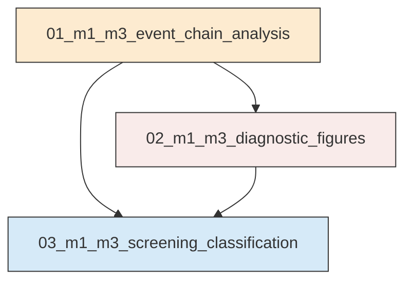
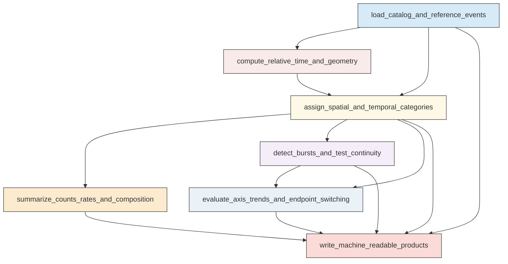
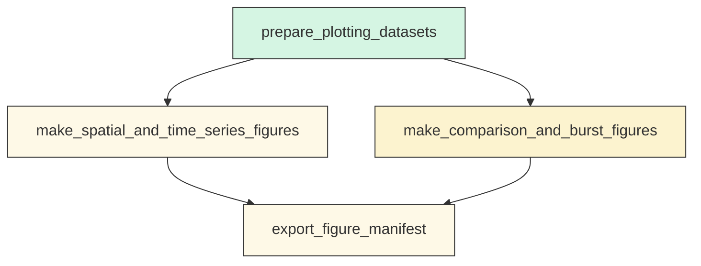
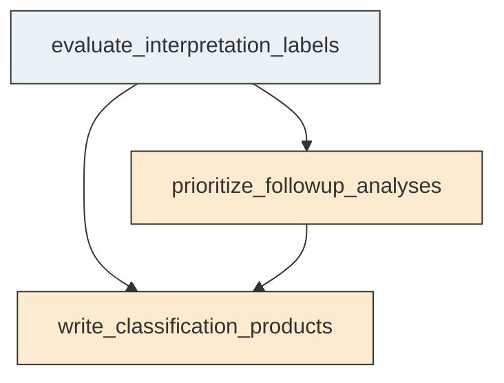

# Workflow Overview

## Top-Level Task Dependencies

**Description:**
- `01_m1_m3_event_chain_analysis`: Build the unified M1-M3 event-chain analysis table and all core catalog-level summaries for raw and M2-aware screening.
- `02_m1_m3_diagnostic_figures`: Generate the compact diagnostic figure suite for fixed-window behavior, burst structure, spatial organization, and raw versus M2-aware comparisons.
- `03_m1_m3_screening_classification`: Convert the catalog summaries into a final non-causal screening classification and follow-up priority tables.

## Subtask Dependencies

#### 01_m1_m3_event_chain_analysis
**Usage**: Build the unified M1-M3 event-chain analysis table and all core catalog-level summaries for raw and M2-aware screening.

**Description:**
- `load_catalog_and_reference_events`: Load the relocated catalog and authoritative M1, M2, and M3 reference events.
- `compute_relative_time_and_geometry`: Compute event-level relative-time, endpoint-distance, and M1-M3 axis geometry metrics.
- `assign_spatial_and_temporal_categories`: Assign local-union, endpoint, corridor, M2-aware, and fixed-window categories to each event.
- `summarize_counts_rates_and_composition`: Summarize magnitude-threshold counts, rates, phase contributions, and spatial composition by fixed window.
- `detect_bursts_and_test_continuity`: Detect major bursts and quantify whether middle-phase activity is sustained, sparse, or burst-separated.
- `evaluate_axis_trends_and_endpoint_switching`: Compare full-interval and window-separated along-axis behavior to distinguish migration-like patterns from endpoint switching.
- `write_machine_readable_products`: Write the event-chain table, reference table, summaries, and follow-up target list for downstream plotting and reporting.

#### 02_m1_m3_diagnostic_figures
**Usage**: Generate the compact diagnostic figure suite for fixed-window behavior, burst structure, spatial organization, and raw versus M2-aware comparisons.

**Description:**
- `prepare_plotting_datasets`: Prepare filtered plotting tables and annotations from the event-chain outputs.
- `make_spatial_and_time_series_figures`: Create the map and time-series figures used to assess endpoint, corridor, and temporal structure.
- `make_comparison_and_burst_figures`: Create cumulative-count, burst-timeline, pre-M3 comparison, and window-composition figures.
- `export_figure_manifest`: Save figure metadata and output references for report synthesis.

#### 03_m1_m3_screening_classification
**Usage**: Convert the catalog summaries into a final non-causal screening classification and follow-up priority tables.

**Description:**
- `evaluate_interpretation_labels`: Assign evidence for the requested event-chain interpretation labels from the fixed-window and sensitivity results.
- `prioritize_followup_analyses`: Identify which deeper screening analyses are justified by the catalog-level evidence.
- `write_classification_products`: Save the final classification summary and follow-up priority outputs for reporting.